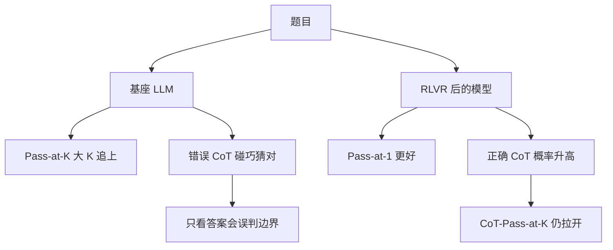

# RLVR：答案对错当奖励，为什么还会把正确推理抬起来

<!-- release-date: 2025-06-17 -->

**本文依据**：`Reinforcement Learning with Verifiable Rewards Implicitly Incentivizes Correct Reasoning in Base LLMs`，arXiv **2506.14245v2**（[cs.AI] 2 Oct 2025），31 页，封面印 **Preprint**。作者 Xumeng Wen*、Zihan Liu*、Shun Zheng*‡、Shengyu Ye、Zhirong Wu、Yang Wang、Zhijian Xu、Xiao Liang、Junjie Li、Ziming Miao、Jiang Bian、Mao Yang；第一单位 **Microsoft Research Asia**，另有 Peking University、The Chinese University of Hong Kong、University of California, Los Angeles。通讯 shun.zheng@microsoft.com。原件首次公开日取 arXiv **v1** 提交日 **2025-06-17**；解读依据本地已核的 **v2**（31 页）。文中数字都标 PDF 页码；标「外部补充」的段落不来自本文。

## 一句话

Yue 等人用 Pass@K 说：基座模型里已经有全部正确推理路径，RLVR 只是把采样效率抬高、还可能把推理容量压窄。这篇用 **CoT-Pass@K**（答案对且中间推理也对）把数学上的「碰巧猜对」拆开，并给了一个 **Logic Prior** 上的 GRPO 论证：奖励只看答案对错时，梯度仍然会抬正确 CoT、压错误 CoT。DAPO 复现里，这种激励从训练很早就出现，并能泛化到没见过的题；400 步之后答案几乎全对时，正确 CoT 的中位数大约还只有 **0.7**（PDF p.8）。

## 读前三分钟

- **可验证奖励强化学习（Reinforcement Learning with Verifiable Rewards，RLVR）**：策略是 LLM，动作序列是一条思维链（Chain-of-Thought，CoT），奖励来自确定性校验器——数学看抽出的答案，代码看能不能跑过测试（PDF p.1）。
- **Pass@K**：同一题采 $K$ 条回答，至少一条最终答案对就算过。$K$ 很大时，基座模型常能追上甚至超过 RLVR 后的模型（PDF p.1–2）。
- **CoT-Pass@K**：答案对还不够，中间推理也必须被判为正确，才算过（PDF p.2、p.4）。
- **GRPO（Group Relative Policy Optimization）**：一组 $G$ 条回答，用组内均值、标准差把奖励标准化成优势，再做策略梯度（PDF p.6 式 2–3）。DeepSeek-R1 用过这条算法；本文理论也写在 GRPO 上。
- **Logic Prior（逻辑先验）**：预训练之后，正确 CoT 比错误 CoT 更容易推出正确答案。文中写成 $\alpha>\beta$（PDF p.6 式 4）。

## 一、矛盾：Pass@1 涨了，Pass@K 却被基座追上

DeepSeek-R1 用 GRPO 做出长 CoT 之后，开源社区把这件事收成 RLVR：LLM 当策略，CoT 当动作，校验器只打答案对错（PDF p.1）。承诺是「自由探索、从经验里学」。

反例来得很快。Shao 等人做 GRPO 时已经看到：有的后 RLVR 模型 **Pass@1** 更好，**Pass@K** 却不比基座强。Yue 等人（2025）在更多开源权重上系统做这件事：基座的 Pass@K 随 $K$ 涨得更快；中等偏大的 $K$ 上，基座追上甚至超过推理模型。他们给出一个很大胆的假说（PDF p.1–2）：

> 所有正确推理路径已经在基座里；RLVR 只是改采样效率，代价是整体推理容量变窄。

图 1 上半幅就是这条假说：线宽是采样概率，绿是对、红是错；RLVR 之后的路径如果都能在基座里找到，就只是把已有路径的概率拧一拧（PDF p.2）。

这条假说有人跟着走，也有人对着打。Liu 等人看到新推理模式，但仍承认 Pass@K 量出来的容量在掉；Chen 等人（AceReason）在竞赛代码上看到持续的 Pass@K 增益，数学上却没有；Shojaee 等人在数学上看到类似曲线，高复杂度谜题上不一样（PDF p.2–3）。作者把问题收成一句：到底把 Yue 的假当 RLVR 的根本上限，还是相信那些打脸的新实验（PDF p.2）。

本文的立场很硬：**RLVR 可以真正扩推理边界**，不只是采样效率。但要看见这件事，训练配方、没有污染的难题、以及度量本身都得对；否则你只会看见「采样效率涨了、容量没变」（PDF p.4）。

上图是机制示意，根据 PDF p.2 图 1 重画，不是实测曲线。

## 二、数学：Pass@K 会骗人，CoT-Pass@K 把猜对拆开

对象是公开的 **DAPO-Qwen-32B**（Yu 等）：从 **Qwen2.5-32B** 出发，用约 **17k** 道数学题复现 R1-Zero 风格训练（PDF p.4）。

数学难处：CoT 又长又散，没法程序化逐步验。作者用 **DeepSeek-R1-0528-Qwen3-8B** 当「LLM 当 CoT 裁判」，每条 CoT 验多次，再三种聚合（PDF p.4–5、p.14）：

| 策略 | 过关条件 | 作者说它压什么 |
|---|---|---|
| all-correct | 每一次都判对 | 假阳性，随次数指数掉 $p_{\mathrm{fp}}^n$ |
| majority-correct | 多数票 | 中间带 |
| any-correct | 至少一次判对 | 假阴性，随次数指数掉 $p_{\mathrm{fn}}^n$ |

本文取 **$n=3$**（PDF p.14）。图 2 下排阴影带就是这三种策略的区间（PDF p.4）。Pass@K 很小、CoT-Pass@K 为零的个案，作者又手查过，附录 A.8 给了裁判抓住的概念错、逻辑错、漏步（PDF p.5、p.21 起）。

图 2 上排（Pass@K）确实复现 Yue：基座随 $K$ 很快追上甚至超过 DAPO。下排（CoT-Pass@K）在 **AIME 2024 / AIME 2025** 上，从 $K=1$ 到 **1024**，DAPO 一直明显高出；AIME 2025 更刺眼，作者怀疑它完全在基座训练截止之后发布，无意污染更少（PDF p.5）。

另外几套则不能当「RLVR 没用」：

- **MATH-500、AMC23**：基座多试几次就能做对。可能题太简单，也可能进过预训练，作者说没有 Qwen2.5-32B 训练数据就分不清（PDF p.5）。
- **Minerva**：后 RLVR 没有提升。DAPO 训练题是整数答案的数学题，Minerva 有大量物理和自由格式答案，作者归因于训–测域不匹配（PDF p.5）。

所以：度量错了，你会同意 Yue；度量改成「推理也要对」，数学上的边界扩展才露出来。代码侧作者认为猜对更难——要真跑代码——**Pass@K 本身就比较可信**（PDF p.5）。

## 三、代码：蒸馏模型再做 RLVR，大 $K$ 仍能拉开

对照是 **AceReason-Nemotron-7B**（Chen 等，2025b）对它的前 RLVR 底 **DeepSeek-R1-Distill-Qwen-7B**。六个 LiveCodeBench 版本上，多数版本 AceReason 的 Pass@K 都清楚高于蒸馏底，哪怕底已经很能推理（PDF p.5 图 3）。作者把 Chen 的实验扩到更多版本，并加了另一条从蒸馏模型出发、配方公开的 **Skywork-OR1**（He 等）（PDF p.3–6）。

附录 A.4：Skywork-OR1-7B 对同一蒸馏底，LiveCodeBench-v6 上 Pass@1 和一直到 **$K=1024$** 的 Pass@K 都有明显提升；**只有中、难子集**在大 $K$ 上把两模型分开，简单子集分不开（PDF p.15 图 8）。作者用这件事强调：评 RLVR 要选难、尽量活的基准。

同一附录里，数学上把 RLVR 接到蒸馏模型（Skywork-OR1-Math-7B）时，即使换成 CoT-Pass@K，大 $K$ 也**没有**和蒸馏底拉开。作者怀疑：蒸馏模型在数学上已经吃掉了「只靠答案对错」还能再教的大部分推理，增益主要落在 Pass@1；代码上 RLVR 还能逼模型去拟合真实执行反馈，边界才继续往外推（PDF p.15–16 图 9）。

这是本文自己的对照，不是 Criticize-RLVR 那篇的结论。

## 四、理论：奖励只看答案，梯度为什么还抬正确 CoT

传统 RL（例如围棋）环境合法，轨迹高奖励就够。预训练 LLM 不一样：它会先写出一堆 CoT，再吐答案；答案格式简单时，**错误推理也能蒙对**（PDF p.6）。

记号（PDF p.6 式 1–3）：提示 $q$，从 $\pi_\theta$ 采 $G$ 条回答 $Y=\{y_i\}$。$c_i$ 是 CoT，$a_i$ 是最终答案。

$$
I_{\mathrm{CoT}}(c_i)=\mathbf{1}[c_i\text{ 逻辑充分且导向真值}],\quad
I_{\mathrm{Ans}}(a_i)=\mathbf{1}[a_i\text{ 对}],\quad
R(y_i)=I_{\mathrm{Ans}}(a_i)
$$

奖励是二元的、**只由答案决定**。GRPO 优势：

$$
\hat A(y_i)=\frac{R(y_i)-\mu_Y}{\sigma_Y},\quad
\mu_Y=\frac1G\sum_j R(y_j),\quad
\sigma_Y=\sqrt{\frac1G\sum_j(R(y_j)-\mu_Y)^2}
$$

策略梯度（不失一般性写成政策梯度）：

$$
\nabla_\theta J(\theta)\approx\frac1G\sum_{i=1}^G \hat A(y_i)\,\nabla_\theta\log\pi_\theta(y_i\mid q)
$$

**Logic Prior**（PDF p.6 式 4）：

$$
\alpha=P(I_{\mathrm{Ans}}=1\mid I_{\mathrm{CoT}}=1)
>\beta=P(I_{\mathrm{Ans}}=1\mid I_{\mathrm{CoT}}=0)
$$

还要求组可学（$\sigma_Y>0$）、$G$ 够大。

**定理 1**（PDF p.6 式 5）：在上述假设下，

$$
\mathbb{E}[\hat A(y_i)\mid I_{\mathrm{CoT}}=1]>0,\qquad
\mathbb{E}[\hat A(y_i)\mid I_{\mathrm{CoT}}=0]<0
$$

于是下一轮正确 CoT 的概率 $p_\theta^c$ **单调上升**。附录证明大意：组均值 $\mu=p_c\alpha+(1-p_c)\beta$，正确 / 错误 CoT 的期望优势分别趋向 $(1-p_c)(\alpha-\beta)/\sigma$ 和 $-p_c(\alpha-\beta)/\sigma$；$\alpha>\beta$ 就把符号钉死（PDF p.16–17）。

人话：校验器从来没看过中间步骤。但预训练已经让「走得对的链」比「走歪的链」更容易撞上对的答案。组内一标准化，走得对的链平均优势为正，梯度就在抬它们。

理想预训练接近 $\alpha\to 1$、$\beta\to 0$ 时，优势大约是 $\sqrt{(1-p_c)/p_c}$ 对 $-\sqrt{p_c/(1-p_c)}$（PDF p.17）。作者说这时人的工作主要是准备多样问答，让 RLVR 自己抬推理。不理想时，往往要先微调，把输出拉到合适的推理分布，再上 RLVR（PDF p.17）。

失败模式也写死了：Logic Prior 不必永远成立。预训练里的偏见、致命知识错误，可能藏在「最后答案碰巧对」的 CoT 里，会被一起加强。作者**怀疑**这就是 R1-Zero 可读性差、中英混杂的根（PDF p.7）。这是怀疑，不是另文的实验结论。

附录还用 $(p_c,\alpha,\beta)$ 解释 DeepSeek-R1 两条观察（PDF p.18）：V3 也保证不了理想 $\alpha,\beta$，所以需要冷启动纠逻辑偏差；32B 稠密模型上纯 R1-Zero 更糟，蒸馏能直接教正确 CoT。

## 五、训练动力学：很早就在抬正确推理，400 步后仍剩脏 CoT

作者在 **32 块 AMD MI300X**、VERL 上按 DAPO 公开配方复现，跑了 **两周以上**。没有复现 Yu 等报告的 Pass@1 **超过 50%**，自己到大约 **44%**，与第三方复现同一量级（PDF p.18）。每个训练 step 对应一轮 PPO 风格优化，DAPO 脚本里含 **16 次**梯度更新（PDF p.18）。CoT 对错用的是第三节同一套裁判。

每个提示采 $G$ 条。$C=\sum I_{\mathrm{Ans}}$，$D=\sum I_{\mathrm{CoT}}I_{\mathrm{Ans}}$。沿 Chen 等（2021）写 Pass@K。再定义（PDF p.7）：

$$
P(\mathrm{CA})^{(q)}=\frac{C}{G},\qquad
P(\mathrm{CC}\mid\mathrm{CA})^{(q)}=\frac{D}{C}
$$

前者就是这道题的 Pass@1；后者是「答案已经对的那些里，推理也对的比例」。

图 4：多数训练题被「训满」后，$P(\mathrm{CA})$ 几乎到 1，同时 $P(\mathrm{CC}\mid\mathrm{CA})$ 也在升——奖励只优化答案，正确推理仍被暗中抬起来，和定理 1 对齐（PDF p.7–8）。

图 5：AIME 2024 / 2025 上，从 step 30、60、210 到训完，Pass@K 和 CoT-Pass@K 都从很早开始泛化。CoT-Pass@K 上，推理边界也是一开始就在扩。另一种读法：模型越来越会写出 DeepSeek-R1-0528-Qwen3-8B **挑不出错**的链；而训练里从来没有对 CoT 对错的显式监督（PDF p.8）。

附录图 10：easy / hard 训练题（用 Qwen2.5-32B 对 17k 题各采 64 条，至少一条答案对的标 easy）上，$P(\mathrm{CC}\mid\mathrm{CA})$ 从很早的 step 就开始升；AIME 2024 的 CoT-Pass@K 在前 **20** 个训练 step 就有可观增益（PDF p.18–19）。

**DAPO / 32B 上 R1-Zero 的限制**（PDF p.8）：约 **400** step 之后，多数已训满的题 $P(\mathrm{CA})\to 1.0$，整组全对就算不出有效 GRPO 优势，这题不再可学；但 $P(\mathrm{CC}\mid\mathrm{CA})$ 的**中位数大约 0.7**，仍有一批脏推理。作者认为单靠答案奖励，这些意外学到的行为未必还能洗掉。附录还写：180 step 后 easy 题的 $P(\mathrm{CA})$ 会严重歪向 1.0，看起来「全会了」，看条件正确率才知道大量答案对的回答推理仍坏——他们怀疑这是 Qwen2.5-32B 上 R1-Zero 难做强的原因之一（PDF p.18）。

## 六、用 SFT 当探针：RLVR 之后的 CoT 真的更值钱

裁判是在抓硬伤。作者再用 **SFT** 当质量探针：同一批 DAPO 训练题、同一个 Qwen2.5-32B 起点，只换 CoT 数据；若训完后在 AIME 2024 / 2025 上泛化更好，就认为那批 CoT 更好（PDF p.8–9 图 6）。

图 6(a)：随 RLVR 推进，用各阶段 CoT 去做 SFT，测试 Pass@1（Avg.@32）稳步升；最终用 DAPO CoT 做 SFT，Pass@1 能**对齐** DAPO-Qwen-32B。作者的读法：题够多、再拿后 RLVR 模型的 CoT，**单靠 SFT 就能几乎复制**那个很贵的 RLVR 模型的 Pass@1（PDF p.8–9）。更怪的一句：不管这批 CoT 能不能被裁判挑出错，后期「标成错误」的 CoT，用 Pass@1 当质量代理也整体变好了——后期错链也没早期那么糟（PDF p.9）。

图 6(b)：SFT[DAPO CoTs] 的 Pass@K / CoT-Pass@K 几乎贴上 DAPO-Qwen-32B；SFT[Base CoTs]（只喂基座里答案对的链）开始抑制乱猜，作者把它看成一轮 off-policy 的 RLVR。结论：被 RLVR 激励出来的 CoT **不能直接从基座采出来**（PDF p.9）。

## 七、本文自己写下的限制（不是别篇的限制）

正文 Limitations（PDF p.9）：

1. **裁判是 LLM**，海量路径请不起人；假阳 / 假阴靠 $n=3$ 和三种投票压，不是消掉。
2. **定理只解释优化过程，不保证泛化**；泛化是实验里看到的。
3. DAPO 复现没到原论文 50%+ Pass@1，停在约 44%（PDF p.18）。
4. 32B + 只看答案时，训满之后仍有中位约 0.7 的条件正确率，脏 CoT 洗不干净（PDF p.8）。
5. 蒸馏模型 + 数学：大 $K$ 的 CoT-Pass@K 可能不再扩边界（PDF p.15–16）。
6. Minerva 这类域外、MATH-500 / AMC23 这类偏简单或可能污染的集，Pass@K 故事会和 AIME 2025 完全不同（PDF p.5）。

附录 A.7 的呼吁（PDF p.18–20）：要活的、难的基准；要更轻、更稳的 CoT 校验器（并点到过程奖励那条文献）；在预训练 token 见顶之后把 RLVR 规模化当成和预训练同等量级的杠杆；新算法应更直接激励正确路径、减轻基座逻辑偏差。这些是展望，不是已完成的方法。

## 可迁移启发

1. **评 RLVR 不要只报 Pass@1，也不要只报答案侧 Pass@K。** 数学答案短、好猜时，基座大 $K$ 追上几乎是预期现象；要看推理边界，至少加一条「中间步骤也要对」的度量（PDF p.4–5）。
2. **奖励可以很粗，先验必须在。** $\alpha>\beta$ 不成立时，定理不保护你，错误但蒙对的链会被加强（PDF p.6–7）。
3. **看训练曲线时把 $P(\mathrm{CA})$ 和 $P(\mathrm{CC}\mid\mathrm{CA})$ 拆开。** 前者到 1 只说明这题从 GRPO 里毕业了，不说明推理干净；中位 0.7 是本文给的具体警告（PDF p.8）。
4. **难题、未污染、能执行的任务，更容易看见边界扩展。** AIME 2025、LiveCodeBench 中难子集是正例；Minerva、简单数学、蒸馏后再做数学是反例（PDF p.5、p.15–16）。
5. **后 RLVR 的 CoT 本身是资产。** 题集固定时，SFT 去学这些链，Pass@1 能贴近昂贵的 RLVR 模型（PDF p.8–9）。这依赖「已经有一个训好的 RLVR 老师」，不是说可以跳过 RL。

对自己的项目：如果你在做「答案可自动判」的 RL，先问两句——基座有没有 Logic Prior？你的 Pass@K 是不是把猜对算进去了？曲线上答案准确率顶满之后，还要不要另开过程信号，本文没有给出新算法，只把这个问题钉在 0.7 那个中位数上。

## 关键词回看

- **RLVR**：可验证奖励下的强化学习；本文语境里奖励 = 答案对错或代码能否执行。
- **Yue 假说**：正确路径都在基座里，RLVR 只改采样效率、可能压容量。
- **CoT-Pass@K**：答案与 CoT 同时正确才算过；$K$ 收到 1024。
- **LLM-as-a-CoT-Judge**：DeepSeek-R1-0528-Qwen3-8B，$n=3$，any / all / majority。
- **Logic Prior**：$\alpha>\beta$；GRPO 优势因此对正确 CoT 为正。
- **$P(\mathrm{CA})$ / $P(\mathrm{CC}\mid\mathrm{CA})$**：答案命中率 vs 答对条件下的推理命中率。
- **DAPO-Qwen-32B**：17k 数学、Qwen2.5-32B 上的开源 R1-Zero 配方；作者复现约 44% Pass@1。

## 参考资料

- Xumeng Wen, Zihan Liu, Shun Zheng, et al. *Reinforcement Learning with Verifiable Rewards Implicitly Incentivizes Correct Reasoning in Base LLMs*. arXiv:2506.14245v2, 2025. https://arxiv.org/abs/2506.14245
- Yang Yue et al. *Does Reinforcement Learning Really Incentivize Reasoning Capacity in LLMs Beyond the Base Model?* arXiv:2504.13837（本文要回应的 Pass@K 假说）
- Qiying Yu et al. *DAPO: An Open-Source LLM Reinforcement Learning System at Scale*. arXiv:2503.14476（本文复现的训练配方）
- Daya Guo et al. *DeepSeek-R1*. arXiv:2501.12948（GRPO / R1-Zero 背景）
- Zhihong Shao et al. *DeepSeekMath*. arXiv:2402.03300（GRPO）
- Yang Chen et al. *AceReason-Nemotron*. arXiv:2505.16400（代码侧 Pass@K 对照）
- Jujie He et al. *Skywork Open Reasoner 1*. arXiv:2505.22312（蒸馏后再 RLVR 的对照）
