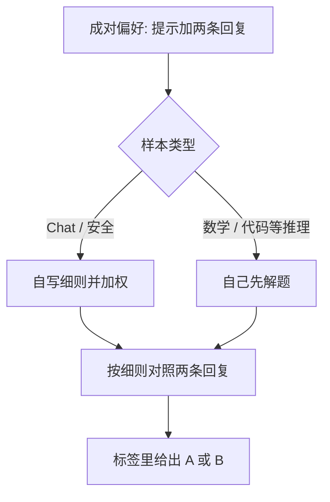

# RM-R1：把奖励建模写成一次可检验的推理

<!-- release-date: 2025-05-05 -->

**本文依据**：`RM-R1: Reward Modeling as Reasoning`，arXiv 2505.02387**v4**（[cs.CL] 6 Mar 2026），30 页。封面印 **Published as a conference paper at ICLR 2026**。作者 Xiusi Chen*、Gaotang Li*、Ziqi Wang*、Bowen Jin、Cheng Qian、Yu Wang、Hongru Wang、Yu Zhang、Denghui Zhang、Tong Zhang、Hanghang Tong、Heng Ji；第一单位 University of Illinois at Urbana-Champaign（另有 UC San Diego、Texas A&M、Stevens）。代码 https://github.com/RM-R1-UIUC/RM-R1。原件首次公开日取 arXiv **v1** 提交日 **2025-05-05**；解读依据本地已核的 v4。文中数字都标 PDF 页码；标「外部补充」的段落不来自本文。

## 一句话

标量奖励模型（ScalarRM）打一个分数，却不解释；普通生成式奖励模型（GenRM）会写评语，但推理常常浅、对难偏好帮不上忙。RM-R1 把奖励建模当成推理任务：先把样本分成 **Chat** 或 **Reasoning**，Chat 侧自写一套样本级评分细则（chain-of-rubrics，CoR），推理侧先自己解题再对照两条候选。训练是两段：**蒸馏高质量推理链**，再 **用可验证奖励做强化学习（RLVR）**。在 RewardBench、RM-Bench、RMB 三个基准上，平均超过更大的开源标量模型（如 INF-ORM-Llama3.1-70B）和闭源模型（如 GPT-4o），摘要写最多 **+4.9%**（PDF p.1）。32B 系列平均到 **81.2 / 81.5**（PDF p.6 表 1）。

## 一、矛盾：代理人类偏好时，分数和空评语都不够

RLHF 里，奖励模型是人类评估的可扩展代理（PDF p.1）。论文把已有工作收成两类（PDF p.1）：

| 路线 | 做法 | 卡在哪 |
|---|---|---|
| **ScalarRM** | 在语言模型上接序列分类头，输出一个标量 | 直接、常有效，但**不透明**，没有中间推理，难扛推理密集的偏好任务 |
| **GenRM** | 保留解码头，自由生成成对判断 | 更透明，但推理往往**表面、不可靠**，表现反而次优 |

真实打分更像阅卷：要猜评委心里的标准、在多条标准之间做权衡、还要想象后果（PDF p.1–2）。图 1 的例子是用户说「我是不是该辞职」：被选回复共情、给可行动建议；被拒回复语法通顺，却暗示「你就是不行」。现成 instruct 模型容易过拟合监督数据里的表面模式，判错；带长推理的模型会先列共情、心理安全、建设性指导等细则，再判（PDF p.2 图 1）。

中心问题因此变成一句话（PDF p.2）：

> 能不能把奖励建模写成一项推理任务？

论文把这类模型叫 **Reasoning Reward Models（ReasRM）**：和普通 GenRM 的差别，是评判时要走**长且连贯**的推理链。他们还观察到两件反直觉的事（PDF p.2）：

- **只做 RLVR** 并不能把奖励建模的推理潜力挖满；
- **朴素 CoT** 分不清题型，抓不到细粒度差异。

于是训练管线变成：先蒸馏，再 RLVR。对已经蒸馏过的推理模型（如 DeepSeek-R1-Distill-Qwen），则**不再蒸馏，直接 RLVR**。产出是 7B 到 32B 的 RM-R1 家族（PDF p.2）。

（机制示意，根据 PDF p.4 图 2、图 3 的 CoR 流程重画，不是实测曲线。）

## 二、任务定义：生成一整段判断，最后抽出偏好

偏好数据写成（PDF p.3 式 1）

$$
D=\{(x^{(i)}, y_a^{(i)}, y_b^{(i)}, l^{(i)})\}_{i=1}^{N}
$$

$x$ 是提示，$y_a$、$y_b$ 是两条回复，$l\in\{a,b\}$ 是真偏好。生成式奖励模型 $r_\theta$ 产出文本判断 $j=(j_1,\ldots,j_T)$（PDF p.3 式 2）：

$$
r_\theta(j\mid x,y_a,y_b)=\prod_{t=1}^{T} r_\theta(j_t\mid x,y_a,y_b,j_{<t})
$$

$j$ 里含预测标签 $\hat{l}$。目标是最大化选对的期望指示函数（PDF p.4 式 3）。

## 三、第一阶段：蒸馏，把「会聊天」变成「会当阅卷人」

现成 instruct 模型（如 Qwen-2.5-14B-Instruct）用提示就能当 GenRM，但没有奖励建模推理轨迹时，判断不稳定（PDF p.4）。做法是从 $D$ 抽子集 $D_{\mathrm{sub}}$，让 oracle（文中写 o3 或 Claude-3-7-sonnet）生成结构化推理 $r^{(i)}$，再拼上真标签（PDF p.4 式 4–5）：

$$
y_{\mathrm{trace}}^{(i)}=r^{(i)}\oplus l^{(i)},\qquad D_{\mathrm{distill}}=\{(x^{(i)}, y_{\mathrm{trace}}^{(i)})\}_{i=1}^{M}
$$

目标是最小化负对数似然（PDF p.4 式 6）。附录 D 把数据怎么造写死了（PDF p.17）：

1. 同一套提示先问 **Claude-3.7-Sonnet**；
2. 大约 **25%** 轨迹是错的，主要出在更难的 chat；
3. 把原提示、错误轨迹和正确最终答案交给 **OpenAI-O3** 改写；
4. 顺序故意是 Claude 再 O3：作者观察 Claude 更稳、更顾安全，O3 更擅长难题但容易把有用性压过安全；
5. 蒸馏大约用训练数据的 **12%**（略少于 **9K** 条），然后再 RL。正文后文写 Instruct 系列蒸馏只用 **8.7K**（PDF p.7、p.19）。

蒸馏能注入推理格式，但也容易过拟合轨迹里的固定套路、伤害批判性思考（PDF p.3–4）。所以第二段必须是 RL。

## 四、第二阶段：把奖励模型当成策略，用对错当奖励

把 $r_\theta(j\mid x,y_a,y_b)$ 直接当策略（PDF p.4 式 7）：

$$
\max_{r_\theta}\ \mathbb{E}[R(x,j)]-\beta D_{\mathrm{KL}}(r_\theta\parallel r_{\mathrm{ref}})
$$

$r_{\mathrm{ref}}$ 是 RL 前的 checkpoint：可以是现成 LLM，也可以是蒸馏后的模型。$j$ 含推理链和最终 $\hat{l}$。优化器用 **GRPO**（来自 DeepSeekMath 那条线，本文当工具，不当主角；PDF p.4、附录 E p.17）：对同一提示采一组输出，用组内奖励的均值和标准差当基线，不再另训 value 头。

### CoR：先分型，再决定怎么阅卷

Rollout 系统提示见图 3（PDF p.5）。模型必须先把样本标成 `<type> Reasoning </type>` 或 `<type> Chat </type>`：

- **Reasoning**：数学、代码、要领域知识、多步推断、逻辑演绎；
- **Chat**：开放或事实对话、文风改写、安全、一般有用性，不需要深推理。

分型之后走两条完全不同的 rollout（PDF p.4–5）：

| 类型 | 模型必须先做什么 | 再做什么 | 结尾 |
|---|---|---|---|
| Reasoning | 自己解题，答案放进 `<solution>` | 对照自己的解，评正确性、完整性、推理质量 | `<answer>[[A]]</answer>` 或 `[[B]]` |
| Chat | 为这一题生成细则，放进 `<rubric>`，给权重，并用 `<justify>` 解释为何这样加权 | 按细则对照两条回复 | 同上 |

评语里还要求用 `<quote_A>` / `<summary_A>` 等标签引用或转述，避免空口判断。

对已经是推理模型的 DeepSeek-Distilled 系列，没有系统提示，用户提示更短：只要求最后严格输出 `<answer>[[A]]</answer>` 或 `[[B]]`（PDF p.16 图 6）。论文的意思是：这些模型已经会想，不必再教分型模板。

### 奖励几乎只看对错

规则奖励在推理训练里很强。本文进一步简化，**只保留正确性**（PDF p.5 式 8）：

$$
R(x,j\mid y_a,y_b)=\begin{cases}1 & \text{若 }\hat{l}=l\\-1 & \text{否则}\end{cases}
$$

$\hat{l}$ 从 `<answer>…</answer>` 里抽。作者试过再加格式奖励，任务表现**没有显著差异**；理由是蒸馏后的模型已经会跟指令、会套格式（PDF p.5）。冷启动消融里才会把格式奖励加回去（附录 I，PDF p.19 式 11）。

## 五、数据、训练配方、算力

三个评测（PDF p.5、附录 F p.17–18）：

- **RewardBench**：chat / chat-hard / reasoning / safety，样本数 **358 / 456 / 740 / 1431**；
- **RM-Bench**：对细微内容差和文风偏见更敏感，Chat / Safety / Math / Code 为 **129 / 441 / 529 / 228**，每条还有三档难度；作者称它是三者里**最吃推理**的；
- **RMB**：偏有用性与无害性，49+ 真实场景，支持 pairwise 和 Best-of-N，共 **25,845** 条（有用性 37 个场景、无害性 12 个）。

训练偏好数据（PDF p.5、附录 F p.18 表 5）：

- Skywork Reward Preference 80K 的**清洗子集**。`magpie_ultra` 有伪相关：被拒回复几乎都带 `<im_start>`、被选多为单轮、被拒多为多轮，约占 Skywork 的 **30%**，且覆盖数学和代码。全部丢掉。
- Code-Preference-Pairs 抽 **8K**（故意改 bug、对调对错版本做成细粒度对）；
- Math-DPO-10K **全用**。

表 5 各源规模（PDF p.18）：magpile_pro_llama3.1* 29682（推理）、offset_bias* 8504（chat，长度偏差）、helpsteer2* 7221、wildguard* 6709（安全）、magpile_pro* 2030、Code-Preference-Pairs 8000、Math-DPO-10K 10000。加总 **72,146** 条。带 * 的来自 Skywork-Reward-Preference-80K-v0.2。

实现（PDF p.19 附录 G）：

- 框架：蒸馏用 OpenRLHF 的 SFTTrainer，RL 用 VERL 做 GRPO；
- Instruct：**8.7k** 蒸馏 + **64k** RLVR；DeepSeek-Distilled：**全量数据只做 RLVR**；
- 蒸馏：batch 128、micro-batch 1、**1 个 epoch**；学习率 7B / 14B / 32B 为 $5\times10^{-6}$ / $3\times10^{-6}$ / $2\times10^{-6}$；
- RL：训练 batch 1024、mini-batch 128、FSDP；vLLM 张量并行 4、GPU 利用率上限 0.4；温度 1.0、top-p 1.0；KL 系数 $1\times10^{-3}$、clip 0.2；每提示采 **7** 条候选；
- 最大输入 **4096** token，最大回复 **8192** token；
- Instruct RL 学习率 7B / 14B / 32B：$1\times10^{-6}$ / $7\times10^{-7}$ / $5\times10^{-7}$；推理模型变体：$1\times10^{-6}$ / $1\times10^{-6}$ / $8\times10^{-7}$；
- 7B / 14B / 32B 分别用 **1 / 2 / 4** 个节点，每节点 **8 张 H100**。

## 六、主结果：三个基准平均，小模型打过大模型

表 1 是「各类最强基线」的压缩表（PDF p.6）。RMB 在表 1 里写成百分数，附录表 8 是 0–1 小数，口径一致。DeepSeek-GRM 无开源权重，数字来自其技术报告。

| 模型 | RewardBench | RM-Bench | RMB | 平均 |
|---|---:|---:|---:|---:|
| INF-ORM-Llama3.1-70B（Scalar） | 95.1 | 70.9 | 70.5 | 78.8 |
| Nemotron-4-340B-Reward | 92.0 | 69.5 | 69.9 | 77.1 |
| GPT-4o-0806（GenRM） | 86.7 | 72.5 | 73.8 | 77.7 |
| Skywork-Critic-Llama-3.1-70B | 93.3 | 71.9 | 65.5 | 76.9 |
| Self-taught-evaluator-llama3.1-70B | 90.2 | 71.4 | 67.0 | 76.2 |
| RM-R1-Qwen-Instruct-14B | 88.2 | 76.1 | 69.2 | 77.8 |
| RM-R1-DeepSeek-Distilled-Qwen-14B | 88.9 | 81.5 | 68.5 | 79.6 |
| RM-R1-Qwen-Instruct-32B | 91.4 | 79.1 | 73.0 | 81.2 |
| RM-R1-DeepSeek-Distilled-Qwen-32B | 90.9 | 83.9 | 69.8 | 81.5 |

作者强调的点（PDF p.6–7）：

- **14B Distilled** 平均已经超过 INF-ORM-70B、Nemotron-340B、GPT-4o；32B 再拉开一截。摘要里的「最多 +4.9%」没有在表 1 旁写出对照差；表内能直接读到的是 32B Distilled 平均 **81.5** 对 INF-ORM **78.8**、对 GPT-4o **77.7**。
- 过去 GenRM / 基于 critique 的方法多靠拒绝采样和 instruct 模型**无结构自生成 CoT**，推理能力不够，常打不过 ScalarRM。RM-R1 用结构化 rollout + 蒸馏 + RLVR，说明 ReasRM 这条线并不是注定更弱。
- RewardBench 上最强的标量模型**并不总能**在三个基准一起当 SOTA；更大模型有时还输给更小的。作者据此要求评估必须更全面。
- Instruct-14B 持续超过大约 **5 倍**大的 Self-taught-evaluator-70B。
- RM-Bench 上 RM-R1 最多超出最强基线 **8.7%**。32B Distilled 在该基准数学 **91.8%**、代码 **74.1%**，相对此前最好（数学约 **73%**、代码约 **63%**）拉开明显差距（PDF p.7）。附录表 7 给出 32B Distilled 的 Chat / Math / Code / Safety / Easy / Normal / Hard / Avg：**74.2 / 91.8 / 74.1 / 95.4 / 89.5 / 85.4 / 76.7 / 83.9**（PDF p.21）。
- Instruct 系列蒸馏只用 **8.7K**，对比 DeepSeek-Distilled 原文用的 **800K**（PDF p.7）。这句话是数据效率对照，不是说 RM-R1 复现了 DeepSeek-R1。

RewardBench 细表（附录表 6，PDF p.20；Instruct-32B 与消融表 2 一致）：Chat **95.3**、Chat Hard **83.1**、Safety **91.9**、Reasoning **95.2**、Overall **91.4**。同表 Distilled-32B Overall **90.9**，推理子项 **96.8** 更高。Skywork 若干行标了可能数据污染（✥），正文未展开污染细节。

RMB 上 Instruct-32B Overall **0.730**（有用性 BoN / Pairwise **0.636 / 0.791**，无害性 **0.682 / 0.809**），表 1 写成 73.0；GPT-4o-2024-05-13 是 **0.738**，这条上闭源仍略高（PDF p.22 表 8）。

## 七、消融：RL  alone 不够，分型、细则、蒸馏都要

在 Qwen-2.5-Instruct-32B、RewardBench 上（PDF p.7 表 2）：

| 设定 | Chat | Chat Hard | Safety | Reasoning | 平均 |
|---|---:|---:|---:|---:|---:|
| Instruct（原模型） | 95.8 | 74.3 | 86.8 | 86.3 | 85.8 |
| + Cold Start RL | 92.5 | 81.5 | 89.7 | 94.4 | 89.5 |
| + Rubrics | 93.0 | 82.5 | 90.8 | 94.2 | 90.1 |
| + Rubrics + 查询分型（QC） | 92.3 | 82.6 | 91.6 | 96.3 | 90.8 |
| RM-R1（再加蒸馏） | 95.3 | 83.1 | 91.9 | 95.2 | 91.4 |

结论（PDF p.7）：

- **只做冷启动 RL 不够**。难题 chat 和推理会涨，但到不了完整配方。
- **CoR** 尤其帮 chat 和 safety；**显式分型**明显抬推理（96.3）。
- **蒸馏再 RL** 在难题和安全上都最强。附录 I 解释动机：小模型单靠 RL 常常探索不出高质量 chat 细则（PDF p.20）。

冷启动的奖励是格式 0/1 加答案 0/1（PDF p.19 式 11），提示也不带分型（图 8）或只带细则不分型（图 7）。

推理训练对「只 SFT 最终答案」的对照在表 3（PDF p.8）。全数据上：Instruct+SFT 平均 **77.4**，Instruct+蒸馏再 SFT **77.8**，RM-R1 **81.2**。只在 9k 蒸馏数据上：SFT **76.6**，蒸馏 checkpoint **79.2**。同等数据量下，带中间推理的设定 consistently 更好。

附录 K 用一条引理把「为何 RL 比过滤后的 SFT 更能丢掉捷径」形式化：高奖励过滤会让训练分布里「琐碎特征 vs 稳健特征」的不一致率 $\varepsilon_{\mathrm{train}}$ **严格小于**环境不一致率 $\delta$，于是 SFT 几乎看不见捷径翻车，RL 的 on-policy rollout 会碰到（PDF p.27–28）。这是作者对消融的理论补白，不是新实验。

## 八、缩放：标量模型不涨，RM-R1 涨

InternLM2、Skywork 一类 ScalarRM 出现过 **7B/8B 打过 20B/27B**（PDF p.8）。RM-R1 在 Qwen-2.5-Instruct 的 7B / 14B / 32B 上，相对原模型的平均提升大致随规模线性变大；图 4a 还外推了 3B 和 72B 的虚线，那是拟合，不是实测（PDF p.8）。

推理时计算：固定 DeepSeek-R1-Distill-Qwen-14B，训练 rollout 上限与推理预算对齐，预算 **512 / 1024 / 2048 / 4096 / 8192** token。图 4b 显示预算越大，三基准平均越好（PDF p.8）。长链在奖励建模上不是装饰。

训练动态用 Qwen-2.5-14B-Instruct（PDF p.9 图 5）：

- **冷启动 RL**：回复长度稳步变长（模型在学「会想」），后期奖励曲线骤降，训练不稳，作者怀疑过拟合一类问题；
- **蒸馏后的热启动 RL**：一开始就更长；先学会写得更短，再慢慢拉长；奖励曲线平滑上升。

## 九、案例：细则质量决定会不会被列表骗

表 4 问镰状细胞病症状（PDF p.9–10）。Chatbot A 列了 11 条，混进「疼痛性红黄皮肤损害」「视力丧失」等并不典型的条目；Chatbot B 解释更准。冷启动 RL 把细则做成相关 40% / 全面 30% / 清晰 30%，因为 A「条目多、整齐」判 A，**错**。RM-R1 把 **准确性 40%** 放最高（医疗事实），指出 A 的不典型条目，判 B，**对**。作者把高质量、题相关细则归因于蒸馏灌进去的知识（PDF p.10）。

## 十、限制、没写的东西、开销

论文**没有**单独的 Limitations 节。能从正文和附录钉死的边界如下。

**评测与任务形态。** 全程是成对（外加 RMB 的 BoN）偏好判断，不是逐步过程奖励（PRM）。相关工作承认许多 PRM 依赖步骤级人工标签、常绑死领域（PDF p.16）；RM-R1 没有声称替代 PRM。也没有把 RM 接回 PPO/DPO 去训策略模型并报下游对齐收益——RLHF 在文中只是动机。

**RMB 并非全面第一。** Instruct-32B 平均三基准最高档之一，但 RMB Overall 0.730 仍低于表 8 的 GPT-4o 0.738（PDF p.22）。RewardBench 上 INF-ORM-70B 的 95.1 也高于 RM-R1 的 91.4（PDF p.6、p.20）。「三个基准平均赢更大模型」成立，单榜不是处处第一。

**数据与教师。** 蒸馏依赖 Claude-3.7 和 O3；约 25% 轨迹要二次纠正（PDF p.17）。Skywork 的 magpie_ultra 因伪相关被整段删除（PDF p.18）。Instruct 的 RL 是 64k 不是全量 72k。伦理声明写方法在公开基准上、不涉及人类受试者（PDF p.11）；这不能推出无偏见。

**推理成本。** 附录 J 承认长 CoT **提高推理延迟**（PDF p.21–22）。作者把效率改进视为正交贡献，并给了一个系统侧缓解：策略 rollout 与奖励计算并行，总等待取 $\max(T_1,T_2)$ 而不是相加。文中**没有**给出 RM-R1 相对 ScalarRM 的延迟倍数或美元成本。

**未来工作只点名、没做**（PDF p.10）：主动偏好采集（细则不够时再问人）；扩展到多模态 / Agent 奖励建模。

**没写的实现。** 没有公开逐步 token 级奖励如何喂给 PPO；没有与 DPO 的训练对照实验（Math-DPO-10K 只是数据源）。附录 A 声明 LLM 未参与到需要署名的程度（PDF p.16）。

## 十一、可迁移的几条

1. **奖励模型也可以先分型再打分。** Chat 用样本级细则，推理用「自己先解再对照」。混用一种 CoT 会糊。
2. **蒸馏解决探索，RL 解决捷径。** 小模型冷启动 RL 学不会好细则；只蒸馏又过拟合表面。表 2、表 3、图 5 把这条钉死。
3. **可验证奖励可以极简。** 蒸馏之后，对错 $\pm 1$ 就够；格式奖励不是必须。
4. **训练数据要查伪相关。** 一个特殊 token 就能让「被拒」可被捷径预测。清洗比堆规模先发生。
5. **ScalarRM 的缩放故事不能直接抄。** 对 ReasRM，模型和推理预算都还有收益；评估不要只看 RewardBench。
6. **当阅卷人时，细则权重就是价值观。** 案例里把准确性放 40%，才不会被更长的错误列表骗。

## 关键词回看

- **ScalarRM / GenRM / ReasRM**：分数头、自由生成判断、带长推理的生成判断。
- **Chain-of-Rubrics（CoR）**：先分 Chat/Reasoning，再写细则或自解，最后给 A/B。
- **RLVR**：用可验证的对错信号做 RL；本文奖励是 $\pm 1$。
- **GRPO**：组内相对优势，不另训 critic。
- **热启动 vs 冷启动**：蒸馏后再 RL，长度和奖励都更稳。
