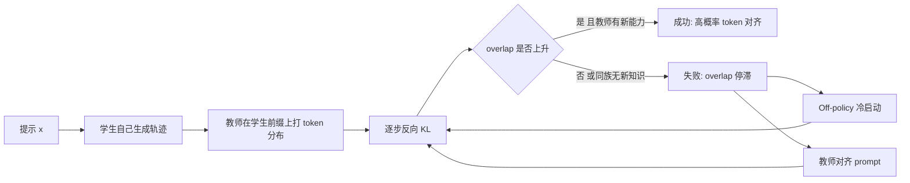

# Rethinking OPD：强教师不等于可学，on-policy 蒸馏成败看思维模式

<!-- release-date: 2026-04-14 -->

**本文依据**：`Rethinking On-Policy Distillation of Large Language Models: Phenomenology, Mechanism, and Recipe`，arXiv **2604.13016v2**（[cs.LG] 15 Apr 2026），30 页。作者 Yaxuan Li*1,2、Yuxin Zuo*†1、Bingxiang He*†1、Jinqian Zhang1、Chaojun Xiao‡1、Cheng Qian3、Tianyu Yu1、Huan-ang Gao1、Wenkai Yang4、Zhiyuan Liu‡1、Ning Ding‡1；1 Tsinghua University，2 ShanghaiTech University，3 University of Illinois Urbana-Champaign，4 Renmin University of China。代码 https://github.com/thunlp/OPD。原件首次公开日取 arXiv **v1** 提交日 **2026-04-14**（Submitted on 14 Apr 2026）；解读依据本地已核的 **v2**（30 页，页眉 2026-04-15）。文中数字都标 PDF 页码；标「外部补充」的段落不来自本文。MiniLLM / GOPD / On-Policy Self-Distillation 只作对照，不展开成专篇。

## 一句话

On-policy 蒸馏（On-Policy Distillation，OPD）不是「教师越强、学生越好」。成败由两件事一起管：**师生思维模式要兼容**；即便分数更高、模式也接近，教师还得带上学生训练时没见过的能力。同族 1.5B 与 7B 从学生访问过的状态看，目标分布可以几乎一样；失败跑的 overlap token 从一开始就卡住。作者给出两条抢救办法：off-policy 冷启动、对齐教师的 prompt。密监督不是免费午餐，轨迹一长，token 奖励会从后缀往前崩。

## 读前最小地图

- **Off-policy 蒸馏**：学生去拟合教师已经写好的序列。训练时看见的前缀是教师的，推理时前缀是自己的，误差会沿生成链累积（exposure bias，PDF p.2–3、p.18）。
- **On-policy 蒸馏（OPD）**：学生自己 rollout，教师只在**学生真正走到的前缀**上给每个 token 的 log-prob，当稠密奖励。目标通常是序列级 **反向 KL**（reverse KL）：学生去贴教师的峰，而不是把质量摊到教师认为不像的地方（PDF p.3 式 1–2）。
- **Overlap token**：某一步上，学生 top-$k$ 与教师 top-$k$ 的交集。成功 OPD 里这批 token 扛着 **97%–99%** 的概率质量（PDF p.1、p.9、p.24 图 18）。
- **Gap recovery rate（师生差距回收率）**：$\bigl(\mathrm{Acc}_{\text{after OPD}}-\mathrm{Acc}_{\text{before}}\bigr)/\bigl(\mathrm{Acc}_{\text{teacher}}-\mathrm{Acc}_{\text{before}}\bigr)$。绝对分数好看，不等于把教师多出来的那截真正学走（PDF p.7）。

工业上 Qwen3、MiMo、GLM-5 都把 OPD 写进后训练；Thinking Machines Lab 用远少于 RL 的算力复现了 Qwen3 配方（PDF p.1–2）。论文要回答的不是「OPD 能不能涨分」，而是：**什么时候涨、token 上怎么涨、失败了怎么救、密监督付什么账。**

上图是机制示意，根据 PDF p.2 总览与 §3–§5 重画，不是实测时间线。

## 一、矛盾：更强的教师可以完全教不动

Off-policy 蒸馏吃的是曝光偏差：学生在教师轨迹上练，自己生成时一步错就离训练分布越来越远（PDF p.2）。OPD 把监督搬到学生自己的状态上，看起来像免费的稠密奖励。

作者观察到一个刺眼的失败：**更强的教师可以完全教不动学生，更弱、但模式更近的教师反而能教**（PDF p.2）。很少有人系统问：教师的 token 信号凭什么把学生分布推到想去的方向，又在什么条件下推不动。

全文按三截走（PDF p.2）：

1. **现象（§3）**：思维模式一致；高分 ≠ 新知识。
2. **机制（§4）**：学生访问过的状态上，高概率 token 逐步对齐；只优化 overlap 就够。
3. **配方（§5）**：off-policy 冷启动、教师对齐 prompt。最后 §6 讲密监督的代价。

## 二、OPD 在算什么

记号：提示 $x$，回复 $y$，前缀 $y_{<t}$。学生 $\pi_\theta$，教师 $\pi_T$。学生采样 $\hat y\sim\pi_\theta(\cdot\mid x)$，每一步两个下一 token 分布 $p_t=\pi_\theta(\cdot\mid x,\hat y_{<t})$、$q_t=\pi_T(\cdot\mid x,\hat y_{<t})$（PDF p.3）。

序列级反向 KL 可以精确拆成逐步 KL 之和（PDF p.3 式 2）：

$$
\mathcal{L}_{\mathrm{OPD}}(\theta)=\mathbb{E}_{x,\hat y\sim\pi_\theta}\sum_{t=1}^{T} D_{\mathrm{KL}}(p_t\parallel q_t)
$$

实现上常见三种粒度（PDF p.3–4）：

| 变体 | 监督什么 | 要点 |
|---|---|---|
| Sampled-token | 只看学生采到的那一个 token | $\ell_t=\log p_t(\hat y_t)-\log q_t(\hat y_t)$，是逐步反向 KL 的无偏单样本估计 |
| Full-vocabulary | 整词表 KL | 梯度最密，显存 $O(BTM)$ |
| Top-$k$ | 学生概率最高的 $k$ 个 token 上再归一化再 KL | 近似全词表，但省教师查询，盯住学生的高峰区 |

默认实验是 **Student Top-$k$，$k=16$**（PDF p.23 表 2）。

训练中盯三条动力学（PDF p.4–5 式 6–8）：

- **Overlap ratio** $M_{\mathrm{overlap}}=\mathbb{E}_t\bigl|S_t^{(p)}\cap S_t^{(q)}\bigr|/k$。接近 1 表示学生已经走进教师的支撑。
- **Overlap-token advantage**：在交集上重归一化后，$A_t(v)=\bar p_t(v)\bigl(\log\bar q_t(v)-\log\bar p_t(v)\bigr)$。接近 0 是对齐好；大负值表示学生在交集里过度自信。
- **熵差** $\Delta H_t=\lvert H(q_t)-H(p_t)\rvert$。收敛到 0 表示学生在自己轨迹上匹配了教师的不确定度。

## 三、现象一：思维模式不兼容，后期 overlap 追上了也补不回

学生固定 **Qwen3-1.7B-Base**。两个教师：Qwen3-4B（Non-thinking）与 **Qwen3-4B-Base-GRPO**（对 Qwen3-4B-Base 做 zero-RL / GRPO）。学生也是 base，作者预期它的思维更接近 GRPO 教师（PDF p.5）。数据 DAPO-Math-17K。评测 AIME 2024、AIME 2025、AMC 2023；每题 16 条，温度 0.7、top-$p$ 0.95，最大验证长度 31,744，主指标 **avg@16**（PDF p.6）。

图 3 上两个教师分数大体可比，甚至 Non-thinking 在 AMC 2023 更高（约 0.700 vs 0.599），AIME 2024 接近（约 0.212 vs 0.204），AIME 2025 上 GRPO 略高（约 0.210 vs 0.242）（PDF p.6 图 3，轴上读数）。但 **GRPO 教师的 OPD 全程更好**，而且初始 overlap 更高。两条 overlap 曲线训练后期会靠拢，**性能缺口却留着**：早期模式错位造成的蒸馏损失，后面补不回来（PDF p.6 图 2；分基准见 p.23 图 17）。

人话：**教师卷面分不是可学性。** 学生当前会走的那些前缀上，教师的 top-$k$ 必须跟学生对得上，token 奖励才有地方使。

## 四、现象二：同流水线的大模型可以没有新知识

只对齐模式也不够。DeepSeek 族：学生 **R1-Distill-1.5B**，教师对比 **R1-Distill-7B**（同流水线更大）与 **Skywork-OR1-Math-7B**（在 R1-Distill-7B 上再 RL）。Qwen 族：学生 Qwen3-1.7B（Non-thinking），教师对比 Qwen3-4B（Non-thinking）与 **Qwen3-4B-Non-Thinking-RL-Math**（在 57K DeepMath 子集上再 RL）（PDF p.6–7）。

图 4（PDF p.7）同一套路：同流水线教师涨分有限；再 RL 过的教师绝对分更高，**gap recovery 也高一截**。封面与图注给出的回收率（PDF p.1 图 1、p.7 图 4）：

| 族 | 教师 | 初始 overlap | Gap recovery |
|---|---|---:|---:|
| DeepSeek | Skywork-OR1-Math-7B | 71.5% | **16.9%** |
| DeepSeek | R1-Distill-7B | 74.7% | **5.3%** |
| Qwen | Qwen3-RL-Math | 70.3% | **58.6%** |
| Qwen | Qwen3-4B Non-thinking | 75.7% | **15.6%** |

再 RL 的教师从同一 checkpoint 长出来，思维大体仍对齐（overlap 动力学也支持这一点）。多出来的，是 **RL 新学到、能经 OPD 传走的能力**，不是单纯更大或卷面更高（PDF p.7）。

## 五、反向蒸馏：把 RL 增益洗掉，1.5B 与 7B 对学生一样

**JustRL-1.5B** 是对 R1-Distill-1.5B 做 RL 得到的。现在反过来：学生是 JustRL-1.5B，教师分别是它自己的 RL 前 checkpoint（R1-Distill-1.5B，明显更弱）和同族更大的 R1-Distill-7B（卷面还略强于 JustRL-1.5B）（PDF p.7）。

图 5（PDF p.7–8）：

1. 往自己的 RL 前模型蒸，学生几乎退回 RL 前水平，**RL 增益被整段抹掉**。
2. 换成 7B，训练轨迹几乎叠在一起，退到同一水平。

反向 KL 是在学生访问过的状态上最小化。两条轨迹重合，意味着两个教师在这些局部状态上给出的目标分布几乎一样，尽管规模不同（PDF p.8）。作者收成三条：

- OPD **学的是思维模式**，会覆盖学生自己的模式；缺口太大就学不动。
- 教师 benchmark **不能预测** OPD 结局，甚至可以反向走。
- 同族只差规模的高分，可能只是同一数据上拟合程度不同，**不是对学生而言的新知识**（PDF p.8）。

封面中栏写「Acc: DS-7B > JustRL-1.5B >> DS-1.5B，但蒸完表现相近」（PDF p.1 图 1）。这就是「强 ≠ 可学」的硬证据。

## 六、机制：成功就是 overlap 从约 72% 走到 91%

同一学生 **R1-Distill-1.5B**，教师 JustRL-1.5B（成功）对 R1-Distill-7B（失败，整体还略强）。成功跑回收教师差距的 **80% 以上**；失败跑几乎不涨（PDF p.9 图 6）。

成功跑的三条曲线：overlap 稳步升，overlap-token advantage 往 0 走，熵差收窄。失败跑三条从一开始就停滞（PDF p.9）。

两点强调（PDF p.9–10）：

- overlap token 全程扛 **97%–99%** 概率质量（附录图 18，PDF p.24）。涨的是概率上占统治地位的 token，不是集合碰巧相交。
- advantage 改善说明主信号是在 **交集内部重新分配质量**，不是去捞交集外的 token。

附录 B.2：成功跑 loss 从大错配往下掉、梯度范数长期够大；失败跑一开始 loss 就小、梯度弱——小 loss 不是优化得好，是教师给的训练信号太弱（PDF p.25–26 图 19）。换学生 R1-Distill-7B、教师 Skywork-OR1-Math-7B vs R1-Distill-14B，同一套对齐签名（PDF p.26 图 20）。

### 只优化 overlap 就够

在成功设定 JustRL-1.5B → R1-Distill-1.5B 上拆 top-$k$（默认 $k=16$）（PDF p.10）：

| 变体 | 优化支撑 |
|---|---|
| Student Top-$k$ | 学生全部 top-$k$ |
| Overlap Top-$k$ | 师生 top-$k$ 交集 |
| Non-Overlap Top-$k$ | 对称差 |

Overlap Top-$k$ 在三个基准上几乎吃满 Student Top-$k$；Non-Overlap 明显弱。学生独有的那几个 token 质量太小。Overlap 与 Student 的 advantage 曲线几乎分不开（PDF p.10 图 7）。

自增强：Student / Overlap 把 overlap 从约 **72%** 抬到 **91% 以上**；Non-Overlap 先掉再部分恢复。一个 token 一旦进入共享高峰且教师喜欢它，反向 KL 会继续加质量，把竞争的非 overlap token 挤出学生 top-$k$（PDF p.11）。§3 的条件满足时，这个循环能转；不满足时 overlap 卡住，训练不前进。

封面右栏：成功跑 JustRL-1.5B→DS-1.5B overlap 约 **0.55** 量级往上走，失败跑 DS-7B→DS-1.5B 约 **0.28** 卡住（PDF p.1 图 1；与正文 72%–91% 是不同设定/纵轴，正文以 §4 曲线为准）。

## 七、配方：把思维缺口补上

新知识是教师身上的属性，改不了。思维缺口可以用训练设计拧小（PDF p.11）。

### Off-policy 冷启动

学生 Qwen3-1.7B-Base，教师 Qwen3-4B（Non-thinking）——正是 §3.1 里不好蒸的那对。用 OpenThoughts3-1.2M 的数学子集：教师生成 **20 万** 条，SFT 得到 Qwen3-1.7B-SFT，再 OPD；OPD 提示是去重后剩下的约 **3 万** 条。对照：同一教师、同一 OPD 提示集，从 Base 直接 OPD（PDF p.11）。SFT：全参、1 epoch、序列 14,336、学习率 $1\times10^{-5}$、余弦、warmup 0.05、BF16（PDF p.27 表 3）。教师解码温度 0.7、top-$p$ 0.95、最长 12,288，滤掉截断和退化重复（PDF p.27）。

图 8：SFT+OPD 全程压过纯 OPD，缺口一直在，说明冷启动抬的是 **OPD 的天花板**，不只是早期好优化（PDF p.11–12）。SFT 学生初始 overlap 更高、轨迹稳，熵差更小。附录图 21：SFT 学生的 overlap mass 两侧都高；Base 学生早期 mass 低且抖。只看 overlap-token advantage 会误导——它只在交集上平均，交集若漏掉教师高峰，advantage 仍可以「看起来还行」（PDF p.28）。

### 教师对齐的 prompt

两条粒度（PDF p.12–13）。

**模板。** 教师 JustRL-1.5B，学生 R1-Distill-1.5B，题集仍是 DAPO-Math-17K。原模板是 DAPO 式 `Answer:` 行；教师对齐模板是 JustRL 后训练用的 `{Question} Please reason step by step, and put your final answer within \boxed{}.`（PDF p.12–13）。图 9：对齐模板三个基准都更好，overlap 起点更高、终点更高。附录：回收教师表现从大约 **80%** 升到大约 **85%**（PDF p.29）。

**内容。** 教师 Qwen3-4B-Base-GRPO，学生 Qwen3-1.7B-Base。等规模对比：DAPO-Math-17K（与教师 RL 数据对齐）vs 对 DAPO 去重后的 DeepMath 子集（精确匹配 + 句子向量 cosine ≥ 0.6 的近重复，PDF p.29）。图 10：教师对齐内容下游更好，但 **overlap ratio 全程更低**；overlap 上的学生概率质量和更高——质量集中在更少、更共享的 token 上。同时学生熵明显更低。作者建议：**教师对齐 prompt 要和外部分布 prompt 混用**，以免熵塌、探索没了（PDF p.13–14）。

## 八、密监督的账：长度有甜区，失败教师的全局信号其实不差

OPD 的卖点是每个 token 都有教师奖励，对比 RL 的稀疏结果奖励。前提是：学生走到的状态上，这份 token 奖励靠得住。前面已经看到前提会破（PDF p.14）。

### 长度甜区，崩从后缀开始

学生 R1-Distill-1.5B、教师 JustRL-1.5B，六档最大回复长度训 200 step。图 11(a)：0.5K / 1K 太短，监督 token 不够；**3K 与 7K 最好**；10K / 15K 平台或下滑（PDF p.15）。图 12：中等长度 overlap 平滑；10K / 15K 后期 overlap 骤降，学生熵和梯度范数尖峰。

15K 设定下，学生熵对输出位置的热图（step 180–250）：高熵先出现在回复末尾，再往前传（PDF p.15 图 13）。教师熵同样后缀→前缀（PDF p.30 图 23）。解释：越往后，前缀越不像教师自己会走的路，奖励越吵，再把学生搅乱。

再探教师续写：DAPO-Math-17K 抽 2K 提示，取学生轨迹超过 16K 的，在多处截断让教师接着写。图 11(b) 精度增益单调下降：1K 前缀 **+0.3659**，4K **+0.2709**，8K **+0.1522**，16K **+0.0237**（正文约写成 +0.37 → +0.02）（PDF p.14–15）。密奖励在中等推理链上有效；前缀漂得越远越不可靠。作者据此怀疑 OPD **不能干净地接到超长 CoT 或多轮 agent**（PDF p.15–16）。

### 全局有信息 ≠ 局部用得上

回到 §4.1 那对教师。对每条学生轨迹算 sampled-token 的序列平均奖励 $\bar r(y)=\frac1T\sum_t\bigl[\log\pi_T(y_t\mid\ldots)-\log\pi_\theta(y_t\mid\ldots)\bigr]$。正确 rollout 2,828 条、错误 1,451 条。两个教师都给正确轨迹更高的序列均值，AUROC **0.7333**（JustRL）对 **0.7511**（7B）——失败的 7B **全局信号并不更弱**（PDF p.16 图 14）。

那为什么 7B 教不动？后期 overlap-token advantage 幅度甚至更大，梯度范数却一直更小（附录 B.2）。作者的假说（**未直接验证**）：7B 逐步 advantage 在序列内各向异性，聚合成梯度时互相抵消；JustRL 与学生模式兼容，advantage 集中在更一致的一小撮 token 上，反向 KL 的寻峰能放大这个方向（PDF p.16）。高逐步 advantage + 低梯度，提示：**全局相关的奖励不必是局部可利用的奖励。**

### Sampled-token 已经够，Top-1 才是坑

同一对 JustRL → R1-Distill-1.5B，Top-$k\in\{1,4,16,64\}$ 对比 sampled-token。图 15：sampled-token 与多数 Top-$k$ 在三基准 avg@16 上相当；**明显更差的只有 Top-1**。$k>4$ 几乎不再涨分，只多算力（PDF p.17）。图 16：Top-1 overlap 不稳，熵和梯度尖峰；Top-4 较稳仍有后期下探；Top-16 / 64 全程平滑。

Sampled-token 每步按学生自己的分布抽不同 token，训练过程无偏覆盖高峰区。Top-1 永远钉 argmax，小扰动就会换第一名，奖励不平均。失败不是「token 太少」，是 **有偏、钉在单峰上的选取规则**（PDF p.17–18）。图 15 轴上读数（avg@16）：AIME 2024 约 0.454 / 0.446 / 0.473 / 0.458 / 0.463；AIME 2025 约 0.327 / 0.310 / 0.331 / 0.338 / 0.338；AMC 2023 约 0.782 / 0.772 / 0.793 / 0.791 / 0.785（PDF p.17 图 15，顺序为图例中 Sampled / Top-1 / Top-4 / Top-16 / Top-64）。

默认 OPD 超参（PDF p.23 表 2）：训练温度 1.0，全局 batch 64，rollout 4，LogProb top-$K$ 16，Student Top-$K$，max prompt 1024，max response 7168，学习率 $1\times10^{-6}$，1 epoch，KL 系数 0.0。GRPO 教师：8 A800 80G，1 epoch，rollout $n=8$，最长短 1024 / 7168，学习率同样 $1\times10^{-6}$，关 KL，token-mean（PDF p.23 表 1）。

## 九、和前作的边界（对照，不展开）

MiniLLM 把 LLM 的 OPD 写成反向 KL + 策略梯度，强调寻峰避免学生把质量摊到教师不像的区域；GKD 在 on/off-policy 与多种散度之间插值。Yang 等（2026b，文中称广义 OPD / 奖励外推那条线）把 OPD 写成带稠密 KL 约束的 RL 特例，token log-ratio 是隐式奖励。工业流水线与带特权信息的自蒸馏把框架又推了一步（PDF p.18）。作者认为既有工作在展示「密奖励、少曝光偏差」，**没有系统分析 OPD 何时、为何失败**（PDF p.18）。

容量缺口、中间教师、蒸馏标度律、小模型学不会强推理教师的长 CoT，多半是 **off-policy KD** 上的故事；OPD 里的可蒸馏性仍薄（PDF p.18–19）。本文不替代那些专篇。

## 十、限制与没写的东西

作者自己列的未来工作即本文边界（PDF p.19）：

- 实验全在 **数学基准**。代码、开放域是否同一套条件与 token 机制，没做。
- 「新知识」依赖预训练语料差异，但交叉族蒸馏会把数据差与分词器、结构差搅在一起；可控预训练消融太贵。
- 自蒸馏里模式一致性先天成立，新知识来自特权信息而不是另一台教师；本文洞察如何搬过去，只点名不实验。
- 长程 / agent：§6 的长度天花板促使「短段密监督 + 长程稀疏结果奖励」或课程加长监督地平线，本文没有做出这种混合系统。
- 各向异性假说 **没有直接验证**（PDF p.16）。
- 没公开完整逐步梯度方向分析、也没有声称通用超参迁移到非数学任务。

## 可迁移启发

1. **选教师先看 overlap 和是否「见过新东西」，再看榜。** 同族放大一号、同分流水线，可能在学生状态上给不出可学信号。
2. **监控 overlap / advantage / 熵差，不要只看 loss。** 失败跑的 loss 可以一直很小。
3. **Top-$k$ 里真正干活的是交集。** 算力紧时优先 overlap；避开 Top-1。
4. **模式差太远就先 SFT 教师轨迹，再 OPD。** 冷启动抬的是天花板。
5. **Prompt 模板和教师后训练数据都算对齐手段**；纯教师数据会压熵，要混 OOD。
6. **回复长度不是越长越密越好。** 3K–7K 在他们的数学设定里是甜区；超长前缀上教师续写优势会掉到接近 0。
7. **反向蒸馏是危险操作也是探针**：可以把 RL 增益洗回教师模式。不要随手拿同族旧 checkpoint 当教师。

## 关键词回看

On-policy 蒸馏、反向 KL、思维模式一致性、新知识而非高分、反向蒸馏、overlap token、overlap-token advantage、gap recovery、off-policy 冷启动、教师对齐 prompt、轨迹深度上的奖励退化、全局 AUROC 对局部可利用性。

## 参考

- 原论文 arXiv:2604.13016v2，https://arxiv.org/abs/2604.13016
- 代码 https://github.com/thunlp/OPD
- 文中对照而不展开：MiniLLM（Gu et al., 2023）；GKD（Agarwal et al., 2024）；Thinking Machines Lab On-policy distillation（Lu and Lab, 2025）；Qwen3 / MiMo / GLM-5 后训练中的 OPD 陈述见原论文 §1、§7
