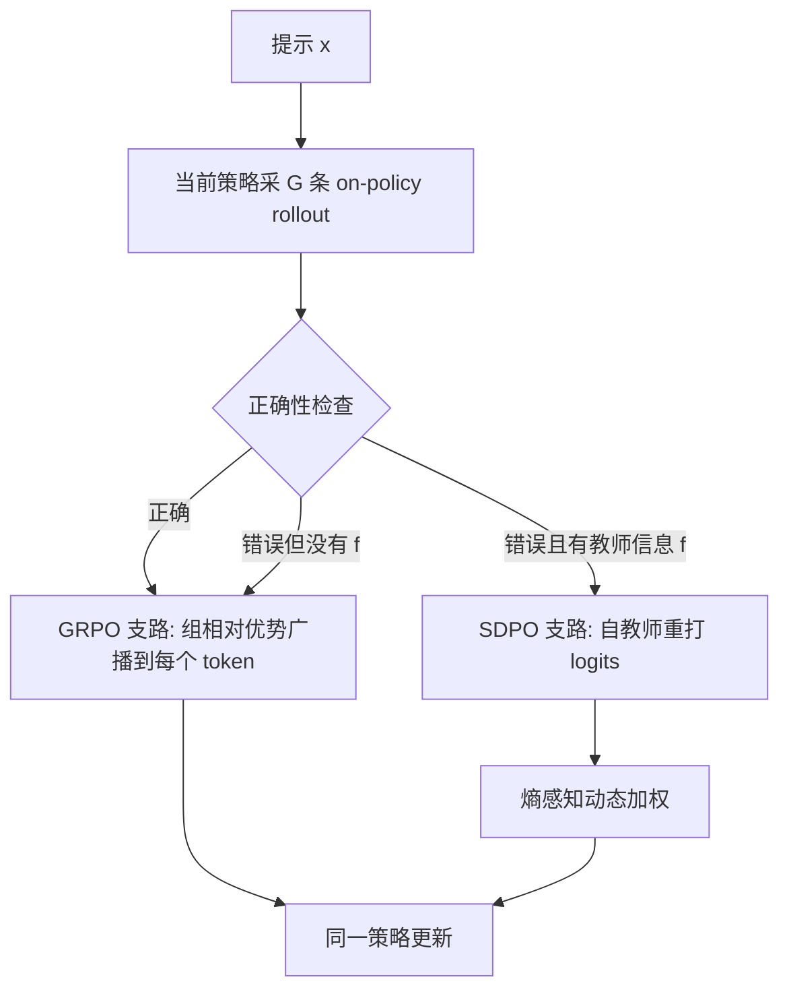

# SRPO：对的走 GRPO，错的走 SDPO

<!-- release-date: 2026-04-02 -->

**本文依据**：`Unifying Group-Relative and Self-Distillation Policy Optimization via Sample Routing`（封面标 Working in Progress），arXiv **2604.02288v1**（[cs.LG] 2 Apr 2026），20 页。作者 Gengsheng Li\*、Tianyu Yang\*、Junfeng Fang、Mingyang Song、Mao Zheng、Haiyun Guo、Dan Zhang、Jinqiao Wang、Tat-Seng Chua；单位 1 Foundation Model Research Center, Institute of Automation, Chinese Academy of Sciences（CASIA）；2 UCAS；3 NUS；4 Tencent；5 Wuhan AI Research。通讯 haiyun.guo@nlpr.ia.ac.cn、zhangdan25@nus.edu.sg。原件首次公开日取 arXiv **v1** 提交日 **2026-04-02**；解读依据本地已核的 **v1**（`pdfinfo` Pages: 20）。文中数字都标 PDF 页码；标「外部补充」的段落不来自本文。MiniLLM / Rethinking-OPD / GOPD / Self-Distillation-Zero 只在本文引用处作对照，不展开成专篇。

## 一句话

可验证奖励强化学习（RLVR）里，**组相对策略优化（Group Relative Policy Optimization，GRPO）** 给整条 rollout 一个标量优势，失败样本被整段均匀惩罚，信用太粗。**自蒸馏策略优化（Self-Distillation Policy Optimization，SDPO）** 用带特权上下文的自教师给 token 级 logits，前期涨得快，长训却经常崩：对已经做对的样本再蒸馏会制造优化歧义，自教师信号还会越训越糊。**样本路由策略优化（Sample-Routed Policy Optimization，SRPO）** 把对的样本交给 GRPO、把有教师信息的错样本交给 SDPO，再按自教师熵动态加权。五个基准、两个 Qwen3 规模上，它同时吃到 SDPO 的前期速度和 GRPO 的长训稳定；Qwen3-8B 五基准平均相对 GRPO **+3.4**、相对 SDPO **+6.3**，单步算力最多降 **17.2%**（PDF p.1）。

## 读前最小地图

- **RLVR**：奖励能自动核对（选择题对错、工具调用是否合规），不必再训一个奖励模型。
- **Rollout / 组**：同一提示 $x$ 从当前策略 $\pi_\theta$ 采 $G$ 条回复 $\{y_i\}$，各拿一个标量奖励 $r_i$。
- **GRPO**：组内把奖励标准化成序列级优势 $A_i^{\mathrm{GRPO}}$，再按 PPO 式裁剪目标更新；这条优势**广播到这条回复的每个 token**（PDF p.3）。
- **SDPO**：同一模型当学生 $\pi_\theta(\cdot|x)$ 和自教师 $\pi_\theta(\cdot|x,f)$；$f$ 是特权上下文（同组成功兄弟回复，或环境反馈）。自教师不另写一条轨迹，只在学生自己的前缀上重打分布，再做 logits 散度（PDF p.3–4）。
- **样本路由**：错且有教师信息 $\to$ SDPO 支路；其余一律 GRPO，包括「全组都错、没有兄弟答案」的回退（PDF p.4–5、p.18）。

上图是机制示意，根据 PDF p.4 图 2 与 §3 重画，不是实测时间线。

## 一、矛盾：一条路太粗，一条路前期快、后期塌

后训练用 RLVR 已经是常规路径。GRPO 因为不训 critic、实现简单，用得最广。做法是：同一提示采一组 rollout，用组内均值和标准差把奖励标准化（PDF p.3）：

$$
A_i^{\mathrm{GRPO}}=\frac{r_i-\bar r}{\sigma_r+\epsilon}.
$$

再拿重要性比 $\rho_{i,t}$ 做裁剪代理损失。问题在粒度：成功轨迹里，多数中间步确实在支撑正确答案，整段同号优势说得通；失败轨迹里，错误往往是局部的，均匀惩罚等于把锅摊到每个 token 上，梯度对不准真正偏掉的位置，样本效率差、收敛慢（PDF p.1）。

为了把信用变密，后来的工作转向同策略蒸馏和自蒸馏。自蒸馏不请外部教师：把正确答案之类的特权上下文喂给同一模型，让它在学生自己的轨迹上给稠密 logits。SDPO 是这条线上的代表，科学推理、带工具的 agent 任务上前期经常明显快过 GRPO。但图 1(a) 把后半段画出来了：拉长时间，SDPO 会被 GRPO 追上，还经常灾难性塌掉（PDF p.2 图 1）。

作者不把塌锅只甩给「数学域里认识论口头化被压掉」（他们点名 Kim et al., 2026 是互补诊断），而是从蒸馏信号本身拆出两处内在缺陷（PDF p.2）。

**缺陷一：已经做对的样本再自蒸馏，优化目标发糊。** SDPO 的自教师条件在一条成功兄弟 rollout 上。纠正失败样本时这很有用；对已经成功的样本，等于强迫一条正确推理去贴另一条同样正确、但 logits 不同的路径，在奖励等价的推理之间塞进任意偏好。图 1(b)：只对错误样本做 SDPO，大部分收益还在；只对正确样本做 SDPO，分数掉、训练更不稳（PDF p.2）。

**缺陷二：自教师信号会随训练变差。** 师生差距缩小后，蒸馏越来越没信息量；同时自教师的 token 级熵上升（图 1(c)），不确定预测开始主导（PDF p.2）。

于是互补关系清楚了：正确样本上，GRPO 的序列级蒙特卡洛优势足够，而且直接锚在期望奖励上；失败且错误局部的样本上，SDPO 的稠密校正更对口，并且只要不碰正确样本，就不会踩缺陷一。SRPO 就是按学习状态选监督，再给 SDPO 支路加熵感知加权，压住后期噪声（PDF p.2–3）。

## 二、两条基线各自在算什么

### GRPO：奖励对齐，但粒度是整条序列

提示 $x$、组大小 $G$、奖励 $\{r_i\}$。优势按上一节标准化后，损失是（PDF p.3）

$$
\mathcal{L}_{\mathrm{GRPO}}(\theta)=\mathbb{E}\bigl[\min\bigl(\rho_{i,t}(\theta)\,A_i^{\mathrm{GRPO}},\;\mathrm{clip}(\rho_{i,t}(\theta),1-\varepsilon,1+\varepsilon)\,A_i^{\mathrm{GRPO}}\bigr)\bigr],
$$

其中 $\rho_{i,t}(\theta)=\pi_\theta(y_{i,t}|x,y_{i,<t})/\pi_{\theta_{\mathrm{old}}}(y_{i,t}|x,y_{i,<t})$。$A_i^{\mathrm{GRPO}}$ 是序列级量，每个 token 拿到同一份。它能可靠地整段加强或整段打压，但说不出哪个 token 对结果负责（PDF p.3）。

实验里的 GRPO 不是教科书原版，而是按近期实践加强过的实现：非对称裁剪、无偏优势标准化、分布式推理的 off-policy 校正（PDF p.6）。

### SDPO：稠密 logits，质量绑在自教师上

学生 $\pi_\theta(\cdot|x)$，自教师 $\pi_\theta(\cdot|x,f)$。$f$ 来自同组成功兄弟，或执行轨迹一类环境反馈。沿学生原轨迹最小化散度，KL 只是举例（PDF p.4）：

$$
\mathcal{L}_{\mathrm{SDPO}}(\theta)=\sum_t \mathrm{KL}\bigl(\pi_\theta(\cdot|x,y_{i,<t})\;\big\|\;\mathrm{stopgrad}\bigl(\pi_\theta(\cdot|x,f,y_{i,<t})\bigr)\bigr).
$$

也可以换成反向 KL 或 Jensen–Shannon。自教师参数用学生的指数滑动平均（EMA）维护。自教师**不生成新回复**，只在加了 $f$ 的上下文里给学生轨迹重新打分，所以整段仍是 on-policy（PDF p.4）。

本文实验里，SDPO 只用同组成功兄弟当 $f$（PDF p.6）。超参上蒸馏散度是 Jensen–Shannon，Top-$K$ 蒸馏 100，教师 EMA 更新率 0.05（PDF p.15 表 3）。

两条路的监督本质不同：GRPO 由结果奖励经组标准化得到，更新对齐期望回报，但均匀摊在 token 上；SDPO 由师生分布差诱导，密、但质量取决于自教师。SRPO 要做的就是按样本选更合适的那一种（PDF p.4）。

## 三、设计：路由掩码 + 熵加权 + 一个归一化目标

### 样本级路由

对每条 $y_i$ 两个指示：$c_i=\mathbf{1}[y_i\text{ 正确}]$，$m_i=\mathbf{1}[y_i\text{ 有教师信息}]$。路由掩码（PDF p.4–5）

$$
z_i^{\mathrm{SDPO}}=(1-c_i)m_i,\qquad z_i^{\mathrm{GRPO}}=1-z_i^{\mathrm{SDPO}}.
$$

只有「错且有教师」进 SDPO；其余全部走 GRPO。不改策略梯度骨架：两条支路更新同一策略、同一批 on-policy 轨迹，只换优势估计器。GRPO 梯度是标准策略梯度，序列级 $A_i^{\mathrm{GRPO}}$ 共享给每个 token；SDPO 梯度可写成对词表 $v$ 的 logit 级优势 $A_t^{\mathrm{SDPO}}(v)$，由师生差诱导（PDF p.5）。路由等于给每条样本挑粒度更合适的估计器。

附录把 $f$ 怎么造写死了。组大小 $G=8$。正确定义为奖励 $r_i\ge 0.5$。对每条 $y_i$，收集同提示下**排除自己**的正确兄弟；若至少有一条，任选一条的全文当 $f$，教师提示是「原题 + Correct solution: 兄弟回复 + Correctly solve the original question.」。自教师把这段拼上学生已生成前缀 $y_{i,<t}$ 再打分布（PDF p.18）。本实验没有代码运行时错误这类富环境反馈，教师信息的唯一来源就是正确兄弟（PDF p.18）。

全组都错时 $m_i=0$，即使全是错样本也全部回退 GRPO。组里只有一条正确时，它不能当自己的教师，但因为 $c_i=1$，本来就走 GRPO（PDF p.18 表 7）。

### 动态加权 SDPO（DW-SDPO）

即便进了 SDPO 支路，token 也不是一样可信：低熵预测校正清楚，高熵更像噪声。记自教师分布 $q_{i,t}(v)=\pi_\theta(v|x,f_i,y_{i,<t})$，熵 $H_{i,t}=-\sum_v q_{i,t}(v)\log q_{i,t}(v)$。未归一权重 $\tilde w_{i,t}=\exp(-\beta H_{i,t})$，$\beta>0$ 管对熵差的敏感度。再在全部有效 SDPO token 集合 $\Omega_{\mathrm{sdpo}}$ 上归一，保住损失尺度（PDF p.5）：

$$
w_{i,t}=\frac{\tilde w_{i,t}}{\frac{1}{|\Omega_{\mathrm{sdpo}}|}\sum_{(j,s)\in\Omega_{\mathrm{sdpo}}}\tilde w_{j,s}}.
$$

加权 token 损失 $\ell_{i,t}^{\mathrm{DW\text{-}SDPO}}=w_{i,t}\,\ell_{i,t}^{\mathrm{SDPO}}$。函数形式不变，只按教师自信程度调每个 token 的贡献。默认 $\beta=1$（PDF p.6、p.15）。

### 合成目标：没有额外混合超参

$$
\mathcal{L}_{\mathrm{final}}=\frac{\sum_{i,t}z_i^{\mathrm{GRPO}}\ell_{i,t}^{\mathrm{GRPO}}+\sum_{i,t}z_i^{\mathrm{SDPO}}\ell_{i,t}^{\mathrm{DW\text{-}SDPO}}}{\sum_{i,t}z_i^{\mathrm{GRPO}}+\sum_{i,t}z_i^{\mathrm{SDPO}}},
$$

$t$ 只扫有效回复 token。分母按路由到的 token 总数归一，两支路按覆盖 token 数自然占比重，不必再调一个混合系数。训练早期失败多，更多 token 走 SDPO；策略变好后 GRPO 主导，更新重新锚在奖励上（PDF p.5–6）。算法 1 就是：采组、打奖励、造 $f$、按条路由、聚合、梯度下降（PDF p.6）。

附录图 5 把这套自适应画成了比例：Chemistry、Qwen3-8B 开训大约 **40%** 样本进 SDPO、**60%** 进 GRPO；随后正确率上升，SDPO 比例稳步下降、GRPO 上升。图 5(c) 显示「能构造教师信息」的比例全程偏高，回退主要不是因为 $m_i=0$，而是因为越来越多 $c_i=1$（PDF p.19–20）。

## 四、实验怎么证明

设定跟 SDPO 原论文协议：Chemistry / Physics / Biology / Materials / Tool Use。前四个来自 SciKnowEval 推理子集（Level 3）的本科级科学问答，Tool Use 来自 ToolAlpaca，测「用户请求 + 工具说明 → 正确工具调用」。各基准做训练/测试划分，看域内泛化（PDF p.6）。划分与 SDPO 官方仓库完全一致（PDF p.17 表 4）：

| 基准 | 来源 | 训练 | 测试 | 合计 |
|---|---|---:|---:|---:|
| Chemistry | SciKnowEval | 1,890 | 210 | 2,100 |
| Physics | SciKnowEval | 720 | 80 | 800 |
| Biology | SciKnowEval | 450 | 50 | 500 |
| Materials | SciKnowEval | 841 | 94 | 935 |
| Tool Use | ToolAlpaca | 4,046 | 68 | 4,114 |

模型：Qwen3-4B / Qwen3-8B 的 instruct 底座。除主表外，分析默认 8B（PDF p.6）。科学题是四选一，要求 `<reasoning>` / `<answer>` 里只输出字母；Tool Use 是 Thought / Action / Action Input（PDF p.16–17）。Thinking 开关为 False；最大提示 2048、最大回复 8192；问题 batch 32、每提示 8 条 rollout；验证 16 条、温度 0.6、top-p 0.95（PDF p.15 表 3）。

基线超参直接采用 SDPO 原文网格搜索结果：GRPO mini-batch 8、学习率 $1\times 10^{-6}$；SDPO mini-batch 32、学习率 $1\times 10^{-5}$。SRPO 的 batch、mini-batch、rollout 数与 SDPO 相同，学习率取中间的 $5\times 10^{-6}$，用来在同一目标里平衡奖励信号和自蒸馏（PDF p.6–7、p.15）。硬件：单机 8×NVIDIA H20，768 GB 显存合计；verl + FSDP2；rollout 用 SGLang 而不是 SDPO 原文的 vLLM，作者声明采样算法与温度、top-p 一致，后端只影响吞吐（PDF p.14）。指标：墙钟预算 1h / 5h / 10h 内达到的最高 avg@16 准确率（%）（PDF p.6 表 1）。

### 主结果：前期不输 SDPO，后期超过两条基线

表 1 五基准平均（PDF p.6）：

| 模型 | 方法 | 1h | 5h | 10h |
|---|---|---:|---:|---:|
| Qwen3-8B | 底座 | 49.5 | — | — |
| | GRPO | 61.8 | 72.5 | 74.0 |
| | SDPO | 64.8 | 71.1 | 71.1 |
| | SRPO | **66.9** | **75.5** | **77.4** |
| Qwen3-4B | 底座 | 50.8 | — | — |
| | GRPO | 61.8 | 68.4 | 69.7 |
| | SDPO | 65.0 | 66.7 | 66.7 |
| | SRPO | **65.8** | **71.2** | **74.2** |

8B 上 10h 平均从 SDPO 的 71.1、GRPO 的 74.0 提到 77.4（即摘要里的 +6.3 / +3.4）；4B 从 66.7、69.7 提到 74.2（+7.5 / +4.5）（PDF p.1、p.3、p.7）。两边 SDPO 的 5h 与 10h 平均相同，说明早早饱和；GRPO 更稳但最后也会平台。SRPO 两边都不踩。8B、10h 相对 GRPO 分项：Chemistry **+4.1**、Physics **+4.8**、Biology **+2.2**、Materials **+3.7**、Tool Use **+2.2**（PDF p.7）。作者把「超过 GRPO 平台」归因于 SDPO 支路上的熵加权：自教师后期变吵时，仍能保住有用的 logits、压住不确定目标（PDF p.7）。

脚注：五个基准上，instruct 底座的 4B 分数略高于 8B。这些基准不是 Qwen3 微调的显式目标，OOD 下游上的非单调缩放有文献记录。关键是更大的 8B 后训练后分数更高、相对底座的总增益也更大，结论不依赖底座排序异常（PDF p.7）。

图 3 两条反复出现的曲线形态（PDF p.7）：

**形态 1：自蒸馏有效时，SRPO 把优势拉长。** Chemistry：1h 时 SDPO 领先（71.6 vs SRPO 69.2），5h 被 SRPO 反超，10h SRPO 83.0，超过 SDPO 80.6 和 GRPO 78.9。Biology：SRPO 1h 最好（55.8），SDPO 卡在 58.5，SRPO 10h 到 72.8。

**形态 2：自蒸馏无效时，SRPO 仍稳。** Tool Use 上 SDPO 随时间明显变差；SRPO 全程贴住或超过 GRPO（65.2 / 71.2 / 71.2 vs 64.3 / 68.5 / 69.0）。

### 消融：路由比优势混合抗长训；加权管后期

第一块隔离混合策略，对照是「无动态加权的 SRPO」对 **Advantage Mix**：在优势层把 GRPO 与 SDPO 加成 $A_{i,t}^{\mathrm{Mix}}(v)=\lambda A_{i,t}^{\mathrm{GRPO}}(v)+(1-\lambda)A_{i,t}^{\mathrm{SDPO}}(v)$，$\lambda=0.9$，与 SDPO 原文混合比一致（PDF p.8）。五基准平均（PDF p.8 表 2）：

| 变体 | 1h | 5h | 10h |
|---|---:|---:|---:|
| SRPO 无动态加权 | 66.5 | 74.8 | 75.6 |
| Advantage Mix | 67.2（+0.7） | 72.3（−2.5） | 72.3（−3.3） |
| SRPO | 66.9 | 75.5 | 77.4 |
| SRPO 无动态加权（相对完整 SRPO） | 66.5（−0.4） | 74.8（−0.7） | 75.6（−1.8） |

Advantage Mix 1h 略好，5h / 10h 掉下去且 5h 后不再涨。早期蒸馏还干净时，密信号和奖励信号混在一起可以帮忙；后期 SDPO 变不可靠，优势层混合会把噪声灌进整条学习。样本路由把 SDPO 关在失败样本里，正确样本只听 GRPO，干涉更少（PDF p.8）。

动态加权相对「只有路由」：1h +0.4、5h +0.7、10h +1.8，差距随时间变宽，符合「自教师越吵越需要按熵打折」（PDF p.8–9）。作者总结：长训稳健的主因是路由；加权是 SDPO 支路的后期加分（PDF p.9）。

### 回复长度和单步时间

图 4(a) Chemistry、Qwen3-8B：GRPO 回复一直最长，SDPO 迅速变短，SRPO 落在中间。GRPO 冗长抬推理成本；SDPO 过短被并行工作联系到认识论口头化被压制、推理变差。SRPO 的中等长度被写成对两边的折中（PDF p.9）。正文没有把图 4(a) 读成具体 token 数。

图 4(b) 五基准平均的秒/步（PDF p.9）：

| 窗口 | GRPO | SDPO | SRPO | SRPO 相对 GRPO |
|---|---:|---:|---:|---|
| 1h | 71.0 | 85.9 | 83.4 | +17.4%（相对 GRPO）；低于 SDPO 的 85.9 |
| 5h | 82.4 | 83.9 | 78.3 | −4.9%；相对 SDPO −6.7% |
| 10h | 91.5 | 83.7 | 75.8 | **−17.2%**；相对 SDPO −9.4% |

早期失败多，自教师前向更常开，SRPO 相对 GRPO 有开销；后期失败变少，自教师开销下降，再叠加回复比 GRPO 短，单步时间落到两条基线之下（PDF p.9）。附录把这直接接到图 5 的 SDPO 比例下降（PDF p.19）。

## 五、相关工作里它站在哪

附录 A 把背景收成两刀，不另开新算法族（PDF p.13–14）。

RLVR 从 REINFORCE / PPO 走到 DeepSeek-R1、GRPO、DAPO 等。共同问题是一个标量优势均匀打到每个 token：梯度被因果无关 token 稀释、近正确程序里的语义错误不好定位、偏差随序列变长。过程奖励能加密信号，但通常要再训估计器。SRPO 想要的是**更密、又不加奖励模型**（PDF p.13）。

蒸馏从 Hinton 式分布匹配走到同策略蒸馏：学生走自己的轨迹，教师在这些前缀上给指导，减轻训练–测试错配。MiniLLM（Gu et al., 2023）在这里作为「学生轨迹 + 教师指导」的先例被点名，不是本文实验基线（PDF p.13）。同策略蒸馏通常还要一个更强的外部教师。自蒸馏把特权上下文内化进参数（context distillation），SDPO 是反馈条件、on-policy 的代表。并行诊断（Kim et al., 2026）强调口头化被压；本文强调正确样本上的歧义加自教师退化（PDF p.14）。

本文主张：奖励对齐但粗、蒸馏密但后期脏，用样本路由接到一个框架里（PDF p.14）。

## 六、限制、未公开、以及作者自己划的边界

封面就是 **Working in Progress**，不是正式录用版（PDF p.1）。

实验域窄：五个基准、两个 Qwen3 instruct 规模、Thinking 关闭、科学四选一加 ToolAlpaca 式工具调用。没有数学竞赛、代码执行、多轮 agent 的主表。教师信息在实验里**只有成功兄弟**，没有运行时错误一类富反馈；结论里把「扩展到更富反馈的环境，让自蒸馏支路更好地用上环境信息」写成重要未来方向（PDF p.10、p.18）。

SDPO 塌掉的机制，作者给的是图 1 的诊断曲线和「只训错 / 只训对」对照，不是对歧义或熵上升的定理。Advantage Mix 只报了 $\lambda=0.9$ 一点。$\beta$ 默认 1，没有扫 $\beta$ 的表。

实现细节：计划发布实现细节以支持复现（伦理声明，PDF p.10）；**正文没有给出代码仓库 URL**。GRPO / SDPO 超参继承 Hübotter et al. (2026) 的网格搜索，SRPO 学习率取两基线的算术中点，不是对 SRPO 单独网格搜索的结果（PDF p.14–15）。推理后端从 vLLM 换成 SGLang，作者认为不影响公平比较，但吞吐数字与原文 SDPO 实现不可直接逐秒对齐。

伦理声明写了：工作本身不针对有害能力，但推理变强仍可能增加双用途风险，建议在内容审核、策略过滤、限速下部署。数据是公开基准和自动可验证奖励，不采集个人数据。GPU 训练有能耗；长地平线上更低的单步时间可能减少达到目标分数所需的总算力（PDF p.10）。这些是作者立场，不是实验证明。

回复「中等」有助于同时躲开冗长和过短，是结合图 4(a) 与 Kim et al. 的**解释**，不是本文直接测口头化质量。

## 七、可迁移的几条

1. **按样本状态选监督粒度，不要在优势层永久对半混。** 正确轨迹用序列级奖励锚住；局部错误用稠密 logits。Advantage Mix 1h 好看、5h 后把噪声灌进去，是这篇最硬的对照（PDF p.8）。
2. **混合比可以让数据自己变。** 用路由 token 数做分母，失败多时蒸馏权重大，正确变多后奖励支路自动接手，不必手调课表（PDF p.5–6、p.19）。
3. **自蒸馏要对「已经对了」的样本关门。** 图 1(b) 说只蒸正确样本会加速塌。特权上下文适合修错，不适合在奖励等价路径之间做任意 logits 对齐（PDF p.2）。
4. **教师熵可以当置信度。** 高熵目标降权，比继续全量匹配后期自教师更稳；收益主要出现在 5h–10h（PDF p.8–9）。
5. **没有兄弟答案时要有回退。** 全错组强制走 GRPO，避免没有 $f$ 还硬蒸。这限制了「纯蒸馏早期」能走多远，也避免空教师（PDF p.18）。
6. **算力账要按阶段看。** 自教师前向不是免费的；只有失败比例下降之后，SRPO 才会比纯 GRPO 更便宜（PDF p.9）。

对自己项目：若已经在跑 GRPO，失败样本上加「成功兄弟条件的自教师 + 熵加权」，比把两种优势加在每个 token 上更接近这篇的做法。若任务没有组内成功样本（太难或奖励极稀），这篇的 SDPO 支路会长期关着，退化成加强版 GRPO——论文自己把富反馈环境留给未来。

## 关键词回看

**GRPO** 用组内相对奖励做无 critic 的序列级优势，稳但对失败样本太粗。**SDPO** 用反馈条件自教师做 on-policy logits 蒸馏，前期快，长训受正确样本歧义和教师熵上升拖累。**SRPO** 用 $(1-c_i)m_i$ 路由，DW-SDPO 按 $\exp(-\beta H)$ 加权，最终损失按路由 token 数归一。五个科学/工具基准上，它同时保住前期速度、后期稳定、中等回复长度，以及长地平线上更低的单步时间。

## 参考资料

- 原件：arXiv [2604.02288v1](https://arxiv.org/abs/2604.02288)
- SDPO：Hübotter et al., *Reinforcement learning via self-distillation*，arXiv 2601.20802（本文协议与超参来源）
- GRPO：Shao et al., DeepSeekMath，arXiv 2402.03300
- 并行诊断：Kim et al., *Why does self-distillation (sometimes) degrade the reasoning capability of LLMs?*，arXiv 2603.24472
- SciKnowEval：Feng et al., arXiv 2406.09098；ToolAlpaca：Tang et al., arXiv 2306.05301
- 实现栈：verl（Sheng et al., 2025）；SGLang（Zheng et al., 2024）
