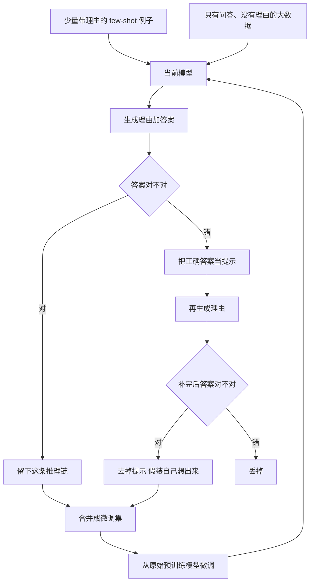

# STaR：少量带理由的例子，加一大堆只有答案的题，就能自己教自己推理

<!-- release-date: 2022-03-28 -->

**本文依据**：`STaR: Self-Taught Reasoner`，副标题 `Bootstrapping Reasoning With Reasoning`，arXiv 2203.14465**v2**（[cs.LG] 20 May 2022），30 页。作者 Eric Zelikman*、Yuhuai Wu*、Jesse Mu、Noah D. Goodman；Stanford University Computer Science，Yuhuai Wu 同时署 Google Research。原件首次公开日取 arXiv **v1** 提交日 **2022-03-28**；解读依据本地已核的 v2（30 页）。文中数字都标 PDF 页码；标「外部补充」的段落不来自本文。

## 一句话

语言模型会写逐步理由（rationale / chain-of-thought），但要嘛人工标注一大本理由，要嘛只靠几条 few-shot 提示、精度远不如「直接预测答案」的微调。STaR 用 **少量带理由的例子** 去提示模型，在 **没有理由、只有对错答案的大数据** 上自举：答对的推理链留下来训自己；答错的把正确答案当提示再让它补理由（rationalization），然后把提示拿掉、假装它自己想出来的。CommonsenseQA 上，6B 的 GPT-J 做到 **72.5%**，接近 **30 倍大**、直接微调答案的 GPT-3（**73.0%**）（PDF p.1–2、p.7 表 1）。

## 一、矛盾：理由有用，但理由从哪来

人类做决定常常是一长串中间想法（PDF p.2）。当时已经有一批工作表明：让大模型先写中间步骤再给最终答案，数学、常识问答、代码、偏见推断、自然语言推断都会更好（PDF p.2）。

两条主流路都卡死（PDF p.2）：

1. **造一份带理由的微调集。** 人标太贵，每个新任务都重做一遍不现实；模板生成只在「已经知道通解」或能写死启发式时才成立。
2. **few-shot 把几条带理由的例子塞进提示。** 比「直接问答案」的 few-shot 好，但通常 **明显弱于** 用更大数据直接微调预测答案。

STaR 的赌注是第三条：模型预训练里已经有一点推理能力。用这点能力自己造训练数据，再用数据把能力放大，循环下去（PDF p.2–3）。

作者自称，就他们所知，这是第一次让预训练大模型 **迭代地用自己的语言建模能力改进自己**（PDF p.3 贡献 4）。

## 二、全景：外环生成数据，内环从原模型微调

图 1 把整条环画清楚（PDF p.2 图 1）：数据集里已有问题和标准答案；理由是 STaR 自己生成的。外环用虚线标微调。

机制示意，根据 PDF p.2 图 1 与 p.4 算法 1 重画，不是实测时间线。

三个名字先说人话：

- **Rationale generation（理由生成）**：只给问题，模型先写理由再写答案。
- **Rationalization（合理化 / 事后补理由）**：告诉它正确答案，让它「倒着想」为什么是这个答案。
- **过滤**：只保留最终答案与标准答案一致的理由。论文假设：能推出正确答案的理由，平均质量高于推错的（PDF p.3）。

算法 1 的关键实现细节（PDF p.4）：

- 每一轮外环都从 **原始预训练模型 $M$** 重新微调，而不是在上一轮权重上接着训，避免过拟合（PDF p.3）。
- 合理化只作用在 **理由生成答错** 的题上；合理化之后仍要对上标准答案才进训练集。
- 进微调集时 **不带 hint**，当作模型没看答案就写出了这条理由（PDF p.4）。

## 三、设计一：用对的链训自己，近似策略梯度

给定预训练模型 $M$ 和数据集 $D=\{(x_i,y_i)\}$，再给一小撮带理由的提示集 $P$（论文例子 $P=10$，$P\ll D$）（PDF p.3）。把 $P$ 拼到每个 $x_i$ 前面，模型产出 $(\hat r_i,\hat y_i)$。留下 $\hat y_i=y_i$ 的样本微调，再用新模型生成下一轮数据，直到涨不动（PDF p.3）。

作者把这件事写成对离散隐变量模型的策略梯度近似（PDF p.4 式 1–2）。先把模型看成：先采样理由 $r$，再给出答案 $y$：

$$
p_M(y\mid x)=\sum_r p(r\mid x)\,p(y\mid x,r)
$$

奖励是指示函数 $\mathbf{1}(\hat y=y)$。期望奖励对参数的梯度里，答错的样本梯度被乘成零——这就是 STaR 的过滤。相对完整 RL，STaR 做了两处工程近似（PDF p.4）：

1. **贪心解码** 一条 $(\hat r,\hat y)$，降方差，但探索有偏。
2. **同一批数据走多步梯度**，类似某些策略梯度算法。

好处是只用标准 LLM 训练栈就能跑。论文把更紧的 RL 联系留给未来工作（PDF p.4）。

没有合理化时，环会停：模型再也解不出训练集里的新题，失败样本给不出训练信号（PDF p.2、p.4）。

## 四、设计二：答错就给答案，倒着补理由

合理化：在提示里塞进正确答案（图 2 用绿色标出 hint），让模型按同样文风写理由（PDF p.4 图 2）。直觉是：终点已知时，倒推中间步骤更容易。数学上，理由生成采样 $p(r\mid x)$，合理化采样 $p(r\mid x,y)$，搜索空间可能更好；作者把它想成对式 1 的 off-policy 估计（PDF p.8）。

两个直接收益（PDF p.4）：

1. 把模型本来解不出的难题送进微调集，「逼它在盒子外想」。
2. 训练集变大。

算术上，合理化之后「Target:」后面先给正确答案，再让模型写 scratchpad 并复述答案（PDF p.5）。

温度采样 **不是** 合理化的替代品。提高温度会让「理由烂、答案碰巧对」变多，训上去就泛化不了；算术这种结构化任务里，高温度 scratchpad 会写成无意义乱码然后停滞。温度 0.5 或 0.7 替代合理化，结果一律更差。生成还是串行的，10 条样本大约慢 10 倍（PDF p.8–9）。作者提到一个未做的变体：用多数票当伪标签，或许能在只有问题、没有答案的数据上跑 STaR（PDF p.9）。

## 五、实验怎么摆

基座是公开的 **GPT-J（6B）**，用官方微调脚本。选它是因为 checkpoint 公开，而且大到能写出「还不算垃圾」的理由，才有东西可自举（PDF p.5）。超参在附录 H（PDF p.27）：28 层 decoder-only，embedding 1024，16 头、头维 256，FFN 隐层 16384，词表 50.4K，在 The Pile 上预训练。默认 batch 8、序列长 1024、packing、无 weight decay、单 TPU-v3；Adam 学习率在 $10^{-7}$–$10^{-4}$ 里搜，**$10^{-6}$** 一直最好。学习率 warmup 100 步后恒定（PDF p.5）。

外环第一步默认 **40** 个训练 step，之后每轮加 **20%**。开头训慢一点，最终更好（PDF p.5）。算力不够，没做彻底超参搜索。

三个任务（PDF p.5）：

| 任务 | 数据 | 理由长什么样 |
|---|---|---|
| 算术 | 自造 50,000 题，每轮外环抽 10,000；1–5 位数各 10 条 few-shot | 按位加、进位 $C$、`<scratch>` 围起来（PDF p.5 图 3） |
| CommonsenseQA | 12,247 题、五选一；训练 9,741、开发 1,221、测试 1,285 未公开 | 自然语言逐步理由；few-shot 改自 Wei 等 10 题，修了一处错答、更直白引用知识（PDF p.5–6） |
| GSM8K | 训练 7,473、测试 1,319；小学应用题，2–8 步计算 | 带 `<<a/b=c>>` 计算器标记（PDF p.6、附录 I） |

CQA 人类约 **89%**。作者承认题里有性别等偏差、错字、歧义，仍拿它当「世界知识 + 简单推理」的试验田（PDF p.6）。合理化时，第一轮之后 few-shot 留不留，对最终成绩影响不大，但有第 5 节说的细枝末节；默认仍用 few-shot，除非另说（PDF p.5）。

## 六、算术：没有合理化就一位一位爬，有了就能同时学多位

few-shot 带理由也几乎不会做：两位加法准确率 **不到 1%**，更多位数接近 0（PDF p.6）。

STaR **16** 轮后总体 **89.5%**。对照：1 万条 **不带理由** 的数据训 5,000 step，**76.3%**（PDF p.6）。

有合理化时涨得快：第一轮微调后，两位加法从不到 1% 到 **32%**。没有合理化则是阶梯：第 $n$ 位要等第 $n-1$ 位先过关。有合理化可以同时学很多位数，只是精度不齐（PDF p.6 图 4）。因为 few-shot 就能解不少题，有合理化的算术实验从 **300** step 起步（没有合理化这样开会在一位加法上过拟合），之后每轮加 20 step（PDF p.6）。

第 20 轮前继续加入更高位数、每轮总题数不变：原有位数很快变好；训练时从没见过的 **9、10 位** 也能解一部分。图 5 显示引入新位数后训练更不稳，原因论文没钉死（PDF p.6）。

## 七、CommonsenseQA：6B 对上 30 倍大的直接微调

五选一意味着乱猜大约 **20%**；简单语义相似度启发式大约能到 **30%**，完全不推理（PDF p.7）。算术里烂 scratchpad 几乎一定推出错答案；CQA 没有这层保护。

表 1（PDF p.6–7）：

| 方法 | CQA 开发集准确率（%） | 用了多少训练数据（%） |
|---|---:|---:|
| GPT-3 直接微调答案 | 73.0 | 100 |
| Few-shot 直接答案 GPT-J | 20.9 | 近 0 |
| Few-shot CoT GPT-J | 36.6 | 近 0 |
| Few-shot CoT LaMDA 137B | 55.6 | 近 0 |
| GPT-J 直接微调答案 | 60.0 | 100 |
| STaR 无合理化 | 68.8 | 69.7 |
| STaR 有合理化 | 72.5 | 86.7 |

最终有合理化的模型：理由生成覆盖训练集约 **78.2%**，合理化再贡献 **8.5%**（PDF p.6 表注）。相对 few-shot 基线 **+35.9%**，相对「直接预测答案」的 GPT-J 微调 **+12.5%**；72.5% 对 73.0%，论文说与 **30 倍大** 的微调模型相当（PDF p.2、p.7）。也超过 137B LaMDA 的 few-shot CoT。作者预期：few-shot 更强的底模再套 STaR 还会更高（PDF p.7）。

微调时是否把 few-shot 提示也算进训练：无合理化 **60.9% → 68.8%**，有合理化 **69.9% → 72.5%**。论文建议至少训一段时间带上提示（PDF p.8）。

### 理由好不好：个案 + 众包

算术能跟标准 scratchpad 比；CQA 只能定性看。图 7 的个案：STaR 能解 few-shot 解不出的新题；同一道本来就对的题，理由也会变好（PDF p.7、p.26）。

初步人工评估（PDF p.7）：随机 50 道 **两边都答对** 的题，比较 few-shot CoT、STaR、以及 Rajani 等（2019）的人写理由。20 名 Prolific 众包，每人随机 10 题、顺序打乱，按「哪条最能证明答案」排序。被试把 STaR 排在 few-shot 之上的可能性高 **30%**（$p=.039$）；排在人写理由之上的可能性高 **74%**（$p<.001$）。作者 **不认为** 这代表人级生成；只说明「引出高质量理由」本身很难，众包解释集有局限（PDF p.7）。

失败模式接近常见逻辑谬误（PDF p.7–8、附录 A）：话题相关但不是论据；声称「题目蕴含答案」却不解释；早期会把专名当具体个人（「国王的城堡让他有安全感」而不是「城堡是国王感到安全的地方」）。附录还列出：循环论证、不解释直接给答案、红鲱鱼、以及训练时见过 hint 后的捷径——理由写机场，最终却抄 hint 写成火车站（PDF p.15）。

## 八、GSM8K：有提升，合理化几乎帮不上

表 2（PDF p.8）：

| 方法 | GSM8K 测试准确率（%） | 用了多少训练数据（%） |
|---|---:|---:|
| Few-shot 直接 GPT-J | 3.0 | 近 0 |
| Few-shot CoT GPT-J | 3.1 | 近 0 |
| GPT-J 直接微调 | 5.8 | 100 |
| STaR 无合理化 | 10.1 | 25.0 |
| STaR 有合理化 | 10.7 | 28.7（其中合理化 0.5%） |

相对直接微调仍大约翻倍，但绝对数字低。训练 step 在第 30 轮封顶（已 7,912 step），否则太长。无合理化跑 **36** 轮，再加合理化 **10** 轮（PDF p.8）。

模型用的计算器步数与人写解答多数时候一致（各轮大约 **53%–57%**）。不一致时模型通常步数更少：有时跳步，偶尔找到不同解法（PDF p.8 图 6）。附录 J 一例：人写 7 步，模型发现「每种瓶子都给一半」等于总数一半，一步得到 90（PDF p.30 图 8）。作者也说：步数少很多时，常常是理由错了但答案碰巧对（PDF p.30）。

## 九、讨论里的工程旋钮

**合理化到底在干什么。** 像「结果已知、推导难」的现实问题。低温下，无合理化样本是模型最有把握的题，第一轮梯度可能更弱；每轮从原模型重训，这个效应不好直接量。Hint 怎么塞并不从问答对里唯一确定，换领域可能 nontrivial（PDF p.8）。

**Few-shot 在后续轮次留不留。** 采样时带着 few-shot，能减轻理由风格「漂」离最初那几条。拿掉之后序列更短、更省算力，模型也可能少被初始理由的质量绑死；坏处是文风不像原提示，而且合理化能力会随训练变差，长时间可能仍要在训练里掺一点 hint。用哪边取决于目标：要可解释、要贴提示风格就留；要快就拿掉。更大模型或别的数据上可能影响成绩，应当作超参（PDF p.9）。

## 十、限制（论文自己写的）

结论段写得很硬（PDF p.9）：

1. **第一轮必须高于随机。** 底模得已经有一点 few-shot 推理。GPT-2 在算术上都自举不起来。
2. **随机水平高的设定会灌进大量烂理由。** 例如二分类。如何过滤坏推理是未解决问题。
3. **忠实性（faithfulness）保不住。** 附录 G：STaR 放大的是「在这份数据上能推出对答案的推理」。CQA 这类数据里，有用的偏见会被放大；合理化更甚，会把模型本来不会走到的偏答案「拽出来」。性别无关的题上有一些模型不提性别的例子，作者说需要更系统的研究（PDF p.27）。解释是否反映内部计算几乎无法保证：完全可以先内定答案再编理由。STaR 超过「直接预测答案」的微调，说明先写理由再给答案 **整体上** 有用，但 **单条** 理由忠实到什么程度评不了（PDF p.27）。
4. 没有公开完整训练代码仓库（正文只引用 GPT-J 的 Mesh-Transformer-JAX）。没有报告墙钟时间、总 TPU 小时。CQA 官方测试集 withheld，表 1 是开发集。
5. GSM8K 上合理化几乎无效；算术引入更长位数后训练不稳——论文没有给出可复现的根因。

## 十一、可迁移的几句话

- **监督可以只打在最终答案上**，中间过程由模型自己写，再用对错过滤。这比「先雇人写十万条理据」便宜，也比「纯 few-shot 推理」强。
- **答错不要直接扔掉**：把答案当条件，倒着采样 $p(r\mid x,y)$，再当正向数据用。这是 STaR 相对「只留答对」自举能继续涨的关键。
- **每轮从原预训练权重重训**，而不是连续微调，是他们防过拟合的显式选择。
- **不要用高温多样性代替合理化**：会污染理由质量。
- 迁移边界：底模 few-shot 必须已经不是乱猜；选择题、二分类要额外防「蒙对」。后续的拒绝采样微调、过程监督、用验证器打分，都可以看成同一骨架上换过滤器和提议分布——那是后话，不是这篇 2022 年论文写过的内容。

和后来的 Self-Instruct 对照（外部补充，不是本文）：Self-Instruct 自举的是 **任务指令与输入输出**，过滤靠启发式与去重；STaR 自举的是 **逐步理由**，过滤靠最终答案对错，并多了「给答案再补理由」这一支。不要把两套环当成一篇。

## 十二、关键词回看

- **STaR（Self-Taught Reasoner）**：少量 rationale 例子 + 无 rationale 的问答数据，迭代自举推理。
- **Rationale / chain-of-thought**：最终答案前的逐步中间文本。
- **Rationalization**：把正确答案当 hint，倒着写理由，再去掉 hint 当正向样本。
- **过滤**：只训 $\hat y=y$ 的轨迹；策略梯度里指示奖励的实现。
- **从原模型重训**：每个外环的内环微调都从 $M$ 出发，不在 $M_{n-1}$ 上接着走。
)
