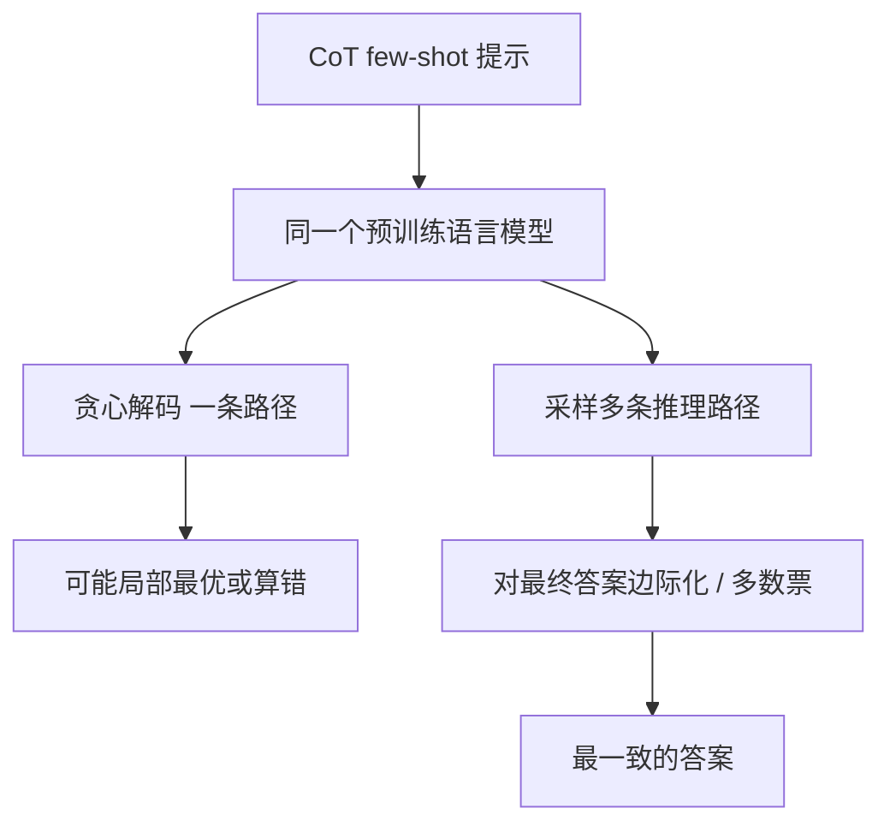

# Self-Consistency：别赌一条贪心推理链，采样多条再对答案投票

<!-- release-date: 2022-03-21 -->

**本文依据**：`Self-Consistency Improves Chain of Thought Reasoning in Language Models`，arXiv 2203.11171**v4**（[cs.CL] 7 Mar 2023），24 页，封面标 Published as a conference paper at ICLR 2023。作者 Xuezhi Wang†‡、Jason Wei†、Dale Schuurmans†、Quoc Le†、Ed H. Chi†、Sharan Narang†、Aakanksha Chowdhery†、Denny Zhou†§；† Google Research, Brain Team。原件首次公开日取 arXiv **v1** 提交日 **2022-03-21**；解读依据本地已核的 v4（24 页）。文中数字都标 PDF 页码；标「外部补充」的段落不来自本文。

## 一句话

链式思维（chain-of-thought，CoT）已经能让模型先写步骤再给答案，但解码仍走 **贪心一条路**：局部最优、容易重复、一次采样的随机性也扛不住。Self-consistency 把贪心换成「采样—边际化」：先从解码器抽出一组多样推理路径，再对最终答案做边际化（多数票），留下最一致的那个。摘要口径的绝对准确率增益：GSM8K **+17.9%**、SVAMP **+11.0%**、AQuA **+12.2%**、StrategyQA **+6.4%**、ARC-challenge **+3.9%**（PDF p.1）。这些百分点对应哪张表、哪一个模型，正文会分开写。

## 一、矛盾：CoT 有了，解码还在赌一条链

当时的观察是：光把模型做大，推理性仍常被看成短板（PDF p.1）。Wei 等人（2022）的 CoT prompting 让模型先写一串短句，模仿人解题时的中间过程。停车场那道题：不问「5」，而写「已经有 3 辆，又来 2 辆，3+2=5。答案是 5。」多步推理因此明显变好（PDF p.1）。

CoT 论文里用的解码，仍是 **贪心**（greedy decode）：每一步取当前最可能的 token，整条推理路径只留一条「最优」。作者指出，贪心会撞上两件事（PDF p.1）：

1. **重复** 与 **局部最优**。
2. 单次采样生成的 **随机性** 扛不住复杂题。

直觉来自人类：复杂题通常有 **多条** 能走到同一正确答案的思考路径；越需要审慎分析，路径就越多样（PDF p.1，引 Stanovich & West 2000、Evans 2010）。语言模型不是完美推理器，某条路径可能算错（图 1 的 Output 2），但 **错法不容易碰巧给出同一个答案**；对的路径即使写法不同，终点更容易重合（PDF p.2）。

于是目标换成：不要再赌那条贪心链，改成从解码器里 **采样一组路径，再对答案做边际化**。

## 二、全景：提示不变，只换解码

图 1 三步（PDF p.2）：

1. 仍用 CoT few-shot 提示。
2. 把 CoT 里的贪心解码换成从语言模型解码器 **采样** 一组多样推理路径。
3. **边际化掉** 推理路径，在最终答案集合里选最一致的那个。

机制示意，根据 PDF p.2 图 1 重画，不是实测时间线。

和当时几条「再训一个东西」的路不同（PDF p.2）：

- 不训额外 verifier（Cobbe 等，2021）。
- 不靠额外人工标注训 re-ranker（Thoppilan 等，2022）。
- **完全无监督**，现成预训练模型就能用，不加人类标注、不加辅助模型、不微调。
- 也不是多模型 ensemble：它更像单个模型上的 **self-ensemble**（PDF p.2）。

四个尺度的 Transformer 都测了（PDF p.2、p.4）：公开的 UL2-20B、GPT-3-175B（code-davinci-001 / 002），以及稠密 decoder-only 的 LaMDA-137B、PaLM-540B。全部 few-shot，**不训练、不微调**（PDF p.4）。

## 三、设计：采样 $(r_i, a_i)$，再对 $a$ 投票

### 路径是隐变量，答案才进票箱

先用 Wei 等（2022）那套手写 CoT 示例提示模型，再从解码器采样候选输出（PDF p.3）。温度采样、top-$k$、nucleus 都兼容。

假设最终答案 $a_i$ 来自固定集合 $A$，$i=1,\ldots,m$。Self-consistency 引入隐变量 $r_i$（第 $i$ 条输出里的推理 token 序列），成对生成 $(r_i,a_i)$，且 $r_i\to a_i$：推理路径可选，只用来走到 $a_i$（PDF p.3）。图 1 Output 3 里，「She eats 3 for breakfast … 9 eggs * $2 = $18」是 $r_i$，最后一句「The answer is $18」解析出 $a_i=18$。

解析器按任务写（PDF p.3 脚注 1）：算术题在模型写出 “The answer is ” 之后取 **第一段数字**；常识题取该标记后的 **整段字符串**。提示格式对齐时，多数输出是「{推理}。The answer is X.」。

对多条 $(r_i,a_i)$ 边际化 $r_i$，多数票：

$$
\arg\max_a \sum_{i=1}^{m} \mathbf{1}(a_i=a)
$$

这就是文中说的最「consistent」答案（PDF p.3）。

### 加权和不加权几乎打平，归一化才重要

也可以按 $P(r_i,a_i\mid \text{prompt},\text{question})$ 加权。条件概率可取未归一化生成概率，或按输出长度归一化（PDF p.3 式 1）：

$$
P(r_i,a_i\mid \text{prompt},\text{question})=\exp\Bigl(\frac{1}{K}\sum_{k=1}^{K}\log P(t_k\mid \text{prompt},\text{question},t_1,\ldots,t_{k-1})\Bigr)
$$

$K$ 是 $(r_i,a_i)$ 的 token 数。

表 1 是 PaLM-540B 上不同聚合策略（PDF p.3）。摘几行：

| 策略 | GSM8K | MultiArith | AQuA | SVAMP | CSQA | ARC-c |
|---|---:|---:|---:|---:|---:|---:|
| Greedy decode | 56.5 | 94.7 | 35.8 | 79.0 | 79.0 | 85.2 |
| Weighted avg（未归一化） | 56.3 | 90.5 | 35.8 | 73.0 | 74.8 | 82.3 |
| Weighted avg（归一化） | 22.1 | 59.7 | 15.7 | 40.5 | 52.1 | 51.7 |
| Weighted sum（未归一化） | 59.9 | 92.2 | 38.2 | 76.2 | 76.2 | 83.5 |
| Weighted sum（归一化） | 74.1 | 99.3 | 48.0 | 86.8 | 80.7 | 88.7 |
| Unweighted sum（多数票） | 74.4 | 99.3 | 48.3 | 86.6 | 80.7 | 88.7 |

作者的观察（PDF p.3）：

- **多数票** 与 **归一化加权和** 非常接近。他们看过模型输出概率：各条 $(r_i,a_i)$ 的归一化条件概率彼此很近，模型把这些生成看成「差不多一样可能」。
- 脚注 2：这也说明模型 **校准不好**，分不清对错解，所以前人要另训 re-ranker。
- **归一化** 加权和远好于未归一化。
- **加权平均**（加权和再除以该答案出现次数）差很多。

主实验因此直接多数票。

### 适用边界写在方法节末尾

推理任务通常有固定答案，所以前人默认贪心（PDF p.3–4）。作者发现：就算终点固定，推理过程的多样性仍然有用，于是借用开放生成里的采样。Self-consistency **只能**用在最终答案来自固定集合的问题上；原则上若能定义两段生成是否一致（同意还是矛盾），也可扩到开放文本（PDF p.4）。论文没有做开放生成实验。

## 四、实验怎么摆

任务三类（PDF p.4）：

- **算术**：AddSub、MultiArith、ASDiv、AQuA、GSM8K、SVAMP。
- **常识**：CommonsenseQA（dev）、StrategyQA（BIG-bench 的 question-only）、ARC。
- **符号**：last letter concatenation、Coinflip；主表测的是 **分布外**：提示是 2 字母 / 2 次翻转，测试是 4 字母 / 4 次翻转（PDF p.5）。

提示与 Wei 等（2022）对齐：算术共用 8 条手写示例；常识每任务从训练集随机抽 4–7 条并手写 CoT（PDF p.4）。采样：UL2 / LaMDA 用 $T=0.5$、$k=40$；PaLM 用 $T=0.7$、$k=40$；GPT-3 用 $T=0.7$、无 top-$k$ 截断（PDF p.4）。主结果是 **10 次平均**，每次独立采 **40** 条输出；对照是 CoT + 贪心（PDF p.5）。Self-consistency 的标准差所有任务 $\le 0.5$，主表省略（PDF p.5 脚注 7）。

## 五、算术：摘要那几条增益从哪张表来

表 2（PDF p.5）。先前 SoTA 各有来源（分类器、微调 7.5k、再加 175B verifier 等）。这里只摘 CoT 与 self-consistency。括号内是绝对百分点。

| 模型 | 方法 | AddSub | MultiArith | ASDiv | AQuA | SVAMP | GSM8K |
|---|---|---:|---:|---:|---:|---:|---:|
| UL2-20B | CoT | 18.2 | 10.7 | 16.9 | 23.6 | 12.6 | 4.1 |
| UL2-20B | SC | 24.8（+6.6） | 15.0（+4.3） | 21.5（+4.6） | 26.9（+3.3） | 19.4（+6.8） | 7.3（+3.2） |
| LaMDA-137B | CoT | 52.9 | 51.8 | 49.0 | 17.7 | 38.9 | 17.1 |
| LaMDA-137B | SC | 63.5（+10.6） | 75.7（+23.9） | 58.2（+9.2） | 26.8（+9.1） | 53.3（+14.4） | 27.7（+10.6） |
| PaLM-540B | CoT | 91.9 | 94.7 | 74.0 | 35.8 | 79.0 | 56.5 |
| PaLM-540B | SC | 93.7（+1.8） | 99.3（+4.6） | 81.9（+7.9） | 48.3（+12.5） | 86.6（+7.6） | 74.4（+17.9） |
| GPT-3 001 | CoT | 57.2 | 59.5 | 52.7 | 18.9 | 39.8 | 14.6 |
| GPT-3 001 | SC | 67.8（+10.6） | 82.7（+23.2） | 61.9（+9.2） | 25.6（+6.7） | 54.5（+14.7） | 23.4（+8.8） |
| GPT-3 002 | CoT | 89.4 | 96.2 | 80.1 | 39.8 | 75.8 | 60.1 |
| GPT-3 002 | SC | 91.6（+2.2） | 100.0（+3.8） | 87.8（+7.6） | 52.0（+12.2） | 86.8（+11.0） | 78.0（+17.9） |

正文自己的归纳（PDF p.5）：UL2 大约 **+3%–6%**；LaMDA 与 GPT-3 001 可到 **+9%–23%**；已经很高的 GPT-3 002 / PaLM，在 AQuA、GSM8K 仍有 **+12%–18%**，SVAMP / ASDiv **+7%–11%**。无监督、任务无关，却能跟「任务专项训练 / 上千例微调」的旧 SoTA 比（PDF p.5）。

**摘要与表要对齐时，以表为准。** 摘要 GSM8K **+17.9%** 同时出现在 PaLM（56.5→74.4）和 GPT-3 002（60.1→78.0）。SVAMP **+11.0%**、AQuA **+12.2%** 对应 GPT-3 002，不是 PaLM（PaLM 的 AQuA 是 **+12.5%**，SVAMP 是 **+7.6%**）。引言写「PaLM-540B 或 GPT-3」时把这几条增益并列（PDF p.2），没有逐条标明模型。

## 六、常识与符号：StrategyQA +6.4、ARC-c +3.9 是 GPT-3 002

表 3（PDF p.5）：

| 模型 | 方法 | CSQA | StrategyQA | ARC-e | ARC-c | Letter (4) | Coinflip (4) |
|---|---|---:|---:|---:|---:|---:|---:|
| UL2-20B | CoT | 51.4 | 53.3 | 61.6 | 42.9 | 0.0 | 50.4 |
| UL2-20B | SC | 55.7（+4.3） | 54.9（+1.6） | 69.8（+8.2） | 49.5（+6.8） | 0.0 | 50.5（+0.1） |
| LaMDA-137B | CoT | 57.9 | 65.4 | 75.3 | 55.1 | 8.2 | 72.4 |
| LaMDA-137B | SC | 63.1（+5.2） | 67.8（+2.4） | 79.3（+4.0） | 59.8（+4.7） | 8.2 | 73.5（+1.1） |
| PaLM-540B | CoT | 79.0 | 75.3 | 95.3 | 85.2 | 65.8 | 88.2 |
| PaLM-540B | SC | 80.7（+1.7） | 81.6（+6.3） | 96.4（+1.1） | 88.7（+3.5） | 70.8（+5.0） | 91.2（+3.0） |
| GPT-3 001 | CoT | 46.6 | 56.7 | 63.1 | 43.1 | 7.8 | 71.4 |
| GPT-3 001 | SC | 54.9（+8.3） | 61.7（+5.0） | 72.1（+9.0） | 53.7（+10.6） | 10.0（+2.2） | 75.9（+4.5） |
| GPT-3 002 | CoT | 79.0 | 73.4 | 94.0 | 83.6 | 70.4 | 99.0 |
| GPT-3 002 | SC | 81.5（+2.5） | 79.8（+6.4） | 96.0（+2.0） | 87.5（+3.9） | 73.4（+3.0） | 99.5（+0.5） |

摘要 StrategyQA **+6.4%**、ARC-challenge **+3.9%** 对应 GPT-3 002。PaLM 上这两项是 **+6.3%** 与 **+3.5%**。6 个任务里 5 个报到当时 SoTA（PDF p.5）。符号任务的 OOD 设定更难：PaLM / GPT-3 在分布内已经能完美，4 字母 / 4 翻转上 self-consistency 仍明显好于贪心 CoT（PDF p.5–6）。

图 2 在 LaMDA-137B 上把采样条数扫成 1、5、10、20、40：条数越多越好，多样性本身就是收益（PDF p.6）。表 4 给了 PaLM 上贪心算错、采样两条都对的例子：自行车两站之间里程（贪心 40，采样 25）；Albany, Georgia 是不是美国最人口的 Albany（贪心 yes，采样 no）（PDF p.6）。作者后文也承认：StrategyQA 那条里两个城市人口数字并不精确（PDF p.9）。

## 七、CoT 会伤标准 prompting 时，投票还能补回来

Ye & Durrett（2022）观察到：few-shot 里加 CoT，有时比标准 prompting 更差。作者在一批普通 NLP 任务上用 PaLM-540B 对照（PDF p.6 表 5）：

| 方法 | ANLI R1 / R2 / R3 | e-SNLI | RTE | BoolQ | HotpotQA EM / F1 |
|---|---|---:|---:|---:|---|
| Standard（无 rationale） | 69.1 / 55.8 / 55.8 | 85.8 | 84.8 | 71.3 | 27.1 / 36.8 |
| CoT | 68.8 / 58.9 / 60.6 | 81.0 | 79.1 | 74.2 | 28.9 / 39.8 |
| Self-consistency | 78.5 / 64.5 / 63.4 | 88.4 | 86.3 | 78.4 | 33.8 / 44.6 |

ANLI-R1、e-SNLI、RTE 上 CoT 确实低于无 rationale 的标准 prompting；self-consistency 把它们拉回并超过标准 prompting（PDF p.6）。BoolQ / HotpotQA 上 CoT 已经涨，投票再涨一截。

## 八、不是「多样本」就够：sample-and-rank、beam、prompt ensemble

### Sample-and-rank

同样从解码器采同样条数，按序列 log 概率排序，取最高那条的答案（PDF p.7）。图 3 在 GPT-3 code-davinci-001 上：sample-and-rank 有一点涨，远小于 self-consistency。

### Beam search

表 6，UL2-20B，相同 beam / 路径数（PDF p.7）。AQuA：beam 顶梁 1→40 从 23.6 掉到 10.2；self-consistency 用采样到 40 条是 **26.9±0.5**。用 beam 当每条路径的解码器（「Self-consistency using beam search」）也弱于采样版。作者归因：beam 多样性低（Li & Jurafsky, 2016），而多样性正是本方法的关键（PDF p.7）。

### Prompt 级 ensemble

表 7，LaMDA-137B（PDF p.7）：3 套手写 prompt 多数票；40 次 exemplar 顺序置换多数票。GSM8K：CoT 17.1 → 3 套 prompt 18.6 → 40 置换 19.2 → 40 条路径 self-consistency **27.7**。附录表 10：把 LaMDA / PaLM / GPT-3 001 的贪心输出拿来多数票，GSM8K 只有 16.0–36.9，弱模型会拖死强模型；单模型 PaLM self-consistency 是 **74.4**（PDF p.17）。附录表 11：PaLM 上 40 套不同 prompt 58.9、40 次置换 59.6；self-consistency 74.4；再叠不同 prompt 到 **75.4**，叠置换反而 73.8（PDF p.18）。

## 九、采样超参、坏 prompt、方程、zero-shot CoT

图 4 左：PaLM-540B 的 GSM8K，扫 $T$、$k$、nucleus $p$，曲线都在贪心之上（PDF p.8）。图 4 右：LaMDA 系列各尺度都涨；小模型增益相对小，因为算术等能力要到足够尺度才出现（PDF p.8）。

表 8，GSM8K（PDF p.8）：

| 设定 | 数字 |
|---|---:|
| LaMDA，正确 CoT prompt，贪心 | 17.1 |
| 不完美 CoT（中间数字乱换成随机数，只留对的最终答案） | 14.9 |
| 同上 + SC 40 条 | 23.4 |
| 只提示方程（把自然语言步骤收成 `3 + 2 = 5`） | 5.0 |
| 方程 + SC | 6.5 |
| PaLM，zero-shot CoT（Kojima 等，2022） | 43.0 |
| 同上 + SC 40 条 | 69.2（文中写 **+26.2%**） |

方程路径更短，多样性空间小，增益也小（PDF p.8）。图 5：一致性（同意最终聚合答案的 decode 比例）与准确率高度相关。低一致性可当「模型没把握」的不确定度——作者说这让模型有一点 「know when it doesn't know」（PDF p.8）。附录表 9：PaLM GSM8K 三套手写 CoT，贪心 56.5 / 54.6 / 54.0，SC 74.4（+17.9）/ 72.1（+17.5）/ 70.4（+16.4）（PDF p.17）。

## 十、和 STaR 只对照一句

同一时期还有靠 **对的推理链微调自身** 的工作（库内另有 STaR 篇）。本篇不改权重：提示仍是那几条 CoT，外环是解码时采样与投票。STaR 的过滤发生在训练数据构造；这里的过滤发生在 **答案空间的多数票**。论文没有引用或对比 STaR。

## 十一、限制与未做的事

结论与讨论写得很短（PDF p.9）：

1. **算力**：每题多采若干条。实践上可先试 5 或 10 条，图 2 上多数任务很快饱和。
2. 未来可用 self-consistency 造更好的监督数据再微调，让 **单次推理** 更准。论文没有做这条微调。
3. 模型仍会写出错误或无意义的推理（表 4 的人口数字不准）。需要更好的 grounding。
4. 方法要求最终答案来自固定集合（PDF p.4）。
5. 校准差：各条路径的归一化概率挤在一起，所以多数票碰巧好用，不是因为模型会打分（PDF p.3）。
6. Ethics：rationale 只供检查对错与偏见；真实部署还要事实性与安全（PDF p.10）。
7. 可复现性：UL2 有公开 checkpoint，GPT-3 走当时公开 API；LaMDA 与 PaLM 不公开，附录 A.3 给了全部任务的精确 prompt（PDF p.10）。资源：UL2 用 TPU v3 2×2；LaMDA TPU v3 8×8；PaLM TPU v4 4×4×12；多数任务每份约 1–4 小时（约 1,000 例），PaLM 约 2–12 小时，常识最长不超过 2 天（PDF p.18）。GPT-3 一律 128 max tokens，无 frequency / presence penalty。

论文没写：如何在开放生成里定义 consistency 度量；投票与 verifier 联合训练；生产系统的延迟—准确率曲线（只给了「先试 5–10 条」的建议）。

## 十二、可迁移启发

1. **CoT 的瓶颈常常在解码，不在提示。** 同一套 8 条算术示例，只换采样+投票，GSM8K 就能从 56.5 到 74.4（PaLM）或 60.1 到 78.0（GPT-3 002）。
2. **对答案边际化，不要对路径打分。** 模型校准差时，长度归一化加权和才接近多数票；未归一化与加权平均会崩。落地时先多数票。
3. **多样性是机制，不是装饰。** Beam 当路径解码器反而差；采样条数从 1 拉到 40 持续涨。
4. **固定答案集合是前提。** 数学、多选、是否题天然合适；开放长文要先有「两条输出算不算一致」的定义。
5. **一致性可当不确定度。** 图 5 把「多少 decode 同意赢家」和准确率绑在一起，适合做拒答或人审路由。
6. **算力换精度要设上限。** 作者自己建议 5–10 条先吃掉大部分增益（PDF p.9）。
7. **不要拿多模型贪心投票当替代。** 弱模型会拖死强模型（附录表 10）。

## 关键词回看

- **Chain-of-thought prompting**：提示里示范「先写步骤再给答案」。
- **Greedy decoding**：每步取当前最可能 token，整条链只留一条。
- **Self-consistency**：采样多条 $(r,a)$，对 $a$ 多数票（或归一化加权和）。
- **Marginalize out reasoning paths**：不选「最好看的那条 $r$」，只在答案上求和。
- **Self-ensemble**：单模型多样本聚合，不是多模型训练。

## 参考资料

- 原论文：Wang 等，arXiv 2203.11171v4，ICLR 2023。
- CoT prompting：Wei 等，NeurIPS 2022。
- Zero-shot CoT：Kojima 等，NeurIPS 2022（表 8 对照）。
- GSM8K verifier：Cobbe 等，2021（本文明确不走这条）。
- 库内对照：`readings/训练方法与强化学习/STaR.md`（训练侧自举，不是本篇）。
