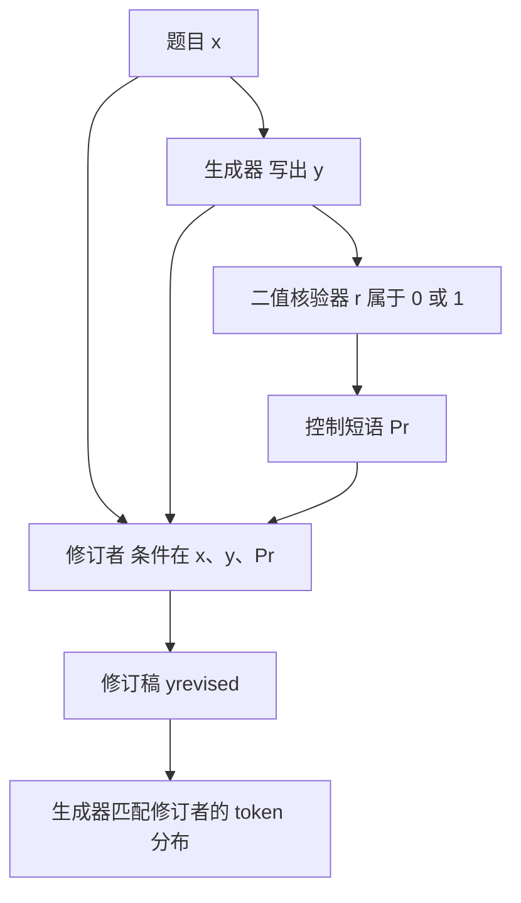

# Self-Distillation Zero：同一模型当修订者，把二值奖励蒸成稠密监督

<!-- release-date: 2026-04-13 -->

**本文依据**：`Self-Distillation Zero: Self-Revision Turns Binary Rewards into Dense Supervision`，arXiv **2604.12002v1**（[cs.CL] 13 Apr 2026），31 页。封面印 Preprint / Under review。作者 Yinghui He¹、Simran Kaur¹、Adithya Bhaskar¹、Yongjin Yang²、Jiarui Liu³、Narutatsu Ri¹、Liam Fowl¹、Abhishek Panigrahi¹、Danqi Chen¹、Sanjeev Arora¹；**1 Princeton University**，2 University of Toronto，3 Carnegie Mellon University。通讯邮箱 `yh0068@princeton.edu`。方法名写作 **SD-ZERO** / **Self-Distillation Zero**（正文排版为 SD-Z ERO）。原件首次公开日取 arXiv v1 **2026-04-13**；本地 PDF 已是 v1，解读依据 v1。页码均指这份 PDF。标「外部补充」的段落不来自本文。

## 一句话

可验证任务上，强化学习（RLVR）只有对错这一拍奖励，监督太稀；蒸馏有 token 级稠密监督，却通常要外部教师或高质量示范。SD-ZERO 让**同一个模型**演两角：生成器写出初稿，修订者看着初稿和二值奖励改写；再用 on-policy 自蒸馏，把修订者的 token 分布蒸回生成器。不需要外部教师，也不需要金标解答过程。Qwen3-4B-Instruct 与 Olmo-3-7B-Instruct 上，相对底座平均至少约 **10%**，并在同一题集与样本预算下超过 RFT、GRPO、SDFT（PDF p.1，表 1）。

## 一、矛盾：稀奖励能用、稠监督买不起

后训练在数学、代码这类**答案可核**的场景里，分成两条路（PDF p.1–2）。

**RLVR**（用可验证奖励做强化学习）只要最终答案对不对。适用范围宽，但一条轨迹只有一个 0/1，中间哪一步对、哪一步错，梯度看不见。模型只能靠大量自生成轨迹互相比较，才摸到好推理。样本效率差。

**蒸馏**把监督变成对学生生成 token 的逐步反馈。On-policy 蒸馏（文中引用 Agarwal 等、MiniLLM / Gu 等）假定有一个**更强的外部教师**，对学生轨迹打 token 级分。更新的自蒸馏——OPSD、SDFT、SDPO——拿掉外部教师，但仍要**明显高于模型自己回答**的高质量示范：来自外部教师，或模型反复生成再过滤（SDPO）。这些示范常常拿不到，或贵到不能规模化（PDF p.2）。

于是中心问题（PDF p.2）：

> 模型能不能看着自己的初稿（可能错）和稀疏奖励，给自己造出更好的稠密监督？

SD-ZERO 的回答是：可以，但要先把「修订」练出来，再把修订蒸回「一次生成」。

和既有方法的对照见表 2（PDF p.18）：SFT / 蒸馏 off-policy、稠密、外部教师；on-policy 蒸馏稠密但仍要外部教师；RLVR on-policy 但稀疏；OPSD / SDFT / SDPO on-policy、稠密、自教师，**教师不能条件在错误初稿上**。SD-ZERO 是表里唯一同时满足：on-policy、稠密、自教师、**教师可以条件在错误尝试上**。

上图按 PDF 图 1–2 与算法 1 重画，是机制示意，不是实测曲线。

## 二、设定：没有金标过程，只有最终答案

数据集 $D=\{(x_i,a_i)\}$。$x$ 是题，$a$ 是最终标准答案。**不假设有金标解答过程**（PDF p.3）。策略 $\pi_\theta(y\mid x)$ 生成推理轨迹 $y$。奖励

$$
r(y,a)\in\{0,1\}
$$

从 $y$ 抽出的最终答案与 $a$ 一致则为 1，否则为 0。

同一套参数演两个角色：

- **生成器**：只看题目，写完整回答。
- **修订者**：看题目、自己的初稿、以及由奖励决定的控制短语，改写或改述。

训练集切成不相交的 $N_1$、$N_2$。Phase 1 用 $N_1$ 练修订与生成；Phase 2 用 $N_2$，让修订者把稀疏结果监督变成生成器轨迹上的稠密 token 监督。Phase 1 结束后的模型叫 **SRT 模型**，Phase 2 结束后叫 **SD-ZERO 模型**（PDF p.3）。

主实验里每个域 15K 题：Phase 1 用 6K 条成功修订轨迹，Phase 2 用另外 9K 题（PDF p.19）。

## 三、Phase 1：Self-Revision Training（SRT）

底座当生成器还行，当修订者弱（PDF p.3，图 3）。这一相先把修订能力拉起来，生成也会跟着好一点。

### 结果条件修订

对每个 $x$ 采若干初稿 $y_{\mathrm{init}}\sim\pi_\theta(\cdot\mid x)$。按对错拼控制短语 $P_r$（PDF p.3）：

- $r=1$：「Let me rephrase the above solution.」
- $r=0$：「Wait, this response is not correct, let me start over.」

然后同一模型生成

$$
y_{\mathrm{revised}}\sim\pi_\theta(\cdot\mid x,y_{\mathrm{init}},P_r)
$$

对的初稿：鼓励改述正确解，作者观察到改述往往更短，可能帮第二相压长度。错的初稿：鼓励批评并重写。只保留**修订后答案正确**的轨迹，得到 $D_{\mathrm{REVISION}}=\{(x,y_{\mathrm{init}},P_r,y_{\mathrm{revised}})\}$（PDF p.3–4，算法 1）。

附录 C.1 的具体采集（OpenR1-Math 或 Codeforces 各一套，PDF p.19）：先取 10K 题，每题 1 条初稿；约 5K 对、5K 错；对的采 3 条改述，错的采 3 条纠正；过滤后留下 **6K** 条成功修订轨迹。

### 两个似然，缺一不可

修订损失：条件在 $x$、$y_{\mathrm{init}}$、$P_r$ 上，拟合 $y_{\mathrm{revised}}$（PDF p.4 式 1）。

生成损失：条件只在 $x$ 上，拟合整段 $y'=[y_{\mathrm{init}},P_r,y_{\mathrm{revised}}]$，保住「从题目直接写出正确回答」的能力（PDF p.4 式 2）。

$$
\mathcal{L}_{\mathrm{SRT}}=\mathcal{L}_{\mathrm{revision}}+\mathcal{L}_{\mathrm{generation}}
$$

作者说这个组合会让模型在推理时主动评估当前回答、必要时显式自修订，于是 **SRT 后回答变得极长**（PDF p.4）。下一相要把这种修订行为蒸回生成器。

表 11（PDF p.27）：只用 $\mathcal{L}_{\mathrm{generation}}$，平均生成 56.4%，AIME24 纠正率 7.2%；只用 $\mathcal{L}_{\mathrm{revision}}$，平均生成掉到 52.2%，纠正率 12.1%；完整 SRT 平均 57.6%，纠正率 15.0%。两项互补。

## 四、Phase 2：用修订反馈做 On-Policy 自蒸馏

目标：把修订内化，让生成器一次写出更短、更对准的回答（PDF p.4）。

记 Phase 1 结束参数为 $\theta_{\mathrm{SRT}}$。学生初始化 $\theta:=\theta_{\mathrm{SRT}}$，**整相更新**。修订者（教师）**冻在** $\theta_{\mathrm{SRT}}$，条件在学生回答与二值奖励上给出 token 分布。学生用 KL 去贴教师（PDF p.4 式 4）：

$$
\mathcal{L}_{\mathrm{Self\text{-}Distillation}}(\theta)=\mathbb{E}_{(x,a)\sim D}\,\mathbb{E}_{y\sim\pi_\theta(\cdot\mid x)}\sum_{t=1}^{|y|} D_{\mathrm{KL}}\bigl(\pi_\theta(\cdot\mid x,y_{<t})\,\big\|\,\pi_{\theta_{\mathrm{SRT}}}(\cdot\mid x,y,P_r,y_{<t})\bigr)
$$

算法 1 写成 $D_{\mathrm{KL}}(\pi_S\|\mathrm{StopGrad}(\pi_T))$（PDF p.17）。每步：学生采一条 $y$，核验对错，拼 $P_r$，教师看 $(x,y,P_r)$ 出下一 token 分布，学生去匹配。

**不要跳过 SRT 直接蒸。** 表 12（PDF p.27）：只做 Phase 2，平均生成 51.4%（底座 49.8%），纠正率 2.6%，几乎等于底座的 2.7%。SRT 是前置条件。

数据怎么切：表 13（PDF p.28）总预算固定时，6K SRT + 9K 蒸馏最终 60.3%；9K+6K 最终 59.1%；对半 59.8%。多给蒸馏更好；多给 SRT 只让中间 SRT 模型从 57.6% 微升到 57.8%，带不动终局。

## 五、实验怎么摆

底座：**Qwen3-4B-Instruct**、**Olmo-3-7B-Instruct**。训练采样温度 0.7、16K token 上限；评测 32K；主表 **avg@8**（PDF p.5）。

数据分域训：OpenR1-Math 选 15K 竞赛/奥赛题（有核验解）；Codeforces 各 7.5K cpp 与 Python 子集（PDF p.5）。评测八项：AIME24/25、HMMT25、MATH、AMOBench、OpenR1-Math，以及 Codeforces、LiveCodeBench（表中 LCB）。两个 in-distribution 集各留 500 题（PDF p.5）。

基线都在同一 15K 题上（PDF p.5）：

- **SFT**：DeepSeek-R1 高质量示范。
- **RFT**：对自己生成的正确轨迹做拒绝微调。
- **GRPO**：二值正确性奖励；脚注写实际用 DAPO 变体。
- **SDFT**：on-policy 自蒸馏，教师条件在高质量示范上。

样本预算对齐见附录 C.2（PDF p.19–20）：RFT / GRPO / SDFT 各约 15K×4=**60K** 条生成；SRT 采集 **40K**，蒸馏 **9K**，SD-ZERO 合计 **49K**。按约 3.7K token/条估算，RFT/GRPO 约 222M token；SD-ZERO 采集约 148M，蒸馏上界 9K×8.5K=76.5M，合计至多约 225M，与基线同量级。前向训练 token 作者估 SD-ZERO 至多约 219M。

超参见表 4–6（PDF p.20–23）。SRT 与 SFT/RFT：Qwen3-4B-Instruct-2507，Thinking=False，AdamW，$5\times10^{-6}$，cosine。蒸馏相：每 prompt **1** 条生成，蒸馏 Top-K=64，lr 同样 $5\times10^{-6}$。注意：表 5 的 GRPO 栏写了 Rollouts per prompt $n=8$，而 C.2 / 表 3 按 4 条对齐主实验——本文照抄两处，不替作者改口径。

## 六、主结果：SRT 已经赢，蒸馏再加分并砍长度

表 1（PDF p.5），avg@8：

| 模型 | AIME24 | AIME25 | HMMT25 | AMOBench | OpenR1 | MATH | Codeforces | LCB | Avg. |
|---|---:|---:|---:|---:|---:|---:|---:|---:|---:|
| Qwen3-4B-Instruct | 59.6 | 45.8 | 26.7 | 9.8 | 55.8 | 91.0 | 48.0 | 61.8 | 49.8 |
| SFT | 61.7 | 46.3 | 31.3 | 7.3 | 56.1 | 91.3 | 49.1 | 57.2 | 50.0 |
| RFT | 64.2 | 52.1 | 37.1 | 11.3 | 59.3 | 91.9 | 50.9 | 68.0 | 54.3 |
| GRPO | 62.5 | 50.0 | 30.4 | 11.0 | 62.9 | 93.5 | 52.2 | 62.6 | 53.1 |
| SDFT | 63.3 | 47.9 | 32.9 | 9.0 | 57.0 | 91.1 | 49.3 | 59.2 | 51.2 |
| SRT | 66.7 | 59.2 | 40.0 | 16.0 | 59.8 | 92.4 | 52.7 | 74.4 | 57.6 |
| SD-ZERO | 68.3 | 60.0 | 45.4 | 16.0 | 60.4 | 93.6 | 56.1 | 82.6 | 60.3 |
| Olmo-3-7B-Instruct | 56.7 | 42.1 | 25.0 | 1.3 | 48.9 | 91.1 | 31.7 | 32.4 | 41.1 |
| SFT | 51.3 | 43.8 | 30.4 | 1.3 | 48.5 | 91.4 | 31.7 | 41.0 | 42.4 |
| RFT | 56.7 | 48.3 | 35.8 | 2.3 | 50.9 | 91.4 | 39.2 | 49.4 | 46.7 |
| GRPO | 54.6 | 43.8 | 25.8 | 4.8 | 56.9 | 91.8 | 37.1 | 43.6 | 44.8 |
| SDFT | 52.9 | 45.0 | 32.1 | 1.3 | 49.0 | 91.2 | 33.5 | 42.3 | 43.4 |
| SRT | 59.2 | 52.9 | 39.6 | 3.5 | 52.4 | 92.3 | 42.8 | 59.6 | 50.3 |
| SD-ZERO | 61.7 | 53.8 | 40.4 | 5.5 | 55.3 | 94.0 | 43.5 | 57.8 | 51.5 |

要点（PDF p.2、p.6）：

- **只做 SRT**（6K 自修订）平均已比底座高 **7.8%**（Qwen）和 **9.2%**（Olmo），并超过在 15K 上训的 SFT、RFT。SFT 用 R1 示范会在 AMOBench、LiveCodeBench 上伤 Qwen；RFT 在难题上几乎 squander 掉错误轨迹。
- SRT 把**错误初稿留在上下文**，监督的是「错→改」，不是把错推理删掉。难基准（AIME25、HMMT25、LCB）涨得更明显。
- **蒸馏再加 2.7% / 1.2%**，相对底座合计 **10.5% / 10.4%**。Qwen 的增量主要在代码与 HMMT25；Olmo 主要在 AIME24、AMOBench。
- 相对 GRPO 与 SDFT，平均至少高 **4.8%**（PDF p.6）。SDFT 没有金标过程、只给最终答案时接近底座（表 8，PDF p.24：final-answer-only 平均 49.5，相对底座数学子集 48.1；完整 SD-ZERO 数学子集 57.3）。GRPO 每题一组 rollout；蒸馏相每题 **一条**。
- 图 3：SD-ZERO 生成 token 大约只有 SRT 的一半，且少于所有基线，同时最强（PDF p.6）。

Pass@8（表 7，PDF p.24，数学子集）：Qwen 底座平均 66.7，SRT 70.4，SD-ZERO **72.5**；Olmo 62.3 / 68.4 / **70.8**。作者据此说这不只是把分布削尖（常被用来描述 GRPO 一类 RL）。该节正文写「与 avg@16 趋势一致」，主实验正文是 avg@8——页码照抄，不替他们统一。

表 10（PDF p.25）：GRPO 改成 8 条、0.5 epoch 平均 50.6；8 条、1 epoch 52.3，仍低于 SD-ZERO 数学平均 57.3。作者认为优势不是「多采几条轨迹」。

## 七、修订能力：底座几乎不会改，SRT 会改

Generate-then-Revise：1K 道 AIME24，Qwen3-4B-Instruct。先采一条，再按初稿+二值奖励修订（PDF p.6，图 3；细表 9，PDF p.24）。

| 方法 | 初稿 token | 修订 token | 初稿准确率 | 修订准确率 | 纠正率 |
|---|---:|---:|---:|---:|---:|
| Base | 3708 | 5098 | 59.6 | 60.7 | 2.7 |
| GRPO | 4432 | 5499 | 65.2 | 66.9 | 4.9 |
| SDFT | 3630 | 5099 | 63.3 | 64.7 | 3.8 |
| SRT | 8458 | 8137 | 66.7 | 71.7 | 15.0 |
| SD-ZERO | 3518 | 3314 | 68.3 | 73.6 | 16.7 |

底座修订只 +1.1 点（59.6→60.7）。SRT +5.0 点，且修订比初稿更短。SD-ZERO 修订增益 **5.3** 点（68.3→73.6），纠正率 16.7%，同时初稿已经短回 3518 token。底座修订反而更长、更冗余。

## 八、教师同步：修订变强之后可以再当教师

Phase 2 默认教师冻在 SRT。监督会被过期教师封顶。但蒸馏也会继续提高修订能力，于是更新后的学生可以当下一轮教师——作者称为 **iterative self-evolution**（PDF p.7）。

图 5（OpenR1-Math，Qwen3-4B-Instruct）：第一轮蒸馏大约 step 400 饱和；把教师同步成当前学生后再训，至少再涨 **3** 个百分点，曲线未见饱和（PDF p.7–8）。SRT 点火之后，后续轮次教师上下文里仍只需初稿+二值奖励。

## 九、机制：token 级自定位，以及把「Wait」内化掉

### 修订者把 0/1 摊成稀疏 token 奖励

把蒸馏损失拆到每个位置的 $D_{\mathrm{KL}}^{(t)}$。Token KL Reward 定义为（PDF p.8）

$$
\log\pi_\theta(y_t\mid x,y_{<t})-\log\pi_{\theta_{\mathrm{SRT}}}(y_t\mid x,y,P_r,y_{<t})
$$

约等于生成器与修订者在该 token 上的 log 概率差。200 条回答、按 $D_{\mathrm{KL}}$ 排序分成 20 桶（图 4，PDF p.7）：

- **错回答（$r=0$）**：KL 质量集中在少数 token。
- **对回答（$r=1$）**：分布更平，主要是保住原回答。

右图案例：错误的对称性论证拿到大正 KL，正确的坐标思路拿到大负 KL。修订者不只罚错，还把概率推向更好的替代，把标量结果变成**双边** token 信号。附录 A 把这比作过程奖励模型（PRM）的功能，但不必逐步标注、也不另训奖励模型（PDF p.16）。这是作者的类比，不是实验证明「可以替代 PRM」。

### 行为演化：先外显修订，再内化

图 6（PDF p.8）跟两条曲线：平均长度，以及显式自修订关键词频率（wait、let me start over 等，完整列表 PDF p.26）。SRT 阶段两条都升：模型靠「判断自己 + 回头改」解题。蒸馏阶段两条都降，准确率继续升，token 大约砍半。

定性例子：底座直接给错答案；SRT 用训练里那句 「Wait, this is wrong. Let me start over.」回溯后做对；SD-ZERO **不再回溯**，预先躲开同一个坑。修订评测上的 5.3% 增益还在，说明能力没被蒸没，只是一部分进了更有方向的首轮尝试（PDF p.8–9）。

## 十、附录里另外两条线（主实验以外）

**Thinking 模型。** 限制写明主研究是短而紧的 instruct 模型。附录 F 把 **SDFT**（不是 SD-ZERO 本体）接到开启 thinking 的 Qwen3-4B 学生 rollout 上：训练开 thinking，AIME24 0.735→0.637，AIME25 0.647→0.539，HMMT25 0.458→0.375（表 14，PDF p.29，avg@16）。训练关 thinking 则大致保住底座。作者用它说明：长探索链里假起步与局部纠正不一定是「错」，难把信用分到局部 token——这是对 **自蒸馏一族** 的警告，不是 SD-ZERO 在 thinking 模型上的主结果。

**Countdown + Qwen2.5-7B**（附录 G，PDF p.30–31）。设定与主实验不同，三条与设计原则同向：on-policy 修订数据优于 off-policy 教师数据；修订轨迹必须按正确性过滤（未过滤 0.529，过滤 0.630 pass@1，相对约 19%）；自修订目标给后续 GRPO 当初始化，OOD 的 AIME pass@128 好于用 LLaMA-70B 答案初始化。作者也写：未过滤修订仍有信号，这提示无核验奖励场景或许能走修订，但留给未来。

## 十一、限制（论文自己划的）

1. **Instruct、短回答。** 与先前自蒸馏工作一致；thinking / 长 CoT 未在 SD-ZERO 主流程上跑通（PDF p.9，附录 F 只是 SDFT 旁证）。
2. **可验证域。** 数学与代码。没有可核验奖励时如何定义 $r$，作者提到元认知信号（一致性、自纠正）只作为方向，未做（PDF p.9）。
3. **教师会过期。** 默认同步前，Phase 2 被冻住的 SRT 教师封顶；要继续涨，得定期把教师换成学生（PDF p.7）。
4. **修订轨迹要过滤。** 未过滤会伤模型（附录 G）。没有核验器就难用同一套 Phase 1。
5. **比较口径。** 与 GRPO 比的是匹配的单 epoch / 生成条数，作者承认 GRPO 多训几轮可能再涨（PDF p.6）。表 5 与表 3 的 rollout 数不完全一致。
6. **没有开源仓库声明。** 31 页预印本未给出代码链接。超参给了 Qwen 侧表格；Olmo 侧未另附表。
7. **金标过程。** 方法不需要它，但训练仍要最终答案 $a$ 才能算 $r(y,a)$。不是「无监督」。

## 十二、可迁移启发

- **稀奖励不够时，先买「条件在错误轨迹上的修订」，再蒸回单次生成。** 比直接 GRPO 比组、或 SDFT 要金标过程，更贴「只有对错」的现实。
- **修订和生成要分开练再合并。** 只拟合修订会伤首轮；只拟合生成纠正率起不来。这和「纠正信号单独不够」的前人观察一致（文中引 Kumar 等）。
- **错误初稿是上下文，不是噪声。** RFT 丢掉它；SRT 把它留着当条件。过滤的是**修订后仍错**的轨迹，不是初稿。
- **外显「Wait，重来」可以是过渡态。** 先用它解锁能力，再用 KL 把能力压进更短的首轮。若停在 SRT，推理 token 会爆。
- **教师要同步。** 自蒸馏的上限是当前修订者；修订者自己也在变，冻太久就平台。
- **不要假设 thinking 模型能直接套同一套 token KL。** 论文自己用 SDFT+thinking 展示了掉点。

## 关键词回看

- **RLVR**：可验证奖励上的强化学习，监督是每条轨迹一个 0/1。
- **On-policy 蒸馏**：学生自己采样，教师对学生轨迹给 token 级目标，减轻 train–test 分布差。
- **SD-ZERO**：同一权重的生成器+修订者；修订者看初稿与二值奖励；再 KL 蒸回生成器。
- **SRT（Self-Revision Training）**：Phase 1，只留修订成功的轨迹，联合修订损失与生成损失。
- **Token-level self-localization**：错轨迹上 KL 集中在少数关键 token。
- **Iterative self-evolution**：蒸馏后的学生再当教师，多轮同步。

## 参考资料

- 原件：arXiv [2604.12002v1](https://arxiv.org/abs/2604.12002)
- 本地：`readings/_src/训练方法与强化学习/Self-Distillation-Zero.pdf`（31 页，v1）
