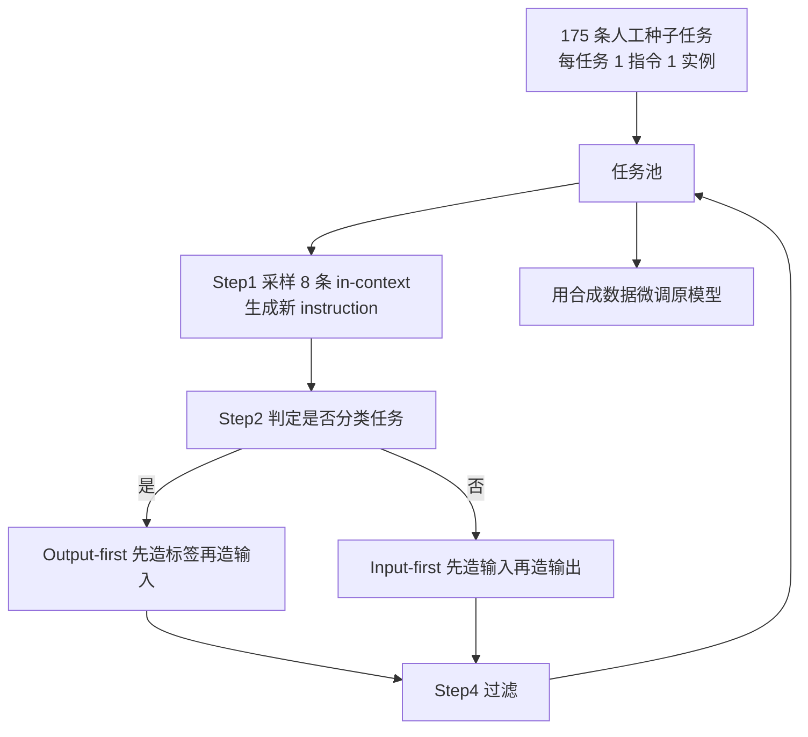

# Self-Instruct：几乎不标数据，也能把基座调成会听指令

<!-- release-date: 2022-12-20 -->

**本文依据**：`Self-Instruct: Aligning Language Models with Self-Generated Instructions`，arXiv **2212.10560v2**（[cs.CL] 25 May 2023），23 页，ACL 2023。作者 Yizhong Wang♣、Yeganeh Kordi♢、Swaroop Mishra♡、Alisa Liu♣、Noah A. Smith♣+、Daniel Khashabi♠、Hannaneh Hajishirzi♣+；University of Washington / Tehran Polytechnic / Arizona State University / Johns Hopkins University / Allen Institute for AI。代码与数据 https://github.com/yizhongw/self-instruct。原件首次公开日取 arXiv **v1** 提交日 **2022-12-20**；解读依据本地已核的 v2（封面印 v2、23 页）。文中数字都标 PDF 页码；标「外部补充」的段落不来自本文。

## 一句话

人工写指令贵、少、而且容易写成「又一个 NLP 分类题」。Self-Instruct 让**同一个**未对齐语言模型自己造 instruction / input / output，滤掉重复和明显废样本，再拿这些合成数据去微调自己。vanilla GPT-3（`davinci`，175B）在 Super-NaturalInstructions 未见任务上 ROUGE-L 从 **6.8** 升到 **39.9**，绝对值 **+33.1** 个百分点，几乎贴上 InstructGPT001 的 **40.8**（PDF p.1、p.6 表 3）。另外放出约 **52K** 条合成指令，以及 **252** 条专家写的新任务评测（PDF p.2、p.7）。

## 一、矛盾：指令微调卡在「人写不出足够多样的任务」

2022 年前后，能零样本跟指令走的模型已经很多：PromptSource、Super-NaturalInstructions（后文写作 SuperNI）、FLAN、InstructGPT 都走「大预训练模型 + 人写指令数据」这条路（PDF p.1）。

人写卡在两件事（PDF p.1、p.3）：

1. **数量与成本**：每条任务要 invent 任务定义，还要写出正确解。
2. **多样性**：人容易落到常见 NLP 任务和常见说法，覆盖不到用户真正会问的写法。

脚注 1 把比较对象钉死：主实验只比 `text-davinci-001`，因为它最接近「用人类演示做监督微调」。更新引擎用了更多数据（代码补全、最新用户查询）或 PPO，作者认为不好比（PDF p.1）。

于是问题换成：能不能几乎不标数据，从模型自己的生成里长出指令跟随能力。

## 二、全景：四步自举，再回调自己

图根据 PDF p.2 图 2 重画，机制示意，不是实测时间线。

任务池一开始只有 **175** 条种子：作者与 UW 实验室同事新写，不参考现成数据集和本文测试集；附录写明 **25** 条分类、**150** 条非分类（PDF p.2、p.3、p.14）。每轮从池里抽 **8** 条当示例：**6** 条来自人工种子、**2** 条来自已生成任务，用来推多样性（PDF p.3）。

生成结果再过滤，合格任务加回池。循环直到规模够大。最后用同一套数据微调**原来那个** GPT-3，得到 GPT3SELF-INST（PDF p.2）。

一条指令数据的形式（PDF p.3）：任务 $t$ 有自然语言指令 $I_t$，以及 $n_t \ge 1$ 个实例 $\{(X_{t,i}, Y_{t,i})\}$。模型应满足

$$M(I_t, X_{t,i}) = Y_{t,i}$$

指令和输入没有硬边界。「写一篇关于校园安全的作文」可以整句当指令（$X$ 为空），也可以拆成「就下列主题写作文」+ 输入「校园安全」。为了格式多样，论文明确允许空输入（PDF p.3）。

## 三、造数据：分类走一条路，非分类走另一条

### 1. 生成指令

few-shot 模板见表 5：列出 Task 1–8，让模型从 Task 9 往后续写，直到停、触长度，或写出 「Task 16」（PDF p.3、p.15）。

### 2. 判定是不是分类任务

论文把「输出标签空间很小、有限」的任务当分类（PDF p.3 脚注 4）。用 **12** 条分类种子 + **19** 条非分类种子做 few-shot，模板见表 6（PDF p.3）。

这一步不是学术洁癖。下一步的实例生成对两类任务用了不同顺序。

### 3. 实例生成：Input-first vs Output-first

**Input-first**（非分类，表 7）：先按指令造输入字段，再造输出。顺序接近真实使用，但分类任务上会塌：模型爱造「全是同一标签」的输入。语法纠错几乎全造语法正确的句子（PDF p.3）。

**Output-first**（分类，表 8）：先列出可能的类标签，再**按每个标签**条件生成输入，用来压标签不平衡（PDF p.3）。

脚注 5：实例生成用的是**固定**种子任务做提示，所以每轮每任务只造少量实例；作者把「随机换提示任务、多轮造更多实例」留给未来（PDF p.3）。

### 4. 过滤

- 新指令与池中任一已有指令的 ROUGE-L **小于 0.7** 才入库（PDF p.3–4）。
- 丢掉含 image / picture / graph 这类语言模型通常处理不了的关键词（PDF p.4）。
- 实例：完全相同丢掉；同一输入不同输出丢掉；指令过长或过短、输出只是复读输入，按启发式丢掉（PDF p.4）。

### 5. 微调怎么拼 prompt

把指令和输入拼成 prompt，标准监督地生成输出。为了对格式鲁棒，用多种模板：要不要 `Task:`、`Input:`、`Output:`，中间空几行，都变（PDF p.4）。

微调走 OpenAI API，默认超参，只把 prompt loss weight 设为 **0**，训 **2** 个 epoch，避免过拟合训练任务（PDF p.5、p.15）。API 内部更新哪些参数、用什么优化器，论文写明当时不可得（PDF p.14–15）。

## 四、造出来的数据长什么样

引擎是最大的 GPT-3 LM（`davinci`），走 OpenAI API（PDF p.4）。过滤后统计见表 1（PDF p.4）：

| 量 | 数值 |
|---|---:|
| 指令数 | 52,445 |
| 其中分类 | 11,584 |
| 其中非分类 | 40,861 |
| 实例数 | 82,439 |
| 空输入实例 | 35,878 |
| 指令平均词数 | 15.9 |
| 非空输入平均词数 | 12.7 |
| 输出平均词数 | 18.9 |

多样性：Berkeley Neural Parser 抽「最靠近根的动词 + 第一个直接宾语」。**26,559 / 52,445** 条有这种结构；其余是更复杂从句或问句。图 3 里最常见 20 个根动词及其 top-4 宾语只覆盖全集的 **14%**（PDF p.4–5）。图 4：每条生成指令相对 175 条种子的最高 ROUGE-L，有相当一部分重叠很低（PDF p.4）。

质量：随机 200 条指令、每条再随机 1 个实例，由作者之一当专家标对错（PDF p.4 表 2）：

| 问题 | Yes 比例 |
|---|---:|
| 指令是否描述有效任务 | 92% |
| 输入是否适合该指令 | 79% |
| 输出是否正确可接受 | 58% |
| 三字段全有效 | 54% |

作者的判断是：指令大多像样，实例更吵；但多数仍格式对或半对，训练「听指令」仍然有用（PDF p.4）。好例子、坏例子分别在表 10、表 11（PDF p.4）。

附录查询超参见表 4。2022 年 12 月 `davinci` completion 报价 **$0.02 / 1K tokens**，整份数据生成大约 **$600**；在全部生成数据上微调 GPT3SELF-INST 大约 **$338**（PDF p.14–15）。

## 五、实验 1：SuperNI 零样本，绝对值 +33.1 个百分点

评测集：SuperNI **119** 个未见任务，每任务 **100** 条实例。只给任务定义，没有 in-context 演示。GPT-3 系请求用确定性解码（temperature **0**、不用 nucleus），不设特殊 stop sequence（PDF p.6）。

指标是 ROUGE-L。表 3（PDF p.6）：

| 模型 | 参数量 | ROUGE-L |
|---|---:|---:|
| T5-LM | 11B | 25.7 |
| GPT-3 | 175B | 6.8 |
| T0（未见 SuperNI 训练） | 11B | 33.1 |
| GPT-3 + T0 训练 | 175B | 37.9 |
| GPT3SELF-INST（本文） | 175B | 39.9 |
| InstructGPT001 | 175B | 40.8 |
| Tk-Instruct（见过 SuperNI 训练） | 11B | 46.0 |
| GPT-3 + SuperNI 训练 | 175B | 49.5 |
| GPT3SELF-INST + SuperNI 训练 | 175B | 51.6 |

读表时分三圈（PDF p.6）：

1. vanilla GPT-3 几乎不能听指令：人工看会发现它常写无关、重复的文本，也不知道何时停。Self-Instruct 把它从 6.8 拉到 39.9，**+33.1**。
2. 在「没专门为 SuperNI 训练」那一档，GPT3SELF-INST 超过 T0 和「GPT-3 微调 T0 数据」，并几乎贴上 InstructGPT001（40.8）。T0 / SuperNI 训练为省预算各采样 **50K** 实例，但覆盖全部指令，规模与合成数据可比；作者引用 Wang et al. 2022 与早期实验：减少每任务实例数不伤未见任务泛化（PDF p.6）。
3. 在 SuperNI 训练数据上再叠一层合成数据，还能从 49.5 到 51.6。作者把 SuperNI 微调模型在自家评测集上更强，归因于指令风格和格式相近；Self-Instruct 仍是互补数据（PDF p.6）。

T0 与 Tk-Instruct 都用公开的 11B T5 最大版本（PDF p.5–6）。

## 六、实验 2：252 条专家写的新任务，人工评只差 5 个百分点

SuperNI 再全，也偏研究用 NLP、偏分类。作者子集先头脑风暴邮件、社交、效率工具、娱乐、编程等域，再为每域写指令和一条可选输入的实例，刻意变化长短和格式（要点、表、代码、公式）。共 **252** 条，每条 1 实例（PDF p.6–7）。与种子的平均 ROUGE-L：**相对 SuperNI 0.21，相对这 252 条 0.34**；与用户向测试集完全相同的种子指令只有一条「answer the following question」，后面的问题并不一样（PDF p.14）。

自动指标和普通众包都不够：有的任务是写程序、把一阶逻辑翻成自然语言。所以请**写该条指令的作者**评模型输出（PDF p.7）。四级（PDF p.7）：

- A：正确且令人满意
- B：可接受，有小瑕疵
- C：对得上指令，但内容有显著错误（例如先写出有效答案，再继续胡写）
- D：无关或完全无效

图 6：GPT3SELF-INST 明显超过用公开 T0 / SuperNI 数据微调的 GPT-3 变体。若把 B 也算有效，它只比 InstructGPT001 低 **5%** 绝对值。InstructGPT002 / 003 更强；作者猜测后续可用人工或奖励模型筛更好的生成，类似 Ouyang et al. 2022（PDF p.7）。四类评分的评分者间一致性 $\kappa=0.57$（PDF p.7）。

图 6 的柱是计数不是百分比，总分母是 252。正文只把「差 5 个百分点」和「大幅超过公开指令数据」写成结论；各档精确计数以原图为准（PDF p.7 图 6）。

## 七、数据量与质量：16K 之后几乎平台，蒸馏还能再抬一截

图 7 对人评 **A 档占比**，横轴对数（PDF p.8）：

- 最小点 **175**：只用种子任务微调，约 **31.0%**
- **800** 条约 **36.9%**
- **6400** 与 **51200** 分别约 **43.7%**、**44.4%**
- 用 InstructGPT003 重写全部实例的 output 再微调（作者称为对 003 的蒸馏），在 51200 附近约 **54.4%**，相对原合成输出大约再高 **10%**

作者观察：用户向 252 条上，增益在 **16K** 指令之后几乎平台，与 Wang et al. 2022 图 5 的数据缩放一致。在 SuperNI 上更早平台（大约数百条），因为新生成数据跟典型 NLP 任务不像（PDF p.8）。

## 八、和邻近工作差在哪（只写本文自己的边界）

- 相对「针对某一任务造数据 / 增强」：Self-Instruct 不绑定 QA 或 NLI，目标是从零自举**新任务定义**（PDF p.8）。
- 与并行的 Unnatural Instructions（Honovich et al. 2022a）：他们用 SuperNI 当种子、用 InstructGPT002 造数据，等于从已指令微调的模型蒸馏；本文只用 vanilla LM；流水线和模板也不同。作者认为两份数据互补（PDF p.8–9）。
- 相对自训练：自训练通常假设已有目标任务和未标注例子；这里从零造多种任务（PDF p.9）。
- 相对知识蒸馏：源和目标是**同一个**模型；蒸馏内容是「指令任务」（PDF p.9）。

Broader Impact 写到截稿时，中心想法已被若干后续工作采用，文中点名 Taori et al. 2023、Xu et al. 2023、Sun et al. 2023（PDF p.10）。那些系统怎么训、叫什么名字，不在本篇范围。

## 九、限制（论文自己写的）

第八节三条（PDF p.10）：

1. **长尾**：会继承 LM 的头重尾轻。收益可能偏向前训练里常见的指令，对少见、很创意的指令可能脆。
2. **依赖大模型**：归纳偏置来自 LM，可能对更大模型更有效，算力门槛高。作者希望后人按模型规模画增益曲线，并提醒：用人标注做指令微调也有「越大收益越高」的同类限制（Wei et al. 2022）。
3. **强化模型偏见**：迭代可能放大刻板印象；算法还很难造出平衡标签，这本身就反映先验偏见。

另外，OpenAI 微调 API 不透明：更新哪些参数、优化器是什么，当时拿不到（PDF p.14–15）。实例生成每任务数量受固定种子提示限制（PDF p.3 脚注 5）。人工评测由指令作者担任，不是独立众包（PDF p.7）。

论文没写：开源小模型上的同样流水线、RLHF/PPO 细节、多轮对话、以及后续社区用这份 52K 数据训出来的具体开源聊天模型配方。那些是后话，不是这篇 ACL 论文的主张。

## 十、可迁移的几条

1. **先承认人写指令的瓶颈是多样性，不只是条数。** 公开 NLP 指令集可以很大，仍然不像用户会写的句子。252 条专家新任务和 SuperNI 是两套题。
2. **自举要拆成「造任务定义」和「造实例」。** 分类用 output-first，是为了标签平衡，不是为了多一个模块名字。
3. **过滤很便宜但很硬：ROUGE-L 0.7、禁图像词、去重输入。** 54% 三字段全对已经能把 GPT-3 从 6.8 拉到 39.9；完美标注不是起步条件。
4. **合成数据可以叠在已有人工指令集上。** 表 3 第三圈：SuperNI + Self-Instruct 比单用 SuperNI 高。
5. **质量比继续堆到 50K 更值钱。** 16K 后平台；用更强模型重写 output 还能再抬约 10 个百分点（人评 A 档）。
6. **比较对象要钉引擎。** 作者拒绝拿 002/003 当 SuperNI 对照，因为那些引擎可能已经见过测试分布。

## 关键词回看

- **指令微调（instruction tuning）**：用「任务说明 + 输入 → 输出」监督，让预训练模型听自然语言指令。
- **种子任务（seed tasks）**：175 条人工写的起步任务，每条 1 指令 1 实例。
- **Input-first / Output-first**：非分类先造输入；分类先造标签再造输入。
- **GPT3SELF-INST**：用自己生成的约 52K 指令微调后的 `davinci`。
- **SuperNI**：Super-NaturalInstructions，本文零样本 NLP 评测床。
- **InstructGPT001**：`text-davinci-001`，本文的主对照。

## 参考资料

- 论文 PDF（本地 v2）：`readings/_src/训练方法与强化学习/Self-Instruct.pdf`
- arXiv：https://arxiv.org/abs/2212.10560
- 代码与数据：https://github.com/yizhongw/self-instruct
