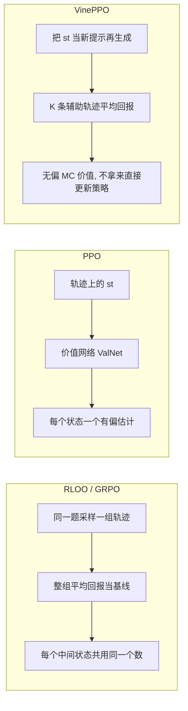

# VinePPO：PPO 的价值网络分不清哪一步有用，就用蒙特卡洛把信用分回去

<!-- release-date: 2024-10-02 -->

**本文依据**：`VinePPO: Refining Credit Assignment in RL Training of LLMs`，arXiv 2410.01679**v2**（[cs.LG] 3 Jun 2025），34 页，封面标 *Proceedings of the 42nd International Conference on Machine Learning*（ICML 2025，Vancouver，PMLR 267）。作者 Amirhossein Kazemnejad*、Milad Aghajohari*、Eva Portelance、Alessandro Sordoni、Siva Reddy、Aaron Courville†、Nicolas Le Roux†；等号贡献 / 等号指导。机构脚注：Mila、Microsoft Research、McGill University、Canada CIFAR AI Chair、Université de Montréal、HEC Montréal。代码 https://github.com/McGill-NLP/VinePPO。原件首次公开日取 arXiv **v1** 提交日 **2024-10-02**；解读依据本地已核的 v2（`pdfinfo` Pages: 34）。文中数字都标 PDF 页码；标「外部补充」的段落不来自本文。

## 一句话

在数学推理这种「走很多步才给一次对错」的任务上，PPO 用来做信用分配的价值网络经常估不准中间状态，排序下一步时几乎不比随机好。VinePPO 不另训 critic：语言环境可以随时把部分上下文再喂回去，从任意中间状态做蒙特卡洛回溯，得到无偏的价值估计。MATH / GSM8K 上它超过 PPO 以及丢掉细粒度信用分配的基线；虽然每步更慢，但达到 PPO 峰值准确率的墙钟更少（最多 **3.0x**）。

## 一、矛盾：奖励拖到最后，中间哪一步该加分？

LLM 做数学、写代码、上网导航时，往往要先生成一长串推理步骤，最后才看到对不对（PDF p.1）。不是每一步都同样重要。图 1.a 的例子里，只有 $s_2$ 把复数乘法展开对了，后面成功概率从 0.4 跳到 1.0；其余步骤优势接近 0（PDF p.2 图 1）。

这就是强化学习里的 **信用分配（Credit Assignment，CA）**：动作和最终效果隔得很远，很难判断该奖励谁、惩罚谁（PDF p.1）。

**近端策略优化（Proximal Policy Optimization，PPO）** 用价值网络（critic）估中间状态的期望累计奖励，再据此算优势、更新策略（PDF p.1）。理想情况下，$s_2$ 之后价值该很高。

可是 **直接偏好优化（Direct Preference Optimization，DPO）**、**组相对策略优化（Group Relative Policy Optimization，GRPO）** 这类方法把细粒度 CA 丢掉，整段回复当一个动作、token 一视同仁，照样能训出强模型（PDF p.1）。这和「延迟奖励必须精确 CA」的经典 RL 说法打架。

作者的诊断不是「CA 没用」，而是：**PPO 手里的价值网络，在推理任务上本身就很差。** 系统评测里，它对期望回报估不准，比较候选步骤时几乎赢不了随机基线（PDF p.1，细节在第 7 节）。于是问题换成：如果把 PPO 的信用分配修好，而不是扔掉，LLM 的 RL 训练还能再涨多少？

## 二、三条路怎么给中间状态打分

图 2 把同一条训练轨迹上的 $s_1$、$s_2$ 摆在一起（PDF p.3）。

（机制示意，根据 PDF p.3 图 2。）

- **RLOO / GRPO**：对同一题 $x$ 采一组轨迹，用组内平均回报当策略梯度基线。GRPO 再把回报标准化成单位方差。中间状态被一视同仁。RLOO 的基线可以看成**只对初始状态**做了蒙特卡洛价值估计（PDF p.3）。
- **PPO**：另训一个价值网络 $V̂_\phi(s_t)$。图 2 示例里 $s_1$ 估成 0.1934、$s_2$ 估成 0.5733（PDF p.3）。
- **VinePPO**：从 $s_t$ 再滚出辅助轨迹 $\eta_k$，用回报均值当 $V̂_{\mathrm{MC}}(s_t)$。示例里 $s_1$ 得 0.66、$s_2$ 得 1.00。$\eta_k$ **只用于估价值，不直接进策略更新**（PDF p.3）。

语言环境相对通用 RL 环境的便宜之处：状态就是「提示 + 已生成 token」。要重置到中间态，只要把那段部分上下文再喂给当前策略，不必真的倒带物理世界（PDF p.2）。

相关工作里，作者把 VinePPO 和「用 MC 找推理链关键错误、再塞进 DPO」的路线分开：本文是在 **PPO 框架里从原则上修 CA**，不是另做过程奖励（PDF p.2）。过程监督、逐步奖励模型是正交的——它们改奖励，VinePPO 改的是给定奖励之后怎么分配信用（PDF p.3）。

## 三、语言生成怎么写成 MDP，PPO 的 critic 在估什么

策略 $\pi_\theta$ 是语言模型。给定输入 $x$，自回归生成回复 $y$。RL 微调要最大化有限视界、**不折扣**（$\gamma=1$）的期望回报，同时用 KL 把策略钉在参考策略 $\pi_{\mathrm{ref}}$（通常是初始 SFT）附近（PDF p.4 式 1）：

$$
J(\theta)=\mathbb{E}_{x\sim\mathcal{D},\,y\sim\pi(\cdot|x)}[R(x;y)]-\beta\,\mathrm{KL}[\pi_\theta\|\pi_{\mathrm{ref}}]
$$

$\pi_\theta$ 从 $\pi_{\mathrm{ref}}$ 初始化。

状态 $s_t$ 是提示拼上已生成前缀；$a_t$ 是下一个 token。转移是确定性的：把 $a_t$ 接到 $s_t$ 后面。中间步奖励全是 0，**序列级奖励只打在生成结束那一步**。一条轨迹的累计回报就是最后那个 $R(x;y)$（PDF p.4）。

策略梯度按优势加权（PDF p.4 式 2）。优势写成（确定性转移下，PDF p.4 式 3）：

$$
A(s_t,a_t)=r_t+\gamma V(s_{t+1})-V(s_t)
$$

$V(s_t)$ 是从该状态起跟当前策略走下去的期望累计奖励。PPO 用价值网络 $V̂_\phi$ 去逼近它，再代入上式或 GAE。价值网络和策略一起训，目标是预测值与经验回报 $G_t$ 的均方误差（PDF p.4 式 4）；实现上还会 clip。LLM 微调里 critic 常从初始 SFT（或奖励模型）初始化，把语言模型头换成标量头（PDF p.4）。

附录里他们发现 GAE 的 $\lambda=1$ 最好；$\gamma=1$ 时 GAE 退化成「从现在起到结束的回报减去 $V̂_\phi(s_t)$」（PDF p.13–14）。超参表里 $\gamma=1.0$、$\lambda=1.0$（PDF p.16 表 1）。

## 四、VinePPO：从中间状态再滚 $K$ 条，当无偏价值

因为状态是 token 拼接，可以从任意 $s_t$ 让当前 $\pi_\theta$ 继续写完。对训练轨迹上的每个（分组后的）状态，采 $K$ 条辅助轨迹 $\eta_1,\ldots,\eta_K\sim\pi_\theta(\cdot|s_t)$，价值就是回报均值（PDF p.5 式 5）：

$$
\hat{V}_{\mathrm{MC}}(s_t)=\frac{1}{K}\sum_{k=1}^{K} R(\eta_k)
$$

再代入式 3 得到优势（PDF p.5 式 6）：

$$
\hat{A}_{\mathrm{MC}}(s_t,a_t)=r(s_t,a_t)+\gamma\,\hat{V}_{\mathrm{MC}}(s_{t+1})-\hat{V}_{\mathrm{MC}}(s_t)
$$

对任意 $K\ge 1$，用 $\hat{A}_{\mathrm{MC}}$ 算出的策略梯度是期望回报梯度 $g_{\mathrm{pg}}$ 的**无偏**估计。然后仍走 PPO 的 clip 更新，只换优势这一段（PDF p.5）。

$K$ 是方差和采样成本的旋钮：加大 $K$ 降方差、加采样。默认实验 $K=9$，并在 6.4 节做 1 / 3 / 9 消融（PDF p.6）。

为了算得起，他们把**同一个推理步骤里的 token 绑成一组**，只估一次优势，再赋给该步所有 token。粒度可以拿算力换：算力多就分得更细（PDF p.5；切分规则在附录 B）。MATH 先按换行和标点切，避开公式内部；超过 100 字符再尝试在数学模式的等号处切开。GSM8K 直接按换行切（PDF p.14）。

现代推理引擎让这种「当场再生成」可行。脚注写：单卡 Nvidia A100、7B、bfloat16，生成可达约 **5K tokens/second**（PDF p.5）。

只改优势、超参与 PPO 对齐，是为了把「信用分配变好」从别的实现细节里隔离出来（PDF p.5–6）。

## 五、实验怎么摆：模型、数据、公平预算

公开模型与数据（PDF p.5）：

- 底座：DeepSeekMath 7B、RhoMath 1.1B 的 **base**（不是 Instruct），先在对应训练集上 SFT 得到 $\pi_{\mathrm{ref}}$。全文说的模型名都指这些 SFT 初始化后的 RL 跑。
- 数据：MATH（竞赛级）、GSM8K（小学应用题）。
- **全参数**微调。

MATH 用 Lightman 等提供的 OpenAI 划分：测试 500、训练再拆成 11,500 训 / 500 验证。答案用 `\boxed{}` 抽取比对。GSM8K：测试 1,319，训练再拆 7,100 / 373 验证；答案是整数，用 `####` 标记（PDF p.14）。

奖励是对最终答案的 **0/1** 对错，不按 batch 做奖励标准化（PDF p.6、p.16）。每题采 **8** 条 episode，数据集扫约 **8** 遍，各方法每题一共 **64** 条 episode（PDF p.5）。PPO 先大范围搜超参并按当时 RLHF-PPO 最佳实践实现；VinePPO **原样继承**，只换优势（PDF p.5）。RLOO / GRPO 从 PPO 超参出发再调 KL 以求稳住。RestEM、DPO$^+$（DPO-Positive）按原实现，样本消耗对齐（PDF p.6）。

评测：测试集 **Pass@1**（最终答案对不对）。生成最长 1024 token、温度 0.35；每个分数是 **16** 次不同随机种子的平均（PDF p.17）。选 checkpoint 看验证集（PDF p.5）。

PPO 关键超参（PDF p.16 表 1）：AdamW，学习率 $1\times10^{-6}$，MATH 1000 step / GSM8K 650 step，每 prompt 8 条回复，每 PPO step 512 条 episode（64 个 prompt），mini-batch 64，内循环 2 epoch，采样温度 0.6，KL 系数 $\beta=10^{-4}$，策略与价值 clip $\epsilon=\epsilon'=0.2$。RhoMath 最大序列 2048，DeepSeekMath 7B 为 2500。RL 阶段关掉 dropout。超长回复截断后把奖励打在截断后的最后 token；试过给截断 -1 惩罚，没有涨点（PDF p.16）。

硬件对照：MATH 上每训练 step 平均墙钟——RhoMath 1.1B、4×A100 80GB：PPO **80 s**、VinePPO **380 s**；DeepSeekMath 7B、8×H100 80GB：PPO **312 s**、VinePPO **583 s**（PDF p.20 表 5）。

## 六、数字：更准、更省墙钟、同样训练集上更能泛化

### Pass@1（图 4，PDF p.6）

越高越好。图中柱高如下（论文未另给误差棒）。

| 设定 | Init.SFT | RestEM | RLOO | GRPO | DPO$^+$ | PPO | VinePPO |
|---|---:|---:|---:|---:|---:|---:|---:|
| GSM8K · RhoMath 1.1B | 40.3 | 42.8 | 44.5 | 44.6 | 46.4 | 50.1 | **53.4** |
| MATH · RhoMath 1.1B | 15.5 | 17.3 | 17.3 | 17.8 | 19.2 | 18.1 | **23.0** |
| GSM8K · DeepSeekMath 7B | 69.6 | 72.0 | 75.3 | 74.8 | 74.4 | 78.9 | **80.1** |
| MATH · DeepSeekMath 7B | 32.8 | 34.9 | 36.8 | 36.4 | 37.6 | 42.8 | **46.0** |

更难的 MATH 上差距更大。作者量了 PPO critic 的解释方差，任务间大约 **0.7–0.9**，用来说明不是 critic 没训够（PDF p.7，图 D.5）。PPO 与 VinePPO 只差价值估计，对比就是在比 CA。

附录还写：给定 KL 预算，VinePPO 测试准确率更高（图 D.8）；对更高采样温度也更稳（图 D.10）（PDF p.7）。GSM8K 上 7B 的差距更窄，但 VinePPO 仍以明显更低的 KL 拿到更高准确率；GSM8K 回复更短，MC 估价值更快（PDF p.21）。

### 墙钟：每步更慢，总时间更少

PPO 要多占一份价值网络显存——7B 连模型带优化器大约 **112GB**——还要为 critic 做前向，以及前向–反向训练（PDF p.7）。VinePPO 用 MC 换掉 critic。生成贵，所以每步更慢：相对 PPO，RhoMath 最多约 **5x**，DeepSeekMath 7B 约 **2x**（PDF p.7）。正文图 6 口径是「最多 2x（7B）和 5x（1.1B）」（PDF p.7）。

补偿是每步更有效。同一硬件上，VinePPO 用更少梯度步、更少墙钟追上 PPO 的峰值准确率。图 6（只画到 PPO 最终表现）：RhoMath 1.1B 约 **3.0x** 更少时间、约 **9x** 更少步；DeepSeekMath 7B 约 **1.51x** 更少时间、约 **2.8x** 更少步（PDF p.7）。超参是为 PPO 搜的，换 VinePPO 仍能在同一算力预算里涨点。

### 泛化斜率

图 5 横轴训练准确率、纵轴测试准确率。VinePPO 斜率最陡：拟合同样多的训练样本，测试涨得最多。光谱另一端，RestEM 后期过拟合（PDF p.6–7）。作者的解读：难且可验证的推理题很缺，拟合掉一条训练题就不再提供新信号；把算力花在修 CA，比硬拟合更划算（PDF p.7）。

### $K$ 消融（RhoMath 1.1B · MATH，图 7，PDF p.7）

图 7.a 柱高：PPO **18.1**；VinePPO $K=1$ **19.9**、$K=3$ **21.2**、$K=9$ **23.0**。加大 $K$ 准确率单调升。每步更慢，但方差下降，总体收敛仍更快；作者把加大 $K$ 写成「有多余算力时的实用旋钮」。即便 $K$ 很小，这个设定里也能工作（PDF p.7–8）。GSM8K 的同类图见附录 D.11（PDF p.7）。

## 七、价值网络到底差在哪

PPO 和 VinePPO 只差价值预测。作者在轨迹的每个推理步上用 **256** 次 MC 平均当「真值」，再比两边的预测（PDF p.8）。主文展示 DeepSeekMath 7B · MATH。

脚注：从某步出发的回报是伯努利。256 次平均在成功率 0.5（方差最大）时，估计方差约 $0.25/256\approx0.001$（PDF p.8）。

图 3 的 MAE：VinePPO **0.03**，PPO **0.11**，RLOO **0.18**，GRPO **0.15**（PDF p.3）。VinePPO 无偏，方差在 0.5 附近最大、在 0 和 1 掉到 0。PPO 偏差大，常把真值接近 0 的坏状态判成好、反过来也一样（PDF p.8）。

把「预测落在真值 $\pm0.05$ 内」当分类正确：PPO 的价值网络一开始很低，慢慢到 **65%**；VinePPO 训练全程大约 **70–90%**（PDF p.8，图 D.12）。

**排下一步。** 从同一状态采五个可能的下一步，看谁把真值最高的那步排第一。PPO 的价值网络大部分训练过程接近随机，后期略好；VinePPO 全程明显更高（PDF p.8 图 8.b）。

**沿推理链的误差。** 把步位置归一化（10 步里的第 3 步记 0.3）。PPO 的 MAE 随推理推进变差（作者猜测前段更像训练分布、能靠记；后段更散、泛化差）。VinePPO 则越往后越准——后面条件更长、策略更确定，同样 $K$ 次 MC 更稳（PDF p.8 图 8.a）。

## 八、讨论、限制、没写什么

讨论（PDF p.8）：更好的 CA 能改进 LLM 的 RL 训练。VinePPO 被写成「修 PPO 坏掉的信用分配」的垫脚石，并指向两条后续：① 这是作者所说第一个靠加大 post-training 算力来抬高泛化斜率的 RL 后训练算法；② 从通用深度 RL 借来的默认实现，隐含假设不一定适合已经很强的 LLM——随机策略阶段更该多采环境样本，而有能力的 LLM 更该把算力花在把每次梯度走对（PDF p.8–9）。

正文没有单独的 Limitations 节。能从设定里读出的边界：

- **每步更慢。** MC 生成换掉 critic，墙钟优势来自更少步数，不是单步更快（PDF p.7、表 5）。
- **步骤分组。** 一步一个优势，不是 token 级；粒度与算力对换（PDF p.5）。
- **辅助轨迹不更新策略。** 因为那些轨迹上没有 CA（PDF p.5）。
- **任务面。** 主实验是 MATH / GSM8K 与两个数学向底座；网页导航、代码等只在引言当动机出现，没有对应实验（PDF p.1、p.5）。
- **奖励形态。** 可验证的最终答案 0/1，不是人类偏好的稠密奖励模型（PDF p.6）。
- **对比范围。** 不声称全面打败所有后训练方法；DPO$^+$、RestEM、RLOO、GRPO 是「故意不做细粒度 CA」的对照（PDF p.5）。

Impact Statement 提醒更强推理也可能被滥用（PDF p.9）。实验算力来自 Mila IDT 与 Digital Research Alliance of Canada（PDF p.9）。

论文没写：非数学任务上的迁移数字、token 级（不分组）MC 的完整曲线、把 $\eta_k$ 也并进策略更新会怎样、以及和过程奖励模型叠在一起的联合实验。

## 九、可迁移的几句话

1. **语言环境能免费重置。** 中间状态就是前缀。与其再训一个在长链上泛化很差的 critic，不如从该前缀再采样估 $V$。
2. **无偏比「有一个网络」更要紧。** PPO critic 解释方差可以到 0.7–0.9，排序下一步仍近随机。看 CA 质量不要只看价值拟合。
3. **墙钟要以峰值表现计。** 单步 5 倍慢，仍可能 3 倍更早追上基线峰值。
4. **可验证题稀缺时，盯测试–训练斜率。** 同样训练集拟合程度下，测试更高，说明信用分对了、没有靠背题。
5. **$K$ 是显式的算力旋钮。** 默认 9 不是魔法数；$K=1$ 已超过该设定的 PPO。
6. **对照时对齐 episode 预算和 SFT 起点。** 否则「丢掉 critic 也一样强」可能只是实现或预算没对齐。

这些不依赖 VinePPO 这个名字：任何「奖励稀疏、状态可重置、生成已经很快」的 LLM RL 设定都可以先问一句——价值网络是在做 CA，还是在背前缀。

## 关键词回看

- **信用分配（CA）**：延迟奖励下，判断每一步对最终对错的贡献。
- **价值网络 / critic**：PPO 用来估 $V(s_t)$ 的另一份模型；本文认为它在推理链上不可靠。
- **蒙特卡洛价值 $\hat{V}_{\mathrm{MC}}$**：从 $s_t$ 再生成 $K$ 条续写，平均最终回报。
- **辅助轨迹 $\eta_k$**：只估价值，不直接做策略梯度。
- **推理步分组**：一步共享一个优势，用算力换粒度。
- **泛化斜率**：训练准确率升高时，测试准确率跟多快；VinePPO 最陡，RestEM 会过拟合。
- **RLOO / GRPO**：组内回报当基线，中间状态同等加权；对照用，不是本篇主角。

## 参考资料

- 论文 PDF（本地）：`readings/_src/训练方法与强化学习/VinePPO.pdf`
- arXiv：https://arxiv.org/abs/2410.01679
- 代码：https://github.com/McGill-NLP/VinePPO
