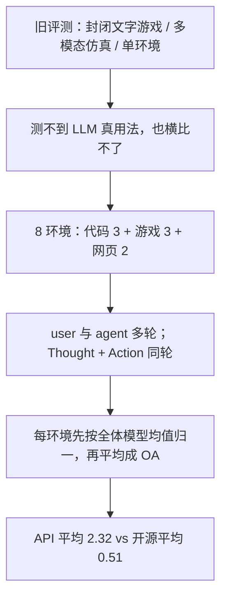

# AgentBench：8 个交互环境、29 个模型，商业 API 平均 2.32、开源平均 0.51，失败主因是长程推理、决策和指令遵循

<!-- release-date: 2023-08-07 -->

**本文依据**：`AgentBench: Evaluating LLMs as Agents`，arXiv 2308.03688v3（页眉 `[cs.AI] 4 Oct 2025`），58 页。封面与每一页页眉印 `Published as a conference paper at ICLR 2024`。封面标题大小写混排，正文写成正常大小写。作者 Xiao Liu、Hao Yu、Hanchen Zhang 等（共同一作；Hao Yu、Yu Gu 访问清华期间完成；通讯 Yuxiao Dong、Jie Tang），机构 1 Tsinghua University、2 The Ohio State University、3 UC Berkeley（PDF p. 1）。第一作者单位是 Tsinghua University。盘上是 v3。首发日取 arXiv 页面 `Submitted on 7 Aug 2023`（[arxiv.org/abs/2308.03688](https://arxiv.org/abs/2308.03688)），这是外部补充，不来自 PDF 正文。ICLR 2024 录用印在封面，可作录用信息，但不进 `release-date`。代码与评测包封面写明 `https://github.com/THUDM/AgentBench`（PDF p. 1）。文中数字均标 PDF 页码；标「外部补充」的段落不来自本文。

## 一句话

LLM 已经能当助理、跑 AutoGPT 一类循环，但评测还停在封闭文字游戏、单环境仿真或纯文本考试（PDF p. 2）。AgentBench 把 **8** 个可执行环境（代码 / 游戏 / 网页三类接地）做成同一套多轮交互，测 **29** 个 API 与开源模型（PDF p. 1–3、表 1 p. 3）。顶尖商业模型能在复杂环境里当 agent；不大于 70B 的开源模型差距很大：图 1 里 API 平均总分 **2.32**、开源平均 **0.51**，gpt-4 总分 **4.01**（PDF p. 1 图 1、表 3 p. 7）。失败主因不是某一门知识考砸，而是 **长程推理、决策、指令遵循** 不够（PDF p. 1）。改进指令遵循、用高质量多轮对齐数据能抬 agent 分；代码训练对任务的影响是双向的，不能当成万能药（PDF p. 1、p. 8）。贯穿全文的轴不是「再做一个更难的 MMLU」，而是：**什么叫做在环境里把活干完、总分怎么加权才不会被网店刷满、数字怎么读才不会把某一环境的第一名当成全能 agent。**

## 一、矛盾：agent 应用已经热闹，评测还在测「会说话」或「会打封闭游戏」

智能体（能决策、能在环境里执行动作）是 AI 的老概念（PDF p. 1）。深度学习在视觉和 NLP 上走得很远，但「能落地的助理」仍然薄（PDF p. 1）。GPT-4 一类模型经过对齐，不只会传统 NLP，还能听人话、执行指令，于是出现 AutoGPT、BabyAGI、AgentGPT，以及社交 / 游戏里的 LLM agent（PDF p. 2）。

缺的是系统、标准的 **LLM-as-Agent** 评测（PDF p. 2）。旧路有三条坑：

1. **文字游戏**（TextWorld、Jericho、LIGHT 一类）：动作空间封闭、离散，主要测常识接地，不像真用（PDF p. 2）。
2. **具身仿真**（游戏、GUI、室内场景）：复杂、多模态，挡着当时大量纯文本 LLM，也偏离 LLM 的实际用法（PDF p. 2）。
3. **单环境榜**：看不清跨场景能力（PDF p. 2）。

AgentBench 的回答是：做多维基准，8 个环境，评估推理和决策；数据集、环境、一体化评测包一起开源（PDF p. 1）。8 个里 **5 个是新造的**（PDF p. 2）。三类接地（PDF p. 2）：

- **代码**：操作系统、数据库、知识图谱。
- **游戏**：数字卡牌、海龟汤（lateral thinking puzzles）、家务（ALFWorld）。
- **网页**：网购（WebShop）、浏览（Mind2Web）。

全部改写成纯文本 LLM 能当自主 agent 的交互环境（PDF p. 2）。顺带覆盖指令遵循、写代码、知识获取、逻辑推理、常识接地（PDF p. 2）。作者的定位：这是当时第一份系统评 LLM-as-Agent 的基准，也第一次用 agent 任务去量 LLM（PDF p. 9）。这是作者声明，不是独立复现结论。

上图根据 PDF p. 1–3、p. 6–8 重画，是评测口径示意，不是实测曲线。

## 二、什么叫「做对了」：交互轨迹、五种结局、总分不能裸平均

### 交互协议

对话只有两个角色：user（指令与环境反馈）和 agent（PDF p. 6）。轨迹记成 $(u_0, a_0, \ldots, u_k, a_k)$。推理时上下文按粗算 token 截到 **3500**：取最小的 $r$，使 $(u_0, a_r, u_{r+1}, \ldots, u_k)$ 不超过 3500，并在 $u_0$ 里加 `[NOTICE] 2r messages are omitted.`（PDF p. 6）。token 不是各模型自己的分词器，而是：长 $n$ 的词占 $\lceil n/6 \rceil$ 个 token，非空白字符占 1（PDF p. 6 脚注 2）。非对话模型（如 text-davinci-003）再在每条前面加 `USER:` / `AGENT:`，末尾加 `AGENT:`（PDF p. 7）。

任务提示改编自 ReAct：同一轮里既有 Thought（CoT）又有 Action；指令里通常给一条简单 CoT 示范，好卡格式（PDF p. 7）。全部任务 **temperature=0**（贪心），跟 Wei 等人的 CoT 设定走，图的是可复现（PDF p. 7）。

### 五种结局

第 2 节把一次任务收成（PDF p. 4；表 4 用同一套缩写，p. 8）：

- **Complete**：正常结束。
- **CLE（Context Limit Exceeded）**：历史超上下文。正文说只发生在 2048 长度的 text-davinci-002 / 003（PDF p. 4）。
- **IF（Invalid Format）**：没按格式指令输出。
- **IA（Invalid Action）**：格式对了，动作不合法。
- **TLE（Task Limit Exceeded）**：到了预设最大轮数，或开始长时间重复生成。

IF / IA 多半是指令遵循差；TLE 多半是多轮能力弱（PDF p. 4）。后文会看到：TLE 是全基准最主要的失败类型（PDF p. 8）。

### 题量和效率

表 2（PDF p. 6）是 8 环境的规模。预估解题轮数从 5 到 50；每环境有 Dev / Test。Dev 合计 **269** 题、约 **3k** 次推理调用；Test **1,014** 题、约 **11k** 次，和 MMLU 的调用量大致同级（PDF p. 6）。全部公开。

| 环境 | 预估轮数 | 指标 | Dev（题 / 轮） | Test（题 / 轮） | Weight$^{-1}$ |
|---|---|---|---|---|---|
| Operating System | 8 | SR | 26 / 240 | 144 / 1200 | 10.8 |
| Database | 5 | SR | 60 / 300 | 300 / 1500 | 13.0 |
| Knowledge Graph | 15 | F1 | 20 / 300 | 150 / 2250 | 13.9 |
| Digital Card Game | 30 | Reward | 12 / 360 | 20 / 600 | 12.0 |
| Lateral Thinking Puzzle | 25 | Game Progress | 20 / 500 | 50 / 1250 | 3.5 |
| House Holding | 35 | SR | 20 / 700 | 50 / 1750 | 13.0 |
| Web Shopping | 5 | Reward | 80 / 400 | 200 / 1000 | 30.7 |
| Web Browsing | 10 | Step SR | 31 / 400 | 100 / 1000 | 11.6 |

Weight$^{-1}$ 是该任务上 **全体被评模型的平均分**，用作总分权重的倒数（PDF p. 6、p. 7）。Web Shopping 平均分 **30.7**，海龟汤只有 **3.5**：如果裸平均，网店会淹没一切（PDF p. 7）。做法：先把每任务全体模型均值缩放到 1，再对模型跨任务平均；以后算 OA 时，用这次测到的各任务平均分的倒数当 **固定权重**（PDF p. 7）。读表 3 的 OA 时，记住它已经压过「好刷的环境」。

### 工具包

模型几乎都走 API。作者做了一套 HTTP 模型服务 + Docker 封环境 + 每任务独立 worker，避免环境互踩（PDF p. 6）。评测客户端用最大流（Edmonds–Karp）在 agent 与 task worker 之间派样本，可断点续跑（PDF p. 20–21、图 5）。这是工程贡献，不是分数本身。

## 三、8 个环境：代码要真执行，游戏要真决策，网页要真点

图 4 给了每个环境的任务、动作空间、观测（PDF p. 19）。下面按三类接地写清「测什么、怎么判对」，不把附录提示词整段抄进来。

### 代码接地

**操作系统（OS）**。真 Ubuntu Docker 里交互 bash（PDF p. 4）。题有两类：问答（例如统计非空目录个数，最后必须 commit 答案）和操作（例如递归改权限，用检查脚本看系统状态）（PDF p. 21–22）。约一半指令来自人：从 Stack Overflow 带 bash/shell 标签的约 **6000** 题按赞排序，8 名编程背景标注员选题、写初始化 / 启动 / 检查脚本，交叉核对，每题约 **2 小时**；另一半多为 gpt-4 生成的 QA，用单元测试滤掉初始化失败或示例代码答不对的（PDF p. 22）。Test **144** 题（表 2 p. 6）。默认超 **8** 轮判失败（PDF p. 22）。指标是成功率 SR。动作主要是 bash 与 commit / answer / finish（PDF p. 22–23）。

**数据库（DB）**。真 MySQL 接口、真表、真查询，而不是只做 Text-to-SQL 或单张小表问答（PDF p. 4）。源来自 WikiSQL、WikiTableQuestions、SQA、HybridQA、FeTaQA，再用 gpt-3.5-turbo 增广行和 SQL、改写问句，滤完采成 **300** 条 Test，三类操作：select / insert / update（PDF p. 24）。select 比文本答案（忽略顺序，单数字接受等价写法）；insert / update 比改表后的哈希（PDF p. 25）。SR 是三类宏平均（PDF p. 25）。格式极严：必须 `Action: Operation` 加一行 markdown SQL（PDF p. 25）。后文 gpt-4 也会在这里漏掉 `Action` 标签（PDF p. 46）。

**知识图谱（KG）**。面对 Freebase 这种规模（正文写超过 **45M** 实体、**3B** facts 量级）时，agent 要用工具查询，而不是把图塞进上下文（PDF p. 4）。指标是 F1（表 2 p. 6）。图 4 样例：找与 Hurricane Marie 类似、影响过东部北美的热带气旋（PDF p. 19）。预估约 **15** 轮（表 2）。表 4 里该环境 TLE 占 **67.9%**（全模型平均），是长程工具使用最容易耗尽轮数的地方之一（PDF p. 8）。

### 游戏接地

**数字卡牌（DCG）**。简化版 Aquawar，来自 2021 THU Agent Competition（PDF p. 5）。agent 控一队有不同天赋的鱼，回合制打算法对手。指标是胜率 / Reward（PDF p. 5、表 2）。测的是读规则、读局势、做策略，而不是背固定流程。表 4 里该环境 Invalid Format **38.5%**、Invalid Action **10.2%**（PDF p. 8）——格式和合法出牌都卡人。

**海龟汤（LTP）**。一人主持、其他人只许问「是 / 否 / 无关」的情境谜题（PDF p. 5）。作者做了自动主持，从网上收不同难度谜题，把情节收成若干进度点（game progress）（PDF p. 5）。指标就是 Game Progress。表 2 的 Weight$^{-1}$ 只有 **3.5**，是 8 环境里全体模型平均分最低的（PDF p. 6）——横向推理普遍差。表 4 里 TLE **82.5%**，8 环境最高（PDF p. 8）。

**家务（HH / ALFWorld）**。TextWorld 系的室内家务：例如「把干净的皂放到台面上」（PDF p. 5、p. 19）。动作必须落在当前房间允许的列表里。指标 SR。表 4 里 Invalid Action **64.1%**，8 环境最高（PDF p. 8）：模型会发明环境里没有的动作。附录用同一道「clean soapbar → countertop」对照 gpt-4 与 gpt-3.5-turbo：前者能分解成 Find → Clean → Put，在抽象规划树上深度优先并回溯，找不到皂还会自我修正去查台面本身；后者开柜、关柜、再开同一柜，逐渐忘掉原计划（PDF p. 48–54、图 7 p. 51）。

### 网页接地

**网购（WS / WebShop）**。搜、看、选商品（PDF p. 5）。原论文评的是专门训练的 agent；这里只靠提示评 LLM（PDF p. 5）。动作：Search（生成关键词）和 Click（点可点按钮）（PDF p. 19）。指标 Reward。全体模型平均分 **30.7**，最高（表 2 p. 6）——有相对固定的购物模板可跟。表 4 里 Completed **54.9%**，在 8 环境里偏高（PDF p. 8）。

**浏览（WB / Mind2Web）**。跨站复杂网页任务（PDF p. 5）。动作：在 HTML 元素里选一个，再 Click / Type / Select（PDF p. 19）。指标 Step SR。claude-2 在表 3 上该列是 **0.0**，gpt-4 是 **29.0**（PDF p. 7）——同一「能写代码、能购物」的模型，泛化网页逐步成功率可以掉光。读 OA 时不要被 Web Shopping 的高分带跑。

## 四、数字怎么读：先鸿沟，再失败类型，再「代码训练不是单向加分」

### 29 个模型

表 1（PDF p. 3）：API 侧包括 gpt-4 / gpt-3.5-turbo（均为 0613）、text-davinci-003 / 002、claude-3\*（opus）、claude-2、claude v1.3、claude-instant v1.1、chat-bison-001、glm-4\*；开源侧包括 chatglm-6b、codegeex2-6b、codellama 34/13/7b instruct、dolly-12b、llama2 70/13/7b chat、guanaco 65/33b、vicuna 33/13/7b、openchat-13b、wizardlm 30/13b、koala-13b、oasst-12b 等。标 \* 的 claude-3 与 glm-4 是在任务权重算完之后补评的（PDF p. 3）。开源只收到 **70B 及以下**，因为算力；作者认为这个量级已经覆盖当时大多数经过 chat / instruction 微调、表现突出的开源模型（PDF p. 6）。

### 表 3：Test 标准结果

表 3（PDF p. 7）是主结果。OA 是加权总分。下面只抽必须带走的格子，不把 29×8 全抄一遍。

| 模型 | OA | OS | DB | KG | DCG | LTP | HH | WS | WB |
|---|---|---|---|---|---|---|---|---|---|
| gpt-4 0613 | 4.01 | 42.4 | 32.0 | 58.8 | 74.5 | 16.6 | 78.0 | 61.1 | 29.0 |
| claude-3 opus | 3.11 | 22.9 | 51.7 | 34.6 | 44.5 | 14.3 | 70.0 | 27.9 | 26.0 |
| glm-4 | 2.89 | 29.2 | 42.3 | 46.3 | 34.1 | 14.2 | 34.0 | 61.6 | 27.0 |
| claude-2 | 2.49 | 18.1 | 27.3 | 41.3 | 55.5 | 8.4 | 54.0 | 61.4 | 0.0 |
| claude v1.3 | 2.44 | 9.7 | 22.0 | 38.9 | 40.9 | 8.2 | 58.0 | 55.7 | 25.0 |
| gpt-3.5-turbo 0613 | 2.32 | 32.6 | 36.7 | 25.9 | 33.7 | 10.5 | 16.0 | 64.1 | 20.0 |
| text-davinci-003 | 1.71 | 20.1 | 16.3 | 34.9 | 3.0 | 7.1 | 20.0 | 61.7 | 26.0 |
| claude-instant | 1.60 | 16.7 | 18.0 | 20.8 | 5.9 | 12.6 | 30.0 | 49.7 | 4.0 |
| chat-bison-001 | 1.39 | 9.7 | 19.7 | 23.0 | 16.6 | 4.4 | 18.0 | 60.5 | 12.0 |
| text-davinci-002 | 1.25 | 8.3 | 16.7 | 41.5 | 11.8 | 0.5 | 16.0 | 56.3 | 9.0 |
| codellama-34b instruct | 0.96 | 2.8 | 14.0 | 23.5 | 8.4 | 0.7 | 4.0 | 52.1 | 20.0 |
| vicuna-13b v1.5 | 0.93 | 10.4 | 6.7 | 9.4 | 0.1 | 8.0 | 8.0 | 41.7 | 12.0 |
| llama-2-70b chat | 0.78 | 9.7 | 13.0 | 8.0 | 21.3 | 0.0 | 2.0 | 5.6 | 19.0 |
| llama-2-13b chat | 0.77 | 4.2 | 11.7 | 3.6 | 26.4 | 0.0 | 6.0 | 25.3 | 13.0 |
| oasst-12b | 0.03 | 1.4 | 0.0 | 0.0 | 0.0 | 0.0 | 0.0 | 0.3 | 1.0 |

读法（PDF p. 7–8）：

1. **gpt-4 在 8 个里 6 个第一。** 家务 SR **78%**，作者说在这个场景已接近能用（PDF p. 7）。海龟汤它也只有 **16.6**，说明横向谜题仍难。
2. **所有 API 模型 OA 都在 1.00 以上**；开源普遍在部分难任务上接近 0（KG / DCG / HH）（PDF p. 7–8）。
3. **API 平均 2.32 vs 开源平均 0.51**（图 1b、正文 p. 8）。最强开源 ≤70B 是 **codellama-34b，OA 0.96**，仍明显低于 gpt-3.5-turbo 的 2.32（PDF p. 8）。
4. **不要按参数量读图 3。** llama-2-13b（0.77）和 llama-2-70b（0.78）几乎一样（PDF p. 7–8）。作者复查后仍如此，猜测是 70B 预训练 token 不够（两者都是 2T，按 scaling law 更大模型该吃更多 token），或指令对齐不够（PDF p. 8）。这是作者解释，不是消融证明。
5. **vicuna-13b（0.93）超过同底座的 llama-2-13b（0.77），并接近三倍大的 codellama-34b（0.96）**（PDF p. 8）。差异在对齐数据：Vicuna 用 ShareGPT（用户分享的 gpt-4 / gpt-3.5-turbo 对话），Llama-2-13b 从零对齐（PDF p. 8）。作者据此说高质量对齐仍是更好 LLM agent 的关键——这是对照观察，不是随机对照实验。

claude-2 网购 **61.4**、浏览 **0.0**（表 3）：同一模型在「像模板的网页」和「泛化网页逐步」上可以完全分裂。glm-4 网购 **61.6** 略高于 gpt-4 的 **61.1**，家务却只有 **34.0** 对 gpt-4 的 **78.0**（表 3）。OA 存在，就是为了不让单一环境封神。

### 表 4：失败类型按环境

表 4 是 8 任务上、对全部模型平均的结局比例（PDF p. 8）：

| 结局 | OS | DB | KG | DCG | LTP | HH | WS | WB |
|---|---|---|---|---|---|---|---|---|
| Completed | 75.0 | 37.9 | 30.1 | 51.2 | 14.0 | 13.1 | 54.9 | 56.6 |
| CLE | 0.1 | 0.7 | 2.0 | 0.0 | 3.5 | 0.7 | 0.0 | 0.0 |
| Invalid Format | 0.0 | 53.3 | 0.0 | 38.5 | 0.0 | 0.0 | 17.2 | 0.0 |
| Invalid Action | 0.9 | 0.0 | 0.0 | 10.2 | 0.0 | 64.1 | 0.0 | 8.4 |
| TLE | 23.9 | 8.0 | 67.9 | 0.0 | 82.5 | 22.1 | 27.8 | 35.0 |

主因是 **TLE**：长程推理和决策不够（PDF p. 8）。DB / DCG 的 IF 来自格式极严；HH / WB 的 IA 来自动作空间外生成（PDF p. 8）。OS 的 Completed 高达 **75.0%**，不代表 OS 简单——表 3 里 gpt-4 也只有 42.4 SR——表 4 是「有没有正常走完协议」，表 3 才是「走完且做对」。两张表不要混。

### 表 6：商业 vs 开源的结局分布

附录表 6（PDF p. 46）：

| 类别 | Completed | CLE | Invalid Format | Invalid Action | TLE |
|---|---|---|---|---|---|
| Commercial API-based | 61.5% | 3.0% | 6.0% | 4.6% | 24.9% |
| Open-Sourced | 39.1% | 0.0% | 10.4% | 13.6% | 36.9% |

开源更多死在格式和非法动作；作者把它读成指令遵循 / 稳健性差距（PDF p. 46）。即便最强模型也会漏指令：DB 明明要求 `Action: Operation` 加 SQL 代码块，gpt-4 仍会只讲 UPDATE 语法、既不写 `Action` 也不给出可执行语句（PDF p. 46）。作者猜测是训练 / 对齐内化了某种「讲解题」的输出习惯，压过了任务指令（PDF p. 46）。

### 代码训练：WebShop 加分，卡牌和 OS 可能减分

codellama 相对 llama-2：在流程相对固定的 WebShop 上更强；在要临场算计的 Digital Card Game 上更弱；在 OS 上「跟 Linux 交互」比「会写 bash」更重要，codellama 也不占优（PDF p. 8）。表 3 可对上：codellama-34b 网购 **52.1**，llama-2-70b 只有 **5.6**；卡牌则是 llama-2-70b **21.3**、llama-2-13b **26.4**，对 codellama-34b 的 **8.4**（PDF p. 7）。附录图 10：WebShop 上 CodeLlama 系列完成率明显高于 Llama2（PDF p. 56）。摘要里的「与既有假设不同，代码训练对 agent 任务的影响是矛盾的」指的就是这件事（PDF p. 1），不是「代码有害」。

### TLE 的微观：重复自己

完成轨迹：轮数中位数 **6.0**、均值 **7.95**，中间 50% 在 4.0–9.0 轮；token 中位数 **1850.0**、均值 **2220.1**，中间 50% 在 761–2709，绝大多数 3000 token 内完成（PDF p. 54 图 8）。TLE 轨迹平均 **25.5** 轮，远长于完成轨迹，多数是撞轮数上限被掐（PDF p. 55）。截到 3500 token 后看最后 $n$ 轮：超过 **90%** 的 TLE 轨迹能在省略策略开始前找到高 Rouge-L 重复（PDF p. 55 图 9）。循环不必是相邻两轮字面重复，也可以是「进房–开抽屉–关抽屉–出房」四态循环（PDF p. 55）。

### 自我纠正：环境报错要读得懂

DB 上，会根据 MySQL 报错改 SQL 的模型分高得多（PDF p. 56）。附录用 claude-2：列名带空格没加反引号 → 读 1064 语法错 → 给列加反引号 → 表名也有空格再错 → 再给表名加反引号，直到查出 `('1',)`（PDF p. 56–58）。失败的常见原因不是不会写第一句 SQL，而是 **读不懂环境反馈**（PDF p. 56）。

## 五、相关工作里，这篇真正要划清的边界

作者把坐标放在三块（PDF p. 9）：

- **LLM 评测**：MMLU、HELM、BIG-bench 把任务面铺开了，但仍偏传统任务，测不好开放生成、多轮、当 agent。
- **LLM-as-Agent**：ReAct 把 CoT 和动作绑在一起之后，框架和多智能体很多，缺标准、全面的基准。
- **可执行环境**：HumanEval / MBPP 把代码评测从文本相似改成功能正确，但少有多轮；并发工作 InterCode 做 Bash / SQL 交互，接近这里的 OS / DB，但不是 8 环境矩阵。

AgentBench 同时要当 agent 基准和 LLM 能力探针（PDF p. 9）。结论一节把它写成「系统化、多维、可演进的基准」，第一次覆盖 29 个模型，并给统一测试框架（PDF p. 9）。致谢：匿名审稿人与 Shunyu Yao 的建议；Zhipu AI 承担全部 GPU 与 API 费用（PDF p. 9）。

## 六、限制与本文没写的

原件 **没有单独的 Limitations 节**。能从正文读出的边界：

- 开源只评到 70B；更大开源、更新 checkpoint 不在这张表里（PDF p. 6）。
- claude-3、glm-4 是权重算完后补评（表 1 注，PDF p. 3），和先评那批的实验日历不是同一刀。
- 提示固定为单轮 Thought+Action、temperature=0、约 3500 token 截断；更强的树搜索、Reflexion、工具包装可能改写排序（PDF p. 6–7）。正文没有做这些消融。
- OS / DB 有一部分题由 gpt-4 / gpt-3.5-turbo 生成或改写（PDF p. 22、p. 24）；用同族模型应试时存在风格泄漏风险。作者用单元测试和哈希检查压正确性，但没有报告污染实验。
- 网页侧 Mind2Web 观测可以含截图（图 4，PDF p. 19），但评的是文本 LLM；多模态网页 agent 不是这张榜的对象。
- 总分权重锁死在「这一版 29 个模型的各任务均值」上（PDF p. 7）。以后模型整体变强，同一套权重会过时；作者说固定是为了后来可比较，这是约定，不是自然定律。

本文不补文后排行榜、不把 GitHub 后来的环境数或模型数写进来。

## 七、可迁移启发

1. **评 agent 先定「失败类型」，再报成功率。** Complete / IF / IA / TLE 拆开之后，才能知道该补格式、动作约束，还是补长程规划（PDF p. 4、p. 8、表 6 p. 46）。
2. **多环境必须加权。** 有模板的 WebShop 平均 30.7，海龟汤 3.5；裸平均等于只测购物（PDF p. 6–7）。
3. **指令遵循是 agent 的地板，不是装修。** 最强模型也会在 DB 上忘记 `Action:`（PDF p. 46）。协议字段要当一等公民测，不要假定「模型懂 SQL 就会按你的壳输出」。
4. **对齐数据质量可以超过参数量。** Vicuna-13b vs Llama-2-13b / CodeLlama-34b 是这份材料里最硬的对照之一（PDF p. 8）。对训练项目：多轮、高质、带环境反馈的轨迹，可能比再堆 10B 参数更划算——这是迁移判断，不是论文定理。
5. **代码 SFT 要按任务看符号。** 流程题加分、策略题可能减分（PDF p. 8、p. 56）。不要把「再混点代码」当成通用 agent 配方。
6. **TLE 优先查重复循环，而不是再加轮数。** 90% 以上 TLE 轨迹在截断前已经高重叠复读（PDF p. 55）。产品侧与其把 max-turn 从 8 调到 30，不如检测循环并强制换策略。
7. **环境反馈是一等输入。** claude-2 改反引号、gpt-4 在家务里回访台面，都是「读观测、改假设」（PDF p. 50–51、p. 56–58）。评测和训练都该保留原始报错，而不是把环境收成对/错标量。

## 八、关键词回看

- **LLM-as-Agent**：模型不只生成文本，而是在可执行环境里多轮选动作、吃观测、直到提交或超时（PDF p. 1–2）。
- **三类接地**：代码（OS / DB / KG）、游戏（DCG / LTP / HH）、网页（WS / WB）（PDF p. 2）。
- **OA（Overall AgentBench score）**：各任务分先按全体模型均值缩放到 1 再平均；权重用 Weight$^{-1}$ 的倒数固定（PDF p. 7）。
- **IF / IA / TLE / CLE**：格式错、动作非法、轮次耗尽、上下文耗尽（PDF p. 4）。
- **ReAct 式单轮 Thought+Action**：推理和动作写在同一回复里，temperature=0（PDF p. 7）。
- **代码训练的矛盾影响**：静态流程（网购）受益，临场策略（卡牌）可能受损（PDF p. 8）。

## 参考资料

- 论文 PDF（盘上 v3）：`readings/_src/评测与 Benchmark/AgentBench.pdf`
- arXiv：https://arxiv.org/abs/2308.03688
- 代码与评测包：https://github.com/THUDM/AgentBench（封面，PDF p. 1）
