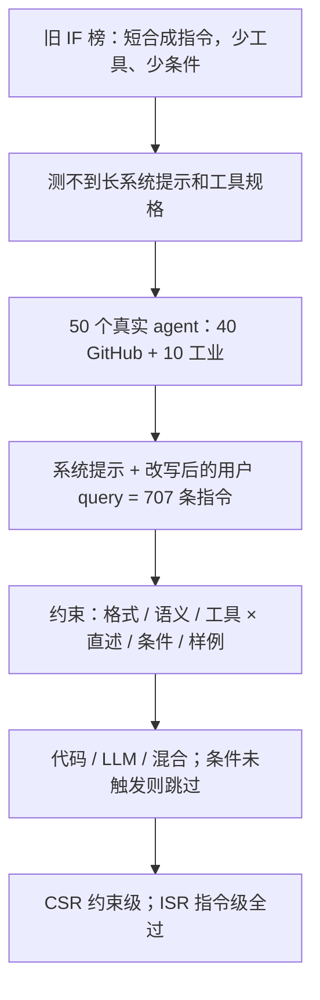

# AgentIF：旧指令遵循榜多半是短合成题，agent 场景要跟的是几千词系统提示加工具规格

<!-- release-date: 2025-05-22 -->

**本文依据**：`AGENTIF: Benchmarking Instruction Following of Large Language Models in Agentic Scenarios`，arXiv 2505.16944v1（页眉 `[cs.AI] 22 May 2025`），27 页。作者 Yunjia Qi、Hao Peng（封面脚注 Equal contribution）、Xiaozhi Wang、Amy Xin、Youfeng Liu、Bin Xu、Lei Hou、Juanzi Li；封面机构 1 Tsinghua University、2 Zhipu AI（PDF p. 1）。第一作者单位是 Tsinghua University。封面印 `Preprint.`，本文不补会议录用。盘上是 v1。首发日取页眉 22 May 2025。代码脚注：`https://github.com/THU-KEG/AgentIF`；数据：Hugging Face `THU-KEG/AgentIF`（PDF p. 1）。文中数字均标 PDF 页码；标「外部补充」的段落不来自本文。

## 一句话

Agent 落地时，模型面对的往往不是「写一封至少 500 词的邮件」，而是几千词的系统提示、工具 JSON、条件分支和 few-shot 样例（PDF p. 1–2）。AgentIF 从 **50** 个真实 agent 应用收 **707** 条人工标注指令，均长 **1,723** 词、最长 **15,630** 词、每条均 **11.9** 条约束（摘要，PDF p. 1）。约束按内容切成格式 / 语义 / 工具，按写法切成直述 / 条件 / 样例；每条约束再标代码、LLM 或混合评分（PDF p. 2–4）。表 2 上 CSR 最高是 o1-mini 的 **59.8%**，ISR 最高是 QwQ-32B 的 **27.2%**——引言里「最强模型完美遵循不到 30%」对的是 ISR（PDF p. 2、p. 6 表 2）。贯穿全文的轴不是「再堆几种格式约束」，而是：**agent 指令又长又带规格，旧榜测不到条件触发和工具规格，必须按约束逐条可执行地打分。**

## 一、矛盾：会跟短指令，不等于会跟 agent 系统提示

LLM 已经能当 Web / 教育 / GUI / PPT agent，但这些场景的指令是长系统提示加详细工具规格；跟不住，任务根本起不来（PDF p. 1）。旧指令遵循榜主要盯短、合成的题。IFEval 平均只有 **45** 词（引言，PDF p. 2）；表 1 把同一基准写成均长 **36**、均 **1.5** 条约束（PDF p. 5 表 1）。后续工作扩了约束类型、系统提示、多轮、动作约束，但指令仍短、仍多半合成，离真实 agent 差一截（PDF p. 2）。

图 2 给了一条真实风格的代码专家提示：目标、任务结构、`<code>` 标签、预定义 `search` 的参数 schema、few-shot 输出格式，再加上一条用户 query（PDF p. 3 图 2）。里面同时有直述约束、条件约束（「多目标只完成第一个」）、样例约束（照例子的格式写）和工具约束（函数最多调一次）。作者认为现有榜基本盖不住这类东西（PDF p. 2）。

相关工作里最接近 agent 的两篇也被点名：SysBench 挖真实用户日志里的系统提示，但短、没有工具；AgentOrca 盯函数调用合规，但不覆盖复杂系统提示和多样约束类型（PDF p. 3）。所以 AgentIF 的定位是：第一份系统评 **agent 场景指令遵循** 的基准（PDF p. 1、p. 3）。这是作者声明，不是独立复现结论。

第 2 节另写：AgentIF 每条指令均 **1,700 tokens**、均 **14** 条约束（PDF p. 3）。摘要、表 1 和第 3.2 节则是 **1,723** 词、**11.9** 条（PDF p. 1、p. 4–5）。结论又写成均长 **1,717 tokens**（PDF p. 9）。同一篇里词 / token、11.9 / 14 对不上。本文以摘要和表 1 为准，把第 2 节、结论当成笔误记下，不另编折算。

上图根据 PDF p. 1–6 图 3、第 3 节重画，是评测口径示意，不是实测曲线。

## 二、什么叫「做对了」：先拆约束，再决定用代码还是模型打分

### 两维分类，不是一锅炖

作者先看了约 **100** 条真实指令，再定分类（PDF p. 4）。附录 C 用图 7 给占比（PDF p. 14 图 7）。

**约束类型**（评什么）：

1. **格式（Formatting）**：输出长什么样。语法（JSON / Markdown）、版式（列表、表、段落长度）、符号约定（文件名用反引号）、分步结构（分三步解释）。图 7 内环 **38.5%**（PDF p. 4、p. 14）。
2. **语义（Semantic）**：内容对不对、全不全、口气对不对。深度、完整性（关键词、引用）、风格。图 7 内环 **46.5%**，最多（PDF p. 4、p. 14）。
3. **工具（Tool）**：按规格调不调、怎么调。参数类型、不许上网、只能用给定函数集。这是作者为 agent 新加的一类。图 7 内环 **15.0%**（PDF p. 4、p. 14）。

**呈现类型**（怎么写进提示）：

1. **直述（Vanilla）**：明文、无条件。例如必须含关键词 paper。图 7 外环 **69.8%**（PDF p. 4、p. 14）。
2. **条件（Condition）**：只在特定情况下生效。条件可以来自输入（出现某关键词才答），也可以来自模型自己的输出（只有用了 markdown 才套 markdown 规则）。图 7 外环 **19.6%**（PDF p. 4、p. 14）。
3. **样例（Example）**：不直说，few-shot 里暗示格式或风格，要类比、要归纳。图 7 外环 **10.6%**（PDF p. 4、p. 14）。

图 1(b) 雷达图把若干代表模型画在这几维上：例如 o1-mini 直述 **59.8**、格式 **66.1**；Qwen3-32B 语义 **62.5**、工具 **45.7**；DeepSeek-R1 条件 **41.4**、样例 **87.0**（PDF p. 2 图 1）。精确分以表 2 为准。

### 三条造数流水线

图 3 把流程收成三步（PDF p. 4 图 3）。

**收集指令。** 两条原则：真实、复杂（PDF p. 4）。GitHub 收 **40** 个 agent（文中点名 Cursor、Manus），工业工作流再收 **10** 个；工业侧写着约 **200** 日活、约 **300** 请求/天、累计 **120,000** 次服务（PDF p. 5）。**50** 个 agent 只提供系统提示（任务规格、目标、工具描述），**不含真实用户 query**，避免泄漏（PDF p. 5）。再用 GPT-4o 按系统提示每 agent 生成约 **20** 条 query，启发式加相似度去重，人工改写成接近真实用户的说法，得到 **707** 条、均 **1,723** 词（PDF p. 5）。脚注 4 给了两个 prompt 收集仓：`x1xhlol/system-prompts-and-models-of-ai-tools`、`Shubhamsaboo/awesome-llm-apps`（PDF p. 5）。

**抽约束。** 整段太长，LLM 一次抽不全，于是按语义块切（任务描述、工具配置、输出规格），块内不截断；GPT-4o 逐块抽；跨块校验把散落的工具规格补全；人再核完整性和是否忠于原文。得到 **8,415** 条约束，均 **11.9** 条/指令（PDF p. 5）。$8415 / 707 \approx 11.90$，和均值对得上。

**生成评测。** 三种范式（PDF p. 2、p. 5）：

1. **代码**：关键词是否出现、格式正则这类确定性检查，写 Python。
2. **LLM**：开放、主观、要语义理解的约束。
3. **混合**：先让 LLM 抽出相关片段（如工具调用 JSON、摘要段落），再用代码验。例子：「摘要不少于 100 词」——先抽摘要，再数词（PDF p. 2）。

条件约束必须先判条件成不成立，不成立就跳过，不记失败（PDF p. 5–6）。评测脚本由 GPT-4o 起草，人审并改（PDF p. 5）。正式打分时 LLM 侧用 `gpt-4o-2024-11-20`（PDF p. 6）。附录 E：temperature **0**；最大生成 **32,000** token；上下文短于 32k 的模型把上限对齐到自己的上下文；每轮评估大约 **20** 美元（PDF p. 15）。

### 指标：CSR 看条，ISR 看整题

未触发的条件约束不进入验证（PDF p. 6）。设指令 $i$ 有 $C_i$ 条进入统计的约束，$c_{i,j}$ 表示第 $j$ 条是否满足，$N$ 是指令数（PDF p. 6）：

$$
\mathrm{CSR}=\frac{\sum_{i=1}^{N}\sum_{j=1}^{C_i}\mathbf{1}[c_{i,j}=\mathrm{satisfied}]}{\sum_{i=1}^{N}C_i}
$$

$$
\mathrm{ISR}=\frac{\sum_{i=1}^{N}\mathbf{1}\bigl[\bigwedge_{j=1}^{C_i}(c_{i,j}=\mathrm{satisfied})\bigr]}{N}
$$

CSR 是「这条约束跟没跟上」；ISR 是「这一整条指令的约束是否全过」。均约束 11.9 条时，ISR 会远低于 CSR——表 2 就是这个形状（PDF p. 6）。

### 和旧榜比规模

表 1（PDF p. 5）：

| 基准 | 指令数 | 均长 | 均约束 | 来源 | 工具 | 条件 | 样例 | 代码评 | LLM 评 |
|---|---|---|---|---|---|---|---|---|---|
| IFEval | 541 | 36 | 1.5 | 合成 | 否 | 否 | 否 | 是 | 否 |
| FollowBench | 820 | 253 | 3.0 | 合成 | 否 | 否 | 是 | 是 | 是 |
| InfoBench | 500 | 38 | 4.5 | 合成 | 否 | 否 | 否 | 否 | 是 |
| SysBench | 500 | 521 | 2.4 | 真实 | 否 | 否 | 否 | 否 | 是 |
| ComplexBench | 1,150 | 448 | 4.2 | 合成 | 否 | 是 | 否 | 是 | 是 |
| AgentOrca | 663 | 1,144 | — | 合成 | 是 | 是 | 否 | 是 | 否 |
| Multi-IF | 4,501 | 48 | 7.1 | 合成 | 否 | 否 | 否 | 是 | 否 |
| AgentIF | 707 | 1,723 | 11.9 | 真实 | 是 | 是 | 是 | 是 | 是 |

作者归纳三点：真实；长（图 1(a) 对数轴，相当一部分超过 **3,000** 词）；复杂（覆盖工具、条件、样例）（PDF p. 5–6）。摘要另给最长 **15,630** 词（PDF p. 1）。正文统计段没有再写这个最大值。

## 三、实验：CSR 刚过半，ISR 掉到三成以下

### 设定

三类模型（PDF p. 6、附录 E p. 15）：

- 非思考 `[N]`：GPT-4o（2024-11-20）、DeepSeek-V3（表注 2024-03-25）、Claude 3.5 Sonnet（2024-10-22）、Llama 3.1 70B/8B Instruct、Qwen3-32B、Mistral-7B-Instruct-v0.3。
- 思考 `[T]`：o1-mini、QwQ-32B、GLM-Z1-32B（0414）、DeepSeek-R1 及其 Qwen-32B / Llama-70B 蒸馏。
- 学术指令遵循专用 `[S]`：Crab-DPO-7B、Conifer-DPO-7B。

全部 temperature **0**。思考模型去掉中间推理 token，只评最终回复（PDF p. 6）。

### 主表

表 2，按 CSR 降序（PDF p. 6）。单位是成功率 %。

| 模型 | Vanilla | Condition | Example | Formatting | Semantic | Tool | ISR | CSR |
|---|---|---|---|---|---|---|---|---|
| [T] o1-mini | 59.8 | 37.5 | 80.8 | 66.1 | 59.1 | 43.2 | 26.9 | 59.8 |
| [N] GPT-4o | 58.0 | 35.1 | 80.8 | 65.8 | 56.5 | 43.2 | 26.4 | 58.5 |
| [N] Qwen3-32B | 57.5 | 41.1 | 80.6 | 57.7 | 62.5 | 45.7 | 24.9 | 58.4 |
| [T] QwQ-32B | 57.5 | 35.6 | 82.7 | 61.4 | 59.4 | 43.2 | 27.2 | 58.1 |
| [T] DeepSeek-R1 | 56.1 | 41.4 | 87.0 | 61.4 | 58.9 | 44.4 | 22.2 | 57.9 |
| [T] GLM-Z1-32B | 56.7 | 37.9 | 83.6 | 60.2 | 59.6 | 43.1 | 23.8 | 57.8 |
| [N] DeepSeek-V3 | 54.9 | 41.5 | 84.5 | 59.3 | 58.9 | 40.8 | 21.9 | 56.7 |
| [N] Claude-3-5-Sonnet | 57.3 | 36.9 | 69.2 | 61.5 | 56.0 | 43.3 | 24.9 | 56.6 |
| [N] Llama-3.1-70B-Inst. | 55.1 | 35.0 | 84.3 | 61.6 | 55.6 | 42.8 | 20.9 | 56.3 |
| [T] R1-Distill-Qwen-32B | 54.5 | 39.6 | 73.1 | 55.7 | 57.2 | 45.2 | 20.7 | 55.1 |
| [T] R1-Distill-Llama-70B | 55.4 | 37.7 | 69.2 | 56.5 | 56.6 | 44.1 | 19.9 | 55.0 |
| [N] Llama-3.1-8B-Inst. | 53.5 | 36.6 | 71.4 | 55.6 | 54.8 | 43.5 | 19.9 | 53.6 |
| [S] Crab-DPO-7B | 48.3 | 24.3 | 57.5 | 48.8 | 47.4 | 41.9 | 10.1 | 47.2 |
| [N] Mistral-7B-Inst.-v0.3 | 47.9 | 29.2 | 53.8 | 47.0 | 48.6 | 39.8 | 11.5 | 46.8 |
| [S] Conifer-DPO-7B | 45.6 | 27.0 | 50.5 | 42.0 | 46.9 | 41.8 | 10.7 | 44.3 |

作者三条读法（PDF p. 7）：

1. **整体差。** CSR 天花板 **59.8**（o1-mini），ISR 天花板 **27.2**（QwQ-32B）。引言「不到 30%」指完美遵循（ISR），不是 CSR（PDF p. 2、p. 7）。相对 IFEval，GPT-4o 从 **87.0** 掉到 **58.5**（PDF p. 7）。作者主张：做可靠 agent 之前，先测基础指令遵循，再设计提示和工作流（PDF p. 7）。
2. **条件和工具最差。** 条件要多一步「该不该触发」；作者写条件约束约占真实应用的 **42.6%**，且常被旧 IF 研究忽略（PDF p. 7）。工具失败常见缺必填参数、该调的没调。样例维相对高（表 2 多在 80 上下，R1 到 **87.0**），提示工程里给具体例子仍然有用（PDF p. 7）。
3. **思考模型整体更好**，作者把它读成复杂 IF 也要推理、也吃 test-time scaling。学术专用 IF 模型更差，作者猜测它们主要在给基座堆 SFT；工业模型已经用了大规模 SFT，学术界更该试强化学习（PDF p. 7）。Crab / Conifer 都是 7B，和 70B 工业模型比不公平，这是读表时要自己留的边界，正文没做同尺寸对照。

### 错误从哪来

盯四个模型：o1-mini、GPT-4o、QwQ-32B、DeepSeek-R1（PDF p. 7）。

**条件。** 失败拆成两类：条件判错；条件对了但约束没跟上（PDF p. 7）。对照实验：把失败的条件约束改成必须满足的直述，其它不变。改完能过 → 错在判条件；仍不过 → 错在跟约束。图 4(a)：超过 **30%** 的错误来自条件判断（PDF p. 7–8）。作者建议专门做条件指令的后训练数据（PDF p. 7）。

**工具。** 每模型抽 **50** 个工具错误，四类：用了禁止的工具、该用的没用、工具名错、参数错（PDF p. 8）。主因是前两类，决策「调不调、调哪个」仍然难；名和参数是规格没跟上。思考模型更常漏掉必用工具，作者猜测它们更依赖内部知识，机制没做完（PDF p. 8）。图 4(b) 是比例柱，正文没有再给精确百分点。

### 越长越碎

图 5 按长度桶 `[0,200]`、`(200,1000]`、`(1000,3000]`、`(3000,6000]`、`(6000,10000]` 和约束数桶 `[0,10]`、`(10,20]`、`(20,40]`、`(40,80]`、`(80,160]` 画 CSR / ISR；灰线是图 2 里前 6 个模型，彩线是平均（PDF p. 8 图 5）。趋势：更长、约束更多，分更低。长度超过 **6,000** 词时，所有模型 ISR 几乎是 **0**（PDF p. 8）。作者建议实践上拆成若干短指令，而不是一条超长提示（PDF p. 8–9）。失败原因他们指向 specification-heavy 任务上的 in-context 局限，并提议用说明书一类长文档自动造后训练问答；这是建议，不是本次实验（PDF p. 9）。

### 元约束：约束上面还有约束

约 **25%** 的指令带 **元约束（meta constraints）**：不管回复本身，而管「其它约束怎么执行」（PDF p. 9）。图 6(a) 三类及占比（PDF p. 9）：

1. **选择（Selection）** **91.4%**：多条约束里只满足指定那一条，其它可忽略。
2. **细化（Detailing）** **7.5%**：给已有约束加额外要求（例如两个子目标必须分句、用词不重叠）。
3. **优先级（Prioritization）** **1.0%**：冲突时谁让路（例如议程限时优先于谈完所有话题）。

图 6(b) 显示选择类最差。作者猜测元约束会和原约束打架，模型被绕晕；以后可以给元约束更高优先级，但要小心提示注入（PDF p. 9）。图上没有印精确成功率数字，正文也只定性说「选择最差」。

## 四、限制、伦理，以及论文自己对不齐的数字

附录 A（PDF p. 13）：半自动仍要大量人工核，难直接扩成大规模训练数据；只有中英，没有更广多语；实验全是 zero-shot，没做 ICL 等提示工程。

附录 B（PDF p. 13）：GitHub agent 声称遵循 GPL-3.0 或 Apache-2.0；工业数据经内部审查、拟以 GPL-3.0 发布，面向中国企业用户，只收活用户和请求统计、不做行为分析；query 全部由雇佣标注员写。拟用 GPL-3.0 发 AgentIF。榜不应拿去对抗比较或指控不端；数据不该进 LLM 训练以防污染。安全审查并匿名化。伦理节写 **8** 名性别平衡的标注员；附录 D 写邀请计算机系研究生、按工作量付薪、三轮抽检（PDF p. 13–14）。写论文时用过 GPT-4o 和 Claude 3.7 Sonnet 改部分句子（PDF p. 13）。

附录其余是提示模板：query 生成、抽原子约束、分成格式/语义/工具、拆条件、判代码/混合/LLM、生成 yes/no 题、抽片段、写 `check_following(response)`（PDF p. 15–20）。NeurIPS checklist 从 p. 21 起到文末，没有新实验数字。

需要分开写的内部不一致：

- 均长：摘要 / 表 1 / §3.2 为 **1,723 词**；§2 为 **1,700 tokens**；结论为 **1,717 tokens**（PDF p. 1、p. 3、p. 5、p. 9）。
- 均约束：摘要 / 表 1 为 **11.9**；§2 为 **14**（PDF p. 1、p. 3）。
- 「最强模型」：CSR 是 o1-mini **59.8**，ISR 是 QwQ **27.2**（PDF p. 6）。
- 条件占比：主文 **42.6%** 说的是「真实应用」；图 7 条件呈现类型是 **19.6%**（PDF p. 7、p. 14）。两句话对象不同，不要并成一个数。

## 五、可迁移启发

1. **测 agent 先测「跟不跟得住规格」，不要只测能不能调通一次工具。** AgentIF 把系统提示本身当成考题。自己的 agent 评测至少要：格式能不能过解析器、工具调用是否在白名单、条件分支有没有误触发。
2. **ISR 和 CSR 一起看。** 均 11.9 条约束时，CSR 过半、ISR 掉到约 1/4 是结构结果，不是某一家模型独有。线上若「一条系统提示里十几条必须同时成立」，ISR 更接近用户体感。
3. **条件约束单独做测试集。** 超过 30% 的条件错误来自「该不该生效」判错。产品提示里的 if / when / only if，值得拆成「条件判别」和「约束执行」两段用例。
4. **工具错误优先查决策，再查 JSON schema。** 禁止的调了、该调的没调，比参数类型更常见。思考模型还可能因为「我能直接答」而漏工具。
5. **超长系统提示会把 ISR 打到接近 0。** 超过 6,000 词时作者看到全体 ISR 近 0。可迁移做法是拆子 agent、拆短指令，而不是把手册整本塞进一条 system。
6. **元约束要显式优先级。** 「只满足第一条」「冲突时保时限」会和并列条款打架。写提示时把选择 / 细化 / 优先级写成单独一节，并防注入把这条优先级劫持。
7. **混合评分可复用。** 主观约束用 LLM 抽 span，客观约束用代码。条件未触发则不计分，避免把「不该做的事没做」判成失败。

## 关键词回看

- **指令遵循（instruction following）**：完成任务的同时满足用户/系统写下的约束，不只是把活干完。
- **Agent 场景指令**：长系统提示 + 工具规格 + 用户 query，而不是短合成题。
- **约束类型**：格式 / 语义 / 工具。
- **呈现类型**：直述 / 条件 / 样例。
- **CSR / ISR**：约束级成功率 vs 指令级全约束满足率。
- **混合评测**：LLM 抽片段 + 代码验证；条件先判触发。
- **元约束**：管其它约束的选择、细化、优先级。

## 参考资料

- 论文 PDF（盘上 v1）：`readings/_src/评测与 Benchmark/AgentIF.pdf`
- 代码（封面脚注）：[github.com/THU-KEG/AgentIF](https://github.com/THU-KEG/AgentIF)
- 数据（封面脚注）：[huggingface.co/datasets/THU-KEG/AgentIF](https://huggingface.co/datasets/THU-KEG/AgentIF)
- arXiv： [2505.16944](https://arxiv.org/abs/2505.16944)
