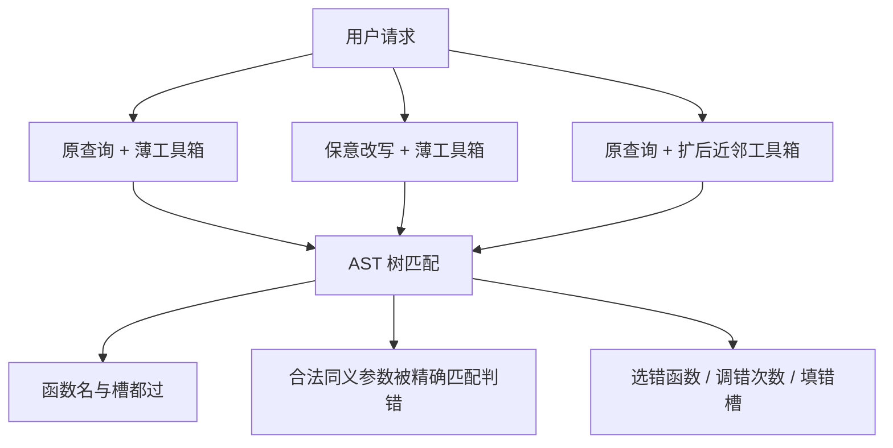

# Agentic Function Calling Robustness：先承认榜上「调对了」经不起换说法和加近邻工具，再在 BFCL 子集上把两维扰动拆开测

<!-- release-date: 2025-04-01 -->

**本文依据**：`On the Robustness of Agentic Function Calling`，arXiv 2504.00914v1（页眉 `[cs.CL] 1 Apr 2025`），7 页。作者 Ella Rabinovich、Ateret Anaby-Tavor；封面机构 IBM Research（PDF p. 1）。封面未印会议录用，本文不补。盘上是 v1。首发日取页眉 1 Apr 2025。数据封面写明 `https://huggingface.co/datasets/ibm-research/BFCL-FC-robustness`（PDF p. 2）。文中数字均标 PDF 页码；标「外部补充」的段落不来自本文。本文写的是这份冻结评测口径，不补文后刷榜。

## 一句话

函数调用（function calling，FC）是 agent 按自然语言请求从提示里的工具箱挑一把工具、填好参数再调用；完整轨迹可以看成多轮调用，直到目标达成（PDF p. 1）。既有工作几乎只追准确率，很少问：用户换一种说法、短名单里多几把语义相近的工具，调用还稳不稳（PDF p. 1）。本文在 Berkeley Function Calling Leaderboard（BFCL）的一份单轮难集上，做两维扰动：意思不变的改写，以及把工具箱扩成短名单里常见的近邻工具（PDF p. 2）。原工具箱上 AST 已经很高：Qwen2.5-72B **0.975**，Llama3.1-70B 与 DeepSeek-V2.5 **0.965**；同一套 AST 下，改写后分别掉到 **0.850（-13%）**、**0.825（-15%）**、**0.835（-14%）**，扩工具箱后分别掉到 **0.965（-1%）**、**0.925（-4%）**、**0.950（-2%）**（PDF p. 5 表 2）。作者的判断是：改写掉分很大一块是评测用精确匹配卡住了合法同义参数，不是模型真不会调；扩箱则是真选错函数、填错槽（PDF p. 4–5）。贯穿全文的轴不是「再堆一批 API」，而是：**换说法和加近邻工具时，什么叫还调对了。**

## 一、矛盾：榜上会调，不等于用户换句、工具箱变厚还对

LLM 正在从静态处理器变成能规划、执行、改动作的 agent；医疗、金融、教育、客服都在讲「少人干预的路由系统」（PDF p. 1）。FC 是这块积木：模型从预先写进提示的一小套函数描述（常是 json）里选工具，吐出语法正确的调用，并把参数填进槽（slot filling）（PDF p. 1）。图 1 的例子：问「NBA 单场得分纪录」，应调图顶部的紧凑工具定义，吐出底部那段带参调用（PDF p. 2 图 1）。

优化 FC 的模型通常被训成：一句用户请求 → 一次调用（PDF p. 1）。评测也已有 Gorilla、APIGen、BFCL 等（PDF p. 1）。缺的是对**输入扰动**的鲁棒性。传统 LLM 鲁棒性问的是：意思等价的输入，输出是否语义等价——改写、打字、标点、空白、变音符号（PDF p. 1–2）。搬到 agentic FC，就要：意思严格不变的改写，仍吐出**同一把工具、同一套槽**。图 1 那句若改成 「What is the highest number of points ever scored by a single player in an NBA game?」，调用不该变（PDF p. 2）。

作者只找到两条近邻工作，而且扰动的是**工具描述**，不是用户话（PDF p. 2）：

- Ye et al. (2024) 逐步改函数名、参数名和描述，直到名字或描述变得任意、看不出功能。
- Lu et al. (2024) 在系统级工具序列框架里做多种干预，含工具干扰。

这些有洞察，但对真实部署证据有限：名字、描述细到什么程度，开发者通常控得住（PDF p. 2）。那些实验里的「工具箱」往往只有一把，或几把互不相关的工具。真实规格可能上千把；脚注写软件工程修 git issue 的 agent，经 GitHub 文档暴露约 **1.2K** 把工具（PDF p. 2）。实践上会经短名单模块（semantic search 一类）收到 top-K 再塞进提示（PDF p. 2）。图 1 那套篮球工具旁边，短名单里很可能还有 `basketball.most_points_career()`、`basketball.most_points_single_season()`、`basketball.game_stats()`（PDF p. 2）。

贡献因此钉在开发者**控不住**的两维（PDF p. 2）：

1. 用户请求的保意改写。
2. 把工具箱扩成短名单会捞到的语义近邻工具。

起点是 BFCL 一份单轮难集；模型按 BFCL 榜 **2025 年 1 月** 的前列来选（PDF p. 2）。数据在 Hugging Face 的 `ibm-research/BFCL-FC-robustness`（PDF p. 2）。

上图根据 PDF p. 2–5 重画，是评测口径示意，不是实测曲线。

## 二、改写维：数字和专名不能漂，否则槽填评测立刻废

### 旧问题

QA、分类里测过改写敏感（Ackerman et al., 2024）。FC 更严：改写必须**钉死参数值**，否则 AST 的槽匹配会把「说法变了、意思没变」判成错（PDF p. 2–3）。例子：原句 「Calculate the depreciated value of a property costing $200,000 with an annual depreciation rate of 3% for 5 years.」 可以改成 「Determine the value of a $200,000 asset which loses 3 percent of its worth each year, after five years.」——金额、利率、年数都还在（PDF p. 2–3）。

### 新设计

用 Llama3.1-70B，加提示与上下文学习做保意改写（PDF p. 3）。附录 7.1 的系统提示要求：只改写、不答题；数字和名字必须保留；只输出改写句（PDF p. 7）。一位作者人工看了 **50** 条，没有语义漂、也没有参数对不齐（PDF p. 3）。

相当一部分改写打在命名实体的表面形式上，例如 「Miami,Florida」 变成 「Miami,FL」（PDF p. 3）。这种看起来很小的差别，榜分会掉；第 3 节把掉分拆开看，并讨论缓解（PDF p. 3）。

## 三、扩箱维：先造「像同一项目、但不能共用一把函数」的近邻请求，再造 json，再滤掉功能等价

图 2 与表 1 是同一条流水线（PDF p. 3）：

1. Llama3.1-70B 造**相关但不同**的请求变体（附录 7.2）。
2. CodeLlama-13B 为每个变体造 json 工具定义，格式、命名风格、描述粒度要像原 BFCL 函数；作者人工看过，风格与原函数难以区分（PDF p. 3）。
3. 少数新工具尽管名字、描述、参数顺序不同，功能仍与原工具严格等价；拼成「签名」后，用 sentence-transformers 的嵌入余弦相似度，超过阈值就丢掉（PDF p. 3）。附录 7.3 的阈值是 **0.8**；例子是 `sentence.translate(sentence, from, to)` 与 `translate_sent(orig_language, target_language, sentence)`（PDF p. 7）。

附录 7.2 把「相关但不同」写死：新请求要多一两个不同参数类型；原函数不该刚好能答新请求，反之亦然。只把希尔顿两晚单人房换成奥黑尔附近万豪三晚双人房——仍是同一把预订函数换参——不算（PDF p. 7）。查询必须自含计算所需信息，不能写成「用户稍后提供的那个国家的首都」（PDF p. 7）。

扩后工具箱平均 **5.6** 把，原 BFCL 平均 **2.7** 把（作者写原箱里那些工具「看起来不相关」）；平均每条加 **3** 把语义相关函数。测试集 **200** 条（PDF p. 4）。评测时测的是**原查询 + 扩箱**，不是拿变体查询去调新工具（PDF p. 3 图 2）。

## 四、只走 BFCL 的第一阶段 AST，不跑模拟执行

BFCL 两阶段：先用抽象语法树（AST）做树匹配，再在模拟环境里跑执行（PDF p. 4）。本文只关心输入被干预之后**调用构造**还对不对，因此只取第一阶段 AST（PDF p. 4）。鲁棒的 agent 应在措辞变了、工具箱从「薄」变「扩」之后，仍给出正确调用（PDF p. 4）。

模型来自当时 BFCL 前列，闭源与本地都有（PDF p. 4）：

- 闭源：GPT4o-mini、o1-mini、Claude-3.5-Haiku、Claude-3.5-Sonnet。
- 本地：Llama3.1-70B、Llama3.3-70B、Granite3.1-8B-instruct、DeepSeek-v2.5、Qwen2.5-72B。

报告的是 **200** 条上的平均 AST，三个变体（PDF p. 4）：

- （a）原查询 + 原（薄）工具箱；
- （b）改写查询 + 原工具箱；
- （c）原查询 + 扩工具箱。

表 2 左侧是这三列，括号里是相对原分的百分下降；作者说每列最好（下降最小）加粗（PDF p. 5）。

## 五、改写掉分：七成到九成是评测把合法同义参数判死了

原工具箱上改写后，分会明显掉，而且有点出乎作者预料（PDF p. 4）。细看错误，常见 FC 评测有一个弱点：参数允许若干等价写法（尤其是专名）时，仍用精确匹配（PDF p. 4）。

湿度题：原句 「What is the humidity level in Miami,Florida in the upcoming 7 days?」，真值函数 `weather.humidity_forecast()`，`location` 的合法集合是 `["Miami", "Miami, Florida", "FL"]`（PDF p. 4）。改写成 「How will the humidity levels change over the next seven days in Miami,FL?」 后，模型填 `"Miami, FL"`——集合里没有这一条（PDF p. 4）。

系统看错误类型分布：**70–90%** 的改写错误来自参数值对不上（PDF p. 4）。作者结论：这一维的失败，多数该记在**评测口径**上，而不是 agent 对改写过敏（PDF p. 4）。他们主张用语义相似代替精确匹配；并引 Zhong et al. (2025) 的多维匹配（嵌入相似、LLM-as-a-Judge）。在 BFCL 框架里试这一招，留给后续（PDF p. 4）。

读表 2 的「改写」列时，不要把整列下降都当成模型不会调。

## 六、扩箱掉分：这是真失败，选错函数和填错槽为主

扩箱后，所有模型 AST 都降（PDF p. 4–5）。失败类型是客观的：选错函数、生成函数个数错（常见该调一把却调两把）、选对了函数但参数错、参数幻觉等（PDF p. 4）。例子：问曼联在英超的排名，扩箱后的 agent 调 `football_league.ranking("premier league")`，端出整张积分榜；更贴的是 `sports_ranking("Manchester United", "premier league")`（PDF p. 4）。

表 2 右侧把扩箱失败拆成四类占比（在「因扩箱而失败」的集合内部，不是相对 200 条全体）（PDF p. 5）。没有单一主导模式，但准确选函数和准确填参都吃力（PDF p. 4–5）。

表 2（PDF p. 5）。左侧三列是 AST；括号是相对 `original` 的百分下降。右侧四列是扩箱失败内部占比。

| 模型 | original | 薄箱 + 改写 | 扩箱 + 原查询 | 错句法 | 错函数 | 错函数个数 | 错参数赋值 |
|---|---|---|---|---|---|---|---|
| Llama3.1-70B | 0.965 | 0.825（-15%） | 0.925（-4%） | 0.00 | 0.45 | 0.10 | 0.45 |
| Llama3.3-70B | 0.945 | 0.785（-17%） | 0.905（-4%） | 0.00 | 0.23 | 0.46 | 0.31 |
| DeepSeek-V2.5 | 0.965 | 0.835（-14%） | 0.950（-2%） | 0.00 | 0.56 | 0.00 | 0.44 |
| Qwen2.5-72B | 0.975 | 0.850（-13%） | 0.965（-1%） | 0.00 | 0.29 | 0.00 | 0.71 |
| Granite3.1-8B-instruct | 0.945 | 0.770（-19%） | 0.870（-8%） | 0.09 | 0.50 | 0.18 | 0.23 |
| Claude-3.5-Haiku | 0.925 | 0.765（-11%） | 0.870（-2%） | 0.00 | 0.44 | 0.00 | 0.56 |
| Claude-3.5-Sonnet | 0.915 | 0.845（-8%） | 0.890（-3%） | 0.00 | 0.29 | 0.00 | 0.71 |
| gpt4o-mini | 0.925 | 0.765（-17%） | 0.870（-6%） | 0.26 | 0.42 | 0.00 | 0.32 |
| o1-mini | 0.905 | 0.770（-15%） | 0.885（-2%） | 0.33 | 0.27 | 0.00 | 0.43 |

读表时几条不要混：

- 改写下降最大的是 Granite3.1-8B-instruct **-19%**；最小的是 Claude-3.5-Sonnet **-8%**（PDF p. 5）。
- 扩箱下降最大仍是 Granite **-8%**；最小是 Qwen2.5-72B **-1%**（PDF p. 5）。
- 句法错误几乎只出现在 Granite（**0.09**）、gpt4o-mini（**0.26**）、o1-mini（**0.33**）；其余行为 **0.00**（PDF p. 5）。
- Llama3.3-70B 的扩箱失败里，**0.46** 是函数个数错，和其他行以「错函数 / 错参数」为主不同（PDF p. 5）。
- Qwen 与 Claude-3.5-Sonnet 的扩箱失败里，错参数赋值都是 **0.71**（PDF p. 5）。

扩箱偶尔还会**修好**原基线的失败。作者把它读成 LLM agent 的随机生成性：上下文里看似无关的增删，输出会变（PDF p. 5）。没有给出修好的条数，本文不补。

## 七、结论、限制、伦理：单集、离线造箱、下一步才加无关工具

结论收回两维：保意改写，以及短名单会捞到的近邻扩箱；造基准、评若干当时前列 LLM、拆失败（PDF p. 5）。后续要换更多样的数据集；并计划在扩箱里再掺**不相关**工具，对照当前「只加近邻」设定——因为已有工作表明更大上下文容易让 LLM 分心（PDF p. 5）。

限制两条（PDF p. 5）：

1. 只评一份数据，对短文的聚焦贡献够用，要更宽分析必须加集。
2. 扩箱依赖多个 LLM 离线造请求和工具，耗时；作者在想如何把流水线收短。

伦理：公开数据集；写作未用 AI 辅助；全程未雇标注员（PDF p. 5）。致谢 Michal Jacovi、Guy Uziel 与匿名审稿人（PDF p. 5）。封面未写会议，本文不把致谢里的 reviewers 写成已录用证据。

本文没写的：多轮轨迹、BFCL 第二阶段执行分、活榜新模型、改写维上按模型拆开的 70–90% 细表。那些原文就没有。

## 八、可迁移启发

- **评测先分「口径杀伤」和「模型杀伤」。** 改写维 70–90% 是合法同义参数撞上精确匹配（PDF p. 4）。自己做 FC 回归时，专名、地名、日期先准备合法值集合或语义匹配，再谈鲁棒性。
- **薄工具箱上的高 AST 不能当部署分数。** 原箱 0.90 以上的模型，加平均 3 把近邻后仍掉 1–8 个相对百分点（PDF p. 4–5）。提示里只塞「对的那一把」会虚高。
- **短名单质量就是 FC 质量。** 真实系统先 top-K 再生成（PDF p. 2）。K 里若全是近邻，失败会表现为选错函数或填错槽，而不是语法崩（多数开源 70B 级句法错为 0，PDF p. 5）。
- **造近邻工具时要滤功能等价。** 签名嵌入阈值 0.8，否则扩箱评测会被「同一把函数换了名」污染（PDF p. 7）。
- **改写生成必须钉槽。** 附录 7.1 禁止改数字和名字；附录 7.2 禁止「同一函数换参」冒充新需求（PDF p. 7）。这比「让模型随便 paraphrase」更接近可评的 FC。

## 九、关键词回看

- **函数调用 / 工具调用（function calling, FC）**：从提示中的工具描述里选函数并填参（PDF p. 1）。
- **工具箱（toolkit）**：随提示提供的一小套函数描述，常为 json（PDF p. 1）。
- **槽填充（slot filling）**：把请求里的值赋给函数参数（PDF p. 1）。
- **短名单（shortlisting）**：上千工具先检索成 top-K 再进提示（PDF p. 2）。
- **保意改写（meaning-preserving rephrasing）**：意思与参数值都不变的用户话变体（PDF p. 2–3）。
- **AST 评测**：BFCL 第一阶段，用抽象语法树匹配调用构造，本文只走这一阶段（PDF p. 4）。
- **精确匹配合法集**：参数多个表面形式等价，榜仍按字符串集合判对错；`Miami, FL` 不在 `Miami` / `Miami, Florida` / `FL` 里就算错（PDF p. 4）。

## 参考资料

- 原件：`readings/_src/评测与 Benchmark/Agentic-Function-Calling-Robustness.pdf`（arXiv:2504.00914v1）
- 数据（原文给出）：[ibm-research/BFCL-FC-robustness](https://huggingface.co/datasets/ibm-research/BFCL-FC-robustness)
- 同库评测文：`readings/评测与 Benchmark/BFCL.md`、`Gorilla.md`（口径对照，不是本文实验）
