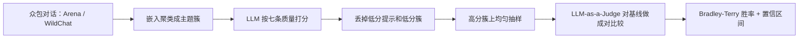

# Arena-Hard：人工造榜贵、众包又太杂，用七条质量分从对话里筛出 500 条难题

<!-- release-date: 2024-06-17 -->

**本文依据**：`From Crowdsourced Data to High-Quality Benchmarks: Arena-Hard and BenchBuilder Pipeline`，arXiv 2406.11939v2（页眉 `[cs.LG] 14 Oct 2024`），25 页。作者 Tianle Li、Wei-Lin Chiang（封面标 Equal contribution）以及 Evan Frick、Lisa Dunlap、Tianhao Wu、Banghua Zhu、Joseph E. González、Ion Stoica；封面只印 UC Berkeley（PDF p. 1）。封面与页眉均未印会议录用，本文不补。盘上是 v2。首发日取 arXiv 页面 `Submitted on 17 Jun 2024`（[arxiv.org/abs/2406.11939](https://arxiv.org/abs/2406.11939)），这是外部补充，不来自 PDF 正文。代码：`https://github.com/lmarena/arena-hard-auto`（PDF p. 2 脚注 1）。文中数字均标 PDF 页码；标「外部补充」的段落不来自本文。

## 一句话

静态闭题榜会饱和、会泄漏；请专家手造开放题又贵——GPQA 的 500 道选择题超过 **$120,000**（PDF p. 1）。Chatbot Arena 这类活平台有真用户题，但真人评太慢、题的难度又参差（PDF p. 1–2）。BenchBuilder 用 LLM 按七条质量指标给众包提示打分，再按主题簇抽样，做成可自动更新的开放题榜（PDF p. 2）。落到 500 条的 Arena-Hard-Auto 上：相对 MT-Bench 分离度约 **3** 倍，与人偏好相关 **98.6%**，每模型评测约 **$20**（摘要，PDF p. 1）。贯穿全文的轴不是「再出一套更难的题」，而是：**人工造榜贵 vs 从众包自动筛难题，以及怎么证明筛出来的榜既分得开模型、又跟人投票同向。**

## 一、矛盾：闭题刷满、专家造榜贵、众包题又不够硬

LLM 训练数据越来越大，MMLU、SQuAD、GLUE 一类静态闭题很快饱和，分不开最强的模型（PDF p. 1）。GPQA 改请领域专家出难题，质量上去了，代价是 **$120,000** 才换来 500 道选择题；静态集还容易泄漏、过拟合，要持续换新题，人工成本会再叠一层（PDF p. 1）。闭题也对不齐真实开放对话：对不齐用户偏好时，贵也买不到对齐（PDF p. 1）。

另一条路是 Chatbot Arena：活流量、开放题、真人投票（PDF p. 1）。问题是实时人评对模型开发者太贵、太慢；众包题难度参差，不经过滤成不了「难榜」（PDF p. 1–2）。图 1 把当时的榜切成四维：评测是否自动、任务是否开放、提示如何筛选、来源能不能换（PDF p. 2 图 1）：

| 基准 | 评测 | 开放题 | 提示筛选 | 来源 |
|---|---|---|---|---|
| Arena-Hard-Auto | 自动 | 是 | 自动 | 可配置 |
| MMLU、MATH、GPQA | 自动 | 否 | 人工 | 固定 |
| MT-Bench、AlpacaEval | 自动 | 是 | 人工 | 固定 |
| Live Bench、Live Code Bench | 自动 | 否 | 人工 | 固定 |
| Chatbot Arena | 真人 | 是 | 众包 | 众包 |

LiveBench、LiveCodeBench、MixedEval、R2E 以及 Chatbot Arena 都在做「活」评测，但作者认为它们都没有做成：**开放题 + 从众包自动筛题 + 自动打分** 这一条流水线（PDF p. 2–3）。

上图根据 PDF p. 2、p. 4 图 2、第 4–5 节重画，是流水线示意，不是实测曲线。

## 二、先定「什么叫一张好榜」，再谈筛题

作者说，若目标是逼近人偏好，榜至少要两件事（PDF p. 3）：

1. **分离度（separability）**：有把握把模型分开。
2. **与人偏好对齐**：排序跟人投票同向。

以前多盯对齐。训练中相邻 checkpoint 这种「差不多强」的模型，更需要高把握的分离；题太简单分不开，人评和 LLM 评又有噪声，看起来赢了也可能只是抖动（PDF p. 3）。AlpacaEval 常用的 Pearson / Spearman 只给粗相关，不回答「这一对模型分得开吗、差多大」（PDF p. 3）。于是他们另做三套量：

**带置信的分离度。** 对分数做 bootstrap，看有百分之多少模型对的置信区间不重叠；越高说明越敢判谁强（PDF p. 3）。

**带置信的一致（Agreement with Confidence）。** 两张榜 A、B 对同一对模型：两边都有把握且同序记 **1**，有把握但反序记 **-1**，任一边分不开记 **0**；对所有无序模型对取平均。1 是完全同向且都有把握，-1 是完全对着干（PDF p. 3–4）。

**成对排序 Brier。** 两张榜都判 $\pi_1 > \pi_2$，但一个给 $P=0.60$、一个给 $0.90$，Spearman 看不出来；Brier 奖励「对且有把握」，惩罚「错还很自信」——错的时候宁愿不那么自信（PDF p. 4）。附录把 bootstrap 分数近似成正态，再对每对模型算 $\hat P(f^*(\pi_i)<f^*(\pi_j))$，对真值指示做均方（PDF p. 16 式 (1)–(3)）。

三套一起用，不指望单独一张数说完（PDF p. 4）。

## 三、BenchBuilder：七条质量分 + 主题簇抽样

核心想法很短：给每条提示一个质量分，再在多样主题上均匀抽高分题（PDF p. 4）。图 2 的流程是：众包提示 → 嵌入聚类 → LLM 按技能需求打分 → 丢掉低分簇 → 从剩下的硬簇抽样（PDF p. 4 图 2）。

七条「高质量提示」指标（PDF p. 5）：

- **具体（Specificity）**：输出有没有钉死、有没有歧义。
- **领域知识（Domain Knowledge）**：是不是在考某一领域的先验。
- **复杂度（Complexity）**：是不是多组件、多层。
- **解题（Problem-Solving）**：是不是要分析问题并系统求解，而不只是背事实。
- **创造性（Creativity）**：要不要新想法。
- **技术精度（Technical Accuracy）**：答案要不要高精度、可核对。
- **真实应用（Real-world Application）**：跟不跟真场景挂钩。

LLM 标注员数这条提示命中几条，得到 quality score；细则在附录 C（PDF p. 4–5、p. 24）。主题用 BERTopic：`text-embedding-3-small` 编码，UMAP 降维，HDBSCAN 层次聚类，再用 LLM 给簇起名（PDF p. 4）。「hi」这类簇平均分低，只留平均质量高的簇，再均匀抽样，结果多为定义清楚的技术解题题（PDF p. 4–5）。

### Arena-Hard-Auto 怎么落到 500 条

起点是 Chatbot Arena 的 **200,000** 条提示；去掉重复、多轮、非英语（PDF p. 5）。层次主题模型得到约 **4,000** 个簇（PDF p. 5）。GPT-4-Turbo 打分：单条分数小于 **6**、簇均分小于 **5** 丢掉，剩下超过 **500** 个高质量簇（PDF p. 5）。从随机抽出的 **250** 个簇里每簇抽 **2** 条，得到 500 条；并去掉 PII 和冒犯内容（PDF p. 5）。

为核对 GPT-4-Turbo 的质量标签，另抽 **200** 条，用 GPT-4o、Claude-3-Opus、Gemini-1.5-Pro 的多数票当地面；GPT-4-Turbo 与之同意率 **85.6%**（PDF p. 5）。

同一管道接到 WildChat-1M 的 **150,000** 条：得到 **185** 个高分簇、**4,500+** 条提示；从质量最高的 **125** 簇每簇抽 2 条，做成 Wild-Hard-Auto（PDF p. 5、p. 8）。

### 筛题成本，和「分越高越分得开」

200,000 条用 GPT-4-Turbo 当标注员约 **$500**（按每条约 250 token、GPT-4-1106-Preview **$10**/百万 token 估，PDF p. 5 脚注 2）。换成 Llama-3-70B-Instruct 约 **$45**（TogetherAI **$0.9**/百万 token，文中日期 2024-10-01，PDF p. 5 脚注 3）。下游榜质量仍有类似提升，见第 6.4 节（PDF p. 5）。

图 4：高分簇是游戏开发、素数证明一类；低分簇是「Flirty Texting Strategies」这类含糊闲聊（PDF p. 6 图 4）。图 3 每个分数档抽 **50** 条，看 GPT-4-0613 vs Llama-2-70b-chat、Claude-3-Sonnet vs Haiku、Mistral-Large vs Mixtral 的胜率：质量分升高，胜率区间更容易分开（PDF p. 6 图 3）。图 5 把 Arena-Hard-Auto 的置信区间画得比 MT-Bench 更紧（PDF p. 6 图 5）。

## 四、怎么打分：对强基线成对比较，不是打绝对分

难题需要专家级判断，专家又贵又慢，所以用 LLM-as-a-Judge 近似人偏好（PDF p. 6–7）。做法：候选模型对强基线（如 GPT-4-0314）成对比较；裁判（GPT-4-Turbo 或 Gemini-1.5-Pro）用 5 点 Likert：1 强烈偏 A，5 强烈偏 B，大比分输会重罚，用来拉开档次（PDF p. 7）。裁判先自己解题再判（思维链）；每条提示对调位置打两局，压位置偏差（PDF p. 7）。长度等文风偏差放到第 6 节处理。

每模型因此有 **1000** 次判断（500 条 × 2 位置）。按 Chatbot Arena 的习惯用 Bradley-Terry 汇总相对基线的成对比较，bootstrap 得到对基线胜率的置信区间，再按胜率排序（PDF p. 7）。

## 五、主实验：分离、对齐、换数据、换标注员

对照 MT-Bench 和 AlpacaEval 2.0 Length Controlled。各榜对判断做 **100** 轮 bootstrap，取 **95%** 置信区间；AlpacaEval 用仓库里已有结果，MT-Bench 按官方推荐设定（PDF p. 7）。Arena-Hard-Auto 的基线是 `gpt-4-0314`（PDF p. 8）。人偏好真值取 Chatbot Arena 2024/04/13 的 top-20，且这些模型当天也在 AlpacaEval 榜上；Arena 侧只用英语（PDF p. 7–8）。脚注列出这 20 个模型名（PDF p. 7 脚注 4）。

表 1（PDF p. 7）是主对照。第 6.2 节正文把 Consistency Agreement 写成 **90.8%**，表里是 **90.9%**，以表为准：

| 指标 | Arena-Hard-Auto | MT-Bench | AlpacaEval 2.0 LC | Chatbot Arena |
|---|---|---|---|---|
| Confidence Agreement | 90.9% | 26.6% | 82.5% | — |
| Separability | 87.4% | 22.6% | 83.2% | 85.8% |
| Spearman | 93.2% | 89.9% | 91.9% | — |
| Kendall Tau | 80.0% | 64.2% | 77.9% | — |
| Brier（越低越好） | 0.069 | 0.09 | 0.11 | — |
| 是否真实世界 | 是 | 混合 | 混合 | 是 |
| 新鲜度 | 可频繁更新 | 静态 | 静态 | 直播 |
| 每模型评测成本 | $20 | $10 | $10 | 非常高 |
| 每模型提示数 | 500 | 160 | 800 | 10,000+ |

分离度 87.4% 对 MT-Bench 的 22.6%，大约是摘要说的「3x」（PDF p. 1、p. 7–8）。500 条对齐的是超过 **100 万** 条真人偏好的 Arena 排序，分离度甚至略高于 Arena 自己的 85.8%（PDF p. 8）。MT-Bench 的 Spearman 还有 89.9%，带置信的一致却只有 26.6%——Spearman 不看排序方差，顶层模型的细档分不开（PDF p. 8）。

换更同分布的真值：Chatbot Arena 英语 Hard Prompt 子榜。附录表 9：Confidence Agreement **98.6%**、Spearman **96.7%**、Kendall **87.4%**、Brier **0.055**（PDF p. 8、p. 19 表 9）。摘要里的 98.6% 与这条、以及下面风格控制后的相关，都要对着「难量子集 / 去风格后的人偏好」读，不要直接当成表 1 对全量英语 Arena 的 93.2% Spearman（PDF p. 1、p. 7–9）。

### 换数据源、换随机基线、换打分员

Wild-Hard-Auto 对 WildChat 随机 250 条（表 2，GPT-4-Turbo 裁判，PDF p. 7）：

| 指标 | Wild-Hard-Auto | Wild-Random-250 |
|---|---|---|
| Confidence Agreement | 88.6% | 36.4% |
| Separability | 86.7% | 75.6% |
| Spearman | 91.5% | 45.5% |

附录表 7：相对 Arena 75K 用户题上两份随机 500 条（每条只判一次、基线答案固定在前），Arena-Hard-Auto 的 Agreement 84.2% 对 57.5% / 66.1%，Spearman 94.7% 对 64.7% / 72.5%，Brier 0.069 对 0.215 / 0.162（PDF p. 18）。附录表 8：用 Llama-3-70B-Instruct 当质量标注员得到 Llama-Hard-Auto，在论文 20 模型里的 10 个上，Agreement 86.0%、分离 84.4%、Spearman 96.4%，同样明显高于两份随机基线（PDF p. 19）。

## 六、裁判会偏长度、会偏「自己人」

LLM 裁判爱长回答。AlpacaEval 2.0 用回归控长度；Chatbot Arena 也出过风格控制榜（PDF p. 9）。Arena-Hard-Auto 把文风差当作 Bradley-Terry 的额外特征：答案 token 数、markdown 标题密度、粗体密度、列表密度（PDF p. 9）。附录 A.2 在标准 BT 的 $\mathrm{sigmoid}(X_i^\top\beta)$ 上加 $Z_i^\top\gamma$；每个特征用 $(\mathrm{feat}_A-\mathrm{feat}_B)/(\mathrm{feat}_A+\mathrm{feat}_B)$ 归一，而不是 AlpacaEval 那种对长度差做 $\tanh$（PDF p. 17 式 (4)–(8)）。作者认为比例差比绝对差更合理：500 vs 520 不该和 20 vs 40 当成同一档（PDF p. 17）。分析里长度是主风格因子，markdown 次之（PDF p. 17）。

表 3 把风格控制后的 Arena 英语 Hard 战斗当真人真值（PDF p. 8）：

| 指标 | Arena-Hard-Auto（风格控制） | Arena-Hard-Auto | AlpacaEval 2.0 LC | MT-Bench |
|---|---|---|---|---|
| Confidence Agreement | 98.6% | 94.4% | 83.8% | 30.3% |
| Separability | 86.8% | 87.4% | 83.2% | 22.6% |
| Spearman | 98.6% | 94.9% | 88.1% | 90.7% |
| Kendall Tau | 93.7% | 85.3% | 70.5% | 77.9% |

去风格之后，Arena-Hard-Auto 对人偏好的一致和 Spearman 都是 **98.6%**（PDF p. 8–9）。表 5：让 Llama-3.1-70B-Instruct 尽量写细，无控制时分数从 44.5 升到 **53.5**；加上风格控制后「写细」变成 39.8，反而不如原模型的 41.7（PDF p. 9）。附录表 6 把 Gemini-1.5-flash-2、Llama-3.1-70B、gpt-3.5-turbo-0125 的 detail / md / chatty / no-md 变体列全：无控制时 flash-2-detail **80.0**（1035 token）高于原模型 78.6（729 token）；控制后原模型 75.5，detail 落到 71.2（PDF p. 18）。附录表 12：分数与平均长度的 Pearson 从 0.364 降到 0.193；与「永远挑更长」的幼稚策略的 Pearson 从 0.397 降到 0.231（PDF p. 20）。

自偏：默认裁判是 GPT-4-Turbo，附录表 10 看相对 Arena Hard 人榜的名次平移——GPT 系列平均 **+0.6**，Claude 系列平均 **-0.8**（PDF p. 9、p. 19）。Ensemble-as-Judges 把 GPT-4-Turbo 和 Gemini-1.5-Pro 的判断合起来，表 4（PDF p. 8）：

| 裁判 | Confidence Agreement | Separability | Spearman | Brier |
|---|---|---|---|---|
| GPT-4-Turbo（gpt-4-1106-preview） | 90.9% | 87.4% | 93.2% | 0.069 |
| Claude-3-Opus | 66.7% | 83.68% | 77.0% | 0.170 |
| Gemini-1.5-Pro | 84.8% | 82.11% | 95.2% | 0.064 |
| Llama-3-70B | 65.6% | 81.6% | 70.5% | 0.196 |
| Ensemble（GPT-4T + Gemini-1.5-Pro） | 91.5% | 89.5% | 96.5% | 0.065 |

表头把 Confidence 印成 Confiderence，这是原文拼写，读作 Confidence Agreement（PDF p. 8）。合裁判后 GPT 系列平均平移 **-0.4**、Claude **+0.4**，两边更对称（PDF p. 19 表 10）。作者把更强的 ensemble 留给后续（PDF p. 9–10）。

## 七、限制、结论，以及附录里还钉死的数字

限制（PDF p. 10）：数据源虽杂，七条质量仍可能偏向技术域；目前没有多轮、没有非英语——众包里多轮少，作者语言也不够。计划补多轮和多语、把质量定义做得更系统，并加强 Ensemble-as-Judges。

结论复述：BenchBuilder 用七条质量把众包变成可演化的难榜；Arena-Hard-Auto 在分离和对齐上强过当时对照，并以每模型 **$20** 达到与 Chatbot Arena **98.6%** 的一致（PDF p. 10）。这句话里的 98.6% 对应第 6.3 节 / 表 9 以及表 3 的风格控制设定，不是表 1 对全量英语 Arena 的 90.9% Agreement。

附录还给出筛题前的质量分布（表 11，GPT-3.5-Turbo 给 75K Arena 题打标，PDF p. 19）：分数 $\ge 1$ 到 $\ge 7$ 的占比 95.4%、83.5%、61.9%、48.7%、33.8%、17.9%、**0.2%**；七条各自命中率：具体 57.3%、领域 63.4%、复杂 35.0%、解题 34.9%、创造 26.1%、技术精度 39.0%、真实应用 87.9%。附录 B 的簇例子：问候簇均分 2.7、美国总统 3.2、物理题 5.0、OpenCV 视频人脸 5.5（PDF p. 23）。附录 C 要求裁判输出 `[[A>>B]]` 五档之一（PDF p. 24）；附录 D 用 ABC 记谱民间小调当判分样例（PDF p. 25）。

表 13 是论文当时附的 Arena-Hard-Auto 榜（基线 GPT-4-0314），不是本文之后的外部刷榜。最高几行：Claude-3-5-Sonnet-20240620 胜率 **79.3**、GPT-4O-2024-05-13 **79.2**、GPT-4-0125-Preview **78.0**；基线 GPT-4-0314 为 **50.0**（PDF p. 21）。读这篇时以机制和表 1–4 为准，不要把表 13 当成今天的活榜。

## 八、可迁移的几条

1. **造开放题不必从零请专家。** 先有众包流量，再用可声明的质量轴过滤；GPQA 级的人力是对照，不是唯一路（PDF p. 1、p. 4–5）。
2. **相关高不等于分得开。** MT-Bench 的 Spearman 接近 90%，带置信的一致只有约 27%；要看区间是否重叠（PDF p. 7–8）。
3. **质量分要能预测「强模型的优势变大」。** 图 3 把这一点画出来了，否则筛题只是换一批长提示（PDF p. 6）。
4. **LLM 裁判默认会奖长度和自家模型。** 风格进 BT、多裁判合议，比只换提示词更硬（PDF p. 8–9、p. 17）。
5. **管道成本和解题成本要分开报。** 筛 20 万条约 $500（或 Llama 的 $45），跑一个模型约 $20（PDF p. 1、p. 5、p. 7）。

## 关键词回看

**BenchBuilder**：众包 → 聚类 → 七条质量分 → 高分簇抽样。**Arena-Hard-Auto**：该管道在 Chatbot Arena 上抽出的 500 条开放难题，再用 LLM 对 GPT-4-0314 成对比较。**分离度**：bootstrap 后置信区间不重叠的模型对比例。**Agreement with Confidence**：两张榜在「都有把握」时是否同序。**风格控制**：把长度和 markdown 当协变量后的 BT 强度。**Ensemble-as-Judges**：多裁判合议，用来压自偏。

## 参考资料

- 原论文：arXiv 2406.11939v2，盘上 25 页 PDF。
- 首发日（外部补充）：[arxiv.org/abs/2406.11939](https://arxiv.org/abs/2406.11939) `Submitted on 17 Jun 2024`。
- 代码（原文脚注）：[github.com/lmarena/arena-hard-auto](https://github.com/lmarena/arena-hard-auto)。
