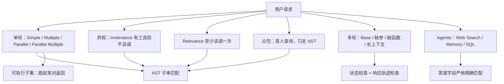

# BFCL：先承认「调对了」不好验，再用 AST、弃权与有状态多轮把工具调用做成可扩的榜

<!-- release-date: 2025-10-06 -->

**本文依据**：`The Berkeley Function Calling Leaderboard (BFCL): From Tool Use to Agentic Evaluation of Large Language Models`，22 页。作者 Shishir G. Patil、Huanzhi Mao、Fanjia Yan、Charlie Cheng-Jie Ji、Vishnu Suresh、Ion Stoica、Joseph E. Gonzalez；封面机构 University of California, Berkeley（PDF p. 1）。封面印 `Proceedings of the 42nd International Conference on Machine Learning, Vancouver, Canada. PMLR 267, 2025. Copyright 2025 by the author(s).`，录用信息写在此处，不进 `release-date`。全文与页眉均无 arXiv id；按封面标题检索 arXiv 也没有标题完全一致的 abs，故不用会期日期。`release-date` 取 PMLR 论文页标注的 Published 2025-10-06（[proceedings.mlr.press/v267/patil25a.html](https://proceedings.mlr.press/v267/patil25a.html)），这是外部补充，不来自 PDF 正文。项目页封面写明 `https://gorilla.cs.berkeley.edu/leaderboard.html`（PDF p. 1）。文中数字均标 PDF 页码；标「外部补充」的段落不来自本文。本文写的是封面这篇 ICML 论文冻结的评测口径，不补文后活榜。

## 一句话

函数调用（function calling，也叫 tool use）是模型按用户请求去调外部函数、API 或自定义工具；agent 要接搜索、写库、改世界状态，都靠这一步（PDF p. 1）。难处有两头：什么叫一次调用「有效」，以及哪来足够多样、像真的函数（PDF p. 1）。BFCL 用 AST 子串匹配代替大规模真执行，评串行与并行调用，覆盖 Python、Java、JavaScript、REST 与 SQL；数据是专家整理加用户贡献（PDF p. 1–2）。它还专门测**弃权**（该不调就不调）和**有状态、多步的 agentic** 设定（PDF p. 1）。表 1 上 gpt-4o-2024-11-20（Prompt）总体 **66.4**，单轮 AST 里 Multiple 已到 **95.5**，但 Memory 只有 **6.0**；同一模型的 FC 模式 Memory 是 **0.0**（PDF p. 6）。作者的判断是：顶尖模型单轮已经会调，记忆、动态决策、长程推理仍是缺口（PDF p. 1、p. 9）。贯穿全文的轴不是「再堆一批 API 名」，而是：**什么叫调对了——AST 怎么当执行的代理、并行怎么比、何时必须弃权、多轮状态对不上时错在哪。**

## 一、矛盾：插件演示好做，「调对了」既难判也对不齐真实用法

LLM 已经能对话、能推理、能做多模态；真正接搜索、写代码、改外部系统时，必须走出参数里的世界（PDF p. 1）。Gorilla 与 Toolformer 一类工作先把「会调工具」训出来（PDF p. 1）。评测却卡住了：要确定性验证，通常得把函数跑起来，规模一大就做不动（PDF p. 2）。Gorilla 的 APIBench 主要看功能对不对，语义错、用法变体看不清（PDF p. 1）。ToolBench、ToolSandbox、Nexus 一类要么对不齐真实用法，要么几乎不测并行调用（PDF p. 1）。

相关工作再把坑钉死（PDF p. 2–3）：

- 只评原生函数调用，不把 Nexus Raven 那种纯提示协议、AppWorld 那种写代码当同一档。
- App Blend、API Bench 基本是单轮；TinyAgent 虽谈嵌套，却用占位符代替前一步真实返回，实质仍是单轮。
- TauBench 只有 **28** 个函数、两个域（航空与零售）；RestBench 困在 TMDB 与 Spotify；条目少于 **150** 的集合更容易过拟合（PDF p. 2–3）。
- ToolSandbox、TauBench 用 LLM 模拟用户，幻觉与不听话会污染分数；ToolBench 绑 Rapid API，性能抖动大；StableToolBench 缓存或模拟返回后，仍用 LLM 当判官，存在「GPT 偏爱 GPT」一类偏差（PDF p. 3）。
- 当时基准几乎一律用 LLM 编用户问题，对不齐真人怎么问（PDF p. 3）。

BFCL 的对策是：确定性指标、更宽的多轮、超过 **15** 种语言的用户贡献查询（含中、法、日、韩等），并在常见的 Python / REST 之外加入 Java 与 JavaScript（PDF p. 3）。作者写：预览之后它成了各实验室评函数调用的事实标准，活榜当时已到 v4；**这篇论文把时间线压扁，把各版学到的东西收进同一份**（PDF p. 3）。读本文时不要把活站上的新模型分数写进来。

四块结构（PDF p. 1–2）：

1. **单轮**：一次对话里的调用，含并行、多候选。
2. **众包**：从超过 **67,000** 条社区贡献里整理出 **2,251** 条（PDF p. 1）；第 3.2 节采集日志是 **64,517** 条、时间窗 2024-02-26 至 2024-04-01（PDF p. 3）。两处口径不同，不要合成一个「官方采集总数」。
3. **多轮**：八套自研 API、**1000** 条查询，测持续上下文与动态决策（PDF p. 1）。
4. **Agentic**：网页搜索、记忆、SQL（PDF p. 1、p. 4）。

贡献三条（PDF p. 2）：共 **5,551** 对 question–function–answer；AST 子串匹配当代执行；第一次把社区贡献的真实查询与函数放进函数调用评测。图 1 用环图标四块、评测方法和各类条数（PDF p. 2）；环上数字是图，正文没有逐类抄全，本文不以读图猜测补表。

上图根据 PDF p. 1–5 重画，是评测口径示意，不是实测曲线。

## 二、单轮切五类：先分清「调几次、有几把工具、能不能弃权」

### 人话版，再给附录公式

旧评测容易把「吐出一段像调用的字符串」当成会用工具。BFCL 先按**池子里有几把工具**和**这一轮实际调几次**切开（PDF p. 3，形式定义在附录 C，PDF p. 15）：

- **Simple**：只有一把工具，只调一次，$|F|=1$ 且 $|\hat f(P)|=1$。
- **Multiple**：多把工具，仍只调一次，$|F|>1$ 且 $|\hat f(P)|=1$。
- **Parallel**：一把工具，同一轮调多次，$|F|=1$ 且 $|\hat f(P)|>1$。
- **Parallel Multiple**：多把工具，同一轮调多个不同函数，$|F|>1$ 且 $|\hat f(P)|>1$。
- **Irrelevance（弃权）**：工具在手里，但**不该调**，$\hat f(P)=\emptyset$。
- **Relevance**：至少该调一次。正文 3.1 节把单轮主类型写成五种，把 Irrelevance 单列；附录把 Relevance / Irrelevance 也写成范畴（PDF p. 3、p. 15）。读表 1 时，幻觉相关两列是 Irrelevance 与 Relevance（PDF p. 6）。

图 2 用例子对照 Multiple、Parallel、Irrelevance（PDF p. 3）。

评测两条腿（PDF p. 3）：

- **AST**：从 GitHub 高星仓库收 Python / Java / JavaScript 函数，滤掉太琐碎的。
- **可执行**：一类是纯 Python 的数理计算；一类是包一层 `requests.get()` 的公开 API（汇率、OMDb、地理编码等），文档里写死 URL 与参数（PDF p. 3、p. 16）。

函数文档先收成统一 schema，再靠数据增强加难：并行、多候选、干扰函数、缺参数（PDF p. 3，附录 B，PDF p. 13–14）。并行增强是同一函数换一组参数再问一遍；Multiple 是原问题不动、往文档里塞 GPT 确认过不能当替身的干扰项；Parallel Multiple 是问题比文档少，逼模型既要连调又要丢掉没用的文档；缺参 / 删函数两条专门喂给弃权：模型该追问或报错，而不是硬调（PDF p. 13–14）。

AST 侧采集：Python / Java / JavaScript 各取 star 前 **100** 的仓库；丢掉 `__init__`、`__eq__` 以及（不算 `self`）参数少于两个的函数（PDF p. 16）。校验有三条：文档字段齐、参数类型对、用户问题与文档对齐；三位人类专家参与（PDF p. 16，句子在页末被截断，原文没写完三人如何仲裁）。

## 三、AST 评测：不跑函数，也能扩到几千个调用

### 旧问题

大规模真执行做不到：能跑的函数少、手写后端贵，多样性立刻塌（PDF p. 4–5）。

### 新设计

把模型输出限制成 Python 可调用形式，用标准库 `ast` 抽出函数名和参数（PDF p. 5）。**不要求参数字符串逐字相等**，只要求每个参数落在预先标好的合法值集合里。名字必须精确匹配，参数都在合法集合内，这一次才算对（PDF p. 5）。细则在附录 H（PDF p. 20–22）。

### 工作机制（附录 H，必须讲清，否则「AST」只是口号）

- **并行**：并行调用同时发生，顺序无关；预测序列 $A$ 与真值 $B$ 不必按位置对齐，任一 $a_i$ 可对任一 $b_j$。规则是全有或全无：漏一条真值，整次预测失败（PDF p. 20）。若业务要求严格先后，模型必须一次只吐一个调用、等执行完再吐下一个（PDF p. 20）。
- **int 与 float**：仅 Python 允许用 int 填 float（会自动转）；Java / JavaScript 文档写 float 就必须写出 `5.0` 这种字面量，写 `5` 算错。用 float 填 int，所有语言都不合法（PDF p. 21）。
- **list / tuple**：顺序有意义；无序题则穷举正确排列。嵌套结构递归查类型（PDF p. 21）。
- **string**：大小写不敏感；先去空白，再剥 `,./-_*ˆ`。日期、地名会给多个合法写法，例如 `20th June` 与 `2023-06-20` 可同属一题（PDF p. 21）。
- **dict**：查键在不在、值对不对，键顺序不管。dict 的 list：外层 list 顺序有意义，每个 dict 内部键序仍不管（PDF p. 21–22）。
- **跨语言**：Java / JavaScript 先经 Tree-sitter 转成 Python 再比；转换时还要验类型，例如 Java `long` 必须以 `L` 结尾（PDF p. 22）。

图 9 把「从模型回复抽出函数信息」画成流程（PDF p. 21）。

### 可执行子集怎么对返回（4.2）

三条（PDF p. 5）：确定性输出做精确匹配；时间敏感的（实时波动）把真值调用和模型调用**同时**跑再比；嵌套 list / dict 只查长度和键是否存在。

### AST 能不能当执行的代理（4.3）

图 3 在单轮子集上对比 AST Summary 与 Exec Summary，作者说分数和相对名次强相关，因而 AST 可当离线代理（PDF p. 5）。图是散点/相关示意，正文没有给出相关系数数字，本文不补。

## 四、众包：真人怎么问，和专家想象的单轮不是同一张图

众包与单轮同一套结构与类别，但来源不同（PDF p. 3）。采集 **64,517** 条真实单轮，2024-02-26 至 2024-04-01；ROUGE-L 加向量相似度去重，并丢掉已出现在公开集合里的查询以防污染；专家只做最小编辑，保住原意（PDF p. 3、p. 16–17）。引言写整理后 **2,251** 条、来自「超过 **67,000**」（PDF p. 1）。附录 E.2 写预处理之后直接进变换、没有「再生成」阶段（PDF p. 17）。

专家单轮是按「我们当年做函数调用模型时的经验 + 厂商文档/论坛」编的；当时还没有正式众包集（PDF p. 6–7）。对照之后发现（PDF p. 7）：

- 众包里 **Multiple 显著更多、Parallel 显著更少**——真人更常要模型在多把工具里选对的那把，较少在一轮里并行连发。
- 众包有多语言问题、多语言函数文档、大量冗余信息，甚至有「用函数调用去做分类」这种条目。
- 众包每条平均 **3** 个候选函数，最多 **37**；每函数平均 **4** 个参数，最多 **28**（PDF p. 7）。附录图 10 又写众包最多 **37** 个函数、函数最多 **21** 个参数，单轮对应上限约 **3.36** 与 **3.69**（PDF p. 22）。**21 与 28 对不齐**，以第 5.2 节正文 **28** 与图 10 caption 并存，不要合成一个最大值。

这就是后面用困惑度做污染探针的材料：单轮公开更早，众包晚约六个月（PDF p. 2）。

## 五、多轮：对的是世界状态，不是某一条调用字符串

### 对话怎么切

一轮 = 用户一句新话；一步 = 助手与工具/环境的一次交互。一条对话里有多轮，一轮里可以有多步（PDF p. 4）。四类（PDF p. 4，附录 D，PDF p. 15）：

- **Base**：日常任务，信息齐，每轮至少该有一次调用。
- **Missing Parameters**：有一轮问题欠参且系统推不出来，助手应先用自然语言追问；存在 $i$ 使 $\tau_i=\emptyset$，下一轮用户补参。
- **Missing Functions**：有一轮要的函数根本不在池子里，应澄清；下一轮才补上函数信息。
- **Long Context**：每轮用户话加调用轨迹的 token 都很多。

后端是自研、状态透明的 API 代码库，域包括车辆控制、交易机器人、旅行预订、文件系统、消息、Twitter、票务、数学等（PDF p. 4、p. 17）。生成路径：GPT-4o-0806 先走函数轨迹再反写自然语言问题，人设来自 Persona Hub；给人标每轮真值轨迹；再沿依赖图采样放大（PDF p. 17）。引言的「八套 API、1000 条查询」与此对应（PDF p. 1）。图 4 错误分析写多轮全集 **800** 条（PDF p. 7）——与 1000 不是同一口径，800 是那张错误图用的子集大小。

### 对错口径：状态 + 响应，两关都过才算过

每轮先做两关，**所有轮都过**整条才对（PDF p. 5）：

- **状态检查**：一轮里所有调用结束后，系统终态必须等于标注终态。通往同一终态的调用序列可以不同。用来抓住「建了文件 / 从自选股里删掉一只」这类改世界的动作。
- **响应检查**：只读请求（查股价）终态可能不变，必须核对是否走过**最小可行**的调用路径，而不是猜一个数。

只查状态会漏掉 `get_zipcode_by_city`、`estimate_distance` 这种不改状态的调用；作者举例：应先 `get_zipcode_by_city(City_Name)` 再 `get_weather_by_zipcode(City_Zipcode)`（PDF p. 5）。两条合在一起，才同时看到对不对、推理过没过。

缺参 / 缺函数与单轮弃权是同一精神在多轮里的展开：不该调的时候，空轨迹是正确答案，硬编一次调用算失败（PDF p. 15）。

## 六、Agentic：搜索、记忆、SQL，答案字段必须咬死

三条与单轮共用类似的整理管线（PDF p. 4）。

**Web Search。** 两把工具：DuckDuckGo（标题、摘要、URL）和 fetch（抓全文）。题目选「2024 年《时代》年度人物」这类新近但稳的事实，避开股价这种一直在变的量，好让不同知识截止日期的模型站在同一起跑线（PDF p. 4）。

**Memory。** 五个域（学业顾问、客服、医疗助手等）。先给设定，再连续多段对话往外漏用户事实；每段域对话结束后拍一份记忆快照。评测时**聊天历史清空**，只给快照，看模型能否检索、新增、覆盖、删除——有的是几分钟前的短记忆，有的是隔了很多轮的长记忆（PDF p. 4）。

**SQL。** 不走传统 text-to-SQL 的整句字符串匹配。给 JSON schema，把 SELECT / INSERT / UPDATE / DELETE 收成带 WHERE、LIMIT、JOIN 等槽的函数；多次调用可拼嵌套查询，再确定性译回 SQL（PDF p. 4）。

评测（4.5）：系统提示规定最终必须吐 `{'answer': ..., 'context': ...}`；不知道就 `'I do not know'`，认为题无法答就 `'I cannot answer this question'`（附录 J，PDF p. 22）。**只拿 `answer` 字段做严格精确匹配**，避免长句里碰巧出现 `no` 被当成否定答案。匹配前按 AST 同一套规则小写、去标点（PDF p. 5）。

## 七、数字：表 1 是主榜；单轮高、记忆接近零

表 1（PDF p. 6）按 Overall Acc 排序。类别定义在第 4 节。下面只摘与叙事有关的行，不把整张宽表搬进正文。表中 Amazon-Nova-Lite-v1:0 (FC) 出现两次且单轮列相同、Overall 分别为 **52.1** 与 **43.7**（PDF p. 6），这是原表重复行，本文不选边「修正」。

| 模型 | Overall | 单轮 AST Simple | 单轮 AST Parallel | Irrelevance | Multi-turn Base | Memory | SQL |
|---|---|---|---|---|---|---|---|
| gpt-4o-2024-11-20 (Prompt) | 66.4 | 79.4 | 94.0 | 83.8 | 59.0 | 6.0 | 78.0 |
| gpt-4o-2024-11-20 (FC) | 65.8 | 77.2 | 93.0 | 83.1 | 62.5 | 0.0 | 81.0 |
| GPT-4-turbo-2024-04-09 (FC) | 60.9 | 70.4 | 90.0 | 83.8 | 54.0 | 4.0 | 50.0 |
| o1-2024-12-17 (Prompt) | 59.1 | 72.7 | 91.5 | 87.8 | 50.5 | 12.0 | 91.0 |
| Qwen2.5-72B-Instruct (Prompt) | 57.0 | 80.2 | 93.5 | 72.8 | 24.5 | 8.0 | 70.0 |
| Claude-3.5-Sonnet-20241022 (FC) | 53.8 | 78.8 | 3.5 | 74.0 | 55.0 | 4.0 | 60.0 |
| o1-2024-12-17 (FC) | 52.8 | 67.9 | 0.0 | 82.0 | 52.5 | 12.0 | 83.0 |
| claude-3.5-haiku-20241022 (FC) | 52.3 | 68.0 | 2.5 | 63.7 | 54.5 | 6.0 | 59.0 |
| Llama-3.1-70B-Instruct (Prompt) | 50.4 | 77.9 | 94.5 | 54.8 | 16.5 | 0.0 | 61.0 |
| Falcon3-1B-Instruct (FC) | 13.1 | 3.6 | 17.5 | 87.2 | 0.0 | 0.0 | 0.0 |

读表时先看三处裂缝（PDF p. 5–6）：

1. **总体被多轮和 Memory 拖死。** gpt-4o Prompt 单轮 Multiple AST **95.5**、Execute Simple **100.0**，Memory 仍是 **6.0**（PDF p. 6）。第 5.6 节写当时榜首 openai o1-2024-12-17 (FC) 记忆也只有 **12%**，与表中 o1 (FC) Memory **12.0** 一致（PDF p. 9、p. 6）。
2. **并行会在 FC 模式里突然归零。** Claude-3.5-Sonnet (FC) 单轮 AST Parallel **3.5**、Parallel Multiple **5.0**，Execute Parallel **4.0**、Parallel Multiple **0.0**；o1 (FC) 这四格全是 **0.0**（PDF p. 6）。作者在 5.3 节点名 o1-2024-12-17-FC 与 claude-3-5-sonnet-20241022-FC：并行能力像是回退甚至被拿掉（PDF p. 7）。
3. **弃权不是附赠。** GPT-4-turbo (Prompt) Irrelevance 只有 **35.6**，Relevance 却是 **100.0**——该调时调得出，不该调时仍爱动手（PDF p. 6）。Falcon3-1B (FC) Irrelevance **87.2**、Relevance **0.0**，Overall **13.1**：几乎靠「不调」刷弃权，并不会用工具（PDF p. 6）。

## 八、FC 模式对 Prompt 模式：好解析，不一定更会并行

有原生 tools 字段的叫 FC 模式；没有的用附录 A 系统提示，把文档塞进 system，逼模型只吐 `[func(params=...)]` 这种列表（PDF p. 6、p. 13）。两种都能跑的模型：FC 输出更结构化、解析错更少，但结构约束会在复杂场景里绑住手，更强的模型常常是 **Prompt 分更高**（PDF p. 6）。例子：Claude 在 FC 下不能并行，Prompt 下可以；Java / JavaScript 也常是 Prompt 更好（PDF p. 6）。

量化（PDF p. 6）：Prompt 平均解码问题是 FC 的约三倍（**412.93** 对 **182.5**，分母 **4,251** 条）。但在成功解码的 Multiple 里，FC 平均错的调用次数更多（**77.5** 对 **21**）；Parallel Multiple 同类趋势。作者的话：复杂场景里 Prompt 更灵活。

5.3 节给并行一个产品直觉：查 **20** 只股票这种无依赖任务，一轮并行比串 20 次更低延迟；但真实链路里后一次往往要吃前一次的返回，一次只调一个、等结果，最终可能又快又准（PDF p. 7）。早期 Claude 完全不会调；中期半支持并行但差；旗舰 FC 又把并行拿掉——作者猜是准确率优先于吞吐（PDF p. 7）。

## 九、多轮错在哪：机械五类，再加一层 LLM 归因

机械错误五类（PDF p. 7，图 4，全集 800 条）：空轮（该调却一轮都不调）、实例状态不一致、执行响应不匹配、强制终止（一轮里步数太多被掐）、API 错误（后端挂了或超输入长度）。图 4 是柱状分布，正文没有把各模型的五类计数写成表，本文不读柱补数。

LLM-as-judge 用 GPT-4o-08-06，few-shot 结构化提示，只标**一个**根因（PDF p. 7–8、p. 18–20）。三类：没看懂环境状态、没看懂用户请求、没看懂函数文档。失败定义很窄：终态不对，或没走出最小必要轨迹；探索步即使执行报错也不罚（PDF p. 19）。图 5 上最常见的是 **没看懂环境状态**（幻觉当前目录、没先查油量就加满油等）；其次是没看懂用户请求（只要报价却直接下单）（PDF p. 8、p. 19）。

记忆失败的具体画像（PDF p. 9）：「用户是大四男 CS」有的存成一个 `user profile` 键，有的拆成 major / year / gender，键空间很快耗尽。KV 要求精确匹配，本应先 `list_keys` 再 `retrieve`；很多模型跳过列键去猜键，失败一次就宣布没有信息。

## 十、污染探针：单轮公开太久，用众包看是不是背过答案

分阶段发布，是为了对比模型对「早已公开的单轮」和对「晚六个月的众包」熟不熟（PDF p. 2）。指标是困惑度与字符级负对数似然 Char-NLL，越低越「熟」（PDF p. 8）。若单轮异常熟、众包明显生，就怀疑背过静态集。

表 2 / 表 3（PDF p. 8）：

| 模型 | PPL 单轮 | PPL 众包 | Char-NLL 单轮 | Char-NLL 众包 |
|---|---|---|---|---|
| Llama2-7B | 3.47 | 2.56 | 0.344 | 0.264 |
| Openfunctions-v2 | 3.09 | 2.49 | 0.295 | 0.239 |
| CodeLlama-7B | 3.45 | 2.49 | 0.342 | 0.256 |
| Meta-Llama-3 8B | 3.58 | 2.63 | 0.322 | 0.245 |
| Mistral-7B | 4.39 | 2.92 | 0.404 | 0.295 |
| Functionary-7B | 3.81 | 2.73 | 0.337 | 0.254 |
| Salesforce xLAM-7B | 3.67 | 5.09 | 0.340 | 0.427 |

多数模型众包更低（更熟），作者解释为**没有**靠背单轮占便宜。xLAM-7B 反过来：PPL **3.67 → 5.09**，Char-NLL **0.340 → 0.427**，被当成过拟合 / 数据面窄的反例（PDF p. 8–9）。图 6、图 7 把点画在对角附近；离群点往上飞（PDF p. 9）。这是语言模型熟度，不是表 1 准确率。

## 十一、限制、没写清的，以及可迁移的

原文承认或留下的缺口：

- 图 1 各类条数、图 3 相关系数、图 4 / 图 5 各柱精确计数，正文都没有表化（PDF p. 2、p. 5、p. 7–8）。
- 众包采集 **64,517** 与引言「超过 67,000 / 整理 2,251」、参数上限 **28** 与图 10 的 **21**，并存于原文（PDF p. 1、p. 3、p. 7、p. 22）。
- 附录 E.1 专家校验那句写到 「We've instructed three human experts」 即断页（PDF p. 16）。
- 表 1 有重复行；Overall 如何由各列加权，正文没给公式（PDF p. 6）。
- AST 与执行的相关只在单轮可执行子集上主张，不能外推到多轮状态机（PDF p. 5）。
- Agentic 的 exact-match 会把「语义对但措辞不同」判错；这是作者有意换精确、防假阳性（PDF p. 5）。
- 论文把 v1–v4 时间线压扁（PDF p. 3），本文不补活榜上的新模型。

可迁移的，不依赖「再做一个 Gorilla 实验室」：

1. **把幻觉和填错拆开还不够，还要单独测弃权。** Irrelevance 高、Relevance 零，是「不敢调」；反过来是「手欠」。两列都要看（PDF p. 6、p. 15）。
2. **评调用尽量别让 LLM 当判官。** AST 合法集合 + 状态终态 + 最小轨迹，比「GPT 觉得这句话能解决问题」可复现（PDF p. 3、p. 5）。
3. **并行不是免费加速。** 无依赖可并行；有依赖就串行等返回。产品上关掉并行，可能是准确率选择而不是能力倒退（PDF p. 7）。
4. **原生 FC 降低解析错，也可能降低灵活度。** 同一模型 Prompt / FC 都要报；只报 FC 会把 Claude / o1 的并行写成「完全不会」（PDF p. 6–7）。
5. **静态单轮集公开几个月后，必须再备一份真人、晚发布的探针。** 熟度指标与准确率不是一回事，但能抓住 xLAM 那种「旧集好看、新集塌」的模式（PDF p. 8–9）。
6. **记忆不要拆成无限细键，先 list 再 get。** 这是原文对失败模型的观察，可直接变成 agent 工具规范（PDF p. 9）。

## 关键词回看

函数调用 / 工具使用；串行与并行；弃权（Irrelevance）与相关性（Relevance）；AST 子串匹配；执行响应匹配；FC 模式与 Prompt 模式；多轮状态检查与响应检查；缺参 / 缺函数；Agentic（Web Search、Memory、SQL）；Char-NLL 污染探针。

## 参考资料

- 原件 PDF：`readings/_src/评测与 Benchmark/BFCL.pdf`
- 项目页（封面印）：[gorilla.cs.berkeley.edu/leaderboard.html](https://gorilla.cs.berkeley.edu/leaderboard.html)
- PMLR 论文页（外部，仅用于 Published 日）：[proceedings.mlr.press/v267/patil25a.html](https://proceedings.mlr.press/v267/patil25a.html)
