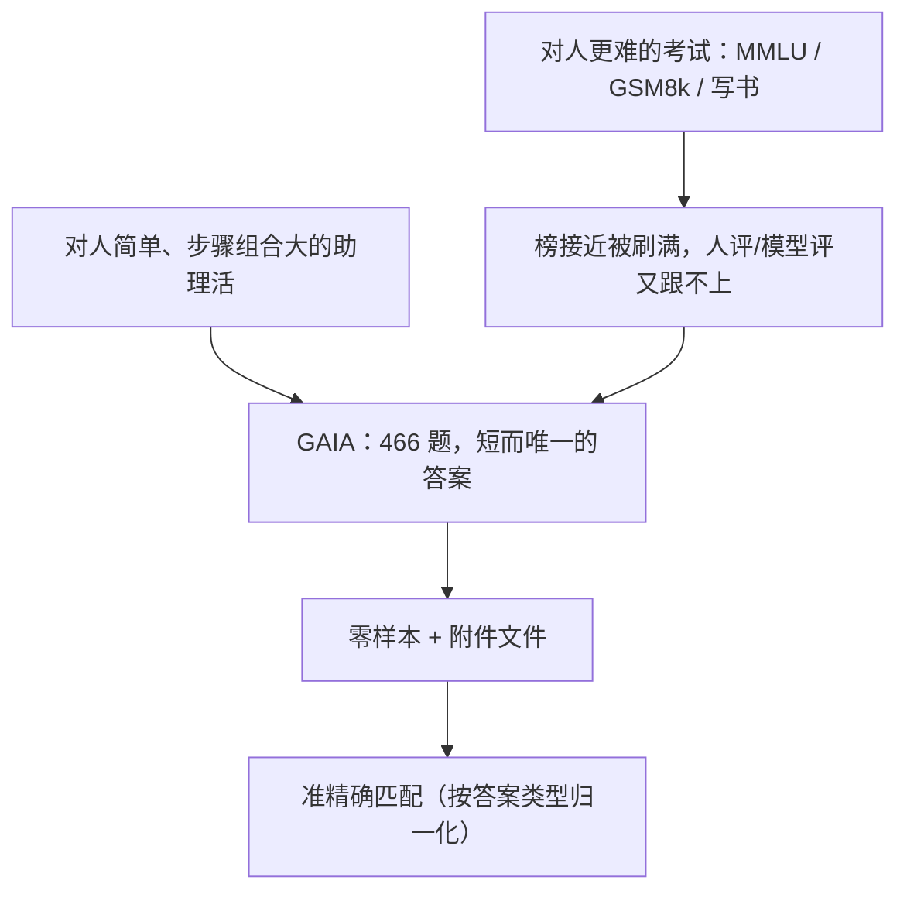

# GAIA：人觉得简单、带插件的 GPT-4 才 15%，评测从「更难的考试」改成「助理把活干完」

<!-- release-date: 2023-11-21 -->

**本文依据**：`GAIA: A Benchmark for General AI Assistants`，arXiv 2311.12983v1（页眉 `[cs.CL] 21 Nov 2023`），24 页。正文另印 `Date: November 23, 2023`，那是 PDF 排版日，不进 `release-date`。封面未印会议录用，本文不补。作者 Grégoire Mialon（FAIR, Meta）、Clémentine Fourrier（HuggingFace）、Craig Swift（AutoGPT）、Thomas Wolf（HuggingFace）、Yann LeCun（FAIR, Meta）、Thomas Scialom（GenAI, Meta）（PDF p. 1）。盘上是 v1。首发日取 arXiv 页面 `Submitted on 21 Nov 2023`（[arxiv.org/abs/2311.12983](https://arxiv.org/abs/2311.12983)），这是外部补充，不来自 PDF 正文。代码与排行榜入口封面写明 `https://huggingface.co/gaia-benchmark`（PDF p. 1）。文中数字均标 PDF 页码；标「外部补充」的段落不来自本文。

## 一句话

MMLU、GSM8k 这类「对人更难」的榜已经被刷得很近；GPT-4 在 MMLU 上 86.4%，作者估的专家约 89.8%，非专家人类只有 34.5%（PDF p. 1 脚注 1）。GAIA 反过来做：**概念上人容易、模型难**，要推理、多模态、上网、用工具，答案却必须是短事实，准不准一眼能对（PDF p. 1–2）。466 题里，人类标注员合计 92%，带插件的 GPT-4 只有 15%（PDF p. 1）。最容易一档带插件也不过约 30%，最难一档模型全是 0（PDF p. 2、表 4 p. 21）。公开 166 道带答案的开发集，另 300 道答案扣着做排行榜（PDF p. 1、p. 3）。

贯穿全文的轴不是「再出一套更难的选择题」，而是：**什么叫做助理把活干完、为什么必须是短而唯一的答案、数字怎么读才不会把「会考试」当成「能办事」。**

## 一、矛盾：对人更难的榜刷满了，对人简单的活模型还不会

LLM 已经能流畅、有知识、一定程度上对齐，还能零样本/少样本接浏览器和代码解释器（PDF p. 1）。评测却跟不上：新能力一出来，旧榜就破，破的速度还在加快（PDF p. 1）。

主流应对是把任务对人做得更难——STEM、法律、写一本连贯的书。问题是：**对人难，对现在的系统不一定难**。MMLU、GSM8k 已经接近被解决，可能是模型真进步，也可能混了污染（PDF p. 1）。开放生成又依赖人或模型当裁判：任务一变长、一变专，人评跟不上；模型评又必须找更强的模型，还带「更喜欢先出现的选项」这类偏置（PDF p. 1）。

作者换一条路，接近工作量证明：让系统走一串组合空间很大的动作，**只有干完才能交出答案，答案本身很好验**（PDF p. 2）。通用助理正好落在这里——要进开放、不确定的世界，又贴真实用法（PDF p. 2）。

GAIA 因此避开当时 LLM 评测的几条坑（PDF p. 2）：

- **真实世界、难做完**：要逛开放网页、处理多模态、多步推理；不是封闭合成环境里的专项题。
- **好解释**：题概念简单，非专家标注员接近满分；题少、精选，还带推理轨迹。
- **不好刷**：必须成功走完若干步，答案按设计不该以明文躺在预训练语料里；对错可以核对轨迹。选择题（如 MMLU）错推理也能蒙对。
- **好用**：答案是短事实、无歧义；默认零样本，少受提示工程摆布。

即便在对人很难的任务上已经很强，最能打的 LLM 在 GAIA 上仍然差：带工具的 GPT-4，最容易档不超过 30% 成功率，最难档 0%；人类平均 92%（PDF p. 2）。人做最简单大约 6 分钟，最复杂大约 17 分钟（PDF p. 2）。作者把「能解 GAIA」放进 t-AGI 语境（在多数任务上胜过给时间 $t$ 的多数人类专家），也对照 Morris 等人的 AGI 层级，认为那是 ChatGPT 再往上的一档（PDF p. 2–3）。这些层级标签是作者的定位，不是本文实验测出来的分数。

上图根据 PDF p. 1–3、p. 5 重画，是评测口径示意，不是实测曲线。

## 二、什么叫「做对了」：短答案、准匹配、不许对着同分布再训

### 题长什么样

466 道由人设计并标注（PDF p. 2、p. 4）。主体是文本，有的带文件（图、表格）（PDF p. 4）。覆盖日常私事、科学、常识等助理场景（PDF p. 4）。图 1 给了三档样例（PDF p. 2）：

- **Level 1**：NIH 网站上 2018 年 1–5 月一项幽门螺杆菌与痤疮临床试验的实际入组人数。标准答案 `90`。
- **Level 2**：整品脱冰淇淋相对 2020 年维基所载美国联邦乳脂标准偏高或偏低多少个百分点，答 `+` 或 `-` 加一位小数。标准答案 `+4.6`。题面还配图。
- **Level 3**：NASA 2006 年 1 月 21 日每日天文图里看起来更小的那位宇航员所属组别里，截至 2023 年 8 月在轨时间最短（排除从未上天）是谁、多少分钟。格式 `姓; 分钟`，千位用逗号。标准答案 `White; 5876`。

答案按设计不该在训练数据里以明文出现；有的题故意给附件，既贴近真实用法，也把证据钉死（PDF p. 2 图 1）。

### 交卷格式

每题答案只能是：字符串（一两个词）、数字、或逗号分隔的字符串/浮点列表，除非题面另说（PDF p. 5）。只有一个正确答案。评分是模型答案与标准答案的 **准精确匹配（quasi exact match）**，按标准答案类型做归一化（PDF p. 5）。系统提示规定以 `FINAL ANSWER: [...]` 收尾，数字不要千分位逗号、不要擅自加 `$` 或百分号，字符串不要冠词和缩写（PDF p. 5 图 2）。作者说 GPT-4 量级模型跟得上这套格式（PDF p. 5）。

图 2 是带代码解释器的 GPT-4 读 Excel 算快餐连锁食物销售额（不含饮料）：过程对了，却把答案写成 `$89706.00`，标准是 `89706.00`——格式差一点点就算错（PDF p. 5）。这不是吹毛求疵，是整套评测能自动、快、可核对的代价。

默认 **零样本**（PDF p. 4–5）。有 API 时同一模型跑三次取平均（PDF p. 8、表 4 p. 21）。

### 四条设计原则

1. **概念简单、执行烦、扎在真实世界**（PDF p. 4）。考的是推理适应、多模态、多样工具，不是专科执照。信息要从附件或开放网页里找出来再变换。
2. **可解释**（PDF p. 4）。题少、精选；人 92%，轨迹好核。
3. **抗背答案**（PDF p. 4）。必须规划并走完若干步；多样性加大动作空间，不好靠穷举。污染仍可能发生，但答案精度、明文不在网上、可核轨迹能压风险。真被背穿，可按 3.4 节规范再出新题。
4. **好用**（PDF p. 5）。提示加可选文件即可；短事实答案，少受提示条数和实现细节摆布。

## 三、466 题怎么切：能力、档位、附件

满分需要高级推理、多模态、写代码、以及以浏览为代表的工具使用（PDF p. 6）。图 3 左是标注员报告的「至少需要该能力」的题数（系统可以走别的路）（PDF p. 6 图 3）：

| 能力 | 题数（至少需要） |
|---|---|
| Web browsing | 355 |
| Coding | 154 |
| Multi-modality | 138 |
| Diverse filetype reading | 129 |
| N/A（当时未增强 LLM 就能做） | 32 |

附录 C 把工具例子钉死（PDF p. 18）：浏览含搜索引擎、站点控件、YouTube、Street View；多模态含语音转写、视频/图像识别、OCR；代码含 Python、计算器、密码替换、C++；文件含 PDF/Excel/PPT/CSV/txt。同一工具可跨类，Street View 既要上网又要看图（PDF p. 18）。

**不做的事**：不要求在真实网站上上传文件、发评论、订会议，以免刷站；那类能力留给封闭环境评测（PDF p. 6）。也不提供「解这道题唯一正确的工具清单」——同一证据可能是背过的，也可能是搜来的（PDF p. 6）。

难度按标注员用的 **步数** 和 **不同工具数** 分成三档，定义是松的（PDF p. 6）：

- **Level 1**：一般不用工具，或最多一种工具、不超过 5 步。
- **Level 2**：大约 5–10 步，要组合不同工具。
- **Level 3**：接近完美通用助理：任意长动作序列、任意工具、要能进世界。

步数不到 10 但网页导航极复杂，也可以标成 Level 3（PDF p. 6–7）。表 4 的题量：Level 1 **146**、Level 2 **245**、Level 3 **75**，合计 466（PDF p. 21）。

语言只有英语；作者尽量覆盖话题与文化，仍承认这是限制（PDF p. 7、第 6 节）。也收了可能帮到视听障碍用户的任务，例如从小音频里找一条信息（PDF p. 7）。

图 6 是附件类型初分布，xlsx 最多 **29**，png **18**，pdf **15**，txt **13**，mp3 与 jpg 各 **7**，csv **6**，其余 docx/pptx/zip/xml 各 2，jsonld/MOV/pdb/m4a/json/py 各 1（PDF p. 18 图 6）。

## 四、题怎么造出来：三人核对，才换来「只有一个对答案」

作者先出种子题，再交给标注员按附录 D 指令扩写；团队与 Surge AI 的有偿标注员合作（PDF p. 7 脚注 5）。指令要点（PDF p. 19）：

- 必须有真理源（维基、arXiv、GitHub 等）；Level 2/3 常把多个源拼起来。
- 答案不能在网上以明文存在。
- 答案是数字或至多几个词。
- 答案不随时间变（含源被删）。
- 无歧义、像真助理会帮上忙、人能在合理时间内做完。
- 后来补：查 `robots.txt`，证据对助理可访问。

造题人同时写答案和元数据：用了哪些工具、走了哪些步、花了多久（PDF p. 7）。表 1 是 Level 1 临床试验那题：8 步、1 个工具（浏览器）、8 分钟、答案 90（PDF p. 20）。

难的是 **无歧义**。例如题面不钉网页版本，不同版本数字不同，题就废了（PDF p. 7）。因此再请 **两名新标注员独立作答**：三人同答才过；分歧通常改一改，改不了就扔掉（PDF p. 7）。作者认为这套很难自动化，又要保持趣味和多样性（PDF p. 7）。造一题含两人校验和可能的修补，估约 **两小时** 标注时间（PDF p. 7、p. 19）。

表 3（PDF p. 21）：**623** 道新题，每人两名校验，共 **1246** 条标注。

| 校验结果 | 比例 |
|---|---|
| 两名新标注员都同意原答案 | 55% |
| 一人同意、一人不同意 | 27% |
| 两人都不同意原答案 | 18% |
| 有效题（合计） | 68% |
| 有效 Level 1 / 2 / 3 | 75% / 68% / 47% |
| 人类分数（合计） | 92% |
| 人类 Level 1 / 2 / 3 | 94% / 92% / 87% |

有效 = 两名新标注员与出题人同答，或一人同答、另一人被判定为失误。人类基线 = 有效题上新标注员所有尝试中答对的比例（PDF p. 21）。这就是摘要里的 92%：不是「人人都会」，是校验阶段在有效题上的合计正确率，作者仍说对非专家已经接近满分（PDF p. 7）。

网页当真理源有两层麻烦：内容会改，要用日期钉版本；站点可能用 `robots.txt` 挡机器人，作者会核证据所在路径未被限制（PDF p. 7）。他们尽量选「过得了时间」的证据，认为基准对这些变化还算稳（PDF p. 7）。

## 五、数字怎么读：摘要 15% 是带插件 GPT-4 的总成绩，表 4 才分档

评测对象：GPT-4 带/不带插件、AutoGPT（GPT-4 后端，git `ed172dec1947466cc0942abf75bb77b027cd433d`）、人类标注员、以及「把题丢进搜索引擎看第一页能不能推出答案」（PDF p. 8）。当时 GPT-4 插件没有 API，只能手点 ChatGPT；用户要在 Advanced Data Analysis（代码+读文件）和至多三个第三方插件之间选，插件还经常换或下架（PDF p. 8）。因此 **GPT-4 + plugins 是「人工选插件的 oracle 上界」，不是可复现实验**（PDF p. 8、表 4 注）。

表 4（PDF p. 21），分数单位百分数，时间单位分钟：

| 方法 | L1 | L2 | L3 | L1 耗时 | L2 耗时 | L3 耗时 |
|---|---|---|---|---|---|---|
| 题量 | 146 | 245 | 75 | — | — | — |
| GPT-4 | 9.1 ± 2.5 | 2.6 ± 0.6 | 0 | 0.19 | 0.15 | N.A. |
| GPT-4 Turbo | 13.0 ± 2.1 | 5.5 ± 1.4 | 0 | 0.24 | 0.12 | N.A. |
| AutoGPT（GPT-4 后端） | 14.4 | 0.4 | 0 | 7.6 | 11.7 | N.A. |
| GPT-4 + plugins | 30.3 | 9.7 | 0 | 0.65 | 0.53 | N.A. |
| 搜索引擎 | 7.4 | 0 | 0 | 7.4 | N.A. | N.A. |
| 人类标注员 | 93.9 | 91.8 | 87.3 | 6.8 | 10.5 | 17.7 |

把插件那一行按题量加权：$(146 \times 30.3 + 245 \times 9.7 + 75 \times 0) / 466 \approx 15$，对上摘要的 15%（PDF p. 1 与表 4 p. 21）。人类三档 93.9 / 91.8 / 87.3 加权即约 92%。正文 p. 2 的「6 分钟到 17 分钟」对应表 4 的 6.8 与 17.7，中间档 10.5 分钟。API 耗时是对 20 题在某一时刻取平均，**不是用来比 GPT-4 和 Turbo 谁更快**，只用来比「调 API」和「人搜/Agent 循环」（PDF p. 21 表注）。

读图 4、表 4 时几条不要混：

1. **档位有效。** 作者松定义的步数/工具数，和当时模型分数同向：越难越差（PDF p. 8）。
2. **人在三档都高，模型在 L3 全是 0。** 差距不在「会不会考试」，在「会不会把一串真实步骤走完」（PDF p. 8）。
3. **搜索引擎只在 L1 有 7.4%，L2/L3 为 0。** 稍复杂就不能从第一页直接读出答案；人也比典型 LLM 助理慢一点，因为要扫结果（PDF p. 8–9）。作者据此说助理有和搜索引擎抢活的潜力——这是观察，不是部署结论。
4. **工具有用。** 不带插件的 GPT-4 明显低于带插件；插件轨迹里出现回溯和查询改写、较长计划（PDF p. 9）。附录图 9：无浏览的 GPT-4 以知识截止日期拒答圣彼得堡标本存放地；带浏览则搜到 Internet Archive 条目并答对 `Saint Petersburg`（PDF p. 22）。图 10：浏览插件会从「Goldfinger ending scene object color」改写成降落伞颜色，答 `Orange, White`（标准 `orange, white`）（PDF p. 23）。该轨迹来自后来被下架的浏览插件，新版复现不了（PDF p. 23）。
5. **AutoGPT 令人失望。** L1 14.4% 相对无插件 GPT-4 的 9.1% 只高一点，L2 掉到 0.4%，还更慢（7.6 / 11.7 分钟）（PDF p. 9、表 4）。作者怀疑是提示和生成参数接 API 的方式，说近期还要再评（PDF p. 9）。
6. **人 + 手选插件，分数/时间比当时最好**（PDF p. 9）。这把「oracle 插件」和「全自动 Agent」分开了：自动选工具本身就是未解问题。
7. **图 5（仅 L1 按能力拆）。** 无工具模型几乎不能读文件、不能多模态；网上浏览题它们仍能拿非零分，多半是中间步骤的信息被背过。非工具模型在「读文件/多模态」上的非零分，是因为题还能用标注员没走的路解（PDF p. 9 图 5）。图 11：魔方缺块颜色，GPT-4 答 `Red, Yellow`，标准 `green, white`——谜题常是 Level 1，模型照样栽（PDF p. 24）。

## 六、作者怎么看评测本身

**闭源助理难复现。** API 背后能力会变；ChatGPT 插件更频繁换，且当时进不了 API（PDF p. 9）。依赖真实世界的基准还会随网页腐烂。GAIA 至少对采样随机性稳：只评唯一正确答案（PDF p. 9）。

**静态对动态。** 精选数百题，对比 MMLU 近 15000 道选择题；开放唯一答案更费人工，作者宁少勿滥（PDF p. 9）。基准仍可能因预训练污染或网页证据消失而失效；缓解手段用尽之前，他们希望它还能用到被解出来（PDF p. 9）。静态榜是「正在制造中的坏榜」，按年删坏题、加新题，才更能量泛化（PDF p. 9–10）。

**评的是整系统，不是模块。** 调视觉分类器标错也会让整题错。作者接受这一点：LLM+工具不一定是最终形态，未来可能更像视觉–语言模型那样集成；GAIA 要评的是助理系统，不是当年的架构时尚（PDF p. 10）。他们还设想把多模态生成器接进来：对图做一串修改，再用自然语言问一个无歧义的问题，只有改对了才答得出（PDF p. 10）。

**部分自动对完全自动。** 某任务 1% 错和 0% 错可以只差几个点，却是「人还在环里」和「人可以走开」两种范式（PDF p. 10）。解 GAIA 不允许答案近似，因此要求完全自动。作者把完全自动更多人类活动联系到增值被技术所有者吸走的风险，并以此作为开源的一条理由（PDF p. 10）。这是讨论，不是实验。

## 七、限制：轨迹不评、造题贵、只有英语

当前 **不评推理轨迹**：通往正确答案的路不止一条，没有又简单又稳的打分，而易用优先（PDF p. 10）。人评/模型评轨迹留作未来；题很少要专家，裁判还可以对着标准答案核，验比独立解更快（PDF p. 10）。只评了当时最强、能用工具、分数才有信息量的 LLM；OpenAI API 当时还不给工具调用细日志，细拆不了（PDF p. 10）。

无歧义的代价是标注：一轮造题，两轮独立作答；仍可能剩歧义（PDF p. 10）。对完全逻辑的机器含糊、对人不含糊，作者不视为问题——要对齐的是人的偏好（PDF p. 10）。人标注对多样、落地的题仍必要；放松无歧义可以合成训练数据，但不能替代这套考题（PDF p. 10）。有些题细节很多、不像口语，那些细节是为了锁死唯一答案；真实用户会问欠定的问题，有用的助理应引用出处或留下最可信的源——这两件事都难做事实评测，留给以后（PDF p. 10–11）。

**语言与文化：** 全部是「标准」英语，许多题靠英文网页。不能证明助理对非英语使用者（作者写全球约 80%）、非英语网络（约一半内容）或英语方言有用（PDF p. 11）。GAIA 只是估计潜力的第一步，不是成功的绝对证明（PDF p. 11）。

附录 B 数据卡：标注员都在美国，问答与元数据是主流英语（多半 en-US）；论文作者都是法国人、英语非母语，可能带进非标准措辞（PDF p. 17）。年龄 18–25 占 17%、26–35 占 39%、36–45 占 26%、45–55 占 13%、56–65 占 4%；性别 57% 男、43% 女；学历本科 61%、硕士 26%、博士 17%（PDF p. 17，三项学历相加超过 100%，原文如此，或为四舍五入）。图 7–8：标注耗时与步数相关，与工具种数关系不那么清楚（PDF p. 18–19）。

## 八、和前作差在哪（只取本文立场）

GLUE 一年内超人，SuperGLUE 也撑不了几年（PDF p. 3）。MMLU 一万五千多题、57 科，LLM 已过人类，还被报道能过美国律师资格、USMLE 及格线（PDF p. 3）。汇编评测难合成、易泄漏；人评难扩；模型评要更强的 GPT-4，错还会很隐蔽（PDF p. 3）。

助理评测更落后：ToolQA、Gentopia 把旧集加上人注，有污染风险，也不保证真的在测工具（PDF p. 3）。Gorilla 的 APIBench、API-Bank 测的是特定 API（PDF p. 3）。AgentBench 更泛，但是封闭盒（Unix shell 到 WebShopping），可能测的是「会不会用这套 API」而不是真实世界（PDF p. 3–4）。GAIA **不指定可用 API，靠与真实世界互动**（PDF p. 4）。OpenAGI 更接近，但任务对准的是当时模型已有能力，不是即将出现的能力（PDF p. 4）。

附录 A 把助理路线收成四类：单 Agent 加思维链（GPT-Engineer、AutoGPT）、多 Agent 辩论、单 Agent 加工具（WebGPT、Toolformer、HuggingGPT 等）、以及插件/LangChain 这类工具库（PDF p. 17）。这些是背景地图，不是 GAIA 的实验对象。

## 九、对自己项目有什么用

1. **先定「什么叫对了」。** 长生成用 LLM 当裁判，会把评测绑在更强模型上。能收到短而唯一的事实上，就收；格式提示必须和匹配规则一起设计，否则图 2 那种「算对、格式错」会把真能力测没。
2. **对人难 ≠ 对模型难。** 执照考试刷分，说明不了助理会不会把网页、表格、图串起来。要测办事，就设计「人 6–17 分钟能做完、模型要工具链」的题。
3. **工具分数要标明是不是 oracle。** 人手选三个插件的 30.3% 不是 AutoGPT 自动选工具的 14.4%。产品对比时把「人在环里选工具」和「Agent 自己选」拆开。
4. **开放网页当数据源，题面要钉版本，并核 robots.txt。** 否则过几个月标准答案漂移，或评测在违规爬。
5. **少而准优于多而蒙。** 623 题造完只有 68% 有效；Level 3 有效率 47%。开放答案的质检成本要写进预算，不要用选择题规模自我安慰。
6. **可迁移的是出题规范，不是 2023 年那张表。** 插件会消失、网页会改。本文实验数字停在 v1 表 4；后来排行榜不写进这篇。

## 十、关键词回看

- **GAIA（General AI Assistants 基准）**：466 道真实世界助理题，人易模型难，短事实答案。
- **准精确匹配**：按答案类型归一化后的字符串/数字比对，不是开放文本打分。
- **Level 1/2/3**：按标注员步数与工具种数松分的三档；L3 在 2023 年实测上模型为 0。
- **oracle 插件分**：人手为每题挑选插件得到的上界，不可复现。
- **t-AGI**：作者引用的「在时间 $t$ 内多数任务上胜过多数人类专家」的说法，用来给「解 GAIA」定位，不是本实验指标。
- **模仿式刷榜 vs 把活干完**：选择题允许错轨迹蒙对；GAIA 要求步骤真的执行出来。

## 参考资料

- 原论文：arXiv [2311.12983](https://arxiv.org/abs/2311.12983)（v1，2023-11-21）
- 项目与排行榜入口（封面）：[huggingface.co/gaia-benchmark](https://huggingface.co/gaia-benchmark)
- AutoGPT 评测所用 commit（PDF p. 8 脚注 7）：`ed172dec1947466cc0942abf75bb77b027cd433d`
