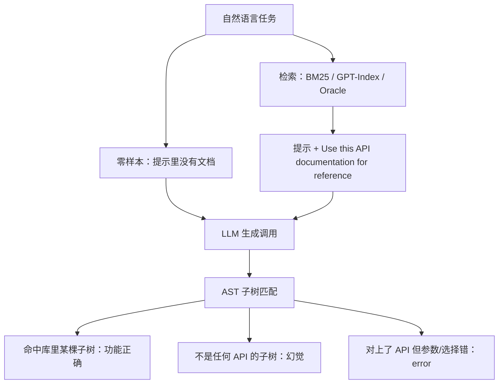

# Gorilla：先承认 GPT-4 会编造 API，再用 APIBench 与检索感知微调把调用钉回文档

<!-- release-date: 2023-05-24 -->

**本文依据**：`Gorilla: Large Language Model Connected with Massive APIs`，arXiv 2305.15334v1（页眉 `[cs.CL] 24 May 2023`），18 页。作者 Shishir G. Patil、Tianjun Zhang（封面标 * Equal contribution）、Xin Wang（Microsoft Research）、Joseph E. Gonzalez；封面机构 1 UC Berkeley、2 Microsoft Research（PDF p. 1）。封面印 `Preprint. Under review.`，未印会议录用，本文不补。盘上是 v1。首发日取页眉 24 May 2023。项目页封面写明 `https://gorilla.cs.berkeley.edu`（PDF p. 1）。文中数字均标 PDF 页码；标「外部补充」的段落不来自本文。

## 一句话

LLM 已经会对话、会推理、会写程序，但把工具接到「海量、重叠、还在改文档」的 API 上，连 GPT-4 都会填错参数、编造不存在的调用（PDF p. 1）。Gorilla 是在 LLaMA-7B 上做检索感知微调的模型，目标不是把对话聊得更像人，而是在 HuggingFace / TorchHub / TensorHub 组成的 APIBench 上写出功能正确的 API 调用（PDF p. 1–2）。评测用 AST 子树匹配：幻觉是「库里根本没有这棵子树」，参数填错则另记为 error（PDF p. 5）。零样本时 Gorilla 在 TorchHub 上 overall **59.13**，比 GPT-4 的 **38.70** 高 **20.43** 个百分点，比 GPT-3.5 的 **48.38** 高 **10.75** 个百分点；幻觉 **6.98**，低于 GPT-4 的 **36.55**（PDF p. 6–7 表 1）。贯穿全文的轴不是「再堆一批插件」，而是：**什么叫调用对了、幻觉和填错怎么分开、检索器什么时候帮忙什么时候添乱。**

## 一、矛盾：插件演示好做，海量重叠 API 没法塞进提示

固定权重、静态计算图、有限上下文，决定了模型不能把整个世界记进参数；世界一变，还得重训（PDF p. 1）。接搜索、数据库、计算器、Python 解释器，是当时已经走通的补丁（PDF p. 1–2）。OpenAI 一类提供方开始用插件走外部工具（PDF p. 1）。作者的想象更远：订一整趟旅行、办一场会，变成跟能调机票、租车、酒店、餐饮、娱乐 Web API 的 LLM 说话（PDF p. 1）。

旧工作多半只接一小撮文档写得很干净、能整段塞进提示的 API（PDF p. 1）。Web 规模、可能上百万条、还在改的云 API，不能再这么做：全集写不进一次上下文；功能重叠、限制又细；连评测都得另做基准（PDF p. 2）。

图 1 把失败模式钉死（PDF p. 2）：同一句「用 Torch Hub 把录音里的口语转成文字」，GPT-4 给出不存在的模型，Claude 选错库，Gorilla 给出可限定的 `torch.hub.load`。图 2 把四个设定（零样本、BM25、GPT 检索、oracle）画成「准确率对幻觉」：越高越左越好（PDF p. 2）。

上图根据 PDF p. 2–5、p. 6 重画，是评测口径示意，不是实测曲线。

相关工作三条边界（PDF p. 3）：Alpaca / Vicuna 一类是对话与指令；Toolformer、网页浏览、计算器是「少数固定工具」；程序合成评的是一般代码，难验证。Gorilla 把域收窄成 **线性程序里的 API 调用**——像用工具，不必自己实现底层（PDF p. 3）。作者自称检索增强微调在当时少见（PDF p. 3）。

## 二、APIBench：三座模型中枢，指令由 GPT-4 合成

### 规模：引言、第 3.1 节、附录对不齐，读表时钉死出处

引言把三座 hub 写成：TorchHub **94** 条（穷尽）、TensorHub **696** 条（穷尽）、HuggingFace 每任务类别下载量最高的 **20** 个模型、合计 **925**；每条 API 用 Self-Instruct 造 **10** 条用户问题，得到指令–参考 API 对（PDF p. 2）。图 3 写成 **1,645** 条：Torch Hub **94**、TensorFlow Hub v2 **626**（穷尽）、HuggingFace **925**，以及 **16,450** 对 `{instruction, API}`（PDF p. 4 图 3）。

第 3.1 节更细（PDF p. 3–4）：

- HuggingFace 当时约 **203,681** 个模型；大量文档差、缺依赖、卡片空。过滤后每个域取 top 20：多模态 **7**、CV **8**、NLP **12**、音频 **5**、表格 **2**、强化学习 **2**，得到 **925**。
- TensorFlow Hub v2 共 **801**，滤掉卡片几乎没信息的之后剩 **626**。
- Torch Hub **95** 个模型。三者转成 JSON 后写成 **1,645** 条 API。

附录 8.1 又写成 Torch Hub **95**、Tensor Hub **696**、HuggingFace **925**（PDF p. 13）。图 7 的 caption 说「Tensor Hub 是最小的数据集」（PDF p. 14），与「Torch 只有约 95 条」矛盾，以表内计数为准，caption 不当证据。

限制节写发布「超过 **11,000**」条指令–API 对（PDF p. 9）；图 3 写 **16,450**。两处都来自原文，不要合成一个「官方总数」。JSON 字段：`domain, framework, functionality, api_name, api_call, api_arguments, environment_requirements, example_code, performance, description`，作者说是为了将来也能覆盖 RESTful（PDF p. 4）。

附录域清单：Torch Hub **6** 个域，Tensor Hub **57**，HuggingFace **37**（PDF p. 13）。Torch 六域是 Classification、Semantic Segmentation、Object Detection、Audio Separation、Video Classification、Text-to-Speech（PDF p. 13）。

### 指令怎么造

Self-Instruct：给 GPT-4 三个上下文例子和一份参考 API 文档，要求写真实用例，**禁止在指令里出现 API 名或暗示**（PDF p. 4）。三个 hub 各手写 **6** 条 Instruction–API，共 **18** 条是唯一人工改过的数据。对 1,645 条里每一条，从对应 6 条里抽 3 条当例子，再生成 10 对（PDF p. 4）。作者说生成指令的 GPT-4 可以换成 LLaMA、Alpaca（PDF p. 4）。

划分：HuggingFace **90%** 训练 / **10%** 评测；Torch Hub 与 Tensor Hub **80% / 20%**（PDF p. 13）。正文强调 holdout 的指令–API 对（PDF p. 6）。

## 三、Gorilla：检索感知的 LLaMA-7B，不是把对话聊好

Gorilla = retrieve-aware finetuned LLaMA-7B，专攻 API（PDF p. 4）。数据改成一轮 user–agent 对话，再标准指令微调。实验分「带检索训」和「不带检索训」两套（PDF p. 4）。

带检索时，用户提示末尾追加 `Use this API documentation for reference: <retrieved_API_doc_JSON>`，让模型用后半段文档答前半段问题（PDF p. 5）。作者列三点：测试时文档能改；上下文学习能涨分；幻觉能降。也立刻说：**检索不总是涨分，有时会伤**（PDF p. 5）。

推理同样两档（PDF p. 5）：

1. **零样本**：用户自然语言原样进模型，**不再做 prompt tuning**。
2. **检索**：BM25 或 GPT-Index 从 API 库取最新文档，拼到提示里，同样加那句 reference。除拼接外不再调提示。

作者写他们有一套执行这些 API 的系统，**但执行不是本文焦点**（PDF p. 5）。附录还说示例代码的运行结果没有测，留给后续（PDF p. 13）。

训练超参表 4（PDF p. 14）：学习率 $2\times 10^{-5}$，batch **64**，**5** epoch，warmup ratio **0.03**，weight decay **0**，max seq length **2048**；**8×A100 40G**（PDF p. 13–14）。

约束调用是另一层：不仅要懂功能，还要按参数量、精度下界分类。例子：「图像分类，参数少于 10M，ImageNet 精度至少 70%」（PDF p. 4–5）。REST 侧作者提到调用成本与延迟；ML 侧还有磁盘占用、峰值内存、FLOPS（PDF p. 9）。

## 四、什么叫对了：AST 子树，幻觉与 error 分开

单测用例验不了「语义上是不是同一个 API」：图像分类就有 **40** 多个模型；Densenet 一家还有四种配置（PDF p. 5）。本文只考虑一次调用，用 AST：生成代码解析成树，找根为关心的 API（如 `torch.hub.load`）的子树，拿去索引数据集（PDF p. 2、p. 5）。

定义（PDF p. 5）：

- **幻觉**：生成的调用 **不是库里任何 API 的子树**——完全想象出来的工具。
- **error**：调用了库里有的 API，但用错了。

Python 有默认参数，库里为每个 API 规定要比对哪些参数。Torch 例：查 `repo_or_dir` 与 `model`；`pretrained=True` 是可选叶，不强制匹配（PDF p. 5 图 4）。附录钉死检查字段（PDF p. 16）：

- Torch Hub：`torch.hub.load` 的 `repo_or_dir`、`model`。
- Tensor Hub：`hub.KerasLayer` 与 `hub.load` 的 `handle`。
- HuggingFace：函数名很多；除 `pipeline` 外都要 `pretrained_model_name_or_path`；`pipeline` 指定任务后会自己选模型，不强制这条。

**HuggingFace 不是穷尽集。** 表 1 说明：除 Gorilla 外，其他模型在 HF 上只检查域名单对不对，退化成多选题；Gorilla 仍走 AST（PDF p. 6–7）。读 HF 列时不要和 Torch / Tensor 的「功能正确」当成同一口径。

## 五、数字：表 1 是主榜，检索器会误导零样本微调模型

基线（PDF p. 6）：GPT-4 `gpt-4-0314`；GPT-3.5 `gpt-3.5-turbo-0301`；Claude `claude-v1`；LLaMA-7B。检索：每条 API 当一篇文档，用户查询取 **top-1** 拼进提示。Oracle 有两个用途：估检索上限；服务「已经知道该用哪个 API、但不会写调用」的人（PDF p. 6）。

表 1（PDF p. 7），百分数。HuggingFace 列对非 Gorilla 模型是域选择，见上一节。

| LLM（检索） | Torch overall | Torch hallu | Torch err | HF overall | HF hallu | HF err | TF overall | TF hallu | TF err |
|---|---|---|---|---|---|---|---|---|---|
| LLaMA 0-shot | 0 | 100 | 0 | 0.00 | 97.57 | 2.43 | 0 | 100 | 0 |
| GPT-3.5 0-shot | 48.38 | 18.81 | 32.79 | 16.81 | 35.73 | 47.46 | 41.75 | 47.88 | 10.36 |
| GPT-4 0-shot | 38.70 | 36.55 | 24.7 | 19.80 | 37.16 | 43.03 | 18.20 | 78.65 | 3.13 |
| Claude 0-shot | 18.81 | 65.59 | 15.59 | 6.19 | 77.65 | 16.15 | 9.19 | 88.46 | 2.33 |
| Gorilla 0-shot | 59.13 | 6.98 | 33.87 | 71.68 | 10.95 | 17.36 | 83.79 | 5.40 | 10.80 |
| LLaMA BM25 | 8.60 | 76.88 | 14.51 | 3.00 | 77.99 | 19.02 | 8.90 | 77.37 | 13.72 |
| GPT-3.5 BM25 | 38.17 | 6.98 | 54.83 | 17.26 | 8.30 | 74.44 | 54.16 | 3.64 | 42.18 |
| GPT-4 BM25 | 35.48 | 11.29 | 53.22 | 16.48 | 15.93 | 67.59 | 34.01 | 37.08 | 28.90 |
| Claude BM25 | 39.78 | 5.37 | 54.83 | 14.60 | 15.82 | 69.58 | 35.18 | 21.16 | 43.64 |
| Gorilla BM25 | 40.32 | 4.30 | 55.37 | 17.03 | 6.42 | 76.55 | 41.89 | 2.77 | 55.32 |
| LLaMA GPT-Index | 14.51 | 75.8 | 9.67 | 10.18 | 75.66 | 14.20 | 15.62 | 77.66 | 6.71 |
| GPT-3.5 GPT-Index | 60.21 | 1.61 | 38.17 | 29.08 | 7.85 | 44.80 | 65.59 | 3.79 | 30.50 |
| GPT-4 GPT-Index | 59.13 | 1.07 | 39.78 | 44.58 | 11.18 | 44.25 | 43.94 | 31.53 | 24.52 |
| Claude GPT-Index | 60.21 | 3.76 | 36.02 | 41.37 | 18.81 | 39.82 | 55.62 | 16.20 | 28.17 |
| Gorilla GPT-Index | 61.82 | 0 | 38.17 | 47.46 | 8.19 | 44.36 | 64.96 | 2.33 | 32.70 |
| LLaMA Oracle | 16.12 | 79.03 | 4.83 | 17.70 | 77.10 | 5.20 | 12.55 | 87.00 | 0.43 |
| GPT-3.5 Oracle | 66.31 | 1.60 | 32.08 | 89.71 | 6.64 | 3.65 | 95.03 | 0.29 | 4.67 |
| GPT-4 Oracle | 66.12 | 0.53 | 33.33 | 85.07 | 10.62 | 4.31 | 55.91 | 37.95 | 6.13 |
| Claude Oracle | 63.44 | 3.76 | 32.79 | 77.21 | 19.58 | 3.21 | 74.74 | 21.60 | 3.64 |
| Gorilla Oracle | 67.20 | 0 | 32.79 | 91.26 | 7.08 | 1.66 | 94.16 | 1.89 | 3.94 |

正文把零样本 SOTA 写成：比 GPT-4 好 **20.43%**、比 ChatGPT 好 **10.75%**、相对 LLaMA 改进「大到 **83%**」（PDF p. 6）。前两个差与 TorchHub 列 59.13−38.70、59.13−48.38 对得上；**83%** 与 TensorFlow Hub 零样本 Gorilla **83.79**、LLaMA **0** 同一量级，原文没有写清分母，不要自行改成「百分点」。

不带检索训练、测试时硬塞 oracle，几乎没帮助：TensorHub **差 0.88%**，HuggingFace **好 0.97%**（PDF p. 6）。塞 BM25 或 GPT-Index 会大跌：Torch Hub **21.50%**，HuggingFace **47.57%**（PDF p. 6–7）。非最优检索会误导已经靠权重记住 API 的模型。

图 5 只画 GPT 检索器：Gorilla 在 Torch Hub、HuggingFace 超过对照，TensorFlow Hub 与最强闭源接近（GPT-3.5 **65.59**，Gorilla **64.96**）（PDF p. 7）。附录图 10、图 11 把 0-shot / BM25 / GPT / Oracle 铺开，结论仍是零样本优势最大（PDF p. 14、p. 17–18）。图 10 HuggingFace Oracle 条上 GPT-4 印成 **85.06**，表 1 是 **85.07**，以表 1 为准（PDF p. 7、p. 17）。

GPT-4 / GPT-3.5 零样本幻觉很重，典型是 `AutoModel.from_pretrained` 填任意 GitHub 名（PDF p. 8）。三个 hub、四种检索设定下，GPT-3.5 幻觉都低于 GPT-4；作者猜测 RLHF 更「说实话」（PDF p. 8）。附录图 9：`your_model_name`、不存在的 CLIP-VQA 路径等（PDF p. 16）。

## 六、表 2：带着 oracle 文档训，测试时没有文档会崩

「带检索微调」= 指令 + oracle 参考文档 + GPT-4 写出的示例输出（PDF p. 7）。相对不带检索训练，oracle 评测时 Torch Hub 高 **12.37%**，HuggingFace 高 **23.46%**（PDF p. 7）。现有检索距 oracle 仍远：GPT-Index 评测掉 **29.20%**，BM25 掉 **52.27%**（PDF p. 7）。作者结论：检索够好就带着训；检索不够就宁可零样本微调（PDF p. 8）。

表 2（PDF p. 8）：

| 指标 | 无检索训 0-shot | 无检索训 BM25 | 无检索训 GPT-Index | 无检索训 Oracle | 有 oracle 训 0-shot | 有 oracle 训 BM25 | 有 oracle 训 GPT-Index | 有 oracle 训 Oracle |
|---|---|---|---|---|---|---|---|---|
| Torch overall ↑ | 59.13 | 37.63 | 60.21 | 54.83 | 0 | 40.32 | 61.82 | 67.20 |
| HF overall ↑ | 71.68 | 11.28 | 28.10 | 45.58 | 0 | 17.04 | 47.46 | 91.26 |
| Tensor overall ↑ | 83.79 | 34.30 | 52.40 | 82.91 | 0 | 41.89 | 64.96 | 94.16 |
| Torch hallu ↓ | 6.98 | 11.29 | 4.30 | 15.59 | 100 | 4.30 | 0 | 0 |
| HF hallu ↓ | 10.95 | 46.46 | 41.48 | 52.77 | 99.67 | 6.42 | 8.19 | 7.08 |
| Tensor hallu ↓ | 5.40 | 20.43 | 19.70 | 13.28 | 100 | 2.77 | 2.33 | 1.89 |

右半边零样本 overall 为 **0**、幻觉近 **100**：模型学会了依赖拼接进来的 JSON，测试时抽掉文档就不会调。这不是排印错误，是检索感知训练的代价。

图 6 是测试时改文档的定性例子，不是表 2 的数字（PDF p. 8）：抠图默认 `fcn_resnet50`；检索换成 `fcn_resnet101` 就跟；仓库从 `pytorch/vision` 换成 `NVIDIA/DeepLearningExamples:torchhub` 也跟。作者把这当成「文档更新快过重训」的对策（PDF p. 8–9）。

## 七、表 3：加精度约束，零样本 Gorilla 仍最高，检索后 GPT-3.5 更稳

子集：Torch Hub 里至少在一个数据集上写了精度的卡片，占表 1 TorchHub 的 **65.26%**（PDF p. 9）。例子：ImageNet top-1 至少 **80%** 时，应选 ResNeXt-101 32x16d 的 **84.2%**，而不是 MobileNetV2 的 **71.88%**（PDF p. 9）。

表 3（PDF p. 9），Torch Hub：

| 模型 | 设定 | overall | hallu | err | Accuracy const |
|---|---|---|---|---|---|
| GPT-3.5 | 0-shot | 73.94 | 19.01 | 7.04 | 43.66 |
| GPT-3.5 | BM25 | 62.67 | 30.98 | 6.33 | 33.80 |
| GPT-3.5 | GPT-Index | 81.69 | 14.78 | 3.52 | 33.09 |
| GPT-3.5 | Oracle | 80.98 | 14.08 | 4.92 | 69.01 |
| GPT-4 | 0-shot | 62.67 | 15.49 | 21.83 | 43.66 |
| GPT-4 | BM25 | 56.33 | 27.46 | 16.19 | 29.57 |
| GPT-4 | GPT-Index | 71.11 | 14.08 | 14.78 | 29.57 |
| GPT-4 | Oracle | 69.01 | 9.15 | 21.83 | 59.15 |
| Gorilla | 0-shot | 71.83 | 19.71 | 8.45 | 47.88 |
| Gorilla | BM25 | 57.04 | 39.43 | 3.52 | 30.28 |
| Gorilla | GPT-Index | 71.83 | 26.05 | 2.11 | 26.76 |
| Gorilla | Oracle | 78.16 | 16.90 | 4.92 | 67.60 |
| LLaMA | 0-shot | 0 | 100 | 0 | 0 |
| LLaMA | BM25 | 8.45 | 91.54 | 0 | 6.33 |
| LLaMA | GPT-Index | 11.97 | 88.02 | 0 | 3.52 |
| LLaMA | Oracle | 19.71 | 78.87 | 1.4 | 17.60 |
| Claude | 0-shot | 29.92 | 67.25 | 2.81 | 17.25 |
| Claude | BM25 | 81.69 | 16.19 | 2.11 | 29.57 |
| Claude | GPT-Index | 82.39 | 15.49 | 2.11 | 31.69 |
| Claude | Oracle | 81.69 | 13.38 | 4.92 | 69.71 |

加约束后各模型都掉。Gorilla 零样本 Accuracy const **47.88** 最高；BM25 / GPT-Index 上作者说与当时最强的 GPT-3.5「能匹配」——表上 GPT-3.5 的 const 是 **33.80 / 33.09**，Gorilla 是 **30.28 / 26.76**，overall 上 GPT-3.5 GPT-Index **81.69** 高于 Gorilla **71.83**。正文「匹配」是作者概括，读表时 overall 与 const 要分开（PDF p. 9）。Claude 在有检索时 overall 很高（**81.69–82.39**），零样本只有 **29.92**（PDF p. 9）。

## 八、限制、社会影响、本文没写什么

选 ML API 是因为功能相似、够难（PDF p. 9）。代价是：训练数据偏，下游预测可能伤害子群。作者用公开超过 **11,000** 对来对冲，便于社区研究现有 API（PDF p. 9）。致谢：UC Berkeley Sky Computing Lab 的工业礼物（拼写为 Berkley）（PDF p. 10）。

没写的：调用是否真的跑通；多步 / 多 API 编排；RESTful 成本与延迟的实测（只当类比）；HF 对基线是域分类不是全量 AST；封面是预印本在审，没有会议录用页。

## 九、可迁移启发

1. **先把「幻觉」和「用错」拆开。** 库外子树 vs 库内错参，优化方向完全不同。
2. **检索不是免费涨分。** 零样本微调模型在测试时接劣检索会掉 20 个点以上；带着 oracle 训、测试不给文档会归零。
3. **文档会改，权重改不过来。** 检索感知训练让仓库名、backbone 版本可以跟文档走，这比把 API 背进参数更贴近真实插件。
4. **评测不要只对字符串。** 同一任务多个合法模型时，AST 子树比 unit test 更接近「功能等价」。
5. **约束是第二道考试。** overall 高不等于能按精度下界选对模型。

## 十、关键词回看

**APIBench** 是三座 ML hub 的指令–API 基准；**Gorilla** 是 LLaMA-7B 的检索感知微调；**AST 子树匹配** 区分幻觉与 error；**BM25 / GPT-Index / Oracle** 是三种检索；**约束调用** 是在功能之外再满足精度或规模。

## 参考资料

- 本文 PDF：仓库 `readings/_src/评测与 Benchmark/Gorilla.pdf`
- 项目页（封面）：[https://gorilla.cs.berkeley.edu](https://gorilla.cs.berkeley.edu)
- arXiv： [https://arxiv.org/abs/2305.15334](https://arxiv.org/abs/2305.15334)
