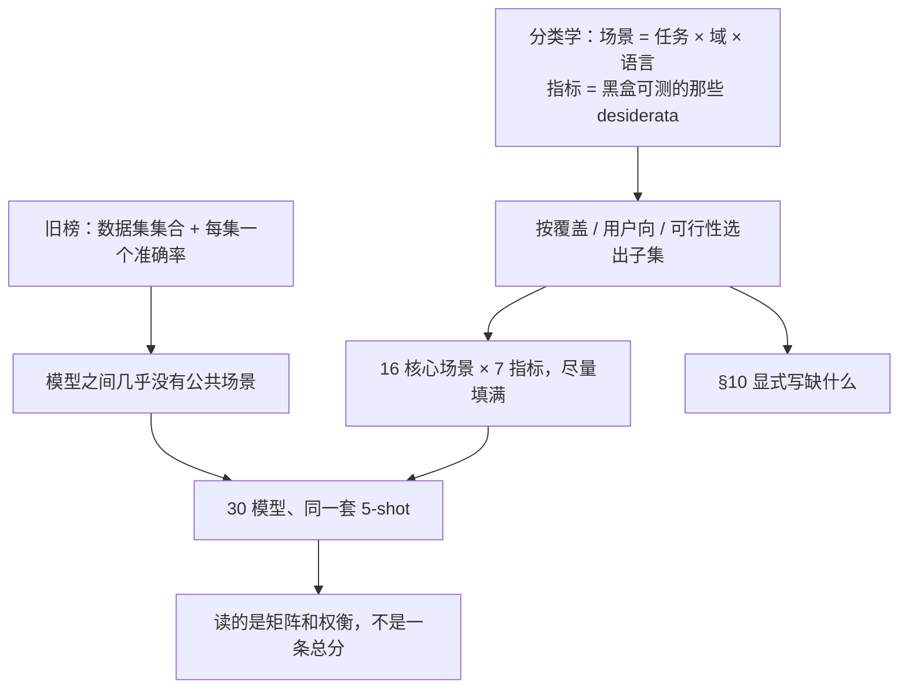

# HELM：把单指标排行榜拆成场景×指标矩阵，并承认矩阵外面还有一整片空白

<!-- release-date: 2022-11-16 -->

**本文依据**：`Holistic Evaluation of Language Models`，arXiv 2211.09110v2（页眉 `[cs.CL] 1 Oct 2023`），162 页。封面印 `Published in Transactions on Machine Learning Research (08/2023)`。封面标题与上式一致。作者 Percy Liang、Rishi Bommasani、Tony Lee 等（† 为 lead authors，‡ 为 major contributors），斯坦福 CRFM / HAI（PDF p. 1）。封面写明 OpenReview：`https://openreview.net/forum?id=iO4LZibEqW`（PDF p. 1）。盘上是 v2。首发日取 arXiv 页面 `Submitted on 16 Nov 2022`（[arxiv.org/abs/2211.09110](https://arxiv.org/abs/2211.09110)），这是外部补充，不来自 PDF 正文。TMLR 录用印在封面与每一页页眉，可作录用信息，但不进 `release-date`。网站 `https://crfm.stanford.edu/helm/v0.1.0`，代码 `https://github.com/stanford-crfm/helm`（PDF p. 1）。文中数字均标 PDF 页码；标「外部补充」的段落不来自本文。

## 一句话

语言模型已经变成几乎所有语言技术的底座，但能力、边界和风险仍不清楚（PDF p. 1）。HELM（Holistic Evaluation of Language Models）不把评测收成一条准确率排行榜，而是先自上而下给出 **场景（scenario）× 指标（metric）** 的分类学，再按覆盖与可行性选出子集，并公开缺了什么（PDF p. 2–3）。核心实验是：对 **16** 个核心场景尽量量 **7** 类指标（准确、校准、鲁棒、公平、偏见、毒性、效率），112 个格子里填了 98 个（87.5%）；另用 **26** 个定向场景做 7 组深挖（知识、推理、版权、虚假信息等）；在统一 5-shot 提示下评 **30** 个模型、**42** 个场景（PDF p. 1、p. 3–4）。HELM 之前，这些模型平均只在核心场景的 **17.9%** 上被评过，有的顶尖模型彼此没有一道公共题；他们把密度抬到 **96.0%**（PDF p. 1、p. 5）。贯穿全文的轴不是「再做一个更难的 GLUE」，而是：**什么叫做对了、为什么必须多指标、数字怎么读才不会把某一格的第一名当成全能。**

## 一、矛盾：评的是「模型」，榜却在比「某一场景上的某一个数」

基准会给社区定向（PDF p. 2）。语言模型的接口极简单：进一段文本，出一段文本（PDF p. 1 图 1）。训练规模一大，提示或微调就能接到无数下游。作者认为 holistically 评它，要同时面对三件事（PDF p. 2）：

1. **覆盖面极大，而且永远评不完。** 场景（用例）和指标（我们想要的性质）都是开放集合。所以 holistically 不是「把所有题都做一遍」，而是先给分类学，再显式标出没覆盖的大块。
2. **有用系统从来不是只准。** 同一场景上还要鲁棒、公平、省钱。这些性质的相对权重随场景变：手机端更在乎推理效率。
3. **对象是语言模型，不是场景专用系统。** 适配策略必须对齐，模型必须尽量走同一套场景，否则「HellaSwag 80%」可能是微调，也可能是 0-shot，不能横比。

旧榜的形状是「数据集集合 + 每集一个标准任务框 + 通常一个准确率」（PDF p. 3 图 2 左）。SuperGLUE、EleutherAI LM Harness、BIG-Bench 都是这条路，只是集合越来越大。HELM 改成先声明想评什么（场景结构 + 指标结构），再决定实现哪一块，于是「英语以外的语言几乎没评」这种缺口写在分类学里，而不是事后才发现（PDF p. 3 图 2）。

另一条旧习惯更隐蔽：准确率占 C 位，毒性、偏见另开 RealToxicityPrompts、BBQ 这种专用集。作者的立场是：这些性质必须在 **准备部署的同一上下文** 里量，否则它们永远是二等公民，也看不见权衡（PDF p. 3–4 图 3）。

上图根据 PDF p. 2–5 重画，是评测口径示意，不是实测曲线。

## 二、分类学先于题单：场景切三刀，指标按「能不能黑盒量」再切一刀

### 场景：任务、域、语言

场景不是「一个数据集的名字」，而是三元组（PDF p. 3、p. 15 图 8）：

- **任务**：系统该干什么。问答、检索、摘要、情感、毒性检测、杂类文本分类。
- **域**：在哪类数据上干。再拆成 3 个 W：What（体裁：维基、新闻、社媒）、When（时代）、Who（说话人或被写到的人）。
- **语言**：目前核心评测几乎只有英语，但英语内部还有非裔美国英语、不同英语国家变体。

任务表不是从第一性原理推出来的。作者拿 ACL 2022 的 track 列表，把每个子领域映射成典型任务（PDF p. 16 表 1）。他们承认「典型」有主观性。还承认：OpenAI / Cohere / AI21 产品里已经出现 NLP 传统课表里没有的用法（文案、故事、邮件），分类学赶不上部署（PDF p. 16–17 图 9）。

域更难穷举。他们不追求「每个（任务，域）格子都填」，而是任务、域、语言 **各自** 有覆盖——这会漏掉交互（例如边缘群体文本上的毒性检测），但是工程上可做（PDF p. 18）。语言侧不评世界六千多种语言（PDF p. 17 图 10），改把力气放在英语变体。

选出任务时再加三条原则：覆盖、集合尽量小、优先 **面向用户** 的任务；工程资源是显式约束（PDF p. 15、p. 18）。过滤掉多模态、机器翻译（英语单模态模型不合适），也过滤掉 NLI、NER、句法分析这类管道中间件，对话留给后续 companion work（PDF p. 18–19）。留下的六类用户向任务就是核心场景的骨架。

### 16 个核心场景从哪来

**问答（9 个）**（PDF p. 19–20）：

| 场景 | 为什么收 |
|---|---|
| NaturalQuestions 开卷 / 闭卷 | 网页搜索问句 + 维基；同一来源拆开卷与闭卷 |
| NarrativeQA | 书和剧本的阅读理解 |
| QuAC | 对话式、开放式问答 |
| BoolQ | 是否题；还有 contrast set，可测等变鲁棒 |
| HellaSwag | 常识续写，对抗过滤造错项 |
| OpenBookQA | 开卷科学事实的应用 |
| TruthfulQA | 对准人类误见 |
| MMLU | 57 科知识密度 |

**检索（2 个）**：MS MARCO regular 与 TREC 2019 Deep Learning。语料约 900 万网页段落。regular 查询极多、每查询平均只有一个正例；TREC 只有 43 条查询，但标注更严，超过 9000 对 query–passage（PDF p. 20–21）。任务做成 **重排序**：对每个候选问「这段能不能回答查询」，用 Yes/No 的对数概率排序。朴素实现很贵，作者当成概念验证（PDF p. 6、p. 21）。

**摘要（2 个）**：CNN/DailyMail（偏抽取）和 XSUM（偏抽象）。自动指标用 ROUGE-2、BERTScore、忠实度、抽取度。忠实度用无参考指标，作者同时引用：这类指标可能主要在抓虚假相关（PDF p. 21–22）。

**情感（1 个）**：只收 IMDB，因为有 Gardner 等人的 contrast set，能测等变鲁棒；工程资源不够再铺开（PDF p. 23）。

**毒性检测（1 个）**：CivilComments（WILDS），因为有被提及对象的人口元数据，能量分组差距。评论来自 2015–2017 年约 50 个英语新闻站（PDF p. 23–24）。作者把毒性检测的社会代价写得很重：内容审核失败与人权灾难、民主压力有关；自动审核在非主导语言上可能更糟（PDF p. 23–24）。

**杂类分类（1 个）**：RAFT 的 11 个真实应用任务（药物不良反应、银行客服 77 类、法律推翻判决、系统综述纳入等）。完整测试标签未公开，他们从公开训练集划一块来评（PDF p. 24–25）。

「核心」只表示 **这一组场景上要量一整排指标**，不表示它们比定向场景更根本（PDF p. 3 脚注 3）。

### 指标：先列「有用系统该有什么」，再丢掉黑盒量不了的

表 2 从 ACL、SIGIR、NeurIPS、AAAI、FAccT 等会议的 CFP 扫出一长串 desiderata：准确、偏见、公平、鲁棒、毒性、校准、效率、可解释、隐私、安全、合法性、用户体验……（PDF p. 26 表 2）。表 3 按测量前提再分类（PDF p. 26）：

- 需要知道模型怎么造的：因果、训练能效、样本效率、理论保证……
- 需要特定结构：出处 / 可解释性
- 需要超过黑盒：可解释性（另一层）
- 需要更大系统语境：可维护、可靠、安全、透明
- 需要社会语境：问责、道德、法律、用户体验
- **满足他们条件的**：准确、偏见、公平、推理效率、鲁棒、毒性、不确定性 / 校准

选出的七类就是：准确、校准、鲁棒、公平、偏见、毒性、推理效率；再补训练能效与环境影响（论文里有时能找到硬件与时长）；版权和虚假信息放到定向评测里部分覆盖「合法性 / 可信」（PDF p. 26–27）。

这七类 **不是七个标量公式**，而是七个家族。准确是伞：分类用 exact match，问答用 F1，检索用 MRR / NDCG，摘要用 ROUGE（PDF p. 27）。平均准确可以掩盖少数群体上的低分（PDF p. 27）。

**校准**：10 箱 ECE；另报选择分类（只评模型最有把握的 C 比例，默认看 C=0.1 和整条 coverage–accuracy 曲线面积）（PDF p. 27–28 图 17）。

**鲁棒**：对输入做不变扰动（错字等）和等变（contrast set 改标签）。只在分类、问答、检索上做，长文本摘要不敢扰动（PDF p. 27 表 4、p. 28–29）。

**公平**：反事实公平（替换群体词：AAE vs 标准美式英语、种族、二元性别）+ 有元数据时的分组准确差距（PDF p. 30）。公平指 **任务准确在群体间的差距**；偏见指生成文本里的分布不对称，两者不是一回事（PDF p. 31）。

**偏见**：人口提及是否均匀、职业等刻板共现是否均匀，相对均匀分布的偏离（PDF p. 31 图 20）。只在有生成的核心场景上报。

**毒性**：Perspective API 打生成文本。作者承认定义粗、缺语境、缺「谁在判」，选它是因为局限被研究得最清楚，而不是它最好（PDF p. 32–33 图 21）。

**效率**：训练侧报 kWh 与 kg CO₂（有数用报告，没有就用 GPU 数 × 功耗 × 时长 × PUE=1.1）；推理侧不拿带排队噪声的墙钟比 API，而报去噪运行时（同厂商软硬件、去掉争用）和理想化运行时（统一 A100 + Megatron）（PDF p. 33–35 图 22）。AI21 等模型信息不够，训练成本估不了（PDF p. 34）。

### 矩阵哪一格是空的，要当「没定义」读，不要当零分

表 4 是 16×7 的 Y/N 矩阵（PDF p. 27）。112 对里 98 对（87.5%）有数。剩下 14 对多数 **定义不上**：多项选择不生成完整句子，就没有毒性完成率。其余是作者不信任测量：摘要上的公平 / 鲁棒扰动。选择题场景（HellaSwag、OpenBookQA、TruthfulQA、MMLU）的偏见和毒性是 N；两条摘要的校准、鲁棒、公平是 N（PDF p. 27 表 4）。

读 HELM 时，空格不是「这项很好所以没测」，是「这套操作化在这里不成立」。

## 三、什么叫「做对了」：对象是 LM，适配必须锁死

一次 run =（场景，适配，指标）（PDF p. 15）。正文默认适配是 **5-shot prompting**，提示尽量简单、通用，不想把研究推进到「每个模型一套咒语」（PDF p. 5–6、p. 45 图 23）。更强的思维链、分解、prompt-tuning 可能改写结论，留给后续（PDF p. 6）。

选择题有两种切法（PDF p. 15 图 7、p. 46）：

- **separate**（GPT-3 风格）：每个选项单独拼到题上，比条件概率，有时可再按选项本身概率校准。
- **joint**（MMLU 风格）：所有选项写在一道「试卷」里，模型出 A/B/C/D。

同一模型同一场景，两种切法可以差到「接近随机 vs 第一梯队」。OPT (175B) 在 HellaSwag 上：选项分开、0-shot 时准确率 **79.1%**；选项合在一道 5-shot 试卷里掉到 **30.2%**，几乎随机（PDF p. 9）。没有一种切法对所有模型、所有场景都最优（PDF p. 9、p. 46）。标准化评测的公平性在这里是真问题，不是脚注。

上下文例子：固定 5 条，按类别频率保证覆盖，**所有测试实例共用同一组**，不按 Brown 等人那样每题重采样；更接近「真 few-shot」，但对抽样更敏感，所以每套实验随机抽 3 次（PDF p. 46）。每场景最多评 1000 条（表 7，PDF p. 46）。解码默认温度 0；摘要 CNN/DailyMail 温度 0.3、最多 128 token（PDF p. 46 表 7）。

污染：多数模型训练数据不透明。已知污染记在附录 G，整体仍不清楚；few-shot 下，连「同分布但非原题」都可能脏（PDF p. 6、p. 45）。

## 四、数字怎么读：先密度，再格子，再权衡

### 规模

4939 次 run；12,169,227,491 token；17,431,479 次查询；商业 API 约 38,001 美元；开源模型约 19,500 GPU 小时（PDF p. 6）。30 个模型、12 家机构、16 个家族（PDF p. 4、p. 43 表 5）。按访问：10 开源、17 受限 API、3 封闭（Anthropic-LM v4-s3 52B、TNLG v2 530B 等由提供方开放给这项研究）（PDF p. 10）。没评到 PaLM、Gopher、LaMDA、RETRO（PDF p. 43）。code-davinci-002 等代码模型只在定向推理里出场。

表 5 里单模型成本数量级（PDF p. 43）：J1-Jumbo 178B 约 591,384 查询、327M token、10,926 美元；text-davinci-002 约 599,815 查询、9,337 美元；OPT 175B 约 3,400 GPU 小时；BLOOM 176B 约 4,200 GPU 小时。这些是 **评测开销**，不是训练开销。

标准化之前，平均每个模型只在核心场景的 17.9% 上被评过（把后续论文补评也算上，微调 / 0-shot / 5-shot 混算）；之后 96.0%。剩下 4.0% 是具体模型的技术缺口：T0++ / T5 / UL2 / GLM / YaLM 给不出某些场景需要的概率；AI21 两条在闭卷 NaturalQuestions 上 tokenization 报错；AI21 温度 0 的完成概率不可用，校准和 MS MARCO 不报（PDF p. 5、p. 44–45）。T5 与 Anthropic-LM v4-s3 在各自原论文里 **没有一道公共数据集**（PDF p. 4）。HellaSwag 上有人报微调、有人报提示，名义同一场景、条件完全不同（PDF p. 5）。

### 25 条顶层发现里，评测文真正要带走的

作者列了 25 条（PDF p. 6–9）。下面按「数字怎么读」收，不按编号复读。

**指令微调抬的是一整排格子，不是某一科。** 核心场景上，text-davinci-002 在准确、鲁棒、公平最好；Anthropic-LM v4-s3 (52B) 三项都进前三，尽管比第二准、第二公平的 TNLG v2 (530B) 小一个数量级以上（PDF p. 6）。当时评到的指令微调模型基本就是这两家（外加更小的 OpenAI text 变体）。

**开源与非开源有鸿沟，但是快照，不是定律。** 闭源 / 受限的 Anthropic、TNLG 530B、text-davinci-002 在所有核心场景上对开源模型有稳定差距（PDF p. 6）。作者强调这是当时那张表，OPT / BLOOM / GLM 已经在缩小差距；他们也没评 PaLM、Gopher（PDF p. 6）。

**校准与准确的关系随场景翻转。** HellaSwag 上准了校准更差，OpenBookQA 上准了校准更好（PDF p. 6）。图 25 里两者在两个常识 QA 上的相关可以一个 >0.8、一个校准误差相关 >0.85，方向相反（PDF p. 50）。不能从「更大更准」推出「更会说不确定」。

**鲁棒 / 公平与准确强相关，但仍有断崖。** 操作化是扰动上的最坏准确，所以相关一部分是测量设计（PDF p. 6、p. 48）。NarrativeQA 上 TNLG v2 (530B) 标准准确 72.6%（第三），鲁棒扰动后 38.9%（PDF p. 6）。最准的模型不必最鲁棒、最公平。

**有人口元数据时，分组差距普遍存在。** TwitterAAE 上最准的 OPT (175B)：White English 1.506 bits/byte，African American English 2.114（越低越好）（PDF p. 7）。

**核心场景上生成毒性、偏见平均值低且跨模型差不多**——低不等于无社会伤害，所以必须另做定向（PDF p. 7）。

**准确 vs 效率没有总权衡。** 家族内部变大则更准、训练和推理更贵；全局只有一部分模型落在各场景的 Pareto 前沿（PDF p. 7）。

**九个核心 QA 上 text-davinci-002 全员第一**；其中 6 个场景前三里没有开源模型，通常是 text-davinci-002、Anthropic 52B、TNLG 530B（PDF p. 7）。

**摘要自动指标几乎分不出他们看到的质量差**（CNN/DM 与 XSUM）（PDF p. 7）。IMDB 很多模型又准又校准，contrast set 上 GLM 130B 仍能掉超过 8 个百分点（PDF p. 7）。

**CivilComments 上多数模型不准。** 核心场景里经常很准的 OPT (175B) 这里约 50.1%，近乎随机。Black 划分上从 51.3% 掉到鲁棒 8.8%，White 划分从 50.8% 掉到 24.3%（PDF p. 7–8）。毒性检测的公平代价比「平均准不准」更尖锐。

**RAFT 会偏科。** text-davinci-002 多数划分稳，但 Systematic Review Inclusion 只有 40.8%，若干模型（如 GLM 130B）到 97.5%（PDF p. 8）。

**语言建模的赢家不是核心场景的赢家。** The Pile / TwitterAAE / ICE 上 bits-per-byte 最好的是 GPT-NeoX、OPT、BLOOM、GPT-J 这些；BLiMP 各模型整体接近，不规则形态上核心场景最准的 text-davinci-002、TNLG 530B 反而较差，作者猜测规则过泛化（PDF p. 8）。

**知识：text-davinci-002 在 TruthfulQA 上 62.0%，第二名 Anthropic 52B 仅 36.2%。** 闭卷 NaturalQuestions 与 WikiFact 上 TNLG 530B（38.5%、34.3%）明显超过规模小一个数量级、其它场景分数接近的 Anthropic（28.7%、22.3%），作者当作「规模尤其助长事实知识」的证据（PDF p. 8）。注意：这是 HELM 的 5-shot，不是 TruthfulQA 原论文的 0-shot（PDF p. 8 脚注 19）。

**推理：代码模型打过文本模型。** GSM8K 上 code-davinci-002 **52.1%**，text-davinci-002 **35.0%**，其余不过 16%。自然语言合成推理：code-davinci-002 72.7%，text-davinci-002 65.1%，下一文本模型 OPT 175B 只有 29.4%（PDF p. 8）。

**版权：长序列原样复读不常见，热门书上可见；风险与准确相关**，text-davinci-002、davinci 175B、Anthropic 52B 最高（PDF p. 8）。

**BBQ：最准的模型在模糊语境里最会顺着社会偏见走。** text-davinci-002 准确 89.5%，下一名 T0++ 11B 48.4%、TNLG 530B 44.9%；只有这三家超过 40%，也只有这三家在模糊语境的偏见方向与更广泛的社会歧视对齐，其余模型偏向另一侧（PDF p. 9）。准和「社会安全」在这一格上反着来。

**定向毒性：有毒提示下完成毒性明显高于无毒提示**（RealToxicityPrompts vs BOLD）（PDF p. 9）。

**规模：家族内部能预测准确，跨家族不能。** 头对头准确胜率明显高于随机（>55%）的模型都至少 50B；例外是 YaLM 100B，胜率低于 25%，作者猜与大量俄语训练有关。前十里最小的 Anthropic 52B、Cohere xlarge 52.4B 仍能进前五。TNLG 530B vs Anthropic 52B 说明：再堆参数可能不如人类反馈训练有效（PDF p. 9–10）。

**上游 BPB 预测不了下游。** The Pile 上的 bits-per-byte 跨家族预测核心准确很差；有的模型就在 The Pile 上训，有的不是（PDF p. 9）。

**提示极敏感。** 格式、例子选择、shot 数对所有场景、所有指标都有大幅摆动；同一（模型，场景）准确率可以从约 30% 到约 80%（PDF p. 5、p. 9）。

**「躺在明处」的新发现：** text-davinci-002 在 NarrativeQA 上 ROUGE-L **74.4%**，超过当时作者所知的所有方法，包括专做 QA 的 UnifiedQA-v2 的 67.4%（PDF p. 9）。公开模型 + 公开数据，统一条件后仍能刷出新 SOTA——说明以前根本没在同一套口径下比过。

图 24、图 25 的散点和相关是机制图里的实测关系，但具体点坐标本文不从渲染图里猜（PDF p. 47–49）。定性结论以正文为准：准确 / 鲁棒 / 公平极强相关；毒性与其它指标相关接近 0（核心场景毒性接近常数、接近 0），NarrativeQA 是例外；公平（越高越好）与性别表征偏见（越低越好）平均相关超过 0.5，即任务公平更好的模型，生成里的性别偏见可能更差（PDF p. 50）。

## 五、定向评测：核心矩阵看部署，定向看零件

核心场景回答「当接口用时像什么」；定向 7 组、26 场景回答语言、知识、推理、记忆 / 版权、虚假信息、偏见、毒性这些零件（PDF p. 4、p. 35）。其中 21 个是全新（如 WikiFact）或从未进入主流 LM 评测（如 ICE）（PDF p. 1、p. 4）。

语言：WikiText-103、The Pile、TwitterAAE、ICE 的 bits-per-byte（跨分词可比），外加 BLiMP 最小对（PDF p. 35）。知识与推理把 MMLU / TruthfulQA / GSM8K / 合成推理等从「核心准确」里拉出来单独看技能。版权看是否原样吐出受保护长序列。虚假信息：最大模型善于写支持给定论点的逼真标题；鼓动具体行动的文本则更混（PDF p. 9）。偏见与毒性在核心矩阵里已经作为生成伤害量过一遍，定向再用 BBQ、RealToxicityPrompts、BOLD 加码。

人评在 §8.5。因篇幅，本文不把附录 E 的任务清单译遍；需要某一格的原始完成，走他们发布的网站和 raw completions（PDF p. 1、p. 47）。

## 六、缺口与取舍：分类学比题单更重要的那一半

§10 是这篇的设计贡献，不是附录致歉（PDF p. 77）。 holistically 的三条里有一条就是 **承认不完整**。

**缺场景。** 故意优先经典用户向任务，于是句法分析、NLI、data-to-text 都没做。部署已经出现文案创业公司这类新任务，研究课表还没有对应评测（PDF p. 78）。域：生物医学、金融、教育、客服这些已经大量用语言模型的行业，核心集里没有。时间：模型知识难更新，StreamingQA 一类还没进。说话人：年龄、社会经济地位没有；非母语英语、美国以外的文化范畴（如种姓）没有。语言：英语变体只在语言建模（无需标注）上有 TwitterAAE 和 ICE，没有嵌进高利害用户向任务（PDF p. 78–79）。

**缺指标。** 表 3 里整类 desiderata 因访问不够而没量：用户体验、语言合理性、出处 / 可信。鲁棒 / 公平扰动的真实性、偏见度量的效度、Perspective API 的群体视角、训练能耗披露，都是操作化裂缝（PDF p. 79）。

**缺定向。** 能力侧缺规划；伤害侧缺垃圾信息、诈骗、去人性化、贬损、居高临下。已有定向要加深：语用与篇章、社会文化知识、多跳推理、PII / 隐私、有训练数据知情的记忆主张、真人是否被劝服（PDF p. 79–80）。

**缺模型。** 当时没来得及评的可访问模型（Galactica、Flan-T5、BLOOMZ 等）；公开但他们拿不到的 Gopher、Chinchilla、PaLM、LaMDA；以及 **完全未披露、却可能已经托着产品** 的模型。最后一类没有现成机制保证「不知道它存在也必须被基准」（PDF p. 80）。

**缺适配。** 思维链、adapter、全量微调、持续学习都没进主实验（PDF p. 80）。

结果层限制（PDF p. 81）：5-shot 不是部署时的领域微调；污染不清楚；结论绑在提示实现上，超参几乎没扫。实现层：每场景 1000 条、上下文抽样 3 个种子，部分两两比较可能统计不显著（PDF p. 81–82）。设计层：产出的是 **场景×指标矩阵**，不能排成全序。几乎不存在模型 A 在每一格都打过 B；要说谁更好，必须加权——而权重是价值观，不是技术（PDF p. 82）。他们把「聚合成一个总分」明确留给后人，并说不存在满足所有偏好的通用聚合（PDF p. 82）。

## 七、对自己项目有什么用

1. **先画分类学再选题。** 内部评测如果从「业界都报 MMLU」起笔，缺口会隐身。先写任务×域×语言，再写黑盒能测的指标，空格公开。
2. **同一上下文里量多指标。** 另开一套毒性集，等于允许产品在主场景上无视毒性。HELM 的 87.5% 密度是这条纪律的工程版本。
3. **锁适配再横比。** 报告里把微调准确和 5-shot 准确画在同一张「SOTA」上，HELM 已经示范这有多脏。选择题 separate vs joint 必须写进协议。
4. **读矩阵，不读第一名。** text-davinci-002 可以核心 QA 全胜，同时在 BBQ 模糊语境最危险，在 RAFT 某一划分上惨败。产品选型按场景和指标加权，不要按平均胜率。
5. **自动摘要指标可能是假分辨率。** 若质量差用人能看出来、ROUGE 看不出来，就不要用它做发布门槛。
6. **代码模型可能是推理基线，不只是写代码。** GSM8K 那一跳发生在 2022 年的这张快照里，迁移含义是：评推理时把代码模型放进对照，不要默认「文本 LM 家族内部比」。
7. **效率要去噪。** 用 API 墙钟比较厂商，比的是队列和机器，不是模型。
8. **活基准的代价是版本。** 他们评的是当时的 API；无变更日志时，结果绑在查询时间戳上（PDF p. 44）。复现要记版本，不要记模型昵称。

这些可直接复用的是 **评测协议**。530B vs 52B、38,001 美元账单、19,500 GPU 小时是他们的资源形状，不是你的必选项；子集可以按表 4 的优先级裁，但不能裁完还声称 holistically。

## 八、关键词回看

- **场景（scenario）**：任务 × 域 × 语言的用例规格，不是数据集别名。
- **指标家族**：准确 / 校准 / 鲁棒 / 公平 / 偏见 / 毒性 / 效率；公平看任务分差，偏见看生成分布。
- **核心 vs 定向**：核心要填矩阵；定向深挖零件。
- **标准化**：同一提示、同一 shot、同一解码，对象才是 LM。
- **joint vs separate**：选择题两种成卷方式，可以让同一模型从第一梯队掉到随机。
- **承认不完整**：分类学减实现 = 公开的缺口清单。

## 参考资料

- 原论文：arXiv [2211.09110](https://arxiv.org/abs/2211.09110)；OpenReview [iO4LZibEqW](https://openreview.net/forum?id=iO4LZibEqW)
- 结果站：https://crfm.stanford.edu/helm/v0.1.0
- 代码：https://github.com/stanford-crfm/helm

（外部补充）HELM 后来迭代了更多模型与场景；本文只解释盘上这份 TMLR / arXiv v2 冻结稿写了什么，不把后续刷榜写进来。
