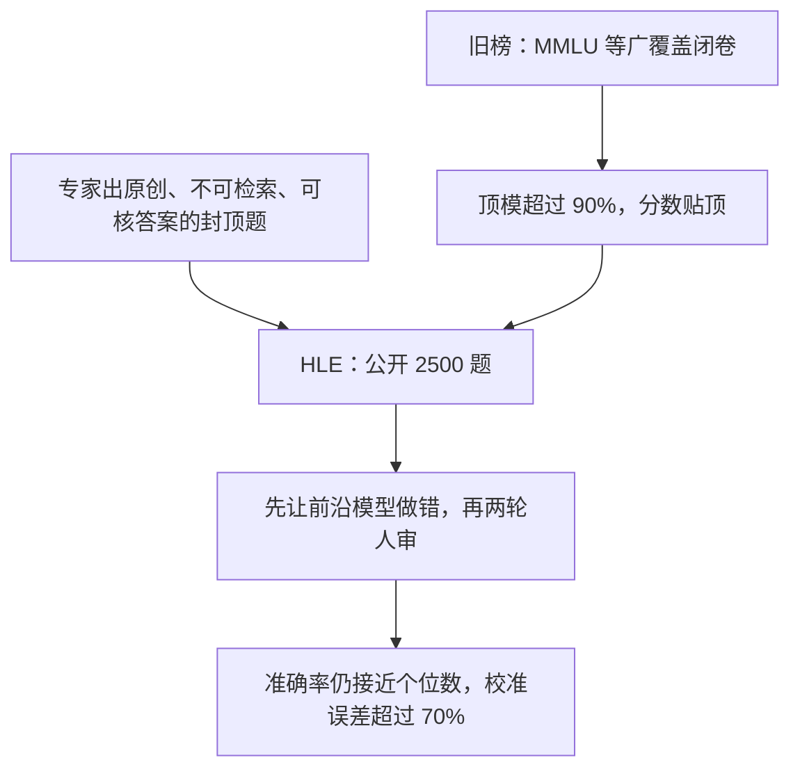

# HLE：MMLU 已被刷穿，用专家封顶的封闭题当「最后一场闭卷考试」

<!-- release-date: 2025-01-24 -->

**本文依据**：`Humanity’s Last Exam`，arXiv 2501.14249v10（页眉 `[cs.LG] 20 Feb 2026`），28 页。封面未印会议录用，本文不补。组织方共同一作 Long Phan、Alice Gatti、Ziwen Han、Nathaniel Li；资深作者 Summer Yue、Alexandr Wang、Dan Hendrycks。封面机构 1 Center for AI Safety、2 Scale AI；第一作者单位是 Center for AI Safety（PDF p. 1）。通讯 `agibenchmark@safe.ai`（PDF p. 1）。盘上是 v10。首发日取 arXiv 页面 `Submitted on 24 Jan 2025`（[arxiv.org/abs/2501.14249](https://arxiv.org/abs/2501.14249)），这是外部补充，不来自 PDF 正文。公开入口封面摘要写明 `https://lastexam.ai`（PDF p. 4）。文中数字均标 PDF 页码；标「外部补充」的段落不来自本文。

## 一句话

MMLU 一类广覆盖闭卷榜已经被顶模刷到 90% 以上，再报平均分几乎量不出前沿差了多少（PDF p. 4）。HLE（Humanity’s Last Exam，人类最后一场考试）改成专家出的封顶题：公开 2,500 道，覆盖上百科目，选择题加短答案，可自动判，故意不好用检索秒答（PDF p. 4–5）。题先拿当时前沿模型过一遍，做对就进不了下一关；再两轮研究生级审稿（PDF p. 4、p. 7–8）。表 1 里最高也只有 o3-mini（high）在纯文本子集上 13.4%，其余多模态模型个位数；RMS 校准误差全在 70% 以上（PDF p. 8）。作者自己划边界：HLE 高分只说明封闭学术题上接近专家，不等于会做开放研究，更不是 AGI（PDF p. 9）。

贯穿全文的轴不是「再出一套更难的选择题」，而是：**什么叫做还没被刷穿的闭卷学术能力、为什么必须专家出题再让模型先摔跟头、数字怎么读才不会把「接近零分」当成进度条。**

## 一、矛盾：广覆盖考试满分了，专家封顶还没人量

LLM 已经在许多任务上超过人；评测靠的是一批题——数学、编程、生物之类（PDF p. 4）。问题是：**曾经难的广覆盖榜，现在太容易了。** 顶模在 MMLU 上已经超过 90%，图 1 把这种饱和画出来：旧榜贴顶，HLE 仍贴底（PDF p. 4–5）。饱和之后，分数差几个点说不清是真进步还是噪声。

作者要的是「最后一场」广覆盖、封闭、可自动判的学术考试：题目难到贴近人类知识前沿，答案却必须唯一、好核、不能靠搜网页秒出（PDF p. 4）。多模态：纯文本或带一张图；题型是多项选择或精确匹配短答案（PDF p. 4）。数学被特意加重，因为深层推理能跨科用（PDF p. 4）。

和「对人更难」的旧路不同：MMLU 已经从难变满；HLE 是 **对人是专家级、对模型先故意做不对**。和开放生成、长轨迹助理榜也不同：那些不好自动判。HLE 明确说自己只补封闭学术这一块，开放域另有别的评测（PDF p. 5）。

上图根据 PDF p. 4–5、p. 8 重画，是评测口径示意，不是实测曲线。

## 二、什么叫「做对了」：短而唯一、可自动判、搜不到、模型先摔跟头

### 规模与形态

公开集 2,500 题，科目超过一百；另留私有测试集看过拟合（PDF p. 5、图 3 p. 7）。约 14% 要同时读文和图；24% 是选择题（五个或更多选项），其余是精确匹配（模型吐一个精确字符串）（PDF p. 5）。图 2 给样例：帕尔米拉碑文翻译、蜂鸟籽骨支撑几条肌腱、自然余变换个数、图上马尔可夫链哪类图「表现良好」、热周环连续反应的电环化类型、圣经希伯来闭音节清单（PDF p. 6）。读图能看出作者要的不是「读懂题面」，而是领域里那一层只有做过的人才会的细节。

每道提交必须带：题干、答案规格（精确答案或标好的选项）、详细解答、学科、投稿人姓名与单位（PDF p. 5）。

### 投稿纪律

题必须精确、无歧义、可解、不可检索；必须原创，或对已发表材料做非平凡综合；未发表研究可以（PDF p. 5）。通常要研究生级，或考极窄的史实、冷知识、地方习俗；答案必须短、领域专家认、好自动判（PDF p. 7）。模型推理错但碰巧选对时，鼓励改参数（例如加选项）压假阳性（PDF p. 7）。英文、术语清楚、需要就用 LaTeX。禁止开放题、主观题、以及大规模杀伤性武器相关内容（PDF p. 7）。

附录 B.1 把「模型先摔跟头」钉死：带图题用 GPT-4o、Gemini 1.5 Pro、Claude 3.5 Sonnet、o1；纯文本再加 o1-mini、o1-preview。精确匹配必须难倒全部模型；选择题允许一个模型碰巧对，其余必须难倒，以免蒙对（PDF p. 22）。投稿阶段用 GPT-4o 当裁判；正式表 1 改用 o3-mini 当裁判（PDF p. 8、p. 22）。

### 谁出题、用什么买难度

全球协作：近 1,000 名学科专家，隶属 500 余所机构、50 个国家，主体是教授、研究员和研究生学位持有者（PDF p. 5）。奖金池 50 万美元：前 50 题各 5,000 美元，接下来 500 题各 500 美元；录用即共同作者（PDF p. 7）。附录 A 按录用题数排作者；许多人选择匿名，名单只是子集（PDF p. 14）。

### 审稿两轮，不是「模型不会就算好题」

只难倒模型不够——可能只是跟模型作对，并不考高级知识（PDF p. 26）。流水线见图 4（PDF p. 8）：模型过不了 → 专家迭代改 → 组织方或受训审稿人逐题批准 → 公开集之外留私有集。

- **难度闸**：投稿前对若干前沿模型测；多项选择要求平均差于乱猜才进入人审。累计记录超过 70,000 次尝试，约 13,000 道难倒模型后才进人审（PDF p. 7）。
- **第一轮**：审稿人须有相关研究生学位（硕士、博士、JD 等），按量规打分并给反馈，每题 1–3 审，目标是把题改成封闭、抗刷、能当评测（PDF p. 7）。量规 0–5 加 Unsure：0 丢弃（范围外、不原创、垃圾）；1 大改或太易；2 难度擦边；3 够难但不到研究生级；4 研究生级或足够难；5 顶尖（PDF p. 27）。开放证明/解释题、道德对错题直接 0 分；网上一搜就到也是 0（PDF p. 26–27）。审稿人若五分钟解不出，可以不核完整解答，但要看答案是否像在答这道题（PDF p. 27）。
- **第二轮**：从第一轮里挑审得认真的人，连同组织方，看题也看上一轮意见。新量规 0–6：3 是「很基础但模型错了 / 网上好找 / 靠计算器或跑代码制造的假难度」——当时评的模型没有这些工具，这种难不算（PDF p. 28）；5 建议进基准，6 是该科顶尖（PDF p. 28）。

发布后还有社区纠错、学生抽样精解、以及「带搜索对了、不带搜索错了」的可检索题审计（GPT-4o mini / GPT-4o search 与 Perplexity Sonar）；去掉一搜就到的题之后，前沿模型分数和改前差不多（PDF p. 22）。晚投稿另开入口，组织方手审，质量相近，形成第二份私有集（PDF p. 22）。

### 专家也会吵：15.4% 不是「标答随便写」

发布前两轮审计，各抽 200 题，美国主要研究型大学的专家审，作者可答辩。第一轮找出常见病：开放题、依赖四舍五入、低录用率作者。按信号删改后再抽 200 题。公开集最终估计的专家不一致率是 15.4%（PDF p. 22）。生物、化学、健康子集约 18%；若改成「一个专家反对就算不一致」则跳到 25%（PDF p. 22）。作者把原因摊开：有的题要多年前的冷论文；有的来自投稿人亲手实验，文献检索核不住；有的选择题考的是「给定选项里最说得通的」，不是开放求完美解（PDF p. 22–23）。这是作者对审计难度的解释，不是另做的准确率实验。

计划中的动态分叉叫 **HLE-Rolling**：按社区反馈改、加新题，信息放 lastexam.ai，等原版贴顶再迁（PDF p. 23）。正文只写这个机制，不写后文榜单。

科目由投稿人自报。B.4 列出最热五十科之一部分：经济、生态、人工智能、音乐学、哲学、神经科学、法律、艺术史、生化、天文、古典学、国际象棋、化工……以及机器学习、谜题、考古学、生物物理等；全文超过一百科（PDF p. 23）。图 3 把它们收成高层类，文本层没有印出各类百分比，本文不补（PDF p. 7）。

## 三、数字怎么读：表 1 是主表，接近零分被设计进去了

### 交卷

统一系统提示：先 Explanation，再 Answer，再 0%–100% 的 Confidence；不支持系统提示的模型改成第二条用户消息（PDF p. 8、p. 23）。因为答案封闭，用 **o3-mini**（`o3-mini-2025-01-31`，结构化解码）当裁判，容忍小数/分数/等价写法（PDF p. 8、p. 23）。裁判提示要求：只比抽取答案和标答是否实质相同，不许重解题；数值允许小误差；没有置信度就记 100（PDF p. 23–24）。文中举半角公式等价的例子：模型答 $\cot(\pi/n)/(2\cot(\pi/(2n)))$，标答是 $\cos(\pi/n)/(2(1+\cos(\pi/n)))$，化简后判 yes（PDF p. 24）。

版本钉在表 4（PDF p. 26）：GPT-4o 为 `gpt-4o-2024-11-20`，Grok 2 为 `grok-2-latest`，Claude 3.5 Sonnet 为 `claude-3-5-sonnet-20241022`，Gemini 1.5 Pro 为 `gemini-1.5-pro-002`，Gemini 2.0 Flash Thinking 为 `gemini-2.0-flash-thinking-exp-01-21`，o1 为 `o1-2024-12-17`，DeepSeek-R1 为 2025-01-20 发布，o3-mini（high）为 `o3-mini-2025-01-31`。可配温度则 0.0；o3-mini 与 o1 只支持 1.0。脚注：论文第一版和图 5 用的是已弃用的 12-19 Flash Thinking、温度 0.0；新模型温度 0.7（PDF p. 26）。

图 1 里旧榜分数来自各家报告（OpenAI simple-evals、Gemini 报告、Anthropic model card），HLE 自己用零样本思维链（PDF p. 26）。不要把图 1 里的 MMLU 高分和表 1 的 HLE 低分当成同一套提示。

### 表 1：准确率低、校准更差

表 1（PDF p. 8）。准确率越高越好，RMS 校准误差越低越好。带星号的模型没有多模态，只在纯文本子集上评。

| 模型 | 准确率（%） | 校准误差（%） |
|---|---|---|
| GPT-4o | 2.7 | 89 |
| Grok 2 | 3.0 | 87 |
| Claude 3.5 Sonnet | 4.1 | 84 |
| Gemini 1.5 Pro | 4.6 | 88 |
| Gemini 2.0 Flash Thinking | 6.6 | 82 |
| o1 | 8.0 | 83 |
| DeepSeek-R1 | 8.5 | 73 |
| o3-mini（high） | 13.4 | 80 |

表注：DeepSeek-R1 与 o3-mini（high）只评纯文本子集（PDF p. 8）。

校准设定跟 Wei 等人，RMS 实现跟 Hendrycks 等人的 PixMix 文：自称 50% 把握的题，长期就该对一半（PDF p. 8）。表 1 全员校准误差高于 70%，摘要写「所有模型 RMS 校准误差高于 70%」（PDF p. 4、p. 8）。低分时模型仍敢高置信度给错答案——这是作者说的 confabulation / hallucination，不是另测的毒性。

**接近零分有一部分是收题造成的。** 能被当时模型做对的题进不了集。评测时仍有非零分，因为推理有噪声：选择题会蒙对，也会差过随机。作者选择留下这些题，不强对抗过滤；并强调：**能力下限仍是开放问题，贴着零的小波动不能当进步**（PDF p. 8）。

### 表 2：纯文本，和表 1 不要混读

表 2（PDF p. 24）只含纯文本题。GPT-4o 从 2.7 降到 2.3；Grok 2 从 3.0 升到 3.2；o1 从 8.0 降到 7.8。DeepSeek-R1 与 o3-mini 两表相同（8.5 / 13.4），因为它们本来就只评文本。Gemini 2.0 Flash Thinking 两表都是 6.6。读「带图更难/更易」必须看同一模型的两行，不能拿 o3-mini 的 13.4 去比 GPT-4o 的 2.7 再归因于模态。

### 表 3：偏科，平均分不能当全能

表 3（PDF p. 25）按 Math、Bio/Med、Physics、CS/AI、Humanities、Chemistry、Engineering、Other 切开，上半纯文本、下半全集。下半没有 DeepSeek-R1 和 o3-mini——它们不是多模态，作者没填，本文也不补。

纯文本里，o3-mini（high）数学 18.6、物理 15.3，人文只有 5.2、工程 6.5（PDF p. 25）。DeepSeek-R1 工程 14.5、人文 10.4，化学 5.0、物理 5.4（PDF p. 25）。GPT-4o 的 CS/AI 纯文本 0.9、全集 0.8（PDF p. 25）。Claude 3.5 Sonnet 工程纯文本 9.7，数学只有 3.8（PDF p. 25）。**总平均是被数学题量和推理模型抬起来的；人文、化学、CS 可以完全是另一个数。**

### 图 5–6：对了也更贵

推理模型（Gemini 2.0 Flash Thinking、o1、DeepSeek-R1）的平均 completion token（含推理）数量级到数千，图 5 纵轴到 8000（PDF p. 9）。非推理模型图 6 纵轴只到 1000（PDF p. 25）。作者的判断：以后不但要对，还要算力划算（PDF p. 9）。图是示意量级，文本没有印出各科精确 token 数，本文不读柱高当表。

## 四、作者把天花板划在哪

当前很低，但旧榜也曾从近零到近满（PDF p. 9）。作者写：**到 2025 年底模型在 HLE 上超过 50% 是说得通的**（PDF p. 9）。这是讨论里的外推，不是表 1 的测量。高分只证明封闭、可核的学术题和前沿科学知识上达到专家级，**单独不能推出能自主科研或 AGI**；HLE 考的是结构化功课，不是开放研究或创造性解题（PDF p. 9）。原句收束：这或许是最后一场需要给模型的学术考试，但远不是 AI 的最后一场基准（PDF p. 9）。

影响一节只说给科研和政策一个共同参照，方便谈轨迹、风险和治理（PDF p. 9）。没有给出治理条文。

禁止 WMD 内容写在投稿规则里（PDF p. 7），不是安全评测分数。

## 五、没写什么、读的时候别自行补

- **人类专家准确率没有像 MMLU 那样给一个 89.8%。** 有的是专家不一致率 15.4% / 健康子集约 18%（PDF p. 22）。不要把「不一致」读成「专家只会 85 分」。
- **私有集规模、第二份晚投稿私有集题数，正文只说存在，没有给条数**（PDF p. 5、p. 22）。
- **图 3 各类百分比文本抽不出**，只有「2,500 题、一百多科、收成高层类」（PDF p. 7）。
- **表 3 全集缺 DeepSeek-R1 与 o3-mini**，不要从文本子集抄过去。
- **没有训练 recipe、没有权重、没有官方「刷榜之后」的数字。** 本文依据冻结的 v10 PDF，不写文后排行榜。
- 投稿阶段裁判是 GPT-4o，表 1 裁判是 o3-mini（PDF p. 8、p. 22）。两套闸门不要混成一次评测。

## 六、可迁移的几条

1. **广覆盖榜一贴 90%，平均分就退休了。** 要量前沿，先换分布，而不是在同一套四选一上再挤两个点（PDF p. 4）。
2. **封顶题的生产顺序是：模型先错 → 人再改 → 组织方批准。** 只收集「人觉得难」会混进检索题和假难度（PDF p. 7–8、p. 28）。
3. **封闭、短、可核，才能自动判。** 开放证明题在第一轮直接 0 分（PDF p. 26–27）。代价是覆盖不到开放研究——作者自己承认（PDF p. 9）。
4. **校准必须和准确率一起报。** 个位数准确率配 80% 量级校准误差，等于系统在不会的时候仍像会（PDF p. 8）。
5. **贴着零的小涨幅不要当里程碑。** 收题已经滤掉会做的题；噪声会制造非零（PDF p. 8）。
6. **平均分下面永远有偏科。** o3-mini 数学 18.6、人文 5.2 是同一张表（PDF p. 25）。
7. **推理 token 是准确率的隐藏成本。** 图 5 对图 6（PDF p. 9、p. 25）。
8. **专家标答也会吵。** 15.4% 不一致是审计结果；动态集（HLE-Rolling）是作者给的维护出口（PDF p. 22–23）。
9. **假难度（巨算、必须跑代码）在第二轮被单独标成 3，进不了「好题」。** 评测环境没有工具，就不要用工具门槛冒充知识门槛（PDF p. 28）。

## 七、关键词

- **HLE / Humanity’s Last Exam**：面向人类知识前沿的多模态封闭学术基准；作者定位为这类广覆盖闭卷考的最后一场。
- **饱和**：MMLU 等旧榜被顶模做到 90% 以上，分数失去分辨力。
- **精确匹配 / 多项选择**：两种可自动判题型；约 24% 选择，约 14% 带图。
- **难度闸**：投稿前用前沿模型筛；精确匹配必须全错，选择允许一只蒙对。
- **两轮人审**：研究生级量规迭代，再由组织方/高分审稿人批准。
- **私有集**：公开 2,500 之外留白，防对着公开题过拟合。
- **RMS 校准误差**：自称把握应等于长期正确率；表 1 全员高于 70%。
- **LLM 当裁判**：表 1 用 o3-mini 抽答案并判等价。
- **专家不一致率**：公开集估计 15.4%；不是人类准确率。
- **HLE-Rolling**：发布后按反馈更新的动态分叉，正文只写机制。

## 参考资料

- 原论文：Phan、Gatti、Han、Li 等，`Humanity’s Last Exam`，arXiv:2501.14249v10。封面未印会议。
- 数据集入口（PDF p. 4）：https://lastexam.ai
- arXiv 条目（首发日，外部补充）：https://arxiv.org/abs/2501.14249
- 文中对照的前作与设定：MMLU（Hendrycks et al.）、校准设定 Wei et al.、RMS 实现 Hendrycks et al. PixMix；表 4 所列模型版本（PDF p. 26）。
