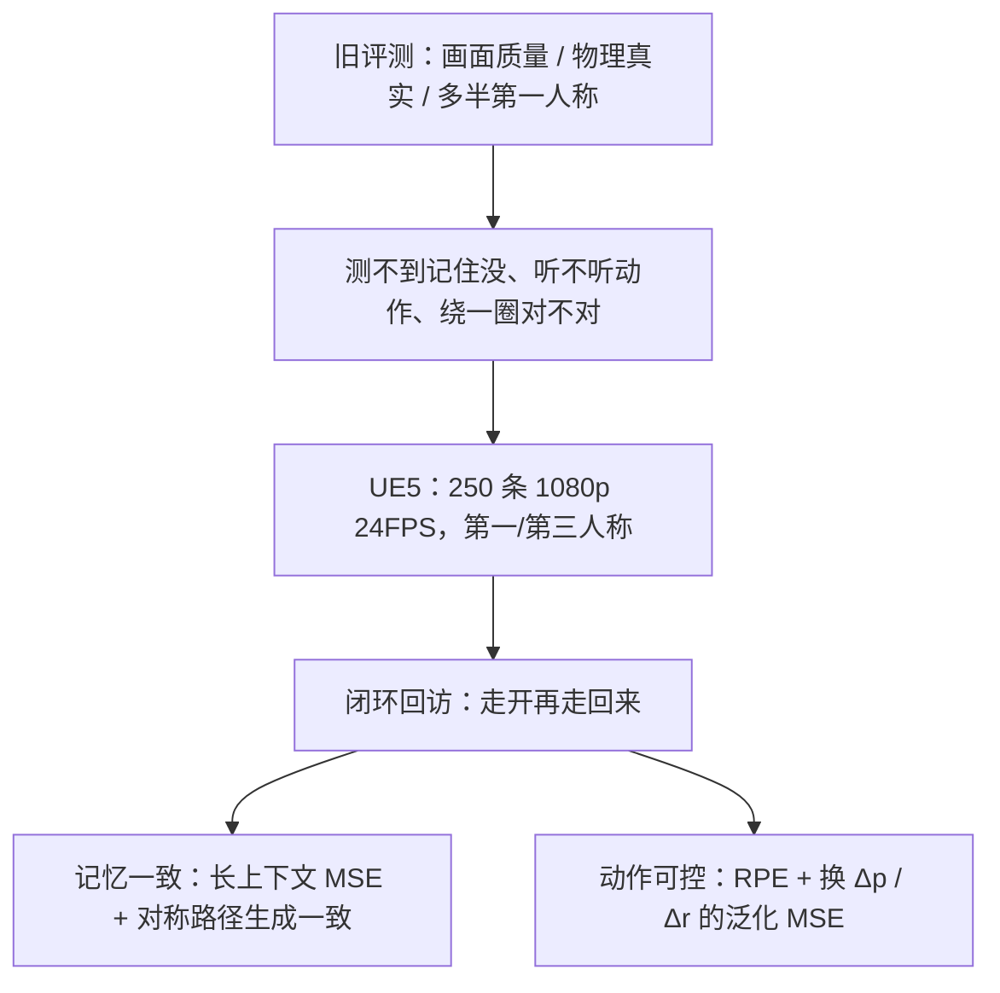

# MIND：世界模型评测从「画面好不好看」改成「记得住、听得懂动作、绕一圈还能对上」

<!-- release-date: 2026-02-08 -->

**本文依据**：`MIND: Benchmarking Memory Consistency and Action Control in World Models`，arXiv 2602.08025v2（页眉 `[cs.CV] 11 Feb 2026`），11 页。作者 Yixuan Ye、Xuanyu Lu、Yuxin Jiang（共同一作；通讯 Weijia Wu、Alex Jinpeng Wang），机构 1 CSU-JPG, Central South University、2 National University of Singapore、3 Hong Kong University of Science and Technology (Guangzhou)、4 Nanyang Technological University（PDF p. 1）。第一作者单位是 Central South University。盘上是 v2。首发日取 arXiv 页面 `Submitted on 8 Feb 2026`（[arxiv.org/abs/2602.08025](https://arxiv.org/abs/2602.08025)），这是外部补充，不来自 PDF 正文。封面未印会议录用，本文不补。项目页封面写明 `https://csu-jpg.github.io/MIND.github.io/`（PDF p. 1）。文中数字均标 PDF 页码；标「外部补充」的段落不来自本文。

## 一句话

视频生成已经能做出很真的画面，世界模型却还被拿去测「像不像、合不合物理」（PDF p. 2）。MIND 换一条轴：**记忆能不能对上、动作能不能执行、换一套步长/转角还能不能跟**。它自称第一份开放域、闭环回访、1080p / 24 FPS、同时覆盖第一人称与第三人称的世界模型基准（PDF p. 1）。数据是 Unreal Engine 5 里采的 **250** 条帧级对齐视频：共享动作空间 **100 + 100**（第一 / 第三人称），另 **25 + 25** 条跨动作空间，覆盖八类场景（PDF p. 1、p. 4）。评测拆成长上下文记忆、生成场景一致性、动作空间泛化、美学 / 成像质量、以及从生成视频里反推相机轨迹的相对位姿误差（PDF p. 5–6）。作者另给一条 Video-to-World 基线 MIND-World。在 MIND-First 50 / MIND-Third 50、统一处理到 **720p** 上，带记忆的 MIND-World 长上下文记忆误差分别是 **0.1035** 与 **0.1042**；第三人称无记忆设定下 Matrix-Game 2.0 的旋转 RPE 到 **0.9031**，作者用人评核对：它控不住第三人称角色（PDF p. 7 表 2–3）。贯穿全文的轴不是「再刷一条更真的视频生成榜」，而是：**什么叫闭环回访、记忆一致和动作可控各测什么、第一人称和第三人称为什么必须分开读。**

## 一、矛盾：世界模型已经在开车、玩游戏，评测还在测「这一段好不好看」

视频生成把高保真内容做得越来越像样，世界模型也接到自动驾驶、具身智能、交互游戏上（PDF p. 1）。可靠世界模型却不只是好看：还要长时间记住场景，动作要准，换一套动作尺度还要跟得上（PDF p. 2）。现有评测主要盯视觉质量或物理真实，这两项被漏掉（PDF p. 2）。

旧基准还有几条硬缺口（PDF p. 2、表 1 p. 2）：

- **单视角、单动作空间**。多数只采第一人称，很难测角色运动和姿态；第三人称几乎是空的。
- **偏图像级、偏封闭域**。WorldScore 用相机轨迹评画面；WorldModelBench 评物理定律；Lian 等人做了记忆基准，但停在 Minecraft，还依赖循环 agent 数据，不像人的行为。
- **没有闭环回访**。生成一段就算完，不要求「走开再走回来，场景还在不在」。

表 1 把对比钉死（PDF p. 2）：WorldSimBench、WorldModelBench、WorldScore、World-in-World、GameWorld 的角色位置列都是 ✗；有动作的格子多半是第一人称平均 1 帧量级，第三人称是 ∅。Lian 等人角色位置 ✓，但只有第一人称 **65 / 436** 帧、360p / 20 FPS、场景是 Minecraft。MIND 角色位置 ✓，共享动作空间第一人称平均 **1.1k / 3.4k**、第三人称 **1.2k / 3.6k**，泛化动作空间第一人称 **1.3k / 3.8k**、第三人称 **1.2k / 3.7k**，分辨率 **1080p / 24 FPS**，场景写成 Landscape、SciFi、Stylized、Ancient、Urban、Industrial、Interior、Aquatic（PDF p. 2 表 1）。表里的 Avg. 是记忆上下文帧数 / 预测段帧数的平均（PDF p. 2 表注）。

作者因此把世界模型要测的能力收成两句人话，再给正式名（PDF p. 2）：

1. **记忆一致（memory consistency）**：长时间里空间布局、物体身份、场景属性还对不对；后生成的帧还对不对得上以前看见的东西。
2. **动作可控（action control）**：给定控制输入，模型能不能按这个动力学走，并泛化到新的运动范围或没见过的动作空间。

视频还带帧级对齐的动作、角色与相机位置、图像标签，多人采集（PDF p. 2）。

上图根据 PDF p. 1–2、p. 4–6 重画，是评测口径示意，不是实测曲线。

## 二、什么叫「做对了」：闭环回访，不是单向往前滚

### 数据从哪来

评测环境是 Unreal Engine 5 的 3D 场景，同时出第一人称和第三人称，1080p、24 FPS（PDF p. 3 图 2）。流水线一边录视频，一边收动作 json，再用 GPT-4o 写描述（PDF p. 3 图 2）。图 2 把评测端拆成：动作序列 + 上下文记忆进世界模型，生成预测视频，再和真值比记忆一致、动作可控、视觉质量、时间质量（PDF p. 3）。

正文说覆盖 **8** 类、**40** 多个开放域环境：自然（森林、沙漠、山、海）、城市（市中心、居住、工业）、室内、载具、科幻、风格化、奇幻、抽象（PDF p. 4）。图 6 的八类标签是 Landscape、SciFi、Stylized、Ancient、Urban、Industrial、Interior、Aquatic（PDF p. 6）。招募多名志愿者做脚本动作和自由动作（PDF p. 4）。

250 条里：**200** 条（第一 / 第三人称各 100，训练测试均分）共享同一动作空间；剩下 **50** 条（每视角 25）动作空间不同，当可控真值（PDF p. 4）。后文实验设定把共享空间里 **50 + 50** 条用来训 MIND-World，其余 **150** 条留给评测（PDF p. 7）。读表时要分清：250 是全库，表 2 / 表 3 的 First 50 / Third 50 是评测切片，且评测分辨率被压到 720p（PDF p. 7）。

图 3 强调场景类别和动作空间在 train / test 上尽量齐（PDF p. 4）。饼图里前进（W）在 train / test 动作里大约 **42%** 与 **43%**（PDF p. 4 图 3）。这是分布示意，不是分数。

### 基本动作：WASD 加相机转

动作空间写成

$$
A = \{W, A, S, D, \uparrow, \downarrow, \leftarrow, \rightarrow\}
$$

W/A/S/D 是前 / 左 / 后 / 右平移；箭头是相机俯仰和偏航（PDF p. 4）。平移：位置 $p_t = [x_t, y_t, z_t]^\top$，下一步 $p_{t+1} = p_t + \Delta p \cdot v_a$，例如前进 $v_W = [0, 0, 1]^\top$（PDF p. 4）。旋转：朝向 $r_t = [\theta_t, \phi_t]^\top$，下一步 $r_{t+1} = r_t + \Delta r \cdot u_a$，例如抬头 $u_{\uparrow} = [0, +1]^\top$（PDF p. 4–5）。

### 换动作空间：同一场景，改步长和转角

$\Delta p$、$\Delta r$ 不锁死。文中举例：精细控制可以是 $\Delta r = 0.7^\circ$、$\Delta p = 150$；更大步 $\Delta r = 1.4^\circ$、$\Delta p = 280$；更细 $\Delta r = 0.4^\circ$、$\Delta p = 100$（PDF p. 5）。图 4 把相机角增量画成原位、**0.6× / 1.0× / 1.4×**，把行走速度画成 **150 / 200 / 250 cm/s**，每张图都是该动作执行 **24** 帧之后拍的（PDF p. 4 图 4）。泛化子集共 **五** 组 $\Delta p$–$\Delta r$ 组合，第一 / 第三人称各 **25** 条（PDF p. 5）。

### 记忆段怎么切

人在 UE5 里按预定义动作走，第一 / 第三人称视频与动作日志帧对齐，当监督（PDF p. 5）。记忆段 $M = \{f_1, \ldots, f_T\}$，模型再拿动作 $A = \{a_{T+1}, \ldots, a_{T+k}\}$ 去预测 $\hat{V} = \{\hat{f}_{T+1}, \ldots, \hat{f}_{T+k}\}$（PDF p. 5）。

两层要求（PDF p. 5）：

- **记忆一致**：以前见过的物体、布局、纹理，换一条动作再访时不该变；回到同一地点应再现同一外观。
- **时间一致**：过渡要平滑，别闪、别突然改结构。

回访轨迹 $A_{\mathrm{loop}}$ 上，一致性误差写成 $L_{\mathrm{mem}} = \|\hat{f}_t - f_{t'}\|_2^2$，其中 $f_{t'}$ 是回访点的真值帧（PDF p. 5）。

这就是「闭环回访」：不是单向往后滚 $k$ 帧交差，而是走出去再绕回来，看世界还在不在。

## 三、分数怎么算：五类指标，好看和听动作必须拆开

### 长上下文记忆

给完整记忆 $M$ 和后续动作，生成 $\hat{V}$，理想情况应等于同一动作下的真值 $V$。用均方误差

$$
L_{\mathrm{lcm}} = \frac{1}{k}\sum_{i=1}^{k}\|\hat{f}_{T+i} - f_{T+i}\|_2^2
$$

越低越好（PDF p. 5）。它测的是「上下文里的世界，按动作往前滚，还能不能对上真值」，不是美学分。

### 生成场景一致性：十条对称路径

图 5 给出 **10** 条对称运动路径：蓝线去、红线镜像回；每步动作持续 **24** 帧（PDF p. 5 图 5）。模型先往前走，再原路折返；理想情况去程和回程对应帧应重合。度量

$$
L_{\mathrm{gsc}} = \frac{1}{k}\sum_{i=1}^{k}\|\hat{f}_{T+i}^{\mathrm{fwd}} - \hat{f}_{T+i}^{\mathrm{rev}}\|_2^2
$$

越低越好（PDF p. 5）。注意：这里比的是 **生成去程 vs 生成回程**，不是 vs 真值。模型可以两边一起错，GSC 仍好看——所以必须和 $L_{\mathrm{lcm}}$ 一起读。

### 动作精度：从视频里把相机抠回来

所有模型喂同一套预定义动作。用 ViPE 从生成视频恢复相机轨迹，再用 Sim(3) Umeyama 对齐消掉尺度和坐标系差，算平移 / 旋转相对位姿误差（RPE）（PDF p. 5）。作者强调：这和模型内部速度参数无关（PDF p. 5）。听动作好不好，不看画面漂不漂亮。

### 动作空间泛化

在多种动作设定下，对生成帧和真值帧算 MSE；理想情况是从上下文里学到动作空间约束，零样本跟上（PDF p. 5–6）。

### 视觉质量：两条，都不替代记忆

美学用 LAION aesthetic predictor；成像用 MUSIQ（训在 SPAQ 上），打过曝、噪声、压缩、模糊（PDF p. 6）。表 2 / 表 3 里这两列箭头向上（PDF p. 7）。

## 四、MIND-World：一条用来把基准跑通的 Video-to-World 基线

MIND-World 是高动态、实时、交互的自回归视频生成管线（PDF p. 6 图 7）。训练跟 Matrix-Game 2.0 那条三阶段：双向、动作条件的教师；用教师 ODE 轨迹初始化学生；再用 Self-Forcing 的 DMD 蒸馏成少步、逐帧因果管线（PDF p. 6）。和「很重的动作块」不同，这里把动作直接打进 timestep embedding（PDF p. 6–7）。推理时维护上下文缓存，按缓存和新动作自回归往外吐，图的是连续、低延迟流式生成（PDF p. 7）。

两个评测设定（PDF p. 7）：

- **有上下文记忆（Video-to-World）**：窗口 $w$ 帧作为干净世界上下文。
- **无上下文记忆（Image-to-World）**：从首帧冷启动再自回归。

实现规格（PDF p. 7）：底模 SkyReels-V2-I2V-1.3B，动作注入微调 **3K** step、batch **8**。蒸馏：4-step 因果学生，用 **1K** 条教师 ODE 轨迹初始化，再训 **3K**，然后 DMD Self-Forcing **2K**。学生严格逐帧因果（chunk size = 1），局部注意力窗 **25** 帧。实验在 **4 × NVIDIA H100** 上。这些是作者基线的训练配方，不是 MIND 作为数据集的准入条件。

## 五、表 2 / 表 3：第一人称和第三人称必须分开读

两张表都写：视频处理相同，评测分辨率 **720p**（PDF p. 7）。箭头：长上下文记忆、生成场景一致、动作空间泛化、RPE 越低越好；美学和质量越高越好。

### 第一人称 · MIND-First 50（PDF p. 7 表 2）

| 设定 | 模型 | 长上下文记忆 ↓ | 生成场景一致 ↓ | 动作空间泛化 ↓ | 美学 ↑ | 成像 ↑ | 平移 RPE ↓ | 旋转 RPE ↓ |
|---|---|---|---|---|---|---|---|---|
| 无记忆（I2W） | MIND-World | 0.1091 | 0.0359 | 0.1200 | 0.4583 | 0.5655 | 0.0356 | 0.4395 |
| 无记忆（I2W） | Matrix-Game 2.0 | 0.1188 | 0.0306 | 0.1084 | 0.4302 | 0.5180 | 0.0265 | 0.6914 |
| 有记忆（V2W） | MIND-World | 0.1035 | 0.0309 | 0.1226 | 0.4590 | 0.5702 | 0.0384 | 0.5534 |

表 2 没有 Matrix-Game 2.0 的有记忆行。空着就空着，不补。

### 第三人称 · MIND-Third 50（PDF p. 7 表 3）

| 设定 | 模型 | 长上下文记忆 ↓ | 生成场景一致 ↓ | 动作空间泛化 ↓ | 美学 ↑ | 成像 ↑ | 平移 RPE ↓ | 旋转 RPE ↓ |
|---|---|---|---|---|---|---|---|---|
| 无记忆（I2W） | MIND-World | 0.1066 | 0.0327 | 0.0677 | 0.5204 | 0.5672 | 0.0271 | 0.2587 |
| 无记忆（I2W） | Matrix-Game 2.0 | 0.1404 | 0.0372 | 0.0777 | 0.4236 | 0.4857 | 0.0622 | 0.9031 |
| 有记忆（V2W） | MIND-World | 0.1042 | 0.0316 | 0.0685 | 0.5300 | 0.5673 | 0.0321 | 0.3338 |

### 怎么读这些数，才不会把「某一列第一」当成全能世界模型

**记忆**：作者写，带上下文记忆的模型在长上下文记忆上比不带的高 **4% 以上**，生成场景一致性也支持记忆有用（PDF p. 7）。用表 2 自己算：第一人称 LCM 从 0.1091 到 0.1035，相对无记忆大约降 **5.1%**；第三人称从 0.1066 到 0.1042，大约 **2.3%**。正文「超过 4%」更贴第一人称这一列，第三人称没那么大。这是读表，不是论文另给的第三个数。

**动作精度**：即便上下文记忆的动作空间和微调阶段相同，动作控制仍变差（PDF p. 7）。表上对得上：第一人称平移 RPE 0.0356 → 0.0384，旋转 0.4395 → 0.5534；第三人称平移 0.0271 → 0.0321，旋转 0.2587 → 0.3338。记忆帮「对得上以前的世界」，不自动帮「这一步走得准」。

**动作空间泛化**：注入上下文记忆会损害推理，因为动作空间不一致会打乱没有泛化能力的模型（PDF p. 7）。表上泛化 MSE：第一人称 0.1200 → 0.1226，第三人称 0.0677 → 0.0685，都略差。作者后文把这句话说得更重：有记忆的 V2W 在泛化上不如无记忆的 I2W；原动作空间里有记忆更好，一换空间就掉（PDF p. 8）。

**视觉**：有记忆的视频更好看、更贴人的审美，因为上下文更富、风格更稳（PDF p. 7）。美学列确实略升。不要把美学升解读成动作更准。

**第三人称是另一场考试**。Matrix-Game 2.0 第三人称无记忆：LCM **0.1404**、旋转 RPE **0.9031**，明显差一截。作者写它第三人称生成差，人评核对过：控不住第三人称角色（PDF p. 7）。第一人称里它的平移 RPE **0.0265** 甚至优于 MIND-World 的 **0.0356**，生成场景一致 **0.0306** 也优于无记忆 MIND-World 的 **0.0359**（PDF p. 7 表 2）。所以：**第一人称「跟手」和第三人称「角色还在不在」不是同一项能力。**

图 8 Challenge 2 还列了一组动作空间泛化平均：无记忆在 0.8× / 1.0× / 1.2× 上是 **0.0912 / 0.0910 / 0.1003**，有记忆是 **0.1032 / 0.0850 / 0.1028**（PDF p. 8 图 8）。1.0× 上有记忆更好，两侧倍率有记忆更差——和「原空间有记忆、换空间就伤」同一句话。这是图里的补充切片，口径不要直接和表 2 的 0.12 混成一个数。

## 六、作者从失败里抽出的六条挑战

图 8 用样例把洞摊开（PDF p. 8）。下面是作者观察，不是独立复现。

1. **开放域**。在 Minecraft 上好采的数据训出来的 MIND-World，开放域推不动；用 MIND 的高质量数据则泛化明显好。这类数据难采，怎么用好大规模易得数据仍是开放问题（PDF p. 7–8）。
2. **动作空间泛化**。有记忆模型要能从上下文里侦测当前动作空间，侦错了就会被记忆绑死（PDF p. 8）。
3. **精确动作控制**。图 5 路径 5：先左再右回到起点。Matrix-Game 2.0 该左不左，停在原地，最后停在原点右侧很远；MIND-World 会左移，但右移回不到起点。反复实验后作者认为：**视觉提示（输入图 / 视频）会显著影响动作跟随**，把视觉提示和动作动力学拆开才是精确控制的关键（PDF p. 8）。
4. **长程记忆**。有记忆的长程 rollout 明显好于无记忆；可视化里有记忆更贴真值，无记忆偏得厉害。作者判断当前世界模型仍只抓得住短时记忆（PDF p. 8）。
5. **生成场景一致**。对 Matrix-Game 2.0 沿路径 5 做镜像：相机回到已生成过的场景，内容和先前明显对不上（PDF p. 8）。
6. **第三人称**。Matrix-Game 2.0 控不住角色，画面穿角色、最后把人弄丢。MIND-World 能控角色，但处理不好前景角色和背景，人会直接穿楼。感知并建模角色–背景交互仍是大挑战（PDF p. 8）。

结论段收束：MIND 是第一份开放域闭环回访基准，UE5、多样动作空间，系统看长程场景记忆、时间连贯、动作空间泛化；MIND-World 的实验暴露跨动作空间泛化和长程连贯仍难（PDF p. 8–9）。这是作者定位，封面没有会议录用章。

## 七、相关工作在这篇里占什么位置

第 2 节不是贡献本身，是在给「为什么旧榜不够」垫背景（PDF p. 2–3）。

视频生成：SVD、HunyuanVideo、Wan、Sora 2；专项视频榜 VBench / VBench-2.0（PDF p. 2–3）。世界模型三条方向：长程记忆（位姿检索、上下文压缩、显式 3D 记忆，如 CAM、Infinite-World、SPMem）、动作条件生成（GameFactory、AdaWorld）、实时（Diffusion Forcing、Self-Forcing）（PDF p. 3）。世界模型评测：WorldScore、WorldModelBench、WorldSimBench 偏场景质量或物理；MIND 补的是长上下文记忆和跨控制的动作空间泛化（PDF p. 3）。读这篇时不必把第 2 节当成另一张榜。

## 八、没写什么，读的时候别自行补

- **没有**把 MIND 接到某届 CVPR / ICCV / NeurIPS。封面和页眉只有 arXiv。
- **没有**公开题量级别的人类基线分数（不像 GAIA 的 92%）。记忆 / 动作全是自动度量。
- **没有**在正文给出 GitHub 仓库 URL，只有项目页；摘要写 Code: this https URL，盘上 PDF 没有展开成可点链接。
- **没有**表 2 / 表 3 之外的第三方刷榜。本文不补文后数字。
- 评测是 **720p**，数据是 **1080p / 24 FPS**。不要把表上的误差读成原生 1080p 分数。
- 表 2 缺 Matrix-Game 2.0 的 Video-to-World 行；第三人称对比主要发生在无记忆设定。
- 图 3 柱状图的逐类精确计数 OCR 不干净，本文不引用那些柱高当事实。
- MIND-World 不是「当前最强世界模型」声明，是作者为了把基准跑通给出的基线。

## 九、可迁移启发

1. **评世界模型，先问「绕一圈还在不在」，再问「好不好看」。** 闭环回访把记忆从观感里拆出来。自己做仿真评测时，至少要有一条折返轨迹。
2. **去程–回程自比（GSC）和与真值比（LCM）必须成对。** 只看对称路径，模型可以两边一起幻觉。
3. **动作精度用几何，不要用 FID。** 从生成视频反推轨迹再对齐，才能把「听不听指令」从画质里剥离。
4. **共享动作空间和泛化动作空间要分开建子集。** 否则微调过的步长会假装成泛化。
5. **第一人称和第三人称不要合成一张总分。** 第三人称多了一层「角色还在、别穿模」。
6. **记忆窗口会绑死动作空间。** 上下文和当前 $\Delta p$ / $\Delta r$ 不一致时，记忆可能是负资产。做条件生成时，条件里要显式带上动作尺度，或先侦测再注入。
7. **视觉条件会劫持动作。** 路径 5 的失败说明：图 / 视频提示和动作通道没有拆干净时，模型会「看着像在动、几何上没动」。

## 十、关键词回看

**世界模型**在这篇里不是「会生成视频」，而是要记住动态视觉环境并按动作预测。**闭环回访**是走开再走回，看场景是否再现。**记忆一致**管布局、身份、纹理是否还在；**动作可控**管给定 WASD / 相机指令是否走到该到的位姿。**动作空间**由 $\Delta p$、$\Delta r$ 标定，换倍率就是换空间。**MIND-World** 是 Video-to-World 基线：动作打进 timestep、自回归、可选上下文窗。数字一律回表 2 / 表 3 和表 1，不要混进后文榜。

## 参考资料

- 原件：`readings/_src/评测与 Benchmark/MIND.pdf`（盘上 v2，11 页）
- arXiv abs（首发日，外部补充）：https://arxiv.org/abs/2602.08025
- 项目页（封面）：https://csu-jpg.github.io/MIND.github.io/
