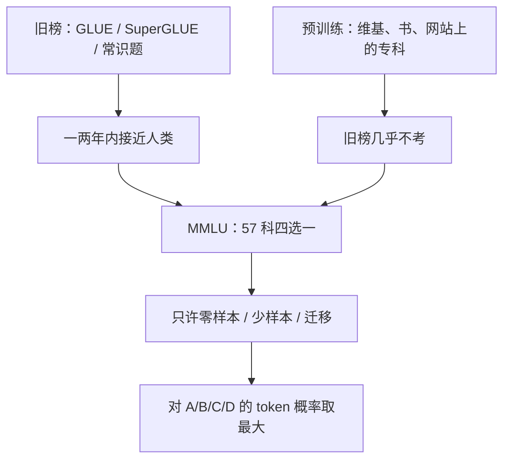

# MMLU：把「预训练到底学到了什么」收成 57 科四选一，再只许零样本和少样本交卷

<!-- release-date: 2020-09-07 -->

**本文依据**：`Measuring Massive Multitask Language Understanding`，arXiv 2009.03300v3（页眉 `[cs.CY] 12 Jan 2021`），27 页。封面印 `Published as a conference paper at ICLR 2021`。作者 Dan Hendrycks（UC Berkeley）、Collin Burns（Columbia University）、Steven Basart（UChicago）、Andy Zou（UC Berkeley）、Mantas Mazeika（UIUC）、Dawn Song（UC Berkeley）、Jacob Steinhardt（UC Berkeley）（PDF p. 1）。盘上是 v3。首发日取 arXiv 页面 Submission history 的 `[v1] Mon, 7 Sep 2020 17:59:25 UTC`（[arxiv.org/abs/2009.03300](https://arxiv.org/abs/2009.03300) 的 Submitted on 7 Sep 2020），这是外部补充，不来自 PDF 正文。ICLR 2021 印在封面与每一页页眉，可作录用信息，但不进 `release-date`。测试与代码在 `github.com/hendrycks/test`（PDF p. 2）。文中数字均标 PDF 页码；标「外部补充」的段落不来自本文。

## 一句话

GLUE、SuperGLUE 和一批常识题在一两年内被刷到接近人类，但预训练模型已经把维基、书和网站上的专科知识读过一遍——旧榜测的是语言学技能和儿童级常识，测不到这些知识有没有被用上（PDF p. 1）。MMLU 把评测改成 **57 科四选一**，难度从小学到职业执照，只许零样本和少样本，不许对着同一分布再训一遍（PDF p. 1–2）。四选一随机基线是 25%；13B 及以下的 GPT-3 少样本仍贴着这条线，175B 才到 43.9%，比随机高将近 20 个百分点（PDF p. 2、表 1 p. 5）。57 科里最好的模型仍远低于作者估的专家约 89.8%，而且偏科、校准差、法律与道德接近随机（PDF p. 3、p. 6–8）。

贯穿全文的轴不是「再出一个更难的 QA 集」，而是：**什么叫做对了、为什么这套口径会被刷、数字怎么读才不会把平均分当成全能。**

## 一、矛盾：榜刷满了，预训练见过的知识却没人量

NLP 模型在一批新榜上已经「超人」，但整体语言理解仍远低于人。作者把这看成基准和真实能力脱节（PDF p. 1）。GLUE 2018 年提出，一年内顶模超人；SuperGLUE 更难，大约一年后又基本到人类水平（PDF p. 1）。常识榜（HellaSwag、Physical IQA、CosmosQA）测的是几乎每个小孩都有的能力，进展同样很快（PDF p. 2–3）。这些榜主要量语言学技能或日常推理，不是「读完互联网之后到底懂多少专科」（PDF p. 1）。

Transformer 预训练已经吃过整份维基、上千本书和大量网站，专科信息见过很多，现有 NLP 榜几乎不考（PDF p. 1）。Petroni 等人已经提示：预训练模型可以当知识库用；但没有人按真实学科把这些知识量一遍（PDF p. 2）。

另一条旧路是下游再微调。GPT-3 之后，少样本可以不微调就有竞争力，于是可以收一批很散的任务，同时减少模型靠数据集里的虚假线索拿高分的机会（PDF p. 2）。作者因此把评测收成：**只测预训练里学到的东西，零样本和少样本，格式还故意和预训练时见到的网页不一样**（PDF p. 1、p. 7–8）。

常识题太浅，阅读理解偏语言，小学科学已经能拿高分（PDF p. 3）。自然语言生成又难评、没有标准指标（PDF p. 3）。他们选了一条更笨、更好算的路：多项选择分类准确率（PDF p. 3）。

上图根据 PDF p. 1–3、p. 5–6 重画，是评测口径示意，不是实测曲线。

## 二、什么叫「做对了」：四选一、跨科加权平均、不许对着考题练

### 题目从哪来

研究生和本科生从网上免费材料手工收集，包括 GRE、美国医师执照考试（USMLE）练习题、本科课练习题、牛津大学出版社读本配套题（PDF p. 3）。同一学科可以按难度切开：Elementary、High School、College、Professional。例如 Professional Psychology 来自心理学执业考试练习题，High School Psychology 则像 AP 心理学（PDF p. 3）。57 这个数字作者特意对齐了 Atari 游戏数（PDF p. 3）。科目清单见附录 B 表 2（PDF p. 15）。

四块超类（PDF p. 3–5、表 2 p. 15）：

- **人文学科**：法律、哲学、历史、形式逻辑、道德场景等。法律题要在互相打架的事实里套先例，还要选对「为什么」（PDF p. 3 图 2、p. 4）。哲学含谬误、形式逻辑、ETHICS 数据集里的日常道德直觉（PDF p. 4）。
- **社会科学**：微观/宏观/计量经济、政治、地理、心理、安全研究等，混世界知识、定性和定量推理（PDF p. 4）。
- **STEM**：物理、计算机、数学等。概念物理被写成比 Physical IQA 更难的一档；大学数学接近 GRE 数学专项，常要一串推理。数学用 LaTeX，或用 `*`、`^` 写乘方（PDF p. 4–5）。
- **其他**：放不进前三类、或免费题不够多的长尾——职业医学、财务会计营销、全球事实（各国贫困统计）等（PDF p. 5）。

图 2–5 是题型样本：职业法律的爆炸伤索赔、微观经济学的垄断、概念物理的重力加速度、大学复平面、职业医学的甲状腺术后低钙（PDF p. 3–5）。读图能看出作者要的不是「读懂题面」，而是套规则、算步骤、认解剖。

### 规模与切分

一共 15908 题。少样本开发集约每科 5 题；验证集 1540 题，可调超参；测试集 14079 题。每科测试至少 100 题，比多数人类考试还长（PDF p. 3）。开发集、验证集、测试集都给，但评估默认是零样本、少样本或迁移，不是「再发一大本同分布练习册」（PDF p. 7–8）。

### 人类对照

Amazon Mechanical Turk 上的非专业标注员 34.5%（PDF p. 3）。专家远高于此：美国医师执照考试真实考生第 95 百分位大约 87%，这些题构成 Professional Medicine；作者按构成考试的第 95 百分位、缺数就估，得到专家水平大约 89.8%（PDF p. 3）。后文说模型在任何一科都达不到约 90% 的专家线（PDF p. 8）。34.5% 不是「人类上限」，只是没学过的人乱做；读平均分时不要拿它当天花板。

### 模型怎么交卷

总指标是所有例子、所有任务上的分类准确率（PDF p. 5）。表 1 写的是按学科加权平均（PDF p. 5）。GPT-3 走 OpenAI API 四个变体：Ada / Babbage / Curie / Davinci，文中叫 Small 2.7B、Medium 6.7B、Large 13B、X-Large 175B（PDF p. 5）。提示以 `The following are multiple choice questions (with answers) about [subject].` 开头，零样本直接接题，少样本最多加 5 道带答案的示范，一律以 `Answer:` 结尾；模型给 token `A`/`B`/`C`/`D` 的概率，取最大者（PDF p. 5–6）。每科 5 道固定少样本示范，保证可复现（PDF p. 6）。

UnifiedQA 用 T5 骨干，在已有问答集上微调，预测是与输出文本 token 重叠最高的选项；作者不再在 MMLU 上微调，只看迁移（PDF p. 5）。RoBERTa-base、ALBERT-xxlarge、GPT-2 则在 UnifiedQA 训练数据加上本文的 dev+val 上微调，细节在附录 A（PDF p. 5、p. 11–12）。

这套口径的关键约束有三条：

1. **对的是选项字母，不是解题过程。** 过程错、碰巧选对，也算对。
2. **平均是跨科加权，单科可以很差。** 43.9% 可以来自外交政策近 70%、大学化学 26%（PDF p. 6）。
3. **默认不让你用同分布大海刷。** 知识应该在预训练里从书和网页里长出来。作者举职业法律：Corpus Juris Secundum 有 164 卷，而全国律师资格相关选择题不到 5000 道——只靠练习册学完整部法不现实（PDF p. 7–8）。

## 三、数字怎么读：表 1 是主表，图 1b 是「为什么旧榜会骗人」

表 1（PDF p. 5），单位是百分数：

| 模型 | 人文 | 社科 | STEM | 其他 | 平均 |
|---|---|---|---|---|---|
| 随机 | 25.0 | 25.0 | 25.0 | 25.0 | 25.0 |
| RoBERTa | 27.9 | 28.8 | 27.0 | 27.7 | 27.9 |
| ALBERT | 27.2 | 25.7 | 27.7 | 27.9 | 27.1 |
| GPT-2 | 32.8 | 33.3 | 30.2 | 33.1 | 32.4 |
| UnifiedQA | 45.6 | 56.6 | 40.2 | 54.6 | 48.9 |
| GPT-3 Small 少样本 | 24.4 | 30.9 | 26.0 | 24.1 | 25.9 |
| GPT-3 Medium 少样本 | 26.1 | 21.6 | 25.6 | 25.5 | 24.9 |
| GPT-3 Large 少样本 | 27.1 | 25.6 | 24.3 | 26.5 | 26.0 |
| GPT-3 X-Large 少样本 | 40.8 | 50.4 | 36.7 | 48.8 | 43.9 |

读法：

- 13B 及以下的 GPT-3 少样本在平均上几乎就是随机；Medium 的 24.9% 甚至略低于 25%。突破发生在 175B 的 43.9%（PDF p. 2、p. 5–6）。图 1b 把同一组 GPT-3 尺寸画在三条榜上：HellaSwag（常识）、SuperGLUE（语言）、MMLU（知识）。前两条从小模型就明显高于随机，并随尺寸连续涨；MMLU 直到最大号才离开随机（PDF p. 2 图 1b）。视觉上：小/中/大三档蓝色「知识」柱贴着约 25%，X-Large 才抬到四十出头；橙、粉两条常识/语言柱从六十多一路顶到八十以上。这是实测柱状图，不是示意。
- UnifiedQA 最大号 110 亿参数，略小于 GPT-3 Large，迁移准确率 48.9%，超过少样本 GPT-3 175B，参数少一个数量级（PDF p. 6）。最小 UnifiedQA 六千万参数约 29.3%（PDF p. 6）。作者的结论：尺寸关键，微调也帮得上（PDF p. 6）。
- 附录里更小的微调模型：RoBERTa-base 1.25 亿、27.9%；ALBERT-xxlarge 2.23 亿、27.1%；GPT-2 15.58 亿、32.4%（PDF p. 11–12）。UnifiedQA 30 亿到 43.7%，同量级 GPT-2 只有 32.4%。作者归因于 T5 / UnifiedQA 更大的预训练数据（PDF p. 12）。

零样本：小模型仍约 25%，最大 GPT-3 约 37.7%（PDF p. 6，图 10 p. 13）。图 10 横轴 0-shot 到 5-shot，准确率单调升；零样本只略低于 5-shot（PDF p. 13）。少样本有帮助，但 175B 的跳跃主要不是「多看了 5 道题」。

单科（图 6、图 9，PDF p. 6、p. 11）：

- GPT-3 最好：美国外交政策 69%；最差：大学化学 26%（PDF p. 6）。
- UnifiedQA 最好：营销 82.5%（PDF p. 6）。
- GPT-3 准确率最低的 10 科里，9 科是强调数学或计算的 STEM（PDF p. 6–7）。
- 大学医学 47.4%、大学数学 35.0%，小学数学只有 29.9%——学的顺序不像人（PDF p. 7）。
- 口头任务也有坑：Moral Scenarios、Professional Law 特别低（PDF p. 7）。

校准（图 8、图 11，PDF p. 7、p. 13）：零样本里置信度与准确率最多差 24%；小学数学零样本 RMS 校准误差 19.4%（PDF p. 7）。少样本好一点，差距仍可达 14%；相关系数从零样本 $r=0.63$ 升到少样本 $r=0.81$（PDF p. 13）。高分如果带着「我很有把握」，这篇论文不支持你信它。

图 1a 是 2-shot 高中数学提示：数列个数、复数幂求和、比例应用题；模型在第三题填了 C。作者说 GPT-3 在高中数学上平均就低（PDF p. 2）。

## 四、这套口径为什么会被刷，作者自己已经写了几条缝

评测文的价值一半在分数，一半在「分数会怎么被弄脏」。作者点名的缝如下。

**1. 平均分掩盖偏科。** 几乎 70% 的最好科目和若干接近随机的科目可以同时存在（PDF p. 2）。只报 43.9% 等于宣布「已经会考试」，不报外交政策 vs 化学就是在刷观感。

**2. 陈述性知识不等于程序性知识。** 图 7：GPT-3 能把 PEMDAS 展开成 Parentheses Exponents Multiplication Division Addition Subtraction，但 `(1+1)×2^3` 不一定算对（PDF p. 7）。小学数学要的是执行运算顺序，不是背口诀。四选一又允许「过程全错、字母碰巧对」。

**3. 格式敏感。** GPT-3 换题面格式往往分数差不多；UnifiedQA 更脆。它的输入是小写规范化的 `QUESTION \\n (A) ... </s>`；去掉 `</s>`，准确率掉几个百分点（PDF p. 12）。后来有人靠提示模板、选项顺序、字母 vs 全文再抬分，缝在这篇里已经张开了。

**4. 微调 vs 少样本不是同一场考试。** UnifiedQA 48.9% 赢了 GPT-3 43.9%，但前者在别的问答集上微调过，后者没有（PDF p. 5–6）。把两条数画在同一张「SOTA」表上，等于把迁移学习和上下文学习混成一种能力。

**5. 污染。** 预训练语料极大，存在「原题原答案被背下来」的可能。作者用「题面（不含答案）的平均 log 概率」当压缩/记忆代理：记忆应表现为低熵且高准确。图 13 里准确率与题面熵没有正相关性；零样本 $r=-0.43$，少样本 $r=-0.56$（PDF p. 13–14）。他们据此认为**原题没有被原样背下来**。但预训练仍会碰到维基上的相关正文；多数题来自 PDF 或「题和答案分页」的网站（PDF p. 14）。他们引用 GPT-3 论文：污染对成绩影响很小；并计划提供题目来源列表，降低未来模型在测试时撞上原题的概率（PDF p. 14）。这是 2021 年口径下的自检，不是后来「训练集含 MMLU」讨论的结论。

**6. 同分布微调这条旧范式，作者故意关掉。** 他们试过给职业法律加料：约 2000 道额外训练题微调 RoBERTa-base，测试 32.8%；再在哈佛案例法库约 160 万份案例摘要上继续预训练再微调，只到 36.1%（PDF p. 8）。高质量相关文本有用，但不够让当时的模型实质性翻盘。把 MMLU 测试题拿去梯度更新，直接违反「测预训练里长出的知识」这条设定（PDF p. 7–8）。

**7. 题长不是难度。** 图 12：超过一条推文（280 字符）之后，题长与真标签置信度略正相关；更长不一定更难（PDF p. 13）。用「题更长所以更难」解释分数差，这篇数据不支持。

**8. 高置信错误长得像人会犯的错。** 附录例子：「人体体细胞有多少染色体？」正确答案 46，少样本 GPT-3 以 97.5% 置信度答 23——那是染色体对数（PDF p. 12）。很多高置信错误其实是「邻题的正确答案」。四选一准确率会把这类近错和真懂混在一起。

**9. 作者自己也不认为「再放大 10 倍」一定能做完。** Kaplan 等人的尺度定律：模型大 10 倍，数据大约要跟 5 倍；万亿参数既贵，冷门学科写下来的文本也远少于日常情景（PDF p. 8）。这是讨论，不是实验。

## 五、作者希望这张榜当什么，以及他们承认测不到什么

讨论里有两段定位（PDF p. 7–8）。

预训练应被看成真正的训练：下游评测是「一个读过同样文本的人该会什么」。人学新科目主要靠读书和听讲，不是靠做完一大本同分布练习。所以评测格式不要和预训练格式相同——这能避开标注伪影，也才能把任务收得很杂（PDF p. 7–8）。

文本传达不了的概念走图像、声音和身体交互。GPT-3 无多模态，所以 MMLU 故意做成纯文本。等模型能吃多模态，榜也应该改；他们随口提了一个「Turk Test」：用 Mechanical Turk 上格式灵活、要动手的 HIT 当多模态理解考场（PDF p. 7）。这不是本数据集的一部分。

限制写得很硬（PDF p. 8）：

- 职业法律、道德场景差，对「与人类价值对齐」不利；
- 计算差，小学数学和大量 plug-and-chug 的 STEM 都差；
- 任何一科都达不到专家约 90%；
- 平均上当时才刚刚离开随机。

结论段重复：57 科、深浅都有；有意义的进步最近才出现；SOTA 偏科、几乎不精通任何一科；校准差、计算差；道德和法律尤其差（PDF p. 8）。

## 六、可迁移启发

1. **先写清「做对」的操作定义。** 这里是四选一字母的最大似然，不是解题轨迹，不是校准后的置信度。换操作定义，43.9% 就不能直接比。
2. **禁止同分布刷题，是能力主张，不是省数据。** 主张是「知识该在预训练里从书里长出来」。一旦允许用测试科目标注做梯度，主张就换了。
3. **平均分必须拆。** 至少拆超类、拆最好/最差科、拆计算科 vs 口头科。否则 43.9% 和「样样 43.9%」看起来一样。
4. **少样本示范要冻结。** 每科 5 道固定题（PDF p. 6）。提示词、`</s>`、选项顺序都是成绩的一部分。
5. **校准和准确率一起报。** 差 24 个百分点的自信（PDF p. 7）会让下游把错当对。
6. **污染检查至少要有一个「记忆应有的统计形状」。** 他们用的是题面压缩 vs 准确率的相关；形状不对就不要急着宣布背下来了（PDF p. 14）。
7. **陈述会背、程序不会做，要单独设题。** PEMDAS 那一对提示（PDF p. 7）比再加一门「数学」更说明问题。

## 七、关键词

- **MMLU / 大规模多任务语言理解**：57 科四选一，测预训练里的世界知识与解题，不是语言学技能榜。
- **零样本 / 少样本 / 迁移**：三种合法交卷方式；同分布微调不是默认设定。
- **加权平均准确率**：表 1 的总指标；单科可以完全不是这个数。
- **随机 25%**：四选一基线；13B 及以下 GPT-3 少样本仍贴着它。
- **专家约 89.8%**：由构成考试的第 95 百分位估计，不是 MTurk 的 34.5%。
- **偏科**：最好科近 70%，最差科贴随机。
- **校准**：置信度不是准确率；零样本可偏 24%。
- **陈述性 vs 程序性**：会背 PEMDAS 不等于会算。
- **污染**：原题记忆 vs 相关维基；作者用熵–准确率相关做了否定性检查。

## 参考资料

- 原论文：Hendrycks et al.，`Measuring Massive Multitask Language Understanding`，arXiv:2009.03300v3，ICLR 2021。
- 测试与代码：https://github.com/hendrycks/test （PDF p. 2）。
- arXiv 条目（首发日，外部补充）：https://arxiv.org/abs/2009.03300
- 文中对照的模型与前作：GPT-3（Brown et al., 2020）、UnifiedQA、T5、RoBERTa、ALBERT、GPT-2、GLUE / SuperGLUE、HellaSwag、ETHICS（Hendrycks et al., 2020）。
