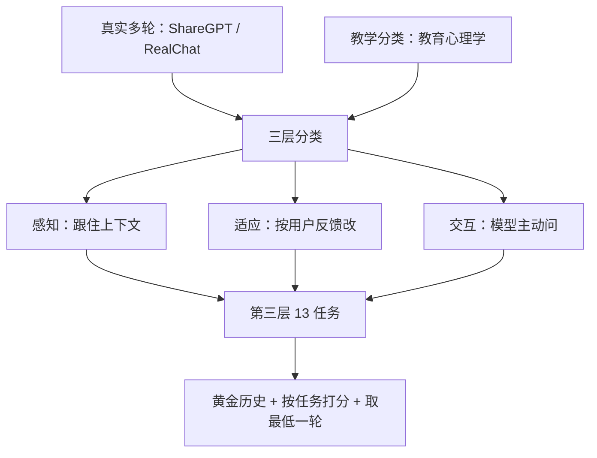

# MT-Bench-101：三层能力切多轮对话，21 个模型上常见对齐与 chat 设计没有明显抬分

<!-- release-date: 2024-02-22 -->

**本文依据**：`MT-Bench-101: A Fine-Grained Benchmark for Evaluating Large Language Models in Multi-Turn Dialogues`，arXiv 2402.14762v3（页眉 `[cs.CL] 5 Nov 2024`），34 页。作者 Ge Bai（Alibaba Group）、Jie Liu（The Chinese University of Hong Kong / Shanghai AI Laboratory）、Xingyuan Bu（Alibaba Group，通讯）等；封面机构 1 Alibaba Group、2 The Chinese University of Hong Kong、3 Shanghai AI Laboratory（PDF p. 1）。封面与页眉均未印会议录用，本文不补。盘上是 v3。首发日取 arXiv 页面 `Submitted on 22 Feb 2024`（[arxiv.org/abs/2402.14762](https://arxiv.org/abs/2402.14762) 的 `[v1]`），这是外部补充，不来自 PDF 正文。数据与代码：`https://github.com/mtbench101/mt-bench-101`（PDF p. 1）。文中数字均标 PDF 页码；标「外部补充」的段落不来自本文。正文对象是封面这篇 MT-Bench-101，不是 Zheng 等人那份两轮、八主题的 LMSYS MT-bench；相关工作会引用后者作对照（PDF p. 2–3），实验测的始终是 101。

## 一句话

日常聊天是多轮的，当时主流榜却停在单轮考试或「两轮、粗粒度」的多轮（PDF p. 1–2）。作者用真实多轮语料加教育心理学的教学分类，切出三层能力：感知（Perceptivity）→ 适应（Adaptability）→ 交互（Interactivity），第三层落到 **13** 个任务；数据是 **1388** 段对话、**4208** 轮（PDF p. 1–2）。用黄金上下文当历史、GPT-4 按任务细则打 1–10 分，整段对话取 **最低一轮** 当分（PDF p. 2、p. 5）。测了 **21** 个当时流行模型：闭源 2、开源 19（PDF p. 5）。主表上 GPT-4 均分 **8.86**，Yi-34B-Chat **8.10** 第二；数学推理最难，内容混淆与格式改写相对容易（PDF p. 6 表 3）。关键观察：**常见对齐（RLHF / DPO）和专门做 chat 的设计，都没有明显抬多轮能力**（PDF p. 1、p. 7–8）。GPT-4 与人专家在本文评测协议上的一致率 **87%**，高于人与人之间的 **80%**（PDF p. 2、p. 9 表 5）。

贯穿全文的轴不是「再出一套两轮闲聊题」，而是：**多轮到底要测哪几层能力、分数为什么必须按最差一轮掐、以及当时那套对齐/chat 配方为什么抬不动这条曲线。**

## 一、矛盾：聊天已经是多轮，榜还在单轮或两轮粗评

LLM 聊天把对话系统推了一大截，但评测没跟上。MMLU、BBH、AlpacaEval 这类单轮指令榜测的是「这一问答得对不对」，而用户和机器人的日常对话通常带多句历史（PDF p. 1）。早期多轮尝试里，Zheng 等人的 MT-bench 主要盯两轮、粗粒度能力，盖不住真实多轮的复杂与细粒度差别（PDF p. 2）。作者因此要一份能比较「多轮聊」的细粒度基准。

能力建模不是凭空列名词。他们把 ShareGPT、RealChat 这类真实多轮，和教育心理学里的多轮教学分类合在一起，做成既跟数据、又跟心理框架的三层分类（PDF p. 1–2）。图 1 右侧的意思很直白：能力覆盖面更宽的模型，才算更会多轮（PDF p. 1 图 1）。

上图根据 PDF p. 1–2 图 1、图 2 重画，是分类示意，不是实测曲线。

相关工作里他们把 Zheng 的 MT-bench 和 MT-Bench++、BotChat、MINT、AlpacaEval、PandaLM 并排放：前几份多轮要么主题粗、要么只盯生成/工具交互，细粒度多轮仍缺（PDF p. 3）。表 2 把规模钉死（PDF p. 4）：

| 基准 | 对话数 | 轮数 | 任务数 | 细粒度 |
|---|---|---|---|---|
| AlpacaEval | 805 | 805 | 1 | 否 |
| MT-Bench | 80 | 160 | 1 | 否 |
| MT-Bench++ | 80 | 640 | 1 | 否 |
| BotChat | 547 | 547 | 1 | 否 |
| MINT | 568 | 568 | 3 | 否 |
| MT-Bench-101 | 1388 | 4208 | 13 | 是 |

表 2 里 Zheng 那份 MT-Bench 是 **80** 段、**160** 轮、**1** 个任务、不算细粒度（PDF p. 4）。本文实验对象始终是最后一行。作者自称是「第一份专门盯细粒度多轮、数据量和任务多样性都更大」的集；这句话是相对表 2 他们填的那些基准，不是事后全领域普查（PDF p. 4）。

## 二、三层分类：先矛盾，再落到 13 个任务

第一层是三条递进能力（PDF p. 2 图 1–2）：

1. **感知（Perceptivity）**：最底层，上下文理解准不准。
2. **适应（Adaptability）**：在感知之上，对用户反馈能不能改、该不该改。
3. **交互（Interactivity）**：模型能不能主动跟人缠下去，这是多轮里真正「会聊」的一层。

第二层拆成七种更细的能力，第三层再落到 13 个任务（PDF p. 2）。表 1 给每条一句人话（PDF p. 4）。下面按三层讲任务在卡什么，不先堆缩写。

### 感知：历史还在不在、指代清不清、会不会被带跑

感知要求模型跟住并使用历史，给出连贯回答，下面三条核心能力（PDF p. 3）。

**上下文记忆（Context Memory, CM）**：当前这一问往往要回头翻前面说过的细节，记不住就答非所问（PDF p. 3）。

**上下文理解** 拆两件事（PDF p. 3）：

- **指代消解（Anaphora Resolution, AR）**：用户满口 these / it，模型必须找对所指。
- **指令与输入拆开（Separate Input, SI）**：第一轮只说任务要求，后面几轮才给具体输入。模型既不能第一轮抢答，也不能后几轮忘了最初的要求。

**上下文干扰** 也拆两件事（PDF p. 3）：

- **话题切换（Topic Shift, TS）**：用户突然换题，模型要丢掉不相干的前文，盯新题。
- **内容混淆（Content Confusion, CC）**：后问和前问长得很像、意思完全不同，不能套旧答案。

### 适应：用户改要求、改条件、还可能故意说错

适应发生在用户触发的对话里：改写上一答、加入新条件、或对上一答提出质疑（PDF p. 3）。

**改写（Rephrasing）**：内容改写（CR）按新要求改上一答的意思层面（例如「把这段摘要」）；格式改写（FR）只改结构、信息不动（例如改成列表）（PDF p. 3）。

**反思（Reflection）** 故意做成一对相反任务（PDF p. 3–4）：

- **自我纠正（Self-correction, SC）**：上一答确实错或不够准，用户质疑有效，模型必须改。
- **自我肯定（Self-affirmation, SA）**：上一答是对的，用户给了错误反馈，模型必须识破并坚持原答。

把 SC 和 SA 拆开，是因为「听劝」和「不瞎改」不是同一件事：只测纠正，会把轻易认输的模型刷高。

**推理（Reasoning）**：数学推理（MR）和一般推理（GR，谜题、归纳、演绎）都要求跨轮跟用户一起解题，中途会加条件或假设（PDF p. 4）。

### 交互：模型触发，而不是只等用户喂

交互是机器人主动提问、把对话往前推，或把信息问够再答（PDF p. 4）。

- **指令澄清（Instruction Clarification, IC）**：首问含糊，模型要追问，可能多轮才把意图钉死。
- **主动交互（Proactive Interaction, PI）**：对用户陈述接合适的追问或评论，让对方愿意继续聊（PDF p. 4）。

13 个任务的缩写与一句描述见表 1（PDF p. 4），此处不复读。附录 F 给每任务案例（PDF p. 13）。

## 三、数据怎么来：每任务专用提示，GPT-4 生成，五人全票才留

每个第三层任务单独设计生成提示，用人工例子引导 GPT-4（PDF p. 2、p. 4）。覆盖 **30** 个话题：医学、健康、历史、科学、技术、数码、汽车、天文、地理、生活、文学、政治、物理、化学、生物、金融、股票、法律、人文、娱乐、音乐、游戏、时尚、影视、名人、体育、艺术、计算机、环境、心理（PDF p. 13 附录 A）。每任务生成超过 **1000** 条候选，再由人筛；每条经 **五** 名标注员，只留五人都认为高质量的（PDF p. 4）。筛选原则五条（PDF p. 13）：

1. 严格符合该任务的生成规则。
2. 整体 30 话题，每任务至少 **10** 个不同话题。
3. 去掉只换几个关键词的近重复。
4. 去掉实时问题（如今天天气）和 2022 年之后才更新的知识。
5. 去掉常识错误、冒犯内容、个人身份信息。

附录 B 的表 6 把 13 任务拆开（PDF 表 6，与正文表 2 同一套加总）。词数按黄金上下文计（PDF p. 13）：

| 统计 | 总体 | CM | SI | AR | TS | CC | CR | FR | SC | SA | MR | GR | IC | PI |
|---|---|---|---|---|---|---|---|---|---|---|---|---|---|---|
| 对话数 | 1388 | 80 | 149 | 153 | 83 | 147 | 136 | 74 | 77 | 73 | 108 | 71 | 150 | 87 |
| 轮数 | 4208 | 319 | 620 | 560 | 249 | 352 | 389 | 197 | 154 | 146 | 224 | 218 | 426 | 354 |
| 段均轮 | 3.03 | 3.99 | 4.16 | 3.66 | 3.00 | 2.39 | 2.86 | 2.66 | 2.00 | 2.00 | 2.07 | 3.07 | 2.84 | 4.07 |
| 段均词 | 202.0 | 235.9 | 214.0 | 214.1 | 145.7 | 353.9 | 321.4 | 191.4 | 79.2 | 85.4 | 175.8 | 157.3 | 142.5 | 127.1 |
| 轮均词 | 66.64 | 59.15 | 84.76 | 58.49 | 48.56 | 147.80 | 112.4 | 71.91 | 39.60 | 42.71 | 51.44 | 51.22 | 50.18 | 31.22 |
| 段最长词 | 817 | 351 | 817 | 397 | 219 | 749 | 588 | 355 | 183 | 175 | 348 | 331 | 344 | 254 |
| 轮最长词 | 323 | 323 | 237 | 229 | 109 | 300 | 323 | 229 | 105 | 103 | 263 | 141 | 153 | 53 |

对话数 80+149+…+87=1388，轮数 319+620+…+354=4208，与摘要一致。SC / SA 段均只有 **2.00** 轮：质疑发生在第二轮，能力从第二轮开始考（PDF 附录 C p. 13）。CC 轮均词 **147.80**、段均词 **353.9**，是最长的一类——混淆靠「长得很像的前后问」堆出来（PDF 表 6）。PI 轮均词只有 **31.22**，短，考的是会不会把话头抛回去，不是写长独白（PDF 表 6；案例见图 45）。

## 四、怎么打分：黄金历史、按任务细则、整段取最低一轮

多轮里后一轮依赖前几轮的人机交互，在指令澄清、主动交互这类强交互任务上尤其明显（PDF p. 5）。作者因此用精筛数据当 **黄金上下文（golden context）** 做对话历史，不让被测模型自己滚出来的回复当历史（PDF p. 2、p. 5）。只评最新一轮回复，历史钉死，评测才公平、对话才走得下去（PDF p. 5）。

打分跟 Zheng 等人的 MT-bench 一样请 GPT-4 当裁判，但 **每个任务一套细则**，规定每一档分数要满足什么（PDF p. 5，附录 C 图 21–34）。GPT-4 对每一轮打 1–10 并写理由。整段对话的总分取各轮的 **最低分**（PDF p. 5）。理由对人直觉成立：紧密相关的多轮里，一轮翻车整段就废；同时堵住模型从黄金历史里抄风格、把后面几轮刷高（PDF p. 5）。后一点在第 4.2 节用按轮曲线坐实（PDF p. 6–7）。

LLM 裁判有自评偏好（作者引 Li 等、He 等）。附录 D 用 Qwen-72B-Chat 当裁判重评主榜前五，GPT-4 仍最强，两套裁判排序一致，作者认为本基准上这个问题不严重（PDF p. 5、表 7）。表 7 上 GPT-4 均分 **8.75**、Yi-34B **8.60**、GPT-3.5 **8.49**、Qwen-14B **8.40**、Mixtral-8x7B **8.32**（PDF 表 7）。注意：这是换裁判后的分数，不能直接和表 3 的 8.86 / 8.10 横比。

实验设置：除非另说，一律黄金历史；各模型用官方 chat 格式和系统提示，温度与采样跟官方配置；GPT-4 与 Qwen-72B-Chat 裁判温度 **0.6**（PDF p. 5）。附录 C 另写：格式改写、内容改写、指代、自我肯定、自我纠正、上下文记忆这几项，从 **第二轮** 才开始让模型生成——第一轮黄金历史只当背景，直接答第一轮没有评测意义（PDF p. 13）。

21 个模型：闭源 GPT-3.5 / GPT-4；开源 Llama2-Chat 7B/13B、Mistral-Instruct 7B / Mixtral-8x7B / DPO、Qwen-Chat 7B/14B、Yi-Chat 6B/34B、ChatGLM2-6B / ChatGLM3-6B、InternLM2-Chat 7B/20B 的 SFT 与 RLHF、Vicuna-13B-v1.5、Baichuan2-Chat-13B、UltraLM-13B-v2.0、Baize-v2-13B（PDF p. 5；链接见表 8）。表 3 主结果列出其中 18 个变体的分任务分；InternLM2 的 RLHF 档和 Mistral-DPO 放进表 4 做对齐对照，不重复占主表行。

## 五、主结果：适应和交互是短板，GPT-4 最强

表 3 是主表（PDF p. 6）。任务侧：内容混淆和格式改写相对不难，数学推理最难（PDF p. 5）。闭源全面压开源。GPT-4 全任务最强，均分 **8.86**；Yi-34B-Chat 均分 **8.10** 总第二（PDF p. 5–6）。表末 Avg 行是各模型在该列上的平均，总均分 **6.92**；MR 列均 **3.61**，CC **8.24**、FR **8.44**（PDF p. 6 表 3）。下面摘均分与最难的 MR、以及交互两列：

| 模型 | Avg. | CM | SI | MR | GR | IC | PI |
|---|---|---|---|---|---|---|---|
| Llama2-7B-Chat | 6.53 | 7.64 | 6.21 | 1.88 | 3.83 | 5.23 | 5.11 |
| Qwen-7B-Chat | 7.12 | 7.65 | 7.75 | 2.25 | 3.57 | 5.41 | 6.24 |
| ChatGLM2-6B | 5.56 | 6.14 | 4.69 | 2.11 | 3.00 | 5.16 | 4.90 |
| ChatGLM3-6B | 6.47 | 7.16 | 5.42 | 2.60 | 3.21 | 6.19 | 5.61 |
| InternLM2-Chat-7B-SFT | 6.69 | 7.51 | 6.26 | 3.47 | 4.48 | 4.92 | 4.76 |
| Yi-6B-Chat | 6.93 | 7.57 | 5.27 | 2.18 | 3.80 | 7.30 | 6.00 |
| Mistral-7B-Instruct-v0.2 | 6.95 | 7.66 | 5.64 | 2.58 | 4.52 | 5.80 | 5.66 |
| Vicuna-13B-v1.5 | 6.37 | 7.06 | 5.62 | 2.31 | 4.03 | 5.05 | 4.80 |
| Baize-13B-v2 | 6.12 | 6.78 | 5.15 | 1.67 | 3.69 | 4.35 | 4.95 |
| UltraLM-13B-v2.0 | 4.61 | 4.66 | 4.89 | 1.46 | 2.34 | 4.13 | 4.11 |
| Llama2-13B-Chat | 7.15 | 8.03 | 7.11 | 1.75 | 3.16 | 6.07 | 6.23 |
| Qwen-14B-Chat | 7.82 | 8.33 | 8.36 | 3.50 | 4.55 | 8.21 | 6.12 |
| Baichuan2-13B-Chat | 7.00 | 7.71 | 6.38 | 2.50 | 3.65 | 6.95 | 5.15 |
| InternLM2-Chat-20B-SFT | 6.95 | 7.35 | 6.44 | 4.05 | 5.24 | 4.99 | 4.99 |
| Yi-34B-Chat | 8.10 | 8.55 | 6.79 | 4.07 | 5.90 | 8.51 | 6.39 |
| Mixtral-8x7B-Instruct-v0.1 | 7.38 | 7.86 | 5.94 | 4.19 | 5.14 | 6.03 | 5.36 |
| GPT-3.5 | 7.99 | 8.77 | 7.67 | 4.48 | 5.31 | 8.57 | 6.32 |
| GPT-4 | 8.86 | 8.88 | 8.99 | 7.15 | 7.17 | 9.00 | 6.64 |
| 表内平均 | 6.92 | 7.52 | 6.37 | 3.61 | 4.84 | 6.22 | 5.52 |

其余列（AR / TS / CC / CR / FR / SC / SA）全文见表 3（PDF p. 6）。GPT-4 的 PI 也只有 **6.64**，是它最弱的一列之一：最强模型在「把话头抛回去」上仍不饱和（PDF p. 6）。UltraLM-13B 均分 **4.61** 垫底，CR **2.87**、FR **2.53**，专门做对话的模型并没有在改写上占到便宜（PDF p. 6）。

能力维：同一能力下各任务分数相近，于是按七维平均画图 3（PDF p. 5–6）。多数模型改写和抗干扰还行，推理和提问仍弱；记忆分高于理解分——记忆偏回忆，理解要抓住意思，更深（PDF p. 5）。反思和提问决定多轮里怎么跟人缠，这两维强的模型往往总分也高（PDF p. 5–6）。作者把适应和交互标成现有 LLM 的关键缺口（PDF p. 2）。

**Chat 专用模型**。表 3 里 Baize、UltraLM 并不突出，同尺寸的通用 chat 模型反而更强。作者的判断：尽管它们为对话特化，处理本文这种多轮细任务仍要再做（PDF p. 6）。这就是摘要里「chat-specific designs 没有明显增强」的实验落点（PDF p. 1）。

## 六、按轮看：有的任务越聊越忘，有的「上涨」是抄黄金历史

图 4 按任务画各轮模型均分（PDF p. 6–7）：

- 内容改写、格式改写、上下文记忆、指代：第一轮之后平均下降。多轮里模型更容易忘前文，或理解出现偏差（PDF p. 6）。
- 话题切换、内容混淆：第一轮到第二轮明显掉。第二轮才开始施加干扰（PDF p. 6）。
- 指令拆开、指令澄清、主动交互：轮次增加分数上升。作者明确说这 **不是** 真进步：黄金历史让模型学会当前对话的风格和答法，造成虚高（PDF p. 6–7）。
- 数学推理也会从黄金历史里学逐步解答范式；一般推理没有固定范式，对话越往后越复杂，分数趋于下降（PDF p. 7）。

所以「最低一轮当分」不是苛刻，是防虚高。第 4.3 节用 ChatGLM3-6B 在 SI 和 IC 上对比黄金历史 vs 自预测历史：黄金历史让后几轮涨分（上下文学习到模式）；自预测历史则把前面的错往后传，分数逐步掉，对话也不连贯（PDF p. 7–8 图 6）。因此协议钉死黄金历史 + 最低分（PDF p. 8）。

## 七、规模会抬分；RLHF / DPO 几乎不抬多轮

图 5 四组变尺寸对照：Llama2、Qwen、Yi、InternLM。变大普遍带来多轮提升；对提问能力尤其明显，更大模型交互更好（PDF p. 7）。

对齐对照是本文最容易被误读的一张表。作者拿三对开源模型，一对是 SFT，一对加了 RLHF 或 DPO（PDF p. 7 表 4）：

| 模型 | SFT | RLHF/DPO | Avg. | Δ |
|---|---|---|---|---|
| InternLM2-Chat-7B | 是 | — | 6.69 | — |
| InternLM2-Chat-7B | — | 是 | 6.85 | +0.16 |
| InternLM2-Chat-20B | 是 | — | 6.95 | — |
| InternLM2-Chat-20B | — | 是 | 7.05 | +0.10 |
| Mistral-7B | 是 | — | 6.95 | — |
| Mistral-7B | — | 是 | 6.89 | −0.06 |

InternLM2 两档只涨 **0.16** 和 **0.10**；Mistral-7B 反而掉 **0.06**（PDF p. 7）。作者的结论：当时的 RLHF / DPO **并不必然** 在多轮上带来实质提升，和单轮场景里常看到的大涨不同。主因判断是现有对齐数据仍以单轮为主，没覆盖多轮交互的复杂度（PDF p. 7）。这是观察加归因，不是消融到「换多轮偏好数据就一定涨」。

和 chat 专用模型合在一起，摘要那句「neither utilizing common alignment techniques nor chat-specific designs has led to obvious enhancements」才落地（PDF p. 1、p. 9）。

## 八、案例与人评：任务在测它声称的能力

图 7 用 GPT-4 评语对齐能力定义（PDF p. 8）：

- **SI 两类错**：没等到具体词就抢答同义词（评 1）；后轮忘掉「把祈使句改成礼貌请求」，对「Tell me your name」道歉打哈哈（评 2）。
- **SA**：澳网 2021 男单本答对是 Djokovic，用户谎称 Thiem，模型先认错再改回来，评 1——该坚持却没坚持。

其余任务的典型错在附录图 35–45（PDF p. 13）：格式改写扩进原文没有的副作用；自我纠正对质疑只回「66% 有把握」；一般推理在缺比较的情况下宣布 G 最重；指令澄清对「最好看哪本书」直接列经典而不追问口味；主动交互把「今天风真大」写成一段风景独白，评 3——像独白不像对话。

人评：随机抽 **100** 段，五名专家按任务要求给整段 1–10，多数表决当人标（PDF p. 8）。一致率沿用 Zheng 等人的定义：随机抽两类裁判、随机一题，两人同意的概率（PDF p. 8–9）。表 5（PDF p. 9）：

| 评测方法 | 与人的一致率 | 相对人–人的 Δ |
|---|---|---|
| 人专家之间 | 80% | 0% |
| MT-Bench-101 全文协议 | 87% | +7% |
| 去掉评分细则 | 77% | −3% |
| 不用最低分、改平均 | 75% | −5% |

去掉细则或改成平均，和人的一致率都掉到人–人之下。附录 G 的 Fleiss’ Kappa：五人之间 **0.672**；GPT-4 与全部人标 **0.676**；与每人平均 **0.681**；与多数表决 **0.699**（PDF 表 9）。作者据此认为协议有效；Kappa 与表 5 的 87%/80% 不是同一口径，不要混成一个数。

## 九、限制、伦理、论文没写什么

限制：LLM 还在长出新的多轮能力，本文分类盖不全；打算从 101 迭代更新（PDF p. 9）。伦理：GPT-4 生成加人审；知情同意、去冒犯与身份信息；仍可能残留 GPT-4 笔误或标注疏漏（PDF p. 9）。公开后可能被拿去训练，把基准刷穿；他们计划继续发新版应对泄漏并扩展能力（PDF p. 9）。数据仅供研究，商用需另行核验（PDF p. 9）。

没写的：训练自己的裁判模型、在 101 上做大规模多轮 SFT/RLHF 配方、以及 2024 年 11 月 v3 之后的刷榜。本文不补文后数字。

封面未印会议名。arXiv 摘要页 Comments 写了 `[ACL 2024]` 与「前三作者同等贡献」（外部补充，[arxiv.org/abs/2402.14762](https://arxiv.org/abs/2402.14762)），不写入「本文依据」的录用栏。

## 十、可迁移的几条

1. **多轮评测先切能力，再堆题。** 感知 / 适应 / 交互三层把「会记、会改、会问」分开；SC 与 SA 必须成对，否则听劝的模型会在错误质疑上得分。
2. **历史用黄金、总分取最低一轮。** 自滚历史传错；黄金历史会让后轮虚高。最低分同时堵住抄风格。
3. **单轮对齐涨分，不能外推到多轮。** 表 4 的 +0.16 / +0.10 / −0.06 是这篇最硬的负结果之一。要抬 101 这类分，对齐数据得覆盖跨轮干扰、错误反馈和主动追问，而不是再堆单轮偏好。
4. **Chat 专用不等于多轮细任务。** Baize / UltraLM 在表 3 上并不占优；特化数据若仍是单轮或浅多轮，细任务照样塌。
5. **裁判协议本身要做人一致率消融。** 细则和最低分都拿掉会掉一致率；换开源裁判至少核排序是否还在。

## 十一、关键词回看

- **MT-Bench-101**：本文基准；不是 Zheng 的两轮 MT-bench。
- **三层能力**：感知、适应、交互；第二层七维，第三层 13 任务。
- **黄金上下文**：用标注好的历史，不让被测模型自己滚。
- **最低一轮分**：整段对话的总分 = 各轮最低分。
- **自我纠正 vs 自我肯定**：有效质疑要改；错误质疑要顶住。
- **对齐负结果**：当时常见 RLHF / DPO 对多轮没有明显抬分。

## 参考资料

- 原件：`readings/_src/评测与 Benchmark/MT-Bench.pdf`（盘上 v3，34 页）
- arXiv：https://arxiv.org/abs/2402.14762 （v1：22 Feb 2024）
- 代码与数据：https://github.com/mtbench101/mt-bench-101
- 对照（本文相关工作引用，不是本篇实验对象）：Zheng et al., *Judging LLM-as-a-Judge with MT-Bench and Chatbot Arena*
