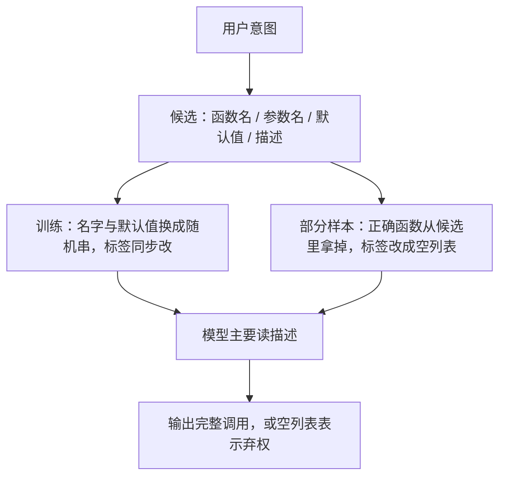

# Hammer：先承认函数名会骗人，再用 function masking 与 irrelevance 数据把端侧小模型钉回描述

<!-- release-date: 2024-10-06 -->

**本文依据**：`Hammer: Robust Function-Calling for On-Device Language Models via Function Masking`，arXiv 2410.04587v2（页眉 `[cs.LG] 10 Oct 2024`），17 页。作者 Qiqiang Lin、Muning Wen、Qiuying Peng（封面标 Equal Contribution）等；通讯作者 Qiuying Peng、Jun Wang（OPPO）、Weinan Zhang（上海交通大学）。封面机构 1 OPPO Research Institute、2 Shanghai Jiao Tong University、3 Iowa State University；第一作者单位是 OPPO Research Institute（PDF p. 1）。封面印 `Preprint. Under review.`，未印会议录用，本文不补。盘上是 v2。`release-date` 取 arXiv abs 的 Submitted on 6 Oct 2024（[v1]），不取页眉 v2 的 2024-10-10。开源仓库封面写明 `https://github.com/MadeAgents/Hammer`（PDF p. 2）。文中数字均标 PDF 页码；标「外部补充」的段落不来自本文。本文写的是封面这篇冻结的 Hammer 方法与当时榜单切片，不补文后刷榜。

## 一句话

函数调用（function calling）是模型从候选工具里选对函数、填对参数，没有合适的函数就该拒绝（PDF p. 1）。现成的函数调用模型在不同榜上分数差很大：表 1 里 xLAM-7B-fc 多数榜还行，平均却只有 **69.052**，低于 Granite-20B 的 **74.186**（PDF p. 2 表 1）。作者把主因钉在**函数名与参数名的命名习惯会误导模型**（PDF p. 2、p. 4）。Hammer 是一组面向端侧的轻量函数调用模型：在 xLAM-function-calling-60k 上加 **7,500** 条 irrelevance 样本，训练时用 **function masking** 把名字换成随机串，逼模型读描述（PDF p. 2、p. 5–7）。Hammer-7B 在 BFCL（截至 2024-09-20）Overall Acc **83.92**，排在若干 GPT-4 Prompt 变体之后；Executable Summary **89.72**，高于表中 GPT-4-0125-Preview 的 **89.25**（PDF p. 3 表 2）。贯穿全文的轴不是「再堆一批 API」，而是：**名字会骗人时，小模型该看描述；该弃权时，还得专门喂空标签。**

## 一、矛盾：单榜好看，换一套命名习惯就塌

LLM 当 agent，核心能力是从给定选项里选对外部工具或 API，填对参数；候选里没有合适函数时，必须拒绝，而不是硬调（PDF p. 1）。Gorilla、Granite、xLAM 一类已经给出数据和专用模型（PDF p. 1）。作者的观察是：同一批模型换榜就换脸。表 1 把三家 7B–20B 级开源函数调用模型摊在五张榜上（PDF p. 2）：

| 模型 | BFCL | API-Bank | SealTool | Tool-Alpaca | Nexus Raven | Avg. |
|---|---|---|---|---|---|---|
| Gorilla-OpenFunctions-v2-7B (FC) | 79.1 | 62.5 | 91.1 | 51.3 | 68.4 | 70.48 |
| Granite-20B-FunctionCalling (FC) | 76.63 | 68.5 | 92.7 | 58.0 | 75.1 | 74.186 |
| xLAM-7B-fc (FC) | 79.41 | 72.45 | 76.9 | 59.0 | 57.5 | 69.052 |

表注：数字来自 PDF p. 2 表 1。作者写 xLAM-7B-fc 多数榜最好，另两张掉下来，平均反而最低。

跨榜稳，才谈得上迁到真实应用（PDF p. 2）。第 3 节的诊断是：训练数据里的函数名、参数名风格一旦和测试集不一样，模型就按「见过的名字」猜功能（PDF p. 2）。Hammer 因此不是再做一个更大的通用对话模型，而是一组为端侧函数调用微调的轻量模型，两件配套物是 irrelevance 增强数据和 function masking（PDF p. 2）。

贡献三条（PDF p. 2）：

1. **调参框架**：用 function masking 把函数调用模型往跨榜泛化推，仓库 `https://github.com/MadeAgents/Hammer`。
2. **增强数据**：**7,500** 条专门练「候选与用户意图对不上」的样本，Hugging Face 路径 `MadeAgents/XLAM-7.5k-Irrelevance`。
3. **模型族**：Hammer-7B / 4B / 1.5B，7B 权重路径 `MadeAgents/Hammer-7b`；脚注另给 1.5B 与 4B（PDF p. 2）。

作者还写 Hammer-7B 只有 **70 亿**参数，却能在 BFCL v2 上和 GPT-4、GPT-4o 一类闭源模型比（PDF p. 2）。对照表 2 的切片日期是 **2024-09-20**，Overall Acc 上 Hammer-7B 是 **83.92**，GPT-4-0125-Preview (Prompt) 是 **85.79**（PDF p. 3）。「胜过许多更大开源模型、能和顶尖闭源比」是作者判断；精确名次以表为准，不要把摘要的「SOTA」读成当时整张活榜第一。

上图根据 PDF p. 4 图 1、p. 6 图 3、p. 7 第 4.2 节重画，是机制示意，不是实测曲线。

## 二、相关工作：agent、数据、微调三条线，Hammer 站在「小模型怎么稳」

第 2 节不发明新分类，只把当时文献收成三堆（PDF p. 3–4）。

**当 agent 去调函数。** Granite-20B 用多任务学七类细粒度函数调用，并在 BFCL v2 上自称超过其他开源模型（PDF p. 3）。APIGen 自动造可验证数据，7B 模型声称超过 GPT-4（PDF p. 3）。ToolACE 造多样工具数据，8B 模型在 BFCL v2 上自称能跟当时最新 GPT-4 比（PDF p. 3）。另有并行调用效率、调用过程里的漏洞、多样调用基准（PDF p. 3）。Hammer 引用这些工作，是为了说明「会调」已经有人做；它要补的是跨榜不稳。

**评测与数据。** API-BLEND 覆盖检测、填槽、排序（PDF p. 4）。API-Bank：**2,138** 个不同 API、**1,888** 段对话、**4,149** 次调用，测规划、检索和调用（PDF p. 4）。APIGen 强调查询风格多样（含并行）和多阶段校验（PDF p. 4）。Seal-Tools 是大规模 self-instruct、含嵌套调用（PDF p. 4）。

**微调技术。** Granite 走多任务（PDF p. 4）。TinyAgent 面向边缘小模型：LoRA、负样本、用 RAG 选 in-context 例子，再用 DAG 比编排对不对（PDF p. 4）。xLAM 是 SFT 加 DPO，配合数据并行、LoRA、余弦学习率（PDF p. 4）。Hammer 的差异不在再发明一种对齐算法，而在训练时把名字遮掉、并加弃权样本。

## 三、名字为什么会骗人

图 1 是一次典型调用：每个候选带函数名、参数名、默认值、描述；模型要么吐出可执行的完整调用，要么输出空列表表示候选都不满足（PDF p. 4）。要对齐的是两件事：用户意图对上哪一个功能（选函数），以及每个参数怎么用（填参）（PDF p. 4）。

名字往往又短又带作者癖好，例如 `cal_sum`、`max_value`（PDF p. 4）。只靠名字猜功能，复杂场景容易歧义。`parse_data` 在一个上下文解析 JSON，在另一个上下文解析 CSV（PDF p. 4–5）。参数同理：训练里见过的同名参数用法，会盖过测试时已经改掉的描述（PDF p. 5）。作者拆成三类（PDF p. 5）：

**被函数名带走。** 训练标签里出现过 `fetch_data` 表示从数据库取用户数据；测试里同名函数改成调外部 API，模型仍按名字选（PDF p. 5）。

**被参数名带走。** `timeout` 一处是整数秒，另一处是 `"10s"` 这种字符串，模型仍按旧类型填（PDF p. 5）。

**被命名偏好打扰。** CamelCase 和 snake_case 一换，端侧小模型的把握就掉（PDF p. 5）。作者点名：轻量端侧模型更难跨风格泛化。

### 遮掉名字以后，现成模型掉得有多狠

第 3.2 节用 xLAM-1B-fc（正文写 1B，图 2 横轴写 xLAM-1.3B-fc）在 Seal-Tools 上做个案：测试时把函数名、参数名换成随机串，描述仍保留全部用途信息（PDF p. 5）。图 2 是柱状示意：遮名字后 xLAM 掉得明显；同一设定下 Hammer-1.5B 掉得少（PDF p. 5 图 2）。正文没有给出柱上的精确 F1，本文不从读图猜数。作者的结论是：现成模型过度依赖名字；Hammer 更依赖描述（PDF p. 5）。

这就是 function masking 要解决的旧问题：真实世界里你事先不知道函数作者爱用哪种缩写。

## 四、Function masking：训练时把名字变成噪声

描述是更灵活的自然语言，通常已经包含名字想表达的信息；它也会带作者风格，但更细、更不容易只剩一个歧义缩写（PDF p. 6）。真实部署时命名偏好未知，因此训练目标应是：**靠描述理解用途，而不是靠又短又糊的名字猜**（PDF p. 6）。

图 3 是整条流水线（PDF p. 6）。框架四步（PDF p. 6）：

1. 候选里的**函数名**换成随机串，减少背名字。
2. **参数名**同样换成随机串，逼模型读参数描述。
3. **默认值**随机化，并追加进参数描述，再一次把注意力推到描述上。
4. **标签同步改**：批次里的监督标签把函数名、参数名换成与候选一致的随机串。

附录 C 给了一条训练输入例子：工具名变成 `LxOm64zLyg`、`WoDdNSe7e7K5` 这类串，查询是「Sydney 现在天气怎样」，模型应输出名字为 `WoDdNSe7e7K5`、参数 `LzZsvxUC` 为 `"Sydney"` 的 JSON 列表；格式指令要求严格 JSON，不需要调用时直接输出空列表 `[]`（PDF p. 15–17）。任务指令里还写了：没有能用的函数要指出并拒绝；缺参也要指出（PDF p. 15）。

可迁移的点很具体：如果你的 SFT 数据函数名高度模式化（全是 `get_*` / `fetch_*`），测试集一换风格就会塌。与其在推理时再做一层名字归一化，不如在训练时把名字变成不可靠特征。代价是：同任务内学得可能变慢，见第 5.5 节的 mask 比例。

## 五、Irrelevance 数据：会选函数之后，还要会弃权

在 xlam-function-calling-60k 上微调时，作者看到一个反向关系：调用选得越准，irrelevance detection（判断候选里根本没有能满足意图的函数）往往越差（PDF p. 7）。细节放到 5.6 节。轻量模型在「给定集合里选一个」上变强，会在没有合法选项时仍硬调（PDF p. 7）。

增强做法：从原训练集再采 **7,500** 条，把正确函数从候选里删掉，标签改成空列表（PDF p. 7）。多暴露「该弃权」的样本，希望模型更会判断何时不调。

这和 BFCL 的 Irrelevance 列是同一类能力，但 Hammer 是在训练分布里人为制造空标签，不是改评测公式。

## 六、评测设定：五张域外榜，BFCL 用 AST 加真执行

第 5.1 节写清：这些榜对 Hammer 都是域外（PDF p. 7）。

- **BFCL**：超过 **1,700** 条；Python 侧有 Simple / Multiple / Parallel / Parallel Multiple，另有函数相关性检测，以及 REST、JavaScript、Java（PDF p. 7）。
- **API-Bank**：**314** 段工具对话、**753** 次 API 调用；L-1 是已知 API 按查询调用，L-2 是从候选列表检索再调用（PDF p. 7）。
- **Nexus Raven**：**318** 条测试、**65** 个不同 API（PDF p. 7）。
- **Tool-Alpaca**：合成数据，**271** 条、**50** 类；评测用其中 **100** 条模拟测试，做法类似 Nexus Raven（PDF p. 7）。
- **Seal-Tools**：**4,076** 个自动生成 API，较新，泄漏风险相对低（PDF p. 7）。

BFCL 两条腿：AST 看结构、函数名、必填参数、类型；Executable 真跑，看能不能编译并得到预期输出（PDF p. 7–8）。其他榜用 F1 衡量 API 名与参数是否精确匹配（PDF p. 8）。

附录 B 把四种调用风格写成（PDF p. 14）：

- **Simple**：一份 JSON 文档，一次调用。
- **Multiple**：多份 API，只选最合适的一个；作者称这是最常见的真实用法。
- **Parallel**：只有一份 API，一次查询要同时执行多次调用。
- **Parallel Multiple**：多文档，且每个函数可能被调多次。
- **Irrelevance**：候选里没有合适函数，应拒绝。

图 4、图 7 是这几类的示意图（PDF p. 8、p. 14）。

## 七、主结果：7B 端侧模型在 2024-09-20 的 BFCL 切片上贴着 GPT-4

表 2 注明截至 **2024-09-20**，Overall Acc 是各类加权平均；FC 是原生函数调用模式，Prompt 是自定义提示抽调用（PDF p. 3）。Hammer 三档没有官方 Rank 编号，夹在 GPT-4 变体和开源模型中间。摘若干行（PDF p. 3 表 2）：

| Rank | 模型 | Overall Acc | AST Summary | Exec. Summary | Irrelevance | Relevance |
|---|---|---|---|---|---|---|
| 1 | GPT-4-0125-Preview (Prompt) | 85.79 | 85.50 | 89.25 | 61.35 | 97.56 |
| 3 | GPT-4-0613 (Prompt) | 84.74 | 84.66 | 87.57 | 75.57 | 82.93 |
| （无编号） | Hammer-7B (FC) | 83.92 | 78.70 | 89.72 | 72.87 | 92.68 |
| 4 | GPT-4-turbo-2024-04-09 (Prompt) | 83.89 | 85.41 | 88.13 | 61.82 | 82.93 |
| 16 | xLAM-7B-fc (FC) | 79.41 | 72.77 | 85.68 | 79.76 | 80.49 |
| 19 | Gorilla-OpenFunctions-v2-7B (FC) | 79.10 | 73.18 | 84.97 | 73.13 | 85.37 |
| 26 | Granite-20B-FunctionCalling (FC) | 76.63 | 66.73 | 82.97 | 72.43 | 95.12 |
| （无编号） | Hammer-4B (FC) | 76.05 | 69.59 | 80.82 | 68.66 | 90.24 |
| 31 | xLAM-1.3B-fc (FC) | 74.90 | 67.37 | 80.80 | 61.21 | 95.12 |
| （无编号） | Hammer-1.5B (FC) | 73.04 | 65.53 | 75.86 | 72.18 | 92.68 |

作者写：同规模下 Hammer 系列对应 SOTA，Hammer-7B 总体只排在专有 GPT-4 之后（PDF p. 8）。Executable Summary 上 Hammer-7B **89.72** 高于表中所有列出的 GPT-4 Prompt 行（最高 GPT-4-0125 为 **89.25**）（PDF p. 3、p. 8）。Irrelevance 上 Hammer-7B **72.87**，低于 xLAM-7B 的 **79.76** 和 GPT-4o-mini 的 **79.20**（PDF p. 3）——弃权不是它最强的列，这和后文「调用与弃权此消彼长」一致。

表 3 用学术榜的 F1。排序键是 **Func. + Args** 的平均 F1，即函数选择和填参都对（PDF p. 3）。Hammer-7B 该列平均 **76.21**，Func-Name 平均 **89.72**；GPT-4-0613 是 **78.79** / **88.29**，GPT-4o-mini 是 **76.42** / **84.69**（PDF p. 3 表 3）。Granite-20B 为 **72.56** / **87.19**，xLAM-7B 为 **67.65** / **72.57**（PDF p. 3）。作者强调：这些榜与 xlam-function-calling-60k 无关，Hammer 跨榜更稳（PDF p. 8）。

分项上，表 4 把 AST 与 Exec 按 Simple / Multiple / Parallel / Parallel Multiple 切开，日期同样是 2024-09-20（PDF p. 8）。Hammer-7B 的 AST | Exec Summary 是 **78.70 | 89.72**；Parallel Multiple 是 **84.08 | 85.00**（PDF p. 8 表 4）。作者写：AST Summary 仅次于 GPT-4 系列和 Functionary-Medium-v3.1-70B；Exec 超过 GPT-4；最复杂的 Parallel Multiple 上 AST 与 Exec 都是当时表内 SOTA（PDF p. 8）。解释是：任务越复杂越要读懂函数，masking 逼模型看描述，优势才放大（PDF p. 8）。

Hammer-7B 的 Simple Exec 是 **91.86**，低于 GPT-4 的 **99.00** / **98.29**；短板在简单可执行调用，长板在并行多函数（PDF p. 8 表 4）。Hammer-1.5B 的 Simple Exec 只有 **49.93**，但 Multiple Exec 已到 **92.00**（PDF p. 8）——小模型不是均匀变弱。

附录表 6 是同一天 BFCL 全表，Hammer-7b Overall Acc 仍是 **83.92**，并补上 GPT-4o-2024-05-13 (Prompt) **83.13** 等未进表 2 的行（PDF p. 14）。mistral-large-2407 (FC Any) Irrelevance 只有 **0.34**、Relevance **100.00**（PDF p. 14）：几乎从不弃权。这是读全表时有用的对照，说明 Overall Acc 会被「永远调用」扭曲。

## 八、消融：换底座、改 mask 比例、改弃权数据占比

### 换底座

表 5 把同一套数据与 masking 打到 Qwen 系列，以及 Deepseek-Coder-1.3B-Instruct、Deepseek-Coder-6.7B（表题写 6.7B，表内行名是 Deepseek-Coder-7B）（PDF p. 9）。学术榜 F1 Func.+Args 平均：

- Qwen2-7B-Instruct **59.84** → Hammer-7B **76.21**（PDF p. 9）。
- Qwen1.5-4B-Chat **42.25** → Hammer-4B **71.35**（PDF p. 9）。
- Qwen2-1.5B-instruct **52.67** → Hammer-1.5B **66.20**（PDF p. 9）。
- Deepseek-Coder-7B-Instruct **45.67** → Deepseek-Coder-7B-Hammer **74.94**，高于同表 xLAM-7B-fc 的 **67.65**（PDF p. 9）。
- Deepseek-Coder-1.3B-Instruct **19.78** → 1.3B-Hammer **70.91**，高于 xLAM-1.3B-fc 的 **66.77**（PDF p. 9）。

作者的判断：方法不绑死在 Qwen 上；同样从 deepseek-coder-instruct 出发、用 xlam-function-calling-60k 做 SFT 的 xLAM，不如加上 masking 与 irrelevance 的 Hammer 变体（PDF p. 8–9）。

附录表 7 是 BFCL 上的 AST 向对照，Overall Acc 与表 2 不是同一列口径：Hammer-7B 这里是 **80.06**（表 2 为 **83.92**），Qwen2-7B-Instruct **72.79**，Qwen1.5-4B-Chat **32.92**，Qwen2-1.5B-Instruct **46.90**（PDF p. 15 表 7）。Deepseek-Coder-7B-Instruct Overall Acc 只有 **17.65**，AST Summary **1.60**，Irrelevance **99.51**、Relevance **0.00**——几乎全拒绝；微调成 Deepseek-Coder-7B-Instruct-Hammer 后 Overall Acc **79.09**，Relevance **100.00**（PDF p. 15）。1.3B 底座 Overall Acc **16.81**、AST Summary **0.21**、Irrelevance **100.00**，Hammer 后 **69.71**（PDF p. 15）。读表时不要把表 7 的 Overall Acc 和表 2 混成一个「官方总分」。

### Mask 比例

第 5.5 节在 Seal-Tools 训练集上对 Qwen2-1.5B 微调一个 epoch，mask 比例不同，再在 Seal-Tools（同任务）和 API-Bank（跨任务）上测（PDF p. 9）。「mask 0.33」表示批次里 **33%** 样本被遮，其余不动（PDF p. 9 图 5）。正文对图 5 的定性结论：mask 太大，同任务（Seal-Tools）学得变慢；API-Bank 上更大 mask 更有利于跨场景泛化（PDF p. 10）。没有 masking 时，微调容易过拟合训练命名，新环境掉点；逼模型看描述，能减轻这种过拟合（PDF p. 10）。图上精确曲线值正文未抄，本文不估。

### Irrelevance 占比

从 irrelevance 增强集与原始 xlam-function-calling 中按不同比例一共采 **10,000** 条，微调 Qwen2-1.5B-Instruct，在 BFCL 测试集上看弃权与调用（PDF p. 10）。图 6：ratio=30% 表示 **30%** 来自增强集、**70%** 来自原集（PDF p. 10）。前两幅显示弃权变好、调用变差，两者反向（PDF p. 10）。末幅显示，在他们的设定里，增强数据约占 **10%** 时总体最好，并据此把增强集规模定在 **7.5k**（PDF p. 10）。作者明确：比例随底座和训练集而变，文中数字只作参考（PDF p. 10）。

注意 5.6 节第一句写成「In Section 4.1」，但 4.1 是 masking、irrelevance 在 4.2——这是原文笔误，本文按章节内容引用 4.2 / 5.6。

## 九、限制、未公开信息、可迁移启发

原文几乎没有独立 Limitations 节。结论只收两条：跨榜不稳主要来自命名误导；Hammer 用增强数据和 masking 给出端侧方案（PDF p. 10）。下列缺口是读完 PDF 后仍拿不到的，不是作者清单。

- 没有公开逐步超参：学习率、epoch、batch、LoRA 秩、mask 在正式 Hammer-7B 上的默认比例。5.5 节的比例实验只在 Qwen2-1.5B × Seal-Tools 一个 epoch。
- 没有端侧延迟、内存、功耗数字；「on-device」是定位，不是测过的设备表。
- 没有训练算力、数据许可证细节、人工校验流程。
- 图 2、图 5、图 6 是图，正文几乎不给点值。
- 表 2 与表 7 的 Overall Acc 口径不一致；表 5 的 6.7B / 7B 命名也不对齐。
- BFCL 数字冻结在 **2024-09-20**。不要把后来的活榜名次写进本文。

可迁移的几条不依赖他们的权重：

1. **评函数调用不要只看一张榜。** 表 1 已经证明单榜第一可以平均垫底。
2. **名字是不可靠特征。** 训练时随机化函数名、参数名、默认值，标签跟着改，是低成本正则，特别适合端侧小模型。
3. **会选不等于会弃权。** 只喂「集合里总有正确答案」，模型会学会永远调用。空标签样本要单独配，比例要扫，他们的参考值大约 **10%** / **7.5k**（PDF p. 10）。
4. **复杂并行调用更吃描述。** Parallel Multiple 上 masking 的相对优势最大（PDF p. 8）。若你的产品是多工具编排，不要只用 Simple 准确率做验收。
5. **底座可以换。** 同一套流程在 Qwen 与 DeepSeek-Coder 上都抬分（PDF p. 9）。方法比「必须用某个 chat 模型」更可搬。

## 十、关键词回看

**函数调用 / function calling：** 从候选工具里选函数、填参数；没有合适函数则拒绝（PDF p. 1）。

**Function masking：** 训练时把函数名、参数名换成随机串，默认值随机并写入描述，标签同步替换，逼模型读描述（PDF p. 6）。

**Irrelevance / 弃权：** 候选与意图对不上，输出空列表而不是乱调（PDF p. 7、p. 14）。

**Irrelevance-augmented dataset：** 从 xLAM-function-calling-60k 再造 **7,500** 条「正确函数被拿掉、标签为空」的样本（PDF p. 7）。

**BFCL AST / Executable：** 前者对结构与类型，后者真跑看输出（PDF p. 7–8）。

**Simple / Multiple / Parallel / Parallel Multiple：** 按「池子里几份文档、这一轮调几次」切开的查询风格（PDF p. 14）。

**Hammer-1.5B / 4B / 7B：** 面向端侧的函数调用微调模型族（PDF p. 2）。

## 参考资料

- 原论文 PDF：`readings/_src/评测与 Benchmark/Robust-Function-Calling.pdf`（盘上 v2，17 页）。
- arXiv abs：https://arxiv.org/abs/2410.04587 （Submitted on 6 Oct 2024）。
- 项目仓库（封面给出）：https://github.com/MadeAgents/Hammer
- 模型与数据路径见 PDF p. 2 的 Hugging Face 链接。
- 同方向已有研读：`BFCL.md`、`Gorilla.md`、`API-Bank.md`。BFCL 活榜与本文表 2 切片不是同一份材料。
