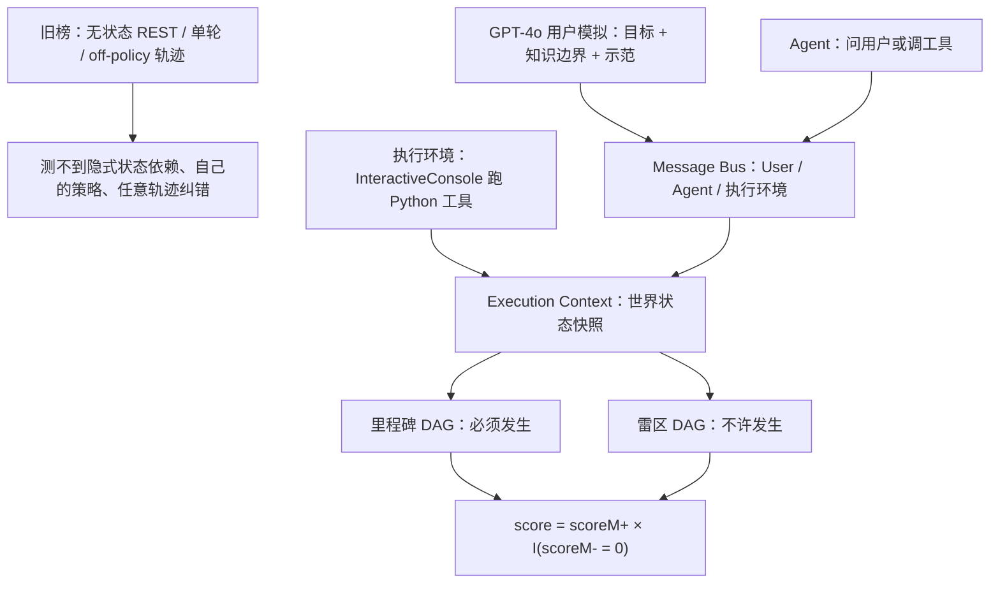

# ToolSandbox：有状态、对话、可交互的工具评测，不要求模型显式吐对话状态

<!-- release-date: 2024-08-08 -->

**本文依据**：`ToolSandbox: A Stateful, Conversational, Interactive Evaluation Benchmark for LLM Tool Use Capabilities`，arXiv 2408.04682v2（页眉 `[cs.CL] 16 Apr 2025`），24 页。作者 Jiarui Lu、Thomas Holleis、Yizhe Zhang、Bernhard Aumayer、Feng Nan、Felix Bai、Shuang Ma、Shen Ma、Mengyu Li、Guoli Yin、Zirui Wang、Ruoming Pang；封面机构只印 Apple（PDF p. 1）。封面与页眉均未印会议录用，本文不补。盘上是 v2。首发日取 arXiv 页面 Submission history 的 `[v1] Thu, 8 Aug 2024 05:45:42 UTC`（[arxiv.org/abs/2408.04682](https://arxiv.org/abs/2408.04682) 的 Submitted on 8 Aug 2024），这是外部补充，不来自 PDF 正文。评测框架：`https://github.com/apple/ToolSandbox`（PDF p. 1）。文中数字均标 PDF 页码；标「外部补充」的段落不来自本文。

## 一句话

先前工具评测要么对着无状态 REST、要么单轮提示、要么拿一条已经展开的 off-policy 轨迹对答案（PDF p. 1）。ToolSandbox 把三件事绑在一起：有状态的工具执行、工具之间的隐式状态依赖、内置用户模拟器做 on-policy 对话，再用里程碑 / 雷区对任意轨迹打中间步和终点（PDF p. 1）。开源与闭源差距大：表 5 上 GPT-4o-2024-05-13 平均相似度 **73.0**，当时最强开源 Hermes-2-Pro-Mistral-7B **31.4**，落后倒数第二的闭源 Claude-3-Haiku-20240307（**54.9**）超过 **20** 分（PDF p. 6–7 表 5）。State Dependency、Canonicalization、Insufficient Information 连当时最强模型也难（PDF p. 1、p. 6）。贯穿全文的轴不是「再堆一批 API 名」，而是：**世界状态要隐式跟踪、对话要 on-policy、评测要对任意轨迹上的关键事件，而且不要求模型按本体显式吐对话状态。**

## 一、矛盾：任务式对话本来就是有状态、多轮、会翻车的，旧榜却拆开测

工具使用相对对话状态跟踪（DST）已经换了问题：DST 要模型在预定义本体下显式生成对话状态和动作，再从结构化输出推出工具调用；工具使用允许模型根据观察直接生成调用，对话状态和世界状态跟踪都藏在内部（PDF p. 1）。问题简化了，任务式对话那三件事却还在：有状态、对话、可交互，系统评测仍然难（PDF p. 1）。作者点名 BFCL、ToolEval、API-Bank、ToolTalk、τ-bench 各啃了一块，还没有「全包」方案（PDF p. 1）。

### 有状态：工具改库，也依赖库

任务式对话里的工具常常绑在世界状态上，例如数据库（PDF p. 1）。一类工具会改世界：打开蜂窝网络。另一类隐式依赖世界：没网就不能搜附近餐馆。用户往往不知道底层状态，只给笼统指令；Agent 要用自己的世界知识和环境反馈，先改状态再完成任务（PDF p. 1）。图 1 的例子：用户要发消息，蜂窝关着；Agent 要先问清参数、用 `search_contacts` 凑齐槽位，发送失败后再开蜂窝、重试（PDF p. 2 图 1）。

BFCL 与 ToolEval 都靠无状态工具走 REST，测的是静态环境里的试错（PDF p. 1–2）。API-Bank、ToolTalk、τ-bench 有改世界状态的工具，但**不研究状态依赖的影响**（PDF p. 2）。

### 对话：用户和策略互相绑着，off-policy 测不到自己的策略

对话评测难，因为用户和策略互相依赖，自然语言又含糊（PDF p. 2）。常见做法是模拟用户。BFCL 与 ToolEval 只评自包含、无歧义的单轮查询，不现实（PDF p. 2）。API-Bank 与 ToolTalk 在已经展开的 off-policy 轨迹上评，测不到 Agent 按自己策略走出来的表现（PDF p. 2）。

### 可交互：会调错、会抛异常、用户会改口

真实场景里 Agent 会发错误调用，工具会抛意外异常，用户会补一句纠正前一句（PDF p. 2）。需要能对与用户、与环境的关键交互立刻打分，覆盖任意多轮（PDF p. 2）。BFCL、API-Bank、ToolTalk 依赖预定义轨迹和静态按轮指标（PDF p. 3）。τ-bench 要求 Agent 动作匹配**一条**预定序列，不容纠错、也不允许多种正确顺序（PDF p. 3）。ToolEval 允许多轮 Agent–工具交互，但最终通过率和胜率全靠 LLM 裁判，可靠性和可解释性成问题（PDF p. 3）。

表 1 把四列对齐（PDF p. 1 表 1）。空格是原表空着，不是漏填。

| 基准 | 状态依赖 | 对话 | 可交互 | 人工撰写真值 |
|---|---|---|---|---|
| ToolSandbox | 有 | 有 | 有 | 有 |
| BFCL | 无 | 无 | 无 | 有 |
| ToolEval | 无 | 无 | 有 | 无 |
| API-Bank | 无 | | 无 | 有 |
| ToolTalk | 无 | | | 无 |
| τ-bench | 无 | 有 | | 无 |

作者自称据其所知，ToolSandbox 是第一个同时做到这三点的 LLM 工具基准（PDF p. 3）：

1. 有状态工具之间有**隐式状态依赖**，Agent 要靠世界常识跟踪并改世界，这些依赖**不写在用户查询里**。
2. 有 LLM 模拟用户，做真实的 on-policy 对话，测隐式对话状态跟踪。
3. 全交互、动态采轨迹；工具可组合；人工写的里程碑 / 雷区评中间步和终点。

上图根据 PDF p. 1–5 图 1、图 2 和第 2 节重画，是评测口径示意，不是实测曲线。

## 二、什么叫「做对了」：三方说话，对的是里程碑图，不是一条金轨迹

核心是一套 Python 原生测试环境：Execution Context 抽象世界状态，Python 函数当工具；User、Agent、Execution Environment 经 Message Bus 通信（PDF p. 3）。用例通常从用户开口开始；被点名的角色接着说，直到结束态（PDF p. 3）。Agent 收到请求后，可以向用户追问，也可以让执行环境跑工具（名字加参数）。执行环境在 `code.InteractiveConsole` 里跑，按工具改上下文里的世界，再回给 Agent（PDF p. 3）。用户认为任务完成（或完不成）时，调它唯一能调的 `end_conversation`，系统进入结束态，再拿对话与里程碑 / 雷区比相似度（PDF p. 3）。

### 有状态：蜂窝、Wi-Fi、定位、低电量套在一起

为了造难推理，工具会检查、依赖或改世界状态（PDF p. 3）：

- **蜂窝**：`send_message` 一类要求蜂窝为真。
- **Wi-Fi**：`search_stock` 一类 RapidAPI 工具要求 Wi-Fi 为真。
- **定位服务**：`get_current_location` 一类要用当前位置，要求定位开着。
- **低电量模式**：打开蜂窝、Wi-Fi、定位的工具都要求低电量为假，形成**嵌套**依赖。

有状态工具占工具箱 **44%**（PDF p. 3）。它们彼此形成隐式依赖，测 Agent 心里有没有世界图像和调用栈（PDF p. 3）。图 1：`send_message` 在蜂窝关闭时抛 `ConnectionError`，Agent 该用 `set_cellular_service` 修好、知道现在该开着、再重试发送（PDF p. 3–4）。

### 对话：模拟用户不能只塞一句「用户目标」

On-policy 展开靠 GPT-4o 用户模拟器和校准过的提示（PDF p. 4）。模拟用户代表真人，可能多轮才能完成任务；完成或判定完不成时用 `end_conversation` 收场，这是它唯一的工具（PDF p. 4）。相关工作建议把总体目标写进系统提示；作者发现在 ToolSandbox 的复杂交互里不够，会出两类失败（PDF p. 4）：

1. **幻觉**：只看目标、看不到期望结果，没法判断是否完成、也没法补后续信息。
2. **不听话**：单条系统提示会被工具 Agent 带跑偏。

于是加两块（PDF p. 4）：

- **Knowledge Boundary（知识边界）**：告诉模拟用户该知道什么、不该知道什么，部分开放期望结果，压幻觉。
- **Demonstration（示范）**：给模拟用户 few-shot 对话。示范只对用户模拟器可见，Agent 看不见。

表 2：在 GPT-4o 用户 + GPT-4o Agent、**1032** 条人工标注轨迹上，只给 User Goal 时幻觉 **12.4%**、指令跟随错误（IF）**6.20%**；加知识边界后 **7.75%** / **3.88%**；再加示范 **6.97%** / **0.77%**（PDF p. 4 表 2）。表 3：知识边界与示范都开，换 Agent 重复 **4** 次、每次 **1032** 条，幻觉与 IF 合计约 **8%** 量级且跨 Agent 接近（GPT-4o 总错 **8.02±1.36**，Claude-3-Opus **7.78±0.52**，Gemini-1.5-Pro **8.07±1.03**），作者认为不该扭曲表 5 的 Agent 对比（PDF p. 4 表 3）。

附录把 Agent 称作 User B，因为角色对调对模拟器很难（PDF p. 14）。图 5：模拟器忘了自己是用户，变成助手（PDF p. 14）。图 6：目标只说把即将到来的提醒改到明天 5PM，Agent 一问内容，模拟器就编了提醒正文（PDF p. 14）。

### 可交互：里程碑是 DAG，雷区一碰整局归零

轨迹高度动态：同一结局可以有多条路；同一任务可用不同工具、不同顺序、也可以试错（PDF p. 4）。评测必须能接任意轨迹。作者用 **Milestones（里程碑）** 和 **Minefields（雷区）** 定义必须发生 / 不许发生的关键事件（PDF p. 4）。图 1 发消息例的里程碑（PDF p. 4）：

1. 设置库里蜂窝变成 True。
2. Agent 用正确参数调 `search_contacts`，可在 1 之前或之后。
3. 用正确参数调 `send_message`，必须在 1 和 2 之后。
4. 消息库出现电话号码精确匹配、内容宽松匹配的一条，必须在 3 之后。

每个里程碑定义 0 到 1 的回合相似度；度量类型见附录 A.7（PDF p. 4）。里程碑按时间依赖组成 DAG。评一条轨迹：在保持拓扑序的前提下，找回合与里程碑的最佳匹配，取平均相似度最高的那种映射，记为 $\mathrm{score}_{M+}$（PDF p. 4–5）。任务效率不进里程碑，另用回合数，见附录 D.3（PDF p. 5）。作者认为这把 BFCL 那种工具调用 AST、执行结果精确匹配的可解释性，和 ToolEval 那种「任意轨迹都能评」拼在一起（PDF p. 5）。

雷区定义**不许**发生的事件，主要用于「故意缺工具、看 Agent 会不会幻觉」；结构与里程碑相同，只在算最终分时不同（PDF p. 5）。图 3：当前时间戳不可用，任务故意完不成，不该调 `timestamp_diff`；GPT-4 幻觉了当前时间戳并调用，命中雷区，相似度变成 **0**（PDF p. 5 图 3）。设雷区 DAG 的相似度为 $\mathrm{score}_{M-}$，最终分（PDF p. 5 式 1）：

$$
\mathrm{score} = \mathrm{score}_{M+} \times \mathbf{1}(\mathrm{score}_{M-}=0)
$$

雷区相似度非零，整条轨迹为 0。

附录形式化：里程碑 DAG $G_{M+}(V_{M+},E_{M+})$，$|V_{M+}|=m$，各轮数据库快照 $S_n=(s_1,\ldots,s_n)$，相似度 $\mathrm{sim}:V_{M+}\times S\to[0,1]$，在映射出的里程碑序列是拓扑序的约束下最大化平均相似度（PDF p. 16 式 2）：

$$
\mathrm{avgsim}^{+} = \frac{1}{m}\sum_{i=1}^{m}\mathrm{sim}(v^{i}_{M+}, f^{+}(v^{i}_{M+}))
$$

列相似度可以是蜂窝精确匹配、消息内容 ROUGE-L F、工具轨迹 AST（类似 BFCL）等，输出都在 $[0,1]$（PDF p. 16）。行之间用几何平均再做最优分配；任一列必须为 0 就能把整体打成 0（PDF p. 16）。还可以加「参考里程碑」：`guardrail_similarity` 看两事件之间某库有没有被改；`tool_trace_dependant_similarity` 把上一里程碑的工具输出灌进当前里程碑，跟踪信息流（PDF p. 16）。图 10：GPT-4o 把回合耗在解状态依赖上，没在上限内做完；终点失败，但中间里程碑仍显示它解过状态依赖、也要过当前位置——作者说该改进的是状态依赖上的回合效率（PDF p. 16–17 图 10）。

执行环境按 IPython / Jupyter 那种交互控制台跑 Python 片段，异常走 stderr，方便试错（PDF p. 16）。并行调用本应用来加速**独立**工具（两个城市的天气）；对**有依赖**的工具并行，必须罚。执行环境按墨菲定律处理竞态：**检测到竞态就让它发生**（PDF p. 16）。

## 三、测什么：1032 个人工场景，34 个可组合工具

一条测试场景由初始世界状态、初始消息、可用工具、评测用里程碑和雷区定义，对应图 1 浅蓝框（PDF p. 5）。**1032** 条由 **2** 名内部领域专家精心撰写，里程碑 / 雷区人工校准；一人造场景，另一人当 Agent 验证（PDF p. 5）。流程见附录 B.2（PDF p. 5）。

**34** 个工具覆盖 **11** 域：Contact、Messaging、Reminder、System settings、Time utilities、Math utilities、Map、Weather、Stock、Conversion、Holiday；能 Python 原生就原生，必要时薄封装 RapidAPI（PDF p. 5）。设计目标是对话里可代表、多样、可组合，同时把工具数量压到里程碑标得动（PDF p. 5）。因此平均每段的工具调用次数和回合数比对照基准高（PDF p. 5）。

表 4（PDF p. 5）。ToolSandbox 的回合 / 调用统计来自 GPT-4o Agent 轨迹；BFCL 单轮提示算 **2** 回合；ToolEval 来自 ToolLlama DFS Retriever；API-Bank 来自 level 1 和 2 测试集（PDF p. 16–17）。

| 基准 | 平均回合 | 平均工具调用 | 测试条数 | 工具数 |
|---|---|---|---|---|
| ToolSandbox | 13.9 | 3.80 | 1032 | 34 |
| BFCL | 2.00 | 0.78 | 2000 | 1193 |
| ToolEval | 7.53 | 1.46 | 1625 | 3917 |
| API-Bank | 3.88 | 2.04 | 261 | 73 |
| ToolTalk | 7.42 | 3.68 | 78 | 28 |
| τ-bench | 29.33 | 4.48 | 165 | 24 |

### 场景类别：先难推理，再正交做工具增强

- **Single / Multiple Tool Call**：完成任务需要一次 / 多次调用。注意这和 BFCL 的定义不同：BFCL 那种更接近这里 Tool Augmentation 里的干扰工具（PDF p. 5–6）。
- **Single / Multiple User Turn**：单用户轮时首句信息齐；多用户轮从含糊或缺槽开始，必须再问（PDF p. 6）。
- **State Dependency**：成功执行依赖世界状态（如蜂窝），Agent 可用另一工具改状态；依赖只能试错发现。还可以嵌套：发消息要开蜂窝，开蜂窝又要先关低电量，等于隐式维护调用栈并在必要时回溯（PDF p. 6、图 19）。
- **Canonicalization**：把自然语言表层形式变成 API 要的规范形式，类似 Schema Guided Dialog 里 INFORM 对话行为（PDF p. 6）。有的模型自己能做（`1B` → `1_000_000_000`，`$` → ISO 4217 的 `USD`）；有的必须靠工具（`this Friday` → `5/24/2024` 需要当前日期；金门大桥 → `(37.8199, -122.4786)` 需要外部查找）（PDF p. 6）。两类都考。
- **Insufficient Information**：故意扣掉完成任务所需的工具，看 Agent 是认输还是幻觉工具 / 参数（PDF p. 6）。雷区标「暗示幻觉的调用」。对比 BFCL 的 relevance detection：那边提供的工具常常与任务无关；这里工具高度相关，缺的是拼图。对比 ToolEval 的 solvability：那边判不可解就给满分；这里更细，看不可解时会不会幻觉（PDF p. 6）。
- **Tool Augmentation**（与上面正交）：加干扰工具、把工具 / 参数名改得不那么好猜、去掉参数描述或类型提示，做 schema 消融（PDF p. 6）。细节在附录 A.2.1。

Multiple Tool Call、Multiple User Turn、State Dependency、Insufficient Information 被作者标成难推理；**85%** 的场景至少沾其中一类（PDF p. 6）。

表 6 是按类计数，一条可多标（PDF p. 18–19 表 6）：

| 类别 | 条数 |
|---|---|
| SINGLE_TOOL_CALL | 152 |
| MULTIPLE_TOOL_CALL | 656 |
| SINGLE_USER_TURN | 584 |
| MULTIPLE_USER_TURN | 224 |
| STATE_DEPENDENCY | 192 |
| CANONICALIZATION | 472 |
| INSUFFICIENT_INFORMATION | 224 |

标注从种子场景长出来：单轮、单调用、自包含，覆盖多数工具和参数；再分支出多调用、多轮、状态依赖、信息不足，分支还能组合；最后改写说法，里程碑可复用（PDF p. 17–18）。另一名标注员用与模型相同的消息子视图当 Agent 验证；之后至少 **4** 轮、对多个基于模型的 Agent，用对的和错的轨迹再确认（PDF p. 18）。

工具设计两条原则：代表且多样；能力边界清楚、数量标得动（PDF p. 18）。每域至少一个「全能搜索」，该域搜索字段都当参数、相关信息一次返回，域内搜索单入口（PDF p. 18）。有状态域至少一个改状态工具：新增（`send_message`）、修改（`set_wifi_status`）、或两者（`add_reminder` / `modify_reminder`）（PDF p. 18）。工具类负责表层 / 规范转换和计算（`timestamp_to_datetime_info`、`calculate_lat_lon_distance`），允许模型用内在能力，但不强迫（PDF p. 18）。

表 8 按工具计里程碑约束次数（一条可多条工具轨迹约束；多数改状态调用由对应库里程碑跟踪，不走工具轨迹）（PDF p. 19 表 8）。出现最多的是 `get_current_timestamp` **296**、`search_contacts` **168**、`search_messages` **104**、`timestamp_diff` **96**。表 7 按库和列计：`REMINDER.reminder_timestamp` **152**、`SETTING.wifi` **136**、`CONTACT.person_id` **136**、`REMINDER.content` **136**、`SETTING.low_battery_mode` **120**（PDF p. 19 表 7）。

干扰工具：必要工具之外再给 **0 / 3 / 10** 个或沙箱里其余全部；干扰从排序列表里抽，优先域重叠和文本相似（PDF p. 13）。下面的扰乱都叠在「加 3 个干扰」上，保证难但可解（PDF p. 13）。工具名扰乱如 `send_message` → `messages_0`，仍留描述（PDF p. 13）。描述扰乱去掉文档一行摘要，留下名字、参数名、参数与返回文档（PDF p. 13）。参数描述扰乱去掉 Args 段（PDF p. 13）。类型扰乱去掉类型提示；生成类型不对会抛异常并给出期望类型，保证仍可解（PDF p. 14）。

Message Bus 每条消息有发送者、接收者、内容、可见角色；编排让最近接收者成为下一发送者（PDF p. 14）。各角色默认只能看见发给自己或自己发出的；需要时可显式改可见性（PDF p. 14 图 4）。Agent 提示对所有模型同一套极简稿（图 8），不泄漏测试环境（PDF p. 15）。JSON 调用转成可执行 Python 再交给执行环境（PDF p. 15 图 9）。

## 四、实验：闭源领先，难的三类连 SOTA 也摔

评测时所有模型用同一套极简提示（图 8）；不加针对模型的提示工程，作者把提示收益看成与「更简单提示下露出的先天能力」正交（PDF p. 6）。表 5 是各类平均相似度；更多提示实验在附录表 9（PDF p. 6）。表注里的列名：STC / MTC / SUT / MUT / SD / C / II，以及 0 DT、3 DT、10 DT、AT、TNS、TDS、ADS、ATS（PDF p. 7 表 5）。

| 模型 | Avg | STC | MTC | SUT | MUT | SD | C | II |
|---|---|---|---|---|---|---|---|---|
| GPT-4o-2024-05-13 | 73.0 | 87.8 | 80.1 | 84.2 | 74.7 | 84.0 | 76.6 | 42.0 |
| Claude-3-Opus-20240229 | 69.2 | 83.5 | 70.0 | 74.5 | 67.2 | 74.5 | 71.1 | 57.3 |
| GPT-3.5-Turbo-0125 | 65.6 | 93.4 | 73.9 | 81.8 | 66.6 | 82.6 | 70.4 | 22.3 |
| GPT-4-0125-Preview | 64.3 | 89.1 | 69.0 | 74.4 | 68.6 | 69.2 | 65.2 | 33.6 |
| Claude-3-Sonnet-20240229 | 63.8 | 82.1 | 66.2 | 69.1 | 69.7 | 84.5 | 65.5 | 44.2 |
| Gemini-1.5-Pro-001 | 60.4 | 82.6 | 49.8 | 63.1 | 37.3 | 70.5 | 51.6 | 76.2 |
| Claude-3-Haiku-20240307 | 54.9 | 80.9 | 54.2 | 64.3 | 46.0 | 69.5 | 54.4 | 39.4 |
| Gemini-1.0-Pro | 38.1 | 68.7 | 21.6 | 36.5 | 14.6 | 39.3 | 18.2 | 65.5 |
| Hermes-2-Pro-Mistral-7B | 31.4 | 63.3 | 18.3 | 29.9 | 18.6 | 27.1 | 19.9 | 48.3 |
| Mistral-7B-Instruct-v0.3 | 29.8 | 48.1 | 9.5 | 20.1 | 7.9 | 19.5 | 6.1 | 76.8 |
| C4AI-Command-R-v01 | 26.2 | 52.6 | 12.7 | 23.0 | 12.7 | 3.1 | 18.0 | 47.8 |
| Gorilla-Openfunctions-v2 | 25.6 | 36.2 | 8.2 | 15.1 | 9.3 | 0.0 | 8.9 | 69.2 |
| C4AI-Command R+ | 24.7 | 57.2 | 13.6 | 24.3 | 15.2 | 4.0 | 19.4 | 35.3 |

### 开源：差 20 多分，有的根本吃不进工具返回

当时最强开源 Hermes 落后倒数第二闭源 Haiku 超过 **20** 分（PDF p. 6）。部分原因：Gorilla 与 Command-R **不能消费工具返回**（附录 D.2、表 10）（PDF p. 6–7）。理论上单次调用还能做，多步全挂。Hermes 与 Mistral 常分不清何时该调；Mistral 常把工具场景当成代码生成（图 11）（PDF p. 7）。它们在 Insufficient Information 上反而更高——这类奖励的是缺工具时不幻觉；作者写明这是副作用，不是优点（PDF p. 7）。

表 10：Gorilla-Openfunctions-v2、C4AI-Command-R-v01、C4AI-Command-R+ 能生成调用、不能消费返回；其余列出的 GPT / Claude / Gemini / Hermes / Mistral 两边都能（PDF p. 23 表 10）。Command R 测的是 Hugging Face 权重，据作者所知没有消费工具返回的提示模板（PDF p. 23）。

### 闭源：GPT-4o 分最高，Opus 回合更省

GPT-4o 平均相似度最高，Claude-3-Opus 紧随；GPT-4o 分高，Opus 平均回合更低（附录 D.3），完成目标更省（PDF p. 7）。GPT / Claude / Gemini 各家最大号对最小号：MTC 与 MUT 掉得比 STC / SUT 快，作者说复杂调用序列和含糊请求更吃容量（PDF p. 7）。

### 状态依赖：大模型爱对依赖工具并行

有趣趋势：GPT-4、Claude-3-Opus 这类更大的，在状态依赖上显著差于 GPT-3.5-Turbo、Claude-3-Sonnet 这类中小（PDF p. 7）。原因是面对状态依赖时错误地并行调用。执行环境只要有竞态就暴露；大模型即使工具有依赖也爱并行，于是吃亏（PDF p. 7）。图 17：`search_holiday` 先因 `ConnectionError` 失败，本该串行先开 Wi-Fi；GPT-4 并行，造成竞态（PDF p. 21 图 17）。嵌套依赖也难高效：图 18 解低电量时本该记得定位还没开，却丢了调用栈，又去空调 `get_current_location`（PDF p. 21 图 18）。结果是反复报错、回合远高于最优（PDF p. 7）。

### 规范化：时间最难，含糊时还抢跑

规范化对所有模型都难，尤其要工具帮忙的那种（PDF p. 7）。大模型倾向背不太会变的世界知识（名地经纬度），小模型更肯用工具（PDF p. 7）。时间参数特别难：常幻觉时间戳（图 15），也常把相对日期时间转错（图 14）（PDF p. 7）。图 14：GPT-4 不根据当天和星期推「下周五 5PM」，而是把当前时间戳乱移 **6** 天 **16** 小时（PDF p. 20）。含糊时还会抢跑：图 16 工具返回多个地点，GPT-4o 不跟用户消歧，直接拿第一个设提醒（PDF p. 7、p. 21）。

### 信息不足：越会做复杂任务，这类分越低

Insufficient Information 整体与其他类**负相关**：复杂任务越强，这类越差，作者把它当成推理能力探针（PDF p. 8）。即使任务简单、工具很少，GPT-3.5-Turbo 与 GPT-4 仍会幻觉工具名或参数（图 3、图 20）（PDF p. 8）。图 20：只给 `search_contacts`，GPT-3.5 幻觉出 `remove_contact`（PDF p. 22）。难度与步数正相关：模型陷在眼前的报错里，忘掉主目标（PDF p. 8）。

### 工具增强：各家怕的 schema 不一样

抗增强因模型而异（PDF p. 8）。Claude-3-Sonnet 从 0 个干扰到「沙箱全部工具」掉了近 **10** 分（0 DT **67.2** → AT **58.8**）（PDF p. 7–8 表 5）。GPT-4o 尤其怕工具描述扰乱（TDS **69.3**，Avg **73.0**）；GPT-4 更盯参数描述（ADS **58.1**）；Gemini-1.5 不擅长参数类型扰乱（ATS **54.4**）（PDF p. 7–8）。

### 提示：ReAct 几乎搬不动名次

表 9：相对图 8 的 baseline，ReAct 对 Claude 几乎没影响，对 GPT-4 家族略涨；相对名次不变（PDF p. 22 表 9）。GPT-4o **73.0 → 73.6**，Opus **69.2 → 69.3**，GPT-4-0125 **64.3 → 65.2**，Sonnet **63.8 → 63.7**。作者解释：基线已经能和环境交互、从错误恢复、跟模拟用户确认，等于已经在推理；再加自然语言思考收益边缘。这支撑第 4 节「提示工程与先天能力正交」的说法（PDF p. 22）。

### 回合数：不能单独看，错得快也会提前收工

表 11 平均回合（越低越好，但须与相似度一起看）（PDF p. 24）。Opus **11.6**，GPT-4o **12.2**；Gorilla **24.2**，Command-R-v01 **29.7**，Command-R+ **30.0**——后几家接近回合上限，和不能消费工具返回一致。表注写明：模型也可能错得很自信、没完成目标就早停；应在相似度接近的模型之间比效率（PDF p. 24）。

## 五、相关工作：DST 显式跟踪 off-policy；这里隐式世界 + 在线交互

工具基准：BFCL、ToolBench、StableToolBench、NexusRaven V2、API-BLEND 评规划与函数调用；WebArena、MiniWoB++、Webshop、Mind2Web、VisualWebArena 评网页搜索；AgentBench、AgentBoard 把工具当作通才 Agent 的中心任务（PDF p. 8）。

工具 Agent：Toolformer 自监督学用工具；Gorilla 用 self-instruct 造 `{instruction, API}`；ToolLLM 面向一万六千以上真实 API 并加神经检索；CodeACT 把可执行代码动作写进训练（PDF p. 8）。

DST：MultiWOZ、schema-guided DST 做显式状态、off-policy 轨迹。本文补的是通常要靠世界知识推断的隐式世界状态，以及更多样的在线交互（PDF p. 8）。

用户模拟：DAUS、MINT、AMIE、二十问式环境等。本文与这些同方向（PDF p. 8）。

## 六、限制：标得动但扩不了，模拟用户仍会编，确认和守护进程还没做

里程碑 / 雷区，尤其强制中间步，需要对工具能力很熟、还要多轮迭代，可扩展性差；简化或全自动找里程碑 / 雷区才是放量的钥匙（PDF p. 10）。

模拟用户仍有不可忽略的幻觉和指令错误。作者试过给模拟用户工具：只给 `end_conversation`，终止对话的指令跟随明显变好；扩大工具集可能再压幻觉（PDF p. 10）。

强制确认与鉴权未覆盖。DST 里确认是事务服务前的对话行为；多数工具 LLM 把「何时确认」交给模型。编排层强制确认（文中举 GoEx）是可能的方向（PDF p. 10）。

会拉起守护进程的工具（设定时器）未覆盖：主进程里调用先返回，将来守护进程再打断——对编排和模型都是新问题（PDF p. 10）。

多数工具自包含，天气搜索一类仍走外部 Web，可复现性受影响；作者提到类似 StableToolBench 的缓存（PDF p. 10）。

结论重申三点设计、开源闭源差距、以及 State Dependency / Canonicalization / Insufficient Information 对 SOTA 仍难（PDF p. 9）。本文不补文后刷榜。

## 可迁移启发

1. **评工具不要默认「一条金轨迹」。** 允许试错、换序、换工具时，DAG 里程碑加雷区比单序列匹配更接近真实策略；雷区适合专门打「该认输却幻觉」。
2. **状态依赖要显式造进环境。** 改世界的工具和依赖世界的工具成对出现，错误用异常回传，再看 Agent 会不会修状态、会不会对依赖工具并行。
3. **模拟用户不能只写目标。** 知识边界 + 仅用户可见的示范，比单条目标提示更稳；跨 Agent 校准错误率，避免把模拟器噪声当成模型差距。
4. **「不可解」不要给满分了事。** 工具高度相关但缺一块时，看会不会幻觉，比「工具完全无关」或「判不可解即满分」更刺推理。
5. **回合数单独看会骗人。** 相似度接近再比效率；错得快会提前停。
6. **schema 消融要拆开。** 干扰工具、名字、描述、参数说明、类型提示，各家怕的不一样；叠在少量干扰上，避免无解。

## 关键词回看

- **隐式状态跟踪**：不要求模型按本体吐对话状态，但世界（蜂窝、Wi-Fi、定位、低电量、通讯录、消息库）仍在变，只能从失败和常识推断。
- **状态依赖 / 嵌套依赖**：A 工具的成功条件是 B 改过的世界；B 自己又依赖 C（低电量）。
- **On-policy 对话**：轨迹由当前 Agent 与模拟用户滚出来，不是拿别人的对话对答案。
- **里程碑 DAG / 雷区**：必须发生 vs 不许发生；拓扑序下最佳匹配；雷区非零则整局 0。
- **规范化**：表层说法变成 API 规范槽；有的靠参数知识，有的必须调日期 / 地图工具。
- **信息不足**：故意缺工具，测认输还是幻觉。

## 参考资料

- 论文：<https://arxiv.org/abs/2408.04682>
- 代码：<https://github.com/apple/ToolSandbox>（PDF p. 1）
