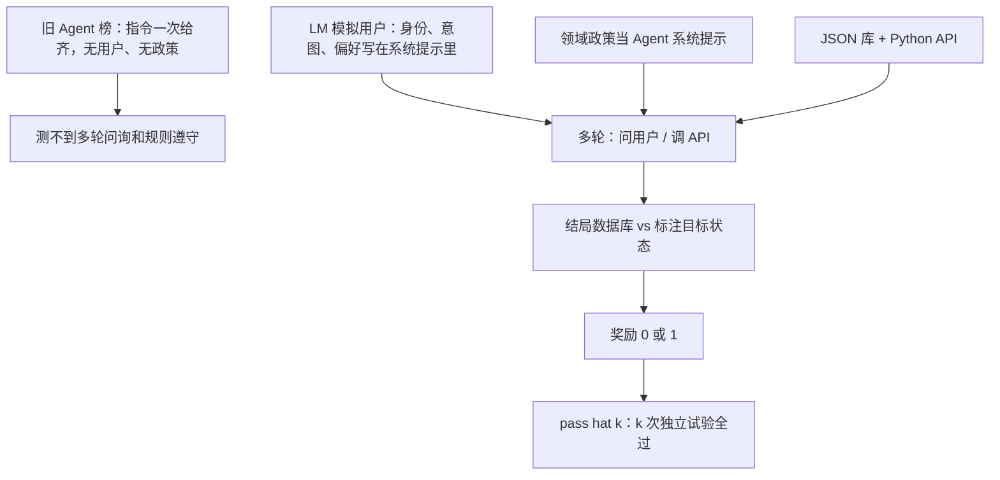

# τ-bench：旧 Agent 榜没有用户、也没有领域规则，对结局数据库状态才算过关

<!-- release-date: 2024-06-17 -->

**本文依据**：`τ-bench: A Benchmark for Tool-Agent-User Interaction in Real-World Domains`，arXiv 2406.12045v1（页眉 `[cs.AI] 17 Jun 2024`），50 页。作者 Shunyu Yao（脚注 * Work done during internship）、Noah Shinn、Pedram Razavi、Karthik Narasimhan；封面机构只印 Sierra（PDF p. 1）。封面另印 `Preprint. Under review.`，本文不补会议录用。盘上是 v1。首发日取页眉 17 Jun 2024。代码与数据封面脚注：`https://github.com/sierra-research/tau-bench`（PDF p. 1）。文中数字均标 PDF 页码；标「外部补充」的段落不来自本文。

## 一句话

当时的语言 Agent 评测多半是：题面一次给齐，Agent 自己对着网页、终端或 API 干完，**没有真人在环里问来问去，也不用读一份会卡死操作的领域政策**（PDF p. 1–2）。τ-bench（Tool-Agent-User Interaction Benchmark）把三件事绑在一起：语言模型模拟的用户、领域 API、政策文档（PDF p. 1）。对不对不看对话漂不漂亮，看对话结束时数据库是不是等于标注的目标状态；另加可选的输出子串检查（PDF p. 4）。平均成功率不够：gpt-4o 这类当时最强的函数调用 Agent 任务成功率仍 `< 50%`；零售上同一题连过 8 次的机会 `pass^8 < 25%`（摘要，PDF p. 1）。表 2 把平均拆开：gpt-4o 函数调用在 τ-retail 上 **61.2%**、τ-airline 上 **35.2%**，按域加权平均 **48.2%**（PDF p. 7 表 2）。引言里同一模型写成约 61% / 约 35%，`pass^8` 约 25%（PDF p. 2）。贯穿全文的轴不是「再堆一批工具名」，而是：**用户也要模拟、规则要当场遵守、结局状态要对齐，而且同一语义要连过多次才叫可靠。**

## 一、矛盾：旧榜把人拿掉了，也把政策拿掉了

部署到真实业务，作者列了三条硬要求（PDF p. 1–2）：

1. 和人、和程序 API 都要能多轮交互，信息是一点点凑齐的，不是开场一次给完。
2. 必须遵守该域特有的政策与规则。
3. 规模一大，行为还得稳——同一种请求、不同说法，结局不该乱跳。

图 1 用改签当例子：用户想把最近一程改到旧金山；票是基本经济舱，政策不许改，但 24 小时内可以取消再订。Agent 要先读库、对政策、再跟用户商量，最后才写库（PDF p. 2 图 1）。

旧基准（WebShop、WebArena、AgentBench、ToolEmu 一类）常见设定是：指令一次给齐，Agent 自己跟环境互动，**没有人在环里，也不用查领域指南**（PDF p. 2）。工具调用榜（BFCL、ToolBench、MetaTool）多半也是单步用户指令（PDF p. 2–3）。任务导向对话要么是静态轨迹，要么是规则/符号用户模拟，要么请真人众包；用 LM 当用户来评 Agent 可靠性，作者认为当时还没有做成（PDF p. 3）。

τ-bench 因此同时测三件事：跟（模拟）用户说话、调程序 API、按政策办事，而且还要在多次独立试验里表现一致（PDF p. 2）。

上图根据 PDF p. 1–4 图 1、第 3 节重画，是评测口径示意，不是实测曲线。

## 二、什么叫「做对了」：用户也要模拟，对的是库，不是话术

### 形式：一个 POMDP，状态拆成库和用户

每个任务写成部分可观察马尔可夫决策过程 $(S, A, O, T, R, U)$（PDF p. 3）。Agent 同时跟数据库和模拟用户打交道：

$$
S = S_{\mathrm{db}} \otimes S_{\mathrm{user}},\quad
A = A_{\mathrm{db}} \cup A_{\mathrm{user}},\quad
O = O_{\mathrm{db}} \cup O_{\mathrm{user}}
$$

政策文档可以看成对该域世界模型的部分描述（PDF p. 3）。

库状态 $s_{\mathrm{db}}$ 对 Agent 和用户都不可见，只能通过 `tool_name(**kwargs)` 读写。库上的转移是确定性的 Python 函数（PDF p. 3）。有的限制写进 API（付款 ID 不在用户档案就返回 `"Error: payment not found"`）；有的不写进 API——例如行李额按会员档和舱位变，Agent 必须自己在 `book_reservation` 里填应付件数，和真人客服一样有自由度，也一样能填错（PDF p. 3）。

用户用 **gpt-4-0613** 模拟（PDF p. 3）。用户状态是：任务指令系统提示，加上迄今的用户–Agent 对话；**看不到** Agent 与 API 的交互历史（PDF p. 3）。Agent 对用户发任意自然语言；用户转移是随机的：把 Agent 的话接到历史里，再从 LM 采一句新话。用户打出 `###STOP###`，这一局结束再计分（PDF p. 3–4）。

图 2 把四块拼起来（PDF p. 4 图 2）：

- JSON 订单条目（零售）。
- Python 工具，如 `return_delivered_order_items`、`exchange_delivered_order_items`。
- Markdown 政策摘录（已送达订单如何退、如何换）。
- 任务 JSON：用户指令 + 标注写动作 + 可选输出子串。

Agent 只能看见工具和政策，库只能间接访问。任务标注只给用户模拟和评分用（PDF p. 4）。

### 任务怎么写成「只有一个结局」

指令要钉死身份、意图、偏好，使得在该域政策下 **只有一种数据库结局**（PDF p. 4）。图 2d 的零售例：你是 80217 的 Mei Davis，要退水瓶，并把宠物床和办公椅换成最便宜的款；两件事一起说；若只能做一件，选省钱最多的，但两路能省多少都要知道；人设是欠债、难过、话极少（PDF p. 4）。标注写动作是退那只水瓶（订单 `#W2890441`、item `2366567022`、卡 `credit_card_1061405`），输出子串要含 `"54.04"`、`"41.64"`（PDF p. 4）。

一局从用户开口开始。Agent 随时可调工具、可查政策。结束时用库状态和 Agent 对用户说的话算奖励（PDF p. 4）。

### 奖励：库对了，话里还要带齐数字

一局奖励是 0/1 的乘积（PDF p. 4）：

$$
r = r_{\mathrm{action}} \times r_{\mathrm{output}} \in \{0,1\}
$$

$r_{\mathrm{action}}$：最终库是否与唯一目标库相同。$r_{\mathrm{output}}$：对用户的回复是否含全部必要信息。对话可以千变万化，只读工具也可以乱调；图 2d 要过关，写库必须恰好那一次退货调用，且用户侧回复里出现那两个金额子串（PDF p. 4）。

作者承认 $r=1$ **必要但不充分**：没经用户明确确认就退货，已经违规，这套规则奖励仍可能给 1（PDF p. 4）。好处是算得快、可复现；第 5 节显示它对当时模型已经够难（PDF p. 4）。

### pass^k：不是「k 次里中一次」，是「k 次全中」

写代码有单测时，社区用 $\mathrm{pass}@k$：k 次独立试验里至少一次成功，对应「多花推理算力去碰对」（PDF p. 4）。客服这类要稳的活，作者另定义 $\mathrm{pass}\hat{\,k}$（文中写作 pass^k / pass hat k）：**k 次独立试验全部成功** 的机会，再对任务取平均（PDF p. 4）。同一任务跑 $n$ 次、成功 $c$ 次，无偏估计是（PDF p. 5）：

$$
\mathrm{pass}\hat{\,k} = \mathbb{E}_{\mathrm{task}}\left[\frac{\binom{c}{k}}{\binom{n}{k}}\right],\qquad
\mathrm{pass}@k = 1 - \mathbb{E}_{\mathrm{task}}\left[\frac{\binom{n-c}{k}}{\binom{n}{k}}\right]
$$

同一任务上，用户提示和库转移固定，随机性来自用户和 Agent 的 LM 采样（PDF p. 5）。默认主指标是跨任务平均奖励：$\mathrm{pass}\hat{\,1}=\mathrm{pass}@1=\mathbb{E}[r]=\mathbb{E}[c/n]$（PDF p. 5）。

## 三、榜怎么造：先钉 schema，再灌数据，再把指令磨到无歧义

环境类和用户模拟类跨域共用；每个域自带 JSON 库、Python API 与文档、政策文本、任务实例（PDF p. 5）。三阶段（PDF p. 5）：

**阶段 I，人设计。** 一起设计尽量简单、但仍像真的 schema、API、政策。简单是为了各部件逻辑一致、标注好做；「最小还像真」已经要几十个 schema / API / 规则，对当时 Agent 已经难（PDF p. 5）。细节在附录 B.1。

**阶段 II，LM 灌数。** schema 定了之后给一条样例，让 gpt-4 写可规模采样的代码，人再修小 bug（PDF p. 5）。附录 B.2 整段给出零售用户库生成脚本：城市与邮编区间、名/姓表、泊松抽样付款方式；循环 `for i in range(500)` 写出 500 个用户（PDF p. 19–22）。数值、日期、舱位用随机；商品类型、姓氏这类文本从 LM 列表里抽。作者说需要的话可以采样 10,000 个用户（PDF p. 19）。

**阶段 III，人标任务并拿 Agent 跑来验。** 核心是指令必须导向唯一库结局。付款偏好不写死，用户每次答法不同，终态就会漂（PDF p. 5）。流程是：先写一版指令 → 用 gpt-4-turbo 函数调用 Agent 跑一局 → 对着轨迹改指令 → 直到确信没有歧义。附录图 7：每个 τ-retail 任务用 **超过 40** 次 gpt-4-turbo 试验，专门盯成功率为 0 或很低的题（PDF p. 5、p. 12 图 7）。写动作和输出可以从 Agent 轨迹里抄了再改，比从零标便宜（PDF p. 5）。

造数据和造任务时可能回改 schema 或政策，但三阶段大体线性，数据按模块放（PDF p. 5）。

### 两个域

客服先做两个域：τ-retail、τ-airline。选它们是因为商品/航班好合成、退换/行李规则好按常识写、任务能做杂、又贴近落地。更难的医疗、税务、法律留给以后更强的 Agent（PDF p. 5）。

表 1（PDF p. 5）：

| | τ-retail | τ-airline |
|---|---|---|
| 数据库 | 500 用户、50 商品、1,000 订单 | 500 用户、300 航班、2,000 预订 |
| API | 7 写、8 非写 | 6 写、7 非写 |
| 任务数 | 115 | 50 |

航空另写：300 航班连 20 座美国城市，时长和价格尽量像真的，工具可查直飞和一停（PDF p. 6）。

附录表 4 把工具名钉死（PDF p. 13）。零售读：`find_user_id_by_email`、`find_user_id_by_name_zip`、`list_all_product_types`、`get_order_details`、`get_product_details`、`get_user_details`。零售写：`cancel_pending_order`、`exchange_delivered_order_items`、`modify_pending_order_address` / `_items` / `_payment`、`modify_user_address`、`return_delivered_order_items`。航空读：`get_reservation_details`、`get_user_details`、`list_all_airports`、`search_direct_flight`、`search_onestop_flight`。航空写：`book_reservation`、`cancel_reservation`、`send_certificate`、`update_reservation_baggages` / `_flights` / `_passengers`。两边还有非库工具 `calculate`、`transfer_to_human_agents`（PDF p. 13）。

零售政策要点（PDF p. 5–6、附录 p. 15–17）：先用邮箱或姓名+邮编认证，即使用户已经报了 user id；一局只服务一个用户；写库前必须列出细节并拿到明确的 yes；一次最多一个工具调用，调工具时不要同时对用户说话；换货/改订单工具 **只能调一次**，要改的 item 必须先收进列表。待处理订单只能取消或改一次，已送达只能退或换一次；不能改成另一种商品。

航空政策更绕（PDF p. 6、附录 p. 17–19）：支付最多一张旅行券、一张信用卡、三张礼品卡；券余额不退；支付方式必须已在用户档案。免费托运行李按会员档 × 舱位变，超件 50 美元。保险 30 美元/人。基本经济舱不能改航班；舱位可改但整张票舱位必须一致。行李只能加不能减；保险不能后补。取消：预订 24 小时内或航司取消了都能退；否则经济舱要有保险且条件满足，商务舱随时可退；规则与会员档无关。API **不替 Agent 查这些**，调之前必须自己确认（PDF p. 18–19）。投诉取消航班且符合银/金卡或保险或商务舱，可发证明，金额 $100 × 人数；延误改签/取消则 $50 × 人数；用户没抱怨、没要补偿就不要主动给；普通会员、没保险、还飞（基本）经济舱则不赔（PDF p. 19）。

### 作者强调的四个特性

对话和工具用起来像真的，用户话是开放、自然的，尽管指令是合成的（PDF p. 6）。任务故意少而精，用多次试验加 pass^k 换洞察，不靠堆题量（PDF p. 6）。评价用唯一库结局换「又快又硬」的对错，替代又慢又吵的人评（PDF p. 6）。代码模块化，方便加域、加规则、加任务；仓库公开（PDF p. 6）。

## 四、实验：平均不到一半，连过八次更掉到四分之一以下

测的模型：OpenAI 的 gpt-4o、gpt-4-turbo、gpt-4-32k、gpt-3.5-turbo；Anthropic 的 claude-3-opus / sonnet / haiku；Google 的 gemini-1.5-pro-latest / flash-latest；Mistral 的 mistral-large、open-mixtral-8x22b；AnyScale 的 meta-llama-3-70B-instruct。后两个开权重。7/13B 因太难没测（PDF p. 6）。

主方法是 **函数调用（FC）**：系统提示=领域政策，每轮自己决定对用户说话还是调工具。除 Llama-3 外都原生支持 FC。另测文本格式 ReAct 以及只出动作的 Act。作者认为 Reflexion 这类自我反思不适合「对用户只有一次机会」；规划类方法可能太慢，赶不上实时客服（PDF p. 6）。每任务最多 **30** 步（工具或对用户说话）。表 2 每任务至少 **3** 次试验。Agent 温度 0.0，用户 1.0（PDF p. 6）。

表 2，函数调用的 $\mathrm{pass}\hat{\,1}$（Llama-3 用文本 ReAct）。平均按 **域** 加权，不按任务数加权（PDF p. 7）：

| 模型 | retail | airline | avg |
|---|---|---|---|
| gpt-4o | 61.2 | 35.2 | 48.2 |
| gpt-4-turbo | 57.7 | 32.4 | 45.1 |
| gpt-4-32k | 56.5 | 33.0 | 44.8 |
| gpt-3.5-turbo | 20.0 | 10.8 | 15.4 |
| claude-3-opus | 44.2 | 34.7 | 39.5 |
| claude-3-sonnet | 26.3 | 27.6 | 27.0 |
| claude-3-haiku | 19.0 | 14.4 | 16.7 |
| gemini-1.5-pro | 21.7 | 14.0 | 17.9 |
| gemini-1.5-flash | 17.4 | 26.0 | 21.7 |
| mistral-large | 30.7 | 22.4 | 26.6 |
| mixtral-8x22b | 17.7 | 31.6 | 24.7 |
| meta-llama-3-70B | 14.8 | 14.4 | 14.6 |

开权重建模（llama-3-70b、mistral-8x22b）与 gpt-4o、claude-3-opus 仍有明显差距。航空更难：即便 gpt-4o 也只有 35.2%（PDF p. 7）。图 7 显示零售各题难度铺得很开，适合当开发榜（PDF p. 7、p. 12）。

图 3：原生 FC 稳定好过文本 ReAct / Act；ReAct 又好过 Act，因为推理痕迹能把陌生格式的观察接到动作上。给 FC Agent 加一个 「think」 工具没有涨分，作者猜多数 FC 模型没按这种推理训过（PDF p. 7）。

图 4：k 增大，$\mathrm{pass}\hat{\,k}$ 掉得很快。gpt-4o FC 平均成功率 $> 60\%$，但零售 $\mathrm{pass}\hat{\,8}$ 掉到 `< 25\%$（PDF p. 7）。摘要把「全任务 `< 50\%$」和「零售 pass^8 `< 25\%$」写在一起（PDF p. 1）；表 2 的 48.2% 是两域加权平均，零售单域 61.2% 并不低于 50%——读摘要时不要把 48.2% 误当成零售。

成本：gpt-4o FC Agent 配 gpt-4 用户，零售上每任务约 **$0.38**（Agent）/ **$0.23**（用户）；每任务一试大约 **200** 美元（115 题这一量级）。Agent 费用里输入提示占 **95.9%**、补全占 **4.1%**，贵在长系统提示（政策 + 函数定义）（PDF p. 7）。

## 五、失败从哪来：库推不出来、规则没读懂、复合请求做一半

分析盯零售、最强基线 gpt-4o FC。抽 115 条轨迹（每任务 1 次），失败 40 条，当时 $\mathrm{pass}\hat{\,1}=65.2\%$（PDF p. 7）。4 条是用户指令错字或歧义，随后修掉；剩下 36 条是 Agent 问题（PDF p. 7）。图 5 四类比例（PDF p. 7 图 5）：

| 类型 | 占 36 条失败 |
|---|---|
| Wrong argument | 33.3% |
| Wrong info | 22.2% |
| Wrong decision | 25.0% |
| Partially resolve | 19.4% |

「参数错 + 信息错」合计约 55%（正文写约 55%，PDF p. 8）。

**参数错 / 信息错：复杂库存推理。** 该调哪类工具往往对了，槽填错。附录 C.2.2：用户要换一盏不那么亮的灯，电源优先交流适配器而不是电池或 USB；Agent 没在库存里推出唯一符合偏好的款（PDF p. 8）。更弱的模型会捏造 ID：gpt-4o FC 每个零售任务平均只有 **0.46** 次不存在的用户/商品/订单/item ID；gpt-3.5-turbo FC / Act 分别是 **2.08** / **6.34**（PDF p. 8）。「信息错」包括漏追踪号、总价算错、把错价告诉用户导致用户改主意（PDF p. 8）。

**决策错：领域规则。** 占失败的 25%。附录 C.2.1：用户要换「好几件」，政策写死换货工具只能调一次、必须先收齐列表；gpt-4o 先换一件，第二件就换不成了（PDF p. 8）。

表 3：系统提示里拿掉政策（PDF p. 8）：

| 模型 | τ-retail | τ-airline |
|---|---|---|
| gpt-4o | 61.2 → 56.8 | 33.2 → 10.8 |
| gpt-3.5 | 20.0 → 14.5 | 10.8 → 9.6 |

零售规则更近常识，gpt-4o / gpt-3.5-turbo 只掉 **4.4** / **5.5** 个百分点，作者认为成功案例多半靠常识用工具，政策文档用得不透（PDF p. 8）。航空规则更任意，拿掉政策让 gpt-4o 掉 **22.4** 个百分点，gpt-3.5-turbo 只掉 **1.2**——前者有时在跟规则，后者处理不了复杂航司规则（PDF p. 8）。注意表 3 航空 gpt-4o 基线写的是 **33.2**，表 2 是 **35.2**，原文两表不一致，本文两处都记，不擅自改成一张数。

**复合请求只做一部分（19%）。** 图 6：标注写动作越多越难（PDF p. 8）。有时开场的显式请求后面忘了；有时隐含动作漏掉——C.2.3 用户要改所有订单里的错地址，Agent 查完一单就停（PDF p. 8）。

附录 C.2、D.2 是完整轨迹：零售失败三类各一题，航空 Task 0 是一条成功轨迹（PDF p. 23 起、p. 目录 D.2）。正文不逐句复述对话。

## 六、讨论：模拟用户会犯错，责任仍在 Agent

模拟用户的限制（PDF p. 8–9）：指令可能有错字歧义，标注员可改；指令不必含全部领域知识——C.2.1 里用户批准了单件换货，并不知道 Agent 只能发一次换货，这反而像真用户；用户 LM 在推理、计算、长上下文、对齐指令上也会失手，C.2.2 里用户没复核灯的规格就批准了推荐款。作者说这些都可以改进，也可以看成真实世界技能参差，**把多样化用户接住是 Agent 的义务**（PDF p. 9）。

还可以给模拟器加更系统的唯一结局检查；政策可以再贴近真业务；成功定义可以加 LM 查规则。人工标注难，且用 gpt-4-turbo FC 来打磨用户提示会引入隐式偏见。作者不认为本文有直接负面社会影响，但承认它在帮真实世界 Agent，那些系统以后会对经济和社会有后果（PDF p. 9）。

对 Agent 的判断很硬：叠在 LM 函数调用上的 Agent，一致性和守规则都还不够撑可靠应用；长程信息跟踪、记忆、以及上下文里有冲突事实时盯对那一块，都要补（PDF p. 9）。

相关工作（第 2 节）把工具榜、任务导向对话、LM 用户模拟三条线分开写，结论仍是：以前没有用这种模拟来基准 Agent 的可靠性（PDF p. 2–3）。参考文献与 NeurIPS 式清单占 p. 9–12，清单自称实验报了误差条、算力类型（PDF p. 11）；正文第 5 节没有单独一张误差表，图 4 的多次试验是一致性曲线。致谢 Clay Bavor、Honghua Dong、Yangjun Ruan、Nate White（PDF p. 9）。

## 七、对自己项目有什么用

1. **用户必须进环。** 工具调用对了不等于客服过关。题面一次给齐的榜，测不到「先问邮编、再问要换哪几件、写库前要 yes」。
2. **对结局状态，不对话术。** 把「唯一合法写库」写进标注，对话可以随机。$r=1$ 仍可能漏掉「没确认就写库」；若产品红线是确认，要在奖励之外另加规则检查。
3. **报告 $\mathrm{pass}\hat{\,k}$，不要只报平均。** 平均 60% 和连过 8 次不到 25%，是两种产品故事。客服不能靠「再滚一次」。
4. **政策有的进 API，有的故意不进。** 进 API 的是硬约束；不进的（行李额、取消窗口）才是在考 Agent。自己做域评测时，不要把所有规则都写成 `return "Error"`，否则测不到读文档。
5. **写库工具限次，是在考「先收齐再动手」。** 换货只能一次，和「复合请求做一半」是同一类病。
6. **少题 × 多试验。** 115+50 题，零售每题 >40 次用来找坏标注。质量换数量。
7. **数字停在 v1 表 2。** 后来的 τ-bench 变体、刷榜分数不写进这篇。

## 八、关键词回看

- **τ-bench**：工具–Agent–用户交互基准；用户模拟 + API + 政策。
- **τ-retail / τ-airline**：零售 115 题、航空 50 题。
- **结局数据库对齐**：终态等于标注目标库才给 $r_{\mathrm{action}}=1$。
- **pass^k（pass hat k）**：k 次独立试验全部成功的机会；与 $\mathrm{pass}@k$（至少一次）相反。
- **函数调用 Agent**：系统提示=政策，每轮选对用户说话或调工具。
- **政策不进 API 的那部分**：必须由 Agent 自己执行的领域规则。

## 参考资料

- 原论文：arXiv [2406.12045](https://arxiv.org/abs/2406.12045)（v1，2024-06-17）
- 代码与数据（封面脚注）：[github.com/sierra-research/tau-bench](https://github.com/sierra-research/tau-bench)
