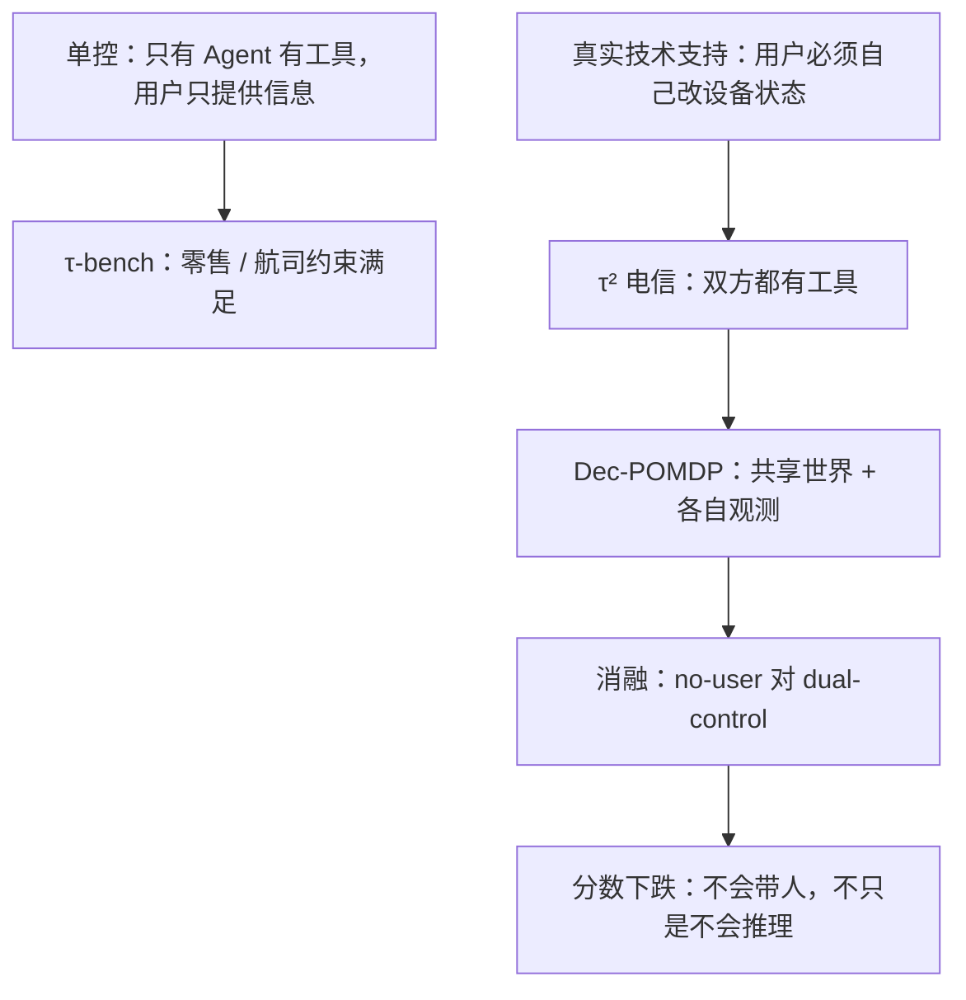

# τ²-Bench：用户也能动手用工具时，榜从「会推理」变成「会带人」

<!-- release-date: 2025-06-09 -->

**本文依据**：`τ²-Bench: Evaluating Conversational Agents in a Dual-Control Environment`，arXiv 2506.07982v1（页眉 `[cs.AI] 9 Jun 2025`），47 页。封面印 `Preprint. Under review.`，本文不补会议录用。作者 Victor Barres（Sierra）、Honghua Dong（Sierra & University of Toronto & Vector Institute，* Equal contribution，实习脚注）、Soham Ray（Sierra）、Xujie Si（University of Toronto & Vector Institute）、Karthik Narasimhan（Sierra）（PDF p. 1）。盘上是 v1。首发日取页眉 9 Jun 2025。代码与数据封面写明 `https://github.com/sierra-research/tau2-bench`（PDF p. 1）。文中数字均标 PDF 页码；标「外部补充」的段落不来自本文。对照 τ-bench 只作前作口径，不把那篇实验写成本篇结果。

## 一句话

现有对话 Agent 评测几乎都是 **单控**：只有 Agent 能调工具改世界，用户只负责说偏好和目标（PDF p. 1）。真实技术支持不是这样——用户要自己重启、关飞行模式、看状态栏。τ²-bench 加一个 **电信双控域**：Agent 和用户各有工具，共享会变的环境，形式化成 Dec-POMDP（PDF p. 1）。任务由原子子题组合生成，全集 **2285**、评测抽样 **114**（PDF p. 5、表 1 p. 5）。用户模拟器被工具和可观察状态拴住，电信域总错误率 **16%**、关键错误 **6%**，低于零售 **40%/12%**、航司 **47%/13%**（表 2 p. 10）。主实验：gpt-4.1 在零售/航司 pass^1 为 **74%/56%**，电信新任务掉到 **34%**；o4-mini **42%**，claude-3.7-sonnet **49%**（PDF p. 2、第 4.2 节 p. 7）。从 **no-user**（Agent 独控全部工具）切到双控，pass^1 再掉约 **20** 个百分点（gpt-4.1 **18**、o4-mini **25**）（PDF p. 2、p. 8）。轴不是「再出一套客服题」，而是：**用户也能动手时，失败到底来自不会推理，还是不会带人。**

## 一、矛盾：用户只会说话时，测不到「带人干活」

对话 Agent 评测一直在测两件事：跟用户把话说清楚，以及按对动作序列把活干完（PDF p. 1）。τ-bench 的零售、航司就是这一路：约束来自域策略加上用户的信念、目标和偏好；用户对 Agent 能干什么的理解，写在精心打磨的自然语言指令里，保证约束满足题有一条可解路径（PDF p. 1）。

代价是用户只能通过对话感知 Agent 的动作，环境状态也只能从初始指令里推理（PDF p. 1–2）。技术支持不是这样：客服让你重启、关飞行模式，你必须真的去按（PDF p. 2）。

双控把这件事收进评测：LLM 模拟的用户除了说话，也能调工具、改共享世界（PDF p. 2）。好处有几条：可以选择性藏信息、可以非语言地改环境、用户任务可以用结构化工具而不是一长段自然语言来指定（PDF p. 2）。

难处是 **复杂度不对称**：用户要有真实能动性，但又不能自己就把题解了，否则评测测的是用户模拟器而不是 Agent（PDF p. 2）。作者的做法是：用户工具只吐人能读的输出；用户规划压成「Agent 让干什么再干什么」的反应式调用；行为被环境状态钉死（PDF p. 2）。测的是：**既要想清楚，又要把用户带到该按的键上。**

上图根据 PDF p. 1–3、第 4.2 节重画，是评测口径示意，不是实测曲线。

## 二、形式化：Dec-POMDP，不是「两个聊天机器人」

第 3 节把双控写成 Decentralized Partially Observable Markov Decision Process（分散式部分可观察马尔可夫决策过程，Dec-POMDP）（PDF p. 4）。元组是 $(S, \{A_i\}, \{O_i\}, T, R, U, M)$，$i \in \{\text{agent}, \text{user}\}$（PDF p. 4）。人话是：两个人各看各的、各动各的，世界却是同一个。

- **消息空间 $M$**：自然语言。用户可以说「我用不了移动数据」，Agent 可以回「飞行模式开了吗？」（PDF p. 4）。
- **状态 $S = S_{\text{world}} \otimes S_{\text{history}}$**，$S_{\text{world}} = S_{\text{db,agent}} \otimes S_{\text{db,user}}$。电信里 Agent 库是 CRM（客户、线路），用户库是手机状态（PDF p. 4）。
- **动作**：每回合只有一方动；要么调自己库上的工具，要么发一条消息（PDF p. 4）。Agent 可 `get_customer_by_id`，用户可 `toggle_airplane_mode`（PDF p. 4）。
- **观测**：每回合只有一方收到观测——工具返回，或对方发来的消息（PDF p. 4）。
- **转移 $T$**：调工具可能改 $S_{\text{world}}$；发消息则对方观测到该消息；历史两边都记（PDF p. 4）。Agent 的 `enable_roaming` 改线路漫游；用户关飞行模式改手机状态（PDF p. 4）。
- **奖励 $R: S \to [0,1]$**：看最终世界和历史是否满足任务。电信里「没移动数据」修好没有，查的是用户库（PDF p. 4）。
- **指令空间 $U$**：用户模拟的情景，以及 Agent 必须遵守的域策略（PDF p. 4）。

图 2 给了一条轨迹：用户看状态栏发现数据关着，Agent 让他打开数据；后来 Agent 查线路发现漫游没开，远端打开之后用户侧才能漫游（PDF p. 5 图 2）。要点是：**用户回不回得了「我看了状态栏」不靠提示词演戏，而靠 mocked 手机的真实状态。**

这和「多智能体合作基准」不是同一题。作者承认可以把双方看成多智能体，但最终只评 Agent 能不能从用户那里问出该问的、做出该做的；不对称是故意的（PDF p. 3–4）。场景可以合作（排障）、可以竞争（谈套餐），也可以混着来，还要能消化用户失误（PDF p. 4）。

表 1 三个域的规模（PDF p. 5）：

| | 零售 | 航司 | 电信 |
|---|---|---|---|
| Agent 库 | 500 用户、50 商品、1,000 订单 | 500 用户、300 航班、2,000 预订 | 5 套餐、9 条线路、4 客户 |
| Agent 工具 | 7 写、6 读 | 6 写、6 读 | 6 写、7 读 |
| 用户工具 | — | — | 15 写、15 读 |
| 任务数 | 115 | 50 | 114（全集 2285） |

零售、航司没有用户工具，仍是单控；双控是电信这一域新加的（表 1 p. 5）。电信库很小（4 个客户），难的不是 CRM 规模，是双方动作要配上。

## 三、题怎么造：原子子题拼起来，对错可以程序验

造域分五步，LLM 起草、人改到单测过（PDF p. 5–6）：

1. Agent 的库模式和工具：先出 PRD，再生成实现、mock 库、单测。电信是客户 CRM 加线路管理（PDF p. 5）。
2. 用户的库和工具：mock 手机，信号、飞行模式等（PDF p. 5）。
3. **组合式造题**（下面展开）。
4. 按题和标准解让 LLM 写域策略，排障常按意图逐步走（PDF p. 6）。
5. 工具、策略、原子子题一起手修（PDF p. 6）。

相对 τ-bench，还可以给任务挂 **Persona**。电信随机抽 None / Easy / Hard：None 不给画像；Easy 比较熟域；Hard 技术知识低（PDF p. 6、附录 A.1 p. 14–15）。Easy 是 41 岁行政、日常会用手机但不是发烧友；Hard 是 64 岁退休图书管理员，主要打电话、发短信、给孙辈拍照，VPN/APN 会慌（PDF p. 14–15）。这是提示词画像，不是另训一个用户模型。

### 原子块：初始化、解、断言

每个原子子题 $t$ 是一套函数三件套（PDF p. 5）：

$$
t = \bigl(\{f_{t,k}^{\mathrm{init}}\}, \{f_{t,k}^{\mathrm{sol}}\}, \{f_{t,k}^{\mathrm{assert}}\}\bigr)
$$

- **初始化**：把世界弄坏。例如 `set_airplane_mode(True)`（PDF p. 5）。
- **解**：必须是 Agent 或用户真正有的工具。对应上面可以是 `toggle_airplane_mode()`（PDF p. 5）。
- **断言**：终态要满足的条件，例如服务已连通（PDF p. 6）。

初始化、断言可以是库上任意函数；解必须落在双方工具集里（PDF p. 6）。互斥或互为替代的子题放同一组；组合任务从每组最多抽一个，把函数串起来（PDF p. 6）。正确性自动验两件事：先 init 再 sol 之后断言全过；sol 没走完则过不了（PDF p. 6）。

电信做了 **15** 组原子子题，对应三个越来越难的意图：`service_issue`、`mobile_data_issue`、`mms_issue`（PDF p. 6）。程序组合得到 **2285** 题，再抽 **114** 题，在意图和子题个数上尽量均衡（PDF p. 6、表 3 p. 14）。子题个数当难度代理：诊断和修复步更多（PDF p. 6）。

表 3 抽样（PDF p. 14）：

| 子题数 | service | mobile_data | mms | 合计 |
|---|---|---|---|---|
| 2 | 9 | 8 | 8 | 25 |
| 3 | 9 | 8 | 9 | 26 |
| 4 | 9 | 6 | 6 | 21 |
| 5 | 2 | 6 | 5 | 13 |
| 6 | — | 5 | 6 | 11 |
| 7 | — | 3 | 5 | 8 |
| 8 | — | — | 4 | 4 |
| 9 | — | — | 6 | 6 |
| 合计 | 29 | 36 | 49 | 114 |

表 4：解所需动作数，service 均值 **2.31**（1–8），mobile_data **4.31**（2–8），mms **6.00**（2–12）（PDF p. 14）。难度层级写在正文：service 常能独立用一串动作解掉；mobile_data / mms 往往要先查、先修底下的 service（PDF p. 9）。

附录给了样例任务 ID `[service_issue]airplane_mode_on|unseat_sim_card`：电话显示 No Service，已知自己是 John Smith、号码 555-123-2002（PDF p. 15）。这是组合式造题的可读形态：意图加若干原子故障。

### 什么叫做对了

可用标准包括：DB check、状态断言、自然语言断言、通信信息检查、动作匹配（PDF p. 6）。DB check 和通信信息检查与 τ-bench 相同（PDF p. 6）。状态断言用预定义断言函数查 $S_{\text{world}}$；自然语言断言查 $S_{\text{history}}$，例如「Agent 诊断出了原因」；动作匹配要求每条 $f^{\mathrm{sol}}$ 都出现在轨迹里（PDF p. 6）。**电信只用断言函数**（PDF p. 6）。所以这域的对错钉在用户侧世界状态上，不靠对话像不像。

## 四、实验怎么跑

API 走 Litellm（PDF p. 6）。四个模型：`gpt-4.1-mini-2025-04-14`、`gpt-4.1-2025-04-14`、`o4-mini-2025-04-16`、`claude-3-7-sonnet-20250219`（PDF p. 6）。用户模拟器固定 `gpt-4.1-2025-04-14`（PDF p. 6）。每题跑 **四** 次，温度 **0**（PDF p. 6）。双方都是 function-calling；工具用 OpenAI tools 格式（PDF p. 6）。Agent 提示 = 通用指南 + 域策略；用户提示 = 通用指南 + 任务指令（PDF p. 6）。

gpt-4.1 对 gpt-4.1 用户时，每题平均费用 Agent **$0.086** / 用户 **$0.059**；三域各跑 1 trial 大约 **$40**（PDF p. 7）。这是作者记账，不是榜的一部分。

指标沿用 τ-bench 的 **pass^k**：k 次独立运行全部成功的比例（PDF p. 3）。本文实验自己跑零售、航司、电信；零售/航司数字是本篇复测，不要当成 τ-bench 原文表格。

## 五、主结果：电信更难，而且 k 一大更不稳

图 3 三域 pass^k（PDF p. 7）。正文归纳：电信整体更低。gpt-4.1 的 pass^1 从零售 **74%**、航司 **56%** 掉到电信 **34%**（PDF p. 7）。gpt-4.1-mini、o4-mini、claude-3.7-sonnet 电信 pass^1 约 **50%**；claude 电信 **49%** 和航司持平，但 k 增大时电信掉得比航司快（PDF p. 7）。引言同一组数：gpt-4.1 **34%**、o4-mini **42%**、claude-3.7-sonnet **49%**（PDF p. 2）。图 3 上还能读到若干 pass^k 点，例如 gpt-4.1 电信 k=1 **0.34**、k=2 **0.26**、k=3 **0.22**、k=4 **0.19**；claude 电信 k=1 **0.49**、k=4 **0.25**（PDF p. 6–7 图 3）。读榜以正文归纳加图注为准，图是柱上数字。

### 三种模式：把「不会想」和「不会带」切开

电信再切三档（PDF p. 7）：

1. **Default**：双控，双方合作。
2. **No-User**：给 Agent 一张工单（问题摘要 + 成功标准），**所有工具包括用户那侧都归 Agent**，不跟用户说话。只测推理和调工具。
3. **Oracle Plan**：把双方该调的工具序列直接给 Agent，减轻推理，专看能不能带着用户把已知计划执行完。

图 4 左是原策略，右是更细的 workflow 策略（PDF p. 8）。原策略（图 4 左）pass^1：

| 模式 | gpt-4.1 | o4-mini |
|---|---|---|
| default | 0.34 | 0.42 |
| no-user | 0.52 | 0.67 |
| oracle-plan | 0.73 | 0.96 |

Oracle 比 Default 高，说明推理负担真实存在；o4-mini 吃标准解吃得更狠（0.42 → 0.96）（PDF p. 8）。**No-User → Default**：gpt-4.1 掉 **18** 个百分点，o4-mini 掉 **25** 个百分点（PDF p. 8）。引言约 **20%** pass^1，与这两刀一致（PDF p. 2）。这是全文最该记住的数：**同一套题，把用户工具收走、让 Agent 自己按，分数立刻回去一截；加回「要开口让用户按」，又掉下去。**

Workflow 策略（图 4 右）在 Default / No-User 上略升：default 约 **0.52 / 0.59**，no-user **0.68 / 0.72**；Oracle 反而受伤：**0.57 / 0.88**（PDF p. 8 图 4）。作者假设：计划已经在手里，再塞一份流程会打架（PDF p. 8）。这是观察，不是消融证明「workflow 一定有害」。

### 动作更长、子题更多，双控和独控一起掉

图 5 按所需动作数、子题数分箱（PDF p. 8）。`transfer` 是必须转人工、Agent 单独解不了的特例（PDF p. 8）。Default 下动作 **> 7** 时分数接近 0；No-User 整体更高，但差距从大约 **0.3–0.4** 收到 **<0.2**（PDF p. 8）。长程可靠性两边都差，沟通不是唯一瓶颈（PDF p. 8）。No-User 尾巴上（10 个动作及以上）gpt-4.1 反而比 o4-mini 好（PDF p. 8）。子题数增加时同样往下，No-User 仍高于 Default（PDF p. 9）。作者把这当成造题设计有效：加动作、拼子题就能把难度拧上去（PDF p. 9）。

### 意图：service 容易，mms 难

图 6 按三种 issue 拆 pass^k（PDF p. 9）。所有模型在 mobile_data、mms 上失败更多；多阶段推理和条件分支是硬点（PDF p. 9）。模型之间 splatter 不一样：claude-3.7-sonnet 在 mobile_data 上好于 o4-mini，在 service 上更差（PDF p. 9）。图上 gpt-4.1 的 service pass^1 约 **0.66**，mobile_data 约 **0.30**，mms 约 **0.18**；o4-mini 的 mms pass^1 约 **0.12**（PDF p. 9 图 6）。这些是图上读数，分层结论以正文为准。

### Persona：Easy 更好；None 并不比 Hard 好

图 7：Easy 好于 Hard；None 往往与 Hard 持平或更差（PDF p. 9）。作者据此说上线前要用定义清楚的用户画像来测（PDF p. 9）。gpt-4.1 图上 Easy pass^1 约 **0.39**，None **0.28**，Hard **0.36**（PDF p. 10 图 7）——None 低于 Hard，和「持平或更差」这句一致。这是模拟器提示条件，不是真实用户实验。

## 六、用户模拟器：工具拴住之后，乱演变少

可靠性的噪声来源三块：实现错误、任务规格错误、用户模拟器错误；后一块常被前两块搅浑，所以先处理实现和规格，再评模拟器（PDF p. 9，细节在附录 B）。

评测：gpt-4.1 同时当 Agent 和用户，人工标轨迹；每段对话两名标注员（PDF p. 10）。对照用户指南、该段用户指令、用户工具（若有）、完整轨迹（PDF p. 10）。四条：是否守模拟器指南、是否守用户指令、工具用没用对、对话是否自然连贯（PDF p. 10）。错误分 **task-critical**（高严重、题做不完，例如意图和目标对着干、不可恢复的状态转移）和 **task-benign**（不挡完成）（PDF p. 10）。

表 2（PDF p. 10）：

| 域 | 对话数 | 关键错误 | 良性错误 | 合计 |
|---|---|---|---|---|
| airline | 100 | 13（13%） | 34（34%） | 47（47%） |
| retail | 50 | 6（12%） | 14（28%） | 20（40%） |
| telecom | 50 | 3（6%） | 5（10%） | 8（16%） |

引言同一口径：电信 **16%** 错误、**6%** 关键，对比零售 **40%/12%**（PDF p. 2）。表题另写「New telecom domain shows much lower error rate and no critical errors were reported」（表 2 p. 10）——与表内 **3（6%）** 关键错误矛盾。读数以表内单元格和引言为准，表题那句当作笔误，不另编「零关键错误」。

作者把提升归到域设计：少靠自然语言规定行为，多靠界面和动作空间把模拟器推进合法交互（PDF p. 10）。结论仍说工作没做完：还没把「给用户加精选工具」搬回航司和零售（PDF p. 11）。

## 七、和前作、相关工作怎么接

第 2 节把 τ-bench 定为直接前作：多轮任务型客服、守域规则、pass^k（PDF p. 3）。后续有 FlowBench（把工作流知识打进提示）、IntellAgent（从策略图合成测试、用 τ-bench 当外部金标）、APIGen-MT（为 τ-bench 微调工具 Agent）、ToolSandbox（有状态工具）（PDF p. 3）。本文把范式推到 **双方都能改共享世界**（PDF p. 3）。用户模拟文献里，多数在给模拟器加监督；本文强调用环境本身约束行为（PDF p. 3）。

这些是定位，不是本篇实验。零售/航司分数是 τ² 框架下的复测。

## 八、限制、社会影响、没写的

结论三条未完成（PDF p. 11）：

1. 用户模拟器还要改进；工具约束还没送回旧域。
2. 扩域仍重度依赖人类专家；工业要当标准，需要更自动的域策展。
3. **没显式建模专家–新手鸿沟**：面对新手，专家要猜对方的心智模型再改解释方式。作者认为这是后续方向，τ² 只是起点（PDF p. 11）。

Broader Impact：标准化评测有助于公开对比和协作；本文本身未必有直接负面社会影响，但会助推真实世界 Agent，经济与社会后果多样，因此 Agent 必须能安全地与人协作（PDF p. 13）。这是立场段，不是实验结果。

没写的（报告未公开就保持缺口）：训练新模型、把双控搬到零售/航司的数字、真实人类用户对照、会议录用。封面是 preprint under review（PDF p. 1）。

## 九、可迁移的几条

1. **评「会用工具的客服」时，问一句用户有没有手。** 用户只能说话，测到的是约束满足和话术；用户能改世界，才测得到协调。
2. **用环境约束模拟器，比把说明书写得更长更稳。** 电信关键错误低于零售/航司，作者归因于工具和状态，不是更大的基模（表 2 p. 10）。
3. **消融要能切开推理和沟通。** No-User vs Default 比单看一张总分有用：同一模型可以「自己能修、带人就不会」。
4. **组合式造题：原子故障 + 程序验断言。** 难度旋钮是子题个数和动作长度，不必手写每一条轨迹。
5. **Oracle 再塞一份 workflow 可能减分。** 计划已经在手里时，第二份流程会抢控制权（PDF p. 8）。自己写 Agent 策略时，标准解和操作手册不要同时当硬约束。
6. **Persona=None 不是中性对照。** 本实验里它并不比 Hard 好（PDF p. 9）。

## 关键词

**双控（dual-control）**：Agent 和用户都能用工具改共享世界，区别于用户只提供信息的单控。

**Dec-POMDP**：双方各有动作和观测、世界同一套转移；用来写技术支持这种必须协调的场景。

**复杂度不对称**：用户有能动性，但能力被工具输出和反应式规划压住，仍然需要 Agent。

**组合式造题**：原子子题的 init / sol / assert 组合；对错用断言函数程序验证。

**pass^k**：k 次独立运行全部成功的比例，用来看稳不稳而不只看一次运气。

**No-User / Default / Oracle Plan**：独控全部工具、双控合作、把标准动作序列交给 Agent——用来拆推理失败和沟通失败。

**task-critical / task-benign 用户错误**：会不会让任务彻底做不完。

## 参考资料

- 本文 PDF：`readings/_src/评测与 Benchmark/tau2-bench.pdf`（arXiv:2506.07982v1）
- 代码与数据（封面）：[github.com/sierra-research/tau2-bench](https://github.com/sierra-research/tau2-bench)
- 前作 τ-bench（参考文献 [26]，不当作本篇实验）：Yao et al., arXiv:2406.12045
- Dec-POMDP 引文 [15]：Oliehoek & Amato, *A concise introduction to decentralized POMDPs*
