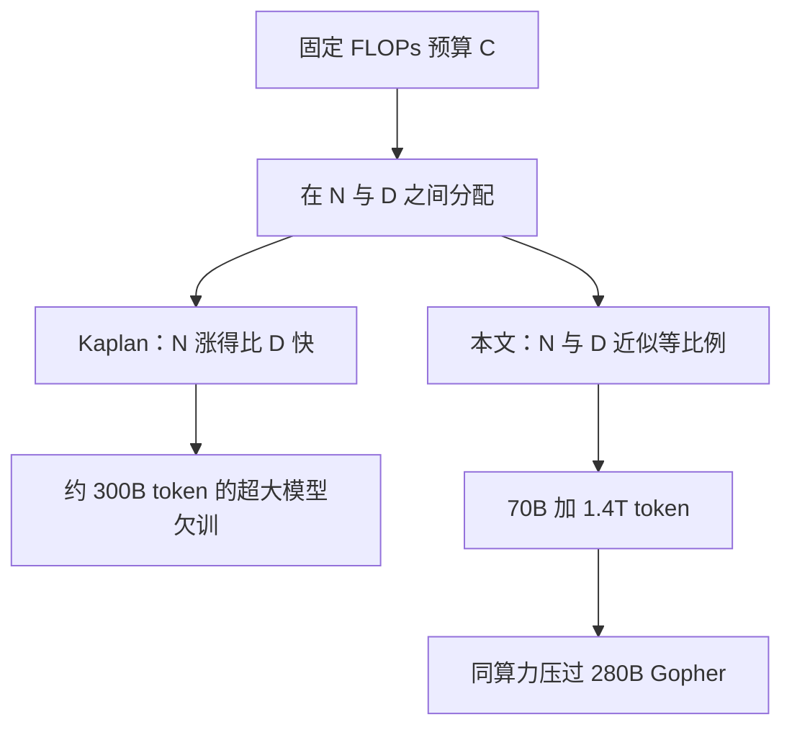

# Chinchilla：算力固定时，参数与 token 要等比例放大

<!-- release-date: 2022-03-29 -->

**本文依据**：`Training Compute-Optimal Large Language Models`，arXiv:2203.15556v1 [cs.CL] 29 Mar 2022，A4，36 页。共同一作按封面顺序为 Jordan Hoffmann、Sebastian Borgeaud、Arthur Mensch、Laurent Sifre；通讯邮箱为 `@deepmind.com`；页脚印 **© 2023 DeepMind**。封面无编号高校行、未印会议名。文中数字均标 PDF 页码；标「外部补充」的段落不来自本文。

## 一句话

Kaplan 等人（2020）把算力涨 10 倍时，建议模型大约放大 5.5 倍、训练 token 只放大 1.8 倍。于是 GPT-3、Gopher、Jurassic-1、MT-NLG 几乎都卡在大约 300B token，只把参数越堆越大（PDF p. 1–2、表 1）。这篇用 400 多座 70M–16B 的 Transformer，在 5B–500B token 上扫出另一条前沿：算力最优时，**参数量与训练 token 应等比例放大**——模型翻倍，token 也翻倍（PDF p. 1）。按 Gopher 同一算力预算，最优模型应小约 4 倍、数据大约 4 倍。他们训了 **Chinchilla：70B 参数、1.4 万亿 token**（表 1，PDF p. 3）。下游上它全面压过 280B 的 Gopher、175B 的 GPT-3、178B 的 Jurassic-1 和 530B 的 MT-NLG。MMLU 5-shot 平均准确率表 6 为 **67.6%**（相对 Gopher 的 60.0% 提高 7.6 个百分点）；摘要写 67.5%、相对 Gopher「大于 7%」，以表格为准（PDF p. 1、p. 11）。模型更小，微调与推理也更便宜。

它解决的不是「再堆一层 Transformer」，而是 **2020–2022 年那条已经把大模型当默认、却把数据量钉死的路：同一笔 FLOPs，宁可把模型做小、把数据训够。**

## 一、封面实验：同一笔 FLOPs，该拿去买参数还是买 token？

训练大语言模型的算力和能耗随模型变大而涨。实务里预算往往事先知道：有多少加速器、打算跑多久。这种规模通常只能训一次，超参估错代价极大（PDF p. 1）。

Kaplan 等人给出参数量与损失的幂律，并主张：大模型不必训到最低损失才算算力最优。本文同意「不要训到收敛」，但估计 **token 该远多于他们建议的数量**。算力涨 10 倍时，Kaplan：模型 ×5.5、token ×1.8；本文：两者近似等比例（PDF p. 1）。

表 1 把当时最大的稠密 Transformer 钉在同一页（PDF p. 3）：

| 模型 | 参数 | 训练 token |
|---|---:|---:|
| LaMDA | 137B | 168B |
| GPT-3 | 175B | 300B |
| Jurassic | 178B | 300B |
| Gopher | 280B | 300B |
| MT-NLG 530B | 530B | 270B |
| Chinchilla | 70B | 1.4T |

除 LaMDA 外，大家都在大约 300B token 附近只放大模型。Chinchilla 反过来：参数约 Gopher 的四分之一，数据约 4 倍。

把问题写成约束优化。最终预训练损失记为 $L(N,D)$，$N$ 是参数量，$D$ 是见过的训练 token。算力 $C=\mathrm{FLOPs}(N,D)$ 由二者确定。要在 $\mathrm{FLOPs}(N,D)=C$ 下最小化 $L$（PDF p. 2 式 1）：

$$
N_{\mathrm{opt}}(C),\; D_{\mathrm{opt}}(C)=\arg\min_{N,D:\,\mathrm{FLOPs}(N,D)=C} L(N,D)
$$

经验估计来自 400 多座模型：参数从不足 70M 到超过 16B，token 从 5B 到超过 400B（摘要写 5–500B；引言写 5B–400B 以上，以扫参段落为准），每种配置多个训练地平线。分析在无限数据近似下用平滑训练损失当测试损失的无偏估计——训练 token 少于语料总量（PDF p. 2 脚注 2）。

图 1 把三种拟合法与 Kaplan 投影叠在一起：当前大模型都应更小、训更久。绿点标出 Chinchilla（70B）相对 Gopher（280B）、GPT-3、MT-NLG（PDF p. 2）。

按估计的算力最优前沿，Gopher 那笔预算应对应 **小 4 倍的模型、多 4 倍的 token**。他们用 70B、1.4T token 去验。更小还意味着推理更便宜，能在更小硬件上做下游；训练能耗会摊到推理与微调上，所以「训得更优的小模型」收益不止预训练那一次（PDF p. 2）。

把因果链摊开（机制示意，根据 PDF p. 1–2 图 1 与式 1 重画，不是实测时间轴）：

**旧问题 → 新设计 → 机制 → 收益 → 代价。** 旧问题是把 Kaplan 的「多加参数、少加数据」当成工程默认。新设计是把 $L(N,D)$ 在固定 FLOPs 上扫清楚。收益是同算力更强、推理更便宜。代价是要先训几百个中小模型，并且外推到万亿参数仍有不确定性。

可迁移：预算已知时，先问「这笔 FLOPs 对应的最优 $N$ 和 $D$」，不要默认「能装多大就装多大」。

## 二、和 Kaplan 差在哪：学习率日程与模型尺度

相关工作分三块（PDF p. 3–4）。

**大模型。** 稠密 Transformer 已过 500B；MoE（Switch 1.7T、GLaM 1.2T 等）用更少训练/推理 FLOPs 换有效容量。作者认为再放大仍依赖 **更高质量、更大规模的数据**（PDF p. 3）。

**标度行为。** Kaplan 用固定训练 token 数和固定学习率日程拟合所有模型，因此无法把这两个超参对损失的影响建进去。本文发现：把余弦日程的长度调到大约等于目标 token 数，最终损失最好，与模型大小无关（图 A1，PDF p. 3、p. 22）。若日程固定对 130B token 衰减，中间点 $D_0\ll 130\mathrm{B}$ 的损失会高估「按 $D_0$ 匹配日程」的模型；用这些中间损失会 **低估短数据训练的效率**，从而推出「算力增加时模型应比数据涨得更快」。本文还用到 16B 参数，并看到 FLOP–损失前沿有轻微弯曲（附录 E）；拟合里大多数模型超过 500M，而 Kaplan 的多数 run 远小于 100M（PDF p. 3）。

Clark 等人（2022）看 MoE 的专家数标度，同样固定 token，可能低估分支带来的改进（PDF p. 3–4）。

**其他超参。** 本文只扫模型大小与训练步数；学习率、batch、优化器、深宽比靠已有启发式。硬件上他们用略浅于 Levine 等人建议的深度，换墙钟（PDF p. 4）。检索增强（如 RETRO 把见到的数据大约放大 10 倍）也暗示性能可能比原先想的更依赖数据规模。

## 三、三种拟合法，三条几乎重合的等比例线

第 3 节用三种做法回答同一句话：固定 FLOPs，参数与 token 怎么换。都先训一族改变 $N$ 和 $D$ 的模型，再拟合经验标度。假定算力与模型大小仍是幂律（Clark、Kaplan 同款）；大模型处可能弯曲，留给后续。三种预测接近，都说 **参数与 token 应随算力近似等比例增加**，指数见表 2。FLOPs 算法见附录 F（PDF p. 4）。

图 2 左是全部训练曲线：70M–10B，每个大小四个余弦周期长度。从中抽出每个 FLOP 的最低损失包络，再估最优模型大小（中）与最优 token 数（右）。绿色投影用 Gopher 的 $5.76\times 10^{23}$ FLOPs（PDF p. 5）。

### 3.1 做法 1：固定模型大小，改训练 token 数

固定一族 70M–10B 以上的模型，每个大小训 4 个不同序列数；学习率在地平线上衰减 10 倍，地平线跨 16 倍。平滑并插值训练曲线，得到每条 run 的 FLOP→损失。对每个 FLOP，取最低损失的那条，从而得到 $C\mapsto(N,D)$。在 1500 个对数均匀的 FLOP 点上取最优 $N$ 与所需 $D$，再拟合 $N_{\mathrm{opt}}\propto C^a$、$D_{\mathrm{opt}}\propto C^b$，得到 **$a=0.50$、$b=0.50$**（PDF p. 5）。选中的点都在训练最后 15% 内，支持「训 $D$ 个 token 时，余弦应在大约 $D$ 上衰减 10 倍」（PDF p. 5 脚注 4）。附录 D.4 在 $10^{21}$ FLOPs 上对打：做法 1 预测 2.86B，Kaplan 预测 4.68B；实训 2.80B 对 4.74B，前者结束时损失更低（PDF p. 26–27）。

### 3.2 做法 2：IsoFLOP 剖面

固定 9 档训练 FLOPs（$6\times 10^{18}$ 到 $3\times 10^{21}$），改模型大小（做到 16B），只看最终训练损失。token 数由模型大小与目标 FLOPs 决定；余弦长度与 token 对齐（PDF p. 5）。图 3 左每条 IsoFLOP 曲线都有清楚的损失谷。对每条拟合抛物线定位谷底，再拟合幂律：**$a=0.49$、$b=0.51$**（PDF p. 6）。绿色同样标 Gopher 预算下的最优 $N$ 与 $D$。

### 3.3 做法 3：参数化损失

把做法 1 与 2 的最终损失拟成（PDF p. 6 式 2）

$$
\hat L(N,D)=E+\frac{A}{N^\alpha}+\frac{B}{D^\beta}
$$

三项分别是：理想生成过程在数据分布上的损失（接近自然语言熵）；容量为 $N$ 的完美训练 Transformer 相对理想过程的落后；有限步、有限样本带来的未收敛。用 Huber 损失（$\delta=10^{-3}$）在 $\log\hat L$ 与观测 $\log L$ 之间做 L-BFGS，网格初始化防局部极小。Huber 抗离群点，对留出点预测很重要（PDF p. 6）。

在 $\mathrm{FLOPs}(N,D)\approx 6ND$ 约束下最小化 $\hat L$，得到闭式前沿（PDF p. 7 式 4）：

$$
N_{\mathrm{opt}}(C)=G\left(\frac{C}{6}\right)^a,\quad
D_{\mathrm{opt}}(C)=G^{-1}\left(\frac{C}{6}\right)^b
$$

其中 $G=(\alpha A/\beta B)^{1/(\alpha+\beta)}$，$a=\beta/(\alpha+\beta)$，$b=\alpha/(\alpha+\beta)$。拟合得 **$a=0.46$、$b=0.54$**。图 4 左是等损失等高线，蓝线是高效前沿；按此把 Gopher 预算投到 **40B 参数**（PDF p. 7）。附录 D.2 拟合后的经验形式为 $E=1.69$、$A=406.4$、$B=410.7$，$\alpha\approx 0.34$，$\beta\approx 0.28$，两者都低于 $1/2$（PDF p. 25）。

### 3.4 三条线放在一起

表 2（PDF p. 8；括号为 bootstrap 的第 10/90 百分位，80% 子样本抽 100 次）：

| 做法 | $a$（$N_{\mathrm{opt}}\propto C^a$） | $b$（$D_{\mathrm{opt}}\propto C^b$） |
|---|---|---|
| 1. 训练曲线最小 | 0.50（0.488, 0.502） | 0.50（0.501, 0.512） |
| 2. IsoFLOP | 0.49（0.462, 0.534） | 0.51（0.483, 0.529） |
| 3. 参数化损失 | 0.46（0.454, 0.455） | 0.54（0.542, 0.543） |
| Kaplan et al. (2020) | 0.73 | 0.27 |

做法 1 与 2 的最优模型大小几乎重合；做法 3 在更大算力上预测更小的模型。低 FLOPs（$C\leqslant 10^{21}$）残差更大，Huber 自动把它们当离群点，再叠上 $C\mapsto N_{\mathrm{opt}}$ 的负弯曲（附录 E），于是 $N_{\mathrm{opt}}$ 更低（PDF p. 7–8）。

表 3 是做法 1 的投影（PDF p. 8；表内 67B 那一行 Tokens 写 1.5 Trillion，与后文 Chinchilla 的 70B / 1.4T 不是同一格）：

| 参数 | FLOPs | 相对 Gopher | Tokens |
|---|---|---|---|
| 400M | $1.92\times 10^{19}$ | 1/29,968 | 8.0B |
| 1B | $1.21\times 10^{20}$ | 1/4,761 | 20.2B |
| 10B | $1.23\times 10^{22}$ | 1/46 | 205.1B |
| 67B | $5.76\times 10^{23}$ | 1 | 1.5T |
| 175B | $3.85\times 10^{24}$ | 6.7 | 3.7T |
| 280B | $9.90\times 10^{24}$ | 17.2 | 5.9T |
| 520B | $3.43\times 10^{25}$ | 59.5 | 11.0T |
| 1T | $1.27\times 10^{26}$ | 221.3 | 21.2T |
| 10T | $1.30\times 10^{28}$ | 22515.9 | 216.2T |

正文另有一处口径：175B 应对应 $4.41\times 10^{24}$ FLOPs、超过 4.2T token；280B 级模型约 $10^{25}$ FLOPs、6.8T token。没有 $10^{26}$ FLOPs（超过 Gopher 的 250 倍），1T 参数模型不太可能最优（PDF p. 8）。附录 C 在 C4 与 GitHub 上重复 IsoFLOP：C4 的 $a=b=0.50$，GitHub $a=0.53$、$b=0.47$，结论同类，前提是不超过一个 epoch（PDF p. 8、p. 23 表 A2）。

做法 2/3 的投影见表 A3（PDF p. 26）。注意做法 3 在 175B 一行的 FLOPs（$1.26\times 10^{24}$）小于 67B 一行（$1.71\times 10^{24}$），与「更大模型需要更多算力」的单调直觉冲突，文中未解释，当作表内数字原样保留。

**可迁移：** 三种独立拟合同向，比单条幂律更可信；但外推几个数量级时，弯曲意味着你可能仍在 **高估** 大模型的最优尺寸。

## 四、Chinchilla：用 Gopher 的 FLOPs 训 70B × 1.4T

第 3 节把 Gopher 预算的最优大小放在 40B–70B。他们取区间上端 70B、1.4T token——出于数据集与计算效率（PDF p. 9）。与 Gopher 同 FLOPs，只换 $N$ 与 $D$。小 4 倍则显存与推理成本也大约小 4 倍。

### 4.1 架构与 recipe

除下列差异外，架构与训练设置同 Gopher（PDF p. 9 表 4）：

| | 层 | 头 | K/V 维 | $d_{\mathrm{model}}$ | 最大学习率 | batch（token） |
|---|---:|---:|---:|---:|---|---|
| Gopher 280B | 80 | 128 | 128 | 16,384 | $4\times 10^{-5}$ | 3M → 6M |
| Chinchilla 70B | 80 | 64 | 128 | 8,192 | $1\times 10^{-4}$ | 1.5M → 3M |

前馈恒为 $4\times d_{\mathrm{model}}$。两者都在训练中途把 batch 加倍。

其余差异（PDF p. 9）：

- 仍用 MassiveText，但子集采样略改（表 A1）以消化更多 token。
- 优化器从 Adam 换成 AdamW，改善语言建模损失与微调后下游；AdamW 大约到余弦周期 80% 才追上 Adam，终点明显更好（图 A7）。
- SentencePiece 不做 NFKC 归一化，词表 94.15% 与 Gopher 相同，数学与化学表示更好。
- 前向/反向用 bfloat16，分布式优化器状态里存一份 float32 权重（ZeRO）。

全部分析模型在 TPUv3/TPUv4 上用 JAX 与 Haiku 训练。模型卡见表 A8（PDF p. 9）。附录 G 用 680M 对照：AdamW + 高精度优化器副本明显好于 Gopher 那套；417M 与 1.4B 上也是 AdamW 更好（PDF p. 28–29）。

表 A1 的 MassiveText 构成（括号内为 Gopher 的采样比例；右列为 1.4T token 对应的 epoch 数）（PDF p. 22）：

| 子集 | 磁盘 | 文档 | 采样 | 1.4T 内 epoch |
|---|---|---|---|---|
| MassiveWeb | 1.9 TB | 604M | 45%（48%） | 1.24 |
| Books | 2.1 TB | 4M | 30%（27%） | 0.75 |
| C4 | 0.75 TB | 361M | 10%（10%） | 0.77 |
| News | 2.7 TB | 1.1B | 10%（10%） | 0.21 |
| GitHub | 3.1 TB | 142M | 4%（3%） | 0.13 |
| Wikipedia | 0.001 TB | 6M | 1%（2%） | 3.40 |

MassiveWeb 与 Wikipedia 超过一个 epoch。模型卡写词表大小 32,000（PDF p. 33）。

评测任务与 Gopher 大体对齐（表 5，PDF p. 10）：语言建模 20、阅读理解 3、问答 3、常识 5、MMLU 57、BIG-bench 62。细节同 Rae et al. (2021)。

## 五、下游：同算力，小模型全面压过大模型

### 5.1 语言建模

The Pile 各子集上 Chinchilla 的 bits-per-byte 相对 Gopher 全面下降（图 5，PDF p. 10）。相对 Jurassic-1（178B），只在 `dm_mathematics` 与 `ubuntu_irc` 两子集落后（表 A5，PDF p. 10、p. 30）。WikiText-103 困惑度 7.16 对 Gopher 的 7.75。作者提醒：多 4 倍数据可能有训练/测试泄漏，因此更看重泄漏更少的 MMLU、BIG-bench、闭卷问答和常识（PDF p. 10–11）。

表 A5 摘若干 bpb（越低越好）（PDF p. 30）：

| 子集 | Chinchilla 70B | Gopher 280B | Jurassic-1 170B |
|---|---:|---:|---:|
| pile_cc | 0.667 | 0.691 | 0.669 |
| github | 0.337 | 0.377 | 0.358 |
| arxiv | 0.627 | 0.662 | 0.680 |
| dm_mathematics | 1.111 | 1.142 | 1.037 |
| ubuntu_irc | 1.026 | 1.090 | 0.857 |
| gutenberg_pg_19 | 0.548 | 0.656 | 0.890 |

（表头写 Jurassic-1 170B，正文写 178B，以表 1 的 178B 为模型规格，表 A5 数字仍按该表。）

### 5.2 MMLU

表 6 是 57 项 5-shot 平均（PDF p. 11）：

| | 准确率 |
|---|---:|
| 随机 | 25.0% |
| 人类平均评分者 | 34.5% |
| GPT-3 5-shot | 43.9% |
| Gopher 5-shot | 60.0% |
| Chinchilla 5-shot | 67.6% |
| 人类专家平均 | 89.8% |
| 2022-06 预测 | 57.1% |
| 2023-06 预测 | 63.4% |

人类预测来自 73 名竞赛预测者（Steinhardt, 2021）。Chinchilla 超过对 2023-06 SOTA 的 63.4% 预测。四个单科超过 90%：`high_school_gov_and_politics`、`international_law`、`sociology`、`us_foreign_policy`；作者称当时没有其他模型在任一子集超过 90%（PDF p. 11）。图 6：51/57 项更好，2/57 持平，4/57 更差（`college_mathematics`、`econometrics`、`moral_scenarios`、`formal_logic`）（PDF p. 11–12）。分科数字见表 A6（PDF p. 31），例如 sociology 91.0% 对 84.1%，us_foreign_policy 92.0% 对 81.0%，college_mathematics 32.0% 对 37.0%。

### 5.3 阅读理解

表 7（PDF p. 12）：

| | Chinchilla | Gopher | GPT-3 | MT-NLG 530B |
|---|---:|---:|---:|---:|
| LAMBADA zero-shot | 77.4 | 74.5 | 76.2 | 76.6 |
| RACE-m few-shot | 86.8 | 75.1 | 58.1 | — |
| RACE-h few-shot | 82.3 | 71.6 | 46.8 | 47.9 |

RACE 两项相对 Gopher 都提高超过 10 个百分点。GPT-3 / MT-NLG 在 RACE 上 prompt 格式不同，不可比。

### 5.4 BIG-bench

同一批 62 项：平均 65.1% 对 Gopher 的 54.4%，提高 10.7 个百分点。仅 4 项更差：`crash_blossom`、`dark_humor_detection`、`mathematical_induction`、`logical_args`（PDF p. 11–12）。分项见表 A7（PDF p. 35），例如 `odd_one_out` 70.9% 对 32.5%，`dark_humor_detection` 66.2% 对 83.1%，`crash_blossom` 47.6% 对 63.6%。

### 5.5 常识与 TruthfulQA

表 8 zero-shot（PDF p. 13）：

| | Chinchilla | Gopher | GPT-3 | MT-NLG 530B | 有监督 SOTA |
|---|---:|---:|---:|---:|---:|
| HellaSwag | 80.8% | 79.2% | 78.9% | 80.2% | 93.9% |
| PIQA | 81.8% | 81.8% | 81.0% | 82.0% | 90.1% |
| Winogrande | 74.9% | 70.1% | 70.2% | 73.0% | 91.3% |
| SIQA | 51.3% | 50.6% | — | — | 83.2% |
| BoolQ | 83.7% | 79.3% | 60.5% | 78.2% | 91.4% |

除 PIQA 与 MT-NLG 持平/略低外，全面不低于 Gopher/GPT-3；相对 530B 只在 PIQA 落后。TruthfulQA：Chinchilla 0/5/10-shot 为 43.6%、58.5%、66.7%；Gopher 0-shot 29.5%、10-shot 43.7%。0-shot 提高 14.1 个百分点。作者认为这与 Lin 等人「更好拟合预训练数据也难抬 TruthfulQA」的发现形成对照：单靠更好的预训练建模也能大幅提高（PDF p. 13）。

### 5.6 闭卷问答

表 9（PDF p. 14）：

| 数据 | 设定 | Chinchilla | Gopher | GPT-3 | 开卷 SOTA |
|---|---|---:|---:|---:|---:|
| Natural Questions (dev) | 0-shot | 16.6% | 10.1% | 14.6% | |
| | 5-shot | 31.5% | 24.5% | — | 54.4% |
| | 64-shot | 35.5% | 28.2% | 29.9% | |
| TriviaQA（未过滤，test） | 0-shot | 67.0% | 52.8% | 64.3% | |
| | 5-shot | 73.2% | 63.6% | — | |
| | 64-shot | 72.3% | 61.3% | 71.2% | |
| TriviaQA（过滤，dev） | 0-shot | 55.4% | 43.5% | — | |
| | 5-shot | 64.1% | 57.0% | — | 72.5% |
| | 64-shot | 64.6% | 57.2% | — | |

Natural Questions 闭卷 5-shot 31.5%、64-shot 35.5% 为文中所称新 SOTA（相对 Gopher 的 21% 与 28%——正文这对整数与表 9 的 24.5%/28.2% 不完全一致，**以表 9 为准**）（PDF p. 13–14）。过滤版 TriviaQA 距开卷 SOTA（Izacard & Grave, 2020）差 7.9 个百分点（64.6% 对 72.5%）。

### 5.7 性别偏见与毒性

风险预期与 Gopher 类似：同一语料、相近架构。评估不全面（PDF p. 13–14）。

Winogender 零样本共指（表 10，PDF p. 15）：全体 78.3% 对 71.4%；男性 71.2% 对 68.0%（+3.2）；女性 79.6% 对 71.3%（+8.3）；中性 84.2% 对 75.0%（+9.2）。gotcha（正确解析与职业刻板印象相反）上女性 gotcha +10%（76.7% 对 66.7%）。更好，但不均匀，说明算力更优不等于偏见均匀消失。

无提示毒性：各抽 25,000 条，PerspectiveAPI。Gopher 均值（中位数）0.081（0.064），Chinchilla 0.087（0.066）；95 分位 0.230 对 0.238。差异可忽略。与 Gopher 文结论一致：无条件生成的毒性大体独立于语言建模损失（PDF p. 15）。

## 六、讨论：限制、数据质量、别的模态

趋势是模型越来越大、token 钉在约 300B。MT-NLG 530B 已是两年前 GPT-3 约 170B 的三倍以上，token 仍相当。作者的假设：抢着训更大模型，会在同一算力下明显欠训（PDF p. 15）。

限制（PDF p. 15–16）：

1. 大尺度上只有 Chinchilla 与 Gopher 两次可比训练，没有中间尺度的额外检验。
2. 假定高效前沿是 $C$、$N$、$D$ 之间的幂律；高算力处 $\log N_{\mathrm{opt}}$ 有凹性（附录 E），可能仍在高估大模型最优尺寸。
3. 分析几乎都在不足一个 epoch；多 epoch 留给后续。

尽管如此，Chinchilla 对 Gopher 的对比支撑了预测。下一步应更重视 **数据集放大**，且只有高质量数据才值得继续放大。万亿 token 会放大泄漏、毒性、偏见与隐私问题，需要更强的数据审查。Chinchilla 仍有偏见与毒性，但看起来比 Gopher 受影响更小；性能与毒性如何互动仍是开放问题（PDF p. 16）。

方法针对自回归语言模型，但作者预期其他模态也有类似的「模型大小对数据量」权衡。方法容易在新设定里复现（PDF p. 16）。

模型卡补充：不公开权重；主要用户是 DeepMind 研究者；英语数据；未做交叉身份偏见分析；考虑过过滤毒性但因可能引入新偏见而放弃（Welbl et al., 2021）（PDF p. 31–34）。

## 七、附录里还要带走的工程细节

**余弦周期。** 周期明显长于目标步数会伤最终损失。超过目标 25% 就有清楚掉点。10× 衰减略好于衰减到 0；只衰减 5× 明显更差（图 A1，PDF p. 22）。做法 1 最大学习率：最小模型 $2\times 10^{-4}$，最大 $1.25\times 10^{-4}$；高斯平滑窗 10 步（PDF p. 24）。

**FLOPs。** 计入嵌入矩阵的训练 FLOPs 与参数。乘加因子 2。反向按 Kaplan 记为前向的两倍。与 $C=6ND$ 的比值在 73M–6.8B 上约 0.99–1.10（表 A4）。相对 Gopher 文，更精确的计算给出 $6.3\times 10^{23}$ 对文中分析用的 $5.76\times 10^{23}$（PDF p. 27–28）。

**弯曲。** 图 A5 用前沿的前/中/后三分之一分别拟合，投影不同。本文未把弯曲写进主结论（PDF p. 27）。

**扫过的模型。** 表 A9 列出约 44M–16.2B 的宽深配置，许多模型用多种日程/token 数重复训练（PDF p. 36）。

## 八、没写什么、以及可以带走的判断

报告没有公开：Chinchilla 的墙钟、芯片数、完整超参网格、权重与推理栈。大尺度没有第三座对照模型。表 3 与正文对 175B/280B 的 token 投影（3.7T 对「超过 4.2T」、5.9T 对 6.8T）不完全同一套数，应视为不同做法或四舍五入，不要合成一个「官方最优 token」。

被实验撑住的结论：在他们扫到的尺度上，**等比例放大 $N$ 与 $D$** 三次拟合同向；用 Gopher 预算训 70B × 1.4T，下游全面优于 280B × 300B。只是观察的：前沿弯曲、AdamW 在周期后段才反超、毒性几乎不随损失下降。未公开因而无法核实的：大规模多 epoch、中间尺度的第三次对照、把做法 3 的 40B 投影也训出来。

可迁移、且不依赖 TPU 集群的几条：

1. 预算已知时，先定 $(N,D)$，再开工；余弦长度对齐目标 token，超了 25% 就会白训。
2. 不要用「固定日程上的中间 checkpoint」去拟合最优数据量——那会系统性地惩罚短数据。
3. 同算力下更小的模型，收益会在推理与微调上再收一次。
4. 外推时盯弯曲：幂律可能仍在让你把模型做太大。

## 关键词回看

- **算力最优（compute-optimal）**：固定 FLOPs 预算下，使预训练损失最低的 $(N,D)$。
- **等比例标度**：本文 $N_{\mathrm{opt}}\propto C^{0.50}$、$D_{\mathrm{opt}}\propto C^{0.50}$ 量级，对照 Kaplan 的 0.73 / 0.27。
- **IsoFLOP**：固定总 FLOPs、改 $N$，用损失谷定位最优模型。
- **Chinchilla**：70B、1.4T token、与 Gopher 同 FLOPs 的检验模型。
- **欠训（under-trained）**：参数已经很大，但 token 远少于该算力对应的 $D_{\mathrm{opt}}$。

## 参考资料

- 本文 PDF：`readings/_src/语言基模/Chinchilla.pdf`（arXiv:2203.15556v1）。
- 文内引用的 Kaplan et al. (2020) *Scaling Laws for Neural Language Models*、Rae et al. (2021) Gopher，均非本稿原件。
