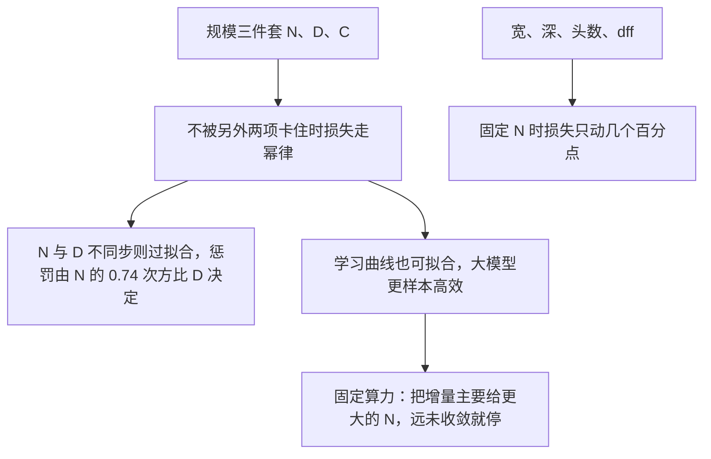

# Kaplan Scaling Laws：交叉熵按参数、数据、算力走幂律，算力最优是训很大的模型并提前停

<!-- release-date: 2020-01-23 -->

**本文依据**：`Scaling Laws for Neural Language Models`，arXiv:2001.08361v1 [cs.LG] 23 Jan 2020，letter，30 页。共同一作 Jared Kaplan（Johns Hopkins University, OpenAI）与 Sam McCandlish（OpenAI）；封面第一作者机构行逗号前是 Johns Hopkins University。封面页眉印该 arXiv 行，未印会议名。文中数字均标 PDF 页码；标「外部补充」的段落不来自本文。

## 一句话

语言建模的交叉熵损失，在不被另外两项卡住时，分别对非嵌入参数量 $N$、数据集大小 $D$、以及按临界批大小校正后的最小训练算力 $C_{\min}$ 呈幂律（PDF p. 4 式 1.1–1.3）。趋势可跨六个数量级以上的 $N$、八个数量级的 $C_{\min}$、两个数量级以上的 $D$（PDF p. 4）。宽深比、头数、前馈宽度在固定 $N$ 时几乎不动损失（PDF p. 3、p. 8 图 5）。固定算力预算时，最优做法是把大部分增量花在更大的模型上，数据按 $D \propto C^{0.27}$ 慢增，并在远未收敛时停训（PDF p. 3、p. 5）。

它解决的不是「再换一种 Transformer 形状」，而是 **2019–2020 年那种默认：把小模型训到收敛、把数据线性甚至超线性配给参数。** 本文把主矛盾钉成：形状不重要，规模三件套要一起涨；算力最优训练比「训到收敛」更样本高效。

## 一、封面实验：损失随 $N$、$D$、$C$ 光滑下降

语言任务天花板高、地板低，作者用它把趋势拉到七个数量级以上的尺度（PDF p. 2）。对象是自回归语言建模的交叉熵（nats），主架构是 decoder-only Transformer（PDF p. 2、p. 6）。

图 1 把测试损失对三件东西各画一条曲线：训练算力（PF-days，不含嵌入）、数据集 token 数、非嵌入参数量。三条都是光滑幂律；最优表现要求三者一起放大。单独放大其中一项、另两项卡住时，曲线会弯（PDF p. 3 图 1）。

贯穿全文的因果链可以先摊开（机制示意，根据 PDF p. 3 图 1、p. 4 图 3 重画，不是实测时间轴）：

记号（PDF p. 6）：

- $L$：交叉熵，nats，通常对 1024 token 上下文取平均。
- $N$：不含词表嵌入与位置嵌入的参数量。
- $D$：数据集 token 数。
- $C \approx 6NBS$：非嵌入训练算力估计，$B$ 为批大小，$S$ 为参数更新步数。1 PF-day $= 10^{15} \times 24 \times 3600 = 8.64 \times 10^{19}$ 次浮点运算。
- $C_{\min}$、$S_{\min}$：若在远小于 / 远大于临界批大小 $B_{\mathrm{crit}}$ 处训练，达到同一损失所需的最小算力与最少步数。

$N$ 故意去掉嵌入。图 6 左把嵌入算进总参数，深度会额外搅趋势；右图去掉嵌入后，不同深度塌到一条曲线，只有少于 2 层或极端深宽比明显偏离（PDF p. 8 图 6）。

## 二、方法：WebText2、Adam、以及 $C \approx 6N$ 每 token

数据是 WebText 的扩展版 WebText2：Reddit 外链（2017 年 12 月前，加 2018 年 1–10 月，至少 3 karma），Newspaper3k 抽正文。20.3M 文档，96 GB 文本，$1.62 \times 10^{10}$ 词（`wc`），BPE 词表 $n_{\mathrm{vocab}}=50257$，得到 $2.29 \times 10^{10}$ token，留 $6.6 \times 10^{8}$ 做测试。还在 Books Corpus、Common Crawl、英文维基、公开互联网书籍上测（PDF p. 6–7）。

主指标是 1024 token 上下文上的自回归对数似然。默认 decoder-only Transformer；对照训了 LSTM 与 Universal Transformer（PDF p. 6）。

形状超参：$n_{\mathrm{layer}}$、$d_{\mathrm{model}}$、$d_{\mathrm{ff}}$、$d_{\mathrm{attn}}$、$n_{\mathrm{heads}}$。标准设定 $d_{\mathrm{attn}}=d_{\mathrm{ff}}/4=d_{\mathrm{model}}$ 时（PDF p. 6 式 2.1）

$$
N \approx 12 n_{\mathrm{layer}} d_{\mathrm{model}}^{2}
$$

前向每 token 约 $C_{\mathrm{forward}} \approx 2N + 2 n_{\mathrm{layer}} n_{\mathrm{ctx}} d_{\mathrm{model}}$。当 $d_{\mathrm{model}} \gg n_{\mathrm{ctx}}/12$ 时，上下文相关项相对小，训练算力按反向约两倍前向，估成每训练 token $C \approx 6N$（PDF p. 6–7 表 1）。附录 C 提醒：很大 $n_{\mathrm{ctx}}$（$n_{\mathrm{ctx}} \gtrsim 12 d_{\mathrm{model}}$）时这项估计会偏（PDF p. 22）。

训练默认 Adam，$2.5 \times 10^{5}$ 步，批 512 条、每条 1024 token（即多数实验 $B=2^{19}$ token）。超过 10 亿参数改 Adafactor。学习率：3000 步线性 warmup 再余弦衰减到零；收敛结果大体不依赖日程（PDF p. 7、p. 25 图 22）。经验学习率（PDF p. 26 式 D.1）

$$
\mathrm{LR}(N) \approx 0.003239 - 0.0001395 \log(N)
$$

对 $N > 10^{10}$ 会坏掉；作者说对本文模型够用。

扫描范围（PDF p. 7）：$N$ 从 768 到 15 亿非嵌入参数；$D$ 从 2200 万到 230 亿 token；上下文多数 1024；也扫过更短上下文与批大小以测 $B_{\mathrm{crit}}$。

## 三、形状几乎不重要，$N$ 才是主轴

图 5：固定非嵌入 $N$，只改 $d_{\mathrm{ff}}/d_{\mathrm{model}}$、深宽比 $d_{\mathrm{model}}/n_{\mathrm{layer}}$、或注意力头维 $d_{\mathrm{model}}/n_{\mathrm{head}}$，损失只动几个百分点。深宽比可差 40 倍：$(n_{\mathrm{layer}}, d_{\mathrm{model}})=(6,4288)$ 的损失与 GPT-2 用的 $(48,1600)$ 相差不到 3%。约 22% 额外算力可补偿 1% 损失上升（PDF p. 8 图 5）。作者猜想深层 Transformer 像 ResNet 那样表现得像浅模型的集成（PDF p. 8）。

扫过的形状从 $(2,128)$ 到十亿级，包括 $(6,4288)$ 与 $(207,768)$。在完整 WebText2 上训到接近收敛，除最大模型外几乎看不到过拟合（PDF p. 8）。

无限数据、训到收敛时（PDF p. 4 式 1.1、p. 8 式 3.1）

$$
L(N)=(N_c/N)^{\alpha_N},\quad \alpha_N \approx 0.076,\quad N_c \approx 8.8 \times 10^{13}
$$

（非嵌入参数）。幂指数决定收益：参数加倍，损失乘 $2^{-\alpha_N}=0.95$（PDF p. 4）。$N_c$、$D_c$、$C_c^{\min}$ 依赖词表与分词，没有基本物理含义（PDF p. 4）。

图 23 把幂律与对数形式对比，$L(N)$ 定性上幂律更好（PDF p. 26）。拟合时去掉仅 1 层的小模型，也去掉尚未充分收敛的最大模型；加回去参数只轻微变，外推两边仍稳（PDF p. 26）。

### 3.1 LSTM：前面的 token 跟得上，后面跟不上

图 7：同一数据、同一上下文长度。LSTM 在上下文靠前的位置上与 Transformer 相当，后面的位置差开。Transformer 在整段 1024 上都继续降损失；LSTM 在不到 100 个 token 后趋于平台（PDF p. 9 图 7）。附录 D.5 还给了按位置 $T$ 的幂律；更大模型指数更大，说明更能用更少上下文认出模式（PDF p. 25）。

Universal Transformer 复用参数：对同等 $N$ 略好，对同等 FLOP 略差（PDF p. 9、p. 23–24 图 17）。

### 3.2 换分布：几乎只跟训练分布损失走

图 8 左：只在 WebText2 上训，在 Internet Books、Books、Wikipedia、Common Crawl 上测，损失随 $N$ 平行下降，相对 WebText2 只有缓慢增大的常数偏移（PDF p. 10）。右图：换分布表现几乎只取决于训练分布损失，不取决于训了多久、离不离收敛。附录 D.8 固定约 15 亿参数扫深度，泛化也不跟深度走（PDF p. 10、p. 26 图 24）。12 层模型在 Internet Books 上过拟合，图上给的是早停点；作者写没在别的实验里再看到（PDF p. 27）。

## 四、只放大 $D$ 或只放大 $C$

固定形状 $(n_{\mathrm{layer}}, n_{\mathrm{embd}})=(36,1280)$，在 WebText2 的固定子集上训，测试损失不再降就停。得到（PDF p. 4 式 1.2、p. 9 式 3.2）

$$
L(D)=(D_c/D)^{\alpha_D},\quad \alpha_D \approx 0.095,\quad D_c \approx 5.4 \times 10^{13}
$$

（token）。

固定批大小时，对给定 $C=6NBS$ 扫不同 $N$，取该步上最好的模型，经验拟合（PDF p. 9 式 3.3、附录表 5）

$$
L(C)=(C_c/C)^{\alpha_C},\quad \alpha_C \approx 0.057,\quad C_c \approx 1.6 \times 10^{7}
$$

（PF-days）。脚注：真正该拿来外推的是按临界批校正的 $L(C_{\min})$，二者由式 5.5 相连（PDF p. 4）。

## 五、过拟合的普遍形式：$L(N,D)$

式 1.1 与 1.2 合在一起，建议数据亚线性跟随模型：$D \propto N^{\alpha_N/\alpha_D} \sim N^{0.74}$（PDF p. 5）。作者给出同时依赖 $N$ 与 $D$ 的一条公式（PDF p. 5 式 1.5）

$$
L(N,D)=\Bigl[\bigl(N_c/N\bigr)^{\alpha_N/\alpha_D}+D_c/D\Bigr]^{\alpha_D}
$$

选这个函数的三条原则（PDF p. 10）：① 换词表只应整体缩放损失，$N_c$、$D_c$ 跟着缩放；② $D$ 固定、$N\to\infty$ 应回到 $L(D)$，反之回到 $L(N)$；③ 在 $D=\infty$ 处应对 $1/D$ 有整数次幂展开（理论最弱的一条，来自过拟合与数据集方差 $\propto 1/D$）。对称写法没有 $1/D$ 整数展开，还要多一个参数（PDF p. 11）。

全部模型用 10% dropout，跟踪测试损失、不再降就停。四参数拟合（PDF p. 11 表 2）：

| 参数 | $\alpha_N$ | $\alpha_D$ | $N_c$ | $D_c$ |
|---|---|---|---|---|
| 值 | 0.076 | 0.103 | $6.4 \times 10^{13}$ | $1.8 \times 10^{13}$ |

与第 3 节只拟合 $L(N,\infty)$ 或 $L(\infty,D)$ 时的 $N_c$、$D_c$ 略有差别，这是作者明文写的（PDF p. 11）。数据砍到约 $2 \times 10^{7}$ token（缩小 1024 倍）时拟合变差：一 epoch 只有 40 次参数更新，过拟合来得极早（PDF p. 11、p. 23 图 16）。

过拟合程度 $\delta L \equiv L(N,D)/L(N,\infty)-1$ 几乎只依赖组合 $N^{\alpha_N/\alpha_D}/D$（PDF p. 11 图 9、式 4.3）。随机种子带来的损失起伏约 0.02；要训到离收敛不超过这个阈值、避免过拟合，需要（PDF p. 12 式 4.4）

$$
D \gtrsim (5 \times 10^{3})\, N^{0.74}
$$

小于 $10^9$ 参数的模型可以在 220 亿 token 的 WebText2 上几乎不过拟合；最大模型会有轻微过拟合。作者强调：这通常不是算力最优配比，也没有在扫 $N$、$D$ 时重调正则（PDF p. 12）。

图 16 右：3 亿参数模型在不同子集上，测试损失先跟着无限数据曲线走，再分开。用 $L_{\mathrm{test}}-L_{\mathrm{train}}$ 会显著高估相对无限数据极限的过拟合（PDF p. 23）。

## 六、训练时间：$B_{\mathrm{crit}}$ 只跟损失走

沿用大批判练文献：存在临界批大小 $B_{\mathrm{crit}}$。$B$ 加到 $B_{\mathrm{crit}}$ 之前，算力效率几乎不掉；$B>B_{\mathrm{crit}}$ 则收益递减。梯度噪声尺度能粗预测 $B_{\mathrm{crit}}$，且二者不直接依赖模型大小，只通过已达到的损失（PDF p. 12）。

训到固定损失 $L$ 时，步数 $S$ 与处理过的样本数 $E=BS$ 满足（PDF p. 13 式 5.1）

$$
\bigl(S/S_{\min}-1\bigr)\bigl(E/E_{\min}-1\bigr)=1
$$

$B_{\mathrm{crit}}=E_{\min}/S_{\min}$。在临界批上训，大约用 $2S_{\min}$ 步、处理 $2E_{\min}$ 个样本，是时间与算力的折中（PDF p. 13）。图 18 对 3M 与 85M 两个模型、许多损失水平验证了这条关系（PDF p. 24）。

图 10：$B_{\mathrm{crit}}(L)$ 与模型大小无关，只跟损失走；损失每降约 13%，$B_{\mathrm{crit}}$ 约翻倍。拟合（PDF p. 5 式 1.4、p. 13 式 5.3）

$$
B_{\mathrm{crit}}(L)=B_*/L^{1/\alpha_B},\quad B_* \approx 2 \times 10^{8}\ \text{token},\ \alpha_B \approx 0.21
$$

最大能训的模型在收敛附近，理想批大约 100–200 万 token（PDF p. 3）。参数化让 $L\to 0$ 时 $B_{\mathrm{crit}}$ 发散，因为自然语言熵非零、$L_{\min}>0$，但实验里还远没碰到 $L_{\min}$（PDF p. 13）。

用它把固定 $B=2^{19}$ 的步数折成「若 $B \gg B_{\mathrm{crit}}$」的 $S_{\min}$，以及「若 $B \ll B_{\mathrm{crit}}$」的 $C_{\min}$（PDF p. 13 式 5.4–5.5）。

无限数据、过了 warmup 之后（PDF p. 5 式 1.6、p. 13 式 5.6、表 3）

$$
L(N,S_{\min})=(N_c/N)^{\alpha_N}+(S_c/S_{\min})^{\alpha_S}
$$

$\alpha_N=0.077$，$\alpha_S=0.76$，$N_c=6.5 \times 10^{13}$，$S_c=2.1 \times 10^{3}$。图 4 右与图 11：固定算力或固定步数时，每个预算对应一个最优 $N$。很小 $S$ 时拟合差，因为幂律学习曲线在训练极早期不成立（PDF p. 5、p. 14）。作者猜测 $\alpha_S$ 的普适性反映 Hessian 特征值密度大致不随模型大小变（PDF p. 14）。

数据有限时，早停步的下界（PDF p. 14 式 5.7）

$$
S_{\mathrm{stop}}(N,D) \gtrsim S_c / [L(N,D)-L(N,\infty)]^{1/\alpha_S}
$$

有限 $D$ 的测试损失降得更慢，真实 $S_{\mathrm{stop}}$ 会更大。图 16 左把这条下界叠在经验早停上（PDF p. 23）。

## 七、固定算力怎么分：大部分给 $N$

图 1 的算力曲线用了固定批。按 $B_{\mathrm{crit}}$ 校正后得到更干净的 $L(C_{\min})$（PDF p. 15 图 13）

$$
L(C_{\min})=(C_c^{\min}/C_{\min})^{\alpha_{C}^{\min}},\quad \alpha_{C}^{\min} \approx 0.050,\quad C_c^{\min} \approx 3.1 \times 10^{8}
$$

（PF-days）。$10^{-5}$ PF-days 附近有一块鼓包，对应 1 层到 2 层的过渡；幂律拟合排除 1 层网（PDF p. 15）。外推应使用 $L(C_{\min})$，不是固定批的经验 $L(C)$（PDF p. 4、p. 15）。

最优模型大小（PDF p. 16 图 14、式 6.1）

$$
N(C_{\min}) \propto (C_{\min})^{0.73}
$$

算力涨 10 倍，最优 $N$ 约涨 5 倍；处理过的样本只涨约 2 倍。校正后的优化步 $S_{\min} \propto (C_{\min})^{0.03}$，指数小到可能与零相容；多出来的数据主要用于加大批（PDF p. 16）。图 3 把十亿倍算力增量画成：模型大小涨得最快，数据为避免重复用得不多，数据增量里大部分进并行批，串行步几乎不涨（PDF p. 4）。

从 $L(N,S_{\min})$ 可推出（PDF p. 16 式 6.3–6.5）

$$
\alpha_{C}^{\min}=1/(1/\alpha_S+1/\alpha_B+1/\alpha_N) \approx 0.054
$$

以及 $N \propto C_{\min}^{\alpha_C^{\min}/\alpha_N} \approx C_{\min}^{0.71}$，与图 13–14 差几个百分点。附录 B 还给出：算力最优训练应停在比收敛损失高约 $\alpha_N/\alpha_S \approx 10\%$ 的地方（PDF p. 21 式 B.5）。若别人训到只比收敛高 2%，同一损失下算力最优方案大约少 7.7 倍更新、多 2.7 倍参数、少 65% 算力（PDF p. 21–22）。

次优模型：相对最优大小 0.6 倍到 2.2 倍，只需多花 20% 算力。小模型利于推理成本；2.2 倍大的模型可少 45% 步、多 20% 训练算力——前提是还在学习曲线的幂律区，极大模型上不要信这条（PDF p. 15 图 12、p. 22）。

附录表 6 汇总算力最优缩放（$C_{\min}$ 以 PF-days 计，PDF p. 20）：$N_{\mathrm{opt}}=1.3 \times 10^{9}\, C_{\min}^{0.73}$；$B_{\mathrm{crit}}$ 侧 $p_B=0.24$，$B_e=2.0 \times 10^{6}$ token；$S_{\min}$ 下界 $p_S=0.03$，$S_e=5.4 \times 10^{3}$；单 epoch 数据 $D_{\mathrm{opt}}=2 \times 10^{10}\, C_{\min}^{0.27}$。

## 八、两条幂律会打架：外推到 $L^*\approx 1.7$ 之前必须破

大尺度上没有看到偏离直线幂律的迹象，但自然语言熵非零，趋势终须变平（PDF p. 17）。

算力最优若从不复用数据（$C=2C_{\min}$、单 epoch），数据用量（PDF p. 17 式 6.7）

$$
D(C_{\min})=2C_{\min}/(6N(C_{\min})) \approx 4 \times 10^{10}\ \text{token}\times (C_{\min}/\text{PF-Day})^{0.26}
$$

而为控制过拟合需要 $D \propto N^{0.74} \propto C_{\min}^{0.54}$（PDF p. 17 式 6.6）。单 epoch 数据涨得更慢。一旦被数据卡住，$L(D)\propto D^{-0.095}$ 变成 $L \propto C_{\min}^{-0.03}$，会与 $L(C_{\min})\propto C_{\min}^{-0.050}$ 相交（PDF p. 17 图 15）。交点大约（PDF p. 17 式 6.8）

$$
C^* \sim 10^{4}\ \text{PF-days},\quad N^* \sim 10^{12},\quad D^* \sim 10^{12}\ \text{token},\quad L^* \sim 1.7\ \text{nats/token}
$$

数值对拟合指数极度敏感，可上下一个数量级。最稳妥的读法：在到达这一点（仍差许多数量级）之前或之时，现有缩放必须失效。作者猜想：也许到了 $N^*$ 就不能再按旧数据需求加模型，意味着已经抽干自然语言里可靠的信息，$L^*$ 可粗估每 token 熵。脚注：WebText2 约 1.4 token/词、4.3 字符/token（PDF p. 18）。他们还讨论给上下文加随机噪声、把 $L-L_{\mathrm{noise}}$ 当更有意义的指标；临界点位置除 $L^*$ 绝对值外不变（PDF p. 18）。

## 九、按位置的损失、学习率噪声、以及作者自己列的窟窿

图 20：位置 $T$ 上的每 token 损失对 $T$ 呈幂律；774M 模型的拟合形如 $4.0+3.2 T^{-0.47}$ 等到 $2.3+5.4 T^{-0.62}$（读自 PDF p. 25 图 20 左图注）。右图：固定模型先学短程，再学长程。图 21：$n_{\mathrm{ctx}}=1024$ 时除第一个 token 外都随 $N$ 光滑变好；$n_{\mathrm{ctx}}=8$ 的虚线在最前面几个位置上可以压过最大的 1024 上下文模型——容量全砸在短程上（PDF p. 25）。作者据此认为很大模型加很长上下文仍有空间。

学习率日程：只要总学习率和够大、有 warmup、最后衰减到接近零，日程形状几乎无关。不同日程差大约是统计噪声。小模型上 run-to-run 约 0.05；更大模型上不同种子的最终测试损失起伏幅度大致不随 $N$ 变（PDF p. 25–26 图 22）。

相关工作：密度估计与随机森林里的幂律、Banko & Brill / Goodman 的数据规模、Hestness 等人 2017（他们发现数据相对模型超线性，本文是亚线性）、EfficientNet（视觉里宽深指数比不同；语言模型放大时应大致保持宽/深，且形状远不如总规模）、Rosenfeld 等人同时扫数据与模型的类似 ansatz（本文完成后又出现一篇相近预测）（PDF p. 18）。过参数化里的 jamming 转变本文没看到（PDF p. 18）。

附录 C 的限制，写作时要当正文限制读（PDF p. 22）：没有可靠理论，尤其 $N$ 与算力的缩放；很大 $D$、固定 $N$ 或许能用带噪二次模型，但很大 $N$、固定 $D$ 仍不清楚；$B_{\mathrm{crit}}$ 外推不可靠；小数据区拟合差、没做数据增强与正则扫描；算力估计不含 $n_{\mathrm{ctx}}$ 项；可能漏调初始化或动量；靠近收敛需要更小学习率，短跑也许能用更大学习率，他们没为未收敛短跑扫更高学习率。

讨论里的判断（PDF p. 18–19）：这些关系像理想气体定律，管宏观量、不管微观细节。自然猜想会迁到别的最大似然生成任务（图像、音频、视频、随机网络蒸馏），但还不知道哪些依赖自然语言结构。损失上的光滑改进可能掩盖能力上的质变（「多即不同」）。更大模型会继续更好、也远比过去以为的更样本高效——「大模型可能比大数据更重要」。因此值得做模型并行（流水线最终仍要加大批；宽网更好切；稀疏与分支；训练中长网以贴着算力最优前沿走）。

## 可迁移启发

- 先问三件套里谁在卡：只加宽或只加深，在固定 $N$ 时几乎买不来损失。
- 报参数量时与本文对齐：非嵌入 $N$ 才能让深度塌到一条曲线。
- 算力预算到了，默认假设是「更大的模型、相对少的数据、不到收敛」；把小模型训满只是硬件约束下的次优。
- $D \propto N^{0.74}$ 是「不过拟合」而不是「算力最优」；$D \propto C^{0.27}$ 才是本文的算力最优数据增速。
- $B_{\mathrm{crit}}$ 跟损失走、不跟 $N$ 走：批大小日程可以按目标损失估，不必按模型档位估。
- 式 6.8 的交点是外推警报，不是可执行的训练目标；指数差一点点，$C^*$ 会错一个数量级。

## 关键词回看

**规模三件套** 是 $N$、$D$、$C$；**形状** 是深宽比与头数。**幂律** 说 $L \propto X^{-\alpha_X}$。**$C_{\min}$** 把固定批的浪费折掉。**算力最优** 把增量主要给 $N$，并停在约高于收敛 10% 的损失。**过拟合比** 由 $N^{0.74}/D$ 管。主矛盾仍是：形状不重要，规模要一起涨，收敛往往浪费算力。

## 参考资料

- Jared Kaplan, Sam McCandlish 等，`Scaling Laws for Neural Language Models`，arXiv:2001.08361v1，2020-01-23。
- 文内引用的 WebText / GPT-2、Transformer、大批判练噪声尺度等，以 PDF 参考文献为准，不另开外部补充。
