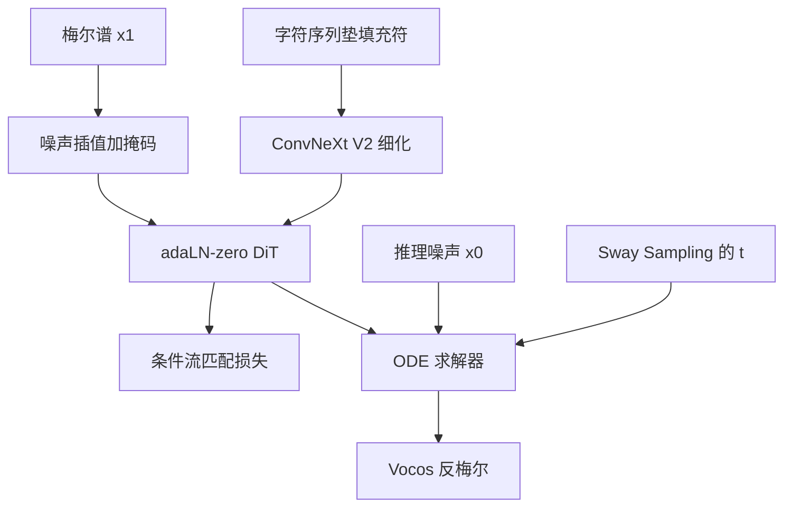

# F5-TTS：先把字符垫到梅尔长度，再用 ConvNeXt 把对齐从纠缠里拆开

<!-- release-date: 2024-10-09 -->

**本文依据**：`F5-TTS: A Fairytaler that Fakes Fluent and Faithful Speech with Flow Matching`，arXiv:2410.06885v3 [eess.AS] 20 May 2025，A4，17 页。作者 Yushen Chen、Zhikang Niu、Ziyang Ma（上海交通大学人工智能教育部重点实验室 / X-LANCE Lab）、Keqi Deng（剑桥大学）、Chunhui Wang、Jian Zhao（吉利汽车研究院宁波有限公司）、Kai Yu、Xie Chen（上海交通大学，通讯）。封面第一作者机构为上海交通大学。页眉印上述 arXiv 行，未印会议名。文中数字均标 PDF 页码；标「外部补充」的段落不来自本文。摘要写推理 RTF 0.15、公开 100K 小时多语数据；正文过滤后约 95K 小时英中数据，RTF 0.15 对应表 1 的 16 NFE Euler 设定，以表格为准。

## 一句话

非自回归（non-autoregressive，NAR）语音合成要把字对齐到声。Voicebox 一类系统用音素级时长模型；E2 TTS 把字符用填充符垫到与梅尔谱同样长，证明可以不要时长器、文本编码器和音素对齐，但收敛慢、对齐不稳。F5-TTS 仍走这条 infilling 流水线，只在拼接前用 ConvNeXt V2 给文本单独建模，主干换成带零初始化自适应层归一化（adaLN-zero）的 Diffusion Transformer（DiT）。推理时再对 flow 步做 Sway Sampling，不必重训。基座约 336M 参数，8 张 A100 80G 训到 1.2M 更新。LibriSpeech-PC test-clean 上 16 NFE 的 WER 2.53、RTF 0.15，32 NFE 的 WER 2.42（PDF p. 1、p. 6 表 1）。

它解决的不是「再加一个时长预测器」，而是 E2 TTS 那条已经能出自然韵律、却把语义和声学缠死的路：**有效信息长度差一大截的字符与梅尔直接拼进同一条序列，对齐失败无法靠重排救。**

## 一、旧矛盾：NAR 要对齐，AR 要 tokenizer，E2 TTS 把两者都卸了却训不动

自回归（autoregressive，AR）TTS 按 token 往下预测，零样本能力好，但延迟和暴露偏差要额外收拾；语音 tokenizer 的质量直接卡住保真度，所以才有人改在连续空间建模（PDF p. 1）。NAR 可以并行出声，扩散模型、尤其最优传输路径上的流匹配（Flow Matching with Optimal Transport，FM-OT）成了近年 NAR 语音的主路（PDF p. 1）。

NAR 的硬问题是文本与语音对齐。NaturalSpeech 3、Voicebox 用帧级音素对齐；Matcha-TTS 用单调对齐搜索再配音素级时长器。作者引用后续工作说：这种刚性对齐会挡住更自然的韵律（PDF p. 1–2）。E3 TTS 丢掉音素时长、改交叉注意力，音质有限；DiTTo-TTS 用预训练语言模型编码文本、再微调神经 codec 把语义灌进表示。E2 TTS 更简单：不要音素和时长预测器，字符加填充符垫到梅尔长度当输入，也能出很自然的结果（PDF p. 2）。

作者复现后发现：E2 TTS 的文本–语音对齐不稳。Seed-TTS 用了类似策略且效果很好，但文中没展开模型细节。不显式建模音素时长时，模型按给定总长度去分每个词或音素的长度，韵律更好（PDF p. 2）。

F5-TTS 的全称是 Fairytaler that Fakes Fluent and Faithful speech with Flow matching。流水线仍不要音素对齐、时长预测器、文本编码器、语义注入 codec；用 DiT 加 ConvNeXt V2 处理 infilling 里的对齐。作者强调 E2 TTS 把语义和声学缠在一起，对齐失败不能靠重排解决（PDF p. 2）。

训练与推理的骨架见图 1（PDF p. 2）：

上图是机制示意，根据 PDF p. 2 图 1 重画，不是实测时间轴。

## 二、流匹配：学一个从噪声走到数据的速度场

流匹配要把简单分布 $p_0$（标准正态）上的概率路径 $p_t$ 接到近似数据分布的 $p_1$。损失是让网络 $v_t$ 回归向量场 $u_t$（PDF p. 3 式 1）

$$
L_{\mathrm{FM}}(\theta)=\mathbb{E}_{t,p_t(x)}\|v_t(x)-u_t(x)\|^2
$$

$t\sim U[0,1]$。真实训练用条件概率路径，条件流匹配（Conditional Flow Matching，CFM）对 $\theta$ 的梯度与 FM 相同。最优传输形式 $\psi_t(x)=(1-t)x+t x_1$ 给出 OT-CFM（PDF p. 3 式 3）：网络直接预测 $x_1-x_0$。

若把损失改写成 log-SNR，并改去预测 $x_0$，CFM 等价于余弦日程下的 v-prediction（PDF p. 3）。推理从噪声 $x_0$ 出发，用常微分方程（ordinary differential equation，ODE）求解器积分到 $\psi_1(x_0)$。函数评估次数（number of function evaluations，NFE）是网络被调用的次数；NFE 越高越准、越慢（PDF p. 3）。

无分类器引导（Classifier-Free Guidance，CFG）训练时按一定比例丢掉条件，推理把有条件与无条件输出线性外推。CFM 里（PDF p. 3 式 4）

$$
v_{t,\mathrm{CFG}}=v_t(\psi_t(x_0),c)+\alpha\bigl(v_t(\psi_t(x_0),c)-v_t(\psi_t(x_0))\bigr)
$$

$\alpha$ 是 CFG 强度。脚注写明：开 CFG 时前向要跑两次，推理时间加倍（PDF p. 3）。

**旧问题 → 新设计 → 机制 → 收益 → 代价。** 扩散 TTS 逐步去噪慢；FM-OT 把路径收成直线，一次回归速度场。代价是推理仍要多次 NFE，CFG 再翻一倍。

可迁移：连续生成任务里，先问路径是不是 OT 直线，再问引导要不要显式分类器。

## 三、流水线：文本引导的语音填空，时长用字数比估

训练任务是文本引导的 speech-infilling：周围音频加全文，预测被挖掉的那一段（PDF p. 4）。声学输入是梅尔 $x_1\in\mathbb{R}^{F\times N}$。CFM 里送入噪声语音 $(1-t)x_0+t x_1$ 和掩码语音 $(1-m)\odot x_1$。

英文直接用字母和符号；中文用全拼，方便零样本。字符序列用填充符 $\langle F\rangle$ 垫到与梅尔帧数相同，得到式 5 的 $z$（PDF p. 4）。模型要在 $(1-m)\odot x_1$ 与 $z$ 条件下重建 $m\odot x_1$。

推理需要参考音频梅尔 $x_{\mathrm{ref}}$、其转写 $y_{\mathrm{ref}}$、要念的文本 $y_{\mathrm{gen}}$。参考音频管说话人，文本管内容。总长度 $N$ 必须告诉模型。作者不训单独的时长器，只用 $y_{\mathrm{gen}}$ 与 $y_{\mathrm{ref}}$ 的字符数比去估时长，并假设字符总长不超过梅尔长，再像训练一样垫填充符（PDF p. 4）。条件是 $x_{\mathrm{ref}}$ 与拼接后的字符序列 $z_{\mathrm{ref}\cdot\mathrm{gen}}$（PDF p. 4 式 6）。ODE 积完后丢掉参考段，Vocos 把梅尔变波形（PDF p. 4）。

## 四、F5-TTS：ConvNeXt 先整理文本，再交给 DiT 做 infilling

E2 TTS 把垫好的字符直接和语音拼接，语义与声学缠在一起，有效信息长度差很大，这是难训和零样本出问题的根（第 5.1 节）。F5-TTS 要加快收敛、加强对齐，并在推理用更少 NFE 保住指标（PDF p. 4）。

主干是带 adaLN-zero 的 DiT。拼接前，字符先过 ConvNeXt V2。消融表明：给文本单独一段建模空间，它能在 infilling 之前先准备好自己。Voicebox 那种音素级强制对齐边界这里不显式引入；语义和声学仍由整网一起学。物理长度仍与 E2 TTS 一样，但不再把信息量差悬殊的两路直接塞进去（PDF p. 4–5）。

flow 步 $t$ 作为 adaLN-zero 的条件，而不是像 Voicebox 那样接到拼接序列后面。文本序列的均值池化 token 当 adaLN 条件，作者认为对 TTS 不是必须：TTS 要更严的引导，均值池化太粗（PDF p. 5）。位置编码：flow 步用正弦；$z$ 进 ConvNeXt 前再加绝对正弦；拼接序列加卷积位置编码；自注意力用旋转位置编码（RoPE），不用对称双向 ALiBi（PDF p. 5）。相对 Voicebox / E2 TTS，丢掉 U-Net 式长跳接。相对 DiTTo-TTS，不要额外文本编码器和语义 codec。文本只拿到「一点点自由」：拼接前自己整理（PDF p. 5）。

**旧问题 → 新设计 → 机制 → 收益 → 代价。** 直接拼接让对齐失败无法重排；ConvNeXt 把文本路先做时序细化。代价是多一块卷积，且梅尔仍远长于文本（局限一节）。

可迁移：多模态拼接前，先问两路有效信息长度是否同量级；若差一个数量级，先给短的那路独立容量，而不是立刻上交叉注意力或强制对齐。

## 五、Sway Sampling：训练仍均匀采样 $t$，推理把步偏向起点

图像生成里有人用单峰 logit-normal 在训练时多抽中间 $t$。作者猜测那是把学习难度摊匀。F5-TTS 训练仍 $t\sim U[0,1]$，只在推理改采样（PDF p. 5）。Sway 函数（PDF p. 5 式 7）

$$
f_{\mathrm{sway}}(u;s)=u+s\cdot\bigl(\cos(\tfrac{\pi}{2}u)-1+u\bigr)
$$

对 $s\in[-1,\frac{2}{\pi-2}]$ 单调。先抽 $u\sim U[0,1]$ 再映射成 $t$。$s<0$ 往左偏（更多小 $t$），$s>0$ 往右偏，$s=0$ 就是均匀。图 3 画了密度（PDF p. 5、p. 7）。

概念上：CFM 早期（$t\to 0$）从纯噪声勾轮廓，后期修细节；文本–语音对齐由前几步定。$s<0$ 让 ODE 在积分开头看到更多信息（PDF p. 5）。该策略可直接套到已有 CFM 模型，不必重训（PDF p. 4）。

## 六、数据、训练与默认推理

基座训在 Emilia 野外多语数据上，滤掉转写失败和语种标错后，约 95K 小时英中（PDF p. 5）。小模型消融用 WenetSpeech4TTS Premium，945 小时普通话。评测三套：自建并公开的 LibriSpeech-PC test-clean 子集，4–10 秒、1127 条；Seed-TTS test-en，1088 条来自 Common Voice；Seed-TTS test-zh，2020 条来自 DiDiSpeech。先前英文模型常用不同 LibriSpeech test-clean 子集且 prompt 列表不公开，所以他们另发这套 PC 子集（PDF p. 5–6）。

基座训到 1.2M 更新，batch 307,200 音频帧（0.91 小时），8 张 NVIDIA A100 80G 超过一周。AdamW，峰值学习率 $7.5\times 10^{-5}$，线性热身 20K，其后线性衰减；梯度裁剪 1（PDF p. 6）。F5-TTS 基座：DiT 22 层、16 头、嵌入/FFN 1024/2048；ConvNeXt V2 4 层、512/1024；合计 335.8M。复现 E2 TTS：333.2M 扁平 U-Net Transformer，24 层、16 头、1024/4096。两者都用 RoPE、注意力与 FFN dropout 0.1、与 Voicebox 相同的卷积位置编码（PDF p. 6）。

字符词表 2546，含填充符和 Emilia 里其它语种字符（大量语码转换句）。音频：100 维 log mel-filterbank，24 kHz，hop 256。infilling 随机掩 70%–100% 梅尔帧。CFG：先以 0.3 丢掉掩码语音，再以 0.2 同时丢掉掩码语音和文本（跟 Voicebox）。作者假设两段式丢掉能让模型多学文本对齐（PDF p. 6）。

推理默认用指数滑动平均（EMA）权重；F5-TTS 用 Euler ODE，E2 TTS 用 midpoint（按 E2 TTS 原文）。声码器默认预训练 Vocos。第 5 节默认 CFG 强度 2、Sway 系数 $-1$（PDF p. 6）。RTF 在 NVIDIA RTX 3090 上按 10 秒语音的推理时间算（PDF p. 6 表 1 注）。

## 七、主结果：表 1、表 2 对摘要

第 5 节写：F5-TTS 与开源基线报三次随机种子平均。LibriSpeech-PC 上 32 NFE 的 WER 2.42；16 NFE 的 RTF 0.15、WER 2.53。复现 E2 TTS 说话人像（SIM）很好，零样本 WER 差一截，说明对齐不稳是结构问题（PDF p. 6）。

表 1 中与本文设定直接可比的 LibriSpeech-PC 行（PDF p. 6；#Param. 表内写 336M，正文 335.8M）：

| 系统 | 参数 | 数据 | WER↓ | SIM-o↑ | RTF↓ |
|---|---|---|---|---|---|
| Ground Truth（1127 条、2 小时） | — | — | 2.23 | 0.69 | — |
| Vocoder 重合成 | — | — | 2.32 | 0.66 | — |
| CosyVoice | 约 300M | 170K 多语 | 3.59 | 0.66 | 0.92 |
| FireRedTTS | 约 580M | 248K 多语 | 2.69 | 0.47 | 0.84 |
| E2 TTS（32 NFE） | 333M | 100K 多语 | 2.95 | 0.69 | 0.68 |
| F5-TTS（16 NFE） | 336M | 100K 多语 | 2.53 | 0.66 | 0.15 |
| F5-TTS（32 NFE） | 336M | 100K 多语 | 2.42 | 0.66 | 0.31 |

表 1 上半是别人论文里的 LibriSpeech test-clean / 40 条子集，训练数据、子集都不同，不能和 PC 子集直接比谁赢。Voicebox 330M / 60K 英在完整 test-clean 上报 WER 1.9、SIM-o 0.662、RTF 0.64；在 40 条子集上 WER 2.03、SIM-o 0.64（PDF p. 6 表 1）。

表 2（PDF p. 6）。带星号的格是基线论文自报，不是作者复现：

| 系统 | test-en WER | SIM-o | CMOS | SMOS | test-zh WER | SIM-o | CMOS | SMOS |
|---|---|---|---|---|---|---|---|---|
| Ground Truth | 2.06 | 0.73 | 0.00 | 3.91 | 1.26 | 0.76 | 0.00 | 3.72 |
| Vocoder 重合成 | 2.09 | 0.70 | — | — | 1.27 | 0.72 | — | — |
| CosyVoice | 3.39 | 0.64 | 0.02 | 3.64 | 3.10 | 0.75 | −0.06 | 3.54 |
| FireRedTTS | 3.82 | 0.46 | −1.46 | 2.94 | 1.51 | 0.63 | −0.49 | 3.28 |
| MaskGCT（自报） | 2.623 | 0.717 | — | — | 2.273 | 0.774 | — | — |
| Seed-TTSDiT（自报） | 1.733 | 0.790 | — | — | 1.178 | 0.809 | — | — |
| E2 TTS（32 NFE） | 2.19 | 0.71 | 0.06 | 3.81 | 1.97 | 0.73 | −0.04 | 3.44 |
| F5-TTS（16 NFE） | 1.89 | 0.67 | 0.16 | 3.79 | 1.74 | 0.75 | 0.02 | 3.72 |
| F5-TTS（32 NFE） | 1.83 | 0.67 | 0.31 | 3.89 | 1.56 | 0.76 | 0.21 | 3.83 |

正文写：F5-TTS 在 test-en / test-zh 上 CMOS 0.31 / 0.21、SMOS 3.89 / 3.83，超过部分更大规模基线；时长只用字数比。Seed-TTS 最好数字来自「大几个数量级的模型和数据（数百万小时）」（PDF p. 6–7）。WER 用 Whisper-large-v3（英）和 Paraformer-zh（中）；SIM-o 用基于 WavLM-large 的说话人验证余弦相似度（PDF p. 6）。

表 1 的 16 NFE RTF 0.15 与表 6 Euler、$s=-1$ 一致；表 5 为了消融一律 midpoint，同样 16 NFE 的 RTF 变成 0.26、LibriSpeech-PC WER 2.43（PDF p. 14 表 5、p. 15 表 6）。主文默认叙事跟表 1 / 表 6 的 Euler。

## 八、结构消融：E2 TTS 有 7% 样本 WER 大于 50%，重排救不了

约 155M 小模型，WenetSpeech4TTS Premium 945 小时，batch 是基座一半，训到 800K。图 2 看 Seed-TTS test-zh 的 WER / SIM。F5-TTS（32 NFE、无 Sway）800K 时 WER 4.17、SIM 0.54；E2 TTS 是 9.63 和 0.53。普通话上复现 E2 TTS 先是收敛慢，再是全程约 7% 测试样本失败（WER$>$50%），作者猜与训练集分布差有关（PDF p. 7）。

附录表 4：丢掉音频 prompt、只留文本，E2 TTS 失败消失（F5-TTS 也更好，作者归因于输出更标准、ASR 更好认）。这说明 E2 TTS 里语义和声学缠得太死，失败不能靠重排；要嘛面对域外做监督微调，要嘛靠极慢收敛堆预训练规模，工业不方便、个人更扛不住（PDF p. 7–8、p. 14 表 4）。

表 3 小模型配置（PDF p. 13）：F5-TTS 158M、173 GFLOPs；去掉 Conv2Text 153M、164 GFLOPs；E2 TTS 157M、293 GFLOPs。少跳接的结构天然更快。纯 adaLN DiT（F5-TTS−Conv2Text）在只垫字符时学不会对齐；MMDiT 学得快、崩得也快，严重复读、音色韵律乱。作者认为纯 MMDiT 对「必须跟文本走」的 TTS 太自由，所以只加强 DiT 的文本细化（PDF p. 8）。

再消融：给语音也加同样卷积分支（F5-TTS+Conv2Audio）用 +1.61 WER 换 +0.01 SIM；长跳接塞进 DiT（F5-TTS+LongSkip）不能抬 SIM；ConvNeXt 接到扁平 U-Net（E2 TTS+Conv2Text）也不能降 WER，两边都明显变差（PDF p. 8）。表 4 常见输入：F5-TTS+Conv2Audio WER 5.78；+LongSkip 5.17；E2 TTS+Conv2Text 18.10（PDF p. 14）。

## 九、Sway 消融、漏声覆盖、求解器与硬句

图 3：$s$ 越负，小模型越好（PDF p. 7–8）。「leak and override」：推理把 $x_0$ 换成 $(1-t')x_0+t'x'_{\mathrm{ref}}$，$t'=0.1$，$x'_{\mathrm{ref}}$ 是参考梅尔的复制；再给一段与这段参考转写不同的文本。有 Sway 能盖掉泄漏、跟新文本走；均匀 $t$ 会让输出被泄漏内容主导。泄漏的音色也可以换另一个说话人的音频、靠 Sway 盖掉。这是「早期 $t$ 定轮廓、后期修细节」的直接证据（PDF p. 8）。

表 5 基座、一律 midpoint、$s=-1$（PDF p. 14）。LibriSpeech-PC：F5-TTS 32 NFE 有 Sway WER 2.41 / SIM 0.66 / UTMOS 3.89；无 Sway 2.84 / 0.62 / 3.70。E2 TTS 32 NFE 有 Sway 2.84 / 0.72 / 3.70；无 Sway 2.95 / 0.69 / 3.56。同一策略套到 E2 TTS 也涨，作者用来支持「不必重训、可插到已有 CFM TTS」（PDF p. 14）。

表 6：Euler 在大 NFE 加 Sway 时略好且更快；不加 Sway 时 Euler 会掉。$s=-1$、16 NFE Euler 就是表 1 的 RTF 0.15；同设定 midpoint RTF 0.26；16 NFE Heun-3 的 LibriSpeech-PC WER 2.39，RTF 0.44（PDF p. 15）。

ELLA-V 100 条硬句，表 7，32 NFE+Sway，三次种子平均（PDF p. 15）：F5-TTS WER 4.40（替换 1.81、删除 2.40、插入 0.18）；复现 E2 TTS 8.58（3.70 / 4.82 / 0.06）。删除高说明叠词会跳词；插入低说明没有无尽复读。E1 TTS 论文自报的 StyleTTS 2 / CosyVoice / E1 TTS$_{\mathrm{DMD}}$ 用了未公开 prompt，作者自己的音频 prompt 是从 LibriSpeech-PC 随机抽的 3 秒，不能当成同一协议冠军（PDF p. 15）。

表 8：Vocos 与 BigVGAN；另报去标点大写的 non-PC 子集；括号里是 Hubert-large ASR 的 WER。32 NFE BigVGAN 在 PC 上 Whisper WER 2.11（Hubert 1.81）、SIM 0.67；Vocos 2.42（2.09）、0.66。正文还写：复现多语 E2 TTS、32 NFE、Vocos、Hubert，PC 上 WER 2.92，加 Sway 后 2.66（PDF p. 15–16）。

表 9：158M 小模型，batch 改回基座的 0.91 小时；每 100K 更新约 8 小时、8 张 H100 SXM。LibriTTS 585 小时多说话人：500K 时 PC 上 WER 2.20、SIM 0.60。LJSpeech 24 小时单说话人 in-set：100K 时 WER 5.64，200K 时 2.93，再往后 WER 升、UTMOS 降，作者仍用来说明「不同数据量上都能学到字–声对齐、且不做 grapheme-to-phoneme」（PDF p. 16）。USLM 361M 官方 checkpoint 在 PC 上 WER 6.1、SIM 0.43（PDF p. 16 表 9）。

主观：英、普各 20 名母语者，三套测试、各模型变体，每轮随机 30 句。CMOS 相对参考 −3 到 +3 整数再对真值差分平均；SMOS 1–5、步长 0.5。作者对照 DiTTo-TTS 只收 6/12 份 SMOS/CMOS、NaturalSpeech 3 请 12 人判 20/10 句，呼吁公开样本、多请人（PDF p. 16–17）。

附录 A 基线规格：VALL-E 2 / MELLE 训 Libriheavy 50K 英；Voicebox 330M / 60K 英；NaturalSpeech 3 500M / Librilight 60K 英；DiTTo-en-XL 740M / 55K 英；FireRedTTS 约 400M 文本到语义加约一半参数的 token 到波形、248K 小时；MaskGCT 695M T2S + 353M S2A、Emilia 约 100K；CosyVoice 约 300M、170K；E2 TTS 原文训 Libriheavy 50K 英，本文复现 333M 多语 Emilia（PDF p. 12–13）。

## 十、局限、伦理与判断

局限两件（PDF p. 9）：梅尔仍远长于文本，更高效、最好通用的连续表示仍是关键；零样本能仿参考，但对情感等副语言细节没有细粒度控制。伦理：公开多语数据、自然度和说话人像都高，存在仿声冒充风险，作者认为应加水印并做检测（PDF p. 9）。代码与 checkpoint 指向 https://SWivid.github.io/F5-TTS/（PDF p. 1）。

被实验托住的：ConvNeXt 文本分支对对齐的必要性（去掉就不会对齐；接到 E2 骨干也不救 WER）；E2 TTS 失败与音频 prompt 纠缠（只留文本则失败消失）；Sway 对 F5 与 E2 都涨、且能覆盖泄漏。作者观察、不是证明的：两段式 CFG 丢掉「可能」让模型多学对齐；logit-normal 训练采样「猜测」是摊匀难度；E2 7% 失败「推测」分布差。没公开的：Seed-TTS 的数据与模型规模细节、工业部署的水印检测实现。

可迁移三条。其一，NAR 对齐不一定要音素边界，但「垫到同样物理长度」不等于「有效信息同量级」——短的那路要先有自己的容量。其二，训练均匀、$t$ 的偏置放到推理，是零成本插到已有 CFM 模型的杠杆；早期步决定轮廓，这比再堆 NFE 更值。其三，主指标不要只看 SIM：E2 TTS 的 SIM 可以高于 F5，WER 和失败率才暴露对齐事故。
