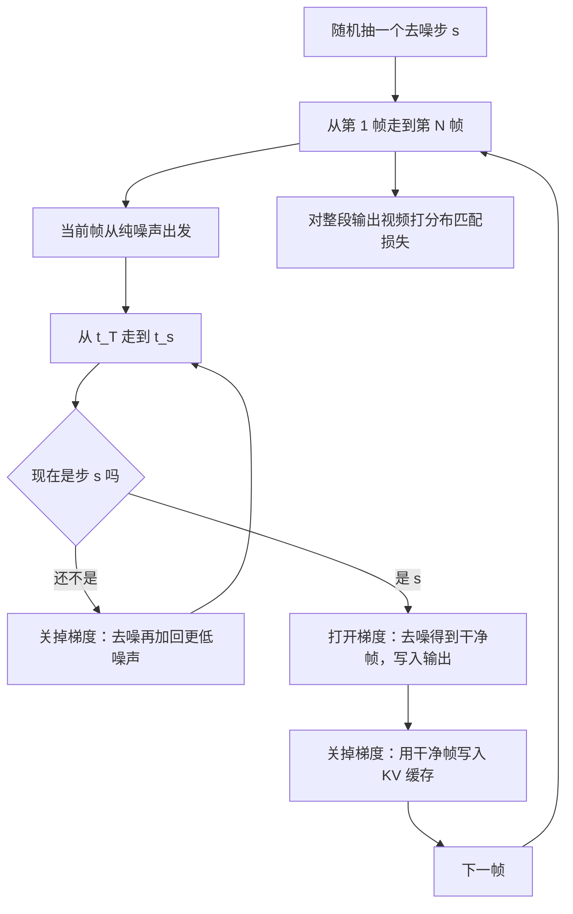
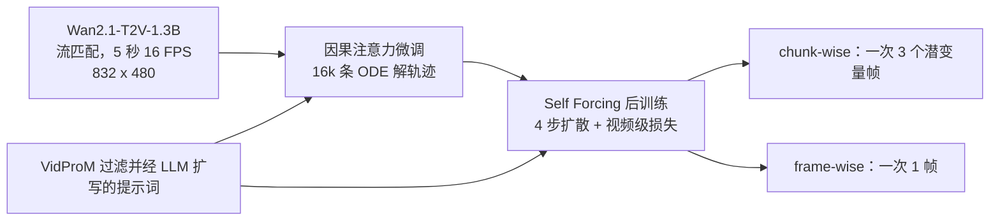

# Self-Forcing：训练时看真帧、推理时看自己生成的帧

<!-- release-date: 2025-06-09 -->

> 本文依据 Adobe Research 与 UT Austin 的 **Self Forcing: Bridging the Train-Test Gap in Autoregressive Video Diffusion**，即 arXiv:2506.08009v2（2025-11-10 修订）、NeurIPS 2025 spotlight。本地件 19 页，首页水印 `arXiv:2506.08009v2 [cs.CV] 10 Nov 2025`。动笔前核过 arXiv 提交历史：v2 是目前最新版，用户指定不必再换 PDF。
>
> 全文页码指 PDF 自身页码，与印刷页码一致。文中始终区分三件事：**报告写了什么**、**我们如何解释**、**哪些是外部补充**。项目页上的后续工作一律标成外部补充，不写进本报告的方法与实验。

## 读之前：先看清这条裂缝

这份论文研究的不是「视频扩散怎么从噪声画出第一帧」，而是更窄、也更致命的一件事：自回归视频模型在**训练时看到的过去**和**推理时看到的过去**，根本不是同一种东西。

下面这些词后文会反复出现。这里只解释报告真正用到的概念。

**双向视频扩散**：一次把整段视频的所有帧一起去噪。每一帧都可以看见未来。代价是必须等整段生成完才能开始看，也没法在「下一帧还没发生」的直播、游戏里用（PDF p. 1）。

**自回归（autoregressive，AR）**：按时间一帧（或一块）往前走。生成第 $i$ 帧时，只能看第 $i$ 帧之前已经有的内容。这和真实世界的时间方向一致，首帧延迟可以压到一秒以内，但错误也会顺着时间往下传。

**扩散 / 少步扩散**：从高斯噪声出发，一步步去噪。普通视频扩散要走几十步；这份工作把每帧的去噪压到 **4 步**，否则训练时把整段视频按推理过程展开，显存会爆（PDF p. 4–5、p. 7）。

**流匹配（flow matching）**：基座 Wan2.1 用的训练目标，学的是从噪声走到数据的速度场。正文几乎不展开它，细节在附录（PDF p. 7、p. 16）。

**因果注意力与 KV 缓存（Key-Value Cache）**：因果注意力保证「现在不能看未来」。已经算过的历史帧可以把中间结果（Key 和 Value）存下来，生成下一帧时不必重算。语言模型推理里这是常规操作；这份工作的特别之处是：**训练时也用 KV 缓存**，而不只在推理时用（PDF p. 4）。

**Teacher Forcing（教师强制）**：训练时，让模型预测下一帧，但给它的「已经发生的过去」是数据集里的**真值帧**。推理时没有老师递真帧，过去全是模型自己刚生成的、带着错误的帧。

**Exposure bias（暴露偏差）**：上面这种「训练条件在真值、推理条件在自己的输出」造成的分布错位。错会累积，后面的帧越来越糟（PDF p. 2）。

**视频级整体损失 vs 逐帧损失**：逐帧损失问的是「在给定过去的情况下，这一帧像不像」；整体损失问的是「模型自己滚出来的整段视频，像不像真视频」。过去从哪来，决定了你到底在优化哪一个分布。

## 一句话先说清

Self Forcing 要补的不是算力，也不是把扩散再蒸少几步。它要补的是自回归视频扩散里一条很老的缝：

> **训练时，模型看着真帧去噪下一帧；推理时，它只能看着自己刚画出来的、已经带错的帧继续往下画。**

Teacher Forcing 和 Diffusion Forcing 都在用「真值或加了噪声的真值」当过去，再对每一帧做去噪损失。这样训出来的输出，并不属于模型推理时真正会采样的分布（PDF p. 2，Figure 1）。CausVid 虽然已经用了分布匹配蒸馏（Distribution Matching Distillation，DMD），但训练时拿 Diffusion Forcing 的输出去匹配，匹配的是错的分布（PDF p. 3、p. 6）。

Self Forcing 的做法很硬：训练时就按推理配方做自回归 rollout，用 KV 缓存，让每一帧的条件都是**自己之前生成的帧**。有了真正来自模型分布的整段视频，才能打视频级的分布匹配损失（DMD、SiD 或 GAN）。为了训得起，它用 4 步扩散，再加随机梯度截断：每段样本只对其中一个去噪步回传梯度，并且切断写进 KV 缓存的梯度（PDF p. 4–5）。外推长视频则靠 rolling KV cache，复杂度从「每滑一次窗口就重算」降到「只算新帧」（PDF p. 6–7）。

实验里，chunk-wise 变体在单张 H100 上达到 **17.0 FPS、0.69 秒**首帧延迟，VBench 总分 **84.31**，与慢得多的双向基座 Wan2.1-1.3B（总分 84.26、延迟 103 秒）同一档，并超过同速度的 CausVid（PDF p. 2、p. 8，Table 1）。

如果只记一句：

> **训推要合上，条件帧必须来自模型自己的采样过程，而不是来自训练时图方便准备的真值。**

## 报告地图：19 页各写了什么

| 报告章节 | PDF 页 | 讲了什么 | 密度 |
|---|---|---|---|
| 摘要 + §1 引言 + Figure 1 | p. 1–2 | 双向 vs 自回归、暴露偏差、三种训练范式、17 FPS | 高 |
| §2 相关工作 | p. 3 | GAN 无暴露偏差、CausVid 匹配错分布、Rolling Diffusion 不是真自回归 | 中 |
| §3.1 预备知识 + Figure 2 | p. 3–4 | 链式分解、TF/DF 的逐帧 MSE、注意力掩码 | 高 |
| §3.2 Self-Rollout + Algorithm 1 | p. 4–5 | 训练时 KV 缓存、少步扩散、随机梯度截断 | 高 |
| §3.3 视频级分布匹配 | p. 5–6 | DMD / SiD / GAN；帧级 KL vs 整段视频散度 | 高 |
| §3.4 + Algorithm 2 + Figure 3 | p. 6–7 | rolling KV cache、首帧潜变量的特殊统计 | 高 |
| §4 实验 + Table 1 / Figure 4–5 | p. 7–8 | 实现、VBench、用户偏好、定性对比 | 高 |
| Table 2 + 消融 + 训练效率 | p. 9 | TF/DF 对照、4.6 vs 16.1 FPS、64 卡 1.5 小时 | 高 |
| Figure 6 + §5 讨论 | p. 10 | 逐步时间、并行预训练 + 序列后训练、限制 | 中 |
| 参考文献 | p. 10–15 | 113 条 | — |
| 附录 A + Table 3 + 式（1）–（7） | p. 16–17 | 噪声日程、提示词过滤、三种损失的超参 | 高 |
| 附录 B–E + Figure 7–9 | p. 17–19 | 外推伪影、VBench 雷达图、用户研究说明 | 中 |

三件事先知道：

- **这是后训练论文，不是从零训一个视频基座。** 权重从 Wan2.1-T2V-1.3B 出发，先用 16k 条 ODE 轨迹做因果微调，再跑 Self Forcing（PDF p. 7）。
- **DMD / SiD 版本宣称不需要视频训练数据**；GAN 版本才用 14B 基座生成的 70k 条视频（PDF p. 7）。
- **正文没有公开 VAE 压缩比、潜变量帧数、训练 iteration 数。** 速度数字一律以 Table 1 的单卡 H100 为准，不用项目页替换。

## 裂缝长什么样：训练看真帧，推理看自己的帧

### 双向模型为什么做不了流式

当代高质量视频几乎都来自 Diffusion Transformer：所有帧一起去噪，双向注意力让未来可以影响过去。报告的判断很干脆——这种设计「从根本上限制了」它在实时流式场景里的可用性，因为生成当前帧时未来信息并不存在（PDF p. 1）。

自回归按链式法则把整段视频拆开：

$$
p(x^{1:N})=\prod_{i=1}^{N}p(x^{i}\mid x^{<i})
$$

每一项 $p(x^{i}\mid x^{<i})$ 再用扩散来建模：从高斯噪声出发，在过去帧的条件下逐步去噪（PDF p. 3）。记号上的「一帧」也可以是一小块帧，后文的 chunk-wise 变体就是一次生成 3 个潜变量帧（PDF p. 4、p. 7）。

这条路对了时间方向，却引出另一道题：过去 $x^{<i}$ 从哪来。

### Teacher Forcing：考试时老师不在，训练时老师一直递正确答案

序列模型里有一个用了几十年的省事办法：训练时把上一时刻的**真值**塞给模型，让它只负责预测下一个。放到视频扩散里，就是用干净的真值帧当上下文，去噪当前帧（PDF p. 1–2，Figure 1（a））。报告也把它叫 next-frame prediction。

直觉上这很合理——真帧是最干净的条件，梯度也稳定。可推理时没有真帧。模型必须吃自己刚生成的帧。一旦某一帧偏了颜色、糊了结构，后面每一帧都会在这个偏掉的世界上继续画。报告把这个现象明确写成 **exposure bias**：模型只在真值上下文上训练，推理时却依赖自己不完美的预测，分布错位会随生成进程放大（PDF p. 2）。

可以把它想成跟读：

- 训练：老师念上一句，你接下一句；
- 推理：你必须接着自己刚刚说错的那句往下说。

跟读成绩不能代表独白成绩。

### Diffusion Forcing：把「有噪声的过去」盖进训练，仍不是自己的过去

Diffusion Forcing 给每帧独立采样噪声水平，让模型在「过去或干净或很吵、当前帧在去噪」的各种组合里训练（PDF p. 1–2，Figure 1（b））。它确实覆盖了推理时「过去相对干净、当前很吵」这一格，所以比纯 Teacher Forcing 更接近推理。

但它覆盖的仍是**加了噪声的真值上下文**，不是模型自己滚出来的上下文。Figure 1 在（a）（b）上头写的不等式，说的就是这件事：把条件分布乘起来，并不等于模型推理时真正会得到的联合分布（PDF p. 2）。

有些工作在推理时继续往上下文里掺噪声，试图把错误「盖住」。报告认为这条路会牺牲时间一致性、把 KV 缓存设计搞复杂、增加延迟，而且**没有从根上解决暴露偏差**（PDF p. 2）。

### 还有一条看起来像自回归、其实不是的路

Rolling Diffusion 一类方法让噪声水平从早到晚逐渐升高，可以顺序往外吐长视频，有时也被叫作自回归。报告特意划清界限：它们**并不严格遵守链式法则分解**。交互场景里，未来帧往往已经部分生成好了，用户此刻插入的控制来不及改「马上就要播的下一帧」，响应会被锁死（PDF p. 3）。

Self Forcing 要的是真自回归：当前帧生成完再交给用户，下一帧才开始。这才能把延迟预算从「等整段视频」改成「等下一帧」。

### CausVid 的具体失败：同一个 DMD，匹配的不是推理分布

报告把 CausVid 写成最接近的前作：少步自回归扩散、Diffusion Forcing、再用 DMD 做分布匹配（PDF p. 3）。问题不在 DMD 这个工具，而在拿去匹配的样本从哪来。

CausVid 训练时的输出是 Diffusion Forcing 滚出来的，推理时的输出是自回归 KV 缓存滚出来的。两边不是同一个分布，DMD 就在给一个推理时根本不会出现的分布做对齐。「因此 DMD 损失匹配的是错误分布」——这是报告自己的原话（PDF p. 3）。后文 §3.3 又说，这个错位会「显著削弱」DMD 的效果（PDF p. 6）。

我们的解释是：损失名字可以叫分布匹配，但你匹配的必须是**模型真正会采样的那条路**。换一条图并行的训练路，再在终点上对分布，终点对的不是同一座城。

## 核心设计一：训练时就按推理那样，用自己的输出当下一帧条件

### 旧问题

TF / DF 可以在整段视频上并行算注意力，只要用自定义掩码挡住未来（PDF p. 4，Figure 2（a）（b））。并行很香，换来的是：训练时模型几乎没见过「自己上一帧画错了，这一帧还得接着画」这种状态。

暴露偏差不是推理才出现的 bug，是训练从来没让模型练习过推理会走的那条路。

### 新设计

Self Forcing 的核心就一句话：训练时按推理配方做自回归 self-rollout。每一帧 $x^{i}$ 的去噪，条件是自己已经生成的干净历史，加上当前这一步还没去完的噪声帧（PDF p. 4）。

和「只在推理时用 KV 缓存」的常规做法不同，这里**训练也跑 KV 缓存**，也不再依赖 TF/DF 那种特殊注意力掩码。Figure 2（c）画的就是：时间方向一帧帧往下 rollout，空间方向在当前帧内部做少步去噪，历史以干净 KV 的形式接进来（PDF p. 4）。

Figure 1（c）上头的等式是整篇最值得盯住的一行：

$$
p(\hat x^{1})\,p(\hat x^{2}\mid\hat x^{1})\,p(\hat x^{3}\mid\hat x^{1},\hat x^{2})=p(\hat x^{1},\hat x^{2},\hat x^{3})
$$

左边按自己的输出相乘，右边就是模型真正的联合分布。TF/DF 写的是 $\neq$，Self Forcing 写的是 $=$（PDF p. 2）。

### 工作机制

先把「一帧怎么来」写成少步扩散的复合。设 $\{t_{0}=0,t_{1},\ldots,t_{T}=1000\}$ 是从完整日程里抽出的子序列。每一步把当前噪声帧去噪，再按前向过程 $\Psi$ 加回更低噪声，作为下一步的输入（PDF p. 4–5）：

$$
f_{\theta,t_{j}}(x^{i}_{t_{j}})=\Psi\bigl(G_{\theta}(x^{i}_{t_{j}},t_{j},x^{<i}),\,\epsilon_{t_{j-1}},\,t_{j-1}\bigr)
$$

一帧的模型分布就是把 $T$ 步复合起来：

$$
p_{\theta}(x^{i}\mid x^{<i})=f_{\theta,t_{1}}\circ f_{\theta,t_{2}}\circ\cdots\circ f_{\theta,t_{T}}(x^{i}_{t_{T}}),\qquad x^{i}_{t_{T}}\sim\mathcal N(0,I)
$$

实现上 $T=4$。整段视频则按 $i=1,\ldots,N$ 顺序走完，历史通过 KV 缓存传给后面的帧。这就是 Algorithm 1 的骨架（PDF p. 5）。

这张图按 Algorithm 1（PDF p. 5）重画，只表示控制流，不含任何实测时间。

两处截断是它能训起来的关键，下一节单独讲。这里先记住设计意图：**让训练轨迹和推理轨迹走同一条因果链。**

### 收益

模型在训练里就会撞上自己的错，并被视频级损失要求「整段看起来仍像真视频」。后面消融会看到：同样从 chunk-wise 改成 frame-wise、自回归步数变长之后，TF/DF 的分数明显掉，Self Forcing 几乎不掉（PDF p. 9，Table 2）。这是「真的在练暴露偏差」而不是「换了个损失名字」的证据。

### 代价与边界

顺序 rollout 放弃了 TF/DF 那种整段并行。报告承认第一眼会觉得这算不动，所以它被放在**后训练**：不需要大量梯度更新就能收敛（PDF p. 2）。它也没有声称从零预训练一个自回归视频模型。更长程的依赖还被梯度截断切断，讨论里自己把这一点写成限制（PDF p. 10）。

### 可迁移启发

凡是「训练时用黄金上下文、推理时用自己的输出」的系统，都有同一条缝：语言模型的 teacher forcing、扩散的逐步去噪、规划模型的开环 rollout。**能在训练里把推理时的上下文分布采样出来，就不要用一个更漂亮、但推理时不存在的条件去代替。** 并行很贵的话，至少在后训练这一段把链展开。

## 核心设计二：监督打在整段视频上，而不是每一帧各打各的

### 旧问题

TF/DF 的标准目标是逐帧去噪 MSE。把噪声预测写成 $\hat\epsilon^{i}_{\theta}=G_{\theta}(x^{i}_{t^{i}},t^{i},c)$，损失是（PDF p. 4）：

$$
L^{\mathrm{DM}}_{\theta}=\mathbb{E}_{x^{i},t^{i},\epsilon^{i}}\bigl[w_{t^{i}}\|\hat\epsilon^{i}_{\theta}-\epsilon^{i}\|_{2}^{2}\bigr]
$$

上下文 $c$ 在 TF 里是干净真值 $x^{<i}$，在 DF 里是各帧不同噪声水平的 $x^{j<i}_{t^{j}}$。

脚注说，在特定噪声加权下，去噪损失近似最大似然，等价于最小化**每一帧**数据分布和模型分布之间的 KL（PDF p. 6）。写成报告的记号，TF/DF 做的是：

$$
\mathbb{E}_{\{x^{<i}\}\sim p_{\mathrm{data}}}\,D_{\mathrm{KL}}\bigl(p_{\mathrm{data}}(x^{i}\mid x^{<i})\,\|\,p_{\theta}(x^{i}\mid x^{<i})\bigr)
$$

DF 只是把期望里的上下文改成加噪之后的 $\tilde p_{\mathrm{data}}$（PDF p. 6）。

逐帧 KL 有一个盲区：它假设「过去是对的」。过去一旦来自模型自己，这项期望就不再对应推理。你可以把每一帧在老师递来的历史上都学对，整段自己滚出来仍然崩。

### 新设计

self-rollout 直接从推理时的 $p_{\theta}(x^{1:N})$ 采样整段视频，于是可以打**视频级**散度，把生成视频的分布对齐到真实视频 $p_{\mathrm{data}}(x^{1:N})$（PDF p. 5）。为了借用预训练扩散模型、也更稳，两边都先加噪声再匹配（PDF p. 5）。

报告试了三种：

| 目标 | 它在对齐什么 | 报告里的角色 |
|---|---|---|
| DMD | 反向 KL 的期望 $\mathbb{E}_{t}[D_{\mathrm{KL}}(p_{\theta,t}\|p_{\mathrm{data},t})]$，用两个 score 的差来给生成器梯度 | 主结果 Table 1 / Figure 4 用的就是它 |
| SiD | Fisher 散度 $\mathbb{E}_{t,p_{\theta,t}}[\|\nabla\log p_{\theta,t}-\nabla\log p_{\mathrm{data},t}\|^{2}]$ | 消融里画质分最高的一档 |
| GAN | 用判别器近似 Jensen–Shannon，生成器就是这个自回归扩散模型 | 需要 70k 条生成视频，不是 data-free |

（PDF p. 5–6、p. 8–9。）

关键对比是上下文从哪采。Self Forcing 里 $\{x^{<i}\}$ 来自 $p_{\theta}$，不是 $p_{\mathrm{data}}$。报告的原话：这「从根本上改变了训练动态」，迫使模型从自己的缺陷里学习，从而对误差累积更鲁棒（PDF p. 6）。

### 工作机制：三种损失各自在干什么

**DMD。** 真实 score $s_{\mathrm{real}}$ 用冻结（或预训练）的扩散模型 $f_{\phi}$ 近似，假 score $s_{\mathrm{fake}}$ 用一个 critic $f_{\psi}$ 按普通扩散损失学。生成器梯度是（PDF p. 16，式（2））：

$$
\nabla_{\theta}\mathbb{E}_{t}\bigl[D_{\mathrm{KL}}(p_{\theta,t}\|p_{\mathrm{data},t})\bigr]
=-\mathbb{E}\Bigl[(s_{\mathrm{real}}(\hat x_{t},t)-s_{\mathrm{fake}}(\hat x_{t},t))\,\frac{\partial\hat x}{\partial\theta}\Bigr]
$$

实现上等价成对 $\hat x$ 的回归，目标是把 critic 与真实 score 的差停梯度后加回去（PDF p. 17，式（3））：

$$
L_{\mathrm{DMD}}(\theta)=\mathbb{E}_{t,\hat x_{t},\hat x}\frac12\Bigl\|\hat x-\operatorname{sg}\bigl[\hat x-(f_{\psi}(\hat x_{t},t)-f_{\phi}(\hat x_{t},t))\bigr]\Bigr\|^{2}
$$

人话：两个「评分员」在带噪视频上看这一段像真还是像假；它们的意见差就是生成器该走的方向。DMD 的 real score 用的是更大的 **Wan2.1-T2V-14B**，CFG 权重 3.0（PDF p. 17，Table 3）。

**SiD。** 损失是（PDF p. 17，式（4））：

$$
L_{\mathrm{SiD}}(\theta)=\mathbb{E}\Bigl[(f_{\phi}-f_{\psi})^{\top}(f_{\psi}-\hat x)+(1-\alpha)\|f_{\phi}-f_{\psi}\|^{2}\Bigr]
$$

$\alpha=0.5$ 对应 Fisher 散度的梯度；第二项容易把训练弄不稳，所以这篇跟 SiD 原文一样取 $\alpha=1$（PDF p. 17）。SiD 的 real score 只用 1.3B，不再上 14B（PDF p. 17）。

**GAN。** 在初始化好的 critic 上加交叉注意力和分类头，用相对损失（relativistic pairing）加 R1+R2。R1/R2 用有限差分近似：给带噪的真/假视频再加一点点高斯噪声，要求判别器输出别被这点扰动掀翻（PDF p. 17，式（5）–（7））。$\lambda=30$，$\sigma=0.05$。生成器来自第 $s$ 步时，噪声水平 $t$ 只从 $[t_{s-1},t_{s}]$ 里采，否则不稳；batch 提到 768（PDF p. 17）。

报告还写了一句动机上的分界：这三种目标虽然常被用来做扩散的时间步蒸馏，**这里的首要目的不是加速采样，而是用分布匹配治暴露偏差**。只压缩时间步、不对齐生成器输出分布的蒸馏（例如 Consistency Models）因此不适用（PDF p. 6）。

### 收益

Table 2 里，三种目标在 chunk-wise 上的 VBench 总分都高于 TF/DF 基线：DMD 84.31、SiD 84.07、GAN 83.88，对照 TF 多步 83.58、DF 多步 82.95，以及「DF+DMD」（复现 CausVid 配置）的 82.76（PDF p. 9）。同一套 rollout，换匹配工具都能用，说明真正起作用的是「样本来自推理分布」，不是某一个散度的魔法。

DMD / SiD **保持 data-free**：不需要真实视频训练集，就能把一个预训练好的双向视频扩散改成自回归模型（PDF p. 7）。

### 代价与边界

GAN 不是 data-free，要 14B 基座先生成 70k 条视频（PDF p. 7）。DMD 虽然 data-free，却要一个 14B 的 real score 网络，训练时显存和算力账上多了一位「老师」。SiD 用 1.3B 当老师，语义分在 chunk-wise 上是 78.24，低于 DMD 的 81.28（PDF p. 9、p. 17）——老师变小，语义对齐会吐回去一截。

反向 KL（DMD）本身偏 mode-seeking。报告没有讨论这会不会降低多样性，也没有给 FVD 之外更细的多样性指标。这是我们标出的缺口，不是报告的结论。

### 可迁移启发

**先问样本是不是推理时会遇到的状态，再问损失叫什么名字。** 同一套 DMD，CausVid 用 DF 输出，Self Forcing 用 AR 输出，表上能差出整整两分总分（82.76 vs 84.31，PDF p. 9）。工具对了、分布错了，仍会白做。

第二条：局部正确加起来不必等于整体正确。误差会沿链累积时，把损失从「每一步」抬到「整条轨迹」，往往比把每一步的局部损失再加权更对症。

## 核心设计三：少步扩散 + 随机梯度截断，顺序展开才训得起

### 旧问题

真按推理把「时间方向的自回归 × 空间方向的多步去噪」整条链展开回传，显存不可接受。报告写得很直白：标准多步扩散上做 Self Forcing「在计算上是禁止的」（PDF p. 4）。

如果因此退回 TF/DF 的整段并行，裂缝又合不上。所以要在「像推理」和「能放下」之间做截断，但不能截成「只监督最后一帧的最后一步」——那样中间去噪步永远收不到信号。

### 新设计：两刀截断，外加随机抽步

**第一刀，backbone 改成少步。** 每帧只用 4 步，日程均匀取 $[t_{4},t_{3},t_{2},t_{1}]=[1000,750,500,250]$（PDF p. 7、p. 16）。推理也是这 4 步，不是训 4 步、推 50 步。

**第二刀，每帧只对一个去噪步开梯度。** 每个训练样本先抽 $s\sim\mathrm{Uniform}\{1,\ldots,T\}$。从 $t_{T}$ 走到 $t_{s}$ 的前几步关掉梯度，只在第 $s$ 步打开，把这一步的去噪结果当作该帧的最终输出。前几步仍然要跑——没有它们就到不了第 $s$ 步——但不占反向图（PDF p. 5，Algorithm 1）。

随机抽 $s$ 是为了让 4 个中间步轮流当「终点」，都能接到视频级损失的监督。若永远只回传最后一步，前面的步就只会跟着推理走、从来不被直接训练。

**第三刀，切断历史帧的梯度。** 写入 KV 缓存时关掉梯度，当前帧回传不会穿过历史帧的生成过程（PDF p. 5）。否则反向图会沿着整段视频的因果链一直长。

### 工作机制里一个容易漏的细节

第 $s$ 步得到干净帧 $\hat x^{i}_{0}$ 之后，KV 不是用带噪帧写的，而是再调一次 $G^{\mathrm{KV}}_{\theta}(\hat x^{i}_{0};0,\mathrm{KV})$，用**干净输出、时间步 0** 来缓存（PDF p. 5）。这和推理 Algorithm 2 一致：只有去噪到最后一步才把该帧写入 KV（PDF p. 5）。

训练和推理因此不只是「都用 KV」，连「缓存的是哪一种表示」都对齐了。若训练缓存的是半噪帧、推理缓存的是干净帧，裂缝会换一个位置再裂开。

### 收益：顺序展开并不更慢

这是整篇最反直觉的实验结论之一。

按常理，Self Forcing 不能整段并行，逐步时间应该明显差于 TF/DF。Figure 6 左图给出的却是：在 DMD 目标下，chunk-wise 少步设定里，Self Forcing 的逐步时间与 TF/DF **相当**；4 步 Self Forcing 的生成器更新甚至没有变成离群点（PDF p. 9–10）。右图则是同一墙钟预算下，Self Forcing 的 VBench 总分持续往上走，TF/DF 更早见顶（PDF p. 10）。DMD 实验大约 **1.5 小时、64 张 H100** 收敛；SiD / GAN 是 2–3 小时（PDF p. 9、p. 16）。

报告给了两个原因（PDF p. 9）：

1. 顺序只发生在帧与帧之间。单帧（或单 chunk）内部的 token 仍然全并行，GPU 利用率没有掉成「一次处理一个像素」。
2. TF/DF 必须用特殊注意力掩码维持因果，即便用 FlexAttention 也有额外开销。Self Forcing 训练时用的是完整注意力，可以直接吃 FlashAttention-3。

我们补一句解释（报告没写到这个层面）：所谓「完整注意力」，是因为 KV 缓存已经按时间顺序长好了，当前帧在缓存上看历史，不需要再靠一张大掩码在整段视频上假装因果。掩码的工作被数据结构做掉了。

### 代价与边界

截断是有价的。讨论节承认：梯度截断「可能限制模型学习长程依赖」（PDF p. 10）。当前帧无法通过反向信号告诉「三帧之前那一步去噪」该怎么改；它只能改自己这一步，以及通过反复采样间接影响策略。

少步本身也是一种能力上限。4 步能追上 50×2 步双向基座的 VBench 总分（PDF p. 8–9），不代表 4 步在所有视觉细节上都等于 50 步。报告没有做「同样 Self Forcing、步数从 4 加到 8」的质量消融。

Figure 6 的柱高和折线具体读数，正文没有写成数字。右图纵轴是 VBench Total Score，大约从 0.810 走到 0.840；我们不把从图上估的小数当成报告数字。

### 可迁移启发

**要把推理轨迹展开训练时，不要默认「整条链必须可微」。** 可以保留前向的完整 rollout（这样状态分布是对的），再把反向限制在真正需要学习的那几步。随机选择「哪一步当终点」，比固定截断最后一层更公平。

KV / 隐状态这类缓存，梯度要不要流过，是一个独立旋钮。让它流过，长程信用分配更好、显存更炸；切断它，就是在用截断 BPTT。报告选择切断，并坦白付出了长程依赖的代价。做类似系统时，把这道题显式问出来，比假装「已经端到端」要诚实。

## 核心设计四：rolling KV cache，外推时不要每滑一次窗口就重算

### 旧问题

自回归相对双向扩散的一个承诺，是理论上可以滑窗生成任意长视频。兑现这个承诺时，缓存策略会变成主成本。

报告对比了三种（PDF p. 6–7，Figure 3）：

| 做法 | 发生了什么 | 复杂度 |
|---|---|---|
| 双向滑窗，无 KV | 每来一帧，注意力对整个窗口重算 | $O(T L^{2})$ |
| 因果滑窗，窗口一挪就重算重叠帧的 KV | 为了少重算，往往加大步长、减小重叠 | $O(L^{2}+TL)$（密滑窗） |
| rolling KV（本文） | 固定长度 $L$，满了就丢掉最老的一条，新帧直接追加 | $O(TL)$ |

$T$ 是去噪步数，$L$ 是窗口里的帧数。

第二种的副作用很具体：窗口开头那一帧能看见的历史被砍短，时间一致性变差。前人于是用大步长、小重叠来摊计算，等于用画质换速度（PDF p. 6）。

### 新设计

固定容量的 KV 队列：生成新帧前若已满，先丢掉最老的，再写入新的干净 KV。不重算任何历史。Algorithm 2 就是推理时的这个循环（PDF p. 5–6）。灵感来自语言模型的 streaming / attention sink 工作，报告引用的是 Xiao 等人的 StreamingLLM（PDF p. 6）。

### 工作机制：还要专门对付「第一帧潜变量」

朴素 rolling 会闪。原因不是队列本身，而是因果 3D VAE 的第一帧统计和其他帧不一样：它只编码第一张图，**不做时间压缩**。训练时模型一直能在 KV 里看见这个「图像潜变量」；外推一旦把第一帧滑出窗口，模型从没见过「历史里没有那个特殊第一帧」的状态，就会泛化失败（PDF p. 6）。

修法出乎意料地小：训练时限制注意力，让模型在去噪**最后一块**时不能看**第一块**，从而模拟长视频生成时第一帧已经不在缓存里的情况（PDF p. 6、p. 17）。附录 B 把两种训练并排看：naive 外推出现严重视觉伪影，限制过注意力窗口的版本把伪影压下去（PDF p. 17–18，Figure 7）。

这又是同一条原则：推理时会遇到的上下文缺失，训练时要造出来。

### 收益

生成 10 秒视频时，窗口一挪就重算 KV 的吞吐掉到 **4.6 FPS**；rolling 加上上述训练，吞吐保持 **16.1 FPS**，同时缓解 naive rolling 的伪影（PDF p. 9）。注意 16.1 是外推 10 秒这条设定下的数，和 Table 1 里 5 秒 chunk-wise 的 17.0 FPS 不是同一张表。

### 代价与边界

报告自己把话说死了：方法能缓解**训练上下文长度之内**的误差累积；生成「明显长于训练所见」的视频时，质量下降仍然看得见（PDF p. 10）。项目页上的 30 秒滑窗外推是同一限制的展示，属于外部补充，见文末。

16.1 FPS 相对 4.6 FPS 是缓存策略的收益，不是画质证明。外推画质只有 Figure 7 的定性对比，没有单独的 VBench 长视频表。

### 可迁移启发

**缓存淘汰规则是模型语义的一部分，不是纯工程。** 因果 VAE 的首帧和其他帧分布不同，于是「把最老的丢掉」会改变模型看见的统计。任何带特殊起始状态的序列模型（BOS、首帧、关键帧、I 帧）在做滑动窗口时，都要问：滑出去的那一个，是不是训练时默认永远在场的那个。

若是，就在训练里把它藏起来几次。

## 它接在哪条流水线上：Wan2.1-1.3B 的后训练，不是从零预训练

Self Forcing 不是另起一个视频基座。实现段落把流水线写清楚了（PDF p. 7）：

这张图按 §4 Implementation（PDF p. 7）重画，只表示阶段顺序。

基座是 **Wan2.1-T2V-1.3B**，流匹配模型，生成 5 秒、16 FPS、分辨率 $832\times480$ 的视频（PDF p. 7）。ODE 初始化协议跟 CausVid：先用因果注意力掩码，在基座采出的 16k 条 ODE 解上微调。提示词来自 VidProM 过滤并经 LLM 扩写的版本，ODE 和 Self Forcing 两段都用（PDF p. 7）。

两条自回归粒度：

- **chunk-wise**：一次生成 3 个潜变量帧。Table 1 主结果、用户研究都用它。
- **frame-wise**：一次一帧。延迟最低，吞吐也更低。

GAN 用 R3GAN：相对配对 GAN 损失加 R1+R2（PDF p. 7）。TF/DF 的多步基线和 GAN 共享那 70k 条 14B 生成视频；DMD/SiD 不需要（PDF p. 7）。

### 提示词怎么过滤

附录写得比正文细（PDF p. 16）：

- 起点是 VidProM 的 VidProS 子集，约 **100 万**条语义上不重复的用户文生视频提示；
- 丢掉太短（少于 20 个字符）、带命令行参数（例如 `--ar 16:9`）、任一 NSFW 标注类别概率大于 0.01 的；
- 剩下约 **25 万**条；
- 用 Qwen2.5-7B-Instruct 按 Wan2.1 开源实现里的英文系统提示扩写；
- VBench 的测试提示同样改写；Wan2.1 基座的 VBench 数字也是改写后的，基线只要支持改写就按改写报。

所以 Table 1 不是「原始短提示」上的分数。报告把这一点写明了，比较时要带着这条。

### 噪声日程

沿用 Wan2.1 的流匹配。时间步先做 shift（PDF p. 16）：

$$
t'(k,t)=\frac{kt/1000}{1+(k-1)(t/1000)}\cdot 1000,\qquad k=5
$$

前向过程：

$$
x_{t}=\frac{t'}{1000}x+\frac{1-t'}{1000}\epsilon,\qquad\epsilon\sim\mathcal N(0,I),\quad t\in[0,1000]
$$

数据预测模型写成式（1），前置系数与基座相同：$c_{\mathrm{skip}}=c_{\mathrm{in}}=c_{\mathrm{out}}=1$，$c_{\mathrm{noise}}(t)=t$（PDF p. 16）。少步日程就是上面那个均匀 4 步。

### 三种目标的超参，放在一张表里看

| 超参 | DMD | SiD | GAN |
|---|---|---|---|
| Real score 网络 | Wan2.1-T2V-14B | Wan2.1-T2V-1.3B | 无 |
| Real score CFG | 3.0 | 3.0 | 无 |
| Critic 初始化 | Wan2.1-T2V-1.3B | 同左 | 同左 |
| Batch size | 64 | 64 | 768 |
| 生成器优化器 | AdamW，$\beta_{1}=0,\beta_{2}=0.999$，weight decay 0.01 | Adam，weight decay 0 | AdamW，weight decay 0.01 |
| 生成器学习率 | $2\times10^{-6}$ | $2\times10^{-6}$ | $2\times10^{-6}$ |
| Critic 学习率 | $4\times10^{-7}$ | $2\times10^{-6}$ | $2\times10^{-6}$ |
| 生成器 / critic 更新比 | 5 | 5 | 1 |
| EMA | 0.99 | 0.99 | 0.99 |

（PDF p. 17，Table 3。$\epsilon=10^{-8}$ 三列相同，表里省略。）

大多数训练跑在 **64 张 80 GB GPU** 上，每卡 batch 1；需要更大有效 batch 时用梯度累积（PDF p. 16）。GAN 的 768 显然走累积。Real score 和 critic 都用基座预训练权重初始化（PDF p. 16）。

这份 recipe 能直接抄的是「后训练、少步、截断、视频级损失」这个形状，不是这组学习率本身。1.3B、4 步、64 卡 1.5 小时是绑在一起的。

## 实验：追上慢模型的质量，把延迟从两分钟打到一秒以内

### 报告怎么定义「实时」

有人只拿吞吐说实时。报告不同意：真实时要同时满足两件事——吞吐高于播放帧率，以及首帧延迟低于感知阈值（阈值随应用而变）。因此它同时报吞吐和首帧延迟，速度全部在**单张 NVIDIA H100**上测（PDF p. 7）。

基座播放规格是 16 FPS（PDF p. 7）。chunk-wise 的 17.0 FPS 刚好比播放快一丁点；frame-wise 的 8.9 FPS 低于播放帧率。后者被报告定位成「延迟最敏感的实时应用」，不是「已经能边生成边按 16 FPS 播」（PDF p. 7–8）。这个区分是我们从表里读的，报告没有把 8.9 < 16 写成一句限制。

### 主表

| 模型 | 参数 | 分辨率 | 吞吐（FPS） | 延迟（s） | Total | Quality | Semantic |
|---|---:|---|---:|---:|---:|---:|---:|
| LTX-Video | 1.9B | $768\times512$ | 8.98 | 13.5 | 80.00 | 82.30 | 70.79 |
| Wan2.1 | 1.3B | $832\times480$ | 0.78 | 103 | 84.26 | 85.30 | 80.09 |
| SkyReels-V2 | 1.3B | $960\times540$ | 0.49 | 112 | 82.67 | 84.70 | 74.53 |
| MAGI-1 | 4.5B | $832\times480$ | 0.19 | 282 | 79.18 | 82.04 | 67.74 |
| CausVid | 1.3B | $832\times480$ | 17.0 | 0.69 | 81.20 | 84.05 | 69.80 |
| **Self Forcing chunk-wise** | 1.3B | $832\times480$ | **17.0** | **0.69** | **84.31** | 85.07 | **81.28** |
| NOVA | 0.6B | $768\times480$ | 0.88 | 4.1 | 80.12 | 80.39 | 79.05 |
| Pyramid Flow | 2B | $640\times384$ | 6.7 | 2.5 | 81.72 | 84.74 | 69.62 |
| **Self Forcing frame-wise** | 1.3B | $832\times480$ | 8.9 | **0.45** | 84.26 | 85.25 | 80.30 |

（PDF p. 8，Table 1。CausVid 是官方实现、同一 Wan-1.3B 基座。粗体为本文所加，标的是本方法在该列上的优势位置。）

几件该分开说的事：

**总分。** chunk-wise 的 84.31 是全表最高，比 Wan2.1 的 84.26 高 0.05。这是「同一档」，不是碾压。报告摘要写 matching or even surpassing，这个分寸和表一致（PDF p. 1、p. 8）。

**画质分。** Wan2.1 的 Quality 是 85.30，frame-wise 85.25，chunk-wise 85.07。所以「最高 VBench 分数」指的是 Total，不是每一列都赢。正文后来说「视觉质量略好于 Wan2.1 / SkyReels-V2」（PDF p. 8），依据是 Figure 5 的定性对比，和 Quality 列并不完全同一件事。

**语义分。** 这才是和 CausVid 拉开的地方：81.28 vs 69.80。CausVid 和 Self Forcing 同样 17.0 FPS、0.69 秒，架构同为 1.3B。速度不是差别，训练时匹配的分布才是。

**延迟。** Wan2.1 103 秒、SkyReels-V2 112 秒。报告写相对这两者大约 **150×** 的延迟优势（PDF p. 8）。按表验算：$103/0.69\approx149$，$112/0.69\approx162$，和「around 150x」对得上。MAGI-1 的 282 秒会算出约 400×，但那是项目页的口径，正文没有用这个数。

分辨率并不完全对齐：SkyReels-V2 是 $960\times540$，LTX 是 $768\times512$，Pyramid Flow 是 $640\times384$。报告自己的限定是「相近参数量和分辨率的开源模型」（PDF p. 8）。跨行对比速度时，这是杂质。

### 人更喜欢哪一段

Figure 4 是 chunk-wise Self Forcing（DMD）对人的偏好（PDF p. 7）：

| 对照 | 选 Self Forcing | 选对方 |
|---|---:|---:|
| vs CausVid | 66.1% | 33.9% |
| vs Wan2.1 | 62.7% | 37.3% |
| vs SkyReels-V2 | 57.9% | 42.1% |
| vs MAGI-1 | 54.2% | 45.8% |

四场都赢，和 CausVid、Wan2.1 的差距更清楚。对 MAGI-1 只有 54.2%，仍算赢，但很薄。附录 E：MovieGenBench 全部 **1003** 条提示，每条只由一名用户评一次，指令是同时看质量和提示对齐（PDF p. 19）。没有报告评分者间一致性，也没有「两边都差」这一档，不能读成 Good / Same / Bad 那种四选一协议。

### 定性：CausVid 的过饱和是误差累积的可见形状

Figure 5 把同一套 1.3B 架构的 Wan2.1、SkyReels-V2、CausVid、Self Forcing 按 t = 0 / 2.5 / 5 秒排开（PDF p. 8）。报告点名的现象：CausVid 随时间饱和度上升。这和暴露偏差的预测一致——错在颜色统计上往一个方向漂，后面的帧继续在漂过的世界上生成。

「大约 150× 更快、画质略好」是这句话的上下文（PDF p. 8）。样例视频被指到项目页，项目页本身是外部材料。

### 消融：换损失仍成立，换回 TF/DF 就不成立

Table 2 把训练范式和匹配目标拆开，chunk-wise 与 frame-wise 各一张（PDF p. 9）。多步基线是 **50×2 步**（50 个去噪步，CFG 再乘 2）；少步是 4 步。DF+DMD 被明确写成「在我们的实现框架里复现 CausVid」（PDF p. 9）。

从这张表读三件事。

**第一，Self Forcing 对三种目标都成立。** chunk-wise 总分 DMD 84.31 / SiD 84.07 / GAN 83.88，全部高于同设定的 TF/DF。SiD 的 Quality 85.52 是左表最高，Semantic 78.24 却低于 DMD 的 81.28。主结果用 DMD，不是因为消融里它每一列都第一，而是它总分最高、语义最强。

**第二，基线从 chunk-wise 改到 frame-wise 会垮，Self Forcing 不太垮。** TF 多步从 83.58 掉到 80.34，DF 多步从 82.95 掉到 77.24；Self Forcing DMD 从 84.31 到 84.26。报告的解释：frame-wise 自回归展开步数更多，误差累积更狠，通常表现为逐渐过饱和或过锐利；Self Forcing 在两种粒度上保持一致，说明它确实在处理暴露偏差（PDF p. 9）。

**第三，把 DMD 接到 TF/DF 上，补不回这条缝。** chunk-wise 的 TF+DMD 是 82.32，DF+DMD 是 82.76，都低于多步 TF 的 83.58，也明显低于 Self Forcing 的 84.31。少步加错分布的匹配，可以比多步 TF 更差。这是 §2 对 CausVid 批评的定量版。

### rolling KV 的两个数

生成 10 秒视频：重算 KV 只有 4.6 FPS；按「去噪最后一块时不看第一块」训过的 rolling KV 是 16.1 FPS（PDF p. 9）。Naive rolling 能保吞吐，但伪影严重，证据在 Figure 7（PDF p. 18）。

### 训练效率：顺序展开没有变成墙钟灾难

正文数字是：DMD 约 1.5 小时 / 64 H100；SiD/GAN 2–3 小时 / 64 H100（PDF p. 9、p. 16）。Figure 6 左图说明逐步时间和 TF/DF 相当，右图说明同样墙钟下质量更好（PDF p. 10）。原因见核心设计三。

## 讨论里真正想推广的，不是 4 步或 17 FPS

§5 把实验往上抽了一层（PDF p. 10）。

**并行预训练的盲区。** Transformer 靠并行训练才能做大。可并行有表达力上限（报告引了 Merrill & Sabharwal 的状态跟踪工作），也有这篇盯住的第二条：训练分布和推理分布错位，误差沿时间放大。作者主张的新范式是 **并行预训练 + 序列后训练**。语言模型已经在用强化学习走这条路；他们认为自己是视频域朝这个方向的第一步，并相信框架可以迁到其他连续序列（PDF p. 10）。

「第一步」是作者的定位，不是已证明的历史判断。能记住的是那句分工：大规模用并行把表示学出来，再用一段真正按推理展开的后训练，把训推缝合上。

**AR、扩散、GAN 不必三选一。** 自回归按链式法则分解时间，扩散按潜变量分解单帧（或单块）的连续信号，两者可以嵌套。GAN 的核心——从隐式生成器采样、再把生成分布对齐到数据——可以拿来训练这个嵌套生成器（PDF p. 10）。Self Forcing 的三种损失，就是这一段话的三个实例。

**限制写得很具体。** 训练长度之内的累积误差被缓解了；明显超出训练长度仍会掉。梯度截断可能伤害长程依赖。未来方向是更好的外推，以及状态空间模型这类天生更省内存的循环结构（PDF p. 10）。

附录 D 还加了一条社会后果：实时视频生成拿掉了「算不起」这道误用门槛，deepfake 会更容易传播。作者承认双重用途，建议继续做检测、水印和治理（PDF p. 18–19）。这不是技术贡献，但是报告正文的一部分。

## 报告没有写的部分

**架构与实现**

- Wan2.1-1.3B 的层数、头数、VAE 压缩比、5 秒对应多少潜变量帧，全部指回基座论文，本报告不重复。
- chunk = 3 个潜变量帧，但一个潜变量帧对应多少像素帧，这里没有写。
- ODE 初始化除了「16k 条、因果掩码、跟 CausVid」之外，没有独立超参表。
- FlexAttention / FlashAttention-3 只有后端名字，没有 kernel 配置。
- GAN 判别器「额外的交叉注意力和分类头」没有结构图。

**训练**

- 没有 iteration 数、没有学习率日程曲线。GitHub README 另有「600 iteration」的说法，那是仓库文档，不是 PDF，本文不拿它当报告数字。
- Figure 6 没有把柱高写成表。
- 没有多样性、FVD、运动幅度的单独消融。
- 没有「Self Forcing + 8 步」或「不去掉 KV 梯度」的对照，因此截断的质量代价无法量化。

**评测**

- 速度只在单卡 H100 上测。单卡 4090 的 FPS 出现在项目页，不是 PDF。
- Table 1 分辨率不完全相同，跨模型速度只能当同量级。
- 用户研究每条提示一名评者，没有评分者间一致性。
- 外推质量只有 Figure 7 定性图，没有长视频 VBench。
- Figure 8 的 16 维雷达图没有把每个维度的数字印成表，只能读相对形状：frame-wise 动态更强，时间一致性更差（PDF p. 18）。

**不要把后续工作读回这篇。** 项目页现在挂着 MotionStream 等后续；索引里还有生数的 Causal-Forcing。那些是另一篇文章的对象。

## 可以带回自己项目的几条

**匹配推理时真实会走到的状态，而不是训练时好并行的状态。** CausVid 和 Self Forcing 都能写 DMD，差别是样本从 DF 来还是从 AR+KV 来。表上 82.76 对 84.31，速度还完全一样（PDF p. 8–9）。任何「训练用教师上下文、推理用自生成上下文」的模型都可以先画一张 Figure 1 那样的等式：乘起来等不等于联合分布。不等，损失再漂亮也在匹配另一座城。

**误差会沿链走时，把损失从一步抬到一条轨迹。** 逐帧 MSE 问的是「老师递来的历史上，我这一帧对不对」。视频级散度问的是「我自己滚完的整段像不像」。规划、长对话、多步工具调用都有同构问题。

**前向按推理展开，反向可以截断。** 随机抽一个去噪步当终点、切断缓存梯度，让顺序 rollout 的逐步时间回到和并行掩码同一档（PDF p. 5、p. 9–10）。需要整条链可微再打开截断，不要默认打开。

**缓存里存的表示，必须是推理时会写入的那种。** 这篇缓存的是时间步 0 的干净帧，不是半噪帧；rolling 时还要在训练里藏起特殊的第一帧。数据结构即模型语义。

**实时是吞吐和首帧延迟的合取，不是其中一列。** 17 FPS 配 0.69 秒，和 0.78 FPS 配 103 秒，不是同一类产品（PDF p. 7–8）。只报 FPS 的「实时」声明，这篇明确拒绝。

**并行预训练、序列后训练，是一种可迁移的分工。** 大规模用双向或教师强制把表示堆起来；真正上线的因果行为，用一段短的、按推理展开的后训练对齐。1.5 小时、64 H100 是 1.3B 上的实例，不是普适报价（PDF p. 9）。

## 关键词回看

- **Exposure bias（暴露偏差）**：训练条件在真值上下文，推理条件在自己的输出，错沿时间放大。
- **Teacher Forcing**：用真值过去预测下一步；视频扩散里就是用干净真帧去噪下一帧。
- **Diffusion Forcing**：每帧独立采噪声水平；覆盖「干净过去 + 吵的当前」，但过去仍不是自己生成的。
- **Self Forcing**：训练时按推理做自回归 rollout，条件是自己的输出，并使用 KV 缓存。
- **视频级分布匹配**：对整段生成视频对齐 $p_{\theta}(x^{1:N})$ 与 $p_{\mathrm{data}}(x^{1:N})$，而不是逐帧 KL。
- **DMD / SiD / GAN**：三种对齐工具。主结果用 DMD；三者在消融里都优于 TF/DF。
- **随机梯度截断**：每段样本只对抽中的那个去噪步回传，并切断 KV 的梯度。
- **少步扩散**：这里是均匀 4 步 $[1000,750,500,250]$，训练和推理相同。
- **chunk-wise / frame-wise**：一次 3 个潜变量帧 vs 一次 1 帧。前者 17.0 FPS / 0.69 秒，后者 8.9 FPS / 0.45 秒。
- **Rolling KV cache**：固定长度队列，满则丢最老，外推复杂度 $O(TL)$。
- **CausVid**：最近的对照；同样少步 AR + DMD，但训练匹配的是 DF 输出。

## 最后的判断

Self Forcing 没有发明自回归，也没有发明 DMD。它盯住的是一个会被「我们用了因果掩码」掩盖过去的事实：**因果掩码只保证看不到未来，不保证看到的过去来自模型自己。**

哪些结论有表或算法支撑：

- 训练时用自己的输出当条件，三种视频级损失都优于 TF/DF，以及 TF/DF + DMD（Table 2）。
- 同速度下相对 CausVid 的语义分从 69.80 拉到 81.28，总分从 81.20 拉到 84.31（Table 1）。
- chunk-wise 17.0 FPS、0.69 秒；frame-wise 0.45 秒。延迟相对 Wan2.1 约 150×，可从 103 / 0.69 验算（Table 1，p. 8）。
- 从 chunk-wise 改到 frame-wise，基线掉、Self Forcing 不掉（Table 2）。
- rolling KV 把 10 秒生成从 4.6 FPS 拉回 16.1 FPS（p. 9）；训练时藏起第一块，才能避免 naive rolling 的伪影（Figure 7）。
- DMD 后训练约 1.5 小时 / 64 H100（p. 9）。

哪些是作者观察：

- 「视觉质量略好于 Wan2.1」主要靠 Figure 5，Quality 列其实略低。
- 「并行预训练 + 序列后训练是视频域第一步」是定位，不是评测。
- 雷达图上 frame-wise 更动、更闪，是对 Figure 8 形状的文字描述，没有逐维表。

哪些没有公开：VAE 规格、潜变量帧数、训练 iteration、截断相对不截断的质量差、H100 以外的官方速度表、长视频的定量外推分数。

如果只带走一条设计原则：

> **损失对齐的必须是模型推理时会采样的那条轨迹。训练时为了并行而准备的真值上下文，推理时一次都不会出现。**

## 资料与阅读边界

**原件与版本**

- 原始依据：本地 `papers/Adobe/Self-Forcing.pdf`，即 [arXiv:2506.08009v2](https://arxiv.org/abs/2506.08009)，2025-11-10 修订，19 页，NeurIPS 2025 spotlight。
- 版本核对：arXiv 提交历史两版——v1（2025-06-09 17:59:55 UTC）与 v2（2025-11-10 04:36:27 UTC），v2 为当前最新。用户确认官方最新就是本地件，未做替换。首页水印与 `pdfinfo` 的 19 页一致。
- 署名：Xun Huang、Zhengqi Li、Eli Shechtman 来自 Adobe Research，Guande He、Mingyuan Zhou 来自 UT Austin。

**首发日证据**

`release-date` 取 **2025-06-09**。这篇文章讲的是一项方法和与之配套、可下载的实时视频生成权重，按「任一官方渠道最早对外可用」取值。当天有多条官方事件，日期相同：

- Hugging Face `gdhe17/Self-Forcing` 的权重**文件提交**（不是仓库 `createdAt`）：`checkpoints/ode_init.pt` 于 2025-06-09T02:13:46Z 上传，`checkpoints/self_forcing_dmd.pt` 于 2025-06-09T02:15:49Z 上传。按本模块规则，`createdAt`（2025-06-09T01:51:59Z）不作为首发日；文件提交时间才是。
- 官方代码仓 [guandeh17/Self-Forcing](https://github.com/guandeh17/Self-Forcing) 的 `created_at` 为 2025-06-09T05:33:40Z，同日已有 README 与 demo 提交。
- arXiv v1 于 2025-06-09T17:59:55Z 提交。Adobe Research 出版物页也将 Publication date 写成 June 9, 2025。

权重文件提交早于 GitHub 建仓、也早于 arXiv v1，但都在 2025-06-09 这一公历日。后续 v2 修订、NeurIPS 发表、`self_forcing_10s.pt`（2025-09）都不回写该日期。

**正文数字以 PDF 为准，下面这些是外部补充，不替代 Table 1**

- 项目页 [self-forcing.github.io](https://self-forcing.github.io/) 另报：约 0.8 秒初始延迟、单卡 H100 约 16 FPS、单卡 4090 在部分优化下约 10 FPS。这些与 PDF 的 17.0 FPS / 0.69 秒（chunk-wise，单卡 H100）不是同一组测量，正文不用项目页替换。
- 项目页还展示 10 秒外推与 30 秒滑窗外推的 demo，用来直观对应 PDF p. 10 的限制陈述，本身不是新的定量实验。
- 项目页顶部的 **MotionStream**（约 29 FPS、可交互运动控制）以及同方向后续工作（包括索引里另开一行的 Causal-Forcing、以及 Self Gradient Forcing 一类跟进）**一律视为外部后续，不是本报告内容**。

**报告引用到、需要回基座论文的部分**

- [Wan2.1](https://arxiv.org/abs/2503.20314)：1.3B / 14B 基座、流匹配、因果 3D VAE。本报告只使用它作为初始化，不转述其训练数据与架构超参。
- [CausVid](https://arxiv.org/abs/2412.07772)（报告参考文献 [100]）：ODE 初始化协议与 DF+DMD 对照的来源。
- [DMD](https://arxiv.org/abs/2311.18828) / [SiD](https://arxiv.org/abs/2404.04057) / [R3GAN](https://arxiv.org/abs/2501.05441)：三种视频级损失的原始定义。式（2）–（7）以本 PDF 附录为准。
- [VBench](https://arxiv.org/abs/2311.17982)、[MovieGenBench](https://arxiv.org/abs/2410.13720)：评测协议。
- [StreamingLLM](https://arxiv.org/abs/2309.17453)：rolling KV 的语言模型前作，报告只借「固定缓存 + 淘汰最老」这个结构。

**本文中属于解释、不是报告原文的部分**

- 「跟读 vs 独白」只用来建立 Teacher Forcing 的直觉，不是论文证据。
- 对 8.9 FPS < 16 FPS 播放规格的产品含义、Quality 列与「略好于 Wan2.1」之间的张力、MAGI-1 人评只有 54.2% 的薄胜，都是从表里读出的判断。
- $103/0.69\approx149$ 是对「around 150x」的验算。
