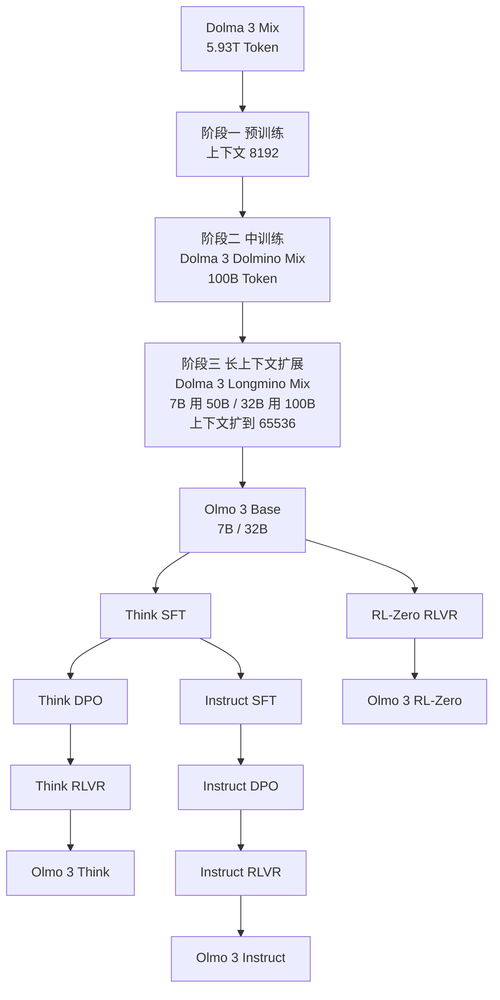
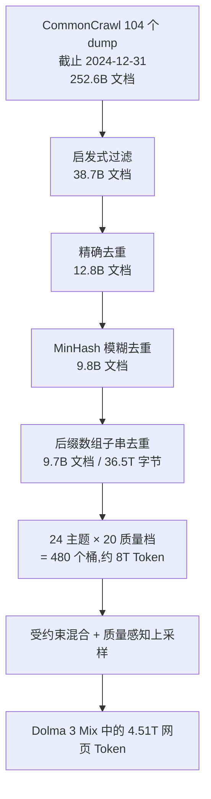
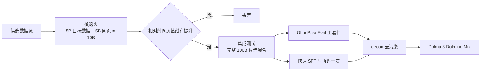
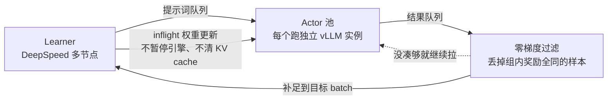

# Olmo 3：当交付物不是权重，而是整条模型流水线

<!-- release-date: 2025-11-20 -->

> 本文依据 Allen Institute for AI（Ai2）发布的 **Olmo 3** 技术报告，即 arXiv:2512.13961v2、2026-04-14 修订版，共 118 页。这是本库目前最长的一份原件。页码均指 PDF 自身的页码。文中会明确区分「报告写了什么」「我们如何解释它」和「外部资料补充」。

## 阅读前先认几个词

这篇报告的技术密度不在架构，而在数据与流程。先把几个反复出现的词说成人话：

- **基座模型（Base Model）**：只做「预测下一个词」训练、还没有学会对话格式的模型。它是后面所有变体的共同起点。
- **预训练 / 中训练 / 后训练（Pretraining / Midtraining / Post-training）**：预训练是在最大规模的通用语料上打底；中训练是在预训练末尾换一批更高质量、更有针对性的数据继续训练一小段；后训练是把基座变成能对话、能推理、能调工具的模型。
- **退火（Annealing）**：把学习率从当前值线性降到很低甚至 0 的一段训练。学习率降下来时模型对数据特别敏感，所以这一段常被用来「灌」高质量数据，也常被用来低成本地测一份数据到底有没有用。
- **SFT / DPO / RLVR**：后训练的三级台阶。SFT（Supervised Fine-Tuning，监督微调）是照着标准答案学；DPO（Direct Preference Optimization，直接偏好优化）是给一对「好答案 / 坏答案」，让模型学会偏向好的那个；RLVR（Reinforcement Learning with Verifiable Rewards，可验证奖励的强化学习）是让模型自己生成答案，再用程序判对错并据此更新。
- **去污染（Decontamination）**：把训练数据里混进来的评测题目找出来删掉。不做这一步，评测分数就可能只是背题。
- **上下文并行（Context Parallelism，CP）**：把一条超长序列切成几段，分给几张 GPU 各算一段，用于训练长上下文。

还有四个是这篇报告自己造的名字，第一次读会晕，先记住它们分别指什么：

- **Dolma 3**：基座模型用的数据集家族，包含预训练用的 Dolma 3 Mix、中训练用的 Dolma 3 Dolmino Mix、长上下文扩展用的 Dolma 3 Longmino Mix。
- **Dolci**：后训练用的数据集家族，按变体和阶段细分成 Dolci Think SFT/DPO/RL、Dolci Instruct SFT/DPO/RL、Dolci RL-Zero。
- **OlmoBaseEval**：基座模型开发期专用的评测套件，用来在小模型上做数据决策。
- **OlmoRL**：他们自己的强化学习算法与基础设施栈。

## 一句话先说清

Olmo 3 的卖点不是某个新算子，而是一个交付边界的改变：**它把整条「模型流」（model flow）交出来** ——每一个阶段、每一个中间 checkpoint、每一条数据、每一份依赖，而不只是最后那份权重（PDF p.1、p.3）。

这句话听起来像许可证声明，但它其实是一条很硬的技术约束。因为一旦承诺公开全过程，你就不能再靠「我们内部试了很多」蒙混过去：每一个决策都要有可复述的依据，而 Ai2 的算力预算又远低于前沿实验室。于是这份 118 页报告的真正内容，是一整套**在有限算力下做出可辩护决策的机制**：

- 一套能在小模型上就给出信号的评测（OlmoBaseEval）；
- 一套把「数据配比」变成带约束最优化问题的方法（Olmix 受约束混合 + 质量感知上采样）；
- 一套两层数据筛选流程（微退火做单源快筛，集成测试做组合验证）；
- 一个把去污染做成独立工具的工程件（decon），并用「乱给奖励」的负对照来反证它有效；
- 一套让小实验室也跑得起长时间强化学习的 RL 栈（OlmoRL）。

架构本身几乎是刻意保守的。这不是疏忽，是取舍：把创新预算全部押在数据与流程上。

## 全景：这个家族到底有哪些东西

Olmo 3 是 7B 与 32B 两个规模的**稠密（dense）** Transformer，不是混合专家。基座训练分三个阶段，后训练分出三个变体（PDF p.4–5）。

这张图按报告 Figure 2（PDF p.4）与第 5.2 节重画，是流程示意，不含时间比例。注意一个容易漏掉的连线：**Instruct 不是从 Base 直接开始的，它从 Think SFT 的 checkpoint 热启动**（PDF p.57）。理由后面讲。

三个变体的分工是：

| 变体 | 训练方式 | 定位 |
|---|---|---|
| Olmo 3 Think | SFT → DPO → RLVR | 先输出完整思考链再给答案，主打推理 |
| Olmo 3 Instruct | SFT → DPO → RLVR，从 Think SFT 热启动 | 不输出思考链，主打日常对话、函数调用与低延迟 |
| Olmo 3 RL-Zero | 直接从 Base 做 RLVR | 不是产品模型，是给 RL 研究社区用的基准环境 |

报告同时放出了两批「3.1」模型：Olmo 3.1 Think 32B 与 Olmo 3.1 Instruct 32B。前者是把 Olmo 3 Think 32B 的那次 RL 跑继续延长得到的，后者是把 7B Instruct 的配方放大到 32B（PDF p.1、p.7、p.38）。arXiv v2 这次修订的主要增量就是它们。

除了权重，公开的还有：预训练 9T Token 的清洗后源数据池、中训练 2T、长上下文 640B；实际训练用的数据混合本身；以及为算力有限的人准备的小尺寸样本混合（预训练 150B、中训练 10B）；训练代码 OLMo-core 与 Open Instruct；数据处理代码 datamap-rs、duplodocus、dolma3；评测代码 OLMES 与 decon；还有各模型的训练日志（PDF p.1、p.5）。

## 成本：他们拒绝只报一个美元数字

大多数报告把成本写成一个数——比如 DeepSeek-V3 的 5.576M 美元 H800 工时。Olmo 3 认为这不够有代表性，改报**墙钟时间**（PDF p.6）。

从开训到 Olmo 3 Think 32B 完成评测，总共约 56 天，用一个专属于 Olmo 3 的 1024 张 H100 集群。按每张 H100 每小时 2 美元折算，约 2.75M 美元（PDF p.7）。这个数字自洽：56 × 24 × 1024 × 2 ≈ 2.75M。

拆开看（PDF p.7）：

| 阶段 | 时长 | 资源 |
|---|---|---|
| 预训练前段（5.5T Token） | 约 9.5 天 | 512 GPU |
| 预训练后段 | 另加 35 天 | 1024 GPU |
| 中训练 | 约 1.5 天（含合并与评测） | 两个并行跑，各 512 GPU，各 100B Token |
| 长上下文扩展 | 约 1 天 | 单次跑，1024 GPU |
| 后训练（SFT + DPO + RL） | 约 9 天 | 见下 |
| Olmo 3.1 Think 32B 续跑 | 另加 21 天 | 224 GPU |

后训练那 9 天的形态和预训练完全不同：每个阶段都要跑多次、扫超参。SFT 一次扫 4 个学习率、每个 256 GPU、并行 36 小时，再加约 12 小时评测与合并；DPO 单次学习率全扫在 64 GPU 上约 18 小时，但因为集群不稳定实际拖了好几天；Think 32B 最后那次 RL 约 5 天，其中至少一天因稳定性问题白跑（PDF p.7）。

这段账值得单独记住，因为它戳破了一个常见误读：

> **只报「预训练 GPU 小时」会系统性低估真实成本。** 后训练的反复扫参，以及每次跨阶段切换时的 checkpoint 评测，都是实打实的开销，却不在那个数字里（PDF p.8）。

报告还给了一个更刺痛的数：在 7B 上打磨配方期间，**评测本身消耗了 10% 到 20% 的算力预算**（PDF p.37）。推理模型生成很长，评一次不便宜。

## 基座架构：刻意保守，只动了两处

Olmo 3 Base 明确说「基本沿用 OLMo 2」（PDF p.8）。完整配置见 Table 33（PDF p.85）：

| 配置 | Olmo 3 7B | Olmo 3 32B |
|---|---:|---:|
| 层数 | 32 | 64 |
| 隐藏维度 | 4096 | 5120 |
| Query 头数 | 32 | 40 |
| KV 头数 | 32 | 8 |
| 注意力类型 | 多头注意力 MHA | 分组查询注意力 GQA |
| 激活函数 | SwiGLU | SwiGLU |
| 归一化 | RMSNorm，作用在子层输出 | 同左 |
| QKV 归一化 | QK-Norm | 同左 |
| RoPE 底数 θ | 5 × 10⁵ | 同左 |
| 滑动窗口注意力 | 3/4 的层，窗口 4096 | 同左 |
| 梯度裁剪 / z-loss 权重 | 1.0 / 10⁻⁵ | 同左 |

相对 OLMo 2 只改了两件事（PDF p.8–9）：

**改动一：预训练上下文从 4096 提到 8192。** 直接效果是后面扩到 65536 的跨度更小。

**改动二：引入滑动窗口注意力（Sliding Window Attention，SWA）。** 每四层里有三层只让每个 Token 看前面 4096 个 Token，剩下一层做完整注意力，并且**保证最后一层一定是完整注意力**。报告给的理由是「支撑更长序列的可扩展预训练，并把推理成本控制住」。

这里有几点必须讲清边界：

- 报告**没有解释**为什么偏偏要保证最后一层是完整注意力，也没给这一条的消融。
- 3:1 的比例、4096 的窗口大小同样没有在本报告里做消融；架构选择对长上下文扩展的影响被单独写成了配套论文 Bertsch et al. (2026) 《Cracks in the foundation: Architectural choices impact long context extension》（PDF p.31）。也就是说，**想知道「为什么这样切」，这份报告本身不够，要去看那篇**。
- 一个可以推断但报告未明说的连带好处：SWA 层的相对距离永远不超过 4096，本来就在预训练见过的范围内，所以扩展上下文时不需要动它们的位置编码。这与后面「YaRN 只加在完整注意力层」的做法是一致的。这是我们的解读，不是报告原话。

训练侧：用自家 OLMo-core，7B 在序列长度 8192 下达到每卡每秒 7700 Token，32B 达到 1960 Token，全程 bfloat16，对应约 43% 和 41% 的 MFU（Model FLOPs Utilization，模型浮点利用率）（PDF p.9）。手段是 `torch.compile()`、注意力与语言建模头的自定义 kernel、异步且批量的指标收集、异步 checkpoint 写盘等（PDF p.9）。分词器直接沿用 OLMo 2 的，源自 OpenAI 的 cl100k（PDF p.10）。

学习率安排也值得一看（PDF p.86 Table 35）：7B 峰值 3.0 × 10⁻⁴、末值 3.0 × 10⁻⁵，batch 4,194,304 Token；32B 峰值 6.0 × 10⁻⁴、末值 6.0 × 10⁻⁵，batch 8,388,608 Token。报告自己点出这件事「反直觉」：32B 的学习率比 7B 还高，但被两倍的 batch size 抵消了一部分（PDF p.11）。他们在表里额外跟踪一个派生量，叫**峰值训练温度**：

$$
\text{temperature}=\frac{\text{LR}^2}{\text{bsz}}
$$

7B 预训练是 2.146 × 10⁻¹⁴，32B 是 4.292 × 10⁻¹⁴（PDF p.86）。这个量把学习率与 batch 一起看，比单看学习率更能横向比较不同规模的训练激烈程度。报告没有解释这个指标的来历，也没给它的消融，只是当作记录量列出。

## 先造尺子：OlmoBaseEval 为什么必须排在数据前面

这一节在报告里排在数据之前（第 3.3 节），顺序本身就是一个观点。

### 旧问题：小模型上的评测基本没法用来做决策

做数据决策要试很多次，试很多次就必须用小模型。但小模型有两个毛病（PDF p.10）：

1. 在数学、代码、多选题上表现接近随机猜，看不出差别；
2. 评测本身有噪声，微小的分数差分不清是数据变好了还是抖动。

于是你会陷入一个死循环：用大模型验数据太贵，用小模型验数据没信号。

### 新设计：三招把噪声压下去

**第一招，把任务聚成簇（PDF p.11–12）。** 他们收集了 70 个开源权重模型在各基准上的 23K 条成绩，假设「两个基准如果对模型的排序相似，就是在测同一个能力」，然后用 Ward 方差最小化做层次聚类（Figure 5，PDF p.12）。最后人工微调了几个任务的归属，保证同一簇内任务格式一致（比如需要执行代码的都归一簇）。得到六个簇：MC STEM、MC 非 STEM、GenQA、Math、Code、Code FIM。

为什么要聚簇？因为他们的数据干预本来就是「加数学数据」这种粒度，而不是「提高 DS-1000 分数」这种粒度。**评测的粒度应该对齐干预的粒度**，否则你会被单个基准的抖动牵着走。

**第二招，为小模型找连续代理指标（PDF p.12）。** 他们在 10¹⁸ 到 10²⁵ FLOPs 的算力跨度上评估模型，用 OLMo 2 的 25 个 scaling law 模型看低算力端、70 个开源权重模型看高算力端。结论是造一个 **Base Easy 套件**，测的不是 pass@1，而是 **BPB（bits-per-byte，每字节比特数）**：对标准答案算负对数似然，再除以答案字符串的 UTF-8 字节数。

这一招很关键。pass@1 是离散的，小模型全 0，看不出好坏；BPB 是连续的，模型哪怕答不对，"更接近对"也会体现在数值上。他们验证过：两个小模型在 Base Easy 上的排序，与它们在下游 Base Main 上的排序一致（PDF p.96）。

**第三招，直接算信噪比并砍掉噪声大的基准（PDF p.13）。** 方法是看 OLMo 2 13B 训练最后 50 个 checkpoint，加上 10 个算力量级相近（约 4 × 10²³ FLOPs）的外部模型。做法包括：能用全量评测集就不用 1K 子集；整个删掉二元基准（比如 BoolQ，因为模型常在多数类和少数类之间来回横跳）；以及把噪声太大的基准从宏平均里单独拎出来——CruxEval 测的能力（代码输入输出预测）确实独特且相关，但放进平均会污染整个簇的信号。

Figure 7（PDF p.13）给了一个具体例子：HumanEval 单项的信噪比是 54.4/17.1 = 3.2；聚合成 7 任务代码平均后升到 28.9/4.8 = 6.0；再调生成配置（比如提高 pass@k 里的 n）后升到 16.1/1.6 = 10.0。

最终 OlmoBaseEval 有 43 个任务，是 OLMo 2 那版的四倍多，并且第一次在预训练期间就跟踪数学和代码。另外留了 4 个**完全不看的留出基准**：MMLU Pro、DeepMind Math、LBPP、BBH，每个对应一个他们在预训练期重点培养的能力（PDF p.13）。Table 2 和 Table 3 的表注明确写着「Olmo 3 在发布前没有在留出基准上评测过」（PDF p.9–10）。

### 可迁移启发

> **在开始调数据之前，先证明你的尺子在你的实验规模上有分辨率。**

这条对任何要做大量 A/B 的工程都成立。具体的三个动作可以直接搬走：把指标聚合到与你的干预同粒度；把二元指标换成连续代理量；用历史 checkpoint 序列估计噪声地板，把信噪比低于阈值的指标踢出决策集。

## 阶段一：预训练数据是怎么造出来的

Dolma 3 Mix 的组成（PDF p.14 Table 4）：

| 来源 | 类型 | 9T 池 | 5.93T 训练混合 |
|---|---|---:|---:|
| Common Crawl | 网页 | 8.14T | 4.51T（76.1%） |
| olmOCR science PDFs | 学术文档 | 972B | 805B（13.6%） |
| Stack-Edu（重配比） | GitHub 代码 | 137B | 409B（6.89%） |
| arXiv | 带 LaTeX 的论文 | 21.4B | 50.8B（0.86%） |
| FineMath 3+ | 数学网页 | 34.1B | 152B（2.56%） |
| Wikipedia 与 Wikibooks | 百科 | 3.69B | 2.51B（0.04%） |
| 合计 | | 9.31T | 5.93T |

注意 Stack-Edu、arXiv、FineMath 三行的「训练混合」比「池」还大——这是上采样，同一份数据被重复训练。报告设了上限，任何域重复不超过约 4–7 次（PDF p.19）。

两条选源原则写得很直白（PDF p.14）：

1. 一个来源要进预训练，必须能产出足够多的 Token 才有意义。**好但小的数据源应该留给中训练。**
2. 结构化的「任务数据」（问答对、对话样本）不进预训练，只在中训练和长上下文扩展用。理由有两层：量不够；以及任务数据对评测结果影响过大，会**干扰其他数据源的消融**。

第二条的后半句是个容易被忽视的实验设计问题：如果你的混合里塞了大量和评测同分布的任务数据，那评测分数主要由这部分决定，你就再也测不出别的数据源好不好了。

### 网页数据的漏斗

这张图按第 3.4.1 节（PDF p.15–16）与附录 A.2（PDF p.87–88）重画，数字是报告实测值，不是示意。

**启发式过滤（PDF p.15、p.87）** 基本照搬 DCLM：URL 黑名单、太短太长、符号过多、字母太少、内部重复过多、垃圾短语、fastText 英语识别（阈值 0.65）、MADLAD-400 的可疑句规则（只用了其中第 2 和第 5 条，其余经消融没用）。整体砍掉约 85%。附录 Table 36（PDF p.87）还给了成本账：这一步花了 1030 个 i4i.32xlarge EC2 实例小时，约 11,300 美元；其中「内部重复」检测占了 31.41% 的时间，质量分类器占 24.58%。

附录里还藏了一条纯工程的经验：这些启发式过滤器彼此可交换，而英语过滤是最慢的一步，所以**把语言过滤放到最后**能省不少（PDF p.87）。

**三段式去重（PDF p.15–16）** 的设计逻辑值得单独讲。他们引了三条前人结论：去重让训练更 Token 高效；重复次数本身是弱质量信号（重复多的往往更好）；同一文档重复超过几次收益迅速衰减。这三条互相拉扯——第二条说重复有信息，第一条说重复要删。

他们的解法是：**先把重复信号全部丢掉，把语料洗到几乎无重复，再按质量有选择地把重复加回来。** 于是：

1. 精确去重（文本哈希）：删掉 67%，38.7B → 12.8B 文档；
2. MinHash 模糊去重（32 分片，簇内再做穷举 Jaccard 校验，每簇保留爬取时间最新的那份）：删掉 23%，→ 9.8B；
3. 子串去重：57 分片，标记出现多次、长度 ≥ 500 字节的子串。这里有个新做法——**保留每段重复子串在语料中的至少一次出现**，并把夹在两段长重复之间的短片段一并合并删除。删掉 14% 的文本字节，最终 9.7B 文档、36.5T 字节。

第三步那个「合并区间」的细节很实用：朴素的后缀数组去重会在删掉的段落之间留下一堆孤零零的短碎片，读起来是乱码。附录给了更精确的判据（PDF p.88）：如果一段文本两侧都被重复的 500 字节序列夹住，且这段里至少 80% 被重复序列覆盖，就整段删掉。

顺带记一条**阅读时发现的内部不一致**：正文说启发式过滤后剩 38.8B 文档、削减 84.6%（PDF p.15），附录说 38.7B、削减 84.9%（PDF p.87）；正文说精确去重后剩 12.8B、删掉 67%（PDF p.15），附录说 12.7B、删掉 66%（PDF p.88）。差异很小，不影响结论，但引用时最好注明用的是哪一处。

**主题与质量分类（PDF p.16）**：用 WebOrganizer 把语料分成 24 个主题（如「成人内容」「政治」「科学数学与技术」）。为了在万亿 Token 规模上跑得动，他们把 WebOrganizer 原本 140M 参数的 Transformer 分类器**蒸馏成一个 fastText 模型**，在 20,000 条留出样本上精确率与召回率都是 0.762（PDF p.89 Table 37）。质量分类器同样是 fastText，正例用 OpenHermes-2.5、ELI5、UltraChat-200k、WildChat-1M，负例是 DCLM-RefinedWeb 抽的 30GB。

然后是关键一步：**先按主题切，再在每个主题内部按质量分位切成 20 个 5% 的桶**，得到 24 × 20 = 480 个互不相交的子集。这个二维切分是后面所有配比操作的基础设施。

### 受约束混合：把配比变成最优化问题

数据配比通常靠经验。Olmo 3 把它变成可求解的问题，方法叫 Olmix（配套论文 Chen et al. 2026，PDF p.89）。基础流程三步（PDF p.18–19）：

1. **蜂群构造**：训练大量 30M 参数的小模型，每个用不同的配比，配比从以「自然分布」为中心的 Dirichlet 分布里采样。每个小模型训 3B Token（5 倍 Chinchilla）。经验法则是蜂群规模取域数量的 5 倍。
2. **逐任务回归**：每个小模型给出一个「配比 → 各任务 BPB」的数据点，为每个任务拟合一个广义线性模型。
3. **配比优化**：在预测的平均 BPB 上做最小化。因为总预算 6T Token，且不允许任何域重复超过约 4–7 次，可用 Token 量天然构成上界约束。用带引导的搜索求解，从先验或自然分布出发。

真正新的是第二层，叫**条件混合（conditional mixing）**。现实里数据源一直在变：过滤器改了、新域加了、发现质量问题要重做。每次都重跑整个蜂群太贵。条件混合的做法是：**把已经优化好的那份混合当成一个「虚拟域」，冻结它内部的比例，只在「这个虚拟域 + 新域」的低维空间里重跑一次基础流程。**

于是他们实际跑了三轮（PDF p.19）：先在 DCLM-Baseline 上优化 24 个 WebOrganizer 主题的比例；再固定网页占 75%、强制代码占 25%，只优化 25% 内部的编程语言构成；最后在前两者冻结的条件下并入 PDF 数据的 24 个主题。报告特意说明，PDF 数据的整理**比其他来源晚完成很多**，条件混合让他们能接纳晚到的数据而不必重跑昂贵的蜂群（PDF p.19）。

效果（PDF p.19，Figure 9）：优化后的网页混合大幅上调 STEM 类主题；在 1B 模型、5 倍 Chinchilla 的设定下，平均 BPB 改善 0.056，最大改善 0.209；54 个任务里只有 13 个退化，且没有一个退化超过 0.035。附录 Table 38（PDF p.91）进一步展示了这套方法的可调性：把开发套件换成偏 QA、偏数学或偏代码，产出的混合就会各自偏向对应能力。

可迁移的一点是很朴素的工程智慧：

> **当输入分布会持续演化时，不要设计一个只能全量重算的优化过程。把已收敛的部分冻成一个整体，只在增量维度上重新求解。**

这个模式在特征工程、超参搜索、缓存失效策略里都能复用。

### 质量感知上采样：不是只挑最好的那 25%

DCLM 的做法是「平的」：质量分数过线就要，不过线就扔。Olmo 3 认为在**数据受限**的场景下这不是最优（PDF p.19–20）。

举例：要从 1T 的池里造 250B 的混合。平的做法就是取质量最高的四分之一。他们的做法是**给最高质量的那 5% 多来几份，其余各来一份**，凑够目标 Token 数。

形式化成「上采样曲线」（Figure 10，PDF p.20）：横轴是质量分位数，纵轴是这一档数据被重复的倍数。平过滤是阶跃函数，质量上采样是单调递增曲线。曲线在 [0,1] 上的积分决定这个主题总共出多少 Token。

附录 A.2.4（PDF p.89–90）给了具体的函数族。他们要一族满足这些条件的函数：凸且单调、定义在 [0,1] 上、积分可控为 $Z/X$、任一质量桶的平均值不超过上限 $M$、可以把最低质量的一段直接砍掉。选中的是**截断幂指数族**：

$$
f_{p,\lambda}(x)=
\begin{cases}
0, & x < a\\
C\,(x-a)^{p}\,e^{\lambda(x-a)}, & x \ge a
\end{cases}
$$

其中 $x$ 是质量分位，$a$ 是丢弃阈值，$p$ 与 $\lambda$ 控制曲线形状，$C$ 是归一化常数。实际取 $M=7$（最多重复 7 次）、$a=0.40$（扔掉质量最低的 40%），然后数值求解可行的 $p,\lambda,C$（PDF p.90）。

附录 A.2.5 给了三组验证，都用 1B 模型训 100B Token（PDF p.90–91）：

- Table 39：模拟 4.51T 的数据受限训练，质量感知上采样在**所有**重复倍数下都优于平过滤。比如 Math Easy 的 BPB，平过滤取前 5%（重复 11.1 次）是 0.843，质量上采样是 0.740（越低越好）。
- Table 40：怎么把「按主题配比」（行约束）和「按质量上采样」（列约束）合起来？他们试了只用其一、算术平均、几何平均、截断指数族、截断幂指数族，最后截断幂指数族最好（QA/Math/Code Easy 分别 0.993/0.758/0.783）。

这里的思路和 mHC 那类「加自由度同时加约束」的做法有点像，但更朴素：**把一个凭感觉的旋钮，改写成一个有明确约束、可以数值求解的函数族。** 好处不只是分数高一点，而是这个决定从此可复述、可复现、可交给下一个人接手。

### 一个小而实用的监控技巧

训练中途怎么判断跑得好不好？学习率还高的时候，损失和评测都不能直接反映最终质量。对 7B 可以定期退火到 0 看一眼，但对 32B 太贵。他们的替代方案是：**取间隔 1000 步的四个 checkpoint 做权重平均，评这个平均模型**（PDF p.20）。

## olmOCR science PDFs：一份新数据源，赚了两次

这是 Dolma 3 里唯一全新的大型来源，也是长上下文能力的来源。

**采集（PDF p.16）**：自建爬虫，报告强调「礼貌爬取」——爬虫标识为 AI2Bot、遵守 robots.txt、不绕过付费墙。种子偏向学术站点与论文库。最终 238M 份唯一 PDF，截止 2024 年 12 月。

**转文本（PDF p.16）**：先预筛，用 Lingua 语言检测只留英文，去掉垃圾/SEO 关键词超过总词数 0.4% 的文档；然后用 olmOCR（0.1.49–0.1.53 版）抽文本；olmOCR 失败时退回 Poppler 的 `pdftotext`，但**如果一份文档里超过每 250 页就有 1 页需要退回，整份剔除**。剩 160M。

**去重（PDF p.16）**：MinHash，用 FineWeb 的参数（目标相似度 75%），且省掉了穷举 Jaccard 校验。剩 156M，删除率 2.3%——比网页低得多，符合直觉。

**PII 过滤（PDF p.17）**：这一段最有意思。目标是删掉含敏感个人信息的文档，但他们在迭代中发现，**PII 检测必须按文档类型区分才有意义**。会议论文里当然有作者姓名和单位，但论文本来就是要公开发表的，删掉毫无道理；银行对账单里出现同样的姓名和雇主信息，就绝不该拿来训练。

于是他们定下的判据是一句话：**这类文档本来就是为公开传播而存在的吗？** 然后用人工标注迭代出一套文档类型分类法，做成多级模型过滤流水线：先用 Gemma 3 12B 读每份文档的第一页判断是否含敏感独立 PII 或把敏感信息关联到个人；再用 Gemma 3 4B 读前 5000 字符打文档类型标签；最后按规则决定去留。这一步删掉 4.9%，剩 148M。

**再一轮启发式（PDF p.17）**：抓漏网的非英文、表格占比超过 30% 的、数字占比超过 20% 的；把 Markdown 表格转成 HTML；去掉 URL 引用。剩 108M。

这份 PDF 池的第二次价值在长上下文：其中长度超过 8K Token 的文档有 2230 万份、共 640B Token，超过 32K Token 的有 450 万份、共 380B Token。报告称这是目前**公开可得的最大长上下文研究语料**（PDF p.5）。

> **可迁移启发：判断一条数据能不能用，往往不能只看内容特征，要先问它属于哪一类文书。** 同样的姓名 + 单位组合，在论文里是元数据，在对账单里是隐私。把「文档类型」显式建模出来，比不断给内容分类器加规则更根本。

## 阶段二：中训练，以及一套两层数据筛选机制

中训练在 100B Token 上进行，数据是 Dolma 3 Dolmino Mix，从一个 2.19T 的池里采出 99.95B（PDF p.21 Table 5）。相比 OLMo 2 的 Dolmino Mix，三处改进（PDF p.20–22）：加了方法论框架；从只做数学扩到代码、数学、通用知识 QA；有意识地放进指令数据和思考链，为后训练打底。

### 两层筛选：微退火 + 集成测试

这张图按 Figure 11（PDF p.21）与第 3.5.1 节重画，是流程示意。

**微退火（microanneal）** 是 OLMo 2 就有的方法，这一代做了更系统的基线化（PDF p.22）：选定目标数据集 → 采 5B Token → 配 5B 网页 Token → 在这 10B 混合上退火 → 和「10B 纯网页」退火的基线比。这样测出来的不是「这份数据能带来多少提升」，而是 **「这份数据比同样多的普通网页数据好多少」** ，把「继续训练本身就会涨分」这个混淆项减掉了。

报告也诚实标注了这个方法的松散处（PDF p.22 脚注 13）：实际微退火规格随数据集需求变化，有些只有 2.5B 可用就跑 5B 的，有些把目标数据当作更大混合里的一小部分，还有些为了在大量变尺寸数据集之间比较而直接省掉了算力对齐的基线。**所以微退火数字之间不总是严格可比。**

**集成测试** 补上微退火测不到的东西（PDF p.22）：数据源组合起来是否还有效；100B 的长跑与 5–10B 的短跑是否结论一致。而且集成跑出的 checkpoint 会**快速做一遍 SFT 再评一次**，验证中训练的收益能穿透到后训练。这一步很重要，因为基座分数涨了不等于更好微调。

他们一共跑了五轮集成测试，报告里给三轮（PDF p.22、p.27 Table 6）：

| 混合 | OlmoBaseEval 平均 | MC STEM | GenQA | Math | Code | SFT 后平均 |
|---|---:|---:|---:|---:|---:|---:|
| Round 1 | 49.7 | 64.3 | 68.3 | 47.4 | 23.4 | 35.2 |
| Round 3 | 50.7 | 64.9 | 68.1 | 48.7 | 24.4 | 35.3 |
| Round 5 | 53.1 | 65.3 | 70.8 | 57.1 | 27.7 | 37.3 |

报告补了一句：Round 5 才引入去污染，所以它相对前两轮的真实收益**在表里是被低估的**（PDF p.27）。这个自我修正很关键——去污染会让分数下降，所以「加了去污染还涨了 2.4 分」比表面数字更强。

### 数据本身：为许可证重做别人的数据集

中训练混合里有一批叫 CraneMath、CraneCode、MegaMatt 的数据集。它们的来历都一样：**原版效果很好，但是用 Llama 模型生成的，带 Llama 社区许可证限制，用了之后模型名字里得带「Llama」**，与「完全开放」的目标冲突。所以他们用 Qwen3 或 Qwen2.5-Coder 按原论文的提示词重做了一遍（PDF p.23–24、p.92–93）。

数学侧总共考察 25 个来源、跑了 80 次微退火，最终选 5 个（PDF p.23）。几个代表：

| 数据集 | Token 量 | 微退火提升（相对退火前基线） |
|---|---:|---|
| Dolmino-1 Math（沿用 OLMo 2） | 10.7B | MATH +10.4，GSM8K +38.2 |
| TinyMATH（新造） | 1.14B | MATH +13.2，GSM8K +13.9 |
| SwallowMath（原版，带 Llama 许可） | 3.6B | MATH +16.0，GSM8K +24.5 |
| CraneMath（用 Qwen3 复刻） | 5.62B | MATH +18.5，GSM8K +27.4 |
| MegaMath-Web-Pro-Max（原版） | 5B | MATH +7.0，GSM8K +13.3 |
| MegaMatt（复刻） | 3.88B | MATH +8.0，GSM8K +13.0 |

复刻版基本追平甚至略超原版。附录还给了一个有意思的观察：CraneMath 从 FineMath4+ 的 9.6B Token 蒸出 5.62B，比 SwallowMath 的 2.3B 多，作者推测是因为**Qwen3 作为改写模型比 Llama「话更多」**（PDF p.92）。

附录 Table 41（PDF p.92）把所有数学微退火按「每 Token 效果」归一化后排了个序，得到一个很清晰的分层：

1. 最上层是 TinyMATH 系列——不到 10 亿 Token，每 Token 效果最强，因为它就是照着 MATH 评测造的；
2. 中层是对高质量自然数据的合成改写（Crane、SwallowMath、MegaMatt）；
3. 最下层是最大的自然数据源（FineMath4+、MegaMathWeb），有提升但每 Token 效果明显小。

而且**质量层级与可得 Token 量呈反相关：最高质量的源也最小**。这条规律直接支撑了前面「好但小的源留给中训练」的选源原则。

附录还点出一个代价：数学中训练对 MMLU 的影响总体是中性到负面的，而且**数据越是针对数学评测优化，对 MMLU 的负面影响越大**，作者称之为「过度烹饪（overcooking）」（PDF p.93）。Table 42（PDF p.94）在代码侧看到同样现象：SwallowCode 与 CraneCode 都提升代码指标，但都以 MMLU 下降为代价。

### 领域取舍是真实存在的，而且能被测出来

这是本章最有价值的实证之一（PDF p.27 Table 7）。他们额外跑了两个刻意偏科的 100B 退火：

| 混合 | MC STEM | MC 非 STEM | GenQA | Math | Code | FIM |
|---|---:|---:|---:|---:|---:|---:|
| Gen-QA 偏科混合 | 66.3 | 78.1 | 72.5 | 27.5 | 11.9 | 0.1 |
| 数学-代码-思考偏科混合 | 62.5 | 69.6 | 65.9 | 60.8 | 35.6 | 37.7 |
| Round 5（最终混合） | 66.4 | 77.4 | 73.1 | 57.3 | 31.2 | 31.7 |

读法：往数学和代码加权，数学能从 57.3 涨到 60.8、代码从 31.2 涨到 35.6，但多选题和 GenQA 全线下滑（MC 非 STEM 从 77.4 掉到 69.6）。反过来，往 Gen-QA 加权，QA 类几乎没涨（72.5 对 73.1，甚至更低），数学代码却崩了（Math 27.5、Code 11.9、FIM 0.1）。

两条结论：**取舍是不对称的**——加数学代码换得到东西，加 QA 换不到；以及最终混合确实落在一个还算平衡的位置上。

Table 8 和 Table 9（PDF p.28）显示，这种取舍在单个数据源层面同样存在。Reddit-to-Flashcards 让 MMLU 从 55.6 涨到 58.8、ARC 从 78.1 涨到 80.7，但 GSM8K 从 22.4 掉到 21.2、Minerva 从 6.1 掉到 4.5。新造的推理数据让 GSM8K 从 18.4 涨到 26.8、Minerva 从 6.3 涨到 13.6、HumanEval 从 7.9 涨到 19.5，但 MMLU 从 55.2 掉到 53.7。

> **不要只看某个数据源在目标指标上的增益，要同时看它在非目标指标上的代价。** 这两张表最大的贡献不是某个具体数字，而是给出了一个应该常态化的对照格式。

不过也有互补的情况：把思考链和指令数据放进中训练混合（保持总 Token 数不变），基座评测**每一项都变好**（平均 48.8 → 50.7，PDF p.29 Table 10）。所以「有取舍」不等于「一定零和」，要一项项测。

### 特殊 Token 的教训

这条又短又实用（PDF p.28）。他们想知道中训练的指令数据里要不要保留 `<|im_start|>`、`<|im_end|>` 这类聊天特殊 Token。做了对照微退火，结论是：

**训练数据里含这些特殊 Token 的模型，在推理时会自己吐出它们，导致评测分数灾难性下跌** ——GSM8K 从 49.43 掉到 0，CruxEval 从 32.89 掉到 18.91。

关键是他们做了第二个对照：**保留聊天模板结构，但用普通文本代替特殊 Token**，分数几乎不掉（GSM8K 46.02、CruxEval 29.65）。这就把原因锁定了：问题不在「有对话格式」，而在**把新的特殊 Token 引入词表，而它们在预训练中从未出现过**。

分数暴跌本身主要是答案解析失败造成的假象，但报告指出更本质的问题是：基座模型开始在推理时发射这些 Token，这本身就是不该有的行为。所以最终决定去掉模板和特殊 Token，回到简单的换行分隔。

有意思的是，Olmo 3 Instruct 在后训练阶段又走了相反的路：为函数调用**专门扩了词表、加了特殊 Token**，并说这比把 `<functions>` 之类当普通文本更有效（PDF p.56）。两处结论并不矛盾——差别在于特殊 Token 是在哪个阶段引入、模型有没有充分训练过它们。这个对照本身就是这份报告因为公开全流程才可能呈现的。

### 去污染：从「跑个脚本」变成一个工程件

他们把去污染做成独立开源包 `decon`（PDF p.26，详细算法在附录 A.5，PDF p.101–105）。两阶段：

1. **检测阶段**：对每份训练文档，按固定步长采样 n-gram，检查是否命中评测集的已知 n-gram；
2. **簇扩展阶段**：一旦命中，就向两侧扩展，数相邻的被污染 n-gram 数量；超过阈值就判定整份文档被污染并删除。

两阶段拆开是为了效率：检测用不重叠的间隔快速扫，扩展才做细致匹配。附录里还有更细的评分组合（按 Question / QA / QP / QAP 四种组成方式加权，配合 IDF 加权的重叠度、答案邻近性、段落邻近性），这部分我不展开——它是包文档的搬运，要用的话应该直接读 `decon` 仓库。

他们只对**中训练和长上下文扩展**做去污染，理由是有研究表明记忆主要发生在训练末期（PDF p.26）。这是个明确的取舍：预训练那 5.9T Token 没有做这一层去污染。

迭代过程也写出来了：第一版因为预处理问题没能对 SQuAD v2 去污染；DROP 因为「针对一段文字的短问题」这种格式被错误处理。修法是把 question、answer、passage 分开评分，主要匹配 question，用 answer/passage 的匹配作为短问题或改写问题的辅助证据；多选题改为匹配完整答案而非 A/B/C/D 标签（PDF p.26）。

Figure 12（PDF p.29）给出污染最重的十个来源，结论是**大部分污染来自已有的公开数据集**，尤其是 Flan 和 Nemotron。而且很多污染不隐蔽：整个验证集或测试集被套模板灌进来。Flan 本身就是用基准数据加模板构造的，自然会包含被用于开发决策的验证集（比如 DROP）。

关于污染对分数的影响，报告的表述很克制（PDF p.29–30）：

- 有些基准差异明显（DROP、Minerva、SQuAD）；
- 但因为他们删除的是**所有 split**（DROP 光是从 Flan 里就删掉超过 6 万条训练样本），所以分数差异**可能是防止了记忆，也可能只是删掉了同分布的训练样本** ——这两者报告没有分开；
- 有些基准哪怕被污染也没有分数虚高：DeepSeek LeetCode 无论有没有污染都接近 0，SQuAD 在更简单的多选指标下两种情况都饱和；
- 最反直觉的一条：GSM8K 被检测出**完全泄漏**，但用去污染后的数据反而表现更好。这与 Marin 32B 的报告一致，Marin 作者的解释是污染样本的格式与评测格式不匹配（PDF p.30）。

### 模型汤

对 32B，他们跑了两次中训练（只换数据顺序种子），然后把两个 checkpoint 合并。相对单次跑，合并模型在 MC STEM 上提升近 1 分、GenQA 提升 0.4、Math 相对两次跑分别提升 2.9 和 1.6，MMLU 约提升 1 分，GSM Symbolic 分别提升 5 分和 2 分（PDF p.30）。所以最终 32B 中训练 checkpoint 用的是合并版。

但 7B 的早期实验**没有**看到类似增益，所以 7B 用的是单次跑的结果（PDF p.30 脚注 24）。这条负面结果写出来很好——说明模型汤的收益依赖规模，不能默认照搬。

## 阶段三：把 8K 扩到 65K，只用 50B 到 100B Token

### 先看看别人怎么做

报告花了一整段做横向调研，这在技术报告里少见（PDF p.30–31）：长上下文扩展的 Token 预算在各家之间**差了两个数量级**。SmolLM3 用 100B，GLM 4.5 用 100B，DeepSeek V3 用 123B，Apertus 用 225B；Kimi K2 用 400B，Llama 3.1 用 800B，DeepSeek V3.1 用 840B。另一端，AFM 和 Nemotron Nano 2 用不到 20B 就分别扩到 64K 和 128K。独立的扩展配方更省：ProLong 用 20B，LongAttn 用 5B。

插入位置也各不相同：Llama 3.1 在中训练**之前**扩，Qwen 2.5 和 Qwen 3 在**之后**扩，GLM 4.5 甚至在 SFT 之后才扩。

这段调研本身是有价值的公共品——它把「长上下文扩展该花多少」这个问题的答案区间摊开了：**没有共识**。

### Olmo 3 的配方与五个消融

数据是 Dolma 3 Longmino Mix，池 639B、7B 用的混合 50B（32B 用 100B、保持同样比例）（PDF p.30 Table 11）。构成上，**34% 是长文档，66% 是从 Dolmino 中训练混合里采的高质量短文档**。

Figure 13（PDF p.32）在 RULER 基准上给了五个组件的消融曲线：

| 组件 | 结论 |
|---|---|
| 位置编码扩展 | 只对完整注意力层用 YaRN 最好，优于对所有层用 YaRN、只调 RoPE 底数（8M 或 500K） |
| 数据来源 | Longmino 优于 ProLong |
| 合成增强 | 自然 PDF + 合成 CWE + 合成 REX 优于只用自然 PDF |
| 文档打包 | best-fit 打包在更长上下文处明显更好 |
| Token 预算 | 从 1B 到 100B 单调变好，越长的序列受益越明显 |

其中「长短比例」有具体数字（PDF p.34）：在 10B 的早期实验里，**66% 长 / 34% 短**会让 OlmoBaseEval 子集掉 2.5 分；**34% 长 / 66% 短**只掉 0.8 分。所以选了后者。

三个细节值得单独讲：

**best-fit 文档打包（PDF p.34）**：预训练时的标准做法是把文档首尾相接再按固定长度切开。扩上下文时这个做法有个隐患——切出来的训练样本**平均长度比原始文档分布还短**，你花钱扩上下文，喂进去的却不是真的长样本。best-fit 打包尽量少切文档，只付出可忽略的 padding。

**文档内掩码（PDF p.35）**：保证每条训练序列只在同一份原始文档内做注意力，防止跨文档的虚假注意力模式。

**长上下文训练基础设施（PDF p.35）**：8 路上下文并行，每张卡处理每条训练样本的 8K Token。用的是 all-gather 式的 CP 注意力，理由很实际——**这种实现更容易支持不规则的注意力掩码**，而他们同时有滑动窗口掩码和文档内掩码。附录 Table 34（PDF p.85）给了吞吐代价：7B 从中训练的每卡每秒 8.5K Token 掉到 4.0K，32B 从 2.0K 掉到 1.3K。

最后同样用了模型汤，但方式不同：不是跑多次换种子，而是**合并同一次扩展跑末尾的三个 checkpoint**（第 10,000、11,000、11,921 步）（PDF p.35）。

### 合成长上下文数据：绕过自举难题

绝大多数长文档天然不提供「在长输入上做信息抽取与综合」的监督信号。但要造这种数据，你又需要一个已经能处理长上下文的模型——这是个自举难题（PDF p.32）。

他们的绕法（PDF p.32–34）：

1. 把长度 $n$ 的文档切成 $m$ 段，每段 8K 到 32K Token，尽量切在自然断点（比如新章节之前）；
2. 每段做归一化和分词，抽取一词和两词名词短语，用 tf-idf 找出最显著的；
3. 每个名词短语按 tf-idf 排序选 $k=8$ 个片段；
4. 把名词短语、片段和任务描述提示词交给一个语言模型生成聚合任务。

关键在于**语言模型只需要读那 8 个片段，不需要读整篇文档**。他们最终用的生成器是 OLMo 2 Instruct 32B——一个 4K 上下文的模型（Olmo 3 之前的一代），照样造出了 65K 的训练数据。

两种任务（PDF p.34）：

- **CWE（Common Word Extraction，常见词抽取）**：给 5 个高频单词名词短语，要求生成的问答对答案必须是「这个词在这段里出现了正好多少次」。这是纯计数任务，必须真的通读全段。
- **REX（Rewriting EXpressions，表达改写）**：针对每个名词短语和对应片段，生成 12 种体裁之一的聚合任务——短摘要、师生对话、给高中生的简单段落、抽认卡、随堂测验、游戏节目、晚宴、辩论、真假判断列表、电影场景、百科词条，或 r/explainlikeimfive 风格的解释。

Olmo 3 只对 32,768 ≤ n < 65,536 的文档做这个处理（PDF p.34）。

> **可迁移启发：造监督信号时，「生成器需要具备的能力」和「学生要学的能力」不必是同一个。** 先用便宜的统计手段（这里是 tf-idf）把长输入压成生成器能吃下的少量证据，让生成器只负责它擅长的那部分——写题面。

### 长上下文的实际效果，读起来要小心

Table 12（PDF p.33）用 RULER 做开发套件、HELMET 做留出套件。摘几行：

| 模型 | RULER 32K | RULER 65K | HELMET 32K | HELMET 65K |
|---|---:|---:|---:|---:|
| Olmo 3 7B | 78.79 | 67.96 | 41.15 | 36.80 |
| Llama 3.1 8B | 91.43 | 86.88 | 42.44 | 40.18 |
| Qwen 2.5 7B | 87.26 | 67.30 | 42.99 | 30.47 |
| Olmo 3 32B | 86.22 | 79.70 | 48.60 | 43.15 |
| Qwen 2.5 32B | 92.67 | 80.73 | 54.01 | 41.73 |
| Gemma 3 27B | 87.06 | 84.59 | 50.31 | 48.60 |
| Mistral Small 3.1 24B | 92.42 | 88.80 | 47.46 | 43.34 |

报告的说法是「Olmo 3 Base 32B 在长上下文基准上可以和 Qwen 2.5 32B、Mistral Small 3.1 24B、Gemma 3 27B 相比，尽管扩展阶段很短」（PDF p.5）。对照表看，这个说法在 HELMET 65K 上成立（43.15 对 41.73/43.34/48.60，赢一个平一个输一个），**但在 RULER 65K 上 Olmo 3 32B 低于全部三个对手**（79.70 对 80.73/88.80/84.59）。7B 则明显落后 Llama 3.1 8B。

更准确的表述应该是：**用 50B–100B Token 的短扩展，换来了在通用长上下文任务上大致进入同一梯队的能力，但在合成检索类任务的最长档上仍有差距。** 报告自己也提醒 RULER 和 HELMET 有重叠，所以后者不是完美的留出集，只是重叠的子集通常是模型都能轻松做满分的简单项（PDF p.31 脚注 25）。

## 基座结果：三个阶段各自贡献了什么

Table 13（PDF p.36）按阶段拆开，这是全报告最有信息量的表之一。摘 Olmo 3 的行：

| 阶段 | 累计 Token | Math | Code | MC STEM | GenQA | Minerva | GenXL |
|---|---:|---:|---:|---:|---:|---:|---:|
| Olmo 3 7B 阶段一 | 5.9T | 23.5 | 19.8 | 64.0 | 68.5 | 12.2 | 34.7 |
| Olmo 3 7B 阶段二 | 6T | 59.8 | 31.9 | 67.2 | 71.3 | 41.4 | 49.1 |
| Olmo 3 7B 阶段三 | 6.05T | 54.4 | 30.6 | 66.4 | 72.5 | 39.8 | 43.6 |
| Olmo 3 32B 阶段一 | 5.5T | 48.4 | 29.8 | 72.3 | 76.1 | 26.7 | 47.8 |
| Olmo 3 32B 阶段二汤 | 5.7T | 69.7 | 39.7 | 75.6 | 79.4 | 46.9 | 59.7 |
| Olmo 3 32B 阶段三 | 6.2T | 61.4 | 39.7 | 74.3 | 79.7 | 42.9 | 59.4 |

两个观察：

1. **中训练那 100B Token 的杠杆极大。** 7B 的 Math 从 23.5 跳到 59.8，只用了不到总量 2% 的额外 Token。这是全篇最强的「数据质量 > 数据数量」证据。
2. **长上下文扩展是要付学费的。** 7B 的 Math 从 59.8 回落到 54.4，32B 从 69.7 回落到 61.4。GenQA 略涨、Code 基本持平。报告在正文里说，相对 OLMo 2，Olmo 3 在科学、数学、代码上明显进步，而**在通用知识基准上有轻微退化，原因正是对 STEM 数据的偏重**（PDF p.35）。

第 2 点报告只提了 STEM 偏重，没有单独讨论阶段三的数学回落。结合 34%/66% 那个消融（长上下文数据会拉低短上下文表现），一个合理但报告未明说的解释是：这就是那 0.8 分代价在更细粒度指标上的放大。这是我们的推断，不是报告结论。

## Olmo 3 Think：三级台阶，每一级都要能证明自己

### 评测设定先说清楚

所有后训练评测统一：最大上下文 32K，采样温度 0.6，top-p 0.95，**评分前把 `<think>...</think>` 之间的思考链剥掉**（PDF p.37、p.40、p.114）。报告特意提醒，有些模型在更大的推理预算下会更好，例如 K2 V2 用的是 128K（PDF p.37）。

他们还量化了评测方差：取 14 个模型（含基线和自家模型）各跑 3 次的标准差平均，按方差分档（PDF p.37）——高方差：GPQA 1.4798、AlpacaEval 3 1.2406、IFEval 0.8835；稳定：ZebraLogic 0.5638、Omega 0.5579、AIME 24 (Avg@32) 0.5437 等；非常稳定：LiveCodeBench (Avg@10) 0.2852、MMLU 0.2219、PopQA 0.1554。

**读任何一张后训练对比表时，先看这份方差表。** GPQA 上 1.5 分以内的差距基本不构成证据。

### 旗舰结果

Olmo 3.1 Think 32B 对比（PDF p.7 Table 1、p.38 Table 14）：

| 基准 | Olmo 3 Think 32B | Olmo 3.1 Think 32B | Qwen 3 32B | DS-R1 32B | OLMo 2 Instruct 32B |
|---|---:|---:|---:|---:|---:|
| MATH | 96.1 | 96.2 | 95.4 | 92.6 | 49.2 |
| AIME 2024 | 76.8 | 80.6 | 80.8 | 70.3 | 4.6 |
| AIME 2025 | 72.5 | 78.1 | 70.9 | 56.3 | 0.9 |
| ZebraLogic | 76.0 | 80.1 | 88.3 | 69.4 | 13.3 |
| LiveCodeBench v3 | 83.5 | 83.3 | 90.2 | 79.5 | 10.6 |
| IFEval | 89.0 | 93.8 | 86.5 | 78.7 | 85.8 |
| IFBench | 47.6 | 68.1 | 37.3 | 23.8 | 36.4 |
| MMLU | 85.4 | 86.4 | 88.8 | 88.0 | 77.1 |
| GPQA | 58.1 | 56.7 | 67.3 | 61.8 | 36.4 |
| AlpacaEval 2 LC | 74.2 | 69.1 | 75.6 | 26.2 | 38.0 |

诚实读法：

- 相对上一代 OLMo 2 是数量级的跃迁，相对同为完全开放的 Apertus 70B、LLM360 K2-V2 70B 也全面领先（PDF p.7）；
- 相对 Qwen 3 32B 是**互有胜负**：数学和指令遵循赢，ZebraLogic、LiveCodeBench、MMLU、GPQA 输。报告的措辞是「缩小了差距」，不是「超越」，这个措辞是准确的；
- 报告强调 Olmo 3 Think 32B 的训练 Token 数只有 Qwen 3 32B 的六分之一（PDF p.3、p.38）。但报告**没有给出 Qwen 3 的具体 Token 数**，这个倍数只能作为量级参考；
- Olmo 3.1 相对 Olmo 3 的提升集中在数学、推理和指令遵循（AIME +4 以上、ZebraLogic +4、IFEval +4、IFBench +20 以上），大多数其他基准基本不变，**但 AlpacaEval 掉了 5 分**（PDF p.38）。报告把这个下降写出来了，没有藏。

关于 Olmo 3.1 还有一条重要注脚（PDF p.38 脚注 30）：Olmo 3 Think 32B 训了 750 步，Olmo 3.1 Think 32B 一路训到 2300 步，**停下来是因为算力限制，性能尚未饱和**。

### SFT：从「收集」到「重生成」

Dolci Think SFT 有 226 万条提示（7B 版 2,268,468，32B 版 2,253,916）（PDF p.40 Table 17）。做法不是拿现成数据集直接用，而是**取提示词，自己重新生成思考链**（PDF p.39–41）：

- 数学来自 OpenThoughts3 和 SYNTHETIC-2；OpenThoughts3 保留原始的 16 倍重复，思考链不完整的用 QwQ-32B 补生成（配置照抄 OpenThoughts3，但上限从 16K 提到 32K），补完还不完整的直接丢；
- 代码来自 AceCoder、The Algorithms 的 Python 子集、Llama Nemotron 后训练集、OpenCodeReasoning，每题从 QwQ-32B 生成最多 16 个回答，再用 GPT-4.1 合成的测试用例筛正确性；
- 对话与安全来自 WildChat 和 OpenAssistant，思考链用 DeepSeek R1 生成；
- 精确指令遵循用 QwQ-32B 生成，再用每条约束对应的验证器校验，只留通过的。

过滤这一层写得很细（PDF p.41）：许可证不明的、思考链不完整的、领域校验不过的、**提到其他模型开发商或知识截止日期的**、重复过多的、中文字符或中文政治价值观占比过高的。附录 Table 50（PDF p.110）给了每一步的删除比例——大多数来源每个阶段只删 0% 到 1%，但 WildChat（新采部分）在「领域过滤」一步被删掉 48.09%。

还有一层主题过滤：用 OpenAI 的查询分类法给数据打标，过滤和下采样与目标不符的主题（比如要求生成图片、过量的基础寒暄）（PDF p.41）。他们坦白评估方式是「人工造了一个内部基准来 vibe test 模型」（PDF p.41 脚注 31）。

Table 18（PDF p.42）是 SFT 混合消融：基础混合平均 39.2，加 Aya 到 41.9，加 WildChat 与 OpenAssistant 到 44.2，加 Persona IF 到 45.9（IFEval 从 35.7 飙到 70.4），加 Synthetic 2 到 47.3。**每个数据集至少在一个评测上有用，所以最终混合里每个都留了一部分**（PDF p.41）。

训练侧有个纯工程的大收益：SFT 从 Open Instruct 换到 OLMo-core，**训练吞吐提高 8 倍**（PDF p.42、p.105）。原因是批量更小、数据打包方式不同、掩码方式不同。他们所有模型都训 2 个 epoch 以避免过拟合，扫学习率，再用一组定性「vibe test」问题辅助选 checkpoint，最后用 mergekit 把两个不同学习率的 checkpoint 线性加权合并（PDF p.42、p.105 Table 47）。

### DPO：这一节是全篇最反直觉的部分

**旧问题**：主流做法里，偏好微调（preference tuning）主要被当作「对齐人类价值观」的手段，所以最近做能力型思考模型的工作大多跳过它，直接 SFT → RL（PDF p.42）。

**触发点**：他们发现，继续用 Qwen3 32B 生成的思考链做 SFT，**反而会损害** Olmo 3 Think SFT 模型——说明模仿学习已经接近饱和（PDF p.42、p.49）。

Table 21（PDF p.50）把这件事量化了：

| 设置 | 平均 | MMLU | GPQA | AIME25 | AIME24 | LiveCodeBench |
|---|---:|---:|---:|---:|---:|---:|
| Qwen3 32B（作为 chosen 的来源） | 83.2 | 88.8 | 64.7 | 71.0 | 80.3 | 89.6 |
| Qwen3 0.6B（作为 rejected 的来源） | 35.1 | 55.8 | 27.2 | 15.2 | 11.2 | 34.4 |
| 开发用 7B SFT checkpoint | 70.3 | 76.1 | 45.1 | 58.8 | 71.0 | 67.0 |
| 在 chosen 上继续 SFT | 64.5 | 72.6 | 40.2 | 52.8 | 61.0 | 55.1 |
| Delta Learning（DPO） | 72.9 | 75.5 | 48.4 | 66.3 | 75.7 | 72.6 |

读这张表：**同一批 Qwen3 32B 的回答，直接拿去 SFT 会把模型从 70.3 拉到 64.5；把它们当作「更好的一边」、配上 Qwen3 0.6B 的「更差的一边」做 DPO，却能把模型推到 72.9。**

**新设计**：这就是 Delta Learning（Geng et al. 2025）的核心主张——偏好数据的价值主要取决于 chosen 与 rejected 之间的**差值**，而不是任一方的绝对质量。

**工作机制**（我们的解读，用于帮助建模）：SFT 的目标是「变成 chosen」，所以 chosen 不如你，你就会退步。DPO 的目标是「更偏向 chosen 而非 rejected」，它学到的是这两者之间的**方向**。方向可以有用，即使终点不如你当前位置。

**收益**：不只是把 pass@k 折算成 pass@1。Figure 20 右侧（PDF p.52）显示 DPO 模型在 AIME 上一直到 K=32 的 pass@K 都高于 SFT 模型，也就是**推理边界确实被推开了**（PDF p.50）。

**代价与边界**：这套做法有一个明显的前提——你手里得有一个明显更弱的同族模型来生成 rejected。他们用的是 Qwen 3 32B（thinking）配 Qwen 3 0.6B（thinking）。报告解释了为什么不用 OLMo 2 那套 UltraFeedback 式的 LLM 裁判流水线：那套方法假设你有一个多样化的模型池来构造有用的对比，但**开源的思考型模型太少**，池子不够（PDF p.43 脚注 32）。

DPO 用的是长度归一化的目标（PDF p.105）：

$$
\max_{\pi_\theta}\ \mathbb E_{(x,y_c,y_r)\sim\mathcal D}
\left[\log\sigma\!\left(
\frac{\beta}{|y_c|}\log\frac{\pi_\theta(y_c\mid x)}{\pi_{\text{ref}}(y_c\mid x)}
-\frac{\beta}{|y_r|}\log\frac{\pi_\theta(y_r\mid x)}{\pi_{\text{ref}}(y_r\mid x)}
\right)\right]
$$

各符号的意思：$x$ 是提示，$y_c$ 是 chosen 回答，$y_r$ 是 rejected 回答，$\pi_\theta$ 是正在训练的策略，$\pi_{\text{ref}}$ 是训练开始时冻结的参考策略，$\sigma$ 是 sigmoid，$\beta$ 控制正则强度（相当于对参考策略的隐式 KL 惩罚）。除以 $|y_c|$ 与 $|y_r|$ 就是「长度归一化」——不这样做，长回答天然会在对数概率上占便宜。

超参（PDF p.106 Table 48）：7B Think 用 15 万对、32B Think 用 20 万对、7B Instruct 用 26 万对；都只训 1 个 epoch；$\beta=5$；学习率分别是 8.0 × 10⁻⁸、7.0 × 10⁻⁸、1.0 × 10⁻⁶。

**数据集大小被当成超参来扫**，因为他们观察到偏好微调存在明显的早停需求：不同下游任务的最优数据量不同（Figure 23 左，PDF p.62）。AlpacaEval 和 ZebraLogic 大约在 75K–100K 样本处见顶，之后继续加反而变差；AIME 2024 则在那个点上还没饱和（PDF p.61）。

### 三级台阶到底谁贡献了什么

Table 22（PDF p.50）在 7B 上做了完整对照：

| 训练路径 | 平均 | GPQA | AIME25 | AIME24 | LiveCodeBench | IFEval |
|---|---:|---:|---:|---:|---:|---:|
| SFT | 70.1 | 45.8 | 57.6 | 69.6 | 67.8 | 77.9 |
| SFT + DPO | 72.7 | 48.6 | 62.7 | 74.6 | 75.1 | 75.9 |
| SFT + RLVR | 71.9 | 42.7 | 62.4 | 70.0 | 70.7 | 82.8 |
| SFT + DPO + RLVR | 74.1 | 50.2 | 64.2 | 73.2 | 73.4 | 82.3 |

结论：**三级都要，而且顺序有意义。** Figure 19（PDF p.52）拆得更细，给出三种情况：RL 提升不了的评测（如 AlpacaEval），DPO 模型起点更高并且一路保持优势；RL 明确针对的评测（如 Omega），DPO 和 SFT 起点最终收敛到差不多；RL 针对但从 DPO 起点很难再提的评测（如 AIME 2025），SFT 起点会追上来接近 DPO。**没有任何一种情况下 SFT 起点在 RL 之后超过 DPO 起点。**

还有一个耐人寻味的观察（PDF p.50）：DPO 模型的**熵更低**，但 AIME 的 pass@K 更高。低熵通常被当成「多样性坍缩」的信号，这里却和更高的 pass@K 并存。报告只是把现象写出来，没有给机制解释。

## OlmoRL：算法七改，加上一套让长 RL 跑得起来的基础设施

### 算法：在 GRPO 上做七处改动

七条改动（PDF p.45），每条都指向一个具体病症：

1. **零梯度信号过滤**：一组回答如果奖励完全相同（组内标准差为 0），优势全为 0，这个样本对梯度没有贡献。删掉，来自 DAPO。
2. **主动采样（active sampling）**：删掉之后 batch 会变小，所以要补。这是他们自己的新做法，下面详说。
3. **Token 级损失**：损失按整个 batch 的总 Token 数归一化，而不是按样本归一化，避免长度偏置。来自 DAPO。
4. **去掉 KL 损失**：允许更少受限的策略更新；他们报告去掉之后没有出现过度优化或训练不稳。
5. **Clip higher**：上界裁剪阈值设得比下界略高，让低概率 Token 有更大的上升空间。来自 DAPO。
6. **截断重要性采样（truncated importance sampling，TIS）**：推理引擎（vLLM）和训练引擎算出的对数概率不完全一致，用一个带上限的比值来修正这个偏差。
7. **不做标准差归一化**：算优势时不除以组内标准差。这去掉了一个**难度偏置** ——太难或太简单的题组内标准差小，除以它会把优势异常放大。来自 Dr GRPO。

第 7 条特别值得留意，因为它和第 1 条是配对的：既然已经把「全对」和「全错」的组扔掉了，剩下的组标准差都不为零，但仍有大有小；如果还除以标准差，那些「几乎全对只错一个」的组就会获得畸高的权重。

### 目标函数，分两步读

先定义两个中间量。**策略比值** 衡量新策略相对旧策略在这个 Token 上概率变了多少：

$$
r_{i,t}=\frac{\pi\!\left(y_{i,t}\mid x,y_{i,<t};\theta\right)}{\pi\!\left(y_{i,t}\mid x,y_{i,<t};\theta_{\text{old}}\right)}
$$

**优势** 是这条回答的奖励减去同组回答奖励的均值（PDF p.45，式 2）：

$$
A_{i,t}=r\!\left(x,y_i\right)-\operatorname{mean}\!\left(\left\{r\!\left(x,y_i\right)\right\}_{i=1}^{G}\right)
$$

这里 $G$ 是一组（同一个提示采样出的多条回答）的数量，$r(x,y_i)$ 是验证器给第 $i$ 条回答的奖励分。注意这里只减均值、不除标准差，就是上面第 7 条。

完整目标（PDF p.45，式 1）：

$$
\mathcal J(\theta)=\frac{1}{\sum_{i=1}^{G}\lvert y_i\rvert}
\sum_{i=1}^{G}\sum_{t=1}^{\lvert y_i\rvert}
\min\!\left(\frac{\pi\!\left(y_{i,t}\mid x,y_{i,<t};\theta_{\text{old}}\right)}{\pi_{\text{vllm}}\!\left(y_{i,t}\mid x,y_{i,<t};\theta_{\text{old}}\right)},\ \rho\right)
\min\!\left(r_{i,t}A_{i,t},\ \operatorname{clip}\!\left(r_{i,t},1-\varepsilon_{\text{low}},1+\varepsilon_{\text{high}}\right)A_{i,t}\right)
$$

拆开看它其实只做三件事：

1. 最前面的 $\frac{1}{\sum_i |y_i|}$ 是 Token 级归一化——分母是这个 batch 里所有回答的总 Token 数，所以长回答不会因为 Token 多而被整体放大或缩小；
2. 第一个 $\min$ 是截断重要性采样：分子是训练引擎在旧参数下算的概率，分母是 vLLM 实际采样时用的概率，两者本该相同但因为实现差异不同；比值用 $\rho$ 封顶，防止个别 Token 的修正系数爆掉；
3. 第二个 $\min$ 是 PPO 式的裁剪目标，$\varepsilon_{\text{low}}$ 与 $\varepsilon_{\text{high}}$ 分别是下界和上界裁剪参数——这就是「clip higher」，实际取 0.2 和 0.272（PDF p.109 Table 49）。

### 五种验证器

RLVR 的关键是「谁来判对错」。他们按领域各配一套（PDF p.45–46，Figure 16 在 p.44）：

| 领域 | 验证器 | 奖励形式 |
|---|---|---|
| 数学 | 规则验证器，做基本归一化后用 SymPy 与参考答案比较 | 0 或 1 |
| 代码 | 跑测试用例 | 试过两种：通过率，或全通过才给 1 |
| 指令遵循 | 一组检查函数逐条核对提示里的约束 | 全部满足给 1，否则 0 |
| 对话（有参考答案） | LM 裁判对比模型回答与参考答案 | [0, 1] 连续分 |
| 对话（开放式） | LM 裁判直接给质量分，无参考答案 | [0, 1] 连续分 |

裁判用的是关闭思考模式的 Qwen3 32B，用 vLLM 托管，输入上限 32768 Token、回答上限 2048 Token（PDF p.46 脚注 36）。他们还试过谜题验证器和长度控制验证器，**但对下游性能没帮助**（同注）。

代码执行有个具体的工程决定（PDF p.45 脚注 35）：用 AWS Lambda 跑。理由很实在——分布式云函数保证验证不会阻塞训练进程，而且很多测试套件（比如 SYNTHETIC-2 里那些专门惩罚高时间复杂度程序的用例）单个程序就可能跑出上百 MB，本地机器扛不住。

### 数据：Dolci-Think-RL

约 10.5 万条提示，覆盖数学、代码、指令遵循、通用对话四个领域（PDF p.46 Table 20）。

**离线难度过滤（PDF p.47）**：从要训练的那个起点 checkpoint（比如 DPO 后的模型）对每条提示采 8 条回答，**删掉通过率超过 62.5% 的题**（即 8 条里对 5 条以上）。采样温度 1.0、top-p 1.0，与 RL 训练时一致。

这里有个值得注意的取舍：7B 用了离线过滤，**32B 因为算力和时间限制，直接复用 7B 的 DPO 过滤结果，靠在线的主动采样兜底**（PDF p.47）。报告把这个妥协写出来了。

数据配比同样受制于 RL 实验的昂贵（PDF p.47）。他们建立的流程是：在中间 SFT checkpoint 上做单数据集跑，看前 500–1000 步的下游趋势；测新算法改动时集中在数学域；定期跑整体混合实验确认稳定。最终混合让各领域大致等量，数学和指令遵循略多。

还有一条很具体的清洗：WildChat 里角色扮演数据占比过高，他们**把任何单个角色的出现次数压到最多 10 条**。脚注给了过滤前的统计——Natsuki 出现 1284 次、Monika 1243 次、Sayori 1076 次、Yuri 957 次，其余大多在 60 以下（PDF p.47 脚注 38）。这条很好地展示了真实用户数据的长尾有多极端。

### 基础设施：为什么这一节比算法更值钱

**旧问题**：RL 微调长序列模型时，瓶颈完全在推理侧。32B 的 RL 跑用 8 个 H100 节点训练、20 个节点做推理；**学习器有 75% 的时间在等数据**（PDF p.48）。以 GPU 利用率计，推理消耗的算力约是训练的 5 倍；7B 因为学习器内存压力小，用 7 个推理节点配 2 个学习节点，这个比例达到约 14 倍（PDF p.48）。

一个具体数字（PDF p.48 脚注 41）：某次代表性的 RL 跑，每个训练步平均 1000 秒，其中真正在训练的只有 125 秒；一批生成也要 1000 秒。因为生成和训练是重叠的，瓶颈完全是生成。他们由此判断：**训练代码可以继续沿用 OLMo 2 的，因为要让训练变成瓶颈，得先把生成加速 8 倍以上。**

这张图按 Figure 17a（PDF p.49）与第 4.4.3 节重画，是机制示意，不含时间比例。

**新设计一：连续批处理（continuous batching）**（PDF p.48）。静态批处理是把一批提示分给 N 个 actor，每个 actor 生成完整批次再返回。问题是不同回答长度差异巨大，先写完的那个「槽位」会一直空着等最慢的。

浪费量可以直接算：

$$
\text{浪费比例}=\frac{L_{\max}-\bar L}{L_{\max}}
$$

Olmo 3 在 32K 生成长度下，平均生成长度 14,628，最大 32,000，所以静态批处理会浪费高达 54% 的算力（PDF p.48）。连续批处理让每条生成一结束就立刻塞进新的，把空槽填满。

**新设计二：主动采样（active sampling）**（PDF p.48–49）。零梯度过滤会让 batch 变小。DAPO 的动态采样解法是**超采样三倍**，赌其中足够多的组标准差不为零。Olmo 3 的异步架构允许更精确的做法：**持续从结果队列里拉，边拉边过滤，直到凑够目标数量的非零梯度样本为止。**

Figure 26（PDF p.65）给了证据：开启主动采样后，batch 中非零优势样本的比例稳定在 1.0，训练损失的方差大幅降低；不开则比例一路下滑。报告说这解决了 vanilla GRPO 的一个常见问题——**batch size 在训练过程中不断缩水**。

**新设计三：inflight 更新**（PDF p.49）。常规做法是每个训练步后同步权重：所有 actor 先跑完手上的生成、清空 KV cache、再换权重。这会让 GPU 空转。Olmo 3 跟随 Piché et al. (2025) 的做法，**不暂停引擎直接换权重**，依赖生成框架线程安全，继续生成，也不作废 KV cache。报告称这带来同等资源下最高 4 倍的吞吐提升，且不损害精度。

**新设计四：纯 CPU 侧工程**（PDF p.49）。权重同步后让每个 actor 自己启停，不等其他 actor；以及大量与机器学习无关的 CPU 优化。他们举了一个很有教育意义的例子：**最初实现的连续批处理竟然比静态批处理还慢**，直到给 actor 加了一个持续填充推理队列的预取线程，才看到吞吐提升。

### 收益的量化，以及一个必须解释的低数字

Table 23（PDF p.51）是逐项消融，用 2 小时的基准实验、2 个 8×A100 节点（1 训练 1 推理）：

| 配置 | 总 Token（Mtok） | Token/秒 | MFU（%） | MBU（%） |
|---|---:|---:|---:|---:|
| OLMo 2 | 6.34 | 881 | 0.30 | 12.90 |
| + 连续批处理 | 7.02 | 975 | 0.33 | 14.29 |
| + 更好的线程处理 | 9.77 | 1358 | 0.46 | 19.89 |
| + inflight 更新（Olmo 3） | 21.23 | 2949 | 1.01 | 43.21 |

三个必须讲清的点：

1. **MFU 只有 1%，不是笔误。** 报告明确说：因为推理是瓶颈，MFU 和 MBU **只按那一个推理节点计算**（PDF p.51）。自回归解码是访存受限而非算力受限，所以 MFU 天然极低，**MBU（Model Bandwidth Utilization，模型带宽利用率）从 12.90% 到 43.21% 才是这里真正有意义的指标**。这是一条很好的诊断经验：报 MFU 之前先确认你的瓶颈是算力还是带宽。
2. **不同地方给的加速倍数口径不同。** Table 23 在固定硬件上是 881 → 2949，约 3.3 倍；正文摘要说「4 倍加速」（PDF p.6）；第 4.5 节说「在一半 GPU 上快两倍」（PDF p.51），折算成每 GPU 就是约 4 倍。引用时要说清是哪一种。
3. **最实在的一句在脚注里**（PDF p.51 脚注 43）：早期一个 checkpoint 要在 9 个节点上连跑 14 天才能完成 1 个 epoch；加上连续批处理和 inflight 更新后，**5 个节点 7 天就能完成 1 个 epoch**。同样的效果，7B 的那次 RL 跑从旧基础设施的约 15 天缩到新基础设施的 6 天（PDF p.48）。

对小实验室来说，这一节比算法那七条改动更有价值：**它把「长时间 RL」从做不起变成做得起。**

### RL 阶段的其他观察

- **奖励在所有领域稳步上升**，速率不同：指令遵循最稳，代码最慢（Figure 18，PDF p.51）。
- **序列长度先小幅下降再缓慢回升**（PDF p.50–51）。作者的解释是 SFT 和 DPO 已经把模型训到接近 32K 的最大回答长度，所以不像从短回答起步的 RL 那样会看到长度暴涨。
- **混合领域训练能防止过度优化**（Figure 20 左，PDF p.52）。只用 IFEval 数据训，IFEval 涨但 AlpacaEval 跌；用混合数据训，两者都能维持。原因是 LM 裁判奖励在持续要求模型输出格式良好的对话回复。
- **混合训练的训练奖励反而更低**（Figure 21，PDF p.53）。单领域跑在各自的训练奖励上都更高，但下游表现不更好。作者的解读是**混合降低了模型过度优化的倾向，抑制了一部分奖励作弊**。这条只是作者的推测性解释，报告没有给因果证据。
- **精确指令遵循是 RL 收益最大的能力**（Table 24，PDF p.53）。32B 上 IFBench 从 SFT 的 37 到 DPO 的 34.4 再到 RL 的 47.6（Olmo 3）和 68.1（Olmo 3.1）。注意 DPO 阶段 IFBench 是**下降**的，RL 才把它拉起来——这也说明三级台阶不是每一级都在每个指标上单调递增。

## Olmo 3 Instruct：不输出思考链的那一支

### 为什么单独做一个

引用 Chatterji et al. (2025) 的研究：真实世界的语言模型使用主要集中在寻求建议、信息回忆这类通用任务，未必需要大量推理（PDF p.53）。日常对话不需要 Think 那种测试时扩展，**推理时的效率比推理时的扩展更重要**。

### 三个针对性设计

**一、从 Think SFT 热启动。** Table 29（PDF p.57）显示，先做 thinking SFT 再做 instruct SFT，平均分从 44.5 提到 47.8：GPQA +4.7、MATH +5.6、LiveCodeBench +4.0、IFEval +3.7。而且**平均回答长度几乎不受影响，Instruct 的 checkpoint 输出简洁、不残留思考痕迹**（PDF p.61）。

这是一个很干净的迁移结论：推理能力可以先在一个会输出思考链的模型里练出来，再在不输出思考链的模型里被继承。报告没有解释机制。

**二、函数调用数据。** 两类轨迹（PDF p.54–56，Table 27 在 p.56）：

| 数据集 | 环境交互 | 轨迹数 | 唯一函数数 | 多轮占比 | 多步占比 |
|---|---|---:|---:|---:|---:|
| Science QA | 真实 MCP | 22.6K | 8 | — | 42.3% |
| Web Search QA | 真实 MCP | 6.6K | 3 | — | 76.1% |
| SimFC | 模拟 | 200K | 42.6K | 42.3% | 23.8% |

两类各有短板，恰好互补：真实交互的轨迹**天然复杂**（多步比例高），但函数种类少、规模小；模拟轨迹**函数多样性极高**（4.26 万个唯一函数）、规模大，但多步比例低。报告解释说，合成多轮（多个用户回合）比合成多步（一个用户请求内多次与环境交互）容易，而后者对应更复杂的任务（PDF p.56）。

真实轨迹的来源也交代了：Science QA 用 GPT-4.1-mini 驱动的 agent 配 ASTA Scientific Corpus 的 MCP 服务器；Web Search QA 从 DR Tulu 改编，查询先用 GPT-5 按三条标准（是否需要长回答、是否可事实核验、需要多少搜索）打 1–5 分，只留 4 分和 5 分，再用 GPT-5 agent 配 Serper API 生成轨迹，最后过滤掉答错的和格式不合的；因为网页抓取工具的输出常常是整页，他们用 GPT-5 把网页摘要化后才放进训练数据（PDF p.55、p.109）。

**统一格式这件事被强调为「至关重要」**（PDF p.56）：工具定义一律用 OpenAPI 规范，函数调用一律表示成 Python 代码块，工具规格放在 system prompt 里，工具调用用 XML 标签包在 assistant 角色内，环境输出放在一个专门的 environment 角色里，并**给这些标签在词表里加了专用特殊 Token**。报告说初步实验显示这比把 `<functions>`、`<function_calls>` 当普通文本更有效——并明确指出这一点**与 Olmo 3 Think 的做法不同**。

**三、长度控制。** 偏好数据天然有长度偏置：chosen 明显比 rejected 长。来源有两个（PDF p.59）——LLM 裁判偏爱长回答；delta-learning 的构造方式本身就有偏置，因为大模型生成的回答就是比小模型长。Figure 23 右（PDF p.62）量化了这个偏置：GPT 裁判数据的 chosen 减 rejected 长度差，第 80 百分位是 538 Token；delta-learning 对是 564 Token。

他们的干预很直接：**把对话和多轮子集里 chosen 与 rejected 的长度差限制在 100 Token 以内**（PDF p.59）。

这个干预的结果链条非常值得完整读一遍（PDF p.61）：

1. 长度控制显著缩短平均生成长度；
2. 代价是长度敏感的评测掉分，尤其是 AIME 和 MATH 这类数学基准；
3. 但内部定性测试**几乎一致偏好更短更直接的模型**，于是他们**有意识地选择优先可用性**；
4. 结果反转：尽管 DPO 阶段分数更低，**长度控制后的模型在 RL 之后反而更强**；
5. 他们对 7B 的猜测是：RL 的上下文窗口固定在 8K，更短的模型「每个 Token 更聪明」，能更有效地利用这个预算；
6. 而且从长度受控的 DPO 策略出发，RL 训练**更稳定**，不像从分数更高但未受控的 checkpoint 出发那样早早出现不稳或退化。

> **可迁移启发：当中间阶段的指标和最终目标冲突时，先确认那个中间指标是不是被某个无关变量（这里是长度）污染了。** 而且要检查：这个中间阶段的输出会不会成为下一阶段的**约束条件**（这里是 RL 的上下文预算）。分阶段流水线里，上游的「次优」有时是下游的「更优起点」。

### 偏好信号要混着用

Table 32（PDF p.63）是这一节最有价值的表：

| 偏好数据来源 | 平均 | BBH | MATH | LiveCodeBench | IFEval | AlpacaEval 2 |
|---|---:|---:|---:|---:|---:|---:|
| 开发用 7B SFT checkpoint | 51.9 | 47.7 | 65.5 | 17.9 | 83.2 | 23.8 |
| OLMo 2 偏好数据 | 55.5 | 55.6 | 71.3 | 12.7 | 84.5 | 35.2 |
| 更新后的 GPT UltraFeedback 流水线 | 55.4 | 51.2 | 72.2 | 14.7 | 80.8 | 47.5 |
| + 保证采样弱模型 | 56.3 | 50.4 | 71.6 | 18.2 | 81.9 | 44.4 |
| + 取最低分作为 rejected | 57.4 | 53.6 | 72.6 | 19.1 | 82.3 | 47.0 |
| 仅 Delta Learning | 57.6 | 49.5 | 79.1 | 22.0 | 78.6 | 46.1 |
| Delta Learning + GPT 裁判 | 60.4 | 66.9 | 80.0 | 21.1 | 83.0 | 49.8 |

第三行是全表最有教育意义的一行：他们做了所有「正确」的现代化——把裁判从 GPT-4o 升级到 GPT-4.1，把生成模型池换成更新更强的——结果平均分 55.4，**还不如 OLMo 2 的老数据 55.5**（PDF p.59、p.61）。

原因是：**生成模型池里的模型个个都太好了，chosen 和 rejected 之间几乎没有有意义的差距。** 修法是反过来——刻意**降低 rejected 的质量**：确保被评判的回答集合里一定包含来自弱模型的回答；然后选最差的那条作为 rejected。这两个「delta 最大化」干预把 55.4 推到 57.4。

最后一行说明两种信号是**互补**的：delta-learning 启发式擅长数学和代码（MATH 79.1、LiveCodeBench 22.0），GPT 裁判擅长对话和推理（AlpacaEval、BBH），合起来 60.4 全面超过任一单独来源。

提示词配比这块也有个反直觉的观察（PDF p.59）：**提示词的领域分布并不总是和对比强度、进而和下游对应领域的提升对齐** ——上采样代码提示词，代码基准分数反而下降（Table 51，PDF p.113）。最终配比是靠九个手工候选混合与均匀采样基线比出来的，手工的赢了。

顺便，他们还坦率写了一句：早期就决定把 WildChat 提示词截到最多占混合的 35%，脚注解释是「如果你连读一个月 WildChat 的提示词，你也会这么做」（PDF p.59 脚注 55）。

### 工具带来的增量

Table 31（PDF p.62）单独测「有工具 vs 没工具」的差值：

| 模型 | LitQA2 无工具 | LitQA2 有 ASC | 差值 | SimpleQA 无工具 | SimpleQA 有搜索 | 差值 |
|---|---:|---:|---:|---:|---:|---:|
| Olmo 3 Instruct 7B | 24.4 | 38.2 | +13.8 | 3.3 | 79.2 | +75.9 |
| Qwen 3 8B（无推理） | 34.7 | 39.6 | +4.9 | 2.0 | 79.0 | +77.0 |
| Qwen 3 VL 8B Instruct | 34.7 | 30.7 | −4.0 | 9.3 | 90.3 | +81.0 |
| Qwen 2.5 7B | 36.0 | 29.8 | −6.2 | 3.3 | 78.0 | +74.7 |

读法：SimpleQA 上所有模型都从搜索工具中大幅获益。但 LitQA2 上，**两个 Qwen 模型给了工具反而变差**，说明它们主要靠参数化知识作答，工具输出对它们是干扰。Olmo 3 Instruct 7B 的无工具起点最低（24.4），但用上工具后达到 38.2，差值最大。

这个「差值」指标很值得借鉴：**绝对分数会被参数化知识混淆，差值才更接近「这个模型会不会用工具」。**

## Olmo 3 RL-Zero：把「完全开放」变成一个可验证的科学工具

这一章是全报告在动机上最锋利的部分。

**旧问题（PDF p.63）**：目前所有主流的开放 RLVR 基准和算法，都是在**不公开预训练与中训练数据**的开源权重模型上训练的。这带来一系列无法排除的混淆：

- 中训练数据可能已经包含评测集，导致**虚假奖励（spurious rewards）和真实奖励一样有效**；
- 或者提升其实来自修好了提示词模板，而不是来自 RL 本身。

换句话说，你在 Qwen 上做 RLVR 实验，永远无法确定涨的分是学会了推理还是被激活了记忆。

**新设计**：从 Olmo 3 Base 出发做 RLVR，覆盖数学、代码、精确指令遵循、通用对话，以及一个全部混合的设置。所有数据**再次针对预训练和中训练数据做去污染**（PDF p.63）。

数学数据的处理最狠（PDF p.63）：从 DAPO Math、Klear-Reasoner Math、Open-Reasoner-Zero、Omega 出发，DAPO 去重并删掉所有非英语样本；后三个太大，用语义聚类，**每个聚类只留一道代表题**；再对预训练数据和评测数据去污染；最后离线过滤掉 8 次采样全对的题。剩下 13.3K 道（Table 49 给的精确值是 13,314，PDF p.109）。

还有一个提示词模板的发现（PDF p.63）：从纯中训练模型出发时，**「简单」的提示词模板远好于标准的后训练模板**（比如 `<think></think>`），因为 Dolma 3 Dolmino Mix 里刻意排除了大部分特殊格式。他们为每个领域定制了简单提示词，还**把评测提示词里的特殊格式（如 `\boxed{}`）也清掉**，让评测提示更接近训练提示。这一条和前面「特殊 Token 留给 SFT 阶段」是同一个道理的两面。

### 四条发现

**一、RL-Zero 确实能从基座学出推理**（PDF p.64）。数学域上，AIME 2024/2025 的 pass@1 在前几百步快速上升，之后稳步缓升；pass@32 也有可观提升，说明**多样性得以保持，RLVR 把模型推过了初始能力边界**。附录 Figure 38（PDF p.107）做了对比：Olmo 3 RL-Zero 7B 相对用 Qwen 2.5 32B 的 DAPO，无论按梯度步数还是按 GPU 小时，都更快到达可比的 AIME 分数。

**二、混合域是一个更难的多目标 RLVR 基准**（PDF p.64）。混合跑在各领域都有提升，但每个领域都**不如单领域跑优化得充分**。他们把这个明确定位成留给社区的研究题：多目标 RLVR 中领域之间如何互相影响。

**三、RL-Zero 可以用来评价中训练数据混合**（PDF p.64–65）。这是「完全开放」带来的独有能力。Figure 25（PDF p.65）对比两个早期中训练模型：推理数据充足的那个，RL 过程中回答长度和数学奖励一起上升；**推理数据不足的那个，回答长度停滞不动**，说明模型没有学会回溯、答案验证这类认知技能。于是「中训练数据够不够」有了一个可观测的下游代理指标。

**四、去污染用虚假奖励做负对照来验证**（PDF p.65–66）。这是全篇最漂亮的一个实验设计。

逻辑是这样的：如果训练数据里混进了评测题，那么用**完全随机的二元奖励**训练也能提分——因为随机奖励只是在激活已经被记住的答案，而不是在教推理。这是 Shao et al. (2025b) 的方法。

Figure 27（PDF p.66）显示，在 GPQA、ZebraLogic、Minerva Math、GSM8K、Omega 500、AIME 2024/2025、HumanEval+、AlpacaEval、IFEval 十个基准上，随机奖励训练**没有在任何一个上带来提升**，表现要么在随机波动中持平，要么下降。

> **这条负结果比任何正面数字都更能支撑「我们的去污染有效」。** 而且它只有在你同时掌握预训练数据、中训练数据和 RL 数据时才做得成——这正是「完全开放」的科学价值所在，而不只是许可证意义上的价值。

顺带一提，附录 Figure 39（PDF p.107）对比了 RL-Zero 3.1 与最初发布的 3.0：主要改动只有两处——**把生成长度从 12K 提到 16K，以及不再对截断序列做掩码**（DAPO 的一个组件）。他们发现掩码虽然让训练器每步更快（要训的完成更少），但**批大小因掩码而波动，反而降低了稳定性**；而且不在超长负样本上训练会让平均生成长度更高，生成变慢的损失超过了训练加速的收益。新设置起步更慢但训得更久后更好，最终稳定在约 50% 的 AIME pass@1。

## 安全与偏见评测：写在附录里，但结论不能略过

安全评测放在附录 A.8.2（PDF p.114–118），分两类（PDF p.115）：

- **开发期评测**：HarmBench、DoAnythingNow、XSTest、WildGuard-Test、WildJailbreak-Test、TrustLLM-JailbreakTrigger；
- **留出评测**：Toxigen、StrongReject、WMDP（Weapons of Mass Destruction Proxy）、BBQ（Bias Benchmark for QA）。

所有指标都归一化成「越高越安全」，其中 WMDP 用的是**错误率**（模型答不出大规模杀伤性武器相关问题反而算好）（PDF p.115）。安全评测的采样用 top-p 0.95、温度 0.7。

几个不能只看平均分的点：

- Table 14（PDF p.38）的 Safety 汇总行：Olmo 3 Think 32B 是 68.8，Olmo 3.1 Think 32B 跳到 83.6，Qwen 3 32B 是 69.0，K2-V2 70B Instruct 是 88.5。Olmo 3.1 的大幅提升主要来自越狱抵抗类基准（Table 54，PDF p.116：DoAnythingNow 20.2 → 54.7、WildJailbreak 有害 25.6 → 71.7）。
- 但 K2-V2 那个 88.5 要小心：Table 54 显示它的 WildJailbreak **良性**子集只有 5.7，而 Olmo 3.1 是 92.3。这个子集测的是**过度拒绝** ——分数低意味着把大量无害请求也拒了。汇总平均分把「安全」和「不过度拒绝」压成了一个数，会掩盖这种失衡。
- WMDP 上 Olmo 3 Think 32B 是 34.8、Qwen 3 32B 是 24.0（越高表示答对越少）。这说明 Olmo 3 掌握的这类知识更少，报告没有讨论这是数据选择的结果还是能力差距的副产品。
- BBQ 的偏见分（Bias - Ambig. 与 Bias - Disambig.）在各模型间差异不大，Olmo 3 系列大致在同一区间（PDF p.115–117）。

### 一段值得单独读的自我批评

附录 A.8.1 里有一段罕见的坦白（PDF p.114），主题是「AlpacaEval 有用吗」。他们把它写成 Pro/Con 对照：

- 优点是易读、有辨识度的风格；缺点是风格被过度优化；
- 优点是能和已知标准简单对比；缺点是性能信号不完美；
- 优点是采用广泛；缺点是对话类评测本身种类太少。

中间一句原话大意是：作为一个较小的实验室，他们**有动力去最大化这个基准，即使自己并不喜欢高分模型的输出风格** ——因为它带来的关注度对采用有实际帮助。

这段话本身不是技术结论，但它是理解所有对话类评测数字的必要背景：**当报告作者自己都说出「我们被激励去优化这个指标」时，读者就不该把这个指标当作能力的直接度量。**

他们对评测流程还做了一处实用改动：AlpacaEval 2 Length Controlled 的裁判从 GPT-4-Turbo 换成 GPT-4.1，理由是提高可靠性并**节省约 90% 的推理成本**（PDF p.114）。

## 报告没有写、或者写了但无法独立核实的部分

按契约，这些必须点名：

**报告明确没有做的：**

- 预训练阶段（5.9T Token）**没有**做中训练那一级的去污染，理由是记忆主要发生在训练末期（PDF p.26）。这意味着预训练层面的污染情况没有被系统评估。
- 架构选择（SWA 比例、窗口大小、最后一层为何必须是完整注意力）在本报告里**没有消融**，被推给了配套论文 Bertsch et al. (2026) （PDF p.31）。
- Olmix 混合方法的完整理论与证明在配套论文 Chen et al. (2026) （PDF p.19、p.89），本报告只给流程。
- 32B 的 RL 数据**没有做自己的离线难度过滤**，直接复用 7B 的结果，原因是算力与时间限制（PDF p.47）。
- RL 的数据配比和算法选择**没有做完整的消融空间搜索**，报告直接说 RL 实验太长太贵，做不到（PDF p.47）。
- 全篇**没有独立的「结论」或「局限」章节**。正文在第 6.2 节结束后直接进入参考文献（PDF p.66–67）。局限散落在各节的 Key Findings 和脚注里。

**只有作者观察、没有机制解释的：**

- 为什么 DPO 后模型熵更低却 pass@K 更高（PDF p.50）；
- 为什么从 Think SFT 热启动能提升 Instruct 且不带来长度副作用（PDF p.57、p.61）；
- 「混合数据降低了奖励作弊倾向」只是推测性解读（PDF p.51）；
- 长度受控的 DPO 为何在 RL 后更强，7B 那条「每个 Token 更聪明」的解释被明确标注为猜测（PDF p.61）。

**表述上的不一致（阅读时要注意）：**

- RL-Zero 的领域数在第 2.2 节写「四个」（PDF p.6），在第 6 节写「五个」并列出 math、code、IF、general chat、mix（PDF p.63）；封面模型列表有五个变体，所以第 6 节是对的。
- 网页去重的几个中间数字，正文与附录相差 0.1B 量级（38.8B/38.7B、12.8B/12.7B，PDF p.15 与 p.87–88）。
- RL 加速倍数有 3.3 倍（Table 23 固定硬件）、4 倍（摘要）、「一半 GPU 上快两倍」（第 4.5 节）三种口径，需要分别引用。

**无法从本报告独立复核的：**

- 「训练 Token 数只有 Qwen 3 32B 的六分之一」——报告没给 Qwen 3 的 Token 数（PDF p.3、p.38）。
- 大量微退火数字之间不严格可比，报告自己承认微退火规格随数据集变化（PDF p.22 脚注 13）。
- 内部的「vibe test」基准是人工构造的，没有公开（PDF p.41 脚注 31、p.42）。
- Olmo 3.1 的 RL 续跑「性能尚未饱和」是作者的判断，只有停在 2300 步的曲线作为依据（PDF p.38 脚注 30）。

## 我不展开的部分，以及理由

118 页里有相当一部分是表格与文档搬运，我按「不展开就明说」的要求逐项交代：

- **完整评测大表**：Table 2/3（基座对比 12 个模型 × 40 多个基准，PDF p.9–10）、Table 13（分阶段，PDF p.36）、Table 14/15（Think，PDF p.38–39）、Table 25/26（Instruct，PDF p.54–55）、Table 52–55（安全，PDF p.115–117）。我抽了代表行说明趋势。不展开是因为逐格复述既不可读也无助于理解设计，需要原始数字时应当直接查表。
- **decon 的完整评分算法**（PDF p.101–105）：包含 Q/QA/QP/QAP 四种组成方式的加权、IDF 加权重叠、答案邻近性与段落邻近性的阈值参数。报告自己声明这一节「改编自 decon 包的文档，最新信息请查官方文档」（PDF p.101）。要用就该读仓库，转述一份会过期的文档没有价值。
- **参考文献**（PDF p.67–83，共 17 页）与**作者贡献列表**（PDF p.84）。
- **各安全基准的逐条描述**（PDF p.115–117）：每个基准的题量、构造方式、评分器。我给了基准清单和评分口径，逐条描述属于外部基准的介绍，不是 Olmo 3 的设计。
- **提示词附录**：LLM 裁判提示词（Figure 40）、多轮函数调用生成提示词（Figure 42）、函数调用拒答生成提示词（Figure 43）（PDF p.108、p.111–112）。这些是原样可复制的资产，转述只会失真。
- **OlmoBaseEval 的逐任务配置表**（Table 45/46，PDF p.99–100）：包含每个任务的 ICL 数、格式、指标、温度、top-p、最大 Token、子任务数。我讲了设计原则，具体配置属于复现材料。
- **元推理任务清单**（Table 43/44，PDF p.94–95）：七种元认知能力各自对应的数学与代码任务。我给了能力清单和生成方式，逐条任务定义属于数据集文档。

## 关键词回看

- **Model flow（模型流）**：把一个模型的完整生命周期——每个阶段、每个 checkpoint、每条数据、每个依赖——全部作为交付物，而不只交付最终权重。
- **Dolma 3**：基座数据家族，含 Dolma 3 Mix（预训练 5.93T）、Dolma 3 Dolmino Mix（中训练 100B）、Dolma 3 Longmino Mix（长上下文 50B/100B）。
- **Dolci**：后训练数据家族，按变体和阶段细分。
- **OlmoBaseEval**：43 个任务的基座开发评测套件，含 Base Easy（BPB 代理指标，用于小模型决策）与 Base Main（用于最终跑与中训练决策），外加 4 个从不看的留出基准。
- **BPB（bits-per-byte）**：把负对数似然除以答案的 UTF-8 字节数，得到一个在小模型上仍有分辨率的连续指标。
- **微退火（microanneal）**：5B 目标数据配 5B 网页数据的 10B 退火跑，与 10B 纯网页基线对比，用来低成本判断单个数据源的价值。
- **集成测试（integration test）**：完整 100B 候选混合的退火跑，验证组合效果，并额外做一次快速 SFT 检查收益能否穿透到后训练。
- **Olmix / 条件混合**：用小模型蜂群 + 逐任务回归把数据配比变成带约束最优化；条件混合把已优化的部分冻成虚拟域，只在增量维度重解。
- **质量感知上采样**：在每个主题内按质量分位设计单调递增的重复倍数曲线，取代「过线就要」的平过滤。
- **decon**：两阶段（跨步检测 + 簇扩展）的评测数据污染检测与删除工具。
- **模型汤（model souping）**：把多个 checkpoint 的权重平均。这里用了两种口味——同阶段不同种子的跑之间合并（32B 中训练），以及同一次跑末尾多个 checkpoint 合并（32B 长上下文）。
- **YaRN**：一种 RoPE 位置编码外推方法。Olmo 3 只把它加在完整注意力层。
- **best-fit 打包**：尽量不切断文档的序列打包方式，避免扩上下文时训练样本反而变短。
- **Delta Learning**：偏好数据的价值来自 chosen 与 rejected 的**差值**，而非任一方的绝对质量。
- **OlmoRL**：GRPO 上做七处改动的算法，加上连续批处理、主动采样、inflight 更新构成的异步 RL 基础设施。
- **主动采样（active sampling）**：持续从结果队列拉取并过滤，直到凑够目标数量的非零优势样本，替代 DAPO 的三倍超采样。
- **inflight 更新**：不暂停推理引擎、不清空 KV cache 就换权重。
- **MBU（Model Bandwidth Utilization）**：模型带宽利用率。在解码这种访存受限的场景里，它比 MFU 更能反映真实效率。
- **RL-Zero**：直接从基座做 RLVR 的设置；因为数据全公开，它可以用虚假奖励做负对照来验证去污染。
- **虚假奖励负对照**：用完全随机的奖励训练，如果性能仍然提升，说明模型在被激活记忆而非学习推理。

## 最值得带走的八条

### 1. 先证明尺子有分辨率，再开始调数据

聚合到与干预同粒度、把离散指标换成连续代理量、用历史 checkpoint 序列估计噪声地板。没有这一步，后面所有 A/B 都是在噪声里挑花样。

### 2. 把凭感觉的旋钮改写成带约束的优化问题

数据配比和质量上采样本来都是「试出来的」。写成蜂群 + 回归 + 约束求解、写成一族满足特定积分与上界条件的函数，收益不只是分数，而是这个决定可以复述、复现、交接。

### 3. 输入分布会演化时，不要设计只能全量重算的优化

条件混合把已收敛的部分冻成一个虚拟域，只在增量维度重解。这个模式在特征工程、缓存策略、增量索引里同样成立。

### 4. 好但小的数据源不属于预训练

它们的每 Token 效果最高，但量不够影响预训练；放进中训练，用不到 2% 的额外 Token 就能带来数量级的能力变化。同时要接受它的代价——越针对某个评测的数据，对通用知识的负面影响越大。

### 5. 差值比绝对值更有用

Delta Learning 是最干净的例子：同一批数据直接模仿会让模型变差，当作「更好的一边」去构造对比却能让模型变强。当模仿已经饱和，就该换成对比。

### 6. 报效率指标之前，先确认瓶颈在哪一侧

RL 的 MFU 只有 1%，不是实现烂，是因为解码访存受限，而且只按推理节点计算。真正该看的是 MBU（12.9% → 43.2%）。选错指标会让你去优化一个不存在的问题。

### 7. 分阶段流水线里，上游的「次优」可能是下游的「更优起点」

长度控制让 DPO 阶段分数下降，却让 RL 之后的模型更强、训练更稳。评估中间阶段时，不能只看它自己的分数，要看它交给下一阶段的是什么。

### 8. 用负对照证明你没有作弊

「随机奖励也不涨分」这一条，比任何正面成绩都更能支撑去污染有效。任何时候你担心结果来自泄漏或捷径，先想想能不能设计一个「如果我错了，就应该出现某个现象」的实验。

## 最后的判断

Olmo 3 不是一份靠架构创新取胜的报告。它的架构近乎保守——稠密 Transformer、SwiGLU、RMSNorm、GQA、滑动窗口、YaRN，没有一样是新的。

它真正的贡献是把「完全开放」从一句立场变成一套可执行的工程约束，然后老实地展示这套约束逼出了什么：

- 因为算力有限，必须先造一把在小模型上就能读数的尺子；
- 因为要公开数据，必须把配比从经验变成可求解的问题；
- 因为要公开数据，去污染就不能是训练前跑一遍的脚本，得是一个能被检查、被质疑、被负对照验证的工程件；
- 因为要公开全过程，负面结果（7B 上模型汤没用、更强的裁判反而更差、混合数据训练奖励更低、Olmo 3.1 的 AlpacaEval 掉了 5 分）没法藏，只能写进去。

哪些结论有实验支撑？分阶段的能力贡献（Table 13）、领域取舍的存在性（Table 7/8/9）、Delta Learning 优于继续 SFT（Table 21）、DPO 作为 RL 起点优于 SFT（Table 22 与 Figure 19）、RL 基础设施三个组件各自的加速（Table 23）、主动采样对批大小与损失方差的稳定作用（Figure 26）、去污染的有效性（Figure 27）——这些都有对照。

哪些只是作者观察？低熵与高 pass@K 并存、混合数据抑制奖励作弊、Think SFT 热启动为何有效、长度控制为何在 RL 后反超——这些有现象、没机制。

哪些没公开？架构消融（推给配套论文）、混合算法的理论（推给配套论文）、预训练层面的污染情况、内部 vibe test 基准。

如果只带走一句话：

> **当你被迫把每一步都摆出来时，你的工程重心会从「让结果更好」转向「让每个决定都有可辩护的依据」。这两件事在长期是同一件事。**

## 资料与阅读边界

- 原始依据：本地 `papers/Ai2/Olmo-3.pdf`，Olmo 3 技术报告，arXiv:2512.13961v2，2026-04-14 修订，共 118 页。arXiv 页面确认 v2 是当前最新版本（v1 为 2025-12-15）：[arXiv:2512.13961](https://arxiv.org/abs/2512.13961)。
- 首发日证据：Ai2 官方博客与发布日均为 2025-11-20，模型当天在 Hugging Face 与 Ai2 Playground 开放。见 [Olmo 3 官方博客](https://allenai.org/blog/olmo3) 与官方发布推文 [Ai2 on X, 2025-11-20](https://x.com/allen_ai/status/1991507983881379896)。本文是覆盖 Olmo 3 家族的解读，因此取家族首发日。
- 关于 Olmo 3.1（外部补充，非报告内容）：Ai2 于 2025-12 中旬发布 Olmo 3.1 Think 32B 与 Olmo 3.1 Instruct 32B，见 [Ai2 发布推文](https://x.com/allen_ai/status/1999528336318509316)。arXiv v2 的主要增量正是把它们并入报告。这不改变本文的 `release-date`，首发日是不变事件。
- 两篇配套论文（报告内引用，正文未展开）：Bertsch et al. (2026) 《Cracks in the foundation: Architectural choices impact long context extension》给出长上下文架构消融；Chen et al. (2026) 《Olmix: Efficient mixture recomputation for evolving LM datasets》给出混合方法的完整理论。（PDF p.19、p.31、p.89）
- 报告公开的代码与工具（报告内链接）：[OLMo-core](https://github.com/allenai/OLMo-core)（预训练与 SFT）、[Open Instruct](https://github.com/allenai/open-instruct)（后训练与 OlmoRL）、[duplodocus](https://github.com/allenai/duplodocus)（大规模去重）、[dolma3](https://github.com/allenai/dolma3)（数据配方与合成数据提示词）、[decon](https://github.com/allenai/decon)（去污染）、[OLMES](https://github.com/allenai/olmes)（评测套件）、[olmes-docker](https://github.com/allenai/olmes-docker)（无需 AWS 的代码执行环境）、[mcp-tool-eval](https://github.com/allenai/mcp-tool-eval)（MCP 工具使用评测）。阅读源码时应以具体 commit 为准；本文没有把仓库中未写入报告的细节冒充报告结论。
- 权重仓库时间线（外部补充，用于说明为何不用 Hugging Face 仓库创建时间作为首发日）：`allenai/Olmo-3-1025-7B` 的初始提交在 2025-09-12、权重文件上传在 2025-10-09；`allenai/Olmo-3-1125-32B` 的初始提交在 2025-11-04、权重上传在 2025-11-17。这些时间点都早于 2025-11-20 的公开发布，属于典型的提前建仓、发布日解禁，所以不能拿来当首发日。
