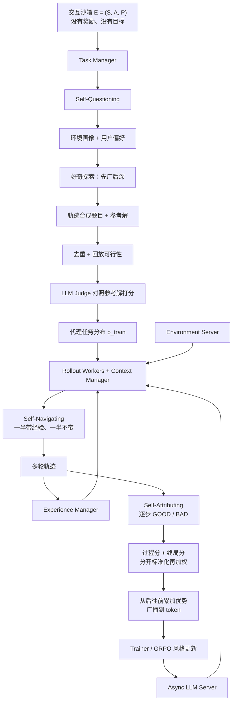

# AgentEvolver：自进化的三件事是出题、导航和归因；改的是训练环，不是 agent 代码

<!-- release-date: 2025-11-13 -->

> 本文依据 Tongyi Lab, Alibaba Group 发布的 **AgentEvolver: Towards Efficient Self-Evolving Agent System**，即 arXiv:2511.10395v1、2025-11-13 提交、共 29 页的预印本。共同一作是 Yunpeng Zhai、Shuchang Tao、Cheng Chen、Anni Zou、Ziqian Chen、Qingxu Fu、Shinji Mai；通讯作者是 Zhaoyang Liu、Bolin Ding；其余作者为 Li Yu、Jiaji Deng、Zouying Cao、Jingren Zhou（PDF p. 1）。按主要归属方，本站放在 Alibaba 目录。下文括号中的 `PDF p. N` 均指这份 29 页原件的文件页码。
>
> **版本说明**：封面右上角印着 2025-11-14，那不是首发日。arXiv 提交日是 2025-11-13 15:14:47 UTC。截至 2026-09-10 核验，arXiv 上只有 v1，与本地 `papers/Alibaba/AgentEvolver.pdf` 一致，未替换原件。论文首页给出的代码仓是 <https://github.com/modelscope/AgentEvolver>。仓库后来加的 Game Arena、CuES、SeeUPO、星标和产品能力，**都不是本 PDF 的内容**，文末单独标成外部补充。
>
> 这是一篇 **agent 训练方法 + 训练系统** 论文，没有基座架构和预训练 recipe 可讲。它讲的是：面对一个没有现成题库、没有现成奖励的新环境，怎样让大模型自己出题、自己复用探索经验、自己把稀疏终局分拆成逐步信用，再接到 **GRPO（Group Relative Policy Optimization，组相对策略优化）** 一类的策略更新上。全文把三件事分开写：**论文明确写了什么**（带页码）、**本文如何解释它**（凡属推算、换算或从图上读数都会写明）、**外部资料补充**（会给出链接并标注）。

## 读之前需要的最少背景

这篇论文假设你已经知道「用强化学习训一个会调工具的 agent」大概长什么样。不熟的话，先记住下面这些。

**一轮 RL 后训练循环。** 拿一批任务，让当前策略自己去环境里干活，这个「让模型自己跑一批」的动作叫 **rollout（轨迹生成）**。跑出来的每一次完整执行叫一条 **trajectory（轨迹）**。用一个 **reward（奖励）** 判断这次干得好不好，再用带奖励的轨迹更新模型参数。本篇实验侧写的是 **GRPO 风格** 的方法：对同一道题采样一组回答，用组内的相对好坏当优势。出处见本站 [DeepSeekMath](/reports/DeepSeek/DeepSeekMath)。正文把现有 LLM agent 训练也归到 PPO 或 GRPO 一类（PDF p. 2）。

**工具增强、长程、稀疏终局。** 本篇的评测环境是 AppWorld 和 BFCL v3：agent 要在多轮里调 API / 工具，奖励往往要等到整局结束才给一个对错（PDF p. 18）。一条轨迹最多截到 30 步（PDF p. 18）。这和「对着一道数学题写完一段、拿一个对错分」不是同一种活。

**交互沙箱（interaction sandbox）。** 论文故意把环境和标准 MDP 切开。标准 MDP 是 $(S,A,P,r,\gamma)$，里面带着奖励函数 $r$ 和折扣 $\gamma$。本篇的沙箱只有 $(S,A,P)$：你能看见什么、能做什么、环境怎么变，**没有目标、没有奖励**（PDF p. 3，式 1）。题目和分数都要系统自己长出来。

**代理任务 / 代理奖励。** 真正要考的目标任务分布 $p_{\text{target}}$ 事先不知道。系统先在沙箱里探索，合成一套训练用的 $p_{\text{train}}$ 和一套代理奖励 $\hat{R}_g$，希望在这套代理目标上把策略训好，到真正的目标任务上也能涨分（PDF p. 4，式 4–7）。这是整篇形式化的核心。

**经验（experience）在这里不是回放缓冲区里的状态转移。** 它是一段自然语言：什么时候该用、具体怎么做。靠检索塞进提示词，用 **ICL（In-Context Learning，上下文学习）** 引导下一步（PDF p. 8–9）。

后面三个专有名词各管一段训练流，先各记一句：

- **Self-Questioning（自出题）**：环境 → 任务。先摸环境，再合成题目和参考解，再用 LLM 当裁判给整条轨迹打分。
- **Self-Navigating（自导航）**：任务 → 轨迹。把过去的成败写成经验，一半 rollout 带着经验走，一半不带；训练时把经验 token 剥掉，再选择性地放大正优势样本。
- **Self-Attributing（自归因）**：轨迹 → 策略。不把终局一个分均摊给每一步，而让另一个 LLM 逐步判 GOOD / BAD，再和终局分合成逐步优势，交给 GRPO。

## 先划清切面，避免和自进化组、训练框架组读串

本站已经有几篇名字里都带 agent、RL 或自进化，切面完全不同。这些对照是本文的读法，不是 AgentEvolver 原文。

训练系统这一组，管的是「轨迹怎么变成训练器吃得下的数据」：

| 工作 | 它管的那一层 | 本站 |
|---|---|---|
| [Agent Lightning](/reports/Microsoft/Agent-Lightning) | 已有 Agent 运行时与训练器解耦；训练器只吃每次模型调用的转移 | 运行时 / 数据接口 |
| [SkyRL-Agent](/reports/Berkeley/SkyRL-Agent) | 一条多轮轨迹内部的 init / 生成 / 判分如何与别的轨迹叠流水 | 多轮调度 |
| [Polar](/reports/NVIDIA/Polar) | 把观测点放到模型 API，harness 当黑盒原样跑 | harness 黑盒 |
| [ROLL](/reports/Alibaba/ROLL) | 角色、样本、卡怎么拆进同一个 RL 库 | 训练库 |
| AgentEvolver（本篇） | **任务从哪来、探索怎么复用经验、稀疏终局奖励怎么拆成逐步信用**，再接到 GRPO | 训练方法 |

自进化这一组，先问「到底哪个部件在进化」：

| 工作 | 进化的对象 |
|---|---|
| [SEAL](/reports/MIT/SEAL) | 模型给自己写笔记，再拿笔记做权重更新 |
| [Alita](/reports/Princeton/Alita) | MCP 工具 / 技能库 |
| [Darwin Gödel Machine](/reports/Sakana/Darwin-Godel-Machine) | agent 自己的 Python 代码 |
| [AIDE2](/reports/Weco/AIDE2) | 自动研究 agent 的 harness |
| [Agent-Workflow-Memory](/reports/CMU/Agent-Workflow-Memory) | 工作流记忆 |
| [Absolute Zero](/reports/Tsinghua/Absolute-Zero) / [R-Zero](/reports/Tencent/R-Zero) | 题库 / 课程（数学或代码，验证器是执行器或多数票） |
| AgentEvolver（本篇） | **出题 + 导航 + 归因这条训练环**；策略仍然用 GRPO 改权重 |

本站索引里给本篇的口号是「通义，自进化 agent 系统：自出题、自导航、自归因」。自进化分组里把它标成「任务 / 课程」，那只覆盖了 Self-Questioning 这一截。后两截是经验复用和逐步信用，不是再造一套 agent 代码。

不要把 GitHub README 后加的数字、星标、Game Arena、CuES、SeeUPO 写成论文。那些是论文之后的仓库演化，文末单独说。

## 一句话先说清

这篇论文要解决的矛盾可以这样说：

> **训一个会用工具的长程 agent，卡在三件都贵的事上：新环境没有现成题库；每条多轮轨迹都很贵，随机探索大量浪费；奖励经常只在最后给一个对错，中间几十步分不清谁有功谁有过。现有做法要么人出题，要么靠 PPO / GRPO 海量采样硬撞。**

论文对这个局面的描述很直接（PDF p. 2）。工具功能在新环境里往往未知，手工构造足够多样的多步任务成本很高；虽然 RL 社区有内在奖励、UCB 一类探索技巧，但用在长程、带工具的 LLM agent 上常常无效，因为每条 rollout 本身就贵。于是当前训练仍主要走 PPO 或 GRPO，「近似蛮力探索，冗余轨迹多、学习价值有限」（PDF p. 2）。

它的回答不是再换一个优化器，而是把学习主动权从「人设计的流水线」交给 LLM 自己（PDF p. 2）。三条机制对齐一条标准训练流（PDF p. 2，Figure 2）：

1. **环境 → 任务**：Self-Questioning，好奇探索，自己出题，减少对手工数据集的依赖。
2. **任务 → 轨迹**：Self-Navigating，复用过去经验，混合策略引导，提高探索效率。
3. **轨迹 → 策略**：Self-Attributing，按每一步对结局的贡献给不同的奖励，提高样本利用率。

摘要把实验写成 **preliminary experiments**（初步实验），结论也只说比传统 RL 基线探索更有效、样本利用更好、适应更快（PDF p. 1）。主表是 Table 1 的 avg@8 / best@8（PDF p. 19）。二手材料里常见的「29.4 个百分点」，对应的是这篇主表，但 PDF 正文写的是「improves by 29.4%」。后文会把这句话和 Table 1 的加减对上，并标明它其实是两个百分数分数的差，也就是百分点，不是相对提升 29.4%。

## 全景：环境 → 任务 → 轨迹 → 策略

先把论文 Figure 2 的三列机制和 Figure 10 的系统落到一张图上（PDF p. 3、15）。这是机制示意，不是实测时间轴。

这是根据 PDF p. 3 的 Figure 2 与 p. 15 的 Figure 10 重画的**机制示意图**。Figure 2 把三列画成 Self-Questioning / Self-Navigating / Self-Attributing；Figure 10 把同一件事画成 Master 驱动的四段循环：A 任务合成、B 轨迹 rollout、C 经验摘要、D 样本构造与模型更新。箭头表示数据与控制流向，不表示墙钟时间。

论文后文还有两块支撑设施，不要和三条机制混成一层（PDF p. 14–18）：

- **Context Manager（上下文管理器）**：管多轮对话怎么拼、怎么裁、怎么让模型自己决定保留 / 删除 / 压缩。
- **Environment Service**：把环境做成 Gym 兼容的独立服务，用 Ray 起隔离实例。

三条机制回答的是「训练信号从哪来」；这两块回答的是「多轮 agent 在系统里怎么跑」。下面按论文顺序走：先形式化，再三条机制，再基础设施，最后用实验核对。

## 问题形式化：沙箱没有奖励，目标分布也不知道

### 论文写了什么

第 2 节把「agent 自进化」写成：一个基于 LLM 的 agent，通过与环境交互自主改进策略，**不依赖预先给定的任务分布或奖励函数**（PDF p. 3）。问题被拆成两块：

1. 交互沙箱 $\mathcal{E}$，只提供状态、动作和转移；
2. 一个未知的目标任务分布 $p_{\text{target}}(g)$，也就是 agent 最终必须掌握的「金标」任务。

核心挑战因此变成：在 $\mathcal{E}$ 里做开放探索，去估计 $p_{\text{target}}$，并自己生成代理训练目标和学习信号（PDF p. 3）。

沙箱写成（PDF p. 3，式 1）：

$$
\mathcal{E}=(S,A,P)
$$

$S$ 是可观察状态，$A$ 是可执行动作，$P(s'\mid s,a)$ 是转移。和标准 MDP $\mathcal{E}=(S,A,P,r,\gamma)$ 相比，这里没有 $r$，也没有 $\gamma$。论文把这称为开放、无奖励的设定：agent 必须自己生成学习信号和目标。

目标侧，每个任务 $g$ 对应一个期望目标状态 $s_g$。真实奖励 $R_g(s,a)$ 衡量这一步对到达 $s_g$ 有没有用。策略是目标条件的 $\pi_\theta(a\mid s,g)$，要最大化（PDF p. 4，式 2–3）：

$$
J_{\text{target}}(\theta)=\mathbb{E}_{g\sim p_{\text{target}},\,s_0\sim p_0}\bigl[V^{\pi_\theta}(s_0,g)\bigr]
$$

其中 $V^{\pi_\theta}$ 是带折扣的目标条件价值，引用的是 Schaul 等人的 UVFA 和 Liu 等人的 goal-conditioned RL 综述（PDF p. 4）。

因为 $p_{\text{target}}$ 和 $R_g$ 事先不知道，论文把自进化定义成构造两个映射（PDF p. 4，式 4–5）：

- **代理任务生成** $F_{\text{task}}:\mathcal{E}\to\Delta(G)$，得到 $p_{\text{train}}=F_{\text{task}}(\mathcal{E})$；
- **代理奖励设计** $F_{\text{reward}}:\mathcal{E}\times G\to(S\times A\to\mathbb{R})$，得到 $\hat{R}_g=F_{\text{reward}}(\mathcal{E},g)$。

训练目标是在代理任务和代理奖励上最大化（PDF p. 4，式 6–7）：

$$
J_{\text{train}}(\theta)=\mathbb{E}_{g\sim F_{\text{task}}(\mathcal{E})}\bigl[\hat{V}^{\pi_\theta}(s_0,g)\bigr]
$$

希望这能带动真正的 $J_{\text{target}}$ 上升。Self-Navigating 被写成第三件事：优化探索，让 $\pi_\theta$ 生成「学习价值高」的轨迹，处理多轮环境里的效率瓶颈（PDF p. 4）。

### 本文如何解释它

这一节看起来像在写 MDP 教科书，真正的设计判断只有一句：**先承认环境不会给你题，也不会给你分，再把「出题」和「打分」做成系统里的一等公民。**

后面三条机制就是这两个映射的实现。Self-Questioning 实现 $F_{\text{task}}$，顺手给一个轨迹级的 LLM Judge 当 $F_{\text{reward}}$ 的兜底；Self-Attributing 实现更细的逐步 $F_{\text{reward}}$；Self-Navigating 不改目标函数的形式，改的是「用当前策略采样时怎么少走废轨迹」。

有一个容易读漏的边界。沙箱「没有奖励」是形式化设定，评测环境 AppWorld / BFCL 其实有官方对错口径（PDF p. 18）。论文并不是说真实环境永远打不出分，而是说：**你不能假设每个新环境都已经配好了任务分布和稠密奖励。** 训练时用合成任务，就需要自己的裁判；即使用了官方任务，终局分仍然太稀疏，还要归因来拆。

### 可迁移的部分

凡是「环境接口已经有了，题库和过程监督还没有」的项目，都值得先问：$F_{\text{task}}$ 和 $F_{\text{reward}}$ 分别是谁在做？如果两件事都还靠人，后面的 GRPO 再稳，也只是在一个很小的人工题库上打转。

## Self-Questioning：任务从探索轨迹里长出来

第 3 节对应 Figure 3 的三步：探索、任务合成、任务策展（PDF p. 5）。它要回答四个问题（PDF p. 5）：

1. 怎么理解一个未知环境，并找到有价值的状态？（§3.1）
2. 怎么生成既符合用户偏好、又足够多样的任务？（§3.2）
3. 怎么避免幻觉、保证任务可执行？（§3.3）
4. 怎么给整条轨迹提供代理奖励？（§3.4）

### 旧问题

论文把数据困难写成两条（PDF p. 4–5）：新环境往往没有现成训练数据，手工构造多步复杂任务贵；已有数据又常常多样性差、分布偏，限制泛化。对工具 agent 来说，这两条会叠在一起——你甚至还不知道这个环境里有哪些 API 能用。

### 新设计：先探索，后出题，再拿探索轨迹当参考解

关键顺序必须先钉死。普通题库是「先有题，再让模型去搜答案」。这里反过来：**先在环境里走一遍，再根据这段轨迹问「这能解决什么问题」，并把走过的路径提成参考解**（PDF p. 6–7）。所以参考解不是另一个更强模型空想出来的，而是探索阶段已经在环境里执行过的动作–观察序列。

Figure 3 把这条流水画成：环境画像 + 用户偏好 → 在环境里走 → 从轨迹里提出 query 和参考解 → 再派一个 agent 回放，检查可行性（PDF p. 5）。

### 机制一：环境画像当动作先验，高温 LLM 当好奇心

**环境画像（environment profile）** 用实体、属性和操作，把环境收成一份人能读的说明书，作为初始状态 $s_0$ 的一部分，让 LLM 的好奇别漫无目的乱走（PDF p. 5–6）。Figure 4 给的例子是一张游戏地图（PDF p. 6）：

- 实体：Map，有可走的路和医院、学校、工厂、家、红绿灯；
- 属性：road / architecture / traffic light；
- 操作：move、wait and cross、enter。

这不是 AppWorld 的真实画像，是 Figure 3 那张示意沙箱的例子。后文实验说他们给 AppWorld 和 BFCL 都建了画像，但正文没有把这两份真实画像印出来（PDF p. 18）。

探索策略是高温 LLM（PDF p. 6，式 8）：

$$
a_t\sim\pi_{\text{explore}}(\cdot\mid s_t,s_{t-1},\ldots,s_0),\qquad s_{t+1}\sim P(\cdot\mid s_t,a_t)
$$

温度升高是为了发现非常规交互和隐藏状态。然后用两阶段平衡覆盖和深度（PDF p. 6）：

- 前 $N_b$ 步 **广度优先**，先建立环境基本语义，覆盖动作–状态空间；
- 之后改 **深度优先**，沿着前面发现的有希望轨迹往下挖；
- 第二阶段再加一条近视规则：决策只看最近 $N_d$ 个观察，避免过早收敛到一种行为。

实验里 AppWorld 取 $N_b=3$、$N_d=17$，BFCL 取 $N_b=3$、$N_d=27$；探索 agent 是 Qwen-Plus，采样温度 1（PDF p. 18–19）。

整段探索被写成从环境到轨迹分布的映射 $\Phi:\mathcal{E}\times\pi\times S\to\mathcal{T}$（PDF p. 6，式 9）。

### 机制二：按难度和风格把轨迹变成题

用户偏好卡两根轴（PDF p. 6）：

- **难度**：潜在解里涉及多少实体、属性、操作；多属性协调算复杂，少的算简单；
- **风格**：用户给的 rubrics。

合成时先把原始探索轨迹蒸馏成：用户输入、LLM 动作、执行结果，再加上偏好 $u$，交给 LLM 写出候选 query $g$（PDF p. 7，式 10）。形式化上 $F_{\text{task}}(\mathcal{E})=\Psi(\Phi(\mathcal{E}),u)$。

参考解的提取故意利用「先探索、后出题」这个顺序（PDF p. 7）：题目的解已经在探索阶段被走过，于是可以把简化后的动作–观察序列和对应任务交给提示过的 LLM，抽出完整解题过程，当作代理金标。后面的 Judge 和可行性回放都靠这份参考解。

实验里合成 query 被要求涉及两个实体、三个属性、三个操作，并且达到 hard 难度；任务合成也用 Qwen-Plus、默认设置（PDF p. 18–19）。

### 机制三：实时去重、回放可行性、可选的分布混合

$F_{\text{task}}$ 产出来的样本质量和难度必然参差，所以要过滤，让 $p_{\text{train}}$ 更像未知的 $p_{\text{target}}$（PDF p. 7）。

**实时过滤**发生在合成过程中（PDF p. 7）：

- 词法重叠去重，超过阈值立刻丢掉；实验把词法相似度阈值设为 0.8（PDF p. 19）；
- 再用 embedding 做语义相似检查，避免生成太像的轨迹。

**生成后过滤**更严（PDF p. 7）：再做一轮词法去重，然后用参考解在目标环境里真正执行一遍。执行失败的，视为参考解很可能是幻觉，整道题丢掉。Figure 3 右侧画的「Try Replaying」就是这件事（PDF p. 5）。

**分布混合是可选项**（PDF p. 7，式 11–12）。默认没有外部数据时 $p_{\text{train}}(g)=F_{\text{task}}(\mathcal{E})(g)$。如果目标分布的样本拿得到，就做

$$
p_{\text{hybrid}}(g)=(1-\lambda)p_{\text{target}}(g)+\lambda p_{\text{task}}(g)
$$

$\lambda\in(0,1]$ 控制代理任务的比重。实验在混合数据上训练时，会把来自 $p_{\text{train}}$ 的优势乘 0.5 的衰减，减轻对目标分布的偏差、稳住训练（PDF p. 19）。

### 机制四：带原则、对照参考解的 LLM Judge

合成题往往没有环境金标奖励，所以 Self-Questioning 还要给整条轨迹一个代理分。论文把 LLM Judge 写成 $F_{\text{reward}}$ 的兜底：不针对具体环境做优化，但带一点 agent 能力，方便开发者先跑起来；真正有环境奖励时，用户可以换自己的（PDF p. 8）。

Judge 遵循两条原则（PDF p. 8）：

1. **相关与重复检查**：轨迹里出现与任务无关、幻觉或冗余的步骤，又没有清楚理由，直接零分。
2. **连续打分**：不是只给对错。正确解落在高分段，错误尝试落在低分段，具体分数看步数效率和中间错误，用来保留部分进度。

然后用探索阶段得到的参考解做正确性核对：关键步骤是否在 agent 执行里出现过，允许功能等价的替代路径（PDF p. 8）。实验用 **Qwen3-235B-A22B** 当这个 Judge，「以便更好地遵守复杂评分标准」（PDF p. 19）。§7.3.4 会证明：没有原则几乎涨不了分，加上原则会涨，再加上参考解才接近人工题库的训练效果（PDF p. 21，Figure 12b）。

### 收益

Table 1 里，光加 Self-Questioning，7B 的总体 avg@8 从 15.8 升到 36.1，14B 从 29.8 升到 52.3（PDF p. 19–20）。这是三套机制里一次性跳得最远的那一截。Table 2 显示合成数据可以接近甚至在部分指标上超过原始 $p_{\text{target}}$；混合数据则全面超过只吃原始数据（PDF p. 20）。Figure 12a 上，100 条合成样本就已经到 40.3，200 条到 42.7，500 条到 44.3（PDF p. 21；图上标的就是这三个数）。

### 代价与边界

出题并不是「零人工」。系统仍要人提供环境画像和用户偏好，探索和 Judge 还用了比策略模型大得多的 Qwen-Plus 与 Qwen3-235B-A22B。合成数据也不是处处强过人工题：7B 在 BFCL 上，合成 $p_{\text{train}}$ 的 avg@8 是 49.0，原始 $p_{\text{target}}$ 是 58.8（PDF p. 20，Table 2）。跨域更硬：7B 在 BFCL 合成数据上训练后，AppWorld 的 avg@8 从零样本 1.8 掉到 1.2（PDF p. 21，Table 3）。论文写「合成数据仍能带来提升」，这张表说明提升不是自动发生的。

参考解依赖「探索时已经走过」。如果探索本身没覆盖到某个功能边界，后面的出题和 Judge 都会一起瞎。回放过滤能去掉明显不可执行的题，去不掉「能执行但很无聊」的题。

### 可迁移的部分

三件事可以直接借：

1. **先探索再出题**，让参考解来自真实执行，而不是让另一个 LLM 对着 API 文档空想；
2. **回放当过滤器**，合成题必须能在环境里再跑通一遍；
3. **Judge 不要只靠原则**：原则能分开质量，对照参考解才把分数钉到这个环境上。

环境画像本身是一份便宜的先验。你不必一上来就训一个世界模型，先用实体 / 属性 / 操作把「这个环境里什么算合法动作」写成短文，往往就够把乱走收住。

## Self-Navigating：经验写进提示词，训练时再剥掉

第 4 节对应 Figure 6 的三步：经验获取、经验混合 rollout、经验并入（PDF p. 9）。

### 旧问题

常规 RL 靠反复随机试错，轨迹冗余、收敛慢；每条长程工具轨迹又贵（PDF p. 8）。人不会这样学：人会从过去的失败里抽出教训，下次有针对性地用。

### 新设计：经验是一段可检索的自然语言，不是一条 state–action 回放

论文把经验定义成「从过去轨迹里蒸馏出的结构化自然语言知识」，用来通过 ICL 引导决策。每条经验两段（PDF p. 8–9，Figure 5）：

- **When to use**：什么条件下适用，同时当作检索触发器，query 和它的 embedding 做语义匹配；
- **Content**：具体指令、注意事项或推荐策略。

Figure 5 的 AppWorld 例子是（PDF p. 8）：当你要调一个还没被确认存在或行为符合预期的 API 时，先用 `apis.api_docs.show_api_doc` 看规格，再执行，尤其是删除或修改这类危险动作。

经验全部用自然语言表示，既可解释，又能用 embedding 检索（PDF p. 9）。脚注把实现细节指向 ReMe：<https://github.com/agentscope-ai/ReMe>（PDF p. 9）。这是论文自己给的外部实现指针，不是本 PDF 的实验结果。

### 机制一：离线建池，在线检索、重排、改写

**建池。** 用 Self-Questioning 得到的 $p_{\text{train}}$，让初始策略 $\pi_{\theta_{\text{init}}}$ 对每个任务做 $N_{\text{pc}}$ 次独立 rollout。实验取 $N_{\text{pc}}=4$（PDF p. 19）。每组轨迹走四步处理（PDF p. 9，式 13）：

1. 预处理：按分数分成成功 / 失败；
2. 抽取：从成功、失败或对比轨迹对里蒸馏行为要点；
3. 校验：再用一个 LLM 评估这条经验靠不靠谱；
4. 写入向量库。

**检索。** 把任务 query 编成 $h_q$，和经验 embedding $h_e$ 算余弦相似度，取 Top-$k$，再经 $\Omega_{\text{refine}}$ 做重排和改写，让经验更泛、更贴当前任务（PDF p. 9，式 14）。实验 $k=5$（PDF p. 19）。

### 机制二：一半带着经验走，一半自己走

只靠经验会把探索堵死。于是同一道题的 $N$ 条 rollout 被切成两组（PDF p. 10，式 15）：

- $T^{(v)}$：vanilla，不给外部经验；
- $T^{(e)}$：把检索到的经验按模板塞进初始提示词，例如 `{system prompt}<EXP>{exp_g}</EXP>{query}`。

比例由 $\eta$ 控制，$N_e=\lfloor\eta\cdot N\rfloor$。实验取 $\eta=0.5$（PDF p. 19）。优势在**整组混合轨迹**上标准化，不分组各算各的（PDF p. 10，式 16）：

$$
\hat{A}(\tau)=\frac{R(\tau)-\mu_R}{\sigma_R+\varepsilon_{\text{norm}}}
$$

这样带经验和不带经验的轨迹，用同一把尺子比相对好坏。

### 机制三：训练时剥掉经验，正优势再把 clip 上限抬高

这里有一个实现上的锋利判断。

**Experience stripping（经验剥离）。** 如果训练时还把 `<EXP>…</EXP>` 留在序列里，模型可能背下这段外部文本，而不是把推理信号吸收进自己的策略。所以算策略梯度之前，把经验 token 删掉，只留下 `{system prompt}{query}{trajectory}`（PDF p. 10–11，Figure 7）。Rollout 阶段继续享受经验，训练阶段逼模型把能力内化。

剥掉之后立刻出现 **off-policy 错配**：采样时条件是 query + 经验，训练时条件只剩 query，优化样本的概率分布比 rollout 更窄，重要性比 $r^{(e)}$ 会不受控地变大（PDF p. 11）。论文引用 Yan 等人 2025 的 off-policy 推理学习。普通 PPO / GRPO clip 能部分按住，但 clip 太狠会把经验引导更新的梯度也掐掉。

**Selective boosting（选择性抬升）。** 只对经验组里 **优势严格为正** 的样本，把 clip 上界从 $\epsilon_{\text{high}}$ 换成更高的 $\hat{\epsilon}_{\text{high}}$；负优势仍用原来的 $\epsilon_{\text{high}}$（PDF p. 11，式 17）。实验取 $\epsilon_{\text{low}}=\epsilon_{\text{high}}=0.28$，$\hat{\epsilon}_{\text{high}}=0.6$（PDF p. 19）。

式 17 是带两组样本的 GRPO / PPO 风格目标。重要性比写成整条轨迹的

$$
r_i^{(v)}=\frac{\pi_\theta(\tau_i^{(v)})}{\pi_{\theta_{\text{old}}}(\tau_i^{(v)})}
$$

经验组同理；再加一项 $\beta\,\mathrm{KL}(\pi_\theta\|\pi_{\theta_{\text{old}}})$。正文没有把 $\beta$ 和实现里的 KL 系数 0.001 对上号（PDF p. 18 写的训练 KL penalty 是 0.001）。重要性比在公式里是轨迹级的，后面 Self-Attributing 又把优势广播到 token。论文没有再写清实现里 ratio 到底按轨迹算还是按 token 算。

消融时他们把经验混合比例固定为 0.5，但**测试只报不带经验引导的结果**，用来公平衡量「经验有没有被内化」（PDF p. 19）。这是后文 Table 4「implicit vs explicit」那组数字的口径。

### 收益

不训练、只在推理时塞经验，Figure 13a 上 AppWorld / BFCL 都涨。图上标了四组绝对分数和相对标注（PDF p. 22，读图）：

| 基准 | avg@4 无经验 | avg@4 有经验 | 图上标注 | best@4 无经验 | best@4 有经验 | 图上标注 |
|---|---:|---:|---:|---:|---:|---:|
| AppWorld | 15.35 | 20.32 | +4.97% | 25.17 | 31.68 | +6.51% |
| BFCL | 32.83 | 38.60 | +5.77% | 52.20 | 59.13 | +6.93% |

正文把两套基准平均，写成 ↑5.4% avg@4、↑6.7% best@4（PDF p. 22）。从标了数字的柱子看，这些「%」是两个百分数分数相减，也就是百分点差：15.35 + 4.97 = 20.32。

训完之后，Table 4 在 Qwen2.5-14B 的 **dev 集、avg@4 / best@4** 上对比显式 ICL 和隐式内化（PDF p. 22）：

| 方法 | AppWorld avg@4 | AppWorld best@4 | BFCL avg@4 | BFCL best@4 | Avg. avg@4 | Avg. best@4 |
|---|---:|---:|---:|---:|---:|---:|
| 无 RL，zero-shot | 17.3 | 37.4 | 33.0 | 50.6 | 25.2 | 44.0 |
| 无 RL，+ 经验 | 20.2 | 41.6 | 41.5 | 61.9 | 30.9 | 51.8 |
| 有 RL，baseline | 51.5 | 69.8 | 62.8 | 73.0 | 57.2 | 71.4 |
| Navigating（无 select） | 53.1 | 63.8 | 60.3 | 73.2 | 56.7 | 68.5 |
| Navigating（本文） | 64.7 | 85.9 | 65.3 | 73.9 | 65.0 | 79.9 |

论文的归纳（PDF p. 23）：显式 ICL 有上限；隐式学习相对 ICL-only 平均 ↑34.2 / ↑28.1，相对 vanilla RL ↑7.9 / ↑8.5；拿掉 selective boosting 会掉到 RL 基线以下（平均 ↓0.5 / ↓2.9）。Table 4 的算术支持这组相对说法：65.0 − 30.9 = 34.1，79.9 − 51.8 = 28.1，65.0 − 57.2 = 7.8，79.9 − 71.4 = 8.5，56.7 − 57.2 = −0.5，68.5 − 71.4 = −2.9。注意 AppWorld 的 best@4 在「无 select」时从 69.8 掉到 63.8，不是小波动。

### 代价与边界

$\eta$ 不是越大越好。Figure 13b 下排柱是训练前、带着经验的零样本推理：$\eta$ 从 0 到 1，读图约为 16.23、16.45、19.30、20.18、23.25，确实越高越好（PDF p. 22）。上排曲线是用经验数据训练、**验证时不带经验**：论文写较大的 $\eta$ 早期涨得快，但最终压住探索、长期更差，$\eta=0.5$ 最平衡（PDF p. 23）。读图也能看到 $\eta=1.0$ 的蓝线后期明显落后于 $\eta=0.5$ 的橙线。

$\hat{\epsilon}_{\text{high}}$ 同样是短长期权衡。论文在 $\{0.4,0.6,0.8,1.0\}$ 里扫过，结论是更大的值让前 20 步更快，但到 80 步会过拟合偏置轨迹；0.6 最均衡（PDF p. 23，Figure 14）。Figure 14 左图在第 20 步附近标了 45.2、44.0、41.0、40.8、39.3 五条读数（读图），右图 20–80 步的柱子是 $\hat{\epsilon}_{\text{high}}=0.6$ 最高（读图）。

经验池的冷启动仍然依赖 Self-Questioning 的合成任务（PDF p. 19）。Navigating 不是无中生有的记忆系统，它吃的是前面出题模块已经探过的环境。测试时不塞经验，是为了证明内化；部署时要不要继续塞，论文没做主实验。

### 可迁移的部分

如果你在 rollout 时往提示词里塞检索笔记、工具手册或成功案例，训练时却把这些 token 留在序列里，模型很容易学会「看见这段提示就会做」，而不是「自己会做」。**用的时候塞，学的时候剥**，是一条不依赖本篇其余装置的技巧。

第二条：提示词条件和训练条件不一致时，别只靠默认 clip。本篇的做法更窄——**只给正优势的经验样本抬上界**，负样本仍夹紧。这和「所有样本都 clip-higher」不是一回事。

第三条：显式 ICL 和隐式 RL 不要互相替代。推理时塞经验能立刻涨分，但论文认为天花板在检索质量；要把能力写进权重，还得让模型在剥掉经验之后继续拿到梯度。

## Self-Attributing：把终局一个分，拆成每一步的功过

第 5 节对应 Figure 2 最右一列（PDF p. 3、11）。

### 旧问题

GRPO 一类方法用稀疏的轨迹级奖励，把所有动作一视同仁，分不清关键决策和无关步骤，样本利用率差（PDF p. 11）。长程工具轨迹里，这个病尤其重：可能前 20 步都在正确查 API，第 21 步删错一个字段，整局零分；也可能前面走了弯路，最后靠一步修正过了测试。

### 新设计：从时间传播改成贡献归因，过程质量和终局效果分成两路

论文把信用分配从「把终局分往回传」改成「让 LLM 事后判断每一步对结局是正贡献还是负贡献」（PDF p. 11）。学习信号拆成两个维度：

- **过程质量**：这一步本身有没有贡献；
- **终局效果**：整条轨迹成没成功。

两路各自标准化，再融合成复合奖励，然后映射到 token 级优势，交给 GRPO（PDF p. 11）。它被写成第 2 节 $F_{\text{reward}}$ 的具体实现。

### 机制一：整条轨迹一次送进 LLM，逐步打 GOOD / BAD

为了让跨步依赖看得见、又少花调用次数，归因是 **单次、整体** 的：把任务、所有中间步、最终得分塞进同一个提示，输出每一步的二元标签（PDF p. 12）。Figure 8 / Figure 9 给出了系统提示和用户提示结构（PDF p. 12–13）。规则可以缩成：

- 终局分 **> 0**：正贡献标 GOOD，无关、中性或有害标 BAD；
- 终局分 **≤ 0**：只有主动纠错或减轻错误才标 GOOD，引入、传播或没修掉错误标 BAD；
- 只看这一步动作的技术影响，忽略礼貌这类表面因素。

论文强调这和手写 PRM（Process Reward Model，过程奖励模型）的差别（PDF p. 12）：二元标签不需要按任务设计打分表；用 LLM 的情境判断代替刚性启发式；输出的是方向（正 / 负贡献），不是精确幅度。精确幅度留给后面的标准化和终局通道。

实验用 **Qwen-Max** 做这个 Judge，整条轨迹一次 batched 调用（PDF p. 19）。

### 机制二：GOOD / BAD 变成 +1 / −1，按轨迹做标准化

§5.2 写得很死：GOOD 赋 $+1$，BAD 赋 $-1$，不引入任意的标量大小，以免梯度被幅度带着跑（PDF p. 12）。

标准化的统计量在哪算，是一个关键选择。如果按步算均值和方差，更长、更绕的轨迹会主导统计。于是他们先把每条轨迹的归因奖励取平均，再在「轨迹平均分」这个群体上算 $\mu_{\text{attr}}$、$\sigma_{\text{attr}}$，然后对每一步做（PDF p. 13，式 18）：

$$
\hat{r}_t^{\text{attr}}=\frac{r_t^{\text{attr}}-\mu_{\text{attr}}}{\sigma_{\text{attr}}+\epsilon}
$$

$\epsilon$ 例如 $10^{-8}$。这样每条轨迹权重相同，不管长短。

**实现段落和这一节不完全一致。** §7.1.3 写：标签直接映射到有符号单位分数，「例如 GOOD → 1.0，BAD → 0.0 或 −1.0」；然后「对归因分数做组内 **step-level** 标准化」，再和终局信号融合（PDF p. 19）。方法节是轨迹级、BAD 必为 −1；实验节允许 BAD 为 0，并且改口成 step-level。这是原文内部缺口，不是我们的推断能抹平的。退化情况（方差接近 0）会把对应信号中性化（PDF p. 19）。

### 机制三：两路分开标准化，终局分只加在最后一步

终局奖励 $R_{\text{out}}$ 就是 §3.4 的终端分（PDF p. 13）。它在训练组内单独标准化得到 $\hat{r}_{\text{out}}$（PDF p. 13，式 19），避免一路的尺度吞掉另一路。

复合奖励（PDF p. 14，式 20）：

$$
\hat{r}_t=\alpha\cdot\hat{r}_t^{\text{attr}}+\mathbf{1}_{t=T}\cdot\hat{r}_{\text{out}}
$$

$\mathbf{1}_{t=T}$ 只在最后一步为 1。$\alpha\ge 0$ 控制归因通道的相对贡献。实验为简单起见把终局权重 $\beta$ 固定为 1，只调 $\alpha$（PDF p. 19）。注意式 20 里并没有 $\beta$ 这个符号，实验节自己加了一个。

优势采用 DeepSeekMath 那种不做折扣的未来奖励累加，$\gamma=1$（PDF p. 14，式 21）：

$$
A_t=\sum_{k=t}^{T}\hat{r}_k
$$

论文说 $\alpha$ 还可以当课程：先大后小，先学稳过程，再对准任务目标（PDF p. 14）。主消融取 $\alpha=0.1$（PDF p. 24）。

### 机制四：逐步优势广播到 token，再接回式 17

语言模型的策略梯度要 token 级优势。若 token $j$ 属于第 $t$ 步，则 $A_j^{\text{tok}}=A_t$（PDF p. 14）。这些 token 级优势同时用于 vanilla 和经验引导的 rollout，接到式 17 里；经验组仍保留 selective boosting（PDF p. 14）。

所以三条机制在优化器入口汇合：Questioning 提供任务和终局分，Navigating 提供混合轨迹和 clip 规则，Attributing 提供逐步优势。优化器仍是 GRPO 风格，没有另发明一种新的策略梯度。

### 收益

Table 5 在 **dev 集** 上做四路对比，AppWorld 与 Table 1 的 test-normal 不是同一份数据（PDF p. 24 表注）：

| 模型 | 参数 | AppWorld avg@8 | AppWorld best@8 | BFCL avg@8 | BFCL best@8 | Avg. avg@8 | Avg. best@8 |
|---|---:|---:|---:|---:|---:|---:|---:|
| Qwen2.5-7B | 7B | 3.1 | 9.1 | 29.8 | 42.4 | 16.4 | 25.7 |
| Attributing | 7B | 38.4 | 57.1 | 56.8 | 65.3 | 47.6 | 61.2 |
| w/o $\hat{r}^{\text{attr}}$ | 7B | 33.6 | 46.6 | 49.0 | 60.6 | 41.3 | 53.6 |
| w/o $\hat{r}^{\text{out}}$ | 7B | 20.2 | 37.5 | 51.3 | 65.2 | 35.7 | 51.4 |
| Qwen2.5-14B | 14B | 17.8 | 27.7 | 41.8 | 55.3 | 29.8 | 41.5 |
| Attributing | 14B | 59.2 | 75.1 | 64.9 | 76.3 | 62.0 | 75.7 |
| w/o $\hat{r}^{\text{attr}}$ | 14B | 54.6 | 71.3 | 60.3 | 72.1 | 57.4 | 71.7 |
| w/o $\hat{r}^{\text{out}}$ | 14B | 42.5 | 60.3 | 63.4 | 73.5 | 53.0 | 66.9 |

论文自己的数字语言在这里比 Table 1 更小心：AppWorld 上 7B 从 3.1 到 38.4、14B 从 17.8 到 59.2，被写成 **35.3 和 41.4 percentage points**（PDF p. 24）。两路都必要：只留终局分会均匀归因；只留过程分相对 Qwen2.5 仍涨，但稳定低于只留终局分的那一路（PDF p. 24）。

样本效率用 Qwen2.5-14B 的验证曲线（PDF p. 25，Table 6、Figure 15）：

| 模型 | AppWorld Steps@.9 ↓ | BFCL v3 Steps@.9 ↓ |
|---|---:|---:|
| Baseline | 90 | 60 |
| Attributing | 40 | 20 |

Steps@.9 是达到基线最佳表现 90% 所需的训练步数。论文把它算成相对基线减少 55% 和 67%（PDF p. 25）。AUC 为 AppWorld 46.26 vs 41.03，BFCL 61.02 vs 55.78（PDF p. 25）。Figure 15 的横轴是 Training Steps (%)，紫实线是 Attributing，灰虚线是 GRPO 基线；读图可见紫色线在两个基准上都更早抬升，BFCL 上大约 20%–30% 步数处已经接近后期平台。

$\alpha$ 的扫描在 AppWorld、Qwen2.5-14B 上（PDF p. 25–26，Figure 16；曲线读数以正文为准）：

- $\alpha=0.30$ 在 20 步到 45%，基线同期只有 28%；但训练结束掉到 43%，低于所有其他归因设置；
- $\alpha=0.10$ 与 $0.20$ 全程较强，收敛约 59%；
- 基线结束约 55%；
- $\alpha=0.05$ 早期更保守，最终接近那条 59% 的水平。

论文把合适区间写成 $\alpha\in[0.10,0.20]$：太大过拟合 Judge 的启发式标签，太小浪费稠密通道（PDF p. 26）。§7.5.3 把复合奖励称作 $r^{\text{comp}}$（Eq. 23），但全文公式编号只到 21。这是原文的编号缺口。

### 代价与边界

归因 Judge 是 Qwen-Max，比 7B / 14B 策略模型强一个量级。逐步标签的质量上限在这个教师模型，不在 GRPO。$\gamma=1$ 的累加优势会让靠后的偶然成功，把前面每一步都加上同一份终局分——过程通道就是来缓解这件事的，但它仍然只是 GOOD / BAD，不是逐步的金标 PRM。

Table 5 的 AppWorld 是 dev，Table 1 是 test-normal，不能把 38.4 和 32.4 读成同一口径的矛盾。Attributing 消融还写明：模型只在 Self-Questioning 的合成数据上训练（PDF p. 24），所以它量的是「合成终局分 + 逐步归因」，不是「官方环境奖励 + 逐步归因」。

### 可迁移的部分

稀疏终局分的第一种补法是学一个 PRM，第二种是把终局分均匀铺到每一步，第三种是像这里：**让一个会读轨迹的模型只输出方向，幅度交给标准化和另一路终局分。** 方向比幅度好迁移；两路必须分开标准化，否则「过程通道」会变成「把终局分换个名字再加一遍」。

$\alpha$ 适合当旋钮，不适合当宗教。本篇的教训是：过程监督能加速，也能把策略训成「讨好 Judge」。要留一路真正的任务成败把模型钉住。

## 框架与基础设施：服务层、上下文模板、Gym 兼容环境

第 6 节把三条机制收成可跑的系统。它强调三件事：从环境到权重更新的清晰数据流、面向多轮 agent 的分层 rollout 栈、以及用解耦模块换算法（PDF p. 14）。

### 训练框架：Master 转四段，agent 逻辑和环境服务拆开

Figure 10 的 Master 驱动 A–D 四段（PDF p. 15）：

| 段 | 模块 | 对应机制 |
|---|---|---|
| A 任务合成 | Task Manager：合成 + 过滤，经 Environment Server 探索 | Self-Questioning |
| B 轨迹 rollout | 并行 Rollout Workers，经 Context Manager 拼提示、调 Async LLM Server | Self-Navigating 的混合采样发生在这里 |
| C 经验摘要 | Experience Manager：召回 + 语义摘要 | Self-Navigating 的经验池 |
| D 样本构造与更新 | 组织上下文、算优势，Trainer Workers 算损失、改参数，再把权重写回 LLM Server | Self-Attributing + GRPO |

Rollout 分三层（PDF p. 15）：

1. **服务层**：Environment Server 和 LLM Server，每个 worker 处理单步环境或单次推理，暴露标准接口；
2. **Rollout Workers**：一条轨迹的基本采样单元，负责起环境、执行动作、收观察、调模型；
3. **Rollout Manager / Master**：调度多个 worker、定义终止、协调课程。

设计原则写得很像训练系统组的共同口号，但落点不同：**把 agent 逻辑和运行时服务解耦**（PDF p. 15）。环境和 LLM 是独立服务；agent 逻辑封在 Context Manager 里，根据当前状态拼提示。同一套 rollout 基础设施可以挂 ReAct、planner–executor 或工具 agent，不必改服务层。

可扩展点按模块列（PDF p. 15–16）：Task Manager、Rollout & Context Manager、Experience Manager、Training Pipeline，都可以换实现，接口保持稳定。

和邻居的差别要说清。Agent Lightning 解耦的是**用户已经写好的 Agent** 和训练器；Polar 甚至不打开 harness。AgentEvolver 解耦的是**它自己这套训练环内部**的「上下文怎么拼」和「环境 / LLM 怎么服务化」。你仍然要按它的 Context Manager 写 agent 逻辑，不是把任意 LangChain 程序原样接进来。SkyRL-Agent 关心的 init / 生成 / 判分三段设备亲和性，本篇分层图里没有讲 GPU 空等，也没有 1.55× 那种调度数字。

### Context Manager：一条可变时间线，加一份只读快照

长程 RL 里，上下文怎么管是隐藏成本。论文看到两种现有范式的对立（PDF p. 16）：因果的多步 rollout 时间一致性好、不能改历史（引用 Jin 等人 Search-R1）；逐步独立的多轮 rollout 可编辑、计算贵（引用 Feng 等人 GiGPO）。Context Manager 想同时保住因果训练的效率、必要时改历史、并最终让 agent 自己管自己的上下文。

两个原语（PDF p. 16）：

- **Live Context Timeline（LCT，活时间线）**：可变序列，多轮交互时的当前工作上下文；
- **Timeline Snapshot Recorder（TSR，时间线快照记录器）**：不可变缓冲，策略 LLM 每生成一个动作就冻结一份 LCT。

LCT 是短时可编辑记忆，TSR 是整局的 token 级可验证记录。rollout 结束后 TSR 做 timeline merging：删掉冗余子序列，对齐重叠段上的 loss mask（PDF p. 16–17）。

在这之上定义四种 **Context-Managing Templates（CMT，上下文管理模板）**（PDF p. 16–17，Figure 11）：

| 模板 | 做法 | 论文给的定位 |
|---|---|---|
| Basic Causal | 严格因果追加，结束时 TSR 只留最终 LCT | 高效、确定，适合 Search-R1 那种搜索式 RL；不能改历史，显存随长度线性涨 |
| Reasoning-Augmented | 先 `<think>` 再动作 | 对没有预训练推理能力的模型（文中举 Qwen2）用结构化提示和额外奖励；对已有推理的 Qwen3-14B 用来增强一致性与效率 |
| Sliding Context Window | LCT 当滑动窗，超阈值就把旧内容压成 memory message，开新窗 | 局部因果，GPU 显存近似恒定，可拉到任意长局 |
| Self-Context Managing | 超限时让策略 LLM 对每条消息选 keep / remove / compress，压缩走外部摘要 LLM | 细粒度管 token 预算，适合环境吐出大量无信息文本 |

四种模板共享 LCT–TSR，差别只在上下文演化的控制权从规则交给模型的程度（PDF p. 17）。Figure 11 用黄块表示 LLM 消息、蓝块表示环境或被 mask 掉的消息、紫块表示 memory；画出的是 TSR 合并之后的预期时间线，不是逐步墙钟（PDF p. 16）。

§7.6 会在 Qwen3-14B + AppWorld 上比较这四种模板。注意那张表换了基座，也换了指标口径。

### Environment Service：Gym 兼容、Ray 隔离、HTTP 接入

环境被做成独立服务，不再和训练循环焊死，可远程、可并发、可按需隔离（PDF p. 17）。接口按 Gym 风格覆盖初始化、取状态、逐步执行、评估和生命周期，参数可在运行时配。除了经典任务环境，还允许接 MCP 和用户自定义函数（PDF p. 17–18）。

高并发靠 Ray actor 做轻量隔离，不依赖容器沙箱，可按 CPU / GPU 动态起停，支持异步和同步（PDF p. 18）。预配置环境包括 AppWorld、BFCL、WebShop、Crafter，可用 Docker 或 Python 包启动，对外是统一 HTTP（PDF p. 18）。**正文实验只用了 AppWorld 和 BFCL v3**，WebShop 与 Crafter 只出现在基础设施清单里。

训练配置写在 §7.1.3（PDF p. 18）：GRPO 风格，学习率 $1\times 10^{-6}$，batch size 32，**每次策略更新 40 个 epoch**，KL 系数 0.001，8 张 NVIDIA A100 80GB，PyTorch + veRL。论文没有解释「40 epochs per policy update」在这里是一次更新里对这批数据重复 40 遍，还是别的计数方式。veRL 的出处是 Sheng 等人 2024，也就是本站的 [HybridFlow](/reports/ByteDance/HybridFlow)。

## 实验：两套工具环境、7B / 14B、三套机制的加减法

摘要把实验称为 preliminary。下面按 §7.1–7.6 走，数字以 PDF 表格为准；只出现在图里的数标明读图。百分比分数之间的差，本文写成百分点；PDF 原文若写成 29.4%，会同时引原文并标出对应的表内加减。

### 7.1 设定：测什么、跟谁比、超参是什么

两个基准都是工具增强、长程、稀疏终局，经 Environment Service 用 Ray 隔离 actor 和统一 HTTP 接入（PDF p. 18）。

| 基准 | 论文用的口径 |
|---|---|
| AppWorld | Task Goal Completion（TGC）：通过全部程序性评测的任务百分比，跟官方定义 |
| BFCL v3 | **只用 multi-turn split**。官方多轮评测：每轮结束必须同时通过基于状态的检查（最终后端状态在非私有属性上与金标一致）和基于响应的检查（执行路径做子集匹配）；被强制终止的算错 |

除非另说，报 avg@8 和 best@8：每个实例独立 rollout 8 次，分别取平均 TGC 和最好 TGC。轨迹最多 30 步（PDF p. 18）。

策略基座是 **Qwen2.5-7B-Instruct** 和 **Qwen2.5-14B-Instruct**（PDF p. 18）；Table 1 写成 Qwen2.5-7B / 14B。对照是 Vanilla GRPO：只用最终稀疏结果信号，不加三条 AgentEvolver 机制（PDF p. 18）。主实验没有把 Qwen3-32B、Qwen3-235B-A22B 这些 Figure 1 里的点训一遍，那些是零样本对照气泡。

三条机制的实现超参前面已经散落引用，这里收成一张表（PDF p. 18–19）：

| 模块 | 论文写下的设置 |
|---|---|
| 训练 | GRPO 风格；lr $1\times10^{-6}$；batch 32；40 epochs / policy update；KL 0.001；8×A100 80GB；PyTorch + veRL |
| Questioning | 画像 + 用户偏好；query 期望 2 实体 / 3 属性 / 3 操作、hard；AppWorld $N_b=3,N_d=17$，BFCL $N_b=3,N_d=27$；探索 Qwen-Plus 温度 1；合成 Qwen-Plus 默认；Judge Qwen3-235B-A22B；词法去重阈值 0.8；混合数据时 $p_{\text{train}}$ 优势 ×0.5 |
| Navigating | $N_{\text{pc}}=4$；冷启动经验池来自 Questioning 任务；TopK $k=5$；$\eta=0.5$；$\epsilon_{\text{low}}=\epsilon_{\text{high}}=0.28$，$\hat{\epsilon}_{\text{high}}=0.6$；消融报 avg@4 / best@4，测试不带经验 |
| Attributing | Judge Qwen-Max，整轨迹单次评估；GOOD → 1.0，BAD → 0.0 或 −1.0；组内 step-level 标准化；$\beta=1$，只调 $\alpha$ |

### 7.2 主结果：Table 1 必须回到 PDF

Table 1 全是百分数。加粗是各列最好（PDF p. 19）：

| 模型 | 参数 | AppWorld avg@8 | AppWorld best@8 | BFCL v3 avg@8 | BFCL v3 best@8 | Avg. avg@8 | Avg. best@8 |
|---|---:|---:|---:|---:|---:|---:|---:|
| Qwen2.5-7B | 7B | 1.8 | 5.6 | 29.8 | 42.4 | 15.8 | 24.0 |
| +Questioning | 7B | 23.2 | 40.3 | 49.0 | 60.6 | 36.1 | 50.5 |
| +Questioning&Navigating | 7B | 26.3 | 43.1 | 53.3 | 61.0 | 39.8 | 52.1 |
| +Questioning&Attributing | 7B | 25.7 | 43.7 | 56.8 | 65.3 | 41.3 | 54.5 |
| AgentEvolver (overall) | 7B | 32.4 | 51.2 | 57.9 | 69.0 | 45.2 | 60.1 |
| Qwen2.5-14B | 14B | 18.0 | 31.4 | 41.6 | 54.1 | 29.8 | 42.8 |
| +Questioning | 14B | 44.3 | 65.5 | 60.3 | 72.1 | 52.3 | 68.8 |
| +Questioning&Navigating | 14B | 45.4 | 65.3 | 62.8 | 74.5 | 54.1 | 69.9 |
| +Questioning&Attributing | 14B | 47.8 | 65.6 | 64.9 | 76.3 | 56.4 | 71.0 |
| AgentEvolver (overall) | 14B | 48.7 | 69.4 | 66.5 | 76.7 | 57.6 | 73.1 |

正文对 7B overall 的写法是：avg@8 improves by **29.4%**（AppWorld +30.6%，BFCL v3 +28.1%），best@8 by **36.1%**（AppWorld +45.6%，BFCL v3 +26.6%）（PDF p. 19）。14B：avg@8 increases by **27.8%**（AppWorld +30.7%，BFCL v3 +24.9%），best@8 by **30.3%**（AppWorld +38.0%，BFCL v3 +22.6%）（PDF p. 19）。

把 Table 1 的加减对一遍：

| 口径 | 起点 | 终点 | 差 |
|---|---:|---:|---:|
| 7B Avg. avg@8 | 15.8 | 45.2 | 29.4 |
| 7B AppWorld avg@8 | 1.8 | 32.4 | 30.6 |
| 7B BFCL avg@8 | 29.8 | 57.9 | 28.1 |
| 7B Avg. best@8 | 24.0 | 60.1 | 36.1 |
| 14B Avg. avg@8 | 29.8 | 57.6 | 27.8 |
| 14B Avg. best@8 | 42.8 | 73.1 | 30.3 |

所以 PDF 写的 29.4% 对应的是 **15.8 → 45.2 这个百分数分数差**，也就是 29.4 个百分点，不是相对提升 29.4%（相对提升会是 $15.8\times 1.294\approx 20.4$）。二手博客写成「29.4 个百分点」，算术上更准确；本文以 PDF 用词为准，同时标明它量的是百分点差。

组件贡献按正文（PDF p. 20）：最大的第一跳来自 +Questioning（7B 15.8→36.1，14B 29.8→52.3）；再加 Navigating 到 39.8 / 54.1；改加 Attributing 到 41.3 / 56.4；三件一起最高。14B 的 AppWorld best@8 上，+Questioning&Navigating 是 65.3，略低于单独 +Questioning 的 65.5，但 avg@8 仍从 44.3 升到 45.4。完整系统不是每列都单调，总体平均是单调的。

Figure 1 用气泡把 AgentEvolver-7B / 14B 画到和更大 Qwen 对照的位置上，正文没有给那些对照模型的精确表（PDF p. 1）。读图、只记相对位置：AppWorld 上 AgentEvolver-14B 接近 50，高于图中的 Qwen2.5-32B、Qwen3-32B、Qwen3-235B-A22B；AgentEvolver-7B 大约在 30 出头，和 Qwen3-32B 接近、高于 Qwen2.5-14B。BFCL 上 AgentEvolver-14B 大约在 65–70，AgentEvolver-7B 大约在 55–60，高于同图里多数更大的基座气泡。这些对照是零样本基座，不是把 32B / 235B 也用 AgentEvolver 训过。

### 7.3 Self-Questioning：合成数据、数量、跨域、Judge

**合成 vs 原始 vs 混合**（PDF p. 20，Table 2）：

| 模型 | 设置 | AppWorld avg@8 | AppWorld best@8 | BFCL avg@8 | BFCL best@8 | Avg. avg@8 | Avg. best@8 |
|---|---|---:|---:|---:|---:|---:|---:|
| Qwen2.5-7B | Zero-shot | 1.8 | 5.6 | 29.8 | 42.4 | 15.8 | 24.0 |
| Qwen2.5-7B | Original $p_{\text{target}}$ | 16.1 | 25.5 | 58.8 | 74.0 | 37.5 | 49.8 |
| Qwen2.5-7B | Synthetic $p_{\text{train}}$ | 23.2 | 40.3 | 49.0 | 60.6 | 36.1 | 50.5 |
| Qwen2.5-7B | Hybrid $p_{\text{hybrid}}$ | 21.8 | 36.3 | 65.3 | 75.6 | 43.6 | 56.0 |
| Qwen2.5-14B | Zero-shot | 18.0 | 31.4 | 41.6 | 54.1 | 29.8 | 42.8 |
| Qwen2.5-14B | Original $p_{\text{target}}$ | 46.1 | 61.5 | 68.6 | 74.3 | 57.4 | 68.0 |
| Qwen2.5-14B | Synthetic $p_{\text{train}}$ | 44.3 | 65.5 | 60.3 | 72.1 | 52.3 | 68.8 |
| Qwen2.5-14B | Hybrid $p_{\text{hybrid}}$ | 48.4 | 68.1 | 73.0 | 81.1 | 60.7 | 74.6 |

论文说合成数据相对零样本显著提升，且接近原始数据；混合则完全超过只吃原始数据（PDF p. 20）。更细的读法：7B 的 AppWorld 上合成已经超过原始（23.2 vs 16.1），但 BFCL 上合成明显低于原始（49.0 vs 58.8）；14B 两条基准的 avg@8 都是合成低于原始，靠混合才反超。所以「接近人工题库」成立的是总体平均，尤其是 best@8；不是每个格子都赢。

**数量。** Figure 12a 标了 100 / 200 / 500 条样本对应 40.3 / 42.7 / 44.3（PDF p. 21）。论文判断：少量多样的探索任务就已经有训练效率，再加样本增益递减，但为「用大量便宜合成数据把性能做上去」留了路（PDF p. 20）。图没写这是哪个模型、哪条基准；和 Table 1 的 +Questioning 14B AppWorld avg@8 = 44.3 对得上，**本文据此推断 Figure 12a 更像 14B AppWorld avg@8**，论文没有写明。

**跨域**（PDF p. 21，Table 3；加粗是跨域格子）：

| 模型 | 训练数据 | AppWorld avg@8 | AppWorld best@8 | BFCL avg@8 | BFCL best@8 | Avg. avg@8 | Avg. best@8 |
|---|---|---:|---:|---:|---:|---:|---:|
| Qwen2.5-7B | Zero-shot | 1.8 | 5.6 | 29.8 | 42.4 | 15.8 | 24.0 |
| Qwen2.5-7B | AppWorld | 23.2 | 40.3 | **36.1** | **45.0** | 29.7 | 42.7 |
| Qwen2.5-7B | BFCL | **1.2** | **4.2** | 49.0 | 60.6 | 25.1 | 32.4 |
| Qwen2.5-14B | Zero-shot | 18.0 | 31.4 | 41.6 | 54.1 | 29.8 | 42.8 |
| Qwen2.5-14B | AppWorld | 44.3 | 65.5 | **56.0** | **68.9** | 50.2 | 67.2 |
| Qwen2.5-14B | BFCL | **22.9** | **40.8** | 60.3 | 72.1 | 41.6 | 56.5 |

论文特别写：14B 在 AppWorld 上训练再转到 BFCL，只掉 4.3%（PDF p. 21）。对应 60.3 − 56.0 = 4.3，仍是百分点差。7B 从 BFCL 转到 AppWorld 没有增益，avg@8 从零样本 1.8 降到 1.2。跨域故事主要成立在 14B，而且是「从 AppWorld 往 BFCL 带」，不是对称的。

**Judge 消融。** Figure 12b 三根柱：Naive LLM Judge（无原则、无参考解）22.5；有原则、无参考解 33.1；本文（有原则 + 参考解）44.3（PDF p. 21，图上标注）。论文判断：数据本身质量高也不够，没有原则几乎涨不动；原则能区分 rollout 质量；参考解带来大幅提升，接近人工题库训练（PDF p. 21）。44.3 再次和 14B AppWorld +Questioning 的 44.3 重合，推断同上，原文没写死。

### 7.4 Self-Navigating：经验、显式 / 隐式、$\eta$、clip

四件事：推理时塞经验有没有用；显式 ICL 对隐式内化；$\eta$ 怎么在探索 / 利用之间摆；$\hat{\epsilon}_{\text{high}}$ 的短长期（PDF p. 22）。Table 4 和 Figure 13 / 14 的数字上一节已经给出。这里只补两条读图时必须分开的线：

- Figure 13b **下排柱**是训练前、带着经验的零样本，随 $\eta$ 升高而升高；
- **上排曲线**是训练动态、验证时不带经验，用来看内化后的策略。论文认为 $\eta=0.5$ 最能保住探索（PDF p. 23）。

Table 4 的 backbone 是 Qwen2.5-14B、dev、avg@4 / best@4，不要和 Table 1 的 test-normal avg@8 混着减。

### 7.5 Self-Attributing：双通道、样本效率、$\alpha$

Table 5、Table 6、Figure 15 / 16 见上一节。需要再强调的口径：

- 全部只在 Questioning 合成数据上训练（PDF p. 24）；
- AppWorld 用 dev，Table 1 用 test-normal（PDF p. 24）；
- 完整方法 $\alpha=0.1$（PDF p. 24）；
- 只留过程分不够，必须有终局分把目标钉住（PDF p. 24）；
- 收敛步数减少 55% / 67%，指的是达到**基线最佳的 90%**，不是达到自己更高平台的步数（PDF p. 25）。Attributing 的最终平台高于基线，所以 40 vs 90 描述的是「更快摸到基线当时的高度」，不是「更快收敛到自己的最优」。

### 7.6 上下文模板：换了基座，也换了指标

Table 7 用 **Qwen3-14B** 在 AppWorld 上比四种 CMT，指标是 TGC@4 / TGC@8 和 SGC@4 / SGC@8，数字是 0 到 1 的比例，不是 Table 1 那种百分数（PDF p. 26）：

| 模板 | TGC@4 | TGC@8 | SGC@4 | SGC@8 |
|---|---:|---:|---:|---:|
| Basic Causal | 0.435 | 0.506 | 0.268 | 0.375 |
| Reasoning-Augmented | 0.661 | 0.690 | 0.500 | 0.571 |
| Sliding-Window | 0.560 | 0.601 | 0.393 | 0.411 |
| Self-Context-Managing | 0.613 | 0.720 | 0.500 | 0.607 |

SGC 是 Scenario Goal Completion。论文没有在 §7.1 定义它，只在 §7.6 出现。Self-Context-Managing 在长程 TGC@8 上最好，理由是 AppWorld 要在很长的工具 API 列表里找一小撮相关接口，动态压缩或丢掉冗余上下文更有用（PDF p. 26）。Reasoning-Augmented 第二，说明 Qwen3 在多工具环境里仍受益于显式 think-before-act。Sliding-Window 中等，周期性摘要可能丢掉长程依赖。Basic Causal 最简单也最弱。

这张表**没有写**是否叠了 Questioning / Navigating / Attributing，也没有写是训练后的策略还是零样本模板对比。不要把它读成 Table 1 的又一次消融。基座已经换成 Qwen3-14B。

## 结论与下一步

第 8 节把贡献收成：学习主动权从固定的人工流水线转到 LLM 引导的改进；三条机制分别缓解任务稀缺、探索低效、样本利用率低（PDF p. 26）。基础设施标准化环境接口、接入 veRL、支持模块替换，论文把它同时定位成研究方法论和可复用底座（PDF p. 26）。

下一步写了三条，都还没有实验（PDF p. 26–27）：

1. **面向挑战的应用**：从 AppWorld / BFCL 走到更复杂、更有真实价值的环境，例如多 API 企业工作流、安全关键工具链、长程交错目标；环境和出题课程一起设计。
2. **接到更大的策略模型**：出题质量会不会随推理深度变好？更大的策略会不会减少导航时的冗余探索？归因会不会因为因果推理更强而更准？还要看算力–数据权衡和成本敏感课程。
3. **LLM 级自进化**：把探索、经验抽象、自我归因和推理收进同一个模型（或紧耦合的一组模型），让同一个模型出题、带着蒸馏先验导航、把结果归因到内部决策、再更新推理模式和控制策略。

论文没有单独的 Limitations 节。限制要从摘要的 preliminary、实验范围和第 8 节的「还没做」里读。

## 论文没写清、写拧了、或只是初步的地方

下面这些是读 PDF 时必须留下的判断，不是为了完整而补出来的实现。

**明确是初步实验。** 摘要用了 preliminary。规模是 7B / 14B、两套工具基准、8 张 A100。没有墙钟、没有 Judge 调用成本、没有 token 预算，也没有把 Figure 1 里的 32B / 235B 用同一套环训一遍。

**教师模型和策略模型不是同一量级。** 探索和任务合成用 Qwen-Plus，轨迹级 Judge 用 Qwen3-235B-A22B，归因用 Qwen-Max。7B / 14B 涨分里，有多少来自「更强模型在出题和打分」，正文没有单独消掉。Self-Questioning 也没有零掉环境画像和用户偏好。

**口径在表与表之间会跳。** Table 1 是 test-normal、avg@8；Table 4 是 dev、avg@4；Table 5 的 AppWorld 是 dev；Table 7 换 Qwen3-14B，数字改成 0–1 比例。best@8 / best@4 是多次尝试取最好，不是无偏 pass@k。

**方法与实现有两处对不上。** 归因标准化：§5.2 轨迹级，§7.1.3 step-level。BAD 的赋值：§5.2 为 −1，§7.1.3 允许 0 或 −1。复合奖励实验节出现 $\beta$ 和 Eq. 23，公式列表里没有。式 17 的重要性比写成轨迹级，$\beta\,\mathrm{KL}$ 和训练配置里的 0.001 是否同一项，没有钉死。

**「40 epochs per policy update」没解释。** 按字面会非常贵，也可能只是 veRL 配置里的一个计数名。正文没有给出总更新步数、每步样本数和 Figure 15 横轴百分比的换算。

**WebShop、Crafter、MCP、UDF 只出现在基础设施。** 不能把它们写成已经和三条机制一起跑通的实验。

**没有和自进化组、训练框架组做实验对照。** 正文不比 SEAL / Alita / DGM，也不比 Agent Lightning / Polar / SkyRL-Agent。位置是本文划的，不是论文 Table。

## 最值得带回自己项目的启发

### 1. 先问任务从哪来，再问优化器叫什么

本篇最强的一跳是 Self-Questioning，不是 clip 常数。没有题时，GRPO 再稳也只是在随机探索。先探索、后出题、再回放过滤，比先调 $\epsilon$ 更接近问题本身。

### 2. 参考解要来自环境，不要来自另一个模型的想象

「先走一遍再问这能解决什么问题」，让金标路径天然可执行。Judge 对照的是这份路径，不是模型记忆里的 API 用法。合成数据最容易死在幻觉题上，回放是最低成本的门禁。

### 3. 经验用自然语言写，检索当条件，训练时剥掉

这比维护一条离线 RL 的 replay buffer 更像现在的 LLM agent。它也带来 off-policy 错配。对应的修补不是把经验永久写进上下文，而是：采样时当提示，更新时当不存在，只对真正变好的样本放松 clip。

### 4. 显式 ICL 和隐式 RL 回答的是不同时间尺度

推理时塞经验，立刻涨分，天花板在检索。要把能力留下去，必须让剥掉经验之后的策略仍然拿到正优势。Table 4 里拿掉 selective boosting 会掉到 RL 基线以下，说明「内化」这件事对更新规则敏感，不是把经验塞进 SFT 就结束。

### 5. 过程通道只输出方向，幅度交给标准化和终局分

GOOD / BAD 比手写 PRM 分制更容易换环境。两路必须分开标准化，终局分只加在最后一步，否则过程监督会变成终局分的回声。$\alpha$ 放到 $[0.10,0.20]$ 这类窄区间，过大就在拟合 Judge。

### 6. agent 逻辑和环境服务拆开，但不要假装这等于 Polar

Context Manager 让你换 ReAct 或 planner–executor 而不改 Environment Server，这是训练环内部的模块化。它仍然要求你在这个框架里写上下文模板。若目标是「Claude Code 一行不改就拿去训」，那是 Polar 的切面。

### 7. 上下文模板是一等公民，不是日志切割

四种 CMT 给出一条从「纯因果」到「模型自己删记忆」的谱。长程工具环境里，API 列表很长、真正相关的很少，让模型学会 discard / compress，可能比再加一层滑动窗摘要更对症。Table 7 只是 Qwen3-14B 上的一张表，方向值得记，数字不要外推。

### 8. 混合数据时，合成样本的优势要降权

有金标任务时，论文仍把合成数据加进去扩边界，但把 $p_{\text{train}}$ 的优势乘 0.5（PDF p. 19）。这是一条很具体的工程默认值：合成题负责多样性，真题负责锚。不要让代理分布把梯度带跑。

## 关键词回看

- **交互沙箱 $\mathcal{E}=(S,A,P)$**：有动态、没奖励、没目标的环境接口。
- **$p_{\text{target}}$ / $p_{\text{train}}$ / $p_{\text{hybrid}}$**：未知金标任务分布、代理训练分布、以及二者的混合。
- **$F_{\text{task}}$ / $F_{\text{reward}}$**：从沙箱生成任务、从沙箱和任务生成奖励的两个映射。
- **环境画像**：用实体、属性、操作写成的动作先验，塞进探索的 $s_0$。
- **参考解**：探索阶段已经执行过的动作–观察，提出来当代理金标。
- **LLM Judge**：带相关 / 重复检查、连续打分、对照参考解的轨迹级裁判。
- **经验（When to use / Content）**：可检索的自然语言教训，不是 replay buffer 里的转移。
- **经验混合 rollout**：同一道题上 $\eta$ 比例带着经验走，其余自己走。
- **经验剥离**：训练前删掉 `<EXP>` token，逼策略内化。
- **选择性抬升 $\hat{\epsilon}_{\text{high}}$**：只对正优势的经验样本放松 clip 上界。
- **逐步归因**：另一个 LLM 给每一步 GOOD / BAD。
- **双通道复合奖励**：过程分和终局分分开标准化，终局分只加在最后一步。
- **GRPO 风格更新**：组内相对优势 + clip；本篇没有另写一种新算法。
- **LCT / TSR**：可变工作上下文，和每次动作冻结的只读快照。
- **CMT**：四种上下文模板，从纯因果到模型自己管记忆。
- **avg@8 / best@8**：8 次独立 rollout 的平均与最好；best 是多次尝试取高，不是无偏 pass@k。
- **TGC / SGC**：AppWorld 的任务目标完成和场景目标完成。

## 最后的判断

AgentEvolver 最值得记住的，不是「agent 开始自我进化了」这句宣传，而是它把 LLM agent RL 拆成三个可以单独关掉的模块，并且用加减法证明了它们不是同一个瓶颈。

出题解决的是「没数据」。导航解决的是「有数据也会乱走」。归因解决的是「走对了也分不清是哪一步的功」。三件事最后仍汇进 GRPO。所以它是 Tongyi 的一套 **agent 训练系统**，不是 Darwin Gödel Machine 那种改 agent 代码的自进化，也不是 Polar 那种把 harness 当黑盒。

实验支持的结论，范围要收紧：在 AppWorld 和 BFCL v3 上，用更强的 Qwen 系列模型当探索者和裁判，7B / 14B 策略相对 Vanilla GRPO 有大幅度的 avg@8 / best@8 提升；合成数据可以接近人工题库，混合更好；经验需要被内化而不是只当 ICL；逐步归因能减少摸到基线高度所需的步数。实验**不支持**的结论包括：换到企业工作流仍成立、7B 跨域一定涨、不靠更强 Judge 也能出同样的题和分、以及「自进化」已经发生在单一模型内部。

如果只记一句话，可以记：

> **长程工具 agent 的 RL，缺的常常不是又一个 clip 技巧，而是任务、探索经验和逐步信用这三样训练信号；用 LLM 把它们长出来，仍然要接到普通的策略梯度上，才算训完。**

## 资料与阅读边界

- 原始依据：本地 `papers/Alibaba/AgentEvolver.pdf`，arXiv:2511.10395v1，2025-11-13 提交，29 页。封面内部日期 2025-11-14 不是首发日。
- 论文给出的代码仓：[modelscope/AgentEvolver](https://github.com/modelscope/AgentEvolver)。经验模块实现指针：[agentscope-ai/ReMe](https://github.com/agentscope-ai/ReMe)。Qwen-Max 脚注指向阿里云百炼控制台 <https://bailian.console.aliyun.com/>（PDF p. 19）。
- GRPO 的出处与组内优势：本站 [DeepSeekMath](/reports/DeepSeek/DeepSeekMath)。veRL / HybridFlow：本站 [HybridFlow](/reports/ByteDance/HybridFlow)。
- 切面对照：本站 [Agent-Lightning](/reports/Microsoft/Agent-Lightning)、[SkyRL-Agent](/reports/Berkeley/SkyRL-Agent)、[Polar](/reports/NVIDIA/Polar)、[ROLL](/reports/Alibaba/ROLL)；自进化组 [SEAL](/reports/MIT/SEAL)、[Alita](/reports/Princeton/Alita)、[Darwin-Godel-Machine](/reports/Sakana/Darwin-Godel-Machine)、[AIDE2](/reports/Weco/AIDE2)、[Absolute-Zero](/reports/Tsinghua/Absolute-Zero)。

**论文之后发生了什么（外部补充，不是本 PDF）。** 截至 2026-09-10 查看官方仓库 README：2025-11 放出论文与 AgentEvolver v1；2025-12 另有 CuES 预印本（arXiv:2512.01311）作为 Self-Questioning 的后续，以及 Game Arena（阿瓦隆、外交等多人社交推理）；2026-03 另有 SeeUPO 分支，声称带收敛保证的序列级 agentic RL。这些数字、游戏环境和后作算法都不得写回 Table 1。仓库文档把归因实现称作 ADCA-GRPO，这个名字没有出现在本 PDF 正文里。
