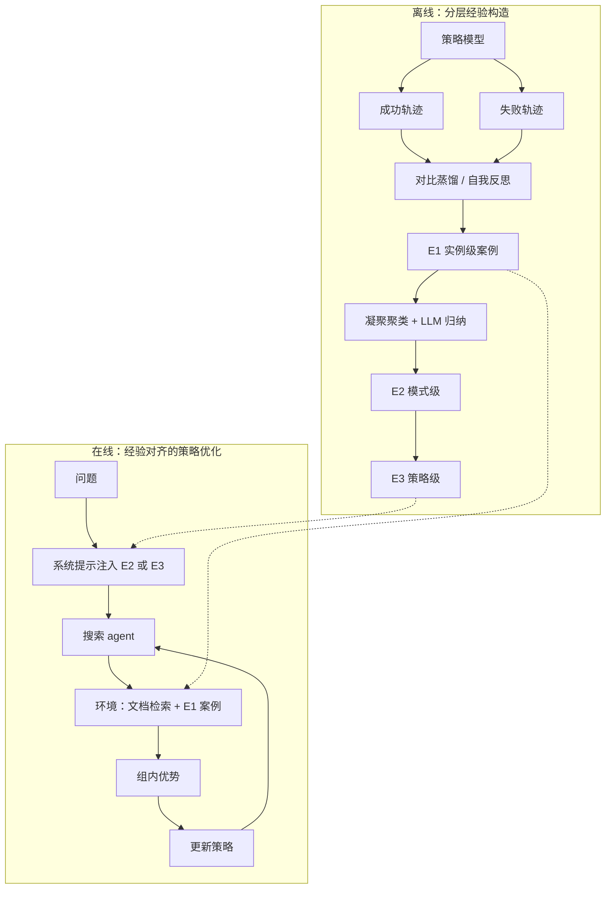

# 给搜索 agent 做 RL，缺的不是再随机探索，是训练数据里有没有可复用的经验结构

<!-- release-date: 2026-04-09 -->

> 本文依据 Alibaba Cloud Computing 发布的 **Beyond Stochastic Exploration: What Makes Training Data Valuable for Agentic Search**，即 arXiv:2604.08124v1、2026-04-09 提交、共 15 页的预印本。通讯作者是 Yuewei Zhang（PDF p. 1）。页边水印是 `arXiv:2604.08124v1 [cs.AI] 9 Apr 2026`。arXiv 摘要页另写着 ACL 2026 Findings Accepted。按主要归属方，本站放在 Alibaba 目录。下文括号中的 `PDF p. N` 均指这份 15 页原件的文件页码。
>
> **版本说明**：截至 2026-09-10 核验，[arXiv:2604.08124](https://arxiv.org/abs/2604.08124) 只有 v1，与本地 `papers/Alibaba/Beyond-Stochastic-Exploration.pdf` 一致，未替换原件。这是一篇技术论文，没有基座架构和预训练 recipe 可讲。全文把三件事分开写：**论文明确写了什么**（带页码）、**本文如何解释它**（凡属推算、换算或从图上读数都会写明）、**外部资料补充**（会给出链接并标注）。

## 读之前需要的最少背景

这篇论文假设你已经见过「让模型一边想、一边调搜索引擎」的训练。不熟的话，先记住下面这些。

**Agentic search（智能体搜索）** 在这里不是再包一个搜索框，而是：模型在推理过程中自己决定何时检索、检索什么，把工具返回写进后续思维。论文把它和传统 RAG 分开——RAG 多半靠人手写好的流程去补文档；这里的 agent 要自己规划查询（PDF p. 2）。

**GRPO（Group Relative Policy Optimization，组相对策略优化）** 是一种不训练价值网络的强化学习。同一道题采一组回答，用组内相对好坏当优势。出处见本站 [DeepSeekMath](/reports/DeepSeek/DeepSeekMath)。本篇在 GRPO 的条件里额外塞进搜索引擎和分层经验库（PDF p. 4–5）。

**GSPO（Group Sequence Policy Optimization，组序列策略优化）** 把重要性比从逐 token 抬到整条回答。本篇拿它做跨算法插件实验，不是本篇的新目标函数。出处见本站 [GSPO](/reports/Alibaba/GSPO)。

**多跳问答** 的意思是：答案不在单篇文档里，必须串几步事实。本篇主战场是 HotpotQA、2WikiMultiHopQA、MuSiQue 这类题，不是 BrowseComp 那种开放网页深挖。

后文三个经验层级会反复出现，论文在 Figure 2 里把它们画成三层金字塔（PDF p. 4）：

- **$E_1$（Instance / Case-based，实例级 / 案例经验）**：对着某一类具体坑的近距离提醒，例如「别把首演日期当成写作月份」。
- **$E_2$（Pattern，模式级）**：可迁移的解题蓝图，例如「先拆时间锚点，再交叉职业属性」。
- **$E_3$（Strategy，策略级）**：更抽象的元规则。消融里它经常不如 $E_2$。

基座是 **Qwen2.5-7B / 32B Instruct**，数学实验另用 **Qwen2.5-Math-7B**（PDF p. 5、7）。论文没有改注意力，也没有改混合专家，不要把它读成一篇 Qwen 结构报告。规格见本站 [Qwen2.5](/reports/Alibaba/Qwen2.5)。

## 先划清切面，避免和 WebSailor 读串

同目录的 [WebSailor](/reports/Alibaba/WebSailor) 也是阿里的搜索 agent 训练，但实验室和切面都不同。WebSailor 来自通义，本篇来自阿里云。对照是本文的读法，不是本 PDF 的原文。

| 工作 | 它在各自 PDF 里做什么 | 不要读成什么 |
|---|---|---|
| WebSailor | 用图结构加信息模糊，造高不确定性网页题，再冷启动 + RL | 不是本篇的方法，也不是本篇的实验 |
| 本篇 HiExp | 在已有多跳题上，问「训练数据凭什么有价值」，把成败轨迹收成分层经验再对齐 RL | 不是又一个搜索工具，也不是 BrowseComp 论文 |

两篇可以并排记，但数字不要横跳。WebSailor 解决的是：**题太清楚，模型只会走直线。** 本篇解决的是：**题已经够难了，若 rollout 仍是无先验的随机探索，RL 照样不稳、轨迹照样浪费。**

## 一句话先说清

这篇论文要解决的矛盾可以这样说：

> **给搜索 agent 接上强化学习之后，常见做法仍是：随机探索，只看最终对错发奖。奖励稀疏、多轮交互里信号还不稳定，小模型尤其走不出全局策略。有价值的训练数据，不是再多采几条瞎逛的轨迹，而是能从成败对比里抽出可复用的启发式。**（PDF p. 1–2）

封面 Figure 1 把这件事画成两条路（PDF p. 1）。题是：「Dismal Euphony 第三张专辑的厂牌，历史上签下的第一支乐队，主唱是谁？」

- **无指导搜索**：先搜专辑名，找到 *All Little Devils*，但厂牌缺失；接着去搜「Top 200 bands」「热门乐队主唱」，越走越散，失败。
- **经验指导**：先动用抽象启发式——尊重时间约束；要找「第一个 X」，去搜「X 的历史」，而不是搜单个实体。再落到具体查询：专辑是谁出品、Nuclear Blast 的乐队史、找到的那支乐队的主唱。这条路短，也更像在执行策略。

所以他们做的不是再发明一种 clip，而是一套叫 **HiExp（Hierarchical Experience，分层经验）** 的框架（PDF p. 1–3）：

1. 对同一道题采成功 / 失败轨迹，做对比蒸馏，得到案例经验。
2. 用多层聚类把碎片经验收成模式和策略。
3. 在无 critic 的 RL 里，把这些经验动态注入 rollout：开局用策略，中途用案例。

摘要把结果写成：复杂 agentic 搜索和数学推理上都有明显收益，并且能跨任务、跨算法泛化（PDF p. 1）。这句话容易读成「经验插件到哪都涨」。后文会把 Table 1 到 Table 6 摊开：主收益在多跳检索的 RL 里；数学上相对 GRPO 的增量小得多；推理期只插经验、不训练，有的子集还会微降。

## 全景：先离线收经验，再在线对齐探索

先把第 3 节落到一张图上。这是机制示意，不是实测时间轴。

这是根据 PDF p. 3–5 的第 3 节和 Figure 2 重画的**机制示意图**。箭头表示数据与训练流向，虚线表示经验被检索进上下文，不表示墙钟时间。

这条流水线要记住的不是名词堆叠，而是因果顺序：

**只有最终对错 → 模型不知道哪一步才是关键决策；经验太碎、直接塞进提示 → 过拟合或检索噪声；开局没有全局策略、中途没有近距离纠正 → rollout 仍是随机逛。** 三段各自堵一截。

## 旧问题：RL 加了搜索引擎，探索仍是无先验的

### 论文怎么描述现状

第 1 节把前作收成两条线（PDF p. 1–2）。一条是提示式 RAG：IRCoT、迭代改写查询、AirRAG 用蒙特卡洛树搜索探推理路径。另一条是训练式搜索 agent：Search-o1 把检索嵌进推理；DeepSeek-R1 证明结果奖励能抬自主决策；Search-R1、ReSearch、R1-Searcher、DeepResearcher、StepSearch 再把端到端 RL 接到多跳和网页搜索上。

这些训练方法的共同点，作者写得很直（PDF p. 2）：主要靠精心设计的结果奖励，去引导一轮**随机探索（stochastic exploration）**。小模型面对复杂任务时，很难做全局战略规划，也很难走出高效轨迹。多轮交互里还不容易给出前后一致的奖励，端到端 RL 会抖。

第 3.2 节把这个瓶颈再说具体一点（PDF p. 4）。现有 RAG 靠非结构化文本检索补中间步，无关噪声容易把后续查询带偏。RL 搜索 agent 在 rollout 阶段是 prior-free 的：没有战略先验，样本效率低，收敛不稳。

### 本文怎么理解「随机探索」

可以把它想成：模型每一步都在重新猜「现在该搜什么」，唯一的老师是最后有没有答对。答对了，整条轨迹都被加分，包括那些碰巧没用的弯路；答错了，整条都被罚，包括那些其实方向对、只是最后一跳没接上的步骤。

Figure 1 左侧那三条越来越泛的查询，就是这种探索的漫画版（PDF p. 1）。它不是不会调搜索，是没有一条「这类题应该先守住什么约束」的经验。

作者因此把训练数据的价值，从标注标签拓宽到**整段探索过程**（PDF p. 3）。轨迹本身被当成内生知识库，而不是再去外挂一份事实百科。

**可迁移的部分。** 若自己的搜索 RL 已经在用 GRPO，但曲线抖、查询重复、工具调用又长又空，先不要急着换算法。问一句：同一道题上，成功和失败的轨迹有没有被拿来对比？如果没有，你喂给优化器的仍是对错标签，不是决策经验。

## 核心设计一：对比蒸馏，只从「有对有错」的题里抽经验

### 旧问题

一条成功轨迹告诉你「可以这样走」，但不知道哪一步是关键，哪一步只是陪跑。一条失败轨迹告诉你「这样不行」，但不知道坑在规划、格式，还是某次查询写飘了。两者分开看，都不够当启发式。

### 新设计：同一道题上对比成功与失败

对训练集里每道题 $x_i$，先独立 rollout $K$ 次，得到轨迹集合 $Y_i$。每条轨迹包含完整的 `<think>`、`<tool_call>` 和工具返回 `<tool_response>`（PDF p. 3）。用结果奖励 $r_{\mathrm{orm}}$ 把它们切成成功路径 $Y_i^{+}$ 和失败路径 $Y_i^{-}$。

然后让策略模型自己、或更强的教师模型做反思，找出两类特征：关键决策点，以及推理陷阱。输出写成一条案例经验 $e_i$ 和一句检索用摘要 $d_i$（PDF p. 3，式 1）：

$$
e_i,\, d_i = \mathrm{Reflect}(x_i,\, y_i^{+},\, y_i^{-})
$$

附录 Table 11 把 JSON 字段钉死（PDF p. 14）：`description` 对应 $e_i$，写不超过 100 词的具体经验；`title` 对应 $d_i$，当检索键。另有 `type`、`tags`、`thinking`。正文强调：`title` 用来检索，`description` 才是详细程序性知识。

Algorithm 1 还有一条容易看漏的门禁（PDF p. 13）：**只有 $Y_{\mathrm{pos}}$ 和 $Y_{\mathrm{neg}}$ 都非空，才抽经验。** 全对或全错的题，这一轮不产生 $E_1$。

$K$ 的具体数值、用的是策略模型还是教师模型做反思，正文没有写死。第 4.3.3 节后文会用实验表明：7B 自己抽的经验，反而比 Qwen-Max 当教师略好（PDF p. 8）。

### 本文怎么理解这一刀

这不是普通的轨迹过滤。拒绝采样只留成功样本；这里故意把失败留在对比里。价值来自**差分**：同题、同环境，为什么这条过了、那条掉进坑。

它也解释了标题里的「训练数据有价值」。标注答案只告诉你终点。有对有错的一组 rollout，才告诉你过程中哪一步是分水岭。全对题没有差分，全错题没有正向示范，两边都被这条门禁排除。

代价也很清楚，论文没展开，本文补成解释：若某类难题的 $K$ 次采样从未成功，它们不会进入经验库。经验库偏向「模型已经偶尔能做对」的中等难度结构，而不是从未解开的盲区。

**可迁移的部分。** 造经验不必先上大教师。先保证同一道题能采到对和错，再用模型把差分写成「以后遇到类似结构该怎么搜」。提示词可以直接借鉴 Table 11 的五字段，不必发明新的记忆系统。

## 核心设计二：多层聚类，把碎片收成模式，但不要收得太抽象

### 旧问题

案例经验绑在具体题上。直接整库注入，模型会过拟合，检索空间也会变吵（PDF p. 3）。你需要某种办法，把「验证导演身份」和「确认导演唯一性」收成同一类近邻，而不是当两条无关记忆。

### 新设计：先嵌入标题，再凝聚聚类，再让 LLM 归纳

用预训练语义编码器 $\phi(\cdot)$ 把每条经验的摘要 $d_i$ 映射成向量 $v_i=\phi(d_i)$（PDF p. 3）。注意：嵌入的是标题，不是整段 `description`。然后对 $v_i$ 做凝聚聚类，阈值 $\tau_1$ 写得很严，用来合并同类问题。每个簇再交给 LLM，把多条实例经验蒸馏成一条更一般的策略经验。

这个过程按层迭代，Algorithm 1 的 Phase 2 写的是（PDF p. 13）：

1. 对上一层经验做编码。
2. 按阈值 $\tau_l$ 凝聚聚类。
3. 对每个簇做 `LLM_Summarize_Cluster`，得到新一层。
4. 若新一层只剩不超过 1 条，认为已经收到全局原则，停止。

Figure 2 把结果画成 $E_3$ 策略、$E_2$ 模式、$E_1$ 实例三层；右侧标注策略经验偏全局，案例经验偏局部（PDF p. 4）。附录说聚类用 scikit-learn 的凝聚聚类、Ward 连接，在 CPU 上大约 10 分钟（PDF p. 13）。

$\tau_l$、$L_{\max}$、以及各层最终有多少条经验，论文没有给数字。

### 消融已经提前剧透：不是越高越好

Table 2 把粒度做成了对照（PDF p. 6）。训练期里，$E_2+E_1$ 全面优于 $E_3+E_1$。作者的读法是：对模型更可执行的，是具体的任务结构模式，而不是更抽象的元规则（PDF p. 7）。

这和封面启发式的粒度一致。「找第一支签约乐队，去搜厂牌历史」是 $E_2$ 量级；「做事要有策略」那种 $E_3$，帮不上查询怎么写。

**可迁移的部分。** 经验系统常见的两种死法：一条都不抽象，库会胀；抽象到口号，模型用不起来。本篇的中间层 $E_2$ 才是主力。若自己做记忆模块，先设一个「再高一层就该能写成解题蓝图、再高一层就变成正确的废话」的停损，而不是追求层数。

## 核心设计三：经验对齐训练——开局看地图，中途看路牌

### 旧问题

经验若只在推理期当插件，训练时的 rollout 仍可能是随机的，优势估计仍会被差轨迹污染。作者要的是：在采样轨迹时就把探索正则成「有经验的启发式搜索」（PDF p. 4）。

### 新设计：按阶段检索不同粒度

每一步的推理轨迹或中间查询 $q_t$ 被当成当前状态。用同一个编码器算 $\phi(q_t)$，到分层经验库 HEK 里做余弦匹配（PDF p. 4，式 2）：

$$
e^{*}=\arg\max_{e\in\mathrm{HEK}}\cos\_sim\bigl(\phi(q_t),\,\phi(d)\bigr)
$$

动态策略分成两段（PDF p. 4）：

- **开局**：优先把全局策略经验（$E_2$ 或 $E_3$）放进系统提示，给一份超越具体题面的蓝图。Table 7 是这份提示的槽位（PDF p. 13）。
- **中途**：按固定语义阈值，自适应提供 top-$k$ 条细粒度 $E_1$。agent 仍可以改写子查询。

附录把检索做成 parent-child：短摘要当 child 做语义匹配，匹配上之后把详细经验当 parent 取回来（PDF p. 12）。$E_1$ 的相似度阈值是 **0.8**，求准；$E_2$ / $E_3$ 取 **top-5**，求多样。HEK 和文档用的是同一套嵌入模型。

Table 7 的系统提示要求：先在 `<think>` 里想，再在 `<tool_call>` 里调工具，最终答案放进 `\boxed{}`。中间有一个 `{experience}` 槽，用来插入检索到的经验（PDF p. 13）。

### 接到 GRPO 上时，经验既在条件里，又不进损失

作者把结果奖励和 GRPO 目标合在一起，明确把搜索引擎 $R$ 和 $\mathrm{HEK}=\{E_1,\ldots,E_L\}$ 写进优化（PDF p. 4–5，式 3）。重要性比是**整条序列**上的：

$$
r_i(\theta)=\frac{\pi_\theta(y_i\mid x,E_l;R)}{\pi_{\mathrm{old}}(y_i\mid x,E_l;R)}
$$

$$
J(\theta)=\mathbb{E}_{x\sim\mathcal{D},\{y_i\}\sim\pi_{\mathrm{old}}}\left[\frac{1}{G}\sum_{i=1}^{G}\min\bigl(r_i(\theta)\hat{A}_i,\;\mathrm{clip}(r_i(\theta),1-\varepsilon,1+\varepsilon)\hat{A}_i\bigr)\right]-\beta D_{\mathrm{KL}}
$$

$\hat{A}_i$ 是整条轨迹的优势，$D_{\mathrm{KL}}$ 是训练策略与参考策略的 KL，$\beta$ 是系数。附录把 KL 系数写成 $1\times 10^{-3}$，clip 写成 $0.2$（PDF p. 12）。

有一条实现细节比公式更关键（PDF p. 5）：算损失时，**检索到的文档片段和案例经验全部 mask 掉**，避免策略去背这些外部文本。经验负责引导采样，不负责当模仿目标。

作者的因果叙述是：轨迹以分层经验为条件，采样质量更高，优势估计更稳，策略更新才更稳（PDF p. 4）。Figure 3 后文会看这条链有没有被训练曲线支持。

### 本文怎么理解「对齐」

这不是把经验写成奖励。奖励仍是结果对错。经验走的是**条件**：改变模型在采样时看见什么，从而改变它更可能走出哪类轨迹。

因此 HiExp 对 GRPO 的改动，主要不在 advantage 公式，而在 rollout 的输入分布。这也是它能插进 GSPO 的原因——换的是采样先验，不是优化器代数。

**可迁移的部分。** 若你已经在 mask 工具返回，把「检索到的记忆」一并 mask，是同一条原则的延伸：上下文可以帮模型行动，但不要让模型靠复读记忆拿分。开局蓝图、中途近距离纠正，这个分工可以直接借；阈值 0.8 和 top-5 则绑定他们的嵌入和库规模，只能当起点。

## 实验设置：本地维基是主场，在线搜索和数学是外推

### 评什么

六个多跳数据集（PDF p. 5）：HotpotQA、2WikiMultiHopQA、MuSiQue 是域内，训练用了它们的部分训练集；Bamboogle、MoreHopQA、Frames 是域外。指标是词级 F1、**CEM（Cover Exact Match，覆盖精确匹配）** 和 EM。更复杂的开放域额外用 **LasJ（LLM-as-Judge）**。论文没有给 CEM 的形式化定义，本文按字面把它读成「预测是否覆盖标准答案」，不当成作者另发明的新指标。

数学六个基准：AIME 2024 / 2025、AMC、MATH-500、Minerva、OlympiadBench。样本少的 AIME、AMC 报 **Avg@32**，其余 **Pass@1**（PDF p. 5）。

有一处正文和附录不完全对齐。第 4.1 节写评估在对应的**完整** dev / test 上进行（PDF p. 5）；附录 A 写 2Wiki 和 HotpotQA 的 dev 太大，随机抽 **1000** 条当最终测试集，随机种子 42，并声称子集表现与全量几乎相同（PDF p. 12）。本文把 Table 1 的 HotpotQA / 2Wiki 数字按附录的 1000 条子集来读，不把 4.1 的「full」当成已经核对过的全量。

### 检索环境

本地检索器用 **multilingual-e5-base**，语料是 2018 年 12 月 Wikipedia dump，超过 2100 万段落（PDF p. 5、12）。为了效率，最终检索库是：五个多跳数据集的 supporting 段落，加上从 2018 dump 里随机抽的 **100 万** 篇（PDF p. 12）。也就是说，金标支持文档被显式混进了检索库。这是 Search-R1 一类工作的常见做法，但会让「检索有多难」比真实全库更乐观。需要更新信息时，另用 **Tavily** 做网页搜索（PDF p. 5）。Table 1 明确写：所有方法在**同一套本地检索环境**里评（PDF p. 6）。

### 训练数据与超参

搜索 agent 的训练数据是 R1-Searcher 的 stage-2 选择结果，再加 MuSiQue 随机 8000 条（PDF p. 5）。附录把前一半写死为 HotpotQA + 2Wiki 共 **8148** 条（PDF p. 12）。数学训在 OpenR1-Math 的 45k 子集上（PDF p. 5）。

实现走 FSDP + vLLM，框架是 VeRL（PDF p. 5）。VeRL 的出处见本站 [HybridFlow](/reports/ByteDance/HybridFlow)。采样温度 1.0、top-p 0.95、最大回复 8192。附录补充（PDF p. 12）：2 个 epoch，`train_batch_size` 16，学习率 $1\times 10^{-6}$，`ppo_mini_batch_size` 16，prompt 最长 512，rollout batch 8，八张 NVIDIA H20 96G。推理用 SGLang 或 vLLM。提示式基线走 ReSearch 的 GitHub 实现；训练式基线用各家公开权重。

这里还有一处对不齐：附录写训练 2 个 epoch，Table 8 把 GRPO 写成约 36 GPU 小时、**1 个 epoch**（PDF p. 12–13）。论文没有解释这两个「epoch」是不是同一口径。本文两处都保留，不强行合成一个训练时长。

离线经验构造在 MuSiQue 上用了约 **7000** 条初始轨迹。对比蒸馏大约 1 小时（文中写 Qwen-7B / 72B / Max 并行推理），聚类约 10 分钟 CPU，整段离线等价代价小于 2 GPU 小时，约占后续 GRPO 的 6% 以下（PDF p. 13，Table 8）。

分层经验构造阶段，附录写他们用策略模型自己做对比蒸馏和聚类，避免引入外部监督信号（PDF p. 12）。这和 Table 6 的「7B 自蒸馏」是同一方向；`trained policy model` 在这里更像是「正在训的那份策略」，不是「RL 完成之后再抽经验」。

## Table 1：主结果在本地多跳上

数字全部来自 PDF p. 6 的 Table 1。平均列是四个数据集 CEM 的算术平均，除下面单独标明的一处外，都能对上分项。

### 提示式：只插经验，Search-o1 就能涨

| 方法 | HotpotQA CEM | 2Wiki CEM | Musique CEM | Bam CEM | 平均 CEM |
|---|---:|---:|---:|---:|---:|
| Vanilla RAG | 22.4 | 27.9 | 5.1 | 12.8 | 17.1 |
| Iter-RetGen | 45.2 | 35.5 | 12.4 | 24.8 | 29.5 |
| IRCoT | 47.3 | 39.2 | 13.3 | 28.8 | 32.2 |
| Search-o1 | 41.2 | 51.0 | 15.5 | 31.2 | 34.7 |
| Search-o1 + HiExp | 47.7 | 56.8 | 18.6 | 37.6 | 40.2（↑5.5） |

表注写 Search-o1 带星号，表示作者复现（PDF p. 6）。+HiExp 在四个 CEM 上全部上升，平均 +5.5。这是训练免费的插件结果：经验库一旦造好，推理期就能用。

### 训练式 7B：HiExp-Searcher 的平均 CEM 是 56.0

| 方法 | HotpotQA F1 / CEM / EM | 2Wiki | Musique | Bam | 平均 CEM |
|---|---|---|---|---|---:|
| Search-R1-v0.3 | 61.8 / 53.6 / 49.8 | 60.7 / 58.7 / 52.3 | 30.9 / 24.7 / 21.5 | 59.4 / 48.0 / 47.2 | 46.3 |
| ReSearch | 63.2 / 55.8 / 50.4 | 67.1 / 65.4 / 60.3 | 28.0 / 34.1 / 24.0 | 53.1 / 45.6 / 41.6 | 表印 48.7 |
| R1-Searcher | 57.8 / 59.7 / 45.6 | 64.0 / 67.8 / 56.2 | 28.4 / 27.9 / 19.5 | 49.8 / 46.4 / 36.0 | 50.5 |
| HiExp-Searcher | 65.4 / 60.4 / 52.4 | 74.6 / 76.5 / 66.9 | 41.7 / 36.7 / 30.7 | 61.0 / 50.4 / 46.4 | 56.0（↑9.7） |

↑9.7 是相对同表 Search-R1-v0.3 的 46.3，不是相对最强开源训练基线 R1-Searcher 的 50.5。相对 R1-Searcher，平均 CEM 仍高 5.5。Musique 上的跳变最大：F1 从 R1-Searcher 的 28.4、Search-R1 的 30.9 抬到 41.7。

ReSearch 7B 的平均列印着 48.7，但四个 CEM 的算术平均是 50.2。差值正好等于把 Musique 的 F1 28.0 误当成 CEM 34.1。这是表内笔误。本文按分项读 ReSearch，不沿用 48.7 去做对比。

### 训练式 32B：平均 CEM 60.4，相对 Search-R1 是 +6.9

| 方法 | HotpotQA CEM | 2Wiki CEM | Musique CEM | Bam CEM | 平均 CEM |
|---|---:|---:|---:|---:|---:|
| Search-R1-v0.3 | 55.8 | 71.7 | 30.6 | 55.2 | 53.5 |
| ReSearch | 61.0 | 76.7 | 33.8 | 52.0 | 55.9 |
| HiExp-Searcher | 62.9 | 80.4 | 41.1 | 57.2 | 60.4（↑6.9） |

32B 的相对涨幅小于 7B 的 +9.7。绝对水平上，2Wiki CEM 80.4、Musique F1 49.2 仍是同表最高。Bamboogle 作为表内唯一标了 ‡ 的域外集，32B 的 CEM 57.2 也高于两个训练基线。

### 「7B 打平前沿」到底打平了谁

同表还有一组前沿 LLM，作者说大模型跟不好 Search-o1 那种逐步检索提示，所以改用标准 RAG，以换更稳的表现（PDF p. 6）：

| 模型 | 平均 CEM |
|---|---:|
| DeepSeek-R1 | 51.2 |
| Qwen3-235B-A22B | 52.2 |
| GPT-4.1 | 58.4 |
| o4-mini | 60.0 |
| Gemini-2.5-Pro | 65.0 |
| HiExp-Searcher 7B | 56.0 |
| HiExp-Searcher 32B | 60.4 |

正文的原话是：训练后的 7B 与 GPT-4.1 相当，并超过 DeepSeek-R1 和 Qwen3-235B-A22B（PDF p. 6）。把数字摊开：

- **支持的**：在这套本地检索、以平均 CEM 为尺的对比里，7B 的 56.0 高于 DeepSeek-R1 的 51.2 和 Qwen3-235B 的 52.2；32B 的 60.4 略高于 o4-mini 的 60.0，也高于 GPT-4.1 的 58.4。
- **需要收口的**：7B 相对 GPT-4.1 仍低 2.4 CEM，说「相当」是量级判断，不是打平。Gemini-2.5-Pro 的 65.0 仍是表上最高。前沿模型走的是 RAG 协议，HiExp-Searcher 走的是多步工具 agent，协议不同，不能读成「7B 已经在同一套 agent 接口上超过 R1」。

## 消融：真正干活的是 $E_2+E_1$，不是更高一层的口号

Table 2 把 HEK 拆开（PDF p. 6）。In-Domain 的 CEM 与 Table 5 三套训练集上的平均对得上；Out-of-Domain 由哪些集合平均，正文没有写明，本文只转分项。

**训练免费：**

| 配置 | In-Domain F1 / CEM | Out-of-Domain F1 / CEM |
|---|---|---|
| 只搜文档 | 37.8 / 35.9 | 31.3 / 24.2 |
| $E_2+E_1$ | 42.0 / 41.0 | 34.8 / 27.3 |
| $E_3+E_1$ | 41.0 / 38.9 | 33.4 / 26.8 |

**训练期：**

| 配置 | In-Domain F1 / CEM | Out-of-Domain F1 / CEM |
|---|---|---|
| 基线 GRPO | 54.2 / 49.6 | 34.4 / 30.3 |
| 只加 $E_2$ | 59.3 / 56.8 | 36.8 / 33.6 |
| 只加 $E_3$ | 56.1 / 53.2 | 34.8 / 31.5 |
| $E_2+E_1$ | 60.6 / 57.9 | 38.2 / 34.0 |
| $E_3+E_1$ | 57.7 / 53.8 | 35.5 / 32.7 |

几件可以从表里直接读出来的事：

1. 光插 $E_2+E_1$、不训练，域内 CEM 已从 35.9 到 41.0。
2. 训练期完整 HEK（$E_2+E_1$）把 GRPO 的域内 F1 从 54.2 推到 60.6，CEM 从 49.6 到 57.9。
3. $E_2$ 单独已经很强（域内 CEM 56.8）；再加 $E_1$ 还能再涨到 57.9。
4. $E_3$ 无论单独还是搭配 $E_1$，都低于对应的 $E_2$ 配置。更高一层不是免费的泛化，有可能把可执行的模式稀释成空话。

## 泛化：在线搜索、数学、GSPO、自己当教师

### 换到网页搜索

Table 3 用在线搜索引擎评三个域外集，指标改成 F1 和 LasJ（PDF p. 6）：

| 方法 | Bam LasJ | Frames LasJ | MoreHQA LasJ | 平均 LasJ |
|---|---:|---:|---:|---:|
| Search-o1 | 66.2 | 33.5 | 36.6 | 45.4 |
| ReSearch | 73.8 | 48.5 | 46.5 | 56.3 |
| R1-Searcher | 71.3 | 42.6 | 37.9 | 50.6 |
| Ours | 76.4 | 48.7 | 49.4 | 58.2 |

平均 LasJ 58.2，高于 ReSearch 的 56.3。Frames 上和 ReSearch 几乎持平（48.7 对 48.5），MoreHQA 上领先更明显（49.4 对 46.5）。作者说网页搜索提供了更多样、更动态的上下文，而经验机制在训练里负责分层规划和接地（PDF p. 8）。表本身只支持「换环境后相对三个基线仍领先」，不支持把 58.2 读成开放网页深研的绝对水平——Frames / MoreHopQA 不是 BrowseComp。

### 换到数学

Table 4 的基座换成 Qwen2.5-Math-7B，经验来自同一套 HiExp，任务不再检索网页（PDF p. 7）：

| 方法 | AIME24 | AIME25 | AMC | MATH500 | Minerva | Olympia | 平均 |
|---|---:|---:|---:|---:|---:|---:|---:|
| Base | 13.2 | 6.1 | 44.5 | 58.4 | 25.4 | 29.0 | 29.4 |
| + HiExp（只推理、不训练） | 12.8 | 7.3 | 42.7 | 62.6 | 25.7 | 32.0 | 30.5（↑1.1） |
| SFT | 21.7 | 16.7 | 55.4 | 82.8 | 36.4 | 45.3 | 43.1（↑13.7） |
| GRPO | 24.1 | 17.8 | 58.8 | 83.4 | 35.3 | 47.4 | 44.5（↑15.1） |
| GRPO + HiExp | 26.7 | 23.3 | 62.7 | 84.2 | 37.1 | 46.8 | 46.8（↑17.4） |

括号里的 ↑ 都相对 Base。需要分开读：

- 推理期只插 HiExp，平均只 +1.1，而且 AIME24 从 13.2 降到 12.8，AMC 从 44.5 降到 42.7。经验插件不是数学上的免费午餐。
- GRPO 自己已经把平均从 29.4 拉到 44.5。HiExp 再叠上去，到 46.8，相对 GRPO 是 +2.3，不是 +17.4。AIME25 的 17.8 → 23.3 是这项里最显眼的单点；Olympia 反而从 47.4 微降到 46.8。

正文 4.3.2 写「GRPO 训练期接入 HiExp 相对基座 +17.4」（PDF p. 7）。这句话算术上成立，但容易让人以为 +17.4 都是 HiExp 的贡献。真正属于经验对齐的增量，是 GRPO 之上的那 2.3 点，以及 AIME25 / AMC 上更清楚的单点。

### 换优化器

Table 5 在 HotpotQA / 2Wiki / Musique 上把 HiExp 插进 Search-o1、GRPO 和 GSPO（PDF p. 7）。平均列是三个 CEM 的算术平均。

| 方法 | HotpotQA CEM | 2Wiki CEM | Musique CEM | 平均 CEM |
|---|---:|---:|---:|---:|
| Search-o1 | 41.2 | 51.0 | 15.5 | 35.9 |
| + HiExp | 47.7 | 56.8 | 18.6 | 41.0（↑5.1） |
| GRPO | 54.9 | 61.2 | 32.8 | 49.6 |
| + HiExp | 60.4 | 76.5 | 36.7 | 57.9（↑8.3） |
| GSPO | 62.7 | 60.0 | 35.7 | 52.8 |
| + HiExp | 64.7 | 69.4 | 42.6 | 58.9（↑6.1） |

GRPO 和 GSPO 都能涨。GSPO 基线平均 CEM 已经高于 GRPO（52.8 对 49.6），加上 HiExp 之后到 58.9，仍略高于 GRPO+HiExp 的 57.9。F1 方向不一样：GSPO 的 HotpotQA F1 只有 52.3，远低于 GRPO 的 61.6，说明两个算法的 F1 / CEM 画像不同，不能只看平均 CEM 宣布谁更强。

跨算法成立的是：**经验对齐是采样侧插件，不绑死某一种 advantage 公式。**

### 教师不必更大

Table 6 把经验来源换成 Qwen-Max 蒸馏给 7B，再对比 7B 自己抽经验（PDF p. 8）。数字与 Table 5 的 GRPO+HiExp CEM 对齐，应读成 CEM：

| 来源 | Hotpot | 2Wiki | Musique | 平均 |
|---|---:|---:|---:|---:|
| Max → 7B | 59.8 | 74.7 | 35.5 | 56.7 |
| 7B → 7B（Self） | 60.4 | 76.5 | 36.7 | 57.9 |
| 差值 | +0.6 | +1.8 | +1.2 | +1.2 |

自蒸馏略好约 1.2%。作者的解释：有效性更取决于经验和学生推理分布是否合拍，而不是反思本身绝对更强。7B 自己写的经验更贴它的能力边界，RL 阶段更好用（PDF p. 8）。这也支持一条很实际的流水线：不必为了造经验先调用更大的教师。

## 训练稳定性：正文有定性结论，图上没有逐点数字

Figure 3 画了约 800 个 training step 的四条曲线：验证奖励、优势方差、梯度方差、梯度范数。Backbone 是纯 GRPO，HiExp 是经验对齐后的同一套训练（PDF p. 8）。图上没有逐点标注。本文不从图上读绝对分数，只转述正文，并核对曲线方向是否和文字一致。

正文的定性结论（PDF p. 8）：

- HiExp 的有效奖励升得更快、更稳，因为分层经验把策略推向高价值路径。
- 传统 RL 的随机探索容易产生事实不一致的查询和低效轨迹；HiExp 让 rollout 跟蒸馏出的原则对齐，少走噪声和重复路径。
- 优势和梯度的方差都明显低于基线，梯度噪声被压住，更新更稳。

用眼睛看图，方向与文字相符：HiExp 的验证奖励整体在 Backbone 之上；梯度方差在 Backbone 上有一段明显上冲，HiExp 更贴着低位走；梯度范数后半段 HiExp 也更低。优势方差两边都在振荡，HiExp 并非单调更低，只是后半段更常落在较低的一侧。这是读图观察，不是论文给出的统计检验。

从优化角度看，这条链是：更好的采样先验 → 组内轨迹不那么野 → $\hat{A}_i$ 不那么炸 → 梯度更干净。它解释的是「为什么同样的 GRPO 公式，接上 HEK 更稳」，不是「他们发明了新的方差正则」。

## 定性例子：先拆时间锚点，再挡住日期陷阱

Table 9 给了一道 Frames 上的题（PDF p. 14）。题面：2016 年 5 月，一位剧作家写了什么戏？这位剧作家拿到麦克阿瑟奖的年份，和《Postcolonial Love Poem》的诗人是同一年。答案是 *Skeleton Crew*。

HiExp 的轨迹被作者标了三处触发：

1. **$E_2$ Multi-hop Constraint Decomposition**：不要直接搜「2016 年 5 月的戏剧」。先找诗人 → 确定获奖年 → 找同一届的剧作家 → 再核 2016 年 5 月的作品。
2. 检索返回 Natalie Diaz 是《Postcolonial Love Poem》作者，2018 年获麦克阿瑟奖。于是目标年被钉成 2018。
3. **$E_1$ Temporal-Professional Attribute Intersection** 和 **Temporal-Entity Work Attribution**：找到 2018 年麦克阿瑟奖得主 Dominique Morisseau 之后，挡住「把首演日期当成写作 / 出版月份」这种常见坑，最后问的是她 2016 年 5 月写的那部戏。

第 4.5 节把 $E_2$ 叫逻辑蓝图，把 $E_1$ 叫手术式纠正（PDF p. 9）。这和 Figure 1 的「先尊重时间约束，再把 first X 改写成 X 的历史」是同一类启发式，只是场景从厂牌签约换成了奖项年份。

附录 Figure 4 用饼图说明这些多跳集并不浅（PDF p. 14；HotpotQA 没有跳数标注，改数 supporting facts）：

| 数据集 | 主要组成 |
|---|---|
| HotpotQA | 2 条事实 70.7%；3 条 21.2%；4 条 6.5%；不少于 5 条 1.6% |
| 2Wiki | 2 跳 76.7%；4 跳 22.1%；3 跳与不少于 5 跳各 0.6% |
| MuSiQue | 2 跳 51.2%；3 跳 30.9%；4 跳 17.9% |
| MoreHopQA | 3 跳 100% |
| Frames | 2 跳 37.6%；3 跳 35.0%；4 跳 16.3%；不少于 5 跳 11.2% |

2Wiki 几乎没有 3 跳、却有两成 4 跳，形状很怪，论文没解释。MoreHopQA 全部是 3 跳，所以 Table 3 上的领先不能解释成「更会做超长跳」，更像是在固定 3 跳结构上用了更好的约束分解。

## 实现里还写了、但正文没强调的细节

这些都在附录，不属于主叙事，但会影响复现。

**提示。** Table 10 是给前沿模型用的 vanilla RAG 提示：上下文不够或答错时，允许动用自身知识；题面含糊或上下文有多个可能答案时，在 `\boxed{}` 里用逗号列出（PDF p. 12、14）。作者发现：大模型在 Search-o1 协议下不太听指令；普通 RAG 时，文档里没有答案就会直接说找不到，把参数知识浪费掉（PDF p. 12）。所以 Table 1 的前沿数字，是「改过提示的 RAG」，不是「同一套 agent 脚手架」。

**裁判。** Table 13 的 LasJ 打 0–5 分，看用户回答是否覆盖参考答案的全部要点（PDF p. 15）。附录 B 说这个更精确的评判可以并进训练，但会增加开销（PDF p. 12）。主 RL 用的结果奖励 $r_{\mathrm{orm}}$ 是否就是这套 0–5，论文没有写死。

**聚类提示。** Table 12 要求把相似经验收成可泛化策略，输出仍是 `ids / type / title / tags / description / thinking`，描述和思考各不超过 100 词（PDF p. 14）。

**没有公开的数字。** rollout 次数 $K$、各层聚类阈值、HEK 各层条数、top-$k$ 的 $k$ 在中途 $E_1$ 上取几、最大检索次数，正文和附录都没给。离线阶段在 MuSiQue 上用了约 7000 条轨迹，但 8148+8000 的完整训练集是否都抽了经验，没有另写。

**没有官方代码。** 15 页里只给出基线仓库 `https://github.com/Agent-RL/ReCall`（PDF p. 12）。HiExp 本身没有论文内的代码或数据发布链接。

## 限制：经验是离线冻住的

作者自己写的限制只有一段，而且很硬（PDF p. 9）：当前做法是**半解耦**的。分层经验的构造和后续策略优化分开。从初始策略蒸馏出的指导，可能跟不上模型在 RL 里长出来的新能力。agent 一旦内化了更复杂的推理范式，就会碰到更高阶的挑战。未来方向是把经验构造和模型训练收成动态闭环。

这句话和 Table 8 的「离线只占不到 6%」放在一起读，意思就完整了：便宜，是因为只造一次；不准，也是因为只造一次。

论文没有讨论的边界，本文单独标成解释，不当成作者原话：

- 检索库混入了金标 supporting 段落，本地多跳的绝对数字偏乐观。
- 对比蒸馏要求同题既有成功也有失败；从未做对的难题可能进不了 $E_1$。
- 数学上的跨任务收益，相对检索主场要小一个数量级。
- CEM 没有形式化定义，跨论文直接对比这个数字要小心。

## 最值得带回自己项目的启发

### 1. 先问训练数据有没有差分，再问要不要换 RL 算法

本篇最硬的一跳不是 HEK 这个名字，是 Algorithm 1 的门禁：同题必须有对有错，才抽得出经验。若你的 rollout 全对或全错，GRPO 本来就没有组内方差；HiExp 也抽不出对比。换 GSPO、换 clip 常数，解决不了「这道题没有可学习的差分」。

### 2. 有价值的不是轨迹条数，是轨迹里能沉淀成启发式的结构

Figure 1 的两条启发式几乎可以直接当检查清单：有没有时间约束？「第一 / 最大 / 最早」是不是该改写成「历史 / 列表」而不是单实体？自己的搜索日志里，这类结构重复出现时，就该写成 $E_2$，而不是再随机采样一轮指望模型自己悟。

### 3. 中间层比顶层有用

$E_2+E_1$ 稳定优于 $E_3+E_1$。记忆系统不要一上来就追求「宇宙级原则」。能写成解题蓝图的模式层，加上挡住具体陷阱的案例层，已经是消融里的最优组合。

### 4. 经验走条件，不走损失

文档和案例都 mask。模型可以看见它们再行动，但不能靠复读它们更新参数。这和 WebSailor 把观察 token 移出损失是同一类纪律，场景不同：那边防的是背检索片段，这边还多防一层背自己的经验库。

### 5. 造经验不必请更大的老师

Table 6 的 1.2% 很小，但方向稳定：7B 自己写的经验更贴 7B。若资源有限，用学生自己的成功 / 失败对比来造 HEK，比先蒸馏一个 Max 更值得做。离线代价按他们的口径不到后续 RL 的 6%，这个量级值得记；具体 36 GPU 小时绑定 8×H20，不能直接当自己的预算。

### 6. 插件能涨，并不等于「不训练也行」

推理期 +HiExp 在多跳上平均 CEM +5.5，在数学上只有 +1.1，还有单点微降。经验库更像正则和先验：检索任务上它能直接改查询；数学这种已经高度格式化的域，它替代不了 GRPO 自己的那 +15.1。

### 7. 不要用「7B 打平 GPT-4.1」代替表上的分母

56.0 对 58.4，协议还不同。真正被实验钉住的是：同一套本地检索里，HiExp-Searcher 7B / 32B 超过同表的 Search-R1、ReSearch、R1-Searcher；经验插件对 GRPO 和 GSPO 都有效；$E_2+E_1$ 是消融最优。

## 关键词回看

- **随机探索**：只靠结果奖励、没有战略先验的 rollout。
- **HiExp**：对比蒸馏 + 多层聚类得到的分层经验框架。
- **HEK**：分层经验知识库，$E_1$ 案例、$E_2$ 模式、$E_3$ 策略。
- **对比蒸馏**：同一道题上对比成功 / 失败轨迹，抽出决策点和陷阱。
- **自我反思经验**：用模型自己的轨迹当内生知识，而不是外挂事实库。
- **凝聚聚类**：按摘要嵌入合并同类经验，再让 LLM 归纳上一层。
- **经验对齐训练**：开局注入 $E_2$ / $E_3$，中途检索 $E_1$，改变的是采样条件。
- **parent-child 检索**：短标题匹配，详细经验回填。
- **损失 mask**：文档片段和案例经验不进策略梯度。
- **CEM / LasJ**：覆盖精确匹配；0–5 分的 LLM 裁判。
- **HiExp-Searcher**：在 Qwen2.5 Instruct 上按这套框架训出的搜索 agent。
- **半解耦**：经验离线造一次，跟不上后续 RL 里长出来的新能力。

## 最后的判断

HiExp 最值得记住的，不是又一个搜索 agent 名词，而是它把「训练数据有没有价值」写成一件很具体的事：

> **若数据只提供随机探索的轨迹和最终对错，RL 加工具仍然会逛、会抖。有价值的数据，能从成败差分里沉淀出可检索、可执行的经验——尤其是模式层的蓝图，加上案例层的纠偏。**

数据侧不靠再造一批更脏的题，而靠把已有 rollout 收成 HEK。训练侧不改奖励代数，而把经验塞进 GRPO / GSPO 的条件，并且不让这些文本进损失。实验支持的是：Qwen2.5-7B / 32B 在本地多跳上超过同表的 Search-R1、ReSearch、R1-Searcher；经验插件对提示式 Search-o1 也涨；在线搜索和 GSPO 上方向一致；7B 自蒸馏略优于 Max 教师；$E_2+E_1$ 是粒度上的最优。

实验**不支持**的结论包括：7B 已经在同一套 agent 协议上打平 GPT-4.1、数学上的 +17.4 主要来自 HiExp 而不是 GRPO、更高层的 $E_3$ 一定更泛化、以及离线经验可以一直跟着策略一起变强。最后一条作者自己写进了限制。

如果只记一句话，可以记：

> **训搜索 agent，先问同题的成败轨迹有没有被拿来对比；经验要写成能改查询的蓝图，不要写成正确的废话；它应该引导采样，而不该成为新的背诵对象。**

## 资料与阅读边界

- 原始依据：本地 `papers/Alibaba/Beyond-Stochastic-Exploration.pdf`，arXiv:2604.08124v1，2026-04-09 11:44:44 UTC 提交，15 页。ACL 2026 Findings Accepted 写在 arXiv 摘要页的 Comments 里。官方公开日取 arXiv v1 这一天。
- GRPO 的出处：本站 [DeepSeekMath](/reports/DeepSeek/DeepSeekMath)。GSPO：本站 [GSPO](/reports/Alibaba/GSPO)。VeRL / HybridFlow：本站 [HybridFlow](/reports/ByteDance/HybridFlow)。基座规格：本站 [Qwen2.5](/reports/Alibaba/Qwen2.5)。
- 同目录、切面不同的 web agent 训练：本站 [WebSailor](/reports/Alibaba/WebSailor)。通义那篇讲的是高不确定性造题，本篇讲的是已有轨迹如何变成有价值的经验。不要把 BrowseComp 分数写回本篇 Table 1。
- 论文给出的基线实现：[Agent-RL/ReCall](https://github.com/Agent-RL/ReCall)。HiExp 本身在这 15 页里没有代码或数据发布链接。
- 同作者前作 AirRAG（Feng et al., 2025b）和 PVPO（Feng et al., 2025c）只出现在参考文献里，不是本篇实验。
