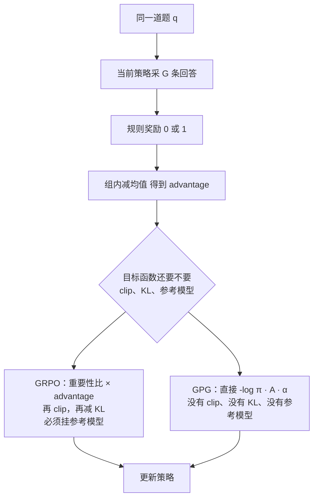

# GPG：推理 RL 可以没有 critic、参考模型和 KL，组内相对奖励就够当基线

<!-- release-date: 2025-04-03 -->

> 本文依据 AMAP, Alibaba Group 的 Xiangxiang Chu、Hailang Huang、Xiao Zhang、Fei Wei、Yong Wang 发布的 **GPG: A Simple and Strong Reinforcement Learning Baseline for Model Reasoning**，即 arXiv:2504.02546v4、封面页眉日期 2026-02-03、共 23 页、录用为 ICLR 2026 的版本。下文括号中的 `PDF p.N` 都指这份 23 页原件的文件页码。截至 2026-09-10 核验，arXiv 上的最新版本仍是 v4，没有 v5，与本地原件一致，无需替换。解读依据 v4。
>
> **请先把同名论文划清。** 另有一篇也叫 Group Policy Gradient 的工作，arXiv:2510.03679，作者是剑桥的 Junhua Chen、Zixi Zhang、Hantao Zhong、Rika Antonova。那篇把 GRPO 的组内优势推广到一般 MDP，**仍然保留 PPO 的 clip 目标**，评测是标准控制任务，不是 LLM 推理。**不是本篇。** 本篇是 AMAP 给模型推理写的极简策略梯度：去掉 critic、参考模型和 KL，直接用组内相对奖励乘 $\log\pi$。
>
> 这是一篇技术论文而不是基模报告，所以没有模型架构和预训练 recipe 可讲。重点是它从 GRPO 里拆掉了哪几项、拆完之后 advantage 和梯度该怎么改，以及「consistently outperforms GRPO」这句话落到哪张表、哪一格其实没赢。
>
> 文中会明确区分三层：**论文写了什么**、**本文如何解释它**、**哪些是外部资料补充**。所有从图上量出来的数字都会标明是读图所得。

## 一句话先说清

GPG 只做一件事：**把推理 RL 从 PPO / GRPO 的代理损失，退回策略梯度定理那一行。**

同一道题仍采一组回答，仍用组内均值当基线。其余三项全部拆掉：

- 不再训价值模型（critic）；
- 不再挂一份参考模型，也不再减 KL；
- 不再做重要性比，也不再 clip。

拆完之后，剩下的问题不是「算法还成不成」，而是两个更土的偏差：组内标准差会把奖励尺度拧歪；全对或全错的组贡献零梯度，却仍按整批大小做平均。论文用 **准确梯度估计（Accurate Gradient Estimation，AGE）** 把分母从 $B$ 改成有效样本数 $B-M$，再用一个有效样本比例阈值做方差控制。

论文的立场是：

> **语言模型已经从预训练和 SFT 里拿到了强表征。Atari 时代为了稳而加上去的 critic、参考模型和 KL，在推理后训练里可以先拿掉。**（PDF p.2）

这句话是作者的判断，不是定理。实验覆盖停在 7B 和 1.5B，论文自己也说没测极大模型（PDF p.9）。

## 读前需要的最少背景

GRPO 的完整机制——为什么不要价值模型、组内 advantage 怎么算、KL 放在哪里——见本站 DeepSeekMath 篇。GSPO 把重要性比从 token 抬到整条回答，见本站 GSPO 篇。本文只补足够往下读的部分，不重复那两篇。

先约定六个记号，都来自 PDF p.3–4：

- **策略（policy）$\pi_\theta$**：正在训练的语言模型，$\theta$ 是它的参数。
- **$q$ 是题目，$o$ 是模型写出的整条回答**，$|o|$ 是这条回答的 token 数。策略按自回归分解：$\pi_\theta(o\mid q)=\prod_{t}\pi_\theta(o_t\mid q,o_{<t})$。
- **组（group）$G$**：同一道题一次采样出的回答条数。GPG 的 Group 和 GRPO 的 Group 是同一个意思。
- **奖励 $r_i$ / $R(o_i)$**：给完整回答打一个标量分。数学推理里通常对 1、错 0（PDF p.4）。
- **优势（advantage）$\hat A_{i,t}$**：这条回答比「这道题本来该期待的水平」高多少。RL 更新靠的是这个差值，不是原始得分。
- **参考模型 $\pi_{\mathrm{ref}}$**：GRPO / PPO 用来算 KL 的那份冻结策略，通常是 SFT 起点。GPG 不要它。

再补三个后文会反复出现的名字：

- **近端策略优化（Proximal Policy Optimization，PPO）**：需要策略、价值模型和参考模型，用 clip 把更新限制在旧策略附近。
- **组相对策略优化（Group Relative Policy Optimization，GRPO）**：DeepSeekMath 提出，删掉价值模型，改用组内标准化当 advantage，但仍保留 clip、KL 和参考模型。
- **代理损失（surrogate loss）**：不直接最大化「期望回报」，而是优化一个带 clip、重要性比或 KL 的替代目标。GPG 声称自己不用代理，直接走策略梯度。

## 旧方法卡在哪：PPO 的零件是为 Atari 准备的

### PPO 在 LLM 里同时很贵、又不一定还需要

论文从 PPO 的身世讲起（PDF p.2）。PPO 是 TRPO 的简化，评测主场是 Atari：策略网络要同时学视觉表征和控制策略。到了 LLM，策略已经从预训练和 SFT 里拿到了强表征。作者的推论是：**为了稳住一个还在学表征的网络而加上去的零件，不一定还该原样搬过来。**

PPO 贵在两处（PDF p.2）：

- **价值模型（critic / value model）**：一个和策略差不多大的网络，专门估「写到这里最终大概能得几分」。显存和计算接近翻倍。
- **参考模型（reference model）**：一份冻结的旧策略，用来算 KL，防止新策略跑太远。又是一份前向。

简化 PPO 已经是一条独立的技术线。论文点名两篇：ReMax 用基线值去掉 critic；GRPO 用组内标准化去掉 critic（PDF p.2）。GPG 要走得更远：连参考模型和 KL 也不要，连 clip 也不要。

### GRPO 仍留下了三件「为了稳」的东西

GRPO 相对 PPO 已经删了价值模型。它留下的是（PDF p.5 Table 2、p.17 Table 14、附录 C 式 24–28）：

- **重要性比 + clip**：新旧策略在每个 token 上的概率比，超出 $[1-\varepsilon,1+\varepsilon]$ 就裁掉；
- **KL 正则**：显式减一项 $D_{\mathrm{KL}}[\pi_\theta\|\pi_{\mathrm{ref}}]$，所以必须挂参考模型；
- **组内标准差**：advantage 要再除以组内奖励的标准差。

论文认为这三件都是代理，不是原问题。原问题是最大化期望回报（PDF p.3 式 1）。策略梯度定理把它变成 $\mathbb{E}[\nabla_\theta\log\pi_\theta\cdot A]$（PDF p.3 式 3）。clip 和 KL 都不是这一行里的东西。

### 同期工作 Dr. GRPO 指出了标准差的偏置，但分数没拉开

论文专门点了一篇同期工作 Dr. GRPO（PDF p.2、p.4）。Dr. GRPO 研究奖励和损失的归一化，指出 GRPO 的标准差会引入奖励偏置，并声称 GRPO 倾向于生成更多 token。作者的观察很硬：

> 虽然它揭示了 advantage 函数里的奖励偏置，**我们观察到它的表现并没有显著超过 GRPO**。（PDF p.2）

Table 1 把这句话落到数字：作者复现的 Dr. GRPO 平均 43.7，和他们自己的 GRPO 基线 43.7 持平；AMC23 上 Dr. GRPO 是 50.0，反而低于 GRPO 的 62.5（PDF p.4）。

**本文的读法是**：只把标准差拿掉，并不自动等于「更接近原问题」。标准差可能同时干了两件事——一件是作者不想要的偏置，另一件是后面 AGE 才说清楚的梯度修正。Dr. GRPO 拆了第一件，没补第二件。

### 用一张图看 GPG 动了哪一步

机制示意图，根据 PDF p.4 式 5–8、p.5 Table 2、p.17 Table 14 重画，不含实测时间或数据。图里唯一分叉的那个菱形就是 GPG 的全部算法改动位置：**采样、打分、组内减均值都没变。** $\alpha$ 是后面要讲的梯度修正系数，不是第三套奖励。

## 方法：直接走策略梯度，再修两个土偏差

### 2.1 预备：从期望回报走到 advantage

原目标是最大化期望回报（PDF p.3 式 1）：

$$
J(\theta)=\max_\theta\,\mathbb{E}_{\pi_\theta}\left[\sum_{t=0}^{T}r_t\right]
$$

策略梯度定理把它变成（PDF p.3 式 2）：

$$
\nabla_\theta J(\theta)=\mathbb{E}_{\pi_\theta}\bigl[\nabla_\theta\log\pi_\theta(a_t\mid s_t)\,Q^{\pi_\theta}(s_t,a_t)\bigr]
$$

$Q^{\pi_\theta}(s_t,a_t)$ 是动作价值：在状态 $s_t$ 采取动作 $a_t$、之后继续跟 $\pi_\theta$，期望能拿到多少回报。为了降方差，通常改成 advantage（PDF p.3 式 3–4）：

$$
A^{\pi_\theta}(s_t,a_t)=Q^{\pi_\theta}(s_t,a_t)-V^{\pi_\theta}(s_t)
$$

$V^{\pi_\theta}(s_t)$ 只是 $s_t$ 的某个函数。常见选择是学一个价值网络。论文说，在模型推理里，一步估计已经够用，不必上 GAE（PDF p.3）。

任务被进一步简化（PDF p.3）：中间步骤很难给准奖励，所以只在整条回答结束时给一个最终奖励 $r$。策略仍是自回归的。这就是标准的结果监督设定，和 GRPO 的 outcome supervision 同一类。

### 2.2 组策略梯度：目标函数里没有 clip，也没有 KL

GPG 的名字来自它的核心机制：**用组内平均奖励代替价值模型，给策略梯度当基线**（PDF p.3）。目标写成（PDF p.4 式 5）：

$$
J_{\mathrm{GPG}}(\theta)=\mathbb{E}_{(q,a)\sim\mathcal{D},\,\{o_i\}_{i=1}^{G}}\left[\frac{1}{\sum_{i=1}^{G}|o_i|}\sum_{i=1}^{G}\sum_{t=1}^{|o_i|}-\log\pi_\theta(o_{i,t}\mid q,o_{i,<t})\,\hat{A}_{i,t}\right]
$$

符号逐项确认：

- 采样是题目 $(q,a)$ 来自数据集 $\mathcal{D}$，一组回答 $\{o_i\}_{i=1}^{G}$ 来自当前策略；
- 分母 $\sum_i|o_i|$ 是这组里所有 token 数，所以这是按 token 平均，不是按回答平均；
- $\log\pi_\theta$ 前面有一个负号。

**必须先说清这个负号。** 论文把式 5 叫 $J$，但 Algorithm 1 写的是 `loss ← −log π · Â · α`（PDF p.6）。Table 14 也把 GPG 写成 $L_{\mathrm{GPG}}=-\log\pi_\theta(o)\cdot A$（PDF p.17）。所以式 5 在实现里是 **要最小化的损失**，等价于最大化 $\mathbb{E}[\log\pi\cdot\hat A]$，也就是 REINFORCE 那一行。

**这是论文的写法，不是笔误。** 但「直接优化原目标」不能按字面读成「式 5 等于式 1」。式 1 是期望回报；式 5 是它的策略梯度估计被拿来当损失。两者在 **当前策略采样、一步更新** 的前提下梯度同向。论文几乎不讨论 off-policy。GSPO 整篇都在讲 off-policy，本篇把它省略了。这是本文的观察，论文没有对比。

advantage 的定义是（PDF p.4 式 6）：

$$
\hat{A}_{i,t}=\frac{r_i-\operatorname{mean}\bigl(\{R_i\}_{i=1}^{G}\bigr)}{F_{\mathrm{norm}}}
$$

- 分子是这条回答的奖励减组内均值，全组共用一个基线；
- $F_{\mathrm{norm}}$ 是可选的归一化。GRPO 取组内标准差；GPG 的最终配方取 $1$。
- 下标带了 $t$，但结果监督下同一条回答的所有 token 共用同一个 $\hat A_i$。论文没有做过程监督实验。

和 GRPO 比，这一行少了两样：没有除以标准差（最终配方），也没有重要性比。组内减均值这一步是留着的。所以 **GPG 不是「没有基线」**，它只是不学价值网络，改用同组其他回答当场测出一个基线。

Table 2 把零件差写成一张清单（PDF p.5）：

| | 价值模型 | 参考模型 | 代理损失 | 策略约束 |
|---|---|---|---|---|
| PPO | 有 | 有 | 有 | 有 |
| GRPO | 无 | 有 | 有 | 有 |
| TRPO | 有 | 无 | 有 | 有 |
| GPG | 无 | 无 | 无 | 无 |

这张表是作者的分类，不是实验结果。GPG 那一行四个空格，就是全文的方法主张。

### 第一个偏差：组内标准差是 $s_t$ 的函数，会把原问题拧歪

论文把 $\hat A_{i,t}$ 当成「先前研究在推理里没被认真看过的关键部件」，并列出两个未解决问题（PDF p.4）。第一个是奖励偏置。

GRPO 取 $F_{\mathrm{norm}}=\operatorname{std}\{R(o)\}$。论文的判定是：标准差是状态 $s_t$ 的函数，**显式引入了奖励偏置**，于是 advantage 不再对应原问题（PDF p.4）。他们想解的是原问题，所以不想要代理或偏置。

但只把 $F_{\mathrm{norm}}$ 设成 $1$，分数几乎不动。Table 1 在 Qwen2.5-Math-7B、MATH-lighteval、不要格式奖励只要准确率奖励的设定下（PDF p.4）：

| 模型 | Average | AIME24 | MATH-500 | AMC23 | Minerva | OlympiadBench |
|---|---:|---:|---:|---:|---:|---:|
| Qwen2.5-Math-7B | 30.9 | 13.3 | 57.6 | 45.0 | 14.7 | 23.7 |
| GRPO（表里写成 GPRO） | 43.7 | 16.7 | 73.4 | 62.5 | 30.2 | 35.7 |
| GPG（$F_{\mathrm{norm}}=1,\alpha=1$） | 43.9 | 23.3 | 76.3 | 52.5 | 30.1 | 37.4 |
| GPG（$F_{\mathrm{norm}}=\mathrm{std},\alpha=1$） | 45.3 | 23.3 | 73.6 | 60.0 | 30.5 | 39.3 |
| GPG（$F_{\mathrm{norm}}=\mathrm{std},\alpha=B/(B-M)$） | 44.1 | 23.3 | 74.2 | 52.5 | 30.9 | 39.7 |
| GPG（$F_{\mathrm{norm}}=1,\alpha=B/(B-M)$） | 47.8 | 30.0 | 75.0 | 62.5 | 33.1 | 38.2 |
| GPG（$F_{\mathrm{norm}}=1,\alpha=B/(B-M),\beta_{\mathrm{th}}=0.6$） | 48.3 | 30.0 | 76.2 | 62.5 | 34.2 | 39.0 |
| Dr. GRPO（作者复现） | 43.7 | 26.7 | 74.6 | 50.0 | 30.1 | 37.3 |

表里 GRPO 被写成 GPRO，后文 Table 15 也写成 GPRO（PDF p.17）。这是论文自己的拼写，本文按 GRPO 理解。

只看这一张表，先记下几件和摘要不完全一致的事：

- **「去掉标准差就更接近原问题」在分数上不成立。** $F_{\mathrm{norm}}=1,\alpha=1$ 的平均 43.9，只比 GRPO 的 43.7 高 0.2；AMC23 从 62.5 掉到 52.5，这是一张必须写出来的弱格子。
- **保留标准差、只把损失换成策略梯度、去掉 KL**，平均反而到 45.3。也就是说，在还没有 AGE 的时候，标准差是有用的。
- **标准差和 AGE 叠在一起会变差**：44.1，低于只保留标准差的 45.3，AMC23 再次掉到 52.5。论文没有单独解释这一行。
- **AMC23 上，最终 GPG 和 GRPO 打平，都是 62.5。** 「consistently outperforms」在这一格不成立。

论文随后自己解释了为什么去标准差会掉点。Figure 2 右图画了组内奖励标准差随训练步的变化：从大约 0.35 降到 0.10–0.15 一带（PDF p.5；纵轴刻度约 0.10–0.35，论文正文写 value ranges from 0.10 to 0.35）。$\alpha$ 则在 1.5 到 4.0 之间变。作者的判断是：GRPO 的奖励归一化提供了一种「组内标准差下潜」的机制，**本身带有一定的梯度修正效果**（PDF p.5）。

**本文的解释是**：标准差一会儿当尺度归一化，一会儿又碰巧扮演 $\alpha$ 的粗近似。去标准差等于同时拆掉偏置和这份碰巧的修正，所以分数不动甚至在 AMC23 上变差。要去偏置，就得把那份修正用 AGE 补回来。这是读 Table 1 和 Figure 2 的推论，论文没有把「标准差 ≈ $1/\alpha$」写成公式。

### 第二个偏差：全对或全错的组，梯度被整批大小稀释了

这是 GPG 真正新的那一刀。

一批 $B$ 个样本里，设前 $M$ 个来自「整组全对或整组全错」的题目。组内奖励全是 1 或全是 0 时，均值等于每一个 $r_i$，advantage 全是 0，梯度也是 0。普通反向传播仍按 $B$ 做平均（PDF p.4）：

$$
g=\frac{1}{B}\sum_{i=1}^{B}g_i=\frac{1}{B}\sum_{i=M+1}^{B}g_i
$$

有效梯度被稀释了 $B/(B-M)$ 倍。AGE 把分母改成有效样本数（PDF p.4 式 7）：

$$
\hat g=\frac{\sum_{i=M+1}^{B}g_i}{B-M}=g\cdot\frac{B}{B-M}=\alpha g,\qquad \alpha=\frac{B}{B-M}
$$

$\alpha$ 不是常数，随每一批里有多少零梯度样本而变。Figure 2 左图画了两类「无效组」的比例（PDF p.5）：

- **简单题（easy problems）**：一组里奖励全是 0，模型全错；
- **困难题（hard problems）**：一组里奖励全是 1，模型全对。

读图能确认的趋势是：训练开始后，全错组的比例明显抬头，大约走到 50%–60% 一带；全对组始终很低。虚线 $\alpha$ 大致在 2 到 4 之间晃。这些是读图，论文没有给对应数值表。它要说明的只有一件事：**$\alpha$ 一直在变，所以梯度修正不是可选项。**

多卡训练时，朴素做法是把所有非零梯度样本搜集到一起再平均，通信更贵。论文给出一个等价写法：直接把目标乘上 $\alpha$（PDF p.5 式 8）：

$$
\hat J_{\mathrm{GPG}}(\theta)=\alpha\,J_{\mathrm{GPG}}(\theta)
$$

附录 A 证明这和「只对有效样本求平均」是同一件事（PDF p.15 式 9–17）。设 $N$ 张卡，每张卡 $K=B/N$ 个样本，第 $i$ 张卡上有 $M_i$ 个零梯度样本，有效样本总数 $S=B-M_{\mathrm{total}}$。PyTorch 默认的全卡平均是

$$
\hat G_{\mathrm{PyTorch}}=\frac{1}{B}\sum_{i=1}^{N}G_i
$$

真正只对有效样本平均的梯度是

$$
G_{\mathrm{true}}=\frac{1}{S}\sum_{i=1}^{N}G_i
$$

于是 $\hat G_{\mathrm{PyTorch}}=G_{\mathrm{true}}\cdot S/B$。乘上 $\alpha=B/S$ 就回到 $G_{\mathrm{true}}$，不必改通信。

Table 1 里，加上 AGE 之后平均从 43.9 升到 47.8（PDF p.5）。这是全文最干净的一档消融：同一份 $F_{\mathrm{norm}}=1$ 的目标，只改分母。

**可迁移的判断在这里，不在「去掉 KL」那句口号。** 只要你的 advantage 会在某些样本上变成精确的 0（全对、全错、被 clip 掉、被 mask 掉），框架默认的 `mean` 就会把有效梯度按「名义 batch」而不是「有效 batch」缩小。LLM 推理 RL 里 0/1 奖励特别容易制造这种样本。

### 有效样本太少时，AGE 会放大方差：用阈值把样本攒到下一批

AGE 给出的是无偏估计，但有效比例过低时，$\alpha$ 会很大，方差跟着变大。论文引入有效样本比例阈值 $\beta_{\mathrm{th}}=1/\alpha_{\mathrm{th}}$（PDF p.5）。比例低于阈值时，把有效样本攒进下一批，直到比例超过阈值再更新。

Algorithm 1 把整件事写成三行（PDF p.6）：

1. 按式 6 和式 7 算 $\hat A$ 和 $\alpha$，一直采到 $\alpha<1/\beta_{\mathrm{th}}$，也就是有效比例超过 $\beta_{\mathrm{th}}$；
2. 用当前策略算 $\log\pi_\theta(o)$；
3. $\mathrm{loss}\leftarrow -\log\pi_\theta(o)\cdot\hat A\cdot\alpha$。

论文拿它和 DAPO 的动态采样对比（PDF p.5、p.8）：DAPO 把无效样本丢掉、重采到 $M=0$，于是 $\alpha=1$，但训练时间被最慢的那个 worker 卡住。GPG 不追求 $M=0$，只保证有效比例不低于阈值，并且用 $\alpha$ 自动按这批质量缩放损失。

Table 1 最后一行：$\beta_{\mathrm{th}}=0.6$ 把平均从 47.8 再送到 48.3。附录 Table 10 补了 0.8（PDF p.16）：平均 48.6，AIME24 从 30.0 升到 33.3，AMC23 从 62.5 升到 67.5，但 MATH-500 从 76.2 掉到 73.6，Minerva 从 34.2 掉到 29.4。**阈值不是免费午餐，0.6 是作者选的折中，不是被证明的最优。**

Table 15 把这条从 GRPO 走到 GPG 的路写成四组（PDF p.17）：

| 组别 | 做法 | Average | 作者的解释 |
|---|---|---:|---|
| GRPO | clip + KL + 组内标准差 | 43.7 | 起点 |
| A | 换成 PG 损失，去掉 KL，保留标准差 | 45.3 | 组奖励 + 策略梯度 |
| B | 再把 $F_{\mathrm{norm}}$ 设成 1 | 43.9 | 去偏置，但触发梯度偏差，分数回落 |
| C | 加上 AGE | 47.8 | 修正零梯度稀释 |
| D | 再加上 $\beta_{\mathrm{th}}=0.6$ | 48.3 | 用阈值做方差控制 |

这条链比摘要里的「去掉 critic / ref / KL」更值得记住。真正把分数从「和 GRPO 持平」拉到「平均高出约 4.6 分」的，是 AGE 和阈值，不是「没有 clip」本身。

## 实验怎么证明

### 3.1 设置：两套单模态配方，四套多模态借来的框架

论文声明：超参尽量跟 GRPO 对齐，尽管这些超参对 GPG 未必最优；即便如此，方法在所有任务上 consistently outperforms GRPO（PDF p.6）。后面会把这句话逐表核对，弱格子一并写。

**单模态。** 训练数据来自 open-s1、open-rs 和 MATH-lighteval（PDF p.6）。评测固定五套数学基准：AIME24、MATH-500、AMC23、Minerva、OlympiadBench。两条线：

- **1.5B 蒸馏模型**：DeepSeek-R1-Distill-Qwen-1.5B。用 open-s1 训出 GPG-RS1，用 open-rs 训出 GPG-RS3（PDF p.6）。附录 B.1 写的是 100 个 global step 和 50 个 global step（PDF p.16）。
- **7B 基座**：Qwen2.5-Math-7B。消融走 MATH-lighteval + SimpleRL（只要准确率奖励，PDF p.4）；主结果走 Yu et al. 2025 的数据集，也就是 DAPO 那套，细节在附录 B.1。

附录 B.1 的 7B 配方（PDF p.16）：VERL 框架，全局 batch 144 道题，每题 8 条回答，只要准确率奖励，AdamW，学习率 $1\times 10^{-6}$，weight decay 0.1，$\beta_{\mathrm{th}}=0.6$，1100 step，48 张来自中国的 NPU。论文写「Our implementation strictly follows Algorithm 1」。

**多模态。** 分别借三套已有框架，不自建训练栈（PDF p.6、p.16）：

- VisualThinker-R1-Zero：约 12,000 条 SAT 训练，评 CV-Bench；
- R1-V：约 8,000 条 GEOQA 训练，评 GEOQA test；
- Visual-RFT：Flower102 / Pets37 / FGVCAircraft / Car196 做 few-shot 分类，LISA 的 239 条做 grounding。

硬件写的是 NVIDIA H20 和来自中国的 NPU（PDF p.6）。实现「严格跟随原代码库的设定」，GPG 按 Algorithm 1 替换损失。

系统提示和奖励函数在附录 B.4（PDF p.18–19）：1.5B 用 `<think>…</think><answer>…</answer>` 模板；Qwen 7B 用「step by step + boxed」模板。大多数任务用准确率奖励和格式奖励；grounding 用 IoU；Qwen 7B 只要准确率奖励。

### 3.2 单模态：平均分赢了，格子没有全赢

**1.5B。** Table 3，zero-shot pass@1（PDF p.7）：

| Distilled 1.5B | Average | AIME24 | MATH-500 | AMC23 | Minerva | OlympiadBench |
|---|---:|---:|---:|---:|---:|---:|
| DeepSeek-R1-Distill-Qwen-1.5B | 48.9 | 28.8 | 82.8 | 62.9 | 26.5 | 43.3 |
| Still-3-1.5B-Preview | 51.6 | 32.5 | 84.4 | 66.7 | 29.0 | 45.4 |
| Open-RS1（作者复现） | 53.1 | 33.3 | 83.8 | 67.5 | 29.8 | 50.9 |
| Open-RS3（作者复现） | 52.0 | 26.7 | 85.4 | 70.0 | 27.9 | 50.2 |
| GPG-RS1 | 55.7 | 33.3 | 87.6 | 77.5 | 29.4 | 50.5 |
| GPG-RS3 | 55.5 | 33.3 | 85.0 | 80.0 | 26.8 | 52.4 |

Open-RS1 / Open-RS3 是同一套数据、同一套评测上的 GRPO 族基线，这是 1.5B 上和 GRPO 最公平的对照。平均分 GPG 赢了：55.7 对 53.1，55.5 对 52.0。弱格子必须写：

- GPG-RS1 对 Open-RS1：AIME24 打平 33.3；Minerva 29.4 < 29.8；OlympiadBench 50.5 < 50.9。赢主要来自 MATH-500（87.6 对 83.8）和 AMC23（77.5 对 67.5）。
- GPG-RS3 对 Open-RS3：MATH-500 85.0 < 85.4；Minerva 26.8 < 27.9。赢主要来自 AMC23（80.0 对 70.0）和 OlympiadBench（52.4 对 50.2）。
- GPG-RS3 的 Minerva 26.8 几乎回到蒸馏起点 26.5，低于 Open-RS1 的 29.8。

所以 1.5B 上「consistently outperforms GRPO」成立在平均分和 AMC23，不成立在 Minerva，也不成立在每一格。

**7B 主结果。** Table 4，zero-shot pass@1（PDF p.7）：

| 7B 模型 | Average | AIME24 | MATH-500 | AMC23 | Minerva | OlympiadBench |
|---|---:|---:|---:|---:|---:|---:|
| Qwen2.5-Math-7B | 30.9 | 13.3 | 57.6 | 45.0 | 14.7 | 23.7 |
| Qwen2.5-Math-7B-Instruct | 43.8 | 13.3 | 79.8 | 50.6 | 34.6 | 40.7 |
| Qwen2.5-Math-7B（no template） | 38.2 | 0.2 | 69.0 | 45.8 | 21.3 | 34.7 |
| rStar-Math-7B | — | 26.7 | 78.4 | 47.5 | — | 47.1 |
| Eurus-2-7B-PRIME | 48.9 | 26.7 | 79.2 | 57.8 | 38.6 | 42.1 |
| Oat-Zero-7B（原论文） | 51.4 | 43.3 | 80.0 | 62.7 | 30.1 | 41.0 |
| Oat-Zero-7B（作者复现） | 47.8 | 30.0 | 80.6 | 55.4 | 29.0 | 44.0 |
| OpenReasoner-Zero-7B @ 8k | 45.9 | 13.3 | 82.4 | 54.2 | 31.6 | 47.9 |
| SimpleRL-Zero-7B | 46.6 | 26.7 | 78.2 | 60.2 | 27.6 | 40.3 |
| GPG-Zero-7B | 57.7 | 36.7 | 84.6 | 82.5 | 39.0 | 45.8 |

Figure 1 上半就是这张表的柱状图（PDF p.1），GPG-7B 标注 36.7 / 39.0 / 45.8 / 82.5 / 84.6 / 57.7，与 Table 4 一致。论文正文强调：平均 57.7；AMC23 82.5、Minerva 39.0，分别比 SimpleRL-Zero-7B 高 22.3 和 11.4 个百分点；相对作者复现的 Oat-Zero-7B 平均高出 6.3（PDF p.7）。

这张表 **没有 GRPO 行**。7B 上和 GRPO 的公平对照是 Table 1（MATH-lighteval，平均 48.3 对 43.7），不是 57.7 对 43.7。两套数据、两套步数，不能相减。

相对其他 SOTA，弱格子同样存在：

- AIME24：原论文 Oat-Zero 43.3 > GPG 36.7。作者复现的 Oat-Zero 只有 30.0，GPG 才反超。论文在 Figure 1 里画的是复现版（图例带 †）。
- OlympiadBench：OpenReasoner-Zero 47.9 > GPG 45.8；rStar-Math 47.1 也高于 GPG。
- Minerva：GPG 39.0 只比 Eurus 38.6 高 0.4。

附录 Table 16 用四个随机种子报了 pass@1 / 3 / 5 的均值和标准差，模型是 Qwen2.5-7B 基座，评测集少了 OlympiadBench（PDF p.18）。pass@1 平均 GPG-Zero-7B 58.7，高于 Oat-Zero 52.0。弱格子：pass@5 的 AIME24 上 Oat-Zero 42.5 > GPG 41.7；pass@3 / pass@5 的 Minerva 上 Eurus 44.3 / 47.6 都高于 GPG 的 43.4 / 46.0。平均分的优势主要来自 AMC23（pass@1 80.6 对次高 66.5）。

### 3.3 多模态：四张表相对 GRPO 是全胜，提升幅度远大于单模态

Figure 1 下半把四项任务收成柱图（PDF p.1）。读图数字与 Table 5–8 一致，分类那一项 SFT 55.6 低于基座 56.0，是图上能直接看到的弱格子。

**几何推理，Table 5**（PDF p.7–8）。Qwen2.5-VL-3B-Instruct 在 GEOQA test 上：基座 35.41，+GRPO 47.48，+GPG 51.33。GPG 比 GRPO 高 3.85 个百分点。没有弱格子。

**细粒度分类，Table 6**（PDF p.7–8），4-shot：

| 模型 | Average | Flower102 | Pets37 | FGVC | Cars196 |
|---|---:|---:|---:|---:|---:|
| Qwen2-VL-2B | 56.0 | 54.8 | 66.4 | 45.9 | 56.8 |
| + SFT | 55.6 | 58.5 | 55.5 | 67.9 | 40.5 |
| + GRPO | 81.9 | 71.4 | 86.1 | 74.8 | 95.3 |
| + GPG | 89.0 | 79.3 | 90.8 | 88.5 | 97.5 |

GPG 平均 89.0，比 GRPO 高 7.1，四个数据集全胜。弱格子在 SFT：平均 55.6 低于基座，Pets37 从 66.4 掉到 55.5，Cars196 从 56.8 掉到 40.5。论文用这张表说明 GPG 相对 GRPO 在感知任务上也稳；它没有讨论为什么 SFT 会掉。

**视觉推理，Table 7，CV-Bench**（PDF p.7–8）：

| 模型 | Total | Count | Relation | Depth | Distance |
|---|---:|---:|---:|---:|---:|
| Qwen2-VL-2B | 31.38 | 54.69 | 22.46 | 0.16 | 31.66 |
| + SFT | 57.84 | 60.02 | 68.92 | 55.00 | 45.83 |
| + GRPO | 59.47 | 59.64 | 66.76 | 54.16 | 56.66 |
| + GPG | 76.15 | 66.62 | 83.23 | 81.66 | 75.50 |

GPG 的 76.15 比 GRPO 的 59.47 高 16.68 个百分点，这是全文相对 GRPO 最大的单点分差。四个子项 GPG 全胜。值得单独写的是 **GRPO 相对 SFT 的弱格子**：Count 59.64 < 60.02，Relation 66.76 < 68.92，Depth 54.16 < 55.00。GRPO 只在 Distance 上明显超过 SFT，总分因此只高出 1.63。GPG 在 Depth 上从 54.16 拉到 81.66，几乎把这项从「没学会」变成「学会了」。

**推理 grounding，Table 8，LISA**（PDF p.7–8）：

| 模型 | mIoU$_{\mathrm{test}}$ | mIoU$_{\mathrm{val}}$ | gIoU$_{\mathrm{test}}$ |
|---|---:|---:|---:|
| Qwen2-VL-2B | 26.9 | 30.1 | 25.3 |
| + SFT | 28.3 | 29.7 | 25.3 |
| + GRPO | 37.6 | 34.4 | 34.4 |
| + GPG | 51.8 | 51.3 | 50.4 |

GPG 三项都比 GRPO 高出 14 个百分点以上（PDF p.8）。SFT 在 val 上 29.7 低于基座 30.1，test 上几乎没动。239 条训练图像能拉出这一档分差，论文把它当作 GPG 在定位任务上的证据。

多模态这四张表，相对 GRPO 没有弱格子。这是摘要里「consistently outperforms GRPO」最站得住的一半。单模态那一半要靠 Table 1 和 Table 3，而且有打平、有输的格子。

### 3.4 消融：组大小、DAPO、以及一张指错的 KL 表

**组大小，Table 11**（PDF p.8、p.16），Qwen2.5-Math-7B，**没有 AGE**：

| Group Number | Average | AIME24 | MATH-500 | AMC23 | Minerva | OlympiadBench |
|---|---:|---:|---:|---:|---:|---:|
| 2 | 41.9 | 16.7 | 71.6 | 60.0 | 25.0 | 36.0 |
| 4 | 43.3 | 20.0 | 73.2 | 55.0 | 29.8 | 38.5 |
| 8 | 45.3 | 23.3 | 73.6 | 60.0 | 30.5 | 39.3 |
| 16 | 47.3 | 26.7 | 74.6 | 65.0 | 32.4 | 37.8 |

平均分随组变大单调上升。作者选 8，理由是训练成本和性能的折中（PDF p.8）。弱格子：组 4 的 AMC23 55.0 低于组 2 的 60.0；组 16 的 OlympiadBench 37.8 低于组 8 的 39.3。组内基线的质量随 $G$ 变好，但不是每一项都单调。

**和 DAPO 比，Table 9**（PDF p.9）。同一份数据、同样 1100 step，GPG 只要准确率奖励：

| 方法 | Average | AIME24 | MATH-500 | AMC23 | Minerva | OlympiadBench | Training Cost | Data Cost | Memory |
|---|---:|---:|---:|---:|---:|---:|---:|---:|---:|
| DAPO-7B | 56.0 | 30.0 | 84.6 | 82.5 | 34.9 | 47.8 | 1× | 1× | 28G |
| GPG-Zero-7B | 57.7 | 36.7 | 84.6 | 82.5 | 39.0 | 45.8 | 0.45× | 0.39× | 24G |

平均分 GPG 高 1.7，训练成本 0.45×，数据成本 0.39×，显存 24G 对 28G。弱格子：MATH-500 打平 84.6；AMC23 打平 82.5；OlympiadBench DAPO 47.8 > GPG 45.8。论文把 DAPO 的动态采样写成「常要更多 batch，最后一批还可能浪费有效样本」；GPG 用阈值攒样本、用 $\alpha$ 缩放，避免这些浪费（PDF p.8）。成本数字论文没有解释口径——是墙钟、是 step 数、还是 token 数，原文没写。只能按表格转述。

**奖励归一化位置，Table 13**（PDF p.17）：组内标准差平均 45.3，batch 内标准差 44.9，$F_{\mathrm{norm}}=1$ 为 43.9。组内优于 batch 内。弱格子：batch 内 Minerva 35.3 > 组内 30.5；$F_{\mathrm{norm}}=1$ 的 MATH-500 76.3 反而是三行最高。

**KL 约束。** 正文 3.4 节说：方法原则上直接优化原 RL 问题，不加分布约束「有点奇怪」；他们做了加约束的消融，「结果见 Table 13」，结论是加约束会伤害性能（PDF p.8–9）。**Table 13 实际是奖励归一化，不是 KL。** 全文没有任何一张表的列名叫 KL 系数或 $D_{\mathrm{KL}}$。这是原文的引用错误。能确定的只有：最终配方没有 KL；作者在文字上主张加分布约束会掉点；**掉多少、用什么系数，论文没有给出可核对的数字。**

**训练曲线和个例。** Figure 3 用 DeepSeek-R1-Distill-Qwen-1.5B、与 Table 3 同一设定，对比 GPG（蓝）和 GRPO（灰）的 loss、reward、format reward、completion length（PDF p.21）。读图能确认：GPG 的 reward 爬得更高，format reward 两边都走到约 1.0，completion length 都在中段从约 3300 掉到 1500–2000 一带。论文没有给这些曲线的数值表。Figure 4 是一道 AIME24 双曲线内接菱形题，标准答案 480；GPG 写出 480，GRPO 写出 176，过程在公式分析处出错（PDF p.21）。这是个例，不能当统计证据。

**通用能力有没有被推理 RL 打坏。** 附录 B.3 用 OpenCompass 评 DeepSeek-R1-Distill-Qwen-1.5B 在 GPG 前后的 MMLU 和 C-Eval（PDF p.17）。Table 12：MMLU 38.31 → 38.53（+0.22），C-Eval 32.91 → 33.29（+0.38）。Table 19 零样本代码和通用 QA，模型是 Qwen-1.5B（PDF p.21）：

| 方法 | MBPP | MBPP+ | HellaSwag（acc$_{\mathrm{norm}}$ / std$_{\mathrm{err}}$） | TruthfulQA（mc2 / std$_{\mathrm{err}}$） |
|---|---:|---:|---:|---:|
| GRPO | 24.60% | 21.96% | 41.914 / 0.492 | 47.307 / 1.516 |
| GPG | 26.19% | 23.81% | 42.551 / 0.493 | 50.146 / 1.533 |

相对 GRPO 这四格全胜。Table 17 / 18 的分科目里有下降，不是「每一科都升」。C-Eval 的 law 从 26.67 掉到 20.33（−6.34），是附录里最大的单科跌幅（PDF p.20）。论文的结论写成「GPG 可以看作安全且广泛适用的方法」（PDF p.17）；更精确的读法是：**平均分没有掉，个别科目会掉，法律那一科掉得不少。**

### 3.5 影响与限制：作者自己写下的那一句

论文把影响写成：高效、可扩展的 RL 是通用智能的基石；GPG 走极简路线，可能有利于可扩展系统（PDF p.9）。限制只写了一句：

> **受计算预算约束，我们没有在极大模型上评估这个方法。**（PDF p.9）

没有 32B、没有 72B，没有 MoE。Table 4 的 7B 已经是全文最大的语言模型。

## 相关工作、结论、复现声明

**§4 相关工作** 分成两块（PDF p.9）。大模型推理：CoT、Tree-of-Thought、MCTS、复杂 SFT 数据、DeepSeek-R1 的大规模 RL，以及把 R1 路线搬到 MLLM 的一批工作。强化学习：REINFORCE 的高方差，TRPO 的二次约束，PPO 的 clip；作者认为 PPO 对保守更新的依赖会牺牲探索。篇幅不够的部分放到附录 C（PDF p.21–23），把 PPO 的 clip 目标、价值损失、熵正则，以及 GRPO 的组内 advantage、token 级重要性比、无偏 KL 估计和完整目标（式 18–28）按教科书方式展开。附录 C 没有新实验。

**§5 结论** 把贡献收成一句：GPG 把 PPO / GRPO 里基于组的决策动态直接并进标准策略梯度，简化训练、降低开销，同时不牺牲推理质量（PDF p.10）。「不牺牲」是相对这些方法的平均表现而言，不是相对每一格。

**§6 复现声明** 列了四条（PDF p.10）：实验设置见 3.1；单模态基于 VERL、Open-r1、Open-rs，多模态基于 VisualThinker-R1-Zero、R1-V、Visual-RFT，这些仓库按研究需要改过；超参和评测协议见附录 B.1；为了双盲，完整实现和训练评测脚本放在匿名仓库。公开后的对应地址是 GitHub `AMAP-ML/GPG`，见文末，那是外部补充，不是 PDF 正文。

## 边界、缺口，以及「consistently outperforms GRPO」到底有多真

把摘要那句主张按表拆开，而不是按宣传收束。

**相对 GRPO，平均分成立，格子不成立。**

- 7B、MATH-lighteval、同一套 SimpleRL 超参：Table 1 最终 GPG 48.3 对 GRPO 43.7。AMC23 打平 62.5。去标准差但不加 AGE 的那一行，AMC23 52.5 明显输给 GRPO。
- 1.5B、同一套 open-rs / open-s1：Table 3 平均分赢，Minerva 和部分 OlympiadBench / MATH-500 格子输给 Open-RS。
- 多模态四张表：相对 GRPO 全胜，分差 3.85 到 16.68 个百分点。这是这句主张最硬的证据。
- 代码和通用 QA：Table 19 四格全胜，但模型是 Qwen-1.5B，不是主实验的 7B。

**7B 主结果 Table 4 不能拿来减 GRPO。** 57.7 是 DAPO 数据、1100 step、48 卡 NPU 的 GPG-Zero-7B；43.7 是 MATH-lighteval 上的 GRPO。论文自己把超参对齐写在 Table 1 的设定里，却把「consistently outperforms」写进摘要和 3.1 开头。严格的读法是：对齐设定下平均高出约 4.6 分（48.3 对 43.7），主结果那张 SOTA 表赢的是其他 RL 方法，不是同一行里的 GRPO。

**KL 消融缺表。** 正文指向 Table 13，Table 13 不是 KL。最终配方没有 KL 是事实；「加上去会掉点」目前没有可引用的数字。

**外部实现补了一句论文没写的话。** [verl 的 GPG 文档](https://verl.readthedocs.io/en/latest/algo/gpg.html)（页面标注 Last updated: 07/03/2025）在介绍完「原论文不用 KL」之后，立刻给了一个可选项：`use_kl_loss: True`，`kl_loss_coef: 0.01`，并写「you can still use KL loss to further improve the performance」。这是框架作者的经验，**不是本篇论文的结果**。它说明：极简基线被集成之后，KL 又可能作为插件加回来——和论文「加约束会掉点」的文字主张方向相反。两边都没有在同一张表上对打。

**规模、模态和稳定性的缺口。**

- 没测极大模型，作者自己承认（PDF p.9）。
- 没测 dense 对 MoE。GSPO 的核心论据是 MoE 的专家激活波动，本篇完全没有进入那个问题。
- 没分析 off-policy。式 5 没有重要性比，等于默认采样策略就是当前策略。大规模训练把 rollout 切成多个 mini-batch 之后，这个默认不成立，见本站 GSPO 篇。
- Table 4 的 Oat-Zero 原论文 51.4 和作者复现 47.8 差 3.6 分，AIME24 差 13.3 分。论文没有讨论复现差距。Figure 1 用的是复现版。
- 成本 0.45× / 0.39× 没有口径。
- 式 5 叫 $J$、实现是 loss，符号不自洽。
- GitHub README 把 GPG-RS1 对应的数据写成 Open-r1，PDF 3.1 节写成 open-s1。以 PDF 为准。

## 它怎么支撑基模的训练，以及可以带回自己项目的原则

这篇论文只有一个交付物——一个更短的损失函数，外加 AGE 和阈值。它能落在基模后训练的三个位置上：

**1. 先放一条极简基线，再决定 clip 和 KL 还要不要。**

PPO 的零件是为「表征还在学」的控制任务准备的。LLM 的表征已经在预训练里学过了。GPG 的实验说明：在 1.5B / 7B、0/1 规则奖励、组大小 8 的设定下，没有 clip、没有 KL、没有参考模型，平均分可以高于 GRPO。这不等于「以后都不要 KL」。它等于：**KL 和 clip 必须在极简基线上证明自己还有用，才能继续付那份参考模型的前向。**

**2. 零梯度样本是推理 RL 的日常，不是边角。**

0/1 奖励下，一道太难或太容易的题会让整组 advantage 变成 0。框架按名义 batch 做平均，等于主动把有效梯度缩小。AGE 是一行代码的修正：损失乘 $B/(B-M)$。阈值则承认：有效比例太低时，无偏估计的方差会炸，该把样本攒一攒。DAPO 走的是「采满再训」，GPG 走的是「不够就缩放并攒到下一批」。两种都在处理同一件事，成本结构不同。

**3. 多模态上的分差提醒：GRPO 的代理项在视觉任务上可能更有害。**

CV-Bench 上 GRPO 相对 SFT 几乎没动，GPG 一下拉了 16 分；LISA 上 GPG 相对 GRPO 三项都高 14 分以上。论文没有解释为什么多模态分差更大。**本文的猜测是**：视觉任务的奖励更稀疏、组内全对全错更常见，clip 和 KL 对探索的压制更明显。这是猜测，不是论文证据。可检验的做法是在同一套多模态代码里只开关 AGE，看分差还剩多少。

### 可以带回自己项目的原则

**先问「这个零件是为哪个时代的策略准备的」。** 价值模型、参考模型、KL、clip，每一件都有当年的理由。理由绑定的是「策略还在学表征、动作空间小、奖励尺度乱」。换到已经预训练好的 LLM 和 0/1 规则奖励，理由要重新成立一遍，不能靠惯性保留。

**去掉一个偏置之前，先看它是不是同时在修另一个偏置。** 组内标准差既拧歪了奖励尺度，又碰巧补偿了零梯度稀释。只拆第一件，分数可以不动甚至变差。Table 1 的 43.9 对 43.7 就是这个陷阱。

**名义 batch 和有效 batch 不是同一个数。** 任何会把部分样本梯度精确打成 0 的设计——全对全错组、clip、padding mask、过长截断——都会让 `loss.mean()` 把有效信号按错误的分母缩小。先数有多少样本真的在贡献梯度，再决定要不要乘一个 $\alpha$。

**极简基线的价值是给后续零件提供对照，不是宣布后续零件死刑。** verl 后来又把 KL 做成 GPG 的可选项，说明工程上没人把「永远不加 KL」当成教条。正确用法是：默认从 GPG 起跑，加 KL 或 clip 必须在同一张表上赢过这个默认。

**「平均分 consistently 更好」时，把弱格子抄下来。** AMC23 打平、Minerva 偶发输给 Open-RS、OlympiadBench 输给 OpenReasoner-Zero、C-Eval 法律科 −6.34，这些不是脚注。它们标出方法的适用边界：平均分够用当基线，不够用当「全面替代」。

## 关键词回看

- **策略梯度（policy gradient）**：用 $\mathbb{E}[\nabla\log\pi\cdot A]$ 估计 $\nabla\mathbb{E}[R]$，不经过 clip 或 KL。GPG 的损失就是这一行加上一个负号。
- **组策略梯度（Group Policy Gradient，GPG）**：同一道题采 $G$ 条回答，用组内均值当基线，直接做策略梯度。没有 critic、没有参考模型、没有 KL、没有 clip。
- **代理损失（surrogate loss）**：PPO / GRPO 里带重要性比和 clip 的那个目标。GPG 声称不用它。
- **$F_{\mathrm{norm}}$**：advantage 的分母。GRPO 用组内标准差；GPG 最终配方用 1。标准差被论文判定为奖励偏置，但单独去掉它分数几乎不动。
- **准确梯度估计（AGE）**：把梯度平均的分母从名义 batch $B$ 改成有效样本数 $B-M$。实现上就是损失乘 $\alpha=B/(B-M)$。
- **$\beta_{\mathrm{th}}$**：有效样本比例阈值。低于它就把有效样本攒到下一批。论文主实验取 0.6。
- **无效组**：一组回答全对或全错，advantage 全是 0。Figure 2 显示训练中全错组会变成多数。
- **Dr. GRPO**：同期工作，去掉 GRPO 的标准差偏置。作者复现后平均分和 GRPO 持平。

## 最后的判断

GPG 的技术含量不在公式复杂度上。目标函数比 GRPO 少了重要性比、clip 和 KL 三项，advantage 比 GRPO 少了一个标准差。真正新的是 AGE：承认 0/1 奖励会制造大量零梯度样本，并拒绝让框架的 `mean` 把有效信号按错误的分母缩小。

它和邻居两篇的分工可以记成一句：

- DeepSeekMath 的 GRPO：删掉价值模型，留下 clip、KL、组内标准差；
- GSPO：留下 GRPO 的 advantage，把重要性比从 token 抬到序列；
- GPG：连重要性比、clip、KL、参考模型一起删掉，只修 advantage 的分母和零梯度稀释。

三条都在动 GRPO，动的不是同一行。

论文本身的证据该这样读：

- **确定的**：最终配方没有 critic、没有参考模型、没有 KL、没有 clip；AGE 把 PyTorch 默认平均乘回有效样本平均，附录 A 是代数事实；Table 1 上 AGE 把 43.9 拉到 47.8，这一档消融干净。
- **有实验支持但覆盖窄的**：1.5B / 7B、规则奖励、组大小 8 时，平均分高于对齐设定下的 GRPO；多模态四张表相对 GRPO 全胜，分差更大；相对 DAPO 平均分略高、成本更低，但 OlympiadBench 输了。
- **只是主张或写错了的**：摘要的 consistently outperforms 在 AMC23、Minerva、部分 OlympiadBench 格子上不成立；KL 消融指向了错误的表；「直接优化原目标」忽略了 off-policy；没测极大模型和 MoE。

如果只记一句话：

> **推理 RL 的第一条基线可以是：同一道题采一组回答，减去组内均值，按有效样本数做策略梯度。clip、KL 和参考模型要留下来，必须先在这条基线上证明自己不是惯性。**

## 资料与阅读边界

- 原始依据：本地 `papers/Alibaba/GPG.pdf`，arXiv:2504.02546v4，封面页眉 2026-02-03，ICLR 2026，共 23 页。
- 版本核验：[arXiv 论文页](https://arxiv.org/abs/2504.02546)。v1 提交于 2025-04-03 12:53:41 UTC，v2 于 2025-04-17，v3 于 2025-05-01，v4 于 2026-02-03 03:51:37 UTC。截至 2026-09-10 核验，最新版本仍为 v4，与本地 PDF 一致，无需替换原件。
- `release-date` 依据：GPG 是一个算法，不存在「对外开放使用」的对象，因此取该技术**首次官方公开披露日**。已知官方渠道是 arXiv v1（2025-04-03）。
- 不是本篇的同名工作：[Group Policy Gradient](https://arxiv.org/abs/2510.03679)（剑桥，一般 MDP 的 critic-free PG，保留 PPO clip）。只在文首划清，正文数字与方法均不引用它。
- GRPO 的原始来源：本站 DeepSeekMath 篇，arXiv:2402.03300。本文只按 GPG 论文 p.4、p.17、附录 C 的写法转述 GRPO。
- 序列级重要性比与 MoE 路由：本站 GSPO 篇。GPG 不讨论 off-policy，也不讨论 MoE。
- 外部补充，不冒充论文内容：
  - 官方代码：[AMAP-ML/GPG](https://github.com/AMAP-ML/GPG)。仓库按 VisualThinker-R1-Zero、R1-V、Visual-RFT、open-r1、open-rs 分目录，与 PDF §6 一致。Hugging Face 权重：[GPG-Open-RS1](https://huggingface.co/GD-ML/Open-RS1)、[GPG-7B](https://huggingface.co/GD-ML/Qwen2.5-Math-7B-GPG)。README 把 GPG-RS1 的训练数据写成 Open-r1，与 PDF 的 open-s1 不一致，以 PDF 为准。
  - [verl 文档 GPG 页](https://verl.readthedocs.io/en/latest/algo/gpg.html)：配置是 `adv_estimator: gpg` 加 `loss_mode: "gpg"`；并提供可选 KL。这是框架后来加的插件，不是论文实验。
