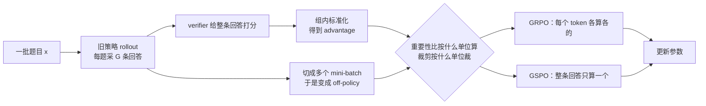
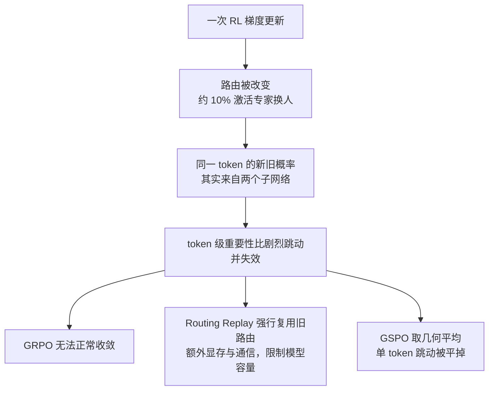

# GSPO：奖励是发给整条回答的，off-policy 修正就不该按 token 算

<!-- release-date: 2025-07-24 -->

> 本文依据 Qwen Team（阿里巴巴）发布的 **Group Sequence Policy Optimization**，即 arXiv:2507.18071v2、封面页眉日期 2025-07-29、共 7 页的版本。下文括号中的 `PDF p.x` 指这份 7 页原件的文件页码。截至 2026-09-05 核验，arXiv 上的最新版本仍是 v2。这是一篇技术论文而不是基模报告，所以没有模型架构和训练 recipe 可讲；重点是它改了强化学习目标函数的哪一行，以及为什么这一行会决定一个 MoE 模型的 RL 能不能跑完。

## 一句话先说清

GSPO 只改了一件事：**把"这个样本有多 off-policy"这个判断，从逐个 token 抬到整条回答。**

其余全部沿用 GRPO——同一道题采一组回答、组内标准化当 advantage、超出范围就裁掉。advantage 的公式一个字没动（PDF p.2 式 3 与 p.3 式 6 完全相同）。

但就是这一处改动，让原本必须靠 Routing Replay 这种系统补丁才能收敛的 MoE 强化学习，可以直接把补丁拆掉。

作者给的原则只有一句：

> **优化目标的单位，应当和奖励的单位对齐。**（PDF p.3）

奖励是打给整条回答的，那么"要不要用这个样本、用多重"也应该按整条回答判断。GRPO 按 token 判断，作者认为这在数学上本来就不成立。

## 读前需要的最少背景

这篇论文假设读者已经熟悉 PPO 和 GRPO。本文只补足够往下读的部分，**GRPO 的完整机制（为什么不要 value model、组内 advantage 怎么算、KL 放在哪里）见本站 DeepSeek-R1 篇，这里不重复。**

先约定四个记号，都来自 PDF p.1–2：

- **策略（policy）$\pi_\theta$**：就是那个正在训练的语言模型，$\theta$ 是它的参数。
- **$x$ 是题目，$y$ 是模型写出的整条回答**，$|y|$ 是这条回答的 token 数。整条回答的概率是每个 token 概率连乘：$\pi_\theta(y \mid x)=\prod_{t=1}^{|y|}\pi_\theta(y_t \mid x, y_{<t})$。
- **验证器（verifier）$r$**：给一对（题目，回答）打一个 $r(x,y)\in[0,1]$ 的分。注意它只看完整回答，中间过程不打分。
- **旧策略 $\pi_{\theta_{\text{old}}}$**：采样这批数据时用的那份参数。当前正在更新的是 $\pi_\theta$，两者已经不是同一个模型了。

再补两个术语：

- **重要性采样（importance sampling）**：想统计 A 分布下的平均值，手里却只有 B 分布采出的样本，就给每个样本乘一个比值 $\frac{A(z)}{B(z)}$ 来纠偏。
- **裁剪（clipping）**：当这个比值离 1 太远时，说明样本已经太不像当前模型会产生的东西，就把它的梯度贡献切断，防止一步走太远。

## 旧方法卡在哪：off-policy 是被硬件逼出来的

### 为什么训练必然是 off-policy

模型越大、越稀疏（MoE）、回答越长，一次 rollout 就必须采很大一批数据，否则 GPU 喂不饱。而为了提高样本利用率，标准做法是把这一大批数据切成几个 mini-batch，依次做梯度更新（论文实验里切成 4 份，PDF p.4）。

问题就在这里：第 2 个 mini-batch 更新时，模型参数已经被第 1 个 mini-batch 改过了。数据还是旧策略采的，模型已经不是旧模型。这就是 off-policy（离策略），也正是 PPO 和 GRPO 需要裁剪机制的原因（PDF p.2）。

所以 off-policy 不是设计失误，是大规模训练的必然产物。真正的问题是怎么修正它。

### 重要性采样成立的前提，GRPO 没有满足

论文把重要性采样的原理原样写出来（PDF p.2 式 4）：

$$
\mathbb{E}_{z\sim\pi_{\text{tar}}}\!\left[f(z)\right]
=
\mathbb{E}_{z\sim\pi_{\text{beh}}}\!\left[\frac{\pi_{\text{tar}}(z)}{\pi_{\text{beh}}(z)}\,f(z)\right]
$$

- $\pi_{\text{tar}}$ 是我们真正关心的目标分布（当前策略）；
- $\pi_{\text{beh}}$ 是实际采样用的行为分布（旧策略）；
- $f$ 是要求平均的那个量。

论文紧接着强调一句常被忽略的前提（PDF p.2）：这个等式要生效，**必须对来自 $\pi_{\text{beh}}$ 的很多个样本求平均**（论文写作 $N \gg 1$）。重要性权重是在一批样本上把分布掰回来的，不是逐个样本的修正系数。

现在看 GRPO 干了什么。它的重要性比是逐 token 的（PDF p.2 式 3）：

$$
w_{i,t}(\theta)=\frac{\pi_\theta(y_{i,t}\mid x, y_{i,<t})}{\pi_{\theta_{\text{old}}}(y_{i,t}\mid x, y_{i,<t})}
$$

在第 $t$ 个位置上，"分布"是 $\pi_{\theta_{\text{old}}}(\cdot \mid x, y_{i,<t})$，也就是这个前缀下的下一词概率表。而这个分布只被采了**一个**样本：实际生成的那个 $y_{i,t}$。

$N=1$。前提直接不成立。

论文的判定很硬：这个权重"没能履行它本该承担的分布修正职责，反而向训练梯度里注入了高方差噪声"（PDF p.2）。它称 GRPO 的目标是 ill-posed（病态的）。

### 噪声怎么变成不可逆的崩溃

论文给的因果链是（PDF p.1、p.2–3）：

1. 每个 token 位置贡献一份噪声；
2. 回答越长，累积的噪声越多；
3. 裁剪机制不但没消化这些噪声，反而**加剧**它——因为裁剪本身依据的就是这个不可靠的比值；
4. 最终 catastrophic model collapse（灾难性模型崩溃）。

最值得记住的是第 4 步的性质。论文写：一旦崩溃发生，**继续训练无济于事，即使回滚到之前的 checkpoint、仔细调裁剪范围、延长生成长度、或者更换 RL 的题目集合都救不回来**（PDF p.3）。

这一条是**经验观察**，论文明确写的是 "We have empirically observed"，没有给出崩溃案例的曲线或统计。但它解释了为什么作者要动目标函数而不是调超参：如果失败是超参问题，调超参应该有用。

### 用一张图看 GSPO 动了哪一步

机制示意图，根据 PDF p.2–3 正文重画，不含实测时间或数据。图里唯一分叉的那个菱形就是 GSPO 的全部改动位置：**采样、打分、advantage 计算都没变。**

## GSPO 的方法：把逐 token 的比值做成一个几何平均

### 第一步：先定义单个 token 的对数比值

论文的式 7 上下标很密，先拆成两步看。第一步，对回答 $y_i$ 的第 $t$ 个 token，算它在新旧策略下的**对数**概率比：

$$
\ell_{i,t}=\log\frac{\pi_\theta(y_{i,t}\mid x, y_{i,<t})}{\pi_{\theta_{\text{old}}}(y_{i,t}\mid x, y_{i,<t})}
$$

$\ell_{i,t}$ 大于 0 表示新模型比旧模型更愿意写出这个 token，小于 0 表示更不愿意。

### 第二步：整条回答取平均，再还原成比值

$$
s_i(\theta)=\exp\!\left(\frac{1}{|y_i|}\sum_{t=1}^{|y_i|}\ell_{i,t}\right)
$$

这就是 GSPO 的序列级重要性比。它等价于论文式 7 的另一种写法（PDF p.3）：

$$
s_i(\theta)=\left(\frac{\pi_\theta(y_i\mid x)}{\pi_{\theta_{\text{old}}}(y_i\mid x)}\right)^{\frac{1}{|y_i|}}
$$

**用一句人话概括：$s_i(\theta)$ 是这条回答里所有 token 概率比的几何平均。** GRPO 用的是其中每一个单项，GSPO 用的是它们的平均值。

序列级重要性比的含义是清楚的：它衡量"从旧策略采出来的这条回答 $y$，在当前策略眼里有多陌生"。这个量和序列级奖励是同一个单位，也因此可以当作裁剪的合理依据（PDF p.3）。

### 目标函数：只把 $w_{i,t}$ 换成 $s_i$

$$
J_{\text{GSPO}}(\theta)=
\mathbb{E}\left[\frac{1}{G}\sum_{i=1}^{G}
\min\Big(s_i(\theta)\hat A_i,\ \operatorname{clip}\big(s_i(\theta),\,1-\varepsilon,\,1+\varepsilon\big)\hat A_i\Big)\right]
$$

其中 advantage 与 GRPO 一模一样（PDF p.3 式 6）：

$$
\hat A_i=\frac{r(x,y_i)-\operatorname{mean}\big(\{r(x,y_j)\}_{j=1}^{G}\big)}{\operatorname{std}\big(\{r(x,y_j)\}_{j=1}^{G}\big)}
$$

- $G$ 是同一道题采几条回答（组大小）；
- $\hat A_i$ 高于本组平均为正，低于为负；
- $\varepsilon$ 是裁剪半径，$\min$ 与 $\operatorname{clip}$ 的组合保证更新不会朝一个方向走太远。

对比 GRPO 的目标（PDF p.2 式 2），差别只有两处：求和范围从"$G$ 条回答 × 每条 $|y_i|$ 个 token"缩到"$G$ 条回答"，比值从 $w_{i,t}$ 换成 $s_i$。

**裁剪也因此变成整条整条地裁**：一条回答被判为太 off-policy，它的所有 token 一起退出这次梯度估计（PDF p.3）。

### 为什么必须做长度归一化

式 7 里那个 $\frac{1}{|y_i|}$ 指数不是装饰。论文给了两个理由（PDF p.3）：降低方差，以及把 $s_i(\theta)$ 控制在统一的数值范围内；否则**少数几个 token 的似然变化就能让序列级重要性比剧烈波动，而且不同长度的回答会需要不同的裁剪范围。**

下面这个算例是我的解释，用来说明这句话有多严重。如果不做归一化，序列比值就是所有 token 比值的连乘。假设一条 10000 token 的回答里，每个 token 的比值都只偏离 1 一点点，比如 1.0001：

$$
1.0001^{10000}\approx 2.72
$$

也就是说，每个 token 只差万分之一，整条序列的比值就已经偏离 1 到 2.72 倍。长度翻倍再翻倍，它会指数级跑掉。而取了几何平均之后，这个数无论回答多长都稳稳待在 1.0001 附近。**长度归一化的真正作用，是让长回答和短回答落在同一把尺子上，从而可以共用一个 $\varepsilon$。**

### 为什么 GSPO 的 $\varepsilon$ 小得离谱

论文实验里，GSPO 的左右裁剪范围是 **3e-4 和 4e-4**，GRPO 基线是 **0.2 和 0.27**（PDF p.4）。差了约三个数量级。

论文只解释了一句：两者的裁剪范围"通常在数量级上不同，因为重要性比的定义不同"（PDF p.3）。

补充一层解释（这是我的推理，不是论文原话）：$s_i$ 是几千个近似 1 的数的几何平均，平均本身就会把分散度压缩得极小，所以它天然紧紧贴着 1。如果沿用 0.2 的窗口，几乎永远不会触发裁剪，裁剪机制等于关掉了。**因此 $\varepsilon$ 的数值不能跨算法搬运——它是随重要性比定义一起变的，不是一个可以照抄的经验值。**

### 梯度视角：GSPO 让一条回答里所有 token 等权

论文推了两组梯度（PDF p.3 式 8–10 与 p.4 式 11–12）。剥掉共同部分后，差别可以用一张表说清：每个 token 的 $\nabla_\theta \log \pi_\theta(y_{i,t}\mid x,y_{i,<t})$ 前面乘的系数是什么。

| | 每个 token 梯度前的系数 | 同一条回答内 |
|---|---|---|
| GRPO（式 12） | $\hat A_i \cdot w_{i,t}(\theta)$ | 每个 token 各乘各的比值，**不等权** |
| GSPO（式 10） | $\hat A_i \cdot s_i(\theta)$ | 整条共用一个系数，**完全等权** |

论文对 GRPO 那些不等权系数给了取值范围：$\hat A_i>0$ 时落在 $(0,\,1+\varepsilon]$，$\hat A_i<0$ 时落在 $[1-\varepsilon,\,+\infty)$（PDF p.4）。注意后者**没有上界**——一个负 advantage 的 token，如果新策略给它的概率骤降，比值可以无限大。

论文的判断是：这些不等权重"不可忽略，其影响会随训练推进累积，并导致不可预测的后果"（PDF p.4）。GSPO 直接消除了这个变量。

这段是全文**最扎实**的部分：它是纯代数推导，不依赖任何实验，也不依赖任何假设。GSPO 让 token 等权，GRPO 不等权，这一点是确定的。至于"不等权一定更糟"，那是另一回事，论文靠实验和观察支撑。

### GSPO-token：需要按 token 调 advantage 时的写法

多轮 RL 等场景可能想给不同 token 不同的 advantage，比如只奖励某一轮里的某一段。序列级目标做不到这件事，所以论文给了一个变体（PDF p.4 式 13–14）：

$$
s_{i,t}(\theta)=\operatorname{sg}\!\big[s_i(\theta)\big]\cdot\frac{\pi_\theta(y_{i,t}\mid x, y_{i,<t})}{\operatorname{sg}\!\big[\pi_\theta(y_{i,t}\mid x, y_{i,<t})\big]}
$$

$\operatorname{sg}[\cdot]$ 是 stop gradient，只取数值、不回传梯度，对应 PyTorch 的 `detach`。

这个式子看着绕，实际是一个常见技巧：

- **数值上**，右边那个分式的分子分母数值相同，等于 1，所以 $s_{i,t}(\theta)$ 的数值就是 $s_i(\theta)$（PDF p.4）；
- **梯度上**，分母被 detach 掉了，求导时只有分子活着，于是 $\nabla_\theta \log \pi_\theta(y_{i,t})$ 被重新暴露出来，从而可以在它前面挂一个属于该 token 的 $\hat A_{i,t}$。

论文的结论：当把一条回答里所有 token 的 advantage 设成同一个值（$\hat A_{i,t}=\hat A_i$）时，**GSPO-token 与 GSPO 在优化目标、裁剪条件和理论梯度上数值完全一致**；GSPO-token 只是多出了逐 token 调 advantage 的自由度（PDF p.4）。

论文没有给 GSPO-token 的任何实验。它是一个提供出来备用的接口，不是被验证过的方法。

## 为什么它 work：把论证和观察分开

这篇论文只有 7 页，但支撑不同结论的证据强度差别很大。分成三档看：

**一、代数推导，确定成立**

- GSPO 让一条回答内所有 token 等权，GRPO 不等权（式 10 对式 12，PDF p.3–4）。
- GSPO-token 与 GSPO 在 advantage 相同时数值等价（PDF p.4）。

**二、原理性论证，方向清楚但没有定量证明**

- 重要性采样需要多样本平均，token 级只有单样本，所以不满足前提（PDF p.2）。这个论证是站得住的，但论文**没有给出方差界、收敛性分析或任何定量刻画**，也没有说明"多大的 $N$ 才够"。所谓 "theoretically grounded"，指的是定义方式与重要性采样原理对齐，不是有一个定理。
- 序列级重要性比与序列级奖励同单位，因此更适合当裁剪依据（PDF p.3）。这是一个对齐性论证，不是可证伪的命题。

**三、经验观察，只在一个配置上看到**

- GRPO 在长回答上会不可逆崩溃（PDF p.3，作者自称 empirically observed，没有给崩溃曲线）。
- 裁掉多得多的 token 反而效率更高（PDF p.5，作者自称 counter-intuitive）。
- MoE 每次更新约 10% 激活专家会变（PDF p.6，只在一个 48 层模型上测过）。
- "MoE 模型始终保持语言建模能力，所以序列似然不会剧烈波动"（PDF p.6）。这是一句**断言**，论文没有测量序列似然的波动幅度，也没有给出与 token 似然波动的对比数据。它是 GSPO 为什么对 MoE 有效的核心解释，却恰恰是证据最薄的一环。

## 实验怎么证明

### 实验设置

全部实验只有一个配置（PDF p.4）：

| 项目 | 设置 |
|---|---|
| 模型 | 从 Qwen3-30B-A3B-Base 微调得到的一个冷启动模型 |
| 对照组 | GRPO |
| mini-batch 切分 | 每批 rollout 数据切成 4 份做梯度更新 |
| GSPO 裁剪范围 | 左 3e-4，右 4e-4 |
| GRPO 裁剪范围 | 左 0.2，右 0.27（论文称已仔细调过以保证公平比较） |
| 评测 | AIME'24（32 次采样平均 Pass@1）、LiveCodeBench（202410–202502，8 次采样平均 Pass@1）、CodeForces（Elo Rating） |

Qwen3 模型本身的结构与训练见本站 Qwen3 篇，这里只取它作为实验载体。

值得注意的一点：GRPO 基线的裁剪区间是**不对称**的（0.2 对 0.27）。论文既没有解释为什么不对称，也没有引用提出这一做法的任何工作。不对称裁剪是另一条独立的技术线，见本站 DAPO 篇；这篇论文的参考文献里没有它，所以不能替论文补上这个对比。

### Figure 1：同等算力下更高，但没有绝对数值

Figure 1 有四张子图，横轴统一是 Training Compute，**没有刻度、没有单位、没有训练步数**（PDF p.5）。纵轴有刻度：Training Reward 覆盖 0.50–0.70，AIME'24 覆盖 70–80，LiveCodeBench 覆盖 55–65，CodeForces 覆盖 1800–2000。

论文的文字结论是（PDF p.5）：

- GSPO 全程训练稳定；
- 通过增加训练算力、定期更新题目集合、延长生成长度，可以持续获得性能提升；
- 在**相同训练算力和相同消耗题目数**下，GSPO 的训练准确率和 benchmark 表现都优于 GRPO。

读图能确认的是四条曲线里 GSPO 都在 GRPO 上方，且 GSPO 的曲线更早停止（在更少算力处就达到了更高的奖励）。但**论文没有给最终数值表**，任何"GSPO 在 AIME'24 上高 X 分"的说法都是从图上量出来的，不是论文数据。

还有一个必须看清的前提：图例写的是 "GRPO (w/ Routing Replay)"。也就是说，**这个对照里的 GRPO 已经打了补丁**。GSPO 是在对方开外挂的情况下赢的，这一点比"赢了多少"更重要。

### Figure 2：裁得更多，反而更有效率

| 算法 | 训练全程被裁 token 的平均比例 |
|---|---|
| GSPO | 0.15 |
| GRPO | 0.0013 |

（PDF p.5，Figure 2）两者相差约两个数量级，而且论文说**调整裁剪范围也不会改变这个量级差**。

论文把它称作 counter-intuitive finding：GSPO 明明裁掉了多得多的 token，可用于梯度估计的样本更少，训练效率却更高。作者的解读是，这说明 GRPO 的 token 级梯度估计本身就是 noisy 的、对样本的利用是低效的；GSPO 的序列级方式提供了更可靠的学习信号（PDF p.5）。

这里必须补一句论文没有明说的东西（我的解释）：**这两个数字不是同一把尺子量出来的。** GSPO 的 0.15 来自"整条回答被判定太 off-policy，于是它的全部 token 一起出局"；GRPO 的 0.0013 来自"单个越界 token 出局"。前者天然是成块的，后者是零散的。所以这个对比不能当成"GSPO 更节省样本"的证据——论文自己也没有这样用它，它只是被当作"GRPO 的 token 级信号本来就噪"的旁证。

### Figure 3：Routing Replay 对 GRPO 是必需品

Figure 3 对比 GRPO 开不开 Routing Replay（PDF p.6）。纵轴 Training Reward 覆盖 0.25–0.55，横轴同样是无刻度的 Training Compute。

- 开：奖励从约 0.41 一路爬到约 0.56；
- 不开：先小幅上升到约 0.46，随后**持续下滑到约 0.25 附近**，曲线在中途就断了。

上面这四个数是从 Figure 3 上读出来的估计值，论文没有给数值表。但结论不依赖精度：两条曲线一条向上、一条向下，**这不是"效果差一点"，是训练走向反方向。** 论文的定性结论是：Routing Replay 在 MoE 模型的 GRPO 训练能否正常收敛中起关键作用。

## 核心资产：GSPO 为什么天生适合 MoE

这是全文最有价值的一节，也是 GSPO 从"一个更优雅的目标函数"变成"必须换掉 GRPO"的地方。

### 问题：一次梯度更新就会换掉约 10% 的专家

MoE（Mixture-of-Experts，混合专家）模型每个 token 只激活一小部分专家。论文发现了一个具体现象，称为 **expert-activation volatility（专家激活波动）**（PDF p.6）：

> 用 48 层的 Qwen3-30B-A3B-Base，**每做一次 RL 梯度更新，对同一条 rollout 样本，新策略 $\pi_\theta$ 下激活的专家中大约有 10% 与旧策略 $\pi_{\theta_{\text{old}}}$ 不同**。而且这个现象在更深的 MoE 模型中更明显。（PDF p.6）

想清楚这意味着什么：token 级重要性比 $w_{i,t}$ 要求分子分母来自"同一个模型的前后两个版本"。但如果路由变了，分子分母实际上是**两个不同的子网络**算出来的。这已经不是"模型更新了一点"，而是"换了一台机器重新称重"。

论文的结论是：这让 $w_{i,t}$ 剧烈波动并**进一步失效**（further invalidates them），从而阻碍 RL 正常收敛（PDF p.6）。

### 旧方案：Routing Replay 是在系统层打补丁

Qwen 团队之前的办法叫 **Routing Replay（路由重放）**：把旧策略 $\pi_{\theta_{\text{old}}}$ 激活过的专家缓存下来，在用 $\pi_\theta$ 计算重要性比时把这些路由模式"重放"一遍。这样每个 token 的新旧似然就共享同一个激活网络，token 级比值的稳定性被人为恢复（PDF p.6）。

它确实有效（Figure 3 就是证据），但代价是实打实的（PDF p.6）：

- 缓存并重放路由带来**额外的显存和通信开销**；
- 更严重的是，它**限制了 MoE 模型的实际容量**——模型被迫使用旧的专家组合，而不是它当前认为最合适的那组。

也就是说，为了让算法能算，模型被绑住了手脚。

### GSPO 的解法：这个问题根本不会出现

论文的关键洞察是（PDF p.6）：

> GSPO 只关注序列似然 $\pi_\theta(y_i \mid x)$，对单个 token 似然 $\pi_\theta(y_{i,t} \mid x, y_{i,<t})$ 不敏感。由于 MoE 模型始终保持其语言建模能力，序列似然不会剧烈波动。

回到几何平均那个定义就很直观：单个 token 因为换了专家而概率跳变，只是几万个对数比值里的一个；平均之后被稀释掉了。只要模型整体上还是那个模型，整条回答的似然就不会失控。

结果是 GSPO 可以常规地计算 $s_i(\theta)$、正常收敛、稳定优化，**完全不需要 Routing Replay**（PDF p.6）。补丁拆掉，显存和通信开销消失，模型容量的人为约束也随之解除。

机制示意图，根据 PDF p.6 正文与 Figure 3 重画。其中"约 10%"是论文在一个 48 层模型上的实测数字，其余节点表示因果关系，不代表时间或数值。

### 这一节最值得记住的判断

**GSPO 不是"顺便"对 MoE 更友好。它是把一个被系统补丁掩盖的算法缺陷，在算法层面消掉了。**

判断一个方案是补丁还是解药，有一个很好用的标准：补丁要求你**保持某个东西不变**（Routing Replay 要求路由不变），解药让你**不再需要那个东西不变**。前者会随着模型变深、变稀疏而越来越贵，后者不会。

## 连带好处：训练引擎和推理引擎可能不必再对齐

这一节论文写得很短，而且用词很谨慎，必须照它的口径转述（PDF p.6）。

现状是：训练引擎（如 Megatron）和推理引擎（如 SGLang、vLLM）之间存在精度差异，所以实践中通常要用**训练引擎重新算一遍**采样回答在旧策略下的似然，而不能直接用推理引擎返回的值。这是一笔纯粹为了数值一致性而付的额外算力。

论文的推论是：GSPO 只用序列级似然，"直觉上（intuitively）"比 token 级似然对精度差异宽容得多，因此 GSPO **使得直接使用推理引擎返回的似然做优化成为可能**（原文用词是 makes it possible），从而省掉重算。这在 partial rollout、多轮 RL 和训推分离框架里尤其有价值。

必须说清楚的边界：**论文没有做这个实验。** 没有精度误差的测量，没有"直接用推理引擎似然"的训练曲线，也没有省下多少算力的数字。摘要里的措辞也是 "has the potential for simplifying the design of RL infrastructure"（PDF p.1）——有潜力，不是已经做到。

它是一个合理的、值得尝试的方向，但目前是猜想。

## 边界与代价

论文本身没有写"限制"一节，所以下面这些是逐节对照原文整理出来的缺口。

**实验覆盖极窄**

- 全部实验只有一个模型（Qwen3-30B-A3B 系的冷启动模型）、一个规模、一个任务族（数学与代码）。
- **没有任何 dense 模型的实验。** GSPO 对 MoE 的好处论证得很清楚，但它在稠密模型上相对 GRPO 有多少提升，论文没有数据。
- 没有 group size $G$、batch size、学习率、rollout 长度、题目集合规模、训练步数等任何超参数。
- 没有消融：长度归一化是否必要、$\varepsilon$ 的敏感度、GSPO-token 的实际效果，都没有实验。

**图表信息不完整**

- Figure 1、2、3 的横轴 Training Compute 没有刻度和单位，没有配套数值表。所有比较只能定性读。
- Figure 2 的 0.15 和 0.0013 没有说明来自哪次运行、跨多少步平均。

**论文主张 GSPO 支撑了 Qwen3，但没有配对照实验**

论文在摘要、p.5 和结论里三次强调 GSPO 贡献了最新 Qwen3 模型的提升（PDF p.1、p.5、p.7），但**没有给出 Qwen3 用 GSPO 与不用 GSPO 的任何成绩对照**。这是一句来自作者团队的内部说明，不是这篇论文提供的证据。

**KL 正则被明确略去**

论文在 PDF p.2 明说"为简洁起见此后省略 KL 正则项，因为它不是本文重点"。所以 GSPO 与 KL 约束怎么配合、序列级裁剪之后 KL 该放在哪一层，论文一个字都没讲。这在实践中是要自己决定的。

**没有与其他 GRPO 变体比较**

参考文献里只有 PPO、GRPO（DeepSeekMath）、DeepSeek-R1、MiniMax-M1、Qwen3、QwQ-32B 和 Click（PDF p.7）。2025 年上半年出现的其他 GRPO 改法都不在对比范围内。所以"GSPO 优于 GRPO"成立，"GSPO 优于所有替代方案"没有被检验。

**一个不能忽略的实践代价**

裁剪范围要重新调，而且量级完全不同（3e-4 级别对 0.2 级别）。从 GRPO 迁到 GSPO 不是改一行代码，原有的 $\varepsilon$ 直觉全部作废。

## 它怎么支撑基模的训练

这篇论文只有一个交付物——一个目标函数。但它能落在基模训练流程的三个位置上：

**1. 让 RL 阶段可以真的 scale**

论文的第一句问题陈述就是：要靠更多算力扩大 RL，前提是训练动态必须稳定（PDF p.1）。稳定不是锦上添花，它是 scaling 的准入条件——一次不可逆崩溃就意味着整段算力作废。GSPO 声称的收益顺序是：先拿到稳定，再谈效率和分数。

**2. 解开 MoE 的一道自缚**

现代基模基本都是 MoE。只要还用 token 级重要性比，就得在"接受不收敛"和"上 Routing Replay 并牺牲模型容量"之间选一个。GSPO 把这个选择题取消了。对于走 MoE 路线的团队，这一条的价值高于分数差异。

**3. 可能松开训推之间的精度耦合**

如果 §5.4 的推论成立，训练引擎就不必为了对齐数值而重算一遍似然，训推分离的架构会更自然。但这一条目前是猜想，见上一节。

### 可以带回自己项目的原则

**优化的单位要和奖励的单位对齐。** 这是全文最普适的一条，而且远远不止于 RL。如果反馈信号是在整体层面产生的（一次任务成功、一个用户满意），却在更细的粒度上做归因和修正，那些细粒度的修正系数很可能只是噪声。先问"我的反馈是发给谁的"，再决定"我的修正加在谁身上"。

**重要性采样的比值只有在批量平均里才是修正，逐个样本上它是噪声。** 这个陷阱在离线评估、反事实估计、推荐系统的 off-policy 学习里同样存在。看到"每个样本乘一个概率比"的写法时，先确认那个位置上到底有几个样本。

**跨算法不要搬运超参数的经验值。** $\varepsilon$ 从 0.2 掉到 3e-4，不是因为 GSPO 更保守，而是因为被裁剪的量已经换了一个。任何超参数都绑在它作用的那个量的定义上。

**先分清补丁和解药。** Routing Replay 通过"要求路由保持不变"来救 GRPO，它的成本会随模型变深、变稀疏而增长。当你发现自己在为某个算法维护一套"请保持不变"的机制时，值得回头看看是不是算法本身用错了粒度。

**更粗的统计量对数值噪声更宽容，这可以换来工程上的松绑。** 序列似然比 token 似然稳，于是精度对齐的要求可能降低。在任何"为了让两端数值一致而付出大量工程"的地方，都可以问一句：我真正需要一致的，是不是一个更粗的量？

## 关键词回看

- **重要性采样（importance sampling）**：用概率比给旧分布采的样本加权，估计新分布下的期望。前提是对多个样本求平均。
- **off-policy**：数据由旧策略采样、模型已经更新过。把大 batch 切成多个 mini-batch 更新就必然产生它。
- **token 级重要性比 $w_{i,t}$**：GRPO 使用的量，单个 token 在新旧策略下的概率之比。每个位置只有一个样本，所以不满足重要性采样前提。
- **序列级重要性比 $s_i$**：GSPO 使用的量，整条回答所有 token 概率比的**几何平均**。等价写法是序列概率比开 $|y_i|$ 次方。
- **长度归一化**：$s_i$ 定义里的 $\frac{1}{|y_i|}$ 指数。它让不同长度的回答落在同一数值尺度上，从而共用一个裁剪范围。
- **序列级裁剪**：一条回答太 off-policy 时，它的全部 token 一起退出梯度估计，而不是只丢弃越界的那几个。
- **GSPO-token**：用 stop gradient 技巧写出的 token 级变体，数值上与 GSPO 完全相同，只是允许每个 token 有自己的 advantage。
- **expert-activation volatility（专家激活波动）**：MoE 模型一次梯度更新后，同一条样本激活的专家发生变化的现象。论文实测约 10%。
- **Routing Replay（路由重放）**：缓存旧策略的专家选择并在新策略上重放，人为稳住 token 级比值。有效，但增加开销并限制模型容量。

## 最后的判断

GSPO 的技术含量不在公式复杂度上——它的核心改动可以用一句话说完：把逐 token 的概率比换成它们的几何平均，裁剪也整条整条地裁。

它真正的贡献是一次**归因的修正**：MoE 的 RL 训练不稳定，长期被当作一个需要工程手段压制的现象（Routing Replay 就是这样的手段）；这篇论文指出它其实是目标函数用错了粒度，而修正粒度之后，工程手段就不需要了。

论文本身有明显的证据缺口：只有一个模型、一个规模，没有 dense 对照，图表没有数值，"支撑了 Qwen3"这句主张没有配对照实验，简化 infra 那一节完全是推论。所以谨慎的读法是：

- **确定的**：GSPO 让一条回答内所有 token 等权，这是代数事实；重要性采样的单样本用法不满足其前提，这是原理事实。
- **有实验支持但覆盖窄的**：在一个 MoE 冷启动模型上，同等算力下 GSPO 优于打了 Routing Replay 补丁的 GRPO；Routing Replay 对 GRPO 是必需的。
- **只是观察或推论的**：不可逆崩溃的普遍性、裁剪比例对比的含义、序列似然为何稳定、以及推理引擎似然能否直接使用。

如果只记一句话：

> **反馈在哪个粒度上产生，修正就应该在哪个粒度上施加。粒度错了，再精细的修正也只是更精细的噪声。**

## 资料与阅读边界

- 原始依据：本地 `papers/Alibaba/GSPO.pdf`，arXiv:2507.18071v2，封面页眉日期 2025-07-29，共 7 页。
- 版本核验：[arXiv 论文页](https://arxiv.org/abs/2507.18071)。v1 提交于 2025-07-24，v2 修订于 2025-07-28。截至 2026-09-05 核验，最新版本仍为 v2，与本地 PDF 一致，无需替换原件。
- `release-date` 依据：GSPO 是一个算法，不存在"对外开放使用"的对象，因此取该技术**首次官方公开披露日**。已知的两个官方渠道是 arXiv v1（2025-07-24）与 [Qwen 官方博客](https://qwenlm.github.io/blog/gspo/)（2025-07-27），取其中更早的 arXiv v1。本地 `papers/Alibaba/Qwen3.pdf` 全文没有出现 GSPO，可佐证 Qwen3 技术报告不构成更早的披露。
- 官方解读补充：[GSPO: Towards Scalable Reinforcement Learning for Language Models](https://qwenlm.github.io/blog/gspo/)。内容与论文一致，本文数字仍以 PDF 为准。
- GRPO 的原始来源：[DeepSeekMath](https://arxiv.org/abs/2402.03300)。本文只按 GSPO 论文 p.2 的写法转述 GRPO，完整机制见本站 DeepSeek-R1 篇。
- PPO 的原始来源：[Proximal Policy Optimization Algorithms](https://arxiv.org/abs/1707.06347)。
- 序列似然定义的来源：论文式 7 引用了 [Click: Controllable Text Generation with Sequence Likelihood Contrastive Learning](https://aclanthology.org/2023.findings-acl.65/)，作者与 GSPO 第一作者相同。
- Qwen3 技术报告：[arXiv:2505.09388](https://arxiv.org/abs/2505.09388)。模型本身见本站 Qwen3 篇；GSPO 论文只把 Qwen3-30B-A3B-Base 当作实验载体。
