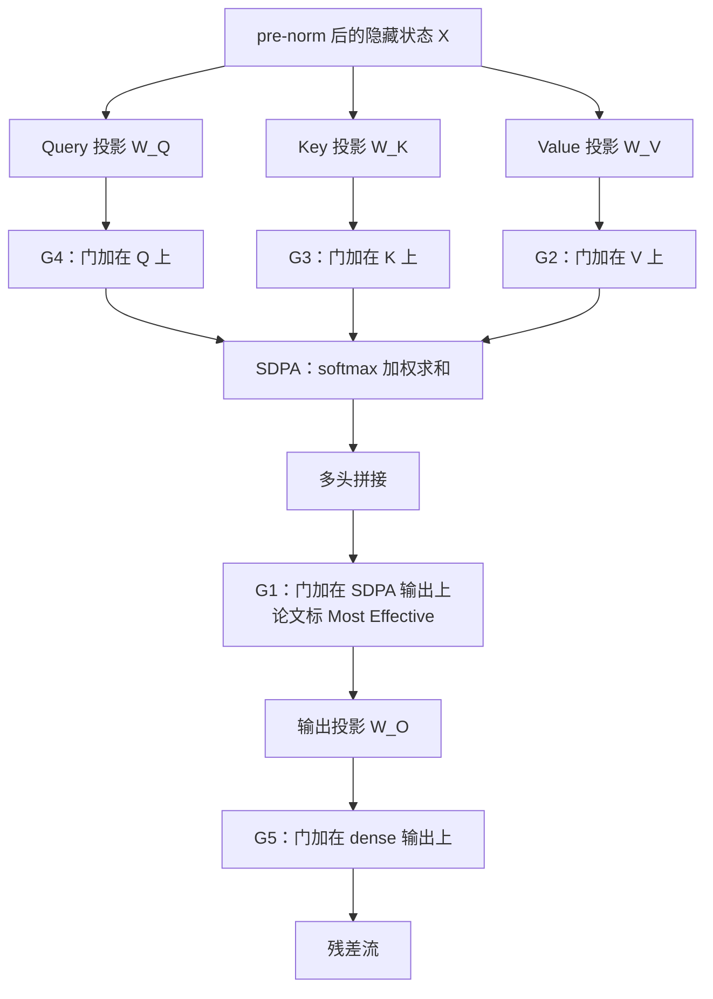
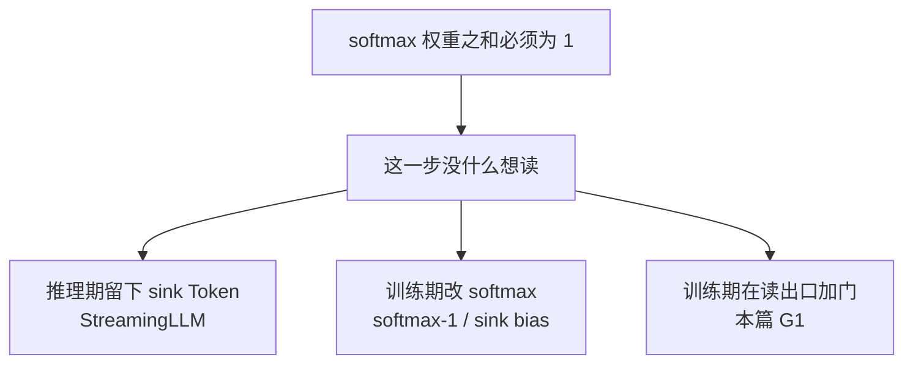
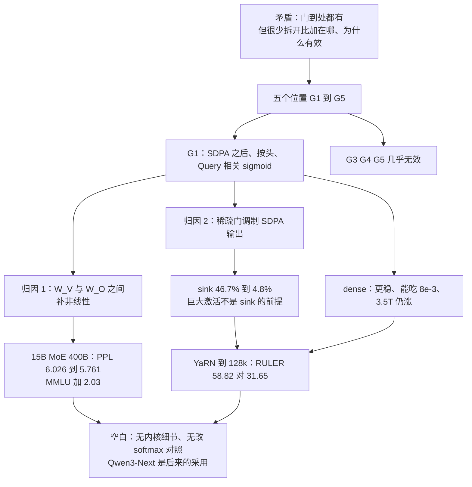

# Gated Attention：门到处都有，真正该问的是加在哪、为什么有效

<!-- release-date: 2025-05-09 -->

> 本文依据 Qwen Team / Alibaba Group 等发布的 **Gated Attention for Large Language Models: Non-linearity, Sparsity, and Attention-Sink-Free**，即 arXiv:2505.06708v1、2025-05-10 17:15:49 UTC 提交的预印本，共 17 页（正文与参考文献至 p.12，附录 p.13–17）。封面右上角另有一行 **2025-06-11**，写进文末资料边界，不回写 `release-date`。动笔前已核 arXiv 官方页：该论文**只有 v1**，本地 PDF 即最新版，不换文件。页码均指这份 17 页 PDF 本身。全文把三件事分开写：**报告明确写了什么**（带页码）、**我们如何理解它**（凡属推算、换算或图上读数都会写明）、**外部资料补充**（会给出链接并标注）。
>
> 这是一篇注意力机制的技术论文，不是 Qwen3-Next 的基模报告。Qwen3-Next 后来采用了这里的输出门控，那是**外部补充**，不在本篇实验里。

## 阅读前先搭一张最小地图

这篇论文只改注意力里很小的一块，但会反复碰到下面这些词。先翻成人话。

- **Token（词元）**：模型读写文本时的基本小块。
- **Query / Key / Value（查询 / 键 / 值）**：注意力的三个角色。当前 Token 用 Query 提问，历史位置用 Key 当标签、Value 当内容。
- **SDPA（Scaled Dot-Product Attention，缩放点积注意力）**：先算 Query 与 Key 的点积，除以 $\sqrt{d_k}$，再 softmax，最后按权重把 Value 加权求和。论文里的「注意力输出」指的就是这一步的结果。
- **Softmax**：把一组实数变成一组**加起来必须等于 1** 的正权重。头因此没有「这一票弃权」的选项。
- **GQA（Grouped-Query Attention，分组查询注意力）**：多个 Query 头共用一套 Key / Value，用来减少缓存。本篇 MoE 实验是 32 个 Query 头、4 个 KV 头（PDF p.4）。
- **Attention sink（注意力汇聚点）**：大量注意力质量砸在序列开头那一两个 Token 上，哪怕它们几乎没有语义。
- **Massive activation（巨大激活）**：隐藏状态里少数通道的数值大到异常，常和 sink 一起被讨论，但本篇实验证明它们**可以拆开**。

论文自己反复使用的五个位置编号，必须按原文记，不要改名：

- **$G_1$**：加在 SDPA 输出之后、输出投影 $W_O$ 之前。这是全文的中心答案。
- **$G_2$**：加在 Value 投影之后。
- **$G_3$ / $G_4$**：分别加在 Key、Query 投影之后。
- **$G_5$**：加在最终的 dense 输出层 $W_O$ 之后。

默认配置是：**按头（head-specific）、相乘（multiplicative）、sigmoid**。门的输入 $X$ 取的是 **pre-norm 之后的隐藏状态**，也就是当前 Query 这一侧，不是历史上的 Key / Value（PDF p.3 脚注 1）。

## 一句话先说清

门控并不是新发明。LSTM、Highway Network、SwiGLU、Mamba、线性注意力，一直到 softmax 注意力本身，都在用门。本篇真正反对的，是一种很常见的写法：

> 门加进去了，分数涨了，于是把门和别的改动绑在一起讲。至于**门加在哪、为什么有效**，很少有人单独拆开比。

作者拿 Switch Heads 和 Native Sparse Attention 当例子：前者用 sigmoid 门做 top-$K$ 选头，后者用门把压缩 / 选择 / 滑窗三路合起来，但两边都没有把「门自己的贡献」从路由或稀疏结构里剥出来（PDF p.1）。附录里他们把 Switch Head 减到只剩一个专家——门不再路由，只调制 Value——收益还在（PDF p.13，Table 6）。

于是这篇论文做了一件看起来很笨、规模却不小的事：在标准 softmax 注意力上，把门挪到五个位置、换成多种粒度与激活，训了 **30 个变体**。骨干是 **15B 总参、2.54B 激活的 MoE** 和 **1.7B dense**，数据最多到 **3.5T Token**（PDF p.1、4）。

中心发现只有一句（PDF p.1）：

> **在 SDPA 之后加一个按头、Query 相关的 sigmoid 门，稳定地、跨设定地更好。**

它同时带来四件看起来不像「一个乘法」能换来的东西：训练更稳、能吃更大学习率、scaling 更好、attention sink 基本消失，长上下文外推也明显更好。

作者把有效性归到两件事上，后面每一节都会回到这两条（PDF p.1–2）：

1. 给 softmax 注意力里 $W_V$ 与 $W_O$ 拼成的**低秩映射**补上非线性；
2. 用 **Query 相关的稀疏门**去调制 SDPA 输出，相当于读完之后还可以弃权。

## 先看全景：一次注意力里，门可以加在五个位置

这张图根据 Figure 1 左图与 §2.2 重画（PDF p.2–3），是**机制示意**，不含实测时间。$G_4$、$G_3$、$G_2$ 是「进 SDPA 之前改 Q / K / V」；$G_1$ 是「SDPA 已经读完，再决定要不要把读到的东西送进 $W_O$」；$G_5$ 是「$W_O$ 都乘完了再乘一次门」。

门本身的公式只有一行（PDF p.3，式 5）：

$$
Y' = g(Y, X, W_\theta, \sigma) = Y \odot \sigma(X W_\theta)
$$

- $Y$：被调制的那份张量，在 $G_1$ 上就是 SDPA 输出；
- $X$：用来算门分数的输入，默认是当前 Token 的 pre-norm 隐藏状态；
- $W_\theta$：新加的门投影；
- $\sigma$：默认 sigmoid，把分数压到 $(0,1)$；
- $\odot$：逐元素相乘。

人话：检索员必须交材料（softmax 还是要把权重分完），但主编可以整份扣下、不进终稿。扣下的权利来自当前这个问题（Query），不是来自历史上那一堆文档自己觉得重不重要。

Figure 1 中间那组柱子已经把位置消融的结论画在一页上（PDF p.2）。**本文读图**（打开原图核对，不是只看图注）：

- 上排是 15B MoE 的测试 PPL。$G_1$ 相对基线降 **0.265**，$G_2$ 降 **0.206**，$G_3$ 只降 **0.045**，$G_4$、$G_5$ 几乎贴着基线。
- 下排是 MMLU。$G_1$ 涨 **+2.03**，$G_2$ 只有 **+0.38**，$G_5$ 有一个 **+0.62** 的小柱，但配上几乎没动的 PPL，不像真正赢了。

右图是 1.7B dense、相同超参、3.5T Token 的训练损失（平滑系数 0.9）。横轴到约 $3.5\times 10^5$ step。基线曲线上插着许多竖线一样的尖峰；带 $G_1$ 的曲线更低，尖峰少得多。图注把这件事写成：门让最终损失更低，并「substantially」减轻 loss spike，从而有机会用更大学习率、更好地 scaling（PDF p.2）。

## 第一层问题：softmax 注意力其实缺两样东西

标准多头注意力分四步（PDF p.2–3，式 1–4）：QKV 投影、SDPA、多头拼接、再乘 $W_O$。论文认为，这个结构里有两处长期被忽略的缺口。它们不是同一件事，但 $G_1$ 刚好同时补上。

### 缺口一：$W_V$ 和 $W_O$ 其实是一次低秩线性映射

把第 $k$ 个头、第 $i$ 个 Token 的输出写开（PDF p.6，式 6）：

$$
o_i^k = \Big(\sum_{j=0}^{i} S_{ij}^k \cdot X_j W_V^k\Big) W_O^k = \sum_{j=0}^{i} S_{ij}^k \cdot X_j \big(W_V^k W_O^k\big)
$$

$S_{ij}^k$ 是注意力分数。括号一合并，$W_V^k W_O^k$ 就是作用在所有 $X_j$ 上的**一层**线性变换。头维度 $d_k$ 小于模型宽度 $d_{\mathrm{model}}$，所以这是低秩的。本篇还用了 GQA：同一组里的头共享 $W_V$，表达力再被削一刀（PDF p.6）。

两个线性层中间没有非线性，表达力就卡在低秩上。这不是新定理，论文引的是 Montufar et al., 2014 关于深度网络线性区域的经典结果（PDF p.6）。它真正要说的是：如果你想补这层非线性，门必须插进 $W_V$ 和 $W_O$ **之间**。$G_1$、$G_2$ 都在这个区间里；$G_5$ 在 $W_O$ 之后，补不上。

### 缺口二：softmax 强迫每个头「必须读点什么」

softmax 保证一行权重之和为 1，而且非负（PDF p.2）。当前 Query 跟这个头的专长无关时，它仍然得把那 1 分出去。因果掩码又给了第一个 Key 特权：它是唯一被所有 Query 都能看见的位置。于是「空操作」常常塌缩到位置 0，这就是 attention sink（PDF p.2，引 Xiao et al., 2023）。

先前工作把 sink 解释成：softmax 非负归一化会把多余的注意力质量堆到开头（PDF p.2）。本篇同意这个观察，但不走「改 softmax」那条路。它给的出口在 softmax **外面**：SDPA 照常把 1 分完，门再决定读回来的向量进不进残差流。

这两条缺口合在一起，就是 $G_1$ 为什么看起来只是一个乘法、效果却不像一个乘法。

## 核心设计：SDPA 之后、按头、Query 相关的 sigmoid 门

把因果链一次走完。

- **旧问题**：softmax 注意力的 Value→输出是低秩线性；$W_O$ 之前没有非线性。同时，头没有弃权权，空操作变成 sink。
- **新设计**：在 SDPA 输出上乘 $\sigma(X W_\theta)$。$X$ 是当前 Token 的隐藏状态，所以门跟着 Query 变；默认每个头各算各的分数。
- **工作机制**：门分数接近 0 时，这个头这一步的输出被抹掉，残差流几乎不被改写——等价于「读了但不用」。分数本身还是输入相关的，所以不是把整个头关掉，而是按 Token、按头动态关。
- **收益**：15B MoE 上 PPL 降 0.2 以上、MMLU 大约 +2；dense 上 loss spike 明显减少，能把最大学习率从会发散的 $8\times 10^{-3}$ 用起来；sink 从 46.7% 降到 4.8%；YaRN 外推到 128k 时 RULER 拉开二十多分（PDF p.2–5、8）。
- **代价与边界**：多一组门投影和一次逐元素乘。论文说新增参数和 FLOPs 都很小，墙钟延迟不到 2%（PDF p.4）。真正的代价是**必须预训练时就装上**——它改的是模型函数，不能给已经用标准 softmax 训好的权重事后插一个门再指望同样的行为。Dense 实验里，加门的同时还把 FFN 变窄，以保持总参数不变（PDF p.5）；所以那些对照比的是「同样参数预算下换结构」，不是「白捡一组参数」。

除非另说，论文用的都是 head-specific、相乘、sigmoid（PDF p.3）：

$$
\sigma(x)=\frac{1}{1+e^{-x}}
$$

加法门只用 SiLU，因为 SiLU 无上界，sigmoid 的输出落在 $[0,1]$（PDF p.3）。

**可迁移的启发**：当你怀疑某个模块「算完了却不该写进主干」时，先问它有没有第二次否决权。softmax、路由、top-$k$ 都是「必须选出点什么」的归一化。门控是在它们**之后**再乘一次 0 到 1，不必改前面的归一化公式。

## 实验骨架：比的是什么、没比什么

### 两种骨干

| 项目 | 15A2B MoE | 1.7B dense |
|---|---|---|
| 总参数 / 激活 | 15B / 2.54B | 1.7B 全激活 |
| 专家 | 128 个，top-8 softmax 门，细粒度专家 | 无 |
| 注意力 | GQA，$q=32$，$k=4$，$d_k=128$ | 同系列设定，跟随 Qwen2.5 |
| 序列长度 | 4096 | 4096 |
| 主要数据量 | 消融用 400B；分析与长上下文用训到 3.5T 的模型 | 400B / 1T / 3.5T 三档 |
| 出处 | PDF p.4 | PDF p.4–5 |

MoE 还用了 global-batch 负载均衡损失和 z-loss（PDF p.4）。优化器是 AdamW 默认超参。评测是 few-shot：Hellaswag、MMLU、GSM8k、HumanEval、C-eval、CMMLU，外加一块覆盖英 / 中 / 代码 / 数学 / 法律 / 文学的 held-out PPL（PDF p.4）。

摘要写「30 个变体」（PDF p.1）。正文没有给出这 30 个的清单。Table 1 是 15 行（1 个基线 + 14 个变体），Table 2–4 和附录 Table 6 还有更多行，其中不少与 Table 1 重复。**本文按作者自称的 30 来引用，不替它清点。**

主消融的 MoE 配方是：最大学习率 $2\times 10^{-3}$，1k step warmup，余弦衰减到 $3\times 10^{-5}$，全局 batch 1024，共 100k 优化步，大约 400B Token（PDF p.4）。

### 位置消融必须按论文编号读

Table 1 是全文最重要的一张表（PDF p.4）。先看位置这一组。所有方法 $d_k=128$。基线 $q=32$、$k=4$。

| 编号 | 方法 | 位置 | 额外参数 | Avg PPL | MMLU | GSM8k |
|---|---|---|---:|---:|---:|---:|
| (1) | Baseline | — | 0 | 6.026 | 58.79 | 52.92 |
| (2) | $k=8$ | 加 KV 头 | 50M | 5.979 | 59.78 | 52.16 |
| (3) | $q=48$ | 加 Query 头 | 201M | 5.953 | 58.45 | 53.30 |
| (4) | 加 4 个专家 | 加专家 | 400M | 5.964 | 58.84 | 52.54 |
| (5) | SDPA Elementwise | **$G_1$** | 201M | **5.761** | **60.82** | **55.27** |
| (6) | v Elementwise | **$G_2$** | 25M | 5.820 | 59.17 | 53.97 |
| (7) | k Elementwise | **$G_3$** | 25M | 6.016 | 59.18 | 50.49 |
| (8) | q Elementwise | **$G_4$** | 201M | 5.981 | 58.74 | 53.97 |
| (9) | Dense Output | **$G_5$** | 100M | 6.017 | 59.41 | 50.87 |

读这张表时有三条不该滑过去。

**第一，$G_1$ 和 $G_2$ 是仅有的两个真正有效的位置。** $G_3$、$G_4$、$G_5$ 的 PPL 几乎贴着基线；$G_4$ 加了和 $G_1$ 一样多的 201M 参数，MMLU 反而从 58.79 掉到 58.74。所以「加一组门投影」本身不是原因。论文后来说得更硬：$G_5$ 无效，是因为它不处理 $W_V$ 与 $W_O$ 之间缺非线性这件事（PDF p.6）。

**第二，加参数的基线故意给得更慷慨。** 加 KV 头、加 Query 头、加 4 个专家，引入的参数不少于门、有的更多（最多 400M），PPL 最多降到 5.953，仍然明显差于 $G_1$ 的 5.761。C-eval 上「加 4 个专家」拿到全表最高的 63.19，但平均 PPL 和 MMLU 都不占优（PDF p.4）。**本文的读法**：这张表想挡住的质疑是「你只是多了参数」；它挡得住平均语言建模，挡不住「某个单点指标偶然更高」。

**第三，headwise 已经够用。** 同一张表的粒度组（PDF p.4）：

| 编号 | 方法 | 分数形状 | 额外参数 | Avg PPL | MMLU |
|---|---|---|---:|---:|---:|
| (10) | SDPA Headwise $G_1$ | $n\times q$ | **1.6M** | 5.792 | 60.05 |
| (11) | v Headwise $G_2$ | $n\times q$ | **0.2M** | 5.808 | 59.32 |
| (12) | SDPA Head-Shared $G_1$ | $n\times d_k$ | 201M | 5.801 | 60.06 |
| (13) | v Head-Shared $G_2$ | $n\times d_k$ | 25M | 5.867 | 59.02 |

Headwise $G_1$ 只多 1.6M 参数，PPL 5.792，已经非常接近 elementwise 的 5.761。把各头的门分数强制共享之后，同样 201M 参数，收益反而变小。论文的原话是：只要不同头拿到不同的门分数，粒度和激活函数的影响都相对次要（PDF p.5）。

其余两行也值得记：加法 $G_1$（SiLU）PPL 5.821，Hellaswag 反而是全表最高的 74.81，但 MMLU / GSM8k 不如相乘；$G_1$ 把 sigmoid 换成 SiLU，PPL 5.822，整体不如 sigmoid（PDF p.4）。相乘、sigmoid，是这张表上的默认赢家。

## 归因一：给低秩映射补非线性

Table 3 把「只加非线性、不一定是门」的对照放在同一组 MoE、同一份 400B 设定上（PDF p.6）：

| 编号 | 方法 | 激活 | Avg PPL | MMLU |
|---|---|---|---:|---:|
| (1) | Baseline | — | 6.026 | 58.79 |
| (2) | SDPA Elementwise Gate | Sigmoid | 5.761 | 60.82 |
| (3) | v Elementwise Gate | Sigmoid | 5.820 | 59.17 |
| (4) | SDPA Additive Gate | SiLU | 5.821 | 60.06 |
| (5) | SDPA GroupNorm | RMSNorm | 5.847 | 60.15 |
| (6) | SDPA SiLU | SiLU | 5.975 | 59.55 |
| (7) | SDPA Additive Gate | Identity | 5.882 | 59.20 |

对应到式 7 和式 8（PDF p.6）：

$$
o_i^k = \Big(\sum_{j=0}^{i} S_{ij}^k \cdot \mathrm{NonLinear}(X_j W_V^k)\Big) W_O^k
$$

$$
o_i^k = \mathrm{NonLinear}\Big(\sum_{j=0}^{i} S_{ij}^k \cdot X_j W_V^k\Big) W_O^k
$$

$G_2$ 是第一种：非线性作用在每个 Value 上，再加权。$G_1$ 是第二种：先加权，再对 SDPA 输出做非线性。GroupNorm（每个头的 SDPA 输出上独立 RMSNorm）几乎不加参数，PPL 也能降到 5.847——这是「非线性本身有用」最干净的一条证据，因为它不是门。只在 $G_1$ 上套一个无参数 SiLU，PPL 降到 5.975，多数下游几乎不动。把加法门的 SiLU 拿掉、变成恒等映射，收益再缩一截（PDF p.6）。

所以非线性这条归因是被对照撑住的：**插在 $W_V$ 与 $W_O$ 之间的非线性都会涨，门只是其中最强的一种。** 但它解释不了 $G_1$ 为什么明显强于 $G_2$——两者都能补非线性。这就是第二条归因要接的地方。

## 归因二：Query 相关的稀疏门，去调 SDPA 输出

Table 4 给每个变体记了三件中间量（PDF p.7）：平均门分数、各层最大隐藏激活的均值（M-Act）、第一个 Token 分到的注意力（F-Attn）。后两列越高，sink 和巨大激活越严重。

| 编号 | 方法 | 门分数 | M-Act | F-Attn | PPL |
|---|---|---:|---:|---:|---:|
| (1) | Baseline | — | 1053 | 0.467 | 6.026 |
| (2) | SDPA Elementwise $G_1$ | **0.116** | **94** | **0.048** | 5.761 |
| (3) | SDPA Headwise $G_1$ | 0.172 | 98 | 0.073 | 5.792 |
| (4) | SDPA Head-Shared $G_1$ | 0.271 | 286 | 0.301 | 5.801 |
| (5) | v Elementwise $G_2$ | 0.221 | 125 | 0.297 | 5.820 |
| (6) | SDPA 输入无关门 | 0.335 | 471 | 0.364 | 5.917 |
| (7) | SDPA Elementwise + NS-sigmoid | 0.653 | 892 | 0.451 | 5.900 |

Figure 3 把 (2)(5)(4) 的门分数画成直方图（PDF p.7）。**本文读图**：三条都在 0 附近有峰，但 $G_1$ elementwise 的峰最尖、质量最贴着 0，均值 0.116；Value 门均值 0.221；头共享之后峰被拉开，均值 0.271。图注写「大多数门分数小于 0.5」，并把最强稀疏判给 SDPA 输出门。

四条观察是论文自己的（PDF p.7）：

**(i) 有效的门分数是稀疏的。** SDPA 输出门（elementwise / headwise）均值最低，分布最贴 0，成绩也最好。

**(ii) 必须按头稀疏。** 强制头共享会把门分数抬起来，收益变小。论文把它连到「不同头看输入的不同方面」那一组经典观察（Voita et al., 2019 等）。

**(iii) 必须跟 Query 走。** $G_1$ 的非线性作用在当前 Token $X_i$ 上（式 8）；$G_2$ 作用在历史上每个 $X_j$ 上（式 7）。前者是「这个问题要不要用刚读到的东西」，后者是「这段历史自己重不重要」。为了把「输入相关」再拆一刀，他们加了一组**输入无关**的门：零初始化一组 $q\times d_k$ 参数，过 sigmoid，再乘到 SDPA 输出上。PPL 5.917，好于基线——非线性还在——但门分数高达 0.335，F-Attn 仍有 0.364。

**(iv) 故意弄得不稀疏就变差。** NS-sigmoid 的定义是（PDF p.7）：

$$
\mathrm{NS\text{-}sigmoid}(x)=0.5+0.5\cdot\mathrm{sigmoid}(x)
$$

分数被卡在 $[0.5,1.0]$，非线性还在，稀疏没了。PPL 5.900，F-Attn 0.451，几乎回到基线的 0.467。

有一处表内口径需要标出来。Table 4 第 5 行 $G_2$ 的 GSM8k 是 **51.33**，Table 1 第 6 行同一方法是 **53.97**（PDF p.4、7）。PPL / Hellaswag / MMLU 三列一致，只有 GSM8k 对不上。Table 4 还写「见 Tab. 1 的 Gate Score 列」，但 Table 1 **没有**这一列。**本文按各表自己印出来的数字引用，不替它合并。**

附录 A.2 把稀疏从「门分数小」推进到「SDPA 隐藏状态真的变稀疏」（PDF p.13–14，Figure 4–5）。**本文读图**：

- 门前 SDPA 输出的绝对均值平均 **0.71**，末几层飙到 4 以上；门后平均 **0.05**，几乎贴着无门基线的 **0.04**。
- 阈值 $10^{-2}$ 下，门前稀疏率平均 0.03，门后 0.44；如果只用**平均**门分数去乘门前状态，稀疏率只到 0.33。阈值 $10^{-3}$ 上也是同一方向：0.003 → 0.126，平均门只能到 0.080。

论文因此说：稀疏不只是「乘了一个小于 1 的系数」，门分数本身的分布还额外推高了稀疏。它还写了一句很值得停的话：门后的隐藏状态均值贴近基线，**门可能在做和 attention sink 类似的事——把无关信息滤掉**（PDF p.13）。这句话是作者观察，不是被单独消融钉死的因果。

## 消 attention sink：输出门控是第三条路，不是改 softmax

### 现象有多强

Figure 2 左图画的是「每一层有多少注意力分给第一个 Token」（PDF p.3）。基线跨层平均 **46.7%**，从大约第 6 层起就跳到 0.6 以上，后半段可以到 0.8；加上 $G_1$ 之后平均 **4.8%**，整条曲线贴着底。右图是平均注意力图：基线第 21 层第一个 Token 拿走 **83%**，门控后是 **4%**；到最后一层，门控模型更明显地去看序列里的单个 Token，而不是继续盯着开头。图注把最后一层写成：门「放大了模型已经有的、去看序列内部个别 Token 的倾向」。

Table 4 的 F-Attn 列和这张图一致：只有 headwise / elementwise 的 $G_1$ 把首 Token 注意力打到 0.05 附近。$G_2$ 能把 M-Act 从 1053 降到 125，F-Attn 却仍有 0.297。头共享、$G_2$、输入无关门、NS-sigmoid，全都降不大 sink（PDF p.7–8）。

于是论文给出一句很硬的拆题（PDF p.8、9）：

> **巨大激活不是 attention sink 的必要条件。** 只在 Value 上加门，巨大激活消失，sink 还在。

这和华为那篇把「首 Token 主导」与「离群激活」拆开的实验是同一类判断，但下刀位置不同。对照见下一小节，标成外部补充。

附录 Figure 6 把层间曲线摊开（PDF p.16）。**本文读图**：

- 基线：大约第 6 层 FFN 输出 / 残差跳到 1400–1600，之后一直顶在天花板上；首 Token 注意力在同一层附近从接近 0 跳到 0.6 以上。
- $G_1$：激活随层缓慢爬到约 350，没有那一跳；首 Token 注意力全程贴着 0.05。
- $G_2$：激活形态接近 $G_1$，首 Token 注意力均值 0.297，中层仍有明显鼓包。
- 头共享：激活回到约 500 的高台，sink 均值 0.301。
- NS-sigmoid：激活再次顶到 1600，sink 均值 **0.481**，略高于基线 0.467。

正文写巨大激活「主要来自早期层（例如第 5 层）的 FFN」（PDF p.8）；附录写「第 6 层 FFN」（PDF p.14）。**本文按图上跳变位置把它记成「大约第 6 层」**，并标出正文 / 附录差了一层。论文把后续层继续巨大，归因于 pre-norm 残差会把这个大数一直往后传（PDF p.8）。

### 三条路，同一个根因，不要读成一篇发明

Softmax 权重之和必须为 1，头在「这一步谁都不想看」时必须找地方倒掉那 1 分。开头 Token 对所有位置可见、样本间稳定、语义又最空，于是被学成垃圾桶。针对这件事，公开文献里至少有三条路。**本篇只走第三条。**

**路一：推理期承认 sink、把它留下来。** StreamingLLM 的做法是滑动窗口之外永久保留开头几个 Token 的 KV，模型自己长出来的垃圾桶一直在，流式生成才不崩。这是部署补丁，不改训练好的权重。本篇引用了 Xiao et al., 2023 作为 sink 现象的来源（PDF p.2、9），**没有复现 StreamingLLM**。

**路二：训练期改 softmax，让真实 Token 的权重之和可以小于 1。** 分母加常数 1（Miller, 2023 的 softmax-1；本仓库 [From-Attention-to-Activation](/reports/Huawei/From-Attention-to-Activation) 用对照实验证明它打掉的是 sink、不是离群激活），或者给每个头学一个 sink bias 塞进 softmax 分母。本篇相关工作把 Miller、Bondarenko 的 gate / clip、以及「改 softmax 计算 / 分母」都列为已有尝试（PDF p.9），自己不走这条路。

**路三：本篇。** Softmax 公式一个符号不改。SDPA 仍然把 1 分完，门在读出之后决定进不进 $W_O$。注意力图上的 sink 消失，是因为头有了正当的弃权渠道，不再需要自己造垃圾桶。

和华为那篇的分工可以写成一句：

> **华为篇改 softmax，让头可以谁也不看；本篇不改 softmax，让头看完之后可以谁也不用。两者都是训练期消 sink，都不是 StreamingLLM 那种推理期留 sink Token。**

不要把三篇读成同一个发明。Bondarenko et al., 2023 的 Quantizable Transformers 是本篇自己点名「最接近」的工作：他们也在 softmax 注意力上加门，用来去掉 BERT / ViT 的极端注意力和离群激活，目标是量化（PDF p.9）。本篇的差别是：在 15B / 1.7B、最多 3.5T 的 decoder-only 上系统比较位置与变体，并把收益归到非线性 + Query 相关稀疏，而不是只服务于量化。

相关工作里还写了一句：稀疏门控在 **1B dense** 和 **15B MoE**、3.5T Token 之后仍然消掉 sink（PDF p.9）。主实验表格用的是 1.7B dense。Hugging Face 上放出的权重目录名叫 `1B_baseline` / `1B_gate_*`。**本文不把 1B 和 1.7B 当成同一个 checkpoint。**

## 训练更稳、能吃更大学习率、scaling 更好

Dense 实验在 Table 2（PDF p.5）。加门时缩短 FFN，保持总参数不变。

| 设定 | 方法 | 最大学习率 | Avg PPL | HumanEval | MMLU | GSM8k |
|---|---|---:|---:|---:|---:|---:|
| 28 层 / 400B / bsz=1024 | Baseline | $4.0\times 10^{-3}$ | 7.499 | 28.66 | 50.21 | 27.82 |
| 同上 | $G_1$ Elementwise | $4.0\times 10^{-3}$ | 7.404 | 29.27 | 51.15 | 28.28 |
| 28 层 / **3.5T** / bsz=2048 | Baseline | $4.5\times 10^{-3}$ | 6.180 | 34.15 | 59.10 | 69.07 |
| 同上 | $G_1$ Elementwise | $4.5\times 10^{-3}$ | **6.130** | **37.80** | 59.61 | 70.20 |
| 48 层 / 400B / bsz=1024 | Baseline | $4.0\times 10^{-3}$ | 7.421 | 28.05 | 52.04 | 32.98 |
| 同上 | Baseline | $8.0\times 10^{-3}$ | 9.195 | 21.34 | 44.28 | 15.24 |
| 同上 | Baseline + Sandwich Norm | $8.0\times 10^{-3}$ | 7.407 | 30.49 | 52.07 | 32.90 |
| 同上 | $G_1$ Elementwise | $4.0\times 10^{-3}$ | 7.288 | 31.71 | 52.44 | 32.37 |
| 同上 | $G_1$ Elementwise | $8.0\times 10^{-3}$ | 7.325 | 31.10 | **54.47** | **36.62** |
| 48 层 / 1T / bsz=4096 | Baseline | $5.3\times 10^{-3}$ | 7.363 | 29.88 | 54.44 | 32.22 |
| 同上 | Baseline | $8.0\times 10^{-3}$ | **发散** | — | — | — |
| 同上 | $G_1$ Elementwise | $5.3\times 10^{-3}$ | 7.101 | 34.15 | 55.70 | 36.69 |
| 同上 | $G_1$ Elementwise | $8.0\times 10^{-3}$ | **7.078** | 31.71 | **56.47** | **39.73** |

论文自己的两条读法（PDF p.5）：

1. **跨设定都涨。** 28 层 / 48 层、400B / 1T / 3.5T、不同 batch，只要加上 $G_1$，PPL 和多数下游都优于同设定基线。3.5T 这一档 HumanEval 从 34.15 到 37.80，是这张表上最显眼的单点。
2. **门让「更深、更大 LR、更大 batch」从不稳定变成可用。** 48 层把 LR 提到 $8\times 10^{-3}$，基线要么崩成 PPL 9.195，要么在 1T、bsz=4096 时直接发散。Sandwich Norm（对注意力 / FFN 输出在进残差前再归一化，Ding et al., 2021）能把 $8\times 10^{-3}$ 救回来，但几乎没有额外收益（PPL 7.407，对 $4\times 10^{-3}$ 基线的 7.421）。带门的模型在 $8\times 10^{-3}$ 上 MMLU / GSM8k 继续涨。

作者给的机制假说是：稀疏的 SDPA 输出减轻了巨大激活，BF16 训练更不容易踩数值错误（PDF p.8，引 Budzinskiy et al., 2025）。这是「may explain」，不是单独的数值误差实验。

附录 A.5 还试了更粗的一刀：把注意力和 FFN 的输出 clip 到 $(-c,c)$，$c=300$ 或 $100$，再进残差。$8\times 10^{-3}$ 仍然不收敛（PDF p.15）。论文因此说：pre-norm 训练不稳，**不只是**残差里有大数；任何一层出大输出都可能惹事。Sandwich 和门都能消巨大激活，但 clip 消不了不稳——这条对照的价值在于，它阻止把「稳」完全归因于「残差别太大」。

## 长上下文外推：训练长度内几乎看不出，YaRN 之后才拉开

他们拿 3.5T 上训好的模型做续训：RoPE base 从 10k 提到 1M，在 32k 长度上再训 **80B Token**，得到 32k 模型；再用 YaRN 无训练外推到 128k。评测是 RULER（PDF p.8，Table 5）。

| 方法 | 4k | 8k | 16k | 32k | 64k | 128k |
|---|---:|---:|---:|---:|---:|---:|
| Baseline（32k 训到） | 88.89 | 85.88 | 83.15 | 79.50 | — | — |
| SDPA-Gate（32k 训到） | 90.56 | 87.11 | 84.61 | 79.77 | — | — |
| Baseline + YaRN | 82.90（−6.0） | 71.52（−14.4） | 61.23（−21.9） | 37.94（−41.56） | 37.51 | 31.65 |
| SDPA-Gate + YaRN | 88.13（−2.4） | 80.01（−7.1） | 76.74（−7.87） | 72.88（−6.89） | **66.60** | **58.82** |

论文三条观察（PDF p.8）：

1. **在 32k 训练长度内，门只略好。** 32k 上 79.77 对 79.50。作者据此说：训练长度内，sink **可能并不伤害**长上下文成绩。
2. **YaRN 之后，原 32k 区间两边都掉，门掉得少。** 基线在 32k 掉 41.56 分，门控只掉 6.89 分。
3. **真正拉开是 64k / 128k。** 128k 上 58.82 对 31.65。摘要里「RULER 超过 10 分」是低估了这一档的差距（PDF p.2）。

结论段有一句容易读过头的话：门让模型「无需重训就能有效泛化到更长序列」（PDF p.9）。正文实际做的是：先 32k 续训 80B，再 YaRN。**「无需重训」指的是 32k → 128k 这一段 YaRN，不是从 4k 直接跳到 128k。**

作者给的解释是假说（PDF p.8）：基线靠 sink 来调节注意力分布；YaRN 改 RoPE base 之后，这个模式很难在无训练条件下跟着变。门控模型主要靠输入相关的门分数控信息流，对这种改动更鲁棒。Limitations 写得很老实：他们**没有**给 sink 如何影响长度泛化的严格理论（PDF p.10）。

## 附录里还有三件不该漏的事

### A.1 Switch Head：减到一个专家，门还在涨

这是引言里那句「路由不是主因」的实验（PDF p.13，Table 6）。同一套 15A2B、400B 设定：

| 方法 | 额外参数 | PPL | MMLU |
|---|---:|---:|---:|
| Baseline | — | 6.026 | 58.79 |
| Switch kv, 8top8 | 38M | 5.847 | 59.17 |
| Switch kv, 4top4 | 13M | 5.935 | 58.14 |
| Switch v, 4top4 | 13M | 5.820 | 59.02 |
| Switch v, 8top2 | 25M | 5.870 | 59.10 |
| **Switch v, 1top1** | **3M** | **5.808** | **59.32** |

1top1 就是 Table 1 第 11 行的 v Headwise Gate：已经没有「选哪个专家」，只剩一个 sigmoid 去调制 Value。它是这组里 PPL 和下游都最好的一行。论文的问句是：Switch Head 的收益，有多少其实只是门？本篇没有再把 Switch Head 的完整路由和「只留门」做一次同参数的公平对打，所以它是强线索，不是对 Switch Head 论文的判决。

### A.4 不同头要的稀疏不一样

Figure 7 画了四种 $G_1$ 变体、每一层门分数的 mean / std / min / max（PDF p.17）。**本文读图**：elementwise 的均值大约 0.1，min 贴 0，max 几乎总是 1；headwise 均值略高；头共享之后多数层的均值被抬到 0.2–0.4；NS-sigmoid 的 min 钉在 0.5、均值约 0.6，和公式一致。附录文字：强制头共享会把门分数抬起来，说明**不同头需要不同的稀疏**（PDF p.15）。

### A.5 再强调一次：clip 救不了 $8\times 10^{-3}$

见上一节。它的位置在附录末尾，但和 Table 2 的稳定性叙事是同一条线。

## 相关工作里，作者怎么给自己定位

§5.1 把门控从 LSTM / GRU / Highway，一路接到 SwiGLU、Mamba、FLASH、RetNet、Lightning Attention、Gated DeltaNet，以及 Forgetting Transformer——后者已经把门加在 softmax 注意力的输出上，并看到明显收益（PDF p.8–9）。本篇的自我定位不是「第一个在注意力输出上加门的人」，而是：**门的效果被别的结构绑着卖，缺少一次把位置和机制拆开的大规模对照。**

它对 NSA 的批评与本仓库 [NSA 篇](/reports/DeepSeek/NSA) 可以对上：NSA 用 sigmoid 门把压缩 / 选择 / 滑窗三路加权相加（NSA 式 5），但没有把门从稀疏结构里拆出来。这是本篇原文的评论，不是 NSA 篇的结论。

§5.2 列了 sink 文献：Xiao et al. 的 StreamingLLM、Darcet et al. 的 ViT registers、Sun et al. 的 massive activation、Gu et al. 把 sink 写成非信息的 key bias。本篇补的那一刀就是 Table 4 的 $G_2$：巨大激活可以没了，sink 还可以在（PDF p.9）。

## 外部补充：Qwen3-Next 采用了它，但不是这篇的实验

下面这些**不是** 2505.06708 的内容。

2025-09-10，Qwen 发布 Qwen3-Next（官方博客标题 *Qwen3-Next: Towards Ultimate Training & Inference Efficiency*；权重如 [Qwen3-Next-80B-A3B-Instruct](https://huggingface.co/Qwen/Qwen3-Next-80B-A3B-Instruct)）。混合架构是 **Gated DeltaNet + Gated Attention、约 3:1**：大约 75% 的层走线性递推，25% 的层保留 softmax 注意力，并在保留的那些层上使用本篇这种输出门控。作者仓库 README 把这一天写成「Gated Attention 被正式集成进 Qwen3-Next」（[qiuzh20/gated_attention](https://github.com/qiuzh20/gated_attention) 的 2025-09-10 更新条）。

本仓库知识库把 Qwen3-Next 记成 48 层里 36 层 GDN + 12 层门控注意力，这是后续模型卡的结构，**不要写回这篇 15B / 1.7B 实验**。Qwen3-Next 还改了头维度、partial RoPE、超稀疏 MoE，那些是另一份材料的设计，不是本篇消融出来的。

**因此：本篇的首发日不能写成 2025-09-10，这篇也不能写成 Qwen3-Next 基模报告。** Qwen3-Next 只证明「这道门后来进了旗舰混合架构」，不证明本篇 Table 1 里的 0.265 PPL 会在 80B 上原样出现。

NeurIPS 2025 把这篇评为 Best Paper 之一，这是发表信息，不回写 `release-date`。

## 论文没写、以及无法核实的

### 论文明确留下的边界

- 非线性如何改变注意力动力学和训练过程，仍然写着「under-explored」（PDF p.10）。
- sink 与长度泛化之间没有严格理论（PDF p.10）。
- clip 实验证明「残差别太大」不是稳定性的全部原因，但没有给出替代理论（PDF p.15）。

### 论文没有写、本文也不替它补的空白

- **「30 个变体」没有清单。** 读者无法从正文核对手否数重了 Table 1。
- **没有把 $G_1$ 接到 FlashAttention 内核上的实现细节。** 延迟「不到 2%」没有硬件、精度、batch、是否融合算子的分母。
- **没有 decode 与 prefill 分开的速度表。** 门作用在 SDPA 输出上，理论上不增加 KV Cache 存储，但论文没报。
- **没有在超过 1.7B dense / 15B MoE 上复现。** Qwen3-Next 是外部采用，不是本篇 scaling 曲线。
- **没有与 softmax-1、sink bias、StreamingLLM 做同设定对照。** 相关工作只列了名字。
- **Switch Head 没有「完整路由 vs 只留门」的同参数对打。**
- **门分数的层间、头间行为没有和下游任务对齐。** Figure 7 只给统计量。
- **预训练数据只说「3.5T high-quality tokens，含多语、数学、常识」**（PDF p.4），没有配比、过滤、重复率。
- **HF 上的 `1B_*` 权重与正文 1.7B 实验的关系没有在论文里说明。**

### 需要读者自己加注的口径

- 正文「第 5 层」与附录「第 6 层」对巨大激活起点不一致（PDF p.8、14）。
- Table 1 与 Table 4 的 $G_2$ GSM8k 不一致（53.97 vs 51.33）。
- 结论「无需重训即可外推」压缩了「32k 续训 + YaRN」两段（PDF p.8–9）。
- 相关工作写 1B dense，主表写 1.7B dense（PDF p.5、9）。

## 可迁移的几条

### 1. 门加在哪，比「要不要加门」更值得做一次消融

$G_4$ 加 201M 参数几乎没涨，$G_1$ 同样 201M 参数 PPL −0.265；$G_5$ 在 $W_O$ 之后，补不上低秩缺口。**迁移方式**：同类「在模块上加门」的改动，先画一张位置图，把「进计算之前」和「出计算之后、进主干之前」分开训。只报「我们加了门」的论文，默认当没拆开。

### 2. 给「必须把 1 分完」的归一化，在外面再留一次弃权

Softmax、某些路由器、某些 top-$k$，都没有「本轮空操作」的合法出口。$G_1$ 不改它们的公式，只在写回主干前乘一次 0 到 1。**迁移方式**：先问失败模式是「选错了」还是「不该选却必须选」。后者更适合输出门，前者才需要改选择器本身。本仓库知识库 [注意力配件](/kb/01-模型结构/注意力配件) 把这件事写成「检索员必须交材料，主编可以扣下」。

### 3. 非线性要插进两段线性之间，不要插在已经乘完的地方

式 6 把 $W_V W_O$ 合成低秩一层。$G_1$、$G_2$、GroupNorm 都在这一层中间；$G_5$ 在外面。无参数 RMSNorm 都能降 PPL（5.847）。**迁移方式**：看到连续两段线性、中间 rank 被宽度卡住，优先在中间加非线性，而不是在后面再叠一层同构的线性。

### 4. 稀疏必须跟着当前问题走，还要允许每个头不同

输入无关门、头共享门、NS-sigmoid 都能留住非线性，但 sink 和下游都明显变差。Headwise 1.6M 参数已经接近 elementwise 201M。**迁移方式**：需要动态关闭某路信息时，默认按「消费者（Query / 当前 Token / 当前头）」生成开关，不要按「被消费的那份内容」生成一份全局开关，也不要为了省参数先做跨头共享。若预算极紧，先试标量 per-head 门。

### 5. 稳定性对照要包含「能收敛但没涨」和「直接 clip」两种假赢家

Sandwich Norm 救回 $8\times 10^{-3}$，成绩几乎不涨；clip 连收敛都救不回。门是少数「又能稳、又能把大学习率变成涨点」的改动。**迁移方式**：报「我们更稳」时，至少准备一个只稳不涨的基线，避免把任何消 spike 的技巧都写成能力提升。

### 6. 训练长度内不明显的结构差异，可能在外推时才变成主效应

32k 内 RULER 几乎打平，YaRN 到 128k 差 27 分。**迁移方式**：做长上下文结构改动时，不要只用训练长度内的针测当验收；至少留一档训练免费外推。反过来，训练长度内「sink 好像无害」不能推广到外推设定——论文自己也只说 may not hurt（PDF p.8）。

## 用一张图重新串起全文

这张图是本文对全文逻辑的归纳，不对应论文中的任何一张图。

## 关键词回看

- **$G_1$**：SDPA 输出之后、输出投影之前的门。本篇中心答案。
- **$G_2$**：Value 投影之后的门。能补非线性、能降巨大激活，对 sink 帮助有限。
- **$G_3$ / $G_4$ / $G_5$**：分别在 K、Q、dense 输出上。主表上基本无效。
- **SDPA**：缩放点积注意力，softmax 加权求和那一步。
- **Head-specific / Headwise / Elementwise**：按头各算各的门；一个头一个标量；一个头一个与头维度同长的向量。
- **NS-sigmoid**：把 sigmoid 平移到 $[0.5,1]$，用来拿掉稀疏、留下非线性的对照。
- **Attention sink**：注意力质量堆在序列开头。本篇用 F-Attn 度量。
- **Massive activation**：隐藏状态里的异常大值。本篇用 M-Act 度量，并证明它可以在没有 sink 的情况下被压掉。
- **Sandwich Norm**：进残差前对注意力 / FFN 输出再归一化。能稳，但在这张表上几乎不涨。
- **YaRN**：改 RoPE 的训练免费长度外推。本篇从 32k 推到 128k。

## 最后的判断

这篇论文最值得记住的，不是又一个注意力变体名字，而是一次把「门」从配件还原成机制的消融。社区习惯把门和稀疏、路由、线性注意力绑在一起讲。它做的事情更窄：softmax 注意力不动，只挪门的位置，然后问收益从哪来。

被实验支持的结论：

- 15B MoE、400B Token 上，$G_1$ elementwise 把 PPL 从 6.026 降到 5.761，MMLU 从 58.79 到 60.82，优于加 KV 头、加 Query 头、加专家这些更费参数的基线（PDF p.4）；
- Headwise $G_1$ 只多 1.6M 参数，已经非常接近 elementwise（PDF p.4）；
- $G_1$、$G_2$、GroupNorm、无参数 SiLU 都支持「$W_V$ 与 $W_O$ 之间需要非线性」；$G_5$ 无效与这条一致（PDF p.6）；
- 门分数越稀疏、越跟 Query、越按头，sink 和下游越好；NS-sigmoid 与输入无关门是反面证据（PDF p.7）；
- $G_1$ 把首 Token 注意力从 46.7% 降到 4.8%，第 21 层从 83% 降到 4%；$G_2$ 降巨大激活却降不多 sink（PDF p.3、7–8）；
- 1.7B dense 上，门减少 loss spike，让 48 层在 $8\times 10^{-3}$、bsz=4096 时仍能收敛并继续涨点（PDF p.5）；
- 32k 内 RULER 几乎打平，YaRN 到 128k 时 58.82 对 31.65（PDF p.8）。

只是作者观察或推测的部分：

- 「门后隐藏状态贴近基线，所以门在做和 sink 类似的过滤」——附录观察，无单独因果实验（PDF p.13）；
- 「稀疏降低巨大激活，因此 BF16 更稳」——原文 may explain（PDF p.8）；
- 「基线靠 sink 调节注意力、YaRN 时调不过来」——原文 possible explanation，Limitations 承认没有理论（PDF p.8、10）；
- 「训练长度内 sink 可能不伤害长上下文」——原文 may not（PDF p.8）。

完全没有公开的部分：30 个变体的清单、门的内核实现、与 softmax-1 / StreamingLLM 的同设定对照、1.7B / 15B 以上的 scaling、预训练数据配比、以及 HF `1B_*` 权重和正文实验模型的对应关系。

如果只记一句话，可以记：

> **Softmax 注意力缺的不是再多一个线性层，是读完之后还能弃权。把按头的 sigmoid 门加在 SDPA 输出上，既给 $W_V$–$W_O$ 的低秩映射补了非线性，也把「必须把 1 分完」这件事从残差流里隔开。Sink 不是被改掉的 softmax 治好的，是头终于不必靠第一个 Token 当垃圾桶。**

## 资料与阅读边界

- 原始依据：本地 `papers/Alibaba/Gated-Attention.pdf`，**Gated Attention for Large Language Models: Non-linearity, Sparsity, and Attention-Sink-Free**，arXiv:2505.06708v1，17 页。封面署名 Qwen Team / Alibaba Group，以及爱丁堡大学、斯坦福、MIT、清华大学。通讯作者 Dayiheng Liu、Junyang Lin。目录名保持 `Alibaba`。
- 论文页：[arXiv:2505.06708](https://arxiv.org/abs/2505.06708)。官方提交历史只有 **v1**（2025-05-10 17:15:49 UTC，833 KB），**即最新版，与本地原件一致**。封面右上角的 **2025-06-11** 是这份 PDF 上另印的日期，不是 arXiv 版本日，也不回写 `release-date`。
- `release-date` 取 **2025-05-09**。理由：这是一项技术方案，从未作为独立产品对外开放，按流程取「该技术首次官方公开日」。已核查的官方渠道中，最早的公开事件是官方代码仓库 [qiuzh20/gated_attention](https://github.com/qiuzh20/gated_attention) 的 **Init repo** 提交 `df42212`（2025-05-09 09:51:51 UTC），其中已包含 `modeling_qwen3.py`、README 对 $G_1$ 的说明和注意力图；同日更早 38 秒的 Initial commit 只有 LICENSE。次日事件：arXiv v1（2025-05-10 17:15:49 UTC）；Hugging Face [`QwQZh/gated_attention`](https://huggingface.co/QwQZh/gated_attention) 的权重提交是 **Add model**（2025-05-10 17:43:12 UTC）——按流程看文件提交时间，不看仓库 `createdAt`（`createdAt` 为 2025-05-10 04:51:14 UTC，对应只有 initial commit、尚无权重）。Qwen3-Next 采用是 2025-09-10，**不能**当本篇首发日。NeurIPS 2025 Best Paper 是发表信息，不回写日期。
- 官方代码：[github.com/qiuzh20/gated_attention](https://github.com/qiuzh20/gated_attention)。官方权重：[huggingface.co/QwQZh/gated_attention](https://huggingface.co/QwQZh/gated_attention)。**本文没有阅读这些仓库的源码细节，也没有把实现里未写入论文的行为当作论文结论。**
- 外部补充（不冒充本篇原文）：Qwen3-Next 官方介绍 *Qwen3-Next: Towards Ultimate Training & Inference Efficiency*（2025-09-10）与 [Qwen3-Next-80B-A3B-Instruct](https://huggingface.co/Qwen/Qwen3-Next-80B-A3B-Instruct)；StreamingLLM [arXiv:2309.17453](https://arxiv.org/abs/2309.17453)；Miller, *Attention Is Off By One*（2023-07-24）；Quantizable Transformers（Bondarenko et al., 2023）。本篇引用了后三者中的后两篇及 Miller，引用 StreamingLLM 时只把它当作 sink 现象的来源。
- 本仓库内部交叉引用：softmax-1 打掉 sink、OrthoAdam 治离群激活，见 [From-Attention-to-Activation](/reports/Huawei/From-Attention-to-Activation)；NSA 三路 sigmoid 门，见 [NSA](/reports/DeepSeek/NSA)；输出门控作为注意力配件的工程位置，见知识库 `knowledge/01-模型结构/注意力配件.md`。这些是已发布文章的记述，不是本篇结论。
- 文中所有标为「本文读图」「本文的读法」「本文按……引用」的内容，都是对论文数据的二次处理，不是论文原文结论；论文原文结论一律带 PDF 页码。
