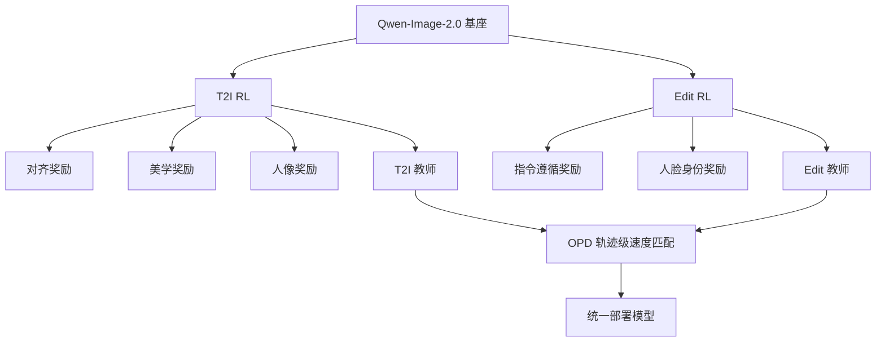

# Qwen-Image-2.0-RL：用 RLHF 和在线策略蒸馏把生图与编辑合成一个部署模型

<!-- release-date: 2026-06-25 -->

> 本文依据 Qwen 团队发布的 **Qwen-Image-2.0-RL Technical Report**，即 arXiv:2606.27608v1（[cs.CV] 25 Jun 2026；页眉日期 June 29, 2026；https://qwen.ai）。页码均指本地 PDF `papers/Alibaba/Qwen-Image-2.0-RL.pdf` 本身的页码（共 16 页，6 图 1 表）。文中会明确区分「报告写了什么」和「我们从中得到什么启发」。截至核稿时 arXiv 仅有 v1，未见公开权重；release-date 因此退回原件首次公开日 2026-06-25。

## 阅读前先搭一张最小地图

先认识五个会反复出现的名字：

- **Flow Matching（流匹配）**：把「从噪声走到图像」写成一条连续速度场，而不是逐步去噪的离散马尔可夫链。Qwen-Image-2.0 的生成过程按这条路径走。
- **GRPO（Group Relative Policy Optimization，组相对策略优化）**：同一条提示生成一组图像，用组内相对优势当强化学习信号，不必单独训价值网络。
- **CFG（Classifier-Free Guidance，无分类器引导）**：推理时把「有条件」和「无条件」两路预测混在一起，用来加强提示控制。本报告的关键工程选择是：**rollout 用 CFG，策略更新不用 CFG**。
- **点式打分 + CoT 奖励模型**：给单张图打绝对分，并要求视觉语言模型先写推理再给分，而不是只做两两比较。
- **OPD（On-Policy Distillation，在线策略蒸馏）**：学生在自己的去噪轨迹上，去匹配任务专用教师的速度场，把 T2I 教师和编辑教师合成一个学生。

这篇报告不是 Qwen-Image-2.0 基座论文，也不是 Qwen3 语言模型论文。基座本身见 Zhao et al., 2026（arXiv:2605.10730），本 PDF 只把它当 **后训练对象**。

## 一句话先说清

Qwen-Image-2.0-RL 做的不是「再训一个更大的扩散模型」，而是给已有基座装上三条后训练管道：**任务专用复合奖励 → 全参数 GRPO → 用 OPD 把两条任务策略合成一个可部署模型**。

因此最值得记住的不是某个分数，而是一种工程分解：

> **奖励按任务拆开训，策略按任务拆开优化，部署时再在学生自己的轨迹上把教师速度合回去。不要指望一套混合奖励同时把生图和编辑都拉满。**

这也是全文最重要的 insight。

## 先看全景：报告到底改了哪几层

图 1（PDF p.1–2）把流水线画成：共享基座 → 两条任务 RL → 两个教师 → OPD → 统一模型。T2I 侧奖励从提示忠实到纹理再到人像；编辑侧是指令准确度与身份保持。

三项贡献写在 PDF p.2：

1. 基于 Qwen 系列视觉语言模型的复合奖励，点式打分加思维链，T2I 与编辑各一套。
2. 可扩展的 GRPO 训练：混合 CFG、异步奖励接口、提示过滤、按类校准权重。
3. OPD：用轨迹级速度匹配合并任务教师，部署时不再依赖奖励模型。

摘要数字（须用表/图复核，不能只信摘要）：Qwen-Image-Bench 总分 **57.84**（相对基座 **+2.61**）；T2I Arena Elo **1193**（**+78**）；编辑 Arena Elo **1349**（**+93**）。（PDF 摘要 p.1；复核见第 5 节与 Table 1 / Fig. 4，PDF p.8–9）

## 第一层问题：扩散模型的 RL 为什么难

报告在引言里列了三条缺口（PDF p.1–2）：

第一，奖励信号要同时覆盖美学、对齐、人像、编辑指令、身份保持。单一标量奖励很容易被钻空子。

第二，要把这些奖励用到 **全参数** 训练，而不是只做 LoRA。规模上来以后，CFG、时间步、提示质量都会变成稳定性问题。

第三，产品要的是 **一个** 模型同时会生图和编辑。分别训出来的策略会互相踩，直接混数据混奖励又会看到跷跷板。

**论文写了什么**：这三条是他们选「先分后合」的理由。

**我们从中得到什么**：面试时如果被问「为什么图像 RL 不能直接抄 LLM 的 RLHF」，可以答：连续轨迹、CFG 改变了采样分布、多奖励量纲不同、生图与编辑的目标冲突。本报告把这三件事分别用奖励设计、混合 CFG、OPD 处理。

## 背景：把生成写成 ODE，再写成 MDP

### 流匹配

正向过程（PDF p.2，式 (1)）：

$$
x_t = (1-t)x_0 + t\epsilon,\quad t\in[0,1]
$$

其中 $x_0\sim p_{\mathrm{data}}$，$\epsilon\sim\mathcal{N}(0,I)$。对应的目标速度场是 $v^*(x_t,t)=\epsilon-x_0$（PDF p.3，式 (2)）。学习到的速度场 $v_\theta$ 用反向 ODE 从 $t=1$ 积到 $t=0$（PDF p.3，式 (3)）。

报告明确说 Qwen-Image-2.0 建立在这条流匹配范式上，因此后面的 GRPO 和 OPD 都作用在 **速度场** 上，而不是离散去噪步的噪声预测器表述。

### 把多步生成当成 MDP

第 2.2 节（PDF p.3）把 $N$ 步 ODE 离散化成 MDP：状态是 $(x_{t_n},t_n,c)$，动作是下一步 $x_{t_{n+1}}$，转移由 ODE 求解器决定，奖励只在终点 $t=0$ 给出。策略梯度因此可以写在整条轨迹上。

GRPO 的组相对优势（PDF p.3，式 (4) 附近）：同一提示采样 $G$ 张图，用组内均值和标准差把终点奖励标准化，得到 $A^{(i)}$。报告后续把多奖励做成加权和再标准化（见第 4.1 节式 (13)，PDF p.7）。

**面试用一句话**：GRPO 在这里的价值不是「又一个算法名字」，而是 **省掉 critic、用同提示组内相对比较**，这和图像奖励噪声大、绝对分难校准是匹配的。

## 奖励模型：先让裁判会讲理，再让策略听裁判

第 3 节（PDF p.4–6）是全文篇幅最大的设计部分之一。核心判断：**点式打分优于成对比较；带 CoT 的视觉语言模型优于只吐标量的回归头。**

### 为什么点式

报告写：成对训练会让模型学会「比另一张好一点」，但不稳定地给出可校准的绝对质量。点式范式要求模型对单张图打分，并对照结构化量规。他们 empirically 认为点式更好（PDF p.2、第 3 节）。本底稿不把「更好」夸张成普遍定理——这是他们在自己数据与 Qwen 系列 VLM 上的观察。

### T2I：三层奖励

图 1 与第 3.2 节（PDF p.2、p.4–5）：

- **对齐（Alignment）**：提示是否被执行。这是第一层，防止模型用好看但跑题的图骗过美学分。
- **美学（Aesthetic）**：纹理、构图、光影。
- **人像（Portrait）**：面部吸引力与人像专用瑕疵。报告认为通用美学奖励对人脸细节不够敏感，所以单开一路。

分层的意图很清楚：先保证「说了什么就画什么」，再抠质感，再进人像。如果反过来，模型会迅速学会「一切都往网红脸和塑料皮肤靠」。

### 编辑：指令 + 身份

第 3.3 节（PDF p.5–6）：

- **指令遵循**：编辑是否发生、是否只改该改的地方。
- **Face ID**：单独的基于嵌入的身份打分器。报告写，VLM 的语义一致性评估对 **细微的身份漂移** 不够灵，所以补一个 embedding 级信号（PDF p.6）。

这是一个很具体的工程判断：**语义裁判和身份裁判不是同一个分辨率。** 面试可以把它类比成「BLEU 不能替代人脸验证」。

### 复合奖励怎么进 GRPO

第 4.1 节式 (13)（PDF p.7）：

$$
A^{(i)}(x_0,c)=\sum_{k=1}^{K} w_k\cdot\frac{R_k(x_0^{(i)},c)-\mu_k}{\sigma_k}
$$

$w_k$ 满足 $\sum_k w_k=1$，$\mu_k,\sigma_k$ 在 **同一提示组内** 计算。报告强调：组内标准化让复合奖励对量纲不敏感，避免某一路奖励因为数值范围更大而主导梯度。

**我们从中得到什么**：多奖励 RL 的第一失败模式不是「权重没调好」，而是 **没先消量纲**。Liu et al. (2026b) 的 GDPO 被明确引用为启发来源（PDF p.7）。

## 训练管道：稳定性比算法名词更值钱

### 混合 CFG：三种策略只活一种

第 4.1 节与图 3（PDF p.6–7）：

1. **Rollout 和训练都用 CFG**：训练严重不稳，图像最终崩成不可读输出。
2. **两阶段都不用 CFG**：奖励分还能涨，但模型丢掉风格化和世界知识，名人长相和特定风格复现失败。报告归因：基座推理时依赖 CFG 才能把预训练知识「用满」。
3. **只在 rollout 用 CFG，策略目标里丢掉无条件分支**：采用此项。

采用第三条的理由写成两句话（PDF p.7）：CFG 采样给出结构完整、奖励可评的候选；无 CFG 的更新避开条件/无条件两路联立优化的梯度困难，并减少计算。

**论文写了什么**：这是针对 Qwen-Image-2.0 架构的选择，相关工作里也说 hybrid CFG 是他们相对 Flow-GRPO 等的具体改动（PDF p.9–10）。

**我们从中得到什么**：扩散 RL 里「训练分布」和「推理分布」被 CFG 撕开了一道缝。缝补错了，要么不稳，要么知识蒸发。面试追问「为什么不两边都 CFG」时，用他们的崩塌观察回答即可，不要编造学习率或具体 CFG scale——PDF 没给这些超参数字。

### 异步奖励

奖励模型是远程 API，和训练进程分离（PDF p.7）。同步打分会被网络 I/O 卡住。做法：GPU 推出一批图 → 后台线程提交远程打分 → 返回后各 rank 同步、组内标准化、算优势。报告称这能把奖励延迟几乎藏到推理计算后面，从而多路奖励不必按比例拉长墙钟时间。

这里没有给出 QPS、batch、卡数。不要脑补集群规模。

### 时间步：不要在 40 步上处处 RL

Rollout 用 40 步 ODE（PDF p.7）。若对全部 40 步套 RL 目标，会 **很快奖励黑客**，几轮内质量崩。他们只在子集时间步上训练，并偏向高噪声（靠近 $t=1$）——这些步决定全局结构和语义布局，更耐优化。

**面试点**：图像 RL 的黑客往往发生在「模型发现裁判只看局部统计」；把梯度限制在结构步，是在用归纳偏置换稳定性。PDF 没有写具体子集比例。

### 提示过滤与按类校准

提示不是越多越好（PDF p.7）。对每个候选提示，基座做 $G$ 次 rollout，算组内极差（最大减最小）。只有极差超过阈值的提示留下。全员很高或全员很低的提示，对策略梯度几乎没信号。

留下的提示再按语义类（人像、风景、排版、通用等）分配不同奖励权重向量：人像加重人像奖励，排版加重对齐。目的是避免优化收敛到单一主导风格。

**缺口**：阈值、$G$、各类 $w_k$ 的具体数值 PDF 均未给。写进面试答案时要主动说「报告只给了机制」。

## OPD：先当两个专家，再合成一个员工

第 4.3 节（PDF p.8）是本报告相对「再跑一遍 GRPO」真正多出来的部分。

### 问题

T2I 优化过的模型编辑会掉；编辑优化过的模型生图会掉。产品不能上两个检查点。

### 目标

学生 $v_\theta$ 从基座初始化，沿自己的反向 ODE 轨迹 $\{x_{t_n}\}$ 走，在每个点上匹配 **当前任务对应教师** 的速度（PDF p.8，式 (14)）：

$$
\mathcal{L}_{\mathrm{OPD}}=\mathbb{E}_{c,x_{[1:N]}\sim\pi_\theta(\cdot|c)}\Big[\sum_{n=1}^{N}\big\|v_\theta(x_{t_n},t_n,c)-v_{\theta^\star}(x_{t_n},t_n,c)\big\|^2\Big]
$$

关键是 **on-policy**：轨迹来自学生自己，不是教师。报告写这能让学生在自己的推理轨迹上纠正自己的预测误差。

### 多教师

两个教师：T2I（美学/对齐/人像）与编辑（指令/身份）。每个 batch 按样本任务选教师。显存不够时只把当前教师放 GPU，其余 offload 到 CPU（PDF p.8）。教师预测速度时用 CFG，学生训练时不用 CFG；OPD 之后再把 CFG 接回学生推理。

报告对比的自然基线是 **Mix-RL**：一个模型上同时混 T2I 与编辑数据和全部奖励。他们说 Mix-RL 更简单，但被迫同时满足冲突目标。

定性比较：

- 图 5（PDF p.11）：T2I 场景，Base → Mix-RL → OPD 的质量递进。Mix-RL 已强于基座（纹理、构图、真实感），OPD 再胜过 Mix-RL（更锐、更跟提示、更好看）。
- 图 6（PDF p.12）：人像编辑。OPD 身份保持和指令完成最好；Mix-RL 仍有身份漂或复杂指令改不完。

这些是 **定性图**，没有表列定量分数对比 Mix-RL。面试时不要把「 consistently outperforms」说成有公开的 Mix-RL Elo。

### 附录 A：为什么是速度 MSE

附录 A（PDF p.13）把式 (14) 从分布距离推出来。LLM 蒸馏常用 $\mathrm{KL}(p_\theta\|p_{\theta^\star})$；连续扩散的路径测度 KL 不好算。他们改用 $W_2$，再引用 Benton et al. (2023) 的界：在流存在唯一、教师速度 Lipschitz 的假设下，$W_2$ 被轨迹上速度误差的积分乘上一个只依赖教师 Lipschitz 的指数因子控制。于是对 $\theta$ 最小化上界 ≈ 最小化学生轨迹上的速度 MSE。离散化后回到式 (14)/(19)。

相关工作（PDF p.10）指出：并发的 Flow-OPD 与 DiffusionOPD 也把高斯转移核的 KL 化成速度 MSE，但它们聚焦 **单奖励 T2I 教师**；本工作按任务拆教师，并从 $W_2$ 上界推导。

**我们从中得到什么**：OPD 不是「再蒸馏一次输出图像」，而是 **在学生自己的连续轨迹上对齐向量场**。这和 LLM 的 on-policy distillation（GKD，Agarwal et al., 2024）同构：都是在学生自己会犯错的位置上学教师。

## 实验：摘要三个数必须回到表和图

### Qwen-Image-Bench（Table 1，PDF p.9）

评测设定（PDF p.8）：五根一级柱——Quality、Aesthetics、Alignment、Real-world Fidelity、Creative Generation。裁判是 Q-Judger，用超过 **13 万** 条人类标注的图–提示对训练，标注者是 **80** 位职业艺术家。分数 $[0,100]$，从 **56** 个三级面自底向上聚合。

Table 1 中与本模型直接有关的两行（读自 PDF p.9 表，不是摘要转述）：

| 模型 | Quality | Aesthetics | Alignment | Real-world Fidelity | Creative Gen. | Overall |
|---|---:|---:|---:|---:|---:|---:|
| Qwen-Image-2.0-Base | 52.29 | 57.10 | 57.64 | 47.54 | 58.22 | 55.23 |
| Qwen-Image-2.0-RL | 54.39 | 58.67 | 59.28 | 51.83 | 64.94 | **57.84** |

差值：Quality $+2.10$，Aesthetics $+1.57$，Alignment $+1.64$，Real-world Fidelity **$+4.29$**，Creative Generation **$+6.72$**，Overall **$+2.61$**。正文也写最大增益在 Creative Generation 与 Real-world Fidelity（PDF p.8）。

同表里更强的闭源/竞品仍高于 RL 后的 Qwen：例如 GPT Image 2 总分 **64.69**，Nano Banana 2.0 **59.82**，GPT Image 1.5 **59.65**（PDF p.9 Table 1）。报告没有声称 SOTA。解读时必须把「相对基座全面上涨」和「绝对榜仍落后头部」分开说。

基座 55.23 夹在 FLUX 2 Max（55.33）与 Seedream 4.0（56.21）附近；RL 后 57.84 超过 Seedream 5.0 的 57.22，但仍低于 Nano Banana Pro 的 59.45。这些都是表内数字，不要口算四舍五入错位。

### 人类偏好 Arena（Fig. 4 与正文，PDF p.9）

图 4 标题：RL 在全部八个子类以及总分上提升 Elo。子类从雷达图/柱状图可见：Product、3D、Cartoon、Photorealism、Art、Portraits、Text Rendering、Edit，外加 Overall。

正文给出的 **可引用精确数字**（PDF p.9 段 「Human preference evaluation」）：

- T2I 总分： **1115 → 1193（+78）**
- 最大子类增益：3D Modeling **+93**，其次 Photorealism **+91**
- 编辑 Arena：**1256 → 1349（+93）**

柱状图纵轴约 1,000–1,400，编辑柱明显高于 T2I 各柱，与 1349 vs 1193 一致。子类的绝对 Elo 除正文写出的 overall 与两个 $\Delta$ 外，图上刻度不足以可靠读出每一根柱的整数，本底稿 **不编造** Product/Art 等的精确 Elo。

**三层分开**：

- 报告声称：自动榜五柱全涨，Arena 八类全涨，编辑 Elo +93。
- 报告 **没有** 给出 Arena 的票数、对战模型名单、统计显著性。
- 我们的判断：方向一致、幅度可观，但外部不可复现；且自动榜上 RL 后仍不是表内第一。

## 相关工作里他们如何给自己定位

第 6 节（PDF p.9–10）三条线：

1. **扩散 RL**：Flow-GRPO 把多步生成当 MDP；GRPO-Guard 管隐式过优化；AWM、DiffusionNFT 做在线 RL。本工作在这些之上加 hybrid CFG。
2. **奖励模型**：从 CLIP、ImageReward、PickScore、HPSv2/v3 的回归/BT，走到 UnifiedReward、RewardDance 的 token 概率 + CoT。本工作站在后一条，并坚持点式。
3. **OPD**：LLM 侧 GKD；扩散侧 Flow-OPD、DiffusionOPD。差异是任务拆教师 + $W_2$ 推导。

引用基座时用 Zhao et al., 2026（Qwen-Image-2.0 technical report）；更早的 Qwen-Image 是 Wu et al., 2025a。不要把 2025 的 Qwen-Image 和本 RL 报告混成一篇。

## 结论里他们自己怎么收束

第 7 节（PDF p.10）把贡献收成三点：复合 VLM 奖励（含 TI2I，即编辑）、带 hybrid CFG 与异步管道的 GRPO、OPD 合并教师并去掉部署时的奖励模型依赖。他们声称 OPD **不仅追上而且超过** Mix-RL。定性图支持这句话；定量 Mix-RL 表缺失，属于报告自己的证据缺口。

## 面试时可以怎么用

### 能直接讲的故事

「图像后训练不要一锅炖。」奖励按维度拆，策略按任务拆，最后用学生轨迹上的速度匹配合成。对应三个失败模式：奖励黑客、CFG 撕开训推分布、多任务跷跷板。

### 可能被追问的点

- **和 LLM GRPO 的差别**：终点奖励、连续状态、CFG、只在部分时间步更新。
- **为什么 OPD 不是 SFT**：监督信号是教师速度，数据是学生自己的 ODE 轨迹，所以是 on-policy。
- **为什么编辑要单独 Face ID**：VLM 看语义，embedding 看身份，分辨率不同（PDF p.6）。
- **数字怎么记**：Bench 55.23→57.84；T2I Elo 1115→1193；Edit Elo 1256→1349。最大自动增益在 Creative（+6.72）和 Fidelity（+4.29）；最大人类增益在 3D（+93）和 Photorealism（+91）。全部 PDF p.8–9。

### 不要讲过头的话

- 没有公开权重、没有训练步数、没有学习率、没有 $G$ 的数值、没有 CFG scale、没有 Mix-RL 的表。
- 没有声称超过 GPT Image 2。
- 不要把本报告讲成 Qwen3 或 Qwen-Image-2.0 基座的架构文。基座的 MMDiT、Qwen3-VL 条件编码器等不在本 PDF 展开，除非标明引用 Zhao et al., 2026。

## 外部补充与版本

- arXiv: **2606.27608v1**，提交 Thu, 25 Jun 2026 23:49:50 UTC，16 pages, 6 figures, 1 table。核稿时未见 v2。
- Hugging Face Papers 页面有社区问是否发权重，回复语义为只发论文。DailyPapers 亦公开喊希望权重上 HF。本底稿 accordingly **不把任何第三方镜像当作官方权重发布**。
- 基座技术报告 arXiv:2605.10730（Qwen-Image-2.0），与本 RL 报告分离。
- Q-Judger / Qwen-Image-Bench 来自 Li et al., 2026a（arXiv:2605.28091），是评测引用，不是本报告贡献。

**release-date 证据**：规则要求「模型首次对外可用日」。检索 qwen.ai / HF / 论文页均未找到 Qwen-Image-2.0-RL 权重或官方 API 单列发布日；因此退回原件首次公开日 **2026-06-25**（arXiv v1），并在文首写明「仅论文、无权重」。

## 把整条管道再按「数据流」走一遍

上面按章节拆过了。面试更常被要求「从一张噪声图讲到检查点落盘」。下面按时间顺序再走一次，全部机制都对应 PDF 已写内容，不引入未给出的超参。

**第一步：提示进组。** 训练提示先经过过滤：基座对每条提示做 $G$ 次采样，只留组内奖励极差够大的提示（PDF p.7）。这一步决定「哪些题值得刷」。全对或全错的题，GRPO 的组内标准差接近零，优势信号塌掉。

**第二步：按任务选奖励套件。** T2I 提示走对齐、美学、人像三路；编辑提示走指令与 Face ID。权重 $w_k$ 再按语义类微调（PDF p.7）。这里没有「一个万能裁判」。

**第三步：rollout。** 四十步 ODE，推理用 CFG，得到一组终点图像（PDF p.7）。图像发到远程奖励服务。训练进程不等待同步打分，后台线程稍后把分数填回（PDF p.7）。

**第四步：组内标准化再加权。** 式 (13) 把各路 $R_k$ 在同提示组内减均值除标准差，再按 $w_k$ 相加（PDF p.7）。得到的 $A^{(i)}$ 才是 GRPO 的优势。

**第五步：只在部分时间步做策略更新。** 不是四十步都回传。偏向高噪声步，避免终点附近的微调被奖励黑客吃掉（PDF p.7）。策略目标里 **没有** CFG 的无条件分支（PDF p.6–7）。

**第六步：任务专用教师成型。** T2I 教师和编辑教师各自收敛。此时它们是两个检查点，不是一个产品。

**第七步：OPD。** 学生从基座出发，自己滚轨迹，每一步用当前任务教师的速度当场监督（式 (14)，PDF p.8）。教师推理用 CFG，学生训练不用 CFG。显存不够就教师轮流上 GPU（PDF p.8）。

**第八步：部署。** 学生恢复 CFG 推理。奖励模型不再出现在服务路径上——这是报告强调 OPD 的产品理由（PDF p.2、p.8、p.10）。

如果把第六步跳过、直接 Mix-RL，报告认为会撞上目标冲突；图 5、图 6 用定性样本支持「分训再合」优于「混着训」（PDF p.11–12）。

## 奖励黑客：报告写到的，和报告没写到的

报告明确点名的黑客路径有两条。

一条是 **时间步全开 RL**。四十步处处优化，质量几轮内崩（PDF p.7）。解释不必神秘：终点奖励对整条轨迹负责，靠近干净图的那些步最容易用局部纹理、高饱和、人脸模板去刷分，而这些改动对裁判友好、对用户刺眼。把梯度限制在结构步，等于告诉模型「先把构图和语义改对，别在最后几步整容」。

另一条是 **CFG 用法错误**。rollout 和训练都开 CFG 会不稳定到图像不可读；两边都关会丢掉预训练风格与世界知识（PDF p.6–7）。这不是「CFG 好或不好」，而是 **训练时的动作分布必须接近推理，但优化目标不能把无条件网络一起拽歪**。

报告 **没有** 写的、但面试常问的黑客，本底稿只标成开放问题，不当成他们的结论：

- 奖励模型自己过拟合到某种「裁判审美」，策略再过拟合到奖励模型。他们用 CoT 和点式量规缓解，但没有奖励模型与人类的一致性表。
- 人像奖励是否会把所有人拉向同一套五官。分层设计暗示他们担心这件事，但没有多样性指标。
- Face ID 是否会惩罚合法的表情、光照、年龄编辑。定性图 6 看起来指令仍能执行，但没有失败案例分析。

**论文写了什么 / 我们推断什么** 必须分开：前者是「他们观察到全时间步 RL 会崩、双 CFG 会崩」；后者是「崩的机制可能是终点奖励对局部刷分过于敏感」。后者没有直接实验支撑。

## 点式打分到底在反对谁

第 3 节把奖励模型放进一条简史：早期用 CLIP 相似度或 ImageReward、PickScore、HPSv2 这类回归或 Bradley–Terry 成对模型；近期 UnifiedReward、RewardDance 把视觉语言模型的生成概率当奖励，并加上思维链（PDF p.10）。本工作站队很清楚：**生成式 VLM + 点式 + CoT**。

为什么点式可能更适合 RL 而不是只适合排行榜？成对模型输出的是「A 比 B 好」，组内 $G$ 张图要变成 $G$ 个优势，还得再做一次比较矩阵或某种聚合。点式直接给每张图一个数，和 GRPO 的「组内标准化」接口是同一形状。报告说 empirically 点式更好（PDF p.2），但没有把 pairwise 基线的分数表放进第 5 节。所以面试里可以讲「接口匹配 + 他们的经验结论」，不要讲「消融证明点式一定赢」。

CoT 的作用被写成：让模型先对照量规写理由再打分。这降低了「只看纹理均值就给高分」的短路。它也带来成本：奖励变成远程长文本生成，所以必须异步（PDF p.7）。奖励质量、延迟、成本三者在这里是绑在一起的。

编辑任务上他们承认 VLM 仍不够：全局结构它看得懂，细微身份漂移它不敏感，所以另接 Face ID（PDF p.6）。这等于承认 **同一套 VLM 奖励覆盖不了所有需要的分辨率**。复合奖励不是「把分数加起来更准」，而是「不同裁判看不同尺度」。

## OPD 与 Mix-RL：冲突到底从哪来

可以从目标函数直接读冲突。

T2I 的人像奖励希望脸好看、皮肤细；编辑的身份奖励希望脸别变。同一张「把背景换成海边、人不要变」的编辑样本，如果混进 T2I 人像奖励，梯度会同时要求「更漂亮」和「别动」。Mix-RL 把这些项塞进同一个 $A^{(i)}$，权重再精也只是在冲突里找折中。

OPD 把冲突从 **奖励空间** 挪到 **教师选择**。一条 T2I 样本只看 T2I 教师速度；一条编辑样本只看编辑教师速度。学生仍然是一个网络，但每一步监督信号是单任务的。这很像多教师蒸馏，而不是多目标 RL。

代价也清楚：要先付两份 RL 的计算，再付一份蒸馏。报告没有比较墙钟或 FLOPs。产品上的收益是「部署一个模型、推理路径无奖励模型」（PDF p.8、p.10）。

附录 A 的 $W_2$ 推导（PDF p.13）告诉我们：他们不把 OPD 写成「随便一个 MSE」。出发点是路径测度距离，中间用 Benton et al. (2023) 的界，落到学生轨迹上的速度误差。假设包括流的唯一性和教师速度 Lipschitz。这些假设在真实高维图像流上是否严格成立，报告没有验证——推导的价值是 **把目标说圆**，不是证明最优。

并发工作 Flow-OPD、DiffusionOPD 也能把 KL 化成速度 MSE，但报告强调它们主要服务单奖励 T2I 教师（PDF p.10）。本工作的增量是 **任务拆教师**，不是发明速度 MSE 本身。面试时把增量说对，比把公式背完更重要。

## 数字背后的评测政治

Qwen-Image-Bench 的裁判 Q-Judger 用十三万条职业艺术家标注训练（PDF p.8）。这既是优点（标注质量高），也是风险（裁判和生成模型可能同属 Qwen 生态）。报告没有讨论「用自家 VLM 训的裁判评自家 RL 模型」是否偏置。Table 1 里 GPT Image 2 仍然大幅领先（64.69 vs 57.84，PDF p.9），说明这张表至少没有把自家模型送上第一——偏置即使存在，也没有强到改写排序顶端。

五根柱里涨得最多的是 Creative Generation（+6.72）和 Real-world Fidelity（+4.29），涨得最少的是 Aesthetics（+1.57）和 Alignment（+1.64）（由表内相减，PDF p.9）。这和「RL 专门打创意和真实感」的叙事一致，也和人像/纹理奖励的设计一致。Alignment 只小涨，说明基座对齐已经不差，RL 不是靠补「听不听话」涨分。

Arena Elo 的编辑分（1349）明显高于 T2I 分（1193）。可能因为编辑对战的对手集合、用户投票习惯与 T2I 不同，不能直接说「编辑比生图更强」。报告把它们分开放，本底稿也分开记。3D +93、Photorealism +91 是正文写出的最大 T2I 子类增益（PDF p.9），和 Fidelity 柱的自动评测方向一致：结构、细节、真实感是 RL 真正拉动的轴。

## 和仓库里其他材料怎么并排，而不并成一篇

本仓库已有 Qwen 语言模型与 GSPO 等对齐算法笔记。本篇只借文风，不借章节。对照时只需记住：

- GSPO / 语言模型 GRPO 处理的是离散 token 序列；这里处理的是连续速度场和终点图像奖励。
- 语言模型蒸馏常见 KL 于 next-token；这里蒸馏的是 ODE 速度。
- 本报告的 hybrid CFG 在语言模型里没有对应物。硬要类比，更接近「采样时用某种解码约束，梯度更新时不用」。

不要把 Qwen-Image-2.0 基座的 MMDiT、分辨率、条件编码器细节写进本底稿当成本 PDF 的贡献。那些属于 Zhao et al., 2026。本 PDF 只在引言和相关工作引用它（PDF p.2、p.10）。

作者栏（PDF p.1）列出多名贡献者，通讯作者 Chenfei Wu。Yixian Xu、Kaiyuan Gao、Yuxiang Chen 为共同一作。这些信息用于引用，不用于解读技术。

## 把 insight 收成三条可背的句子

第一句：**多奖励必须先组内标准化再加权**，否则量纲就是隐形学习率（式 (13)，PDF p.7）。

第二句：**CFG 属于采样器，不一定属于训练目标**。训推分布要对齐，优化图不能把无条件分支绑上（PDF p.6–7）。

第三句：**任务冲突用教师隔离，而不是用权重和稀泥**。OPD 在学生自己的轨迹上把教师速度合进一个部署模型（式 (14)，PDF p.8）。

三条都同时满足「报告写了」和「面试能用」。其余超参、消融、权重，报告没给，就不要补。

## 报告地图（章节 ↔ 页码）

| 部分 | PDF 页 |
|---|---|
| 标题、作者、摘要、图 1 管道 | p.1–2 |
| 贡献三条 | p.2 |
| §2 流匹配与 GRPO 背景 | p.2–3 |
| §3 奖励模型（点式、T2I 三路、编辑两路） | p.4–6 |
| §4.1 混合 CFG、异步奖励、多奖励优势 式 (13) | p.6–7 |
| §4.2 时间步、提示过滤、按类权重 | p.7 |
| §4.3 OPD 式 (14)、多教师、Mix-RL 对比 | p.8 |
| §5 Table 1、Fig. 4、Elo 正文数字 | p.8–9 |
| §6 相关工作 | p.9–10 |
| §7 结论 | p.10 |
| Fig. 5 T2I 定性 | p.11 |
| Fig. 6 编辑定性 | p.12 |
| 附录 A $W_2$ 推导 | p.13 |
| 参考文献 | p.14–16 |

## 数字抽核

- **57.84 / +2.61 / 55.23**：Table 1 末两行 Overall，PDF p.9；正文 PDF p.8。
- **1193 / +78 / 1115**：PDF p.9 人类偏好段；与摘要一致。
- **1349 / +93 / 1256**：同上。雷达图 Edit 轴标注可见 1350 刻度，与 1349 相容，但不替代正文数字。
- Creative **64.94 vs 58.22（+6.72）**、Fidelity **51.83 vs 47.54（+4.29）**：Table 1 与 PDF p.8 正文。

## 缺口

- 无权重、无推理代码、无训练超参表。
- Mix-RL 只有定性图，无 Bench/Elo 表。
- Arena 无样本量和对手列表。
- 图 3 的 CFG 对比是训练过程观察，PDF 文本描述了三种结局，但本底稿未把图 3 曲线读成具体 loss 数字（避免误读坐标）。
- 人像奖励、Face ID 网络结构、VLM 具体哪一档 Qwen，均未规格化到可复现细节。

## 如果只剩五分钟，按这个顺序读 PDF

先读图 1（p.1–2）把管道记住，再读贡献三条（p.2），再跳到式 (13) 和 hybrid CFG 三段策略（p.6–7），再读式 (14) 与 OPD 多教师（p.8），最后只看 Table 1 末两行和 p.9 人类偏好那一段。图 5、图 6 用来建立直觉，不要从定性图里读分数。附录 A 只有在面试官追「为什么是速度 MSE」时才需要翻。

这个顺序对应本底稿的主线：先分任务、再稳训练、再合成部署、最后用数字核对「有没有真涨」。数字核对时记住三组就够：Bench 55.23→57.84，T2I Elo 1115→1193，Edit Elo 1256→1349。其余柱和子类增益用来回答「涨在哪」，不用来冒充全面 SOTA。

## 写作时刻意没做的事

没有把摘要里的 +2.61、+78、+93 直接当最终依据，而是回到 Table 1 与 p.9 正文复核。没有把 Hugging Face 上的讨论写成官方发权。没有把 Qwen-Image 2025、Qwen-Image-2.0 基座、Qwen3 语言模型的架构段落搬进来充字数。没有给 $G$、学习率、CFG scale、过滤阈值编造默认值。没有把 Mix-RL「被 OPD 全面超过」写成有表可查——定性图支持方向，定量表缺席。

页码一律写 PDF 页。图中读不清的 Elo 子类绝对值没有填。区间用短横「–」，公式用 `$...$` / `$$...$$`。加粗两侧留空。中文标点全角。这三条属于仓库写作硬约束，与论文内容无关，但读稿时会用来验收。

## 一句话收尾

Qwen-Image-2.0-RL 是一篇 **后训练工程报告**：用点式 CoT 奖励给扩散模型提供可组内标准化的信号，用混合 CFG 和局部时间步让全参数 GRPO 不崩，用 OPD 把互相冲突的生图教师与编辑教师压成一个推理时不再依赖奖励模型的检查点。它证明的是这条管道相对基座稳定上涨，而不是证明图像生成的新架构。记住管道，比记住 57.84 这个数更有用。

## 作者、页数与图表清单（便于对照 PDF）

封面标题 **Qwen-Image-2.0-RL Technical Report**（PDF p.1）。页眉日期 June 29, 2026，arXiv 行写 25 Jun 2026。共十六页。图 1 管道总览（p.1–2）；图 2 未在正文抽取里单独展开细节，写稿不以该图数字为准；图 3 三种 CFG 策略的训练过程（p.6 附近）；图 4 人类偏好 Elo 雷达与柱状对比（p.9）；图 5 T2I 定性 Base / Mix-RL / OPD（p.11）；图 6 人像编辑定性（p.12）。表只有 Table 1 一张（p.9）。附录 A 在 p.13，参考文献 p.14–16。

通讯作者 Chenfei Wu。共同一作 Yixian Xu、Kaiyuan Gao、Yuxiang Chen。其余作者名单以 PDF p.1 为准，本底稿不逐人扩写。机构与邮箱未作为技术主张引用。

## 和「只看摘要」对不上时怎么办

摘要把三组数字写在一段里，容易让人以为 Arena 的 +78、+93 也来自 Qwen-Image-Bench。它们不是。Bench 是 Q-Judger 自动分，Arena 是匿名对战 Elo。Bench 的 +2.61 是百分制总分差，Elo 的 +78 是另一套标尺。混用会在面试里立刻露馅。复核顺序永远是：摘要 → Table 1 末两行 → p.9 人类偏好段。三处一致才落笔。

若日后 arXiv 出现 v2，应先换本地 PDF 再改本底稿，不要在底稿里用记忆补丁。当前核到的就是 v1。若官方突然上权重，release-date 应改成权重可用日，而不是继续停在 2026-06-25。截至写稿，这一天还没发生。

## 常见误读清单

把本报告读成「Qwen-Image-2.0 架构文」是第一类误读。架构在基座报告里。本 PDF 的新东西是奖励、GRPO 工程和 OPD。

把 OPD 读成「对输出图像做监督微调」是第二类误读。监督的是速度场，数据是学生自己的轨迹，时机是 RL 教师已经训完之后。

把 hybrid CFG 读成「推理时关掉 CFG」是第三类误读。部署时 CFG 还在。关掉的是 **策略梯度里的无条件分支**。

把 Table 1 的 57.84 读成 Arena Elo 是第四类误读。标尺不同。

把「八个子类全涨」读成「每个子类都有正文给出的整数 Elo」是第五类误读。正文只锁了 overall 与两个最大 $\Delta$，以及编辑的 1256→1349。其余看图，不读成精确表。

这五条误读都来自真实的摘要压缩习惯。把它们写出来，是为了面试前自检，不是为了指责原论文。

面试时的最短答法：先说「奖励按任务拆、策略按任务训、部署用 OPD 合成一个学生」；数字只报三组：Bench 57.84（+2.61）、T2I Elo 1193（+78）、编辑 Elo 1349（+93），全部回到 Table 1 与 p.9。有十五分钟再补 hybrid CFG（rollout 用、策略更新不用）和轨迹级速度匹配，以及 Table 1 里涨得最多的 Creative Generation 与 Real-world Fidelity。不要把 GPT Image 2 的 64.69 说成被追上——表里它仍第一。相对涨幅和绝对排名要分开讲。

截至核稿仍无公开权重，`release-date` 只能退回论文首发日 2026-06-25。基座架构见 Zhao et al., 2026（arXiv:2605.10730），不在本 PDF 范围。Mix-RL 没有定量表，Arena 没有样本量，图 3 不能读成 loss 数——这些缺口要原样带走。报告也没有给出奖励模型的训练步数、GRPO 的组大小与学习率，以及 OPD 学生跟教师的 KL 或速度差曲线；没有这些，就无法判断「先分后合」在剂量上有多稳，只能判断它在机制上为什么必要。没有权重，也就没有第三方复现可以核对 Table 1；数字只能钉回 PDF 本身。页眉日期 June 29, 2026 是排版日，arXiv 首发是 25 Jun 2026；卡片用后者。图 2、图 3 只解释机制，不从坐标轴读精确 loss。

