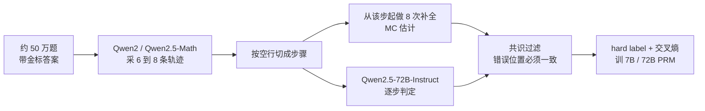

# Qwen-Math-PRM：Monte Carlo 标签和 Best-of-N 分数都会把过程监督带偏

<!-- release-date: 2025-01-13 -->

> 本文依据 Qwen Team（阿里巴巴集团）发布的 **The Lessons of Developing Process Reward Models in Mathematical Reasoning**，即 arXiv:2501.07301v2、封面日期 2025-06-12、共 21 页的版本。页码均指这份 PDF 本身的页码。解读依据 v2。v1 于 2025-01-13 提交；本地原件是 2025-06-05 上传、封面写成 2025-06-12 的 v2。文中会明确区分三层：**论文写了什么**、**本文如何解释它**、**哪些是外部资料补充**。从图上读下来的数字会标明「读图」，正文表格与封面柱图冲突时以表为准。
>
> `release-date` 取 **2025-01-13**。这是 Qwen2.5-Math-PRM-7B / 72B 权重与论文 v1 同一天首次公开的日期。证据链：arXiv v1 提交于 2025-01-13 13:10:16 UTC；Hugging Face 上 72B 的权重提交（`Upload folder using huggingface_hub`）为 2025-01-13 15:59:14 UTC，7B 为 16:07:23 UTC。**不用仓库 `createdAt`**：两个仓的 `initial commit` 分别是 12:59:59 UTC 和 13:00:06 UTC，只说明仓提前建好。官方博客 [*Towards Effective Process Supervision in Mathematical Reasoning*](https://qwenlm.github.io/blog/qwen2.5-math-prm/) 正文写成 January 14, 2025（中文页写 2025 年 1 月 14 日），对应北京时间 1 月 14 日；按流程取更早的官方公开日，即 UTC 日历下的 1 月 13 日。封面 2025-06-12 与 arXiv v2 修订日不得回写首发日。

## 读前只要五个词

这篇论文几乎不讲新网络结构。它要改的是「步骤对不对」这件事怎么被标出来、又怎么被评出来。先把五个会反复出现的名字说成人话。

- **过程奖励模型（Process Reward Model，PRM）**：专门给推理过程里的每一步打分的模型。它要回答的不是「这道题最后答对了吗」，而是「这一步本身对不对」。
- **结果奖励模型（Outcome Reward Model，ORM）**：只给整条回答、尤其是最终答案打一个分。
- **Monte Carlo 估计（MC 估计）**：不请人看步骤，而是从当前这一步接着往下采样若干次补全。补全里有多少次能撞上正确答案，就拿这个比例当步骤标签。
- **LLM-as-a-judge（用大模型当判官）**：把题目和逐步解答交给另一个语言模型，让它逐步审核对错。
- **Best-of-N（BoN）**：让策略模型对同一道题写出 $N$ 条候选，按奖励模型的分数挑最高的那条，看最终答案对不对。本文默认 $N=8$，记作 prm@8。

再补两个评测口径，后文会一直对着它们打架：

- **maj@8**：八次采样做多数投票，只看最终答案。
- **pass@8**：八次里只要有一次答案对，这道题就算过。它是 BoN 的上限，不是过程对不对的上限。
- **ProcessBench**：逐步找错基准。模型要指出第一个出错的步骤，或者判断全程都对。论文用它补 BoN 看不到的那一面。

本站位置也先说清，避免串台。本站 DeepSeekMath 篇讲的是 **GRPO** 这个策略优化算法，以及它怎么用结果奖励或过程奖励填 advantage；GRPO 不是 PRM，也没有提出步骤标注方法。OpenAI 的 *Let's Verify Step by Step* 本批尚未发布，这里只对照切面：那边走的是人标过程监督（本篇把它的 PRM800K 当高质量人标基线）；本篇要批评的是后来流行的 MC 自动标注和 BoN 评测口径，并给出共识过滤。下文不引用那篇尚未解读原文里的具体分数。

## 一句话先说清

社区当时有一条很顺的流水线：用补全成功率给每一步打标签，再用 Best-of-N 看 PRM 有没有把策略模型的答案选对。Qwen 团队按这条路训自己的数学 PRM，得到的教训是：

> **MC 估计测的是「从这里还能不能蒙对答案」，不是「这一步对不对」；BoN 测的是「挑出来的答案对不对」，不是「过程有没有被看懂」。两条尺子都会把过程监督带去结果监督。**

他们后来开源的 Qwen2.5-Math-PRM-7B / 72B，并不是把 MC 做大、把 BoN 刷高就算完。真正改的是两件事：只留下 MC 与 LLM-as-a-judge 对错误位置意见一致的样本；评测必须 BoN 和 ProcessBench 一起看。

## 他们实际在跑的那条流水线

这是根据 PDF p.3 §2.1 与 p.9 §4.1 重画的机制示意，不是论文原图，也不含训练时长。发布模型的最终训练集条数，论文没有单独写死。

## 第 1 节：过程监督要对付的，不只是算错

论文开头的问题有两层（PDF p.2）。

第一层人人都熟：语言模型会算错、会推错，最后答案也就错了。

第二层更阴：即使最终答案对了，中间仍可能是编出来的、站不住的步骤。后面的正确答案盖在前面的错误推导上。这种回答在「对不对答案」的评测里会得分，却不能当可信推理。

PRM 被提出来，就是为了在步骤粒度上抓住这些中间错误，给过程监督提供更细的信号。代表前作是 Lightman 等人的人标过程监督，以及后来用自动方法规模化的 Math-Shepherd 一类工作（PDF p.2）。

可是真要自己训一个 PRM，卡在两件事上。

**标注很贵。** 人标质量高，但贵。于是自动标注成了主流，其中最常用的就是 MC 估计：从当前步往后补全，用「最终能不能答对」的经验概率当步骤对错（PDF p.2）。

**评测也很滑。** 先前工作主要靠 BoN：PRM 给 $N$ 条候选打分，挑最高的那条看答案。ProcessBench 是后来补上的逐步找错基准（PDF p.2）。

论文的贡献不是又提出一种更花哨的打分头，而是把这两件事拆开检验，并写了四条（PDF p.2）：

1. MC 估计造出来的数据，表现和泛化都不如 LLM-as-a-judge 和人标。
2. 只拿响应级 BoN 评 PRM，会有系统性偏差，必须配上步骤级指标。
3. 把 MC 和 LLM-as-a-judge 做成共识过滤，数据更省，模型更强。
4. 开源训好的 PRM，并给出可操作的教训。

## 第 2 节：按惯例做一遍，成绩先翻车

第 2 节是他们的「预备试验」。设定写得很具体，后面所有教训都从这里长出来。

### 训练设定：Math-Shepherd 式的 MC 标注

他们按 Math-Shepherd 的路子造数据（PDF p.3）：

- 收集大约 50 万带金标答案的题目；
- 每题用 Qwen2-Math-Instruct 与 Qwen2.5-Math-Instruct 的 7B / 72B 混合，生成 **6 到 8** 条不同回答；
- 用空行 `\n\n` 切步骤；
- 从每一步起，用对应规模的 Qwen2.5-Math-Instruct 做 8 次独立补全，拿「补全能不能得到正确答案」的经验比例当步骤标签。

标签有两种（PDF p.3）：

- **hard label**：8 次里只要有一次补全对了，这一步就标正；全错才标负。
- **soft label**：取值在 0 到 1 之间，等于 8 次里答对的比例。

本文把它写成式子，方便后文对照。这是对 PDF p.3 文字的转写，论文原文没有编号公式。

$$
\hat p_t=\frac{1}{8}\sum_{k=1}^{8}\mathbf{1}\big[\text{从第 }t\text{ 步起的第 }k\text{ 次补全答案正确}\big]
$$

hard label 就是 $\hat p_t>0$ 为正、$\hat p_t=0$ 为负。这也是后文阈值实验里「阈值取 0」的意思。

第一步被标成 0 之后，后面的步骤全部丢掉，不再当训练信号。理由是：错误已经发生，后续步骤再对再错都没有定义（PDF p.3）。

PRM 的初始化是已经 SFT 好的 Qwen2.5-Math-7B / 72B-Instruct。原语言建模头换成两层线性组成的标量头。hard label 在每一步最后一个 Token 上算交叉熵，soft label 算均方误差（PDF p.3）。

论文没写学习率、epoch、batch 和算力。这些是缺口，不是可推测的超参。

### 评测设定：BoN 看答案，ProcessBench 看步骤

BoN 与先前工作对齐（PDF p.3）：从 Qwen2.5-Math-7B-Instruct 每题采 8 条，覆盖 GSM8K、MATH、Minerva Math、GaoKao 2023 En、OlympiadBench、College Math、MMLU STEM。一条回答的分数是各步分数的乘积，这是 Lightman 等人用过的聚合方式。同时报 maj@8 当基线、pass@8 当上限。

ProcessBench 作为补充：按 PRM 打出的逐步分数，定位第一个错误步骤（PDF p.3）。具体把连续分数切成「错 / 不错」的阈值，这篇没有写，要到 ProcessBench 原文里找。

### 初结果：BoN 没赢过多数投票，找错更是输给人标

他们把 MC 数据上训出的模型叫做 Qwen2.5-Math-7B-PRM-MC-hard / MC-soft，并拿只在 PRM800K 人标数据上训的 Qwen2.5-Math-7B-PRM800K 对照。Table 1、Table 2 在 PDF p.4。

Best-of-8 平均准确率：

| 设定 | Avg. |
|---|---:|
| pass@8（上限） | 74.7 |
| maj@8 | 66.2 |
| PRM800K 人标 | 64.9 |
| MC-hard | 65.5 |
| MC-soft | 64.4 |

没有一个 PRM 的 prm@8 超过 maj@8（PDF p.3–4）。也就是说，按「把 8 条里答案对的那条挑出来」这个目标，多数投票已经比这些 PRM 强。

ProcessBench 平均 F1：

| 模型 | Avg. F1 |
|---|---:|
| PRM800K 人标 | 56.5 |
| MC-hard | 40.2 |
| MC-soft | 40.2 |

找错这件事上，MC 训出来的 PRM 明显弱于人标，尽管 MC 数据规模更大（PDF p.4）。MC-hard 在 GSM8K 上 F1 到了 77.0，甚至高于人标的 68.2；但一到 OlympiadBench / Omni-MATH，F1 掉到 17.9 / 20.2，人标仍有 50.7 / 44.3（PDF p.4 Table 2）。规模没有换来难问题上的步骤判别。

这两张表把后文的全部动机说完了：沿用 MC + BoN，既选不出比投票更好的答案，也找不准错在哪一步。

## 第 3 节：两条教训

第 3 节标题在 v2 里就叫 **The lessons**。两条主线：MC 估计不适合拿来训 PRM；BoN 不适合单独拿来优化 PRM（PDF p.4）。

## 教训一：MC 估计测的是未来，不是当前这一步

### PRM 不是 value model

这是全文最重要的概念区分（PDF p.4 §3.1.1）。

- **PRM** 是当前步对错的确定性判别器：这一步的推导、计算、引用，现在对还是错。
- **value model** 是从当前步出发、未来还能不能答对的预测器。

MC 估计问的正好是第二件事：从这里补全下去，最终答案的经验成功率是多少。用它给 PRM 造标签，等于把 value 的原则塞进了 PRM 的训练。后文所有噪声、泛化差、BoN 虚高，都从这个错位长出来。

**本文的解释。** 可以把解题想成修电路。PRM 像万用表：这一段线路现在通不通。value model 像「如果从这里焊下去，整机点亮的概率」。一台本来焊错了的机器，下游如果碰巧短路，整机也可能亮。MC 会给那段错焊打高分。PRM 不该学这个。

这个区分也解释了附录 A 里搜索几乎不涨分：逐步贪心要的是「当前步对不对」，搜索更需要「走下去还有没有救」，后者更像 value（PDF p.14）。

### 同一批数据，三种标法，BoN 和 ProcessBench 对着干

§3.1.2 用三种造数据方式对照（PDF p.4–5）：

| 方法 | 样本数 | 怎么标 |
|---|---:|---|
| MC（公开 Math-Shepherd） | 440k（正文写作约 445k） | 公开 MC 数据 |
| MC（自己造） | 860k | Qwen2-Math-Instruct 出回答，Qwen2.5-Math-Instruct 做补全 |
| LLM-as-a-judge | 同一套 860k | Qwen2.5-72B-Instruct 逐步审核，提示见附录 C |
| 人标 PRM800K | 去重后约 264k–265k | Lightman 等人的人标过程数据 |

Judge 用的是通用 Qwen2.5-72B-Instruct，不是 Math 专精模型。提示要求逐步分析，一旦某段出错就停止后续分析并给 Incorrect（PDF p.16–17 附录 C）。

Best-of-8（PDF p.5 Table 3）：

| 方法 | # samples | Avg. |
|---|---:|---:|
| MC（Math-Shepherd） | 440k | 64.3 |
| MC（自己的数据） | 860k | **65.9** |
| LLM-as-a-judge | 860k | 65.3 |
| 人标 PRM800K | 264k | 64.9 |

只看 BoN，自己的 MC 数据平均最高，人标最低。

ProcessBench（PDF p.5 Table 4）：

| 方法 | # samples | Avg. F1 |
|---|---:|---:|
| MC（Math-Shepherd） | 440k | 28.9 |
| MC（自己的数据） | 860k | 40.1 |
| LLM-as-a-judge | 860k | 46.5 |
| 人标 PRM800K | 264k | **56.5** |

人标数据最少，找错最好。论文还写了三点（PDF p.5）：

1. 人标几乎只在 MATH 上做，却在更难的 OlympiadBench / Omni-MATH 上泛化最好（F1 50.7 / 44.3，MC 自己的数据只有 19.4 / 19.8）。
2. 同一套 860k，Judge 在难题上的泛化优于 MC；MC 只在 GSM8K 上好看（F1 74.0 vs Judge 60.9）。
3. 自己的 860k MC 仍强于 440k Math-Shepherd，说明 MC 这条线把数据做大还有点用，但改变不了它相对人标和 Judge 的劣势。

**BoN 第一、ProcessBench 倒数，这种对倒，就是 §3.2 要解释的评测偏差。** 如果当时只盯 BoN，团队会得出「继续堆 MC 数据」的错误结论。

### 共识过滤：两套噪声对不上的样本，直接丢掉

MC 差，是因为步骤对错噪声大、错误位置标不准，而且严重依赖补全用的策略模型——策略完全可能「过程错、答案对」（PDF p.5）。

他们的修法很朴素，叫 **共识过滤（consensus filtering）**（PDF p.5 §3.1.3）：同一条解答，只有 LLM-as-a-judge 和 MC 估计对错误步骤的位置意见一致，才留下。

在前述 860k 上，过滤后大约只剩 40%，Figure 2 标成 350k（PDF p.5–6，读图）。ProcessBench 上，过滤后的小集显著超过纯 MC，并与全量 Judge 相当，数据却只有 40%。BoN 上三者差不多——这又一次说明 BoN 不够敏。

读自 Figure 2（PDF p.6）：

| 造数据方式 | 规模 | Best-of-8 | ProcessBench F1 |
|---|---:|---:|---:|
| MC 估计 | 860k | 65.9 | 40.1 |
| LLM-as-a-judge | 860k | 65.3 | 46.5 |
| 共识过滤 | 350k | 65.7 | 46.3 |

前两行与 Table 3 / Table 4 一致；第三行只出现在图里。

**本文的解释。** 共识过滤不是把两个弱监督加起来变强监督，而是承认两套方法会在不同位置说错话。MC 容易把「以后还能蒙对」的错步标成对；Judge 可能在某一步看走眼。它们对「错在哪」达成一致时，这个位置更像真错。不一致的样本与其平均掉，不如丢掉。代价是召回：大约六成数据被扔掉。换来的是步骤级信号变干净。

### hard 优于 soft，阈值应取 0

§3.1.4 把 MC 做到约 300 万条，每步仍是 8 次补全，再共识过滤到约 150 万（PDF p.5）。过滤前后分别用 soft / hard 训。

读自 Figure 3、Figure 4（PDF p.6）：

| | Best-of-8 | ProcessBench F1 |
|---|---:|---:|
| 过滤前 3M，soft / hard | 都是 65.4 | 都是 40.2 |
| 过滤后 1.5M，soft | 65.4 | 49.3 |
| 过滤后 1.5M，hard | **67.2** | **66.5** |

过滤前两种标签几乎没差别，论文归因为噪声把差异盖住了。过滤后 hard 明显更好（PDF p.5–6）。他们对 soft 的批评有两条：

1. 步骤对错应当是确定的。soft 代表的是未来可能性。大量真正正确的步骤会拿到小于 1 的 soft 分，正负边界被糊掉。
2. 只有 8 次补全，方差大、估计粗。把补全次数加到足够准，成本可能超过那点收益。

共识过滤对 soft 和 hard 都有好处，但 hard 吃到的更多。

阈值实验在未过滤的 3M 上，把「多大比例的补全失败才算负」从 $1/8$ 扫到 $7/8$。阈值越高，BoN 和 ProcessBench 一起变差。最好的是：**$\hat p_t=0$ 才标负，其余全标正**（PDF p.6，Figure 5）。若不得不用 MC 做步骤验证，他们建议阈值取 0：8 次里只要有一次补全对了，这一步就算正。后文实验也都用这个阈值。

**本文的解释。** 阈值取 0，等于把 MC 当成「这一步是否已经无可救药」的粗筛，而不是当成精细概率。再拿 Judge 去对位置。两件事分工：MC 负责用最终答案挡住一批假阳性，Judge 负责检查过程。谁也不单独承担「这一步对不对」的全部责任。

§3.1.5 把教训收成三句（PDF p.6）：MC 单独用，不如 Judge 和人标；MC 加上 Judge 做共识过滤，性能和数据效率都更好；若用 MC，负例只留给估计值为 0 的步，并且用 hard label 训。

## 教训二：BoN 会把过程监督评成结果监督

BoN 是当时优化 PRM 的常用目标。论文认为，拿它当唯一优化准则，会系统性地看错 PRM（PDF p.6 §3.2）。下面四条要连着读。

### 策略模型会写出「答案对、过程错」的回答

理想世界里，答案对就该过程对，过程错就该答案错。真实策略模型经常打破这个对应。BoN 却只看最终答案，于是 BoN 的评选标准和 PRM「验证过程」的目标错位（PDF p.6 §3.2.1）。

他们用 Qwen2.5-Math-7B-Instruct 在 GSM8K、MATH、OlympiadBench、Omni-MATH 上每题采 8 条，从答案正确的回答里随机抽样做人工标注。读自 Figure 6（PDF p.7）：答案正确但过程有错的比例随难度上升。

| 数据集 | 答案对但过程错的比例（读图） |
|---|---:|
| GSM8K | 5.1% |
| MATH | 11.9% |
| OlympiadBench | 27.4% |
| Omni-MATH | 43.4% |

一个真正在抓过程错误的 PRM，会给这些「蒙对」的回答打低分，BoN 成绩反而可能变差。BoN 下跌，不一定是 PRM 变差，可能是它开始拒绝「过程烂、答案对」的候选。

### 过程判别弱的 PRM，BoN 会被吹高

反过来：如果 PRM 看不出「答案对、过程错」，给它们打高分，BoN 就会虚高，造成对能力过于乐观的估计（PDF p.7 §3.2.2）。

§3.1.2 那种对倒，在 Figure 7 里画成两条反向的折线：自己的 MC 数据 BoN 最高、抽出来的逐步找错最弱；人标相反（PDF p.7，读图）。论文的话是：MC 训出的模型过程验证能力有限，但 BoN 被吹高了。

他们又从 ProcessBench 里抽出「答案对、过程错」的子集，看各家 PRM 能不能抓住这些错步。Table 5 在 PDF p.7。样本数极不均匀：GSM8K 只有 7 条，MATH 94，OlympiadBench 161，Omni-MATH 259。GSM8K 那一列的百分比不要当稳定统计量读。

平均检测准确率：除了他们发布的 Qwen2.5-Math-PRM-7B（53.9）和 72B（58.1），其余开源 PRM 都低于 50%。Qwen2.5-Math-7B-Math-Shepherd 只有 3.8，RLHFlow-PRM-Deepseek-8B 只有 9.7。人标 PRM800K 是 38.2，仍过不了 50%。

所以：BoN 之外必须有补充基准，专门看过程错误，尤其是「答案已经对了」的那些。

### 只优化 BoN，PRM 会退化成 ORM

多数 PRM 冲着 BoN 调。BoN 无论用逐步分数的最小值还是乘积，真正卡选择的都是最低的那一步（PDF p.7 §3.2.3）。如果最低分经常落在含最终答案的最后一步，这个 PRM 在 BoN 里的表现，其实是由最终答案分决定的，中间步骤几乎没起作用。它在实践中更像 ORM。

读自 Figure 8（PDF p.8）：在 Qwen2.5-Math-7B-Instruct 的 Best-of-8 回答里，最低步分落在最后一步的比例——

| PRM | 最低分在最后一步的比例（读图） |
|---|---:|
| EurusPRM-Stage1 | 54.6% |
| EurusPRM-Stage2 | 52.9% |
| Math-Shepherd-PRM-7B | 44.5% |
| Skywork-PRM-7B | 42.2% |
| Skywork-PRM-1.5B | 30.9% |
| Qwen2.5-Math-7B-PRM800K | 26.8% |
| Qwen2.5-Math-PRM-72B | 18.0% |
| Qwen2.5-Math-PRM-7B | 17.3% |
| RLHFlow-PRM-Deepseek-8B | 14.0% |
| Qwen2.5-Math-7B-Math-Shepherd | 9.8% |
| RLHFlow-PRM-Mistral-8B | 9.1% |

Eurus 与 Math-Shepherd、Skywork-7B 都超过 40%。他们发布的两个 PRM 明显更低。注意：这个比例低，只说明「最低分不那么常砸在最后一步」，不等于过程判别一定强——Math-Shepherd 自己训的 7B 比例也很低（9.8%），Table 5 上它几乎抓不住「答案对、过程错」。指标要和 Table 5、ProcessBench 一起看。

论文的处方：响应级 BoN 必须配步骤级任务，例如 ProcessBench。也可以把 PRM 或 value model 嵌进搜索做逐步 BoN，但计算更贵（PDF p.8）。

### 不同 PRM，最优聚合方式不同

BoN 要把逐步分数合成一个回答分数。若每一步的分表示「这一步对不对的概率」，用乘积或最小值是说得通的。MC 训练的 PRM 则不然：每一步估计的是从这里出发未来答对的概率，这些估计互相依赖，既不该连乘，也不该取最小。最后一步的估计已经吸收了整条轨迹的信息，更适合当整条回答的分（PDF p.8 §3.2.4）。

Figure 9（PDF p.8，读图）比较 min / product / last 三种聚合：

- MC 训练的若干 PRM：last 明显好于 product 和 min。例如 MC-hard 860k：last 66.7、product 65.9、min 64.1；MC-hard 3M：last 66.9、product 65.5、min 64.0。
- 人标和 LLM-as-a-judge：趋势相反，min / product 更好。人标 264k：min 65.6、product 64.9、last 64.7。

所以：如果 PRM 不得不用 MC 训、又要拿 BoN 评，用最后一步的分更合理。但论文立刻说：这种用法已经偏离了 PRM 的本意（PDF p.8）。

附录 Table 13 把同样三套聚合用在发布模型上，口径与正文默认的 product 对齐（PDF p.18）。对 Qwen2.5-Math-7B-Instruct 做 Best-of-8：

| 模型 | last | product | min |
|---|---:|---:|---:|
| Qwen2.5-Math-PRM-7B | 66.1 | **67.6** | 67.1 |
| Qwen2.5-Math-PRM-72B | 68.5 | **69.3** | 69.2 |
| Qwen2.5-Math-7B-PRM800K | 64.7 | 64.9 | 65.6 |

发布模型是共识过滤后的 hard label 分类器，行为更接近「逐步对错」而不是 MC value，因此 product 仍是它们的最好聚合。这与 Figure 9 里纯 MC 模型「last 最好」不矛盾：标签语义变了，聚合方式就要跟着变。

§3.2.5 把 BoN 的教训收成四句（PDF p.8–9）：策略会制造答案对、过程错；弱过程判别会吹高 BoN；只优化 BoN 会让 PRM 滑向 ORM；不同训练信号对应不同最优聚合。步骤级评测不是可选项。

## 第 4 节：他们真正拿去发布的 PRM

第 4 节 v2 标题是 **Our PRMs**。方法本身没有新花招，是把前面的教训收成一条可训练的配方（PDF p.9 §4.1）。

### 配方：扩张、过滤、hard label、交叉熵

两段式：

1. **扩张。** 按 §2.1 做 MC 估计。hard label：8 次补全全错才标负。
2. **过滤。** 用 Qwen2.5-Instruct-72B（即 Qwen2.5-72B-Instruct）逐步当 Judge。MC 与 Judge 的过程标签不一致就丢掉。

训练任务是逐步末 Token 上的二分类交叉熵。7B / 72B 分别从 Qwen2.5-Math-7B-Instruct、Qwen2.5-Math-72B-Instruct 初始化（PDF p.9）。

这里有一个必须写明的缺口：§4.1 没有给出发布模型的最终条数。§3.1.3 的 860k→350k 和 §3.1.4 的 3M→1.5M 都是消融，不能自动等同于 7B / 72B 的训练集。能确定的只有流程形状：MC 扩张 + 共识过滤 + hard label + 交叉熵。

### 对照很全，口径要分开看

BoN 仍用 §2.2 的设定。ORM 对照是 Qwen2.5-Math-RM-72B，给整条回答一个分。PRM 默认仍用逐步分数乘积（PDF p.9）。

对照 PRM 包括：Math-Shepherd-PRM-7B；RLHFlow 的 Mistral-8B 与 Deepseek-8B（LLaMA-3.1 基座、Math-Shepherd 路子）；Skywork-PRM-1.5B / 7B；EurusPRM Stage1 / Stage2（隐式 PRM，从 ORM 的响应级标签反推过程奖励）；以及他们自己用同一基座、分别在 Math-Shepherd 与 PRM800K 上微调的两个 7B（PDF p.9）。

ProcessBench 还加上 LLM-as-a-judge：闭源 GPT-4o-0806、o1-mini；开源 Llama-3.3-70B-Instruct、Qwen2.5-Math-72B-Instruct、Qwen2.5-72B-Instruct、QwQ-32B-Preview。ORM 也被拆成逐步实例来打分，看结果模型能不能兼做找错（PDF p.9）。

### Best-of-8：封面柱图以 Table 6 为准

封面 Figure 1 是总览，图注写明细节见 Table 6 和 Table 7（PDF p.1）。Best-of-8 柱高与 Table 6 一致；ProcessBench 柱高里 Eurus 两个 stage 的 31.2 / 31.3 在图上对调了，以 Table 7 为准。Figure 1 也没有画 ORM Qwen2.5-Math-RM-72B。

Table 6（PDF p.10），策略模型是 Qwen2.5-Math-7B-Instruct：

| 设定 | GSM8K | MATH | Minerva | GaoKao 2023 En | Olympiad | College | MMLU STEM | Avg. |
|---|---:|---:|---:|---:|---:|---:|---:|---:|
| pass@8 | 98.1 | 92 | 49.3 | 80.5 | 59.6 | 52.6 | 90.5 | 74.7 |
| maj@8 | 96.7 | 87.1 | 41.2 | 72.5 | 44.4 | 47.8 | 73.8 | 66.2 |
| Skywork-PRM-1.5B | 96.9 | 86.7 | 37.9 | 70.1 | 42.1 | 47.9 | 67.9 | 64.2 |
| Math-Shepherd-PRM-7B | 97.3 | 85.4 | 37.9 | 70.6 | 40.4 | 47.2 | 70.5 | 64.2 |
| RLHFlow-PRM-Mistral-8B | 97.0 | 86.1 | 37.1 | 70.6 | 41.2 | 47.6 | 69.5 | 64.2 |
| RLHFlow-PRM-Deepseek-8B | 97.3 | 86.3 | 40.8 | 70.9 | 42.2 | 47.2 | 69.3 | 64.9 |
| Skywork-PRM-7B | 97.3 | 87.3 | 38.2 | 71.9 | 43.7 | 47.8 | 67.7 | 64.8 |
| EurusPRM-Stage1 | 95.6 | 83.0 | 35.7 | 66.2 | 38.2 | 46.2 | 66.6 | 61.6 |
| EurusPRM-Stage2 | 95.4 | 83.4 | 34.9 | 67.3 | 39.1 | 46.3 | 67.3 | 62.0 |
| Qwen2.5-Math-7B-Math-Shepherd | 96.9 | 86.5 | 36.8 | 71.4 | 41.6 | 47.7 | 69.3 | 64.3 |
| Qwen2.5-Math-7B-PRM800K | 96.9 | 86.9 | 37.1 | 71.2 | 44.0 | 47.6 | 70.9 | 64.9 |
| **Qwen2.5-Math-PRM-7B** | 97.1 | **88.0** | **42.6** | **74.5** | **47.6** | **48.7** | **74.5** | **67.6** |
| Qwen2.5-Math-RM-72B（ORM） | **97.9** | 88.5 | 42.6 | **75.1** | **49.9** | **49.6** | 78.7 | 68.9 |
| **Qwen2.5-Math-PRM-72B** | 97.6 | **88.7** | **46.0** | 74.3 | 48.1 | 49.3 | **81.1** | **69.3** |

论文自己强调的两点（PDF p.9–10）：

- 7B PRM 在同等规模开源 PRM 里最好，并且 **7 项任务全部超过 maj@8**，平均高 1.4 个点（67.6 vs 66.2）。预备试验里没有一个 MC PRM 做得到这件事。
- 72B PRM 整体略高于同尺寸 ORM（69.3 vs 68.9），拉开主要在 Minerva Math（46.0 vs 42.6）和 MMLU STEM（81.1 vs 78.7）。GSM8K、GaoKao、Olympiad、College Math 上 ORM 仍然更高或持平。

和 pass@8 的 74.7 比，72B 仍差 5.4 个点。Limitation 把这条写成明确的优化空间（PDF p.11）。

### ProcessBench：7B 已经超过 GPT-4o，72B 仍低于 o1-mini

Table 7（PDF p.10）报的是与 ProcessBench 相同的算法。这里列出各子集 F1 和平均 F1；error / correct 分项见原表。

| 模型 | GSM8K | MATH | OlympiadBench | Omni-MATH | Avg. F1 |
|---|---:|---:|---:|---:|---:|
| GPT-4o-0806 | 79.2 | 63.6 | 51.4 | 53.5 | 61.9 |
| o1-mini | 93.2 | 88.9 | 87.2 | 82.4 | **87.9** |
| Llama-3.3-70B-Instruct | 82.9 | 59.4 | 46.7 | 43.0 | 58.0 |
| Qwen2.5-Math-72B-Instruct | 65.8 | 52.1 | 32.5 | 31.7 | 45.5 |
| Qwen2.5-72B-Instruct | 76.2 | 61.8 | 54.6 | 52.2 | 61.2 |
| QwQ-32B-Preview | 88.0 | 78.7 | 57.8 | 61.3 | 71.5 |
| Skywork-PRM-1.5B | 59.0 | 48.0 | 19.3 | 19.2 | 36.4 |
| Math-Shepherd-PRM-7B | 47.9 | 29.5 | 24.8 | 23.8 | 31.5 |
| RLHFlow-PRM-Mistral-8B | 50.4 | 33.4 | 13.8 | 15.8 | 28.4 |
| RLHFlow-PRM-Deepseek-8B | 38.8 | 33.8 | 16.9 | 16.9 | 26.6 |
| Skywork-PRM-7B | 70.8 | 53.6 | 22.9 | 21.0 | 42.1 |
| EurusPRM-Stage1 | 44.3 | 35.6 | 21.7 | 23.1 | 31.2 |
| EurusPRM-Stage2 | 47.3 | 35.7 | 21.2 | 20.9 | 31.3 |
| Qwen2.5-Math-7B-Math-Shepherd | 62.5 | 31.6 | 13.7 | 7.7 | 28.9 |
| Qwen2.5-Math-7B-PRM800K | 68.2 | 62.6 | 50.7 | 44.3 | 56.5 |
| **Qwen2.5-Math-PRM-7B** | 82.4 | 77.6 | 67.5 | 66.3 | **73.5** |
| Qwen2.5-Math-RM-72B（ORM） | 43.5 | 47.2 | 37.6 | 27.4 | 38.9 |
| **Qwen2.5-Math-PRM-72B** | 87.3 | 80.6 | 74.3 | 71.1 | **78.3** |

论文的读法（PDF p.10）：

- 7B PRM 以更小尺寸超过所有开源 LLM-as-a-judge，也超过 GPT-4o-0806（73.5 vs 61.9），但仍低于 o1-mini（87.9）。
- 相对开源 PRM，7B / 72B 都是大幅度领先。同一基座上，人标 PRM800K 是 56.5，Math-Shepherd 是 28.9，共识过滤后的 7B 是 73.5。
- ORM 拆开逐步打分后 F1 38.9，超过一部分开源 PRM。论文把它读成：结果奖励也可以当规则奖励之外的补充，而不是「ORM 已经能当 PRM 用」。

封面 Figure 1 右侧柱高与这张表一致（Eurus 两行对调除外）。o1-mini 的 87.9 在封面上画成水平虚线。

同一套权重，BoN 上 72B PRM 只比 ORM 高 0.4，ProcessBench 上却从 38.9 拉到 78.3。若只看 BoN，会觉得「PRM 相对 ORM 没必要」；配上逐步找错，结论完全相反。这是第 3 节评测偏差在发布模型上的落点。

### 附录里还有几件正文没展开的事

**策略换成 72B。** Table 9（PDF p.15）：同一套 Best-of-8，策略改成 Qwen2.5-Math-72B-Instruct。7B PRM 平均 69.9，低于 maj@8 的 70.2。论文写：用 7B PRM 去监督 72B 策略产生的回答，会遇到挑战。72B PRM 是 70.7，ORM 是 70.8，二者相当，都略高于 maj@8。pass@8 此时是 77.5。小 PRM 管不住更大的策略，这是部署约束，不是 Table 6 能看出来的。

**Best-of-64。** Table 10（PDF p.15）把 $N$ 加到 64，任务换成 MATH500、AIME24、AMC23、Minerva、GaoKao 2023 En、OlympiadBench，策略仍是 7B-Instruct。maj@64 平均 56.3，pass@64 是 76.3。7B PRM 平均 56.1，几乎没赢过多数投票；72B PRM 59.2，ORM 60.5。MATH500 上两个 PRM 都是 87.8，高于 ORM 的 82.0；AIME24 上 ORM 是 36.7，两个 PRM 只有 20.0 / 23.3。$N$ 变大之后，PRM 相对 ORM 的优势并不稳定，竞赛级题目上 ORM 反而更会挑答案。

**用 LLM 直接做 BoN。** 附录 B.5 比较 pairwise 淘汰赛和 pointwise「逐步对错比例」（PDF p.15–16）。对 7B 策略：QwQ-32B-Preview pairwise 平均 67.6，与 7B PRM 持平；72B PRM 仍是 69.3。对 72B 策略：QwQ pairwise 70.3，72B PRM 70.7。专门训的 PRM 仍然值得，但强力通用模型用 pairwise 已经能接近。

**中文题。** Table 15 / 16（PDF p.20–21）在 CMATH、CN Middle School 24、GaoKao 上做 Best-of-8。7B 策略下，PRM-7B 的 product 平均 81.3，PRM-72B 是 82.6，maj@8 是 79.7，pass@8 是 87.3。中文题上 product 也仍然是发布模型较好的聚合之一。

**PRM 引导的逐步贪心搜索。** 附录 A 是 v2 新增的。策略改成多样性更大的 Qwen2.5-7B-Instruct（不是 Math），每步采 8 个候选，温度 1.0、top_p 1.0，PRM 挑最高分那一步继续往下走（PDF p.14）。Table 8：72B PRM 的 greedy search@8 平均 66.6，ORM 的 orm@8 是 66.5，只高一点点。他们给了两个原因：逐步贪心和整段 BoN 的生成长度不一致；每步最高分未必是对的那一步。他们建议以后试带回溯的 DFS，或把 reward 与 value 合起来——当前步对不对、以及走下去还能不能对，要同时看。这与 §3.1.1 的区分首尾呼应。

## 第 5、6 节：相关工作、结论和他们自己划的边界

相关工作分成两块（PDF p.11）。

奖励模型：ORM 评整条解答，PRM 评每一步。前作认为 PRM 强于 ORM、潜力更大，但更依赖高质量训练数据。本篇的实验把这句话改成有条件的：在 BoN 上，72B PRM 只略高于 ORM；在 ProcessBench 上，PRM 才真正把 ORM 甩开。

步骤验证：人标质量高、成本高；自动方法又分成两条——从最终结果往回传的 MC / 渐进 ORM 标注 / credit assignment，以及提示 LLM 当判官。本篇做的是把 MC 和 Judge 合在过滤层，而不是再发明第三种标注器。

DeepSeekMath 出现在引言的数学推理进展引用里（PDF p.2），也出现在参考文献（PDF p.12）。它提供的是 GRPO 这种策略优化，可以接结果奖励，也可以接过程奖励；本篇提供的是过程奖励怎么标、怎么评。两层不要并成一个名词。

结论把故事再讲一遍：MC 预备试验不理想；MC 单独造数据不如 Judge 和人标；BoN 会看错 PRM、并把优化目标从过程拧向结果；共识过滤加上 BoN+ProcessBench 的双评测，同时改善数据效率和模型表现（PDF p.11）。

Limitation 写了三条（PDF p.11；第三条是 v2 相对 v1 补上的）：

1. 与 pass@8 仍有明显差距。
2. **PRM 用在强化学习里的最佳实践，仍然没探索。** 这篇发布的是判别器，不是一条带 PRM 的 RL 配方。
3. 已有高质量人标还没有被有效用上。用弱监督把人标集逐步做大，是他们点名的未来方向。

没写、因而本文也不补的，还包括：发布模型的准确训练条数与超参、共识过滤在错误类型上的混淆矩阵、ProcessBench 上连续分数如何切成「第一错步」、Figure 6 人工标注的协议与一致性、训练题是否对评测集做了与 DeepSeekMath 同级别的去污染说明。

## 可以带回自己项目的原则

**先分清你要的是判别器还是价值函数。** 当前状态「对不对」和「从这里出发还能不能成功」是两个问题。用后者的估计当前者的标签，模型会学到「能救回来的错误也算对」。搜索、credit assignment、过程监督，三者需要的监督信号并不相同。

**自动标注的噪声，不一定能靠把数据做大来平均掉。** 860k MC 仍然打不赢 264k 人标的 ProcessBench。错位的标签做大之后，错位也被做大。更有效的是让两种独立的弱监督互相否决。

**共识过滤是一种便宜的「只在同意处学习」。** 两套方法对错误位置不一致就丢。召回换精度。任何同时拥有规则信号（能否到达可验证终点）和语义信号（另一模型是否认为这步合法）的项目，都可以先做交集，再考虑训练。

**评测指标会反向塑造模型。** 只优化 BoN，最低分会往最终答案上堆，PRM 在用的时候变成 ORM。如果你声称在做过程监督，评测集里必须有「答案已经对、过程仍有错」的例子，并且单独报这个子集。Table 5 那种切法可以直接借。

**聚合方式必须跟标签语义走。** 逐步正确概率适合乘积或最小；未来成功率适合看最后一步。换了训练信号却沿用旧聚合，会把 BoN 数字看反。

**小判官管不住大策略。** 7B PRM 在 7B 策略的 BoN 上超过 maj@8，换 72B 策略就低于 maj@8。部署时 PRM 和 policy 的规模关系是约束，不是细节。

**不要把 GRPO 和 PRM 当成同一项技术。** 一个是组内相对的策略更新，一个是逐步对错的判别器。前者可以吃 ORM，也可以吃 PRM；后者的标签质量决定前者吃进去的是过程还是结果的回声。

## 关键词回看

- **PRM / ORM**：逐步对错的判别器 / 整段结果的打分器。
- **MC 估计**：用补全到达正确答案的频率当步骤标签。它估计的是 value，不是当前步正确性。
- **LLM-as-a-judge**：提示另一个 LLM 逐步审核。本篇用 Qwen2.5-72B-Instruct，提示见附录 C。
- **hard / soft label**：8 次补全「有一次对就算正」/ 对的比例。过滤后 hard 明显更好。
- **共识过滤**：MC 与 Judge 对错误位置一致才保留。860k 上约留 40%。
- **BoN / prm@8 / maj@8 / pass@8**：按 PRM 挑 8 条里最高分 / 多数投票 / 8 次里至少一次对。
- **ProcessBench**：找第一个错步。本篇用来防止 BoN 把过程监督评成结果监督。
- **process-to-outcome shift**：只优化 BoN 之后，最低分集中到最后一步，PRM 用起来像 ORM。
- **PRM800K**：Lightman 等人的人标过程数据，本篇去重后约 264k，是人标基线，不是本篇的新数据。

## 最后的判断

这篇论文的技术含量不在模型结构上。标量头两层线性，损失是普通交叉熵，发布模型也还是 Qwen2.5-Math 的指令模型换了头。

它真正做完的事情，是把 2024 到 2025 年那条「MC 造数据 + BoN 看分数」的常识拆开，指出两处都会骗人：

- MC 把「还能不能蒙对」写成「这一步对不对」；
- BoN 把「挑出的答案对不对」写成「过程有没有被看懂」。

共识过滤是针对第一处的工程回答：让补全信号和逐步审核互相否决。ProcessBench 是针对第二处的评测回答：找错必须单独报。Qwen2.5-Math-PRM-7B / 72B 是这两条回答的产物，不是把同一套 MC 数据再堆几个数量级的产物。

哪些结论有实验支持：

- 预备试验里 MC PRM 的 prm@8 不超过 maj@8，ProcessBench 明显弱于人标（Table 1、2）；
- 同一套 860k，Judge 的逐步泛化强于 MC，人标数据最少却在难题上最好（Table 3、4）；
- 共识过滤后 hard label 远强于 soft（Figure 3、4，读图）；
- 发布的 7B / 72B 在 Table 6、7 上同时抬高 BoN 与 ProcessBench，7B 的 BoN 首次全面超过 maj@8。

哪些是作者观察或口径选择：

- 「PRM 必须是确定性判别器」是定义，不是被消融证明的定理；
- 阈值取 0、丢掉错步之后的所有步骤，是贯穿实验的工程选择；
- Figure 6 的人工比例、Figure 8 的最低分位置，是观察，没有因果实验证明「降低最后一步最低分比例就一定提升过程监督」。

哪些没有公开：最终训练集规模与超参、PRM 接入 RL 的配方、人标数据如何与自动数据混合。Limitation 自己把后两条写成未完成。

如果只记一句话：

> **步骤标签必须回答「这一步对不对」，评测必须包含「答案对了但过程错了」；用补全成功率和选答案准确率代替这两件事，得到的不是过程监督，只是结果监督的一种细粒度写法。**

## 资料与阅读边界

- 原始依据：本地 `papers/Alibaba/Qwen-Math-PRM.pdf`，正式标题 **The Lessons of Developing Process Reward Models in Mathematical Reasoning**，arXiv:2501.07301v2，封面 2025-06-12，共 21 页。正文约至 p.11，参考文献 p.11–13，附录 A–C 为 p.14–21。作者 Zhenru Zhang、Chujie Zheng、Yangzhen Wu、Beichen Zhang、Runji Lin，以及通讯作者 Bowen Yu、Dayiheng Liu、Junyang Lin，另有 Jingren Zhou；单位 Qwen Team, Alibaba Group。产品名 Qwen2.5-Math-PRM-7B / 72B，本站索引 slug 为 Qwen-Math-PRM。
- 版本核验：[arXiv 摘要页](https://arxiv.org/abs/2501.07301)。v1 提交于 2025-01-13 13:10:16 UTC（824 KB）；v2 修订于 2025-06-05 16:34:24 UTC（836 KB），页边写 5 Jun 2025，封面日期 2025-06-12。截至撰写时最新版仍是 v2，与本地原件一致，无需替换。相对 v1，v2 把第 3 节标题改成 The lessons、第 4 节改成 Our PRMs；修正 v1 把 MC-soft 误写成 MC-hard 的笔误；§3.1.2 把 BoN / ProcessBench 对倒写得更细；Limitation 补上「PRM 用于强化学习的最佳实践仍未探索」；新增附录 A 的逐步贪心搜索，以及附录 B 的 Best-of-64 与 LLM-as-a-judge BoN。主结论、Table 6 / 7 的核心数字与 v1 一致。
- `release-date` 依据：本文覆盖的是可下载的 Qwen2.5-Math-PRM-7B / 72B 及其配套论文，取该产品首次经官方渠道向公众开放的日期 **2025-01-13**。互相独立的官方事件：
  - 论文 v1：[arXiv:2501.07301v1](https://arxiv.org/abs/2501.07301v1)，2025-01-13 13:10:16 UTC；
  - 权重文件提交（不用 `createdAt`）：[Qwen2.5-Math-PRM-72B](https://huggingface.co/Qwen/Qwen2.5-Math-PRM-72B) 的 `Upload folder using huggingface_hub` 为 2025-01-13 15:59:14 UTC，[Qwen2.5-Math-PRM-7B](https://huggingface.co/Qwen/Qwen2.5-Math-PRM-7B) 为 16:07:23 UTC；两个仓的 `initial commit` 约 13:00 UTC，只表明仓已建好。
  - 官方博客 [*Towards Effective Process Supervision in Mathematical Reasoning*](https://qwenlm.github.io/blog/qwen2.5-math-prm/) 正文日期为 January 14, 2025（[中文页](https://qwenlm.github.io/zh/blog/qwen2.5-math-prm/) 为 2025 年 1 月 14 日），晚于 UTC 日历下的 1 月 13 日。按「最早官方公开日」取 2025-01-13。排除 2025-06-05 / 2025-06-12：那是 v2 修订与封面换版，不得回写首发日。
- 外部补充（均已在正文标明，不冒充 PDF 内容）：
  - 上述 Qwen 博客与中文页。博客同时宣布开源 PRM 和 ProcessBench；文中「ProcessBench 共 3,400 条、以竞赛和奥赛题为主、人专家标第一错步」来自博客，**PDF 未写 3400 这个数字**。博客表格与论文 Table 6 / 7 叙述一致，本文数字仍以 PDF 为准。
  - Hugging Face 模型卡给出推理用法：步骤用 `\n\n` 切开，步末插入特殊 Token `<extra_0>`，取该位置二分类「正类」概率作为 0 到 1 的逐步奖励。PDF 只写了两层线性标量头和逐步末 Token 损失，没有写 `<extra_0>`。
  - ProcessBench 论文：[arXiv:2412.06559](https://arxiv.org/abs/2412.06559)，同一团队更早的找错基准，本篇当评测工具引用，不在本篇展开。
  - DeepSeekMath：[arXiv:2402.03300](https://arxiv.org/abs/2402.03300)，GRPO 的出处。本篇只在引言引用，完整算法见本站 DeepSeekMath 篇。不要把 GRPO 读成一种 PRM。
  - *Let's Verify Step by Step*（Lightman 等人，arXiv:2305.20050）是人标过程监督与 PRM800K 的出处。本站对应解读尚未发布；本文只用本 PDF 写出的用法（人标基线、去重后约 264k、BoN 乘积聚合），不引入那篇的其它数字。
- 阅读边界：本文只依据这份 v2 PDF 写它当时写了什么。Qwen2.5-Math-PRM 在后来强化学习、搜索和第三方评测里的实际用法，不在原件内，本文不补。
