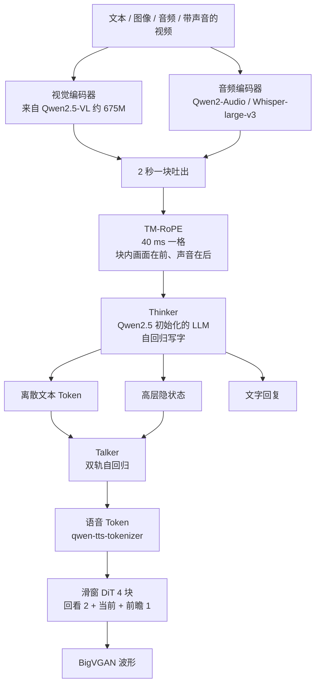
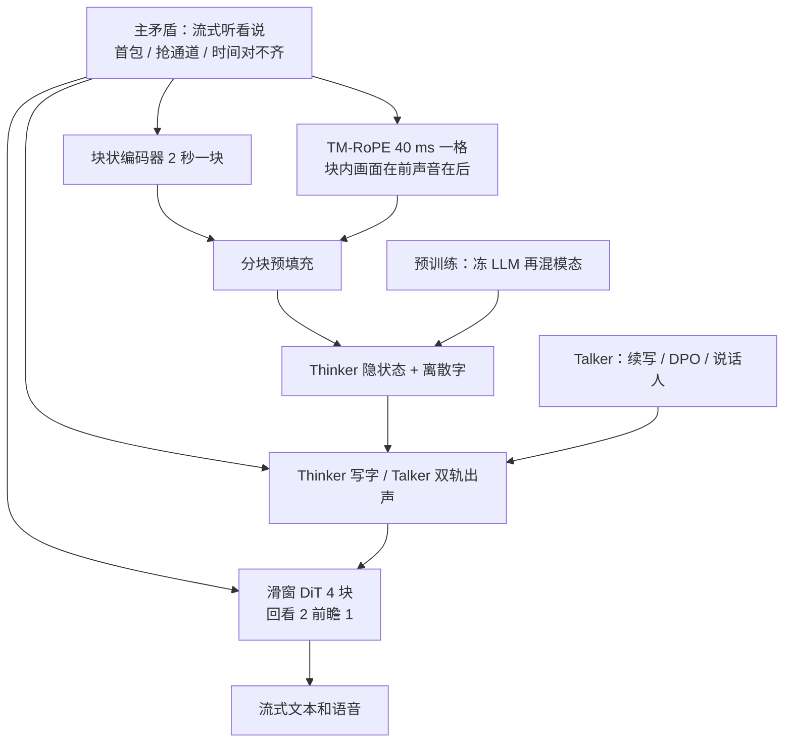

# Qwen2.5-Omni：听、看、说要同时流，写字和出声不能抢同一条通道

<!-- release-date: 2025-03-26 -->

> 本文依据 Qwen Team（阿里云）发布的 **Qwen2.5-Omni Technical Report**，即 arXiv:2503.20215，封面页眉日期 2025-03-27，共 20 页。页码均指这份 PDF 自身页码。封面水印为 `arXiv:2503.20215v1 [cs.CL] 26 Mar 2025`。截至 2026-09-11 核验，arXiv 当前只有这一版，本地原件即该版，没有换过 PDF。全文会区分三件事：报告明确写了什么、我们如何解释它、哪些是外部资料补充。凡是外部补充都会给出链接并明确标注。
>
> 这篇文章讲的是对外开源的 Qwen2.5-Omni 家族。评测表几乎全部写的是 7B；3B 不在这份报告里，是后来才开源的。`release-date` 取该家族最早向公众开放使用的官方事件：**2025-03-26**，依据是 [GitHub `QwenLM/Qwen2.5-Omni` 的 News](https://github.com/QwenLM/Qwen2.5-Omni) 写明当日发布，并在 Qwen Chat 上提供实时交互；同日 Hugging Face `Qwen/Qwen2.5-Omni-7B` 出现权重文件提交。3B 不是同日，见文末。
>
> **同方向边界**：后作 [Qwen3-Omni](/reports/Alibaba/Qwen3-Omni) 与 [Qwen3.5-Omni](/reports/Alibaba/Qwen3.5-Omni) 已发布。本文是 Thinker–Talker 的出处。对照「后来改了什么」只到方法粒度，**不把后作的延迟、参数量或基准分写进本文实验**。

## 全模态要同时流，卡在三件事上

把一个语言模型做成「也能听、也能看、也能说」，而且用户还不等整段音视频播完、模型也不等整段文字写完才开口，工程上会同时撞上三堵墙。

报告把这三堵墙写在引言里（PDF p.2）：

1. **编码器若等整段音频或视频才输出，首包就慢。** 一段三十秒的说话、一段带声音的视频，如果必须全部编码完，语言模型才能开始预填充，用户听到的第一声一定晚。
2. **文本和语音若抢同一条自回归通道，会互相干扰。** 写字要在词表上选下一个词，出声要在语音编码上选下一个声学 Token。两条目标挤在同一套权重、同一条生成链上，训练会互相拽。
3. **视频时间和音频时间对不齐。** 画面按帧走，声音按采样点走，帧率还不一定固定。没有一条共同的时间尺，模型就不知道「这句话是画面里哪一秒说的」。

所以这份报告真正要回答的，不是「能不能把四种模态塞进一个模型」，而是一句更具体的话：

> **全模态能不能一边按块听和看，一边把声音和画面钉在同一根时间轴上，并且让写字和出声走两条生成链、互不抢道？**

报告的主张是：Qwen2.5-Omni 用块状编码器做流式输入，用 TM-RoPE 加 2 秒交错对齐音视频，用 Thinker–Talker 把文本和语音拆开，再用限制感受野的滑窗 DiT 把第一包音频提前。性能上，它声称与同尺寸 Qwen2.5-VL 相当、强于 Qwen2-Audio、OmniBench 达到当时最好，语音指令跟随在 MMLU 和 GSM8K 上接近文本输入（PDF p.1–2）。这些话是不是都被表撑住，后面会逐项回表。

## 读前先认这些词

后面会反复出现这些名字。第一次读只要记住括号前的人话。

- **全模态（omnimodal）**：一个模型直接吃文本、图像、音频、带声音的视频，并且能直接吐出文本和语音，中间不靠外挂的语音识别或语音合成服务拼接。
- **Thinker 与 Talker**：模型分成两个部件。Thinker 像大脑，负责理解和思考、生成文字；Talker 像嘴巴，负责把 Thinker 的内部状态变成可以播放的语音 Token。这套分工是这份报告提出来的（PDF p.2–3）。
- **双轨自回归（dual-track autoregressive）**：Talker 不是只吐语音。它同时在两条轨道上往前走：一条出文本 Token，一条出语音编码 Token。报告写明这个结构的动机来自 Mini-Omni（PDF p.3）。
- **TM-RoPE（Time-aligned Multimodal Rotary Position Embedding，时间对齐的多模态旋转位置编码）**：给文本、音频、图像、视频发位置编号的方法。它把位置拆成时间、高度、宽度三个分量，并让时间编号对应真实的 40 毫秒一格。报告正文也写成 TMRoPE（PDF p.1、4）。
- **块状编码与分块预填充（block-wise encoding / chunked prefilling）**：音频和视觉编码器不要看完整段才吐结果，而是沿时间按块输出，好让后面的语言模型可以边收边算。
- **滑窗 DiT（sliding-window Diffusion Transformer）**：把语音 Token 变成波形的那一级。它不是看全部历史，而是只看附近几块，用来压第一包延迟。报告里的实现是流匹配（Flow Matching）加改进的 BigVGAN（PDF p.5）。
- **首包延迟（initial package delay / first-packet latency）**：从输入送进系统，到第一段可以播放的音频出来，中间经过的时间。这份报告列了四个来源，**没有给出毫秒数**（PDF p.5）。
- **qwen-tts-tokenizer**：报告自己做的语音编码器，把一段声音压成离散 Token，供 Talker 生成、再解码成波形（PDF p.5）。

## 一句话先说清

Qwen2.5-Omni 不是把一个语言模型接上语音识别和语音合成。

它做的事情是：用 Qwen2.5 当 Thinker 的初始化，接上 Qwen2.5-VL 的视觉编码器和从 Whisper-large-v3 初始化的 Qwen2-Audio 音频编码器；输入侧按 2 秒一块往外吐，位置编号按 40 毫秒一格把声音和画面交错排好；Thinker 只负责写字，Talker 吃 Thinker 的隐状态和抽出来的字，双轨自回归出语音 Token；最后用感受野只有 4 块的滑窗 DiT 把 Token 变成波形。

评测表里出现的开源对象几乎全是 **Qwen2.5-Omni-7B**（PDF p.8–13）。报告没有写 Talker 自己有多少参数，也没有写它是不是稠密模型，只写它是双轨自回归的 Transformer 解码器（PDF p.3）。视觉编码器写明大约 6.75 亿参数（PDF p.4）。

所以这篇最值得记住的，不是某个缩写，而是一句结构判断：

> **流式全模态的关键，不是把所有模态塞进同一条自回归，而是让感知按块走、时间用同一把尺、写字和出声各走各的通道。**

## 报告地图

按原报告章节把主张、数字和图表先摊开。后面每一节都从这张表回到 PDF。

| 原报告位置 | 页码 | 要记住的东西 |
|---|---|---|
| Abstract / Figure 1 | p.1 | 端到端全模态；块状编码；TM-RoPE；Thinker–Talker；滑窗 DiT；与 Qwen2.5-VL 相当、强于 Qwen2-Audio；OmniBench；语音指令跟随接近文本 |
| §1 引言 | p.2 | 三个关键因素：联合训练与音视频同步、输出互不干扰、实时理解与低首包 |
| Figure 2 / §2.1 | p.3 | Thinker 像脑、Talker 像嘴；Talker 双轨自回归，直接吃 Thinker 高维表示 |
| Figure 3 / §2.2 | p.4 | 16 kHz / 128 通道梅尔谱 / 40 ms 一帧；视觉约 675M；TM-RoPE 40 ms 一格；音视频每 2 秒交错 |
| §2.3 | p.4–5 | Thinker 写字；Talker 同时吃高维表示和离散文本 Token；qwen-tts-tokenizer |
| Figure 4 / §2.4 | p.5 | 音频编码器改成 2 秒块注意力；DiT 感受野 4 块（回看 2、前瞻 1） |
| §3 | p.6 | 预训练三阶段；S2 额外 800B 图像视频 + 300B 音频 + 100B 带声音视频；长度 8192 → 32768 |
| §4 | p.6–7 | ChatML；Thinker 指令微调；Talker 三段：续写、DPO、多说话人微调 |
| Table 1–4 / §5.1.1–5.1.2 | p.8–10 | 文本；音频；语音指令跟随 |
| Table 5–8 / §5.1.3–5.1.5 | p.11–12 | 图像、视觉定位、视频、OmniBench |
| Table 9–10 / §5.2 | p.13 | 零样本与单说话人语音生成 |
| §6 | p.12–13 | 结论；点名视频 OCR 和音视频协同理解仍弱 |

## 先看全景：四件事怎样接成一条流水线

这是按 Figure 2 到 Figure 4 重画的机制示意图，不是训练时间线，也不是实测延迟（PDF p.3–5）。

有三点先立住，后面反复会用到。

第一，**Thinker 和 Talker 是一起训、一起推的一个模型**，不是级联的两个服务。Talker 直接拿 Thinker 的高维表示，并共享 Thinker 的全部历史上下文（PDF p.3）。

第二，**报告评测的开源对象是 7B**。所有主表的列名都是 Qwen2.5-Omni-7B。3B 不在这份 PDF 里。

第三，**这份报告几乎没有 infra 章节**。没有 GPU 型号与数量、没有并行策略、没有训练耗时、没有首包毫秒数。它是一份「模块怎么连」的报告，不是一份「怎么跑起来」的报告。

## 三个要求，对应后面四个设计

在拆模块之前，先把它们互相拉扯的关系说清楚。后面每个设计都在回应其中一条。

### 要求一：输入必须按块走，否则第一包出不来

流式交互里，用户还在说、视频还在播，模型就要开始理解。如果音频编码器对整段做全局注意力，视觉编码器等全部帧到齐，预填充就被锁在输入结束之后。报告把这件事写成：把长序列的感知交给多模态编码器，把长序列的建模交给大语言模型，两边用共享注意力融合（PDF p.1）。

### 要求二：写字和出声必须拆开，否则训练会互相拽

同一条自回归既要选词又要选声学 Token，梯度方向并不一致。报告的说法是：必须管理不同模态输出之间的干扰，确保文本 Token 和语音 Token 的训练过程互不扰乱（PDF p.2）。

### 要求三：声音和画面必须在同一根时间轴上

视频有高、宽、时间，音频几乎只有时间，文本只有一维顺序。没有绝对时间，交错排在一起也只是「谁在谁前头」，不是「这是第几秒」。报告把音视频同步列为联合训练里特别重要的一条（PDF p.2）。

## 核心设计一：块状编码器，不要等整段音视频

### 旧问题：整段编码把首包锁死

普通音频编码器习惯对整条波形做全局注意力。一段 30 秒的话，模型必须听完才开始想。视觉侧如果也等全部帧到齐，带声音的视频更慢。报告把首包延迟拆成四项（PDF p.5）：

1. 多模态输入处理的延迟；
2. 从收到第一个文本，到吐出第一个语音 Token 的延迟；
3. 把第一段语音变成音频的延迟；
4. 模型规模、FLOPs 这类架构固有延迟。

第一项就是编码器能不能按块吐。

### 新设计：沿时间做块注意力，好接分块预填充

分块预填充（chunked prefilling）是现代推理框架里常见的机制。为了让它在多模态交互里用得上，报告改了音频和视觉编码器，让它们沿时间维度支持块状注意力（PDF p.5）。

音频侧：

- 输入重采样到 16 kHz，做成 128 通道梅尔谱，窗长 25 ms、跳步 10 ms（PDF p.4）。
- 编码器来自 Qwen2-Audio，初始化用 Whisper-large-v3，让每一帧音频表示大约对应原信号的 40 ms（PDF p.4、6）。
- 注意力从「看完整段音频」改成「每 2 秒一块」（PDF p.5）。

视觉侧：

- 编码器来自 Qwen2.5-VL，是大约 6.75 亿参数的 Vision Transformer，图像和视频混着训（PDF p.4）。
- 训练和推理用 Flash Attention；一个简单的 MLP 把相邻 $2\times 2$ 个 Token 合成一个；patch 大小 14，不同分辨率的图像可以打进同一条序列（PDF p.5）。
- 视频用动态帧率采样，尽量保信息，同时跟音频采样率对齐；静图被当成两帧完全相同的画面（PDF p.4）。

人话就是：编码器不再是「整段看完再交卷」，而是「每两秒交一次卷」。语言模型可以在第二秒还没到的时候，先消化第一秒。

### 收益、代价与没写清的地方

收益写在抽象里：这种分工把长序列感知交给编码器，把长序列建模交给 LLM，再用共享注意力做融合（PDF p.1）。

代价也很具体：

- 2 秒是一个硬切块。块边界会切断刚好跨在两秒之间的音素或动作。后面 TM-RoPE 用交错排列缓解时间对齐，但切块本身还在。
- 报告没有写块与块之间是否重叠、推理时不足 2 秒的尾巴怎么补。
- 视觉动态帧率的上限、下限、每秒抽几帧，正文都没写。

### 对自己项目的用处

流式系统里，编码器的注意力形状必须和上线时的可见范围一致。训练时如果一直看完整段，推理时按 2 秒切，那每一块都是分布外输入。2 秒这个数字不必照抄，但「训练可见性和部署可见性对齐」这一条可以原样搬走。

## 核心设计二：TM-RoPE，用 40 毫秒一格把声音和画面钉在同一根时间轴上

### 旧问题：一维位置只管「谁在谁前头」，不管「这是第几秒」

普通 RoPE 给每个 Token 一个一维位置。图像有高和宽，视频还有时间，音频的时间是连续的。如果只按拼接顺序编号，一段 2 秒的视频画面和对应的 2 秒声音，在序列里可能前后相邻，模型却不知道它们发生在同一秒。

### 新设计：把旋转位置拆成时间、高、宽，时间对齐到绝对的 40 ms

TM-RoPE 是带绝对时间的多模态旋转位置编码（M-RoPE）（PDF p.4）。它把原来的旋转嵌入拆成三个分量：时间、高度、宽度。

四种模态的编号规则不同（PDF p.4）：

| 模态 | 时间 ID | 高度 / 宽度 ID | 实际效果 |
|---|---|---|---|
| 文本 | 三个分量共用同一个位置 ID | 同左 | 退化成一维 RoPE |
| 音频 | 三个分量仍用同一组 ID，再叠加绝对时间，每个时间 ID = 40 ms | 同左 | 位置既编码顺序，也编码真实时刻 |
| 图像 | 全部视觉 Token 共用一个常数时间 ID | 行、列决定高、宽 | 一张图内部有二维结构，没有时间流 |
| 音视频流 | 音频每 40 ms 一个时间 ID；视频帧按真实时间戳动态对齐到同样的 40 ms 一格 | 视频帧的高、宽与静图相同 | 声音和画面在同一根时间轴上对齐 |

多模态拼在一起时，后一个模态从「前一个模态最大位置 + 1」开始编号，避免冲突（PDF p.4）。

40 ms 不是随便选的。音频编码器一帧大约就是 40 ms（PDF p.4）。输入音频的帧长和位置编码的时间格是同一把尺。

### 2 秒交错：同一窗口里，画面在前、声音在后

只有绝对时间还不够。报告还有一个专门给「带声音的视频」的排列法，叫时间交错（time-interleaving）（PDF p.4）：

1. 按真实时间把音视频表示切成每 2 秒一块；
2. 每一块里，视觉表示放前头，音频表示放后头；
3. 一块接一块交错排下去。

Figure 3 把这件事画成一条时间轴：每 2 秒一个窗口，窗口内先是带 $(t,h,w)$ 的视觉网格，再是时间 ID 相同的音频点（PDF p.4）。模型因此可以在同一个 2 秒窗口里同时看到画面和声音，而不是先把全部视频看完再听全部音频。

### 收益、代价与没写清的地方

收益是概念上的：排序问题和绝对时间问题被拆开了。文本继续用一维 RoPE；图像用二维网格；音视频用 40 ms 的绝对时间对齐。

代价和缺口：

- 2 秒切块仍然在。交错缓解的是块内音画对齐，不是块边界切断。
- 报告没有 TM-RoPE 的消融：有绝对时间 vs 没有、交错 vs 不交错，哪张表好了多少，完全没有。
- 视频动态帧率怎么映射到 40 ms 一格，只写「按每帧实际时间调整时间 ID」，没有公式。

### 对自己项目的用处

多模态位置编码里，「排序」和「绝对时间」最好不要由同一组一维编号同时承担。时间格最好与编码器帧长相同。切块大小一旦定死，流式输入就要靠切块拼接——这是后作会继续改的地方，但就这份报告而言，40 ms 一格加 2 秒交错已经把问题说清楚了。

## 核心设计三：Thinker 写字，Talker 双轨出声

### 旧问题：文本和语音挤在同一条自回归上

如果一个解码器既要写「今天天气不错」，又要发出对应的声音，它每一步都在两套词表之间做选择。报告认为，输出模态之间会互相干扰，文本 Token 和语音 Token 的训练会搅在一起（PDF p.2）。

级联系统（ASR → LLM → TTS）能避开这条通道冲突，但跨模态推理弱、延迟叠、系统复杂。报告要的是端到端，又不要两条输出抢道。

### 新设计：一个脑、一张嘴，端到端一起训

Thinker–Talker 的比喻是报告自己写的（PDF p.3）：

- **Thinker 像大脑**：处理文本、音频、视频，生成高层表示和对应文字。它是一个 Transformer 解码器，外面挂着音频编码器和视觉编码器。
- **Talker 像嘴巴**：流式地接过 Thinker 产出的高层表示和文字，往外吐离散的语音 Token。

Talker 被设计成**双轨自回归的 Transformer 解码器**，动机来自 Mini-Omni（PDF p.3）。训练和推理时，它直接接收 Thinker 的高维表示，并共享 Thinker 的全部历史上下文。所以整套系统按一个模型做端到端训练和推理（PDF p.3）。

报告没有写 Talker 的层数、隐维度、是否稠密。能写进正文的只有：它是双轨自回归 Transformer 解码器，输出语音 Token。

### 为什么 Talker 既要隐状态，又要抽出来的字

这是本节最值得停下来看的一句。Talker 同时接收两样东西（PDF p.4–5）：

1. Thinker 的高层连续表示；
2. Thinker 已经采样出来的离散文本 Token 的嵌入。

原因分成两层，都是报告原话的意思：

- 流式语音必须在整段文字写完之前，就能预判语气和态度。高层表示里有这些还没写成字的信息，所以第一声可以更自然（PDF p.5）。
- 高层表示主要表达的是**语义相似**，不是**语音相似**。两个读音完全不同的词，向量可能很近。没有离散 Token，Talker 会在发音上犯错（PDF p.5）。

人话就是：隐状态告诉嘴巴「现在该用什么口气」，字告诉嘴巴「这个词到底怎么念」。少一样都会出问题。

语音和文本**不需要**词级或时间戳级对齐。报告认为这大大简化了训练数据和推理过程（PDF p.5）。Talker 收到信息之后，开始同时自回归生成音频 Token 和文本 Token（PDF p.5）。双轨的「另一条轨道」就是这条文本轨。

语音编码本身叫 **qwen-tts-tokenizer**：它把语音的关键信息压成离散 Token，再通过一个因果音频解码器流式还原（PDF p.5）。下一节的滑窗 DiT 就是这条解码链的实现。

### 工作机制：一个字、一串声音怎么从 Thinker 走到喇叭

把时间拉成一条流水线：

1. 视觉 / 音频编码器按 2 秒一块吐出表示，Thinker 用 TM-RoPE 把它们和文本排好。
2. Thinker 自回归写字，同时把隐状态留给 Talker。
3. Talker 看到这些隐状态、已经采样的文本 Token、以及自己那条语音轨道上已经生成的 Token。
4. Talker 双轨往前走，一边对齐文本，一边吐出语音 Token。
5. 滑窗 DiT 把 Token 变成梅尔谱，BigVGAN 再变成波形。

Figure 2 把 Talker 画在 Thinker 上头：下面是视觉 / 音频隐状态和采样出来的文本，上面是 codec Token，最顶上是流式 codec 解码器（PDF p.3）。

### 收益、代价与边界

收益写在结构选择里：写字和出声各有一条生成链，训练目标不再挤在同一个词表上；Talker 又能提前看到「还没写成字的口气」。

代价是系统变成了两条生成链。Thinker 的文字和 Talker 的语音都要预填充。报告把「从收到第一个文本到吐出第一个语音 Token」单独列为首包的第二项（PDF p.5），说明这两段在关键路径上是串着的。

边界也清楚：

- Talker 取 Thinker 哪一层、如何对齐到 Talker 的隐藏维度，正文没写。
- 双轨里文本轨和语音轨如何共享注意力、两条轨道的长度比是多少，没有公式。
- qwen-tts-tokenizer 的码本大小、帧率、量化层数，报告没给。

### 对自己项目的用处

如果系统既要可审核的文字，又要可播放的声音，不要强迫一个自回归头同时选词和选声学编号。把「在想什么」和「嗓音是什么样」拆开之后，还要再问一次：语音解码器能不能只看字？这份报告的答案是不能——口气在连续隐状态里，读音在离散 Token 里，两样都要。后作会改掉「吃连续文本表示」这一条，但就本代而言，同时喂隐状态和字，是它给出的流式自然度方案。

## 核心设计四：滑窗 DiT，用有限感受野换第一包

### 旧问题：整段扩散听起来稳，第一声一定晚

把语音 Token 变成波形，常见做法是让扩散模型看一块甚至整段上下文再生成。块越大，音色和韵律越稳；用户等到的第一包也越晚。报告把「把第一段语音变成音频」列为首包的第三项（PDF p.5）。

### 新设计：只看附近 4 块，流匹配出梅尔谱，再交给 BigVGAN

报告用流匹配的 DiT，把输入的语音编码变成梅尔谱，再用改进的 BigVGAN 把梅尔谱还原成波形（PDF p.5）。为了流式、尤其是长序列，它加了一个滑窗块注意力：当前 Token 只能看有限上下文。

Figure 4 把注意力掩码画成三色格子：过去块、当前块、未来块（PDF p.5）。正文把窗口写死了：

- 相邻的编码被打成块，块就是注意力掩码的单位；
- DiT 的感受野限制为 **4 块**；
- 其中回看 2 块、前瞻 1 块（加上当前块，正好 4 块）（PDF p.5）。

解码时按块用流匹配生成梅尔谱，保证每一块都能看到必要的上下文块。BigVGAN 本身感受野固定，也用同一套按块往前走的方法做流式波形（PDF p.5）。

### 前瞻 1 块意味着什么

这是我们从报告数字里读出来的结构后果，不是报告自己写的延迟表。

回看 2 块，是为了让当前声音接得上刚才的音色和韵律。前瞻 1 块，是为了让当前块在生成时能看到「下一小段会怎么走」，音质更稳。但前瞻不是免费的：第一包在结构上要等下一块 codec Token 到齐，才能开始合成当前块。报告说限制感受野是为了降低初始包延迟（PDF p.1、5），相对的是「看全部历史」的 DiT，不是「完全不看未来」。

块有多大、一块对应多少毫秒，报告没写。所以这里只能讨论块数，不能换算成时间。

### 收益、代价与没写清的地方

收益是流式：不必等整段语音 Token 到齐再扩散；长序列时感受野也不跟着线性涨。

代价：

- 4 块窗口之外的韵律、气息接不上。很长的一句话，远处的语气只能靠 Talker 的 Token 本身带着，DiT 看不见。
- 前瞻 1 块把「立刻出声」打了折扣。
- 没有消融：窗口 4 vs 2 vs 全上下文，WER 或主观自然度差多少，表里没有。

### 对自己项目的用处

波形解码器如果要流式，先问它到底要不要看未来。看未来，音质往往更好，第一包一定更晚。窗口写成「回看 $L$、前瞻 $R$」比写成「滑窗大小 $W$」更有用，因为 $R$ 才是首包的结构下限。块的物理时长必须公开，否则这个下限换算不成毫秒。

## 流式如何接成一条能开口的系统

四个设计不是并排摆着的，它们按时间顺序咬在一起。

这是按 §2.4 的四项延迟来源重画的关键路径，不是实测时间轴（PDF p.5）。

对应关系：

| 首包的来源 | 报告用什么压它 |
|---|---|
| 多模态输入处理 | 音频 2 秒块注意力；视觉按时间块输出 |
| 第一个文本到第一个语音 Token | Thinker 边写边把隐状态交给 Talker，Talker 不必等整段文字 |
| 第一段语音变成音频 | 滑窗 DiT，感受野只有 4 块 |
| 模型规模与 FLOPs | 正文只点名，没有给 7B 的算力或延迟数字 |

报告写「本文随后会讨论这四个维度上的算法与架构改进」（PDF p.5），实际上 §2.4 就是这些改进，后面没有延迟表。所以「流式」在这份报告里是结构主张，不是测出来的毫秒。

## 数据与训练：先冻住 LLM，再把四种模态混进去

### 预训练三阶段

Qwen2.5-Omni 的预训练分三段（PDF p.6）：

1. **锁住 LLM**，只训视觉编码器和音频编码器，用大量音频–文本、图像–文本对，让编码器学会跟这个已经会说话的 LLM 对齐。
2. **解开全部参数**，用更广的多模态数据做更完整的学习。
3. **把序列长度拉到 32k**，加入长音频、长视频，提高复杂长序列理解。

初始化写得很清楚（PDF p.6）：

- LLM 来自 Qwen2.5；
- 视觉编码器与 Qwen2.5-VL 相同；
- 音频编码器初始化自 Whisper-large-v3。

两个编码器在冻住的 LLM 上**分开训**，而且都是先训各自的适配器，再训编码器本身（PDF p.6）。报告认为这一步是在建立视觉–文本、音频–文本的核心对应关系。

第二阶段的增量数据写了三个数字（PDF p.6）：

- 额外 8000 亿 Token 的图像和视频相关数据；
- 额外 3000 亿 Token 的音频相关数据；
- 额外 1000 亿 Token 的「视频带音频」相关数据。

纯文本被单独点了一句：它对保持和提升语言能力至关重要（PDF p.6）。但纯文本有多少 Token，没写。前两阶段最大长度限制为 8192，第三阶段扩到 32768（PDF p.6）。报告只说实验结果「对长序列有显著提升」，没有给长序列基准的对照表。

提示词把层级标签换成自然语言，做法跟随 Qwen2-Audio，目的是泛化和指令跟随（PDF p.6）。

### 后训练：Thinker 一段，Talker 三段

数据格式是 ChatML。报告给了一段带视频的多轮例子：用户先问视频里的人在说什么，模型用文字转述；再问「请描述你面前的人」，模型根据画面描述外貌和房间（PDF p.6）。例子本身有点跳（第一轮答成了海绵宝宝），它要展示的是格式，不是这道题的质量。

**Thinker** 的后训练只有一段话：用 ChatML 指令数据做指令微调，数据包含纯文本对话、视觉对话、音频对话和混合模态对话（PDF p.6）。没有数据量、没有强化学习。

**Talker** 是三段（PDF p.7）：

1. **上下文续写 / 情境学习（ICL）**。除了和 Thinker 类似的文本监督，还在大量「多模态上下文 + 口语回答」的对话上做 next-token prediction。Talker 学的是从语义表示到语音的单调映射，以及韵律、情感、口音这些上下文相关的属性。同时做音色解耦，避免模型把某个少见的文本模式绑死在某个嗓音上。
2. **DPO**。预训练数据覆盖说话人和场景时，不可避免带标注噪声和发音错误，模型会幻觉。报告把这一段也写成强化学习。对每个请求、回答文本和参考语音，构造三元组 $(x, y_w, y_l)$，按词错误率（WER）和标点停顿错误率打分，好样本 $y_w$、坏样本 $y_l$。目标函数就是标准 DPO（PDF p.7，式 1）：

$$
\mathcal{L}_{\mathrm{DPO}}(P_\theta; P_{\mathrm{ref}})
=
-\mathbb{E}_{(x,y_w,y_l)\sim D}
\left[
\log\sigma
\left(
\beta\log\frac{P_\theta(y_w\mid x)}{P_{\mathrm{ref}}(y_w\mid x)}
-
\beta\log\frac{P_\theta(y_l\mid x)}{P_{\mathrm{ref}}(y_l\mid x)}
\right)
\right]
$$

3. **多说话人指令微调**。在上述基座上做说话人微调，让 Talker 学会指定嗓音，并提升自然度。

### 这套 recipe 里没写、因而不能当图纸用的

- 各阶段的硬件、步数、学习率、批量；
- 第一、第三阶段的 Token 量，以及第二阶段纯文本的量；
- Thinker 后训练有没有拒绝采样或强化学习；
- DPO 的 $\beta$、成对数据规模、参考模型是谁；
- 音色解耦具体怎么做。

能搬走的是阶段划分，不是超参。

## 实验怎么证明：把摘要里的四句话全部回表

摘要和关键特征里有几句硬的性能声称（PDF p.1–2）。下面按原表核对，不把后作数字掺进来。

### 声称一：文本能力处在同尺寸 7B 之间

Table 1 把 Qwen2.5-Omni-7B 放进纯文本 7B+ 对照（PDF p.8）。报告自己的总结是：成绩大体落在 Qwen2-7B 和 Qwen2.5-7B 之间，多数任务好于 Qwen2-7B。

| 数据集 | Gemma2-9B | Llama3.1-8B | Qwen2-7B | Qwen2.5-7B | Qwen2.5-Omni-7B |
|---|---:|---:|---:|---:|---:|
| MMLU-Pro | 52.1 | 48.3 | 44.1 | **56.3** | 47.0 |
| MMLU-redux | 72.8 | 67.2 | 67.3 | **75.4** | 71.0 |
| LiveBench$_{0831}$ | 30.6 | 26.7 | 29.2 | **35.9** | 29.6 |
| GPQA | 32.8 | 32.8 | 34.3 | **36.4** | 30.8 |
| MATH | 44.3 | 51.9 | 52.9 | **75.5** | 71.5 |
| GSM8K | 76.7 | 84.5 | 85.7 | **91.6** | 88.7 |
| HumanEval | 68.9 | 72.6 | 79.9 | **84.8** | 78.7 |
| MBPP | 74.9 | 69.6 | 67.2 | **79.2** | 73.2 |
| MultiPL-E | 53.4 | 50.7 | 59.1 | **70.4** | 65.8 |
| LiveCodeBench$_{2305-2409}$ | 18.9 | 8.3 | 23.9 | **28.7** | 24.6 |

读表时有两件事要分开。

被表撑住的：相对 Qwen2-7B，MMLU-Pro、MMLU-redux、MATH、GSM8K、MBPP、MultiPL-E、LiveCodeBench 确实更高（PDF p.8）。加了听和看之后，文本没有掉回 Qwen2。

说得过满的：每一个数字都低于 Qwen2.5-7B。GPQA 30.8 还低于 Qwen2-7B 的 34.3。所以「同尺寸文本能力很强」成立的参照物是 Qwen2-7B，不是它自己的文本底座 Qwen2.5-7B。全模态在文本上交了一笔税，这份表把税额写出来了。

### 声称二：音频强于 Qwen2-Audio，若干任务达到当时最好

Table 2–3 是音频理解（PDF p.9–10）。下面只抽同门对照和报告自己加粗的位置。

**自动语音识别，数字是词错误率，越低越好（PDF p.9）：**

| 数据集 | Qwen2-Audio | Qwen2.5-Omni-7B | 表中更好的别人 |
|---|---|---|---|
| Librispeech dev-clean / other / test-clean / other | **1.3 / 3.4 / 1.6** / 3.6 | 1.6 / 3.5 / 1.8 / 3.4 | Seed-ASR test-clean **1.6**、test-other **2.8** |
| Common Voice 15 en / zh / yue / fr | 8.6 / 6.9 / **5.9** / 9.6 | **7.6 / 5.2** / 7.3 / **7.5** | 粤语仍是 Qwen2-Audio 更好 |
| Fleurs zh / en | 7.5 / — | **3.0** / 4.1 | 中文与 MinMo 并列 3.0；英文 Seed-ASR **3.4** |
| Wenetspeech net / meeting | — | 5.9 / 7.7 | Seed-ASR-Chinese **4.7 / 5.7** |
| Voxpopuli-en | — | 5.8 | Llama-3-70B **5.7** |

**语音翻译 CoVoST2（BLEU，越高越好）（PDF p.9）：**

Qwen2.5-Omni-7B 为 30.2 / 37.7 / 41.4 / 29.4（en-de / de-en / en-zh / zh-en）。en-de 和 zh-en 是表中最高；en-zh 的 41.4 低于 MiniCPM-o 的 48.2 和 Qwen2-Audio 的 45.2。

**通用音频与推理（PDF p.10）：**

- Meld 情感识别 0.570，高于 Qwen2-Audio 的 0.553。
- VocalSound 0.939，与 Qwen2-Audio 并列最高。
- GiantSteps 节奏 0.88，高于 LLark-7B 的 0.86。
- MMAU Sound / Music / Speech / Avg = **67.87 / 69.16 / 59.76 / 65.60**，三项和平均都高于 Gemini-Pro-V1.5 与 Qwen2-Audio。

**VoiceBench 对话（PDF p.10）：**

平均 **74.12**，表中最高。分项：AlpacaEval 4.49（Ultravox 4.55 略高）、CommonEval 3.93（MiniCPM-o 4.15 更高）、SD-QA **55.71**、MMSU **61.32**、OpenBookQA **81.10**、IFEval 52.87（Ultravox 66.88 更高）、AdvBench **99.42**。

所以「强于 Qwen2-Audio」在 MMAU、VoiceBench 平均、Common Voice 英中法、Fleurs 中文、Meld 上成立；在 Librispeech 干净集、粤语 ASR、CoVoST2 英译中上并不成立。摘要写的是 outperform Qwen2-Audio，正文写的是 better or comparable（PDF p.1、8）。comparable 更准确。

### 声称三：语音指令跟随接近文本输入，证据是 MMLU 和 GSM8K

Table 4 把若干纯文本基准的题目转成语音，大约 90% 适合朗读的指令被用上。Qwen2.5-Omni 和 Qwen2-Audio 吃语音，Qwen2-7B 吃文本（PDF p.8、10）。

| 数据集 | Qwen2-7B（文本） | Qwen2-Audio | Qwen2.5-Omni-7B |
|---|---:|---:|---:|
| MMLU* | 69.3 | 33.2 | 65.6 |
| CEval* | 78.4 | 38.6 | 61.1 |
| IFEval* | 53.3 | 15.6 | 41.7 |
| GSM8K* | 82.3 | 18.4 | 85.4 |
| Math23K* | 92.3 | 23.0 | 87.1 |
| Math401* | 75.5 | 20.4 | 62.2 |

被表撑住的：相对 Qwen2-Audio，差距被大幅拉开。GSM8K 语音 85.4 甚至高于 Qwen2-7B 文本的 82.3；MMLU 65.6 接近 69.3。摘要点名的两个基准，确实是这张表里最接近文本的两列。

必须并排说清楚的限制：

- 对照的文本模型是 **Qwen2-7B**，不是 Qwen2.5-7B，也不是 Qwen2.5-Omni 自己的文本输入。Table 1 里 Omni 自己的文本 GSM8K 是 88.7，MMLU-Pro 是 47.0——后者和 Table 4 的 MMLU 不是同一张卷。
- CEval、IFEval、Math401 仍明显落后文本 Qwen2-7B。摘要没有提这三列。

「接近文本」成立的范围，就是摘要写出来的 MMLU 和 GSM8K，再加上相对 Qwen2-Audio 的全面领先。把它读成「语音输入已经等于文本输入」，Table 4 不支持。

### 声称四：视觉与同尺寸 Qwen2.5-VL 相当

Table 5 是图像理解（PDF p.11）。报告的原话是：与 Qwen2.5-VL-7B 相当，并在 MMMU、MathVision、MMBench-V1.1-EN、TextVQA、DocVQA、ChartQA 上好于表中其他开源全模态模型。

| 数据集 | GPT-4o-mini | Qwen2.5-VL-7B | 其他最好 | Qwen2.5-Omni-7B |
|---|---:|---:|---|---:|
| MMMU$_{val}$ | **60.0** | 58.6 | 53.9 | 59.2 |
| MMMU-Pro$_{overall}$ | 37.6 | **38.3** | — | 36.6 |
| MathVista$_{testmini}$ | 52.5 | 68.2 | **71.9** | 67.9 |
| MathVision$_{full}$ | — | **25.1** | 23.1 | 25.0 |
| MMBench-V1.1-EN$_{test}$ | 76.0 | **82.6** | 80.5 | 81.8 |
| MMVet$_{turbo}$ | 66.9 | 67.1 | **67.5** | 66.8 |
| MMStar | 54.8 | 63.9 | **64.0** | **64.0** |
| MME$_{sum}$ | 2003 | 2347 | **2372** | 2340 |
| MuirBench | — | **59.6** | — | 59.2 |
| CRPE$_{relation}$ | — | 76.4 | — | **76.5** |
| RealWorldQA$_{avg}$ | — | 68.5 | **71.9** | 70.3 |
| MME-RealWorld$_{en}$ | — | 57.4 | — | **61.6** |
| MM-MT-Bench | — | **6.3** | — | 6.0 |
| AI2D | — | 83.9 | **85.8** | 83.2 |
| TextVQA$_{val}$ | — | **84.9** | 83.2 | 84.4 |
| DocVQA$_{test}$ | — | **95.7** | 93.5 | 95.2 |
| ChartQA$_{test}$ | — | **87.3** | 84.9 | 85.3 |
| OCRBench_V2$_{en}$ | — | 56.3 | — | **57.8** |

和 Qwen2.5-VL-7B 的差大多在 1 分以内，方向有正有负。MME-RealWorld 和 OCRBench_V2 上 Omni 更高；MMMU-Pro、ChartQA、DocVQA 上 VL 更高。这张表对得上「相当」，对不上「全面超过」。

Table 6 是视觉定位（PDF p.11）。Omni 在 Refcoco 多数子集上略高于 Qwen2.5-VL-7B，ODinW 42.2 mAP 高于 VL 的 37.3、低于 Grounding DINO 的 55.0；PointGrounding 66.5 略低于 VL 的 67.3。

Table 7 是无音频视频（PDF p.12）：

| 数据集 | GPT-4o-mini | Qwen2.5-VL-7B | 其他最好 | Qwen2.5-Omni-7B |
|---|---:|---:|---|---:|
| Video-MME 无字幕 | 64.8 | **65.1** | 63.9 | 64.3 |
| Video-MME 有字幕 | — | 71.6 | 67.9 | **72.4** |
| MVBench | — | 69.6 | 67.2 | **70.3** |
| EgoSchema$_{test}$ | — | 65.0 | 63.2 | **68.6** |

无字幕的 Video-MME 略低于 VL；有字幕、MVBench、EgoSchema 高于 VL。报告说「好于或有竞争力」，这四个数字支持这个说法。

### 声称五：OmniBench 当时最好

Table 8（PDF p.12）：

| 模型 | Speech | Sound Event | Music | Avg |
|---|---:|---:|---:|---:|
| Gemini-1.5-Pro | 42.67% | 42.26% | 46.23% | 42.91% |
| video-SALMONN (13B) | 34.11% | 31.70% | **56.60%** | 35.64% |
| MiniCPM-o | — | — | — | 40.5% |
| Baichuan-Omni-1.5 | — | — | — | 42.9% |
| Qwen2.5-Omni-7B | **55.25%** | **60.00%** | 52.83% | **56.13%** |

平均 56.13，比 Gemini-1.5-Pro 的 42.91 高一截，也高于表中其他全模态模型。音乐子集 52.83 低于 video-SALMONN 的 56.60，所以「平均 SOTA」成立，「每一子集 SOTA」不成立。

引言还写了 AV-Odyssey Bench 也是当时最好（PDF p.2）。正文 §5 没有这张表，也没有数字。这句话目前只是引言主张。

### 语音生成：流式 Talker 的稳健性和自然度

Table 9 是零样本 TTS，SEED 的 test-zh / test-en / test-hard（PDF p.13）。内容一致性是 WER，越低越好。

| 模型 | WER zh / en / hard | 相似度 zh / en / hard |
|---|---|---|
| Seed-TTS$_{RL}$ | **1.00** / 1.94 / **6.42** | **0.801 / 0.766 / 0.782** |
| CosyVoice 2 | 1.45 / 2.57 / 6.83 | 0.748 / 0.652 / 0.724 |
| MaskGCT | 2.27 / 2.62 / 10.27 | 0.774 / 0.714 / 0.748 |
| Qwen2.5-Omni-7B$_{ICL}$ | 1.70 / 2.72 / 7.97 | 0.752 / 0.632 / 0.747 |
| Qwen2.5-Omni-7B$_{RL}$ | 1.42 / 2.33 / 6.54 | 0.754 / 0.641 / 0.752 |

引言写的 1.42%、2.33%、6.54% 就是 RL 之后这一行，并据此声称超过 MaskGCT 和 CosyVoice 2（PDF p.2）。对这两列成立。Seed-TTS$_{RL}$ 在 WER 和相似度上仍然全面更好。英文 WER 2.33 也高于 F5-TTS 的 1.83。

报告自己强调的增量是 ICL → RL：test-hard 从 7.97 降到 6.54，并写 RL 明显减少了注意力错位、发音错误和不当停顿（PDF p.12）。这是同一模型前后的对照，比跨系统「SOTA」更硬。

Table 10 是单说话人微调（PDF p.13）。四个说话人的中文 WER 在 1.28–1.37，接近 Human 的 1.25；英文 NMOS 四个说话人都在 4.51–4.62，Human 中文 NMOS 为 4.51。自然度是自建集上的主观分，不是公开基准。

## 限制、缺口，以及后作改了哪一类问题

### 报告自己点名的

结论写了两个常被忽略的问题：视频 OCR、音视频协同理解。作者认为要学术界和工业界一起补评测和数据（PDF p.13）。未来工作是更稳、更快，并把输出扩到图像、视频、音乐（PDF p.13）。

### 表已经显示、摘要没强调的

- 文本相对 Qwen2.5-7B 全面落后（Table 1）。
- Librispeech 干净集、粤语 ASR、CoVoST2 英译中没有超过 Qwen2-Audio 或表中最强系统（Table 2）。
- 语音指令跟随在 CEval / IFEval / Math401 上仍明显落后文本对照（Table 4）。
- OmniBench 音乐子集不是最高（Table 8）。
- AV-Odyssey 只有引言，没有表。
- 没有首包毫秒、没有消融、没有 Talker 参数量。

### 实现上没公开、不能当图纸用的

Talker 取哪一层、双轨怎么共享注意力、qwen-tts-tokenizer 的码率与码本、DiT 一块对应多少 Token 或毫秒、2 秒块是否重叠、动态帧率上下限、各训练阶段的硬件与超参、Thinker 后训练的数据量。

### 代际：后来改了什么，只到方法

后作 [Qwen3-Omni](/reports/Alibaba/Qwen3-Omni) 还在用 Thinker–Talker 这副骨架，但改了几个本报告里已经能看见张力的选择：Talker 不再吃 Thinker 的高层文本连续表示；语音侧从「双轨自回归 + 滑窗 DiT」改成多码本自回归加因果卷积，不再为音质去等一块未来上下文；两边都换成混合专家；音频编码器不再从 Whisper / Qwen2-Audio 接着用；时间轴不再切固定 2 秒块。再往后的 [Qwen3.5-Omni](/reports/Alibaba/Qwen3.5-Omni) 继续改时间轴和注意力。这些都是后作自己的问题提法。**后作的延迟、参数量和基准分不进入本文任何一张表。**

## 可迁移启发

1. **流式输入先改编码器的注意力形状，再谈语言模型有多快。** 2 秒块注意力是为了让分块预填充不是分布外输入。窗口大小可换，训练 / 推理可见范围对齐不能换。
2. **写字和出声不要抢同一张词表。** Thinker–Talker 把目标拆开，仍然端到端一起训。小模型同样用得上这个拆法，不依赖 7B。
3. **流式语音既要口气也要读音。** 连续隐状态管语气，离散 Token 管这个词怎么念。只喂其中一样，会在「还没写完就开口」或「同义不同音」上出事。
4. **时间对齐要有物理单位。** 40 ms 一格对应音频一帧，比「再加一组可学习时间嵌入」更容易检查。切块大小一旦写进系统，就会变成后作想拆掉的硬约束。
5. **波形解码器的前瞻块数就是首包的结构下限。** 把窗口写成回看 $L$、前瞻 $R$，比只写滑窗大小更可迁移。$R>0$ 时，第一包不可能等于「第一个 Token 一出来就有声」。
6. **全模态税要用同门单模态表来量。** Table 1 对 Qwen2.5-7B、Table 5–7 对 Qwen2.5-VL-7B、Table 2–3 对 Qwen2-Audio，比跨公司的 SOTA 行更有用。税额看得见，下一世代才知道该往哪补。

## 用一张图把主矛盾接回系统

这是按 §2–§4 重画的机制关系图，不是训练时间线，也不是实测延迟。

## 关键词回看

- **Thinker / Talker**：理解写字的 LLM，和把中间状态变成语音 Token 的双轨自回归解码器。这是后作继续用的骨架，出处就是这篇。
- **双轨自回归**：Talker 同时生成文本 Token 和语音 Token，不必做词级时间对齐。
- **高层表示 + 离散 Token**：口气在连续向量里，读音在采样出来的字里。
- **TM-RoPE**：时间 / 高 / 宽三分量的旋转位置编码，时间格与 40 ms 对齐。
- **2 秒交错**：带声音的视频按真实时间切块，块内画面在前、声音在后。
- **块状编码 / 分块预填充**：音频 2 秒块注意力，视觉沿时间吐块。
- **qwen-tts-tokenizer**：报告自己的语音离散编码。
- **滑窗 DiT**：流匹配 DiT 加 BigVGAN，感受野 4 块，回看 2、前瞻 1。
- **DPO 于 Talker**：用 WER 和标点停顿错误率排序的好坏语音对，压幻觉和错读。

## 最后的判断

Qwen2.5-Omni 这份报告的价值，不在于又发布了一个 7B 多模态模型，而在于它把流式全模态拆成了三个可以分开动手的问题：输入能不能按块走、写字和出声能不能拆开、声音和画面能不能用同一把时间尺。

**被实验撑住的：**

- 视觉与同尺寸 Qwen2.5-VL-7B 多数基准相差不到 1 分，视频有字幕、MVBench、EgoSchema 还更高（Table 5–7）。
- 音频在 MMAU、VoiceBench 平均、若干 ASR / 翻译子集上明显强于 Qwen2-Audio（Table 2–3）。
- OmniBench 平均 56.13，高于表中其他全模态模型（Table 8）。
- 语音 GSM8K / MMLU 接近 Qwen2-7B 文本，相对 Qwen2-Audio 的语音指令跟随是断档式领先（Table 4）。
- Talker 的 ICL → RL 把 SEED test-hard WER 从 7.97 降到 6.54（Table 9）。

**说得过满的：**

- 「与同尺寸 Qwen2.5-VL 相当」成立；「文本也很强」若拿 Qwen2.5-7B 当参照，Table 1 不支持。
- 「强于 Qwen2-Audio」不是所有 ASR / 翻译列。
- 「语音指令跟随接近文本」只在 MMLU 和 GSM8K 上接近，而且文本对照是 Qwen2-7B。
- 「OmniBench SOTA」是平均分；音乐子集不是最高。AV-Odyssey 没有表。
- 「流式 Talker 超过大多数流式和非流式系统」在 SEED 上超过了 MaskGCT 和 CosyVoice 2，没有超过 Seed-TTS$_{RL}$。

**没公开、因而不能当图纸用的：**

Talker 规模与层选取、codec 帧率、DiT 块的物理时长、首包毫秒、消融、训练硬件。这是一份结构说明，不是复现指南。

如果只记一句话：

> **流式全模态先把感知按块切开、把写字和出声拆成两条链、再用带物理单位的时间格把声音和画面钉在一起；榜单上的「相当」和「接近」，都要用同门单模态表把税额算清楚。**

## 资料与阅读边界

- 原始依据：本地 `papers/Alibaba/Qwen2.5-Omni.pdf`，Qwen2.5-Omni Technical Report，arXiv:2503.20215，封面页眉 2025-03-27，共 20 页。本文所有页码指该 PDF 自身页码。正文 1–13 页，作者与参考文献 13–20 页。
- 版本核验：[arXiv:2503.20215](https://arxiv.org/abs/2503.20215) 提交历史只有一版（2025-03-26 04:17:55 UTC，3942 KB）。本地文件 20 页，封面水印 `arXiv:2503.20215v1 [cs.CL] 26 Mar 2025`，页眉 2025-03-27，与该版一致。截至 2026-09-11，arXiv 没有更新修订，本文没有更换 PDF。
- `release-date` 依据：本文覆盖对外开源的 Qwen2.5-Omni 家族，评测与开源主体是 7B，取该家族**首次通过官方渠道向公众开放使用**的日期 **2025-03-26**。互相独立的官方事件：
  - [GitHub `QwenLM/Qwen2.5-Omni` README News](https://github.com/QwenLM/Qwen2.5-Omni) 写 `2025.03.26: We have released the Qwen2.5-Omni`，同日另一条写实时交互已在 [Qwen Chat](https://chat.qwen.ai/) 可用。
  - Hugging Face [`Qwen/Qwen2.5-Omni-7B`](https://huggingface.co/Qwen/Qwen2.5-Omni-7B) 的权重提交：`upload checkpoint` 于 2025-03-26 06:43:17 UTC，随后 `upload files` 于 07:18:43 UTC。按流程看**文件提交时间**，不用仓库 `createdAt`。
- 排除的候选日期及理由：
  - **2025-03-22**：GitHub 仓库 `created_at` 为 2025-03-22 01:43:13 UTC；HF 7B 仓 `initial commit` 为 2025-03-22 02:27:56 UTC。两者都是仓提前建好，**不构成公开可用事件**。
  - **2025-03-26 04:17:55 UTC**：arXiv 提交。论文上传不单独作为「模型可用日」；它与开源同日历日，不额外回写。
  - **2025-03-27**： [Qwen 官方博客 *Qwen2.5 Omni: See, Hear, Talk, Write, Do It All!*](https://qwenlm.github.io/blog/qwen2.5-omni/) 页面标注 March 27, 2025；RSS 为 2025-03-27 00:00:45 +0800。按「官方发布日志与官方博客不一致时取更早的日志」，News 与 Qwen Chat、HF 权重都在 2025-03-26，博客展示日不回写首发日。页眉 2025-03-27 是 PDF 生成日，同样不回写。
  - **2025-04-30**：GitHub News 写 `We have released Qwen2.5-Omni-3B`；HF [`Qwen/Qwen2.5-Omni-3B`](https://huggingface.co/Qwen/Qwen2.5-Omni-3B) 的 `upload` 在 2025-04-30 04:01:19 UTC。3B **不是同日**，晚了约五周。家族首发日仍取 7B 首次可用的 2025-03-26。3B 的任何基准分都不在这份 PDF 里，本文实验表没有使用。
- 外部补充一：上述官方博客与 [GitHub README](https://github.com/QwenLM/Qwen2.5-Omni) 用于核对开源形态（Apache 2.0、Qwen Chat / Hugging Face / ModelScope / DashScope 入口、3B 与量化变体的发布日）。HF 模型卡把 7B 检查点写成约 11B 总参数、并提供 `disable_talker()`，这些是开源实现细节，**不是报告里的参数表**，不进入上文架构数字。
- 外部补充二：Talker 的双轨动机指向 Mini-Omni（Xie & Wu, 2024），报告只把它当作结构灵感。本文没有把 Mini-Omni 的实验数字写进主表。
- 同系列后作：[Qwen3-Omni](/reports/Alibaba/Qwen3-Omni) 与 [Qwen3.5-Omni](/reports/Alibaba/Qwen3.5-Omni) 已发布。本文只在代际上指出「后来还在改 Talker 的输入、语音码本和 2 秒切块」，**没有引用后作的任何延迟、参数或基准分**。
- 同系列底座：Thinker 初始化来自 Qwen2.5，视觉编码器来自 Qwen2.5-VL，音频编码器来自 Qwen2-Audio / Whisper-large-v3。这些名字以本报告自己的句子为准；不把那些报告里的实验表倒灌进来。
- 本文中所有标注为「我们的计算」「我们的复原」「我们的判断」的内容，都不是报告原话。报告未写的实现细节一律标为未公开，没有补写。
