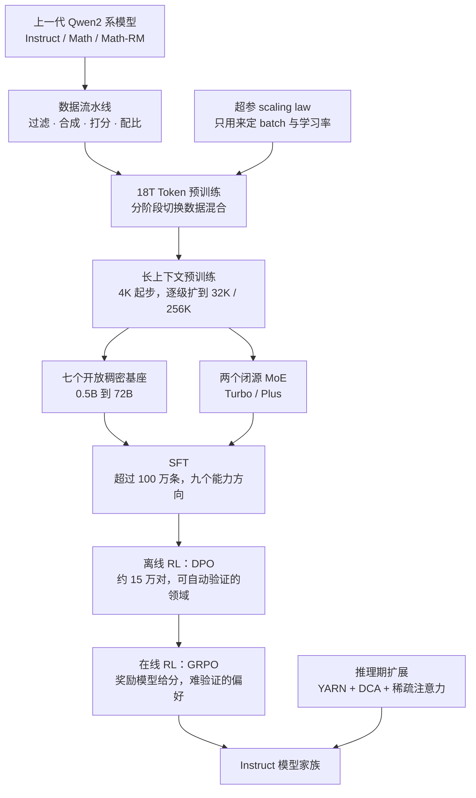
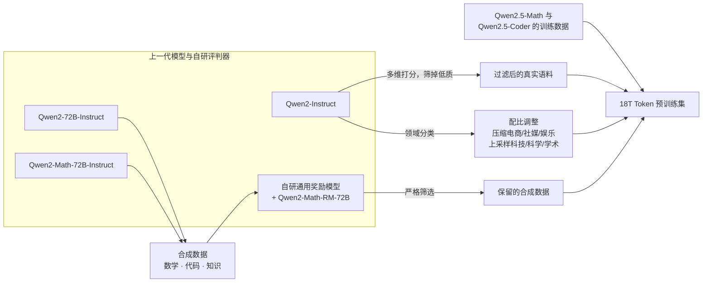
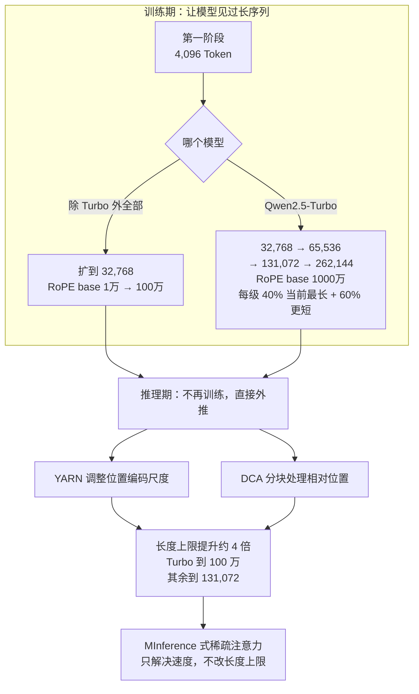
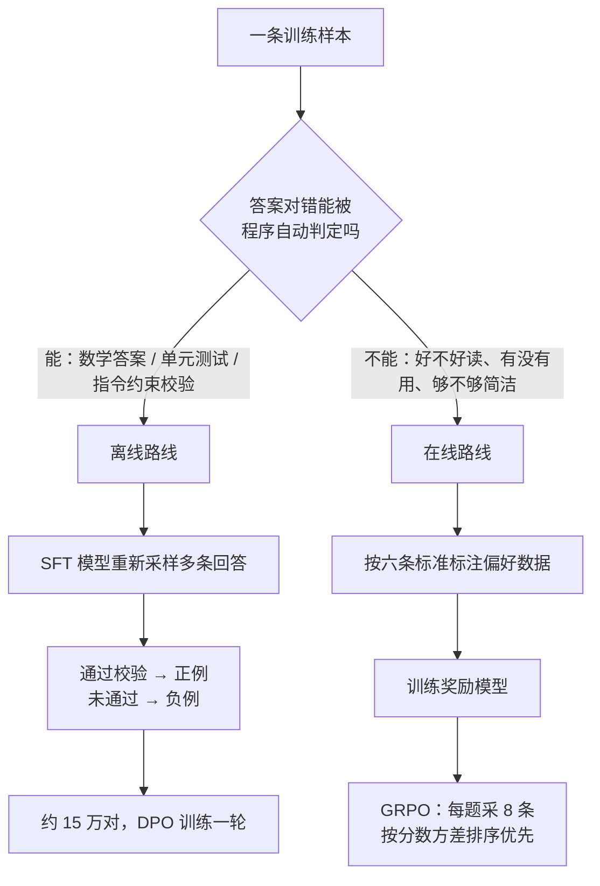

# Qwen2.5：架构几乎没动，一整代提升押在数据与后训练上

<!-- release-date: 2024-09-19 -->

> 本文依据 Qwen Team 的 **Qwen2.5 Technical Report**，即 arXiv:2412.15115v2、封面日期 2025-01-06、共 26 页的版本。据 2026-09-06 核验，arXiv 上只有 v1（2024-12-19 提交）与 v2（2025-01-03 提交）两个版本，本地原件已是最新版，没有更晚的官方修订。页码均指 PDF 本身的页码。文中会明确区分「报告写了什么」「我们怎么解释它」与「外部资料补充」三层。

## 先说最要紧的矛盾

2024 年的开放权重模型有一个很尴尬的落差：榜单分数一路涨，真拿去做产品却处处卡壳。

- 想让它写一份完整周报，它写到两千字就断了；
- 想让它吐一段 JSON 或读懂一张表，格式经常崩；
- 想找一个「够用又便宜」的中等尺寸，社区在 3B、14B、32B 这几档偏偏是空的；
- 标称支持 32K 上下文，真喂进去做检索，答案就开始飘。

这些都不是「智力不够」，而是「不好用」。

所以 Qwen2.5 要解决的问题，不是再往榜单上加几个点，而是：

> **在骨干网络几乎不动的前提下，把一代模型做成一条能覆盖各种成本档位、能真正接进产品的完整产品线。**

它给出的答案有五条线，每一条都不在模型结构里：

1. 把尺寸做成一个矩阵：七个开放稠密尺寸，加两个只走 API 的混合专家模型；
2. 把数据从 7 万亿 Token 堆到 18 万亿，而且是用上一代 Qwen2 自己当过滤器、合成器和分类器堆出来的；
3. 把 scaling law 换了个用途：不用它选模型多大，用它选学习率和批量大小；
4. 把长上下文拆成「训练期分级」和「推理期外推」两件事，不改注意力结构；
5. 把后训练按「答案好不好自动验证」分层：能自动判对错的走离线 DPO，只能靠人类偏好的走在线 GRPO。

这份报告最值得记住的判断，不是某个新组件，而是一种取舍：

> **当架构红利见顶时，一代模型的增量可以完全来自数据流水线、超参搜索方式和后训练分层，而不必发明新结构。**

它也因此暴露了这条路线的天花板——报告自己承认，用来指导整条在线 RL 的奖励模型，其榜单分数预测不了最终训出来的模型好不好。这一点我们后面单开一节讲。

## 读这篇之前，只需要六个概念

- **Token（词元）**：模型读写文本的最小单位。一个汉字、一个英文词或一个标点，都可能是一个或几个 Token。后面所有「多长」「多贵」的讨论都以它计数。
- **上下文长度与生成长度**：前者是模型一次能读进去多少 Token，后者是它一次能写出来多少 Token。两个数字互相独立，报告里也分开列。
- **稠密模型（dense）与混合专家（Mixture-of-Experts，MoE）**：稠密模型每个 Token 都把全部参数跑一遍；MoE 把前馈层换成很多个「专家」，每个 Token 只激活其中少数几个，于是总参数可以很大而单次计算不必同比变大。
- **Grouped Query Attention（GQA，分组查询注意力）**：让多个 Query 头共用一组 Key/Value，从而把推理时要缓存的 KV 显存压下来。
- **Rotary Positional Embedding（RoPE，旋转位置编码）**：用旋转角度给每个位置编码，模型据此判断词与词的相对距离。它有一个叫 base frequency 的参数，决定角度随位置变化的快慢——这是后面「长上下文外推」的关键旋钮。
- **SFT、DPO 与 GRPO**：Supervised Fine-Tuning（监督微调）是拿「问题 + 标准回答」直接教；Direct Preference Optimization（DPO，直接偏好优化）是拿「同一问题的好答案与坏答案」成对地教；Group Relative Policy Optimization（GRPO，分组相对策略优化）是让模型对同一问题采样多条回答，用组内相对好坏当训练信号。前两个可以离线准备数据，最后一个必须边训边采样。

## 先看全景：Qwen2.5 的能力是怎么攒出来的

这是根据报告第 2–4 节重画的机制示意图，不是训练时间线，也不代表各阶段算力占比。图中每一步的依据在 PDF p.2–7。

有两点先立住，后面反复会用到：

第一，**开放的七个尺寸全是稠密模型，两个 MoE 模型只走 API**（PDF p.2）。所以「Qwen2.5 是不是 MoE」这个问题没有单一答案，要看你说的是哪一档。

第二，**这份报告完全没有 infra 章节**。没有 GPU 型号与数量、没有并行策略、没有训练耗时、没有成本、没有训练框架。它是一份「做了什么」的报告，不是一份「怎么跑起来」的报告。这个缺口很大，我们最后会专门列出来。

## 第一条线：把尺寸做成矩阵，而不是发布一个旗舰

Qwen2 当时开放的是 0.5B、1.5B、7B、72B。Qwen2.5 把 3B、14B、32B 补了回来，报告给的理由是这几档「对资源受限场景更具性价比，而且在当前开放基础模型里代表性不足」（PDF p.2）。

这句话很朴素，但它解释了整份报告的产品动机：开源社区那时缺的不是更大的模型，而是刚好塞得进一张消费级显卡、或者刚好压得住推理成本的那几个中间档。

| 模型 | 层数 | Q / KV 头数 | 词嵌入共享 | 上下文 / 生成长度 | 许可证 |
|---|---:|---|---|---|---|
| 0.5B | 24 | 14 / 2 | 是 | 32K / 8K | Apache 2.0 |
| 1.5B | 28 | 12 / 2 | 是 | 32K / 8K | Apache 2.0 |
| 3B | 36 | 16 / 2 | 是 | 32K / 8K | Qwen Research |
| 7B | 28 | 28 / 4 | 否 | 128K / 8K | Apache 2.0 |
| 14B | 48 | 40 / 8 | 否 | 128K / 8K | Apache 2.0 |
| 32B | 64 | 40 / 8 | 否 | 128K / 8K | Apache 2.0 |
| 72B | 80 | 64 / 8 | 否 | 128K / 8K | Qwen |

（PDF p.3，Table 1）

这张表值得逐列看，因为它藏着几个真实的工程取舍：

**词嵌入共享（tie embedding）只出现在 3B 及以下。** 词表有 151,643 个常规 Token（PDF p.3）。输入嵌入和输出投影各需要一份「词表大小 × 隐藏维度」的矩阵。模型越小，这两块占总参数的比例越高。把它们绑成同一份权重，等于用一点表达力换回可观的参数预算。到了 7B 以上，这块占比已经不显著，绑定的收益不再划算。

**上下文长度在 3B 和 7B 之间有一道台阶：32K 对 128K。** 报告没有解释这道台阶的原因。我们只能从表面读出：小模型这一代不承诺长上下文。不要把它当成「小模型技术上做不到」，报告没写这句话。

**生成长度全线 8K。** 这是相对 Qwen2 的 2K 的四倍提升（PDF p.2），也是「Better in Use」里最直接的一条。它需要后训练专门配数据，后面 SFT 一节会讲。

**许可证不统一：3B 是 Qwen Research，72B 是 Qwen 许可证，其余五档 Apache 2.0。** 报告只在表里标了名字，没有解释理由，也没有附条款分析。落地选型时这一列往往比参数量更早卡住你。

### 两个只走 API 的 MoE：报告给了名字，没给配置

Qwen2.5-Turbo 与 Qwen2.5-Plus 是 MoE 模型，做法是把标准前馈层换成 MoE 层，采用 fine-grained expert segmentation（细粒度专家切分）与 shared experts routing（共享专家路由），沿用 Qwen1.5-MoE 的路线（PDF p.3）。

「细粒度切分」是把原本几个大专家切成更多小专家，让每个 Token 激活的组合更多样；「共享专家」是留一小撮专家对所有 Token 恒定生效，用来承载通用能力，避免每个专家都得重新学一遍常识。

然后就没有了。**报告没有给这两个模型的层数、隐藏维度、专家总数、每 Token 激活专家数、总参数或激活参数**。表 1 只覆盖开放权重模型。所以关于 Turbo 和 Plus，我们能引用的只有评测分数，不能引用架构规模。

这里有一个值得记住的对照：后来的 Qwen3 报告明确写了 MoE 有 128 个专家、每 Token 激活 8 个，并且**取消了共享专家**。也就是说，共享专家是 Qwen2.5 这一代的做法，不是 Qwen 系一以贯之的选择。这个对照来自本仓库已收录的 Qwen3 解读所依据的那份报告，不是 Qwen2.5 报告的内容。

报告里还有一处内部不一致值得指出：摘要说 Turbo 与 Plus「both available from Alibaba Cloud Model Studio」（PDF p.1），但第 2 页的脚注写 Qwen2.5-Plus 在 API 中的标识是 `qwen-plus-2024-xx-xx (to be released)`（PDF p.2）。同一份文件里，一处说已可用，一处说待发布。读这类报告时，脚注往往比摘要诚实。

### 骨干网络：几乎完全沿用 Qwen2

稠密模型保持 Transformer 解码器结构，组件是 GQA、SwiGLU 激活、RoPE、注意力里的 QKV bias、以及 pre-normalization 的 RMSNorm（PDF p.2–3）。

这一段在报告里只有三行，因为确实没什么新东西。**架构不是这一代的战场**，这本身就是结论。

唯一被展开写的改动在分词器一侧：控制 Token 从 3 个扩到 22 个，其中两个专门给工具调用，其余留给其他能力；这套词表在所有 Qwen2.5 模型间统一（PDF p.3）。

为什么值得单独说？因为「工具调用」这件事，本质是让模型学会一种新的语言边界——它要能明确地说「我现在不是在跟用户说话，我是在发起一次函数调用」。用普通文字标记这个边界，模型容易和正文混淆；用专门的控制 Token，边界在词表层面就是硬的。这是一个成本极低、收益很直接的设计。

不过报告没有列出这 22 个控制 Token 的具体内容，也没有给工具调用的格式规范。

## 第二条线：18 万亿 Token 是「用上一代造出来的」

预训练数据从 Qwen2 的 7 万亿 Token 扩到 18 万亿（PDF p.4）。但这个数字本身没什么信息量——真正的方法在于这 18 万亿是怎么攒的。

报告列了四条改进，全都依赖上一代模型（PDF p.3–4）：

这是根据 PDF p.3–4 第 3.1 节文字重画的机制示意图，箭头表示「谁生产/筛选了什么数据」，不代表数据量比例——报告没有给任何配比。

四条改进逐条看：

**（1）用 Qwen2-Instruct 当数据质量过滤器。** 报告说，相比 Qwen2 时期的做法，这一步的进步来自 Qwen2 自己就是在更大的多语言语料上训练的，所以它能做出更细致的质量判断，在多种语言上同时提高高质量数据的留存率、提高低质量样本的剔除率（PDF p.3）。

这是一个自举（bootstrapping）循环：上一代模型的语言覆盖越广，它给下一代挑数据就挑得越准；下一代覆盖更广，又能给再下一代挑得更准。这条循环很有迁移价值，但它也有一个隐患——过滤器的偏好会传给数据，数据会传给下一代模型。报告没有讨论这个正反馈风险，也没有给过滤器的评分维度、阈值或留存率。

**（2）把专项模型的数据倒灌回通用基座。** Qwen2.5-Math 和 Qwen2.5-Coder 的训练数据直接进了 Qwen2.5 的预训练（PDF p.3）。

方向和直觉相反：通常我们以为是「先有通用基座，再微调出数学/代码专项」。这里是反过来的，专项数据在预训练阶段就进来了。这也解释了后面评测里数学和代码涨得最猛的现象。

**（3）合成数据用双重门禁。** 由 Qwen2-72B-Instruct 与 Qwen2-Math-72B-Instruct 生成数学、代码、知识领域的数据，再用一个自研通用奖励模型加上 Qwen2-Math-RM-72B 做严格筛选（PDF p.3）。

关键在「双重」：生成者和评判者不是同一个模型，数学领域还额外挂了一个专用奖励模型。这比「一个模型自己生成、自己打分」稳妥得多。但报告没有给合成数据在 18 万亿里的占比，也没有给筛选通过率，所以我们无法判断合成数据的实际影响有多大。

**（4）按领域重新配比。** 用 Qwen2-Instruct 给内容分类，报告的观察是：电商、社交媒体、娱乐类内容在网页规模语料里被严重高估，且常常重复、模板化或机器生成；而科技、科学、学术研究类内容质量更高却长期被低估。于是前者下采样，后者上采样（PDF p.4）。

这条最容易被低估。**同样是 18 万亿 Token，配比不同就是两个模型。** 报告把「网页天然分布」和「训练想要的分布」明确区分开，这是数据工程里非常本质的一步。可惜同样没有公开任何具体比例。

封面 Figure 1 用一张柱状图表达了 3T（Qwen1.5-72B）到 7T（Qwen2-72B）再到 18T（Qwen2.5-72B）在 Math、MBPP、BBH、MMLU 四项上的抬升（PDF p.1）。这张图没有标数值刻度，只能读趋势，不能读幅度。图注自己也说，重点是「规模与混合共同作用」，不是单纯堆量。

### 可迁移的点

如果你手上有一个上一代模型和一堆脏数据，这套流水线基本可以照搬：**让上一代模型分别扮演打分器、分类器、生成器和评判器，把它的能力折算成下一代的数据质量。** 需要注意两件事：一是生成者与评判者尽量不同源；二是打分器的偏好会沉淀进数据，值得单独留一个不经过过滤的对照集来监控漂移。报告没有说他们做了第二件事。

## 第三条线：scaling law 换了个用途

大多数论文用 scaling law（缩放规律）回答同一个问题：给定算力预算，模型该多大、数据该多少。

Qwen2.5 用它回答另一个问题：**给定模型大小 $N$ 和数据量 $D$，最优的批量大小 $B_{opt}$ 和学习率 $\mu_{opt}$ 是多少**（PDF p.4）。

为什么这个换向有意义？因为在一个要同时发布七个尺寸加两个 MoE 的项目里，「模型该多大」根本不是自由变量——产品线已经把尺寸钉死了。真正会反复出错、反复浪费算力的，是每个尺寸都得重新试一遍学习率和批量。把这件事变成可预测的函数，等于把九次调参变成一次拟合。

实验覆盖范围是：稠密模型从 4400 万到 140 亿参数，MoE 模型激活参数从 4400 万到 10 亿，训练数据从 8 亿到 6000 亿 Token（PDF p.4）。在预测出最优超参之后，团队再把最终 loss 建模成「模型架构 + 数据规模」的函数，并用它比较不同参数量的 MoE 与对应稠密模型，从而调整 MoE 的激活参数与总参数，使其达到与特定稠密模型（如 Qwen2.5-72B 和 Qwen2.5-14B）持平的性能（PDF p.4）。

最后这句话解释了 Turbo 和 Plus 的定位是怎么定出来的：不是「先训一个 MoE 看看多强」，而是**先选定一个稠密对标物，再反推 MoE 该配多少激活参数和总参数**。这是一种目标驱动的架构搜索。

代价与边界：报告**没有给任何公式、拟合系数、实验散点图或最终选定的超参数值**。所以这一节我们只能借走方法论，无法复现。它也不能证明这套 scaling law 在 140 亿参数以上依然成立——最大的拟合点是 14B，而要指导的是 72B。报告没有讨论这个外推距离。

## 第四条线：长上下文拆成训练期和推理期两件事

Qwen2.5 处理长上下文的做法，和后来那些改注意力结构的方案完全不同。它**没有动注意力**，而是把问题拆成两段。

这是根据 PDF p.4 第 3.3 节与 p.16 第 5.2.4 节重画的机制示意图。上半部分是训练阶段，下半部分是推理阶段；两者在时间上不重叠。

### 训练期：先短后长，逐级加码

所有模型都从 4,096 Token 的上下文开始训练。除 Turbo 外的全部变体，在预训练最后阶段扩到 32,768，同时用 ABF 技术把 RoPE 的 base frequency 从 10,000 提到 1,000,000（PDF p.4）。

Turbo 则走了四级递进：32,768 → 65,536 → 131,072 → 262,144，RoPE base frequency 直接给到 10,000,000。每一级的训练数据里，40% 是当前最大长度的序列，60% 是更短的序列（PDF p.4）。

这个 40/60 的配比很关键。如果某一级全喂最长序列，模型会过度适应这个长度，短输入反而变差；掺入多数短序列，等于每次扩展都带着旧能力一起走。报告把这个效果描述为「在适应更长上下文的同时保持跨长度泛化能力」（PDF p.4）。

至于为什么要提高 RoPE base frequency：base frequency 决定位置角度随距离变化的快慢。频率越低（base 越大），角度转得越慢，同一个旋转周期能覆盖更长的距离，模型就更不容易在长序列上把远处位置「绕回」到近处。这是我们的解释，报告只写了数值变化和 ABF 这个名字，没有展开原理，也没有写 ABF 的全称。

### 推理期：不训练，直接把长度撑开

两项技术：YARN 与 Dual Chunk Attention（DCA，双块注意力）。报告称二者让序列长度容量提升四倍，使 Turbo 能处理最多 100 万 Token、其余模型处理最多 131,072 Token；并且这些方法不仅降低了长序列上的困惑度，还保持了短序列上的强性能（PDF p.4）。

注意这里的因果关系：**训练只到 32,768（Turbo 到 262,144），撑到 128K 和 1M 是推理期外推的结果。** 这意味着 Table 1 里那个「128K 上下文」不是训练出来的长度，而是外推出来的长度。后面的消融实验会让这一点变得非常具体。

这里还有一处报告内部对不上的地方，读的时候要留神：第 4 页的正文说外推让「其余模型」处理最多 131,072 Token（PDF p.4），但第 3 页的 Table 1 里，0.5B、1.5B、3B 三档标的都是 32K（PDF p.3）。长上下文评测也只覆盖了 7B 及以上（PDF p.17）。合理的读法是正文那句话说得笼统，实际按 Table 1 逐档为准——但报告没有说明这一点，我们也不替它补。

### 稀疏注意力：只管速度，不管能力

基于 MInference 做的稀疏注意力，把 100 万 Token 序列的注意力计算量降低到原来的 1/12.5，首 Token 延迟（Time To First Token，TTFT）加速 3.2–4.3 倍（PDF p.16）。

Figure 3 给出了四张对比图（PDF p.18）。按芯片和模型拆开读，加速比在 20 万 / 60 万 / 100 万 Token 三个点上分别是：

| 配置 | 200k | 600k | 1M |
|---|---:|---:|---:|
| H20 上的 Qwen2.5-Turbo-1M | 1.7 倍 | 3.1 倍 | 4.3 倍 |
| A100 上的 Qwen2.5-Turbo-1M | 1.4 倍 | 2.4 倍 | 3.2 倍 |
| H20 上的 Qwen2.5-7B | 2.3 倍 | 4.1 倍 | 5.6 倍 |
| A100 上的 Qwen2.5-7B | 1.7 倍 | 2.9 倍 | 4.0 倍 |

（PDF p.18，Figure 3，数值为图上标注的加速倍数）

有两个细节容易被漏掉：

第一，正文写的「3.2 到 4.3 倍」只对应 Turbo 那两张图在 100 万 Token 处的结果；7B 的两张图在同一位置是 4.0 倍和 5.6 倍。**正文的区间比图里的最大值保守。**

第二，加速比随长度单调上升。这符合直觉：稀疏注意力省掉的是与长度平方相关的那部分，序列越短，可省的越少。所以不要把 4.3 倍当成通用加速比——在 20 万 Token 上它只有 1.7 倍。

报告没有给这些实验的 GPU 数量、批量大小、具体稀疏模式或实现细节，也没有给稀疏注意力对精度的影响。它只出现在评测一节里，作为推理侧的补充说明。

## 第五条线：后训练按「答案能不能自动验证」分层

这是全篇设计感最强的一段。

Qwen2.5 的后训练分三步：SFT → 离线 RL（DPO）→ 在线 RL（GRPO）。报告对这个分工给了明确理由（PDF p.5）：

- **离线 RL 负责奖励模型难以评价的能力**，比如推理、事实性、指令遵循。这些领域有标准答案，但让奖励模型去打分反而不准；
- **在线 RL 负责奖励模型擅长的细微差别**，比如真实性、有用性、简洁性、相关性、无害性、去偏见。

这个划分反直觉，值得停一下。

我们习惯的说法是「难的任务交给 RL，简单的交给 SFT」。但这里的划分维度不是难易，而是另一件事——**对错能不能被程序判定**：

这是根据 PDF p.5–7 第 4 节文字重画的机制示意图，分支条件是我们对报告分工理由的归纳，不是报告原文的判定树。

为什么这样分是合理的？因为**当一条样本的对错可以被程序判定时，把它交给奖励模型是在自找麻烦**。奖励模型是学出来的近似判官，它会有偏差；而一个数学答案对不对、一段代码单元测试过不过、一条格式约束满不满足，是可以确定的。既然确定的信号已经有了，就应该直接用它构造正负例，而不是再经过一层可能出错的近似。

反过来，「这段回答是不是太啰嗦」根本没有程序判据，那才是奖励模型的用武之地。

### SFT：九个方向，超过 100 万条

报告列了九项（PDF p.5–6），我挑其中几项讲透，因为它们各自代表一种不同的数据构造思路。

**长回答：用反向翻译（back-translation）造题。** 目标是把输出长度从常见的 2000 Token 以内推到 8,192 Token。难点在于「长回答」的训练数据天然稀缺——没人会写一万字的示范答案。团队的做法是从预训练语料里找现成的长文本，**反过来给它生成一个能引出这段文本的提问**，再加上输出长度约束，最后用 Qwen2 过滤掉低质量的配对（PDF p.5）。

这个技巧很值得借走：**当「输入 → 输出」的数据难收集，而输出侧的语料天然大量存在时，就反过来从输出造输入。**

**指令遵循：让模型自己写校验代码。** 做法是让大模型同时生成指令、对应的验证代码和完整单元测试，交叉验证之后，用执行反馈做拒绝采样，筛出真正满足指令的训练数据（PDF p.5）。

这一步把「是否遵守了指令」从主观判断变成了可执行判断。比如指令是「用三个要点回答，每点不超过 20 字」，那就生成一段代码去数要点数和字数。这也正好呼应前面那条分层原则——能变成程序判据的，就别交给奖励模型。

**代码：多语言智能体协作 + 沙箱验证。** 用多个语言专用的智能体协作生成指令对，覆盖近 40 种编程语言；再用一个多语言沙箱做静态检查和自动单元测试（PDF p.5）。

**逻辑推理：新增 7 万条查询。** 覆盖选择题、判断题、开放题，训练模型使用演绎、归纳、类比、因果、统计等多种推理方式，并迭代过滤掉答案错误或推理过程有缺陷的数据（PDF p.5）。

这里要小心不要过度解读：这是**推理数据**，不是后来 Qwen3 那种「长思维链」训练。Qwen2.5 没有 thinking 模式，也没有任何思考预算机制。报告在引言里提到了 OpenAI o1 与推理时扩展（PDF p.2），并把「通过策略性扩展推理算力增强推理能力」写进了未来工作（PDF p.18）——**这一代只是看到了这个方向，没有做**。

**系统提示鲁棒性：构造数百条通用系统提示。** 目的是提高后训练里系统提示的多样性，并确保系统提示与对话内容一致；评测显示模型在不同系统提示下保持良好性能且方差降低（PDF p.6）。

**回答筛选：只留全票通过的。** 用一个专门的评论模型加上一套多智能体协作打分系统，只有被所有打分系统判为无瑕疵的回答才保留（PDF p.6）。

超参数是完整给出的：超过 100 万条 SFT 样本，训练 2 个 epoch，序列长度 32,768，学习率从 $7\times10^{-6}$ 逐步降到 $7\times10^{-7}$，权重衰减 0.1，梯度范数裁剪到 1.0（PDF p.6）。

### 离线 RL：复用同一条校验流水线

做法是拿 SFT 之后的模型，对一批新查询重新采样回答，通过质量校验的当正例，没通过的当负例，直接组成 DPO 的偏好对；再叠加人工与自动的双重复核（PDF p.6）。

这里有一个很实用的工程细节：**校验流水线是 SFT 阶段就建好的，离线 RL 直接复用**（PDF p.6）。也就是说，执行反馈和答案匹配这套设施只搭一次，先给 SFT 筛数据，再给 DPO 造偏好对。

规模是约 15 万个训练对，训练 1 个 epoch，使用 Online Merging Optimizer，学习率 $7\times10^{-7}$（PDF p.6）。

注意这个量级对比：SFT 超过 100 万条，离线 RL 只有 15 万对。**偏好数据不需要和监督数据同量级**，它做的是在已有能力上做定向纠偏，不是重新教一遍。

报告只给了 Online Merging Optimizer 的引用，没有解释它做什么、和普通优化器差在哪。这是一个未展开的实现细节。

### 在线 RL：GRPO，以及一个很妙的排序规则

奖励模型的标注遵循六条标准：真实性、有用性、简洁性、相关性、无害性、去偏见（PDF p.6–7）。查询来自公开开源数据和一批更复杂的自研查询集；回答从 SFT、DPO、RL 不同阶段的检查点采样，并用不同温度采样以增加多样性；偏好对由人工与自动共同标注，DPO 阶段的训练数据也整合了进来（PDF p.7）。

GRPO 的配置是：训练奖励模型和训练 RL 用**同一个查询集**；每个查询采样 8 条回答；全局批量 2048，每个 episode 2048 个样本（把一对查询-回答算作一个样本）（PDF p.7）。

最值得单独说的是查询处理顺序：

> 训练时查询的处理顺序，由奖励模型给出的回答分数**方差**决定，方差高的查询优先（PDF p.7）。

为什么方差高的更有价值？因为 GRPO 的训练信号来自组内相对差异。如果一个查询采样 8 条回答，奖励模型给的分几乎一样，那这组数据的相对优势接近 0，梯度贡献微乎其微——算力白花了。方差大意味着模型在这道题上「有时做得好、有时做得差」，正是最有学习空间的位置。

这条经验的可迁移性很高：**在任何基于组内比较的训练里，样本的价值取决于组内分歧程度，而不是题目难度。** 一道所有采样都做对的题和一道所有采样都做错的题，同样没有信息量。

代价是这需要先跑一遍奖励模型打分才能排序，增加了一次前向。报告没有量化这部分开销。

### 长上下文微调：为什么 RL 只在短指令上做

Turbo 的长上下文对齐分两阶段（PDF p.7）：

- 第一阶段只用短指令（每条最多 32,768 Token），数据和训练步数与其他 Qwen2.5 模型完全一致，确保短任务性能不掉；
- 第二阶段混合短指令（最多 32,768）与长指令（最多 262,144）。

RL 阶段则**只用短指令**，报告给了两条理由（PDF p.7）：

1. 长上下文任务的 RL 训练算力开销很大；
2. 目前缺少能为长上下文任务提供合适奖励信号的奖励模型。

并且团队发现，只在短指令上做 RL，仍能显著提升模型在长上下文任务上与人类偏好的对齐程度（PDF p.7）。

第二条理由比第一条更根本。**如果没有可信的奖励信号，加大 RL 投入只会更快地优化错误目标。** 与其在长上下文上训一个自己都不信的奖励模型，不如承认能力边界，赌一把对齐的跨长度泛化。报告说这个赌注赢了，但没有给对照实验来量化「短 RL 迁移到长任务」的效果幅度——这是一个观察，不是一个被隔离验证的结论。

## 实验：哪些结论站得住，哪些要打折

先说评测的公共前提：为防止测试数据泄漏，构造预训练和后训练数据时用 n-gram 匹配剔除可能被污染的样本。判据是——若存在测试序列 $s_e$，使训练序列 $s_t$ 与它的最长公共子序列同时满足两个条件，就把 $s_t$ 移除（PDF p.7）：

$$
|\mathrm{LCS}(s_t,s_e)| \ge 13
\qquad\text{且}\qquad
|\mathrm{LCS}(s_t,s_e)| \ge 0.6 \times \min(|s_t|,|s_e|)
$$

两个条件缺一不可。第一个条件设了绝对下限，避免把「的、是、在」这种短重合当成污染；第二个条件设了相对比例，要求重合部分至少占较短那条序列的 60%，避免长文档里偶然撞上一小段就被误删。这套判据沿用自 Qwen2。

报告没有公开被剔除的数据量、按 benchmark 拆分的命中情况，也没有做污染前后的对照实验。

### 基座模型：72B 的效率结论站得住，代价被写出来了

Table 2（PDF p.8）比较 70B 以上的基座。挑几个代表：

| 项目 | Qwen2-72B | Qwen2.5-72B | Llama-3-405B | Qwen2.5-Plus |
|---|---:|---:|---:|---:|
| MMLU | 84.2 | 86.1 | 85.2 | 85.4 |
| MMLU-Pro | 55.7 | 58.1 | 61.6 | 64.0 |
| MATH | 50.9 | 62.1 | 53.8 | 64.4 |
| GSM8K | 89.0 | 91.5 | 89.0 | 93.0 |
| MBPP | 76.9 | 84.7 | 73.0 | 79.7 |
| HumanEval | 64.6 | 59.1 | 61.0 | 59.1 |

（PDF p.8，Table 2）

这张表支持报告的核心效率主张：Qwen2.5-72B 用大约五分之一的参数量取得了与 Llama-3-405B 相当的成绩（PDF p.8）。数学提升尤其明显，MATH 从 50.9 涨到 62.1。

但表里也有一个反例：**HumanEval 从 Qwen2-72B 的 64.6 掉到 59.1**。同一张表里 MBPP 却从 76.9 涨到 84.7。报告正文说 Qwen2.5-72B「在几乎所有基准上都有明显提升」（PDF p.8），没有提这处回退。两个都是代码基准，方向相反，这说明「代码能力变强了」这句话本身就太粗糙——不同代码基准测的东西并不一样。

顺带一提，报告在三个地方给了三种说法：摘要说 Llama-3-405B-Instruct「大约大 5 倍」（PDF p.1）、第 8 页说「只用五分之一参数」（PDF p.8）、结论说「小六倍」（PDF p.18）。405 除以 72 约等于 5.6，三种说法都是同一个事实的不同取整。引用时用「约五分之一」最贴近原文，不要跟着结论写「六倍」。

Table 3（PDF p.9）覆盖 14B–32B 与 Turbo，Table 4（PDF p.9）覆盖 7B 档，Table 5（PDF p.10）覆盖 0.5B–3B。几个值得记的点：

- Qwen2.5-32B 的 MMLU 83.3、BBH 84.5、MBPP 84.5，普遍超过同尺寸对手（PDF p.9）；
- Qwen2.5-Turbo 的 MMLU-Pro 是 55.6，**比 Qwen2.5-32B 的 55.1 还高**，而报告称它的训练与推理成本远低于 Qwen2.5-14B（PDF p.10）。这是 MoE 成本优势最直接的一个数据点，可惜没有配套的成本数字；
- Qwen2-7B 与 Qwen2.5-7B 的非嵌入参数量都只有 65 亿，而 Gemma2-9B 是 82 亿（PDF p.10）。这个口径很重要——在小尺寸上，词嵌入占比高，用总参数量比较模型是不公平的。

### 指令模型：赢面很大，但输的那几项都很有代表性

Table 6（PDF p.11）比较 70B 以上的指令模型：

| 项目 | Qwen2-72B-Inst | Qwen2.5-72B-Inst | Llama-3.1-405B-Inst |
|---|---:|---:|---:|
| MMLU-Pro | 64.4 | 71.1 | 73.3 |
| MMLU-redux | 81.6 | 86.8 | 86.2 |
| MATH | 69.0 | 83.1 | 73.8 |
| LiveCodeBench | 32.2 | 55.5 | 41.6 |
| Arena-Hard | 48.1 | 81.2 | 69.3 |
| IFEval | 77.6 | 84.1 | 86.0 |
| GPQA | 42.4 | 49.0 | 51.1 |

（PDF p.11，Table 6）

Qwen2.5-72B-Instruct 在 MMLU-redux、MATH、MBPP、MultiPL-E、LiveCodeBench、Arena-Hard 和 MTBench 上超过了大它五倍多的 Llama-3.1-405B-Instruct（PDF p.12）。

但输掉的三项——MMLU-Pro、IFEval、GPQA——恰好都是「知识广度」和「严格遵守形式约束」类的项目。这个模式在 7B 档也重复出现：Qwen2.5-7B-Instruct 在几乎所有任务上都超过 Gemma2-9B-IT 和 Llama3.1-8B-Instruct，**唯独 IFEval 例外**（71.2 对 Llama3.1-8B 的 75.9）（PDF p.12、p.13）。

同一个弱项在两个尺寸上一致出现，比单点差异更值得注意。它说明「指令遵循」这项能力，和数学/代码那种可自动验证的能力，改进路径可能不一样——尽管报告在 SFT 里专门为指令遵循建了代码校验流水线。报告没有讨论这个反差。

Table 7（PDF p.11）里另一条：Qwen2.5-Turbo 在十项基准里有八项超过 Qwen2.5-14B-Instruct，而成本显著更低（PDF p.12）。Qwen2.5-Plus 则在 13 项里有 9 项超过 Qwen2.5-72B-Instruct（PDF p.12）。

### 内部评测：跨代对齐关系比绝对分数有用

Table 11（英文，PDF p.13）与 Table 12（中文，PDF p.14）是自研的内部评测集，分 IF、知识、理解、代码、数学、推理六个维度。

最有价值的不是分数本身，而是报告从中读出的跨代对应关系（PDF p.14）：

- Qwen2.5-0.5B 追平甚至超过 Qwen2-1.5B；
- Qwen2.5-3B 与 Qwen2-7B 相当；
- Qwen2.5-32B 明显超过 Qwen2-72B。

**一代之内，同等能力所需的参数量大致缩小了一半到一倍以上。** 这是整份报告里最实用的一句话——它直接告诉你升级换代时该选哪一档。

不过这些结论来自内部集，没有公开样本、评分细则或复现方式。正确的表述是「报告的内部评测显示……」，而不是把它当外部已验证的事实。

绝对分数也别忽略对手：英文集上 Claude3.5-sonnet 的代码分 67.17 仍是最高，Qwen2.5-Plus 是 59.58（PDF p.13）；中文集上 Claude3.5-sonnet 的 IF 分 49.25 高于 Qwen2.5-Plus 的 46.15（PDF p.14）。

### 多语言：进步明显，文化细微处仍是短板

多语言评测参照 P-MMEval 扩展，包括多语言版 IFEval、五个 MMLU 式知识基准（阿拉伯语、日语、韩语、印尼语、土耳其语）加翻译版 okapi MMLU、扩展了阿拉伯语/韩语/葡萄牙语/越南语的 MGSM8K，以及测文化细微差别的 BLEnD（PDF p.14–15）。

Qwen2.5-72B 在多语言 IFEval 拿到 86.98、JMMLU 80.56，普遍领先同表对手（PDF p.15，Table 13）。但 BLEnD 是 32.48，低于 GPT4o-mini 的 35.91 和 Mistral-Large 的 33.47。7B–14B 档同样：Qwen2.5-14B 的 BLEnD 是 26.99，低于 Gemma2-9B 的 28.31（PDF p.15，Table 14）。

报告自己的措辞很克制：虽然在捕捉文化细微差别上相对 Qwen2 有明显改进，**但这个领域仍有提升空间**（PDF p.15）。

这说明一件事：**「支持多少种语言」和「懂多少种文化」是两个指标。** 知识类基准可以靠翻译和 MMLU 式题目刷上去，文化常识不行。

顺带说明，这份报告正文**没有给出支持语言的具体数量**。外面流传的「29 种语言」来自官方发布口径，不在这份 PDF 里。

### 奖励模型那一节：这份报告最诚实的地方

Table 15（PDF p.16）在四个基准上评了 Qwen2.5-RM-72B：Reward Bench、RMB、PPE、以及自采的中文人类偏好集。

结果是分散的：

| 基准 | Qwen2.5-RM-72B | 表中最好者 |
|---|---:|---|
| Reward Bench 总分 | 91.59 | Llama-3.1-Nemotron-70B-Reward 94.10 |
| RMB 总分 | 68.71 | Athene-RM-70B 73.98 |
| PPE 客观均值 | 69.85 | Qwen2.5-RM-72B 自己 |
| 中文人类偏好准确率 | 61.27 | Qwen2.5-RM-72B 自己 |

（PDF p.16，Table 15）

报告从这张表读出了两个结论，两个都是自我限制：

**第一，只盯一个基准优化会触发 Goodhart 定律**（PDF p.16）。这条定律的通俗版本是：一个指标一旦变成目标，它就不再是好指标。表里的证据很直接——在 Reward Bench 上最强的 Nemotron-70B，在 RMB 上只有 64.57；在 RMB 上最强的 Athene-RM-70B，Reward Bench 只有 88.32。

**第二，也是更重的一条**（PDF p.16）：

> 现有的奖励模型评测基准，无法准确预测在其指导下训练出的 RL 模型的表现。换句话说，RM 基准分数更高，不一定意味着最终 RL 模型更好。

这句话把自己整条在线 RL 路线的可验证性打了个折。它的意思是：团队手上没有一个可靠的先验指标来判断「这个奖励模型能不能训出好模型」，只能训完看结果。

我特别看重这一段，因为它是通过「迭代实验」得到的经验，而不是从表格里推出的。报告说这凸显了对更具预测性的奖励模型评测方法的研究需求（PDF p.16）——也就是说，这是一个开放问题，不是一个已解决的问题。

可迁移的启发是：**当你的训练流水线里有一个学出来的评判者时，先问「我怎么知道这个评判者是好的」。如果答案是「看它在某个榜上的分」，那你可能只是把不确定性挪了个位置。**

### 长上下文：全文最干净的一组对照实验

RULER、LV-Eval 和 LongBench-Chat 三个基准，加上一组带/不带 DCA+YARN 的对照（PDF p.16–17）。这组对照是整份报告里最能说明因果的实验，因为它只改了一个变量。

RULER 上的表现（PDF p.17，Table 16）：

| 模型 | 平均 | 32K | 64K | 128K |
|---|---:|---:|---:|---:|
| Qwen2.5-72B-Instruct | 95.1 | 96.5 | 93.0 | 88.4 |
| 同上，去掉 DCA + YARN | 90.8 | 96.5 | 88.5 | 67.0 |
| Qwen2.5-7B-Instruct | 85.4 | 89.4 | 82.3 | 55.1 |
| 同上，去掉 DCA + YARN | 80.1 | 89.4 | 74.5 | 31.4 |
| Qwen2.5-Turbo（标称 1M） | 93.1 | 94.8 | 90.8 | 84.5 |
| GPT-4（标称 128K） | 91.6 | 93.2 | 87.0 | 81.2 |

表注明确写着：YARN+DCA 在 32K 以内不改变模型行为。表里也确实如此——32K 那一列，带与不带完全相同。

LV-Eval 上的对照更极端（PDF p.17，Table 17）：

| 模型 | 128k | 256k |
|---|---:|---:|
| Qwen2.5-72B-Instruct | 50.9 | 45.2 |
| 同上，去掉 DCA + YARN | 27.0 | 2.4 |
| Qwen2.5-7B-Instruct | 41.1 | 36.9 |
| 同上，去掉 DCA + YARN | 13.6 | 0.5 |

7B 在 256k 上从 36.9 掉到 0.5，等于完全失效。

这两张表合起来说明了三件事：

1. **训练长度以内，外推技术是空操作。** 32K 以内数字一模一样。
2. **超出训练长度以后，外推技术不是锦上添花，而是能力有无的分界线。** 没有它，模型在 256k 上直接归零。
3. **外推也不是免费的。** Qwen2.5-72B-Instruct 的 RULER 分数从 4K 的 97.7 一路降到 128K 的 88.4；LV-Eval 从 16k 的 60.4 降到 256k 的 45.2。**长上下文能力随长度衰减，只是衰减得可接受。**

所以正确的说法是「Qwen2.5 在 128K 上仍保留可观的长文本能力」，不是「Qwen2.5 支持 128K 无损」。

Figure 2（PDF p.17）另说：Qwen2.5-Turbo 在 100 万 Token 的 passkey retrieval（密钥检索）任务上是一整块 100% 的绿色热力图，从 5 万到 100 万上下文、从文档顶部到底部全部命中。

这个结果很好看，但要理解它的性质。passkey retrieval 是在大量无关句子里藏一个数字再让模型找出来——它测的是「注意力能不能覆盖到那个位置」，不测理解、推理或多跳整合。同一个 Turbo 在 LV-Eval 256k 上只有 38.0，在 RULER 128K 上是 84.5（PDF p.17）。**Figure 2 证明的是「够得着」，不是「读得懂」。**

## 报告没有写的东西

这份报告只有 18 页正文，其中约 11 页是评测表格。方法部分相当紧凑，缺口也很明确。以下每一条都是我逐页确认过、报告确实没有写的：

- **整个 infra 层。** 没有 GPU 型号与数量、没有集群规模、没有并行策略、没有训练框架、没有训练时长、没有算力成本、没有故障恢复方案。
- **两个 MoE 模型的任何架构数字。** Turbo 与 Plus 的层数、隐藏维度、专家总数、每 Token 激活专家数、总参数与激活参数一概没有。
- **scaling law 的具体形式。** 没有公式、没有拟合系数、没有实验散点图、没有最终选定的 batch 与学习率数值。
- **数据配比。** 18 万亿 Token 里各来源、各语言、各领域占多少，合成数据占多少，去重阈值是什么，全部没有。
- **消融实验。** 数据改进、超参搜索、后训练分层各自贡献多少，没有任何隔离实验。所有跨代提升都是多个变量同时改变的结果。
- **安全评测。** 无害性和去偏见只作为奖励模型的标注标准出现（PDF p.6–7），没有安全评测结果、红队测试或风险分析章节。
- **奖励模型本身的构造。** 除了 Qwen2.5-RM-72B 这个名字，没有架构、训练数据量或训练方式。
- **Online Merging Optimizer 的机制。** 只有引用，没有说明。
- **稀疏注意力的实现细节与精度影响。** 只说基于 MInference、降低 12.5 倍计算量，没有稀疏模式、没有精度对照。
- **控制 Token 清单与工具调用格式。** 只说从 3 个扩到 22 个、其中两个给工具用。
- **多模态与推理时扩展。** 都只出现在未来工作里（PDF p.18）。这一代既没有视觉能力，也没有 thinking 模式。

另外要说清楚：**报告里没有任何思考预算、推理模式切换或长思维链训练**。如果你在别处看到把这些说成 Qwen2.5 的特性，那是把后续代际的能力倒灌回来了。

## 论文之后发生了什么

以下是外部补充，用来交代时间线，不属于报告内容：

- 这份报告的封面日期是 2025-01-06，但 Qwen2.5 开放权重家族的官方首发是 2024-09-19，比论文早了近四个月（见文末的首发日证据）。**技术报告是发布之后的追述，不是发布公告。** 这在开放权重模型里很常见，读的时候要把两个时间分开。
- Qwen2.5-Turbo 的 100 万 Token 能力是 2024 年 11 月才对外的，[官方博客](https://qwenlm.github.io/blog/qwen2.5-turbo/)日期为 2024-11-15，也正好对应报告脚注里的 API 标识 `qwen-turbo-2024-11-01`（PDF p.2）。这篇博客里「100 万 Token 的首 Token 时间从 4.9 分钟降到 68 秒、约 4.3 倍」的说法，与 PDF Figure 3 中 H20 上 Turbo 的 4.3 倍完全对应，可以作为对该图的交叉核验。
- 报告脚注称 Qwen2.5-Plus 当时「待发布」（PDF p.2），与摘要里「已可用」的措辞不一致。以脚注为准更稳妥。

## 最值得带回自己项目的六条

### 1. 让上一代模型成为下一代的数据基础设施

打分器、分类器、生成器、评判器——这四个角色都可以由上一代模型担任。这条自举链条不需要任何新架构，只需要把「模型」当成「数据流水线里的一个算子」。要留意的是生成者与评判者最好不同源，并且保留一份不经过滤的对照集来监控偏好漂移。

### 2. 按「能否程序判定」分配训练方法，而不是按难度

能自动判对错的（数学答案、单元测试、格式约束）走离线偏好优化，判据本身就是标注；判不了的（是否有用、是否简洁）才交给奖励模型和在线 RL。把确定的信号交给不确定的判官，是在白白引入噪声。

### 3. 组内比较类训练里，方差就是样本价值

GRPO 按奖励方差给查询排序。所有采样都对或都错的题，对相对优势没有贡献。这条原则可以直接用到任何做组内对比的训练、评测或主动学习采样上。

### 4. 数据难收集时，反过来从输出造输入

长回答数据稀缺，就从预训练语料里的长文反向生成提问。这个思路适用于任何「输出侧语料天然存在、输入侧需要人写」的任务。

### 5. 长度扩展分成训练期与推理期两笔账

训练期只承担到你愿意付的最长序列，剩下的交给位置编码外推，并且**必须做带/不带外推的对照实验**。Qwen2.5 那组 256k 上 36.9 对 0.5 的对照，比任何「支持 256K」的宣称都有说服力。

### 6. scaling law 可以用来定超参，不只用来定规模

当模型尺寸被产品线钉死时，真正会反复浪费算力的是每个尺寸重新调参。把「最优学习率、最优批量」建成模型规模与数据量的函数，一次拟合替代多次试错。前提是要诚实面对外推距离——用 14B 以下拟合出的规律去指导 72B，本身就是一个假设。

## 关键词回看

- **GQA**：多个 Query 头共用一组 KV，压缩推理时的 KV 缓存。
- **QKV bias**：注意力投影里保留偏置项；这是 Qwen2/Qwen2.5 的选择，Qwen3 后来去掉了它。
- **共享专家（shared experts）**：MoE 里对所有 Token 恒定生效的一小撮专家，承载通用能力；Qwen2.5 用，Qwen3 取消。
- **RoPE base frequency 与 ABF**：调大 base frequency 让位置角度转得更慢，从而覆盖更长的距离；ABF 是报告用来做这件事的技术名，全称报告未写。
- **YARN 与 DCA**：两种推理期长度外推技术，不需要重新训练就把可用长度撑开约四倍。
- **MInference 式稀疏注意力**：只加速首 Token 计算，不改变长度上限，也不改变能力。
- **离线 RL / 在线 RL**：前者用预先准备好的偏好对做 DPO，后者边采样边用奖励模型打分做 GRPO。
- **Online Merging Optimizer**：离线 DPO 阶段使用的优化器，报告只给了引用。
- **Goodhart 定律**：指标一旦成为目标，就不再是好指标；报告用它解释奖励模型的单基准过优化风险。
- **passkey retrieval**：在长文里藏一个数字再让模型找出来，测覆盖不测理解。
- **LCS 去污染判据**：最长公共子序列同时满足绝对长度 ≥ 13 与相对占比 ≥ 0.6 才判为污染。

## 最后的判断

Qwen2.5 是一份「不炫技」的报告。它没有新注意力、没有新优化器、没有新残差结构，骨干几乎就是 Qwen2。

它真正做完的三件事是：把数据流水线交给上一代模型去自举、把超参搜索变成可预测的函数、把后训练按信号可验证程度分成两层。加上一个覆盖 0.5B 到 72B 再到两个 API MoE 的尺寸矩阵，它解决的是 2024 年那个具体问题——**开放模型分数够了但不好用**。

哪些结论有实验支持：

- 长上下文外推技术的必要性，有带/不带 DCA+YARN 的干净对照（PDF p.17）；
- 同等能力所需参数量跨代下降，有基座与指令模型的多组表格支持，但归因不到单个组件（PDF p.8–14）；
- 奖励模型基准的不可靠，是团队自己的迭代经验，报告明确写成开放问题（PDF p.16）。

哪些只是作者观察：

- 短指令 RL 能迁移到长上下文对齐，没有对照实验（PDF p.7）；
- 系统提示鲁棒性提升，只有「方差降低」的定性描述（PDF p.6）；
- 数据配比调整的收益，完全没有隔离验证（PDF p.4）。

哪些没有公开：infra、MoE 配置、scaling law 公式、数据配比、全部消融、安全评测。

如果只记一句话，可以记：

> **当架构不再是瓶颈时，一代模型的全部增量可以来自「谁来造数据、超参怎么定、什么信号该交给谁判」这三个问题，而不必等下一个新结构。**

而这条路线的天花板，报告自己已经指出来了——**你无法先验地判断那个学出来的判官是好是坏**。这也正是下一代把重心挪向可验证奖励与长思维链的原因。

## 资料与阅读边界

- 原始依据：本地 `papers/Alibaba/Qwen2.5.pdf`，Qwen2.5 Technical Report，arXiv:2412.15115v2，封面日期 2025-01-06，共 26 页。正文 1–18 页，作者与参考文献 18–26 页。
- 版本核验：[arXiv 摘要页](https://arxiv.org/abs/2412.15115)显示只有 v1（2024-12-19 提交）与 v2（2025-01-03 提交）两个版本。本地原件即 v2，无更新修订，不需要替换原件。
- `release-date` 依据：本文覆盖的是 Qwen2.5 模型家族，取该家族的首发日 **2024-09-19**。证据有两个互相独立的官方来源：[Qwen 官方博客 Qwen2.5 发布文](https://qwenlm.github.io/blog/qwen2.5/)标注日期为 September 19, 2024；[阿里巴巴集团官方新闻稿](https://www.alibabagroup.com/en-US/document-1773855135127044096)称当日在 2024 云栖大会上向开源社区发布了 100 多个 Qwen2.5 模型。排除的候选日期及理由：
  - **2024-12-19 / 2025-01-03 / 2025-01-06**：分别是 arXiv v1 提交、v2 提交与 PDF 封面日期。论文上传与修订不回写首发日，且本身就晚于模型发布三个多月。
  - **2024-09-15 至 2024-09-17**：Hugging Face 上 `Qwen/Qwen2.5-0.5B`、`Qwen/Qwen2.5-7B-Instruct`、`Qwen/Qwen2.5-72B-Instruct` 的权重文件提交时间落在这三天（经 HF API 核对 commit 记录，最早一条是 0.5B 的 `Upload folder` 于 2024-09-15）。这符合权重仓提前数日建好、发布当天才解禁的已知规律，**不构成公开可用事件**。仓库 `createdAt` 更早（0.5B 为 2024-09-15、72B-Instruct 为 2024-09-16），按流程规定不作为首发日依据。
  - **2024-11-15**：Qwen2.5-Turbo 的 100 万 Token 能力发布日。它是家族内某个成员的后续里程碑，不是家族首发日。
- 外部补充（均已在正文标注为补充，不冒充报告内容）：
  - [Qwen2.5-Turbo 官方博客](https://qwenlm.github.io/blog/qwen2.5-turbo/)，2024-11-15，用于交代 Turbo 的 100 万 Token 上线时间，并交叉核验 Figure 3 的 4.3 倍加速。
  - [阿里巴巴集团 2024 云栖大会新闻稿](https://www.alibabagroup.com/en-US/document-1773855135127044096)，用于核验家族首发日。
  - Qwen3 相关的架构对照（去掉 QKV bias、取消共享专家、专家数）来自本仓库已收录的 Qwen3 报告解读所依据的那份 Technical Report，仅用于说明代际差异，不是 Qwen2.5 报告的内容。
- 阅读边界：本文只依据这份 PDF 写它当时写了什么。Qwen2.5 系列后续在开源社区中的实际部署方式、量化版本表现、第三方推理框架支持情况都不在报告内，本文也没有补写。
