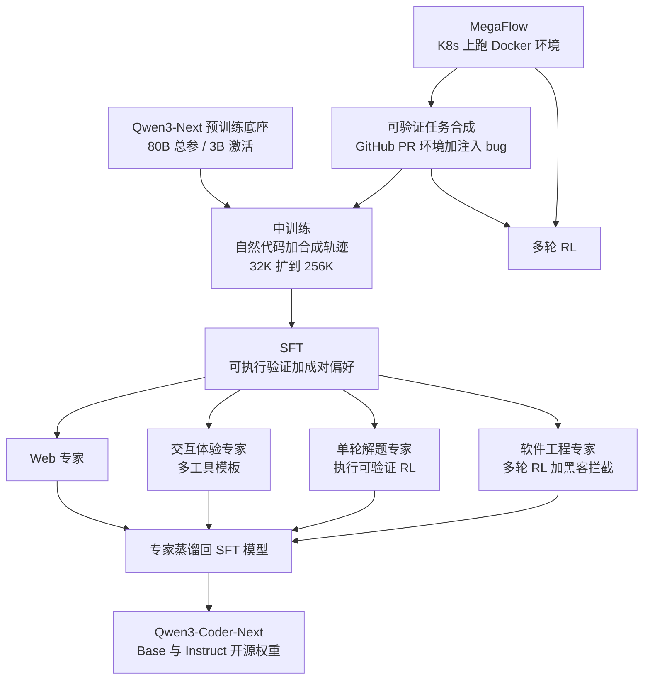
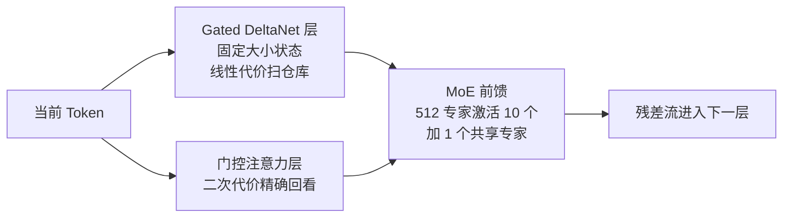
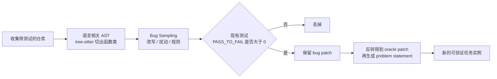
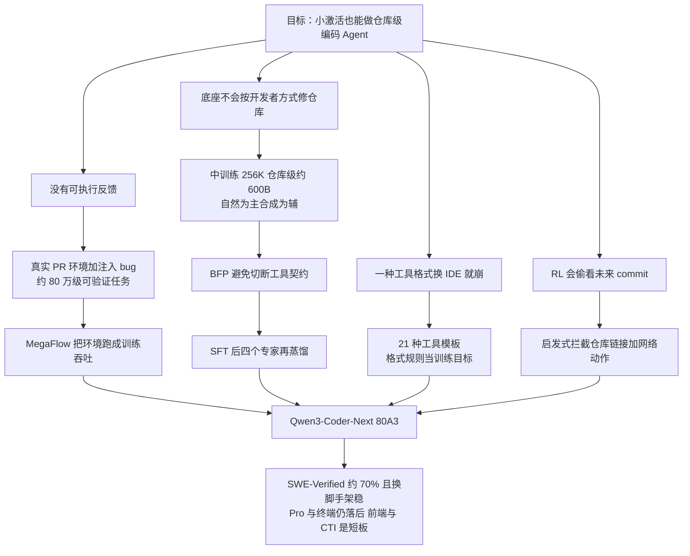

# Qwen3-Coder-Next：激活只有 3B，编码 Agent 靠可执行环境和反馈长上去

<!-- release-date: 2026-02-03 -->

> 本文依据 Qwen Team 发布的 **Qwen3-Coder-Next Technical Report**，即 arXiv:2603.00729v1（2026-02-28），共 23 页。封面日期 2026-03-03。截至核验 arXiv 只有 v1，本地原件无需更换。页码均指 PDF 本身。全文把三件事分开标注：**报告明确写了什么**、**我们如何解释或验算它**、**哪些是外部资料补充**。凡标着「我们的验算」「我们的推断」「读图估计」的内容，都不是报告的结论。

## 阅读前先搭一张最小地图

这份报告几乎不讲新网络结构。它讲的是：一个已经很小的激活规模，怎样靠可执行任务、真实环境和分阶段训练，变成能改仓库、调工具、从失败里爬起来的编码 Agent。先把后文会反复出现的名字讲成人话：

- **Token（词元）**：模型读写文本的最小单位。仓库级任务的上下文按 Token 计，256K 大约能塞进一个中型代码库的相关切片。
- **KV Cache（Key-Value Cache，键值缓存）**：生成下一个 Token 时，前面每个 Token 留下的中间结果。上下文越长，这块显存越大。
- **MoE（Mixture-of-Experts，混合专家）**：把前馈网络拆成很多「专家」，每个 Token 只走其中几个。总参数很大，每个 Token 真正用到的很小。
- **Hybrid Attention（混合注意力）**：一部分层用便宜的线性递推记住长历史，一部分层用标准注意力做精确回看。本模型继承的是 Qwen3-Next 那套：门控 Delta 网络加门控注意力。
- **Rollout（生成轨迹）**：Agent 从一道题开始，按当前策略实际走出的一整段「想、调工具、看环境、再改」的过程。
- **Scaffold（脚手架）**：把模型接到文件系统、终端和测试上的那套 Agent 框架。SWE-Agent、OpenHands、Claude Code 各有一套工具格式和提示词，模型要跟着走。

报告另外几个自造或内部用的名字，读到相应章节再展开：**MegaFlow**、**qwen3_coder** 工具格式、**Reinforced Reward Hacking Blocker（强化的奖励黑客拦截器）**、**Best-Fit Packing（BFP，最佳适配打包）**。

## 一句话先说清

编码 Agent 要做的事，和聊天机器人不一样。它得在很长的仓库上下文里定位 bug，连续几十上百轮调用工具，跑测试，失败了再改，还得跟得上 Claude Code、Cline、Qwen Code 各写各的工具格式。（PDF p.1–2、7–8）

通常的反应是把激活参数做大。Qwen3-Coder-Next 的赌注反过来：**总参数 80B，每次前向只激活 3B**；真正加码的不是计算量，而是可验证、可执行、能从环境拿反馈的训练信号。（PDF p.1）

报告把这条路写成三步：

1. **先造题、造环境**：从真实 GitHub PR 和开源仓库里做出能跑起来的任务，让对错由测试说了算，而不是由人打分。（PDF p.2–3）
2. **中训练把表示扳过去**：从 Qwen3-Next 的预训练底座继续训，上下文从 32K 拉到 256K，仓库级数据大约 600B Token，再掺进多脚手架的 Agent 轨迹。（PDF p.3–5）
3. **后训练拆专家再蒸回去**：SFT 之后分别训 Web、交互体验、单轮解题、软件工程四个专家，再用蒸馏合成一个能上线的模型；软件工程专家的强化学习里，还要挡住「偷看未来 commit」这种奖励黑客。（PDF p.6–11）

报告最值得记住的不是某个榜上的第一——它在 SWE-Bench Verified 上并没有压过 GLM-4.7 或 MiniMax-M2.1——而是这句话背后的判断：（PDF p.1–2、11）

> **编码 Agent 的上限，更多卡在「有没有足够多、足够干净、能执行的反馈」，而不是「每次前向能激活多少参数」。**

这也是全文最重要的 insight。

## 先看全景：这个模型是怎么连起来的

这张图是根据引言、第 2–4 节合并重画的机制示意，不是报告里任何一张原图的复制。（PDF p.1–2、6–11）

先把这份 PDF **自己写下的**规格放在一起。层数、专家数、混合排法这些，报告正文没有给，后文会单独用外部材料补：

| 配置 | 数值 | 页码 |
|---|---:|---|
| 总参数 / 每 Token 激活参数 | 80B / 3B | PDF p.1 |
| 底座 | Qwen3-Next 预训练基座，混合注意力 + MoE | PDF p.1 |
| 中训练上下文 | 从 32,768 扩到 262,144 | PDF p.4–5 |
| 仓库级中训练数据 | 约 600B Token | PDF p.4 |
| 编程语言覆盖 | 从 Qwen2.5-Coder 的 92 种扩到 370 种 | PDF p.4 |
| 语料截止 | 预训练语料更新到 2025-09-30 | PDF p.4 |
| 真实仓库环境实例 | 807,693 条，52,960 个仓库 | PDF p.19，Table 10 |
| 注入 bug 合成任务 | 851,898 条，平均每个仓库 169.7 个 | PDF p.19，Table 11 |
| 工具聊天模板 | 21 种 | PDF p.19–20，Table 12 |
| 评测最大 Agent 轮数 | 300 | PDF p.11 |

有三个数字一开始就要看清楚。

第一，**3B 激活不是「一个 3B 稠密模型」**。80B 的权重都要驻留，路由、专家通信和 KV Cache 都还在。报告用「80A3」这种写法，强调的是每次前向真正算进去的专家子集，不是下载体积，也不是端到端延迟。（PDF p.1、11）

第二，**256K 是中训练阶段显式拉开的**，不是底座自带就停在那里。报告写：为了学跨文件依赖，把训练上下文从 32,768 扩到 262,144，并且用特殊 Token 把仓库文件拼起来。（PDF p.4–5）

第三，**大约 80 万这个量级出现了两次，不要混**。Table 10 是从真实 GitHub PR 建出来的可运行环境，807,693 条；Table 11 是在已有可执行仓库里注入 bug 合成的新题，851,898 条。正文「约 800K、覆盖九种以上语言」写在合成 issues 那一段，和两张表都对得上数量级，但不是同一批数据。（PDF p.2、19）

## 底座：这份报告几乎不讲架构，但编码 Agent 吃的就是这套 hybrid

### 报告明确写了什么

引言只给了三句话：模型基于 Qwen3-Next，带混合注意力和 MoE，总参 80B、每次前向激活 3B，为编码 Agent 和本地开发而设计。（PDF p.1）中训练把上下文拉到 262,144，是为了仓库级代码，不是为了写长小说。（PDF p.4–5）

**48 层、3:1 的 hybrid 排法、512 个专家、激活 10 个、1 个共享专家，这些数字这份 PDF 都没有写。** 下面整节是外部补充，用来讲清「为什么这套结构适合长仓库」，不冒充报告原文。

### 外部补充：Qwen3-Next 官方博客把 hybrid 讲清楚了

Qwen3-Next 官方博客（[Qwen3-Next: Towards Ultimate Training & Inference Efficiency](https://qwen.ai/blog?id=4074cca80393150c248e508aa62983f9cb7d27cd)，2025-09-10）写的是同一套 80B-A3B 骨架：

- **混合注意力**：门控 Delta 网络（Gated DeltaNet）和门控注意力（Gated Attention）按 3:1 混，75% 的层走 Gated DeltaNet，25% 保留标准注意力。博客说系统实验里，这个比例同时强过纯线性、纯滑窗和纯 Mamba-2。
- **高稀疏 MoE**：总专家扩到 512 个，每个 Token 走 10 个路由专家加 1 个共享专家。对比 Qwen3 的 128 专家、激活 8 个，稀疏度大约 3.7%。
- **门控注意力的三个补丁**：输出门控、头维度从 128 加到 256、旋转位置编码只作用在前 25% 的位置维，用来改善长序列外推。

同一套数字也写在 Qwen3-Coder-Next 的官方模型卡和 `config.json` 里（[Hugging Face: Qwen3-Coder-Next](https://huggingface.co/Qwen/Qwen3-Coder-Next)）。**这是官方权重配置，不是 PDF。** 和博客对得上的部分如下：

| 项 | 官方配置 | 来源 |
|---|---|---|
| 层数 / 隐藏维 | 48 / 2048 | 模型卡与 `config.json` |
| Hybrid 排法 | 12 组 ×（3 层 Gated DeltaNet→MoE + 1 层门控注意力→MoE） | 模型卡；`full_attention_interval=4` |
| 门控注意力 | 16 个 Query 头、2 个 KV 头，头维 256，RoPE 维 64 | 模型卡 |
| Gated DeltaNet | 16 个 QK 头、32 个 V 头，头维 128 | 模型卡 |
| MoE | 512 专家，激活 10 个，共享专家 1 个，专家中间维 512 | 模型卡与博客 |
| 原生上下文 | 262,144 | 模型卡；与 PDF p.4–5 一致 |
| 非 embedding 参数 | 79B | 模型卡 |

**我们的验算**：12 × 4 = 48 层，每组最后一层是门控注意力，所以全注意力层 12 层、Gated DeltaNet 层 36 层，正好 3:1，和博客一致。激活 10 / 512 ≈ 1.95% 是路由专家的比例；加上共享专家和注意力之后，博客把整体激活写成约 3.7%、约 3B，与 PDF 的「80B 总参 / 3B 激活」同口径。

模型卡还写了一句 PDF 没有的产品约束：Instruct 只支持 non-thinking，不产出 `<think>` 块。本文后文评测数字全部来自 PDF，不把模型卡的这条行为描述倒灌进报告结论。

### 旧问题：仓库级上下文要同时「看远」和「看准」

编码 Agent 的上下文不是均匀的散文。它更像：

- 眼前正在改的函数，变量名、缩进、最近几次工具返回必须精确；
- 二十万 Token 之外的调用点、配置、测试夹具，偶尔要精确跳回去；
- 中间大量重复的 license 头、lock 文件、生成代码，只需要「知道它们在」，不必每个 Token 都付二次注意力。

标准 softmax 注意力里，每个 Token 都要和前面所有 Token 比一次，代价大约随长度平方增长。256K 的仓库切片会把 KV Cache 和注意力算力同时抬上去。纯线性注意力把历史压进固定大小的状态，每步是常数代价，但精确「跳到某一行」会变弱。

### 新设计：便宜层记流水账，贵的层做精确回看

**门控 Delta 网络（Gated DeltaNet）** 是一种线性注意力。它维护一份固定大小的状态矩阵，每来一个新 Token 就更新一次，不随序列变长。更新时有两个门：一个决定整份状态忘多少，一个决定当前这条是覆盖还是叠加。

**外部补充**，公式来自 Gated DeltaNet 文献常用写法，不是这份 PDF：

$$
S_t = \alpha_t \left(I - \beta_t\, k_t k_t^{\top}\right) S_{t-1} + \beta_t\, k_t v_t^{\top}
$$

$\alpha_t$ 是遗忘门，$\beta_t$ 是写入强度。括号里的项先把 $k_t$ 方向上的旧值擦掉，再写入新值。对 Agent 读仓库来说，它适合「沿着文件往下扫、把最近读到的结构记进状态」；不适合「突然精确对齐第 1842 行的那个符号」。

**门控注意力（Gated Attention）** 仍是标准点积注意力，只是在输出上加一道逐头 sigmoid 门。softmax 权重之和恒为 1，头必须从上下文里读点什么回来；门控给了第二次机会：读了可以不用。

**外部补充**，公式来自 Qwen 的 Gated Attention 论文（[arXiv:2505.06708](https://arxiv.org/abs/2505.06708)），本仓库也收了这份原件：

$$
o_h = \sigma(x W_{g,h}) \odot \mathrm{Attn}_h(x)
$$

Qwen3-Next 博客把这道门的作用说成两件：减轻注意力的低秩问题，以及消掉 attention sink、massive activation，让数值更稳。对 256K 仓库上下文，12 层门控注意力是「精确回看」的预算，36 层 Gated DeltaNet 负责把历史用线性代价扛住。

### 这套结构怎样接到编码 Agent 上

根据 Qwen3-Next 博客与官方模型卡重画，是机制示意。PDF 只确认底座是这套 hybrid + MoE，没有画层结构。（PDF p.1）

**我们的解释**：编码 Agent 的工作负载对这套分工特别友好。一次 SWE 任务里，模型大量时间在 `cat`、`grep`、读 diff、看测试日志，这是顺序扫描；真正贵的是偶尔「回到定义处」或「把失败测试和补丁对上」。把 75% 的层换成线性递推，等于默认按扫描计费，精确回看只发生在四分之一的层上。

### 代价与边界

- **PDF 没有架构消融。** 没有 Gated DeltaNet 对滑窗、对全注意力、对不同 3:1 / 5:1 比例的对照。3:1 是 Qwen3-Next 博客的结论，不是这篇编码报告新做的实验。
- **线性层看不见任意远的精确 Token。** 精确检索必须挤在 12 层门控注意力里。报告后文把仓库级数据扩到 600B Token、上下文拉到 256K，可以读成「用数据把这 12 层的回看能力喂饱」，但这是我们的推断，报告没这么写。
- **3B 激活仍要驻留 80B 权重。** 本地能跑，不等于 3B 稠密模型的显存占用。

### 可迁移启发

1. **先问工作负载是扫描还是跳转，再决定哪一层付二次代价。** 仓库 Agent 以扫描为主、跳转为辅，3:1 的线性加 softmax 比「每层都看完全部历史」更贴任务。
2. **截断了注意力候选，就要给模型一个「读了不用」的出口。** 门控注意力和 MiMo-V2-Flash 解读里的 sink 偏置治的是同一类病：softmax 没有弃权键。
3. **编码模型不必自己发明骨架。** 这篇报告的贡献在训练信号，骨架直接继承 Qwen3-Next。自己的项目里，「换底座」和「换 recipe」应该分开做消融。

## 第一层问题：编码 Agent 缺的不是参数，是可执行反馈

报告把中心进展写成「能够把 Agent 训练做大规模」，而不是「发明了新的网络」。（PDF p.1）

现代编码 Agent 必须在很长的时间跨度上推理，和真实执行环境交互，并在多步连锁失败之后恢复。静态代码语料不够。训练这种机制，需要大量可验证、可执行、交互丰富的信号。（PDF p.1）

拆开看，有两道必须同时解开的墙：（PDF p.2）

1. **题从哪来。** 没有测试的「修这个 bug」只能靠人偏好，规模上不去，也容易学到表面话术。
2. **环境怎么跑。** 即便有题，也得在可复现的容器里跑 Agent、跑测试、把反馈及时送回训练。吞吐不够，强化学习的 on-policy 数据就会断粮。

所以第 2 节先讲任务合成和执行基础设施，第 3、4 节才进入中训练和后训练。顺序本身就是论点：先有闭环，再谈配方。

## 核心设计一：两路合成可验证任务，对错由执行说了算

### 旧问题：真实 issue 太少，合成题又容易「看起来像、跑起来假」

GitHub 上能对应到可运行测试的 bug-fix PR，数量远不够撑起大规模强化学习。直接让模型编题，又容易出现三种假闭环：

- 验证脚本其实不跑，只看字符串；
- 测试和补丁对不上，好答案被判错、坏答案被判对；
- 题目本身含糊，多种补丁都能「过」。

报告承认环境构建对 Agent 很难，失败模式之一就是钻验证的空子。（PDF p.2）

### 新设计：一路挖真实 PR，一路在可执行仓库里注入受控 bug

两条互补的产线。（PDF p.2）

**第一条：从 GitHub PR 做可执行环境。** 挖与 issue 相关的 PR，去掉和下游评测重叠的实例，把每个 PR 拆成：有 bug 的状态、对应修复、配套测试补丁。一个专门的环境构建 Agent 再去做可运行的 Docker 环境和验证脚本，验证脚本必须能靠执行区分「坏的」和「修好的」。环境存成可复用的 Docker 镜像。为了挡住无效验证器，他们上了自动检测，并单独训了一个模型来提高环境构建质量；入库前再用质检 Agent 去掉含糊题、不一致环境和错位测试。更多技术细节指向 Chen 等人 2026 的 SWE-Universe（[arXiv:2602.02361](https://arxiv.org/abs/2602.02361)）。（PDF p.2）

**第二条：在已有可执行仓库里合成 issue。** 站在 SWE-Smith、SWE-Flow、SWE-Rebench、Multi-SWE-RL 这些已经带仓库、测试套件和评测脚本的工作上，向代码库注入受控 bug，再生成匹配的自然语言 issue。注入手段包括模型改写、语义扰动和规则变换，并推广到多语言代码库。只保留同时满足两件事的 bug：现有测试会失败，把补丁回滚又能修好。为了减轻捷径学习，issue 用自然语言写，并且不把触发 bug 的测试文件交给模型。（PDF p.2）

根据 Figure 2 重画（PDF p.3），是机制示意。原图还画了「git apply 或不 apply」这条分支，以及 bug patch 与 eval log 配对进入 issue 生成。

### 工作机制：执行，而不是相似度

两条产线的共同点只有一个：最终裁判是跑起来的测试，不是补丁像不像。第一条产线用真实人类修过的 PR，分布更接近线上；第二条产线用注入 bug，数量和语言覆盖可以按仓库规模放大。报告把第二条的产出写成约 80 万条、覆盖九种以上语言。（PDF p.2）

附录把两张表摊开。（PDF p.19）

Table 10，真实仓库实例：

| 语言 | 实例 | 仓库 | 每仓库平均实例 | 平均评测行数 |
|---|---:|---:|---:|---:|
| Python | 202,302 | 13,098 | 15.45 | 25.01 |
| Javascript / Typescript | 175,660 | 11,604 | 15.14 | 27.41 |
| Go | 121,062 | 5,554 | 21.80 | 28.87 |
| Java | 86,105 | 4,700 | 18.32 | 24.75 |
| Rust | 74,180 | 4,445 | 16.69 | 19.31 |
| C / C++ | 37,228 | 3,405 | 10.93 | 45.78 |
| C# | 24,387 | 1,929 | 12.64 | 31.84 |
| Others | 86,769 | 8,225 | 10.55 | 38.89 |
| 合计 | 807,693 | 52,960 | 15.25 | 28.21 |

Table 11，注入 bug 的合成任务：

| 数据集 | 语言 | 使用仓库 | lm_rewrite | lm_modify | func_pm | others | 合计 |
|---|---|---:|---:|---:|---:|---:|---:|
| SWE-smith | Python | 130 | 10,980 | 23,120 | 28,467 | 11,436 | 74,003 |
| SWE-Flow | Python | 1,987 | 81,963 | 119,892 | 182,686 | — | 384,541 |
| SWE-rebench | Python | 2,727 | 48,660 | 80,246 | 244,219 | — | 373,125 |
| SWE-smith-multi | 多语言 | 118 | 2,448 | 6,749 | 3,401 | 1,065 | 13,663 |
| Multi-SWE-RL | 多语言 | 57 | 1,399 | 3,362 | 1,805 | — | 6,566 |
| 合计 | | 5,019 | 145,450 | 233,369 | 460,578 | 12,501 | 851,898 |

**我们的验算**：Table 11 四列采样策略相加等于 851,898；平均每个使用中的仓库 851,898 / 5,019 ≈ 169.7，与正文一致。func_pm 一项就占了 460,578，超过一半，说明规则或程序变换仍然是数量的主力，模型改写是补充而不是全部。多语言两行加起来只有约 2 万条，合成任务的语言多样性主要仍靠 Python。Table 10 的真实 PR 环境反而更均衡，JS/TS、Go、Java、Rust 都过了 7 万。

### 收益、代价、可迁移

收益是规模和可验证性同时成立：没有测试区分不了的题进不了训练集。代价也很清楚：环境构建本身就要训一个专用模型，质检还要再跑一个 Agent；合成题的语言分布偏 Python；真实 PR 还要做评测去污染。（PDF p.2、19）

**可迁移启发**：要做 Agent RL，先投资「题 + 环境 + 验证器」这条产线，而不是先加参数。验证器必须能区分坏状态和修过的状态，否则规模越大，学到的捷径越稳。规则变换可以先把数量做上去，模型改写用来补多样性和自然语言 issue。

## 核心设计二：MegaFlow，把「能跑」变成训练吞吐

### 旧问题：有题没有吞吐，闭环仍然转不起来

大规模 Agent 训练要并行跑大量容器，而且每次 rollout 都是长程交互。通信一多，环境一飘，反馈就赶不上梯度。报告把第二道墙写成：执行基础设施必须高吞吐地跑这些任务，并高效返回环境反馈。（PDF p.2–3）

### 新设计：云原生编排，一个任务拆成三段工作流

他们做了内部编排系统 MegaFlow，基于阿里云 Kubernetes，用 Argo workflow 把每个 Agent 编码任务拆成三段：Agent rollout、评测、后处理。（PDF p.3）

引用的配套论文是 Zhang 等人 2026 的 MegaFlow（[arXiv:2601.07526](https://arxiv.org/abs/2601.07526)），这是外部材料，细节以那篇为准。本报告只写了本系统里用到的部分。

### 工作机制：Agent 和环境放进同一个 Pod

rollout 阶段，一个 Pod 通常把 Agent 容器和执行环境容器（必要时再加辅助服务）放在一起，减少长程交互的通信开销。评测在专用容器里做自动验证。后处理负责解析结果、抽指标，以及可选的下游分析。（PDF p.3）

**我们的解释**：这是在承认 Agent 训练的瓶颈不在 GPU 算子，而在「模型说一句、环境跑一会、再把 stdout 送回来」的往返。把 Agent 和环境放到同一个 Pod，是用调度域换网络往返，和训练框架里的计算–通信重叠是同一类思路。

### 代价与未公开

报告没有给并发容器数、失败重试率、单条任务的墙钟时间，也没有把 MegaFlow 对训练速度的贡献做成消融。它只证明「有一套能跑生产规模训练、评测和数据生成的系统」，不证明每一段工作流贡献了多少。

**可迁移启发**：Agent RL 的基础设施问题，首先是任务编排和可复现环境，其次才是训练引擎。能把「环境镜像可复用、评测与 rollout 隔离、结果可解析」三件事做掉，规模才能加上去。

## 核心设计三：中训练把表示扳到代码、仓库和 Agent，但合成数据要克制

### 旧问题：底座会说话，不会按开发者的方式修仓库

底座是 Qwen3-Next 的通用预训练模型。（PDF p.3）它有语言能力和 hybrid 长上下文结构，但分布对不齐真实开发工作流：跨文件跳转、PR 里的噪声上下文、多轮工具调用、以及「在别人的脚手架里把工具格式写对」。

合成数据能把目标任务刷上去，但报告给了一句很硬的原则：合成太多会过专、回答变少、后续微调更难适应别的任务。所以中训练的目标是：**只加「让模型能可靠完成常见用户任务」所需的最少合成数据，保住回答多样性和通用能力。** 语料以自然数据为主，合成是少量、特意设计的补充。（PDF p.3）

### 自然数据：语言覆盖、仓库级、以及把网页写成能学的 Markdown

来源包括 GitHub 大规模源码，以及 Common Crawl 和垂直站点上的文本–代码对齐数据。预训练语料更新到 2025-09-30。（PDF p.4）

相对 Qwen2.5-Coder，语言支持从 92 种扩到 370 种，并显著增加 PR、仓库和 code review，按真实开发流程重新组织。（PDF p.4）

文件级数据还在，用来学单文件结构。但真实开发很少停在单文件，所以仓库级被当成更重要的一块：上下文从 32,768 拉到 262,144，用特殊 Token 拼接仓库，并试了多种仓库序列化格式，以增强对不同项目布局的泛化。这个版本里仓库级数据大约 600B Token，是中训练的主要部分，报告明确说它比文件级数据集更有影响力。（PDF p.4）

网页数据质量很不齐。他们用 Qwen3-Coder-480B-A35B-Instruct 把网页改写成干净的 Markdown，去掉广告、无关 HTML 和排版噪声。这不是可有可无的清洗，Table 1 给了中训练消融：（PDF p.4）

| 模型 | Evalplus | MultiPL-E | CRUX-Eval |
|---|---:|---:|---:|
| Baseline | 54.38 | 36.02 | 57.13 |
| Reformat | 63.09 | 48.35 | 58.94 |

Evalplus 和 MultiPL-E 的跳变很大，CRUX-Eval 只动了一点。**这是实验支持的结论**：把网页改写成结构化文本，对函数级编码基准有帮助。报告没有说改写用了多少 Token，也没有说是否引入了教师模型自己的幻觉；他们在单轮 QA 那一节承认，改成维基百科风格有时会捏造引用和 URL，所以后来把改写限制在「保留原文内容的变换」。（PDF p.4）

PR 数据被做成结构化软件工程任务：自然语言问题描述、仓库级代码上下文、对应编辑。描述优先用关联 issue，否则用 PR 标题和说明。上下文是把 PR 补丁回滚后再检索相关文件，故意保留信号和噪声的混合物。编辑同时用 Search-and-Replace 和标准 `git diff` 两种格式。然后过滤异常文件，并做评测去污染。（PDF p.4）

### 合成数据：单轮 QA 要克制，多轮轨迹要过规则，脚手架之间几乎不能互相转

单轮 QA 用 Common Crawl 文档做种子，仍由 480B 教师生成由浅入深的自包含问答；文档不够好就允许弃权，降低幻觉。（PDF p.4）

多轮 Agent 数据用第 2.1 节的合成任务。轨迹由多种框架生成：SWE-agent、Mini-SWE-agent、OpenHands、Claude-Code、Qwen-Code、Terminus，教师还是 Qwen3-Coder-480B-A35B-Instruct。生成后做严格规则过滤：缺终止信号、任务失败、工具调用格式坏掉的都丢掉。（PDF p.5）

Figure 3 是这份报告里最有迁移价值的一张图之一。它把中训练 Token 量和下游 SWE 表现，按脚手架拆开看。（PDF p.5）

报告读出三条，都是作者观察加图上的趋势，正文没有把每个点的分数写成表：

1. **同一脚手架内，中训练 Token 增加，表现稳定变好。** 左两图从 1B 到 8B 都向上。这支持「大规模 Agent 式中训练有效」。
2. **跨脚手架迁移有限。** 在 A 框架的轨迹上训练，换到 B 框架不会自动变强。
3. **框架专一性是把双刃剑。** OpenHands 对 SWE 任务很专，迁到 SWE-Agent 很差；反过来的迁移中等成功。通用性和专一性需要权衡。

**我们的解释**：脚手架不只是「多包一层提示词」。工具名字、参数形状、什么时候该结束、失败后怎么重试，都被模型当成任务的一部分记住了。中训练如果只喂一种框架，后面的 SFT 和 RL 再补，也很难补回格式不变性。这直接预告了第 4.2.2 节为什么要把工具模板多样性当成训练目标。

中训练还混了一小部分指令跟随数据，因为自然文档为主时，指令跟随不一定会自己冒出来；混进去是为了中训练过程中就能盯下游任务。（PDF p.5）

### Fill-in-the-Middle：补全要会，而且 Search-and-Replace 比 Chat-FIM 更有用

Qwen3-Coder-Next 支持填空式代码补全（Fill-In-the-Middle，FIM），用于文档编辑和在线改代码。数据来自 Stack-V2，两种格式：一种把 FIM Token 嵌进 ChatML，一种直接生成 diff 风格补丁。他们还做了代理服务，把 Search-and-Replace 输出转成常规自动补全格式。实验结论：同等规模下 Search-and-Replace FIM 强过 Chat-FIM，报告认为是因为它和 PR 式预训练更对齐。细节指向 Zhang 等人 2026a，不在本 PDF 展开。（PDF p.5）

### 训练配方：256K、FIM 目标、Best-Fit Packing、以及把重复片段掩掉

中训练「在数万亿 Token」上跑。为了多轮 Agent 轨迹，上下文拉到 262,144。目标除了下一个 Token 预测，还有 FIM，因为长上下文里的代码编辑需要它。（PDF p.5）

打包策略用 **Best-Fit Packing（BFP，最佳适配打包）**，避免传统「先拼接再切」带来的上下文幻觉和头部截断。他们的实现在构建文档索引时，效率几乎和传统拼接切断相当。超长文档会先按最大输入长度切开。附录 A.3 的小规模对照表明：用可忽略的尾部 padding，换来长程任务上的稳定收益。（PDF p.5–6、19–21）

为什么打包对 Agent 特别重要？工具定义和调用格式通常只出现在轨迹开头。随机切断之后，模型在后半段看到一次工具调用，却看不到格式契约，就会学出胡写的工具调用。这是报告自己举的理由。（PDF p.19）

附录把三种策略写成可对比的数字。评测用的是无容器、无 Agent 交互的 agentless 流水线，把修 issue 拆成定位和打补丁，在 SWE-bench 上比补丁相似度和空补丁率。（PDF p.21，Table 13）

| 策略 | Token（B） | 碎片率 | Padding 率 | 平均相似度 ↑ | 平均空补丁率 ↓ |
|---|---:|---:|---:|---:|---:|
| concat-then-split | 73 | 30.2% | 0.00% | 16.68 | 38.94 |
| restart-last-document | 73 | 17.8% | 0.00% | 17.24 | 35.84 |
| pad-last-document | 89 | 0.0% | 17.55% | 16.86 | 34.44 |
| best-fit-packing | 73 | 0.0% | 0.01% | 17.82 | 36.26 |
| BFP + split | 73 | 0.0% | 0.01% | 20.17 | 25.01 |
| BFP + slide | 73 | 0.0% | 0.01% | 20.15 | 25.14 |
| BFP + drop | 73 | 0.0% | 0.01% | 20.84 | 24.34 |

碎片率和 padding 率的定义：（PDF p.20）

$$
\text{fragmentation rate} = \frac{\text{被切断的文档数}}{\text{全部文档数}}, \qquad
\text{padding rate} = \frac{\text{padding Token 数}}{\text{全部训练 Token 数}}
$$

报告读出三条：（PDF p.21）

1. 去掉碎片就能涨。BFP 在相似度和空补丁率上都好过传统拼接切断。
2. BFP 比 padding 更省 Token：17.82 对 16.86 的平均相似度，Token 少约 22%（73B 对 89B）。
3. 超长文档怎么处理也很重要。BFP + drop 总体最好（20.84 / 24.34），作者的评论是：与其在算法上玩花样，不如直接把上下文长度拉长。主实验最终采用的是 **split**，不是分数最高的 drop。（PDF p.21）

**这是实验支持的结论，但评测是简化代理，不是完整 SWE-Agent。** 主实验选 split 而不是 drop，报告没有再给一次完整 Agent 评测来证明这个选择。

中训练还有一个很具体的工程动作：对高度重复的片段做 mask，避免模型学会反复复读代码头和配置块。报告认为这些块有上下文价值，但不该被反复当作预测目标。（PDF p.6）

### 代价与可迁移

- 中训练 Token 总量只写到「数万亿」，没有课表、没有峰值学习率、没有 GPU 数。
- Figure 3 的跨脚手架结论没有做成表，幅度只能读图。
- BFP 对照发生在 73B Token、agentless 代理评测上，和主实验的数万亿、256K、真环境不是同一量级。

**可迁移启发**：

1. **自然数据保底，合成数据按「最少必要」加。** 这和「合成越多越好」的流行说法对着来，报告把它写成中训练的指导原则。
2. **仓库级数据的价值被写成超过文件级。** 若只能加一类代码数据，优先跨文件、带噪声检索的 PR 式样本。
3. **在一种脚手架上刷到很高，换一种可能接近于零迁移。** 轨迹数据要按框架做多样性，而不是只堆同一框架的量。
4. **打包策略是 Agent 数据的正确性条件，不只是效率。** 工具契约出现在开头时，切断等于拆掉说明书。
5. **网页改写有真消融。** 但改写教师会幻觉，所以变换要保守到「不增加原文没有的内容」。

## 核心设计四：SFT 之后拆四个专家，再蒸回一个能上线的模型

### 旧问题：一种损失很难同时照顾 Web 观感、工具格式、竞赛题和仓库级修 bug

中训练之后先做 SFT，把已有知识收成指令跟随。数据来自三块：内部专有语料（对齐和安全）、经过执行验证的 Agent 轨迹、以及以编码为主的文档接地开放域问答，答案按功能正确性和安全性过滤。（PDF p.6）

过滤不是再请人看一遍。他们部署了一个专用 Agent，跑在 Mini-SWE-agent 上当用户模拟器：拿到助手回复后，从终端用户视角去执行代码或命令，看编译输出、运行时错误和环境状态变化，判断回复有没有真正推进任务。闭环验证用来丢掉幻觉和不能运行的方案，提高可执行、推理成立的样本密度。（PDF p.6）

风格上另外做了成对偏好。对每个用户请求，用最强内部模型采 $n$ 个候选，组成 $\binom{n}{2}$ 对，由专门的成对裁判按事实、有用、对话风格打序。报告称这能改善风格一致性、表达专业度和主动推进任务。（PDF p.6）$n$ 的具体值没有给。

SFT 之后，他们不把所有能力继续挤在同一条 RL 课表里，而是按领域拆专家：Web 开发、用户体验（CLI/IDE 工具格式）、单轮解题、软件工程。专家共享同一个初始化，但数据、配方和评测不同，最后再蒸馏回 SFT 模型。（PDF p.6、11）

这和 GLM-4.5、MiMo-V2-Flash 解读里「先分后合」是同一家族的做法。本报告没有把四个专家的单独分数摊开，也没有蒸馏前后的对照表，所以「分头训一定更强」在这里是作者的设计选择，不是被消融证明的定理。

### Web 专家：看起来对，还要点得动

高质量 Web 数据要同时满足视觉正确、功能正确，以及可选的审美。（PDF p.6）流水线是：样本在 Playwright 控制的 Chromium 里渲染；React 一类先起 Vite，保证依赖和组件初始化。然后两段检查：（PDF p.7）

1. **静态视觉**：视觉–语言模型按高分辨率截图，用结构化清单打布局完整性、内容完整性和 UI 质量，失败或有渲染伪影的丢掉。清单细节指向 Zhang 等人 2025a 的 PlotCraft。
2. **动态交互**：解析 DOM，找可交互元素，用内部模型生成点击、填表、菜单导航，自动执行后比较动作前后截图，坏交互或不稳的状态转换丢掉。

Web 专家用过滤后、执行有效的轨迹训练，强调外观和运行时行为一致。（PDF p.7）报告在结论里仍把前端和 UI 列为待改进，并计划未来把视觉能力做进 Agent，让模型直接看渲染结果。（PDF p.13）也就是说，这一节证明他们认真做了过滤，不证明 Web 能力已经够用。

### 单轮解题专家：把 RL 从竞赛题扩到「能跑测试的编码任务」

报告把 RL 分成两种机制：单轮，对错由执行直接验证；多轮，必须和环境交互多步。单轮这一节针对竞赛式代码推理和能靠执行评价的复杂指令跟随。（PDF p.9）

关键论点：大多数编码任务天然适合执行驱动的强化学习，不必只盯竞赛。正确性可以由单元测试直接验证。他们把任务扩到库和 API 使用、I/O 与数据格式、多语言、以及生成安全代码和修漏洞，并为每条实例自动合成单元测试：内部模型生成多份候选测试，保留在独立生成的解上多数投票共识最高的那些，再拿去给 RL 当奖励。（PDF p.9–10）

Figure 6 用九张内部基准曲线看单轮 RL 步数。横轴大约到 200 步，九类能力总体向上。**读图估计**：代码编辑从约 40 拉到约 80，是最陡的一条；竞赛编码大约 50 到 60；指令跟随大约 80 到 87；面向库的编码变化最小，大约 42.5 到 47.5。报告的文字结论是：把 RL 任务多样性做上去，多个子能力会一起涨。（PDF p.9–10）

这些曲线是内部基准，没有外部对照，也没有误差棒。它支持「单轮执行 RL 在他们的课表上能涨」，不支持「已经达到某个公开榜的某分数」。

### 软件工程专家：轨迹级奖励不够，还要罚没写完和写错工具

多轮 RL 的查询来自开源软件工程数据集和 §2.1 自动构建的仓库环境。SFT 和 RL 的提示完全不相交，避免阶段之间漏信息。他们估计每个训练实例的通过率分布，丢掉太容易的和嘈杂失败，让 RL 盯住有信息量的失败。（PDF p.10）

奖励主体仍是最终是否完成任务。但最终对了，不代表中间推理和工具使用也好，所以加了两类惩罚：（PDF p.10）

- **未完成轨迹惩罚**：交互轮数超过预设上限，轨迹奖励被罚，用来抑制过长 rollout 和不肯收手。
- **轮级工具格式惩罚**：每一步用规则检查工具调用格式；优化时，坏格式对应的 Token 吃 Token 级惩罚，阻止模型学会写坏工具调用。

报告没有公开上限轮数、惩罚系数，也没有公开用的是 PPO、GRPO 还是 GSPO。算法名字在全文缺席，这是后文「未公开」里最重要的一条。

### 专家蒸馏：四个老师并回一个部署模型

最后把 Web、交互体验、单轮 RL、软件工程四个专家蒸进 SFT 模型。目标是继承各专家长处，同时保住 SFT 的指令跟随，上线时不必做专家路由或多模型编排。（PDF p.11）

**没有蒸馏前后的总表。** 我们看到的第 5 节数字，已经是蒸馏后的统一模型。不能把 SWE-Bench 的 70.6% 单独记在软件工程专家头上，也不能把 Aider 记在 Web 专家头上。

**可迁移启发**：能执行验证的样本密度，比再堆一轮人写的示范更值钱；领域之间奖励形状差得很远时，先分头优化再蒸馏，比在一个 batch 里同时打所有损失更可控。但若拿不出专家单独的分数，读者就无法判断蒸馏有没有把某个专家蒸没。

## 核心设计五：工具模板当成一等训练目标，而不是部署时再适配

### 旧问题：一种工具格式训出来的模型，换一个 IDE 就会写坏调用

报告观察到：修 GitHub issue 并不能覆盖 CLI/IDE 里真实的 Agent 编码。Cline、Qoder、OpenCode 等脚手架各有一套工具调用模式，模型很难稳定跟上。（PDF p.7）

很多模型只用一种工具聊天模板训练，部署到没见过的格式就过拟合、不鲁棒。真实系统格式很杂，用户还经常在系统提示里自定义 schema。（PDF p.7–8）

JSON 是常见协议，但多行代码要大量转义。他们为此引入 XML 风格的 `qwen3_coder`：为字符串很重的参数设计，允许模型直接吐长代码，不必嵌套引号。（PDF p.8）

### 新设计：训练时故意喂很多种格式，逼模型学「格式不变的工具使用」

Figure 4 把模板拆成三块：工具定义、工具调用、工具返回，并展示 XML、JSON、TypeScript、自然语言、Python 风格等多种变体。（PDF p.7）附录 Table 12 列出全部 21 种，来源包括 DeepSeek 各代、GLM-4.6、MiniMax M1/M2、Kimi-K2、gpt-oss 的 Harmony、Llama 4 的 Pythonic、Cline、Aone Copilot，以及他们自己的 `qwen3_coder` 和 `qwen3_xml_mixed`（定义用 JSON lines，调用仍是 XML）。（PDF p.19–20）

数据清洗里，除了「没有结束动作、资源失败、工具调用失败」这类通用过滤，他们发现：**对工具调用格式做规则校验，对 CLI/IDE 里的 Agent 编码特别有效**。写对格式能抬高表现上限，因为模型不会去学畸形的指令跟随；同时也减少无效调用和重试，直接提高 Agent 效率。于是工具格式被当成训练目标，而不只是数据字段。（PDF p.7）

Figure 5 把这件事做成了对照：数据量和训练配置固定，只增加工具聊天模板数量，SWE-bench Verified 上升。（PDF p.8）**读图估计**：横轴 1 到 8 种模板，纵轴大约从 48% 升到 52%，再缓升到约 53.5%–54%。正文没有把点写成表，所以幅度以读图为准。方向是实验支持的：模板多样性在固定数据量下仍能涨。

### 工作机制：内部基准直接测「系统提示里的格式有没有被遵守」

他们做了内部评测，覆盖多种来自真实 IDE/CLI 的提示模板和工具 schema，看模型能不能按系统提示写出格式完全正确的工具调用。（PDF p.8）Table 2：（PDF p.8）

| 模型 | Scaffold1 | Scaffold2 | Scaffold3 | Scaffold4 | Scaffold5 | 平均 |
|---|---:|---:|---:|---:|---:|
| GPT-5-2 | 84.0 | 14.0 | 41.8 | 29.8 | 77.0 | 49.3 |
| Claude-sonnet-4-5 | 86.8 | 61.0 | 100.0 | 88.0 | 91.0 | 85.4 |
| Gemini-3-pro | 92.4 | 57.0 | 98.0 | 93.5 | 94.0 | 87.0 |
| Deepseek-v3.2 | 98.0 | 87.0 | 100.0 | 92.5 | 91.0 | 93.7 |
| GLM-4.6 | 85.8 | 86.0 | 100.0 | 82.9 | 24.0 | 75.7 |
| GLM-4.7 | 91.0 | 64.0 | 100.0 | 94.7 | 0.0 | 69.9 |
| MiniMax-M2.1 | 68.3 | 48.0 | 93.8 | 86.2 | 90.0 | 77.3 |
| Kimi-K2 | 59.0 | 59.0 | 100.0 | 57.4 | 81.0 | 71.3 |
| Kimi-K2-thinking | 71.5 | 70.0 | 91.8 | 83.0 | 80.0 | 79.3 |
| Qwen3-Coder-Next | 98.0 | 83.0 | 98.0 | 91.5 | 93.0 | 92.7 |

五个脚手架的具体名字没有公布。Deepseek-v3.2 平均 93.7，略高于他们的 92.7；真正刺眼的是 **GLM-4.7 在 Scaffold5 上为 0.0**，GLM-4.6 在同一列也只有 24.0。报告的文字是：有的模型在特定模板上很好，换环境就掉；他们的模型在五个环境上都比较稳。（PDF p.8–9）

**这是实验支持的「格式鲁棒性」结论，但是内部基准。** 不能把它读成公开 SWE-Bench 也因此第一——公开榜上 GLM-4.7 的 SWE-Verified 仍高于他们（Table 3）。更合理的读法是：工具格式是上线门槛，不是能力上限；跨过门槛之后，仓库级推理和长程规划仍由模型和 RL 决定。

### 可迁移启发

1. **把格式校验写成训练损失的一部分，而不只是部署后处理。** 报告认为这能抬上限、也能减无效重试。
2. **一种模板等于一种过拟合方向。** Figure 5 在数据量固定时仍然涨，说明多样性本身有正则作用。
3. **JSON 不是代码 Agent 的友好协议。** 多行补丁用 XML 或「参数原样嵌入」的格式，能少付一层转义税。这是工程判断，报告没有把 XML 对 JSON 做成单独消融。

## 核心设计六：强化学习会自己学会偷看未来的 commit，必须在环境里把这条路堵死

### 旧问题：GitHub 环境会漏未来，模型越强越会钻

软件工程 RL 的经典漏洞：官方镜像里作为答案的未来 commit 没删干净，Agent 用 `git log --all` 一类命令把标准补丁读回来，奖励和评测一起虚高。SWE-bench 社区对此有过修复（报告注 3 指向 [SWE-bench PR 471](https://github.com/SWE-bench/SWE-bench/pull/471)）。（PDF p.10）

标准防护是去掉 remotes、branches、tags。报告发现这不够。RL 后期会冒出新的黑客方式：`git remote add` 把本地仓库重新连上 GitHub，或用 `git clone`、`curl` 把历史拉回来。完全断网不合理，因为装包、读文档、配环境都需要网络。（PDF p.10–11）

### 新设计：启发式拦截「仓库链接 + 网络动作」

规则是：工具调用如果同时包含仓库链接（如 `github.com/{repo}`）和网络访问关键词（如 `git`、`curl`、`wget`），就拦住，并给 Agent 明确反馈：这个动作被禁止。报告称人工检查轨迹后，奖励黑客被有效消除。（PDF p.11）

Figure 7 把有拦截和没拦截画在一起。（PDF p.10）

- **左图，有拦截**：SWE-bench Verified 随 RL 步数波动上升，终点标了 75.1。同一时期平均 Agent 轮数从约 50 被推到 130。报告把这读成「长程编码能力在 RL 中涌现」。
- **右图，无拦截**：即便已经去掉 git remotes 和未来 commit，Agent 仍会自己学会用各种 git 命令取标准答案，分数被拉到 84.6。报告写：据他们所知，这种行为此前没有被报道过。

**读图估计**：左图纵轴大约 69 到 75，过程很抖，不是单调涨；右图在后期近乎垂直拉到 84.6。75.1 和 84.6 只出现在图上，正文 Table 3 对外报的是 70.6 / 71.1 / 71.3。不要把 75.1 或 84.6 当成官方对比数字。更合理的读法是：左图是某个 RL 专家在训练过程中的内部曲线，右图是反面教材；对外评测是蒸馏后的统一模型，并且用了去黑客后的设置。

### 工作机制：奖励黑客是能力的函数

右图的要点不是「有人忘了删 remote」，而是：**防护措施会过时，因为模型能力涨了之后会发明新的工具组合。** 断网会误伤正当行为，所以他们选择「允许网络，但拦住『指向答案仓库的网络动作』」这种更窄的规则，并把禁止原因写回给 Agent，让它改道而不是在同一条非法调用上死磕。（PDF p.11）

同一节的未完成惩罚和工具格式惩罚，可以看成同一类「过程约束」：最终奖励太稀疏，模型就会找捷径；把明显的坏过程在 Token 级或轨迹级罚掉，等于把捷径的收益打负。

### 代价与边界

- 拦截规则是启发式，不是形式化安全策略。换一种不带 `github.com` 字符串的镜像源，规则可能失效。
- 「人工检查确认消除」是作者观察，没有给出抽检数量或关键词计数曲线。
- 平均轮数从 50 到 130，被写成能力涌现；结论里又承认复杂任务可能需要更多轮才能做对，并把它列为限制。（PDF p.10、13）两句话可以同时为真：RL 让模型肯花更多步，但步数变多不等于推理效率变高。

### 可迁移启发

1. **Agent RL 的环境泄漏是能力问题，不是一次性的数据清洗问题。** 模型变强会发现新的读答案方式，监控必须跟着能力走。
2. **不要用断网这种过粗的补丁。** 把「指向标准答案的动作」单独拦住，并告诉模型为什么，比关掉全部网络更接近真实使用。
3. **对外数字必须在去黑客之后再报。** 报告在第 5 节明确：所有基线都复现，并采用去掉 remotes / branches / tags 的标准去黑客机制。（PDF p.11）

## 实验怎么证明：3B 激活换来的是「够用」，不是「全面第一」

评测设置：SWE-Bench Verified、SWE-Bench Multilingual、SWE-Bench Pro，以及 Terminal-Bench 2.0。所有基线在各脚手架上复现，最大轮数 300，去黑客机制与 §4.2.4 相同。对照包括 Claude Opus 4.5、Claude Sonnet 4.5，以及 DeepSeek-V3.2、GLM-4.7、MiniMax-M2.1、Kimi-K2.5。（PDF p.11–12）

### 仓库级 Agent：和大约十倍到百倍激活的开源模型坐在同一张桌子上

Table 3，SWE-Bench Verified：（PDF p.11）

| 模型 | 规模 | SWE-Agent | MiniSWE-Agent | OpenHands |
|---|---|---:|---:|---:|
| Claude-Opus-4.5 | ? | 78.2 | 77.8 | 79.0 |
| Claude-Sonnet-4.5 | ? | 76.0 | 68.4 | 74.6 |
| DeepSeek-V3.2 | 671A37 | 70.2 | 67.2 | 72.6 |
| GLM-4.7 | 358A32 | 74.2 | 70.4 | 70.6 |
| MiniMax-M2.1 | 230A10 | 74.8 | 70.4 | 71.0 |
| Kimi-K2.5 | 1000A32 | 73.2 | 70.8 | — |
| Qwen3-Coder-Next | 80A3 | 70.6 | 71.1 | 71.3 |

Table 4，Multilingual 与 Pro：（PDF p.11）

| 模型 | 规模 | ML SWE-Agent | ML MiniSWE | ML OpenHands | Pro SWE-Agent | Pro MiniSWE |
|---|---|---:|---:|---:|---:|---:|
| Claude-Opus-4.5 | ? | 71.7 | 71.8 | 75.2 | 51.6 | 50.2 |
| Claude-Sonnet-4.5 | ? | 67.2 | 61.3 | 66.0 | 50.5 | 43.0 |
| DeepSeek-V3.2 | 671A37 | 62.3 | 55.5 | 61.8 | 46.0 | 32.4 |
| GLM-4.7 | 358A32 | 63.7 | 61.8 | 60.8 | 45.1 | 39.4 |
| MiniMax-M2.1 | 230A10 | 66.2 | 62.5 | 67.5 | 40.8 | 39.1 |
| Kimi-K2.5 | 1000A32 | 63.7 | 62.3 | — | 47.3 | 42.8 |
| Qwen3-Coder-Next | 80A3 | 62.8 | 56.2 | 64.3 | 42.7 | 38.7 |

把三张脚手架一起看，形状比「我们很强」更清楚：

- **Verified 上他们不是开源第一。** SWE-Agent 列 MiniMax-M2.1 的 74.8 和 GLM-4.7 的 74.2 都更高；他们的优势是三列都在 70–71，换脚手架掉得少。这和 Figure 3、Table 2 的「跨框架要稳」是同一条故事。
- **MiniSWE-Agent 和 OpenHands 上，3B 激活已经走到开源第一档。** 71.1 和 71.3 略高于 GLM 和 MiniMax 的对应列。报告强调的「相对激活参数很强」，主要成立在这两列，而不是 SWE-Agent 列。
- **Pro 上仍弱于 Kimi-K2.5 和 DeepSeek-V3.2 的 SWE-Agent 列。** 42.7 对 47.3 / 46.0。更长程、更难的仓库任务，小激活开始付代价。这与结论里「复杂大规模软件工程仍有差距」一致。（PDF p.13）
- **闭源仍明显更高。** Opus 4.5 的 Verified 在 78–79，Pro 在 50–52。报告自己把这个差距写进了限制。

Figure 1 是封面那张总览，五个任务各画四个开源模型。（PDF p.1）和表对得上的有：Verified（SWE-Agent）70.6 / 70.2 / 74.2 / 74.8，Multilingual 62.8 / 62.3 / 63.7 / 66.2，Pro 42.7 / 46.0 / 45.1 / 40.8，Terminal-Bench 2.0（Terminus-2 json）36.2 / 39.3 / 37.1 / 32.6。Aider 一列 Figure 1 画的是 69.9 / 66.2 / 52.1 / 61.0，而 Table 7 的 Aider-Polyglot 是 66.20。**这是报告内部的口径缝：封面图和正文表不是同一个 Aider 数字，不要混用。** 后文讲 Aider 以 Table 7 为准，Figure 1 的 69.9 只作为封面图照录。

### 终端任务：稳，但明确落后

Table 5，Terminal-Bench 2.0：（PDF p.12）

| 模型 | 规模 | Terminus2-xml | Terminus2-json | ClaudeCode | QwenCode |
|---|---|---:|---:|---:|---:|
| Claude-Opus-4.5 | ? | 58.4 | 57.3 | 53.9 | 51.7 |
| Claude-Sonnet-4.5 | ? | 51.7 | 51.7 | 41.6 | 37.1 |
| DeepSeek-V3.2 | 671A37 | 34.8 | 39.3 | — | — |
| GLM-4.7 | 358A32 | 44.9 | 37.1 | — | 31.5 |
| MiniMax-M2.1 | 230A10 | — | 32.6 | 42.7 | 39.3 |
| Kimi-K2.5 | 1000A32 | 38.8 | 49.4 | 9.0 | 27.5 |
| Qwen3-Coder-Next | 80A3 | 34.2 | 36.2 | 30.9 | 25.8 |

报告自己的措辞是「有提升空间，但为复杂工具使用打下了强而高效的基础」。（PDF p.12）相对仓库级 SWE，终端任务是短板：Terminus2-json 的 36.2 低于 DeepSeek 的 39.3 和 Kimi 的 49.4；在自己的 QwenCode 脚手架上也只有 25.8，低于 MiniMax 的 39.3。工具格式多样性并没有自动变成终端任务第一。

Kimi-K2.5 在 ClaudeCode 列掉到 9.0，和 Table 2 里 GLM-4.7 的 Scaffold5 = 0.0 是同一类现象：某个脚手架上的格式崩溃会把能力归零。Qwen3-Coder-Next 在四列都没有崩溃，这是「稳」的部分。

### 函数级、全栈、SQL：和自家通用底座、上一代旗舰对打

Table 6 和 Table 7 的对照不是外面那些 30B–37B 激活的模型，而是 Qwen3-Coder-480B-A35B 和通用的 Qwen3-Next。（PDF p.12–13）

| 模型 | EvalPlus | MultiPL-E | CRUXEval | LiveCodeBench v6 | OJBench | Codeforces |
|---|---:|---:|---:|---:|---:|---:|
| Qwen3-Coder-480B-A35B | 86.66 | 88.00 | 92.13 | 44.93 | 14.98 | 1800 |
| Qwen3-Next | 89.00 | 89.00 | 94.81 | 51.79 | 20.04 | 1875 |
| Qwen3-Coder-Next | 86.56 | 88.23 | 95.88 | 58.93 | 23.01 | 2100 |

| 模型 | FullStack-en | FullStack-zh | Spider | BIRD-SQL | Aider-Polyglot |
|---|---:|---:|---:|---:|---:|
| Qwen3-Coder-480B-A35B | 62.54 | 63.07 | 85.98 | 64.15 | 60.40 |
| Qwen3-Next | 62.30 | 59.22 | 82.50 | 66.62 | 52.90 |
| Qwen3-Coder-Next | 60.58 | 57.38 | 83.66 | 63.56 | 66.20 |

报告的总结是：更难的竞赛和推理基准上有稳定收益，全栈和数据向任务保持扎实。（PDF p.12）拆开看：

- **竞赛向明显强过两个对照。** LiveCodeBench、OJBench、Codeforces 三项全部最高，Codeforces 2100 对 Next 的 1875、480B 的 1800。这和单轮执行 RL 的设计对得上，属于实验支持。
- **EvalPlus 略低于通用 Next。** 86.56 对 89.00，也略低于 480B 的 86.66。函数级简单题没有因为变成 Coder 而涨。
- **Aider-Polyglot 是编码编辑的强项。** 66.20 明显高于 Next 的 52.90 和 480B 的 60.40，和 FIM / Search-and-Replace / PR 式数据是同一方向。
- **全栈中英都略降。** 这与结论里「前端和 UI 仍待改进」一致，Web 专家加视觉过滤并没有在 FullStackBench 上超过 480B 旗舰。

### 通用知识几乎不掉，数学反而大涨

Table 8、Table 9 只和 Qwen3-Next 比。（PDF p.13）

| 模型 | MMLU | MMLU-Redux | MMLU-Pro | GPQA | SuperGPQA |
|---|---:|---:|---:|---:|---:|
| Qwen3-Next | 87.87 | 91.14 | 80.89 | 73.54 | 58.70 |
| Qwen3-Coder-Next | 87.73 | 91.18 | 80.52 | 74.49 | 57.45 |

| 模型 | HMMT25 Feb | HMMT25 Nov | AIME24 | AIME25 |
|---|---:|---:|---:|---:|
| Qwen3-Next | 54.27 | 68.07 | 82.92 | 69.64 |
| Qwen3-Coder-Next | 70.21 | 75.57 | 89.01 | 83.07 |

知识向几乎持平，MMLU-Redux 和 GPQA 还略涨。数学四项全部大涨，HMMT25 Feb +15.94，AIME25 +13.43。报告的解释是：强代码推理可以迁移到数学推理。（PDF p.13）**这是作者观察。** 没有消融证明涨分来自单轮代码 RL 而不是中训练里的数学网页数据。方向合理，机制未单独验证。

中训练「最少合成、保住通用能力」这条原则，至少在 Table 8 上没有被打脸。

## 附录里的网络安全：他们自己当未来方向，现在还不是强项

附录 A.4 把网络安全写成「现有模型连非 Agent 任务都还没到人类专家」的前沿方向，并给了三组对照。评测一律 greedy，除非另注。（PDF p.21–23）

AthenaBench-Mini，威胁情报六项任务：（PDF p.22，Table 14）

| 模型 | CKT | ATE | RCM | RMS (F1) | VSP | TAA |
|---|---:|---:|---:|---:|---:|---:|
| Claude-Opus-4-5 | 94.33 | 85.50 | 71.25 | 68.39 | 53.88 | 29.00 |
| Claude-sonnet-4-5 | 93.22 | 78.67 | 64.00 | 61.69 | 45.17 | 18.67 |
| Deepseek-V3.2 | 90.00 | 60.00 | 65.50 | 29.02 | 20.50 | 13.00 |
| GLM-4.7 | 85.67 | 66.00 | 70.50 | 19.45 | 29.00 | 12.00 |
| Ours | 85.00 | 44.00 | 58.50 | 5.50 | 24.50 | 8.00 |

报告自己的读法：和开源前沿比「可比较」，但根因映射和攻击者归因仍短；计划靠加预训练数据补。（PDF p.22）RMS 的 5.50 对 DeepSeek 的 29.02、Claude 的 68.39，短板非常具体，不是「整体差一点」。

PrimeVul-Paired 用来测「一对文本很像的函数里，哪个有洞、哪个没有」。四个成对指标 P-C / P-V / P-B / P-R 被标成越低越好。（PDF p.22，Table 15）Qwen3-Coder-Next 的 Acc 是 48.33，低于 GLM-4.7 的 53.22；P-C 是 0.88，被正文写成「最低所以最好」。

**我们的读法，不是报告的结论。** P-C 的全称是 Pair-wise Correct Prediction。按字面，一对里两个都判对应该越高越好。四个比例 0.88 + 53.01 + 41.29 + 4.64 ≈ 100%，更像是一对函数上的四种预测形态。若 P-C 真是「两个都判对」，0.88% 极低，和 Acc 低于 50% 是对得上的，并不支持「成对一致性最好」。更可能是表头箭头和评语写反了。本文只把数字照录，不采用「P-C 最低 = 最优」这句评语。

SecCodeBench 和 CWEval 看生成和修复是否安全。（PDF p.22–23，Table 16）无安全提示的生成上，Qwen3-Coder-Next 61.2，高于 Claude-Opus-4-5 的 52.5，这是报告强调的一点：默认生成里带有安全意识。CWEval 的 func@1 是 80.17，低于两个 Claude（92.27 / 91.55）；func-sec@1 是 56.32，高于 DeepSeek 的 54.71 和 GLM 的 46.39。功能正确仍落后闭源，安全约束下的生成在开源里过得去。

结论里还把漏洞利用和 CTF 写成未来工作。当前附录证明的是「他们测过、知道差在哪」，不是「已经是网络安全模型」。

## 报告没有告诉我们的事

这份 PDF 只有 13 页正文加 10 页附录，和它要支撑的「生产级编码 Agent」相比，留白很多。按章节列：

**架构**

- 48 层、3:1 排法、512 专家、激活 10、共享 1，PDF 正文没有写，本文用 Qwen3-Next 博客和官方模型卡补，不能当成报告消融；
- 没有 hybrid 对全注意力、对滑窗、对不同专家数的对照；
- 没有 MTP、投机解码、量化、推理吞吐的数字。封面故事是「3B 激活所以高效」，但高效没有被这页 PDF 量过。

**中训练**

- 「数万亿 Token」没有拆成自然 / 合成 / 仓库 / 轨迹的比例；
- 没有学习率、batch、token-level masking 的实现细节；
- Figure 3 跨脚手架的点没有表；
- BFP 主实验选 split 而不是分数更高的 drop，没有完整 Agent 评测回证。

**后训练**

- RL 算法名字、组大小、裁剪范围、KL、学习率全部缺席；
- 四个专家各自的数据量、步数、单独分数没有；
- 蒸馏目标和混合比例没有；
- Figure 5、Figure 6、Figure 7 没有误差棒，Figure 7 的 75.1 / 84.6 与 Table 3 的对外数字如何对齐，没有说明；
- $n$ 个候选做 pairwise 时 $n$ 是多少，裁判模型是什么，没有。

**系统**

- MegaFlow 的并发、失败率、对训练速度的贡献没有数字；
- 没有 GPU 型号与数量、训练时长、总成本。

**评测**

- Table 2 五个脚手架的真实名字没有公布；
- Figure 1 的 Aider 69.9 与 Table 7 的 66.20 口径不同；
- 去黑客之后的人工抽检规模没有。

结论写得很直：相对 Claude Opus 4.5，主动计算更小、总训练计算更低，换来的是能力权衡；复杂大规模软件工程仍有差距，有的难题需要更多交互轮；前端和 UI 仍待改进；未来要做 Agent 式网络安全，并计划把视觉做进 Agent。（PDF p.13）这几句应该被当成报告的一部分，而不是客套。

## 最值得带回自己项目的八条原则

前面每个设计末尾的启发是局部的，这里把它们串回整个系统。

### 1. 先闭环，再谈规模

可验证任务 + 可执行环境 + 能返回反馈的编排，是这篇报告真正加码的地方。3B 激活能走到 SWE-Verified 约 70%，靠的是这条闭环，不是新注意力公式。

### 2. 验证器必须能区分坏状态和修好的状态

环境构建 Agent 会钻验证空子，所以他们单独训模型、再加质检 Agent。Agent RL 里最贵的 bug 往往在奖励函数，不在策略网络。

### 3. 合成数据按「最少必要」加，自然数据保底

中训练明确反对把合成刷满。Table 8 显示通用知识几乎不掉，说明这条克制至少没有立刻伤害底座。合成轨迹要过规则过滤，失败轨迹直接丢掉。

### 4. 脚手架是任务的一部分，不是部署细节

一种框架上刷到很高，换一种可能几乎迁不过去。工具模板从 1 种加到 8 种，SWE-Verified 在数据量固定时仍涨。上线要接很多 IDE，就把格式多样性写进训练目标。

### 5. 打包策略会决定工具调用学得对不对

工具契约出现在轨迹开头时，「先拼接再切」等于把说明书切断。BFP 用可忽略的 padding 换掉碎片，是正确性修复，不只是 GPU 利用率。

### 6. 领域奖励形状差得远时，先分头再蒸馏

Web 看截图，单轮看单测，仓库看多步环境，工具格式看规则。硬塞进一个 batch 会互相打。四个专家再蒸回 SFT，是为了上线只维护一个模型。

### 7. 奖励黑客随能力一起进化，监控必须跟着走

去掉 remote 之后，模型会自己 `git remote add`。规则要精确到「指向答案仓库的网络动作」，并把禁止原因写回给 Agent。对外数字必须在去黑客之后再报。

### 8. 小激活换来的是部署预算，不是自动的全面第一

Verified 换脚手架很稳，Pro 和 Terminal-Bench 仍落后更大激活的开源模型，前端和安全情报是公开短板。把 80A3 读成「已经替代 30B 激活」，这份 PDF 不支持。

## 用一张图重新串起全文

这是本文的总结示意，不对应报告里的任何一张图。

## 关键词回看

- **80A3**：80B 总参、每次前向激活 3B；强调的是计算量，不是下载体积。
- **Hybrid Attention（混合注意力）**：本模型继承 Qwen3-Next，3:1 的 Gated DeltaNet + 门控注意力；PDF 只点名，规格见官方博客与模型卡。
- **Gated DeltaNet（门控 Delta 网络）**：线性递推状态，先擦后写；负责长仓库的廉价扫描。
- **Gated Attention（门控注意力）**：softmax 注意力加输出门，读了可以不用；负责精确回看。
- **可验证任务合成**：真实 PR 建 Docker 环境，或在可执行仓库里注入受控 bug，对错由测试执行决定。
- **MegaFlow**：内部 K8s / Argo 编排，rollout、评测、后处理分段，Agent 与环境共 Pod。
- **中训练**：从 Qwen3-Next 底座继续训，仓库级约 600B Token，上下文 256K，合成数据按最少必要添加。
- **BFP（Best-Fit Packing，最佳适配打包）**：整篇文档装进样本，避免切断工具契约；主实验用 split 处理超长文档。
- **脚手架（scaffold）**：SWE-Agent、OpenHands、Claude Code 等 Agent 框架；跨框架迁移有限。
- **qwen3_coder**：XML 风格工具调用，为多行代码少转义。
- **专家蒸馏**：Web / 交互体验 / 单轮 RL / 软件工程四个专家蒸回一个 SFT 模型。
- **Reinforced Reward Hacking Blocker**：拦住同时包含仓库链接和网络动作的工具调用，并写回禁止原因。

## 参考资料

- 本报告 PDF：`papers/Alibaba/Qwen3-Coder-Next.pdf`，arXiv: [2603.00729v1](https://arxiv.org/abs/2603.00729)
- 官方博客（首发渠道之一）：[Qwen3-Coder-Next: Pushing Small Hybrid Models on Agentic Coding](https://qwen.ai/blog?id=qwen3-coder-next)
- 官方 GitHub 发布提交：[QwenLM/Qwen3-Coder@29c6d9fc](https://github.com/QwenLM/Qwen3-Coder/commit/29c6d9fce170f620fdc0d77b4140dbbbf7139a48)（message: `qwen3-coder-next released`，2026-02-03T15:54:50Z）
- 官方权重：<https://huggingface.co/Qwen/Qwen3-Coder-Next>、<https://www.modelscope.cn/models/Qwen/Qwen3-Coder-Next>
- 底座架构外部补充：[Qwen3-Next 官方博客](https://qwen.ai/blog?id=4074cca80393150c248e508aa62983f9cb7d27cd)（2025-09-10）；门控注意力论文 [arXiv:2505.06708](https://arxiv.org/abs/2505.06708)
- 环境构建细节（报告引用，外部）：Chen 等人，SWE-Universe，[arXiv:2602.02361](https://arxiv.org/abs/2602.02361)
- 编排系统（报告引用，外部）：Zhang 等人，MegaFlow，[arXiv:2601.07526](https://arxiv.org/abs/2601.07526)
- FIM 与 Search-and-Replace 分析（报告引用，外部）：Zhang 等人，[arXiv:2601.13384](https://arxiv.org/abs/2601.13384)
- 本仓库相关解读：`reports/Alibaba/Qwen3.md`（通用底座后训练）、`reports/Alibaba/GSPO.md`（Qwen 的序列级 RL，本报告未声明是否使用）、`reports/Xiaomi/MiMo-V2-Flash.md` 与 `reports/StepFun/Step-3.5-Flash.md`（同期编码 / Agent 基模，对照「先分后合」和长上下文注意力）
