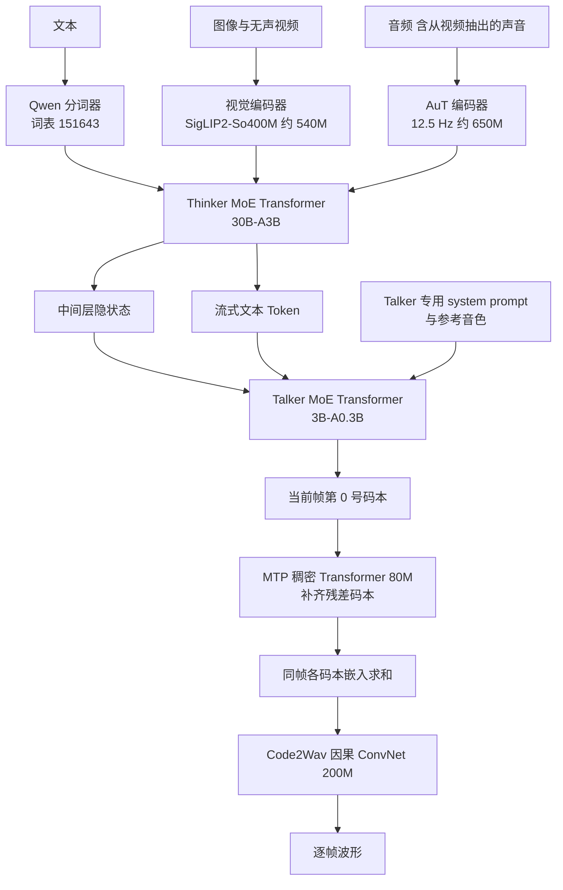
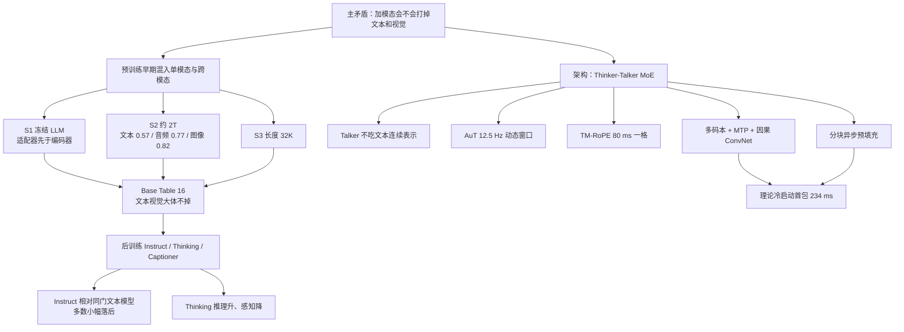

# Qwen3-Omni：加了听和说，原来的读写还在不在

<!-- release-date: 2025-09-21 -->

> 本文依据 Qwen Team（阿里云）发布的 **Qwen3-Omni Technical Report**，即 arXiv:2509.17765v1，封面页眉日期 2025-09-23，共 25 页。页码均指这份 PDF 自身页码。封面水印为 `arXiv:2509.17765v1 [cs.CL] 22 Sep 2025`。截至 2026-09-10 核验，arXiv 当前只有 v1，本地原件即该版，没有换过 PDF。全文会区分三件事：报告明确写了什么、我们如何解释它、哪些是外部资料补充。凡是外部补充都会给出链接并明确标注。
>
> 这篇文章讲的是对外开源的 Qwen3-Omni-30B-A3B 家族（Instruct / Thinking / Captioner），`release-date` 取该家族最早向公众开放使用的官方事件：**2025-09-21**，依据是 [Qwen 官方博客](https://qwen.ai/blog?id=fdfbaf2907a36b7659a470c77fb135e381302028) 标注日期 2025/09/21，正文提供 Qwen Chat、Hugging Face、ModelScope 与 Demo 入口。排除的候选日期见文末。
>
> **同方向边界**：后作 [Qwen3.5-Omni](/reports/Alibaba/Qwen3.5-Omni) 已发布。本文只在方法与代际粒度上对照「后来改了什么问题」，**不把 Qwen3.5-Omni 的延迟表、参数量或基准分写进本文实验**。前作 Qwen2.5-Omni 只引用本报告自己转述的部分，并标注页码。

## 全模态通常要交一笔税

把文本模型做成「也能听、也能看、也能说」的全模态模型，最常见的代价不是做不到，而是原来会的那部分变差。

报告自己把这个现象写在引言里：当代以大语言模型为中心的多模态系统，常常出现模态之间的此消彼长——一个模态涨了，别的模态掉（PDF p.1）。

可以把它想成同一个大脑同时学四门课。加了听力课和口语课之后，原来的阅读和写作往往会被挤占。工程上这通常来自三件事叠在一起：

1. **表示互相抢位置**：音频和视频的 Token 又密又长，文本和图像在注意力里被稀释。
2. **训练目标互相打架**：语音识别要听清每个音素，文本推理要在很长的思维链里保持逻辑，两者对同一套权重的更新方向并不一致。
3. **后训练会偏向新能力**：为了让模型开口说话，往往要在音频数据上再训一轮，文本成绩就从这里开始往下走。

所以这份报告真正要回答的，不是「能不能把四种模态塞进一个模型」，而是一句更苛刻的话：

> **加进音频和视频之后，文本和视觉还能不能跟同系列、同尺寸的单模态模型打平？音频能不能不仅不掉，还明显更强？**

报告的主张是：Qwen3-Omni **第一次**在文本、图像、音频、视频上保持与同系列单模态相当，音频还明显更强（PDF p.1）。这句话是不是宣传，后面会回到 Table 16 和 Instruct 对照表里逐项看。

## 读前先认八个词

后面会反复出现这些名字。第一次读只要记住括号前的人话。

- **全模态（omnimodal）**：一个模型直接吃文本、图像、音频、带声音的视频，并且能直接吐出文本和语音，中间不靠外挂的语音识别或语音合成服务拼接。
- **Thinker 与 Talker**：模型分成两个部件。Thinker 负责理解和思考、生成文字；Talker 负责把 Thinker 的内部状态变成可以播放的语音。这个分工从 Qwen2.5-Omni 就开始了，本报告是在它上面改（PDF p.2）。
- **混合专家（Mixture-of-Experts，MoE）**：模型里有很多组参数（专家），每个 Token 只激活其中一小部分，所以总参数可以很大而单次计算不必很大。
- **AuT（Audio Transformer，音频 Transformer）**：从零训练的音频编码器，把原始波形压成每秒 12.5 个 Token 的表示，供 Thinker 使用。
- **TM-RoPE（Time-aligned Multimodal Rotary Position Embedding，时间对齐的多模态旋转位置编码）**：给文本、音频、图像、视频发位置编号的方法。它把位置拆成时间、高度、宽度三个分量，并让时间编号对应真实的 80 毫秒一格。
- **码本与残差矢量量化（Residual Vector Quantization，RVQ）**：把一小段声音编成一串整数编号。第一个编号给出粗略轮廓，后面的编号一层层补上残差细节。每一层的可选编号集合就叫一个码本（codebook）。
- **MTP（Multi-Token Prediction，多 Token 预测）**：Talker 每一步只自回归预测当前帧的第 0 号码本，剩下的残差码本交给一个很小的模块在同一步里补齐。
- **首包延迟（first-packet latency）**：从输入送进系统，到第一段可以播放的音频出来，中间经过的时间。报告里的 234 ms 是**理论值**，设定是冷启动、无历史上下文（PDF p.1、6）。

## 一句话先说清

Qwen3-Omni 不是把一个语言模型接上语音识别和语音合成。

它做的事情是：在 Qwen2.5-Omni 的 Thinker–Talker 骨架上，把两边都换成 MoE，把音频编码器换成从零训练的 AuT，把语音输出从「等一块上下文再扩散」改成「一帧码本就能用因果卷积出声」，并且从文本预训练的早期就把单模态数据和跨模态数据混在一起练。

报告开源的是三个 Apache 2.0 权重（PDF p.1）：

| 名称 | 报告怎么定位它 |
|---|---|
| Qwen3-Omni-30B-A3B | Instruct 模型，Thinker + Talker，能听能看能说 |
| Qwen3-Omni-30B-A3B-Thinking | 在任意模态输入上显式推理 |
| Qwen3-Omni-30B-A3B-Captioner | 在 30B-A3B 上微调得到的通用音频描述模型 |

另外还有两个内部变体 Qwen3-Omni-Flash-Instruct 和 Flash-Thinking，报告拿来评测、宣称支持方言，但**没有列入开源名单**（PDF p.9、16）。

所以这篇报告最值得记住的，不是某个缩写，而是一句训练判断：

> **全模态能不能免交单模态税，关键不在推理时怎么拼接，而在预训练多早把单模态和跨模态数据放进同一套权重。**

## 报告地图

按原报告章节把主张、数字和图表先摊开。后面每一节都从这张表回到 PDF。

| 原报告位置 | 页码 | 要记住的东西 |
|---|---|---|
| Abstract | p.1 | 「第一次」不退化；36 项音视频里开源 SOTA 32、总体 SOTA 22；119 / 19 / 10 语；冷启动理论首包 234 ms |
| §1 引言与五代升级 | p.1–2 | 相对 Qwen2.5-Omni 的五处改动、四处能力提升 |
| Figure 1 | p.2 | 产品能力示意：推理、翻译、长会议转写、234 ms |
| Figure 2 / §2.1 | p.3–4 | Thinker–Talker 怎么连；Talker 不再吃 Thinker 的高层文本表示 |
| Figure 3 / §2.2 | p.4 | AuT：2000 万小时、12.5 Hz、约 0.6B |
| §2.3 | p.4–5 | 分词器、视觉编码器、TM-RoPE、不再切 2 秒块 |
| §2.4 | p.5 | 多码本自回归 + MTP + Code2Wav ConvNet |
| Table 1–2 / §2.5 | p.6–7 | 模块参数；234 / 547 ms；并发 1 / 4 / 6 的理论延迟 |
| Table 3 / §3 | p.7 | 语种；预训练三阶段；S2 约 2T Token 的模态配比 |
| §4 | p.7–8 | Thinker 三段后训练、Talker 四段、Captioner |
| Table 4–15 / §5 | p.9–14 | 文本 / 音频 / 视觉 / 音视频 / 语音生成 |
| Table 16 / §6 | p.14–15 | 同尺寸、同日程、同数据的不退化对照，这是全文最硬的证据 |
| §7 | p.15–16 | 结论、未来工作 |
| 附录 Table 17–18、§9.2 | p.17–20 | Thinking 在感知任务上更差；Captioner 三个定性例子 |

报告**没有写**：专家总数与激活数的细目、S1 / S3 的 Token 量、GPU 数量与型号、总训练成本、码本层数的正文声明、Talker 取 Thinker 哪几层。没写的后面不会补。

## 先看全景：声音怎么变成一句话，再变成一声

这张图是我们按 PDF p.3 的 Figure 2、Table 1 与 §2.1–§2.4 重画的**机制示意**，不代表任何实测时长。

图上有三处正文没有写死、只能从图里读到：

1. **Talker 拿的是 Thinker 中间层的隐状态**。Figure 2 标注 `Hidden extraction from middle layers`，不是最后一层（PDF p.3）。取哪几层、怎么选，正文没说。
2. **码本编号从 0 画到 15**。Figure 2 里 Talker 出 0 号，MTP 再出 1 到 15 号，求和后送进流式 codec 解码器（PDF p.3）。正文从头到尾没有把码本数量写成数字，所以 16 只能算图上读到的，不能当成报告的正式声明。
3. **视觉编码器在 Table 1 的 Streaming 列是空的**。AuT、Thinker、Talker、MTP、Code2Wav 都打了流式勾，视觉编码器没有（PDF p.6）。视频要流式，靠的是编码器沿时间输出块，而不是这个视觉骨干本身被设计成流式网络。

各模块的规模以 Table 1 为准（PDF p.6）：

| 模块 | 结构 | 参数 | 是否流式 |
|---|---|---:|---|
| 音频编码器 | AuT | 650M | 是 |
| 视觉编码器 | SigLIP2-So400M | 540M | 报告未标 |
| Thinker | MoE Transformer | 30B-A3B | 是 |
| Talker | MoE Transformer | 3B-A0.3B | 是 |
| MTP | Dense Transformer | 80M | 是 |
| Code2Wav | ConvNet | 200M | 是 |
| 端到端首包延迟 | 音频 / 视频 | 234 / 547 ms | — |

正文另有两处与表略有出入：AuT 写成「约 0.6B」（PDF p.4），视觉编码器写成「约 543 million」（PDF p.5）。差的是四舍五入，不是另一档模型。报告没有给出 Thinker 或 Talker 的层数、专家总数、激活专家数，只有 `30B-A3B` 和 `3B-A0.3B` 这种总参数 / 激活参数写法。

## 四个必须同时成立的要求

在拆模块之前，先把它们互相拉扯的关系说清楚。后面每个设计都在回应其中一条。

### 要求一：四种模态都要够用，不能拆成四个模型

用户可能先丢一张图，再开口补一句，再让模型用声音回答。级联系统（ASR → LLM → TTS，中间再插一个视觉模型）能工作，但跨模态推理弱、延迟叠、系统复杂。报告后来说端到端相对级联的好处正是这三项：更强的跨模态推理、更低的端到端延迟、更低的系统复杂度与成本（PDF p.16）。

### 要求二：开口必须快，而且还要能并发

交互场景里，用户说完到模型出声，能等的时间以百毫秒计。报告把冷启动、无历史上下文的理论端到端首包写成 234 ms（PDF p.1、6）。同时还要在工业并发下保持实时因子小于 1（PDF p.7）。这两件事方向相反：算得越省，越容易并发；但省过头，第一包又出不来。

### 要求三：说话要像人，不能等一块音频拼好再合成

Qwen2.5-Omni 的波形阶段是块扩散（block-wise DiT）：Talker 要攒够一块上下文，解码器才开始出声（PDF p.2、6）。块越大音质越好，第一声越晚。Qwen3-Omni 把这个问题转成：码本本身要足够表达音色和副语言，解码器才能瘦成一个只看左边的因果卷积。

### 要求四：加模态不能把文本和视觉打回去

这是全文的主矛盾。如果最后只是「音频 SOTA、文本掉了 5 分」，那它只是又一个音频模型，不是全模态基座。

## 核心设计一：Thinker 想字，Talker 出声，但两者不再共用文本表示

### 旧问题：把「在想什么」和「嗓音是什么样」绑死

Qwen2.5-Omni 已经用 Thinker–Talker 把理解和说话拆开（PDF p.2）。本报告认为上一代还有两个控制问题没解开。

第一，Talker 如果直接吃 Thinker 的高层文本表示，外部系统就很难插进 Thinker 的文字输出。安全过滤、检索增强、函数调用都只能在整段语音出来之后再做，或者根本做不了。

第二，Thinker 的回答风格和 Talker 的嗓音风格被绑在同一套提示上。你很难要求「文字正经、声音轻松」，也很难只换音色、不改内容。

### 新设计：Talker 不再吃 Thinker 的高层文本表示

报告列了五处相对 Qwen2.5-Omni 的结构改动，前三条都关于 Thinker–Talker 怎么连（PDF p.3–4）：

1. Thinker 和 Talker 都换成 MoE，为的是高并发和更快推理。
2. Talker **不再消费 Thinker 的高层文本表示**，只在音频和视觉多模态特征上做条件。
3. 两边可以使用不同的 system prompt，分别控制回答风格和声音风格。
4. Talker 改为多码本自回归：每步出一帧，MTP 补残差码本。
5. Code2Wav 改成轻量因果 ConvNet。

第二条的理由有两层（PDF p.3）：

- 对文本内容来说，离散 Token 和连续嵌入几乎信息等价。Talker 要念的字，看 Token 就够了，不必再看 Thinker 内部那一向量。
- 对「声音要跟画面和原声对齐」这类任务，比如语音翻译里保留韵律和音色，Talker 必须直接看到音频和视觉特征，不能只看到译好的字。

解耦的产品后果是：RAG、函数调用、安全过滤器可以先改 Thinker 的文字，再按需把处理后的文本交给 Talker 做流式合成（PDF p.3）。

§2.4 又写：Talker 的条件包括历史文本 Token、多模态表示、以及当前轮已经流出来的文本（PDF p.5）。这两段并不打架。**断开的是 Thinker 的连续文本嵌入，留下的是离散文本 Token。** 字还在，内部状态不再被当作嗓音的条件。

训练和推理时，Talker 直接吃 Thinker 的高维多模态特征，并共享完整对话历史，所以整套系统仍按一个模型做端到端训练和统一推理（PDF p.4）。

### 工作机制：一帧语音怎么从 Thinker 走到喇叭

把时间拉成一条流水线：

1. Thinker 读入文本、图像、音频，生成文字，同时从中间层抽出隐状态。
2. Talker 看到这些隐状态、离散文本 Token、以及自己的 system prompt / 参考音色。
3. Talker 的骨干对当前帧的码本特征做汇总，用一个线性头预测第 0 号码本。
4. MTP 在同一步里把残差码本补齐。
5. 各码本嵌入求和，送进只看左边的 ConvNet，立刻得到这一帧的波形。

第 0 号码本负责轮廓，残差码本负责细节。报告认为，正是因为多码本把声学细节学完整了，波形重建才能从重的块扩散，瘦成轻的因果卷积，并且音质还更好（PDF p.5）。

### 收益、代价与边界

收益写在结构选择里：控制变细了，外部模块插得进去，说话可以跟画面和原声对齐。

代价是系统变成了两条生成链。Thinker 的文字和 Talker 的语音需要各自的预填充和各自的首 Token 时间。Table 2 把它们加起来才得到 234 ms，说明这两段在冷启动时是串在关键路径上的（PDF p.6–7）。

边界也清楚：报告没有公开 Talker 取 Thinker 哪几层、中间层如何对齐到 Talker 的隐藏维度、参考音色在序列里怎么放。Figure 2 能看见参考音频和对话上下文的分区，正文没有展开。

### 对自己项目的用处

如果你的系统既要「可审核的文字」，又要「可播放的声音」，不要让语音解码器直接绑在语言模型最后一层的连续向量上。把文字做成离散、可替换的接口，把音色做成另一条提示，外部的安全、检索和工具才能插在两条链之间。这个拆法不依赖 30B MoE，小模型同样用得上。

## 核心设计二：AuT，把 2000 万小时压成每秒 12.5 个 Token

### 旧问题：Whisper 不是为「通用音频表示 + 流式预填充」训练的

Qwen2.5-Omni 用的是 Whisper 音频编码器（PDF p.2）。Whisper 擅长语音识别，但报告要的是更一般的音频表示：语音、音乐、声效、以及实时预填充时的局部注意力。继续用现成编码器，等于把上一代的能力上限和注意力形状一起继承下来。

### 新设计：一个从零训练的编码器–解码器，上线只用编码器

AuT 是注意力编码器–解码器，在 2000 万小时带监督音频上从零训练（PDF p.4）。Qwen3-Omni 作为音频编码器使用的是它的编码器部分，约 0.6B 参数，Table 1 写成 650M（PDF p.4、6）。

Figure 3 把压缩链画得很具体（PDF p.4）：

1. 原始波形。
2. 滤波器组特征，帧移 10 ms，也就是每秒 100 帧。
3. 三层 Conv2D 下采样，总共 8 倍，Token 率变成 12.5 Hz。
4. 32 层自注意力编码器，隐状态保持 12.5 Hz。
5. 训练时还有 8 层解码器（自注意力 + 交叉注意力），用来做自回归音频到文本；推理时 Qwen3-Omni 不用这个解码器。

输入侧的前端是：16 kHz 重采样，128 通道梅尔谱，25 ms 窗、10 ms 跳（PDF p.4）。100 Hz 的梅尔帧被 8 倍下采样，正好得到 12.5 Hz，一帧对应约 80 ms 原音频（PDF p.4–5）。这条乘法是报告数字自己能对上的，不是我们外加的。

训练数据配比（PDF p.4）：

- 80% 中英伪标签 ASR；
- 10% 其他语言 ASR；
- 10% 音频理解。

为了同时服务实时预填充缓存和离线音频任务，AuT 用带动态注意力窗口的 Flash Attention，查询可见范围从 1 秒到 8 秒（PDF p.4）。窗口小，流式时每一块都是训练见过的分布；窗口大，离线长音频仍能看远处。

### 收益与代价

收益是双的。表示上，报告把后续的中英 ASR、歌词 ASR、音乐理解成绩主要归给这个从零训练的编码器（PDF p.2、11）。系统上，块状窗口注意力让编码器可以沿时间吐块，Thinker 不必等整段音频到齐再预填充（PDF p.2、6）。

代价同样具体：

- 2000 万小时是很大的监督规模，报告没说其中多少是真人标注、多少是伪标签之外的来源。
- 80% 中英 ASR 会把表示重心拉向语音识别。音乐和声效只从那 10% 音频理解里长出来，后面音乐表确实强，但数据配比本身偏 ASR。
- 12.5 Hz 仍然密。40 分钟音频按 12.5 × 60 × 40 算，约 3 万个音频 Token。**这个乘法是我们按报告数字算的**，报告没有直接写出 40 分钟对应多少 Token，也没有给出推理时的上下文长度上限；预训练最后阶段的长度是 32768（PDF p.7）。

### 对自己项目的用处

流式音频编码器不要只在全上下文上训练。训练时把注意力窗口在 1–8 秒之间拉来拉去，推理时按块预填充才不是分布外输入。窗口范围是超参，1 秒和 8 秒不必照抄，但「训练可见性和部署可见性对齐」这一条可以原样搬走。

## 核心设计三：TM-RoPE，用 80 毫秒一格把四种模态钉在同一根时间轴上

### 旧问题：位置编码既要管「谁在谁前头」，又要管「这是第几秒」

普通 RoPE 给每个 Token 一个一维位置。图像有高和宽，视频还有时间，音频的时间是连续的。Qwen2.5-Omni 的做法是把音视频切成固定 2 秒一块（PDF p.5）。块大小一旦定死，任意时长的流式输入就要靠切块拼接，块边界也会切断时间关系。

更细的问题在 M-RoPE 的角度分配。原版 M-RoPE 用前 16 个旋转角建模时间，这些角频率高、振荡快，局部时间变化敏感，长序列外推差（PDF p.5）。

### 新设计：时间、高、宽三个分量，时间对齐到绝对的 80 ms

TM-RoPE 从 M-RoPE 扩出来，加入绝对时间（PDF p.5）。它把旋转位置编码拆成时间、高度、宽度。新的角度分配是交错的 24、20、20（PDF p.5）。报告的说法是：这样能更均衡地表示局部语义和长程依赖。

四种模态的编号规则不同（PDF p.5）：

| 模态 | 时间 ID | 高度 / 宽度 ID | 实际效果 |
|---|---|---|---|
| 文本 | 三个分量共用同一个位置 ID | 同左 | 退化成一维 RoPE |
| 音频 | 共用位置 ID，再叠加绝对时间，每个时间 ID = 80 ms | 同左 | 位置既编码顺序，也编码真实时刻 |
| 图像 | 全部视觉 Token 共用一个常数时间 ID | 行、列决定高、宽 | 一张图内部有二维结构，没有时间流 |
| 音视频流 | 音频每 80 ms 一个时间 ID；视频帧按真实时间戳动态对齐到同样的 80 ms 一格 | 视频帧的高、宽与静图相同 | 声音和画面在同一根时间轴上对齐 |

多模态拼在一起时，位置编号连续，后一个模态从「前一个模态最大位置 + 1」开始，避免冲突（PDF p.5）。

相对 Qwen2.5-Omni 的关键差别：不再切 2 秒块，而是直接用锚定到绝对时间的时间 ID 对齐音视频。报告认为这样可以支持任意时长的流式输入（PDF p.5）。

视频帧率是动态的，目的是尽量保视频信息，同时跟音频采样率对齐（PDF p.5）。具体抽多少帧、上限多少，报告没写。

### 收益、代价与没写清的地方

收益是概念上的：80 ms 既是 AuT 一帧的时长，也是时间 ID 的一格，也是后面 12.5 Hz 语音码本的一帧。输入音频、位置编码、输出语音，三处用同一根尺子。

代价是长视频仍然受位置外推和上下文长度限制。报告在视觉评测里自己承认：当前模型在长视频基准上表现不佳，原因就是位置外推能力有限、上下文长度受限（PDF p.12）。TM-RoPE 改了角度分配，并没有把这个问题取消。

报告也没有给出 TM-RoPE 的消融：24 / 20 / 20 相对原来的前 16 角，到底在哪张表上好了多少。这是设计说明，不是实验结果。

### 对自己项目的用处

多模态位置编码里，「排序」和「绝对时间」最好不要由同一组高频旋转角同时承担。时间用与编码器帧长相同的格子去对齐，绝对时刻如果还要更精细，可以另开通道——后作 Qwen3.5-Omni 就是把绝对时间进一步写成文本，那是下一世代的问题，不在本报告的实验范围内。

## 核心设计四：多码本自回归 + 因果 ConvNet，为什么比块扩散更快出声

### 旧问题：块扩散在音质和首包之间只能选一边

上一代波形阶段是块扩散（block-wise DiT）。扩散模型看一块上下文再生成波形，块太短，音色和韵律不稳；块太长，用户就要等这块攒够（PDF p.2、6）。报告把这个等待写成 Qwen2.5-Omni 必须「等 Talker 给出足够的块上下文才能合成」（PDF p.6）。

单轨 codec 还有另一个限制：一个编号要同时表达内容、音色、情感和声学细节，容量不够。报告说多码本的容量才能忠实建模多样嗓音、副语言和声学现象（PDF p.2）。

### 新设计：Talker 走 RVQ Token，解码器只看左边

Talker 直接在 RVQ Token 上操作，采用分层预测（PDF p.5）：

1. 骨干吃当前帧各码本特征的汇总，用线性头预测第 0 号码本。
2. MTP 生成该帧全部残差码本。
3. 各码本嵌入求和，送进轻量因果 ConvNet（Code2Wav）。

MTP 是一个「超轻量、固定步数的自回归稠密 Transformer」，参数 80M，带宽需求低，固定步数意味着 KV Cache 大小固定，适合批处理（PDF p.6）。Code2Wav 是 200M 的 ConvNet，卷积在各类推理硬件上加速支持好，同样可批（PDF p.6）。

流式规则叫 **left context only multi-codebook generation**（只看左上下文的多码本生成）：Talker 一产出第一个 Token，MTP 立刻补齐当前帧剩余编号，只看左边的解码器马上把这一帧变成波形（PDF p.6）。不必等下一块。

输入和输出的音频码率都降到 12.5 Hz，输出 codec 支持单帧立即合成（PDF p.2）。一帧 80 ms，Talker 每出一个 Token 就能合成 80 ms 音频（PDF p.7）。

### 收益怎么从延迟表里读出来

冷启动、1 路并发、音频输入的理论首包是这五项之和（PDF p.6）：

| 一段 | 音频 / 视频 |
|---|---:|
| Thinker–Talker 尾包预处理（多模态预处理 + 编码器推理） | 72 / 160 ms |
| Thinker 到首 Token（TTPT） | 88 / 160 ms |
| Talker 到首 Token（TTPT） | 57 / 210 ms |
| MTP 每 Token | 14 ms |
| Codec 解码每码 | 3 ms |
| **合计** | **234 / 547 ms** |

72 + 88 + 57 + 14 + 3 = 234，160 + 160 + 210 + 14 + 3 = 547。加法对得上。报告自己写：这些组件有顺序依赖，总首包就是各项之和（PDF p.6–7）。

设定必须一起记住，否则 234 会被读成产品实测：

- **理论值**，不是用户侧实测（摘要、Table 2 标题都写 Theoretical / theoretical，PDF p.1、6）。
- **冷启动、无先验上下文**（PDF p.1）。
- 实验在 vLLM 上跑并发音视频流，MTP 和 codec 用了 `torch.compile` 与 CUDA Graph（PDF p.6）。
- 硬件只写「typical computational resources」，没有 GPU 型号、数量、精度。

并发上去之后（PDF p.6）：

| | 1 路 | 4 路 | 6 路 |
|---|---:|---:|---:|
| 总延迟 音频 / 视频 | 234 / 547 ms | 728 / 1517 ms | 1172 / 2284 ms |
| Thinker TPS | 75 | 63 | 53 |
| Talker TPS | 140 | 125 | 110 |
| 生成 RTF | 0.47 | 0.56 | 0.66 |

RTF（Real Time Factor，实时因子）的算法报告写清楚了：Thinker 和 Talker 各生成一个 Token 的时间，加上 MTP 和 Codec 每 Token 耗时，再除以 80 ms（PDF p.7）。三档并发 RTF 都小于 1，意思是第一包出去之后，合成速度跟得上播放。

这里有一句报告原文和表格对不上。正文说 MoE 让 Thinker / Talker 的预填充和 TTPT 在高并发下「基本不受影响」（PDF p.7）。Table 2 里预处理确实只从 72 ms 涨到 100 ms，但 Thinker 音频 TTPT 从 88 ms 涨到 673 ms，约 7.6 倍。**「基本不受影响」是宣传句，表上的 TTPT 明显受并发影响。** 真正稳住的是 MTP 和 Codec 这两段轻模块。

### 对自己项目的用处

想把首包压到几百毫秒，先问解码器是不是必须看未来。如果表示（多码本）已经够表达，生成器可以改成因果的、只看左边的小网络，首包就从「一块」变成「一帧」。块扩散不是不能用，它是在表示不够时用计算换音质；表示够了，就把计算从关键路径上拿掉。

## 核心设计五：分块预填充，让 Thinker 和 Talker 不用互相等

### 旧问题：整段音视频到齐再算，第一包必然晚

实时对话里，用户还在说，模型就要开始读。如果 Thinker 必须看到完整输入才预填充，Talker 又必须看到 Thinker 的完整输出才预填充，两段等待会叠在 234 ms 外面。

### 新设计：沿时间吐块，两边异步预填充

Qwen3-Omni 保留了 Qwen2.5-Omni 的 chunked prefilling（分块预填充）。音频和视觉编码器都能沿时间维度输出块（PDF p.6）。实时交互时：

1. Thinker 预填充当前块；
2. 一旦完成，它的高层表示立刻拿去预填充 Talker 的当前块；
3. 与此同时 Thinker 预填充下一块。

报告称这会显著降低 Thinker 和 Talker 的 Time-To-First-Token（PDF p.6）。注意 Table 2 用的缩写是 TTPT，正文这里写 TTFT，指的是同一件事：到第一个 Token 的时间。

MoE 的另一层作用是长序列上少读 KV Cache，从而提高生成 TPS、提高并发（PDF p.6）。这是服务吞吐的理由，不是首包公式里的单独一项。

### 边界

块有多大、音频块和视频块如何对齐、第一块最短多长，报告都没写。能确定的只有：编码器必须沿时间吐块，Thinker 和 Talker 的预填充是异步而不是同步栅栏。

## 预训练：不退化不是评测出来的，是一开始混着练出来的

架构解决的是「怎么连」。报告把「为什么文本和视觉不掉」主要归给预训练配方（PDF p.1–2、7、14–15）。

### 语种

Table 3（PDF p.7）：

| 模态 | 语种数 | 范围 |
|---|---:|---|
| 文本 | 119 | 见 Qwen3 全文列表 |
| 语音输入 | 19 | ar, de, en, es, fr, id, it, ja, ko, ms, nl, pt, ru, th, tr, ur, vi, yue, zh |
| 语音输出 | 10 | de, en, es, fr, it, ja, ko, pt, ru, zh |

相对 Qwen2.5-Omni，提示词从「每个任务一个固定 prompt」改成更多自然语言提示，为的是泛化和指令跟随（PDF p.7）。

### 三阶段

**(1) 编码器对齐 S1。** LLM 用 Qwen3 初始化，视觉编码器来自 Qwen3-VL，音频编码器来自 AuT。两个编码器在**冻结的 LLM** 上分别训练，而且都是先训适配器、再训编码器（PDF p.7）。

他们明确放弃了 Qwen2.5-VL / Qwen2.5-Omni 用过的「LLM 冻结、编码器与适配器联合训练」。理由是：编码器会补偿被冻住的 LLM 的缺陷，结果伤害感知能力（PDF p.7）。人话就是：如果老师被绑住手，学生会学会用自己的方式作弊，而不是把视觉或音频信号翻译成老师本来能懂的语言。

**(2) 通用阶段 S2。** 解冻全部参数。约 2 万亿 Token，模态分布为（PDF p.7）：

| 模态 | Token |
|---|---:|
| 文本 | 0.57T |
| 音频 | 0.77T |
| 图像 | 0.82T |
| 视频 | 0.05T |
| 视频–音频 | 0.05T |

五项相加是 2.26T，与「约 2T」的说法有一点差。报告没有解释是四舍五入、是有重叠计数，还是另有未列入的部分。S2 的要点是：更多样的多模态数据和任务，从这一阶段起就同时出现单模态和跨模态数据。

**(3) 长上下文 S3。** 最大长度从 8192 提到 32768，并提高长音频、长视频比例。报告只说实验显示长序列理解明显提升，没有给出 S3 的 Token 量，也没有给出对应消融表（PDF p.7）。

S1、S3 的数据量、学习率、批大小、GPU 数全部没写。能写进配方卡的，只有 S2 这组模态配比、S3 的 32K 长度，以及「不要在冻结 LLM 上联合训编码器与适配器」。

## 后训练：同一套 Thinker，三条出路

### Thinker 三段：先对齐指令，再蒸馏，再强化学习

数据是 ChatML 格式，包含纯文本、视觉、音频、混合模态对话（PDF p.7–8）。

1. **轻量 SFT。** 目的是在保持预训练特征完整的前提下，把表示对到下游指令。报告强调 SFT 数据格式有意不同于预训练，但结构与预训练模型一致（PDF p.8）。
2. **强到弱蒸馏**，流程按 Qwen3 报告（PDF p.8）：
   - 离策略：把教师模型的输出合在一起做响应蒸馏，让学生先具备基本推理；
   - 同策略：学生自己按采样到的提示生成，再用 KL 散度把学生的 logit 对齐到教师。教师是 Qwen3-32B 或 Qwen3-235B-A22B。
3. **GSPO**，覆盖文本、图像、视频、音频（PDF p.8）。奖励分两种：
   - 规则奖励：数学、代码、指令跟随等可验证任务，防止奖励作弊；
   - 模型奖励：没有客观指标的任务，用 LLM-as-a-judge。一般任务用 Qwen3，视觉任务用 Qwen2.5-VL；有标准答案时会把参考答案一并给评判模型。

GSPO 的公式与动机不在这份报告里。本站另有 [GSPO](/reports/Alibaba/GSPO) 专文。这里只需要知道：Omni 的多模态强化学习用的是同一家族的序列级策略优化，而不是另发明一套 Omni 专用 RL。

### Talker 四段：先能对应，再去幻觉，再稳多语，最后定音色

数据同样 ChatML，为的是和 Thinker 一致（PDF p.8）。

1. 用「数亿」带多模态上下文的语音数据，建立从多模态表示到语音的单调映射。这里的「hundreds of millions of speech data」没有单位，不知道是条数、小时还是 Token。
2. 高质量数据上的持续预训练（CPT），减轻第一段脏数据造成的幻觉，并做长上下文训练。
3. 从多样的多语语音构造偏好对，用 DPO 提高多语生成的泛化和稳定性。
4. 说话人微调，让 Talker 能采用指定声音，并打磨自然度、表现力和可控性。

四段的顺序很清楚：先覆盖，再清洗，再偏好，最后锁音色。报告没有给每段数据量、DPO 的胜负来源，也没有给说话人数量。开源 Instruct 权重在官方仓库里提供 Ethan / Chelsie / Aiden 三种音色，那是仓库文档的外部补充，不是这份 PDF 的内容。

### Thinking：显式推理，但感知任务会倒退

Thinking 模型的定位是：在任意模态输入上显式推理，包括音视频和纯音频场景（PDF p.1–2）。评测里它在 VoiceBench、音视频推理、视觉数学上确实比 Instruct 高（PDF p.11–13）。

附录却给了一个必须留下的反例：在 ASR / S2TT 和音乐理解上，Thinking **不如** Instruct。报告的解释是：这些主要是感知任务，上复杂推理不会带来收益，反而更容易幻觉（PDF p.17）。

所以 Thinking 不是 Instruct 的严格升级档，而是另一条工作方式。转写、打标签走 Instruct；要跨模态想清楚再回答，走 Thinking。

### Captioner：补开源社区没有的通用音频描述

报告认为视觉描述研究很多，音频描述被忽略，而开源社区缺少通用音频描述模型（PDF p.1、8）。做法是：在 Qwen3-Omni-30B-A3B 上，用大规模详细音频描述数据微调，得到 Captioner，目标是详细、低幻觉（PDF p.8）。

**没有定量评测表。** 附录 9.2 只给三个定性例子：夸张念白、电影感音效、语音 + 机械声 + 音乐的混合场景（PDF p.17–20）。音频原件指向 GitHub 仓库。低幻觉是作者描述，不是某张幻觉基准上的分数。

## 实验怎么证明「不退化」，以及 32 / 22 怎么数

评测对象包括开源的 30B-A3B Instruct / Thinking，以及内部的 Flash Instruct / Thinking（PDF p.9）。Flash 用来提高效率、加入方言支持，但不是 Apache 2.0 那三个权重。

下面分三层看：真正控制变量的不退化实验、开源 Instruct 跟同门文本模型的差距、音频 36 项主张。

### 第一层：Table 16，这是「不退化」唯一够格的证据

§6 的实验设计比摘要严谨（PDF p.14–15）：

- 三个同尺寸 30B-A3B Base：纯文本 Qwen3、纯视觉 Qwen3-VL、全模态 Qwen3-Omni，都标成 `-Base-202507`；
- Omni 的文本和视觉语料与单模态基线**完全相同**；
- 学习率日程、批大小、每个模态的有效训练轮数（靠采样比对齐）一致；
- 训练计算（FLOPs）对齐；
- 唯一差别：Omni 在预训练里**多了**音频和音视频数据。

这不是「我们的 Instruct 跟别人家的 72B 差不多」，而是「同一套日程、同一批文本 / 视觉数据，只是多听了声音」。

从 Table 16 读到的方向（PDF p.15）：

文本相对 Qwen3-30B-A3B-Base：多数持平或略升（MMLU 81.24 → 81.69，SuperGPQA 38.24 → 40.14，EvalPlus 69.70 → 73.96，CRUX-O 66.94 → 69.06，GSM8K 90.83 → 91.36），少数略降（MMLU-Pro 61.81 → 61.57，MATH 60.84 → 60.42，BBH 83.79 → 83.53，MultiPL-E 65.75 → 64.79，INCLUDE 65.17 → 64.73）。没有出现「加了音频、文本崩掉」的形状。

视觉相对 Qwen3-VL-30B-A3B-Base：MMMU 57.22 → 59.33，MMStar 67.2 → 69.6，OCR 类多数持平或升（InfoVQA 81.17 → 83.31），RealWorldQA 73.98 → 71.89 下降，MVBench 71.87 → 69.50 下降，LVBench 48.61 → 51.07 上升。

报告自己从这张表和内部实验抽出三条观察（PDF p.15）：

1. 预训练早期就做多模态混合，语言模型可以和视觉或音频一起训，而不掉语言能力。
2. **加入文本会明显提高视觉和音频**；反过来，加入视觉或音频，**没有测到语言能力的增益**。
3. 经验上，加入音频会稳定提高 MMMU 和 OCR 相关任务。

第 2 条很重要：全模态的好处主要是「文本帮了视觉 / 音频」，不是「声音帮了语言」。不退化成立；「互相增强」只在一个方向上被这张表支持。

报告也承认：成本太高，没有在所有规模上做完整扫描（PDF p.15）。所以「第一次」如果要当成普遍规律，证据只覆盖这一档 30B-A3B Base。

### 第二层：Instruct / Thinking 跟同门文本模型并不是打平

§5.1.1 写道：Qwen3-Omni-30B-A3B 的文本能力与 Qwen3-30B-A3B-Instruct-2507 / Thinking-2507「on par」（PDF p.9）。Table 4–5 并不支持把这句话读成全面打平。

Instruct 对照（PDF p.10）：

| 基准 | Qwen3-30B-A3B-Instruct-2507 | Omni-Instruct | 方向 |
|---|---:|---:|---|
| MMLU-Redux | 89.3 | 86.6 | 掉 |
| GPQA | 70.4 | 69.6 | 略掉 |
| AIME25 | 61.3 | 65.0 | 升 |
| ZebraLogic | 90.0 | 76.0 | 掉 14 分 |
| MultiPL-E | 83.8 | 81.4 | 掉 |
| IFEval | 84.7 | 81.0 | 掉 |
| WritingBench | 85.5 | 82.6 | 掉 |
| BFCL-v3 | 65.1 | 64.4 | 略掉 |
| PolyMATH | 43.1 | 37.9 | 掉 |

Thinking 对照更明显：AIME25 从 85.0 掉到 73.7，LiveBench 从 76.8 掉到 71.8，BFCL-v3 从 72.4 掉到 63.2（PDF p.10）。

**Base 不退化，是 Table 16 支撑的。后训练之后的 Instruct / Thinking 相对同门文本模型，多数基准是小幅到中幅落后。** 「on par」是宣传句。唯一明显领先的是 Instruct 的 AIME25。

论文还写 Instruct「尽管参数更小，仍超过 Qwen3-235B-A22B Non-Thinking 和 GPT-4o-0327 的一组基准」（PDF p.9）。那一组是 GPQA、AIME25、ZebraLogic、WritingBench、PolyMATH。对照 Table 4，Omni-Instruct 相对 GPT-4o 确实在 AIME25、ZebraLogic、WritingBench、PolyMATH 上更高，GPQA 也更高；但相对同门 30B Instruct-2507，ZebraLogic 和 PolyMATH 是明显更低的。挑选对照对象，会改变这句话的味道。

### 第三层：音频和音视频，36 / 32 / 22 必须回表

摘要写：36 个音视频基准里开源 SOTA 32、总体 SOTA 22（PDF p.1）。结论第 7 节改口成「音频处理与对话基准上开源 32」，没有再写 36 的分母（PDF p.16）。**报告从未列出这 36 项的名单。**

我们按 Table 6、7、8、11、12 能点到的理解向基准去数，得到 36 这个分母的一种拼法：

- ASR / S2TT 15 项：Wenetspeech net / meeting、Librispeech clean / other、CV15-en / zh、Fleurs-en / zh、Fleurs-avg 19 语、MIR-1K、Opencpop、Fleurs en2xx / xx2en / zh2xx / xx2zh（PDF p.10）；
- VoiceBench 9 个子集（不含 Overall）：AlpacaEval、CommonEval、WildVoice、SD-QA、MMSU、OpenBookQA、BBH、IFEval、AdvBench（PDF p.11）；
- 音频推理 2 项：MMAU、MMSU（与 VoiceBench 的 MMSU 分列，PDF p.11）；
- 音乐 7 项：RUL-MuchoMusic、GTZAN、MTG Genre / Mood / Instrument / Top50、MagnaTagATune（PDF p.11）；
- 音视频 3 项：WorldSense、DailyOmni、VideoHolmes（PDF p.13）。

15 + 9 + 2 + 7 + 3 = 36。这是我们的复原，不是报告自己的清单。若把 VoiceBench 只算总分、或把 Flash 排除在「Qwen3-Omni」之外，分母和分子都会变。

在「家族内取最好成绩、Flash 算自己人、Voxtral 算开源、Seed-ASR / Gemini / GPT-4o 算闭源」的口径下，表上读到的形状是：

**中英 ASR 和歌词 ASR 确实是强项。** Librispeech clean 1.22、other 2.44、Fleurs-zh 2.19、Opencpop 1.54、MIR-1K 5.85，均好于表中的 Seed-ASR、GPT-4o-Transcribe、Gemini-2.5-Pro、Qwen2.5-Omni（PDF p.10）。Wenetspeech meeting 上 Seed-ASR 的 5.69 仍略好于 Flash 的 5.75。

**多语 ASR 和 S2TT 不是全面 SOTA。** Fleurs-avg 19 语 Flash 5.31，差于 GPT-4o-Transcribe 的 4.48；四项 S2TT 的最高 BLEU 都在 Gemini-2.5-Pro，其中 en2xx / xx2en / xx2zh 上开源的 Voxtral-Small 也高于 Omni-Instruct（PDF p.10）。摘要把 Seed-ASR、GPT-4o-Transcribe、Gemini-2.5-Pro 写成被全面超过的对象，S2TT 这四行并不支持。

**VoiceBench 总分 Thinking 88.8、Flash-Thinking 89.5，Gemini-2.5-Pro 是 89.6**（PDF p.11）。差 0.1，报告自己写「除 Gemini-2.5-Pro 以外超过所有音频语言模型」。子集上 SD-QA、BBH、IFEval 仍是 Gemini-2.5-Pro 更高。

**音乐 7 项 Instruct / Flash-Instruct 全部高于表中的专家模型和 Gemini / GPT-4o**（PDF p.11）。这一块与摘要一致。

**音视频 3 项：** WorldSense Flash-Instruct 54.1 高于 Gemini-2.5-Flash 50.9 和此前开源 SOTA 47.1；DailyOmni、VideoHolmes 的 Thinking 也高于 Gemini-2.5-Flash-Thinking（PDF p.13）。

**我们无法从这些表唯一复原「32」和「22」。** 不同的分母切法（VoiceBench 算 1 还是 9、Flash 算不算、S2TT 算不算开源失败）会得到 32 附近的不同整数。把 32 / 22 当成摘要口径，不要当成可逐项勾选的实验结论。

### 视觉：图上推理强，长视频弱

Instruct 相对 Qwen2.5-VL-72B：MMMU-Pro 57.0 vs 51.1，MathVista mini 75.9 vs 74.8，MATH-Vision 56.3 vs 38.1，这些数学 / STEM 项更好；Video-MME 70.5 vs 73.3，CountBench 90.0 vs 93.6，文档理解也不占优（PDF p.12）。跟 72B 比「comparable」只在部分项上成立，而且对照对象不是同尺寸 Qwen3-VL。

Thinking 相对 Instruct，数学 / STEM 平均高 4.4 分（PDF p.12）。长视频三项明显落后于 Gemini-2.5-Flash-Thinking（Video-MME 69.7 vs 79.6，LVBench 49.0 vs 64.5，MLVU 72.9 vs 82.1）。报告把原因写成位置外推和上下文长度（PDF p.12）。这是全文少有的、作者自己承认的架构缺陷。

### 语音生成：英语零样本稳，日语和跨语并不全面领先

评测只做「给定文本的语音生成」，因为缺相关的音视频到语音基准（PDF p.13）。

Seed-TTS 内容一致性（WER，越低越好，PDF p.13）：Omni 中文 1.07、英文 1.39。英文是表上最好；中文差于 CosyVoice 3 的 0.71。报告写强化学习提高了生成稳定性，并在 test-en 上取得最好。说话人相似度 SIM 在 Table 13 的标题里出现，表里只印了内容一致性，SIM 数字没有出现。

MiniMax 多语测试集（PDF p.14）：中英法的内容一致性明显好于 MiniMax 和 ElevenLabs（中文 0.716 vs 2.252 / 16.026），德语 WER 则是 ElevenLabs 的 0.572 更好，西语、日语也不是全面最好。说话人相似度各语言大多接近 MiniMax。

跨语克隆相对 CosyVoice 3（PDF p.14）：any-to-en、any-to-ko 更好；日语方向 Omni 没有做文本规范化，仍与把日文转成假名的 CosyVoice 3 接近。en-to-zh、ja-to-zh、zh-to-ja 仍是 CosyVoice 3 更低 WER。

语音生成的证据支持「能用、英文很稳、中英法克隆干净」，不支持「十语全面 SOTA」。

## 限制、没公开的信息、以及哪些句子是宣传

报告第 7 节列的未来工作，其实就是当前做不到或没做好的事（PDF p.16）：多人 ASR、视频 OCR、音视频主动学习、更强的 agent 与函数调用。再加上正文里已经点名的长视频弱点（PDF p.12），和附录里 Thinking 伤害感知任务（PDF p.17）。

没写、因而本文也不补的：

- Thinker / Talker 的层数、头数、专家数；
- S1、S3 的 Token 量，Talker 四段的数据量；
- GPU 型号、数量、训练墙钟时间、总成本；
- 码本层数的正文数字（只有 Figure 2）；
- Talker 抽取 Thinker 哪几层；
- 分块预填充的块大小；
- Captioner 的定量指标；
- Flash 的架构差异与是否开源；
- 推理上下文上限（只知道 S3 训到 32768，产品侧 40 分钟音频）。

需要标成宣传句、不能当实验结论的：

- 「第一次在四种模态上都不退化」——Base 的 Table 16 大体支持，Instruct / Thinking 的 Table 4–5 不支持全面打平。
- 「36 项开源 32、总体 22」——分母没有清单，S2TT 和部分 VoiceBench 子集对不上「全面超过 Gemini / GPT-4o / Seed-ASR」。
- 「MoE 使 TTPT 在高并发下基本不受影响」——Table 2 的 Thinker TTPT 从 88 ms 涨到 673 ms。
- Captioner「低幻觉」——只有定性例子。
- 234 ms——理论值、冷启动、未公布硬件，不是产品实测。官方博客另写音频 211 ms、音视频 507 ms、音频理解 30 分钟，与 PDF 的 234 / 547 ms、40 分钟不一致。博客数字是外部补充，不进入本文实验主表。

## 最值得带回自己项目的七条

### 1. 不退化要写进预训练日程，不要写进口号

Table 16 之所以有说服力，是因为它控制了文本 / 视觉数据和计算量，只多加音频。如果只在后训练里「再混一点音频」，前面对齐好的文本能力很容易被冲掉。要宣称不交税，就得在早期混合，并用同日程单模态基线对照。

### 2. 冻结主干时，不要让新编码器联合适配器一起作弊

S1 放弃「冻 LLM、编码器与适配器联合训练」，因为编码器会补偿主干的缺陷（PDF p.7）。任何「已有强主干、新接一个模态」的项目都该先训适配器、再训编码器，并在冻结主干上把两个编码器分开训。

### 3. 文本帮视觉，声音不帮语言——把增强方向想清楚

报告自己的观察：加文本能抬视觉和音频；加视觉或音频，语言没有测到增益（PDF p.15）。跨模态训练不是自动互惠。数据配比该按「谁在帮谁」来定，而不是按「四种模态各四分之一」来定。

### 4. 同一根 80 ms 尺子量输入、位置和输出

AuT 一帧 80 ms，TM-RoPE 一个时间 ID 80 ms，语音码本一帧 80 ms。实时系统里，这比单独把某个模块做快更有效。先定格子，再谈上下文和首包。

### 5. 表示够了，就把非因果的重模块从首包路径上拿掉

多码本把容量给足之后，块扩散可以换成因果 ConvNet，首包从「一块」变成「一帧」。这是「先加表示容量、再减生成器复杂度」的例子，不限于语音。

### 6. 把可审核的字和可播放的声拆成两条接口

Talker 不吃 Thinker 的连续文本嵌入，外部安全、检索、工具才能改字再合成。需要合规的语音系统，优先做这个解耦，而不是先上更大的 codec。

### 7. 推理模式按任务开关，不要默认「越想越好」

Thinking 在音视频推理、VoiceBench、视觉数学上有用，在 ASR 和音乐上会幻觉（PDF p.17）。感知任务走直出，推理任务再开思维链。这个开关比把 Thinking 当全面升级更符合表。

## 用一张图把主矛盾接回系统

这是按 §2–§6 重画的机制关系图，不是训练时间线，也不是实测延迟。

## 关键词回看

- **Thinker / Talker**：理解写字的 MoE，和把中间状态变成语音码本的 MoE。
- **表示解耦**：Talker 不再消费 Thinker 的高层文本嵌入，但仍看离散文本 Token 与音视觉特征。
- **AuT**：从零训练的音频编码器–解码器，上线只用编码器，12.5 Hz，动态 1–8 秒注意力窗口。
- **TM-RoPE**：时间 / 高 / 宽 24 / 20 / 20 的旋转位置编码，时间格与 80 ms 对齐，取消固定 2 秒切块。
- **RVQ 多码本**：一帧声音由第 0 号码本加残差码本共同表示。
- **MTP**：固定步数的小稠密 Transformer，同一步补齐残差码本。
- **Code2Wav**：只看左上下文的因果 ConvNet，单帧即可出波形。
- **分块预填充**：编码器沿时间吐块，Thinker 与 Talker 异步预填充。
- **GSPO**：Thinker 后训练第三段使用的序列级强化学习，细节见 GSPO 专文。
- **Captioner**：在 30B-A3B 上微调的通用音频描述模型，只有定性例子。
- **TTPT / RTF / 首包延迟**：到首 Token 时间、合成 80 ms 音频所需计算与 80 ms 之比、到第一段可播放音频的时间。234 ms 是理论冷启动值。

## 最后的判断

Qwen3-Omni 这份报告的价值，不在于又发布了一个 30B MoE，而在于它把全模态领域里很少被认真对照的问题做成了实验：

> **多加音频和视频，会不会把同尺寸的文本和视觉打回去？**

它给出的答案，分层看是清楚的。

**被实验撑住的：**

- 在 30B-A3B Base、同数据同计算的对照里，文本大体不掉，视觉多数持平或更好，音频成为这项训练的增量（Table 16）。
- 中英 ASR、歌词 ASR、音乐理解、WorldSense 这类音视频理解，开源权重和内部 Flash 都处在表的最前列。
- 多码本 + 因果 ConvNet + 分块预填充，作为一条降低首包的结构链，与 234 ms 的分项加法自洽。
- Thinking 对需要推理的任务有用，对纯感知任务有害——正反两边都有表。

**说得过满的：**

- 「第一次四种模态都不退化」若包含 Instruct / Thinking，Table 4–5 不支持。
- 「36 / 32 / 22」没有清单，S2TT 和若干 VoiceBench 子集对不上全面超过闭源系统。
- 「TTPT 高并发基本不受影响」与 Table 2 矛盾。
- Captioner 的低幻觉、Flash 的方言能力，都缺少可核验的表。

**没公开、因而不能当图纸用的：**

专家配置、S1 / S3 规模、硬件、码本层数、中间层选取、块大小。这是一份能力与结构说明，不是复现指南。

如果只记一句话：

> **全模态免税的关键，是预训练多早把单模态和跨模态放进同一套权重，并用同日程的单模态基线把这句话测死；推理侧的 Thinker–Talker、80 ms 时间格和单帧出声，解决的是另一件事——开口要快。**

## 资料与阅读边界

- 原始依据：本地 `papers/Alibaba/Qwen3-Omni.pdf`，Qwen3-Omni Technical Report，arXiv:2509.17765v1，封面页眉 2025-09-23，共 25 页。本文所有页码指该 PDF 自身页码。
- 版本核验：[arXiv:2509.17765](https://arxiv.org/abs/2509.17765) 提交历史只有 v1（2025-09-22 13:26:24 UTC），本地文件即 v1。主维护者已核封面水印与页数，本文没有更换 PDF。
- `release-date` 依据：本文覆盖对外开源的 Qwen3-Omni-30B-A3B 家族（Instruct / Thinking / Captioner），取该家族**首次通过官方渠道向公众开放使用**的日期 **2025-09-21**。证据是 [Qwen 官方博客 Qwen3-Omni: Natively Omni-Modal Foundation Models!](https://qwen.ai/blog?id=fdfbaf2907a36b7659a470c77fb135e381302028)，页面标注 2025/09/21，并给出 Qwen Chat、Hugging Face、ModelScope 与 Demo。排除的候选日期及理由：
  - **2025-09-20**：Hugging Face `Qwen/Qwen3-Omni-30B-A3B-Instruct` 的 `initial commit`（2025-09-20T03:16:00Z）与 `Upload folder using huggingface_hub`（2025-09-20T03:21:44Z）。按本仓库对 Gemma / Qwen2.5 的同一口径，这是权重仓提前上传，**不构成公开可用事件**。仓库 `createdAt` 按流程禁用。
  - **2025-09-21T09:46:10Z**：GitHub `QwenLM/Qwen3-Omni` 的 `created_at`。按任务要求不能当首发日；该日仓库里还没有实质 commit。
  - **2025-09-22**：GitHub 首个有实质内容的 commit `ae5dbf9`「Initial commit」（2025-09-22T16:05:18Z）；README News 写 `2025.09.22: We have released Qwen3-Omni`；arXiv v1 提交。这三件都晚于官方博客，且论文上传不回写首发日。
  - **2025-09-23**：PDF 页眉日期，是生成时刻，不是首发日。
  - **2025-09-08** 的 [Qwen3-ASR-Flash 博客](https://qwen.ai/blog?id=41e4c0f6175f9b004a03a07e42343eaaf48329e7) 提到服务「建立在 Qwen3-Omni 之上」，那是另一个产品名，不是本家族三个开源权重的对外可用日。
- 外部补充一：上述官方博客把音频延迟写成 211 ms、音视频 507 ms、音频理解 30 分钟，与 PDF 的理论 234 / 547 ms、40 分钟不一致。正文实验只用 PDF。
- 外部补充二：[GitHub QwenLM/Qwen3-Omni](https://github.com/QwenLM/Qwen3-Omni) 的模型说明、三种开源音色名、FlashAttention / vLLM 部署提示，用于交代开源形态，不进入架构或实验数字。
- 外部补充三：GSPO 的目标函数与动机见本站 [GSPO](/reports/Alibaba/GSPO)，不是本报告的内容。
- 同系列后作：[Qwen3.5-Omni](/reports/Alibaba/Qwen3.5-Omni) 已发布。它在 Token 率、混合注意力、文本时间戳、语音文本交织上换了问题提法。本文只在代际上指出「后来还在改时间轴」，**没有引用后作的任何延迟、参数或基准分**。
- 同系列底座：Thinker 初始化来自 Qwen3，视觉编码器来自 Qwen3-VL，强到弱蒸馏的教师是 Qwen3-32B / Qwen3-235B-A22B。这些名字以本报告自己的句子为准；不把 Qwen3 或 Qwen3-VL 报告里的实验表倒灌进来。
- 本文中所有标注为「我们的计算」「我们的复原」「我们的判断」的内容，都不是报告原话。报告未写的实现细节一律标为未公开，没有补写。
