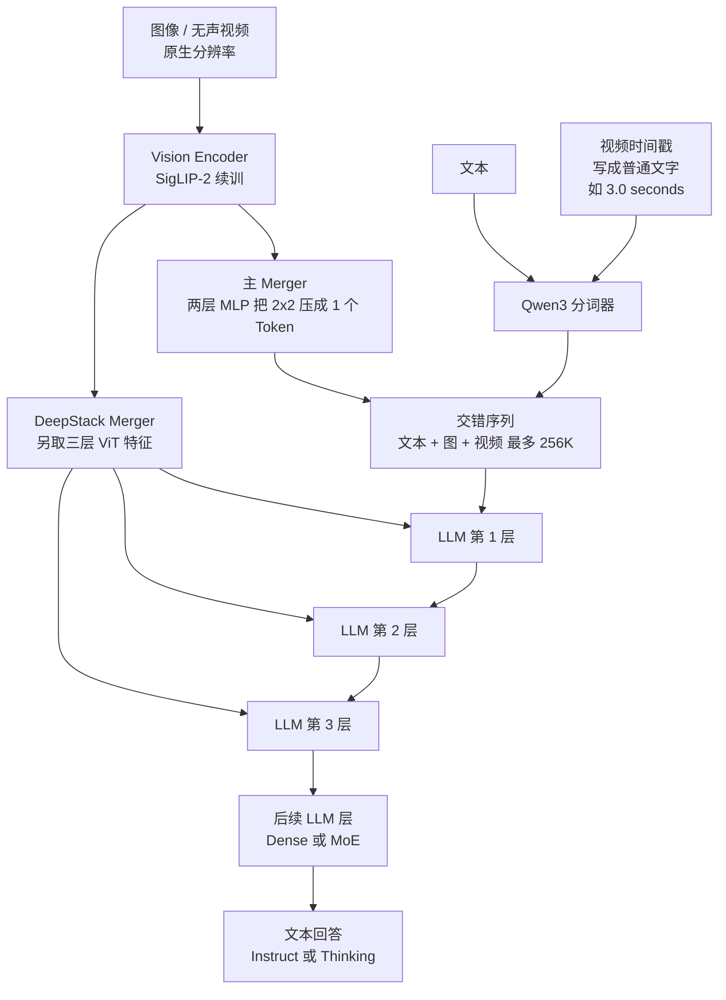
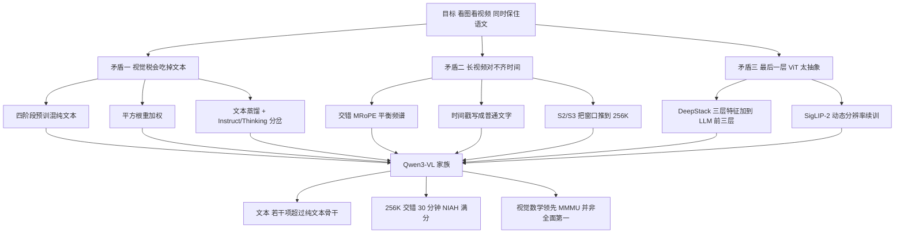

# Qwen3-VL：视觉接进来以后，文字还得站得住

<!-- release-date: 2025-09-23 -->

> 本文依据 Qwen Team 发布的 **Qwen3-VL Technical Report**，即 arXiv:2511.21631v2、2025-11-27 修订、共 42 页。PDF 封面水印为 `arXiv:2511.21631v2 [cs.CV] 27 Nov 2025`；页眉日期 December 1, 2025 是文稿日期，不是模型首发日。页码均指这份 PDF 自身页码。全文会区分三件事：报告明确写了什么、我们如何解释它、哪些是外部资料补充。凡是外部补充都会给出链接并明确标注。
>
> `release-date` 取 **2025-09-23**。这篇文章覆盖 Qwen3-VL 模型家族（dense 2B/4B/8B/32B 与 MoE 30B-A3B/235B-A22B），取该家族首次经官方渠道向公众开放使用的日期。官方仓库 News 写明 2025.09.23 开源旗舰 235B-A22B 的 Instruct 与 Thinking；Hugging Face 权重文件同日开始提交。论文上传日（2025-11-26）不是模型可用日。完整证据见文末。

## 先说最重要的矛盾

视觉语言模型有一个反复出现的税：把眼睛接上以后，嘴巴会变笨。

更具体一点，是三件事同时卡住：

1. **视觉变强，文字变弱。** 训练时图像、视频、OCR 占了容量，纯文本理解、数学和代码往往会掉一截。下游却仍然要求它「既能看图，又能把题算对」。
2. **长视频对不齐时间。** 常见做法是把绝对时间写进位置编号。视频一长，位置 ID 又大又稀，模型很难回答「第 37 秒发生了什么」。
3. **ViT 只把最后一层交给语言模型。** 浅层的边缘、纹理、文字笔画，还没来得及进语言模型就已经被压掉了。想补细节，又不能把视觉 Token 再复制几遍——上下文已经很贵。

Qwen3-VL 的主张是：这三件事可以一起做，不必互相拆台。报告把它写成三根柱子：（PDF p.1）

- 纯文本理解不掉，有时超过同尺寸纯文本骨干；
- 原生 256K 交错窗口，文本、图像、视频可以混排；
- 单图、多图、视频上的推理，尤其是 MMMU 和视觉数学。

架构上对应三次升级：把 MRoPE 的频率分配改成交错；用 DeepStack 把多层 ViT 特征接到语言模型前几层；视频从 T-RoPE 改成显式文本时间戳。（PDF p.1–p.2）

这篇文章要回答的，不是「Qwen3-VL 分数高不高」，而是：**这三根柱子有没有被表格撑住，三次升级各自解决了哪一段旧矛盾。**

## 读前先认八个词

后面会反复出现这些名字。第一次读只要记住括号前的人话。

- **Token（词元）**：模型读写时的基本小块。一张高分辨率图可能变成上万个视觉 Token，一段两小时视频也要靠它来记账。
- **ViT（Vision Transformer，视觉 Transformer）**：把图像切成小块、再编成一串向量的视觉编码器。Qwen3-VL 用的是续训过的 SigLIP-2。（PDF p.3）
- **Merger（视觉–语言投影）**：把 ViT 的输出压到和语言模型同一隐藏维度的两层 MLP。默认把相邻 $2 \times 2$ 个视觉特征压成一个 Token。（PDF p.3）
- **MRoPE（Multimodal Rotary Position Embedding，多模态旋转位置编码）**：给文本、图像、视频的 Token 编「它在时间、宽度、高度上的位置」。Qwen2-VL 引入，Qwen2.5-VL 继续用。（PDF p.2–p.3）
- **DeepStack**：不把视觉信息只从序列开头塞进去，而是把多层 ViT 特征加到语言模型前几层的残差上。上下文长度不增加。（PDF p.4）
- **T-RoPE**：Qwen2.5-VL 把绝对时间写进位置 ID 的做法。Qwen3-VL 认为它在长视频上会失效，改成文本时间戳。（PDF p.4）
- **Instruct / Thinking**：后训练分岔成两种模型。Instruct 直接答；Thinking 先写长思维链再答。不是同一套权重上的开关。（PDF p.2、p.9）
- **MoE（Mixture-of-Experts，混合专家）**：总参数可以很大，每个 Token 只激活其中一小部分。旗舰 235B-A22B 的意思是总参数 235B、每 Token 激活 22B。（PDF p.2）

## 一句话先说清

Qwen3-VL 不是把 Qwen3 后面接一个视觉插件。

它做的事情，是在 Qwen3 骨干上重排视觉进语言模型的三条通路：

- 位置编码改成交错的 MRoPE，让时间、宽、高共享整段频率；
- 视觉特征改成「主序列一条 + 前三层各补一针」的 DeepStack；
- 视频时间改成普通文字，写成 `<3.0 seconds>` 这样的时间戳，不再塞进位置编号。

训练上则用四阶段把上下文从 8K 推到 256K，再用平方根重加权去平衡文本和多模态的损失。后训练把 Instruct 和 Thinking 分成两套，并额外做了「对着图想、再调用放大工具」的 agent 训练。（PDF p.1–p.2、p.4、p.9、p.12–p.13）

所以最值得记住的不是某个缩写，而是一句工程判断：

> **视觉语言模型的第一性问题，不是再堆一层更新的 ViT，而是：视觉信号从哪一层进来、时间写在哪条通道上、以及训练损失会不会把语文挤掉。**

## 先看全景：眼睛、投影、脑子怎么接

这张图按 PDF p.3 的 Figure 1 与 §2 正文重画，是机制示意，不代表任何实测延迟。

图上有三处需要单独指出来，因为它们决定后面每一节怎么读：

1. **主路径仍然是「ViT → 一个 Merger → 插进序列」。** $2 \times 2$ 压缩是在省上下文：四个相邻视觉特征变成一个 Token，再和文本排在一起。（PDF p.3）
2. **DeepStack 不占用额外序列位置。** 它把另外三层 ViT 特征投影后，加到语言模型前三层的隐藏状态上。所以它是「残差里多打三针」，不是「序列里多贴三份图」。（PDF p.4）
3. **视频的时间不是位置编码的一部分。** Figure 1 把时间戳画成和文本一样的小方块，标成 timestamp in text format。这就是后面要讲的、从 T-RoPE 退回到普通文字的那一步。（PDF p.3–p.4）

Figure 1 还在图上写了几张输入的 Token 数，正文没有重复：Picture 1 是 11427 个 Token 的长图，Picture 2 只有 8 个 Token，Picture 3 是 1125 个 Token。这说明视觉序列长度随分辨率剧烈变化，256K 窗口首先是在给「很多张图 + 很长的视频 + 夹在中间的文字」留位置，不是只给纯文本扩窗。（PDF p.3，读自 Figure 1）

### 模型家族：同一套结构，两种成本档

报告在摘要里写四档 dense、两档 MoE；第 2 页正文却写成「three dense variants (Qwen3-VL-2B/4B/8B/32B)」。名单是四个名字，**这是原文笔误，按摘要的四档 dense 来记。**（PDF p.1–p.2）

| 形态 | 型号 | 报告给出的规模 | 视觉编码器 | 主要定位 |
|---|---|---|---|---|
| Dense | 2B、4B | 未给层数 | SigLIP2-Large（300M） | 端侧 |
| Dense | 8B、32B | 未给层数 | 默认 SigLIP2-SO-400M | 8B 已经能打前代 72B 的视频；32B 是中坚 |
| MoE | 30B-A3B | 总 30B、激活约 3B | 默认 SigLIP2-SO-400M | 用更小激活换延迟 |
| MoE | 235B-A22B | 总 235B、每 Token 激活 22B | 默认 SigLIP2-SO-400M | 旗舰 |

视觉编码器这一行来自 PDF p.3：默认 SigLIP2-SO-400M，2B 和 4B 改用 300M 的 SigLIP2-Large。**报告没有给出任何一档 LLM 的层数、隐藏维度、专家数或词表大小**——这些只能到权重配置里查，不能从这份 PDF 补。旗舰「235B 总参数、22B 激活」是正文写明的。（PDF p.2）

什么时候用 dense、什么时候用 MoE，报告自己的判据只有一句话：迁就不同的延迟–质量折中。（PDF p.1）从表上看，可以再补两条**我们的读法**，不是报告原话：

- 要在单机或端侧跑、激活规模必须小，选 2B/4B/8B；8B 在视频理解上已经接近前代 Qwen2.5-VL-72B。（PDF p.20）
- 要在相近延迟下冲分数，30B-A3B 和 32B 是一对对照：一个靠稀疏激活，一个靠稠密算力。旗舰 235B-A22B 才是和 Gemini 2.5 Pro、GPT-5 放在同一张主表里的那一档。（PDF p.15–p.16）

每一档都同时发 Instruct 和 Thinking。报告把后训练「bifurcate」成两种数据格式，不是 Qwen3 那种同一套权重上的 `/think` 开关。（PDF p.2、p.9）

## 核心设计一：交错 MRoPE，让时间不再独占低频

### 旧问题：把 $t$、$h$、$w$ 切成三段，频谱会歪

Qwen2-VL 引入 MRoPE 时，把位置编码的维度切成三组：时间 $t$、水平 $h$、垂直 $w$，各组用不同的旋转频率。（PDF p.3）

可以把它想成给每个 Token 发一张三维坐标纸。如果把低频全部留给时间、把高频全部留给宽和高，那么：

- 时间轴很擅长「这是很久以前还是刚刚」；
- 空间轴很擅长「这是左边还是右边的细边」；
- 但「一段很长的视频里，某个小物体慢慢挪到了画面另一侧」这种又远又细的事，两边都吃亏。

报告说，后续研究已经观察到这种频谱不平衡会损害长视频理解。（PDF p.3）Qwen2.5-VL 继续沿用这套切分，只是另外用 T-RoPE 去对齐绝对时间；频谱问题并没有从根上改。（PDF p.2、p.4）

### 新设计：把 $t$、$h$、$w$ 交错进整段频率

Qwen3-VL 不再按块切维度，而是把 $t$、$h$、$w$ 交错分配到所有位置编码维度上，让三条轴在低频和高频里都有代表。（PDF p.3）

人话是：时间不再独占「远近」，空间也不再独占「细节」。三条轴都既能看远，也能看细。

报告把这篇改法的出处写成 Huang et al., 2025，即参考文献里的 *Revisiting multimodal positional encoding in vision-language models*。（PDF p.3、p.28）**交错方式的具体周期、每条轴占几维，这份技术报告没有写。** 它只给出了设计动机和定性效果：平衡频谱、减轻原来的偏差、显著改善视频的长程位置建模。（PDF p.3）

### 它接在系统哪里

交错 MRoPE 作用在整条交错序列上，包括文本 Token、图像 Token 和视频 Token。它不管「这段视频是第几秒」——那件事已经交给下一节的文本时间戳。它只管「这个 Token 相对其他 Token 的时空格子」。

### 收益、代价、没写的消融

报告在视频评测里把 interleaved MRoPE、文本时间戳和更密的时间字幕放在一起，说它们共同让 8B 的视频成绩接近前代 72B。（PDF p.20）**没有单独把交错 MRoPE 拿出来做消融。** 所以「显著改善长程位置建模」目前是作者判断，不是这份 PDF 里能分离的实验结论。

可迁移的启发很直接：位置编码里每条轴分到的频率，就是它能分辨的尺度。哪条轴只分到高频，它就看不见远的结构；只分到低频，它就看不见细的结构。与其给时间、空间各切一段，不如让它们共享整段频谱。

## 核心设计二：DeepStack，多层 ViT 特征不占上下文

### 旧问题：最后一层已经太抽象

标准接法是：ViT 跑完，取最后一层，投影，当成视觉 Token 拼进语言模型。

最后一层擅长「这是一只猫、这是一张发票」，不擅长「发票右下角那行被折过的小号字」。浅层特征有边缘和纹理，但常规接法不会把它们交给语言模型——再拼一份就等于视觉 Token 翻倍，256K 窗口会先被图吃光。

### 新设计：三层 ViT 特征，加到 LLM 前三层

报告从 Meng et al., 2024 的 DeepStack 借来名字，但用法不同。原版 DeepStack 是把**多尺度图像**叠成更多 Token；Qwen3-VL 改成从 ViT 的**中间层**取特征。（PDF p.4）

具体步骤：（PDF p.4）

1. 从视觉编码器选三个不同深度的特征；
2. 各用一个专用 Merger 投到语言模型的隐藏维度；
3. 把它们分别加到语言模型前三层对应位置的隐藏状态上。

主 Merger 仍然负责序列里那一条视觉 Token；DeepStack 的三条是残差旁路。报告原话是 enhancing multi-level fusion without introducing extra context length。（PDF p.2）

**报告没有写这三个 ViT 层的编号，也没有写专用 Merger 是否共享参数。** Figure 1 右侧只画了 LLM Block 1/2/3 各接一排视觉 Token。（PDF p.3–p.4）

### 消融：这是少数能从本 PDF 分离贡献的设计

Table 12 用内部 15B-A2B 语言模型、200B Token 预训练、不做后训练，直接在验证集上比：（PDF p.24）

| 方法 | AVG | InfoVQA | DocVQA | OCRB | ChartQA | MMMU |
|---|---:|---:|---:|---:|---:|---:|
| Baseline | 74.7 | 71.9 | 89.5 | 81.0 | 81.5 | 52.9 |
| DeepStack | 76.0 | 74.2 | 91.1 | 83.6 | 83.3 | 54.1 |

平均提升 1.3 分；吃到好处的主要是 InfoVQA、DocVQA、OCR、ChartQA 这类要读细字和图表的任务。MMMU 只从 52.9 到 54.1，说明 DeepStack 更像在补感知分辨率，而不是直接补学科推理。

注意这张表的边界：内部 15B-A2B，不是对外发布的任何一档；200B Token，远小于正式预训练的约 2.2T；没有后训练。它能证明「多层特征有用」，不能证明正式 235B 上的增益也是 1.3 分。

### 可迁移启发

要把更细的感知送进语言模型，优先找**不增加序列长度**的通道。残差注入、跨层相加、浅层旁路，都比「把图 Token 再贴一遍」便宜。代价是实现更绕，并且要为每一层准备一个投影。

## 核心设计三：时间写成文字，位置编码不再背绝对时间

### 旧问题：T-RoPE 把「第几秒」和「第几个 Token」绑死了

Qwen2.5-VL 用时间同步的 MRoPE，把绝对时间写进位置 ID。报告点了两个失败模式：（PDF p.4）

1. 视频一长，时间位置 ID 又大又稀，长程时间理解会掉。
2. 这种方案要在各种帧率上均匀采样才能学好，数据构造成本很高。

人话是：位置编码同时在做两件事——排 Token 的顺序，以及记住「现在是 1 小时 07 分 12 秒」。第一件是它的本职，第二件让它在长视频上崩掉。

### 新设计：每一段视频前面写一行时间

Qwen3-VL 改成文本时间编码：每个视频时间片前面加上格式化的时间字符串，例如 `<3.0 seconds>`。（PDF p.4）

训练时时间戳会同时以秒和 HMS（时:分:秒）两种写法出现，让模型习惯不同的时间码。（PDF p.4）

这就是把语义从机制里挪走：位置编码只管序列秩序和交错 MRoPE 的时空格子；「第几秒」变成模型已经很会读的普通文字。

### 代价写得很清楚

报告承认这会让上下文稍微变长。（PDF p.4）换来的是更直接的时间表示，方便视频定位和密集描述。视频评测里，Charades-STA 的 mIoU 被拿来衡量「问一句话，模型能否给出起止秒数」——旗舰 Instruct 是 64.8，Thinking 是 63.5。（PDF p.15）

和交错 MRoPE 一样，**文本时间戳没有单独消融。** 它和交错 MRoPE、密集时间字幕被捆在一起讲。（PDF p.20）

可迁移的启发很简单：当一个机制同时背负排序和语义，拆开往往两边都变简单。模型已经很会读时间字符串，就不必再让位置 ID 去记绝对秒数。

## 视觉编码器：SigLIP-2 续训，而不是从零造眼睛

主干仍是三件套：视觉编码器、MLP Merger、Qwen3 语言模型。（PDF p.2）

视觉编码器从官方 SigLIP-2 权重初始化，用动态分辨率继续训练；为了适配任意分辨率，加了 2D-RoPE，并按输入尺寸插值绝对位置编码，做法跟 CoMP 一致。（PDF p.3）

Table 11 把续训后的编码器叫做 Qwen3-ViT，和原始 SigLIP-2 比了两阶段：（PDF p.24）

**CLIP 预训练阶段的零样本：** 常规 ImageNet 系列几乎打平（ImageNet-1K 84.6 对 84.2），内部综合集 OmniBench 从 36.9 升到 45.5。

**接到同一个 1.7B Qwen3、再训 1.5T Token 之后：** OCRB 78.7 对 77.2，AI2D 76.2 对 74.1，RealWorldQA 66.1 对 58.7，InfoVQA 67.0 对 65.3，Omni 53.0 对 50.1。

也就是说，眼睛本身的改动，收益主要不在 ImageNet，而在「更杂的世界知识 + 接到语言模型之后的 OCR / 真实场景」。1.5T 这个数字只出现在这张消融里，**不是正式 Qwen3-VL 预训练的总量**——正式四阶段是另一组数。

Merger 与 Qwen2.5-VL 相同：两层 MLP，把 $2 \times 2$ 视觉特征压成一个对齐到 LLM 隐藏维度的 Token。DeepStack 再额外配备专用 Merger。（PDF p.3）

## 预训练：四段加窗，约 2.2T Token

Table 1 把预训练写成四段。（PDF p.4）

| 阶段 | 目标 | 训练哪些参数 | Token 预算 | 序列长度 |
|---|---|---|---:|---:|
| S0 | 视觉–语言对齐 | 只训 Merger | 67B | 8,192 |
| S1 | 多模态预训练 | 全部 | 约 1T | 8,192 |
| S2 | 长上下文预训练 | 全部 | 约 1T | 32,768 |
| S3 | 超长上下文适配 | 全部 | 100B | 262,144 |

S0 到 S3 加起来大约 67B + 1T + 1T + 100B，即约 2.17T Token。**这是视觉–语言续训的量，不是 Qwen3 骨干原先吃过的文本预训量。** 报告没写学习率、batch、步数、GPU 小时。

因果链很清楚：

- **S0 先只动 Merger。** ViT 和 LLM 冻结。数据是高质量图文对、视觉知识、OCR，约 67B Token。目的是先把两个模态的向量空间接上，再允许大参数一起动。（PDF p.4）
- **S1 解冻全模型。** 约 1T Token，图文交错文档、grounding、VQA、STEM，以及少量视频。序列仍是 8K。为了保住语文，这里明确混了纯文本。（PDF p.4–p.5）
- **S2 把窗口乘四，到 32K。** 再约 1T Token。纯文本比例提高，视频和 agent 指令显著变多。这是「能看更长视频、能做多步任务」的阶段。（PDF p.5）
- **S3 把窗口再乘八，到 262,144。** 只再吃 100B，但专门堆长视频和长文档。256K 不是把 `max_position_embeddings` 改个数字，是真的在这个长度上训练。（PDF p.5）

平方根重加权写在摘要和引言，**正文没有独立小节，没有公式，没有消融。** 报告只说：从 per-sample loss 改成 square-root-normalized per-token loss，以平衡文本和多模态的贡献；并声称这能提升多模态、同时不牺牲文本。（PDF p.1–p.2）我们不能把「$\sqrt{n}$ 怎么乘到损失上」补写成实现。能确定的只有设计意图：图文样本往往更长，如果按样本平均，短文本会吃亏；如果按 Token 平均，长图又会主导。平方根是介于两者之间的折中。

### 256K 是怎么落到视频上的

S3 强调长视频和长文档。（PDF p.5）后训练的第二段 SFT 又在 256K 上再跑一个 epoch，材料包括上百页技术文档、整本教材、最长两小时的视频。（PDF p.10）

推理评测时，视频最多采 2048 帧，视频 Token 不超过 224K；VideoMMMU / MMVU 每帧最多 768 Token，其余基准每帧最多 640；Charades-STA 用 4 fps，其他视频基准用 2 fps。（PDF p.20）

Needle-in-a-Haystack 把一张关键帧插进长视频里，1 fps 均匀采样，并动态调分辨率以保持视觉 Token 预算不变。旗舰 Instruct 在 30 分钟、对应 256K 的范围内准确率 100%；用 YaRN 外推到约 1M Token、约 2 小时，准确率 99.5%。（PDF p.25）

这两句话经常被一起引用，边界要分开：

- **256K 是原生训练长度**，NIAH 在训练窗内满分；
- **1M 是 YaRN 外推**，不是原生训练出来的窗口。报告没有给出 YaRN 的因子和 `mrope_section`。GitHub README 里有一份推理配置（外部补充，见文末），不能冒充 PDF 原文。

## 数据：九类语料，共同服务「看、定位、算、动手」

第 3.2 节按能力写数据，不给总配比。下面只记报告写明的数字和关键设计，不把「大规模」翻译成假的 Token 量。

**图文与交错文档。** 中英网页图文对，用微调过的 Qwen2.5-VL-32B 重写 caption；去重只做在重写后的文本上，以免误伤视觉多样性。交错文档来自近期中英网页，用轻量 Qwen 打分器丢掉广告和标题党；书籍级数据用 Qwen2.5-VL-7B 解析，并把连续页拼到最多 256K，同时要求最低页数和最低图文比。（PDF p.5）

**世界知识。** 实体长尾，按重要性采样：常见类多采，罕见类保覆盖。稀疏 alt-text 换成模型生成的、带属性、空间和互动的描述。（PDF p.6）

**OCR 与长文档。** 内部 3000 万张图，用 OCR 专模伪标签加 Qwen2.5-VL 精修，**没有人工标注**。相对 Qwen2.5-VL 的 10 种非中英语言，再加 29 种，合成约 3000 万条多语 OCR，并收集超过 100 万张真实多语图。文档解析：Common Crawl 上 300 万 PDF，10 类各 30 万，另加 400 万内部文档；版面模型先出阅读序和框，再交给 Qwen2.5-VL-72B 做区域识别。输出两种格式：QwenVL-HTML（元素级框）和 QwenVL-Markdown（只定位图和表，表用 LaTeX）。长文档 VQA 要求证据跨页、跨图表正文。（PDF p.6）

**Grounding 与计数。** 框和点两种；计数有直接数、框计数、点计数。坐标改成归一化到 $[0, 1000]$，不再跟像素分辨率绑死。（PDF p.7）

**空间与 3D。** 空间理解用相对关系、affordance、动作规划问句，不用绝对坐标。3D grounding 是单目图 + 指代表达 + 9 自由度 3D 框的 JSON；多源相机内参加噪声，按 Omni3D 统一到虚拟相机坐标。（PDF p.7）

**代码。** 文本代码复用 Qwen3 / Qwen3-Coder 语料。多模态代码包括：界面截图转 HTML/CSS、图转可编辑 SVG、视觉编程题、带图的 StackOverflow、流程图和 LaTeX 转写。（PDF p.8）

**视频。** 短到长的时间戳交错字幕；物体 / 动作 / 人的时空定位；来源按教学片、电影、第一人称等平衡；预训练各阶段按序列长度动态调 fps 和最大帧数，避免抽太稀或分辨率太低。（PDF p.8）

**STEM。** 先分头练视觉感知和语言推理，再合并。程序渲染几何图：100 万点定位、200 万感知 VQA、600 万图注。多模态推理主体是超过 6000 万条 K–12 到本科习题；另合成超过 1200 万带图的长 CoT，只用强推理模型的原始 rollout，并丢掉答案含糊和中英混写的样本。语言推理数据直接来自 Qwen3，因为报告认为多模态推理很大程度上来自语言推理。（PDF p.8–p.9）

**Agent。** GUI 覆盖桌面、手机、网页：元素描述、密集 caption、密集 grounding；多步轨迹来自自演化框架加人工抽检，并补思维链。多模态 function calling 不需要真的把函数跑通：模型看图生成查询和函数定义，再采样调用、合成返回，直到判定完成。搜索被单独强调，用来补长尾实体。（PDF p.9）

能迁移的不是「也去爬 3000 万 OCR」，而是三条数据原则：

1. 用已经训好的上一代 VL 模型做 recaption、解析、质检，而不是从零雇人；
2. 长上下文数据必须在页数和图文比上设下限，否则 256K 窗口会被纯文本或低相关图浪费；
3. STEM 的视觉感知和语言推理可以分开造、再合并——报告把这称为 divide-and-conquer。（PDF p.8）

## 后训练：先分岔成两种人，再蒸馏，再强化学习

后训练三步：SFT、强到弱蒸馏、强化学习。强化学习再分成 Reasoning RL 和 General RL。另外有一条「对着图想」的 agent 支线。（PDF p.9–p.13）

### SFT：120 万条，三分之一纯文本

SFT 数据约 120 万条：三分之一纯文本，三分之二图文和视频文本。含多语、单轮和多轮、单图到多图、以及交错图文的工具搜索。（PDF p.10）

训练分两段：先在 32K 上跑一个 epoch，再在 256K 上跑第二个 epoch，后者把长上下文和 32K 样本混在一起。256K 段的长输入包括上百页文档、整本教材、最长两小时视频。（PDF p.10）

Instruct 和 Thinking 在这里就分开了：前者用普通格式，后者用显式思维链。（PDF p.9）

过滤分 Query 和 Response 两层。Query 用 Qwen2.5-VL 丢掉不可验证、含糊、没实质内容的问题。Response 先用规则去重、去不完整、去有害；再用 Qwen2.5-VL 系的奖励模型打正确、完整、是否真的用了图。（PDF p.10–p.11）

Thinking 的 Long-CoT 冷启动另有一套更严的筛：图文和纯文本大约 1:1；只留基线 pass rate 低或回答特别长的题；**视觉数学题如果 Qwen3-30B-nothink 不看图也能做对，就丢掉**——否则模型会走捷径，假装在看图。（PDF p.11）

### 蒸馏：只用文本，却声称图文都变强

第二步沿用 Qwen3 的 Strong-to-Weak Distillation：先 off-policy 模仿教师回答，再 on-policy 让学生自己生成、用 KL 对齐 logits。（PDF p.11）

关键句子是：蒸馏用**纯文本数据**去微调 LLM 骨干，但效果同时出现在文本和多模态任务上。（PDF p.9）

这是报告里最值得停一下的判断。如果成立，含义是：视觉推理缺的往往不是「看见」，而是语言模型侧的推理格式和搜索深度。文本教师可以把「怎么想」灌进骨干，眼睛那一侧不必再蒸馏一遍。

**报告没有写教师是哪一档、学生是哪几档、KL 的温度、数据量。** 小模型相对纯文本基线的大涨，被作者归因于这套蒸馏。（PDF p.23）这是作者解释，不是分离过的消融。

### Reasoning RL：约 3 万条可验证题，算法是 SAPO

数据来自开源和内部，经人工和预处理。多模态题先用 Qwen3-VL-235B-A22B 的预备检查点每题采 16 个回答，全错的题丢掉；再按任务做小规模 RL，去掉涨不动的数据源。最后约 30K 条。训练时每题再采 16 个，pass rate 超过 90% 的简单题丢掉。（PDF p.11–p.12）

奖励是统一框架、按任务实现；用格式 prompt 约束输出，因此**不另加格式奖励**；回答语言和提示语言不一致则惩罚。（PDF p.12）

算法是 SAPO（Soft Adaptive Policy Optimization），报告称在文本和多模态、不同规模和结构上都稳定。（PDF p.12）SAPO 的公式在这篇 PDF 里没有展开，出处是 Gao et al., 2025。

### General RL：纠 SFT 留下的坏习惯

任务从 SFT 覆盖的 VQA、caption、OCR、文档解析、grounding、读钟等来。优化两个方向：指令跟随（内容、格式、长度、JSON），以及开放题的偏好对齐。（PDF p.12）

报告明确说，这一段还要**忘掉 SFT 灌进去的错误先验**，例如反直觉计数和复杂钟面。对中英混写、重复、格式错误这类低频故障，泛化 RL 采样效率低，于是单独做了一份「已知会引出坏行为」的提示集，高频惩罚。（PDF p.12–p.13）

奖励是规则 + 模型混合。模型裁判是 Qwen2.5-VL-72B-Instruct 或 Qwen3，对照参考答案打分，用来减少「格式不标准但其实对」的假阴性。（PDF p.13）

### Thinking with Images：工具调用本身也要进奖励

这条支线让模型在看不清时调用放大工具，而不是只靠一次前向。两阶段：（PDF p.13）

1. 合成约 1 万条简单两轮 grounding / 属性检测，在 Qwen2.5-VL-32B 上 SFT 成「想 → 行动 → 看反馈 → 再答」，再做多轮带工具的 RL。
2. 用训好的 32B agent 蒸馏出约 12 万条更多样的多轮交互，再对 Qwen3-VL 做同样的 SFT + 工具 RL。

RL 用三个奖励：Qwen3-32B 看最终答案对不对；Qwen2.5-VL-72B 看是否正确理解了工具反馈；工具调用次数和 Qwen2.5-VL-72B 事先估计的目标次数比较。（PDF p.13）

前两个奖励会被黑客：模型学会**无论题目难不难，都只调一次工具**。所以必须加上第三个「该调几次就调几次」的奖励。（PDF p.13）

主表里 V*、HRBench4K、HRBench8K 带 `+` 的分数，就是开了工具的结果。旗舰 Instruct 在 V* 上 93.7（带工具），Thinking 不带工具是 85.9。（PDF p.15、p.19）报告自己的观察：在 Qwen3-VL 家族内部，加工具带来的绝对提升在 V* 上大约 5 分，而且**往往大于只把模型做大**。（PDF p.19）

## Infra：写到了并行策略，没写账单

预训练在阿里云 PAI-Lingjun 上，基于 Megatron-LM 做 TP、PP、CP、EP 和 ZeRO-1 DP 的混合并行。报告只说这套配置能在最多 10,000 GPU 的规模上维持高吞吐和低通信延迟。（PDF p.13）

**没有 GPU 型号、没有 GPU 小时、没有 MFU、没有通信占比。** 10,000 是「能撑到这个规模」，不是「这次训练用了 10,000 卡」。

本地部署和评测用 vLLM 或 SGLang：前者管 PagedAttention 和高吞吐，后者管结构化生成。（PDF p.13）

## 实验一：纯文本真的没掉吗

这是三根柱子的第一根，必须对着表读，不能只背摘要。

摘要写的是 markedly stronger pure-text understanding, surpassing comparable text-only backbones in several cases。（PDF p.1）引言更强一点：multimodal models are expected to match or surpass their text-only counterparts。（PDF p.2）第 2 节又写旗舰 surpasses its text-only counterpart on the majority of language benchmarks。（PDF p.2–p.3）

Table 5 实际拿来比的，是 Qwen3-235B-A22B-**Instruct-2507**，不是 2025 年 4 月那版原始 Qwen3。（PDF p.21）

旗舰 Instruct 对 2507 Instruct：（PDF p.21）

| 类型 | 基准 | Qwen3-VL Instruct | Qwen3 Instruct-2507 | 谁高 |
|---|---|---:|---:|---|
| 知识 | MMLU-Pro | 81.8 | 83.0 | 纯文本 |
| 知识 | GPQA | 74.3 | 77.5 | 纯文本 |
| 知识 | SuperGPQA | 60.4 | 62.6 | 纯文本 |
| 推理 | AIME-25 | 74.7 | 70.3 | VL |
| 推理 | HMMT-25 | 57.4 | 55.4 | VL |
| 代码 | LiveCodeBench v6 | 54.3 | 51.8 | VL |
| 对齐 | IFEval | 87.8 | 88.7 | 纯文本 |
| 对齐 | WritingBench | 85.5 | 85.2 | VL |

推理和代码，VL 赢；知识和大多数对齐，2507 赢。摘要里的 in several cases 被这张表撑住了；「majority」如果指对 2507 的全表，并不成立。报告正文自己在 §5.11 的表述其实更准：comparable to or even surpassing，并且 particularly 点名数学和代码。（PDF p.21）

旗舰 Thinking 对 Qwen3-Thinking-2507，差距更清楚：（PDF p.22）

| 基准 | Qwen3-VL Thinking | Qwen3 Thinking-2507 |
|---|---:|---:|
| AIME-25 | 89.7 | 92.3 |
| HMMT-25 | 77.4 | 83.9 |
| LiveCodeBench v6 | 70.1 | 74.1 |
| LiveBench | 79.6 | 78.4 |
| SuperGPQA | 64.3 | 64.9 |

Thinking 旗舰在最难的数学和代码上低于纯文本 2507，只在 LiveBench 上略高。报告仍写 exceeds OpenAI o3 (medium) and Claude-Opus-4 (with thinking) on AIME-25 and LiveCodeBench v6——这句话相对 o3 / Claude 成立（89.7 对 o3 的 88.9、70.1 对 o3 的 58.6），不要读成「超过了自己的纯文本旗舰」。（PDF p.21–p.22）

中小档的故事更漂亮。Table 7：Qwen3-VL-32B-Instruct 对原始 Qwen3-32B-Instruct，AIME-25 从 20.2 到 66.2，HMMT-25 从 10.9 到 46.1，LiveCodeBench v6 从 29.1 到 43.8，**表上每一项都更高**。（PDF p.22）Qwen3-VL-30B-A3B-Instruct 对 30B-A3B-2507：AIME-25 69.3 对 61.3，HMMT-25 50.6 对 43.0，推理上甚至超过了后来的纯文本刷新版。（PDF p.22）

2B/4B/8B Instruct 相对对应的 Qwen3 Instruct，同样是大面积领先；4B 对 Qwen3-4B-2507 则互有胜负，AIME-25 是 46.6 对 47.4。（PDF p.23）

**我们的判断：**

1. 「加了视觉、语文还在」这件事，在中小档和 Instruct 旗舰的推理/代码上是真的。
2. 它不是「全面不低于最新纯文本旗舰」。对 2507，知识仍有税；Thinking 旗舰的税更明显。
3. 32B Instruct 相对原始 Qwen3-32B 的暴涨，很大一部分来自后训练和蒸馏，不能全部记在 DeepStack 或交错 MRoPE 头上——原始 Qwen3-32B Instruct 的 AIME-25 只有 20.2，起点太低。

采样设置也写了，避免和别人的分数直接横比：大 Instruct（235B/32B/30B-A3B）温度 0.7、top-p 0.8、top-k 20、presence penalty 1.5；小 Instruct（8B/4B/2B）温度 1.0、top-p 1.0、top-k 40、presence penalty 2.0；Thinking MoE 温度 0.6、top-p 0.95、top-k 20。最大输出 32,768，AIME / HMMT / LiveCodeBench 放到 81,920。（PDF p.20–p.21）

## 实验二：视觉推理、OCR、视频，各自赢在哪

主表是 Table 2 的 235B，对照 Gemini 2.5 Pro、GPT-5、Claude Opus 4.1。（PDF p.15）

### 视觉数学：这根柱子基本站得住

| 基准 | VL Thinking | VL Instruct | Gemini 2.5 Pro Thinking | GPT-5 high |
|---|---:|---:|---:|---:|
| MathVista mini | 85.8 | 84.9 | 82.7 | 81.3 |
| MathVision | 74.6 | 66.5 | 73.3 | 70.9 |
| MathVerse mini | 85.0 | 72.5 | 82.9 | 84.1 |
| MMMU | 80.6 | 78.7 | 81.7 | 84.2 |
| MMMU-Pro | 69.3 | 68.1 | 68.8 | 78.4 |

MathVista 和 MathVision，Thinking 是表上最高。MMMU 则低于 GPT-5 的 84.2 和 Gemini 的 81.7。摘要把 MMMU 和视觉数学捆在一起说 leading performance，**视觉数学被表撑住，MMMU 没有超过 GPT-5 / Gemini。**（PDF p.1、p.15）

中档 32B Thinking 的 MathVista mini 是 85.9，甚至略高于旗舰的 85.8。（PDF p.16）这不一定意味着 32B 更强，更可能是评测方差；但至少说明视觉数学不是只有 235B 才有的能力。

### 文档和 OCR：Instruct 往往比 Thinking 更适合读字

DocVQA test：Instruct 97.1，Thinking 96.5，都高于 Gemini 和 GPT-5。OCRBench：Instruct 920，Thinking 875。InfoVQA、ChartQA、CC-OCR 同样是第一档。（PDF p.15、p.17）

长文档 MMLongBench-Doc：Instruct 57.0，Thinking 56.2，报告称为该任务 SOTA。（PDF p.17）

多语 OCR 从 Qwen2.5-VL 的 10 种非中英语言扩到 39 种，内部集上 32/39 种超过 70%。Figure 2 是这张内部集的柱状图，不是公开基准。（PDF p.17）GitHub README 写 32 languages，和论文的 39 种「支持」、32 种「可用」不是同一个口径——论文更细，外部页面更粗。（外部补充）

一个稳定现象：读字、解析、定位，Instruct 经常略高于 Thinking；要多步推理的 CharXiv RQ，则是 Thinking 更高（66.1 对 62.1），但仍低于 GPT-5 high 的 81.1。（PDF p.15）**不是所有视觉任务都该开 Thinking。**

### 视频：架构故事完整，主表并不是全面领先

报告把视频提升归因于交错 MRoPE、文本时间戳、更密的时间字幕，并说 8B 已能接近 Qwen2.5-VL-72B。（PDF p.20）

旗舰 Instruct：Video-MME（无字幕）79.2，MLVU 84.3，MVBench 76.5，Charades-STA mIoU 64.8。（PDF p.15）Video-MME 和 LVBench 仍明显低于 Gemini 2.5 Pro（85.1 和 73.0）。长视频 MLVU 上 Instruct 84.3，接近 Gemini 的 85.6。

对照不公平之处报告自己写了：Qwen 最多 2048 帧，Gemini 512，GPT-5 256，Claude 100。（PDF p.20）多给帧是能力，也是评测条件。不能把 Video-MME 落后直接读成「时间戳失败」，也不能把 MLVU 接近读成「已经全面超过 Gemini」。

NIAH 的 100% / 99.5% 测的是「找得到那一帧」，不是「看得懂两小时的叙事」。（PDF p.25）

### Grounding、空间、Agent

2D：RefCOCO-avg Thinking 92.1，ODinW-13 Instruct 48.6 mAP（评测时置信度固定为 1.0，并把全部类别同时放进 prompt）。3D：SUN RGB-D 上 Thinking 34.9，比 Gemini 2.5 Pro 高 5.2 分；IoU 阈值 0.15，报告的指标是 mAP 在 0.15 处。（PDF p.18–p.19）

空间：EmbSpatial 84.3、RefSpatial 69.9、RoboSpatialHome 73.9（均为 235B Thinking）。（PDF p.19–p.20）

GUI：ScreenSpot Pro Instruct 62.0；OSWorldG Thinking 68.3。在线环境：AndroidWorld 旗舰 Instruct 63.7；OSWorld 32B Thinking 41.0，旗舰 Thinking 只有 38.1，Claude Opus 4.1 非思考是 44.4。（PDF p.15–p.16、p.20）也就是说，**GUI 感知很强，真正上手操作系统仍不是表上的第一名**；而且 32B 在 OSWorld 上高于 235B，规模不是单调的。

带工具的细粒度感知：V* 旗舰 Instruct 93.7，HRBench4K 85.4，HRBench8K 82.4（均带 `+`）。（PDF p.15、p.19）正文把 HRBench-4k/8k 写成 85.3 / 82.3，与 Table 2 的 85.4 / 82.4 差 0.1，以表格为准。

## 报告没有告诉我们的事

逐页确认过、原件确实没写的：

**架构**

- 除 235B-A22B 和 30B-A3B 之外，各档层数、隐藏维度、注意力头、专家数；
- DeepStack 取的三个 ViT 层编号、专用 Merger 是否共享；
- 交错 MRoPE 每条轴的维度分配和频率公式；
- 平方根重加权的公式、作用在样本还是 Token、系数怎么取；
- 视觉 Token 的 patch size、时间下采样（这些出现在官方推理文档，不在 PDF）。

**训练**

- 学习率、optimizer、batch、步数、token 配比的精确百分比；
- GPU 型号、GPU 小时、训练时长、成本；
- S1/S2 里纯文本和 VL 数据各占多少；
- 蒸馏教师身份、KL 系数、蒸馏 Token 量；
- SAPO 在本项目中的超参。

**评测与产品**

- 交错 MRoPE、文本时间戳、平方根损失没有单独消融；
- 没有安全、有害内容、视觉越狱评测；
- 没有端到端延迟、首 Token 时间、吞吐——那些是 Omni 报告的表，不要读进这一篇。

结论第 6 节还写了未来要探索统一的理解–生成架构。（PDF p.25）**当前 Qwen3-VL 只输出文本**，不能把「generation」读成会画图。

## 最值得带回自己项目的八条

### 1. 视觉进语言模型，先问走序列还是走残差

主 Merger 走序列，DeepStack 走残差。序列位置是稀缺资源，细节优先用「加到隐藏状态」而不是「再贴一份 Token」。

### 2. 位置编码的频率分配就是分辨率分配

$t$、$h$、$w$ 切成三段，等于提前规定谁能看远、谁能看细。交错是在拒绝这种提前规定。

### 3. 语义时间写成文本，位置编码只负责秩序

T-RoPE 的失败不是「时间不重要」，是「时间不该由位置 ID 来记」。模型已经很会读 `<3.0 seconds>`，不必再发明一套绝对时间坐标系。

### 4. 先冻骨干接投影，再一起动

S0 只训 Merger，是便宜的对齐。一上来全参数训，梯度会先毁掉已经训好的 LLM。这条对任何「把新编码器接到旧骨干」的项目都成立。

### 5. 加窗要付 Token 租金，不能只改配置

8K → 32K 再吃约 1T，32K → 256K 再吃 100B。窗口每扩大一档，都要有对应的长数据，否则 256K 只是能塞进去。

### 6. 文本蒸馏可以成为多模态推理的杠杆

如果缺的是「怎么想」而不是「看见什么」，教师可以是纯文本。视觉数学题还要用「不看图就能做对就丢掉」来防止走捷径。

### 7. 工具奖励必须惩罚「只调一次」

答案对 + 过程通顺，会被单次工具调用黑客。把调用次数和任务复杂度挂钩，是让 agent 真的探索的最小补丁。

### 8. 「没有退化」要按对照版本和任务类型拆开看

对原始 Qwen3 Instruct，VL 全面更强；对 2507，知识仍有税；Thinking 旗舰的税更大。写进摘要的 in several cases，比 majority 更忠实于 Table 5。

## 用一张图重新串起全文

## 关键词回看

- **交错 MRoPE**：把时间、宽、高交错进整段旋转频率，而不是切成三段。
- **DeepStack**：三层 ViT 特征经专用 Merger，加到 LLM 前三层残差，不增加上下文。
- **文本时间戳**：`<3.0 seconds>` 或 HMS 字符串，替代 T-RoPE 的绝对时间位置 ID。
- **Merger**：两层 MLP，$2 \times 2$ 视觉特征 → 1 个 LLM Token。
- **Qwen3-ViT**：在 SigLIP-2 上按动态分辨率续训后的视觉编码器。
- **平方根重加权**：从 per-sample loss 改成平方根归一的 per-token loss；公式未公开。
- **S0–S3**：只训 Merger 的 8K 对齐 → 全参数 8K → 全参数 32K → 全参数 256K。
- **Instruct / Thinking**：后训练分岔的两套权重，不是运行时开关。
- **SAPO**：本报告 Reasoning RL 用的策略梯度算法。
- **YaRN**：把 256K 原生窗口外推到约 1M 的位置编码扩展；NIAH 在 2 小时视频上仍有 99.5%。

## 最后的判断

Qwen3-VL 的架构创新是克制的。它没有换一套全新的视觉骨干，也没有发明第四种注意力。三件套还是 ViT、Merger、LLM。真正被重排的，是**信息从哪一层进来、时间写在哪条通道、训练损失怎样在图文之间分账**。

三根柱子读完表之后，应该降调成这样：

1. **纯文本：中小档和 Instruct 旗舰的推理/代码，确实没有被视觉训练打垮，有时还更强；对 Qwen3-2507 的知识、以及对 Thinking 旗舰，税还在。** 摘要的 in several cases 比引言的 majority 更准。
2. **256K 交错：这是付了 Token 租金的原生能力**，NIAH 在训练窗内满分，1M 是外推。视频主表并没有全面超过 Gemini。
3. **单图/多图/视频推理：视觉数学和 OCR 是硬实力；MMMU 不是表上的第一；GUI 感知强、OSWorld 仍落后 Claude。**

三次架构升级里，只有 DeepStack 有可分离的消融，而且增益集中在读细字。交错 MRoPE 和时间戳被捆在视频故事里，机制上很干净，实验上还不能拆开记账。

如果只记一句话，可以记：

> **把眼睛接到语言模型上，优先改的不是编码器品牌，而是特征从哪一层进来、时间用哪条通道写、以及损失会不会让语文先认输。**

## 资料与阅读边界

- 原始依据：本地 `papers/Alibaba/Qwen3-VL.pdf`，**Qwen3-VL Technical Report**，arXiv:2511.21631v2，42 页。本文所有页码指该 PDF 自身页码。
- 版本核验：[arXiv:2511.21631](https://arxiv.org/abs/2511.21631) 提交历史为 v1（2025-11-26 17:59:08 UTC）与 v2（2025-11-27 12:16:54 UTC）。本地文件即 v2，封面水印一致。页眉 December 1, 2025 是文稿日期，不得回写 `release-date`。
- 论文身份：Qwen Team；目录归 Alibaba。
- 首发日依据见下一节。论文 2025-11-26 上传，晚于模型开源约两个月，不能当首发日。
- 官方博客：[Qwen3-VL: Sharper Vision, Deeper Thought, Broader Action](https://qwen.ai/blog?id=99f0335c4ad9ff6153e517418d48535ab6d8afef)，页面标注 2025/09/22。用于核对产品叙事，不替代 PDF 中的数字。
- 官方仓库：[QwenLM/Qwen3-VL](https://github.com/QwenLM/Qwen3-VL)。News 写明 2025.09.23 发布 235B-A22B，随后 10.4 / 10.15 / 10.21 补齐 30B-A3B、4B/8B、2B/32B。仓库 `created_at` 为 2024-08-29，与 Qwen2-VL 发布窗口重合，按规则**绝对不能当 Qwen3-VL 首发日**。
- 权重：Hugging Face [`Qwen/Qwen3-VL-235B-A22B-Instruct`](https://huggingface.co/Qwen/Qwen3-VL-235B-A22B-Instruct)。`createdAt` 为 2025-09-22T03:54:32Z，当日 `initial commit` 只有 31 字节 README 和 `.gitattributes`，按规则**禁用仓库创建时间**。权重文件从 2025-09-23T05:23:19Z 起用 `upload-large-folder` 提交。
- 外部补充一：GitHub README 给出 YaRN 推理配置（`mrope_section: [24, 20, 20]`，`mrope_interleaved: true`，256K 扩到 1M 时 factor 取 2 或 3 而非 4）。PDF 只写 YaRN-based positional extension，没有这些超参。
- 外部补充二：官方 README 把 OCR 写成 32 languages；论文是 39 种支持、内部集 32 种超过 70%。以 PDF 为准。
- 上一代对照以本 PDF 自己的转述为准：Qwen2-VL 的 MRoPE（PDF p.3）、Qwen2.5-VL 的 T-RoPE 与三模块结构（PDF p.2–p.4）。不要把 Qwen2.5-VL 报告里的数字倒灌进来。
- **不要把本文和 Qwen3-Omni、Qwen3.5-Omni、LongCat-Flash-Omni、ERNIE-5.0 的主表混读。** Qwen3-VL 是视觉–语言线，输出是文本；没有音频生成，也没有 Omni 那张首包延迟表。
- 同系列解读：本站已有 [Qwen3](/reports/Alibaba/Qwen3)。后训练里的强到弱蒸馏、Instruct / Thinking 分岔，可以对照 Qwen3 的四阶段，但 Qwen3-VL 把两种模式做成了两套权重。
- 本文中所有标注为「我们的计算」「我们的推断」「我们的判断」的内容，都不是报告原话；报告未写的实现细节一律标注为未公开，没有补写。

### `release-date: 2025-09-23` 的证据

这篇文章讲的是 Qwen3-VL **模型家族**，不是 11 月才上传的技术报告。按「该家族首次经官方渠道向公众开放使用」取值。

| 事件 | 日期 | 能否当首发日 |
|---|---|---|
| GitHub 仓库 `created_at` | 2024-08-29 | 否。沿用旧仓，早于 Qwen3-VL 本身 |
| Hugging Face 仓库 `createdAt` | 2025-09-22 | 否。当日只有许可证占位 |
| 官方博客页标注 | 2025/09/22 | 否。是公告页日期；当日权重尚不可下载 |
| 官方仓库 News「We have released 235B-A22B」 | 2025.09.23 | **是。官方发布日志** |
| HF 权重文件首次 `upload-large-folder` | 2025-09-23 05:23 UTC | **是。可下载的权重** |
| 官方 X 账号宣布开源 | 2025-09-23 21:03 UTC | 佐证，晚于权重提交 |
| 其余档位开源 | 2025-10-04 起 | 否。家族首发以旗舰首次可用为准 |
| arXiv v1 / v2 | 2025-11-26 / 27 | 否。论文上传不是模型可用日 |
| PDF 页眉 | December 1, 2025 | 否。文稿日期 |

官方发布日志与博客页日期差一天。按本模块惯例：博客页可以早于真正可下载、可调用的时间；**以官方 News 与权重文件提交的 2025-09-23 为准**。后续 30B-A3B、4B/8B、2B/32B、技术报告和 PDF 换版，都不回写这个日期。
