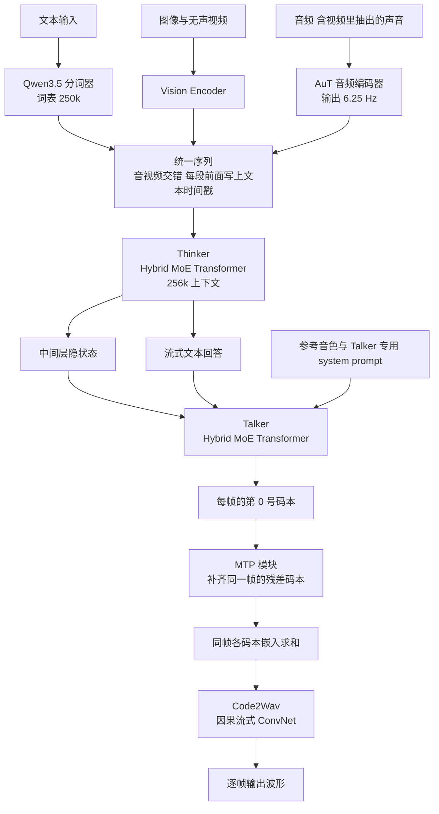
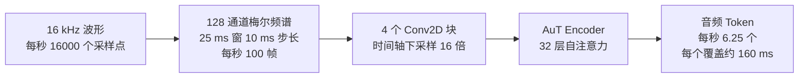
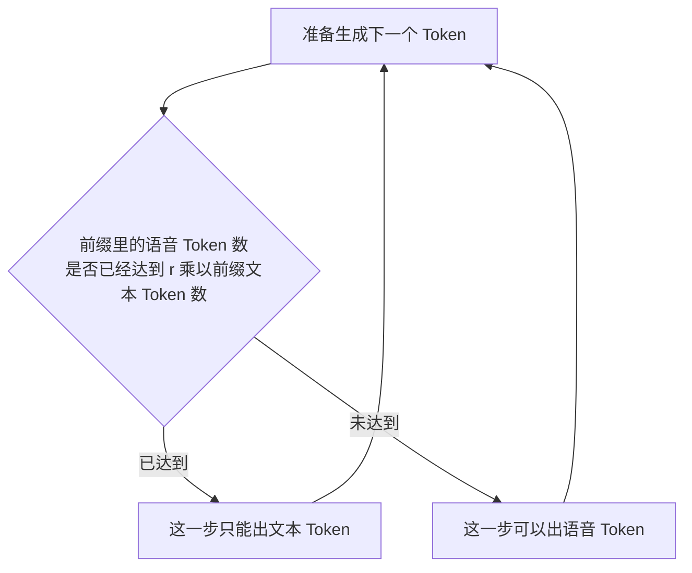
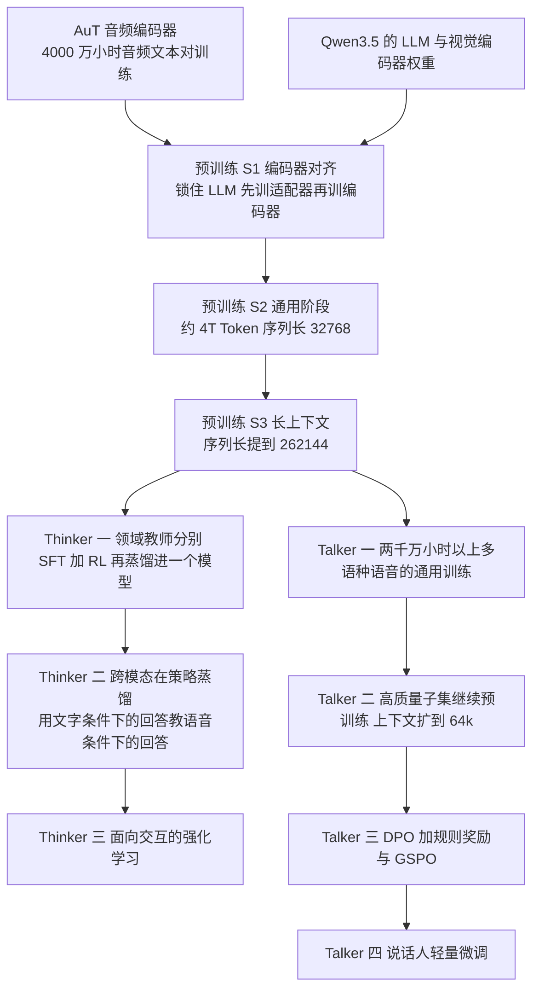
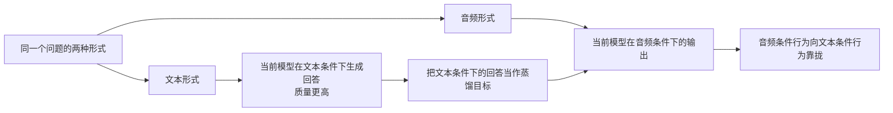
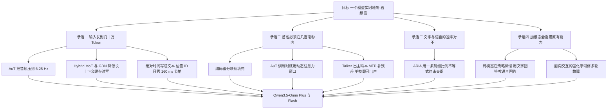

# Qwen3.5-Omni：一边听、一边看、一边说，还不能让人等

<!-- release-date: 2026-03-30 -->

> 本文依据 Qwen Team 发布的 **Qwen3.5-Omni Technical Report**，对应 arXiv:2604.15804v2，PDF 封面日期 2026-04-22。页码均指 PDF 自身页码。全文会区分三件事：报告明确写了什么、我们如何解释它、哪些是外部资料补充。凡是外部补充都会给出链接并明确标注。

## 先想象一个具体场景

你举起手机，摄像头对着桌上一张手画的界面草图，同时开口说：把它做成一个能点的网页。

对模型来说，这一句话同时提出了五个要求：

1. 听懂你说的话，包括语气和停顿；
2. 看懂摄像头里的图，还要知道你说到第几句时画面是什么；
3. 想清楚该写什么代码；
4. 用声音回答你，音色是你选的，语速语调听起来像人；
5. 上面全部动作要在你说完后几百毫秒内开始出声。

任何一环慢下来，体验就断了。这份报告讲的就是：为了让这五件事同时成立，模型的输入表示、注意力结构、语音输出方式和后训练目标分别被改成了什么样子。

## 读前先认八个词

下面这些词后面会反复出现。第一次读时只要记住括号前的那句人话就够。

- **全模态（omnimodal）**：一个模型直接吃文本、图像、音频、带声音的视频，并且能直接吐出文本和语音，中间不靠外挂的语音识别或语音合成服务拼接。
- **Thinker 与 Talker**：这套模型分成两个部件。Thinker 负责理解和思考、生成文字；Talker 负责把 Thinker 的内部状态和文字变成可以播放的语音。这个分工从 Qwen2.5-Omni 就开始了（PDF p.2）。
- **混合专家（Mixture-of-Experts，MoE）**：模型里有很多组参数（专家），每个 Token 只激活其中一小部分，所以总参数可以很大而单次计算不必很大。
- **混合注意力（Hybrid Attention）**：一部分层用普通的全注意力，一部分层用成本随长度线性增长的注意力，两者交替堆叠。
- **KV Cache（Key-Value Cache，键值缓存）**：自回归生成时把读过的历史的中间结果留下来，避免每生成一个 Token 就重算全部历史。它越大，显存和显存带宽压力越大。
- **Token 率（token rate）**：一秒钟的声音被变成几个 Token。它直接决定一小时音频要占多少上下文。
- **码本与残差矢量量化（Residual Vector Quantization，RVQ）**：把一小段声音编成一串整数编号，第一个编号给出粗略轮廓，后面的编号一层层补上残差细节。每一层的可选编号集合就叫一个码本（codebook）。
- **首包延迟（first-packet latency）**：从输入送进系统，到第一段可以播放的音频出来，中间经过的时间。

## 一句话先说清

Qwen3.5-Omni 不是把一个语言模型接上语音识别和语音合成。

它做的事情，是把整条链路的**表示速率**统一到同一根时间轴上，然后围绕这根时间轴重排每个部件：

- 音频被压到每秒 6.25 个 Token，一个 Token 覆盖 160 ms（PDF p.4）；
- 视频帧的时间编号也被对齐到同样的 160 ms 一格（PDF p.5）；
- 真正的绝对时间不再塞进位置编号，而是当成一串普通文字写进序列（PDF p.4–5）；
- Thinker 和 Talker 都换成混合注意力 MoE，把长音视频序列的缓存读写压下来（PDF p.6）；
- 语音输出改成单条交错流，用一条比例不等式约束文字和语音谁先谁后（PDF p.5）。

所以这篇报告最值得记住的不是某个缩写，而是一句工程判断：

> 实时多模态系统的第一性问题，是**每种模态每秒产生多少个 Token**。先把这个速率定下来，上下文长度、首包延迟、缓存大小和对齐方式才有讨论的基础。

## 四个互相打架的要求

在看具体设计之前，先把矛盾摆清楚。这四条彼此拉扯，正是后面每个设计要回应的东西。

### 矛盾一：输入长到几十万 Token

报告宣称支持 256k 上下文、超过 10 小时音频、400 秒 720P 视频（1 FPS）（PDF p.1）。

10 小时是 36000 秒。按报告的 6.25 Hz 音频 Token 率算，就是 225000 个 Token，占满 262144 上下文的八成多。**这条算式是我们按报告数字自己算的**，报告没有直接写出这个乘法，但它解释了为什么 6.25 Hz 和 256k 必须一起定：任何一个数变一变，另一个就撑不住。

### 矛盾二：首包必须在几百毫秒内

报告给出的端到端首包延迟是：音频输入下 Plus 435 ms、Flash 235 ms；视频输入下 Plus 651 ms、Flash 426 ms（PDF p.5）。

这两条要求方向相反。序列越长，预填充越慢，首包越晚。所以不能靠"等全部输入到齐再算"。

### 矛盾三：文字和语音的字数对不上

同一句话，用文本分词器切出来是若干个 Token，用语音编解码器切出来是另一个数量的帧。两者比例还随语言变化。

如果强行按固定比例交错，比例定小了语音会追上文字、没词可念；定大了文字跑太远、语音跟不上节奏。报告直接点名了这个后果：漏字、读错音、数字念得含糊（PDF p.3）。

### 矛盾四：加了模态，原来的文字能力会掉

这是全模态模型最常见的税。报告在正文里主张 Qwen3.5-Omni 的文本和视觉能力相对同尺寸单模态 Qwen 没有退化（PDF p.2）。这句话是否站得住，后面看表格时会仔细算。

## 全景：一条从麦克风到扬声器的链路

这张图是我们按 PDF p.3 的 Figure 2 与 §2.3–§2.5 正文重画的机制示意，不代表任何实测时长。

图里有三处值得单独指出来，因为它们只在图上画着、正文没有展开：

1. **Talker 拿的是 Thinker 的中间层隐状态**。Figure 2 上写的是从中间层做隐状态抽取，而不是取最后一层输出（PDF p.3）。正文只说 Talker 接收 Thinker 的高层表示，没有说明取的是哪几层、怎么选。
2. **码本编号从 0 到 15**。Figure 2 里 Talker 输出 0 号码本，MTP 模块产出 1 到 15 号，之后各码本的嵌入求和，再送进流式的 codec 解码器（PDF p.3）。正文从头到尾没有把码本数量写成文字，所以 16 这个数只能算图上读到的，不能当作报告的正式声明。
3. **Talker 的输入分三段**：参考音频、对话上下文、交错的语音生成区。第三段里紫色的文本 Token 和橙色的语音 Token 是交替排布的，这正是后面要讲的 ARIA（PDF p.3）。

两个规模档位是 Plus 和 Flash，都是 instruct 模型，都支持 256k 输入（PDF p.1）。

| 变体 | 报告是否给出评测 | 首包延迟 音频输入 | 首包延迟 视频输入 |
|---|---|---:|---:|
| Qwen3.5-Omni-Plus | 是 | 435 ms | 651 ms |
| Qwen3.5-Omni-Flash | 是 | 235 ms | 426 ms |
| Qwen3.5-Omni-Light | 否 | 报告未给 | 报告未给 |

延迟数字来自 PDF p.5 的 Table 1。**Light 这一档不在报告里**：报告只写了 Plus 和 Flash 两个变体（PDF p.1）。Light 出现在官方发布博客中（[Qwen3.5-Omni 官方博客](https://qwen.ai/blog?id=qwen3.5-omni)，外部补充），这份技术报告既没有它的架构，也没有它的成绩。

还有一个必须提前说清的空缺：**报告没有给出任何一档的参数量、层数、专家数或激活参数**。摘要里只有一句"扩展到数千亿参数"（PDF p.1）。所以本文不会出现 Qwen3.5-Omni 的参数表——不是遗漏，是原件真的没写。

## 核心设计一：把声音压到每秒 6.25 个 Token

### 旧问题：声音天生太密

原始音频是每秒 16000 个采样点。常见的语音特征是每 10 ms 一帧，也就是每秒 100 帧。若一帧对应一个 Token，一小时音频就是 36 万个 Token——十小时直接超出任何现有上下文。

所以问题不是"上下文不够长"，而是"音频的默认表示密度不适合喂给语言模型"。

### 新设计：AuT 与一条可以逐步验算的压缩链

Qwen3.5-Omni 用的音频编码器叫 **AuT（Audio Transformer，音频 Transformer）**，是一个从零训练的注意力编码器-解码器模型（PDF p.4）。它的处理链条是：

这张图按 PDF p.4 正文与 Figure 3 重画。链条上的每个数字都能互相验算：

- 10 ms 步长意味着每秒 100 帧；
- 4 个 Conv2D 块在时间轴上一共降采样 16 倍（PDF p.4）；
- $100 \div 16 = 6.25$，正好是报告写的 6.25 Hz Token 率（PDF p.4）；
- $1 \div 6.25 = 0.16$ 秒，正好是报告写的"每个输出帧约对应 160 ms 原始信号"（PDF p.4）。

从采样点数到 Token 数，压缩比是 $16000 \div 6.25 = 2560$ 倍。**这两步除法是我们做的**，报告只分别给出了各个数字。

AuT 的层数来自 Figure 3：编码器是 4 倍降采样 Conv2d 加 32 层自注意力，解码器是 8 层（每层含交叉注意力与自注意力）（PDF p.4）。

### 为什么要自己从零训一个音频编码器

报告说 AuT 消耗了 **4000 万小时**的音频-文本配对数据，而这些数据由 Qwen3-ASR 生成（PDF p.4）。语种配比是中文、英文、多语种 $3.5 : 3.5 : 3$，多语种覆盖 20 种以上（PDF p.4）。

这里有两层含义值得拆开：

第一，**训练数据是模型自己造的**。用一个已有的语音识别模型批量转写海量音频，得到配对数据，再训编码器。好处是量能上去（4000 万小时按 24 小时一天算，约合 4500 多年的录音）；代价是转写模型自身的错误和口音偏好会传进来，报告没有讨论这一点。

第二，**配比是有方向性的**。多语种占三成，直接对应后面 113 个语音输入语种的目标（PDF p.7）。

### 动态注意力窗口：让编码器在训练时就体验流式

这是本节最容易被跳过、但最有迁移价值的一句话。

报告说 AuT 采用了**动态注意力窗口大小的训练机制**，目的是让模型在两种场景下都表现均衡：一种是实时预填充缓存下的推理，一种是离线的音频理解任务（PDF p.4）。

为什么需要它？因为部署时的可见范围和训练时不一样：

- 离线理解时，编码器可以看到整段音频；
- 实时对话时，编码器只能看到刚到达的一小块，后面的声音还没发生。

如果训练时永远给全上下文，那么线上每一个流式分块都是分布外输入。报告的做法是在训练期间就随机变化注意力窗口，让编码器提前习惯"有时看得多、有时看得少"。

**可迁移启发**：任何要上流式的编码器，都应该在训练时就承受部署会施加的可见性约束。这比训练完之后再去调推理参数更接近问题的根源。同样的思路适用于流式 ASR、在线推荐的特征窗口、增量索引的构建器。

### 代价与边界

- 6.25 Hz 是一个很低的速率。它对语义内容足够，但对极细的声学细节一定有损。报告没有给出 AuT 表示在音素级或韵律级任务上的损失分析。
- 报告没有公开 AuT 的参数量、隐藏维度、注意力窗口的具体取值范围，也没有和更高 Token 率的消融对比。
- "4000 万小时"是投入量，不是质量证明。报告未公开去重、过滤、语种平衡的具体做法。

## 核心设计二：绝对时间写成文本，位置 ID 只管节拍

### 旧问题：把时间塞进位置编号会出两种毛病

上一代 Qwen3-Omni 用的是 **TM-RoPE（Time-aligned Multimodal RoPE，时间对齐的多模态旋转位置编码）**——一种把时间轴信息编进位置编号的做法，好让音频和视频在同一条时间线上对齐。

报告点名了它的两个问题（PDF p.4、p.6–7）：

1. **直接用绝对时间当时间位置 ID，长视频的视觉 patch 索引会变得又大又稀疏**，削弱模型建立长程时间关系的能力；
2. **要学好这套编码，需要覆盖各种帧率且分布均匀的大规模样本**，数据构造成本很高。

第二点常被忽略，其实很关键：一个位置编码方案如果只在某个特定帧率下训练充分，换个帧率就会退化，那么数据管线就得为每种帧率单独准备样本。

### 新设计：把时间信息拆成两份，分别交给两个通道

Qwen3.5-Omni 的做法是把"时间"这件事拆开：

- **节拍交给位置 ID**：音频每 160 ms 一个时间 ID；视频帧的时间 ID 按实际时间戳动态调整，保证同样是 160 ms 一格；视频帧的高、宽 ID 按静态图像的方式分配（PDF p.5）。
- **绝对时刻交给文本**：在每个视频或音视频时间片前面，直接写一段格式化的秒数文本；音频序列还会在随机间隔插入时间戳（PDF p.4–5）。

Figure 2 里可以直接看到这条序列长什么样：文本提示之后是一串形如 0.0 秒、4.0 秒、600.0 秒的文本标记，每个标记后面跟着该时间片的视觉与音频表示（PDF p.3）。

另外，为了避免多模态混在一起时位置编号打架，位置编号被做成连续的：后一个模态从前一个模态最大位置 ID 加一开始（PDF p.5）。

### 为什么这样更好

因为模型本来就极擅长读数字文本。把"这是第 600 秒"写成字，模型用它已有的语言能力就能理解，不需要位置编码方案额外承担语义任务。而位置 ID 只剩下一个简单职责：保证同一时刻的音频和视频落在同一格上。

**职责被拆开之后，两边都变简单了。** 位置 ID 不再需要表达跨度巨大的绝对时间，稀疏索引问题消失；数据也不再需要为每种帧率做均匀覆盖。

### 收益与代价

报告给出的收益是定性的：时间感知更精确、更稳健，尤其是在长上下文多模态输入上做外推时（PDF p.5）。代价它也写了：上下文长度会略微增加（PDF p.5）。

必须诚实指出：**报告没有给这个改动做任何消融实验**。没有"用 TM-RoPE 绝对时间 vs 用文本时间戳"的对照表。所以我们知道设计动机和作者判断，但无法从这份报告量化它的贡献。

### 可迁移启发

> 当一个机制同时承担"排序"和"表达语义"两件事时，先问能不能把语义那部分挪到模型原生擅长的通道里。

这个模式在很多地方成立：日志里的时间戳与序号、事件流里的业务时间与逻辑时钟、检索系统里的位置权重与元数据字段。把它们混在一个字段里往往是后期扩展困难的根源。

## 核心设计三：Hybrid Attention MoE——报告写了名字，没写配置

### 报告到底写了什么

关于骨干网络，报告只写了这些：

- Thinker 和 Talker 都采用 Qwen3.5 引入的 Hybrid MoE 架构（PDF p.2、p.6）；
- 这个架构里含有 **GDN（Gated Delta Net，门控增量网络）** 模块，对加速长音视频序列的建模特别有效（PDF p.6）；
- 结果是显著降低长上下文推理中的 **KV Cache I/O 开销**，提高生成吞吐，支持更高并发（PDF p.6）；
- Table 1 里 Thinker 和 Talker 的架构栏都写着 Hybrid MoE Transformer，MTP 模块是 Dense Transformer，Code2wav 是 ConvNet，视觉编码器写的是 SigLIP2（PDF p.5）。

就这些。**没有层数比例、没有专家数、没有 GDN 与全注意力的交替方式、没有任何消融。**

### 用人话解释 GDN 为什么对长音视频划算

先说普通注意力的问题：生成第 $n$ 个 Token 时要回看前面所有 Token 的 Key 和 Value，缓存大小随长度线性增长，而**每一步都要把整个缓存读一遍**。序列到几十万时，瓶颈往往不是算力，而是显存带宽。

线性注意力这类方法换了个思路：不保存全部历史，而是维护一个**固定大小的状态矩阵**，新 Token 进来时增量更新它，要输出时去查询这个状态。状态大小与序列长度无关，所以读写量不随长度增长。

GDN 是这条路线里的一个具体方案，把两种机制合在一起：门控负责按需遗忘旧记忆，增量规则（delta rule）负责有针对性地改写状态中的某一部分，而不是整体覆盖。**这段解释来自 GDN 的原始论文** [Gated Delta Networks: Improving Mamba2 with Delta Rule（arXiv:2412.06464）](https://arxiv.org/abs/2412.06464)，属于外部补充；Qwen3.5-Omni 报告只提了模块名字，没有解释机制。

线性注意力的弱点是精确检索：信息被压进固定状态后，"第 37 分钟那个人说的第二句话是什么"这类需要逐字回取的任务会变差。混合结构的作用就是保留少量全注意力层当作精确检索的兜底。

同样是外部补充：官方 Qwen3.5 博客说 Qwen3.5 的架构是线性注意力（通过 Gated Delta Networks）与稀疏 MoE 的融合，公开权重的旗舰是 397B 总参数、每次激活 17B（[Qwen3.5 官方博客](https://qwen.ai/blog?id=qwen3.5)）。**但报告只说 Thinker 的 LLM 部分用 Qwen3.5 初始化（PDF p.7），没有说是哪一档**，所以不能据此推断 Omni-Plus 就等于 397B-A17B。

### 为什么这个选择对全模态特别合适

音视频输入有一个和纯文本很不一样的性质：**它的信息密度沿时间轴分布得很均匀，而且大部分是可以被概括的**。一段 10 分钟的会议录音，绝大多数帧对回答"他们最后决定了什么"没有逐帧价值。这恰好是固定状态压缩擅长的场景。

反过来，纯文本长上下文里"大海捞针"式的精确检索需求更强。这可能部分解释了后面 Table 4 里一个反常现象：Omni-Plus 在纯文本长上下文检索基准 AA-LCR 上比同尺寸文本模型低了 5 分（PDF p.10）。**这是我们的推测，报告没有把这两件事联系起来，也没有做归因实验。**

### 一处报告自己没有对齐的地方

正文说视觉编码器采用 Qwen3.5 的视觉编码器（PDF p.4、p.7），Table 1 的架构栏则写的是 SigLIP2（PDF p.5）。报告没有说明两者关系。合理猜测是 Qwen3.5 的视觉编码器基于 SigLIP2，但报告没写，本文不替它补。

## 核心设计四：Talker 的多码本与 MTP

### 旧问题：自回归生成语音容易在"帧数"上翻倍

用离散编码表示语音时，为了保真度通常需要多层码本：第 0 层给轮廓，后面各层逐层补残差。

朴素做法是把所有码本摊平成一条序列。举个例子：假设一个编解码器有 16 层码本、每秒 12.5 帧，摊平后每秒就是 200 个自回归步。**这两个数字只是为了说明问题而举的例，报告没有给出 Qwen3.5-Omni 的码本层数和帧率。** 重点是形状：步数变成帧数乘码本数，延迟和吞吐都被拖垮。

### 新设计：主干只走帧，残差交给一个小模块

Qwen3.5-Omni 的做法是（PDF p.3、p.5）：

1. Talker 直接在 **Qwen3.5-Omni-Audio-Tokenizer** 产出的 RVQ Token 上工作，每个解码步只产出当前帧的主码本；
2. 一个 **MTP（Multi-Token Prediction，多 Token 预测）模块**在同一步里输出该帧的残差码本；
3. 各码本的嵌入求和后送进 **Code2Wav**——一个因果的、可流式的 ConvNet 解码器，逐帧增量地合成波形。

报告把这个组合的效果概括为"单帧即可立即合成"（PDF p.2）。也就是说，**自回归序列长度等于帧数，而不是帧数乘码本数**。

MTP 模块在 Table 1 里被标为 Dense Transformer（不是 MoE），并且是流式的（PDF p.5）。这个选择本身就有信息量：它要在每个解码步被调用一次，所以必须便宜、可批处理、延迟稳定；用稠密小模型比用 MoE 更适合。

### 音色不用向量，用 system prompt

这是 Talker 相对 Qwen3-Omni 的第一处架构改动（PDF p.5）。

旧做法是给一个说话人嵌入向量（speaker embedding），本质上是一个固定长度的实数向量。新做法是给 Talker 一段**专用的 system prompt**，里面可以放文字描述，也可以放编解码序列（也就是一段参考音频）。

为什么这更好？因为控制信号变成了模型原生的语言：

- 想描述"低沉、慢一点、带点笑意"，直接写字就行，不用先找到对应的嵌入向量；
- 想克隆某人的音色，把他的一段录音编码后放进 prompt 就行，这就是零样本音色克隆；
- 文字描述和参考音频可以同时给，两种信号在同一条序列里自然融合。

报告的原话是这种 prompt 能编码更丰富的多模态线索，对声学实现提供细粒度得多的控制（PDF p.5）。

**可迁移启发**：当你发现自己在给模型加"第二套输入通道"（额外的嵌入、side channel、条件向量）时，先问一句能不能把它写成模型已经会读的序列。序列化的控制信号更容易组合、更容易调试、更容易被人直接读懂。

### 边界

- 报告没写码本层数（Figure 2 画到 15，见前文）、没写帧率、没写码率、没写 Audio-Tokenizer 的训练方式。
- 没有 MTP 与"摊平码本"方案的延迟或质量对照实验。

## 核心设计五：ARIA——本文最值得慢读的一节

### 旧问题：一句话有两种"长度"

要边生成文字边出声，就得决定文字和语音在同一条时间线上怎么排。

上一代 Qwen3-Omni 用的是双轨（dual-track / dual-channel）输入：文本一条轨、语音一条轨（PDF p.3、p.5、p.6）。两条轨要对齐，就得有个对齐依据。常见的依据有两种，报告都明确拒绝了（PDF p.5）：

- **MFA 类的强制对齐**：先用工具把录音和文字逐词对上，再按这个对齐去交织。（MFA 的全称是 Montreal Forced Aligner，一种传统的语音-文本强制对齐工具；**报告只写了缩写，全称属于外部补充**。）这条路依赖额外工具，而且训练数据要预先跑一遍对齐。
- **固定交织率**：比如永远"1 个文本 Token 后跟 4 个语音 Token"。

固定交织率为什么会崩？因为不同语言的文本编码效率差别很大。同样是 1 秒钟的语音，有的语言可能被切成 2 个文本 Token，有的可能被切成 8 个。用同一个比例去套：

- 比例定得偏向语音，文字会被消耗光，模型还得继续出声——于是含糊带过、数字念错；
- 比例定得偏向文字，文字跑得太远，语音节奏跟不上——于是漏字、断句怪异。

报告点名的失败现象正是漏字、发音错误、数字渲染含糊（PDF p.3）。

### 新设计：一条不等式取代一个固定比例

ARIA 的全称是 **Adaptive Rate Interleave Alignment（自适应速率交织对齐）**。它做两件事（PDF p.5）：

1. 把双通道生成合并成**单通道**：文本 Token 和语音 Token 排在同一条序列里交错出现（Figure 2 右下角画的就是这个，PDF p.3）；
2. 用一条**自适应速率约束**决定下一个位置能不能出语音。

约束是这么说的：对生成序列的任意前缀，累计的语音-文本 Token 比不得超过该条样本的全局比。

写成式子。设这条样本总共有 $N_s$ 个语音 Token、$N_t$ 个文本 Token，全局比是

$$
r = \frac{N_s}{N_t}
$$

设已经生成的前缀里有 $n_s$ 个语音 Token、$n_t$ 个文本 Token，则要求

$$
\frac{n_s}{n_t} \le r
\qquad\Longleftrightarrow\qquad
n_s \le r \cdot n_t
$$

第二种写法更好用，因为它在 $n_t = 0$ 时也成立：此时 $n_s$ 必须为 0，也就是**一条回答必须先出文本**。

解码时的判断就变成：

这张图是我们按 PDF p.5 的文字描述重画的机制示意，报告本身没有给流程图或伪代码。

### 这条不等式为什么聪明

**第一，它是上界不是等式。** 等式会退化成一个刚性时刻表；上界只禁止一件事——语音跑到文字前面去。文字可以随时领先，因为领先是安全的：手里总有词可念。语音领先是不安全的：等于在给还没想好的话配音。

**第二，比例来自样本自己，不是全局超参。** 中文、英文、泰语的 $r$ 天然不同，因为它们的文本编码效率不同。报告说这个设计让文本-语音对齐在跨语言时更灵活，包括那些编码效率相对低的语言（PDF p.5）。**这解释了为什么它是"Adaptive Rate"而不是某个调出来的常数。**

**第三，它顺手支持任意长的纯文本前缀。** 报告说 ARIA 天然支持"任意文本 Token 前缀后接连贯语音续写"（PDF p.5）。从不等式看这是显然的：一个全是文本的前缀里 $n_s = 0$，怎么都满足约束。这对流式很有用——模型可以先攒一点文字再开口。

**第四，它减少了工程上的同步成本。** 报告说 ARIA 降低了两条独立生成轨之间的同步开销，让解码时的 Token 调度更高效，也更贴合流式交互天然的增量特性（PDF p.6）。两条轨变一条，就不用维护跨轨的对齐状态机。

### 必须承认的空缺

推理时 $N_s$ 和 $N_t$ 都还不知道——回答还没生成完，怎么算全局比 $r$？

**报告没有回答这个问题。** 它只描述了约束的形式，没有说明推理时 $r$ 如何估计（是模型预测的、按语言查表的、还是按已生成部分动态估计的）。也没有说约束是硬性屏蔽 logits 实现的，还是训练时构造数据、推理时靠模型自己遵守。

这是本报告里最值得追问的一处空白：ARIA 被摆在了摘要和结论的核心位置，机制描述却只有一段话，没有算法、没有伪代码、没有消融。我们只能确认设计意图和作者的定性结论，不能复现它。

### 可迁移启发

> 当两个流必须协同推进、而它们的速率天然不同时，与其调一个固定比例，不如写一条"任意前缀都要满足"的不等式约束。

这个模式在别处也成立：生产者-消费者之间的水位控制、双写系统里主从的追赶上限、流式转码中音视频轨的漂移容忍。共同点是：**约束写在前缀上，比写在总量上更容易在线执行；写成上界，比写成目标值更不容易死锁。**

## 延迟到底被拆成了几段

报告用两张表把延迟摊开。这两张表值得认真读，因为它们既给了信息，也带着不少限制条件。

### Table 1：谁能流式，谁不能

| 模块 | 架构 | 是否流式 |
|---|---|---|
| Audio Encoder | AuT | 是 |
| Vision Encoder | SigLIP2 | 否 |
| Thinker | Hybrid MoE Transformer | 是 |
| Talker | Hybrid MoE Transformer | 是 |
| MTP | Dense Transformer | 是 |
| Code2wav | ConvNet | 是 |

数据来自 PDF p.5。

这张表里唯一的"否"落在视觉编码器上，很值得注意：音频可以边到边编，图像帧却是整帧处理的。这大概也解释了为什么视频输入的首包延迟明显高于音频输入——Plus 是 651 ms 对 435 ms，Flash 是 426 ms 对 235 ms（PDF p.5）。**这个因果链是我们的推断，报告没有明说。**

### 分块预填充：不等输入到齐就开始算

报告说 Qwen3.5-Omni 保留了 Qwen3-Omni 与 Qwen2.5-Omni 的 **分块预填充（chunked prefilling）** 机制：音频和视觉编码器能沿时间维度按块输出，这显著降低了 Thinker 和 Talker 的 TTFT（PDF p.5–6）。

**TTFT（Time-To-First-Token）** 是从收到输入流到 Thinker 生成第一个文本 Token 的时间（PDF p.6）。

分块预填充和前面 AuT 的动态注意力窗口是同一件事的两面：一个负责让编码器在训练时就习惯只看得到一块，一个负责在推理时真的按块喂。**任何一边缺席，另一边都白做。** 这是全文里配合最紧的一对设计。

### Table 2：并发上去以后会怎样

报告在内部 vLLM 上测了理论首包延迟，MTP 模块与 codec 解码器开启了 torch.compile 和 CUDA Graph 加速（PDF p.6）。每格里斜杠前是音频输入、斜杠后是视频输入。

| 指标 | Flash 1 并发 | Flash 4 并发 | Flash 8 并发 | Plus 1 并发 | Plus 4 并发 | Plus 8 并发 |
|---|---|---|---|---|---|---|
| Thinker TTFT | 80/255 ms | 86/446 ms | 103/765 ms | 162/377 ms | 183/907 ms | 260/1243 ms |
| Talker TTFC | 56/61 ms | 68/108 ms | 81/116 ms | 54/56 ms | 72/88 ms | 95/116 ms |
| Thinker TPOP | 5.6/5.9 ms | 8.2/9.2 ms | 9.6/15.8 ms | 17.4/18.5 ms | 25.6/26.9 ms | 33.3/40.2 ms |
| Talker TPOP | 14.2/14.2 ms | 16.9/17.0 ms | 20.5/20.6 ms | 14.9/14.9 ms | 21.0/21.3 ms | 25.8/27.1 ms |
| Overall Latency | 235/426 ms | 298/891 ms | 352/1625 ms | 435/651 ms | 619/1515 ms | 955/1980 ms |
| Thinker TPS | 177/171 | 556/457 | 942/598 | 57/54 | 156/149 | 266/240 |
| Talker TPS | 70/70 | 237/235 | 389/388 | 67/67 | 191/189 | 320/296 |
| Generation RTF | 0.178 | 0.211 | 0.257 | 0.187 | 0.267 | 0.334 |

全部数据来自 PDF p.6 的 Table 2。codec 解码耗时对所有列都是 3 到 5 ms（PDF p.6）。

几个术语先说人话（前四个报告有定义，第五个没有）：

- **TTFC（Time-To-First-Chunk）**：从开始到 Talker 产出第一个音频块的时间（PDF p.6）。
- **TPOP（Time-Per-Output-Token）**：稳态解码时每个输出 Token 的耗时；Talker 的 TPOP 包含 Talker 主干加 MTP 模块（PDF p.6）。
- **TPS（Tokens Per Second）**：生成吞吐（PDF p.6）。
- **Overall Latency**：到第一个可播放音频包的端到端关键路径。报告特别提醒它不能靠几行相加得到，因为 ARIA 把文本和语音组织在同一条交错流里（PDF p.6）。
- **Generation RTF**：报告用了这个指标但**没有定义它**。按行业通行含义，实时因子指生成一秒音频所需的计算时间，小于 1 才能撑住实时播放。**这个定义是外部常识补充，不是报告原话。**

从表里能直接读出的三件事：

1. **Table 1 与 Table 2 自洽**。Table 1 的首包延迟（Plus 435/651、Flash 235/426）正好等于 Table 2 里 1 并发的 Overall Latency。
2. **视频输入的扩展性明显更差**。Flash 从 1 并发到 8 并发，音频 Overall 从 235 ms 涨到 352 ms（约 1.5 倍），视频从 426 ms 涨到 1625 ms（约 3.8 倍）。Plus 也是同样的形状。这与视觉编码器不支持流式是一致的。
3. **RTF 一直低于 0.35**，报告因此说留有足够余量供流式音频平滑生成（PDF p.6）。

### 这张表不能用来做什么

报告自己给了一条限制：Flash 与 Plus 规模差距大，两者部署时的资源分配和并行策略不同，因此延迟和吞吐**不适合做严格横向比较**（PDF p.6）。这解释了一个反常现象——1 并发时 Plus 的 Talker TPS 是 67，Flash 是 70，几乎一样，而 Thinker TPS 是 57 对 177，差了三倍。

还有两条限制是报告没写、但读者必须自己补上的：

- 标题里的"理论"两个字是报告自己用的。这些不是端到端产品延迟，不含网络往返、不含语音端点检测、不含排队。
- **报告没有给出任何硬件信息**：没有 GPU 型号、没有卡数、没有并行配置。一张延迟表缺了硬件，就无法被任何人复现或折算到自己的机器上。

## 预训练：三阶段与 4T Token 的配比

预训练分三个阶段（PDF p.7）：

**S1 编码器对齐阶段。** LLM 部分用 Qwen3.5 初始化并锁住，视觉编码器取自 Qwen3.5，音频编码器用 AuT 初始化。两个编码器在冻结的 LLM 上分别训练，都是先训各自的适配器（adapter），再训编码器本体。

先训适配器再训编码器，是一个很实用的顺序：适配器是新初始化的随机模块，如果一上来就一起动，随机的适配器会把梯度噪声灌进已经训好的编码器。先让适配器学会"往哪个方向说话"，再放开编码器，损失会稳得多。**这段解释是我们补的，报告只给了顺序。**

**S2 通用阶段。** 解冻全部参数，序列长度 32768，约 4 万亿 Token。模态配比是（PDF p.7）：

| 模态 | Token 量 | 占比 |
|---|---:|---:|
| 音频 | 1.99T | 46% |
| 图像 | 0.95T | 22% |
| 文本 | 0.92T | 21% |
| 视频与音频 | 0.29T | 7% |
| 视频 | 0.14T | 3% |

Token 量来自 PDF p.7；占比一列是我们按这五个数字相加得到的 4.29T 为分母算的（报告自己的表述是"约 4 万亿"）。

这个配比本身就是一个强信号：**音频接近全部数据的一半，是第二名图像的两倍多；纯文本只占约五分之一。** 这直接对应报告在音频基准上的强势，也对应文本基准上那点轻微退化。一个模型的能力分布，在数据配比表里就已经写好了。

顺带做一个量级核对：$1.99 \times 10^{12} \div 6.25 \approx 3.2 \times 10^{11}$ 秒，约 8800 万小时。这和摘要里"超过 1 亿小时音视频数据"是同一个量级（PDF p.1）。**这是我们的验算**，前提是假设音频 Token 主要由 6.25 Hz 的 AuT 帧构成；如果这个桶里还统计了配对文本，实际小时数会更少。

**S3 长上下文阶段。** 最大 Token 长度从 32768 提到 262144，同时提高长音频和长视频在数据中的比例。报告说这些调整让长序列理解能力显著提升（PDF p.7–8）。

注意这里的措辞：只有 S2 给了 Token 数，S1 和 S3 都没有给。所以"训了多少"这个问题，报告只回答了一段。

### 语种覆盖

| 模态 | 语种/方言数 | 构成 |
|---|---:|---|
| 文本 | 201 | 报告指向 Qwen3.5 的完整列表 |
| 语音输入 | 113 | 74 种语言 + 39 种中国方言 |
| 语音输出 | 36 | 29 种语言 + 7 种中国方言 |

数据来自 PDF p.7 的 Table 3。

39 种中国方言是很少见的投入，包括粤语、上海话、闽南话、客家话等（PDF p.7）。这一点在后面的 ASR 成绩上会兑现。

这里要指出报告自己的一处**表述不一致**：摘要那句话把"语音生成"和"10 种语言"写在一起（PDF p.1），而引言写的是语音合成覆盖 36 个语种（PDF p.2），Table 3 写的也是 36（PDF p.7）。摘要那句话的后半是"具备接近人类的情绪表达"，所以 10 这个数字有可能只限定情绪表达而非语音生成本身，但报告没有澄清。按正文和表格的 36 为准更稳妥。

## 后训练：Thinker 三段、Talker 四段

这张图按 PDF p.7–9 重画。图里把 Thinker 与 Talker 的后训练画成两条并列的线，是因为报告分两节写，**并没有说明二者的先后关系或是否交替**；不要把并列理解成一定同时进行。

### Thinker 第一段：先分领域练教师，再合成一个模型

报告的做法是：先用独立的 SFT 和强化学习训一批领域专家教师，全部从 Qwen3.5 的预训练 base checkpoint 微调而来；除了文本类（agentic、代码、基础推理），还专门训了视觉和音频的教师；然后用这些教师生成领域数据，把各领域学到的专门能力蒸馏进一个统一模型（PDF p.8）。

这是 Qwen 家族一贯的形状：先分而治之，再合并。报告没有给出教师数量、各领域数据量、reward 设计和 RL 超参。

### Thinker 第二段：用自己的文字回答，教自己的语音回答

这一段是整份报告里最有意思的设计，值得完整走一遍因果链。

**旧问题。** 报告观察到：经过第一段之后，模型在多模态理解、推理、文本对话、代码、agent 上都已经很强，但**同一个问题用语音问，回答质量明显低于用文字问**，在语音对话场景尤其明显（PDF p.8）。

**为什么会这样？** 这是个对齐差距，不是知识差距。模型脑子里的知识是同一份，但语音输入把它带到了一个不同的内部状态，那个状态上的回答策略没被打磨过。

**新设计。** 报告引入第二段训练，基于**在策略蒸馏（On-Policy Distillation，OPD）**：对每一个音频-文本配对的查询，先在文本条件下生成一个回答——这个回答在流畅度、推理和任务完成度上通常更好——然后把它作为对应音频条件查询的蒸馏目标（PDF p.8）。

**工作机制。** 教师和学生是同一份权重，唯一的差别是输入模态。模型被要求：不管用户是打字还是说话，你都要到达同一个回答。

这张图按 PDF p.8 的描述重画，是机制示意。

**收益。** 报告把它和第三段一起，当作 Omni 模型指令跟随能力略微超过纯文本基线的原因（PDF p.10）。注意报告用的措辞是"我们相信"，这是作者判断，不是消融结论。

**代价与边界。** 有三点必须说清：

1. **天花板就是文本路径本身。** 这个方法不会教给模型任何新知识，只能把音频路径拉到文本路径的水平。
2. **文本目标里没有副语言信息。** 语气、情绪、说话人身份这些只存在于音频里的线索，在文本回答里是不存在的。长期用文本回答当目标，理论上会推动模型忽略这些信息。**这是我们的推断，报告没有讨论这个风险，也没有做相应评测。**
3. **报告没写对齐的粒度。** 是逐 Token 对齐完整词表分布，还是直接在采样出的文本回答上做监督微调？报告只说"把它作为蒸馏目标"（PDF p.8），没有给损失函数。对比一下：同一家的 Qwen3 报告里，OPD 是明确对齐完整 logits 的；这里没有这个说明，两者不能默认相同。

**可迁移启发**：当同一个系统的两条输入路径质量不一致时，先判断这是知识差距还是对齐差距。如果是对齐差距，**强的那条路径就是现成的、免费的、永远和学生同分布的老师**，不需要另找更大的模型，也不需要新标注。这个套路适用于多语言（英文路径教低资源语言路径）、多格式（结构化输入教自然语言输入）、多渠道（长 prompt 教短 prompt）。

### Thinker 第三段：从上线故障清单反推 RL 目标

报告说前两段虽然提升了领域能力和跨模态回答质量，但不足以让模型在真实交互中好用。它列出了多轮对话里观察到的三个具体问题（PDF p.8）：

1. **无意的语言切换**（说着中文突然蹦英文）；
2. **人设不一致**（前后自称不一样）；
3. **长对话里指令跟随退化**（开头交代的规则，聊到后面就忘了）。

针对这三条，报告构造多轮交互轨迹，围绕这些用户体验目标设计奖励信号，做第三段强化学习，称为 **Interaction-Aligned RL（面向交互的强化学习）**（PDF p.8）。

这三个问题有个共同点：**在单轮的文本基准上一个都测不出来。** 它们只在长时间语音对话里出现。报告没有公开奖励的具体定义、轨迹构造方式和评测集。

**可迁移启发**：RL 的优化目标应该从部署故障清单反推，而不是从基准列表反推。基准衡量的是能力上限，故障清单衡量的是用户实际会遇到什么。两者的交集比想象中小。

### Talker 四段

（PDF p.8–9）

1. **通用阶段**：在超过 **2000 万小时**多语种语音数据上训练，配多模态上下文。报告特别提到引入了"指令跟随的语音生成"这类更多样的任务，让模型超越"从多模态表示到语音的单调映射"，增强上下文推理和副语言对齐。
2. **长上下文阶段**：用专门的清洗流水线做数据质量分层，只在高质量子集上做**继续预训练（Continual Pre-Training，CPT）**；借助 Qwen3-Omni-Captioner 增强，缓解第一阶段噪声数据带来的幻觉；同时把最大上下文扩到 **64k**。

   注意这里的顺序：先用大而杂的数据学会覆盖面，再用小而净的数据修掉幻觉。这和很多人直觉里"从头就只用干净数据"是相反的，但在语音这种标注昂贵的领域更现实。
3. **强化学习阶段**：用人工标注构造多语种偏好对，做 **DPO（Direct Preference Optimization，直接偏好优化）**；另外加入基于规则的奖励，并采用 **GSPO** 提升跨任务的整体能力与训练稳定性。
4. **说话人微调阶段**：在 base 之上做轻量的说话人微调，让模型忠实还原目标说话人特征，同时提升自然度、表现力和可控性。

关于第 3 步里的 GSPO：它是 Qwen 自家的序列级重要性比方法，本站另有单独解读，此处不展开。

注意 Talker 的上下文是 **64k**，而 Thinker 是 **256k**（PDF p.1、p.8）。这个差距是合理的——Talker 只需要看到当前这一轮的上下文和要念的文字，不需要把 10 小时录音全部装进来。

## 实验：哪些结论有证据，哪些要打问号

### 全模态税：报告说没有退化，表格说有一点

报告在正文里说 Omni-Plus 的文本能力与纯文本对照模型"相当"（PDF p.10）。把 Table 4 的数字摆出来（PDF p.10，三列依次是 Qwen3.5-Plus-Instruct、Omni-Flash、Omni-Plus）：

| 基准 | Qwen3.5-Plus-Instruct | Omni-Flash | Omni-Plus | Omni-Plus 相对变化 |
|---|---:|---:|---:|---:|
| MMLU-Pro | 86.8 | 79.9 | 85.9 | −0.9 |
| MMLU-Redux | 94.3 | 90.0 | 94.2 | −0.1 |
| SuperGPQA | 67.4 | 54.9 | 66.4 | −1.0 |
| C-Eval | 92.3 | 86.0 | 92.0 | −0.3 |
| IFEval | 89.7 | 85.2 | 89.7 | 0 |
| IFBench | 51.1 | 38.4 | 52.6 | +1.5 |
| AA-LCR | 62.0 | 46.0 | 57.0 | −5.0 |
| LongBench v2 | 60.2 | 46.4 | 59.6 | −0.6 |
| GPQA | 85.9 | 76.4 | 83.9 | −2.0 |
| LiveCodeBench v6 | 67.1 | 56.6 | 65.6 | −1.5 |
| HMMT Nov 25 | 86.2 | 59.0 | 84.4 | −1.8 |
| IMOAnswerBench | 68.3 | 51.5 | 65.5 | −2.8 |
| BFCL-V4 | 66.1 | 55.3 | 63.3 | −2.8 |
| TAU2Bench | 82.7 | 78.0 | 81.0 | −1.7 |

最右一列是我们的减法。

准确的说法应该是：**在 14 项里有 12 项下降、1 项持平、1 项上升；平均降幅约 1.3 分，其中 11 项降幅在 3 分以内，唯一明显的例外是长上下文检索基准 AA-LCR 的 5.0 分。** 这不是"没有退化"，但确实是很小的代价——考虑到这个模型多了完整的音频与语音能力。

一个额外的注意点：报告把对照列命名为 Qwen3.5-Plus-Instruct，官方博客上同一组数字的列名是 Qwen3.5-Plus-NoThinking（[官方博客](https://qwen.ai/blog?id=qwen3.5-omni)，外部补充）。报告没有定义这个基线的推理模式，也就是说**我们不知道对照组是否开了思考**。这会实质影响 GPQA、HMMT 这类推理基准的可比性。

### 视觉：涨的和跌的分得很整齐

Table 6（PDF p.12）的结构很有信息量。把 Omni-Plus 相对 Qwen3.5-Plus-Instruct 的变化分类：

| 明显上升 | 变化 | 明显下降 | 变化 |
|---|---:|---|---:|
| RealWorldQA | +5.0 | MMLongBench-Doc | −2.2 |
| ZEROBench_sub | +3.3 | CharXiv (RQ) | −1.7 |
| MVBench | +2.3 | MMBench-EN-DEV-v1.1 | −1.0 |
| MME-VideoOCR | +2.8 | MMMU | −0.9 |
| LVBench | +2.6 | MMStar | −0.9 |
| SLAKE | +1.9 | AI2D_TEST | −0.9 |
| MLVU | +1.7 | MathVista (mini) | −0.8 |
| EmbSpatialBench | +2.0 | ODInW13 | −0.8 |

变化列是我们的减法，原始数字见 PDF p.12。

这个分布不是随机的：**动态视觉（六个视频基准全部上升）和空间/具身理解上升，静态图像的文档与图表理解下降。** 报告自己也做了同样的观察，并把它归因于视频-音频联合训练的有效性，还提出音视频流是最贴近真实世界的表示形式（PDF p.11）。

值得注意的是：**这是报告里少见的一处：表格里数字的涨跌方向本身支撑了一个机制性主张，而不只是"我们总分更高"。** 其他大部分主张只有总分对比。

### 音频：优势最大的地方，也是最需要看清对手的地方

Table 5（PDF p.11）对比 Gemini-3.1 Pro。挑代表性的看：

| 类别 | 基准 | Gemini-3.1 Pro | Omni-Flash | Omni-Plus |
|---|---|---:|---:|---:|
| 音频理解 | MMAU | 81.1 | 80.4 | 82.2 |
| 音频理解 | MMAR | 83.7 | 74.0 | 80.0 |
| 音频理解 | MMSU | 81.3 | 72.2 | 82.8 |
| 音频理解 | RUL-MuchoMusic | 59.6 | 60.5 | 72.4 |
| 对话 | VoiceBench | 88.9 | 87.8 | 93.1 |
| 对话 | WildSpeech-Bench | 76.3 | 72.2 | 75.4 |
| 语音翻译 | Fleurs xx↔zh/en top59 | 32.1 | 29.4 | 32.8 |
| 语音识别 | Fleurs top60（WER，越低越好） | 7.32 | 10.75 | 6.55 |
| 语音识别 | KeSpeech（WER） | 23.67 | 4.47 | 3.46 |
| 语音识别 | Opencpop 唱腔（WER） | 6.83 | 1.11 | 1.49 |

KeSpeech 是中文方言语音识别集。Gemini-3.1 Pro 的 23.67 对 Omni-Plus 的 3.46，差了近七倍——这是前面 39 种中国方言训练投入的直接兑现。唱腔转写（Opencpop、MIR-1K）也是同样的形状。

但要公平：**Gemini 在 MMAR（83.7 对 80.0）、WildSpeech-Bench（76.3 对 75.4）、SpeechRole（124.2 对 123.5）上仍然领先**（PDF p.11）。所以"在关键音频任务上超越 Gemini-3.1 Pro"是成立的，"全面超越"不成立。

### 音视频：报告用的词是"达到水平"，不是"超越"

Table 7（PDF p.13）：

| 基准 | Gemini-3.1 Pro | Omni-Flash | Omni-Plus |
|---|---:|---:|---:|
| DailyOmni | 82.7 | 81.8 | 84.6 |
| WorldSense | 65.5 | 57.9 | 62.8 |
| AVUT | 85.6 | 81.4 | 85.0 |
| AV-SpeakerBench | 75.1 | 65.2 | 71.3 |
| VideoMME（带音频） | 89.0 | 79.3 | 83.7 |
| Qualcomm IVD（语音提问） | 66.2 | 66.3 | 68.5 |
| Omni-Cloze（字幕） | 57.2 | 63.0 | 64.8 |
| OmniGAIA（工具使用） | 68.9 | 33.9 | 57.2 |

八项里 Omni-Plus 赢三项、输五项。**Gemini 在 VideoMME 带音频上领先 5.3 分，在 agent 工具使用 OmniGAIA 上领先 11.7 分。** 报告在这一节的措辞总体克制：它说在 DailyOmni 上取得 SOTA、在 AVUT 上取得可比结果，然后说本版本增强了工具使用能力、在 OmniGAIA 上达到 57.2%（PDF p.11）——没有声称在 OmniGAIA 上超过 Gemini。摘要里说整体音视频理解达到 Gemini-3.1 Pro 的水平（PDF p.1），这个表述是准确的。

唯一偏松的措辞是 Qualcomm IVD：报告说大幅超越 Gemini-3.1-Pro（PDF p.11），而表里的差距是 68.5 对 66.2，只有 2.3 分（PDF p.13）。

顺带一提，OmniGAIA 的评分用 DeepSeek-V3.2-Thinking 当裁判（PDF p.13）。用一个大模型给另一批大模型打分，结果会带上裁判自身的偏好，这一点报告没有讨论。

### 语音生成：一个安静但扎实的结果

零样本语音合成（Table 8，PDF p.13，SEED-TTS 的 test-zh | test-en，指标是词错误率，越低越好）：

| 系统 | test-zh | test-en |
|---|---:|---:|
| CosyVoice 3 | 0.71 | 1.45 |
| Qwen3.5-Omni-Plus | 0.99 | 1.26 |
| Qwen3-Omni-30B-A3B | 1.07 | 1.39 |
| Qwen2.5-Omni-7B | 1.42 | 2.33 |
| MiniMax-Speech | 0.83 | 1.65 |

从 Qwen2.5-Omni 到 Qwen3-Omni 再到本代，中文从 1.42 到 1.07 到 0.99，英文从 2.33 到 1.39 到 1.26——三代都在稳定改善。英文 1.26 是表里最好，中文 0.99 输给 CosyVoice 3 的 0.71（PDF p.13）。

跨语言音色克隆（Table 11，PDF p.15）里有一个很大的改善：中译韩方向的错误率从 CosyVoice3 的 14.4 降到 4.03，报告称约 72% 的相对下降（PDF p.14–15）。12 个方向里 Omni-Plus 拿下 10 个。

多语种合成（Table 9、Table 10，PDF p.14）里有一个数字需要正确理解。报告说在 29 个语种里的 22 个取得最低词错误率（PDF p.13）。拆开看：Table 9 是 20 个语种，对手是 MiniMax-Speech 和 ElevenLabs，Omni-Plus 在其中 13 个最优；Table 10 是内部集的另外 9 个语种，**对照列是 Ground Truth（真人录音）**，Omni-Plus 在这 9 个上词错误率全部低于真人录音。13 加 9 正好是 22。**这个拆解是我们做的**，报告只给了总数。

合成语音的转写错误率低于真人录音并不奇怪：合成语音发音更规范、噪声更少、语速更稳，本来就更容易被 ASR 转对。所以这 9 个语种更适合读作"合成质量足够干净"，而不是"合成比真人更好"。**这是我们的解释，报告没有对这个对比做说明。**

### 附录的多语言表，比正文更能说明位置

附录三张表值得单独讲，因为它们既支撑也修正了正文的主张。

**语音识别（Table 13，PDF p.26）**，FLEURS 上的平均词错误率：

| 模型 | 平均 WER |
|---|---:|
| Qwen3.5-Omni-Plus | 6.6 |
| Gemini-3.1-Pro | 7.3 |
| GPT-4o-Transcribe | 10.4 |
| Gemini-3-Flash | 10.5 |
| Qwen3.5-Omni-Flash | 10.8 |

粤语上 Plus 是 2.2 对 Gemini-3.1-Pro 的 6.3；Flash 是 3.1 对 Gemini-3-Flash 的 10.8（PDF p.25–26）。但 Plus 并非每种语言都最好：中文 2.9 输给 GPT-4o-Transcribe 的 2.6，阿拉伯语 11.7 输给 Gemini 的 9.2，印地语 9.7 输给 Gemini 的 4.5，波斯语 12.0 输给 8.9（PDF p.26）。

**语音翻译（Table 14 与 Table 15，PDF p.27–28）**，指标是 BLEU，越高越好：

| 方向 | Omni-Plus | Omni-Flash | Gemini-3.1-Pro | Gemini-3-Flash |
|---|---:|---:|---:|---:|
| en2xx 平均 | 33.8 | 30.4 | 31.8 | 31.8 |
| zh2xx 平均 | 21.4 | 18.1 | 19.6 | 19.5 |
| xx2en 平均 | 37.0 | 33.5 | 37.4 | 36.6 |
| xx2zh 平均 | 38.9 | 35.7 | 39.4 | 38.9 |

结论很清楚，也很对称：**从中英译出去，Qwen 赢；译回中英，Gemini 赢。**

这里有一处需要点出来：附录正文承认 Gemini-3.1-Pro 在 xx2zh 的总体平均上略有优势，但**没有提 xx2en 的平均也是 Gemini 更高**（37.4 对 37.0）（PDF p.25、p.28）。表格本身是完整的，叙述则只提了一半。

### 215 这个数字应该怎么读

摘要和引言都强调"在 215 个音频与音视频子任务和基准上取得 SOTA"（PDF p.1–2）。引言列了这 215 项的类别，但**没有给各类别的数量**。

官方博客给了拆分（[Qwen3.5-Omni 官方博客](https://qwen.ai/blog?id=qwen3.5-omni)，外部补充）：3 个音视频基准 + 5 个音频基准 + 8 个 ASR 基准 + 156 个分语种语音翻译任务 + 43 个分语种 ASR 任务 = 215。

也就是说，**215 里有 199 项是逐语种的翻译和识别子任务**。这不是在贬低这个成绩——多语种覆盖本身就是这代模型最扎实的贡献。但把它读成"215 个不同能力维度全面 SOTA"是误读，正确的读法是"在多语种语音识别与翻译上有大面积领先，另有 16 个综合基准"。而且从 Table 15 可知，即便在这 199 项所属的大类里，译回中英的平均分仍然落后。

### Flash 丢掉的到底是什么

把 Flash 在各表上的表现横着看，会出现一个很清晰的模式：

- **感知类能力保留得很好**：KeSpeech 4.47（Gemini-3.1 Pro 是 23.67）、Opencpop 1.11（最优）、Librispeech clean 1.30、RUL-MuchoMusic 60.5（高于 Gemini 的 59.6）（PDF p.11）；
- **推理与 agent 类能力掉得很厉害**：HMMT Nov 25 从 Plus 的 84.4 掉到 59.0，IMOAnswerBench 从 65.5 掉到 51.5，OmniGAIA 从 57.2 掉到 33.9（PDF p.10、p.13）。

**我们的判断是：缩小一个全模态模型，先丢掉的是推理和工具使用，感知与识别相对耐受。** 这个规律对选型很有用——如果你的产品是转写、字幕、检索、语音入口，Flash 档可能就够；如果需要它在音视频基础上做多步决策，档位不能省。报告没有明确提出这个规律，这是我们从三张表横向读出来的。

## 报告没有告诉我们的事

这份报告的正文只有 16 页（第 17 页起是参考文献、作者名单和三张附录多语言表），密度很高，但留白也很多。以下每一条都是我们逐页确认过、原件确实没写的：

**架构层面**

- Plus、Flash、Light 任何一档的总参数、激活参数、层数、隐藏维度、专家数；
- Hybrid Attention 的具体布局：GDN 层与全注意力层的比例和交替方式；
- Talker 的规模、码本层数（Figure 2 画到 15 号，正文未写）、帧率、码率；
- Qwen3.5-Omni-Audio-Tokenizer 的训练方式与结构；
- Talker 从 Thinker 中间层取隐状态时，具体取哪些层、如何选；
- 正文说视觉编码器来自 Qwen3.5，Table 1 写 SigLIP2，两者关系未说明。

**算法层面**

- ARIA 在推理时如何得到全局比 $r$；约束是硬性屏蔽还是靠训练分布让模型自觉遵守；
- 第二段 OPD 的损失函数与对齐粒度；
- Interaction-Aligned RL 的奖励定义、轨迹构造方式、评测方法；
- Talker 强化学习里规则奖励的具体规则；
- **全文没有任何一项消融实验**。ARIA、文本时间戳、动态注意力窗口、GDN 的贡献都无法从报告中分离。

**训练与系统层面**

- S1 与 S3 的 Token 量、训练步数、学习率、batch、优化器；
- 训练算力、集群规模、训练时长、成本；
- 数据来源、过滤规则、去重方式、污染检查；
- Table 2 延迟测试的硬件型号、卡数、并行策略。

**能力与安全层面**

- Audio-Visual Vibe Coding 被写进摘要和引言当作涌现能力（PDF p.1–2），但**报告里没有它的任何定量评测或样例分析**；
- 语义打断、原生轮次意图识别、端到端音量语速情绪控制、WebSearch 与 FunctionCall——这些在引言里被列为三大新能力之一（PDF p.2），正文没有实现细节，评测里只有一个 OmniGAIA 分数；
- Light 变体完全缺席；
- 没有任何安全性、有害内容、声音克隆滥用防护的评测；
- 权重未公开，模型只通过 API 提供（PDF p.1 脚注）。

这些空白不是失误，是这份报告的定位决定的：它是一份能力发布说明加架构概览，不是一份复现指南。带着这个认识去读，就不会把它当成可以照着搭的图纸。

## 最值得带回自己项目的八条

### 1. 先定每秒多少 Token，再谈上下文长度

6.25 Hz、160 ms、256k、10 小时——这四个数字是同一个决定的四种说法。任何要处理连续信号的系统，第一个该定的参数就是采样后的表示速率。定不好，后面每个模块都在替它兜底。

### 2. 训练时就承受部署会施加的可见性约束

AuT 的动态注意力窗口和推理时的分块预填充是配套的。如果编码器只在全上下文下训练，流式推理时每一块都是分布外输入。这条对任何"离线训练、在线流式"的系统都成立。

### 3. 把语义从机制里挪出来，交给模型原生擅长的通道

绝对时间写成文本，位置 ID 只管 160 ms 的节拍。当一个机制同时背负排序和语义两件事时，拆开往往两边都变简单。

### 4. 控制信号写成序列，不要写成额外的向量通道

Talker 用 system prompt 承载音色，可以同时放文字描述和参考音频编码。序列化的控制信号更容易组合、更容易调试，也更容易被人直接看懂。

### 5. 两个流协同时，写"任意前缀都成立"的不等式约束

ARIA 的核心就是一条 $n_s \le r \cdot n_t$。写成上界而不是目标值，写在前缀上而不是总量上——前者不容易死锁，后者可以在线判断。

### 6. 强的那条路径就是弱路径现成的老师

音频回答不如文本回答，不是因为缺知识，是因为缺对齐。这时不需要更大的教师模型，也不需要新标注：让同一个模型的强路径产出目标，弱路径去追。对多语言、多格式、多渠道都适用。

### 7. RL 的目标应该来自故障清单，不是基准清单

语言乱切、人设漂移、长对话忘规则——这三个问题在任何单轮文本基准上都测不出来，却是语音助手最刺眼的缺陷。为它们单独开一段训练，是把工程观察变成训练目标。

### 8. 先用大而杂的数据铺覆盖，再用小而净的数据修幻觉

Talker 的第一段用两千万小时以上的语音，第二段才做质量分层、只在高质量子集上继续预训练。在标注昂贵的模态里，这个顺序比"从头只用干净数据"更现实。

## 用一张图重新串起全文

## 关键词回看

- **AuT**：从零训练的音频编码器，4000 万小时数据，输出 6.25 Hz、每 Token 约 160 ms。
- **动态注意力窗口训练**：训练时随机变化注意力可见范围，让编码器同时适应流式与离线两种推理。
- **文本时间戳**：把绝对时刻写成秒数字符串插进序列，位置 ID 只负责 160 ms 的等间隔节拍。
- **Hybrid Attention MoE**：线性注意力层与全注意力层混合的稀疏专家骨干，Thinker 与 Talker 都用。
- **GDN（Gated Delta Net）**：线性注意力的一种，用门控控制遗忘、用增量规则做定点改写，状态大小与序列长度无关。
- **RVQ 多码本**：一帧语音由主码本加多层残差码本共同表示，各码本嵌入求和后送去合成波形。
- **MTP 模块**：一个稠密小 Transformer，在同一解码步补齐当前帧的残差码本，使自回归步数等于帧数。
- **Code2Wav**：因果的、可流式的 ConvNet 解码器，把各码本嵌入的和逐帧还原成波形。
- **ARIA**：把双通道语音生成改成单条交错流，用"任意前缀的语音文本比不超过样本全局比"约束交织节奏。
- **分块预填充**：编码器沿时间维度分块输出，让 Thinker 不必等全部输入到齐就开始计算。
- **跨模态 OPD**：用同一个模型在文本条件下的回答，作为它在音频条件下回答的蒸馏目标。
- **Interaction-Aligned RL**：围绕语言切换、人设一致、长对话指令跟随三类交互故障设计奖励的第三段强化学习。
- **TTFT / TTFC / TPOP / TPS**：到第一个文本 Token、到第一个音频块、稳态每 Token 耗时、生成吞吐。
- **RTF**：实时因子，生成一秒音频所需的计算时间；报告用了这个指标但没有定义它。

## 最后的判断

Qwen3.5-Omni 这份报告的价值，不在于宣布了一个更大的模型，而在于它把一个很少被明说的问题摆到了台面上：

> **实时全模态系统的真正约束不是"能不能理解"，而是"每种模态每秒产生多少个 Token，以及这些 Token 什么时候必须就位"。**

围绕这个约束，报告给出的答案是自洽的：音频压到 6.25 Hz，视频对齐到同样的 160 ms 一格，绝对时间挪到文本通道，骨干换成对长序列友好的混合注意力，语音输出改成单帧即出声的多码本结构，文字与语音的交织交给一条前缀不等式。每一步都在削减同一件事——**从输入到达到第一声出来之间的必要等待**。

后训练那三段同样有清晰的因果：先分领域练强，再用强模态教弱模态，最后用真实交互的故障清单收尾。第二段那个"自己教自己"的设计，是这份报告里最便宜也最聪明的一招。

但要保留三处清醒：

1. **它是一份能力报告，不是技术论文。** 全文没有一项消融，最核心的 ARIA 只有一段文字描述，参数量、硬件、算力全部缺席。很多结论只能相信，不能验证。
2. **说“没有退化”偏乐观。** Table 4 显示 14 项里 12 项小幅下降，长上下文检索掉了 5 分。真实的说法是代价很小但确实存在。
3. **SOTA 的分母需要看清。** 215 项里 199 项是分语种子任务；音视频八项里 Gemini-3.1 Pro 赢五项；译回中英的平均 BLEU 也是 Gemini 更高。这代模型在多语种语音识别与合成上确实处在很前面的位置，但不是全面领先。

如果只记一句话，可以记：

> **做实时多模态，先把每条流的速率对齐到同一根时间轴上；剩下的架构选择，多半是在为这根时间轴服务。**

## 资料与阅读边界

- 原始依据：本地 `papers/Alibaba/Qwen3.5-Omni.pdf`，Qwen3.5-Omni Technical Report，arXiv:2604.15804v2，PDF 封面日期 2026-04-22。本文所有页码指该 PDF 自身页码。
- 版本核验：[arXiv:2604.15804](https://arxiv.org/abs/2604.15804) 的提交历史为 v1（2026-04-17）与 v2（2026-04-21），本地文件即 v2，是官方最新版。
- 首发日依据：[Qwen 官方博客 Qwen3.5-Omni: Scaling Up, Toward Native Omni-Modal AGI](https://qwen.ai/blog?id=qwen3.5-omni)，页面标注日期 2026/03/30，正文写明模型通过 Offline API 与 Realtime API 提供，并给出 Qwen Chat 与两个在线 Demo 的入口。论文晚于首发日约三周，不影响首发日。
- 官方 API 文档：[Alibaba Cloud Model Studio Qwen-Omni](https://www.alibabacloud.com/help/en/model-studio/qwen-omni)。报告第 1 页脚注即指向此处。
- 外部补充一：[Qwen3.5 官方博客](https://qwen.ai/blog?id=qwen3.5) 说明 Qwen3.5 的混合架构是线性注意力（Gated Delta Networks）加稀疏 MoE，开放权重旗舰为 397B 总参数、17B 激活，语种支持从 119 扩到 201。**Qwen3.5-Omni 报告只说 LLM 部分用 Qwen3.5 初始化，未指明档位，不能据此推断 Omni 各档的规模。**
- 外部补充二：[Gated Delta Networks: Improving Mamba2 with Delta Rule（arXiv:2412.06464）](https://arxiv.org/abs/2412.06464)，GDN 的原始论文，本文中对门控与增量规则的机制解释来自该文，不是 Qwen3.5-Omni 报告的内容。
- 外部补充三：215 项的类别拆分（3 音视频 + 5 音频 + 8 ASR + 156 分语种 S2TT + 43 分语种 ASR）来自上述 Qwen3.5-Omni 官方博客；报告只列了类别，没有给数量。
- 外部补充四：MFA 的全称 Montreal Forced Aligner 及其含义，报告只写了缩写。
- 外部补充五：RTF 的通行定义（生成单位时长音频所需的计算时间），报告使用了该指标但未定义。
- 上一代对照：[Qwen3-Omni Technical Report（arXiv:2509.17765）](https://arxiv.org/abs/2509.17765) 与 [Qwen2.5-Omni Technical Report（arXiv:2503.20215）](https://arxiv.org/abs/2503.20215)。本文中提到的"上一代如何做"均以 Qwen3.5-Omni 报告自己的转述为准，没有把这两篇的内容当作本报告的结论。
- 同系列解读：本站另有 [Qwen3](/reports/Alibaba/Qwen3) 与 [GSPO](/reports/Alibaba/GSPO) 两篇，可对照阅读这个家族的后训练思路，以及 Talker 强化学习里用到的 GSPO。
- 本文中所有标注为"我们的计算""我们的推断""我们的判断"的内容，都不是报告原话；报告未写的实现细节一律标注为未公开，没有补写。
