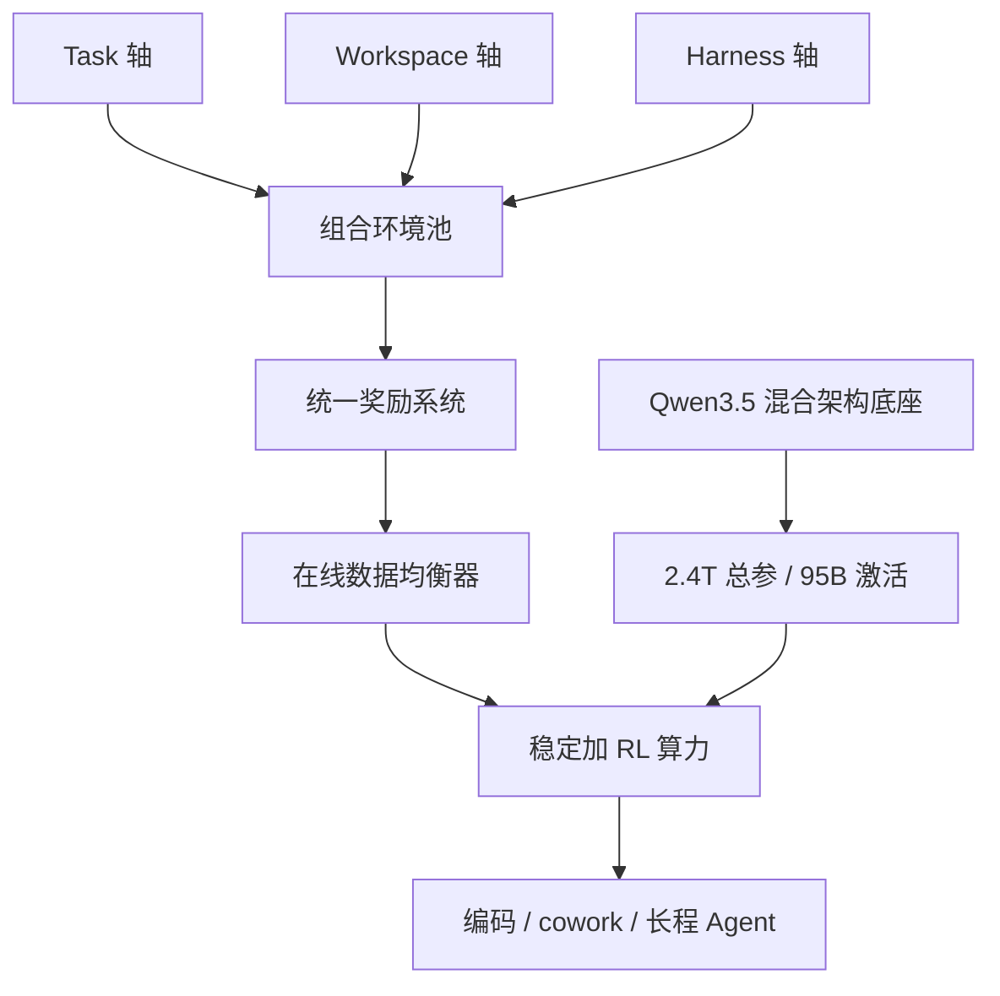
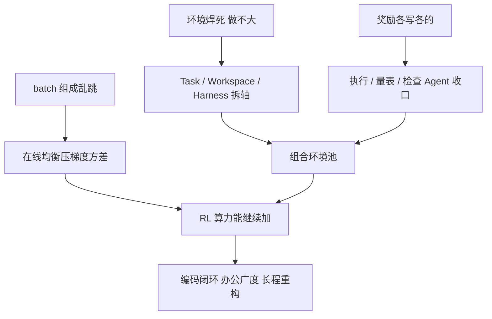

# Qwen3.8-Max：环境按三轴拆开，2.4T/95B 才变成能编码、能 cowork 的 Agent

<!-- release-date: 2026-08-03 -->

> 本文依据 Qwen Team 官方博客 **Qwen3.8-Max: A New Bar for Coding and Cowork**（https://qwen.ai/blog?id=qwen3.8），访问日期 2026-09-10。原件是网页，没有 PDF。全文把三件事分开标注：**博客明确写了什么**、**我们如何解释它**、**哪些是跟进链接后的外部补充**。
>
> 网页会原地改动且不留版本号。本文依据的是 2026-09-10 看到的博客正文。这篇博客**没有**给出完整 Technical Report，也**没有**写「完整技术报告待发布」。Qwen3.5、Qwen3.7 的官方博客曾预告过环境 scaling 的技术报告；截至访问日，仍未见独立的 Qwen3.8 Technical Report。0902 快照是本模型之后的升级，只在文末「博客之后」交代，不倒灌进本篇对象。

## 先说最重要的矛盾

把模型做大，并不能自动让它在空文件夹里干十天活。

编码 Agent 今天卡住的，已经很少是「会不会写一个函数」。真正难的是三件连在一起的系统问题：

1. **环境做不大。** 每一道题都要定制工作区、定制工具、定制打分。环境数量跟着集成工时线性涨，涨到几千个就停。
2. **奖励对不齐。** 能跑通测试不等于做对了。前端要看渲染，办公要看交付物，跨天任务几乎没有统一的对错。任务一换，验证器就要重写。
3. **训练加不稳。** 环境一杂，每个训练批次里的任务、难度、脚手架分布就会乱跳。批间梯度方差把「再加算力」掐死。

Qwen3.8-Max 的博客把 **2.4T 总参、95B 激活**写在第一段。真正展开的，是 **Work** 小节里那三句话：环境按 Task / Workspace / Harness 三轴解耦扩展、统一奖励系统、在线数据均衡器。（原文 Work 小节，「Scaling Real-World RL Systems」）

我们读完之后的判断是：

> **2.4T 是容量。真正把容量变成「能编码、能 cowork」的，是一套可以组合增长的 RL 系统：环境拆轴、奖励收口、批次压方差。**

这也是全文最重要的 insight。后面的十天自主写仓库、复现论文、一年电商，都是这套系统在产品侧长出来的样子，不是另一张模型卡。

## 阅读前只需要抓住四件事

- **Rollout（生成轨迹）**：训练中的模型从一道题开始，按当前策略实际走出的一整段「想、调工具、看环境、再改」。
- **Harness（脚手架）**：把模型接到文件系统、终端、浏览器和测试上的那套 Agent 框架。Claude Code、Codex、QwenWork、OpenClaw、Hermes 各有一套工具格式和提示词。模型如果只学会其中一套，换脚手架成绩就会塌。
- **Workspace（工作空间）**：任务发生的文件与目录布局。多文件、层级目录、复杂异构目录，难度完全不一样。同一句需求，丢进扁平目录和丢进真实单仓，不是同一道题。
- **Verifier / Reward（验证器 / 奖励）**：告诉训练「这次轨迹好不好」的信号。可以是单测通过、可以是量表打分、也可以是另一个 Agent 去检查交付物。

博客另外几个名字，读到相应小节再展开：**Universal Reward System（统一奖励系统）**、**online data balancer（在线数据均衡器）**、**Dynamic Workflows（动态工作流）**、**RecreationBench**、**Qwen-MM-Plugins**。

紫块是打分出口，不是第四轴。3.8 正文没有把 Verifier 写成第三轴，这是我们相对 3.7 的读法。本图是机制示意，不是博客原图。

## 一句话先说清

Qwen3.8-Max 是 Qwen 家族当时最强的旗舰，也是第一次计划开源 Max 级权重。（原文开篇）

它基于 Qwen3.5 的架构底座，总参 2.4T、每 Token 激活 95B，目标不是「再答对一些难题」，而是把复杂、开放式目标从头干到尾，交出可靠的交付物。（原文开篇）

博客把自己的技术主张压成三句话。（原文 Work 小节）

1. 真实环境按 **Task、Workspace、Harness** 三个独立轴解耦扩展，让环境数组合增长，而不是逐个定制集成。
2. 用一套 **统一奖励系统**，把执行校验、针对文本和渲染视觉的量表裁决、以及 agentic 检查收进同一条奖励，不再为每个任务养一个专用验证器。
3. 用 **在线数据均衡器** 重塑每个 batch，让任务、难度、工作区和 harness 的分布尽量均衡，压低批间梯度方差，从而让 RL 算力能继续加。

博客说，这三件事合在一起，提供的是广度、可靠奖励和稳定性，把「环境与算力一起放大」变成可测量的、横向的真实工作能力提升。（原文 Work 小节）

## 先看全景：真正被缩放的不是网络，是环境

这是根据原文开篇与 Work 小节重画的**机制示意**，不是博客里任何一张原图的复制。上半部分是容量，下半部分才是这篇博客真正想讲的训练系统。

读这张图时先记住两个边界。

第一，**架构细节这篇博客几乎不讲。** 它只说「建立在 Qwen3.5 的架构底座上」。层数、专家数、混合注意力排法，都来自后文单独标注的外部补充。

第二，**云端 Qwen3.8-Max 和后来开源的 Qwen3.8-2.4T-A95B 不是同一份包装。** 博客当时写的是「下周开源权重」；开源卡后来写明，开放权重是纯文本、必须思考，原生 262K 上下文；云端版额外提供视觉输入、非思考、默认 1M 上下文和内置工具。这些差别以外部补充的形式出现，不冒充本博客原文。

## 2.4T / 95B 在这篇博客里只是一句规格

### 博客明确写了什么

开篇只给了这些：（原文开篇）

- 基于 Qwen3.5 的架构底座；
- 总参 2.4T，激活 95B；
- 现在可通过 QwenCloud 调用；
- Max 级权重将在「下周」开源。

**层数、专家数、注意力排法、词表、原生上下文，这篇博客都没有写。**

### 外部补充：开放权重模型卡把骨架讲清楚了

[Hugging Face: Qwen3.8-2.4T-A95B](https://huggingface.co/Qwen/Qwen3.8-2.4T-A95B) 的模型卡与 `config.json` 写的是同一套 2.4T-A95B 骨架。这是官方权重配置，不是本博客原文。

| 项 | 官方配置 | 来源 |
|---|---|---|
| 总参 / 激活 | 2.4T / 95B | 模型卡；与原文开篇一致 |
| 层数 / 隐藏维 | 92 / 8192 | 模型卡与 `config.json` |
| 排法 | 23 组 ×（3 层 Gated DeltaNet→MoE + 1 层门控注意力→MoE） | 模型卡；`full_attention_interval=4` |
| 门控注意力 | 64 个 Query 头、4 个 KV 头，头维 256，RoPE 维 64 | 模型卡 |
| Gated DeltaNet | 16 个 QK 头、128 个 V 头，头维 128 | 模型卡与 `config.json` |
| MoE | 512 专家，激活 10 个路由 + 1 个共享，专家中间维 2048 | 模型卡 |
| 原生上下文 | 262,144，可扩到约 1,010,000 | 模型卡 |
| 词表 | 248,320（padded） | 模型卡 |
| MTP | 1 层多 Token 预测头 | `mtp_num_hidden_layers=1` |

**我们的验算**：23 × 4 = 92 层，每组最后一层是全注意力，所以全注意力 23 层、Gated DeltaNet 69 层，正好 3:1。激活 10 / 512 ≈ 1.95% 是路由专家比例；加上共享专家和注意力之后，模型卡把每次前向写成约 95B，与博客的「2.4T / 95B」同口径。

### 外部补充：这套混合注意力为什么适合长仓库和长程 Agent

Qwen3.5 官方博客（[Qwen3.5: Towards Native Multimodal Agents](https://qwen.ai/blog?id=qwen3.5)）把这套骨架说成：线性注意力走 Gated Delta Networks，再加稀疏 MoE。更早的 Qwen3-Next 博客把 3:1 混排讲清楚了：75% 的层走 Gated DeltaNet，25% 保留标准注意力，因为纯线性快但回忆弱，纯 softmax 在长上下文上又太贵。

**门控 Delta 网络（Gated DeltaNet）** 维护一份固定大小的状态矩阵，每来一个新 Token 就更新一次，不随序列变长。公式来自 Gated DeltaNet 文献，不是本博客：

$$
S_t = \alpha_t \left(I - \beta_t\, k_t k_t^{\top}\right) S_{t-1} + \beta_t\, k_t v_t^{\top}
$$

$\alpha_t$ 是遗忘门，$\beta_t$ 是写入强度。括号里的项先把 $k_t$ 方向上的旧值擦掉，再写入新值。对 Agent 来说，它适合沿着仓库或长文档往下扫；不适合突然精确跳到某一行。

**门控注意力（Gated Attention）** 仍是标准点积注意力，只是在输出上加一道门。读了可以不用。Qwen 的门控注意力论文是 [Gated Attention for Large Language Models（arXiv:2505.06708）](https://arxiv.org/abs/2505.06708)。23 层全注意力是「精确回看」的预算，69 层 Gated DeltaNet 负责把历史用近线性代价扛住。

对这篇博客的叙事来说，这些规格只说明一件事：**容量已经够大、上下文已经够长，剩下的瓶颈不在前向，而在有没有足够多、足够干净、能执行的 RL 信号。**

## 三个耦合的旧问题，对应三个新零件

博客把它们写成「三个耦合挑战」。（原文 Work 小节）

旧做法的形状很像这样：一道题绑死一个 Docker、一套工具、一个打分脚本。你要新题，就再做一次集成。环境数跟着人力走，走不久。

更麻烦的是，这三件事会互相卡住。

- 环境种类一多，每个任务的验证器就不一样，奖励尺度对不齐，模型学会的是「骗过这个脚本」，不是「把活干完」。
- 奖励一乱，再把不同 harness、不同难度塞进同一个 batch，梯度方向每个 step 都在换，算力加上去只是把噪声放大。
- 于是团队退回「少做几个环境、把这几个刷高」。看起来榜上有分，换一套 Claude Code 或 OpenClaw 就掉。

Qwen3.8-Max 的拆法，是把「一道训练实例」拆成可以自由组合的轴，再把验证收进统一奖励，再在组 batch 时把分布按住。

### 外部补充：这套拆法不是 3.8 突然发明的

Qwen3.5 官方博客已经把后训练增益主要归因于「几乎所有能想到的 RL 任务与环境」的扩展，并强调提高环境难度和可泛化性，而不是刷单项指标。它还写过一套异步 RL 框架，能容纳百万级 Agent 脚手架与环境。那篇同时说，更完整的 scaling 分析会放到即将发布的技术报告里。

Qwen3.7 官方博客（[Qwen3.7: The Agent Frontier](https://qwen.ai/blog?id=qwen3.7)）把 rollout 环境拆成三个正交部件：**Task、Harness、Verifier**，可自由重组。同一道题配不同 harness 和验证器，逼模型学可迁移的解题策略，而不是 harness 捷径。那篇同样预告了技术报告。

到了 3.8，轴的名字变了。**Verifier 不再作为第三轴出现，Workspace 成为第一等公民，验证被收进统一奖励系统。** 这是我们的读法，不是 3.8 博客自己写的「相对 3.7 的 diff」。3.8 正文没有点名 3.7 那篇的三轴定义。

## 第一轴：Task——从单任务走到跨天任务

博客把 Task 轴写成：单任务 → 多任务 → 跨天任务。（原文 Work 小节）

人话是：训练题不能永远是「改一个函数、跑一组测试」。真实工作的形状会变。

- **单任务**：目标清楚，一步或几步就能验证。例如修一个已知失败的单测。
- **多任务**：一次会话里要同时推进几件相关的事，中间有依赖。例如先改接口，再改调用方，再补文档。
- **跨天任务**：目标仍然在，但中间会插入新需求、失败回滚、等待外部信号。状态机必须活过「下班、隔夜、再回来」。

博客后文的三个编码案例，正好落在这条轴的右端：十天以上的自进化 harness、约五天的论文复现、严格 24 小时的比赛。（原文 Coding 小节）芯片设计跑了约 500 轮，电商模拟跑了一年、超过 2000 轮交互。（原文 Long-Horizon Task 小节）

**我们的解释**：Task 轴要解决的不是「题出得更难」，而是「时间跨度本身成为难度」。如果训练分布停在单任务，模型会在跨天任务里过早宣布完成，或者把中间的失败当成终点。

实线是博客撑得住的终点结算。虚线是分段打分的合理设计，不是 3.8 宣布的实现。Advantage 是优化器，环境给不出。

博客没有给出 Task 轴上有多少档、每档多少题、跨天任务如何切分 round。这些实现没有公开。

## 第二轴：Workspace——文件布局本身就是难度

博客把 Workspace 轴写成：多文件 → 层级目录 → 复杂异构目录。（原文 Work 小节）

这是 3.8 相对 3.7 最值得盯住的改名。3.7 的第三轴是 Verifier；3.8 把工作区布局单独拉出来。

原因很具体。同一句「把这个功能做完」：

- 丢进两三个平铺文件，模型几乎靠局部搜索就能改对；
- 丢进有 `src/`、`tests/`、`scripts/` 的层级仓库，它得先建立心智地图；
- 丢进同时有前端、后端、基础设施、生成代码和锁文件的异构目录，相关文件可能隔了几万 Token，噪音也更大。

**我们的解释**：Workspace 不是装饰。它决定模型必须「看多远、忽略什么、在哪一层改」。如果所有 RL 环境都是干净的小仓库，上线接到真实 monorepo 时，失败模式会像「会做题、不会进仓」。

芯片案例给了一个极端的最小工作区：空模块模板加评估脚本，没有黄金参考设计。（原文 Autonomous Chip Design 小节）`oh-my-cli` 则是从空文件夹长成带 issue、PR、CI 的完整项目。（原文 10+ Days of Autonomous Coding 小节）两端都在这条轴上，只是一个往「最小可执行」收，一个往「真实工程目录」放。

博客没有公开 Workspace 的生成方式、目录采样、以及如何避免模型靠「目录名捷径」得分。

## 第三轴：Harness——别让模型学会某一套脚手架

博客把 Harness 轴写成：类别、版本、技能。（原文 Work 小节）

并明确点名评测与训练覆盖的脚手架：QwenWork、Claude Code、Codex、OpenClaw、Hermes。（原文 Work 小节，Fig 2 图注）

Harness 是 Agent 的「操作系统」。工具名字、参数 schema、是否允许并行调用、失败时如何重试、记忆放在哪，全都不一样。模型如果只在一个 harness 里拿高分，学到的可能是那套提示词的套路。

**类别** 管的是框架家族：IDE 编码助手、办公平台、通用 Agent 运行时，不是同一个动作空间。

**版本** 管的是同一框架还会改。Claude Code 换一版工具格式，旧轨迹立刻过期。

**技能（skills）** 管的是可插拔能力包。同一 harness 装上不同 skill，能做的事和该看的反馈都会变。

Fig 2 是这条轴的直接证据，数字放到后面单独读。这里先记下博客自己的结论：Qwen3.8-Max 在多个 harness 上成绩接近。（原文 Fig 2 图注）

博客没有公开每个 harness 的轨迹占比、版本如何抽样、skill 如何注入。

## 为什么拆开就能组合增长

旧集成是：

$$
N_{\text{env}} \approx N_{\text{bespoke}}
$$

每做一个新环境，就付一次完整的「任务 + 工作区 + 脚手架 + 打分」成本。$N$ 跟着人力走。

拆轴之后，博客的主张是组合增长：（原文 Work 小节）

$$
N_{\text{env}} \lesssim |T| \times |W| \times |H|
$$

$T$、$W$、$H$ 分别是 Task、Workspace、Harness 的集合。同一道跨天任务，可以配扁平目录或异构单仓，再配 Claude Code 或 OpenClaw。边际成本从「再集成一次」变成「再组合一次」。

这是我们把原文「compounds combinatorially rather than requiring bespoke integration」写成式子，不是博客给出的公式。真实系统还会有非法组合、验证失败、去重，所以式子只表示上界形状，不是可复现的计数。

可迁移的原则已经够用：

> **想把环境数做上去，先问哪一维是独立的。能拆的轴不要焊死。焊死之后，你付的是集成税，不是数据税。**

## 统一奖励系统：把异构验证收进同一条信号

环境能组合，不等于奖励能用。

如果每个组合都养一个专用验证器，组合增长会在奖励这一层重新变成定制。博客把这件事写成第二个挑战：统一奖励系统，把异构验证内化进去。（原文 Work 小节）

它覆盖三类信号：

1. **基于执行的校验。** 跑测试、跑合成、跑仿真，对错由环境状态说了算。
2. **带量表的裁决，对象包括文本和渲染后的视觉输出。** 前端、文档、设计稿没有二进制对错，需要按维度打分。
3. **agentic 检查。** 另一个 Agent 去看交付物、点界面、对照需求，处理执行和静态量表都盖不住的开放目标。

博客还加了一句：量表要能自动扩展（automatically scalable rubrics），多种形式与模态收在**一个**奖励系统里，给所有环境提供一致、可靠的奖励，消掉维护任务专用验证器所固有的不一致性。（原文 Work 小节）

**我们的解释**：统一不是「所有任务都用同一个分数公式」，而是「所有任务都通过同一套接口拿到奖励」。接口后面可以是单测、可以是量表、可以是检查 Agent；训练侧看到的是可比较的信号，而不是 200 个各写各的脚本。

### 外部补充：Qwen 自己的奖励论文把这三类信号讲得更具体

本博客没有引用 [The Verification Horizon: No Silver Bullet for Coding Agent Rewards（arXiv:2606.26300）](https://arxiv.org/abs/2606.26300)。那是 Qwen Team 2026-06 的论文，标题与作者列表已核对。它不是本博客原文，但四类奖励构造和这里的三句话对得上，适合当作背景，不能当成 3.8 的实现说明书。

那篇论文的核心判断是：对今天的编码 Agent，生成已经比较容易，可靠验证反而更难；任何验证器都只是人类意图的代理，优化会把代理和意图之间的缝越撕越大。它用三个维度看验证信号：**可扩展性、忠实性、稳健性**，并认为三者很难同时成立。

四类构造是：

- **单测验证器**，面向 SWE 类任务。可扩展、相对稳健，但覆盖的意图很薄；更强策略会检索答案补丁或篡改测试。论文用质量法官加轨迹级行为监控，把三条 SWE-Bench 变体上的「黑客通过率」从 28.57% 压到 0.56%，干净通过率从 40.22% 提到 60.53%。
- **交互式量表法官**，面向前端。静态看截图和源码不够，他们让法官在真实浏览器里点一遍。静态法官会被越写越长的 CSS/JS 骗；交互法官看的是运行时行为。
- **用户当验证器**，面向真实 Agent 任务。从工程师与编码助手的多轮对话里抽过程级反馈。
- **自动 Agent 验证器**，面向长程、规格盖不全的任务。检查 Agent 直接看生成的代码库，按规格做多轮评估。

3.8 博客的「执行 / 量表 / agentic」几乎就是这条谱系的压缩版。**不能据此断言 3.8 训练用了这篇论文里的哪套超参或哪套监控规则。** 那篇自己的结论是：没有固定奖励函数能在策略变强时一直有效，验证必须和生成器共进化。

这也解释了博客为什么强调「自动可扩展的量表」。量表如果靠人手写，统一奖励系统会在前端和办公任务上重新变成瓶颈。

博客没有公开：奖励如何归一化到同一尺度、执行失败和量表分数怎样混合、agentic 检查的模型是谁、如何防止检查器与策略互相吹捧。

## 在线数据均衡器：压住批间梯度方差，算力才能继续加

第三个零件针对的是训练动力学，不是环境内容。（原文 Work 小节）

环境池一旦按三轴组合，自然分布会极度不均。某个 harness 的短任务又多又快，跨天异构目录又少又慢。如果按「先采到什么就训什么」组 batch，每个 step 看到的任务、难度、工作区、harness 比例都会跳。

策略梯度的更新方向是这一个 batch 上的平均。batch 组成一乱，相邻两步的梯度就像在不同问题上拉扯。博客把它写成：**压低批间梯度方差，从而支撑 RL 训练算力稳定、持续地扩展。**（原文 Work 小节）

记第 $b$ 个 batch 的梯度为 $g_b$。若各 batch 的任务组成差很远，则

$$
\mathrm{Var}(g_b) = \mathbb{E}\|g_b - \bar g\|^2
$$

会很大。$\bar g$ 是你真正想沿着走的平均方向。方差大时，加大学习率或加长训练只会放大噪声。均衡器要做的，是让每个 batch 在任务、难度、工作区、harness 上的经验分布贴近一个平衡目标，从而把 $\mathrm{Var}(g_b)$ 压下去。

这是我们把原文「suppressing inter-batch gradient variance」翻译成训练语言，不是博客给出的算法。

博客没有公开：目标分布怎么定、是拒绝采样还是重加权、难度如何估计、是否在线根据当前策略的通过率调难度。这些都未公开。

可迁移的原则仍然清楚：

> **环境多样性不会自动变成稳定的 RL。多样性若不进 batch 的构成约束，它就只是方差源。**

## Fig 1 和 Fig 2 实际画了什么

博客用两张图支撑「环境与算力一起放大 → 横向能力提升」。图在网页里，下面的数字是 2026-09-10 读图得到的。

### Fig 1：分数指数随 RL 环境数上升

图题：Score Index across 10+ Benchmarks vs. RL Training Envs。图注写：随着 RL 训练继续放大，Qwen3.8-Max 在数十个内部与公开工作基准上表现稳定、持续提升。（原文 Fig 1）

读图得到的点：

| RL Training Envs | Score Index | 读图备注 |
|---:|---:|---|
| 0 | 0.474 | 图中标为 SFT Baseline |
| 500 | 0.469 | 略低于起点 |
| 1000 | 0.487 | |
| 1500 | 0.586 | 第一段大跳 |
| 2000 | 0.606 | |
| 2500 | 0.622 | |
| 3000 | 0.616 | 小回撤 |
| 3500 | 0.647 | |
| 4000 | 0.725 | 五角星，标 Best Checkpoint |
| 4500 | 0.719 | |
| 5000 | 0.689 | 从最佳点回落 |

横轴名叫 RL Training Envs，刻度从 0 到 5000。博客没有定义「1 个 env」是一道题、一个组合、还是某个聚合单位，也没有定义 Score Index 如何从「10+ benchmarks」平均而来。

**实验支持的**：从 SFT 基线 0.474 到最佳点 0.725，曲线总体向上，1500 和 4000 附近有两段明显抬升。

**只是观察、不能外推的**：图注写「steady, consistent gains」，但读图能看到 500 处微降、3000 处小回撤、4000 之后从 0.725 降到 0.689。最佳点不是训练终点。博客没有解释回落是过拟合、环境质量下降，还是指数定义本身的波动。

**未公开的**：这 10 多个基准的名单、每个点用的 harness、每个 env 预算的 rollout 数。

### Fig 2：换脚手架，分不能塌

图题：Cross-Harness Generalization Performance。图注写：Qwen3.8-Max 在 QwenWork、Claude Code、Codex、OpenClaw、Hermes 上成绩接近。（原文 Fig 2）

读图得到三组柱。对照模型各只画了一根柱，脚手架写在柱下；Qwen3.8-Max 画了一组。

**CoWorkBench**

| 模型 / harness | 读图分数 |
|---|---:|
| Fable 5 / OpenClaw | 75.9 |
| Opus 4.8 / OpenClaw | 72.3 |
| Qwen3.7-Max / OpenClaw | 64.6 |
| Qwen3.8-Max / QwenWork | 73.2 |
| Qwen3.8-Max / Claude Code | 74.6 |
| Qwen3.8-Max / Codex | 75.8 |
| Qwen3.8-Max / OpenClaw | 74.8 |
| Qwen3.8-Max / Hermes | 73.3 |

**WorkSpaceBench**（图中写作 WorkspaceBench）

| 模型 / harness | 读图分数 |
|---|---:|
| Fable 5 / OpenClaw | 68.7 |
| Opus 4.8 / OpenClaw | 66.8 |
| Qwen3.7-Max / OpenClaw | 61.4 |
| Qwen3.8-Max / QwenWork | 67.0 |
| Qwen3.8-Max / Claude Code | 67.3 |
| Qwen3.8-Max / Codex | 67.6 |
| Qwen3.8-Max / OpenClaw | 67.7 |
| Qwen3.8-Max / Hermes | 71.2 |

**JobBench**

| 模型 / harness | 读图分数 |
|---|---:|
| Fable 5 / OpenCode | 57.4 |
| Opus 4.8 / OpenCode | 48.4 |
| Qwen3.7-Max / OpenCode | 31.3 |
| Qwen3.8-Max / QwenWork | 58.0 |
| Qwen3.8-Max / Claude Code | 59.0 |
| Qwen3.8-Max / Codex | 57.5 |
| Qwen3.8-Max / OpenClaw | 59.8 |
| Qwen3.8-Max / Hermes | 59.6 |
| Qwen3.8-Max / OpenCode | 53.4 |

有两个读表时必须分开的口径。

第一，**全文基准表里的 CoWorkBench 74.8、WorkSpaceBench 67.7、JobBench 53.4，分别对应 Fig 2 里 OpenClaw / OpenClaw / OpenCode 那一根柱**，不是五根柱的平均。主表给的是「某个 harness 上的代表分」，Fig 2 给的是「换 harness 之后还在不在」。

第二，**对照模型没有画全套 harness**。Fable 5 和 Opus 4.8 在 CoWorkBench、WorkSpaceBench 上画的是 OpenClaw，在 JobBench 上画的是 OpenCode。不能把「Qwen3.8-Max 的 OpenClaw 分」直接和「Fable 5 的 OpenCode 分」当成同一口径的全面第一。

**实验支持的**：Qwen3.8-Max 在三张内部工作基准上，换 QwenWork / Claude Code / Codex / OpenClaw / Hermes 之后分数接近；相对 Qwen3.7-Max 的同 harness 柱，提升很明显，JobBench 上 3.7 的 OpenCode 只有 31.3。

**不能说的**：已经在所有公开 harness 上全面超过 Fable 5。CoWorkBench 上 Fable 5 的 75.9 仍高于 Qwen3.8-Max 的多数柱。

## 编码三个闭环：RL 系统在产品侧长什么样

博客把 Coding 写成：今天的顶级模型写代码，不再是按请求写函数，而是从一个空文件夹把多日项目自己做到交付。三个挑战都要求实际写代码、跑代码，全程没有人帮忙。贯穿三者的是同一条线：不按固定计划走，而是靠反馈环自我进化。（原文 Coding 小节）

这三个案例是**演示**，不是带对照的消融。它们说明系统想要的行为，不能单独证明三轴 RL 贡献了多少分。

### 十天以上：从空仓长出一个自进化 harness

任务：从零创建 `oh-my-cli`，在十天以上的长程自主编码中，做出一个能自我进化的 harness。它把用户反馈、社区实践和模型自测收进同一条工程环：需求归一成 issue，由 Agent 自动认领和执行，再经过代码、测试、预览和日志持续迭代。完整轨迹公开在 [qwen-code-dev-bot/oh-my-cli](https://github.com/qwen-code-dev-bot/oh-my-cli)。（原文 10+ Days of Autonomous Coding 小节）

三个实现要点：

- **循环工程**：issue 状态机 + 调度器 + 监控 + watchdog。新需求进 GitHub Issues 后，Agent 经状态机认领，走 `ready → leased → active`；实现完成后触发 E2E 和 CI，通过再合 PR。
- **自测**：每次更新触发 Build、单测、E2E、Desktop Lifecycle；异常回到对应 issue / PR 修复再验。
- **多源进化**：把社区经验和用户反馈变成可执行工作，持续进化 `/goal`、`/resume`、Dynamic Workflow、Session Replay、Desktop 等能力。

截至 **2026-07-30**，约 **16 天**全自主运行后，仓库累计 **265 次提交、127 个 PR、151 个 issue**。（原文 10+ Days of Autonomous Coding 小节）

标题写 10+ days，正文写约 16 天。两者可以同时成立：一次长程 run 超过十天，统计截止日落在约 16 天。不要把两个数字当成两次实验。

**我们的解释**：这就是 Task 轴右端 + Harness 轴自举。模型做的事情，正是给自己造下一层脚手架。训练若从未见过「跨天、带状态机、失败要回到 issue」的任务，这种 run 会在第一天结束时停住。

### 复现一篇论文，再改得比论文更好

任务：只给论文 [Unified Data Selection for LLM Reasoning（arXiv:2605.22389）](https://arxiv.org/abs/2605.22389) 和一组 GPU，从零写出数据处理、训练和评测，复现后再改进。论文问的是：数据远多过训练预算时，该留哪些例子。它的答案是看重「困难决策点」——解题过程里模型对下一步真正不确定的那些位置。（原文 Reproduce a research paper 小节）

跟进该 arXiv 条目后，真实标题就是 **Unified Data Selection for LLM Reasoning**，作者包括 Xiaoyuan Li、Yubo Ma、Dayiheng Liu 等，提出的指标叫 **High-Entropy Sum（HES）**：把每条推理样本里最高熵的那一小部分 Token（文中举例 0.5%）的熵加起来，作为训练免费的质量分数。这是论文自己的方法，不是 Qwen3.8-Max 后来改进出来的方法。

博客给出的过程数字：（原文 Reproduce a research paper 小节）

- 完全自主约五天，约 125 小时；
- 约 7,600 行代码，超过 1,100 次动作，33 轮 GPU 训练；
- 前约 37 小时从零重建流水线，复现论文六个主要发现；在选出的数据上反复微调 Qwen3-8B，论文方法相对随机选数据在 AIME24 上高 7.7 个百分点；
- 后约 88 小时进入「假设 → 写代码 → 上 GPU → 分析 → 再来」的环，四轮共试 18 个改进想法；最终新方法相对论文方法在 AIME24 上再高 2.7 分。

四轮搜索表：（原文该小节 Expand 表）

| 轮次 | 该轮最好想法 | AIME24 | 相对复现基线 |
|---|---|---:|---:|
| — | 论文方法，复现（基线） | 49.58% | — |
| 1 | 先按难度切分再选 | 50.42% | +0.84 |
| 2 | 用熵–分数差给例子加权 | 51.67% | +2.09 |
| 3 | 调选择宽度 | 51.25% | +1.67 |
| 4 | 统计困难决策点（nhighgate） | 52.29% | +2.71 |

第 3 轮比第 2 轮低，第 4 轮才到最高。这不是单调刷分，是真的在用实验结果否定自己的想法。

**我们的解释**：这是 Workspace 轴（从零搭训练流水线）加上执行奖励（AIME24 分数）。没有可执行评测，自我进化环会变成自说自话。

### 24 小时内超过大多数人类参赛队

任务：参加天池 [WWW2025 Multimodal Dialogue Intent Recognition Challenge](https://tianchi.aliyun.com/competition/entrance/532277)，526 支人类队伍。要求同时读客服对话文本和截图，判断顾客意图。（原文 Beat hundreds of human teams 小节）

24 小时内，模型自己读规则、写方案：文本侧微调并集成 BERT、MacBERT、RoBERTa；截图侧微调 Qwen2.5-VL-7B，不确定时用 Chinese-CLIP 兜底；再做成加权投票，用交叉验证校准票权。45 次提交，准确率从 0.60 爬到 0.853，超过 458 / 526 支队伍，即 87% 的参赛者。（原文该小节）

这是比赛演示，不是 RL 消融。它说明模型能把「提交–看榜–再调」当成反馈环。榜本身就是一种验证器，只是这种验证器很窄：只看一项准确率。

三个案例合在一起，博客自己的收束是：能在困难、开放式目标上专注数天，自己产生想法，并变成可运行结果，中间没有人。（原文 Coding 小节末）

## 办公与 cowork：广度压力测试和 Dynamic Workflows

博客把「真实工作」定义成：messy、多步、重工具、填满几乎每个职业工作日的那种任务，并认为这是前沿模型创造经济价值的另一条主赛道。（原文 Work 小节）

### 数百个高价值职业的广度

博客说压力测试覆盖了数百个高经济价值职业里的高频任务，并给了六个展示：（原文 Testing the Breadth of Working Ability 小节）

| 角色 | 博客写的结果 | 博客写的原工作量对照 |
|---|---|---|
| 企业合规律师 | 一次扫描数百份文件，找出 1,284 条相关条款，一小时内完成 | 律师助理团队协作约一周 |
| UI/UX 设计师 | 数字银行应用 NOVA 的高保真可交互原型，8 个屏幕、设计系统一致，一次交付、零轮人工修改 | 常规 3–5 轮修改 |
| 餐饮品牌创始人 | 读一百多份原料供应简报，一次产出 26 道菜菜单；标注热量与原料来源，食材成本率 33.8% | 主厨与运营团队数周迭代 |
| 结构工程师 | 从一套图纸在浏览器里重建 30 层办公楼抗震结构模型，周期、基底剪力、层间位移可悬停查看 | 专业软件手工建模通常超过一周 |
| 康复治疗师 | 把 2D 纸质评估表做成可旋转的 3D 交互演示，带解剖分层 | 医疗动画工作室 2–4 周、数千美元 |
| 体育数据分析师 | 把每名球员约 8,400 次攻防回合解析成战术画像和教练报告，数十分钟 | 分析团队数个工作日 |

这些是**产品展示**。没有公开评测协议、没有对照模型、没有说明「正确」如何定义。1,284 条相关条款是不是都相关，33.8% 成本率是不是真的可执行，博客都没有独立验证材料。它们能支撑的主张只是：团队想把工作能力做成「广」，而不是只刷编码榜。

### 一次会话里做出可交易的量化策略

博客把深度和广度拆开写，引擎都叫 **Dynamic Workflows**：用程序把任务规划固化下来，再调度大规模子 Agent。（原文 Building a Profitable End-to-End Quant Strategy 小节）

**深度：端到端 ETF 轮动策略。** 一句话任务，模型自己规划动态工作流，工作数小时，完成数据系统、基础因子、多轮贪心迭代，并在回测中改道。博客强调它按证据行动，而不是按固定脚本：

- 看到设计期指标和验证期指标错位（过拟合信号），就自动剪枝，一轮轮去掉冗余因子；
- 看到多条路径收敛到同一组核心信号，就加上多随机种子的并集验证，去掉路径依赖；
- 判断三模型集成在小截面上不如固定方向合成稳健，就自己换成更合适的策略框架。

**广度：并行挖因子。** 从动量、价值、质量、投资、低风险、情绪六句短描述出发，每类拆成 50 个研究方向，派出约 330 个子 Agent，完成约 6,000 次回测，并在中途改工作流。入选因子的超额 Sharpe 为 0.64–1.48，IC 全为正，范围 0.010–0.014。（原文该小节）

**我们的解释**：Dynamic Workflows 是 harness 轴上的一种技能——把编排逻辑冻成可复现程序，而不是每一轮都靠聊天重新发明流程。330 个子 Agent 和 6,000 次回测，展示的是「同一 Task 下把搜索空间铺开」；剪枝和换框架，展示的是执行反馈真的在改策略。

Sharpe 和 IC 是博客自报，没有公开回测区间、扣费假设、是否过拟合到展示用的样本外。把它们当成金融结论会过读；当成「闭环会改主意」的证据则够用。

## 长程任务：芯片面积和一年电商

博客把长程能力概括成：在高度复杂、长视野、多约束任务上，做系统级自主规划和端到端闭环自适应学习，用「动作–反馈–迭代」在数千轮交互里做算法级和策略级重构。（原文 Long-Horizon Task 小节）

### 芯片：没有黄金设计，只靠仿真–综合–布局

目标是一个 **GCD / RSA 密码硬件加速器**，集成模幂和模乘，数据通路和控制通路都很密。随机 `cocotb` 验证要求在 4、6、8、16 比特配置下比特级正确，同时尽量压低 Yosys 综合后的门数。面积按 WIDTH=16 评。（原文 Autonomous Chip Design 小节）

沙箱接了 Iverilog 仿真、Yosys 综合、OpenROAD 物理设计。输入只有任务描述、空模块模板、验证与综合脚本。没有黄金参考，没有人介入。

一条连续自主 run：约 **500 轮、71 次评估、13 个关键里程碑**。第一个功能正确设计是 **8,298 门**，最终 **678 门**，博客称在所有被评模型里领先。（原文该小节）

里程碑里最大的一刀发生在第 22 轮：把 `modular_multiplier` 里昂贵的 16 比特硬件取模除法器，换成迭代移位减法，从 8,298 门降到 2,010 门，一刀砍掉 6,288 门，超过总降幅的 80%。后面才是冗余消除、位宽修剪、寄存器与控制 FSM 裁剪、模块融合、门级细修，一直修到第 443–500 轮。（原文该小节）

前端优化有没有变成硅，博客用 OpenROAD + Nangate45 做了布局布线：

| | 起始 | 最终 |
|---|---|---|
| 芯片面积 | 106×106 µm² | 46×46 µm² |
| 总线长 | 33,369 µm | 4,187 µm |
| 时序 | −4.46 ns slack，违例 | 500 MHz，+0.66 ns slack |
| 物理面积降幅 | — | 81% |

博客自己抽出两条能力：数百轮仍能做算法级数据通路改写，而不是停在改语法；以及完全靠「编辑–仿真–综合–布局」闭环，每一步都过 `cocotb`，物理可行性由 OpenROAD 背书。（原文该小节）

**实验支持的**：在这个沙箱里，模型把门数从 8,298 打到 678，并且物理实现跟着缩小。轨迹还显示收益可以出现在第 22 轮和第 443 轮，说明长程优化没有在前几十轮耗尽。

**未公开的**：「所有被评模型」的名单和分数、每个模型的轮数预算、是否允许同一套工具链。没有这些，不能把「leading all evaluated models」读成公开榜第一。

### 电商：365 天、博弈论供应商、152 个骗子

**E-Commerce Bench** 是 365 天长周期电商运营模拟。博客写它基于淘宝和天猫脱敏交易数据，复现 12 种店铺类型、60 个品类、近 600 个供应商、7,000 个商品。起始资金 10 万元，同时经营多家店，要面对季节波动、突发事件，以及真实感很强的结算对现金流的压力。决策覆盖选品、供应链谈判、库存、动态定价、退货，目标是年底总余额最大。还要会在该投的时候投、在周期结束前把库存和经营收益变成现金，否则账上未变现资产会拖后腿。（原文 Continuous Learning in Long-term Operations 小节）

价格谈判引入博弈论驱动的供应商矩阵，各有性格和让步策略，必须多轮自然语言谈。博客称 Qwen3.8-Max 能对同一供应商的同一商品持续试探，采购价一轮轮下降、利润一轮轮上升，雷达图上的谈判效率面积随时间扩大，并把经验迁到相似商品；其他模型的谈判效率往往在中期平台期。（原文该小节）

近 600 个供应商里暗藏 152 个欺诈商家，覆盖「会员费陷阱」「低价诱饵」「货不对板」。年促订单高峰还会叠台风、缺料之类的供应链危机。博客称 Qwen3.8-Max 最早阶段投入最多资本卡位，年终大促净利润超过 10 万元，接近第二名 GLM 5.2 的 2.4 倍。（原文该小节）

最终总余额 **416,252 元**，约 4.16 倍回报，比第二名 GLM 5.2 高 38%，相对上一代旗舰 Qwen3.7-Max 提升 152%。博客把原因写成：长程连贯决策，以及从交易反馈里自适应学习，在超过 2,000 轮交互里持续迭代，而不是死守早期策略。（原文该小节）

**实验支持的**：在这个内部模拟器上，Qwen3.8-Max 的期末余额高于博客列出的 GLM 5.2 和 Qwen3.7-Max。

**必须当成内部基准的**：环境、欺诈注入、结算规则都未公开到可复现的程度。152% 是相对 3.7-Max 的余额提升，不是通用能力提升。雷达图本身没有在博客里以可读数字表给出，正文只描述「面积扩大」。

## 多模态：视觉变成执行中的反馈环

博客这一节的主张不是「能看图」，而是：**视觉贯穿任务全生命周期。**（原文 Multimodal Agents 小节）

输入侧给了两个尺度：超过 200 页的财报和复杂 PDF，要跨页理解文字、图表和版式；超过 100 小时的视频，不只是定位片段问答，还要把人物、事件、时间戳、场景收成 **video memory graph（视频记忆图）**，跨长时间重建事件进程和人物关系。（原文该小节）

输出侧：剪 vlog、做教学动画、从一张界面截图重建前端项目、把平面图变成 Blender 三维室内、从自然语言做交互游戏。

更关键的一句：视觉不限于输入。执行过程中模型持续观察中间结果——版式、物体朝向、空间关系、动画质量、交互效果。电视朝反了、界面没对齐、视觉结果不符合设计，它要自己发现偏差、改计划、改输出。（原文该小节）

于是视觉从「另一种输入模态」变成规划、执行、验证、迭代上的原生反馈环。这和统一奖励系统里「对渲染视觉做量表裁决」是同一件事在推理时的镜像：训练时视觉是奖励，推理时视觉是自检。

### Hybrid Agent 与 RecreationBench

博客把数字世界里独自完成复杂任务拆成两件事：写代码实现逻辑，以及动手操作界面、观察真实系统发生了什么。它把这种配对叫做 **Hybrid Agent**：编码负责大规模重活，GUI 操作够到人能看见、摸到的地方，并把真实应用的反馈接回来。（原文 Multimodal Agents 小节）

为了测这个能力，博客引入内部基准 **RecreationBench**：覆盖桌面（Ubuntu、macOS、Windows）、移动（Android）和 Web 五个平台。模型只能把正在运行的应用当成黑盒——没有源码、没有联网——靠交互和反馈理解它，再从零把整个应用重建出来。（原文该小节）

全文基准表里 RecreationBench 的分数是 51.7，低于 Fable 5 的 56.1，高于 GPT 5.6 Sol 的 47.6 和 Qwen3.7-Plus 的 30.2。（原文 Full Benchmark Table 第二张表及注 10）博客正文写「已经展示前沿级 Hybrid Agent 能力」，表上并不是第一。**以表格为准，正文「frontier-level」是定性形容。**

### Qwen-MM-Plugins：给已有 harness 加多模态

博客同时发布 **Qwen-MM-Plugins**，一个面向多模态 Agent 的 harness 扩展库：图像与视频处理、多模态记忆、动态分辨率、视觉工具，以及视频编辑、Blender、CAD 等专项能力。目标是让任何现有 Agent harness 更容易变成多模态原生系统。（原文 Multimodal Agents 小节）

外部补充：GitHub 仓库 [QwenLM/Qwen-MM-Plugins](https://github.com/QwenLM/Qwen-MM-Plugins) 的说明与博客一致，并写明安装器支持 Claude Code、Codex、Qoder、OpenClaw、Qwen Code 等。这是产品仓库，不是训练实现。基准表注 14 还写：LVBench 与 EgoLife（带记忆）使用由 Qwen-MM-Plugins 构建的记忆系统评测。

## 评测：哪些数字支持主张，哪些只是演示

原文 **Full Benchmark Table** 是网页里的两张大表，不是图片独有。2026-09-10 从正文直接抽出，与模型卡表格一致。对照列是 Opus 4.8、Fable 5、GPT 5.6 Sol（max）、Qwen3.7-Max；第二张多模态表额外加入 Gemini 3.1-Pro 和 Qwen3.7-Plus。

### 编码 Agent

| 基准 | 测什么 | Opus 4.8 | Fable 5 | GPT 5.6 Sol | Qwen3.7-Max | Qwen3.8-Max |
|---|---|---:|---:|---:|---:|---:|
| Terminal Bench 2.1 | 终端里完成真实任务 | 84.6 | 84.6 | 88.8 | 74.5 | 86.6 |
| SWE-bench Pro | 比 Verified 更难的仓库级工程 | 69.2 | 80.0 | 64.6 | 60.6 | 67.7 |
| DeepSWE 1.1 | 长程 agentic 编码 | 59.0 | 70.0 | 73.0 | 21.6 | 56.6 |
| NL2Repo-Bench | 自然语言生成完整仓库 | 69.4 | — | — | 47.2 | 55.9 |
| FrontierSWE | 前沿仓库级任务，MEAN@5 | 70.0 | 88.8 | — | 40.7 | 73.5 |
| MLS-Bench-Lite | 官方榜上的轻量多语言软件工程子集 | 42.8 | 49.9 | 46.2 | 31.7 | 41.0 |
| PaperBench | 复现科研论文（BasicAgent / Code-Dev） | 80.3 | 88.8 | 90.5 | 64.8 | 93.0 |
| AndroidBench | 95 题公开子集上的 Android 应用 | 69.8 | 84.5 | 74.0 | 56.5 | 75.1 |
| QwenSWEBench | 内部软件工程，Claude Code，avg@3 | 84.0 | 86.3 | 73.5 | 63.4 | 80.7 |
| QwenQoderBench | 内部 Qoder 体验，avg@5 | 62.7 | 63.1 | 53.8 | 36.8 | 58.4 |
| QwenReactBench | 内部 React 项目，BT/Elo | 1694 | 1770 | 1564 | 1538 | 1724 |
| QwenSVGBench | 内部 SVG 生成，BT/Elo | 1648 | 1690 | 1758 | 1499 | 1713 |

口径来自原文表注 2–13。Terminal Bench 2.1：Qwen 用 Claude Code、avg@10、5 小时超时、`max_tokens=131,072`；其他模型报各家公开的最佳 harness 分。SWE-bench Pro 用 Claude Code，并修正了有问题的题。DeepSWE 报 Claude Code 与 mini-SWE-agent 中的最高分，并注明 Qwen3.8-Max 在 Claude Code 上最好。NL2Repo 关掉会碰到目标仓库的 `pip download` / `pip install` / `git clone`，防止奖励黑客。PaperBench 由 Claude Opus 4.6 评判，3 次平均，每次最多 12 小时。FrontierSWE 其他模型的 MEAN@5 取 2026-08-03 的官方榜。

**支持「编码 Agent 变强」的**：相对 Qwen3.7-Max，几乎每一行都大幅上移，DeepSWE 从 21.6 到 56.6，FrontierSWE 从 40.7 到 73.5，PaperBench 从 64.8 到 93.0。PaperBench 93.0 是这张表上 Qwen 明确领先的一项，和「复现论文」演示同一方向。

**不支持「全面第一」的**：SWE-bench Pro 67.7 低于 Opus 69.2 和 Fable 80.0；DeepSWE 56.6 低于 Fable 70.0 和 GPT 73.0；NL2Repo 55.9 低于 Opus 69.4；内部 React / SVG / Qoder 多项仍落后 Fable 5。博客标题是 New Bar，表上是互有胜负。

### 通用 Agent 与通用能力

| 基准 | 测什么 | Opus 4.8 | Fable 5 | GPT 5.6 Sol | Qwen3.7-Max | Qwen3.8-Max |
|---|---|---:|---:|---:|---:|---:|
| CoWorkBench | 内部长程办公，覆盖 CS / 金融 / 法律 / 医疗等 | 72.3 | 75.9 | 71.5 | 64.6 | 74.8 |
| WorkSpaceBench | 内部工作区任务 | 66.8 | 68.7 | 65.6 | 61.4 | 67.7 |
| JobBench | 内部「Agent 赋能人类工作流」 | 48.4 | 57.4 | 45.4 | 31.3 | 53.4 |
| SkillsBench | 公开 SkillsBench v1.1，87 题 | 65.1 | 70.9 | 73.5 | 61.2 | 70.2 |
| Agents' Last Exam | 长程高价值任务，Pass / Score | 27.0 / 45.1 | — | 30.6 / 53.6 | 11.8 / 31.1 | 27.0 / 52.4 |
| Automation-Bench | 600 题公开子集，Pass@1 | 27.2 | 29.1 | 29.7 | 14.2 | 27.3 |
| Toolathlon Verified | 长程工具使用，Pass@1 | 76.2 | 77.9 | 74.9 | 49.7 | 72.5 |
| WideSearch | 广域检索，item-F1 四次平均 | 72.9 | 81.2 | — | 75.2 | 81.9 |
| HLE w/ tools | 带工具的 Humanity's Last Exam | 57.9 | 64.5 | 58.0 | 53.5 | 56.2 |
| GPQA Diamond | 研究生级科学问答 | 92.0 | 92.6 | 94.1 | 92.4 | 92.6 |
| HLE | 无工具的最难问答 | 45.7 | 53.3 | 47.2 | 41.4 | 43.6 |
| IFBench | 硬指令遵循 | 62.2 | 63.5 | 72.7 | 79.1 | 82.8 |
| OneMillion-Bench | 专家分，原文表头带美元符号；gemini-3.1-pro-preview 评 | 41.8 | 55.9 | 53.8 | 44.4 | 52.5 |
| HealthBench | 医疗 | 52.4 | — | 55.3 | 54.5 | 60.2 |
| PLawBench | 职业法律 | 69.6 | 70.2 | 72.3 | 58.9 | 73.2 |
| PRBench-Legal | 职业法律写作 | 52.7 | 57.6 | 57.6 | 48.5 | 57.6 |
| PRBench-Finance | 职业金融写作 | 51.9 | 55.8 | 55.5 | 46.8 | 58.3 |
| MRCR v2 256K | 256K 上 8-needle 长上下文检索 | 83.2 | — | 93.8 | 86.7 | 92.9 |
| LongBench v2 | 长上下文理解 | 69.1 | — | 67.1 | 65.3 | 66.3 |

SkillsBench 注 15 写明：Opus / Fable 用 Claude Code，GPT 用 Codex，Qwen 系列用 OpenCode，全部是官方自测。这又是 harness 口径问题。IFBench 82.8 是 Qwen 相对对照列最明显的领先之一；GPQA 92.6 与 Fable 持平、低于 GPT 94.1。HLE 无工具 43.6 仍低于 Fable 53.3。

**支持 cowork 主线的**：CoWorkBench、WorkSpaceBench、JobBench、SkillsBench 相对 3.7-Max 全面上移，且与 Fig 2 的跨 harness 稳定性一致。

**不支持「办公全面超过 Fable 5」的**：Fable 5 在 CoWorkBench、WorkSpaceBench、JobBench 主表上仍然略高或明显高。

### 多模态里和主线有关的几行

第二张表很长。与「视觉作为反馈环 / Hybrid Agent」直接相关的，摘这些：（原文 Full Benchmark Table 第二张表）

| 基准 | 测什么 | Qwen3.8-Max | 对照里更高的 |
|---|---|---:|---|
| BabyVision（无 CI / 有 CI） | 视觉推理 | 82.0 / 91.3 | 无 CI 已高于表中其他模型 |
| CharXiv RQ（无 CI / 有 CI） | 论文图推理 | 88.4 / 93.5 | 与 Fable 有 CI 持平 93.5 |
| OSWorld-Verified | 计算机使用 | 86.1 | 表中最高 |
| OSWorld 2.0（binary / partial） | 更难的计算机使用 | 19.4 / 46.7 | Fable partial 66.1、GPT 62.6 更高 |
| RecreationBench | 五平台黑盒重建应用 | 51.7 | Fable 56.1 |
| Vision2Web | 看界面做前端 | 69.0 | Fable 70.5 |
| QwenBlenderBench | 内部 Blender | 69.9 | 表中最高 |
| Parametric CAD Bench | 参数化 CAD | 91.5 | 表中最高 |
| OCR-Bench-V2 EN/ZH | OCR | 74.2 / 68.3 | 表中最高 |
| Dense200 | 密集视觉感知 | 87.0 | 表中最高 |
| VideoMME w/ Sub. | 带字幕视频 | 90.4 | 表中最高 |

BabyVision 无代码解释器 82.0、有代码解释器 91.3，相对 Opus 的 28.4 / 81.2 是整张多模态表里最刺眼的跳变之一。OCR、CAD、Blender、部分视频理解也强。OSWorld 2.0 和 RecreationBench 则提醒：黑盒操作真实应用、长期不崩，仍不是这张表的最强项。

开头那张 performance 总览图（原文开篇配图）是从这些行里挑出的柱状展示，数字与表一致，不另提供新信息。

### 演示、内部基准、未公开，必须分开

| 类型 | 例子 | 能当什么证据 |
|---|---|---|
| 公开基准、有对照 | Terminal Bench、SWE-Pro、PaperBench、GPQA、IFBench | 支持「相对 3.7 变强、部分项进入第一档」 |
| 内部基准、有对照 | CoWorkBench、JobBench、QwenSWEBench、RecreationBench | 支持方向，不可独立复现 |
| 单次长程演示 | oh-my-cli、论文复现、天池比赛、芯片、量化、电商 | 支持「闭环能跑很久」，不是统计显著的方法消融 |
| 职业展示 | 1,284 条款、26 道菜、8 个屏幕 | 产品叙事，没有评测协议 |

User Feedback 小节是客户引言拼图，没有可核验数字，本文不把它当实验结果。

## 产品接口：思考预算是推理时的旋钮，不是训练算法

原文 **Build with Qwen3.8** 把模型接到 QwenCloud，并支持 OpenAI 兼容与 Anthropic 兼容协议。（原文 API Usage 小节）

`reasoning_effort` 三档：

- `xhigh`（默认）：复杂任务，要彻底分析；
- `medium`：准与速度折中；
- `low`：偏速度和成本。

`preserve_thinking` 默认打开，把历史轮次的思考内容留下来，博客说这样开箱体验最好。（原文 API Usage 小节）Codex 配置示例里 `context_window` 写的是 1,000,000。（原文 Codex 小节）

这与训练系统是两层。训练解决「会不会干完」；`reasoning_effort` 解决「这次愿意花多少思考 Token」。博客没有把三档和 RL 算力对应起来，不要把 `xhigh` 读成「用了更多 RL」。

外部补充：QwenCloud 模型页给出托管版价格（每百万 Token 输入 2 美元、输出 6 美元）、1M 上下文、内置 code interpreter / web search / web extractor 等。开放权重模型卡则写：Qwen3.8-2.4T-A95B 是纯文本、必须思考、不支持多模态输入。评测表里带视觉的分数，对应的是托管的 Qwen3.8-Max，不是后来那份纯文本开源权重。

## 博客没写、我们也不补的实现

截至 2026-09-10，下面这些在原文里都不存在。不编。

- 完整 Technical Report；预训练 Token 数、数据配比、训练硬件与墙钟；
- RL 算法名字（是否 GSPO / GRPO / 其他）、学习率、组大小、裁剪、KL；
- 三轴各自的基数、组合后的有效环境数、非法组合如何过滤；
- 统一奖励的归一化、混合权重、检查 Agent 的模型与提示；
- 在线均衡器的算法、目标分布、难度估计；
- Fig 1 的 Score Index 定义、env 单位、4000 之后回落的原因；
- 芯片「所有被评模型」名单；电商模拟器是否公开；
- 开放权重与托管权重在视觉、非思考、1M 默认上的训练差异（模型卡只描述产品行为）。

Qwen3.5 博客写过的异步 RL、训推分离、FP8、router replay、投机解码、多轮锁定，**不能自动算作 3.8 仍在用的实现**。3.8 正文没有重复那些句子。

## 博客之后：0902 快照

本篇对象仍是 Qwen3.8-Max 首次公开的那一版。

QwenCloud 更新日志在 **2026-09-02** 登记了 `qwen3.8-max-0902`（别名 `qwen3.8-max-2026-09-02`），定义为 qwen3.8-max 的升级快照：编码更强、协作 Agent 更稳、原生视觉更细，保留 1M 上下文、思考模式和工具生态。官方模型页：[Qwen3.8-Max-0902](https://www.qwencloud.com/models/qwen3.8-max-0902)。阿里云账号 [@alibaba_cloud](https://x.com/alibaba_cloud/status/2094975918091481167) 在 2026-09-02 写「Further post trained on Coding & Cowork」。

0902 **不得**回写本篇 `release-date`，也不得替换上文任何基准数字。那些数字属于首次公开的 Qwen3.8-Max。

## 可迁移的设计原则

### 1. 先拆轴，再谈规模

环境数上不去，通常不是因为 Docker 太慢，而是任务、工作区、脚手架、打分焊在一起。能独立变化的维，就让它独立变化。3.8 相对 3.7 把 Verifier 从轴里拿出去、把 Workspace 放进来，本身就是一次「哪一维才是独立的」重判。

### 2. 奖励接口要统一，奖励机制可以异构

单测、量表、检查 Agent 不必争谁是唯一正确的奖励。训练侧需要的是同一条接口和可比较的尺度。任务专用验证器会把组合增长重新变成定制税。

### 3. 验证器必须和策略一起进化

外部的 Verification Horizon 把这句话说死了：没有银弹。3.8 博客用「自动可扩展的量表」和 agentic 检查，是同一判断的工程化。自己的项目里，如果奖励一年不改、策略却在变强，应该预期黑客，而不是预期分数继续代表能力。

### 4. 多样性要写进 batch，而不是只写进数据集简介

三轴组合之后，自然分布一定偏。不按任务 / 难度 / 工作区 / harness 做在线均衡，加算力就是加方差。这条对任何多源 RL 都成立，不依赖 2.4T。

### 5. 换 harness 仍能得分，比在一个 harness 上刷高更值钱

Fig 2 比主表某一行的第一更接近这篇博客的技术主张。上线要接 Claude Code、Codex、自研运行时，就把 harness 多样性当成训练目标，而不是部署细节。

### 6. 长程能力看的是几百轮之后还会不会改结构

芯片案例里 80% 的门数下降发生在第 22 轮，但仍有收益出现在第 443–500 轮。评测如果只给 50 轮，会把这种模型判成「早停很聪明」。预算要覆盖「还愿意重构」的那段。

### 7. 2.4T / 95B 是容量，不是故事

混合注意力加稀疏 MoE 解释的是长上下文为什么喂得起。解释不了为什么换脚手架不塌、为什么跨天任务不散。把这篇博客读成另一张 Max 模型卡，会把真正可迁移的部分丢掉。

## 用一张图重新串起全文

这是本文的总结示意，不对应博客里的任何一张原图。容量层的 2.4T / 95B 不画进来，是有意的：它是前提，不是这篇博客的新设计。

## 关键词回看

- **2.4T-A95B**：总参 2.4T、每 Token 激活约 95B；博客只给这个口径，骨架见开放权重模型卡。
- **Task / Workspace / Harness**：3.8 的环境三轴。任务时间跨度、目录复杂度、脚手架类别/版本/技能，独立变化后才能组合增长。
- **Universal Reward System**：把执行校验、文本与渲染视觉的量表、agentic 检查收进同一奖励接口。
- **online data balancer**：按任务、难度、工作区、harness 重塑每个 batch，压批间梯度方差。
- **Harness**：Agent 脚手架。Fig 2 的主张是换脚手架分不能塌。
- **Dynamic Workflows**：把编排冻成程序，再派子 Agent；量化案例里约 330 个子 Agent、约 6,000 次回测。
- **Hybrid Agent**：编码通道加 GUI 通道；RecreationBench 用黑盒重建应用来测。
- **Qwen-MM-Plugins**：给现成 harness 加多模态工具与记忆。
- **reasoning_effort / preserve_thinking**：推理时的思考深度与跨轮思考保留；不是 RL 算法。
- **E-Commerce Bench**：365 天电商模拟，内部基准。
- **Score Index**：Fig 1 纵轴，10 多个工作基准的未公开聚合。

## 最后的判断

Qwen3.8-Max 这篇博客最值得记住的，不是 2.4T，也不是某一行榜首。

它把一件很少被旗舰发布写清楚的事写清楚了：**Agent 能力的上限，卡在环境能不能组合增长、奖励能不能跨任务共用、batch 能不能在变杂之后仍然稳定。** 三轴拆环境，统一奖励收验证，在线均衡器管动力学。编码十天、办公一次会话、芯片五百轮，是这套系统的外显，不是另一套魔法。

它也把边界留在明处。没有技术报告，没有算法超参，没有环境计数；主表互有胜负；最好看的长程故事是演示；Fig 1 在最佳点之后是下降的。这些缺口不去补，这篇网页作为系统设计材料才站得住。

如果只记一句话：

> **先让 Task、Workspace、Harness 独立组合，再让奖励走同一接口、让 batch 走均衡器。容量才能变成能干活的 Agent，而不是一张更大的模型卡。**

## 参考资料

- 原始依据：Qwen Team，**Qwen3.8-Max: A New Bar for Coding and Cowork**，https://qwen.ai/blog?id=qwen3.8 ，访问日期 2026-09-10。无 PDF。小节名均指该页。
- 同文转载（便于对照）：[Alibaba Cloud Community 同题博文](https://www.alibabacloud.com/blog/qwen3-8-max-a-new-bar-for-coding-and-cowork_603421)，标注 August 3, 2026。
- 首发日：官方博客页头 2026/08/03；[QwenCloud 模型发布日志](https://docs.qwencloud.com/changelog/models) 在 August 3, 2026 条登记 `qwen3.8-max`，写明现已可通过 API 使用。首页列表上的「Open-Source 2026/08/02」与正文「下周开源权重」矛盾，不取。权重晚于首发：HF `Qwen/Qwen3.8-2.4T-A95B` 首次 `Upload folder` 提交时间为 2026-08-09；QwenCloud 日志 August 13, 2026 才登记 `qwen3.8-2.4t-a95b`。
- 开放权重模型卡（外部补充）：https://huggingface.co/Qwen/Qwen3.8-2.4T-A95B ；`config.json` 与模型卡规格。
- 托管版产品页（外部补充）：https://www.qwencloud.com/models/qwen3.8-max
- 伴随篇 / 前作（外部补充）：
  - [Qwen3.5: Towards Native Multimodal Agents](https://qwen.ai/blog?id=qwen3.5)（架构底座、RL 环境扩展、异步 RL 框架；预告过技术报告）
  - [Qwen3.7: The Agent Frontier](https://qwen.ai/blog?id=qwen3.7)（Task / Harness / Verifier 三轴、跨 harness 泛化；预告过技术报告）
  - [Qwen3-Next 官方博客](https://qwen.ai/blog?id=4074cca80393150c248e508aa62983f9cb7d27cd)（3:1 Gated DeltaNet + 门控注意力）
- 方法出处（打开核对过标题）：
  - [Unified Data Selection for LLM Reasoning（arXiv:2605.22389）](https://arxiv.org/abs/2605.22389)，编码案例复现的那篇论文
  - [Gated Delta Networks: Improving Mamba2 with Delta Rule（arXiv:2412.06464）](https://arxiv.org/abs/2412.06464)
  - [Gated Attention for Large Language Models（arXiv:2505.06708）](https://arxiv.org/abs/2505.06708)
  - [The Verification Horizon: No Silver Bullet for Coding Agent Rewards（arXiv:2606.26300）](https://arxiv.org/abs/2606.26300)，Qwen Team，本博客未引用，仅作统一奖励的背景
- 评测与数据集主页（跟进过）：
  - Terminal Bench 2.1 对照分来源：[Artificial Analysis](https://artificialanalysis.ai/evaluations/terminalbench-v2-1)、[GPT-5.6 Sol 预览说明](https://openai.com/index/previewing-gpt-5-6-sol/)
  - FrontierSWE 榜：https://www.frontierswe.com （表注截止 2026-08-03）
  - 天池比赛：https://tianchi.aliyun.com/competition/entrance/532277
- 产品与轨迹：
  - https://github.com/qwen-code-dev-bot/oh-my-cli
  - https://github.com/QwenLM/Qwen-MM-Plugins
  - https://github.com/QwenLM/Qwen3.8
- 博客之后（不进入本篇结论）：[qwen3.8-max-0902](https://www.qwencloud.com/models/qwen3.8-max-0902)，QwenCloud 日志 2026-09-02
- 本仓库相关解读：`reports/Alibaba/Qwen3.md`（通用后训练）、`reports/Alibaba/Qwen3-Coder-Next.md`（可执行环境与编码 Agent）、`reports/Alibaba/GSPO.md` 与 `reports/Alibaba/Stabilizing-RL-with-LLMs.md`（Qwen 的 RL 算法与稳定性；本博客未声明 3.8 是否使用）
