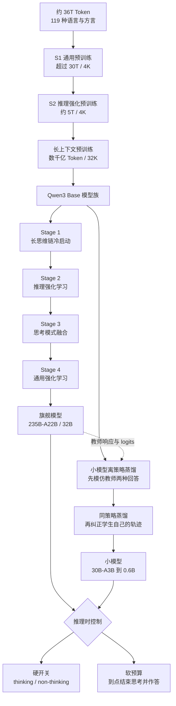
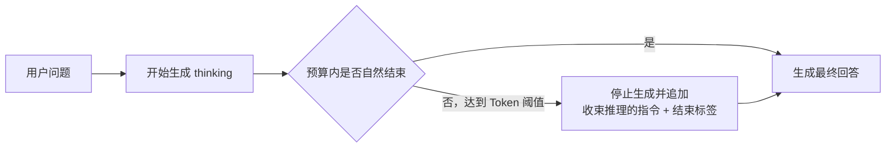
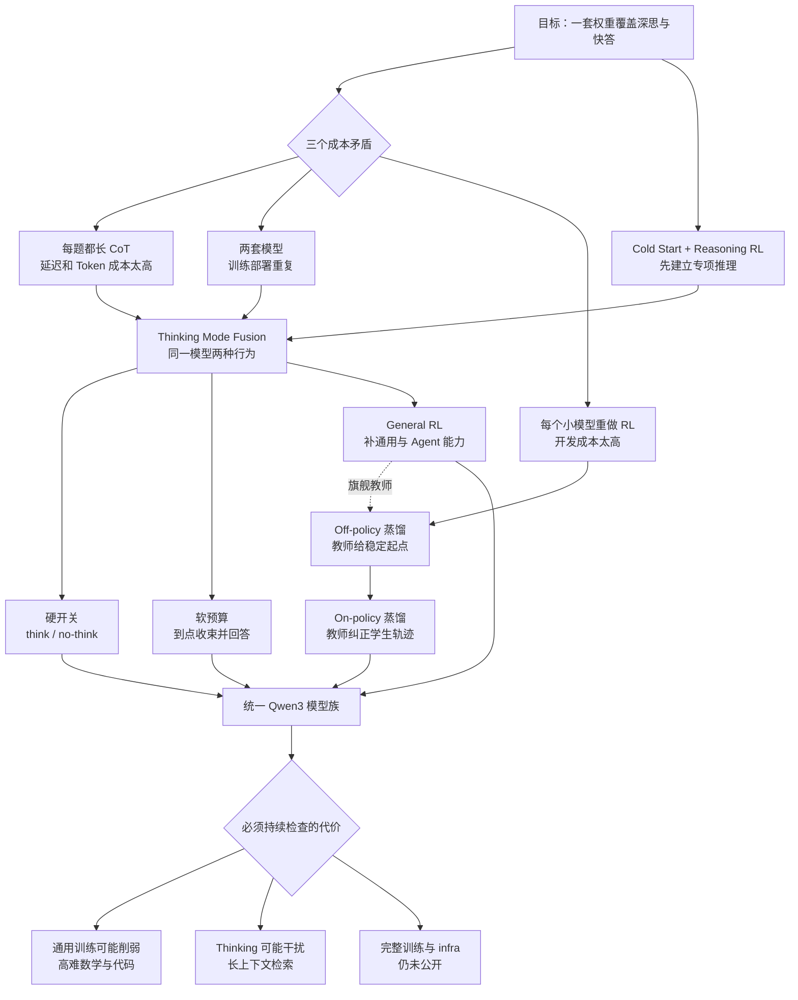

# Qwen3：让一套权重既会深思、快答，也能按预算收手

> 本文依据 Qwen Team 发布的 **Qwen3 Technical Report**，即 arXiv:2505.09388v1、封面日期 2025-05-15、共 35 页的版本。页码均指 PDF 本身的页码。截至 2026-09-05 核验，arXiv 当前正式版本仍为 v1。本文只讨论后来官方仓库所称的 Qwen3-2504；Qwen3-2507 是独立的后续模型与发布，不是这份 Technical Report 的 v2，因此不会把它的模型拆分、长上下文声明或其他新能力倒灌进来。

## 先说最重要的矛盾

推理模型有一个很直接的办法提高成绩：多生成一些思考 Token，多试几步。

但线上请求并不都值得这样做。

- 一道竞赛数学题，可能值得花几万 Token 推导；
- 一句“把这段话改短”，若也先写一大段思考，用户只会觉得慢；
- 如果把“会推理”和“快速回答”做成两个模型，训练、部署、缓存和路由又都要维护两套。

所以 Qwen3 真正要解决的不是“怎样让模型永远想得更久”，而是三个连在一起的问题：

1. 怎样先把长推理能力练出来；
2. 怎样把快速回答重新接回同一套权重；
3. 怎样让用户按任务价值决定要不要想、最多想多久。

Qwen3 的答案是一条完整的后训练流水线：先用可验证题教会模型长推理，再用强化学习把能力推高；随后把 thinking 和 non-thinking 两种行为融合进一个模型，并用通用强化学习补齐指令、格式、工具调用与人类偏好；最后把旗舰模型的两种行为蒸馏给小模型。（PDF p.9-12）

这条路线确实让一个模型拥有两种工作方式，但它不是免费午餐。报告自己的消融显示：通用能力和工具能力继续提升时，最难的数学与代码成绩会回落；在长上下文检索任务中，额外思考甚至可能干扰检索。（PDF p.21-23）

因此，Qwen3 最值得记住的判断不是“thinking 越多越好”，而是：

> **把推理当成一种可分配的计算预算。先训练出能力，再给产品一个开关和刹车，同时用逐能力评测看住它的副作用。**

## 阅读前只需要四个概念

- **Token（词元）**：模型读写文本时使用的基本小块。思考预算最终也是按 Token 计数。
- **Chain of Thought（CoT，思维链）**：模型在最终答案前生成的中间推理过程。Long-CoT 就是更长、更完整的推理轨迹。
- **Logit（未归一化分数）**：模型在每个位置给词表中所有下一个 Token 的打分。经过 softmax 后，它们才变成概率。
- **Rollout（生成轨迹）**：训练中的模型从一道题开始，按照当前策略实际生成的一整段回答。

只要先抓住这四个概念，后面的 cold start、reinforcement learning、thinking budget 和 distillation 就能串成一条线。

## 先看全景：Qwen3 的能力从哪里来



这是根据报告 Figure 1 与第 3、4 节重画的**机制示意图**，不是报告公开的真实训练时间线。上半部分表示旗舰模型走完整四阶段；下半部分表示小模型借助强到弱蒸馏，不必分别重复整套四阶段训练。（PDF p.4、9-12）

接下来可以沿着这张图，从底座一路走到推理控制。

## 底座没有推倒重来：先把模型族做得更省

Qwen3 的 Transformer 骨架与 Qwen2.5 相近。真正新的重心主要在训练数据、专家路由和后训练，而不是发明一种完全不同的基本网络。（PDF p.3）

### 稠密模型和混合专家是两种成本档位

**Dense（稠密模型）** 的主要权重会为每个 Token 都参与计算。Qwen3 发布了 0.6B、1.7B、4B、8B、14B 和 32B 六个稠密模型。

**Mixture of Experts（MoE，混合专家）** 则把前馈网络拆成许多专家，每个 Token 只调用其中少数几个。Qwen3 发布了两个 MoE：

| 模型 | 总参数 | 每 Token 激活参数 | 层数 | Query/Key-Value 头数 | 专家总数/激活数 |
|---|---:|---:|---:|---:|---:|
| Qwen3-30B-A3B | 30B | 3B | 48 | 32/4 | 128/8 |
| Qwen3-235B-A22B | 235B | 22B | 94 | 64/4 | 128/8 |

模型名里的 `A3B` 和 `A22B` 就是在提醒用户：权重文件虽然分别有 30B 与 235B 参数，但单个 Token 不会把所有专家都跑一遍。（PDF p.3）

这不等于“30B-A3B 的实际延迟一定和 3B 稠密模型相同”。MoE 还要付路由、专家通信、显存驻留和负载不均的成本。报告没有给端到端吞吐或延迟，因此这里只能说它减少了每 Token 的主要激活计算，不能直接换算服务速度。

### 注意力沿用成熟部件，只在稳定性上补了一刀

Qwen3 稠密与 MoE 模型都使用这些部件：（PDF p.3）

- **Grouped Query Attention（GQA，分组查询注意力）**：多个 Query 头共享较少的 Key/Value 头，降低 **Key-Value Cache（KV Cache，键值缓存）** 成本；
- **Swish-Gated Linear Unit（SwiGLU，Swish 门控线性单元）**：用门控决定前馈网络让哪些信息通过；
- **Rotary Positional Embedding（RoPE，旋转位置编码）**：把相对位置信息编码进注意力；
- **RMSNorm（Root Mean Square Normalization，均方根归一化）**，并采用 pre-normalization，也就是先归一化再进入注意力或前馈层。

与 Qwen2 相比，Qwen3 去掉 Q、K、V 投影里的 bias，并给 Query 和 Key 加入 **Query-Key Normalization（QK-Norm，查询-键归一化）**。它的直觉很简单：先控制向量尺度，再做点积，避免少量过大的 Query/Key 把 softmax 推到极端。（PDF p.3）

下面是帮助理解的通用注意力式，不是报告新增公式：

$$
z_{ij}=\frac{q_i^T k_j}{\sqrt d}
$$

$q_i$ 是当前位置的 Query，$k_j$ 是历史位置的 Key，$d$ 是头维度。若 $q_i$ 或 $k_j$ 的模长失控，$z_{ij}$ 会变得很大，注意力权重可能过早饱和。QK-Norm 在离问题最近的位置给它加护栏。报告只说这样做是为了稳定训练，没有给独立消融，因此不能量化它单独贡献了多少性能。（PDF p.3）

### 151,669 个 Token 需要一套共同的切分规则

Qwen3 使用 Qwen tokenizer，采用 **Byte-level Byte-Pair Encoding（BBPE，字节级字节对编码）**，词表大小为 151,669。（PDF p.3）

BPE 会反复合并语料中常见的相邻字节片段，让高频词或词根可以用较少 Token 表示；保留字节级退路，则意味着遇到陌生字符时仍能编码，不必依赖一个“未知字符”占位符。

这对 119 种语言很重要，但大词表本身不等于多语言能力。不同语言的切分效率还取决于各自语料与合并规则。报告没有给逐语言 tokenizer 压缩率，因此不能进一步声称每种语言都获得了同等高效的表示。

### 不设共享专家，为什么还要改负载均衡

Qwen3 MoE 有 128 个专家，每个 Token 激活 8 个，并取消了 Qwen2.5-MoE 的 shared experts。它同时采用 **global-batch load-balancing loss（全局批次负载均衡损失）**，鼓励专家分化。（PDF p.3）

这里有一个容易忽略的矛盾。

如果在每个很小的 micro-batch（微批次，单次设备实际处理的小批量），甚至每条样本内部都强迫专家接收同样多的 Token，那么一段纯代码也会被均匀摊给所有专家。负载看上去很整齐，但专家很难形成“这个擅长代码、那个擅长数学”的分工。

把均衡范围扩大到 global batch 后，单条代码样本可以集中路由给代码专家；只要整个大批次中不同领域合起来仍然均衡即可。于是系统同时保住硬件负载与领域 specialization。

这是很可迁移的一条原则：

> **均衡约束放得太局部，会把你真正想要的 specialization 一起抹掉。**

不过，报告没有公开路由函数、负载损失权重、容量因子、丢 Token 策略或专家并行实现。我们知道设计方向，不足以复现训练。

### 模型配置揭示的两个边界

| 模型 | 层数 | Query/Key-Value 头数 | 词嵌入共享 | 报告表中 Context Length |
|---|---:|---:|---|---:|
| Qwen3-0.6B | 28 | 16/8 | Yes | 32K |
| Qwen3-1.7B | 28 | 16/8 | Yes | 32K |
| Qwen3-4B | 36 | 32/8 | Yes | 128K |
| Qwen3-8B | 36 | 32/8 | No | 128K |
| Qwen3-14B | 40 | 40/8 | No | 128K |
| Qwen3-32B | 64 | 64/8 | No | 128K |

**Tie Embedding（词嵌入权重共享）** 表示输入 embedding 与输出 prediction head 共享参数。小模型更在意节省权重，因此前三档采用共享；8B 起不再共享。（PDF p.3）

第二个边界更重要。表中把 4B 以上模型写成 128K context，但预训练章节明确说最终训练序列是 32,768，推理时再用 **YaRN（Yet another RoPE extensioN，一种 RoPE 上下文外推方法）** 与 **Dual Chunk Attention（DCA，双块注意力）** 扩展 4 倍。（PDF p.3-4）因此准确说法是“报告配置支持 128K，有 32K 长上下文训练底座”，而不是“原生用 128K 训练”。

外部补充：Qwen3-235B-A22B 的官方模型卡把它写得更清楚：32,768 native，使用 YaRN 时为 131,072。这个说明用于澄清部署口径，不替代报告证据。

## 36T Token 不是一个数字，而是一套数据分层

Qwen3 的预训练数据约 36T Token，覆盖 119 种语言与方言。相比 Qwen2.5，Token 数约翻倍，语言覆盖约增至三倍。（PDF p.3-4）

但“多喂一倍”不是完整解释。报告还公开了三条更有方向性的变化。

### 第一条：把 PDF 中原本难抓取的内容变成训练文本

团队先用 **Qwen2.5-VL（Vision-Language，视觉语言模型）** 做大量 PDF 类文档的文字识别，再用 Qwen2.5 清理识别结果。报告称这条链路新增了数万亿 Token，但没有给精确数量、文档类型占比或质量阈值。（PDF p.2、4）

这是一条数据工程方法，不代表 Qwen3 本身是多模态模型。视觉模型只是上游数据处理器。

### 第二条：用领域教师合成不同形态的数据

团队使用 Qwen2.5、Qwen2.5-Math 和 Qwen2.5-Coder 合成教材、问答、指令和代码片段，覆盖几十个领域，规模同样达到数万亿 Token。（PDF p.4）

这里的价值不只是补数量。不同教师承担不同领域，生成内容又被组织成多种学习形式。模型既看连续知识，也看问题、答案、指令与程序。

代价是合成数据可能继承教师偏差、固定文风和错误。报告没有公开合成比例、验证器、去重策略或与真实语料的混合上限，所以不能把“数万亿合成 Token”直接理解成同等规模的新知识。

### 第三条：从来源级配比走向样本级配比

Qwen3 的多语言标注系统为超过 30T Token 标注教育价值、领域、主题和安全等属性。随后，团队用小型 **proxy model（代理模型）** 做大量消融，在 instance level，而不只是网站或数据源级别，优化数据混合。（PDF p.4）

为什么要细到样本？同一个网站既可能有高质量技术文章，也可能有模板页和垃圾转载。只给整个来源一个权重，会把好坏内容绑在一起。样本级标签允许训练管线分别取舍。

这条思路很值得迁移到自己的数据项目：先问“能否给每条样本一个可用的质量与领域坐标”，再谈全局混合比例。只是 Qwen3 没有公开标签模型、目标函数、消融曲线与最终配比，因此这里只能借设计原则，不能复制 recipe。

## 三阶段预训练：通用知识、推理密度、上下文长度分开学

把 36T Token 一次性混在一起训练，会让不同目标互相争夺预算。Qwen3 把预训练拆成三段。（PDF p.4）

### S1：先建立语言与世界知识底座

- 训练量：超过 30T Token；
- 序列长度：4,096；
- 覆盖 119 种语言与方言；
- 目标：语言能力与通用知识。

绝大多数 Token 放在这一阶段，因为基础建模需要广覆盖，而不是每条数据都要求高难推理。

### S2：提高每个 Token 的推理密度

- 训练量：约 5T Token；
- 序列长度：仍为 4,096；
- 提高 Science、Technology、Engineering and Mathematics（STEM，科学、技术、工程与数学）、代码、推理和合成数据比例；
- 加快学习率衰减。

这一步没有急着扩长上下文，而是先改变内容结构。可以把它理解为：底座已经会读写，现在让剩余训练预算更集中地练“难题”。

### 长上下文阶段：最后再承担昂贵序列

- 训练量：数千亿 Token；
- 序列长度：32,768；
- 其中 75% 的文本长度在 16,384 到 32,768；
- 其余 25% 在 4,096 到 16,384；
- RoPE base frequency 从 10,000 提到 1,000,000；
- 使用 YaRN 与 DCA 做 4 倍推理长度扩展。

长序列显著增加显存和计算，没必要从训练第一天就承担。先在短序列上学大部分知识，再用较少但专门的长文完成长度适配，是更经济的课程安排。

YaRN 通过调整位置编码尺度帮助模型外推到训练长度之外。DCA 则把长序列中的相对位置关系拆成块内、块间等情况处理。Qwen3 报告只写“ABF”，且未展开名称或实现；它只说明 ABF 用于调整 RoPE base frequency。本文因此不猜它的全称。（PDF p.4）

报告称团队为三个阶段分别建立 scaling law（缩放规律，用小规模实验预测大规模设置），预测学习率调度与 batch size，并为 dense/MoE 各自选择最优设置。但它没有给公式、proxy 实验点、最终学习率或 batch size。这里不能像复现论文那样补出一套不存在的超参数表。（PDF p.4）

## 第一阶段后训练：先给长推理一个可靠起点

预训练模型已经有知识，却不一定会稳定地产生可验证、可读的长推理。直接做 **Reinforcement Learning（RL，强化学习）** 也很危险：如果模型一开始几乎答不对，reward 太稀，训练很难知道哪条路径值得保留。

所以 Qwen3 先做 **Long-CoT Cold Start（长思维链冷启动）**。（PDF p.10）

### 题目先过四道门

数据覆盖数学、代码、逻辑推理与一般 STEM，而且每题必须有可验证参考答案或代码测试。

Qwen2.5-72B-Instruct 先过滤 query：

- 去掉不容易验证的问题；
- 去掉包含多个子问题的问题；
- 去掉普通文本生成任务；
- 去掉不需要 CoT 就能轻易答对的问题；
- 给题目标领域，维持领域平衡。

这套过滤背后的逻辑是：cold start 的目的不是教模型所有常识，而是给后续 RL 准备“难但能判”的题。

### 回答也不能只看最终答案

对保留下来的题，QwQ-32B 生成 $N$ 个候选。若它一直答错，人工标注者还会介入检查。对于 Pass@$N$ 大于零，也就是 $N$ 个候选里至少有一个通过验证的题，候选回答继续过滤：（PDF p.10）

1. 最终答案错误；
2. 大量重复；
3. 明显猜测但没有充分推理；
4. thinking 与最终 summary 自相矛盾；
5. 不恰当的语言混用或风格突变；
6. 疑似与验证集样本过度相似。

最后只取精炼数据的一小部分，且刻意减少训练样本和 step。

为什么不多训一点？因为 cold start 只负责教基本推理形态。若用大量固定教师轨迹把模型训得太死，后续 RL 只能在老师已经走过的狭窄区域里优化，探索空间反而变小。

可迁移的经验是：

> **冷启动要让策略“有路可走”，不是提前替强化学习走完所有路。**

## 第二阶段：用 3,995 个验证器把推理能力推高

进入 **Reasoning Reinforcement Learning（推理强化学习）** 时，每个 query-verifier pair 要满足四个条件：（PDF p.10）

- 没在 cold start 用过；
- 对 cold-start 模型而言仍可学习；
- 尽可能有挑战；
- 覆盖不同子领域。

最终只有 3,995 对。

这个数字看起来远小于预训练规模，但强化学习样本会被反复 rollout，一道题还能生成很多不同轨迹。这里最宝贵的不是题目数量，而是 verifier 能否准确判断结果。

Qwen3 使用 **Group Relative Policy Optimization（GRPO，组相对策略优化）**。它对同一道题采样一组回答，用组内相对奖励判断哪些轨迹更值得提高概率。报告没有给出 Qwen3 自己的 GRPO 目标函数和超参数，因此不应照抄其他论文公式冒充本报告实现。

团队给出的训练经验是：（PDF p.10-11）

- 使用更大的 batch；
- 每个 query 生成较多 rollout；
- 使用 off-policy 数据提高样本效率；
- 控制模型 entropy 稳定或逐步增加，在 exploration 与 exploitation 之间保持平衡。

**Entropy（熵）** 可以粗略理解为模型还愿意尝试多少种答案。太低时，模型很快锁死在少数路径；太高时，每次都乱试，学不到稳定策略。

在一次没有中途手调超参数的 RL run 中，Qwen3-235B-A22B 在 American Invitational Mathematics Examination 2024（AIME’24，美国数学邀请赛 2024）上从 70.1 提升到 85.1，共训练 170 个 RL step。（PDF p.11）

这证明该训练流程能继续提高数学推理，但它不是独立消融：题目、rollout 数、off-policy 比例、熵控制与模型状态一起变化，不能把 15 分增益归给某一个技巧。

## 第三阶段：把“快速回答”接回推理模型

前两阶段重点练 thinking。若到这里就停止，模型会遇到一个产品问题：连简单问题也倾向展开长推理。

**Thinking Mode Fusion（思考模式融合）** 的任务，就是把 non-thinking 能力加入已经会长推理的模型，同时尽量不破坏 Stage 2 的能力。（PDF p.11）

### 两类 SFT 数据从不同路径来

**Supervised Fine-Tuning（SFT，监督微调）** 数据包含两类：

- thinking 数据：Stage 2 模型在 Stage 1 query 上生成候选，再做 rejection sampling；
- non-thinking 数据：覆盖代码、数学、指令遵循、多语言、创作、问答与角色扮演，并用自动 checklist 检查质量。

低资源语言还会提高翻译任务比例。（PDF p.11）

thinking 数据继续由当前强模型自己生成，是为了减少额外 SFT 把 Stage 2 推理能力拉回旧教师水平的风险。non-thinking 数据则专门补广度和短答行为。

### 模式切换其实是一种训练过的协议

Qwen3 在 user 或 system message 中识别 `/think` 与 `/no_think`。多轮对话若出现多个 flag，以最后一个为准。默认不写 flag 时，模型使用 thinking mode。（PDF p.11）

```text
Thinking:
user:      问题 /think
assistant: <think>推理</think> 最终回答

Non-thinking:
user:      问题 /no_think
assistant: <think></think> 最终回答
```

这段结构根据报告 Table 9 简化重写，只表示协议，不是完整 chat template。non-thinking 仍保留空的 `<think></think>`，让两种模式共享相同输出骨架，推理框架也能用空 thinking block 明确阻止模型继续思考。（PDF p.11）

关键点是：这不是部署层偷偷把两个 checkpoint 藏在一个接口后面。模型在训练数据里真正见过两种条件和两种行为。

### “动态切换”不等于模型自动判断难度

报告中的动态切换由用户、system message 或 chat template 控制。它没有给出一个自动路由器，让模型先判断“这题难不难”，再自己决定 thinking 或 non-thinking。

所以准确表述是：

- 同一模型支持按请求切换；
- 切换信号来自外部协议；
- 默认模式是 thinking；
- 不是模型自主的难度分类器。

这个边界如果不写清，“统一模式”很容易被误解成完全自动的 test-time compute 调度。

## Thinking budget 的真相：它是一脚可控的刹车

模式开关只回答“想不想”。现实还需要回答“最多想多久”。

Qwen3 的 **thinking budget（思考预算）** 以 thinking Token 数为阈值。当模型达到用户给定的阈值时，外部系统手动停止 thinking，插入一条“时间有限，请基于已有推理直接给答案”的 stop-thinking 指令和 `</think>`，然后让模型继续生成最终回答。（PDF p.11）



这是根据报告 p.11 重画的**推理控制机制示意图**。它描述控制流，不是性能时间线。

这个实现有三个重要含义。

### 第一，budget 不是简单的 `max_tokens`

若只在达到上限时粗暴截断，输出可能停在半个公式或半句话。Qwen3 先结束 thinking block，再要求模型用已经积累的推理作答，因此至少给最终答案保留了收束机会。

### 第二，budget 能工作，依赖 Mode Fusion

报告明确说，模型没有为“被中途打断”单独训练。它是在同时学会完整 thinking 和完全 non-thinking 后，自然获得了处理中间状态的能力。（PDF p.11）

更准确地说，这是作者的经验观察，而不是经过独立消融证明的必然涌现规律。

### 第三，它是上限，不是质量保证

预算更大只是允许模型做更多计算。模型可能更早自然结束，也可能多走弯路。Figure 2 在四个推理 benchmark 上显示平滑提升，但不代表所有任务都严格单调受益。（PDF p.20）

可以把 Qwen3 的两个控制方式并排看：

| 控制 | 解决什么问题 | 怎样实现 | 主要边界 |
|---|---|---|---|
| `/think` / `/no_think` | 这次要不要展开推理 | 训练过的 chat template 条件 | 由外部选择，不自动判断难度 |
| Thinking budget | 最多允许多少推理计算 | 达阈值后结束 thinking 并提示作答 | 中途推理可能不完整，收益依任务而异 |

这是一套很实用的产品控制面：硬开关负责最低延迟，软预算负责在质量与成本之间取点。

## 第四阶段：通用强化学习把模型送回真实世界

只在数学和代码验证器上做 RL，会得到很会做题、却未必听话或会用工具的模型。

所以 Stage 4 使用 **General RL（通用强化学习）**，覆盖 20 多种任务，重点补五类能力：（PDF p.12）

1. Instruction Following：遵守内容、格式、长度和结构化输出要求；
2. Format Following：正确响应 mode flag，并稳定输出 thinking 标签；
3. Preference Alignment：开放问题上的帮助性、自然度与风格；
4. Agent Ability：在真实环境反馈中完成多轮、多步工具调用；
5. Specialized Scenarios：例如在 **Retrieval-Augmented Generation（RAG，检索增强生成）** 中减少脱离检索内容的幻觉。

### 一种 reward 不够覆盖所有任务

Qwen3 使用三类奖励：（PDF p.12）

- **Rule-based Reward（规则奖励）**：答案、格式或约束能机械验证时，直接用规则判；
- **Model-based Reward with Reference Answer（带参考答案的模型奖励）**：把参考答案与模型回答交给 Qwen2.5-72B-Instruct 评分；
- **Model-based Reward without Reference Answer（无参考答案的模型奖励）**：用人类偏好数据训练 reward model，再输出标量分数。

它们分别处理三个难度层次：能严格验证、能对照判断、只能比较偏好。

为什么不全用 reward model？因为格式和可执行答案明明可以精确验证，换成模型裁判反而引入误判。为什么不全用规则？因为创作质量、帮助性和自然度无法写成一组完整 if-else。

这是一条可迁移原则：

> **按任务可验证程度分配 reward，不要强迫一种裁判覆盖所有目标。**

### Agent RL 写了目标，却没写系统

报告说 Agent rollout 能与真实环境完成多轮交互，并根据执行反馈继续行动。（PDF p.12）这说明训练不是只模仿静态工具调用文本。

但报告没有公开：

- sandbox 类型与隔离方式；
- 工具协议和可用工具；
- 并发量、超时、重试与故障恢复；
- trajectory 如何保存；
- 环境奖励如何防止投机；
- rollout 服务与训练器怎样通信。

因此，这一段只能写成训练能力范围，不能扩写成一个不存在的 Qwen3 Agent infra 设计。

## 小模型不重走四阶段：先模仿，再在自己的错误上学习

如果 0.6B 到 14B 的每个模型都完整重复 cold start、reasoning RL、mode fusion 和 general RL，成本非常高，而且小模型的探索效率也未必好。

Qwen3 改用 **Strong-to-Weak Distillation（强到弱蒸馏）**。教师是 Qwen3-32B 或 Qwen3-235B-A22B，学生包括 0.6B、1.7B、4B、8B、14B 和 30B-A3B。（PDF p.12）

### Off-policy：先给学生一张可模仿的地图

教师分别在 `/think` 与 `/no_think` 下生成回答。学生通过 response distillation 学习两种模式的基本能力与切换协议。

这些回答来自教师，不是学生当前策略，所以叫 **off-policy distillation（离策略蒸馏）**。

它的优势是稳定。学生一开始不会解题，也能直接看到强教师的完整轨迹。问题是，教师很少走进学生自己容易犯错的状态。

### On-policy：学生走到哪里，老师就在哪里纠正

第二阶段先让学生自己采样 `/think` 或 `/no_think` 的回答，再在学生真正访问到的 Token 状态上，对齐教师的完整 logits。（PDF p.12）

这叫 **on-policy distillation（同策略蒸馏）**。它处理的问题可以用一个例子说明：

教师从第一步就走对，训练数据中没有“第三步把正负号写反之后怎么办”；学生却经常到达这个错误状态。让学生先自己生成，教师才有机会在这个位置告诉它下一步的完整概率分布。

报告只说通过最小化 Kullback-Leibler divergence（KL divergence，KL 散度）对齐 logits。KL 衡量两个概率分布有多不一样。下面是它的通用定义，不是报告原式：

$$
D_{\mathrm{KL}}(P\|Q)
=\sum_x P(x)\log\frac{P(x)}{Q(x)}
$$

$P$ 与 $Q$ 是两个分布，$x$ 是一个可能的下一个 Token；公式按 $P$ 的概率，对每个 Token 的概率比取加权和。蒸馏时，$P$ 与 $Q$ 会对应教师与学生在同一位置上的词表概率。这里故意不把哪一方放在 $P$、哪一方放在 $Q$ 写死，因为报告没有公开 KL 的方向和 temperature（温度，用来控制概率分布的尖锐程度）；它也没有公开蒸馏损失权重、序列采样比例或教师选择规则。

### 为什么对齐完整 logits 比只学抽中的 Token 信息更多

假设教师认为下一个 Token 可以是：

- “因此”：45%；
- “不过”：35%；
- “同时”：15%；
- 其他：5%。

只模仿教师最终抽中的“因此”，学生看不到“不过”也是合理分支。完整 logits 把教师对整个词表的偏好都传过去，监督更密，方差也更小。

这正好解释 Table 21 的一个现象：直接 RL 提高 Pass@1，却没有提高 AIME 的 Pass@64；on-policy distillation 不只提高第一次答对概率，还提高了多次采样的覆盖能力。（PDF p.21）

## 三组实验把收益和代价同时摆出来

Qwen3 的评测表很多。最有解释力的不是把所有数字堆在一起，而是三组能回答设计问题的实验。

先认几个反复出现的名字：AIME 测试竞赛数学；**Graduate-Level Google-Proof Q&A（GPQA，研究生级封闭式科学问答）** 测试较难科学知识；LiveCodeBench 用持续更新的题目测试代码生成。后面的 **Massive Multitask Language Understanding（MMLU，大规模多任务语言理解）** 则覆盖更广的知识任务。

### 证据一：更多 thinking Token 在四类难题上平滑增益

Figure 2 给 Qwen3-235B-A22B 分配 1K、2K、4K、8K、16K 和 32K 六档 thinking budget，测试 AIME’24、AIME’25、LiveCodeBench v5 与 GPQA Diamond。（PDF p.20）

四条曲线都随预算上升。non-thinking 虚线基线分别是：

| Benchmark | Non-thinking | 32K Thinking 的图上位置 |
|---|---:|---:|
| AIME’24 | 40.1 | 约 87 |
| AIME’25 | 24.7 | 约 82 |
| LiveCodeBench v5 | 35.3 | 约 68 |
| GPQA Diamond | 62.9 | 约 72 |

曲线中间点没有数字标签，因此这里只读趋势，不从像素伪造精确小数。

这组实验支持“推理型任务可以用更多 test-time compute 换成绩”。但它只有数学、代码和 STEM，不支持“写作、检索、工具调用也一定单调提高”。作者还说超过 32K 后可能继续改善，那是未来预期，不是已经测出的点。（PDF p.20）

### 证据二：蒸馏比直接 RL 更便宜，也保住探索空间

Table 21 从同一个 off-policy-distilled Qwen3-8B checkpoint 出发，只比较数学与代码 query：（PDF p.21）

最后一列的 Graphics Processing Unit Hours（GPU Hours，图形处理器小时）表示硬件数量乘以占用时间。

| 方法 | AIME’24 | AIME’25 | MATH-500 | LiveCodeBench v5 | MMLU-Redux | GPQA | GPU Hours |
|---|---:|---:|---:|---:|---:|---:|---:|
| Off-policy Distillation | 55.0 (90.0) | 42.8 (83.3) | 92.4 | 42.0 | 86.4 | 55.6 | - |
| + Reinforcement Learning | 67.6 (90.0) | 55.5 (83.3) | 94.8 | 52.9 | 86.9 | 61.3 | 17,920 |
| + On-policy Distillation | 74.4 (93.3) | 65.5 (86.7) | 97.0 | 60.3 | 88.3 | 63.3 | 1,800 |

括号内是 Pass@64。

On-policy distillation 在这里用 1,800 GPU Hours，直接 RL 用 17,920，约为十分之一；前者所有列都更高。它还把 AIME’24 Pass@64 从 90.0 提到 93.3，AIME’25 从 83.3 提到 86.7，而直接 RL 没提高这两个数。

这支持两个判断：

1. 强教师的完整分布能提供比稀疏 reward 更密的学习信号；
2. 对小模型，蒸馏可能比让它独立探索更省算力。

边界也必须紧跟着写：这只是 8B、数学/代码、同一起点的实验。它不能证明所有尺寸、所有领域都稳定快十倍。

### 证据三：通用性变强时，专业推理会掉一点

Table 22 比较 Qwen3-32B 的 Stage 2、Stage 3 和 Stage 4。（PDF p.21-22）

先看获得了什么：

- ThinkFollow：Stage 3 的 88.7 提升到 Stage 4 的 98.9；
- thinking ToolUse：63.3 → 70.4 → 85.5；
- thinking CounterFactQA：50.4 → 61.3 → 68.1；
- thinking Arena-Hard：86.8 → 89.4 → 93.8；
- non-thinking ToolUse：Stage 3 的 73.2 → Stage 4 的 86.5。

再看失去了什么：

- thinking AIME’24：83.8 → 81.9 → 81.4；
- thinking LiveCodeBench v5：68.4 → 67.2 → 65.7；
- thinking MMLU-Redux：91.4 → 91.0 → 90.9；
- thinking GPQA-Diamond：68.8 → 69.0 → 68.4。

作者没有回避这个结果。他们推测，后两阶段加入更广泛的通用任务，削弱了处理最复杂问题的专项能力，并明确说为了整体 versatility 接受这项 trade-off。（PDF p.22）

这也是全篇最适合迁移到自己项目的实验：多目标后训练不能只看综合平均分。每加一类数据或 reward，都要保留最重要专项能力的 regression set，否则“更通用”可能悄悄变成“关键任务更弱”。

## 一个重要反例：长上下文检索不需要更多思考

Qwen3 在预训练时把序列扩到 32K，再用 YaRN factor 4 做长度外推。附录用 RULER（一组长上下文诊断基准）测 4K 到 128K，并在 thinking mode 把预算固定为 8,192 Token，防止长输入上过度推理。（PDF p.23）

Qwen3-235B-A22B 的结果是：

| 模式 | Avg. | 4K | 8K | 16K | 32K | 64K | 128K |
|---|---:|---:|---:|---:|---:|---:|---:|
| Non-thinking | 95.0 | 97.7 | 97.2 | 96.4 | 95.1 | 93.3 | 90.6 |
| Thinking | 92.2 | 95.1 | 94.8 | 93.0 | 92.3 | 92.0 | 86.0 |

thinking 平均更低，128K 也从 90.6 降到 86.0。

报告的解释是：RULER 更像从长文本中找回信息，并不依赖复杂推理。额外 thinking 没有增加有效证据，反而可能干扰检索。（PDF p.23）

它揭示了 thinking budget 应该怎样分配：

- 推导型问题，更多计算可能有用；
- 检索型问题，先保证证据定位，不要默认展开长推理；
- 混合任务，可以把“检索”和“推理”拆成不同阶段，再分别分预算。

这是比“所有请求默认 Max”更成熟的系统设计。

## 旗舰成绩应该怎样读，才不会变成排行榜复读

报告在同一评测体系下覆盖 general、alignment、math、text reasoning、agent、coding 与 multilingual 等任务。Qwen3-235B-A22B Thinking 的代表成绩包括：（PDF p.14）

其中，Instruction-Following Evaluation（IF-Eval，指令遵循评测）检查模型是否真的满足格式、长度、关键词等明确要求，而不是只看答案是否“像是正确”。

- AIME’24：85.7；
- AIME’25：81.5；
- LiveCodeBench v5：70.7；
- CodeForces：2056，98.2 百分位；
- Berkeley Function Calling Leaderboard v3（BFCL v3，伯克利函数调用榜）：70.8；
- MATH-500：98.0；
- Arena-Hard：95.6。

作者称它以 DeepSeek-R1 的约 60% 激活参数、35% 总参数，在 23 项中赢 17 项。Non-thinking 则被报告为在 23 项中的 18 项超过 GPT-4o-2024-11-20。（PDF p.15）

这些数字能说明 Qwen3 同时具备较强的两种行为，但不能证明每项提升来自 mode fusion 或某个单独架构改动。预训练数据、模型规模、MoE、QK-Norm、四阶段后训练和评测提示都一起变化。

### 评测配置本身就是结果的一部分

报告给出的 Qwen3 采样设置是：（PDF p.13）

| 模式 | Temperature | top-p | top-k | Max Output |
|---|---:|---:|---:|---:|
| Thinking | 0.6 | 0.95 | 20 | 32,768 |
| Non-thinking | 0.7 | 0.8 | 20 | 32,768 |

AIME’24/25 的最大输出进一步放到 38,912。CreativeWriting v3 与 WritingBench 使用 presence penalty 1.5。

Temperature 控制采样随机度；top-k 只保留分数最高的 $k$ 个候选，top-p 则保留累计概率达到阈值的一组候选；presence penalty（出现惩罚）会降低已经出现过的内容再次被选择的概率。

此外：（PDF p.13）

- GPQA-Diamond 每题采样 10 次，报告平均准确率；
- AIME 每年包含 30 道题，每题采样 64 次再取平均；
- CodeForces 每题最多生成 8 次独立尝试；
- BFCL 对 Qwen3 使用 Function Calling（FC，函数调用）格式，Multi-Turn 还用 YaRN 部署到 64K；部分基线来自排行榜，并可能取 FC 与 Prompt 格式中更高的结果；
- LiveCodeBench 的 thinking 模式移除了官方提示中“只能返回程序”的限制，让模型能自由思考。

因此，AIME 85.7、CodeForces 2056 或 BFCL 70.8 都不是“无设置的裸模型单次成绩”。采样次数、输出长度、提示模板与工具格式都会影响比较。

### Base 模型支持的是整体效率结论，不是单模块归因

Qwen3-235B-A22B-Base 在 15 个 base benchmark 中相对 DeepSeek-V3-Base 赢 14 项；作者强调它总参数约为后者的三分之一、激活参数约为三分之二。（PDF p.5-6）

报告还归纳：

- 相同预训练数据下，Qwen3 MoE 约用 dense 模型五分之一的激活参数达到相近表现；
- Qwen3-30B-A3B 只激活 3B，却能接近 Qwen3-14B 与 Qwen2.5-32B-Base；
- Qwen3 1.7B/4B/8B/14B/32B，大致对应更大的 Qwen2.5 3B/7B/14B/32B/72B。（PDF p.5、7-9）

这些对比说明整个“数据 + 架构 + 训练”组合提高了参数效率。它们没有把 QK-Norm、数据扩张、专家路由和训练阶段分别控制，因此不能用来声称某一个组件贡献了多少分。

## 119 种语言，不等于 119 种语言都同样强

报告称预训练覆盖 119 种语言与方言，较 Qwen2.5 的 29 种大幅扩大。（PDF p.1、4）

主评测中的多语言任务包括：

- Multi-IF（多语言指令遵循评测）：8 种语言；
- INCLUDE：44 种；
- MMMLU：14 种；
- MT-AIME2024：55 种；
- PolyMath：18 种；
- MLogiQA：10 种。（PDF p.13）

但 INCLUDE 与 MMMLU 为提高效率，只抽原数据的 10%；MMMLU 还排除了未优化的 Yoruba。（PDF p.13）

附录详细列出西班牙语、法语、葡萄牙语、意大利语、阿拉伯语、日语、韩语、印尼语、俄语、越南语、德语和泰语 12 种语言的分项结果。（PDF p.24-29）

Belebele 则从 122 个语言变体中排除 42 个未优化语言，实际评 80 种，并按 10 个语系或分组汇总。Qwen3 相比同尺寸 Qwen2.5 明显提高，与同尺寸 Gemma 模型大体有竞争力。（PDF p.23、30）

所以准确结论是：训练语料覆盖 119 种语言，报告在多个多语言集合和其中 80 种 Belebele 语言上给出证据。不能把“覆盖”改写成“119 种全部达到同等水平”。

## 报告没有公开 infra，这本身就是结论

Qwen3 Technical Report 讲了模型结构、数据、训练阶段和评测，却没有独立的训练或推理基础设施章节。

它没有公开：

- 训练使用的 Graphics Processing Unit（GPU，图形处理器）或 Neural Processing Unit（NPU，神经网络处理器）型号与数量；
- 总训练 Floating-Point Operations（FLOPs，浮点运算次数）、wall-clock 时间和成本；
- tensor、pipeline、data、expert parallel 的切分；
- MoE dispatch/combine 通信与 Kernel；
- optimizer、学习率、batch size、weight decay 等最终 recipe；
- activation checkpoint、故障恢复与 checkpoint 策略；
- KV Cache 布局、continuous batching、prefill/decode 调度；
- thinking 与 non-thinking 的端到端延迟、吞吐和显存；
- on-policy distillation 中教师 logits 的存储、传输与重建方式；
- Agent rollout 的 sandbox 与轨迹系统。

论文中与推理工程最接近的公开信息只有：MoE 激活参数量、GQA 的 Q/KV 头数、32K 训练后用 YaRN/DCA 外推、模式开关、thinking budget 的截停协议，以及推荐采样参数。

这意味着文章可以讲“为什么设计上更省”，不能讲“Qwen3 的训练集群如何做到高吞吐”或“线上延迟降低了多少”。没有证据的系统细节必须留白。

## 这份报告还留下哪些复现缺口

除了 infra，训练本身也有大量未公开项：

- 36T 数据的来源比例、去重、污染检查、质量阈值与合成数据上限；
- 30T Token 标注系统的模型、标签定义、准确率与配比目标；
- 三阶段 scaling law 的公式、实验点与最终超参数；
- QK-Norm、取消 shared experts、global-batch loss 的独立消融；
- Long-CoT cold-start 的样本数、训练 step 与人工标注规模；
- 3,995 个 RL query 的领域分布；
- GRPO batch、每题 rollout 数、off-policy 比例、KL 与 entropy 控制；
- General RL 二十多项任务的权重、reward normalization 与防 reward hacking 机制；
- On-policy distillation 的 KL 方向、temperature、损失权重和教师选择；
- 安全评测、红队、偏见与拒答能力的系统结果。

报告把模型权重以 Apache 2.0 公开，这是重要的开放性；但开放权重不等于训练数据、训练系统和完整 recipe 都可复现。

## 最值得带回自己项目的七条原则

### 1. 把推理做成资源控制，而不是模型身份

同一个产品里的任务价值差异很大。与其固定“这是推理模型”，不如给请求一个 hard switch 和 budget，让延迟、成本与质量成为可调参数。

### 2. 先练专项，再合并通用，但要保留专项回归集

Qwen3 先做 reasoning，再融合 non-thinking 与 general RL。这比从一开始把所有目标混在一起更容易建立强专项能力。但 Table 22 也证明，后续融合会发生干扰。每个阶段都必须重新测最难专项任务。

### 3. Cold start 的工作是点火，不是包办

少量高质量、强验证的轨迹足以教基本行为。过量模仿可能压缩后续探索。应把更多优化留给能看到实际 reward 的阶段。

### 4. 先 off-policy 教会走路，再 on-policy 纠正自己的错路

教师静态回答适合稳定启动；学生自己的 rollout 才暴露真实部署分布。两者不是互斥方案，而是先后两步。

### 5. Reward 应按可验证程度分层

能写规则的就用规则，有参考答案的交给带参考的 judge，开放偏好再用 reward model。越能精确验证，越不该用模糊裁判替代。

### 6. 更多推理只给真正需要推导的环节

Figure 2 支持数学、代码上的 test-time scaling；RULER 则说明检索可能被 thinking 干扰。复杂 Agent 可以把检索、规划、执行拆开，为每段单独分配预算。

### 7. 均衡约束要放在允许 specialization 的尺度

MoE 若在每条样本内强制均衡，领域专家无法形成。类似地，多任务数据、负载调度和路由正则都应先问：约束尺度会不会消灭本来想学出的差异？

## 用一张图重新串起全文



这是根据 Figure 1、Figure 2、Table 21-23 重画的**因果关系示意图**，不是实验数据图。箭头表示设计如何回应矛盾；它不声称各模块只有单向影响。（PDF p.9、20-23）

## 关键词回看

- **Thinking Mode**：生成显式长推理后再回答，适合复杂数学、代码和规划。
- **Non-thinking Mode**：保留空 thinking block，直接生成最终回答。
- **Thinking Mode Fusion**：用混合 SFT 让同一模型学会两种条件行为。
- **Thinking Budget**：按 Token 设置 thinking 上限，到点后外部结束思考并提示作答。
- **Long-CoT Cold Start**：用少量、可验证、严格过滤的长推理轨迹给 RL 一个起点。
- **GRPO**：同题采样一组回答，利用组内相对奖励更新策略。
- **General RL**：用多种 reward 覆盖指令、格式、偏好、Agent 与专门场景。
- **Off-policy Distillation**：学生模仿教师预先生成的两种模式回答。
- **On-policy Distillation**：学生先走自己的轨迹，再让教师在这些状态上提供完整分布。
- **Activated Parameters**：一个 Token 实际调用的主要参数规模，不等于模型总权重或实际延迟。
- **Global-batch Load Balancing**：在更大批次范围平衡专家负载，给领域 specialization 留空间。
- **YaRN / DCA**：把 32K 长上下文训练能力外推到更长输入的部署方法。

## 最后的判断

Qwen3 的架构创新相对克制。它沿用 GQA、SwiGLU、RoPE 与 RMSNorm，用 QK-Norm 补稳定性，用更细的 MoE 专家和 global-batch 均衡提高激活参数效率。36T Token 与三阶段预训练则把通用知识、推理密度和长上下文适配分开安排。

真正贯穿报告的是后训练控制。

Long-CoT cold start 先教会模型怎样认真推理；3,995 个带 verifier 的问题让 GRPO 把能力继续推高；Thinking Mode Fusion 把快速回答接回同一套权重；General RL 再补指令、偏好和 Agent；强到弱蒸馏则让小模型不必重复走完昂贵的四阶段。

最后，`/think` 与 `/no_think` 决定是否思考，thinking budget 决定最多思考多久。它不是自动难度路由，也不是神奇的内部旋钮，而是一套训练行为与外部生成控制共同完成的协议。

报告最诚实、也最有价值的地方，是它同时展示了控制的代价：为了通用性，复杂数学和代码会损失一点；对于长文本检索，多想反而可能更差。

如果只记一句话，可以记：

> **推理能力不是必须每次全部消费的模型属性，而是一种要按任务分配、按回归结果约束的系统资源。**

## 资料与阅读边界

- 原始依据：本地 `papers/Alibaba/Qwen3.pdf`，**Qwen3 Technical Report**，arXiv:2505.09388v1，封面日期 2025-05-15。
- 论文身份：[arXiv:2505.09388](https://arxiv.org/abs/2505.09388)。
- 外部官方补充：[Qwen3 首发博客](https://qwenlm.github.io/blog/qwen3/)。它用于确认初代模型在 2025-04-29 发布，不替代 PDF 中的技术证据。
- 外部官方补充：[QwenLM/Qwen3](https://github.com/QwenLM/Qwen3)。当前主分支已包含 Qwen3-2507 等后续版本；阅读初代实现时应固定到 2025-05 附近的 commit。
- 外部官方补充：[Qwen3-235B-A22B 模型卡](https://huggingface.co/Qwen/Qwen3-235B-A22B)。用于核对原始权重、Apache 2.0、32,768 native/131,072 YaRN、chat template 与采样建议。
- 外部官方补充：[Thinking Budget 使用说明](https://github.com/QwenLM/Qwen3/blob/main/docs/source/getting_started/quickstart.md#thinking-budget)。它明确展示“两次生成 + early-stopping prompt”的开源实现方式。
- 背景原论文：[Demons in the Detail](https://arxiv.org/abs/2501.11873) 解释 global-batch MoE load balancing；[DeepSeekMoE](https://arxiv.org/abs/2401.06066) 解释 fine-grained expert segmentation；[YaRN](https://arxiv.org/abs/2309.00071) 与 [Dual Chunk Attention](https://arxiv.org/abs/2402.17463) 解释上下文外推；[DeepSeekMath](https://arxiv.org/abs/2402.03300) 是 GRPO 背景。这些都是概念补充，不能冒充 Qwen3 报告公开的实现细节。
