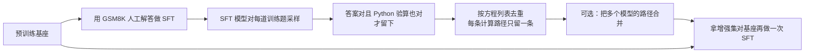

# RFT：数学推理要涨分，靠的不是再训一遍，而是把不同的计算路径收进来

<!-- release-date: 2023-08-03 -->

> 本文依据阿里巴巴达摩院（Alibaba DAMO Academy）发布的 **Scaling Relationship on Learning Mathematical Reasoning with Large Language Models**，即 arXiv:2308.01825v2（2023-09-13），共 21 页的预印本。封面标注 Preprint，页边写着 arXiv:2308.01825v2 [cs.CL] 13 Sep 2023。页码均指这份 PDF。解读依据 v2。全文把三件事分开标注：**论文明确写了什么**、**我们如何解释它**、**哪些是外部资料补充**。

这篇论文研究的是 **GSM8K** 上、一次贪心解码就能交卷的监督模型。方法名在摘要里叫 **拒绝采样微调（Rejection sampling Fine-Tuning，RFT）**。它不是后来的强化学习 RFT，也不是 Agent 训练里的那套 rollout 流水线。整件事可以压成一句：用已经微调过的模型对训练题采样，只留下答案对、算式也对的推理路径，再按方程列表把重复路径去掉，拿这些 **不同的计算路径** 回头微调预训练基座。

## 读前先把几个词说成人话

后文会反复出现这几个名字，先说清楚：

- **GSM8K**：一套小学应用题基准。每道题有一个问题、一条人工写的逐步推理、一个数字答案。论文用训练集做监督，用测试集贪心解码打分。
- **思维链（chain-of-thought，CoT）**：不直接报答案，先把中间步骤写出来。GSM8K 的标准写法会把每一步算式放进 `<<equation>>` 这类标记里。
- **监督微调（Supervised Fine-Tuning，SFT）**：用「问题 + 标准推理 + 答案」直接教模型模仿。
- **上下文学习（In-Context Learning，ICL）**：不改权重，只在输入里塞几个例子再答题。论文用的是 8-shot。
- **maj1@1 / maj1@100**：maj1@1 就是贪心解码的准确率，论文也叫 acc；maj1@100 是温度 0.7 采 100 次、再对答案做多数投票。论文真正关心的是前者，因为它更接近线上只推一次的部署。
- **预训练损失（pre-training loss）**：基座在预训练语料上下一个词预测得有多差。论文拿它当「基座好不好」的尺子，而不是拿参数量。
- **拒绝采样（rejection sampling）**：先大量生成，再按规则丢掉不合格的，只留下通过检查的样本。这篇里的规则是：最终数字对，并且中间算式用 Python 验算也对。
- **方程列表（equation list）**：一条推理路径里按顺序抽出的算式串。论文用它代表「这条路是怎么算的」，而不是用整段自然语言。

再补两个后文会用到的记号，都来自 PDF p.3、p.6：

- 预训练基座叫 $\rho$，SFT 之后叫 $\pi$，RFT 之后叫 $\pi_{\mathrm{RFT}}$。
- 监督数据 $\mathcal{D}=\{q_i,r_i,a_i\}_i$，其中 $q$ 是题，$r$ 是思维链，$a$ 是数字答案。

## 一句话先说清

这篇论文要回答的不是「再做一个更大的模型」，而是：

> **在人工标注量固定的前提下，监督模型的数学成绩由三件事决定：预训练损失、监督数据量、以及增强数据里有多少条彼此不同的推理路径。**

三件事里，真正被他们做成方法的是第三件。造新题很难，解旧题相对容易，所以他们不扩题，只扩路径。扩的时候还有一条更硬的观察：

> **多样路径比单纯多样本更有用。弱模型从这件事里拿到的收益，比强模型更大。**

LLaMA-7B 在 GSM8K 上 SFT 是 35.9%；把多个模型采到的拒绝样本合并后再训，到了 49.3%（PDF p.1、p.2、p.10 Table 3）。这 +13.4 不是「把同一道题再抄一遍」抄出来的，而是同一道题上留下了更多不同的计算过程。

## 一条阅读路线

原文 21 页，正文大约到第 12 页，后面是参考文献和附录。如果只读原文，建议按这个顺序：

1. **第 1–2 页的设定和第 2 页 Figure 1**：先看清他们评的是「只推一次」的监督模型，再看三因素叠在一张图上长什么样。
2. **第 4 页 Figure 2**：预训练损失比参数量更像成绩的尺子；LLaMA2-7B 参数没变，损失更低，SFT 和 ICL 一起涨。
3. **第 5 页 Figure 3**：监督数据量对准确率是 log-linear；基座越好，加倍数据的收益越小。
4. **第 6 页的算法段 + Table 1**：RFT 怎么生成、怎么判对、怎么按方程列表去重；33B 正确路径很多、不同路径很少，RFT 就不涨。
5. **第 7 页 Table 2 和第 8 页 Figure 5**：采样次数 $k$ 加倍，不同路径涨得并不快；多模型合并才把 7B 送到 49.3。
6. **第 9 页 Figure 6 和第 10 页 Figure 7**：33B 独占的路径只有约 6.5%；训完之后，模型在测试集上也会写出更多不同的计算过程。
7. **第 11–12 页 Table 4 和第 7 节**：RFT 相对预训练几乎免费，但继续靠采样堆路径会碰到上限；根本解仍是把预训练损失做低。
8. **附录 A.3 的 Algorithm 1、附录 D、附录 B 的 Table 5**：去重伪代码、两条失败的自增强，以及 65B / 70B 的细表。

第 2 节相关工作第一遍可以只记一句：他们承认 STaR、CoRE、过程奖励这些前作，自己走的是「不训过程奖励模型、专门看 scaling」的更简单路线（PDF p.3）。

## 先看全景：一条「采对的、再按路径筛」的流水线

这是根据 PDF p.6 的方法段、p.7 的多模型合并和附录 A.3 重画的机制示意，不是论文原图，也不含实测时间。

有一个很容易看漏的动作：**第二次微调的起点是预训练基座 $\rho$，不是 SFT 模型 $\pi$。** $\pi$ 只负责采样。增强集写成（PDF p.6）：

$$
\mathcal{D}'_\pi=\mathcal{D}\cup\{q_i,r_{ij},a_i\}_{i,j}
$$

也就是原本人写的那一条路径还在，模型新采到的不同路径加进去。再拿 $\mathcal{D}'$ 去微调 $\rho$，得到 $\pi_{\mathrm{RFT}}$。

## 他们到底在跟什么较劲

### 矛盾一：线上只能推一次，不能靠「多采样再投票」充成绩

当时提升数学成绩的主流办法，是换提示，或者同题采很多次再投票、再让验证器挑（PDF p.1）。这些办法有效，但贵，也不适合线上只推一次的部署。所以论文把评测钉死在：**监督模型、贪心解码、maj1@1**。ICL 和 maj1@100 只拿来对照，不当主指标。

**本文的读法是**：这篇文章从一开始就不是在比「模型会不会做这道题」，而是在比「第一次写出来对不对」。后面 RFT 提升 maj1@1 的同时，maj1@100 也会动，但他们没有把自洽投票当成交付物。

### 矛盾二：出题难，解题易，监督数据扩不起来

第 3.3 节把这件事写得很直白：受过良好教育的学生一天能解几百道应用题，但很难不断编出多样、又有教学价值的新题（PDF p.5）。人能提供的，主要是「已有题目上的标准解法」，不是新题。

于是方向从「再标更多题」变成「用现有资源增强」。他们试过让模型自己写新题、自己改错（附录 D），几乎没涨。最后留下来的，是一条更朴素的路：旧题不动，只在旧题上采更多正确路径。

### 矛盾三：参数量看起来像能力，其实不是

同一系列里，更大的模型通常更会推理。可是 LLaMA 能超过 GPT-3，说明参数量不是唯一尺子（PDF p.3）。不同模型的结构、参数、预训练 token 数都不一样，硬比参数量会把账做乱。他们改用预训练损失来代表基座好坏。

## 相关工作：这篇承认自己不是第一条拒绝采样，但问题换了

第 2 节分两块，一块是数学推理，一块是规模定律（PDF p.2–3）。

数学推理那一块，论文把「把多条推理路径聚起来」看成当时的核心思路。推理时做这件事的，有验证器（Cobbe 等人）和自洽投票（Wang 等人）。微调时做这件事的，有 Huang 等人的自改进、Zelikman 等人的 STaR、Ni 等人的完全正确 / 部分正确解、Zhu 等人的 CoRE。拒绝采样本身也被用在人类偏好对齐上，论文点名了 Constitutional AI、RRHF、RAFT、LLaMA 2、PRO。Uesato 等人讨论过结果奖励和过程奖励；Lightman 等人后来用大规模人工过程标注证明过程监督更有用。

论文给自己的定位只有一句（PDF p.3）：

> 相对这些前作，我们用更简单的方式生成增强样本，不训练任何过程级奖励模型，关注点是 LLM 与数学推理能力之间的 scaling 关系。

规模定律那一块，他们引用 Kaplan、Hoffmann（Chinchilla）、数据受限设定、奖励模型过优化、迁移定律，以及 Henighan、Caballero 对数学题的规模讨论。然后立刻收窄：本文看的是应用题上的 **经验关系**，自变量是预训练损失、监督数据量、增强数据量，不是去拟合一条新的可外推公式。

**外部补充，不是本 PDF 的内容。** STaR（2022）会在答错时「看见正确答案再写理由」，这篇没有这一步。RAFT（Dong 等人，2023）按奖励模型排序再微调，用来做对齐，不是这篇的数学 RFT。ReST、后来训练 Agent 时被叫作 RFT 的做法、以及用组内相对优势做强化学习的路线，都不要读成这份 PDF。本站 DeepSeekMath 篇后来把这篇的 RFT 写成「答对照抄、答错丢掉」的 0/1 梯度，那是后作的形式化，数字和算法都不要倒灌回来。

## 因素一：预训练损失比参数量更像成绩尺子

第 3.1 节把 GPT-3、LLaMA、LLaMA2、GPT-4 的 SFT 和 8-shot ICL 画在同一张「预训练损失 vs 准确率」图上（Figure 2，PDF p.4）。GPT-3 的微调数字引自 Cobbe 等人；LLaMA / LLaMA2 的 ICL 引自原论文；LLaMA / LLaMA2 的 SFT 是他们自己在 GSM8K 训练集上做的。

论文自己写下的观察有两条（PDF p.4）：

- 在他们画出的损失区间里，预训练损失和 SFT、ICL 准确率近似负线性相关。
- SFT 一直高于 ICL，但预训练损失越低，这个优势越小。

他们立刻加了限制，不能把这张图当成定律（PDF p.4）：

1. ICL 的斜率比 SFT 更陡，可 SFT 按理不该被 ICL 反超，所以直线不能无限外推。
2. 准确率不能大于 1、不能小于 0。理论上因变量更该用 $-\log(\mathrm{acc})$，他们只是因为损失和 acc 看起来已经够线性，才直接用 acc。
3. 不同模型的预训练数据和分词器不同，损失 **不能严格横比**，更不能拿来做回归。第 7 节把「没有拟合 scaling law」写成了限制（PDF p.12）。

最有说服力的对照，是同一参数量的继续训练：LLaMA2-7B / 13B 可以被看成 LLaMA 7B / 13B 再训久一点。参数没变，预训练损失更低，ICL 和 SFT 一起涨（PDF p.4）。Table 1 把损失写出来了（PDF p.6）：

| 模型 | 预训练损失 |
|---|---:|
| LLaMA-7B | 1.8 |
| LLaMA2-7B | 1.75 |
| LLaMA-13B | 1.73 |
| LLaMA2-13B | 1.68 |
| LLaMA-33B | 1.62 |

LLaMA-7B 的 SFT 是 35.9%，LLaMA2-7B 是 41.6%；13B 从 43.0% 到 50.0%（PDF p.6）。参数量没解释这件事，损失解释了。

论文把结论写得很满：「Pre-training is all you need!」（PDF p.4）。基座损失更低，微调给它的新信号就更少，所以更好的模型从 SFT 里拿到的增量更小。

**本文的读法是**：这条观察成立的范围，是「通用域预训练、GSM8K 这一套监督、他们画出的损失区间」。它不能推广成「任何任务都只看预训练损失」。论文自己也没做回归，Figure 2 是趋势图，不是拟合公式。

## 因素二：监督数据量是 log-linear，而且强模型更吃不饱、也更吃不进

第 3.2 节把 GSM8K 训练集按 $\{1,1/2,1/4,1/8,1/16,1/32\}$ 随机下采样，再微调 LLaMA 和 LLaMA2（PDF p.5）。目的是外推：如果人工标注还能再翻倍，成绩大概怎么走。

Figure 3 的三条观察（PDF p.5）：

- 准确率和数据量是 log-linear：数据翻倍，成绩加一个大致固定的单位。
- 更好的模型需要更多数据，才能超过自己的 ICL。
- 更好的模型在数据翻倍时涨得更少。

log-linear 在 $\{1,1/2,1/4,1/8\}$ 这几档比较稳。更少的数据（1/16、1/32）会晃，附录 A.2 解释了原因：小数据仍只训 3 个 epoch，结果会很差，所以他们在 $\{3,\ 3/\text{data fraction}\}$ 两档 epoch 里取测试集更好的那次（PDF p.16、Table 5 p.17）。例如 LLaMA-13B 用 1/32 数据训 3 个 epoch，Table 5 里是 0.0；把 epoch 加到 96，才到 8.6。这类数字只能说明「训不够会崩」，不能拿去拟合那条 log-linear。

**可迁移的一句**：弱模型先把已有题标够、训够，性价比最高；强模型继续堆同一分布的监督，边际收益会很快掉下来。这和后面 RFT 对弱模型更有用，是同一件事的两面。

## 因素三：增强数据真正的自变量，是不同路径的条数

第 3.3 节先交代两条失败尝试，再引出 RFT（PDF p.5）。自己写新题、自己改错，相对 SFT 是「没有提升到边际提升」。简化版拒绝采样能涨，而且关键因素不是增强样本总数，而是 **不同推理路径的数量**。

### 算法：怎么生成、怎么判对、怎么留下多样路径

正文把流程写在 PDF p.6，细节和伪代码在附录 A.3（PDF p.16–17）。按执行顺序拆开。

**第一步，让 SFT 模型当发电机。** 对每道训练题 $q_i$，用 $\pi$ 采 $k$ 条候选推理和答案，温度 0.7，沿用 Cobbe 等人的设定。主实验 $k=100$。

**第二步，用结果对错加 Python 验算做拒绝。** 丢掉两类路径：最终答案 $a\neq a_i$，或者中间计算经 Python 求值是错的。这里没有过程奖励模型，也没有逐步人工标注。通过检查的路径，质量被他们认为和人工示范差不多（PDF p.19）。

**第三步，从自然语言里抽出方程列表。** 实现上先找 `<<equation>>`，去掉空白，再用特殊符号把算式串接成一个字符串，当作这条路径的指纹（PDF p.16–17）。论文明确说：这里的「不同路径」指的就是 **不同的方程列表**（Table 1 表注，PDF p.6）。

**第四步，按方程列表去重，但交换律和步骤顺序算作不同。** 每个不同的方程列表只留一条路径。下面两种情况被故意当成不同（PDF p.6）：

- 元素顺序不同：$3+4=7$ 和 $4+3=7$；
- 方程顺序不同：$1+2=3,\ 3+4=7$ 和 $1+4=5,\ 2+5=7$。

论文给的理由是：模型需要看见这些顺序可以交换；每道题如果只有一条人工路径，这件事很难学到。

附录 Algorithm 1 还多做了一步（PDF p.17）：如果新路径和已选路径的方程列表相同，就比较它和「其它已选路径」的 Levenshtein 距离之和，留下更不像其它路径的那条。论文自己的拼写是 Levenstein。动机写得很短：希望路径多样，从而泛化更好。

**第五步，回到基座再做 SFT。** 配方和第一次 SFT 相同：3 个 epoch、batch 128、峰值学习率 $2\times 10^{-5}$、3% warmup，在最后一轮上评测；7B / 13B 用 8 张 A100，33B 用 16 张，65B / 70B 用 32 张（附录 A.1，PDF p.16）。

Table 7 给了一个具体例子（PDF p.18）。Weng 每小时 12 美元、看了 50 分钟小孩，五条留下的路径都能得到 10 美元，但算法不同：有的先算出每分钟 0.2 再乘 50，有的先把 50 分钟换成 0.8333 小时再乘 12，有的一步写成 $12\times 50/60$。路径 1 和 2 是两步，路径 4 和 5 是一步。这就是「同一道题、不同计算过程」在数据里长什么样。

### 单模型 $k=100$：7B / 13B 涨，33B 不涨

Table 1（PDF p.6）是全文最重要的一张表。斜杠前后是 maj1@1 / maj1@100。

| 设定 | 7B | 7B-2 | 13B | 13B-2 | 33B |
|---|---|---|---|---|---|
| 预训练损失 | 1.8 | 1.75 | 1.73 | 1.68 | 1.62 |
| ICL | 11.0 / 18.1 | 14.6 / — | 17.8 / 29.3 | 28.7 / — | 35.6 / 53.1 |
| SFT | 35.9 / 48.7 | 41.6 / 55.4 | 43.0 / 55.2 | 50.0 / 61.7 | 54.6 / — |
| RFT $k=100$ | 41.7 / 52.7 | 47.5 / 58.7 | 49.1 / 59.9 | 54.8 / 65.4 | 54.5 / — |
| 每题正确路径 | 53.3 | 60.8 | 62.5 | 71.6 | 88.7 |
| 每题不同路径 | 5.25 | 5.19 | 5.26 | 5.29 | 2.78 |

7B 和 13B：maj1@1 大约 +5 到 +6，maj1@100 大约 +4。33B：RFT 54.5，相对 SFT 54.6，等于没涨（PDF p.6）。

原因不在「33B 采不到正确答案」。它每题平均 88.7 条正确路径，比 7B 的 53.3 多得多。但它过拟合了训练集，很难在 **训练题** 上再写出不同的方程列表，不同路径只剩 2.78 条，比 7B / 13B 的约 5.2 条更少。他们试过把 33B 的温度升到 1.0：正确路径变成 82.4，不同路径变成 4.77，比 0.7 更多样，仍不如小模型（PDF p.6）。论文承认一定存在某种生成配置能让大模型采得更散，但搜这个配置很贵，后面他们改用小模型的样本去带大模型。

**这张表把「多样本」和「多样路径」拆开了。** 33B 赢在正确样本数，输在不同路径数，RFT 就不工作。7B 正确样本更少，不同路径更多，反而涨。弱模型收益更大，不是口号，是这张表的直接推论。

### 把 $k$ 当旋钮：路径数涨得比采样次数慢

他们让 $k$ 走 $\{1,3,6,12,25,50,100\}$，再加一档 $k=100$ 但完全不去重，记作 no dedup（PDF p.6–7）。

比较 $k=100$ 和 no dedup：成绩接近，说明估计 RFT 该看不同路径数，不该看增强样本总数。4 个模型里有 3 个，去重后成绩更好，训练也更省。$k=3$ 时 RFT 相对 SFT 稳定 +2。大多数点上，$k$ 更大成绩更好，但 $k$ 翻倍的收益在下降（PDF p.6–7）。

Table 2 解释了为什么（PDF p.7）。数字是每题不同路径数：

| $k$ | 7B | 7B-2 | 13B | 13B-2 | 33B |
|---:|---:|---:|---:|---:|---:|
| 1 | 1.17 | 1.19 | 1.15 | 1.18 | 1.06 |
| 3 | 1.44 | 1.47 | 1.41 | 1.45 | 1.16 |
| 12 | 2.20 | 2.23 | 2.11 | 2.21 | 1.46 |
| 50 | 3.94 | 3.91 | 3.90 | 3.94 | 2.19 |
| 100 | 5.25 | 5.19 | 5.26 | 5.29 | 2.78 |
| 400（U13B） | | | 12.84 | | |
| 500（U33B） | | | 13.65 | | |

$k$ 从 1 到 100，采样次数乘了 100，7B 的不同路径只从 1.17 走到 5.25。论文把这件事和 3.2 节对照：监督 **题目** 翻倍，成绩按 log-linear 加一个单位；不同 **路径** 翻倍，不含新题，所以涨幅应该更小。因此加倍 $k$ 会碰到收益递减（PDF p.7）。

附录 Table 5 把样本规模写出来了（PDF p.17）。结合 Table 1 的每题正确路径，可以对上账：

- no dedup 约 400K：7B 每题 53.3 条正确路径 $\times$ 7473 道训练题，约 40 万，不去重就把正确样本全留下。
- $k=100$ 去重后约 47K：每题 5.25 条不同路径 $\times$ 7473 $\approx$ 3.9 万，再加上原来的 7.4K 人工路径，约 4.7 万。
- U13B 104K、U33B 110K：用 Table 2 的 12.84 / 13.65 做同样的加法，也对得上。

**这是本文的验算，不是论文原话。** 论文没有逐步写这道乘法，但 7473 这个训练题数写在 Table 4 表注里（PDF p.11）。

### 多模型合并：7B 的 49.3 是这样来的

单模型采到的路径，计算过程可能仍不够散。于是他们把不同 SFT 模型的拒绝样本并起来（PDF p.7）。记号是：

$$
\begin{aligned}
\mathcal{D}'_{\mathrm{U13B}}
&=\mathcal{D}'_{7\mathrm{B}}\oplus\mathcal{D}'_{7\mathrm{B}2}\oplus\mathcal{D}'_{13\mathrm{B}}\oplus\mathcal{D}'_{13\mathrm{B}2},\\
\mathcal{D}'_{\mathrm{U33B}}
&=\mathcal{D}'_{\mathrm{U13B}}\oplus\mathcal{D}'_{33\mathrm{B}}
\end{aligned}
$$

U 表示「不超过这个规模」。$\oplus$ 的定义是：先把各集合的路径全部拼在一起，再跑一遍 Algorithm 1，按方程形式和顺序去重。

Figure 5 显示，用这两份合并数据做 RFT，在各个规模上都优于单模型数据（PDF p.8）。合并之后，同尺寸模型之间的差距被填上了。论文由此假设：监督信号足够时，成绩尺子会从预训练损失转回模型尺寸（PDF p.7）。

主文把合并后的 7B / 13B 数字写了两遍（PDF p.2、p.6、p.10 Table 3）：

| 模型 | SFT | RFT-U13B | 相对 SFT |
|---|---:|---:|---:|
| LLaMA-7B | 35.9 | 49.3 | +13.4 |
| LLaMA2-7B | 41.6 | 50.3 | +8.7 |
| LLaMA-13B | 43.0 | 52.1 | +9.1 |
| LLaMA2-13B | 50.0 | 55.4 | +5.4 |

LLaMA-7B 的 49.3 对应 maj1@100 = 61.8（PDF p.10）。弱模型收益更大，在这张表上仍然成立：+13.4、+8.7、+9.1、+5.4，基座越强，RFT 加得越少。

33B 自己做 $k=100$ 又贵又需要搜温度。改用 $\mathcal{D}'_{\mathrm{U13B}}$，拒绝采样的计算量和在 33B 上采 100 次相当，成绩更好（PDF p.8）。Table 5 给出 33B 的 RFT-U13B 是 56.5，RFT-U33B 是 57.9，相对 SFT 54.6 有提升（PDF p.17）。也就是说：**大模型采不出多样性时，让小模型代采，仍然有用。**

把 33B 自己的样本再加进 U13B，几乎没影响。Table 2 里 U33B 只比 U13B 多 0.81 条路径。Figure 6 的 Venn 图更清楚（PDF p.9）：不超过 13B 的模型，各自能贡献大约 15% 的独占路径；LLaMA-33B-SFT 的独占路径只有约 6.5%（图上黄紫交界外的紫色块标的是 6.4%，正文写 6.5%）。论文的判断是：33B，以及可能的 65B / 70B，已经把人工标注的推理路径记住了，再在训练题上采样，吐不出新的计算过程（PDF p.8）。

65B 用 $\mathcal{D}'_{\mathrm{U13B}}$ 相对 SFT 不涨。论文给的原因还是那句：更好的模型从监督样本里获益更少，因为它在预训练里已经学到了更多推理（PDF p.8）。Table 5 把数字写出来了：65B 的 SFT 59.3、RFT-U13B 59.0、RFT-U33B 59.7；LLaMA2-70B 的 SFT 63.2、RFT-U13B 62.3、RFT-U33B 64.8（PDF p.17）。U13B 对这两个大模型是持平或略降，U33B 只有很小的正收益。第 7 节仍把「65B 和 70B 的 RFT」列为缺失，指的应是它们自己做 $k=100$ 采样那一档——Table 5 里这两列的 RFT $k=100$ 确实是空白，表注还写着部分实验仍在跑（PDF p.12、p.17）。

第 3.3 节末尾的总结有两句，值得原样记住（PDF p.8）：

1. RFT 通过 SFT 模型拒绝采样得到的多样推理路径，提升的是 **更弱** 的 LLM；把更多样的路径合在一起，还能再涨。
2. 不同 SFT 模型能贡献不同的计算过程；参数更大的模型可能因为过拟合训练题，生成多样性反而下降。也许存在某种生成或训练配置让足够大的模型不过拟合，但找到它并不平凡。

### 和当时其它开源增强比：更简单，7B 明显高出「约 35 分」这一档

Table 3（PDF p.10）把 RFT-U13B 放进当时的公开数字里。闭源那边 GPT-4 五样本 ICL 92.0、PaLM 2 八样本 80.7，这篇完全没有追上，论文自己也说开源 LLaMA 仍然落后于更大的闭源模型（PDF p.8）。开源增强里，他们点名两条：Ni 等人在 GPT-Neo-2.7B 上用完全正确 + 部分正确解得到 19.5；Zhu 等人的 CoRE 在 GPT-J-6B 上得到 34.9。RFT 更简单：不训验证器，解码也不用蒙特卡洛树搜索（PDF p.9）。

ChatGLM2-6B、InternLM-7B 这类对齐后的 7B，成绩卡在大约 35 分，和 LLaMA-7B 的 SFT 35.9 很像。论文猜它们可能在预训练或对齐阶段用过 GSM8K（PDF p.9）。这是猜测，没有证据。他们真正想说的是：用 $\mathcal{D}'_{\mathrm{U13B}}$ 换掉原始 GSM8K，7B 可以显著离开这一档。

## 讨论：多样路径会进模型，不只留在训练集里

### 测试时也会写出更多不同的计算过程

第 4.1 节问：训练集上的多样路径，会不会让模型在测试集上也真的换着法子算？他们对 LLaMA / LLaMA2 的 7B 和 13B 用 $\mathcal{D}'_{\mathrm{U13B}}$ 做 RFT，然后对每道测试题温度 0.7 采 100 条，统计其中能算对的不同计算过程个数（PDF p.9）。对照是 SFT，以及只用自己 $k=100$ 样本的 RFT。

Figure 7 是四张直方图（PDF p.10）。RFT-U13B 在「不同计算过程很多」的那一侧，题数多于 RFT $k=100$ 和 SFT。SFT 有更多题，100 次采样只对应 **一种** 计算过程，而且几乎写不出超过 8 种。图上标了 SFT 相对 RFT-U13B 的题数差：只有 1 种路径时，LLaMA-7B 为 $-44$，LLaMA2-7B 为 $-65$，LLaMA-13B 为 $-29$，LLaMA2-13B 为 $-46$；超过 10 种路径时，四个模型分别是 $+23$、$+26$、$+31$、$+41$。这些差值是本文从图上读的，论文正文没有另给数值表。

论文的结论是：训练数据里的多样计算路径，能让模型在解题时找到多样的推理逻辑（PDF p.10）。

**本文的读法是**：这只能说明输出分布变散了，不能说明模型「学会了新的数学知识」。它和后文 4.2 节「RFT 继续加采样会碰到路径上限」是同一枚硬币的两面——你教给模型的是同一批题上的多种写法，不是新题。

### RFT 相对预训练几乎免费，但不是根本解

第 4.2 节把账翻到算力上。人工标注量固定时，能改善数学成绩的有两件事：把预训练损失做低，以及用拒绝采样增强微调（PDF p.11）。他们按 Kaplan 等人的算法估计 FLOPs，GPU 时间按 NVIDIA A100 80GB 计，预训练 GPU 小时引自 LLaMA / LLaMA2 论文；RFT 推理按 7473 道训练题、每题 100 次采样估。33B 及以上用 DeepSpeed ZeRO3。FLOPs 用不含 embedding 的参数算（Table 4 表注，PDF p.11）。

Table 4 的数量级比精确到个位的小时数更重要：

| | 7B | 7B-2 | 13B | 13B-2 | 33B | 65B | 70B |
|---|---:|---:|---:|---:|---:|---:|---:|
| 预训练 FLOPs | $4.2\times 10^{22}$ | $8.4\times 10^{22}$ | $7.8\times 10^{22}$ | $1.6\times 10^{23}$ | $2.7\times 10^{23}$ | $5.5\times 10^{23}$ | $8.4\times 10^{23}$ |
| 预训练 GPU 小时 | 82k | 184k | 135k | 368k | 530k | 1022k | 1720k |
| SFT 准确率 | 35.9 | 41.6 | 43.0 | 50.0 | 54.6 | 59.3 | 63.2 |
| RFT-U33B 准确率 | 49.1 | 51.2 | 51.4 | 55.3 | 57.9 | — | — |

SFT 的 GPU 小时在 7B 量级是 0.6，RFT-U33B 是 9；到 70B，SFT 是 80，RFT-U33B 是 1.2k，预训练仍是 1720k（PDF p.11）。论文把 SFT 相对预训练写成约 $1\times 10^{-5}$，RFT 约 $1\times 10^{-4}$，都可以忽略。所以「永远可以先做 SFT 和 RFT」。

但 RFT 很难再往上堆。不同路径要靠指数级的采样次数去换，而且一道应用题的不同路径存在上限（PDF p.11）。他们把三条曲线的位置和斜率写成：

- 成绩：RFT $>$ SFT $>$ ICL；
- 提升速度：RFT $<$ SFT $<$ ICL。

如果有一个全能模型，预训练损失低到只剩语料本身的随机性，就会变成 RFT = SFT = ICL = 100。所以基座越好，三条曲线的缝会收窄。从 LLaMA-7B 到 LLaMA2-7B，多花 $4.2\times 10^{22}$ FLOPs，预训练损失降 0.05，RFT-U33B 加 2.1 分；从 LLaMA-7B 到 LLaMA-13B，多花 $3.6\times 10^{22}$ FLOPs，损失降 0.07，RFT-U33B 加 2.3 分（PDF p.11）。预训练贵，但他们相信其它能力也遵循类似模式，更好的预训练会惠及所有任务。

附录 E 给出估计式（PDF p.20–21）。训练近似 $C_{\mathrm{train}}\approx 6N n_{\mathrm{ctx}} N_s$。推理把题目长度和逐 token 生成拆开，并扣掉 KV cache；GSM8K 上他们用的平均长度是 $n_q\approx 66$、$n_r\approx 130$。这些是估算工具，不是新的理论贡献。

## 结论、限制，以及两条失败的自增强

第 5 节很短（PDF p.11–12）：数学成绩和预训练损失、监督数据量、不同推理路径有关；更好的语言模型从 SFT 和 RFT 里获益更少；要走向出色的数学推理，最重要的是预训练出一个更好的语言模型。

第 7 节列出三件他们没做的事（PDF p.12）：

- 65B 和 70B LLaMA 的 RFT（主文缺自采样那一档，附录有部分迁移数字，且标明实验仍在跑）；
- 在数学相关语料上预训练。Lewkowycz 等人已经说明这有用，但那样得到的预训练损失无法和通用域模型对齐；
- 没有拟合任何 scaling law。很多数字是估的，不同模型的预训练损失、ICL 提示、SFT 设定也未必对齐。

附录 D 的失败实验不该被跳过，因为它们说明「凡是自生成数据都有用」不成立。

**自己写新题（D.1）。** 有些错解，如果把题面改掉，推理本身是通的。例如把 150% 误读成 15%，后面的加减却自洽。于是他们反训一个「由推理生成题目」的模型，给错解配上新题，类似强化学习里的事后经验回放（PDF p.19）。只拿生成数据微调，结果最差；和原数据混合，仍低于原数据。失败原因有两个：有的推理链本身就有计算错误；有的生成题配不上这条推理。增强数据质量普通，所以这条路不通。

**自己改错（D.2）。** 把题目和一条采样路径拼起来，监督信号是人工标准解，让模型学「修订」。$K=1$ 时准确率从 35.90% 到 36.09%，只是边际提升；增大 $K$，成绩反而下降（PDF p.19）。他们归因于训练时采到的错解和测试时的错解分布不一致——训练题上的采样在字面上更像标准解。改用和标准解 Levenshtein 距离最大的那条来构造修订样本，修订模型才稳定超过 SFT 基线；把训练集切成 $N$ 折、轮流留一折采样，没有帮助（PDF p.20）。

**本文的读法是**：失败的不是「模型生成数据」这件事，而是「生成数据没有引入新的、可验证的计算路径」。新题对不上解、修订又太像标准答案，都没有增加方程列表的多样性。RFT 留下来，正因为它把可验证的不同路径当成了增强的目标。

## 可以带回自己项目的原则

**一、先分清你在优化哪一次推理。**
这篇把指标钉在贪心一次解码，是因为线上通常也只能推一次。如果业务其实会做自洽投票或重排序，你看到的「RFT +13.4」不能直接搬过去——那是 maj1@1 的数字。

**二、增强之前先问：你缺的是新题，还是旧题上的新写法。**
出题难、解题易时，先在旧题上采正确路径，往往比硬造新题更稳。这篇的反例已经写在附录 D：造新题和改错都没有真正增加可验证的计算过程。

**三、过滤规则要可执行，不要一上来就训过程奖励。**
他们只用「最终数字对 + Python 能验算」，外加方程列表去重。代价是覆盖不到没有明确算式、或算式写在自然语言里的任务。收益是流水线简单、不引入第二个模型的偏差。

**四、去重的键要打在「过程」上，不要打在「文本」上。**
如果按整段自然语言去重，换一种说法的同一条算式会被留下很多次；如果按方程列表去重，留下的才是不同计算过程。交换律和步骤顺序被故意保留，因为那正是模型要从多条路径里学的东西。

**五、样本数不是自变量，不同路径数才是。**
33B 每题 88.7 条正确路径，不去重能堆到约 40 万条，RFT 仍然不涨。7B 正确路径更少，不同路径更多，反而涨。看到「我们采了 100 次」时，先问去重之后还剩几条不同的过程。

**六、弱模型更该用 RFT，强模型更该回去做预训练。**
收益从 7B 的 +13.4 降到 13B 级的 +5 左右，再到 65B 几乎为 0。RFT 相对预训练便宜三个到四个数量级，所以弱模型上应该先做；但路径有上限，不能把它当成替代预训练的策略。

**七、大模型采不出多样性时，让小模型代采。**
33B 自己采样又贵又过拟合；合并 7B / 13B 的路径，反而能带动 33B。这是一条很具体的工程策略：采样器和被训模型不必是同一个。

**八、写下你没有拟合定律。**
这篇题目带 Scaling Relationship，正文却明确拒绝回归。损失不可横比、提示不对齐、很多 FLOPs 是估的。这种自我限制比硬画一条外推直线更有用。

## 关键词回看

- **RFT（拒绝采样微调）**：SFT 模型采样，留下答案对且 Python 验算也对的推理路径，按方程列表去重后，拿增强集对预训练基座再做 SFT。
- **maj1@1**：贪心解码准确率，本文的主指标，对应线上只推一次。
- **预训练损失**：这篇用来代表基座好坏的尺子，在他们画出的区间里和 SFT / ICL 近似负线性相关，但不能跨模型回归。
- **监督数据的 log-linear**：数据量翻倍，GSM8K 准确率大约加一个固定单位；基座越好，这个单位越小。
- **方程列表**：从 `<<equation>>` 抽出、去空白再拼接的算式串，是「不同路径」的操作定义。
- **不同路径数**：去重之后每题留下的不同方程列表个数。RFT 的真正自变量。
- **$k$**：每道训练题的采样次数。主实验为 100；翻倍 $k$ 不会让不同路径同倍增长。
- **no dedup**： $k=100$ 但不按方程列表去重，7B 大约 40 万条正确样本，成绩并不比去重后的约 4.7 万更好。
- **U13B / U33B**：把不超过 13B 或 33B 的多个 SFT 模型的拒绝样本合并再去重得到的增强集。LLaMA-7B 的 49.3% 来自 U13B。
- **$\oplus$**：先合并各模型路径，再跑 Algorithm 1 按方程形式和顺序去重。
- **Algorithm 1**：新方程列表直接收下；相同列表则用 Levenshtein 距离留下更不像其它已选路径的那条。

## 最后的判断

这篇最值得记住的，不是 49.3% 这个分数，而是它把「再训一遍」拆成了可以分开验证的三件事。

**被表格直接支持的：**

- 同一参数量下，预训练损失更低，SFT 和 ICL 都更高（LLaMA vs LLaMA2，PDF p.4、Table 1）。
- 监督数据量在 $\{1,1/2,1/4,1/8\}$ 上呈 log-linear，更好的模型加倍数据时涨得更少（Figure 3、Table 5）。
- 7B / 13B 的单模型 RFT $k=100$ 大约 +5 到 +6；33B 正确路径最多、不同路径最少，RFT 不涨（Table 1）。
- 去重后的不同路径数比不去重的样本总数更能说明 RFT；U13B 把 LLaMA-7B 从 35.9% 推到 49.3%（PDF p.6–7、Table 3）。
- 弱模型的 RFT 收益更大：+13.4、+8.7、+9.1、+5.4（PDF p.2）。
- 65B 用 U13B 不高于 SFT（正文 p.8，Table 5 的 59.0 vs 59.3）。

**有实验、但归因不完整的：**

- 「监督足够时，尺子从预训练损失变回模型尺寸」（PDF p.7）——合并数据后同尺寸差距缩小，没有在固定尺寸、固定损失上做对照。
- Figure 7 说明 RFT-U13B 在测试集上会写出更多计算过程，但没有证明这就是涨分的因果机制。
- 大模型过拟合训练题所以采不散，是对 Table 1 和 Figure 6 的解释，不是单独消融。

**只是作者观察或外推的：**

- 预训练损失和准确率的负线性关系只在给定区间成立，他们自己反对拿它回归（PDF p.4、p.12）。
- ChatGLM2 / InternLM 的 7B 大约 35 分，是因为预训练或对齐用过 GSM8K（PDF p.9）——原文写的是 guess。
- 其它能力也会遵循「更好的预训练惠及所有任务」（PDF p.11）。

**完全没公开、或公开了但对不齐的：**

- 没有拟合任何 scaling law，第 7 节写明了。
- 65B / 70B 自己做 $k=100$ 采样的 RFT 没有数字。
- 没有数学语料上的预训练对照。
- 没有报告随机种子、多次运行的方差。
- Algorithm 1 的 Levenshtein 替换规则没有单独消融：不知道「只按方程列表留第一条」会差多少。
- Python 验算的具体实现、特殊连接符、温度之外的生成配置，正文都没有展开。

如果只记一句话：

> **在旧题上采正确答案并不难。难的是留下彼此不同的计算路径，并且承认这件事对弱模型很值、对已经把训练题背熟的强模型很快失效。**

## 资料与阅读边界

- 原始依据：本地 `papers/Alibaba/RFT.pdf`，即 arXiv:2308.01825v2，页边日期 2023-09-13，共 21 页。封面正式标题为 *Scaling Relationship on Learning Mathematical Reasoning with Large Language Models*，署名 Zheng Yuan、Hongyi Yuan（并列一作），以及 Chengpeng Li、Guanting Dong、Keming Lu、Chuanqi Tan、Chang Zhou、Jingren Zhou，归属 Alibaba DAMO Academy。Chengpeng Li、Guanting Dong 标注为达摩院实习期间完成。封面为 Preprint。
- 版本核验：[arXiv 论文页](https://arxiv.org/abs/2308.01825)。提交历史为 **[v1] 2023-08-03 15:34:01 UTC**（2,903 KB）、**[v2] 2023-09-13 03:57:29 UTC**（3,950 KB）。截至撰写时最新版本仍是 v2，与本地原件一致，**不需要替换 PDF**。v2 按官方仓库说明补了 65B / 70B 的更多细节。解读依据 v2；卡片上的首发日取 v1 首次公开日 2023-08-03。
- 官方代码与增强数据：[OFA-Sys/gsm8k-ScRel](https://github.com/OFA-Sys/gsm8k-ScRel)。这是外部补充。README 上的主表与论文 Table 6 一致；`collect_rejection_sampling.py` 对应正文的过滤与去重；`data/rft/u13b.jsonl`、`u33b.jsonl` 对应 U13B / U33B。仓库还提示复现时使用 Transformers $\le$ 4.29、测试 batch size = 1。Hugging Face 上有部分 RFT 权重，例如 [gsm8k-rft-llama7b-u13b](https://huggingface.co/OFA-Sys/gsm8k-rft-llama7b-u13b)，同样是外部补充，不是 PDF 里的实验设定。
- 同一仓库在 2023-10 另挂了一篇后作 [Query and Response Augmentation Cannot Help Out-of-domain Math Reasoning Generalization](https://arxiv.org/abs/2310.05506)，以及后来的 MuggleMATH 数字。**那些成绩不属于本 PDF**，本文不写入正文主表。
- 论文点名的前作，只在相关工作里作为对照，不把它们的方法细节写成这篇的实现：STaR（Zelikman 等人，2022）、Huang 等人的自改进、Ni 等人的完全 / 部分正确解、Zhu 等人的 CoRE、Uesato 等人的结果 / 过程奖励、Dong 等人的 RAFT（对齐场景的奖励排序微调）。
- 评测集：[GSM8K](https://arxiv.org/abs/2110.14168)（Cobbe 等人）。训练题数 7,473 出现在 Table 4 表注。
- 基座模型：本站 **LLaMA 篇** 对应 Touvron 等人 2023a；LLaMA 2 对应 Touvron 等人 2023b。ICL 数字引自这两篇，SFT / RFT 数字是本 PDF 自己测的。
- 后作不要倒灌：本站 DeepSeekMath 篇对 RFT 的 0/1 梯度写法、以及任何 GRPO / R1 的数字，都不是这份 2023-08 的拒绝采样 + SFT 论文。
