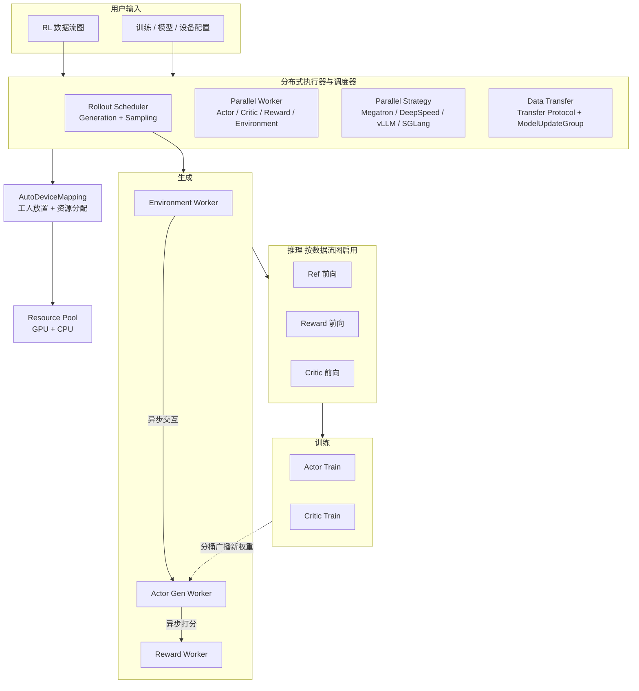

# ROLL：多模型 RL 要同时伺候三类人，就不能把角色、样本和卡缝进同一个程序

<!-- release-date: 2025-06-06 -->

> 本文依据 ROLL Team 发布的 **Reinforcement Learning Optimization for Large-Scale Learning: An Efficient and User-Friendly Scaling Library**，即 arXiv:2506.06122v1、2025-06-06 首次公开、共 16 页的预印本。封面只署 ROLL Team，仓库写的是 <https://github.com/alibaba/ROLL>；第 7 节按角色分组、组内字母序列出 41 人，没有单位、没有通讯作者（PDF p. 1、12）。本站按主要归属方放在 Alibaba 目录。下文括号中的 `PDF p. N` 均指这份 16 页原件的文件页码。
>
> **版本说明**：封面页眉日期是 2025-06-13，那不是首发日。arXiv 提交日是 2025-06-06。截至 2026-09-10 核验，arXiv 上只有 v1，与本地原件一致。后作 *ROLL Flash*（arXiv:2510.11345）和 OSDI’26 *RollArt*（arXiv:2512.22560）以及当前 GitHub 主干上的 FSDP2、Router Replay、LoRA、FP8 rollout 等，**都不是本 PDF 的内容**，文末单独标成外部补充。
>
> 这是一篇**系统库**论文，不是算法论文，也没有基座预训练 recipe。它讲的是：已经有 PPO / GRPO / 可验证奖励 / 多轮环境了，怎样把生成、打分、环境、更新做成能单独摆卡的角色，再让调度器跟到每一条样本。全文把三件事分开写：**论文明确写了什么**（带页码）、**本文如何解释它**（凡属推算或从图上读数都会写明）、**外部资料补充**（会给出链接并标注）。

## 读之前需要的最少背景

这篇论文假设你已经知道「用强化学习训大模型」大概长什么样。不熟的话，先记住下面这些。

**一轮循环最多会碰到四个模型。** 论文把它们写成 Actor、Critic、Ref、Reward（PDF p. 2–3）：

- **Actor（行动者）**：正在被训练的那个模型，根据提示词生成回答；
- **Critic（评论者）**：估「当前已经写出的这段后面还能拿多少分」，用来降低策略梯度的方差；
- **Ref（参考策略）**：通常从 Actor 初始化，训练期间冻住，用来约束 Actor 别跑太偏；
- **Reward（奖励）**：给整条回答打分。可以是人类偏好模型，也可以是规则判题、代码沙箱，或者再找一个大模型当评委。

一次迭代被切成三截，性质完全不同（PDF p. 3）：

1. **Generation（生成）**：Actor 自回归地写回答。写之前要先 **prefill（预填充）**——把整段提示词过一遍，算出 KV Cache，这是算力受限的；随后 **decoding（解码）** 一次吐一个 token，这是访存受限的。多轮 Agent 还要跟环境来回交互，这一截主要吃 CPU。
2. **Inference（推理）**：Critic、Ref、Reward 各做一次前向，分别给出价值、KL 惩罚和分数。这一截通常也是预填充，算力受限。例外是规则奖励和沙箱：它们更像环境交互，主要吃 CPU。
3. **Training（训练）**：用上面两步的数据更新 Actor 和 Critic，再把新权重同步回生成侧。训练最吃显存，通常要上各种模型并行。

论文把「一个 token 就是一步动作」当作默认建模：优化目标是让 Actor 吐出的整段序列拿到更高的累计奖励（PDF p. 3）。有些算法会关掉 Critic，有些会连推理阶段一起拿掉，但大多数方法仍落在「多模型、多阶段」这个家族里（PDF p. 2）。

还要认识三个放置词，后面每一节都会用到：

- **独占分区**：生成卡和训练卡各是各的，互不借用；
- **共置（colocation）**：不同阶段的模型挤在同一批 GPU 上，分时复用；
- **解聚（disaggregation）**：生成和训练拆开，甚至异步流水。

本站已经写过的邻居，切面不同，不要混：[HybridFlow](/reports/ByteDance/HybridFlow) 讲的是 verl 的单控制器——模型之间一个中央指挥，模型内部仍是每张卡自己的 SPMD；[AReaL](/reports/AntGroup/AReaL) 讲的是生成 GPU 与训练 GPU 解耦之后，怎么处理数据变陈；[Agent Lightning](/reports/Microsoft/Agent-Lightning) 讲的是 Agent 运行时与训练器解耦，训练器只吃每次模型调用的转移。ROLL 这篇站在第一篇的编程模型上，想把第二篇关心的「卡怎么分」和第三篇关心的「环境与奖励」收进同一个库，并且加了一层**按样本调度**。

## 一句话先说清

这篇论文要解决的矛盾可以这样说：

> **大模型 RL 不是「再实现一个 PPO」的问题。它是四个模型、三截流水、三种人同时要用一个库：集群团队要在几千张卡上跑两周不挂；业务团队要按域把样本路由到数学判题、代码沙箱或大模型评委；算法团队可能只有一张卡，还想改其中某一截。现有框架在卡的归属上各押一边，改奖励或改环境往往要去动分布式程序。**

论文对这个局面的描述很直接。现有系统已经分别引入了单控制器、共置和解聚（PDF p. 2），但它认为大多数工作仍没有同时把效率、规模和可用性做够。ROLL 的回答不是再押一边，而是把三件事情做成一等公民（PDF p. 1–2）：

1. **角色**：Parallel Worker 把 Actor / Critic / Reward / Environment 收成可单独管理的工人；同一角色的一群工人再收成 Cluster。
2. **样本**：Rollout Scheduler 在生成阶段按**每一条** prompt 管生命周期，可以加请求、中止请求、做完一条立刻打分。
3. **卡**：AutoDeviceMapping 让用户自己写设备映射，一张卡可以被多个阶段共享，生成侧的一部分 GPU 也可以划给训练侧。

它建在 Ray 上，训练接 Megatron 与 DeepSpeed，生成接 vLLM 与 SGLang。引言里 DeepSpeed 被拼成 **DeeepSpeed**，按原文保留（PDF p. 2）。

规模故事和公开实验是两套证据，不要读成一套。摘要写的是：内部用 ROLL 训一个总参数超过 200B 的 MoE，扩到数千 GPU，大约两周不中断（PDF p. 1）。第 5 节真正画曲线的，是 7B / 30B 的多域可验证奖励，以及 Sokoban、FrozenLake、WebShop 三个 Agent 环境（PDF p. 8–11）。前者证明「库能接上、曲线往上」；后者才是「内部规模跑得住」的陈述，正文没有给出精确 GPU 数、集群拓扑或那次训练的准确率。

## 全景：一次迭代在 ROLL 里怎么走

先把论文 Figure 2 的架构和流水落到一张图上（PDF p. 6）。

这是根据 PDF p. 6 的 Figure 2(a)(b) 重画的**机制示意图**，箭头表示控制与数据流向，不表示实测时长或通信量。原图把运行时搭建画在上半、训练迭代画在下半；这里合成一张，方便看「谁指挥谁、数据从哪一段流到哪一段」。

读这张图时先抓住四个分工，后面每一节都在补原因：

| 模块 | 它解决什么 | 对应章节 |
|---|---|---|
| **单控制器 + Parallel Worker** | 流水线写成一份数据流图；每个角色内部仍是分布式计算 | 4.1、4.3 |
| **Parallel Strategy + Data Transfer** | 训练、推理、生成各用各的引擎和并行；跨阶段重切数据、同步权重 | 4.1、4.3 |
| **Rollout Scheduler** | 生成阶段不再按整批齐步，按每条样本加请求、打分、中止 | 4.1、4.3 |
| **AutoDeviceMapping + Resource Pool** | 用户自己写「这个角色用哪几张卡」，允许共享、允许部分划转 | 4.1、4.3 |

Reward Worker 和 Environment Worker 也是 Parallel Worker 的两种，单独拿出来是因为产品侧和 Agent 侧的痛点就卡在它们身上（PDF p. 5–6、8）。

## 旧方案为什么会把三类人同时得罪

### 病症：同一条流水线上，没有一种放置能伺候所有角色

第 2.2 节把系统问题写得很短，但因果已经齐了（PDF p. 3–4）。四个角色要做的事不同，最优并行也不同：

- Actor 既要生成又要训练；
- Critic 既要推理又要训练；
- Ref 和 Reward 通常只做推理；
- 规则奖励和沙箱还主要吃 CPU。

所以「用一套并行配置跑到底」会在某个角色上浪费。前人已经给出三种答法（PDF p. 4）：

| 答法 | 论文点名的系统 | 它买到什么 | 它付什么 |
|---|---|---|---|
| 集群切成互斥分区，每段各用各的并行 | NeMo、OpenRLHF | 每段可以按自己的最优切法跑 | 某段空闲时，卡不能借给别人 |
| 不同阶段共置到同一批卡 | Verl、RLHFuse、ReaL、PUZZLE | 资源利用率上去 | 共置的大模型很难同时跑，通常只能分时 |
| 生成与训练解聚，异步流水 | StreamRL | 生成侧可以按推理集群的高带宽优势加速 | 数据不再严格来自当前策略，本篇没有沿着这条把算法补完 |

这张表是本文按 PDF p. 4 整理的，论文没有画成表。

**三种答法都成立，但都把「卡的归属」写进了框架默认值。** 集群团队如果今天要共置、明天要拆开，就得换框架或改分布式程序。业务团队如果只想加一个代码沙箱，却发现打分和生成挤在同一批卡上互相抢，也会卡住。算法团队如果只有一张卡，前面两派的默认值都太重。

### 生成阶段还有一个更具体的浪费：整批齐步

大多数系统为了吞吐，在生成阶段仍按**一批** prompt 推进（PDF p. 8）。一批里有人已经写完，有人还在吐长思维链，整批人就得等最慢的那条——论文把这个问题叫做 generation 阶段的 **long-tail（长尾）**，并点名 RLHFuse 讨论过它（PDF p. 8）。

等的还不只是解码。动态采样（dynamic sampling）会故意多采一些题，再把全对或全错、没有学习信号的题滤掉（PDF p. 4、8，出处是 Yu et al. 2025，也就是本站 [DAPO](/reports/ByteDance/DAPO) 那条线）。如果打分必须等整批写完才开始，多采的那些题会把空档拉得更长；如果已经凑够有效梯度还继续把长尾写完，多出来的生成就是纯浪费。

多轮 Agent 把这件事再放大一档。单轮数学、代码通常没有状态，生成只有预填充和解码；多轮工具使用要跟环境来回交互，环境执行慢、奖励难拿、交互复杂，环境交互会变成显著瓶颈（PDF p. 3–4）。如果环境也按整批齐步，GPU 就会在等 CPU。

### 诊断：真正缺的不是又一个引擎，而是三个切面

把上面两层叠起来，缺的是：

1. **角色切面**：加一个奖励、加一个环境，不应等于改四个分布式程序；
2. **样本切面**：生成、打分、环境交互不应被整批栅栏锁死；
3. **设备切面**：共置还是拆开、同步还是异步，应是用户写的映射，不是框架的信仰。

ROLL 的模块表几乎是按这三刀来的。第 3 节却先不谈模块，而谈三类用户——因为同一套切面，对不同的人值不同的钱。下面按用户走一遍，再回到模块怎么接上。

## 三类用户各自卡在哪

论文把用户写成 Tech Pioneer、Product Developer、Algorithm Researcher（PDF p. 4–5）。不要把这三个词当成市场标签。它们对应的是三种资源约束，以及 ROLL 真正交给他们的那几块模块。

### Tech Pioneer：卡很多，怕的是跑不满、跑到一半挂

他们「寻求在 LLM 社区里的领先位置」，手里有大规模 GPU 集群（PDF p. 5）。卡在三件事上：

- 高带宽硬件如果被整批齐步和错误的并行切法浪费，成本就停在机器上；
- 200B 级模型要跨数千 GPU 连续跑，中断一次的工程代价很高；
- 集群里的硬件往往不均一，共置、解聚、同步、异步都可能是对的，取决于这一天的机器。

ROLL 给他们的是 Parallel Strategy（把 Megatron / DeepSpeed / vLLM / SGLang 的并行能力接进来）、checkpoint 与恢复、以及「共置或解聚、同步或异步都可以配」的硬件使用方式（PDF p. 5）。规模证据就是那句内部训练：200B 参数量级的模型、数千 GPU、大约两周不中断（PDF p. 5）。注意这里写成 **a 200B-parameter model**，摘要写的是 **over 200B total parameters** 的 MoE，引言写的是 **200B+ MoE models**（PDF p. 1–2、5）。三处措辞不完全相同，精确 GPU 数和模型名都没有公开。

第 3.1 节提到的「同步或异步执行模式」是能力声明。第 4 节真正展开的异步，主要是**生成阶段内部**的异步打分和异步环境交互，不是 [AReaL](/reports/AntGroup/AReaL) 那种生成批次与训练批次完全解耦。后作 ROLL Flash 才把后一种异步写成系统主体，见文末外部补充。

### Product Developer：卡够用，怕的是换一个奖励就要改训练框架

他们有足够 GPU 训自家模型，关心的是任务和奖励：人类对齐、推理、工具使用、业务指标（PDF p. 5）。卡在另一件事上：**生产级模型往往要同时会好几门课**，数学、代码、指令遵循、开放问答的打分方式完全不同。

ROLL 给他们五块（PDF p. 5）：

1. **可扩展的 Reward Worker / Environment Worker**：在现成实现上改自己的奖励和环境；
2. **组合式样本—奖励路由**：控制各任务的采样比例，再把每条样本动态送到对应的 Reward Worker（数学校验器、沙箱、LLM-as-a-judge）；
3. **设备—奖励映射**：给 Reward Worker 单独写设备，把打分从其他计算里隔离，避免抢卡；
4. **现成 recipe**：算法、模型、任务、数据集，用来少写胶水代码；
5. **调过的训练配置**：减少超参搜索负担。

第 5 点是论文的自我评价（「satisfactory performance」），公开实验没有对照「不用这些配置会怎样」。真正可检验的是前三块：多域 RLVR 实验按 40% 数学、30% 代码、30% 通用来采样，并分别接规则、沙箱和评委（PDF p. 9）。

### Algorithm Researcher：卡很少，怕的是改一截流水要翻整库

他们 GPU 有限，却要对 RL 流水线的每一截做细粒度控制，才能快速试新想法（PDF p. 5）。卡在：显存不够、阶段耦太死、实验不好复盘、基线不公平。

ROLL 给他们的是：包括单卡在内的显存优化、按阶段可插拔的流水线、透明日志、以及一套经典算法 / 模型 / 任务方便做公平对比（PDF p. 5）。第 4.1 节把单卡能跑起来的手段写具体了一点：ZeRO-2 / ZeRO-3 / ZeRO-offload、梯度检查点、offload（PDF p. 6）。这些都来自接进来的训练引擎，不是 ROLL 新发明的优化器。

### Agentic RL 不是第四类用户，是同一套切面的压力测试

第 3.4 节单独列出 Agent 规格，因为它把「环境交互」从可选项变成了主路径（PDF p. 5–6）：

- **可扩展的多轮交互**：受 RAGEN 启发，把 Agent 与环境的多轮对话做到长程任务；
- **按样本扩环境**：环境实例数跟样本规模对齐，用来撑高吞吐；
- **异步并行的环境交互**：环境执行和 Actor 生成不必互相等，环境之间也可以并行，用来减少 GPU 空转。

注意边界：这里的 Agent 是**训练系统内部的 Environment Worker**，不是 [Agent Lightning](/reports/Microsoft/Agent-Lightning) 那种「已有 LangChain 程序几乎不改、经类 OpenAI 接口接上训练器」。两条路都在解决多轮，切面相反。本篇实验用的是 Sokoban、FrozenLake、WebShop，不是用户自带的 Agent 框架（PDF p. 10–11）。

## 架构：单控制器只发命令，角色自己做 SPMD

### 旧问题：换一条边，四个分布式程序都要动

这正是 [HybridFlow](/reports/ByteDance/HybridFlow) 的立论点：如果「Actor 生成完把结果发给 Critic」被拆进四个程序各自的 `send` / `recv`，改 PPO 为 ReMax 就等于重写通信。ROLL 选择直接站在那篇的混合编程模型上（PDF p. 7）：**模型与模型之间，一个中央控制器指挥；每个模型内部的算子，仍由各卡自己的控制器指挥。**

原因也沿用 HybridFlow：RL 的数据流图通常只有几个节点，中央控制器要发的是「Actor 生成」「Reward 打分」这种粒度，调度开销相对节点内部的分布式计算可以忽略（本站 HybridFlow 解读对 PDF p. 5 的转述）。ROLL 把这件事说成：在单控制器里实现 RLHF、RLVR 和 agentic RL 的训练流水，从而简化开发和管理（PDF p. 7）。

### 新设计：Parallel Worker 是一份资源的主人

论文给了一个很具体的定义（PDF p. 6）：

- **Parallel Worker** 拥有一组资源，在 Ray 里就是一个 **PlacementGroup（放置组）**——调度时这组资源被绑在一起；
- **Cluster** 表示共享同一角色的一群 Parallel Worker，例如 Actor 训练、Critic 推理，用来做集体管理。

工人的种类按角色分，而不是按「第几张卡」分（PDF p. 6）：

| 工人 | 它可以变成什么 | 论文写明的能力 |
|---|---|---|
| Actor Worker | Actor 或 Ref | 同一套工人抽象，实例化时选择角色 |
| Critic Worker | Critic | 估价值 |
| Reward Worker | 规则 / 沙箱 / 大模型评委 | 点名 rule-based verification、sandbox execution、LLM-as-a-Judge |
| Environment Worker | 各类多轮环境 | 环境与 LLM 的多轮交互 |

**Actor 和 Ref 共用 Actor Worker 这种抽象**，值得停一下。Ref 通常是冻住的 Actor 副本，前向形态接近，训练形态完全不同。把它们收成同一种工人，改「要不要 KL」就比较像改数据流图上的一个节点，而不像再注册一种分布式程序。这是本文对抽象的解释，论文只陈述了「Actor Worker 可实例化为 Actor 或 Ref」（PDF p. 6）。

用户输入是一份**自己定义的 RL 数据流图**，外加训练、模型、设备配置。分布式执行器据此创建工人和调度器，AutoDeviceMapping 再把资源池里的 CPU / GPU 绑上去（PDF p. 6）。

### 机制：先搭运行时，再进入「生成 → 推理 → 训练」

第 4.2 节把一次运行拆成搭建和迭代（PDF p. 7）。

**搭建。** 按设备配置准备资源池 → 按数据流图创建 Rollout Scheduler 和若干 Parallel Worker → 按训练 / 模型配置实例化 Parallel Strategy，决定每个工人的并行方式和执行后端 → 按用户写的设备映射，用 AutoDeviceMapping 从池子里分资源。

**迭代。**

1. 一批样本先交给 Rollout Scheduler 去生成。Agent 任务里 Actor 可以跟 Environment Worker 多轮交互；同时调用 Reward Worker 打分，从而能做动态采样这类高级采样（PDF p. 7）。
2. 推理阶段：数据流图里启用了的 Critic、Reward、Ref 各做前向。Transfer Protocol 把生成侧的回答重切分，喂给每个活跃工人（PDF p. 7）。
3. 训练阶段：Critic 和 Actor 用准备好的奖励信号更新参数。Actor 还要通过 ModelUpdateGroup，把新参数同步给下一轮的生成侧（PDF p. 7）。

这里有一个容易读漏的点：**Reward 在生成阶段和推理阶段都可能出现。** 生成阶段的 Reward Worker 服务的是「这条刚写完，立刻判对错，好决定要不要继续采」；推理阶段的 Reward 前向服务的是「给训练目标提供分数」，尤其是那个本身就是大模型的奖励模型。论文把 LLM 奖励算成 GPU 上的预填充，把规则 / 沙箱算成 CPU 活（PDF p. 3）。两条路径不要看成重复造轮子。

### 收益、代价、可迁移启发

**收益**：换算法、加角色，理论上等于改数据流图和工人配置，而不等于重写通信。第 3.3 节的「可插拔推理流水线」指的就是这件事（PDF p. 5）。

**代价**：单控制器把编排放在一份脚本里，这份脚本必须保持轻——它发的是阶段级命令，不能变成第二个数据平面。论文没有量化控制器开销。Transfer Protocol 直接复用 HybridFlow，跨阶段仍要做 **data resharding（数据重分片）**：上游按自己的并行切法把张量摊在若干卡上，下游的切法不同，必须重新切一遍再发（PDF p. 7）。这块延迟本篇没有单独测。

**可迁移的部分**：凡是「流水线节点少、每个节点内部却是一个分布式大模型」的系统，都值得把控制面和数据面按这个粒度拆。节点之间用中央指挥换表达力；节点内部把控制权还给 SPMD，换性能。不要学成「所有调度都进 Ray 驱动进程」。

## 卡怎么摆：既不强制独占，也不强制共卡

### 旧问题：框架先替你决定卡的归属

论文把前人分成两派（PDF p. 7–8）：

- OpenRLHF、NeMo：**强制**不同训练阶段独占资源；
- HybridFlow、RLHFuse：支持把不同阶段的 LLM **共置**到同一设备组。

两派都把一种放置写成了默认哲学。Tech Pioneer 要的「今天共置、明天拆开」，Product Developer 要的「奖励单独占几张卡或几堆 CPU」，在这两种哲学里都要改框架。

### 新设计：设备映射是用户写的，一张卡可以被多个 LLM 共享

AutoDeviceMapping 管资源池里的 CPU 和 GPU，并把它们绑到工人和调度器上（PDF p. 7）。论文强调的灵活点有两个（PDF p. 8）：

1. **单设备共享**：一张卡可以被不同阶段的多个 LLM 共享；
2. **部分划转**：可以把原本分给 Actor 生成阶段的一部分 GPU，划给它的训练阶段，用来提高整体利用率。

第二点已经允许生成卡和训练卡在映射上部分重合，但本 PDF **没有给这种摆法起产品名，也没有给出一份真实的设备编号列表**。后来代码里怎么写配置，见文末外部补充。

这件事能成立，论文给了两条机制，不是一句「我们用了 Ray」（PDF p. 8）：

- Ray 允许把设备绑到特定工人，也允许**多个工人共享同一设备**；
- ModelUpdateGroup 负责跨阶段同步权重，所以训练进程和推理进程**不必被强制共置**。

### 机制：按角色收成 Cluster，按桶广播权重

同步发生在 Actor Train Cluster 和 Actor Infer Cluster 之间。每个训练侧工人把自己的参数，按 **bucketed chunks（分桶的块）** 广播给生成侧对应的工人，用来提高传输速度（PDF p. 8）。通信后端是 NCCL，论文特别写了：**即使在共置训练场景里也走这套**（PDF p. 7）。

分桶的直觉（本文解释，论文只给了「improving the transfer speed」）：不要先在某张卡上凑出完整模型再切开——那会把峰值显存顶成整模大小，也让通信变成一次巨型阻塞。按桶边切边发，额外显存只多一个桶。桶有多大、共置时进程之间走哪条通道，本 PDF 没写。

Transfer Protocol 负责的是另一件事：输入输出数据在不同阶段之间的重分片，协议来自 HybridFlow（PDF p. 7）。**数据重切**和**权重同步**在 ROLL 里是两个模块，不要并成「都是 NCCL」。

### 收益、代价、边界

**收益**：放置从框架信仰变成用户配置。共置、解聚、把生成卡划一部分给训练，理论上是同一套 AutoDeviceMapping 的不同写法（PDF p. 5、8）。Reward Worker 还可以单独写设备，把 CPU 密集的沙箱从 GPU 训练里隔开（PDF p. 5、8）。

**代价与未公开**：

- 论文没有给出一份真实的设备映射表，也没有说 200B 内部训练用的是共置还是解聚；
- 没有测「划转一部分生成卡给训练」之后，生成吞吐掉多少、训练吞吐涨多少；
- checkpoint 与恢复被写成 Tech Pioneer 的卖点（PDF p. 5），协议、频率、是否与分桶同步正交，全部没写。

**可迁移的部分**：不要把「生成和训练要不要共卡」做成框架的编译期常数。先留一个映射层，让独占、共置、部分重叠都只是映射的取值。真正要发明的，往往是映射变了之后权重怎么同步——ROLL 的答案是分桶广播，且不把共置当成同步的前提。

## 样本怎么走：调度器跟到每一条 prompt

这是本篇相对 HybridFlow 最清楚的增量。

### 旧问题：批粒度调度把长尾写成了同步栅栏

按批推进生成，吞吐表面上很好看：推理引擎喜欢大 batch。代价是三条（PDF p. 8）：

1. 先写完的样本不能先打分，奖励计算被整批解码拖住；
2. 有人空了也不能立刻补新题，worker 利用率不齐；
3. 动态采样已经凑够有效梯度时，长尾还在写，多出来的生成没有训练价值。

动态采样本身的定义，论文写得很干净：过量采样 prompt，滤掉准确率为 0 或 1 的题，只留下能贡献有效梯度的那些（PDF p. 8）。它是算法策略；ROLL 要做的是让系统别为这个策略付整批等待。

### 新设计：请求的生命周期按样本管，而不是按批管

Rollout Scheduler 允许在生成阶段按**单个样本**调度每个请求的生命周期，并按当前资源与生成进度动态地加请求、中止请求（PDF p. 7）。论文把动态采样写成这种控制的一次成功应用，并拆成三招（PDF p. 8）：

| 招 | 人话 | 它消掉哪一道栅栏 |
|---|---|---|
| **Async Reward Computation（异步奖励计算）** | 一条写完立刻打分，不等整批 | 生成与打分之间的同步屏障 |
| **Add request（加请求）** | 盯着工人完成情况，按实时需求派新的 prompt | 先写完的位置空转 |
| **Abort Request（中止请求）** | 有效梯度条数够了，主动杀掉还在写的请求 | 长尾的无效生成 |

这三招是同一把锁的三面：锁的名字叫「批」。打开之后，调度器看见的不再是「第 $k$ 批走了百分之几」，而是「第 $i$ 条样本写完了没有、要不要再派第 $j$ 条、第 $k$ 条还值不值得写完」。

### 机制：它管的是生成阶段，不是整轮 RL 的异步

必须把范围说死。第 4.2 节的训练迭代仍是「生成 → 推理 → 训练」的顺序循环，新权重经 ModelUpdateGroup 在**下一轮**生成前同步（PDF p. 7）。Rollout Scheduler 加速的是**这一轮生成内部**的样本流水，不是「第 $k+1$ 轮生成与第 $k$ 轮训练重叠」。

这一点和 [AReaL](/reports/AntGroup/AReaL) 的切面不同。AReaL 让生成 GPU 连续写、训练 GPU 凑够就更新，并且可以打断正在写的序列。ROLL 这篇把「同步或异步执行模式」写进 Tech Pioneer 特性（PDF p. 5），但第 4.3 节展开的异步是奖励计算和环境交互。**不要把本篇读成已经给出了陈旧度上限和可中断生成的那套算法。**

### 收益、代价、可迁移启发

**收益**：动态采样从「多采一整批再滤」变成「采够就停」。异步打分让 CPU 上的规则 / 沙箱与 GPU 解码重叠。加请求把推理引擎的并发填满。

**代价**：

- 中止请求会扔掉已经算了一半的 token，换来的是不用把长尾写完。论文没有给出中止率、浪费的 token 比例；
- 过量采样本身就会多花算力。滤得太狠，有效批量还会变小。这些是动态采样的算法代价，本篇没有在实验里单独消融调度器；
- 按样本调度对推理引擎的要求更高：它必须能动态加请求、取消请求。论文只说接了 vLLM 和 SGLang（PDF p. 6–7），没有写用了它们的哪一层调度 API。

**可迁移的部分**：凡是「批里方差极大、后面还要按对错过滤」的流水线，都该问一句——我是在优化批吞吐，还是在为最慢的那条样本付整集群的空转？如果过滤条件只依赖已完成样本的分数，异步打分加提前中止几乎总比把批做大更划算。本站 [AReaL](/reports/AntGroup/AReaL) 把同一句话推到了跨训练步；本篇停在一轮生成内部。

## 奖励和环境为什么要单独成角色

### 旧问题：打分和环境不是「再调一次前向」

第 2.1 节已经把计算性质说清楚了（PDF p. 3）：

- 大模型奖励：预填充，走 GPU；
- 可验证奖励（数学规则、沙箱）：像环境交互，走大量 CPU；
- 多轮环境：慢、反馈稀疏、和 LLM 的交互复杂，会成为性能瓶颈（PDF p. 4）。

如果把这些活塞进 Actor 工人里，会出现两种干涉：CPU 沙箱拖住 GPU 解码；某个域的评委模型跟 Actor 抢同一批卡。Product Developer 要的「按域路由 + 设备—奖励映射」，前提就是奖励必须能单独放（PDF p. 5）。

### 新设计：按负载拉起多类 Reward / Environment Worker，按样本路由

第 4.3 节把生成阶段画成异步奖励计算加异步环境交互（PDF p. 8）。机制可以压成四句：

1. 可以按作业负载**拉起多个** Reward Worker 和 Environment Worker，把它们分散到不同资源池，避免成为瓶颈；
2. 样本级生命周期控制允许把**每条**样本路由到对应的 Reward Worker / Environment Worker；
3. 运行时可以同时激活规则校验、沙箱、LLM-as-a-Judge，按当前负载动态打分；
4. Environment Worker 往往 CPU 密集，要小心地铺到资源池里，减少对其他负载、以及工人之间的干扰（PDF p. 8）。

异步环境交互的具体含义是：Actor **不必等** Environment Worker 的返回，就可以处理别的样本；系统可以异步地再派新的 prompt 去生成，避免资源闲置（PDF p. 8）。环境还可以按样本规模做 scaling，并在环境之间并行执行（PDF p. 6）。

用一个小例子（本文构造，不是论文原文）：一批 1024 条里，300 条数学、300 条代码、剩下的是开放问答。数学题写完立刻进规则校验器；代码题进沙箱跑单测；开放问答进评委模型。代码沙箱慢，不应让数学题的 GPU 解码停下来。这就是「组合式样本—奖励路由」要买的东西（PDF p. 5）。

### 和 Agent Lightning 的切面差在哪

本篇的 Environment Worker 住在训练系统里面：多轮循环由 ROLL 编排，环境实现按它的工人抽象来写，实验里是 Sokoban / FrozenLake / WebShop（PDF p. 6、10–11）。[Agent Lightning](/reports/Microsoft/Agent-Lightning) 认为，verl、OpenRLHF、TRL、ROLL、AReaL 这类大规模 RL 系统对 Agent 的扩展，通常要求开发者在训练系统里把 Agent 重写一遍——那是后作对 ROLL 的定性，不是本 PDF 的自称。对照本篇第 3.4 节，这个定性至少对 2025-06 的实验设定是吻合的：环境是框架内的工人，不是用户已经写好的 LangChain 程序。

**不要因此否定本篇。** 它解决的是「训练系统如何高吞吐地跑多轮环境」，不是「如何零改动接管任意 Agent 运行时」。两条路可以同时成立。

### 收益、代价、边界

**收益**：多域任务不必把打分逻辑写进 Actor；CPU 活和 GPU 活可以分池；多轮环境可以按样本扩、按环境并行，Actor 不用在每次 `env.step()` 上阻塞。

**代价与未公开**：

- 路由策略怎么写、冲突时怎么排队，没有接口细节；
- LLM-as-a-Judge 用的是哪个评委模型、沙箱是不是 Dou et al. 2024 那套多语言沙箱的原实现，实验部分都没写；
- 环境 scaling 的单位（一个环境实例对应一条样本，还是一组样本共享）只说到「match the size of the input sample」（PDF p. 6），没有配置项。

**可迁移的部分**：把「会拖慢 GPU 的那类活」做成独立角色，再按样本路由，几乎总比在生成循环里同步调用更稳。奖励和环境是同一模式的两个实例：都是生成阶段的旁路计算，都可能 CPU 密集，都应该允许按负载扩。

## Parallel Strategy：自己不写引擎，但要把五维并行接到三个阶段上

### 旧问题：训练、推理、生成要的引擎不是同一个

第 2.2 节把加速手段列成清单（PDF p. 3–4）。训练侧是 **5D 并行**：数据并行（DP）、张量并行（TP）、流水线并行（PP）、上下文并行（CP）、专家并行（EP），再加上 ZeRO、激活重计算、offload 来省显存。生成侧则是 SGLang、vLLM 这类服务框架，同样能做 DP / TP / PP / EP，另外还要管注意力和 KV Cache。

RL 把这份清单用了三遍：同一份 Actor 权重，生成时像推理服务，训练时像预训练。Ref 只推理，Critic 训练加推理，Reward 有时是模型、有时是 CPU 程序。**引擎必须能按角色选，并行必须能按阶段选。**

### 新设计：训练接 MegatronCore 与 DeepSpeed，生成接 vLLM 与 SGLang

第 4.1 节写明（PDF p. 6–7）：

- 训练：MegatronCore + DeepSpeed；5D 并行（DP / PP / TP / CP / EP）；凭借 DeepSpeed 支持 ZeRO-2、ZeRO-3、ZeRO-offload；另加梯度检查点和 offload，用来在资源受限设备上跑，包括第 3.3 节说的单卡（PDF p. 5–6）；
- 生成 / 推理：vLLM + SGLang，带 TP、EP、PP。

Figure 1 的生成侧还写了 **HF Infer**（PDF p. 1）。正文 Parallel Strategy 一节没有再解释它。不要把图上的营销字当成已实现细节。

第 4.3 节把这件事概括成：充分利用现有执行引擎的高级特性，让 RL 优化既能在大规模 GPU 集群上跑，也能在资源受限设备上跑（PDF p. 7）。**ROLL 自己不写训练内核，也不写推理内核。** 它写的是：每个 Parallel Worker 绑哪一种 Strategy。

### 收益、代价、边界

**收益**：Tech Pioneer 要的规模和 Algorithm Researcher 要的单卡，可以共享同一套工人抽象，差别主要在 Strategy 与设备映射。MoE 需要的 EP、长上下文需要的 CP，训练侧声称都接上了（PDF p. 6）。公开实验里确实出现了 MoE：Qwen3-30B-A3B-Base（PDF p. 9）。名字里的 A3B 通常表示激活约 3B，**本 PDF 没有解释这个缩写，也没有给出专家数或 EP 规模。**

**代价**：能力边界等于所接引擎的边界。论文列出的训练后端是 Megatron 与 DeepSpeed，没有写 FSDP。主干代码后来换了哪些训练策略，见文末外部补充。

**可迁移的部分**：编排层不要重新实现 Megatron 或 vLLM。真正要稳定的接口是「这个角色用哪个后端、哪套并行、哪份设备映射」。换后端应当像换 Strategy，而不是换 Cluster 的管理方式。

## 实验证明了什么，什么只是内部陈述

第 5 节没有系统吞吐表，没有与 verl / OpenRLHF / NeMo 的对比，也没有 Rollout Scheduler 的消融。它证明的是：**用这套库，按它的多域路由和 Agent 工人，能把现成基座的可验证奖励和三个小环境刷出上升曲线，而且作者声称没有崩。** 200B / 数千 GPU 那句话不在第 5 节。

### 多域 RLVR：两个基座，一份配比

数据按三个域收集（PDF p. 8–9）：

| 域 | 来源 | 论文写明的用量 |
|---|---|---|
| 数学 | DeepMath-103K | 按难度比例采样 5,000 条 |
| 代码 | KodCode | 先滤低质量，再按难度均匀采样 2,000 条 |
| 通用 | Multi-subject-RLVR、Nemotron-CrossThink、RLVR-IFeval | 有意去掉低质量；**条数未写** |

训练设定（PDF p. 9）：

- 模型：Qwen2.5-7B-base、Qwen3-30B-A3B-base；
- 目标：PPO loss，优势用 **REINFORCE 回报**，不用基于 GAE 的估计；
- 域采样比：数学 40%、代码 30%、通用推理 30%；
- 奖励：规则校验；代码走沙箱；通用走规则校验加大模型评委；
- 更细的超参指向两个 GitHub yaml，正文没有抄进论文。

REINFORCE 回报的人话是：这条回答最后拿到的那个分，直接当作整段的优势，不再用 Critic 对每个前缀估「后面还剩多少」。方差通常更大，实现更简单，也符合「某些算法里 Critic 保持不激活」（PDF p. 2）。论文没说这两次 RLVR 跑有没有真的关掉 Critic Worker。

正文给出的数字如下；没有写进正文、只出现在图里的，单独标「从图读取」。

| 模型 | 指标 | 起点 → 终点 | 倍率 | 出处 |
|---|---|---|---|---|
| Qwen2.5-7B-Base | ALL 平均准确率 | 0.18 → 0.52 | 2.89× | 正文，PDF p. 9，Figure 3 |
| 同上 | 数学 | 0.20 → 0.53 | — | 正文，PDF p. 9 |
| 同上 | 代码 | 0.13 → 0.41 | — | 正文，PDF p. 9 |
| 同上 | Multi-subject-RLVR | 约 0.22 → 约 0.55 | — | **从图读取**，Figure 3，PDF p. 9 |
| 同上 | IFEval | 约 0.20 → 约 0.55–0.60 | — | **从图读取**，Figure 3，PDF p. 9 |
| 同上 | CrossthinkQA | 约 0.22 → 约 0.35–0.38 | — | **从图读取**，Figure 3，PDF p. 9 |
| Qwen3-30B-A3B-Base | ALL | 0.27 → 0.62 | 2.30× | 正文，PDF p. 9–10，Figure 4 |
| 同上 | 数学 | 约 0.22 → 约 0.62 | — | **从图读取**，Figure 4，PDF p. 9 |
| 同上 | 代码 | 约 0.38 → 约 0.55–0.60 | — | **从图读取**，Figure 4，PDF p. 9 |
| 同上 | Multi-subject-RLVR | 约 0.42 → 约 0.75–0.80 | — | **从图读取**，Figure 4，PDF p. 9 |
| 同上 | IFEval | 约 0.25 → 约 0.75 | — | **从图读取**，Figure 4，PDF p. 9 |
| 同上 | CrossthinkQA | 约 0.32 → 约 0.55 | — | **从图读取**，Figure 4，PDF p. 9 |

横轴都是 Steps，RLVR 图画到 1000（PDF p. 9）。论文还说：30B MoE 训练中准确率波动比 7B 更大，但趋势向上、最终更高；两个模型都没有出现 collapse（PDF p. 10）。**没有写学习率、全局批大小、每条 prompt 采几个回答、用了多少 GPU、动态采样开没开。**

读这些曲线时要记住分母：起点是对应基座在这些可验证任务上的准确率，终点是同一套任务上 RL 之后的准确率。2.89× 和 2.30× 不是相对其他框架的加速比，是相对自己起点的准确率倍率。CrossthinkQA 在 7B 上从图上看抬升最弱，正文没有讨论。

### Agentic：三个环境，两条模型档

论文说在三个环境上「广泛实验」，用来检验 agentic pipeline 的能力和适应性（PDF p. 10）。配置和结果如下。

**Sokoban。** 推箱子。配置了三个变体：SimpleSokoban（6×6、一个箱子）、LargerSokoban（8×8、两个箱子）、SokobanDifferentGridVocab（6×6、换一套符号）。动作只有上下左右（PDF p. 10）。**曲线只给了 SimpleSokoban。**

| 项 | 取值 | 出处 |
|---|---|---|
| 模型 | Qwen2.5-0.5B-Instruct | PDF p. 10 |
| 硬件 | 8 GPU | PDF p. 10 |
| rollout batch | 1024 | PDF p. 10 |
| 目标 | PPO loss + REINFORCE 回报 | PDF p. 10 |
| advantage clip | 10.0 | PDF p. 10 |
| reward clip | 20 | PDF p. 10 |
| 格式惩罚 | −0.001 | PDF p. 10 |
| 训练成功率 | 16.8% → 26.0% | 正文，PDF p. 10，Figure 5 |
| 验证成功率 | 13.3% → 35.2% | 正文，PDF p. 10 |
| 有效动作比例 | 43.6% → 73.4% | 正文，PDF p. 10 |

Figure 5 还有 FrozenLake 验证曲线，所以 Sokoban 训练过程中也在看另一个环境（PDF p. 10）。论文说这些收益「很好地泛化到 FrozenLake」。有一处需要对一下图：正文写训练成功率终点 26.0%，Figure 5 最左图终点看起来高于 0.30（**从图读取约 0.32 附近**，PDF p. 10）。正文没有解释这个差，本文不把图上的近似值写成论文数字。

**FrozenLake。** 在冰面上走到终点、躲开窟窿，可选的滑溜机制会让动作随机走偏（PDF p. 10–11）。训练设定写明与 Sokoban 相同：还是 Qwen2.5-0.5B-Instruct 和同一套配置（PDF p. 11）。

| 指标 | 正文数字 | 出处 |
|---|---|---|
| 训练成功率 | 16.8% → 峰值 26.0%（相对提升 55%） | PDF p. 11，Figure 6 |
| 有效动作 | 69.1% → 峰值 88.8% | PDF p. 11 |
| FrozenLake 验证成功率 | 12.9% → 最高 23.8% | PDF p. 11 |
| 只在 FrozenLake 上训、SimpleSokoban 验证 | 达到 23.8% | PDF p. 11 |

训练成功率的起终点与 Sokoban 正文数字相同。按 16.8% × 1.55 确实约等于 26.0%，内部自洽；Figure 6 左图也大致落在 0.16 → 0.25 附近。这更像两个小环境碰巧用了同一档模型、同一套超参，爬到了相近的训练成功率，还不能据此说抄错了。

**WebShop。** 用自然语言指令在模拟网店里找商品：搜关键词、点商品、看描述 / 尺码 / 颜色、下单。动作随页面变，每条轨迹最多 50 步（PDF p. 11）。

| 项 | 取值 | 出处 |
|---|---|---|
| 模型 | Qwen-2.5-7B-Instruct（原文带连字符） | PDF p. 11 |
| 序列长度 | 8192 | PDF p. 11 |
| 算法 | 仍用 REINFORCE，裁剪参数与前面相同 | PDF p. 11 |
| 格式惩罚 | 加到 −0.05 | PDF p. 11 |
| 训练与验证成功率 | 37% → 超过 85% | 正文，PDF p. 11，Figure 7 |
| 每回合平均步数 | 超过 7 → 大约 4 | 正文，PDF p. 11 |

Figure 7 的 AvgSteps 越低越好。从图上看，验证集平均步数先降到约 3.5 再回到约 4.5（**从图读取**，PDF p. 11），正文只概括成 around 4。

有一处原文不一致必须记下：WebShop 正文说用的是 7B-Instruct，脚注 5 指向的配置路径却是 `examples/qwen2.5-0.5B-agentic_ds/agentic_val_webshop.yaml`（PDF p. 11）。Sokoban / FrozenLake 的脚注路径也在同一个 `0.5B-agentic_ds` 目录下。**本篇无法从 PDF 判定 WebShop 实际加载的是 7B 还是 0.5B。** 正文主张按 7B 读；若要复现，应当以仓库当时的 yaml 为准，而不是以脚注文件名反推。

Agent 实验的横轴都是 100 step（PDF p. 10–11）。除 Sokoban 写了 8 GPU 和 batch 1024，FrozenLake / WebShop 没有另给硬件。没有随机种子、没有对照「不用 Environment Worker 的同步多轮」、没有 RAGEN 基线。

### 200B 那句话，不要和这些曲线放在同一张表里

把三处原文并列，避免记混：

| 位置 | 模型怎么写 | GPU 怎么写 | 时间怎么写 |
|---|---|---|---|
| 摘要，PDF p. 1 | MoE，**over 200B total parameters** | thousands of GPUs | **around two weeks** without interruption |
| 引言，PDF p. 2 | **200B+ MoE models** | thousands of GPUs | **over two weeks** without interruption |
| §3.1，PDF p. 5 | **a 200B-parameter model** | thousands of GPUs | without interruption for **about two weeks** |

没有模型正式名、没有精确卡数、没有并行配置、没有 loss / 奖励曲线。它支持的主张是「库在内部规模上跑过、并且作者认为容错够用」，不支持「公开可复现的 200B RL 配方」。

## 它怎么支撑大模型后训练，以及和邻居怎么分工

**论文明确写了的：**

- 服务的范式包括 RLHF、RLVR、多轮 agentic（PDF p. 2、7）；
- 公开实验的策略模型是 Qwen2.5 与 Qwen3 系列的现成基座 / Instruct，不是从零预训练（PDF p. 9–11）；
- 优化目标在实验里是 PPO loss + REINFORCE 回报；Figure 1 还列出 GRPO、REINFORECE++（原文如此拼）、DAPO、TOPR 作为算法菜单，正文没有逐个跑（PDF p. 1、9–11）；
- 编程模型继承 HybridFlow 的单控制器和 Transfer Protocol（PDF p. 7）。

和本站已有几篇的分工可以压成一张表：

| 系统 | 它解耦或抽象的是什么 | 训练器看见什么 |
|---|---|---|
| 本篇 ROLL（2025-06） | **角色 ↔ 样本生命周期 ↔ 设备映射** | 仍是框架内的生成、打分、环境、更新 |
| [HybridFlow](/reports/ByteDance/HybridFlow) | **模型间控制面 ↔ 模型内 SPMD** | 几个大模型节点组成的数据流图 |
| [AReaL](/reports/AntGroup/AReaL) | **生成 GPU ↔ 训练 GPU** | 可能陈旧、甚至一条轨迹内部版本不统一的 token |
| [Agent Lightning](/reports/Microsoft/Agent-Lightning) | **Agent 运行时 ↔ RL 训练器** | 每次 LLM 调用的转移 |

ROLL 没有在实验里证明自己比这三篇更快或更准。它证明的是：在 HybridFlow 那种单控制器上，再把奖励、环境、样本调度和设备映射做成可配置角色之后，多域 RLVR 和小规模 Agent 环境跑得动。索引里那句「面向 RLHF / 推理 / 多轮 agentic 的框架论文」是登记口号；正文里真正落地的模块是 Parallel Worker、Rollout Scheduler、AutoDeviceMapping，以及接进来的那四个引擎。

## 限制：这篇 16 页停在哪里

先说论文自己承认或至少没有遮掩的：

- 这是框架介绍加可用性实验，不是算法论文。REINFORCE 回报相对 GAE 的方差、动态采样滤掉 0/1 题之后的偏差，都没有分析；
- 30B MoE 的波动被点名了，但没有给专家路由、负载均衡或训推不一致的讨论（PDF p. 10）；
- Sokoban 配了三个变体，只展示 SimpleSokoban（PDF p. 10）；
- WebShop 的模型体量与脚注路径互相打架（PDF p. 11）。

再说读完之后仍缺、因此不能假装知道的：

- 精确 GPU 数、机型、互联、200B 内部训练的并行切法和放置；
- 任何 tokens/sec、MFU、相对 verl / OpenRLHF 的加速比；
- Rollout Scheduler 三招各自的消融；
- 动态采样在第 5 节实验里开没开；
- Critic / Ref 在公开实验里是否真的实例化；
- LLM-as-a-Judge 的评委模型和打分提示词；
- Generation Scheduler 与 Sampling Scheduler 在 Figure 2 里是两个方块，正文没有定义二者差别（PDF p. 6）；
- HF Infer 在 Figure 1 出现，正文未写（PDF p. 1、6–7）；
- checkpoint 格式与恢复语义；
- 第 3.1 节「异步执行模式」若指跨训练步的生成/训练重叠，其陈旧度约束在本 PDF 中不存在。

作者节的信息量只够一句：封面署团队名，第 7 节按 Project Lead、Core Contributors、Contributors、Supervision 分组，组内字母序，共 41 人，Project Lead 是 Weixun Wang 与 Shaopan Xiong，Supervision 是 Lin Qu、Wenbo Su、Wei Wang、Jiamang Wang、Bo Zheng（PDF p. 12）。不要从 GitHub 往这份名单里补人。

## 可迁移启发

### 1. 先问清框架替用户决定了哪三件事

角色怎么加、样本按批还是按条、卡归谁。现有 RL 系统几乎总是在这三件事上各押默认值。ROLL 的库形态，就是拒绝在框架层写死它们。**自己做训练系统时，把这三件事做成配置，往往比再接一个更快的内核更值钱。**

### 2. 控制面要轻，角色内部把控制权还回去

单控制器只发阶段级命令，Parallel Worker 内部仍是 Megatron / vLLM 的 SPMD（PDF p. 6–7）。这是 HybridFlow 的原判，本篇用工人类型把它产品化了。**节点少、节点大的流水线，不要做成「每个算子都回中央」**。

### 3. 批是吞吐单位，不一定是调度单位

动态采样、长尾解码、CPU 沙箱，都会惩罚整批齐步（PDF p. 8）。把生命周期下推到样本，异步打分和提前中止才写得自然。**如果过滤条件只依赖已完成样本，就不要为未完成样本持有整批栅栏。**

### 4. 会拖慢 GPU 的活，做成独立角色再路由

规则、沙箱、环境步进、大模型评委，计算性质不同（PDF p. 3、8）。按样本路由到不同 Worker，再给它们单独的设备映射，比在 Actor 循环里同步调用更不容易互相踩。**多域 RL 的第一课不是把损失写成加权和，而是先承认各域的奖励根本不是同一种计算。**

### 5. 权重同步不要把共置当成前提

ModelUpdateGroup 用分桶广播，明确写了即使共置也走 NCCL，并且因此不必强制训练和推理进程住在一起（PDF p. 7–8）。**放置一旦做成用户映射，同步协议就必须同时覆盖「同卡共享」和「跨卡广播」。** 先凑整模再切，是这条路上最常见的显存陷阱。

### 6. 可用性实验证明「接得上」，不证明「更快」

准确率从 0.18 到 0.52，说明库能完成多域 RLVR；Sokoban 验证成功率从 13.3% 到 35.2%，说明 Environment Worker 能推动小规模多轮（PDF p. 9–10）。它们替代不了系统论文里的吞吐表。**看到「efficient, scalable」而实验只有任务曲线时，先把规模故事和对照实验拆开记。** 本篇的规模故事是 200B / 数千 GPU / 约两周，对照实验缺席。

### 7. 三类用户是三种资源约束，不是三个产品包装

卡很多时，缺的是容错和放置自由；卡够用时，缺的是奖励 / 环境可插；卡很少时，缺的是单卡也能改流水线（PDF p. 5）。同一套模块要对三种约束同时成立，抽象就必须停在「角色 + 映射 + 样本生命周期」，而不能停在某一种放置。

## 关键词回看

- **Parallel Worker**：一份 Ray PlacementGroup 的主人；Actor / Critic / Reward / Environment 都是工人类型。Actor Worker 可实例化为 Actor 或 Ref。
- **Cluster**：同一角色的一群 Parallel Worker，例如 Actor Train Cluster 与 Actor Infer Cluster。
- **Rollout Scheduler**：生成阶段按**单条样本**管理请求生命周期，可加请求、中止请求、写完立刻打分。
- **AutoDeviceMapping**：把资源池里的 CPU / GPU 绑到工人上；允许单卡共享、允许把部分生成卡划给训练。
- **Transfer Protocol**：复用 HybridFlow，负责跨阶段数据重分片。
- **ModelUpdateGroup**：训练侧向生成侧同步权重；按桶广播，NCCL 后端，不把共置当前提。
- **Reward Worker / Environment Worker**：可按负载拉起多个、按样本路由、可单独写设备；分别对应打分与多轮环境。
- **动态采样**：过量采样后丢掉准确率为 0 或 1 的题；本篇把它当成样本级调度的应用，不是新算法。
- **RLVR**：用可验证奖励做 RL，数学走规则、代码走沙箱、不好自动判的走评委。
- **5D 并行**：DP / TP / PP / CP / EP。本篇训练侧声称经 MegatronCore 与 DeepSpeed 接入。
- **共置 / 解聚 / 独占分区**：三种卡的归属。ROLL 想用设备映射同时表达它们，而不是只实现其中一种。
- **REINFORCE 回报**：实验里用来代替 GAE 的优势；整段回答的最终奖励直接当优势，不依赖 Critic 的逐步估计。

## 最后的判断

这篇论文的价值不在新的优势估计，也不在一张加速比表。PPO + REINFORCE 回报、动态采样、vLLM、Megatron，单独拿出来都不是它的发明。单控制器来自 HybridFlow，环境多轮受 RAGEN 启发，解聚异步有 StreamRL 在旁边。

它真正提供的是一个**库的切面**：把多模型 RL 拆成可单独摆卡的角色，把生成阶段的调度从批下推到样本，把卡的归属从框架默认值改成用户映射。三类用户的写法，是在解释为什么这个切面必须同时成立——只服务集群就会丢掉奖励路由，只服务算法就会丢掉数千卡的容错声明。

验证的诚实度一般。7B / 30B 的多域曲线和三个小环境，足以说明「接得上、跑得动、没有当场崩」。不足以说明比 verl 快、比共置更省、比整批动态采样更划算，也不足以支撑摘要里「efficient and scalable」在系统意义上的那一半。200B / 数千 GPU / 约两周是内部规模故事，缺少公开曲线。WebShop 的 7B 与 0.5B 脚注还留着一个 reproductions 会踩到的缝。

后作去补异步加速比、异构解聚和更大规模的多任务 Agent，主干代码也换过训练后端、加过本 PDF 没有的对齐与量化路径。那些是另一代系统，见文末外部补充。读本篇时，把切面记住就够了：

> **不要让框架替你决定角色怎么加、样本按谁的节奏走、卡归哪一段用。把这三件事做成配置，生成、打分和环境才不会互相等，三类资源约束才可能共用一个库。**

## 资料与阅读边界

- 原始依据：本地 `papers/Alibaba/ROLL.pdf`，即 arXiv:2506.06122v1，2025-06-06 提交，16 页。封面页眉日期 2025-06-13 不是首发日。
- arXiv 页面：<https://arxiv.org/abs/2506.06122>。提交历史只有 v1（2025-06-06），截至 2026-09-10 核验没有更新版本。
- 官方代码仓库：<https://github.com/alibaba/ROLL>。封面与摘要均指向该地址。
- 实验配置脚注（PDF p. 9–11）：
  - <https://github.com/alibaba/ROLL/blob/main/examples/qwen2.5-7B-rlvr_megatron/rlvr_config.yaml>
  - <https://github.com/alibaba/ROLL/blob/main/examples/qwen3-30BA3B-rlvr_megatron/rlvr_config.yaml>
  - <https://github.com/alibaba/ROLL/blob/main/examples/qwen2.5-0.5B-agentic_ds/agentic_val_sokoban.yaml>
  - <https://github.com/alibaba/ROLL/blob/main/examples/qwen2.5-0.5B-agentic_ds/agent_val_frozen_lake.yaml>
  - <https://github.com/alibaba/ROLL/blob/main/examples/qwen2.5-0.5B-agentic_ds/agentic_val_webshop.yaml>
- 单控制器与 Transfer Protocol 的前作：[HybridFlow](/reports/ByteDance/HybridFlow)（arXiv:2409.19256）。
- 动态采样与 DAPO：[DAPO](/reports/ByteDance/DAPO)。GRPO 的基础机制见 [DeepSeekMath](/reports/DeepSeek/DeepSeekMath)；结果奖励把基座训成推理模型见 [DeepSeek-R1](/reports/DeepSeek/DeepSeek-R1)。本篇只把它们当作可插上的算法菜单。

**外部补充，不得与本 PDF 混用：**

- 本站知识库 `knowledge/04-Infra/02-框架与引擎/ROLL.md` 按**当前 GitHub 代码**写架构，包含本 PDF 没有的 FSDP2、Router Replay、LoRA、FP8 rollout、`device_mapping` 的共卡 / 分池 / 部分重叠写法、以及「DeepSpeed 已不在策略列表」等演进事实。那是现码，不是 2025-06 这篇 16 页。
- 后作 *Part II: ROLL Flash — Accelerating RLVR and Agentic Training with Asynchrony*，arXiv:2510.11345，2025-10-13 提交。细粒度并行与 rollout–训练解耦、同等 GPU 预算下 RLVR 最高 2.24×、agentic 最高 2.72×，都属于 Flash，不属于本 PDF。
- 后作 *RollArt: Disaggregated Multi-Task Agentic RL Training at Scale*，OSDI’26，arXiv:2512.22560。异构硬件上的解聚多任务 Agent RL、相对多种 RL 系统 1.31–2.05× 的训练时间下降、以及在超过 3,000 GPU 上训数百 B MoE 的陈述，都属于 RollArt。
- [Agent Lightning](/reports/Microsoft/Agent-Lightning) 把 ROLL 与 verl、OpenRLHF、AReaL 一并写成主要面向单轮、扩展 Agent 时通常要在训练系统里重写——那是 2025-08 那篇的相关工作定性，用来对照切面，不是本 PDF 的自称。
- 当前仓库 README 上的产品能力、镜像推荐、配置键名，一律以你手上的代码版本为准，不要用来给本 PDF 补实现。

**本篇读不出、因此没有写的：**

- 200B 内部训练的精确卡数、机型、并行切法、放置方案和准确率；
- 任何相对其他框架的吞吐或加速比；
- FSDP2、Router Replay、ROLL Flash 的 2.24× / 2.72×、LoRA、FP8 rollout、partial overlapping 作为产品名；
- Generation Scheduler 与 Sampling Scheduler 的分工；
- WebShop 实际加载的是 7B 还是脚注里的 0.5B 配置；
- 公开实验是否打开动态采样、是否实例化 Critic / Ref。
