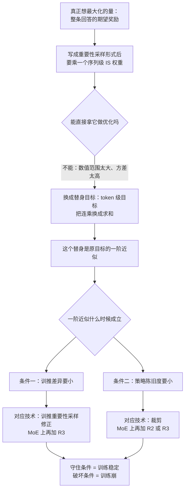
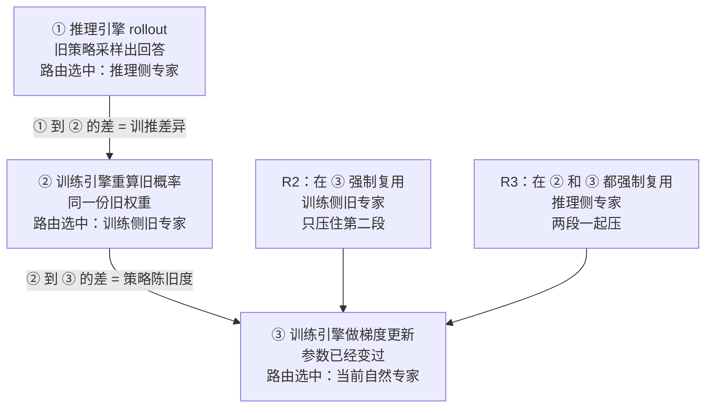
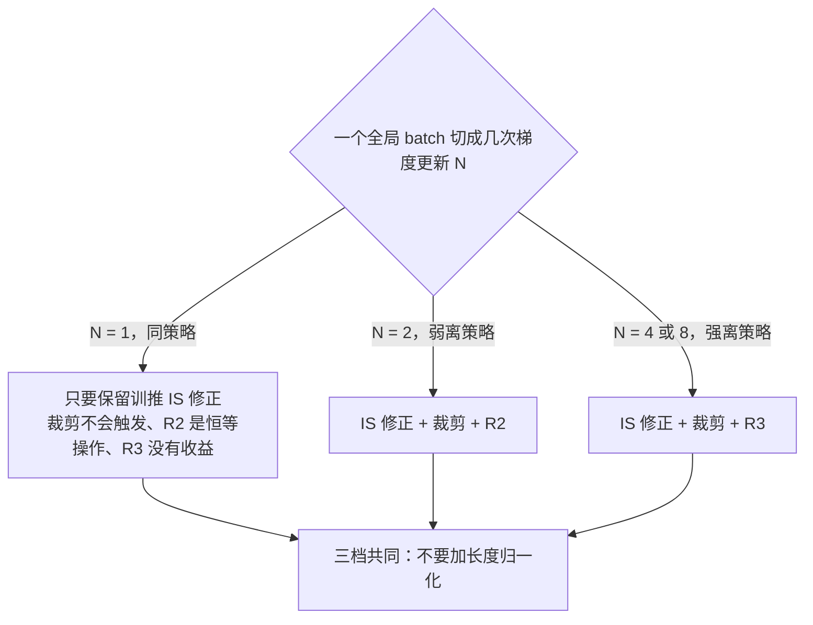

# Stabilizing RL with LLMs：奖励发给整句，梯度却打在 token 上，这件事凭什么成立

<!-- release-date: 2025-12-01 -->

> 本文依据 Qwen Team（阿里巴巴）发布的 **Stabilizing Reinforcement Learning with LLMs: Formulation and Practices**，即 arXiv:2512.01374v3、封面页眉日期 2025-12-04、共 13 页的版本。下文括号中的 `PDF p. N` 指这份 13 页原件的文件页码。截至 2026-09-06 核验，arXiv 上的最新版本仍是 v3，与本地原件一致，无需替换。这是一篇方法与分析类论文，不是基模报告，所以没有模型架构和训练 recipe 可讲；它交付的是一条推导、一个最小算法，以及二十条大规模训练曲线。
>
> 文中会明确区分三层：**论文写了什么**、**本文如何解释它**、**哪些是外部资料补充**。所有从图上量出来的数字都会标明是读图所得。

## 一句话先说清

现在几乎所有 LLM 强化学习都有一个说不通的地方：**奖励是打给整条回答的一个分数，梯度却是逐个 token 施加的。**

GRPO 是这样，REINFORCE 是这样，DAPO 和 CISPO 也是这样。大家都这么做，但很少有人回答过一个问题：这样做到底对不对？

这篇论文给出的答案是：

> **token 级目标不是原目标，它是序列级目标的一阶近似。这个近似只在两个量都很小的时候成立——训推差异，和策略陈旧度。**

一旦接受这个说法，一堆原本各自为战的工程技巧就被串成了一条线：

- **重要性采样修正**不是可选的技巧，它是一阶近似的组成部分，删掉近似立刻不成立；
- **裁剪**的作用是把策略陈旧度压在小范围里；
- **Routing Replay（路由重放）** 对 MoE 的作用，是把「专家换了人」这件事从训推差异和陈旧度里同时拿掉。

论文的主张可以概括成一句：**稳定训练，就是守住这个一阶近似别让它失效。**

## 读前需要的最少背景

这篇论文假设读者已经熟悉策略梯度和 GRPO。本文只补足够往下读的部分。

### 六个必须先认识的名词

- **策略（policy）$\pi_\theta$**：正在训练的语言模型本身，$\theta$ 是它的参数。给定题目 $x$，它写出回答 $y$ 的概率是每个 token 概率连乘：$\pi_\theta(y \mid x)=\prod_{t=1}^{|y|}\pi_\theta(y_t \mid x, y_{<t})$，$|y|$ 是回答的 token 数（PDF p. 2）。
- **序列级奖励 $R(x,y)$**：验证器只看完整回答，给一个标量分。中间过程不打分（PDF p. 2）。这篇论文的实验里它就是 0 或 1（PDF p. 6）。
- **rollout**：让模型把回答实际生成出来的那一步。
- **重要性采样（importance sampling，IS）**：想统计 A 分布下的平均值，手里只有 B 分布采出的样本，就给每个样本乘一个比值 $\frac{A(z)}{B(z)}$ 来纠偏。
- **裁剪（clipping）**：当新旧策略的概率比离 1 太远时，切断这个 token 的梯度，防止一步走太远。
- **MoE（Mixture-of-Experts，混合专家）**：每个 token 只激活一小部分专家参数，由一个路由器决定激活谁。

### 这篇论文最特别的一个记号约定

大多数 RL 论文只有一个 $\pi$。这篇论文有三个，而且分得很细（PDF p. 2、p. 4）：

| 记号 | 含义 | 谁算出来的 |
|---|---|---|
| $\mu_{\theta_{\text{old}}}$ | 采样出这批回答的 rollout 策略 | **推理引擎**（如 SGLang、vLLM） |
| $\pi_{\theta_{\text{old}}}$ | 同一份权重 $\theta_{\text{old}}$，但由训练引擎重新算一遍 | **训练引擎**（如 Megatron、FSDP） |
| $\pi_\theta$ | 正在被更新的目标策略 | 训练引擎 |

**$\mu$ 和 $\pi$ 的区别不是参数不同，而是算它们的机器不同。** 论文用 $\mu$ 专门表示推理引擎里的策略，因为两个引擎之间「通常存在数值差异」（PDF p. 3）。

这个区分是全文的地基。如果把 $\mu_{\theta_{\text{old}}}$ 和 $\pi_{\theta_{\text{old}}}$ 混成一个符号，后面所有推导都会塌。

### 顺带说清一个容易误会的词

论文在脚注里给 on-policy 下了一个**比通常更窄的定义**（PDF p. 2，脚注 2）：

> 本文用 on-policy 表示采样回答的 rollout 策略与要优化的目标策略**是同一个**（**忽略训推差异**），off-policy 表示两者不同。

括号里那半句很关键。按这个定义，所谓「同策略训练」也只是参数相同，**采样和训练仍然发生在两台数值行为不一样的机器上**。这篇论文最强的一个实验结果，正好就出在这个被括号轻描淡写带过的缝隙里。

### 这篇论文和本站已有几篇的分工

RL 这条线本站已经发过不少，先划清边界，避免重复：

- **GRPO 的完整机制**（为什么不要价值模型、组内归一化怎么算优势、KL 放在哪里）见本站 [DeepSeekMath 篇](/reports/DeepSeek/DeepSeekMath) 与 [DeepSeek-R1 篇](/reports/DeepSeek/DeepSeek-R1)，本文不重复。
- **把重要性比从 token 抬到整条回答的序列级做法**，见本站 [GSPO 篇](/reports/Alibaba/GSPO)。GSPO 与本篇是同一支团队、同一位第一作者，两篇的关系值得单独说，放在后面「与 GSPO 的关系」一节。
- **长思维链 RL 的四项工程改动**（裁剪上界解耦、动态采样、token 级损失、超长奖励整形）见本站 [DAPO 篇](/reports/ByteDance/DAPO)。
- **用 RL 扩展模型能力、以及 partial rollout 带来的离策略问题**，见本站 [Kimi-k1.5 篇](/reports/Moonshot/Kimi-k1.5)。
- **异步 RL 系统里的陈旧度工程**，见本站 [Laminar 篇](/reports/ByteDance/Laminar) 与 [AReaL 篇](/reports/AntGroup/AReaL)。

## 先看全景：这篇论文的逻辑骨架

机制示意图，根据 PDF p. 2–5 的推导重画，不含实测数据。整篇论文就是把这张图从上往下走一遍，然后用实验去检验最下面那一格里的两句话。

## 第一步：真正想优化的东西，为什么碰不得

### 真目标长什么样

论文从最诚实的写法开始（PDF p. 2）：

$$
\mathcal J^{\text{seq}}(\theta)=\mathbb E_{x\sim\mathcal D,\ y\sim\pi_\theta(\cdot\mid x)}\big[R(x,y)\big]
$$

$\mathcal D$ 是题目集合。这个式子说的就是一句话：**我希望当前模型自己写出来的回答，平均分越高越好。** 没有 token，没有优势，没有裁剪，什么都没有。

问题是右边的期望要求「$y$ 由 $\pi_\theta$ 采样」，而实际采样发生在推理引擎里、用的是旧参数。所以论文用重要性采样做一次形式变换（PDF p. 2，式 1）：

$$
\mathcal J^{\text{seq}}(\theta)=\mathbb E_{x\sim\mathcal D,\ y\sim\mu_{\theta_{\text{old}}}(\cdot\mid x)}\left[\frac{\pi_\theta(y\mid x)}{\mu_{\theta_{\text{old}}}(y\mid x)}\,R(x,y)\right]
$$

中间那个分式论文叫它**序列级 IS 权重（sequence-level IS weight）**。它衡量：这条从旧模型、旧引擎里采出来的回答，在当前模型眼里有多陌生。

它的梯度也可以写出来（PDF p. 3，式 2）：

$$
\nabla_\theta \mathcal J^{\text{seq}}(\theta)=\mathbb E\left[\frac{\pi_\theta(y\mid x)}{\mu_{\theta_{\text{old}}}(y\mid x)}\,R(x,y)\sum_{t=1}^{|y|}\nabla_\theta\log\pi_\theta(y_t\mid x,y_{<t})\right]
$$

到这里数学上完全严格，一个近似都没做。

### 为什么这个严格的式子不能用

论文只给了一句判词（PDF p. 3）：序列似然 $\pi_\theta(y\mid x)$ 和 $\mu_{\theta_{\text{old}}}(y\mid x)$ 的**数值范围太大、方差太高**，所以这个梯度「通常难以直接使用」。

这句话值得展开算一下，因为它决定了后面所有设计。**下面这段算例是本文的解释，不是论文原文。**

一条回答有 $|y|$ 个 token。序列似然是 $|y|$ 个小于 1 的数连乘。取一条 32,768 token 的回答（正是这篇论文的最大生成长度，PDF p. 6），假设每个 token 的平均概率是 0.9，那么

$$
\pi_\theta(y\mid x)\approx 0.9^{32768}\approx 10^{-1500}
$$

这个数在任何浮点格式里都是 0。所以实现上只能用对数概率。但比值本身也一样凶：序列级 IS 权重是 32,768 个比值的连乘，只要每个比值平均偏离 1 万分之一，整条的比值就是

$$
1.0001^{32768}\approx 26.5
$$

再偏一点就是几千倍。**这个权重不是「稍微加权」，它是一个随时可能跳过几个数量级的乘子。** 用它做梯度估计，方差会把信号完全淹掉。

所以真目标写得出来，却不能直接优化。这是全文所有妥协的起点。

### 顺带交代一件被论文一句话带过、但分量不轻的事

论文在记号那一节明确划掉了一整条技术路线（PDF p. 2）：

> 我们**不考虑基于价值函数的设定**（例如 PPO），也就是由一个价值模型给回答里每个 token 打分、再据此引导策略优化的做法。因为我们发现，要设计出通用且可扩展的、能得到**可靠**价值模型的方法，本质上很困难，甚至可能做不到。

「if not impossible」这个措辞出自这支训练过 Qwen 全系列的团队，值得留意。它解释了为什么本文从头到尾没有出现价值函数、GAE 或 critic——**这不是简化，是一个有立场的取舍**。但论文也没有给任何证据支持这句话，它是一句经验判断。PPO 与价值模型的完整机制见本站 [DeepSeekMath 篇](/reports/DeepSeek/DeepSeekMath)。

## 第二步：替身目标，以及那个被所有人默认的近似

### 大家实际在优化的是什么

论文把「关键的一步」写成了式 3（PDF p. 3）：

$$
\mathcal J^{\text{token}}(\theta)=\mathbb E_{x\sim\mathcal D,\ y\sim\mu_{\theta_{\text{old}}}(\cdot\mid x)}\left[\sum_{t=1}^{|y|}\frac{\pi_\theta(y_t\mid x,y_{<t})}{\mu_{\theta_{\text{old}}}(y_t\mid x,y_{<t})}\,R(x,y)\right]
$$

和式 1 只差一处：**连乘变成了求和。** 序列级 IS 权重 $\prod_t(\cdot)$ 换成了 token 级 IS 权重之和 $\sum_t(\cdot)$。

它的梯度是（PDF p. 3，式 4）：

$$
\nabla_\theta \mathcal J^{\text{token}}(\theta)=\mathbb E\left[\sum_{t=1}^{|y|}\frac{\pi_\theta(y_t\mid x,y_{<t})}{\mu_{\theta_{\text{old}}}(y_t\mid x,y_{<t})}\,R(x,y)\,\nabla_\theta\log\pi_\theta(y_t\mid x,y_{<t})\right]
$$

论文点明：**这就是最基础的策略梯度算法（REINFORCE），外面套了一个 token 级 IS 权重**（PDF p. 3）。

也就是说，这个「替身」并不是什么新东西。它就是今天大家都在跑的那个目标。论文的贡献不是发明它，而是**说清它是从哪里来的**。

### 一阶近似怎么推出来的

论文的推导只有三行，但值得逐行看（PDF p. 3）。

**第一步，给每个 token 的比值起个名字。** 假设 $\pi_\theta$ 与 $\mu_{\theta_{\text{old}}}$ 只差一点点，令

$$
\frac{\pi_\theta(y_t\mid x,y_{<t})}{\mu_{\theta_{\text{old}}}(y_t\mid x,y_{<t})}=1+\delta_t
$$

$\delta_t$ 是一个小量。它是正的表示新模型比旧的更愿意写这个 token，负的表示更不愿意。

**第二步，把连乘展开。**

$$
\frac{\pi_\theta(y\mid x)}{\mu_{\theta_{\text{old}}}(y\mid x)}=\prod_{t=1}^{|y|}(1+\delta_t)\approx 1+\sum_{t=1}^{|y|}\delta_t+O(\delta^2)\approx 1+\sum_{t=1}^{|y|}\delta_t
$$

最右边那一步把 $\delta_i\delta_j$ 这类二阶及更高阶小量扔掉了（PDF p. 3 原文明说）。

**第三步，代回梯度。** 由于常数 1 的梯度是 0，

$$
\nabla_\theta \mathcal J^{\text{seq}}(\theta)\approx\mathbb E\left[R(x,y)\,\nabla_\theta\left(\sum_{t=1}^{|y|}\frac{\pi_\theta(y_t\mid x,y_{<t})}{\mu_{\theta_{\text{old}}}(y_t\mid x,y_{<t})}\right)\right]=\nabla_\theta \mathcal J^{\text{token}}(\theta)
$$

论文的结论是：**当 $\pi_\theta$ 接近 $\mu_{\theta_{\text{old}}}$ 时，用式 4 的梯度更新参数，就能改进式 1 的序列级目标**（PDF p. 3）。

整个推导只用了一件事：$\prod(1+\delta_t)\approx 1+\sum\delta_t$。这是中学就见过的近似，但它把「连乘的高方差」换成了「求和的可控方差」，代价是**只在小量假设下成立**。

### 这个近似的假设到底是什么，真实训练里哪些会被打破

论文把条件写成「$\pi_\theta$ 与 $\mu_{\theta_{\text{old}}}$ 要接近」，然后就转去讲两个来源了。但**近似的真实条件比这句话更严格，而论文没有把这一层说透。下面这一小节全部是本文的分析，不是论文原文。**

把和记作 $S=\sum_{t=1}^{|y|}\delta_t$。当所有 $\delta_t$ 都很小时，

$$
\prod_{t}(1+\delta_t)\approx e^{S},\qquad 1+\sum_t\delta_t=1+S
$$

$e^S\approx 1+S$ 要成立，需要的**不是每个 $\delta_t$ 小，而是它们的和 $S$ 小**。这带来三个论文没写、但实践中必须自己掂量的边界：

**边界一：回答越长，同样的每 token 偏差越危险。**

如果 $\delta_t$ 有一个系统性偏置 $\bar\delta$（不是零均值噪声），那么 $S\approx |y|\cdot\bar\delta$，随长度线性增长。取 $|y|=32{,}768$、$\bar\delta=10^{-5}$：$S\approx 0.33$，$e^{0.33}=1.39$ 而 $1+S=1.33$，误差约 4%。把 $\bar\delta$ 抬到 $10^{-4}$：$S\approx 3.3$，$e^{3.3}=27$ 而 $1+S=4.3$，**近似已经彻底失效**。

而 FP8 推理对 BF16 训练造成的差异，恰恰更像系统性偏置而不是零均值噪声——量化误差是有方向的。论文选了 FP8 推理 + BF16 训练作为「压力测试」（PDF p. 6），但没有讨论回答长度在这里扮演的角色。

**边界二：如果 $\delta_t$ 真的是零均值随机噪声，情况会好得多。** 此时 $S$ 大致按 $\sqrt{|y|}\cdot\sigma_\delta$ 增长，长度的惩罚从线性降到平方根。所以「训推差异是不是有偏」这件事，直接决定了这个方法能撑多长的回答。论文全文没有测量过 $\delta_t$ 的分布，只测量了它的一个聚合指标（训推 KL 散度）。

**边界三：论文自己的实验里，长度确实变了。** §4.3–4.4 的最大生成长度是 32,768，§4.5 换成了 65,536（PDF p. 6、p. 10）。翻倍。论文没有把这当成一个变量讨论。

**为什么要把这三条写出来？** 因为论文的核心贡献就是「给出条件」。一旦有人要把这个条件用到自己的训练上，「多小算小」就是必须回答的问题，而论文停在了定性层面：没有给 $\delta$ 的界，没有给 $S$ 的界，也没有说训推 KL 到多少算危险。**论文提供的是一个判断框架，不是一个可以照抄的阈值。**

## 第三步：把「差距」拆成两半，这是全文最有用的一刀

### 分解式

条件是「$\pi_\theta$ 要接近 $\mu_{\theta_{\text{old}}}$」，但这句话不好操作，因为它把两件完全不同的事混在一起了。论文的处理是插入一个中间量 $\pi_{\theta_{\text{old}}}$——同一份旧权重，但用**训练引擎**算一遍（PDF p. 3，式 5）：

$$
\frac{\pi_\theta(y_t\mid x,y_{<t})}{\mu_{\theta_{\text{old}}}(y_t\mid x,y_{<t})}
=\underbrace{\frac{\pi_{\theta_{\text{old}}}(y_t\mid x,y_{<t})}{\mu_{\theta_{\text{old}}}(y_t\mid x,y_{<t})}}_{\text{训推差异}}
\times
\underbrace{\frac{\pi_\theta(y_t\mid x,y_{<t})}{\pi_{\theta_{\text{old}}}(y_t\mid x,y_{<t})}}_{\text{策略陈旧度}}
$$

分子分母同乘同除一个 $\pi_{\theta_{\text{old}}}$，代数上什么都没发生。但语义上，一个混合量被拆成了两个各有各的成因、各有各的对策的量：

- **训推差异（training–inference discrepancy）**：同一份权重、同一个输入，两台引擎算出的概率不一样。
- **策略陈旧度（policy staleness）**：同一台引擎、同一个输入，采样时的权重和现在的权重不一样。

### 训推差异从哪来

论文说它「成因通常很复杂，且与底层基础设施深度绑定」，并给了三个具体来源（PDF p. 4）：

1. **两个引擎为了各自的峰值性能，用的是不同的计算 kernel**，同样的输入自然给出不一致的输出；
2. **即使在同一个引擎内部**，尤其是推理侧，为了最大化吞吐常常会关掉 batch-invariant kernel，于是同一个输入放在不同 batch 里也会得到不同结果（论文引 He 与 Thinking Machines Lab 2025 年的工作）；
3. **对 MoE 模型，这个差异会被不一致的专家路由进一步放大**——这是第 3 节的主题。

第 2 条特别值得停一下。它意味着：**训推差异不是一个「校准一次就好」的固定偏移，它连自己都不稳定。** 同一条回答第二次算，结果可能又不一样。本站 [DeepSeek-V4 篇](/reports/DeepSeek/DeepSeek-V4) 里 batch invariance 与确定性 kernel 那一大段工程，解决的正是这个问题的另一半；两篇可以对照着读。

### 策略陈旧度从哪来

论文说它「通常来自为了提高训练效率和算力利用率而做的权衡」（PDF p. 4）：

- RL 的 rollout 阶段耗时由生成长度决定，加机器加不快。为了用更多算力换更快收敛，标准做法是**把一大批采样回答切成若干 mini-batch 做多次梯度更新**。于是越靠后的 mini-batch 陈旧度越大。
- 在**异步 RL 框架**里，一条回答甚至可能由多个模型版本接力生成，同样引入陈旧度。

这两条本站都有专篇：切 mini-batch 的做法见 [GSPO 篇](/reports/Alibaba/GSPO)；接力生成与固有陈旧度见 [Laminar 篇](/reports/ByteDance/Laminar)。

### 这一刀为什么重要

因为**两个量对应两套完全不同的干预手段**，而在没有分解之前，它们看起来是同一个问题。

| | 训推差异 | 策略陈旧度 |
|---|---|---|
| 成因 | 硬件、kernel、精度、batch 布局 | 训练调度：切几个 mini-batch、异步到什么程度 |
| 你能不能设成 0 | 不能，只要还在两台引擎上跑 | 能，代价是放弃多次更新带来的收敛加速 |
| 论文里的对策 | 重要性采样修正（IS 权重）、R3 | 裁剪、R2、R3 |
| 论文里的诊断指标 | 训推 KL 散度 $\mathbb D_{\text{KL}}[\mu_{\theta_{\text{old}}}\Vert\pi_{\theta_{\text{old}}}]$ | 无专门指标，只能看熵与 benchmark |

最后一行是本文的观察：**论文给训推差异配了一个直接可测的指标，却没有给陈旧度配。** 这不是疏忽——陈旧度是配置参数（切几份就是几份），不需要测量。但这也意味着，当训练崩掉时，你能立刻看出是不是训推差异出了问题，却只能间接推断是不是陈旧度出了问题。

论文最后把结论收成一句（PDF p. 4）：要保证一阶近似有效，原则上应该从两个方向缩小 $\pi_\theta$ 与 $\mu_{\theta_{\text{old}}}$ 的差距——**降低两个引擎之间的数值差异，并把策略陈旧度控制在温和范围内。**

## 第四步：MoE 让两半同时变坏

### 路由进入公式

MoE 模型在生成每个 token 的前向过程中，会通过路由机制**动态选中并只激活一小部分专家参数**（PDF p. 4）。把这件事写进式 5，就得到式 6（PDF p. 4）：

$$
\frac{\pi_\theta(y_t\mid x,y_{<t})}{\mu_{\theta_{\text{old}}}(y_t\mid x,y_{<t})}
=\underbrace{\frac{\pi_{\theta_{\text{old}}}(y_t\mid x,y_{<t},e^{\pi}_{\text{old},t})}{\mu_{\theta_{\text{old}}}(y_t\mid x,y_{<t},e^{\mu}_{\text{old},t})}}_{\text{训推差异}}
\times
\underbrace{\frac{\pi_\theta(y_t\mid x,y_{<t},e^{\pi}_{t})}{\pi_{\theta_{\text{old}}}(y_t\mid x,y_{<t},e^{\pi}_{\text{old},t})}}_{\text{策略陈旧度}}
$$

符号一下子变多了，先把三个上下标定住：

- $e^{\pi}$ 表示**训练引擎**里路由选中的专家，$e^{\mu}$ 表示**推理引擎**里路由选中的专家（PDF p. 4）；
- 下标 `old` 表示这是 rollout 策略对应的那一次；
- 所以 $e^{\mu}_{\text{old},t}$ 是「rollout 时推理引擎实际用的专家」，$e^{\pi}_{\text{old},t}$ 是「训练引擎用同一份旧权重重算时选的专家」，$e^{\pi}_{t}$ 是「当前参数下自然会选的专家」。

论文的判断是：**专家路由与训推差异、策略陈旧度纠缠在一起，让一阶近似崩掉的可能性变大了**（PDF p. 4）。具体两条：

1. 训推差异会导致**同样的参数、同样的输入，两个引擎选中不同专家**（$e^{\mu}_{\text{old},t}$ 与 $e^{\pi}_{\text{old},t}$ 不同），而路由的分歧又会**进一步放大最终输出的差异**；
2. 陈旧度**不只体现在参数变了**（$\theta$ 对 $\theta_{\text{old}}$），**还体现在路由变了**（$e^{\pi}_t$ 对 $e^{\pi}_{\text{old},t}$），而后者「会大幅改变由被激活参数所定义的那个策略」。

第 2 条的严重性值得说白：token 级比值本来要求分子分母来自「同一个模型的前后两个版本」。路由一变，分子分母其实是**两个不同的子网络**算出来的。**这已经不是「模型改了一点」，而是「换了一台秤重新称」。**

这个现象在 [GSPO 篇](/reports/Alibaba/GSPO) 里有实测数字（同一支团队在 48 层 Qwen3-30B-A3B-Base 上测到，一次梯度更新后约 10% 的激活专家会换人），本篇没有重复测量，只在形式化层面重新解释了它。

### R2 与 R3：它们修的不是同一半

Routing Replay 的核心想法是：**在策略优化时把路由固定住，让 MoE 模型可以像稠密模型一样被优化**（PDF p. 4）。论文把它形式化成两种具体实现（PDF p. 5）。

**Vanilla Routing Replay（R2，基础版路由重放）**，来自 GSPO 那篇（论文引 Zheng et al. 2025）：在梯度更新时，**重放训练引擎里由 rollout 策略确定的那组专家 $e^{\pi}_{\text{old},t}$**。这样分子分母的专家一致，陈旧度那一项被压住：

$$
\frac{\pi^{\text{R2}}_\theta(y_t\mid x,y_{<t})}{\mu_{\theta_{\text{old}}}(y_t\mid x,y_{<t})}
=\frac{\pi_\theta(y_t\mid x,y_{<t},e^{\pi}_{\text{old},t})}{\mu_{\theta_{\text{old}}}(y_t\mid x,y_{<t},e^{\mu}_{\text{old},t})}
$$

**Rollout Routing Replay（R3，按 rollout 路由重放）**，来自 Ma et al. 2025：在训练引擎里**统一重放推理引擎在 rollout 时确定的那组专家 $e^{\mu}_{\text{old},t}$**。因为训练侧两处都改用 $e^{\mu}$，训推差异和陈旧度**被同时压住**：

$$
\frac{\pi^{\text{R3}}_\theta(y_t\mid x,y_{<t})}{\mu_{\theta_{\text{old}}}(y_t\mid x,y_{<t})}
=\frac{\pi_\theta(y_t\mid x,y_{<t},e^{\mu}_{\text{old},t})}{\mu_{\theta_{\text{old}}}(y_t\mid x,y_{<t},e^{\mu}_{\text{old},t})}
$$

用一张图看这两处重放发生在哪：

机制示意图，根据 PDF p. 4–5 的式 6 与两条 Routing Replay 定义重画，不含实测数据。

### 代价：Routing Replay 会偷偷换掉你的优化目标

论文没有把 Routing Replay 说成免费午餐。它明确指出（PDF p. 5）：

> 我们要优化的原始目标策略是 $\pi_\theta$，其中每个 token 的似然应当由**自然路由**出来的专家 $e^{\pi}_t$ 决定。但 Routing Replay 把路由约束成 $e^{\pi}_{\text{old},t}$ 或 $e^{\mu}_{\text{old},t}$，于是得到的是另一个目标策略 $\pi^{\text{R2}}_\theta$ 或 $\pi^{\text{R3}}_\theta$，它偏离了由 $e^{\pi}_t$ 定义的原始 $\pi_\theta$。

论文把两者的偏差差别做成了 Table 1（PDF p. 5）：

| | 第一个 mini-batch | 非第一个 mini-batch |
|---|---|---|
| **R2**（重放训练侧旧专家） | 训练侧旧专家 = 当前自然专家，**目标策略未被改变** | 两者不同，目标策略被改变 |
| **R3**（重放推理侧专家） | 推理侧专家 ≠ 当前自然专家，目标策略被改变 | 同样被改变 |

这张小表比它看起来重要得多。**读懂它就能预判后面所有实验结果。下面这段推论是本文的解释，论文只写到「我们推测这可能导致 R2 和 R3 表现不同」为止（PDF p. 5）。**

第一个 mini-batch 里 $\theta=\theta_{\text{old}}$，所以「训练侧旧专家」就是「当前自然专家」，R2 什么都没改——它对第一个 mini-batch 是**恒等操作**。于是：

- 当 $N=1$（同策略，只做一次梯度更新）时，**R2 完全等于不开 R2**。论文后面直接写「R2 在这里不适用，见 Table 1」（PDF p. 7），根据就是这一格。
- 当把一批切成 $N$ 份时，R2 只有第 1 份是无偏的，剩下 $N-1$ 份都有偏。**R2 的「无偏份额」是 $1/N$，随着离策略程度加深线性衰减。**
- R3 的偏置则是固定的：$N$ 份全部有偏，不多不少。但它换来的好处（消掉训推路由差异）也是固定的，不随 $N$ 变。

把这两条放一起，就得到一个可以事先预测的交叉点：**$N$ 小的时候 R2 划算（偏置少、好处够用），$N$ 大的时候 R3 划算（R2 的偏置优势被稀释光了，而 R3 多修的那一半开始值钱）。** 论文的实验结果正是这样，见后文。

论文自己给的收尾很克制（PDF p. 5）：

> 很难断言 Routing Replay 的好处和坏处哪个更大。改变路由虽然给优化目标引入了偏置，但也让一阶近似更可能成立。我们需要进一步的实验来验证 Routing Replay 的实际效用。

**这是一句很值得学的话。** 它承认了一个结构性事实：这里没有「更正确」的选择，只有两种误差的权衡。

## 第五步：MiniRL，把结论做成一个最小算法

### 为什么要自己造一个基线

论文不用 GRPO 当基线，而是自己写了一个叫 **MiniRL** 的最小算法。理由写得很直接（PDF p. 6）：MiniRL 被采用为基线，是为了在**梯度上**尽可能地与式 3 那个替身目标保持一致——而式 3 已经被第 2 节的形式化证成了。

换句话说：**要验证「守住一阶近似 = 稳定」这个命题，基线本身就必须是一阶近似的忠实实现。** 用 GRPO 当基线会同时引入长度归一化等混杂因素，实验就说不清了。

### 两处最小改动

在式 3 的 REINFORCE 目标上，MiniRL 只加了两样东西（PDF p. 5）：

**第一，组内归一化。** 把原始奖励换成优势估计：

$$
\widehat A(x,y)=R(x,y)-\mathbb E_{y'\sim\mu_{\theta_{\text{old}}}(\cdot\mid x)}\big[R(x,y')\big]
$$

论文说它「同时降低了原始奖励的方差」。

**这里有一个容易被扫过去的细节：MiniRL 只减均值，不除标准差。** 对照附录 A 里 GRPO 与 CISPO 的写法（PDF p. 12），它们用的是

$$
\widehat A_{i,t}=\frac{R(x,y_i)-\operatorname{mean}\big(\{R(x,y_i)\}_{i=1}^{G}\big)}{\operatorname{std}\big(\{R(x,y_i)\}_{i=1}^{G}\big)}
$$

多了一个分母。论文没有解释为什么去掉 std，也没有做这一项的消融。**这是本文核对两处公式后发现的差异，不是论文强调的点。** 但它和长度归一化是同一类问题：除以一个依赖这一组样本自身的量，会破坏各样本梯度之间的线性关系。既然论文用「破坏线性关系」的理由否掉了长度归一化，去掉 std 大概率出于同一个考虑——但这是本文的推测，论文没说。论文自己只在脚注里承认「探索更好的优势估计 $\widehat A(x,y)$ 或许也有帮助，但不在本工作范围内」（PDF p. 5，脚注 3）。

**第二，裁剪。** 用 PPO 的裁剪机制，通过对某些 token 停止梯度来防止过于激进的更新，从而「有望约束策略陈旧度」（PDF p. 5）。

裁剪的实现方式有一个关键选择：论文遵循 **decoupled PPO**（论文引 Hilton et al. 2022），**用 $\pi_{\theta_{\text{old}}}$ 作为 proximal policy 来决定要不要裁剪 token $y_t$**，判据是 $\pi_\theta(y_t)$ 与 $\pi_{\theta_{\text{old}}}(y_t)$ 的比值（PDF p. 5）。

同一个脚注还留了另一件事给未来工作：论文承认存在别的裁剪策略，比如按序列似然比整条裁掉（引 GSPO），但「我们发现当前这个裁剪策略已经工作得相当不错」，因此把裁剪与掩码策略的研究也推给了后续（PDF p. 5，脚注 3）。**这句「工作得相当不错」没有任何数据支撑**，后面讲与 GSPO 的关系时还会回到它。

### 完整目标

$$
\mathcal J_{\text{MiniRL}}(\theta)=\mathbb E_{x\sim\mathcal D,\ y\sim\mu_{\theta_{\text{old}}}(\cdot\mid x)}\left[\sum_{t=1}^{|y|}M_t\,\operatorname{sg}\!\left[\frac{\pi_\theta(y_t\mid x,y_{<t})}{\mu_{\theta_{\text{old}}}(y_t\mid x,y_{<t})}\right]\widehat A(x,y)\log\pi_\theta(y_t\mid x,y_{<t})\right]
$$

其中掩码与裁剪比值是（PDF p. 6，式 7）：

$$
M_t=\begin{cases}
0 & \text{若 }\widehat A(x,y)>0\text{ 且 }r_t>1+\varepsilon_{\text{high}}\\[2pt]
0 & \text{若 }\widehat A(x,y)<0\text{ 且 }r_t<1-\varepsilon_{\text{low}}\\[2pt]
1 & \text{其它情况}
\end{cases}
\qquad
r_t=\frac{\pi_\theta(y_t\mid x,y_{<t})}{\pi_{\theta_{\text{old}}}(y_t\mid x,y_{<t})}
$$

$\operatorname{sg}[\cdot]$ 是 stop gradient，只取数值、不回传梯度，对应 PyTorch 的 `detach`。

**这个式子里有三处设计值得逐一说清。**

**其一，IS 权重被 `sg` 包住了。** 所以梯度只从 $\log\pi_\theta$ 那一项流出来，IS 权重纯粹是个系数。求导后得到的正是式 4 的形式——这就是论文说的「在梯度上尽可能与式 3 一致」。这一点和 CISPO 的做法同源，本站 [MiniMax-M1 篇](/reports/MiniMax/MiniMax-M1) 讲过同一个技巧的另一种用法。

**其二，权重和裁剪用的不是同一个比值。** 权重的分母是 $\mu_{\theta_{\text{old}}}$（推理引擎），裁剪的分母是 $\pi_{\theta_{\text{old}}}$（训练引擎）。回到式 5 的分解就明白了：

- **IS 权重管的是整个差距**（训推差异 × 陈旧度）；
- **裁剪只管陈旧度那一半**，它不该因为两台机器数值不一致就把 token 裁掉。

**这是本文认为全文最精巧的一处工程判断**：既然差距已经被拆成两个因子，那么两个机制就应该各管一个，而不是都盯着同一个混合比值。GRPO 与 CISPO 的裁剪比值同样是 $\pi_\theta/\pi_{\theta_{\text{old}}}$（PDF p. 12），差别在于它们的目标函数里**根本没有训推那一项修正**。

**其三，裁剪是「掩码」而不是「min-clip」。** 写成 $M_t\in\{0,1\}$ 之后，「裁掉」的含义非常直白：这个 token 的梯度整个置零。优势为正且比值涨过上界，说明这个 token 已经被推得够多了；优势为负且比值跌过下界，说明已经被压得够狠了。两种情况都直接停手。

### 与 GRPO、CISPO 的三点差别

附录 A 把三个目标并排写出来后，给了三条差别（PDF p. 12）：

1. GRPO 与 CISPO 的原始目标**不考虑训推差异**；
2. 两者都用了**长度归一化**，而 §4.3 会证明它会让一阶近似失效，导致有偏的 token 级目标和次优性能；
3. **CISPO 不裁剪任何 token 的梯度**，而 §4.4 会证明这会导致训练不稳定。

注意附录 A 只是**公式层面的对照，没有任何实验**。论文没有跑 GRPO 或 CISPO 的对比曲线。所以「MiniRL 优于 GRPO」这句话在这篇论文里**没有直接证据**，只有「GRPO 含有两个已被单独证明有害的成分」这种间接论证。

## 实验设定：什么被固定，什么被扫

### 全部配置一览（PDF p. 6）

| 项目 | 设置 |
|---|---|
| 任务 | 数学推理，回答与标准答案比对后给二元奖励 $R(x,y)\in\{0,1\}$ |
| 训练题集 | 4,096 道带验证答案的数学题 |
| 评测 | HMMT25、AIME25、AIME24，各 30 题，共 90 题；每题采样 32 次取平均准确率 |
| 模型 | 从 Qwen3-30B-A3B-Base 微调得到的一个冷启动模型 |
| 精度 | **FP8 推理 + BF16 训练** |
| 框架 | 标准同步 RL 框架 |
| 每次梯度更新的 mini-batch | 固定 1,024 条回答（$B=64$ 道题 × $G=16$ 条） |
| 最大生成长度 | 32,768 |
| 裁剪 | $\varepsilon_{\text{high}}=0.27$，$\varepsilon_{\text{low}}=0.2$ |
| 额外技巧 | 对 token 级 IS 权重施加截断重要性采样（Truncated Importance Sampling，TIS），截断阈值 5 |
| 算力 | 总计数十万 GPU 时；每个梯度步约 5–6 GPU 时 |

### 三个设定值得单独说

**其一，FP8 推理 + BF16 训练是故意选的。** 论文说这是「对算法正确性的压力测试，此时推理精度低于训练精度，训推差异很大」（PDF p. 6）。

这个选择很重要，因为它同时是优点和限制：优点是能把问题放大到看得见；限制是**结论的强度和这个设定绑定**。在 BF16 推理下，同样的对比未必得到同样的结论——论文自己就用这一点解释了它和 R3 原论文的结果冲突（PDF p. 8，脚注 5）。

**其二，mini-batch 固定在 1,024 条，这让横轴变成了一根真正的算力轴。** 这是本文的推算：所有实验都固定 mbs = 1,024，而每个全局步生成 gbs 条回答、做 $N=\text{gbs}/\text{mbs}$ 次更新，所以**平均每个梯度步对应的生成量恒等于 1,024 条**。这就是为什么论文能给出一个跨所有配置通用的「每梯度步约 5–6 GPU 时」，也是为什么所有图的横轴都可以用「Gradient Steps」直接比较算力。论文没有点破这层含义，但它是所有图能横向对读的前提。

**其三，TIS 是一个被顺手加上、却没被讨论的变量。** 截断重要性采样把 IS 权重截断在 5 以内（PDF p. 6）。**下面是本文的判断**：截断本身就是一种有偏修正——被截断的那些 token，其修正强度不再等于一阶近似要求的值。论文用了整整两节论证「不能破坏一阶近似」，然后在实验里给所有 run 都加了一个轻微破坏它的技巧，并且**没有做它的消融，也没有讨论阈值 5 的来源**。这是全文逻辑上最松的一处接缝。

### 用来判断「稳不稳」的三个指标

这是这类论文最容易被跳过、却决定结论成色的部分，所以按论文原文完整列出。

**先看论文怎么定义「稳定训练」**（PDF p. 1，脚注 1）：

> 所谓稳定训练，指的是这样一个训练过程：模型性能随训练步数**稳步提升**——在**训练奖励**和 **benchmark 分数**上都体现出来——并且关键的是，模型的**内部状态平滑演化、没有突变**。内部状态可以通过一组诊断指标监控，包括我们后面实验里报告的**训推 KL 散度**与**熵**。稳定训练意味着模型能在长时间或多阶段训练中持续健康地改进，出现异常行为的风险更低。

这个定义有两个特点值得记住：

1. **它是双层的**：外层看性能（训练奖励 + benchmark），内层看状态（KL + 熵）。只有外层稳不算稳。
2. **它包含「没有突变」这一条**，也就是说慢慢变差不叫不稳定，突然拐弯才叫。

对应的两个诊断指标，论文都给了定义。

**token 级熵**（PDF p. 6），近似为

$$
\mathbb H[\pi_\theta]\approx\mathbb E_{x\sim\mathcal D,\ y_{<t}\sim\mu_{\theta_{\text{old}}}(\cdot\mid x)}\left[-\sum_{w\in\mathcal V}\pi_\theta(w\mid x,y_{<t})\log\pi_\theta(w\mid x,y_{<t})\right]
$$

$\mathcal V$ 是词表。人话是：在 rollout 采出来的前缀上，模型对「下一个词是什么」有多犹豫。

**训推 KL 散度**（PDF p. 6），衡量两个引擎里的 rollout 策略差多远：

$$
\mathbb D_{\text{KL}}\big[\mu_{\theta_{\text{old}}}\Vert\pi_{\theta_{\text{old}}}\big]=\mathbb E_{x\sim\mathcal D,\ y_t\sim\mu_{\theta_{\text{old}}}(\cdot\mid x,y_{<t})}\left[\log\frac{\mu_{\theta_{\text{old}}}(y_t\mid x,y_{<t})}{\pi_{\theta_{\text{old}}}(y_t\mid x,y_{<t})}\right]
$$

**注意这个 KL 里两边都是旧策略**，只是一边由推理引擎算、一边由训练引擎算。它测的是式 5 分解里的第一个因子，和参数更新完全无关。

论文报告它的理由写得很明确（PDF p. 6）：近期工作已经揭示，**RL 训练中的不稳定或崩溃，往往伴随着训推差异的急剧上升**（论文引 Yao et al. 2025 与 Liu et al. 2025a）。

### 每个梯度步都在花多少钱

**下面这段是本文的推算，不是论文数字。** 把四张主图里所有曲线的横轴长度加起来（读图所得，PDF p. 7–9）：

| 图 | 配置 | run 数 | 各 run 的大致终点（梯度步） | 小计 |
|---|---|---:|---|---:|
| Figure 1 | 同策略 | 6 | 1200 / 1200 / 135 / 980 / 800 / 290 | ≈ 4,600 |
| Figure 2 | gbs = 2 × mbs | 4 | 1010 / 2000 / 2400 / 1950 | ≈ 7,400 |
| Figure 3 | gbs = 4 × mbs | 4 | 1580 / 1650 / 2850 / 4000 | ≈ 10,100 |
| Figure 4 | gbs = 8 × mbs | 3 | 1370 / 3830 / 5450 | ≈ 10,700 |

合计约 32,700 个梯度步。乘上「每步 5–6 GPU 时」（PDF p. 6），得到约 **16 万–20 万 GPU 时**——与论文自称的「数十万 GPU 时」（PDF p. 1、p. 6）对得上，而且还没算 §4.5 那三条曲线和任何未被报告的失败尝试。

做这个推算是为了给读者一个具体的量级感：**这十七条曲线里，随便一条走到中途崩掉，扔掉的都是几万 GPU 时。** 这也解释了为什么这个团队愿意花力气去论证「什么条件下不会崩」。

## 同策略结果：一个不含梯度的常数权重，决定了训练的生死

### 同策略下 MiniRL 退化成什么

当全局 batch 等于 mini-batch（$N=1$）时，$\theta=\theta_{\text{old}}$，裁剪比值 $r_t$ 恒为 1，掩码 $M_t$ 恒为 1。MiniRL 退化成（PDF p. 6）：

$$
\mathcal J_{\text{MiniRL}}(\theta)=\mathbb E\left[\sum_{t=1}^{|y|}\frac{\pi_{\theta_{\text{old}}}(y_t\mid x,y_{<t})}{\mu_{\theta_{\text{old}}}(y_t\mid x,y_{<t})}\,\widehat A(x,y)\log\pi_\theta(y_t\mid x,y_{<t})\right]
$$

论文说：此时「IS 权重仅仅作为训推差异的修正而存在」（PDF p. 7）。

**这句话的分量比字面大。下面是本文的强调**：注意那个权重的分子分母都带着 $\theta_{\text{old}}$——它**完全不依赖正在优化的 $\theta$**。也就是说，在同策略设定下，这个所谓的「重要性采样修正」其实就是**一个逐 token 的常数权重**，一个查表就能算出来的固定系数。

接下来的实验要证明的是：**加不加这个常数，决定训练是收敛还是在一百多步内崩掉。**

### 两个消融变体

论文设了两个消融变体（PDF p. 7）：

**变体一：加长度归一化。**

$$
\mathcal J^{\text{w length-norm}}_{\text{MiniRL}}(\theta)=\mathbb E\left[\frac{1}{|y|}\sum_{t=1}^{|y|}\frac{\pi_{\theta_{\text{old}}}(y_t\mid x,y_{<t})}{\mu_{\theta_{\text{old}}}(y_t\mid x,y_{<t})}\,\widehat A(x,y)\log\pi_\theta(y_t\mid x,y_{<t})\right]
$$

**变体二：去掉训推 IS 修正。**

$$
\mathcal J^{\text{wo train-infer-is}}_{\text{MiniRL}}(\theta)=\mathbb E\left[\sum_{t=1}^{|y|}\widehat A(x,y)\log\pi_\theta(y_t\mid x,y_{<t})\right]
$$

论文对这两个变体的定性很硬（PDF p. 7）：它们**不再满足前面那个一阶近似**，因为它们的梯度「既不等于、也不线性相关于」式 1 那个真序列级目标的梯度（忽略奖励归一化）。

**「既不等于、也不线性相关」这个措辞要读准。** 长度归一化并不是给梯度乘了一个统一的常数——它给**每条样本乘了一个属于它自己的 $1/|y_i|$**。统一常数只相当于改学习率，无伤大雅；逐样本不同的系数则改变了样本之间的相对权重，方向就真的偏了。这一点和 [DAPO 篇](/reports/ByteDance/DAPO) 讲 token 级损失时是同一件事的两条论证路线：DAPO 从「一个 token 值多少不该由它待在多长的回答里决定」出发，本篇从「它破坏了与序列级目标的对应关系」出发。论文自己也在脚注里点了一句（PDF p. 7，脚注 4）：关于长度归一化的结论与 Liu et al. 2025b 一致，「尽管动机截然不同」。

论文还给这三条各配了一份开 R3 的版本，凑成六条曲线。**R2 在这里不适用**——按 Table 1，$N=1$ 时 R2 是恒等操作（PDF p. 7）。

### Figure 1 读出了什么

四张子图，横轴都是梯度步 0–1200（PDF p. 7）。**以下曲线数值均为本文读图所得，论文正文没有给出任何数值表。**

| 曲线 | benchmark 终值 | 结局 |
|---|---|---|
| MiniRL ★ | 约 0.775，峰值约 0.78 | 跑满 1200 步，全程最高 |
| MiniRL + 长度归一化 | 约 0.752 | 跑满，稳定但明显更低 |
| MiniRL + R3 | 约 0.755（约 980 步处） | 稳定，不如 MiniRL |
| MiniRL + R3 + 长度归一化 | 约 0.75（约 800 步处），中途在 560–700 步有一次跌到约 0.63 的深坑 | 更差、更抖 |
| MiniRL − 训推 IS 修正 | **约 135 步处从约 0.65 直坠出图（跌破约 0.57）后终止** | 崩溃 |
| MiniRL + R3 − 训推 IS 修正 | 同样在约 140 步处跌到约 0.60 后终止 | 崩溃 |

配套的两个诊断指标把崩溃的形状说得更清楚：

- **训推 KL**（对数纵轴）：去掉 IS 修正的那条绿线从约 $2\times10^{-3}$ 一路直冲，约 120 步就穿过 $10^{-2}$，130 步时已在 $3\times10^{-2}$ 以上；其余五条在各自存续期间都待在 $1.5\times10^{-3}$ 到 $6\times10^{-3}$ 的带子里。
- **熵**：绿线从约 0.32 单调掉到约 0.105 就结束了。其余曲线都在 0.20–0.40 之间。

论文的四条结论（PDF p. 7–8）：

1. **MiniRL——也就是带 IS 修正的基础策略梯度算法——性能和训练稳定性都最好。**
2. **加长度归一化会导致次优性能**，尽管训练仍然稳定。这符合预期，因为长度归一化让一阶近似失效，得到一个有偏的 token 级目标。
3. **去掉训推 IS 修正会导致训练快速崩溃、熵急剧下降。** 这确认了 IS 权重是一阶近似的固有组成部分，去掉它会立刻让 token 级目标失效。
4. **同策略下用 R3 没有性能收益**，尽管它确实有效降低了训推差异（从训推 KL 曲线可以看出来）；R3 配长度归一化会让 benchmark 更差；R3 配上「不做训推 IS 修正」仍然会快速失败。论文说这**经验性地确认了 §3.2 的推测——Routing Replay 会改变原始目标策略，给优化目标引入偏置。**

### 这一节最值得记住的东西

**第一个判断，也是全文最强的实验事实：**

> 一个不含任何梯度、只由两台引擎的数值差异决定的**逐 token 常数权重**，加上它训练能跑到 0.775，去掉它训练在 135 步内崩掉。

这个对比之所以有说服力，是因为它把变量压到了极致：不是换算法，不是调超参，只是给每个 token 乘或不乘一个查得到的固定数。

**第二个判断，来自读图而不是论文正文：** 四张子图里，**训练奖励那一张几乎没有分辨力**——六条曲线全程叠在一起，从约 0.55 爬到约 0.80–0.85，就连在第 135 步崩掉的那条，它的训练奖励在终止前也和别人一模一样（约 0.60）。

**换句话说：如果只盯着训练奖励，这次崩溃到死都不会被看见。** 崩溃的信号只出现在 benchmark、熵和训推 KL 上。这正好印证了论文脚注 1 里那个双层定义——外层性能之外，必须看内层状态。

**第三个判断：R3 在同策略下的表现，是这篇论文自我检验最漂亮的一处。** R3 确实做到了它承诺的事（训推 KL 明显下降），但 benchmark 反而没有变好。**这说明「让近似更成立」和「让结果更好」不是同一件事**——因为 R3 在降低近似误差的同时，也把优化目标换成了另一个。论文在 §3.2 先做出这个预测，再在 §4.3 用实验验证，逻辑闭环是完整的。

## 异策略结果：裁剪和 Routing Replay，缺一个都不行

### 实验怎么设计的

推理时间由生成长度决定，加机器加不快；要用更多算力换更快收敛，标准做法是引入离策略更新（PDF p. 8）。论文固定 mini-batch = 1,024 条，把全局 batch 分别设成 2,048、4,096、8,192，对应 $N=2,4,8$ 三档离策略程度。

对比四种方法：MiniRL（不裁剪）、MiniRL + R2（不裁剪）、MiniRL + R2、MiniRL + R3。注意 $N\ge 2$ 之后 R2 才有意义。

**读这三张图有一个坑必须先说：Figure 4 的配色和 Figure 2、3 不一样。** Figure 2、3 是四条曲线（蓝 = 不裁剪、橙 = R2 不裁剪、绿 = R2、红 = R3）；Figure 4 只有三条，颜色整体前移（蓝 = R2 不裁剪、橙 = R2、绿 = R3）。**同一个绿色在 Figure 3 里是 R2、在 Figure 4 里是 R3。** 不看图例直接对比会得到完全相反的结论。

另外，四张主图的图例里都有一个 **★ 标记**，标在该配置下的推荐方法上：Figure 1 是 MiniRL，Figure 2 是 MiniRL + R2，Figure 3 和 Figure 4 都是 MiniRL + R3。论文正文从未解释过这个星号，但它和文字结论完全一致。

### 三档离策略程度的结果

**以下曲线数值均为本文读图所得（PDF p. 8–9），论文正文没有给出数值表。**

| 配置 | 方法 | benchmark 峰值 | 结局 |
|---|---|---:|---|
| **2×**（gbs = 2,048） | MiniRL（不裁剪） | 约 0.755（约 880 步） | 约 1010 步跌到 0.718 后终止 |
| | MiniRL + R2（不裁剪） | 约 0.778（约 1450 步） | 1700 步后剧烈震荡，约 2000 步跌到 0.715 终止 |
| | **MiniRL + R2 ★** | **约 0.79** | 跑到 2400 步仍稳定在 0.785–0.795 |
| | MiniRL + R3 | 约 0.775 | 约 1950 步稳定终止于 0.768 |
| **4×**（gbs = 4,096） | MiniRL（不裁剪） | 约 0.78（约 1450 步） | 约 1580 步跌到 0.718 后终止 |
| | MiniRL + R2（不裁剪） | 约 0.783（约 1500 步） | 约 1650 步跌到 0.707 后终止 |
| | MiniRL + R2 | 约 0.782（约 2500 步） | **约 2830 步崩到 0.748** |
| | **MiniRL + R3 ★** | **约 0.797（约 1930 步）** | 跑到 4000 步，缓慢回落到约 0.765 |
| **8×**（gbs = 8,192） | MiniRL + R2（不裁剪） | 约 0.770（约 900 步） | 约 1370 步跌到 0.723 后终止 |
| | MiniRL + R2 | 约 0.782（约 3200 步） | **约 3830 步崩到 0.715** |
| | **MiniRL + R3 ★** | **约 0.789（约 2900 步）** | 跑到 5450 步，缓慢回落到约 0.765 |

论文的两条结论（PDF p. 8、p. 10）：

1. **一旦引入离策略更新，Routing Replay 和裁剪都变成稳定训练的必需品。** Figure 2 和 Figure 3 显示，缺任何一个都会让训练提前崩溃，从而拉低峰值性能。这说明 Routing Replay 缓解了专家路由的影响，裁剪机制也确实阻止了过于激进的策略更新，**两者都在约束策略陈旧度**。
2. **离策略程度小（2×）时 R2 优于 R3；离策略程度大（4× 和 8×）时 R3 反超 R2。** 而且在高离策略程度下，R2 **无法维持稳定训练**，它崩溃前的峰值也略低于 R3。

论文给出的假说（PDF p. 10）：结合 §3.2 的分析（R2 不改变第一个 mini-batch 的目标策略，R3 会改）和 §4.3 的同策略结果，**推测在离策略程度小时，R3 改变目标策略的害处压过了它维持一阶近似的好处；离策略程度大时则反过来。**

这和本文前面从 Table 1 推出来的「R2 的无偏份额是 $1/N$」是同一件事的两种说法。$N=2$ 时 R2 有一半更新是无偏的，$N=8$ 时只剩八分之一——优势被稀释光了。

### 「0.79」到底是什么水平：附录 B 给了拆解

正文里的 Benchmark Score 是三个测试集的平均，看不出绝对难度。附录 B 把每个测试集单独画了出来（Figure 6 到 Figure 9，PDF p. 12–13）。以 2× 配置下表现最好的 MiniRL + R2 为例，跑到约 2,400 步时（**读图所得**）：

| 测试集 | 题量 | 约值 |
|---|---:|---:|
| HMMT25 | 30 | 0.64–0.65 |
| AIME25 | 30 | 0.825 |
| AIME24 | 30 | 0.90 |

三者平均正好落回正文里的约 0.79。这个拆解值得看一眼，因为**综合分里能动的空间几乎只剩 HMMT25**：AIME24 已经贴在 0.90 附近、天花板效应明显，AIME25 也在 0.82 上下饱和。

更进一步，附录 B 里藏着一个正文没提的细节。看 4× 配置的 Figure 8（PDF p. 12，**读图所得**）：

- **HMMT25**：R3（红）峰值约 0.665，R2（绿）只到约 0.63，R2 在约 2,800 步从 0.63 掉到约 0.60；
- **AIME24**：反过来——R2 在约 2,400–2,700 步达到约 0.905，比同期 R3 的约 0.885 **更高**；
- **AIME25**：两者基本重合，都在 0.80–0.82。

也就是说，**正文那句「4× 时 R3 反超 R2」在三个测试集上并不一致，它主要来自 HMMT25 这一项。** 论文只报告了平均值，没有拆开讨论过这一点。

**本文的提醒**：全部结论建立在 90 道题的平均上，其中 60 道已接近饱和，而剩下 30 道正好主导了排名。这不影响「崩没崩」这类定性判断——崩溃在三个测试集上都看得见——但会让「谁比谁高 1 个点」这类比较非常脆弱。

### 三种失稳，长得完全不一样

这是本文认为整篇论文最有实用价值、却分散在各图里的信息。把三种失效的诊断指标形状并排放在一起（**全部为本文读图所得**）：

| 失效模式 | 触发条件 | benchmark | 训推 KL | 熵 |
|---|---|---|---|---|
| **缺训推 IS 修正** | 同策略就会发生 | 约 135 步跌破 0.57 | 约 120 步穿过 $10^{-2}$，130 步已在 $3\times10^{-2}$ 以上 | 从 0.32 单调掉到约 **0.105** |
| **缺裁剪** | 一旦离策略 | 2× 时约 1000 步见顶回落 | 2× 时约 1000 步升到约 $2.8\times10^{-2}$ | 缓慢下滑到约 0.29；4× 时最低到约 0.23 |
| **Routing Replay 不够**（R2 用在高离策略程度） | 4× 与 8× | 4× 时约 2830 步、8× 时约 3830 步断崖式下跌 | 4× 时从约 $6\times10^{-3}$ 一路冲到约 $2\times10^{-1}$ | 4× 时从约 0.38 **暴涨到 0.70**；8× 时暴涨到 0.60 |

（数据出处：Figure 1，PDF p. 7；Figure 2，PDF p. 8；Figure 3 与 Figure 4，PDF p. 9。）

**最值得记住的一点：熵的方向是相反的。**

- 缺 IS 修正时，熵**塌**下去（0.32 → 0.105）：模型迅速变得过度确定，探索空间没了。
- R2 在高离策略程度下失效时，熵**炸**上来（0.38 → 0.70）：模型开始胡乱发散。

这两种都叫「训练崩了」，但监控上完全是两个方向。**如果只设一条「熵低于 X 就报警」的规则，第二种失效会一路跑到 GPU 时烧完都不触发。**

而**训推 KL 在三种失效里都是同向的**——都往上冲，而且都比正常曲线高一个数量级以上。这也是论文选它做诊断指标的理由（PDF p. 6）。**本文的判断：如果只能保留一个监控指标，就保留训推 KL；如果能保留两个，第二个是熵，而且要设双向阈值。**

### 实践上怎么用这套结论

机制示意图，根据 PDF p. 7–10 的文字结论与四张主图的 ★ 标记重画；节点表示配置选择，不代表实测数值。适用前提是这篇论文的实验设定：30B MoE、数学任务、FP8 推理 + BF16 训练、同步 RL 框架。

## 冷启动实验：一个结论很大、证据边界也很清楚的发现

### 论文做了什么

§4.5 的动机写得很清楚（PDF p. 10）：稳定训练之所以值得追求，是因为**只要能通过足够长的 RL 训练触到一个基座模型的性能上限，就可以靠投入算力可靠地提升模型能力**。

于是他们问：用不同冷启动数据初始化的模型，在稳定的 RL recipe 下，最终能不能达到相似性能？

三份冷启动数据分别蒸馏自三个前沿模型（PDF p. 10）：**Qwen3-Max-Thinking-Preview、DeepSeek-R1-0528、gpt-oss-120b（high 模式）**。

设定与前面**不同**（PDF p. 10）：

- 模型换成「一个早期实验性的小号 Qwen3Next MoE 模型」；
- 全局 batch 4,096，mini-batch 2,048（$B=128$，$G=16$，$N=2$）；
- 生成长度 65,536（前面是 32,768）；
- recipe 用 MiniRL + R2。

### Figure 5 读出了什么

**以下为本文读图所得**（PDF p. 10；PDF p. 13 的 Figure 10 给出了分 benchmark 的版本）：

- **benchmark（AIME25 与 AIME24 平均）**：起点差得很开——Qwen3-Max-Thinking-Preview 约 0.80、DeepSeek-R1-0528 约 0.775、gpt-oss-120b 约 0.745，最大差距约 6 个百分点。到约 200 步时三条已经互相咬住，此后一直纠缠在 0.85–0.87，到 580 步仍然分不出来。
- **回答长度**：三条曲线**始终没有合拢**。到 580 步时，Qwen3-Max-Thinking-Preview 约 31,000 token、gpt-oss-120b 约 30,000 token，而 DeepSeek-R1-0528 只有约 24,000 token——全程比另外两条低 4,000–6,000 token。

论文的结论（PDF p. 10）：三种冷启动初始化最终达到了**可比的性能**，这鼓励我们更多关注 RL 本身，而不是过度纠结冷启动的具体细节。论文还补了一句：对照 Figure 1 到 Figure 4，**同策略和离策略训练一旦稳定下来，也都收敛到相似的峰值性能**；这进一步说明稳定训练在成功扩展 RL 中起决定性作用。

### 这个结论的边界

论文没有讨论下面这几条，**它们是本文核对图与设定后整理的**：

**第一，分数收敛了，行为没有收敛。** 回答长度那张图从头到尾分成两档。三个模型考同样的分，但一个用 24,000 token、另外两个用 30,000 token。如果你在意的是推理成本或者输出风格，「性能可比」这句话就不够用了。**论文只报告了 AIME25 与 AIME24，没有报告 HMMT25**，而 HMMT25 是三个 benchmark 里分数最低、区分度最大的那个。

**第二，三个冷启动来源都是前沿推理模型。** 这个实验证明的是「换一个强老师蒸馏，最终会追平」，不是「冷启动完全不重要」。没有弱老师、没有更少数据、没有不做冷启动的对照。

**第三，换了模型也换了配置。** §4.5 用的是另一个模型（早期实验性的小号 Qwen3Next MoE）、另一个批量配置、两倍的生成长度。所以它和 §4.3–4.4 的曲线**不能直接对读**，论文在这里说的「comparable」只在自己这三条之间成立。

**第四，580 步远短于前面的实验。** 前面动辄跑到 4,000–5,500 步。「充分长的 RL 训练」这个前提，在这个实验里其实没有被满足到同样的程度。

## 与 GSPO 的关系：同一支团队，四个多月后换了论证方向

这一节必须写，因为本站已经发过 [GSPO 篇](/reports/Alibaba/GSPO)，而两篇的立场看起来是拧着的。

**先确认关系**：两篇的第一作者都是 Chujie Zheng，都属于 Qwen Team。GSPO 是 arXiv:2507.18071（v1 于 2025-07-24 提交），本篇是 arXiv:2512.01374（v1 于 2025-12-01 提交），中间隔了四个多月。

本篇一共在三处引用 GSPO：

- **引言里两次**（PDF p. 1）：作为「有些研究提出直接采用序列级优化目标」的出处，以及「动态专家路由机制会让 MoE 模型的 token 级重要性采样比失效」的出处；
- **§3.2**（PDF p. 5）：作为 R2 的出处；
- **脚注 3**（PDF p. 5）：作为「另一种裁剪策略」的出处。

注意引言那两次的措辞：**本篇并没有否认 GSPO 提出的那个问题**，它把「路由会让 token 级比值失效」原样承接下来，只是接着说——这个失效可以被 Routing Replay 挡住，所以 token 级目标不必被放弃。

**两篇对同一件事的说法：**

| 议题 | GSPO 篇（2025-07） | 本篇（2025-12） |
|---|---|---|
| token 级重要性比 | 每个位置只有一个样本，不满足重要性采样前提，目标是 **ill-posed（病态的）** | token 级目标是序列级目标的**一阶近似**，在两个条件下**成立** |
| 应对办法 | 换成序列级重要性比与序列级裁剪 | 保留 token 级，但守住两个条件 |
| Routing Replay | 是**系统层的补丁**，增加显存与通信开销、限制模型容量；GSPO **不需要它** | 是**必需品**：一旦引入离策略更新，缺了它训练会提前崩溃 |
| 训推差异 | 序列似然对精度差异更宽容，**有潜力**让训练侧不必重算似然 | 训推差异必须**显式修正**；不修正会在 135 步内崩掉 |

**这确实是同一支团队立场的一次调整，而且是本文认为读者最该带走的一条元信息。** 但要说清楚它是哪一种调整：

**它不是「GSPO 被推翻了」。** 本篇从头到尾**没有跑过 GSPO 的对比实验**。它只在脚注 3 里提了一句（PDF p. 5）：存在其它裁剪策略，比如按序列似然比裁掉整条回答（引 GSPO），但「我们发现当前这个裁剪策略已经工作得相当不错」，因此把裁剪与掩码策略的研究留给未来工作。**「工作得相当不错」不是一次比较，没有任何数据支撑这一句。**

**它也不是两篇在讲不同的东西。** 两篇处理的是同一个矛盾（奖励在序列级、优化在 token 级），面对的是同一类模型（30B 级 MoE，都用 Qwen3-30B-A3B-Base 作载体），只是给出了相反方向的答案：GSPO 把优化单位抬到序列级去迁就奖励；本篇把 token 级目标论证为序列级目标的合法近似，然后去守住近似成立的条件。

**最实质的分歧在 Routing Replay 上。** GSPO 论文的核心卖点之一就是「拆掉 Routing Replay 这个补丁」；本篇则把 Routing Replay 提升成一阶近似的守护者，并且进一步区分了 R2 与 R3，还给出了什么时候该用哪一个。如果只读 GSPO 篇，读者会得到「Routing Replay 是不该存在的东西」这个印象；本篇会告诉他「在 token 级目标下它是必需品」。

**两篇都没有回答的问题是：如果用 GSPO 的序列级目标，还需不需要 Routing Replay？** GSPO 说不需要（有实验，但对照组是打了补丁的 GRPO）；本篇没有测。这个空白是真的空白，本站两篇都不能替它填上。

**本站的处理方式**是：两篇各按各自的原件写，不为了对齐而改动任何一边——本模块讲的是「那份材料当年写了什么」，不拿后来的论文回头改写前一篇。读者应该记住的是**分歧本身**，而不是挑一边当作定论。

## 论文没有回答的问题

论文本身没有「限制」一节，下面是本文逐节对照原文整理出来的缺口。

**实验覆盖窄，而且没有数值表**

- 全部实验只有一个任务族（数学）、一种奖励形式（二元）、一个训练题集（4,096 题）、一个评测集（90 题）。
- 主实验只有一个模型（Qwen3-30B-A3B-Base 的冷启动版），§4.5 换成另一个未具名的小号 Qwen3Next MoE。
- **没有任何稠密模型的实验。** 全文的 MoE 分析很扎实，但「一阶近似」这个框架本身与 MoE 无关，它在稠密模型上是否也有同样的稳定性效应，没有数据。
- **全文没有一张数值结果表。** 十张图，唯一的 Table 1 讲的是 R2 与 R3 的语义差别，不含任何数字。所有性能比较都只能定性读，任何「高 X 分」的说法都是从图上量出来的。
- 没有报告随机种子数或重复实验。所有对比都是单次 run。

**关键超参数没有扫描**

- $\varepsilon_{\text{high}}=0.27$、$\varepsilon_{\text{low}}=0.2$ 直接给出，没有说来源，也没有敏感性分析，更没有解释上下界为什么不对称。**本文核对后发现：这组取值与 GSPO 论文里那个 GRPO 基线用的 0.2 / 0.27 完全相同**（见本站 [GSPO 篇](/reports/Alibaba/GSPO)），也就是这支团队自己的老配置被原样搬了过来。上下界解耦这一做法本身出自 DAPO（取 0.2 / 0.28），但本篇的参考文献里没有 DAPO。
- TIS 阈值 5 没有扫描，也没有讨论它对一阶近似的影响。
- 组大小 $G=16$、学习率、优化器等全部没写。

**Routing Replay 的工程代价没有量化**

论文只从「是否引入偏置」的角度评价 R2 和 R3，**完全没有讨论它们的开销**：缓存路由要多少显存、在训练引擎和推理引擎之间搬路由要多少通信、R3 需不需要在 rollout 时额外落盘。GSPO 论文提过 Routing Replay 有额外显存与通信开销，本篇没有接这一条。对要做选型的人来说，这是一个实打实的缺口。

**实现细节留白**

- 论文把 $\pi_{\theta_{\text{old}}}$ 定义为「由训练引擎计算出的 rollout 策略」（PDF p. 4）。这意味着实现上必须在训练引擎里对采样结果**重算一遍**旧策略的概率。论文没有描述这一步，也没有给它的开销。
- 训练引擎和推理引擎只在举例时提到 Megatron / FSDP 与 SGLang / vLLM（PDF p. 2），**没有说他们实际用了哪一套**。
- **没有开源代码。** 截至 2026-09-06 核验，arXiv 页面没有代码链接，Qwen 官方博客也没有对应文章。

**理论只到「原理性论证」这一层**

- 一阶近似的论证是干净的代数展开，但**没有误差界，没有收敛性分析，没有「多小算小」的定量刻画**。所谓「principled explanation」，指的是把已有技巧安放进一个统一框架，不是有一个定理。
- 「训推差异应该被修正」这个结论有很强的实验支撑；但「修正到什么程度就够」没有答案。
- 关于 R2 与 R3 的交叉点，论文自己用的词是 hypothesize（推测），只有三个 $N$ 值的观测支撑。

**一处与已有工作的公开冲突**

论文在脚注 5 里明说（PDF p. 8）：**它关于「R3 在同策略下没有收益」的发现与 R3 原论文（Ma et al. 2025）相反**，并给了两个可能原因：(1) 对方只在小规模实验上验证 R3，最多 180 个全局步；(2) 本文的 FP8 推理设定对算法正确性构成更严格的压力测试，对方的 BF16 推理设定捕捉不到。

**这条脚注写得很坦白，但也提醒读者：这两个原因都是猜测，没有一个受控实验去区分它们。** 一个更彻底的做法是在 BF16 推理下重跑同一组对比，论文没有做。

## 可以带回自己项目的原则

**一、先问「我实际在优化的，和我想优化的，差在哪一步近似上」。**

这是全文最普适的一条。几乎所有工程实践里都有这种替身：真正的目标不可算，于是换一个可算的代理，然后代理慢慢被当成目标本身。这篇论文的做法是把那一步近似**显式写出来**，于是「什么时候会失效」就有了答案。搜索排序的代理指标、推荐系统的离线评估、RLHF 的奖励模型，都可以问同一个问题：我这个替身，是在什么假设下等价于真目标的？

**二、把一个混合量拆成因子，往往比优化它本身更有价值。**

式 5 那一步只是分子分母同乘一个数，代数上什么也没发生。但拆完之后，一个「模型偏移」变成了「硬件差异」和「调度选择」两件事——前者只能修正，后者可以配置。**当一个指标怎么调都不对时，先看它是不是两个成因的乘积。**

**三、修正项不含梯度，不等于它不重要。**

同策略下那个训推 IS 权重是个常数，看起来像个可有可无的缩放。删掉它，训练 135 步就死。**任何形如「重新加权」的操作，都值得单独做一次消融**——它们不报错、不出现在梯度公式的显眼位置，却可能是整条链路的承重墙。

**四、给两个不同的问题配两个不同的机制，不要用一个旋钮管两件事。**

MiniRL 的 IS 权重用 $\mu_{\theta_{\text{old}}}$ 做分母，裁剪用 $\pi_{\theta_{\text{old}}}$ 做分母。同一个式子里两个分母不一样，是因为它们各自负责式 5 里的一个因子。**很多系统的参数难调，是因为一个参数同时在压两个来源不同的误差。**

**五、监控指标要覆盖「相反方向的失败」。**

熵塌和熵炸都是崩溃。只设单向阈值的监控，会漏掉一半的事故。更一般地：为每个诊断指标想清楚它的**两个方向**分别意味着什么，再决定报警规则。

**六、把外部性能和内部状态分成两层看。**

这篇论文的稳定性定义里，训练奖励和 benchmark 是外层，熵和训推 KL 是内层。而实验证明，**外层可以在内层已经出问题之后还看起来正常**。任何长跑任务——训练、灰度发布、在线学习——都应该有一组「与最终指标无关、但能提前反映系统状态」的观测量。

**七、承认权衡，比宣布胜利更有说服力。**

论文对 Routing Replay 的态度是「很难断言好处和坏处哪个更大」，然后用实验去找边界（$N$ 小用 R2，$N$ 大用 R3）。**遇到两种误差此消彼长的设计时，正确的产出不是一个默认值，而是一条交叉线。**

## 关键词回看

- **序列级奖励（sequence-level reward）**：验证器只对完整回答给一个标量分，中间过程不打分。这篇论文里它就是 0 或 1。
- **替身目标 / token 级目标（surrogate token-level objective）**：把序列级 IS 权重的连乘换成 token 级 IS 权重的求和，得到的可优化目标。它就是带 IS 权重的 REINFORCE。
- **一阶近似（first-order approximation）**：$\prod_t(1+\delta_t)\approx 1+\sum_t\delta_t$。token 级目标与序列级目标之间只隔着这一步。
- **训推差异（training–inference discrepancy）**：同一份权重、同一个输入，训练引擎与推理引擎算出的概率不同。成因包括不同 kernel、关掉 batch-invariant kernel、MoE 路由不一致。
- **策略陈旧度（policy staleness）**：采样这批数据的策略与正在更新的策略之间的差距。切 mini-batch 和异步 RL 都会产生它。
- **训推 KL 散度**：$\mathbb D_{\text{KL}}[\mu_{\theta_{\text{old}}}\Vert\pi_{\theta_{\text{old}}}]$，两边都是旧策略、只是由不同引擎计算。论文用它专门监控训推差异。
- **MiniRL**：论文自造的最小基线。在带 IS 权重的 REINFORCE 上只加两样：组内均值归一化的优势，以及 decoupled PPO 式的掩码裁剪。
- **decoupled PPO 裁剪**：用 $\pi_{\theta_{\text{old}}}$（训练引擎）而不是 $\mu_{\theta_{\text{old}}}$（推理引擎）作为裁剪的参照策略，使裁剪只针对策略陈旧度。
- **Routing Replay（路由重放）**：在策略优化时把 MoE 的路由固定住，让模型像稠密模型一样被优化。
- **R2（Vanilla Routing Replay）**：重放训练引擎里旧策略选中的专家，只压住陈旧度那一半。第一个 mini-batch 不改变目标策略。
- **R3（Rollout Routing Replay）**：重放推理引擎在 rollout 时选中的专家，训推差异和陈旧度一起压住。所有 mini-batch 都改变目标策略。
- **离策略程度（off-policiness）**：全局 batch 与 mini-batch 的比值 $N$，即一批数据要做几次梯度更新。
- **TIS（Truncated Importance Sampling，截断重要性采样）**：给 IS 权重设一个上截断（本文实验里是 5），控制方差。
- **长度归一化（length normalization）**：目标里乘一个 $1/|y|$。论文证明它会让一阶近似失效，导致有偏目标和次优性能。

## 最后的判断

这篇论文的技术含量不在算法上。MiniRL 是刻意做小的：REINFORCE 加组内均值归一化，加一个掩码裁剪，没了。

它真正的贡献是**换了一个提问方式**。此前关于「token 级还是序列级」的争论，大多停在「哪个更合理」这种直觉层面。这篇论文把问题改写成：**token 级目标是序列级目标的一阶近似，那么请问这个近似什么时候成立？** 一旦这么问，重要性采样修正、裁剪、Routing Replay 就不再是三个各自为战的技巧，而是同一个条件的三个守护者。

这个框架的价值可以用一个具体后果来衡量：**它在看到实验之前就说出了两件反直觉的事。** §3.2 先论证 Routing Replay 会给优化目标引入偏置、好处未必压得过坏处（PDF p. 5），§4.3 就观察到 R3 在同策略下明明降低了训推差异、benchmark 却没变好，论文说这「经验性地确认了 §3.2 的推测」（PDF p. 8）。同样，§3.2 的 Table 1 先指出 R2 只在第一个 mini-batch 保持目标策略不变，并预告这会让 R2 与 R3 的表现随「batch 与 mini-batch 之比」而不同（PDF p. 5），实验里这个差别确实出现了，而且在 $N=2$ 与 $N=4$ 之间换了方向。

要说公道话：**方向为什么是那样，论文是事后才补上的**，用词是 hypothesize（PDF p. 10）；本文补的「R2 的无偏份额是 $1/N$」也只是同一层推理，不是被验证过的机制。但即便如此，**一个框架能提前说出「这里会有代价」，已经比事后解释已知结果更有分量。**

证据的强度要分档看：

- **确定的**：一阶近似的代数推导本身；长度归一化会破坏它与序列级目标的线性关系；Table 1 里 R2 与 R3 改变目标策略的方式确实不同。
- **有实验支持但覆盖窄的**：去掉训推 IS 修正会在约 135 步内崩溃；离策略下缺裁剪或缺 Routing Replay 都会提前崩溃；R2 与 R3 的优劣随 $N$ 交叉。这些都只在一个 30B MoE、一个数学任务、一种 FP8/BF16 精度组合上测过，单次 run，没有数值表。
- **只是推测或断言的**：R2 与 R3 交叉的机理解释（论文用词是 hypothesize）；冷启动最终不重要（换了模型、换了配置、只跑了 580 步、只报了两个 benchmark）；与 R3 原论文结果冲突的两个原因；以及「当前裁剪策略已经工作得相当不错」这句完全没有数据的话。

它的边界同样清楚：没有稠密模型对照，没有任何数值表，没有超参扫描，没有开源代码，没有量化 Routing Replay 的工程开销，TIS 这个会轻微破坏一阶近似的技巧被无声地加进了所有实验。

如果只记一句话，可以记：

> **你以为你在优化那个目标，其实你在优化它的一阶近似。让训练稳定，就是不断确认这个「近似」两个字还站得住。**

## 资料与阅读边界

- 原始依据：本地 `papers/Alibaba/Stabilizing-RL-with-LLMs.pdf`，即 arXiv:2512.01374v3，封面页眉日期 2025-12-04，共 13 页，作者为 Qwen Team（阿里巴巴）13 人，通讯作者是 Chujie Zheng 与 Bowen Yu。
- 版本核验：[arXiv 论文页](https://arxiv.org/abs/2512.01374)。提交历史为 v1（2025-12-01 07:45 UTC）、v2（2025-12-02 06:29 UTC）、v3（2025-12-03 15:17 UTC）。截至 2026-09-06 核验，最新版本仍为 v3，与本地原件一致，**无需替换原件**。论文没有 comments 字段，没有期刊或会议引用，也没有 DOI 之外的项目页。
- **关于封面那个 2025-12-04**：它比 v3 的提交时间（12 月 3 日）晚一天，不是提交日期。外部核验：arXiv 对 v2 生成的 PDF 元数据时间戳是 `2025-12-03T01:32Z`，而 v2 的封面页眉写的是 2025-12-03——两版都比提交日晚一天，说明这个页眉是 **PDF 生成/公告时刻的日期**，不是作者写下的日期。因此它不参与 `release-date` 的判定。
- `release-date` 依据：这是一篇方法与分析论文，讨论的技术从未作为「对外可用的模型或版本」发布，因此按流程取该技术**首次官方公开日**。已知的官方公开事件只有 arXiv 提交：v1 于 **2025-12-01** 提交。据 2026-09-06 核验，**没有配套的官方开源代码**（arXiv 页面无代码链接；QwenLM 组织下没有 MiniRL 相关仓库），[Qwen 官方博客](https://qwenlm.github.io/blog/) 也没有对应文章。所以 v1 提交日就是最早的官方公开事件。不取 2025-12-03（v3 提交日）与 2025-12-04（PDF 页眉日）的理由是：后续修订与 PDF 换版都不回写首发日。
- 论文引用、与本文相关的原始出处（这些是**论文自己的参考文献**，不是外部补充）：
  - Routing Replay / R2 与序列级裁剪：[Group Sequence Policy Optimization](https://arxiv.org/abs/2507.18071)，见本站 [GSPO 篇](/reports/Alibaba/GSPO)。
  - R3：[Stabilizing MoE Reinforcement Learning by Aligning Training and Inference Routers](https://arxiv.org/abs/2510.11370)。
  - TIS 与「高效 RL 框架其实在做离策略训练」：[Your Efficient RL Framework Secretly Brings You Off-Policy RL Training](https://fengyao.notion.site/off-policy-rl)。
  - decoupled PPO：[Batch Size-Invariance for Policy Optimization](https://openreview.net/forum?id=lXuZaxEaI7)。
  - batch-invariant kernel 与推理不确定性：[Defeating Nondeterminism in LLM Inference](https://thinkingmachines.ai/blog/defeating-nondeterminism-in-llm-inference/)。
  - 长度归一化的另一条论证：[Understanding R1-Zero-Like Training: A Critical Perspective](https://arxiv.org/abs/2503.20783)。
  - 训推失配导致崩溃：[When Speed Kills Stability: Demystifying RL Collapse from the Training-Inference Mismatch](https://richardli.xyz/rl-collapse)。
  - GRPO 与组内归一化：[DeepSeekMath](https://arxiv.org/abs/2402.03300)，见本站 [DeepSeekMath 篇](/reports/DeepSeek/DeepSeekMath)。
  - PPO 与裁剪：[Proximal Policy Optimization Algorithms](https://arxiv.org/abs/1707.06347)。
  - CISPO：[MiniMax-M1](https://arxiv.org/abs/2506.13585)，见本站 [MiniMax-M1 篇](/reports/MiniMax/MiniMax-M1)。
  - 实验载体 Qwen3-30B-A3B-Base：[Qwen3 技术报告](https://arxiv.org/abs/2505.09388)，模型本身见本站 [Qwen3 篇](/reports/Alibaba/Qwen3)。
- 外部补充（不是论文内容）：arXiv 的提交历史与 PDF 生成时间戳，用于确认版本与页眉日期；QwenLM 官方 GitHub 组织与 Qwen 官方博客的检索结果，用于确认没有配套开源代码与官方解读文章。
- 跨篇参考：GRPO 的完整机制见 [DeepSeekMath 篇](/reports/DeepSeek/DeepSeekMath) 与 [DeepSeek-R1 篇](/reports/DeepSeek/DeepSeek-R1)；序列级重要性比与 Routing Replay 的旧论证见 [GSPO 篇](/reports/Alibaba/GSPO)；长度归一化与 token 级损失的另一条路线见 [DAPO 篇](/reports/ByteDance/DAPO)；离策略数据与陈旧度的系统侧处理见 [Kimi-k1.5 篇](/reports/Moonshot/Kimi-k1.5)、[Laminar 篇](/reports/ByteDance/Laminar) 与 [AReaL 篇](/reports/AntGroup/AReaL)；训推数值一致性的工程做法见 [DeepSeek-V4 篇](/reports/DeepSeek/DeepSeek-V4) 与 [GLM-5 篇](/reports/Z.ai/GLM-5)。
- 所有从图上读出的数值（Figure 1 到 Figure 5 的曲线终点、峰值、崩溃步数、熵与 KL 的量级）均为本文放大原图后的估读，论文正文和附录都没有提供数值表。这些数字用于说明**形状与量级**，不应被当作论文报告的精确结果引用。
