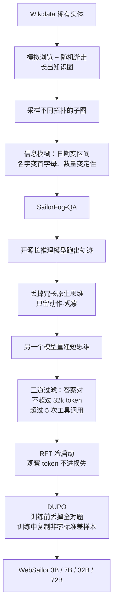
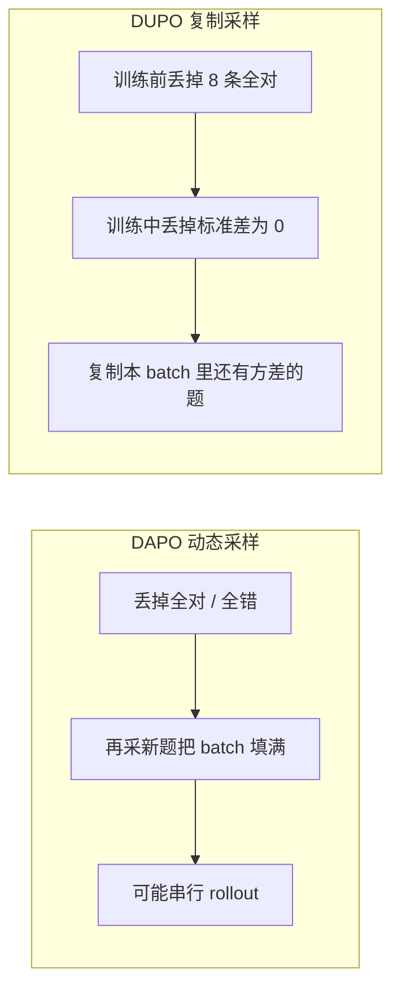

# WebSailor：开源 web agent 在 BrowseComp 上近乎零分，缺的不是搜索框，是从没练过「难降的不确定性」

<!-- release-date: 2025-07-03 -->

> 本文依据 Tongyi Lab, Alibaba Group 发布的 **WebSailor: Navigating Super-human Reasoning for Web Agent**，即 arXiv:2507.02592v1、2025-07-03 提交、共 23 页的预印本。封面右上角印着 2025-07-04，那不是首发日。页边水印是 `arXiv:2507.02592v1 [cs.CL] 3 Jul 2025`。共同一作（Equal Core Contributors）是 Kuan Li、Zhongwang Zhang、Huifeng Yin、Liwen Zhang、Litu Ou；其中前三位是项目负责人；通讯作者是 Huifeng Yin、Yong Jiang（PDF p. 1）。按主要归属方，本站放在 Alibaba 目录。下文括号中的 `PDF p. N` 均指这份 23 页原件的文件页码。
>
> **版本说明**：截至 2026-09-10 核验，[arXiv:2507.02592](https://arxiv.org/abs/2507.02592) 只有 v1，与本地 `papers/Alibaba/WebSailor.pdf` 一致，未替换原件。封面给出的代码仓是 <https://github.com/Alibaba-NLP/WebAgent>。仓库后来并入 Tongyi DeepResearch、后出的 WebSailor-V2 分数和权重发布日，**都不是本 PDF 的内容**，文末单独标成外部补充。
>
> 这是一篇 **web agent 后训练方法** 论文，没有基座架构和预训练 recipe 可讲。它讲的是：闭源浏览系统能在 BrowseComp 这类极难信息检索基准上拿到「超人类」分数，开源几乎是零，差距不在会不会调搜索，而在有没有学会在广阔、无预设路径的信息图景里**系统性地降低极端不确定性**。全文把三件事分开写：**论文明确写了什么**（带页码）、**本文如何解释它**（凡属推算、换算或从图上读数都会写明）、**外部资料补充**（会给出链接并标注）。

## 读之前需要的最少背景

这篇论文假设你已经知道「让大模型一边想、一边调工具去网上找答案」大概长什么样。不熟的话，先记住下面这些。

**ReAct（Reasoning and Acting，推理与行动）** 是一种把模型输出拆成「先想、再动手、再看环境回什么」的循环（PDF p. 3，引 Yao et al., 2023）。每一轮先写一段 **Thought（思维）**，再发出一个可解析的 **Action（动作）**，环境返回 **Observation（观察）**。本篇的动作空间只有三种：搜索、访问网页、交最终答案。

**信息检索 agent** 在这里不是「打开浏览器点按钮」，而是：用搜索引擎拿到标题、摘要和链接，再按自己定的目标去读网页摘要。论文把它和多跳问答分开：HotpotQA 一类题每一步该搜什么几乎是清楚的；BrowseComp 把人丢进一片没有预设路线的信息海里（PDF p. 3）。

**BrowseComp-en / BrowseComp-zh** 是 OpenAI 和后续中文版提出的浏览基准，专门考「网上很难找、条件又缠在一起」的题（PDF p. 7–8）。论文把它当作 Level 3 的试金石。作者口中的 **super-human / superhuman（超人类）** 是对闭源系统在这类基准上表现的定性说法，后文会把它收回到「他们实际测了什么」。

后文还会反复出现三个训练词：

- **RFT（Rejection Sampling Fine-Tuning，拒绝采样微调）**：先让更强的模型把题做对，只留下合格轨迹，再拿这些轨迹做监督微调。本篇用它当 **cold start（冷启动）**，不是 2023 年那篇数学 RFT 的复刻。
- **GRPO（Group Relative Policy Optimization，组相对策略优化）**：同一道题采一组回答，用组内相对好坏当优势。出处见本站 [DeepSeekMath](/reports/DeepSeek/DeepSeekMath)。本篇写成 GPRO，引用的仍是 Shao et al., 2024，按上下文就是 GRPO。
- **DAPO（Decoupled Clip and Dynamic sAmpling Policy Optimization，解耦裁剪与动态采样策略优化）**：在 GRPO 上加了动态采样、token 级损失和更宽的 clip 上界。出处见本站 [DAPO](/reports/ByteDance/DAPO)。本篇的 **DUPO（Duplicating Sampling Policy Optimization，复制采样策略优化）** 是对着 DAPO 的动态采样改的。

基座一律是 **Qwen-2.5** 的 3B / 7B / 32B / 72B（PDF p. 7）。论文没有改注意力、也没有改混合专家，不要把它读成一篇 Qwen 结构报告。

## 先划清切面，避免和同系列读串

通义后来把 WebWalker、WebDancer、WebSailor 放进同一个 WebAgent 仓库。本站索引给本篇的口号是「高不确定性 web agent 的数据合成与 RL」。切面不同。这些对照是本文的读法，不是 WebSailor 原文。

| 工作 | 它在本 PDF 里是什么 | 不要读成什么 |
|---|---|---|
| WebWalker | 相关工作里的网页遍历基准（PDF p. 13、22） | 不是本篇的方法，也不是本篇的实验 |
| WebDancer | Table 1 的开源 ReAct 基线（PDF p. 9） | 不是本篇的数据合成，也不是 DUPO |
| WebSailor（本篇） | 高不确定性造题 + 短思维重建 + RFT 冷启动 + DUPO | 不是 Qwen 结构论文 |
| WebSailor-V2 / Tongyi DeepResearch | 本 PDF 没有 | 论文之后的后作，文末才说 |

不要把 GitHub README 后加的权重发布日、WebSailor-V2 的 BrowseComp 分数、Tongyi DeepResearch 的 HLE 分数写成这篇 Table 1。那些是论文之后的仓库演化。

## 一句话先说清

这篇论文要解决的矛盾可以这样说：

> **闭源浏览系统能在 BrowseComp 上拿到几十的分数，开源几乎是零。现有开源训练几乎只见过 Level 1 和 Level 2：要么一搜就中，要么多跳但路线清楚。真正把人难住的是 Level 3——初始不确定性极高，而且没有一条可以预先写好的降不确定路径。**

论文对这个局面的描述很直接（PDF p. 2）。人在网上找东西受限于有限记忆、脆弱注意力、不能并行探多条路。Deep Research 一类闭源系统表明，大模型 agent 可以越过这些限制。开源这边，Fig. 1 里现有模型和 web agent 在 BrowseComp-en 上接近零分（PDF p. 1–2）。

作者的假说只有一句，但这句是全文的脊梁（PDF p. 1）：

> 闭源系统成功的关键，是一种开源模型里缺的推理模式：**在广阔信息图景里系统性地降低极端不确定性。**

所以他们做的不是再包一层搜索工具，而是一条完整的后训练流水线（PDF p. 1–3）：

1. 用结构化采样加信息模糊，造出高不确定性题，名叫 **SailorFog-QA**。
2. 让开源长推理模型跑出成功轨迹，但**丢掉它原来的长篇思维**，再重建成短、对着动作的思维。
3. 用少量高质量轨迹做 RFT 冷启动。
4. 再用 DUPO 做 agent 强化学习。

摘要把结果写成：显著超过所有开源 agent，并与闭源系统的能力缺口收窄（PDF p. 1）。这句话容易读成「已经打平 DeepResearch」。正文更具体：BrowseComp-zh 上 WebSailor-72B 与 Doubao 持平量级，DeepResearch 仍明显领先（PDF p. 10）。后文会把 Table 1 和 Fig. 1 对上。

## 全景：先造糊题，再改思维，再冷启动，再 RL

先把论文第 3、4 节落到一张图上。这是机制示意，不是实测时间轴。

这是根据 PDF p. 3–7 的第 3、4 节重画的**机制示意图**。箭头表示数据与训练流向，不表示墙钟时间。论文没有另画一张端到端系统图。

这条流水线要记住的不是名词堆叠，而是因果顺序：

**题太清楚 → 模型只会走直线；思维太长太有风格 → 学生学不会自己探；奖励太稀 → 直接 RL 起不来；agent rollout 太慢 → 普通动态采样会把训练拖死。** 四段各自堵一截。

## 旧问题：开源训练一直在 Level 1 和 Level 2 里打转

### 论文怎么给任务分级

第 3.1 节按两个轴给信息检索题分级：初始不确定性有多高，以及把不确定性降下来有多难（PDF p. 3–4，Figure 2）。

| 级别 | 不确定性 | 怎么降 | 论文给的例子 |
|---|---|---|---|
| Level 1 | 低，而且容易降 | 靠参数知识，或一次直球搜索 | 2004 年谁拿了 Richard Dawkins Award；1986 年人民力量革命最突出的人物是谁 |
| Level 2 | 初始可以很高，但路径清楚 | 按固定逻辑多跳 | 阿里现任 CEO 母校出来的中科院第一位院士是谁；2004 奥运会金牌最多的美国运动员家乡在哪个州 |
| Level 3 | 又高又难降 | 实体缠在一起，没有预定义路线，要创造性探索 | 本篇要造的题 |

Figure 2 把 Level 1 画成散点里一个实体，Level 2 画成一条短链，Level 3 先采样子图再「Fuzz」成几团模糊条件（PDF p. 4）。这是示意图，不是某张真实知识图的统计。

Level 2 看起来已经很难，但论文认为它仍有一条「按图索骥」的降不确定路径。BrowseComp 不是这种题。它把 agent 丢进无结构的信息空间，蛮力搜索可能要上千次工具调用，会撑爆上下文。成功靠的是自适应策略：综合半成品信息、剪掉没希望的枝、把分散事实收敛到一个解。把组合爆炸压成几十步，需要一条真正的思维链（PDF p. 3）。

这就是作者说的「超人类推理模式」在操作上的意思：**不是智商测验，而是在组合空间里做战略导航和综合。**

### 本文怎么理解这三级

可以把找人想成三种问法。

Level 1：「这个人的维基百科页是谁？」一搜就中。

Level 2：「A 的老师的老师是谁？」步数可以多，但每一步的实体是清楚的，你知道下一跳该搜什么。

Level 3：「有一个住在地图窟窿里、造过太阳能冰箱、记得爱丁堡开发者大会、还喜欢探洞的软件开发者，1980 年代和他父亲一起买的第一台电脑是什么型号？」出发点本身就是糊的。你必须先用几条彼此独立的线索交叉定位这个人，再去找那台电脑。附录 A.5 的 BrowseComp-en 案例正是这种题，答案是 Atari 130XE，主人公是 Joey Hess（PDF p. 15–19）。

开源训练如果只喂 Level 1 / 2，模型会学会「按槽位填搜索词」，学不会「先判断自己还缺哪一块不确定性」。这是论文认为开源在 BrowseComp 上崩掉的原因（PDF p. 2）。

## 问题定义：同一套 ReAct，动作只有搜索和访问

第 2 节把框架钉死为 ReAct（PDF p. 3）。论文这里出现了一个没有再解释的名字 **Web TraverseX**：动作空间是交最终答案，外加 `search` 和 `visit`。后文工具细节在附录 A.1。本文把它读成本套实验用的浏览环境，不把它当成另一篇系统论文。

一条 $T$ 轮轨迹写成（PDF p. 3，式 1）：

$$
H_T=(\tau_0,a_0,o_0,\ldots,\tau_i,a_i,o_i,\ldots,\tau_T,a_T)
$$

$\tau_i$、$a_i$、$o_i$ 分别是第 $i$ 轮的思维、动作、观察。最后一轮是交答案，所以式子以 $a_T$ 结尾，没有 $o_T$。第 $t$ 步的思维和动作来自策略 $\pi(a,t\mid H_{t-1})$。

两个工具的具体行为在附录（PDF p. 14）：

- **search**：走 Google。一次可以带多条 query，每条返回 top-10，每条结果是标题、摘要、URL。
- **visit**：一次可以带多个网页，每个网页带自己的 **goal（访问目标）**。先用 Jina 拉全文，再用 **Qwen-2.5-72B** 按 goal 做摘要。

实现走 Qwen-Agent，工具调用上限 30 次（PDF p. 14）。30 这个数字后面会在 Figure 3 的横轴上再出现：直方图画到 30，很可能是被这个上限截断的。

**可迁移的部分。** 工具集刻意很小。难的不是「再加一个浏览器点击」，而是在只有搜索和阅读的条件下，学会自己决定下一步降低哪一块不确定性。若自己的项目一上来就堆十几种工具，先问一句：现有工具是不是已经够，缺的其实是任务难度和轨迹质量。

## 核心设计一：SailorFog-QA，用图结构把题造糊

### 旧问题

Level 3 很难手写。你一旦把实体关系写清楚，它就退化成 Level 2。论文要的是「涌现出来的、事先说不清路线」的结构（PDF p. 4）。

### 新设计：先长图，再采样，再模糊

造题分两步（PDF p. 4–5，附录 A.2）。

**第一步，为「难降的不确定性」铺结构。** 从 Wikidata 的 SPARQL 服务按规则取出稀有实体，保证起点就不好搜。用模拟浏览从网上抓非结构化文本和特征，抽出相关实体和关系，作为初始节点和边。然后迭代扩展：按概率选已有节点，去连新的、不同的实体。随机性用来避免长成 Level 2 那种直线链，倾向长成密、交叉、重叠的图。

附录把循环写得更具体（PDF p. 14）：

1. SPARQL 取稀有实体。
2. 用 search / visit 拿初始节点特征，把它当扩展节点。
3. 按特征找相关实体，再拿它们的特征。
4. 以一定概率，要么把新实体当下一个扩展点，要么回到之前的某个节点。
5. 重复 3、4，直到边数到预设值。

论文没有公布图的规模、边数阈值、每张图采多少题。这些是未公开细节。

**第二步，子图采样加信息模糊。** 从这些图上采不同拓扑的子图，每个子图是一簇缠在一起的实体和关系，据此出题和答案。关键一刀是 **information obfuscation（信息模糊）**：不把清楚事实直接写进题面。论文给的变换包括（PDF p. 5）：

- 精确日期变成模糊时段，例如 `in the early 2010s`；
- 名字部分遮住，例如 `an institution founded by someone with the initial 'F'`；
- 定量属性变成定性描述，例如 `a market share of less than 1%`。

模糊直接抬高**初始**不确定性，逼 agent 去比较和综合，而不是查表。

这套合成数据叫 **SailorFog-QA**。论文列了三条好处（PDF p. 5）：接地真实互联网；不同子图拓扑会逼出多步、组合、比较等一谱推理；子图数量随图变大非线性增长，所以可扩。

### 糊到什么程度

正文给了两道生成题（PDF p. 5）。第一道把「五世纪中叶去世的晚期古代作者」和「一份重建环境条件的科学年表的最后一年」缠在一起，答案是 `Estimated Tree-Ring Chronology: 300-450 A.D.`。第二道把南美首都、歌词作者的地方荣誉、哥伦比亚西部艺术院校缠在一起，答案是 `the Rue de Rivoli`。

作者还写：人工评估确认，这类题在通常时间约束下（例如两小时内）对人类研究者是 intractable 的，因为没有清楚的搜索起点，需要大量非线性探索（PDF p. 5）。这是全文里最接近「超人类」的可操作定义：**不是模型分数超过人类平均，而是这些合成题在两小时内人手做不完。** 样本量和出题人是谁，论文没写。

有些生成题难到闭源 o3 也要最多 40 次工具调用才能解（PDF p. 2）。40 高于他们自己推理时的 30 次上限，说明教师模型解这些题时，调用次数可以超过学生侧的硬顶。

### 和 BrowseComp、WebDancer 训练集比难度

Figure 3 用工具调用次数当难度代理，画的是拒绝采样之后、最终过滤之前、答案正确的专家轨迹（PDF p. 10）。

- WebDancer 训练集严重偏简单：超过 50% 的轨迹只要两次工具调用，几乎没有超过十次的。
- SailorFog-QA 是长尾：相当一部分超过五次，可以拉到二十次以上。
- 这个分布更接近 BrowseComp-en 本身的复杂度轮廓。

Table 2 给出过滤前的 pass@1，教师模型带着浏览工具和 ReAct（PDF p. 10）：

| 模型 | SailorFog-QA | WebDancer-QA | BrowseComp-en |
|---|---:|---:|---:|
| o4-mini | 47.3 | 90.2 | 26.3 |
| DeepSeek-R1 | 38.9 | 84.4 | 9.5 |

合成题比 WebDancer 训练集难一截，但仍比 BrowseComp-en 容易。论文提醒：BrowseComp-en 本身会滤掉简单题。他们还承认，低准确率不全是因为难，也因为条件交叉后不一定只有唯一答案，这点和 BrowseComp-en 类似。他们能保证的是：**答案总满足题面约束**，不是「全网只有这一个解」（PDF p. 10–11）。

**可迁移的部分。** 想训难检索 agent，先看训练集的工具调用分布像不像目标基准。若一半样本两步就结束，RL 再巧也只是在 Level 2 里打转。模糊是比「再加两跳」更狠的一刀：它破坏的是可检索的表面槽位，逼模型改用交叉验证。代价是答案唯一性会变差，必须另有一条「答案满足约束」的底线，不能假装每道题都有金标唯一解。

## 核心设计二：专家轨迹只借手脚，不借文风

### 旧问题

有了难题，还要有监督轨迹。开源长推理模型如 QwQ-32B、DeepSeek-R1 能做对一部分，但直接拿它们的全文微调有两个坑（PDF p. 5）：

- **Stylistic Contamination（风格污染）**：这些模型的思维又长又有强烈文风。照着学，会把学生的探索策略规定死，泛化变差。
- **Context Overload（上下文过载）**：几十次工具调用再叠上冗长思维，历史会撑爆窗口，性能掉、可读性也差。

这和「蒸馏一个 R1 风格的思考者」正好相反。本篇要的不是更长的 `<think>`，而是能在长程浏览里活下来的短思维。

### 新设计：丢掉原生思维，按动作重建短 CoT

流程是（PDF p. 6）：

1. 提示一个开源专家 LRM 生成完整解题轨迹，包括它自己的思维。
2. 丢掉这些原生思维，只留成功的动作–观察序列 $(a_0,o_0,a_1,o_1,\ldots)$。这条痕迹是「做了什么」，不是「为什么」。
3. 另找一个强指令模型 $\pi^*$，为每一步生成新的思维 $\hat{\tau}_t$，作为采取 $a_t$ 的简洁、合乎逻辑的辩护：

$$
\hat{\tau}_t\sim\pi^*(\tau\mid H_{t-1},a_t,o_t)
$$

注意条件里有 $o_t$。也就是说，重建思维时**已经看见这一步的观察**。论文把它写成 justification（辩护），并强制 **short-CoT（短思维链）** 风格（PDF p. 6）。

### 本文怎么理解这一刀

这不是普通行为克隆。普通克隆会把教师的长篇独白一起学走。这里把「路」和「解说词」拆开：路来自能做对题的专家，解说词来自另一个被要求写短的模型。

它也不是纯在线推理的示范。因为 $\hat{\tau}_t$ 看见了 $o_t$，学生学到的是「事后也能说圆」的短理由，不一定是「行动前只能看见 $H_{t-1}$」时会想的话。论文没有讨论这层事后信息。本文把它标成解释，不当成论文自己的声明。

收益是可扩展地造出干净、对着目标的推理轨迹，不必继承教师的啰嗦和文风（PDF p. 6）。代价是监督信号比真正的因果思维更「全知」一点；若学生后来在 RL 里必须先想后看，冷启动学到的说话方式可能偏乐观。

**可迁移的部分。** 长程工具轨迹里，教师的思维往往是最贵、最脏的部分。可以只克隆成功的工具序列，再单独写短理由。若你的学生上下文只有 32k，而教师动辄写满窗口，这一刀比换一个更强的教师更先该做。

## 核心设计三：RFT 冷启动，不是可选项

### 旧问题

当时有一批工作主张跳过 SFT，直接 RL（PDF p. 2，引 DeepSeek-R1、Chen et al., 2025、Open-Reasoner-Zero）。对本篇这种任务，作者认为不行，理由有两条（PDF p. 2–3、6）：

1. 这类场景的 RL 奖励极度稀疏，一开始经常是接近零的反馈。
2. 他们并不重度依赖蒸馏；只要刚超过 2k 条高质量例子做最小冷启动，就有效。

第二句很重要：冷启动的卖点不是「蒸馏得越像越好」，而是「用很少的合格轨迹，先把工具格式和长程骨架立住」。

### 新设计：三道过滤 + 观察不进损失

轨迹格式用特殊标记切开（PDF p. 6）：思维在 `<think>` 里，动作在 `<tool_call>` 或 `<answer>` 里，环境观察在 `<tool_response>` 里。

三道过滤（PDF p. 6）：

1. 只要最终答案正确的轨迹，保证监督信号对。
2. 丢掉超过 32k token 的轨迹。专家的长上下文能力强于学生策略，超长轨迹学生吃不下。
3. 只留工具调用超过 5 次的轨迹。复杂推理和规划通常出现在更长的决策序列里。

训练目标只加强思维和动作。观察对应的 token **从损失里 mask 掉**（PDF p. 6，引 FireAct）。这一点后面 DUPO 会再做一次。

超参在附录 A.4（PDF p. 15）：SFT 用 Megatron，batch 32，学习率 $5\times 10^{-6}$，下限 $1\times 10^{-10}$，warmup 加余弦，weight decay 0.1。论文把这一段叫 RFT，实现上就是带拒绝采样的 SFT。

### 没有冷启动会怎样

Figure 6 把「Qwen-2.5-instruct-32B 直接 RL」和「先 RFT 再 RL」画在一起（PDF p. 12）。论文的定性结论是：

- 直接 RL 的 Pass@1 **增幅**更大，但收敛后的绝对水平明显更差。
- 冷启动模型的工具调用次数在整个 RL 过程中又高又稳；直接 RL 的调用次数虽然在涨，但一直低一截，说明没掌握长程推理。
- 这个差距在 BrowseComp-en 上比 GAIA 上更宽。作者的解释：没有 RFT，模型很难只靠自我探索，就把通常只存在于强 LRM 里的复杂推理模式摸出来（PDF p. 12）。

图上有断轴，柱高没有逐点标注。本文不从图上读绝对分数，只转述正文的比较方向。

**可迁移的部分。** 「跳过 SFT」在数学短答题上也许成立，因为对错信号密、一步就能验。多轮工具、几十步才见分的任务，冷启动先解决的是**格式和骨架**，不是把教师的智力全搬过来。2k 量级、超过 5 次调用、短于学生上下文，这三条过滤本身就可以当一条数据门禁。

## 核心设计四：DUPO，用复制代替再采一轮

### 旧问题

Agent 的 RL 和普通推理 RL 的最大差别：rollout 是多轮的，还要等工具返回（PDF p. 7）。于是 agent RL 比标准 RL 慢得多。

DAPO 的动态采样会丢掉整组全对或全错的题，再用新题把 batch 填满。这对数据筛选有效，但同一 batch 里可能要对不同题做**串行**额外 rollout，把已经很慢的 agent 训练再拖慢一截（PDF p. 7）。

### 新设计：训练前丢掉太简单的，训练中复制有方差的

DUPO 的两处动态采样（PDF p. 7）：

1. **训练前**：丢掉过简单的题，定义为 8 条 rollout 全对。
2. **训练中**：不用 padding 把 batch 撑满，而是从同一 batch 里标准差非零的样本里复制。

作者说，相对 DAPO 的动态采样，这样大约 **2–3 倍**加速（PDF p. 7）。论文没有给出墙钟时间表，2–3 倍是正文里的约数。

目标函数沿用 GRPO 的组内相对优势，再加上 DAPO 的 token 级策略梯度损失和更高 clip（PDF p. 7，式 3–4）。先把符号说成人话：$q,y$ 是题和答案，$G$ 是一组里的 rollout 条数，$o_i$ **不是整条轨迹**，只是模型生成的 token；context 才同时包含模型生成和工具返回。$r_{i,t}(\theta)$ 是新旧策略在第 $t$ 个 token 上的重要性比，$\hat{A}_{i,t}$ 是组内标准化后的优势，$\varepsilon_{\mathrm{low}}$ 和 $\varepsilon_{\mathrm{high}}$ 是 clip 的下上界。论文没给出这两个 $\varepsilon$ 的数值。

$$
J(\theta)=\mathbb{E}\left[\frac{1}{\sum_{i=1}^{G}|o_i|}\sum_{i=1}^{G}\sum_{t=1}^{|o_i|}\min\left(r_{i,t}(\theta)\hat{A}_{i,t},\;\mathrm{clip}\left(r_{i,t}(\theta),1-\varepsilon_{\mathrm{low}},1+\varepsilon_{\mathrm{high}}\right)\hat{A}_{i,t}\right)\right]
$$

约束是一组里既不能全对也不能全错。观察同样不进策略损失。组内优势是：

$$
r_{i,t}(\theta)=\frac{\pi_\theta(o_{i,t}\mid \mathrm{context})}{\pi_{\theta_{\mathrm{old}}}(o_{i,t}\mid \mathrm{context})},\qquad
\hat{A}_{i,t}=\frac{R_i-\mathrm{mean}(\{R_i\}_{i=1}^{G})}{\mathrm{std}(\{R_i\}_{i=1}^{G})}
$$

标准差为 0 的题（全对或全错）被拿掉，空出来的槽位随机复制本 batch 里标准差不为 0 的题（PDF p. 7）。约束仍是 $0<|\{o_i:\mathrm{is\_equivalent}(y,o_i)\}|<G$，也就是一组里既不能全对也不能全错。

奖励为了防 **reward hacking（奖励黑客）**，做成规则分（PDF p. 7，式 5）：

$$
R_i=0.1\,R_i^{\mathrm{format}}+0.9\,R_i^{\mathrm{answer}}
$$

格式分检查标签是否包对、顺序是否符合 ReAct。答案分用 LLM 当裁判，判断最终预测对不对。论文没写裁判用的是哪个模型。

RL 超参（PDF p. 15）：一组 8 条，温度 1.0，top-p 1.0，batch 128，mini-batch 32，学习率 $1\times 10^{-6}$。框架是 verl。RL 只跑 50 step，原因放到限制一节。

这是根据 PDF p. 7 重画的**机制对比**，不是实测时间轴。

### 本文怎么理解「复制」

DAPO 要的是「batch 里每道题都有学习信号」，缺了就去环境里再要新题。DUPO 要的是「GPU 别空等」，缺了就用已经 rollout 完、还有正负样本的题再算一遍。

收益是速度。代价有两层，论文没写，本文补成解释：

- 被复制的题在这一 step 的梯度里权重变大。中等难度、碰巧一组里有对有错的题，会比极难的全错题更常被看见。
- 训练前只丢掉全对，没说丢掉全错。全错题若格式分不同，标准差可能不为 0，仍可能留下；若格式分也一样，训练中会被当成标准差 0 丢掉。极难题仍然可能很少进入更新。

所以 DUPO 首先是一条**系统效率**改动，其次才是算法。它没有改优势怎么估，也没有改 clip 的数学含义。

**可迁移的部分。** 多轮工具 RL 的瓶颈经常在「等环境」，不在「算梯度」。若你已经在用 DAPO 动态采样，先问：填 batch 的额外 rollout 是不是把卡空出一截。用本 batch 复制换时间，是可直接试的工程开关。不要把它宣传成一种新的优势估计。

## 实验怎么证明

### 评什么、怎么评

四个主基准（PDF p. 7–8）：

- **BrowseComp-en / zh**：极难浏览。中文版题面是中文。
- **GAIA**：多模态加工具。本篇只用文本验证子集里的 **103** 条。
- **Xbench-DeepSearch**：动态、偏专业标注的深检索。

另在分析里抽了 **SimpleQA** 的 200 条（全集 4,326）看 Level 1 是否掉下来（PDF p. 11）。

基座是 Qwen-2.5-3B / 7B / 32B / 72B，RFT + RL 都做（PDF p. 7）。对比分三拨：直接推理、闭源浏览产品、开源 agent。闭源产品标 $\ddagger$，表示从网页人工评，有的数字来自对应基准论文；缺的格子是成本原因没跑（PDF p. 9）。

指标默认 **pass@k**，主表报 pass@1，温度 0.6、top-p 0.95，对错用 LLM 裁判（PDF p. 8）。较小模型的 BrowseComp 直接推理「基本上是零」，所以直接推理组没放更小的模型。

### Table 1：主结果

数字全部来自 PDF p. 9 的 Table 1，不是 GitHub README。

**直接推理。** 包括 GPT-4.1 在内，BrowseComp-en 多在 0.5–1.5。o4-mini 是这组里 BrowseComp-en 最高的 6.1，DeepSeek-R1 是 BrowseComp-zh 最高的 26.3。作者的读法：光靠参数知识不够；但强推理模型即使不带工具，也更能拆题、降一部分不确定性（PDF p. 8–9）。

**闭源浏览。** DeepResearch 仍是表上的上限：BrowseComp-en 51.5、BrowseComp-zh 42.9、GAIA 67.4。Doubao 在 BrowseComp-zh 是 26.0，Grok-3 是 12.9。GPT-4o 带浏览只有 BrowseComp-en 的 1.9，来自 OpenAI 官方公布（PDF p. 1、9）。Grok-3 和 Doubao 的 Xbench 写成 `50+`，不是精确值。

**开源 agent。** 最强开源基线是 WebDancer-QwQ：BrowseComp-en 3.8、zh 18.0、Xbench 39.0、GAIA 51.5。WebSailor 四个尺寸都超过同表开源行：

| 模型 | BrowseComp-en | BrowseComp-zh | Xbench-DeepSearch | GAIA |
|---|---:|---:|---:|---:|
| WebSailor-3B | 3.3 | 9.7 | 27.7 | 33.0 |
| WebSailor-7B | 6.7 | 14.2 | 34.3 | 37.9 |
| WebSailor-32B | 10.5 | 25.5 | 53.3 | 53.2 |
| WebSailor-72B | 12.0 | 30.1 | 55.0 | 55.4 |

作者特别强调规模不是主因：WebSailor-7B 的 BrowseComp-en 6.7，已经超过建在 32B 上的 WebDancer-32B（2.5）和 WebThinker-RL（2.8）（PDF p. 9）。3B 的 3.3 也已经接近 WebDancer-QwQ 的 3.8。

GAIA 上领先幅度更小。人工检查后的解释：GAIA 有相当一部分要数学和计算，WebSailor 没针对这些优化；在纯信息检索子集上仍然很高（PDF p. 9）。论文没有给出这个子集的单独分数。

### Fig. 1 和 Table 1 不是同一张对比表

封面 Fig. 1 是精选柱，不是 Table 1 的全量拷贝（PDF p. 1）。两边对齐的有：WebSailor-72B / 32B 的 12.0、10.5 和 30.1、25.5，WebDancer-QwQ 的 3.8 / 18.0，DeepSeek-R1 直接推理的 2.0，GPT-4o 带浏览的 1.9，Doubao 的 26.0，Grok-3 的 12.9。

Fig. 1 多出来、Table 1 没有的柱，需要单独记：

- **DeepSeek-R1-Browse** 在 BrowseComp-en 上是 9.5。图注写明：这是 DeepSeek-R1 套上与 WebSailor 相同的 ReAct 浏览实现（PDF p. 1）。Table 2 里 DeepSeek-R1 在 BrowseComp-en 上的 9.5 与它一致（PDF p. 10）。也就是说，同一套工具下，72B 的 WebSailor 12.0 只比 R1-Browse 高 2.5 分；32B 的 10.5 也略高。
- BrowseComp-zh 上 Fig. 1 还有 WebThinker-QwQ 14.7、Search-o1-32B 7.2。Table 1 对应行是 WebThinker-RL 7.3、Qwen-2.5-32B Search-o1 2.4，对不上。本文把它们当成 **Fig. 1 自己的柱**，不强行并进 Table 1。

### 「打平闭源」到底打平了谁

正文最重的那句是：BrowseComp-zh 上 WebSailor-72B 与 Doubao 持平量级；DeepResearch 仍领先；这被写成开源模型靠数据合成和 DUPO，可以被抬到过去只属于闭源系统的能力台阶（PDF p. 10）。

把数字摊开，这句话有明确边界：

- **支持的**：BrowseComp-zh 上 30.1 超过 Doubao 26.0 和 Grok-3 12.9；Xbench 上 55.0 对上闭源的 `50+`。
- **不支持的**：BrowseComp-en 上 12.0 对 DeepResearch 51.5 仍是四倍差距；GAIA 上 55.4 对 67.4 也没打平。摘要里的 matching proprietary agents 不能读成已经追上 DeepResearch。

「开源新 SOTA」这一句，在 Table 1 的开源行里是成立的。

### 下向兼容：只训难题，简单题没有崩

WebSailor 只在高难度数据上训练。BrowseComp、GAIA、Xbench 被作者算成 Level 2 或 3。为了看 Level 1 会不会被训坏，他们在 SimpleQA 的 200 条子集上评（PDF p. 11，Figure 4）。图上标注的 pass@1 是：

| 系统 | SimpleQA pass@1 |
|---|---:|
| WebSailor-72B | 93.5 |
| WebSailor-32B | 92.8 |
| WebDancer-QwQ | 90.5 |
| WebDancer-32B | 87.5 |
| WebThinker-rl | 77.5 |
| DeepSeek-R1-ReAct | 72.2 |
| r1-searcher-7b | 52.0 |
| GPT-4.1 | 41.6 |
| GPT-4o | 38.2 |
| DeepSeek-R1 | 27.8 |
| o4-mini | 20.0 |
| Qwen-2.5-72B | 15.8 |
| QwQ-32B | 12.7 |
| Qwen-2.5-32B | 9.0 |

几乎所有 agent 方法都高于直接答题。WebSailor 最高。注意这是 200 条随机子集，不是 4,326 条全集，不能直接当官方 SimpleQA 榜。

### RL 相对冷启动：Pass@1 比 Pass@3 涨得更狠

Figure 5 比较 RFT 之后、再加 RL 的 Pass@1 / Pass@3（PDF p. 11）。图上只标了 RL 相对 RFT 的增量，没有标 RFT 柱的绝对高度。增量是：

| | 32B Pass@1 | 32B Pass@3 | 72B Pass@1 | 72B Pass@3 |
|---|---:|---:|---:|---:|
| BrowseComp-en | +3.3 | +2.2 | +3.7 | +3.4 |
| BrowseComp-zh | +6.3 | +6.5 | +8.3 | +4.9 |
| GAIA | +6.6 | +4.7 | +3.0 | +3.6 |
| XBench | +7.6 | +8.0 | +3.7 | +2.0 |

作者的读法（PDF p. 11–12）：RL 在所有基准上都涨，最难的 BrowseComp 上最明显。BrowseComp 轨迹又长又绕，稳定复现很难，所以 Pass@1 和 Pass@3 一开始就差得大。RL 强化成功策略、剪掉无效探索，稳定性上升。而且 Pass@1 的相对提升大于 Pass@3，说明样本效率在涨：单次采样就更接近自己的上限。

若 Table 1 的 32B / 72B 就是 RL 之后的 Pass@1，用增量反推 RFT 柱大约是：BrowseComp-en 7.2 / 8.3，BrowseComp-zh 19.2 / 21.8，GAIA 46.6 / 52.4，Xbench 45.7 / 51.3。这是本文的减法，不是论文另给的表。Pass@3 的绝对值图上没标，不算。

## 限制：32k、想太多、同步 RL 只有 50 step

第 5.4 节写了三条，都不含糊（PDF p. 12）。

**上下文被 32k 截断。** 过滤训练轨迹到 32k 是实用选择，但可能封死更难的题。失败案例分析里，很多错来自超出上下文；推理变长时性能会掉。论文没有给出失败案例的统计表。

**Over-thinking（想太多）。** 简单题也会走多步工具。作者不把它写成纯粹缺点：定性看，很多时候不是无目的乱逛，而是在交叉验证，用不同来源确认第一眼的发现。这和 SimpleQA 上仍然最高是同一件事的两面。

**RL 只跑了 50 step。** 主因是同步 RL 框架本身慢。DUPO 优化之后，速度仍是瓶颈。未来要迁到异步训练，才能做更长的 RL（PDF p. 12）。50 这个数字没有学习曲线表配套，Figure 6 的横轴也只画到三十出头的 step，和「50」如何对应，论文没解释。

结论里他们把下一步写成两件事：继续定义更高不确定性的更复杂任务，以及把 RL 做更有效、更快。目标不只是信息检索，而是更多维度上的一般「超人类」表现（PDF p. 13）。这是展望，不是实验结果。

## 最值得带回自己项目的启发

### 1. 先给任务分级，再决定要不要上 RL

本篇最硬的一跳不是 DUPO，是 Figure 2 的三级。若你的训练题都能写成「先搜 A，再搜 A 的 B」，你在训 Level 2。BrowseComp 这类基准考的是 Level 3。优化器换不来没见过的问题结构。

### 2. 模糊比加跳数更接近真实检索

多跳只是把槽位串长。把日期、名字、数量改成区间和定性描述，才破坏「直接当关键词搜」这条捷径。自己造数据时，可以先保留图结构正确，再单独做一层模糊；同时必须接受答案可能不唯一，用「满足约束」而不是「全网唯一」当金标。

### 3. 专家轨迹只借成功的手，不借成功的嘴

长推理模型能做对，不代表它的思维适合当监督。丢掉原生 `<think>`、强制短 CoT、观察不进损失，这三件可以一起搬。注意本篇重建思维时看见了 $o_t$，若你要更干净的因果监督，可以改成只条件在 $H_{t-1}$ 和 $a_t$ 上，这是本篇没做的变体。

### 4. 稀疏奖励的长程 agent，冷启动先立骨架

「跳过 SFT」不是普遍真理。工具格式、ReAct 标签、超过五步的决策骨架，用刚超过 2k 条合格轨迹就能立住。直接 RL 在 Figure 6 上的教训很具体：工具调用次数涨不上去，BrowseComp 就没戏。

### 5. agent RL 的第一瓶颈常常是等工具，不是 advantage 公式

DUPO 几乎没改 GRPO 的数学，改的是「batch 空了怎么办」。复制本 batch 有方差的题，换来 2–3 倍速度。这是可直接插进 DAPO / verl 流水线的开关。同步框架 50 step 就停，说明算法论文里的 step 数经常是系统约束，不是最优训练长度。

### 6. 只训难题，简单题可以靠下向兼容，但要防想太多

SimpleQA 子集上 WebSailor 仍然最高，说明 Level 3 训练没有把 Level 1 毁掉。代价是简单题也会多走几步。若线上延迟敏感，需要另加「什么时候该停」的约束；本篇没有做这层。

### 7. 不要用摘要里的 matching 代替表上的分母

开源 SOTA、打平 Doubao、仍落后 DeepResearch，三句话要一起记。否则会把 12.0 对 51.5 读成能力缺口已经合上。

## 关键词回看

- **极端不确定性**：初始条件糊，而且没有预定义的降不确定路径。
- **Level 1 / 2 / 3**：按「有多糊」和「糊得有多难解开」分的三档信息检索题。
- **SailorFog-QA**：随机游走知识图 + 子图采样 + 信息模糊得到的合成题。
- **信息模糊**：把精确事实改成区间、首字母、定性描述。
- **ReAct**：思维–动作–观察循环；本篇动作只有 search、visit、交答案。
- **search / visit**：Google top-10；Jina 拉全文再由 Qwen-2.5-72B 按 goal 摘要。
- **风格污染 / 上下文过载**：直接克隆长推理模型思维的两个副作用。
- **短 CoT 重建**：丢掉专家思维，另用指令模型按动作和观察写短理由。
- **RFT 冷启动**：拒绝采样后的少量 SFT，立工具格式和长程骨架。
- **观察 mask**：工具返回不进损失，只训思维和动作。
- **DUPO**：训练前丢掉全对题，训练中复制非零标准差样本，加速 agent RL。
- **格式分 0.1 + 答案分 0.9**：规则奖励，答案由 LLM 裁判。
- **pass@1 / pass@3**：非零温度下的一次成功率和三次里至少一次。
- **下向兼容**：只训 Level 3，Level 1 上仍然强。
- **超人类**：作者对闭源系统和本方法的定性说法；可核对的证据是 BrowseComp 分数，以及合成题两小时内人手做不完。

## 最后的判断

WebSailor 最值得记住的，不是又一个叫 DUPO 的缩写，而是它把开源 web agent 的失败写成一件很具体的事：**训练分布里从来没有「难降的不确定性」。**

数据侧用图结构加模糊去造这种题。监督侧把专家的手脚和嘴巴拆开，只留短理由。训练侧承认稀疏奖励下冷启动不可省，再把 DAPO 的动态采样改成复制，好让多轮工具 RL 跑得动。实验支持的是：在 Qwen-2.5 系列上，这条流水线把开源 BrowseComp-en/zh 从接近零抬到 12.0 / 30.1，7B 已经超过若干 32B 开源 agent；BrowseComp-zh 进入 Doubao 那一档；简单事实题没有崩。

实验**不支持**的结论包括：已经追上 DeepResearch、GAIA 全量多模态也成立、两小时人类不可解可以外推到 BrowseComp 全员人类评测、以及 DUPO 的 2–3 倍是在固定硬件上测出的墙钟加速比。

如果只记一句话，可以记：

> **训浏览 agent，先问训练题的不确定性够不够脏；工具可以很少，思维必须短，冷启动先立骨架，RL 的第一刀往往砍在等待时间上，而不是又一个 clip 常数。**

## 资料与阅读边界

- 原始依据：本地 `papers/Alibaba/WebSailor.pdf`，arXiv:2507.02592v1，2025-07-03 12:59:07 UTC 提交，23 页。封面内部日期 2025-07-04 不是首发日。官方 GitHub 更新日志把 **2025.07.03** 写成 WebSailor 发布日，与 arXiv 提交日一致，本站取这一天。
- 论文给出的代码仓：[Alibaba-NLP/WebAgent](https://github.com/Alibaba-NLP/WebAgent)。GRPO 的出处：本站 [DeepSeekMath](/reports/DeepSeek/DeepSeekMath)。DAPO 的动态采样、token 级损失和 clip 上界：本站 [DAPO](/reports/ByteDance/DAPO)。RL 训练用的 verl：本站 [HybridFlow](/reports/ByteDance/HybridFlow)。基座规格见本站 [Qwen2.5](/reports/Alibaba/Qwen2.5)。
- 同目录、同实验室的后续 agent 训练系统：本站 [AgentEvolver](/reports/Alibaba/AgentEvolver)。切面不同，不要把自出题三件套写回本篇。

**论文之后发生了什么（外部补充，不是本 PDF）。** 截至 2026-09-10 查看：原仓库 [Alibaba-NLP/WebAgent](https://github.com/Alibaba-NLP/WebAgent) 的内容已挂在 [Alibaba-NLP/DeepResearch](https://github.com/Alibaba-NLP/DeepResearch) 的 `WebAgent/` 目录下。官方更新日志仍把 2025-07-03 记为 WebSailor 论文与方法发布，并写当时登顶 Hugging Face Daily Papers；**WebSailor-3B 权重是 2025-07-11 才放**，7B / 32B 更晚。README 里 WebSailor-72B 的 12.0 / 30.1 / 55.4 与 Table 1 一致，但仓库同时列出 WebDancer、WebShaper、WebWatcher、**WebSailor-V2**（arXiv:2509.13305）以及 Tongyi DeepResearch-30B-A3B 的后作分数。那些数字、双环境模拟器、HLE 成绩都不得写回本篇 Table 1。本 PDF 发表时 72B 权重仍写着 checkpoint is coming soon。
