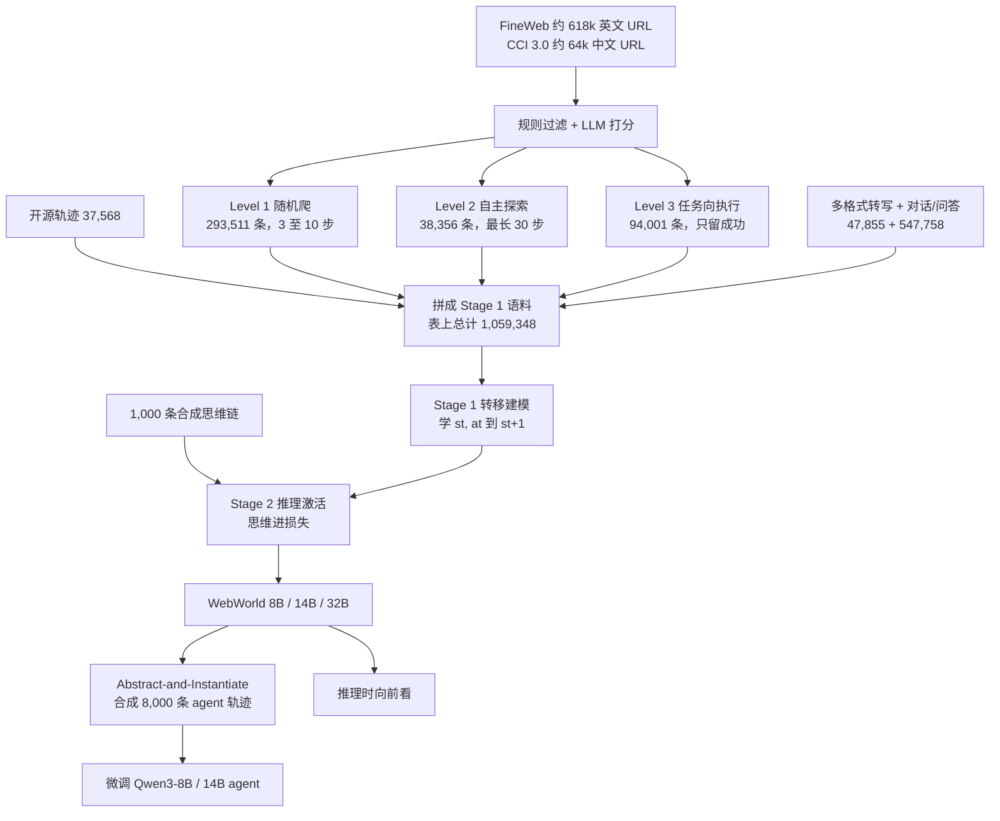

# WebWorld：真网上训 web agent 被延迟、限流和不可逆操作卡住；它把开放网页训成可离线模拟的世界模型

<!-- release-date: 2026-02-16 -->

> 本文依据 Qwen Team, Alibaba Group 与浙江大学发布的 **WebWorld: A Large-Scale World Model for Web Agent Training**，即 arXiv:2602.14721v1、2026-02-16 提交、共 27 页的预印本。封面右上角印着 2026-02-17，那不是首发日。页边水印是 `arXiv:2602.14721v1 [cs.AI] 16 Feb 2026`。一作 Zikai Xiao 同时挂 Qwen 与浙大，脚注写明实习期间在 Qwen 完成；Jianhong Tu、Yuxin Zuo、Zhi Li、Peng Wang、Bowen Yu、Fei Huang、Junyang Lin 挂 Qwen；Zuozhu Liu 挂浙大；Chuhang Zou 封面未标单位。通讯作者是 Bowen Yu、Fei Huang、Zuozhu Liu，给出的邮箱是 `feihu.hf@alibaba-inc.com` 与 `zuozhuliu@intl.zju.edu.cn`（PDF p. 1）。按主要归属方，本站放在 Alibaba 目录。下文括号中的 `PDF p. N` 均指这份 27 页原件的文件页码。
>
> **版本说明**：截至 2026-09-11 核验，[arXiv:2602.14721](https://arxiv.org/abs/2602.14721) 只有 v1，提交时间 2026-02-16 13:06:49 UTC，与本地 `papers/Alibaba/WebWorld.pdf` 一致，未替换原件。封面给出的代码仓是 <https://github.com/QwenLM/WebWorld>。仓库 `created_at` 是 2026-02-13，但第一条带 README 的提交是 2026-02-16 14:47:37 UTC，不早于 arXiv。没有找到更早的官方博客。Hugging Face 仓库的 `createdAt` 按本站规则不用。后出的 Qwen-AgentWorld、ICML 2026 poster 场次和仓库后来改的 README 数字，**都不是本 PDF 的内容**，文末单独标成外部补充。
>
> 这是一篇 **网页世界模型 / 模拟器** 论文，不是新的 Qwen 基座，也没有改注意力或混合专家。它讲的是：web agent 要泛化，需要海量轨迹；真浏览器又慢、又限流、还有不可逆操作。WebWorld 用百万量级开放网页交互，把「下一个页面长什么样」学成一个可离线 rollout 的因果语言模型。全文把三件事分开写：**论文明确写了什么**（带页码）、**本文如何解释它**（凡属推算、换算或从图上读数都会写明）、**外部资料补充**（会给出链接并标注）。

## 读之前需要的最少背景

这篇论文假设你已经知道「让大模型在浏览器里点按钮、填表、跳转，再根据新页面决定下一步」大概长什么样。不熟的话，先记住下面这些。

**世界模型（world model）** 在这里不是生成视频的那类模型。它是一个模拟器：看见当前页面和一步动作，预测下一页。agent 仍负责「下一步点什么」；世界模型负责「点完之后页面变成什么样」。论文把它写成自回归模拟器（PDF p. 4，式 1）。

**A11y Tree（Accessibility Tree，无障碍树）** 是浏览器把页面里可交互控件（按钮、输入框、链接）抽成的层级文本，比原始 HTML 干净。每个节点带角色、可见性和一个 `bid`（browser ID），动作靠这个 ID 落地。本篇用 Playwright，经 BrowserGym 抽取（PDF p. 4、19）。

**轨迹（trajectory）** 是一条完整交互：指令、一串「状态—动作—下一状态」。世界模型的训练目标是：在历史条件下，把下一状态的似然拉高（PDF p. 4，式 2）。

**内在评测 / 外在评测。** 内在评测问的是「模拟器像不像真浏览器」；外在评测问的是「用模拟器造出来的轨迹，能不能把真 agent 训好」。本篇两条都做。内在基准叫 **WebWorld-Bench**；外在基准是 **MiniWob++** 和 **WebArena**（PDF p. 6–8）。

后文还会反复出现三个训练词：

- **分层采集（hierarchical collection）**：随机爬、自主探索、任务向执行，三层难度不同，用来把数据从「铺得开」接到「用得上」。
- **两阶段课程**：先在百万级转移上学会网页动力学，再用 1,000 条带思维链的样本把推理「点亮」。
- **Abstract-and-Instantiate（先抽象再实例化）**：把具体任务糊成功能模式，在模拟器里跑，再写回具体题，用来扩 agent 训练数据。

基座一律是 **Qwen3** 的 8B / 14B / 32B（PDF p. 15）。论文没有改 Qwen3 的结构，不要把它读成一篇 Qwen 架构报告。

## 先划清切面，避免和同系列读串

通义这边已经有 WebSailor，本站索引给本篇的口号是「用网页世界模型当 agent 训练环境」。切面不同。这些对照是本文的读法，不是 WebWorld 原文。

| 工作 | 它在本 PDF 里是什么 | 不要读成什么 |
|---|---|---|
| [WebSailor](/reports/Alibaba/WebSailor) | 本 PDF 没有 | 高不确定性信息检索的后训练；BrowseComp 分数与本篇无关 |
| WebWorld（本篇） | 开放网页上的下一状态预测器，给 agent 当模拟环境 | 不是新的 Qwen 基座，也不是浏览策略本身 |
| Qwen-AgentWorld | 本 PDF 没有 | 2026-06 之后的后作，七个域、千万级轨迹，文末才说 |
| Snowflake Agent-World-Model / ByteDance Agent-World | 本 PDF 没有 | 本站另两篇「合成环境」论文，对象不是开放网页浏览器 |

不要把 GitHub README 后加的权重卡片、Qwen-AgentWorld 的 AgentWorldBench 分数、或 WebSailor 的 BrowseComp 数字写成这篇 Table 3 或 Table 5。那些是别的文章。

## 一句话先说清

这篇论文要解决的矛盾可以这样说：

> **web agent 要泛化，必须在环境里滚大量轨迹。真浏览器做不到：网络延迟、页面加载、反爬和限流会把 rollout 拖死；提交表单、下单一类动作还不可逆。现有网页世界模型又走不通另一头：数据几乎都来自闭沙箱或基准环境，只有几千到一万多条，格式单一，多数只能做单步预测。**

论文对这个局面的描述很直接（PDF p. 2）。经验时代强调持续和环境互动，但网页上放大互动仍然难。于是出现两类权宜：把闭源大模型当场当模拟器提示，或者在 WebArena / WebShop 一类封闭环境里训一个小世界模型。Table 1 把后者的规模写在「约 4K 至 70K」这一档，而且 Open-Web、推理、长程三项往往不能同时打勾（PDF p. 2）。

作者的回答不是再包一层搜索工具，而是把浏览器本身做成可学习的模拟器（PDF p. 1–3）：

1. 从预训练语料的 URL 出发，分层采集开放网页轨迹，宣称训在 1.06M 条上。
2. 用 A11y Tree 做主表示，再转成 HTML / XML / Markdown 等格式，避免过拟合一种语法。
3. 先百万级转移建模，再 1,000 条思维链激活推理。
4. 用这个模拟器合成 agent 轨迹，并做推理时向前看。

摘要把结果写成：内在评测与 Gemini-3-Pro 相当；Qwen3-14B 用合成轨迹微调后 WebArena +9.2%，达到与 GPT-4o 相当；推理时搜索作为世界模型超过 GPT-5（PDF p. 1）。这三句都需要收回表上的分母。后文会把 Table 3、Table 5、Table 6 对上，并标明「1.06M」里有一半以上不是真网页轨迹。

## 全景：先铺网页动力学，再点亮推理，再拿模拟器去训 agent

先把论文第 3 节和第 5 节落到一张图上。这是机制示意，不是实测时间轴。

这是根据 PDF p. 2–8、16 的第 3、5 节和 Table 11 重画的机制示意图。箭头表示数据与训练流向，不表示墙钟时间。论文没有另画一张端到端系统图；封面 Figure 1 是四宫格总览（PDF p. 1）。

这条流水线要记住的不是名词堆叠，而是因果顺序：

**真网太贵太危险 → 必须有模拟器；封闭基准数据太窄 → 模拟器泛化不出去；只会模仿页面文本 → 说不清动作引起了什么；有了模拟器却只拿去搜索 → 增益很小。** 四段各自堵一截。

## 旧问题：提示闭源模型，或在沙箱里训一个小模拟器

### 论文怎么给现有世界模型分档

Table 1 把前作切成两块（PDF p. 2）：

| 类型 | 例子 | 数据 | 论文标的缺口 |
|---|---|---|---|
| API 提示 | UI-Simulator（GPT-4o-mini）、Simia（o4-mini） | 无自有权重，靠提示 | 不可复现、成本高 |
| 训出来的世界模型 | DreamGym 约 14K、WMA 约 14K、Word2World 约 70K、WebEvolver 约 5K、WebSynthesis 约 4K | 几乎都来自 Benchmarks 或 Self-Gen | 多数不是开放网页；格式单一；不少只能单步 |

Open-Web、Reason、Long-Horizon 三列，前作很少同时打勾。WebWorld 把自己写成 8B / 14B / 32B、模型与数据都开、Real-world 1.06M、多格式、三项能力都有（PDF p. 2）。

引言还补了一句机制上的诊断：数据管道不好扩，所以模型泛化差；再叠加封闭环境，轨迹多样性不够，于是被锁在单步预测和受限输入格式上，也点不亮显式推理（PDF p. 2）。

### 本文怎么理解这一档差距

可以把「网页模拟器」想成三种货。

第一种是租闭源模型当场演浏览器。能用，但每次 rollout 都要付 API，也没有可发布的权重。

第二种是在 WebArena 这类事先搭好的站点里学。站点少、任务分布窄，学完容易「会这几个站，不会真互联网」。

第三种是本篇要做的：从预训练语料里的真实 URL 出发，把开放网页的状态转移做成训练数据。卖点不是新结构，而是数据从哪来、覆盖有多宽、模拟能不能拉到几十步。

相关工作把这条路线再写一遍：早期提示，近期改成在封闭环境里训；DreamGym 用 WebArena / WebShop 离线轨迹加 RAG，WMA 用合成任务加探索，WebEvolver 让世界模型和 agent 共进化。WebWorld 的自我定位是：别人还在封闭基准里采数据，它改打开放网页（PDF p. 3–4）。

**可迁移的部分。** 若自己的项目也想「用世界模型代替真环境」，先问数据是不是只覆盖了评测沙箱。沙箱里的下一状态预测，测沙箱会很好看，并不等于能给开放网页的 agent 当教练。

## 问题定义：浏览器是一个条件语言模型

第 3.1 节把浏览器世界写成自回归模拟器。给定指令 $I$ 和历史 $h_t=(s_0,a_0,\ldots,s_t,a_t)$，预测下一状态（PDF p. 4，式 1）：

$$
s_{t+1}\sim P_\theta(\cdot\mid I,h_t)
$$

$P_\theta$ 实例化成因果语言模型，在轨迹 $\tau=(I,s_0,a_0,\ldots,s_T)$ 上做最大似然（PDF p. 4，式 2）：

$$
L(\theta)=-\mathbb{E}_{\tau\sim\mathcal{D}}\sum_{t=0}^{T-1}\log P_\theta(s_{t+1}\mid I,h_t)
$$

这就是全文的训练目标。没有奖励模型，没有 PPO / GRPO。世界模型本身是 **SFT（Supervised Fine-Tuning，监督微调）**。后面拿它去合成 agent 轨迹，agent 侧也是微调，不是强化学习。

泛化策略写在目标后面：URL 直接从预训练语料元数据里抽，让世界模型的训练分布对齐基座已经见过的网页先验（PDF p. 4）。这条「跟着预训练语料走」后来会变成 Level 1 随机爬的理由。

## 核心设计一：三层采集，先铺开再对准任务

### 旧问题

只靠任务向执行，相关性好，但扩不动。现有方法几乎都停在这一层，所以数据集停在约 10k（PDF p. 2、4）。

### 新设计：随机爬、自主探索、任务向执行

数据格式先钉死：主表示是 A11y Tree，用 Playwright API 经 BrowserGym 抽取，理由是跨 web / GUI 通用、信息密度高、对语言模型友好（PDF p. 4）。为防只学会一种语法，事后再转成多种网页表示，并用 LLM 生成自然语言页面描述，细节在附录 G（PDF p. 4、19）。

URL 来源（PDF p. 4）：

- FineWeb，英文，约 618k 个 URL；
- CCI 3.0 的质量过滤子集，中文，约 64k 个 URL；
- 另加一份高流量中英文站点名单（电商、社交、新闻）；
- 任务向那一层：从 Mind2Web 训练集抽种子任务，再用 LLM 生成变体；
- 辅助：把开源 agent 轨迹改写成 $(s_t,a_t,s_{t+1})$，并混入通用指令数据以免丢掉对话能力。

三层采集对应 Figure 1.c（PDF p. 1、4–5）。

**Level 1：随机爬。** 在预训练语料抽出的站点上部署随机爬虫，从当前页的 A11y Tree 里随机抽可执行动作（点击、填表、选下拉框），每个站点跑 3 至 10 步。目标是让训练分布对齐基座的语言先验，把「网页大概长什么样」铺开。这一层产出 293K 条轨迹（PDF p. 4–5）。Table 11 拆成 CCI 3.0 的 57,837 条中文和 FineWeb 子集的 235,674 条英文，合计 293,511 条、22.0G（PDF p. 16）。

**Level 2：自主探索。** 换成 LLM agent，自己给自己出探索目标。提示词被刻意写成四种行为先验（PDF p. 5，附录 N.4）：

1. 自拟任务：从当前页推断一个具体用户意图并执行；
2. 长程依赖：强迫后面的状态依赖前面的动作，专门打「忘上下文、丢 UI 状态」；
3. 复合动作：必须组合 type / select / click，避免只会点导航；
4. 好奇覆盖：系统扫主要栏目和功能。

每条最长 30 步，内容穷尽或碰到步数上限就停。这一层产出 38K 条长程轨迹（PDF p. 5）。Table 11：FineWeb 上 LLM 驱动 36,474 条、高频站点 1,882 条，合计 38,356 条、10.4G（PDF p. 16）。

**Level 3：任务向执行。** 三步造题：LLM 看站点提出可行意图（例如订机票）；对每个种子扰动参数、保持同一站点可执行；再改写措辞。agent 在对应站点执行，只留成功轨迹。这一层产出 94K 条「每一步都对着目标」的执行痕迹（PDF p. 5）。Table 11 记成 Benchmarks (Synthetic) 94,001 条、8.2G，Real-World 这一列是叉（PDF p. 16）。

正文说三层加上 3.4 节的富集，最终 1.06M 条（PDF p. 5）。封面 Figure 1 把三层画成 43.3% / 20.4% / 16.1%（PDF p. 1）。

### 1.06M 到底是什么：条数、体积和「真实网页」不是同一句话

这是读这篇最需要先卡住的地方。数字都来自论文，读法是本文的。

Table 11 的合计是 1,059,348 条、50.9G（PDF p. 16）。按体积算，随机爬 22.0G 占 43.2%，自主探索 10.4G 占 20.4%，任务向 8.2G 占 16.1%，与 Figure 1.c 的三个百分比对齐。本文把它读成：封面饼图按语料体积，不按条数。

按条数则完全是另一幅图：

| 类别 | 条数 | 占 1,059,348 | Table 11 的 Real-World |
|---|---:|---:|---|
| 随机爬 | 293,511 | 27.7% | 是 |
| 自主探索 | 38,356 | 3.6% | 是 |
| 任务向执行 | 94,001 | 8.9% | 否 |
| 开源轨迹 | 37,568 | 3.5% | 是 |
| 多格式转写 | 47,855 | 4.5% | 是 |
| 对话 / 问答 / Web2NAL | 547,758 | 51.7% | 否 |

六行加起来是 1,059,049，比表上总计 1,059,348 少 299 条。这是论文自己的算术缝，本文不补。

后两行加起来超过一半。对话 / 问答那一行来源写成 Ultrachat / QA / Web2NAL，属性三列全是叉：不是真实网页、不是长序列、不是多格式（PDF p. 16）。任务向那一行正文说是在真实站点上执行成功轨迹，表上却标成非 Real-World，本文按表的叉来引用，不把 94K 算进「真网页交互」。

于是摘要里的「1M+ open-web interactions」和引言里的「trained on 1M+ real-world trajectories」（PDF p. 1–2），严格按 Table 11 只能部分成立：真网页、带 Real-World 勾的四行加起来是 293,511 + 38,356 + 37,568 + 47,855 = 417,290 条。这是从表上逐项加出来的，不是论文自己给的小计。

「100× more than prior work」对齐的是引言「datasets restricted to around 10k」（PDF p. 2），1.06M / 10k = 106 倍。若拿 Table 1 最大的 Word2World 约 70k 当除数，则大约 15 倍。论文选的对照是「约 10k 那一档」，不是表上最大的那个前作。

Figure 3 的域分布饼图画在 1,059,348 Samples 的圆心上，但图例括号是 `(1798, 18.0%)` 这种量级，十二类加起来约一万（PDF p. 6）。Figure 5 的横轴只到约 4,000（PDF p. 17）。本文把这些整数读成站点或抽样计数，不当成百万条轨迹的分域条数。域的相对比例可以引用：Lifestyle / Travel / Food 18.0%，Technology / Programming 15.2%，Education / Reference 14.8%，News 10.8%，E-Commerce 10.6%，其余更碎（PDF p. 6）。

步数分布更接近「长程能力」的真值。Figure 3c 读图：均值 5.4、中位数 4；2 步 34.7%，3 至 6 步 45.2%，7 至 12 步 13.2%，超过 12 步 6.8%（PDF p. 6）。「支持 30 步以上」是能力上限和过滤阈值（超过 30 轮丢掉，PDF p. 5），不是典型轨迹长度。大多数样本仍然很短。

动作空间是一套 Python 风格的函数调用，元素级（靠 `bid`）和坐标级混用，外加浏览器导航和元动作。完整 20 个原语见 Table 12（PDF p. 18）。Table 13 的分布几乎被点击统治：`click` 77.29%，`goto` 10.06%，`fill` 5.12%，其余都在 1% 上下；元素交互合计 83.43%，浏览器导航 11.89%（PDF p. 18）。

**可迁移的部分。** 想把环境数据做大，不要一上来就「对着任务跑成功轨迹」。先用廉价随机交互把动力学铺开，再用少量带目标的成功轨迹对准。代价是：对外说「百万真网页」时，必须把对话数据和合成任务从分母里拿出来；否则复现的人会按 1.06M 条真交互去估采集成本。

## 核心设计二：先把脏 URL 滤掉，再把一种树转成多种格式

### 过滤：URL 和轨迹分开处理

双阶段过滤同时打在源 URL 和已采轨迹上（PDF p. 5）。

URL 侧先走脚本启发式：站点要能打开，并丢掉含色情、赌博、暴力等禁用词的内容。可达性过滤之后留下原始 URL 的 15.7%，其中 85.2% 再通过关键词检查（PDF p. 5）。然后用 LLM 按四个维度打分：可访问性、内容合适性、可交互性、工程质量；低于平均或触发安全违规的丢掉。Figure 6 画了这四维加总分，样本量标成 n=68366（PDF p. 20）。读图：可访问性均值 0.77 / 中位 0.80，内容 0.53 / 0.60，交互 0.41 / 0.40，工程 0.58 / 0.60，总分均值和中位都是 0.57；红虚线是阈值。

这里有一处论文内部对不上。3.3 节和附录 H 正文写：LLM 过滤之后仍保留通过规则检查的候选里的 85.2%（PDF p. 5、19）。Figure 6 图注写：红线「只留 top 32%」（PDF p. 20）。85.2% 这个数字与关键词检查的通过率相同，很像把上一阶段的数抄进了 LLM 阶段。本文同时保留两个说法，不把 32% 和 85.2% 乘到一起当「最终留存率」。

轨迹侧只用规则，故意不用 LLM 当裁判，以免引入某个模型的归纳偏置（PDF p. 5）：

- 关键词过滤不安全内容；
- 动作没有引起可观察状态变化的转移删掉（网络延迟或加载失败）；
- 超过 30k token 或 30 轮的轨迹丢掉。

### 富集：五种辅助任务，防止只会一种树

只训 A11y Tree 会锁死格式，也会忘通用对话。Table 2 列出五件辅助任务（PDF p. 6）：

| 域 | 任务 | 输入 → 输出 | 人话 |
|---|---|---|---|
| Web | 多格式模拟器 | 结构化状态 + 动作 → 下一状态 | 同一转移，用 A11y / HTML / XML / Markdown 各写一遍 |
| Web | 网页生成 | 自然语言意图 → 整页结构 | 按需求「长」出一页 |
| Web | 描述性模拟 | 状态 + 动作 → 文本摘要 | 把页面变化说成人话 |
| General | 通用世界模型 | 文本状态 + 动作 → 下一文本状态 | 纯自然语言的状态转移 |
| General | 普通对话 | 问 → 答 | 防止灾难性遗忘 |

转换管道是「先解析再生成」：用正则和栈从缩进文本恢复树，再分别走 XML / HTML / Playwright / Markdown 生成器；只改 A11y 片段，周围对话上下文不动（PDF p. 19）。选 A11y 当主表示的理由写得很工程：原始 HTML 有 CSS、脚本、布局噪声；A11y 保留可交互语义，并在 Android / macOS / Linux GUI 上也能用（PDF p. 19）。附录 L 补充了为什么不做视觉模拟：当前图像 / 视频生成模型对界面细字不稳，agent 训练要的是动作如何改变状态，不是像素级渲染（PDF p. 21）。

**可迁移的部分。** 状态表示一旦绑定一种 DOM 或一种 HTML 风格，评测换格式就会崩。本篇开源基线在 WebWorld-Bench 上的低分，附录 C 明确归到格式不对齐，而不是「模型更差」（PDF p. 7、16）。自己做模拟器时，主表示可以只选一种，但训练里至少要转出两三种，否则「泛化」测到的是语法记忆。

## 核心设计三：百万级动力学之后，1,000 条思维链就够点亮推理

### 旧问题

真网页轨迹几乎没有显式推理。直接在基座上灌思维链，模型还没学会网页怎么变，先学会了一种说话方式（PDF p. 5–6）。

### 新设计：知识先注入，推理后激活

从 1.06M 语料里随机抽转移，给定 $(I,s_t,a_t)$，让模型先写中间推理——分析页面结构、解释用户意图、预测会改什么——再写 $s_{t+1}$（PDF p. 5）。课程分两段：

- Stage 1：全量数据，学网页动力学；
- Stage 2：少量带思维链的数据，把推理模式外化。

Table 7 是这条 recipe 的证据（PDF p. 10）。指标是 Factuality、Web Turing 和二者平均得到的 Total Score（0.701 与 0.422 的均值是 0.5615，与表上 0.561 一致；这是本文的核对，论文没写公式）。

| 起点 | CoT 规模 | Factuality | Turing | Total |
|---|---:|---:|---:|---:|
| 直接在 Qwen3-8B 上调推理 | 500 / 1k / 2k / 10k | 0.502 至 0.625 | 0.277 至 0.394 | 0.390 至 0.510 |
| 先做完 Stage 1 再激活 | 500 / 1k / 2k / 10k | 0.668 / 0.701 / 0.686 / 0.692 | 0.402 / 0.422 / 0.388 / 0.413 | 0.535 / 0.561 / 0.537 / 0.552 |

1,000 条是峰值（事实性 0.701、图灵 0.422、总分 0.561）。再加到 2k、10k，分数回落。Stage 1 之后用 1k，已经超过「基座直接吃 10k 思维链」的 0.510。论文的结论写得很硬：先有稳健的动力学，再用极少样本激活推理；思维链不是越多越好（PDF p. 10）。

附录 K 的 Figure 7 从长度上解释了「点亮」在做什么（PDF p. 21）。Stage 1 的平均输出大约 2,300 token（读图：灰色虚线贴在 2300 附近）；Stage 2 掉到大约 1,150 至 1,200，标了 −49.4%。加了推理，输出反而更短。作者的读法：Stage 2 不是在长文后面再贴一段思考，而是把预测从「把整页啰嗦复述一遍」改成「只写关键变化」。曲线在约 1,000 条之后走平，和 Table 7 的峰值位置一致。

封面把这 1,000 条写成语料的 0.09%（PDF p. 3）。1,000 / 1,059,348 ≈ 0.094%，算术对得上。

**可迁移的部分。** 世界模型不要从「让它解释自己」开始。先用最大、最脏、最贴近真实转移的数据把动力学灌进去，再用极小、干净的思维链改说话方式。若 Stage 2 数据比 Stage 1 还多，很可能会把已经学会的页面动态覆盖掉——Table 7 里 2k、10k 相对 1k 的回落，就是这个信号。

## 训练 recipe：全参数 SFT，不是新架构

附录 A 把超参写进 Table 9（PDF p. 15）。训练器是 LLaMA-Factory；全参数微调；Qwen3-32B 用 DeepSpeed ZeRO-3，其余 ZeRO-2。注意：表里两列的 Optimization 都写成了 ZeRO-2，和段首「32B 用 ZeRO-3」不完全一致。本文同时保留两处原文。开了 Liger Kernel 和 Unsloth 垃圾回收；序列 packing，截断长度 20,000 token。

| 项 | Stage 1 转移建模 | Stage 2 推理激活 |
|---|---|---|
| 目标 | $(s_t,a_t)\to s_{t+1}$ | $(s_t,a_t)\to$ thought $\to s_{t+1}$ |
| 数据 | 1.06M 真实世界轨迹 | 1K CoT |
| 初始化 | Qwen3 Base Checkpoint | Stage 1 检查点 |
| 学习率 | $2.0\times 10^{-5}$ | $8.0\times 10^{-6}$（降 2.5 倍） |
| epoch | 1 | 5 |
| 有效 batch | 64（表上写 2 devices） | 32（1 device） |
| 历史遮蔽 | 关 | 开（CoT-only loss） |
| 8B 硬件 | 16×A100 80GB | 8×A100 80GB |
| 8B 步数 | 约 7,215 | 约 110 |

墙钟时间也只报了三档发布模型（PDF p. 15）：

| 模型 | Stage 1 | Stage 2 |
|---|---|---|
| WebWorld-8B | 4 天 1:12:13（16×A100） | 2:02:54（8×A100） |
| WebWorld-14B | 7 天 21:50:56（16×A100） | 2:25:03（8×A100） |
| WebWorld-32B | 12 天 20:20:06（16×A100） | 3:07:03（8×A100） |

「Qwen3 Base Checkpoint」在表上是 Stage 1 的起点。论文没有写清这是 Qwen3 基座（预训练）还是 Qwen3 指令模型。本文按表的字面引用，不在这里用 Hugging Face 模型树补一刀。

有效 batch「64（2 devices）」按常理对不上 16 卡。若按每卡 batch 2、累积 2 步、16 卡，则 2×2×16=64。这是本文的算术，论文没写设备数和卡数如何对应。

CoT-only loss 的精确掩码范围没有公式。结合 Stage 2 目标「thought → 下一状态」和 Figure 7 输出变短，本文把它读成：Stage 2 主要在思维 token 上算损失，避免再把整页状态复述一遍冲掉 Stage 1。这是解释，不是论文原话。

规模定律是另一条独立实验。他们用同一套设置训了 6 个尺寸：0.6B、1.7B、4.0B、8.0B、14.0B、32.0B，拟合成（PDF p. 9，Figure 4）：

$$
L(C)=57.10\times C^{-0.1084},\qquad R^2=0.97953
$$

$C$ 是 FLOPs。图上星星是 72B 的外推，作者写「没有饱和迹象」（PDF p. 10）。0.6B / 1.7B / 4B / 72B 都不在发布系列里。指数 0.1084 相当平，意思是算力再涨一个数量级，损失掉得不算快；这是读图，不是论文对指数的评论。

**可迁移的部分。** 世界模型不一定要上 RL。本篇把「环境」和「策略」拆开：环境用 SFT 学转移，策略再用合成轨迹 SFT。若你的瓶颈是真环境太贵，先做一个下一状态预测器，往往比一上来在真网上跑 PPO 更可执行。代价是：SFT 模拟器会继承数据里的偏见，尤其是后面要说的谄媚。

## 内在评测：DOM 相似度不够用，改成事实性加图灵

### 旧指标卡在哪

现有内在指标分两派（PDF p. 6）。结构指标看 DOM 树相似、元素对齐；语义指标看状态变化描述的 ROUGE / BERTScore。ViMo 还给移动 GUI 加了视觉相似和功能可用性。开放网页上这两派都不好用：HTML 方差太大，结构分会普遍很低；状态变化一复杂，语义分又拉不开模型（PDF p. 6，细节附录 J）。

### WebWorld-Bench 的两个分数、九个切面

新基准用两个互补指标，裁判默认 GPT-4o（PDF p. 7）。

**Factuality Score（事实性）** 是点式打分。裁判看见交互历史和真值下一状态，判断预测有没有反映出动作的功能效果，例如点击按钮是否弹出了该弹的层。关注语义一致性，不要求像素级对齐。量规是 1.0 / 0.7 / 0.4 / 0.0 四档，完整提示词在 Figure 13（PDF p. 7、24）。

**Web Turing Score（网页图灵分）** 是成对比较。裁判看两个匿名观察，一个来自 WebWorld，一个来自真浏览器，要指出哪个更像真网页。分高意味着模拟状态难以和真数据区分，甚至被判得更像真的。提示词在 Figure 14（PDF p. 7、25）。

九个维度的评测数据用与训练集相同的分层管道生成，但严格留出，声称没有污染（PDF p. 7）。正文点名的切面是：

- **Long-Horizon Consistency**：超过 10 步的轨迹，输入完整历史；
- **Fine-Grained Sensitivity**：LLM 筛出只引起局部更新的动作，如下拉框、复选框，要求模型不要幻觉出整页大变；
- **Base Semantics**：宏观翻页；
- **Multi-tab / Multi-page**；
- **Format Robustness**：HTML / XML / Markdown / Playwright；
- **Web2NAL**：用自然语言描述状态变化。

Table 3 主结果把分数写成 0 至 100 的百分数，尽管表头还写了归一化到 [0, 1]（PDF p. 7）。下面只摘平均和几列关键值，完整九维以原表为准。

| 模型 | 长程 Fact / Tur | 细粒度 Fact | HTML Fact | Web2NAL Fact / Tur | 平均 Fact / Tur |
|---|---:|---:|---:|---:|---:|
| GPT-4o | 69.2 / 25.0 | 81.0 | 47.3 | 34.2 / 62.0 | 59.5 / 35.4 |
| Claude-Opus-4.1 | 82.9 / 34.0 | 79.4 | 68.8 | 29.4 / 63.0 | 71.3 / 47.4 |
| Gemini-3-Pro | 78.7 / 39.4 | 80.3 | 59.5 | 35.4 / 49.5 | 70.3 / 43.2 |
| Qwen3-8B | 41.4 / 18.0 | 60.4 | 11.5 | 28.8 / 46.0 | 26.9 / 17.4 |
| Qwen3-32B | 52.9 / 21.0 | 71.2 | 22.3 | 29.9 / 48.0 | 40.1 / 23.0 |
| WebWorld-8B | 76.7 / 34.0 | 81.7 | 65.9 | 37.6 / 41.0 | 70.1 / 42.2 |
| WebWorld-14B | 76.1 / 36.0 | 87.7 | 62.7 | 38.1 / 49.0 | 70.7 / 44.7 |
| WebWorld-32B | 77.0 / 37.0 | 87.0 | 63.0 | 38.5 / 54.0 | 71.0 / 45.6 |

正文强调的句子是：WebWorld-32B 平均事实性 71.0%，对齐 Claude-Opus-4.1 的 71.3%；长程一致性 77.0%，多格式 70% 至 75%（PDF p. 7）。摘要写「comparable to Gemini-3-Pro」，Gemini-3-Pro 平均事实性是 70.3%、图灵 43.2%，WebWorld-32B 略高。图灵分上 Claude-Opus-4.1 的 47.4 仍是表上最高，WebWorld-32B 的 45.6 没有超过它。

开源前作 WebSynthesis-8B、WMA-8B、Word2World-8B 的平均事实性只有 16.7、11.1、7.0。附录 C 把原因写清楚：WMA 预测的是自由文本状态描述；WebSynthesis 针对 WebArena 那种稀疏、跨页跳转；Word2World 是压扁的 WebShop 私有格式，零样本几乎对不上 A11y / HTML（PDF p. 15–16）。WMA 和 WebSynthesis 都是作者用官方数据在 Qwen3-8B 上重训的，不是原论文权重直接来比。

Web2NAL 是 WebWorld 相对最弱的一列：事实性只有 37 至 38，图灵 41 至 54，低于 GPT-4o 图灵的 62.0 和 Claude-Opus 的 63.0。多格式里 HTML 也低于 Claude-Opus 的 68.8。所谓「全面不弱」，主要成立在长程、细粒度和 XML / Markdown 上。

Table 4 换 Claude-Opus-4.1 当裁判，只报了 WebWorld-8B 和若干专有 / 开源基线，没有 14B / 32B（PDF p. 8）。GPT-4o 当裁判时 WebWorld-8B 事实性 70.1、图灵 42.2；Claude 当裁判掉到 67.6 / 31.7。绝对分变严，相对名次仍在 Gemini-3-Pro 附近、远高于 Qwen3-32B。

**可迁移的部分。** 开放域模拟不要用 DOM 树编辑距离当主指标，方差会把所有模型压到地板。点式「动作的主效果有没有发生」加一对「像不像真页」，更接近训练要用的东西。代价是两个分数都靠 LLM 裁判，必须换一个裁判看名次还在不在。

## 外在评测一：模拟器的真正用途是造 8,000 条 agent 轨迹

第 5.1 节不再问「像不像浏览器」，改问「合成数据能不能把真 agent 训好」（PDF p. 8）。

流水线叫 Abstract-and-Instantiate，产出 8,000 条轨迹：

1. 从具体种子出发，例如「3 月 15 日订一张去伦敦的机票」；
2. LLM 把题抽象成功能模式，例如「订一张从某地到某地、某时出发的机票」；
3. agent 带着抽象目标在 WebWorld 里执行；
4. 再把这条执行痕迹实例化回一道具体题；
5. agent 做这道具体题，拒绝采样只留成功轨迹；
6. 用这批数据微调 Qwen3-8B（以及表上的 14B）。

被微调的是 agent，不是世界模型。WebWorld 在这里是环境。

Table 5 是主外在表（PDF p. 8）。SR 是成功率，单位是百分数；论文把增量写成 +9.9%、+10.9%，与 59.3−49.4、20.7−9.8 的百分点差相同，这里按表上的写法抄，不改成「相对提升百分之几」。

| 模型 | MiniWob++ SR | 平均步数 | WebArena SR | 平均步数 | Reddit | GitLab |
|---|---:|---:|---:|---:|---:|---:|
| GPT-4o | 64.3 | 4.12 | 26.6 | 11.96 | 24.5 | 27.5 |
| Qwen3-8B | 49.4 | 4.88 | 9.8 | 15.24 | 5.0 | 9.4 |
| 8B + WebWorld | 59.3（+9.9） | 4.39 | 20.7（+10.9） | 19.25 | 23.3（+18.3） | 21.4（+12.0） |
| Qwen3-14B | 54.9 | 4.55 | 15.1 | 16.12 | 6.3 | 15.4 |
| 14B + WebWorld | 63.2（+8.3） | 4.28 | 24.3（+9.2） | 17.11 | 21.0（+14.7） | 32.7（+17.3） |

摘要写 14B「reaching performance comparable to GPT-4o」。分母摊开：MiniWob++ 上 63.2 对 64.3，差 1.1 分；WebArena 上 24.3 对 26.6，仍差 2.3 分。Reddit / GitLab 涨得很猛，Others 两档都是 −0.7%。「打平 GPT-4o」只在 MiniWob++ 的误差附近成立，WebArena 没有打平。

步数方向也不一样。MiniWob++ 上微调后步数下降（8B −0.49，14B −0.27）；WebArena 上步数上升（8B +4.01，14B +0.99）。成功率涨、WebArena 走得更长，可能是学会了多试，也可能是模拟器养成的习惯迁到真环境后变啰嗦。论文没有解释这列。

Figure 1.D 的柱只画了 8B 的 MiniWob++ 49.4 → 59.3 和 WebArena 9.8 → 20.7，没有画 14B（PDF p. 1）。不要用封面柱代替 Table 5。

**可迁移的部分。** 检验世界模型，最终要看它能不能给策略提供新轨迹，而不是只看下一页像不像。Abstract-and-Instantiate 是可直接搬走的技巧：具体题太少就先抽功能骨架，在模拟器里把骨架走成轨迹，再写回具体题。必须另有拒绝采样，否则模拟器里的「成功」会把谄媚轨迹也收进来。

## 外在评测二：推理时向前看有用，但增益有上限

第 5.2 节跟随 Gu et al., 2025 和 Chae et al., 2025，做 lookahead search（PDF p. 8–9）。每一步 agent 提出 $N$ 个候选动作；WebWorld 为每个候选模拟下一状态；价值模型给这些模拟状态打任务效用分；执行分最高的那个动作。

Table 6 在 MiniWob 上测（表题写成 MiniWob，贪心基线 64.3 与 Table 5 的 MiniWob++ GPT-4o 相同，本文把它当成同一套题，PDF p. 8–9）。贪心 64.3。摘要里「outperforming GPT-5 as a world model」对应的是下面这两行，价值模型都是 GPT-4o、A11y、成对比较、BoN(3)：

| 世界模型 | 价值模型 | 分数 | Reward | 相对贪心 |
|---|---|---|---:|---:|
| GPT-5 | GPT-4o | Pair | 64.5 | +0.2% |
| WebWorld | GPT-4o | Pair | 65.5 | +1.2% |

WebWorld 当世界模型比 GPT-5 当世界模型高 1.0 分。表上最高的 67.5 是 WebWorld 当世界模型、GPT-5 当价值模型，+3.2%。不要把 67.5 读成「WebWorld 单独超过 GPT-5」。

其余观察（PDF p. 9）：

- 点式打分几乎没涨（WebWorld + GPT-4o Point BoN(3) 只有 64.8）；换成对比较才到 65.5。
- 自然语言格式能搜得更深（k=5 到 65.9）；完整 HTML / A11y 受上下文限制，k=2 时 65.7。
- MCTS(3) 65.4、Hybrid(3) 65.5，相对 BoN 几乎没有额外好处。

作者自己的收束是：推理时搜索的增益有界，世界模型更值钱的地方是合成训练数据，并引用 Qian et al., 2026「当前 agent 很难把世界模型当预见工具用好」（PDF p. 9）。这和摘要第一句「enables effective inference-time search」语气不同。正文比摘要保守，本文跟正文。

价值模型的提示词在 Figure 10：输出 `SUCCESS / FAILURE / ONGOING`（PDF p. 23）。agent 提示词 Figure 9 要求单步动作，包在 `<reason>` / `<action>` 里（PDF p. 23）。

## 跨环境：网页动力学能迁到代码、GUI 和游戏

第 6.3 节把开放 agent 轨迹改写成 $(s_t,a_t,s_{t+1})$，用与 WebWorld-Bench 相同的事实性 + 图灵，看 WebWorld 微调之后能不能当别的域的模拟器（PDF p. 10）。训练 / 测试来源列在 Table 14 / 15：SWE-agent、AgentNet、ALFWorld、ScienceWorld、ToolBench、Toucan 等，训练集 69,855、测试集 16,323（PDF p. 20）。这是世界模型适应，不是这些基准上的 agent 成功率。

Table 8 的 Total Score（PDF p. 10）：

| 环境 | 1,500 条：Qwen3 → WebWorld | 3,000 条：Qwen3 → WebWorld |
|---|---|---|
| API Services | 0.088 → 0.299（+0.211） | 0.258 → 0.292（+0.034） |
| Code | 0.147 → 0.396（+0.249） | 0.196 → 0.471（+0.275） |
| Game | 0.253 → 0.473（+0.220） | 0.374 → 0.522（+0.148） |
| GUI | 0.322 → 0.705（+0.383） | 0.511 → 0.719（+0.208） |
| 平均 | 0.176 → 0.400（+0.224） | 0.298 → 0.463（+0.165） |

GUI 迁移最强，和「A11y Tree 本来就能描述桌面控件」一致。API 在 3,000 条时增益缩小到 +0.034，而且 WebWorld 的 0.292 还略低于 1,500 条时的 0.299。更多数据在这个域没有单调变好。论文把整张表读成「网页是其他世界模型适应的通用基础」（PDF p. 3、10）。更稳的读法是：结构相近的 GUI 迁移好；工具调用式 API 迁移差，而且对数据量不敏感。

## 限制：谄媚、细内容、纯文本

第 7 节只点了两条（PDF p. 11）：

1. **Sycophancy（谄媚 / 迎合）**：模拟结果偏向 agent 想要的、过于乐观的结局；
2. 生成高质量细内容不行，例如科学文章。

Impact Statement 把谄媚再写一遍，并补上双用途和隐私（PDF p. 11）：更强的 web agent 可被用来钓鱼、撞库、大规模违规抓取；训练数据来自 FineWeb 和 CCI 3.0，尽管有关键词和 LLM 过滤，仍可能残留 PII、有毒内容和网页里的人口偏置。附录 M 更具体：遵守 `robots.txt`；FineWeb 用 ODC-By v1.0，CCI 3.0 按其官方协议；没有额外做自动 PII 脱敏，填表也没用合成人格，因此不建议在隐私敏感场景直接部署（PDF p. 22）。

附录 L 把「故意不做视觉」写成设计选择，不是漏做（PDF p. 21）。GitHub 模型卡后来把这三条限制写进 Limitations，那是仓库演化，不是 PDF 原文。

还有一些论文没写成 Limitations、但会改变使用方式的边界：

- 世界模型和下游 agent 都是 SFT，没有在模拟器里做 RL。它证明的是「合成轨迹能抬 SFT agent」，不是「可以在 WebWorld 里安全地跑强化学习」。谄媚会让这条路更险：若奖励来自模拟成功，模型只要会把页面说成成功就能刷分。
- 「30 步以上长程」是上限。分布中位数是 4 步。
- WebWorld-Bench 的评测数据与训练同源管道，只声明 hold-out。这测的是同分布模拟质量，不是完全没见过的站点分布。
- 开源基线低分被归因于格式。换一种公平格式，Table 3 的差距会收多少，论文没有另做一列。

## 最值得带回自己项目的启发

### 1. 先把真环境的贵，写进系统设计，再决定训不训世界模型

延迟、限流、反爬、不可逆操作是同一类约束：rollout 的采样效率被环境卡住，而不是被优化器卡住。若你的 agent 还在真网上同步打 API，世界模型的第一用途是把环境从关键路径上拿掉，不是让规划更聪明。Table 6 已经显示，拿它做推理时搜索只涨 1 至 3 分。

### 2. 数据分层比「再标一万条成功轨迹」更先该做

随机爬负责覆盖，自主探索负责真实交互形态，任务向负责对准。封面按体积把随机爬画成 43.3%，按条数它也是真网页里最大的一块。自己做环境数据时，允许大量「没目标的点击」，否则动力学先验全靠那点成功轨迹硬记。

### 3. 对外报规模时，把对话数据和合成任务从分母里拿出来

Table 11 的 1.06M 里，547,758 条是 Ultrachat / QA / Web2NAL。复现成本、存储和「开放网页」这个词，都应该按真网页那 40 万量级来估。这不是否定工作，是避免把防遗忘的对话数据算成浏览器交互。

### 4. 主表示选对之后，训练里仍要转格式

A11y Tree 是为了信息密度和跨 GUI；HTML / XML / Markdown 是为了别把语法记住当动力学。开源基线在 Table 3 上崩掉，已经演示了格式锁死的后果。

### 5. 世界模型的课程是「先会变，再会说」

Table 7 和 Figure 7 一起读：1,000 条思维链就能改预测风格，再多会回落；输出长度掉一半，说明点亮推理等于在教模型少废话。不要把 R1 风格的长思考直接灌进模拟器。

### 6. 检验模拟器，最终看它喂出来的策略，不看下一页像不像

WebWorld-Bench 可以做到和 Claude-Opus / Gemini 同一档事实性；真正让 8B / 14B agent 涨分的，是 8,000 条合成轨迹。Abstract-and-Instantiate 加拒绝采样，是比 MCTS 搜索更值得先做的一层。

### 7. 谄媚不是边角，是当环境用时的主风险

模拟器若总把动作说成「成功」，SFT 还只是学坏示范；拿它当 RL 环境会直接污染奖励。论文自己把这条写进结论。任何把 WebWorld 接到强化学习上的后续工作，都要先处理「过于乐观的下一页」。

## 关键词回看

- **世界模型 / 模拟器**：给定 $(I,h_t)$ 预测 $s_{t+1}$ 的因果语言模型，不是视频生成，也不是 agent 策略。
- **A11y Tree**：无障碍树，主状态表示；动作靠 `bid` 落地。
- **分层采集**：随机爬（铺开）→ 自主探索（真实形态）→ 任务向执行（对准目标）。
- **两阶段课程**：Stage 1 百万级转移建模，Stage 2 用 1K 思维链激活推理。
- **WebWorld-Bench**：事实性（点式、主效果在不在）+ 网页图灵分（成对、像不像真页），九个维度。
- **Abstract-and-Instantiate**：具体题 → 功能骨架 → 模拟器里跑 → 写回具体题 → 拒绝采样。
- **谄媚**：模拟结果迎合 agent 意图，过于乐观。

## 最后的判断

论文明确写了、也被实验托住的是：

- 在开放网页上，用分层管道把下一状态预测训到 WebWorld-Bench 上与 Gemini-3-Pro、Claude-Opus-4.1 同一档事实性（Table 3）。
- 用这个模拟器合成 8,000 条轨迹，Qwen3-8B / 14B 的 MiniWob++ 与 WebArena 成功率明显上升（Table 5）。
- 先灌动力学再点推理，1,000 条思维链优于在基座上直接灌 10,000 条（Table 7）。
- 推理时搜索能涨一点，但作者自己把它判成次要用途（Table 6 与第 5.2 节收束）。

只是作者观察、或需要带着分母读的是：

- 「1M+ real-world trajectories」包含一半以上非真网页数据（Table 11）。
- 「comparable to GPT-4o」在 WebArena 上仍落后 2.3 分（Table 5）。
- 「outperforming GPT-5 as a world model」是同一价值模型下的 65.5 对 64.5，不是 67.5 那一行。
- 「30 步以上」是能力上限；步数分布中位数是 4。
- 跨域 GUI 强、API 弱，而且 API 不随 1,500 → 3,000 单调变好。

没有公开、因而不能当成可复现细节的是：

- LLM 过滤到底留 32% 还是 85.2%；
- Stage 1 初始化是 Qwen3 基座还是指令模型，32B 实际用的是 ZeRO-2 还是 ZeRO-3；
- CoT-only loss 精确掩了哪些 token；
- 8,000 条合成轨迹的种子集、成功率、以及拒绝采样的通过率；
- WebWorld-Bench 九维各自的题量。

所以这篇最值得记住的，不是又一个 Qwen 尺寸，而是一句工程判断：

> **web agent 的第一瓶颈常常是环境买不起，不是策略公式不够新。把开放网页的状态转移做成可离线采样的世界模型，再用它合成轨迹去微调 agent，比把闭源模型当场当浏览器、或在封闭沙箱里训一个只能单步的模拟器，更接近能放大的训练系统。**

## 资料与阅读边界

本文依据的原件是 `papers/Alibaba/WebWorld.pdf`，对应 [arXiv:2602.14721v1](https://arxiv.org/abs/2602.14721)。官方代码仓是 <https://github.com/QwenLM/WebWorld>。

下面这些是外部补充，不是本 PDF 的内容。

- 仓库与权重。GitHub 在 2026-02-16 当天补了 README，指向 Hugging Face 上的 `Qwen/WebWorld-8B`、`WebWorld-14B`、`WebWorld-32B` 和数据集 `Qwen/WebWorldData`，许可证写 Apache 2.0。模型卡把基座写成从 `Qwen/Qwen3-8B` 再微调，与 Table 9「Qwen3 Base Checkpoint」不一定是同一个检查点。这是发布页信息，不能回写进训练节。
- 没有找到 qwen.ai 上更早的官方博客。ICML 2026 有 poster 场次，时间晚于 arXiv，不改 `release-date`。
- [Qwen-AgentWorld](https://github.com/QwenLM/Qwen-AgentWorld) 是另一篇工作（公开材料写 2026-06-24 发 35B-A3B 与 AgentWorldBench），覆盖 MCP / Search / Terminal / SWE / Android / Web / OS 七个域、千万级轨迹。不要把那边的分数写进本篇 Table 3 或 Table 8。
- 同目录的 [WebSailor](/reports/Alibaba/WebSailor) 是浏览策略的后训练，评测主轴是 BrowseComp。两篇可以对照着读「环境」和「策略」各管一段，但不能混表。
